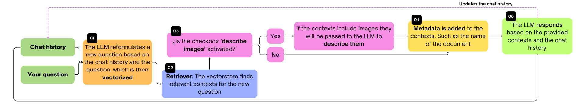

# RAG for mathematical documents
This project aims to create a chatbot based on mathematical documents where you can interact with and ask about exercises, information about a topic, examples, other authors that the documents cite, etc.

The documents have to be in english otherwise it will be needed to change the embedding model to a multilingual one.

# Flow of the RAG

<div style="text-align: center;">
  
</div>

# Results obtained


# How to run it

Keep in mind the structure of the folders
```bash
├── Rag/
│   ├── docs/
│   │   └── divided_pdfs/
│   ├── md/
│   │   └── merged_files/
│   │       └── images/
│   └── prueba/
```
The files inside provide an example without requiring all steps.

Follow these steps to create your own chatbot:

**1.** Clone the repository using git or download everything by yourself:
```bash
    git clone https://github.com/LautaroOchotorena/Rag
    cd Walking-around-the-city
```
**2.** Create a file called "config.json" and put
```
{
	"api_key": "Gemini API KEY",
	"PROJECT_ID": "Project ID Google AI Studio"
}
```
For this project I used Gemini for the LLM and VertexAIEmbeddings for the vectorstore.
To obtain the keys: Create a Google Cloud project, then generate the [Gemini API KEY](https://aistudio.google.com/app/apikey) and [enable the Vertex AI API](https://console.cloud.google.com/flows/enableapi?apiid=aiplatform.googleapis.com).

Don't forget to replace the values in the json file.

Also you need to [Install Google Cloud CLI](https://cloud.google.com/sdk/docs/install-sdk#windows) so follow the steps provided in the link and then run on the terminal

```bash
gcloud auth login
```
to authenticate from a google account.

**3.** Using Conda or Miniconda (on Windows):
```bash
    conda env create -f environment.yaml
```
This will install the environment and the dependencies needed.

An alternative on Linux or Windows after creating your own environment:
```bash
    pip install -r requirements.txt
```

Then activate your environment.

Example in Conda:
```bash
    conda activate rag
```
and follow the [instructions to install pytorch](https://pytorch.org/get-started/locally/) to use **CUDA** if you have a GPU compatible with CUDA (remember to install the CUDA Toolkit compatible to your torch version) or **NO CUDA** if you want to run everything on CPU.

**4.** Put the pdf documents inside the docs folder, acces to [SimpleTex](https://simpletex.net/) (it may ask you to create an account) and use the Online OCR where you need to pass all the documents (one by one) in order to convert them into a markdown file with latex notation. Export them with the images, this will download a folder with the md and a folder with the images.
It can't process more than 500 pages per documents so if you have more than that you can use the [dividir_pdf.py](https://github.com/LautaroOchotorena/Rag/blob/master/dividir_pdf.py) to divide each documents into pieces of at least 500 pages. The pdf outputs will be stored in the divided_pdfs folder.<br>
**Note:** At the moment of writting this SimpleTex doesn't support an api where you can do this efficiently and easily. You can use [Nougat](https://github.com/facebookresearch/nougat?tab=readme-ov-file) instead but it won't process images and you might have to change things in step 7.

**5.** Check your new files: vertical tables and rarely (but it happended to me) some pages are skipped in the convertion.
If this happens you can use [create_pdf.py](https://github.com/LautaroOchotorena/Rag/blob/master/crear_pdf.py) to select a range of pages of a pdf document to be download so it can be processed successfully with SimpleTex. The results should be pasted manually into the correspond md file.

**6.** Put the folders (they are inside the .zip) created by SimpleTex inside the md folder. After that, run [archivos_md.py](https://github.com/LautaroOchotorena/Rag/blob/master/archivos_md.py). to combine the divided documents into a single one and also put all the images of each doc into a single folder. The outputs will be in the merged_files folder.

**7.** Optional but usefull: use [formulas_into_text.py](https://github.com/LautaroOchotorena/Rag/blob/master/formulas_into_text.py) to replace the latex formulas into plain text (in a compacted way). This will helps a lot due to the reduction of characters using a compacted representation instead of the latex formula.

**8.** Create the vectorstore using [md_loader.py](https://github.com/LautaroOchotorena/Rag/blob/master/md_loader.py). It will be stored locally.

**9.** Ready to launch the app:
```bash
    python app.py
```
It will run locally.

## Reduction of characters
The usage of the **step 7** makes a lot of difference. <br>
For example:
<div align="center">

| <h4>Document</h4> | <h4>Number of tokens</h4>  | <h4>Number of characters</h4>
|-----------------------|--------------------|--------------------|
| <h4>**Original**</h4>   | <h4>358,374</h4>  | <h4>976,153</h4>
| <h4>**Compacted version**</h4>| <h4>227,832</h4> | <h4>658,651</h4>

</div>

That implies a reduction of **32.5%** for the number of characters.

This helps with the embedding model that has a limit of tokens per chunk.

Now you can store more data into a chunk.

# Other implementations
It would be much easier to implement [MathPix](https://mathpix.com/) as a [MathPixPDFLoader](https://python.langchain.com/docs/integrations/document_loaders/mathpix/) but unfortunately it is a paid service.