$Calc-Uus$

# Calculus Volume 1

SENIOR CONTRIBUTING AUTHORS

EDWIN "JED" HERMAN, UNIVERSITY OF WISCONSIN-STEVENS POINT GILBERT STRANG, MASSACHUSETTS INSTITUTE OF TECHNOLOGY

### OpenStax

Rice University 6100 Main Street MS-375 Houston, Texas 77005

To learn more about OpenStax, visit https://openstax.org Individual print copies and bulk orders can be purchased through our website.

$①2020$ Rice University. Textbook content produced by OpenStax is licensed under a Creative Commons Attribution Non-Commercial ShareAlike 4.0 International License (CC BY-NC-SA 4.0). Under this license, any user of this textbook or the textbook contents herein can share, remix, and build upon the content for noncommercial purposes only. Any adaptations must be shared under the same type of license. In any case of sharing the original or adapted material, whether in whole or in part, the user must provide proper attribution as follows

-If you noncommercially redistribute this textbook in a digital format (including but not limited to PDF and HTML), then you must retain on every page the following attribution: "Download for free at https://openstax.org/details/books/calculus-volume-1." If you noncommerciallyredistribute this textbookin a print format,then you must include on every physical page the following attribution "Download for free at https://openstax.org/details/books/calculus-volume-1." -If you noncommercially redistribute part of this textbook, then you must retain in every digital format page view (including but not limited to PDF and HTML) and on every physical printed page the following attribution: "Download for free at https://openstax.org/details/books/calculus-volume-1." -If you use this textbook as a bibliographicreference,please include https://openstax.org/details/books/calculus-volume-1 in your citation.

For questions regarding this licensing, please contact support@openstax.org

### Trademarks

The OpenStax name, OpenStax logo, OpenStax book covers, OpenStax CNX name, OpenStax CNX logo, OpenStax Tutor name, Openstax Tutor logo, Connexions name, Connexions logo, Rice University name, and Rice University logo are not subject to the license and may not bereproduced without the prior and express written consent of Rice University.

978-1-938168-02-4978-1-947172-81-4978-1-50669-806-9978-1-947172-13-52016

HARDCOVERBOOKISBN-13 PAPERBACKBOOK ISBN-13 B&WPAPERBACK BOOKISBN-13 DIGITAL VERSION ISBN-13 ORIGINAL PUBLICATION YEAR 96 5 43 2 1

### OPENSTAX

OpenStax provides free, peer-reviewed, openly licensed textbooks for introductory college and Advanced Placement@ courses and low-cost, personalized courseware that helps students learn. A nonprofit ed tech initiativebased at Rice University,we're committed tohelping students access the tools they need to complete their courses and meet their educational goals.

RICE UNIVERSITY

OpenStax, OpenStax CNX, and OpenStax Tutor are initiatives of Rice University. As a leading research university with a distinctive commitment to undergraduate education, Rice University aspires to path-breaking research unsurpassed teaching, and contributions to the betterment of our world.It seeks to fulfll this mission by cultivating a diverse community of learning and discovery that produces leaders across the spectrum of human endeavor

PHILANTHROPIC SUPPORT

OpenStax is grateful for our generous philanthropic partners, who support our vision to improve educational opportunities for all learners.e

Laura and John Arnold Foundatior. Arthur and Carlyse Ciocca Charitable Foundation Ann and John Doerr Bill & Melinda Gates Foundation Girard Foundation Google Inc. The william and Flora Hewlett Foundation Rusty and JohnJaggers The Calvin K. Kazanjian Economics Foundatior Charles Koch Foundation Leon Lowenstein Foundation, Inc.

The Maxfield Foundation Burt and Deedee McMurtry Michelson 20MM Foundation National Science Foundation The Open Society Foundations Jumee Yhu and David E. Park I Brian D.Patterson USA-International Foundation TheBill and Stephanie SickFund Robin and Sandy Stuart Foundation The Stuart Family Foundation. Tammy and Guillermo Trevino

# Study where you want, what you want, when you want.

When you access College Success in our web view, you can use our new online highlighting and note-taking features to create your own study guides.

Our books are free and flexible,forever. Get started at openstax.org/details/books/calculus-volume-1

2

Caicrs

# Table of Contents

### Preface

### Chapter 1:Functions and Graphs 8

1.1 Review of Functions 1.2 Basic Classes of Functions 1.3 Trigonometric Functions 381.4 Inverse Functions 961.5 Exponential and Logarithmic Functions 123

## Chapter 2: Limits 2.1 A Preview of Calculus

1242.2 The Limit of a Function 1352.3 The Limit Laws .1602.4 Continuity .179 .1942.5 ThePrecise Definition of a Limit .213

### Chapter 3: Derivatives

3.1 Defining the Derivative 214 .2323.2 The Derivative as a Function. 3.3 Differentiation Rules .2472663.4 Derivatives as Rates of Change 3.5 Derivatives of Trigonometric Functions .2773.6 The Chain Rule 287 .2993.7 Derivatives of Inverse Functions .3093.8 Implicit Differentiation 3.9 Derivatives of Exponential and Logarithmic Functions .319 Chapter 4: Applications of Derivatives.

### .3414.1 Related Rates

### .342

4.2 Linear Approximations and Differentials. .354 .3664.3 Maxima and Minima 379 4.4 The Mean Value Theorem 3904.5Derivatives and the Shapeofa Graph 4074.6 Limits at Infinity and Asymptotes 4394.7 Applied Optimization Problems 4.8 L'Hopital's Rule. 4544724.9 Newton's Method 4854.10 Antiderivatives

### 507 Chapter 5: Integration 508

5.1 Approximating Areas .5295.2 The Definite Integral

5.3 The Fundamental Theorem of Calculus 5495.4 IntegrationFormulas and the Net Change Theorem 5665845.5 Substitution 595 5.6 Integrals Involving Exponential and Logarithmic Functions 5.7 Integrals Resulting in Inverse Trigonometric Functions .608 .623 Chapter 6: Applications of Integration.

### 6.1 Areas between Curves

.624

6366.2 Determining Volumes by Slicing. 6.3 Volumes of Revolution: Cylindrical Shells .6566.4 Arc Lenqth of a Curve and Surface Area .671 .6856.5 Physical Applications. .7036.6 Moments and Centers of Mass 6.7 Integrals, Exponential Functions, and Logarithms .7216.8 Exponential Growth and Decay .734 .7456.9 Calculus of the Hyperbolic Functions Appendix A: Table of Integrals .. .763

### 769 Appendix B: Table of Derivatives

771 Appendix C: Review of Pre-Calculus

Index 865

$\text{Pressionandentandentandentandentandentandentandentandentandentandentandentandentandentandentandentandentandendentandentandentandentandentandentandentandentandentandentandentandentandentandentandentandendandentandentandentandentandentandentandentandentandentandentandentandentandentandentandentandentandentandentandentandentandentandentandentandentandentandentandentandentandentandentandentandentandentandentandentandentandentandentandentandentandentandentandentandentandentandentandentandentandentandentandentandentandentandentandentandentandentandentandentandentandentandentandentandentandentandentandentandentandentandentandentandentandentandentandentandentandentandentandentandentandentandentandentandentandentandentandentandentandentandentandentandentandentandentandentandentandentandentandentandentandentandentandentandentandentandentandentandentandentandentandentandentandentandentandentandentandentandentandentandentandentandentandentandentandentandentandentandentandentandentandentandentandentandentandentandentan}$

# PREFACE

Welcome to Calculus Volume 1, an OpenStax resource. This textbook was written to increase student access to high-quality learning materials, maintaining highest standards of academic rigor at little to no cost.

# About OpenStax

OpenStax is a nonprofit based at Rice University, and it's our mission to improve student access to education. Our first openly licensed college textbook was published in 2012, and our library has since scaled to over 25 books for college and $AP^{(\mathrm{R)}}$ courses used by hundreds of thousands of students. OpenStax Tutor, our low-cost personalized learming tool, is being used in college courses throughout the country. Through our partnerships with philanthropic foundations and our alliance with other educational resource organizations, OpenStax is breaking down the most common barriers to learning and empowering students and instructors to succeed.

## About OpenStax's resources

### Customization

Calculus Volume 1 is licensed under a Creative Commons Attribution-NonCommercial-ShareAlike 4.0 International (CC BY-NC-SA) license, which means that you can distribute, remix, and build upon the content, as long as you provide attribution to OpenStax and its content contributors, do not use the content for commercial purposes, and distribute the content under the same CC-BY-NC-SA license.

Because our books are openly licensed, you are free to use the entire book or pick and choose the sections that are most relevant to the needs of your course. Feel free to remix the content by assigning your students certain chapters and sections in your syllabus, in the order that you prefer. You can even provide a direct link in your syllabus to the sections in the web view of your book.

Instructors also have the option of creating a customized version of their OpenStax book. The custom version can be made available to students in low-cost print or digital form through their campus bookstore. Visit your book page on OpenStax.org for more information

### Errata

All OpenStax textbooks undergo a rigorous review process. However, like any professional-grade textbook, errors. sometimes occur. Since our books are web based, we can make updates periodically when deemed pedagogically necessary, If you have a correction to suggest, submit it through the link on your book page on OpenStax.org. Subject matter experts review all errata suggestions. OpenStax is committed to remaining transparent about all updates, so you will also find a list of past errata changes on your book page on OpenStax.org

### Format

You can access this textbook for free in web view or PDF through OpenStax.org, and for a low cost in print.

## About Calculus Volume 1

Calculus is designed for the typical two- or three-semester general calculus course, incorporating innovative features to enhance student learning. The book guides students through the core concepts of calculus and helps them understand how those concepts apply to their lives and the world around them. Due to the comprehensive nature of the material, we are offering the book in three volumes for flexibility and efficiency. Volume 1 covers functions, limits, derivatives, and integration

### Coverage and scope

Our Calculus Volume 1 textbook adheres to the scope and sequence of most general calculus courses nationwide. We have worked to make calculus interesting and accessible to students while maintaining the mathematical rigor inherent in the subject. With this objective in mind, the content of the three volumes of Calculus have been developed and arranged to provide a logical progression from fundamental to more advanced concepts, building upon what students have already learned and emphasizing connections between topics and between theory and applications. The goal of each section is to enable students not just to recognize concepts, but work with them in ways that will be useful in later courses and future careers. The organization and pedagogical features were developed and vetted with feedback from mathematics educators dedicated to the project.

### Volume1

Chapter 1: Functions and Graphs Chapter 2: Limits Chapter 3: Derivatives Chapter 4: Applications of Derivatives Chapter 5: Integration Chapter 6: Applications of Integration

### Volume2

Chapter 1: Integration Chapter 2: Applications of Integration Chapter 3: Techniques of Integration Chapter 4: Introduction to Differential Equations Chapter 5: Sequences and Series Chapter 6: Power Series Chapter 7: Parametric Equations and Polar Coordinates

### Volume3

Chapter 1: Parametric Equations and Polar Coordinates Chapter 2: Vectors in Space Chapter 3: Vector-Valued Functions Chapter 4: Differentiation of Functions of Several Variables Chapter 5: Multiple Integration Chapter 6: Vector Calculus Chapter 7: Second-Order Differential Equations

### Pedagogical foundation

Throughout Calculus Volume 1 you will find examples and exercises that present classical ideas and techniques as well as modern applications and methods. Derivations and explanations are based on years of classroom experience on the part of long-time calculus professors, striving for a balance of clarity and rigor that has proven successful with their students. Motivational applications cover important topics in probability, biology, ecology, business, and economics, as well as areas of physics, chemistry, engineering, and computer science. Student Projects in each chapter give students opportunities to explore interesting sidelights in pure and applied mathematics, from determining a safe distance between the grandstand and the track at a Formula One racetrack, to calculating the center of mass of the Grand Canyon Skywalk or the terminal speed of a skydiver. Chapter Opening Applications pose problems that are solved later in the chapter, using the ideas covered in that chapter. Problems include the hydraulic force against the Hoover Dam, and the comparison of relative intensity of two earthquakes. Definitions, Rules, and Theorems are highlighted throughout the text, including over 60 Proofs of theorems.

## Assessments that reinforce key concepts

In-chapter Examples walk students through problems by posing a question, stepping out a solution, and then asking students to practice the skill with a “Checkpoint” question. The book also includes assessments at the end of each chapter so students can apply what they've learned through practice problems. Many exercises are marked with a [T] to indicate they are suitable for solution by technology, including calculators or Computer Algebra Systems (CAS). Answers for selected exercises are available in the Answer Key at the back of the book. The book also includes assessments at the end of each chapter so students can apply what they've learned through practice problems

## Early or late transcendentals

Calculus Volume 1 is designed to accommodate both Early and Late Transcendental approaches to calculus. Exponential and logarithmic functions are introduced informally in Chapter 1 and presented in more rigorous terms in Chapter 6. Differentiation and integration of these functions is covered in Chapters 35 for instructors who want to include them with other types of functions. These discussions, however, are in separate sections that can be skipped for instructors who prefer to wait until the integral definitions are given before teaching the calculus derivations of exponentials and logarithms

### Comprehensive art program

Our art program is designed to enhance students’ understanding of concepts through clear and effective illustrations diagrams, and photographs.

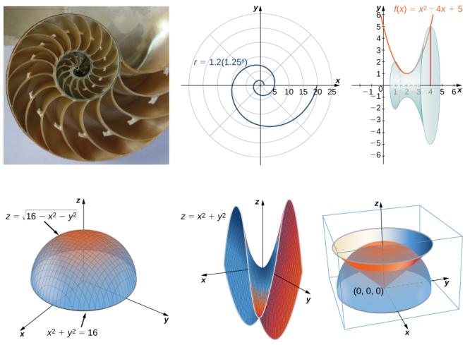

## Additional resources

Student and instructor resources

We've compiled additional resources for both students and instructors, including Getting Started Guides, an instructor solution manual, and PowerPoint slides. Instructor resources require a verified instructor account, which can be requested on your OpenStax.org log-in. Take advantage of these resources to supplement your OpenStax book.

### Community Hubs

OpenStax partners with the Institute for the Study of Knowledge Management in Education (ISKME) to offer Community Hubs on OER Commons a platform for instructors to share community-created resources that support OpenStax books, free of charge. Through our Community Hubs, instructors can upload their own materials or download resources to use in their own courses, including additional ancillaries, teaching material, multimedia, and relevant course content. We encourage instructors to join the hubs for the subjects most relevant to your teaching and research as an opportunity both to enrich your courses and to engage with other faculty.

?To reach the Community Hubs, visit www.oercommons.org/hubs/OpenStax

### Partner resources

OpenStax Partners are our allies in the mission to make high-quality learning materials affordable and accessible to students and instructors everywhere. Their tools integrate seamlessly with our OpenStax titles at a low cost. To access the partner resources for your text, visit your book page on OpenStax.org

# About the authors Senior contributing authors

### Gilbert Strang, Massachusetts Institute of Technology Dr. Strang received his PhD from UCLA in 1959 and has been teaching mathematics at MIT ever since. His Calculus online

textbook is one of eleven that he has published and is the basis from which our final product has been derived and updated for today's student. Strang is a decorated mathematician and past Rhodes Scholar at Oxford University

### Edwin "Jed Herman, University of Wisconsin-Stevens Point Dr. Herman earned a BS in Mathematics from Harvey Mudd College in 1985, an MA in Mathematics from UCLA in

1987, and a PhD in Mathematics from the University of Oregon in 1997. He is currently a Professor at the University of Wisconsin-Stevens Point. He has more than 20 years of experience teaching college mathematics, is a student research mentor, is experienced in course development/design, and is also an avid board game designer and player

### Contributing authors

Catherine Abbott, Keuka College Nicoleta Virginia Bila, Fayetteville State University Sheri J. Boyd, Rollins College Joyati Debnath, Winona State University Valeree Falduto, Palm Beach State College Joseph Lakey, New Mexico State University Julie Levandosky, Framingham State University David McCune, William Jewell College Michelle Merriweather, Bronxville High School Kirsten R. Messer, Colorado State University - Pueblo Alfred K. Mulzet, Florida State College at Jacksonville William Radulovich (retired), Florida State College at Jacksonville. Erica M. Rutter, Arizona State University David Smith, University of the Virgin Islands Elaine A. Terry, Saint Joseph's University David Torain, Hampton University

### Reviewers

Marwan A. Abu-Sawwa, Florida State College at Jacksonville Kenneth J. Bernard, Virginia State University John Beyers, University of Maryland Charles Buehrle, Franklin & Marshall College Matthew Cathey, Wofford College Michael Cohen, Hofstra University William DeSalazar, Broward County School System Murray Eisenberg, University of Massachusetts Amherst Kristyanna Erickson, Cecil College Tiernan Fogarty, Oregon Institute of Technology David French, Tidewater Community College Marilyn Gloyer, Virginia Commonwealth University Shawna Haider, Salt Lake Community College Lance Hemlow, Raritan Valley Community College Jerry Jared, The Blue Ridge School Peter Jipsen, Chapman University David Johnson, Lehigh University M.R. Khadivi, Jackson State University Robert J. Krueger, Concordia University Tor A. Kwembe, Jackson State University Jean-Marie Magnier, Springfield Technical Community College Cheryl Chute Miller, SUNY Potsdam Bagisa Mukherjee, Penn State University, Worthington Scranton Campus Kasso Okoudjou, University of Maryland College Park Peter Olszewski, Penn State Erie, The Behrend College Steven Purtee, Valencia College Alice Ramos, Bethel College

Doug Shaw, University of Northern Iowa Hussain Elalaoui-Talibi, Tuskegee University Jeffrey Taub, Maine Maritime Academy William Thistleton, SUNY Polytechnic Institute A. David Trubatch, Montclair State University Carmen Wright, Jackson State University Zhenbu Zhang, Jackson State University

# 1 | FUNCTIONS AND GRAPHS

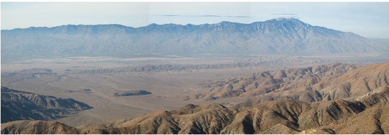
Figure 1.1 A portion of the San Andreas Fault in California. Major faults like this are the sites of most of the strongest

earthquakes ever recorded. (credit: modification of work by Robb Hannawacker, NPS)

## Chapter Outline.

1.1 Review of Functions 1.2 Basic Classes of Functions 1.3 Trigonometric Functions 1.4 Inverse Functions 1.5 Exponential and Logarithmic Functions

## Introduction

In the past few years, major earthquakes have occurred in several countries around the world. In January 2010, an earthquake of magnitude 7.3 hit Haiti.A magnitude 9 earthquake shook northeastern Japan in March 2011. In April 2014, an 8.2-magnitude earthquake struck off the coast of northerm Chile. What do these numbers mean? In particular, how does a magnitude 9 earthquake compare with an earthquake of magnitude 8.2? Or 7.3? Later in this chapter, we show how logarithmic functions are used to compare the relative intensity of two earthquakes based on the magnitude of each earthquake (see Example 1.39).

Calculus is the mathematics that describes changes in functions. In this chapter, we review all the functions necessary to study calculus. We define polynomial, rational, trigonometric, exponential, and logarithmic functions. We review how to evaluate these functions, and we show the properties of their graphs. We provide examples of equations with terms involving these functions and illustrate the algebraic techniques necessary to solve them. In short, this chapter provides the foundation for the material to come. It is essential to be familiar and comfortable with these ideas before proceeding to the formal introduction of calculus in the next chapter

# 1.1 | Review of Functions

# Learning Objectives.

1.1.1Use functional notation to evaluate a function 1.1.2 Determine the domain and range of a function 1.1.3 Draw the graph of a function. 1.1.4 Find the zeros of a function. 1.1.5 Recognize a function from a table of values 1.1.6 Make new functions from two or more given functions. 1.1.7 Describe the symmetry properties of a function.

In this section, we provide a formal definition of a function and examine several ways in which functions are representednamely, through tables, formulas, and graphs. We study formal notation and terms related to functions. We also define composition of functions and symmetry properties. Most of this material will be a review for you, but it serves as a handy reference to remind you of some of the algebraic techniques useful for working with functions

## Functions

Given two sets $A$ and $B$ ,a set with elements that are ordered pairs (x, y), where $x$ is an element of $A$ and $y$ is an element of $B$ ,is a relation from $A$ to $B$ .A relation from $A$ to $B$ defines a relationship between those two sets. A function is a special type of relation in which each element of the first set is related to exactly one element of the second set. The element of the first set is called the input; the element of the second set is called the output. Functions are used all the time in mathematics to describe relationships between two sets. For any function, when we know the input, the output is determined, so we say that the output is a function of the input. For example, the area of a square is determined by its side length, so we say that the area (the output) is a function of its side length (the input). The velocity of a ball thrown in the air can be described as a function of the amount of time the ball is in the air. The cost of mailing a package is a function of the weight of the package. Since functions have so many uses, it is important to have precise definitions and terminology to study them.

## Definition

A function $f$ consists of a set of inputs, a set of outputs, and a rule for assigning each input to exactly one output. The set of inputs is called the domain of the function. The set of outputs is called the range of the function

For example, consider the function $f$ ,where the domain is the set of all real numbers and the rule is to square the input. Then, the input $x=3$ is assigned to the output $3^{2}=9$ .Since every nonnegative real number has a real-value square root, every nonnegative number is an element of the range of this function. Since there is no real number with a square that is negative, the negative real numbers are not elements of the range. We conclude that the range is the set of nonnegative real numbers.

For a general function $f$ with domain $D$ ，we often use $X$ to denote the input and $y$ to denote the output associated with $X$ When doing so, we refer to $X$ as the independent variable and $y$ as the dependent variable, because it depends on $X$ Using function notation, we write $y=f(x)$ , and we read this equation as $“y$ equals $f$ of $A$ ” For the squaring function described earlier, we write $f(x)=x^{2}$

The concept of a function can be visualized using Figure 1.2,Figure 1.3, and Figure 1.4

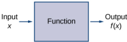

Figure 1.2 A function can be visualized as an input/outpu device.

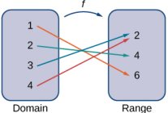

Figure 1.3 A function maps every element in the domain to exactly one element in the range. Although each input can be sent to only one output, two different inputs can be sent to the same output.

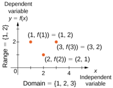
Figure 1.4 In this case, a graph of a function $f$ has a domain

of {1, 2, 3} and a range of {1, 2}. The independent variable is $x$ and the dependent variable is $y$

Visit this applet link (http://www.openstax.org/l/grapherrors) to see more about graphs of functions.

We can also visualize a function by plotting points $(x,y)$ in the coordinate plane where $y=f(x)$ . The graph of a function is the set of all these points. For example, consider the function $f$ ,where the domain is the set $D=\{1,2,3\}$ and the rule is $f(x)=3-x$ . In Figure 1.5, we plot a graph of this function.

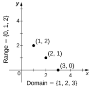
Figure 1.5 Here we see a graph of the function $f$ with

domain {1, 2, 3} and rule $f(x)=3-x$ The graph consists of the points $( x$, $f( x) )$ for all $x$ in the domain

Every function has a domain. However, sometimes a function is described by an equation, as in $f(x)=x^{2}$ ，with no specific domain given. In this case, the domain is taken to be the set of all real numbers $\lambda$ for which $f(x)$ is a real number. For example, since any real number can be squared, if no other domain is specified, we consider the domain of $f(x)=x^{2}$ to be the set of all real numbers. On the other hand, the square root function $f(x)=\sqrt{x}$ only gives a real output if $X$ is nonnegative. Therefore, the domain of the function $f(x)=\sqrt{x}$ is the set of nonnegative real numbers, sometimes called the natural domain

For the functions $f(x)=x^{2}$ and $f(x)=\sqrt{x}$ the domains are sets with an infinite number of elements. Clearly we cannot list all these elements. When describing a set with an infinite number of elements, it is often helpful to use set-builder or interval notation. When using set-builder notation to describe a subset of all real numbers, denoted 84 wewrite

$$|x|xhassomeproperty|.$$

We read this as the set of real numbers $\lambda$ such that X has some property. For example, if we were interested in the set of real numbers that are greater than one but less than five, we could denote this set using set-builder notation by writing

$$\{x|1<x<5\}.$$

A set such as this, which contains all numbers greater than $a$ and less than $b$ ,can also be denoted using the interval notation a.b.Therefore

$$(1,\:5)=|x|1<x<5|.$$

The numbers 1 and 5 are called the endpoints of this set. If we want to consider the set that includes the endpoints, we would denote this set by writing

$$[1,5]=\{x|1\leq x\leq5\}.$$

We can use similar notation if we want to include one of the endpoints, but not the other. To denote the set of nonnegative real numbers,we would use the set-builder notation

$$\{x|0\leq x\}.$$

The smallest number in this set is zero, but this set does not have a largest number. Using interval notation, we would use the symbol $\infty$ ,which refers to positive infinity, and we would write the set as

$$[0,\:\infty)=\{x|0\leq x\}.$$

It is important to note that $\infty$ is not a real number. It is used symbolically here to indicate that this set includes all real numbers greater than or equal to zero. Similarly, if we wanted to describe the set of all nonpositive numbers, we could write

$$(-\infty,\:0]=\{x|x\leq0\}.$$

Here, the notation $-\infty$ refers to negative infinity, and it indicates that we are including all numbers less than or equal to zero, no matter how small. The set

$$(-\infty,\:\infty)=[x|x\:\mathrm{is~any~real~number}]$$

refers to the set of all real numbers.

Some functions are defined using different equations for different parts of their domain. These types of functions are known as piecewise-defined functions. For example, suppose we want to define a function $f$ with a domain that is the set of all real numbers such that $f(x)=3x+1$ for $x\geq2$ and $f(x)=x^{2}$ for $x<2$ . We denote this function by writing

$$f(x)=\begin{cases}3x+1&\quad x\ge2\\x^2&\quad x<2\end{cases}.$$

When evaluating this function for an input $\mathcal{A}.$ the equation to use depends on whether $x\geq2$ or $x<2$ For example, since 5>2 ，we use the fact that $f(x)=3x+1$ for $x\geq2$ and see that $f(5)=3(5)+1=16$ .On the other hand, for $x=-1$ ，we use the fact that $f(x)=x^{2}$ for $x<2$ and see that $f(-1)=1$

## Example 1.1

Evaluating Functions

For the function $f(x)=3x^{2}+2x-1$ ,evaluate

a.f(-2) b.f(v2) C. $f(a+h)$

### Solution

Substitute the given value for $X$ in the formula for $f(x)$

$$\begin{aligned}&.\quad f(-2)=3(-2)^{2}+2(-2)-1=12-4-1=7\\&.\quad f(\sqrt{2})=3(\sqrt{2})^{2}+2\sqrt{2}-1=6+2\sqrt{2}-1=5+2\sqrt{2}\\&f(a+h)=3(a+h)^{2}+2(a+h)-1&&=3\bigl(a^{2}+2ah+h^{2}\bigr)+2a+2h-1\\&&&=3a^{2}+6ah+3h^{2}+2a+2h-1\end{aligned}$$
C

1.1 For $f(x)=x^{2}-3x+5$ . evaluate $f(1)$ and $f(a+h)$

# Example 1.2

## Finding Domain and Range

For each of the following functions, determine the i. domain and i. range.

a. $f(x)=(x-4)^{2}+5$ b. $f(x)=\sqrt{3x+2}-1$ C. $f(x)=\frac{3}{x-2}$

### Solution

a. Consider $f(x)=(x-4)^{2}+5$

i.Since f(x)=(x-4)²+5 is a real number for any real number $X$ the domain of $f$ is the interval $( - \infty$, $\infty )$

i.Since $(x-4)^{2}\geq0$ ,we know $f(x)=(x-4)^{2}+5\geq5$ .Therefore, the range must be a subse of $\forall y|y\geq5|$ .To show that every element in this set is in the range, we need to show that for a given $y$ in that set, there is a real number $X$ such that $f(x)=(x-4)^{2}+5=y$ Solving this equation for $X$ we see that we need $X$ such that

$$(x-4)^2=y-5.$$

This equation is satisfied as long as there exists a real number $X$ such that

$$x-4=\pm\sqrt{y-5}.$$

Since $y\geq5$ ,the square root is well-defined. We conclude that for $x=4\pm\sqrt{y-5}$ ， $f(x)=y$ and therefore the range is $\{y|y\geq5|$

b.Consider $f(x)=\sqrt{3x+2}-1$

i.To find the domain of $f$ ，we need the expression $3x+2\geq0$ .Solving this inequality, we conclude that the domain is $\{x|x\geq-2/3\}$

ii.To find the range of $f$ we note that since $\sqrt{3x+2}\geq0$ $f(x)=\sqrt{3x+2}-1\geq-1$ . Therefore, the range of $f$ must be a subset of the set $\{v|y\geq-1\}$ To show that every element in this set is in the range of $f$ ,we need to show that for all $y$ in this set, there exists a real number $X$ in the domain such that $f(x)=y$ Let $y\geq-1$ .Then, $f(x)=y$ if and only if

$$\sqrt{3x+2}-1=y.$$

Solving this equation for $X$ we see that $X$ must solve the equation

$$\sqrt{3x+2}=y+1.$$

Since $y\geq-1$ ，such an $x$ could exist. Squaring both sides of this equation, we have $3x+2=(y+1)^{2}$ Therefore, we need

$$3x=(y+1)^{2}-2,$$

which implies

$$x=\frac13(y+1)^2-\frac23.$$

We just need to verify that $X$ is in the domain of $f$ . Since the domain of $f$ consists of all real numbers greater than or equal to -2/3 ，and

$$\frac{1}{3}(y+1)^2-\frac{2}{3}\geq-\frac{2}{3},$$

there does exist an $X$ in the domain of $f$ We conclude that the range of $f$ is $|y|y\geq-1|$

c.Consider $f(x)=3/(x-2)$

i.Since $3/(x-2)$ is defined when the denominator is nonzero, the domain is $\{x|x\neq2\}$

ii.To find the range of $f$ ,we need to find the values of $y$ such that there exists a real number $X$ in the domain with the property that

$$\frac{3}{x-2}=y.$$

Solving this equation for $X$ we find that

$$x=\frac{3}{y}+2.$$

Therefore, as long as $y\neq0$ .there exists areal number $x$ in the domain such that $f(x)=y$ Thus, the range is $\{v|y\neq0\}$

1.2 Find the domain and range for $f(x)=\sqrt{4-2x}+5$

# Representing Functions

Typically, a function is represented using one or more of the following tools

·A table ·A graph ·A formula

We can identify a function in each form, but we can also use them together. For instance, we can plot on a graph the values from a table or create a table from a formula.

### Tables

Functions described using a table of values arise frequently in real-world applications. Consider the following simple example. We can describe temperature on a given day as a function of time of day. Suppose we record the temperature every hour for a 24-hour period starting at midnight. We let our input variable $x$ be the time after midnight, measured in hours, and the output variable $y$ be the temperature $X$ hours after midnight, measured in degrees Fahrenheit. We record our data in Table 1.1.

<table>
	<tbody>
		<tr>
			<th>Hours after Midnight</th>
			<th>Temperature $\Xi($॰F)</th>
			<th>Hours after Midnight</th>
			<th>(॰F) Temperature</th>
		</tr>
		<tr>
			<td>0</td>
			<td>58</td>
			<td>12</td>
			<td>84</td>
		</tr>
		<tr>
			<td>1</td>
			<td>54</td>
			<td>13</td>
			<td>85</td>
		</tr>
		<tr>
			<td>2</td>
			<td>53</td>
			<td>14</td>
			<td>85</td>
		</tr>
		<tr>
			<td>3</td>
			<td>52</td>
			<td>15</td>
			<td>83</td>
		</tr>
		<tr>
			<td>4</td>
			<td>52</td>
			<td>16</td>
			<td>82</td>
		</tr>
		<tr>
			<td>5</td>
			<td>55</td>
			<td>17</td>
			<td>80</td>
		</tr>
		<tr>
			<td>6</td>
			<td>60</td>
			<td>18</td>
			<td>77</td>
		</tr>
		<tr>
			<td>7</td>
			<td>64</td>
			<td>19</td>
			<td>74</td>
		</tr>
		<tr>
			<td>8</td>
			<td>72</td>
			<td>20</td>
			<td>69</td>
		</tr>
		<tr>
			<td>9</td>
			<td>75</td>
			<td>21</td>
			<td>65</td>
		</tr>
		<tr>
			<td>10</td>
			<td>78</td>
			<td>22</td>
			<td>60</td>
		</tr>
		<tr>
			<td>111</td>
			<td>80</td>
			<td>23</td>
			<td>58</td>
		</tr>
	</tbody>
</table>
Table 1.1 Temperature as a Function of Time of Day

We can see from the table that temperature is a function of time, and the temperature decreases, then increases, and then decreases again. However, we cannot get a clear picture of the behavior of the function without graphing it

## Graphs

Given a function $f$ described by a table, we can provide a visual picture of the function in the form of a graph. Graphing the temperatures listed in Table 1.1 can give us a better idea of their fluctuation throughout the day. Figure 1.6 shows the plot of the temperature function.

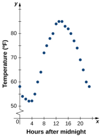
Figure 1.6 The graph of the data from Table 1.1 shows

temperature as a function of time.

From the points plotted on the graph in Figure 1.6, we can visualize the general shape of the graph. It is often useful to connect the dots in the graph, which represent the data from the table. In this example, although we cannot make any definitive conclusion regarding what the temperature was at any time for which the temperature was not recorded, given the number of data points collected and the pattern in these points, it is reasonable to suspect that the temperatures at other times followed a similar pattern, as we can see in Figure 1.7

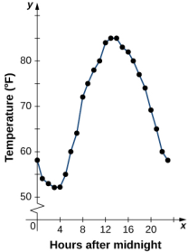
Figure 1.7 Connecting the dots in Figure 1.6 shows the

general pattern of the data

# Algebraic Formulas

Sometimes we are not given the values of a function in table form, rather we are given the values in an explicit formula. Formulas arise in many applications. For example, the area of a circle of radius $r$ is given by the formula $A(r)=\pi r^{2}$ When an object is thrown upward from the ground with an initial velocity $\nu_{0}$ ft/s, its height above the ground from the time it is thrown until it hits the ground is given by the formula $s(t)=-16t^{2}+v_{0}t.$ When $P$ dollars are invested in an account at an annual interest rate $r$ compounded continuously, the amount of money after $t$ years is given by the formula $A(t)=Pe^{m}$ .Algebraic formulas are important tools to calculate function values. Often we also represent these functions visually in graph form

Given an algebraic formula for a function $f$ ，the graph of $f$ is the set of points $( x$, $f( x)$ where $X$ is in the domain of $f$ and $f(x)$ is in the range. To graph a function given by a formula, it is helpful to begin by using the formula to create a table of inputs and outputs. If the domain of $f$ consists of an infinite number of values, we cannot list all of them, but because listing some of the inputs and outputs can be very useful, it is often a good way to begin.

When creating a table of inputs and outputs, we typically check to determine whether zero is an output. Those values of $X$ where $f(x)=0$ are called the zeros of a function. For example, the zeros of $f(x)=x^{2}-4$ are $x=\pm2$ .The zeros determine where the graph of $f$ intersects the $X$ -axis, which gives us more information about the shape of the graph of the function. The graph of a function may never intersect the $X$ -axis, or it may intersect multiple (or even infinitely many) times.

Another point of interest is the $y$ -intercept, if it exists. The $y$ -intercept is given by (0, $f( 0) ) .$

Since a function has exactly one output for each input, the graph of a function can have, at most, one $y$ -intercept. If $x=0$ is in the domain of a function $f$ ，then $f$ has exactly one $y$ -intercept. If $x=0$ is not in the domain of $f$ ，then $f$ has no $y$ -intercept. Similarly, for any real number $C$ ，if $C$ is in the domain of $f$ ，there is exactly one output $f(c)$ ，and the line $x=c$ intersects the graph of $f$ exactly once. On the other hand, if $C$ is not in the domain of $f$ $f(c)$ is not defined and the line $x=c$ does not intersect the graph of $f$ This property is summarized in the vertical line test.

# Rule: Vertical Line Test

Given a function $f$ ,every vertical line that may be drawn intersects the graph of $f$ no more than once. If any vertical line intersects a set of points more than once, the set of points does not represent a function

We can use this test to determine whether a set of plotted points represents the graph of a function (Figure 1.8)

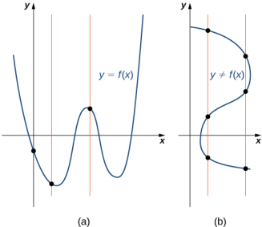
Figure 1.8 (a) The set of plotted points represents the graph of

a function because every vertical line intersects the set of points, at most, once. (b) The set of plotted points does not represent the graph of a function because some vertical lines intersect the set of points more than once.

# Example 1.3

## Finding Zeros and $y$ -Intercepts of a Function

Consider the function $f(x)=-4x+2$

a.Find all zeros of $f$ b.Find the $y$ -intercept (if any). C.Sketch a graph of $f$

### Solution

a.To find the zeros, solve $f(x)=-4x+2=0$ .We discover that $f$ has one zero at $x=1/2$ b.The $y$ -intercept is given by (0, $f(0))=(0,2)$ C.Given that $f$ is a linear function of the form $f(x)=mx+b$ that passes through the points (1/2, 0) and (0, 2), we can sketch the graph of $f$ (Figure 1.9)

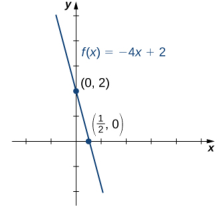
Figure 1.9 The function $f(x)=-4x+2$ is a line with

$x$ -intercept (1/2,0) and $y$ -interceptO,2

# Example 1.4

Using Zeros and $y$ -Intercepts to Sketch a Graph

Consider the function $f(x)=\sqrt{x+3}+1$

a. Find all zeros of $f$ b.Find the $y$ -intercept (if any). C. Sketch a graph of $f$

### Solution

a.To find the zeros, solve $\sqrt{x+3}+1=0$ .This equation implies $\sqrt{x+3}=-1$ .Since $\sqrt{x+3}\geq0$ for all

$X$ ，this equation has no solutions, and therefore $f$ has no zeros b.The $y$ -intercept is given by (0, $f( 0) ) = ( 0$, $\sqrt {3}+ 1)$ C.To graph this function, we make a table of values. Since we need $x+3\geq0$ ,we need to choose values of $x\geq-3$ .We choose values that make the square-root function easy to evaluate.

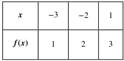

Table 1.2

Making use of the table and knowing that, since the function is a square root, the graph of $f$ should be similar to the graph of $y=\sqrt{x}$ we sketch the graph (Figure 1.10)

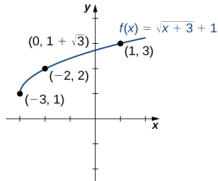
Figure 1.10 The graph of $f(x)=\sqrt{x+3}+1$ has a

y -intercept but no $x$ -intercepts

1.3 Find the zeros of $f(x)=x^{3}-5x^{2}+6x$

# Example 1.5

## Finding the Height of a Free-Falling Object

If a ball is dropped from a height of 100 ft, its height $S$ at time $t$ is given by the function $s(t)=-16t^{2}+100$ where $s$ is measured in feet and $t$ is measured in seconds. The domain is restricted to the interval [0, $c]$ ，where $t=0$ is the time when the ball is dropped and $t=c$ is the time when the ball hits the ground.

a.Create a table showing the height $s(t)$ when $t=0$ ,0.5, 1, 1.5, 2,and 2.5.Using the data from the table, determine the domain for this function. That is, find the time $C$ when the ball hits the ground b.Sketch a graph of $s$

Solution

a.

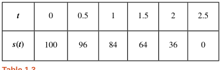

Height $s$ as a Function of Timet

Since the ball hits the ground when $t=2.5$ ，the domain of this function is the interval [O, 2.5].

b.

Note that for this function and the function $f(x)=-4x+2$ graphed in Figure 1.9, the values of $f(x)$ are getting smaller as $X$ is getting larger. A function with this property is said to be decreasing. On the other hand, for the function $f(x)=\sqrt{x+3}+1$ graphed in Figure 1.10, the values of $f(x)$ are getting larger as the values of $X$ are getting larger. A function with this property is said to be increasing. It is important to note, however, that a function can be increasing on some interval or intervals and decreasing over a different interval or intervals.For example, using our temperature function in Figure 1.6, we can see that the function is decreasing on the interval (0, 4), increasing on the interval (4, 14), and then decreasing on the interval (14, 23). We make the idea of a function increasing or decreasing over a particular interval more precise in the next definition.

### Definition

We say that a function $f$ is increasing on the interval $I$ if for all X1 $x_1$ $x_1,x_2\in I$

$$f(x_1)\leq f(x_2)\mathrm{~when~}x_1<x_2.$$

We say $f$ is strictly increasing on the interval $I$ if for all $x_1$ $x_2\in I$

$$f(x_{1})<f(x_{2})\mathrm{~when~}x_{1}<x_{2}.$$

We say that a function $f$ is decreasing on the interval $I$ if for all $x_1,x_2\in I$

$$f(x_1)\geq f(x_2)\:\mathrm{if}\:x_1<x_2.$$

We say that a function $f$ is strictly decreasing on the interval $I$ if for all x1 $x_1$ $x_1,x_2\in I$

$$f(x_1)>f(x_2)\:\mathrm{if}\:x_1<x_2.$$

For example, the function $f(x)=3x$ is increasing on the interval $(-\infty,\infty)$ because $3x_{1}<3x_{2}$ whenever $x_1<x_2$ On the other hand, the function $f(x)=-x^{3}$ is decreasing on the interval $( - \infty$, $\infty )$ because -x²>-x wheneve $x_{1}<x_{2}$ (Figure 1.11).

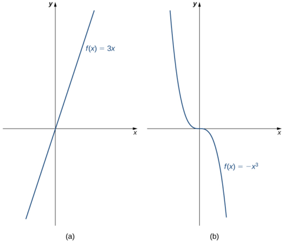
Figure 1.11 (a) The function $f(x)=3x$ is increasing on the interval $( - \infty$, $\infty )$ . (b) The

functiond $f(x)=-x^{3}$ is decreasing on the interval $( - \infty$, $\infty )$

# Combining Functions

Now that we have reviewed the basic characteristics of functions, we can see what happens to these properties when we combine functions in different ways,using basic mathematical operations to create new functions.For example, if the cost for a company to manufacture $X$ items is described by the function $C(x)$ and the revenue created by the sale of $X$ items is described by the function $R(x)$ ,then the profit on the manufacture and sale of $X$ items is defined as $P(x)=R(x)-C(x)$ Using the difference between two functions, we created a new function

Alternatively, we can create a new function by composing two functions. For example, given the functions $f(x)=x^{2}$ and $g(x)=3x+1$ ，the composite function $f\circ g$ is defined such that

$$(f\circ g)(x)=f(g(x))=\left(g(x)\right)^2=\left(3x+1\right)^2.$$

The composite function $g\circ f$ is defined such that

$$(g\circ f)(x)=g(f(x))=3f(x)+1=3x^{2}+1.$$

Note thatthese two newfunctions are different from each other

Combining Functions with Mathematical Operators

To combine functions using mathematical operators, we simply write the functions with the operator and simplify. Given two functions $f$ and $g$ ,we can define four new functions:

$$\begin{aligned}
&(f+g)(x)=f(x)+g(x)&& \text{Sum} \\
&(f-g)(x)=f(x)-g(x)&& \text{Difference} \\
&(f\cdot g)(x)=f(x)g(x)&& Product \\
&{\bigg(}{\frac{f}{g}}{\bigg)}(x)={\frac{f(x)}{g(x)}}{\mathrm{for}}\:g(x)\neq0&& \text{Quotient} 
\end{aligned}$$

## Example 1.6

Combining Functions Using Mathematical Operations

Given the functions $f(x)=2x-3$ and $g(x)=x^{2}-1$ ，find each of the following functions and state its domain.

a. $(f+g)(x)$ b. $(f-g)(x)$ C. $(f\cdot g)(x)$ d. $\left(\frac{f}{g}\right)(x)$

### Solution

a。$(f+g)(x)=(2x-3)+(x^{2}-1)=x^{2}+2x-4$ .The domain of this function is the interval $( - \infty$, $\infty )$ b. $(f-g)(x)=(2x-3)-(x^{2}-1)=-x^{2}+2x-2$ .The domain of this function is the interval $( - \infty$, $\infty )$ c. $(f\cdot g)(x)=(2x-3)(x^{2}-1)=2x^{3}-3x^{2}-2x+3$ .The domain of this function is the interval $( - \infty$, $\infty )$ d $\left(\frac{f}{g}\right)(x)=\frac{2x-3}{x^{2}-1}.$ The domain of ths funtio is $\{x|x\neq\pm1\}$

1.4For $f(x)=x^{2}+3$ and $g(x)=2x-5$ ，find $(f/g)(x)$ and state its domain

?

### Function Composition

When we compose functions, we take a function of a function. For example, suppose the temperature $T$ on a given day is described as a function of time $t$ (measured in hours after midnight) as in Table 1.1. Suppose the cost $C$ ，to heat or cool a building for 1 hour, can be described as a function of the temperature $T$ .Combining these two functions, we can describe

the cost of heating or cooling a building as a function of time by evaluating $C(T(t)).$ We have defined a new function, denoted $C\bullet T$ which is defined such that $(C\bullet T)(t)=C(T(t))$ for all $t$ in the domain of $T$ This new function is called a composite function. We note that since cost is a function of temperature and temperature is a function of time, it makes sense to define this new function $(C\circ T)(t)$ .It does not make sense to consider $(T\circ C)(t)$ ,because temperature is not a function of cost.

### Definition

Consider the function $f$ with domain $A$ and range $B$ ，and the function $g$ with domain $D$ and range $E$ .If $B$ is a subset of $D$ then the composite function $(g\circ f)(x)$ is the function with domain $A$ such that

$$|g\circ f|(x)=g(f(x)).$$

A composite function $g\circ f$ Can be viewed in two steps.First, the function $f$ maps each input $X$ in the domain of $f$ to its output $f(x)$ in the range of $f$ .Second, since the range of $f$ is a subset of the domain of $g$ ，the output $f(x)$ is an element in the domain of $g$ ，and therefore it is mapped to an output $g(f(x))$ in the range of $g$ . In Figure 1.12, we see a visual image of a composite function.

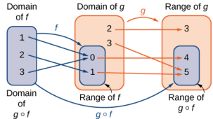
Figure 1.12For the composite function $g\circ f$ ，wehave

$$(g\circ f)(1)=4,\:(g\circ f)(2)=5,\:\mathrm{and}\:(g\circ f)(3)=4.$$

# Example 1.7

Compositions of Functions Defined by Formulas

Consider the functions $f(x)=x^{2}+1$ and $g(x)=1/x$

a.Find $(g\circ f)(x)$ and state its domain and range. b. Evaluate $(g\circ f)(4),(g\circ f)(-1/2)$ C.Find $(f\circ g)(x)$ and state its domain and range. d.Evaluatefg4fg-1/2

### Solution

a.We can find the formula for $(g\circ f)(x)$ in two different ways. We could write

$$(g\circ f)(x)=g(f(x))=g(x^2+1)=\frac{1}{x^2+1}.$$

Alternatively, we could write

$$(g\circ f)(x)=g(f(x))=\frac{1}{f(x)}=\frac{1}{x^{2}+1}.$$

Since $x^{2}+1\neq0$ for all real numbers $X$ ，the domain of $(g\circ f)(x)$ is the set of all real numbers. Since $0<1/(x^{2}+1)\leq1$ ，the range is, at most, the interval (0, 1]. To show that the range is this entire interval, we let $y=1/(x^{2}+1)$ and solve this equation for $x$ to show that for all $y$ in the interval (0. 1], there exists a real number $X$ such that $y=1/(x^{2}+1)$ . Solving this equation for $X$ ，we see that $x^{2}+1=1/y$ which implies that

$$x=\pm\sqrt{\frac{1}{y}-1}.$$

If $y$ is in the interval (O, 1], the expression under the radical is nonnegative, and therefore there exists a real number $X$ such that $1/(x^{2}+1)=y$ We conclude that the range of $g\circ f$ is the interval (0, 1]

$$\begin{aligned}&(g\circ f)(4)=g(f(4))=g(4^{2}+1)=g(17)=\frac{1}{17}\\&(g\circ f)\Big(-\frac{1}{2}\Big)=g\Big(f\Big(-\frac{1}{2}\Big)\Big)=g\Big(\Big(-\frac{1}{2}\Big)^{2}+1\Big)=g\Big(\frac{5}{4}\Big)=\frac{4}{5}\end{aligned}$$

c. We can find a formula for $(f\circ g)(x)$ in two ways. First, we could write

$$(f\circ g)(x)=f(g(x))=f\biggl(\frac{1}{x}\biggr)=\biggl(\frac{1}{x}\biggr)^{2}+1.$$

Alternatively, we could write

$$(f\circ g)(x)=f(g(x))=(g(x))^2+1=\left(\frac{1}{x}\right)^2+1.$$

The domain of $f\circ g$ is the set of allreal numbers X such that $x\neq0$ .To find the range of $f$ we need to find all values $y$ for which there exists a real number $x\neq0$ such that

$$\begin{pmatrix}\frac{1}{x}\end{pmatrix}^2+1=y.$$

Solving this equation for X we see that we need $X$ to satisfy

$$\begin{pmatrix}\frac{1}{x}\end{pmatrix}^2=y-1,$$

which simplifies to

$$\frac{1}{x}=\pm\sqrt{y-1}.$$

Finally, we obtain

$$x=\:\pm\frac{1}{\sqrt{y-1}}.$$

Since $1/\sqrt{y-1}$ is a real number if and only if $y>1$ ，the range of $f$ is the set $|y|y>1)$

$$\begin{aligned}
&(f\circ g)(4)=f(g(4))=f\biggl(\frac{1}{4}\biggr)=\biggl(\frac{1}{4}\biggr)^{2}+1=\frac{17}{16} \\
&(f\circ g)\Big(-\frac{1}{2}\Big)=f\Big(g\Big(-\frac{1}{2}\Big)\Big)=f(-2)=\left(-2\right)^{2}+1=5
\end{aligned}$$

In Example 1.7, we can see that $(f\circ g)(x)\neq(g\circ f)(x)$ .This tells us, in general terms, that the order in which we compose functions matters.

1.5 Let $f(x)=2-5x$ Let $g(x)=\sqrt{x}$ Find $(f\circ g)(x)$

# Example 1.8

Composition of Functions Defined by Tables

Consider the functions $f$ and $g$ described by Table 1.4 and Table 1.5.

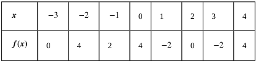

Table 1.4

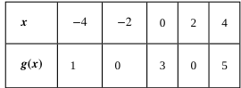

Table 1.5

a.Evaluate $(g\circ f)(3)$ $(g\circ f)(0)$ b. State the domain and range of $(g\circ f)(x)$ c. Evaluate $( f\circ f) ( 3)$, $( f\circ f) ( 1)$ (f =f(1) $(f\circ f)(1)$ d. State the domain and range of $(f\circ f)(x)$

### Solution

$$\begin{aligned}&(g\circ f)(3)=g(f(3))=g(-2)=0\\&(g\circ f)(0)=g(4)=5\end{aligned}$$
b.The domain of $g\circ f$ is the set $\{-3,-2,-1,0,1,2,3,4\}$ .Since the range of $f$ is the set $\{ - 2$, 0, 2, $4\}$ ， the range of $g\circ f$ is the set $\{0$ ,3,5}
$$(f\circ f)(3)=f(f(3))=f(-2)=4\\(f\circ f)(1)=f(f(1))=f(-2)=4$$
d.The domain of $f\circ f$ is the set $\{ - 3, - 2, - 1$, 0, 1, 2, 3, $4\}$ .Since the range of $f$ is the set $\{ - 2$, 0, 2, $4\}$ ，the range of $f\circ f$ is the set {0, 4}

## Example 1.9

Application Involving a Composite Function

A store is advertising a sale of $20\%$ off all merchandise.Caroline has a coupon that entitles her to an additional $15\%$ off any item, including sale merchandise. If Caroline decides to purchase an item with an original price of $x$ dollars, how much will she end up paying if she applies her coupon to the sale price? Solve this problem by using a composite function.

### Solution

Since the sale price is $20\%$ off the original price, if an item is $X$ dollars, its sale price is given by $f(x)=0.80x$ Since the coupon entitles an individual to $15\%$ off the price of any item, if an item is $y$ dollars, the price, after applying the coupon, is given by $g(y)=0.85y$ . Therefore, if the price is originally $X$ dollars, its sale price wil be $f(x)=0.80x$ and then its final price after the coupon will be $g(f(x))=0.85(0.80x)=0.68x$

1.6 If items are on sale for $10\%$ off their original price, and a customer has a coupon for an additional $30\%$ off, what will be the final price for an item that is originally $x$ dollars, after applying the coupon to the sale price?

# Symmetry of Functions

The graphs of certain functions have symmetry properties that help us understand the function and the shape of its graph For example, consider the function $f(x)=x^{4}-2x^{2}-3$ shown in Figure 1.13(a). If we take the part of the curve that lies to the right of the y-axis and flip it over the y-axis, it lays exactly on top of the curve to the left of the y-axis. In this Case, we say the function has symmetry about the y-axis. On the other hand, consider the function $f(x)=x^{3}-4x$ shown in Figure 1.13(b). If we take the graph and rotate it $180^{\circ}$ about the origin, the new graph will look exactly the same. In this case, we say the function has symmetry about the origin.

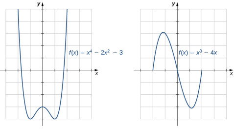
(b) Symmetry about the origin a Symmetry about the y-axis

Figure 1.13 (a) A graph that is symmetric about the $y$ -axis. (b) A graph that is symmetric about the origin.

If we are given the graph of a function, it is easy to see whether the graph has one of these symmetry properties. But without a graph, how can we determine algebraically whether a function $f$ has symmetry? Looking at Figure 1.14 again, we see that since $f$ is symmetric about the $y$ -axis, if the point $(x,y)$ is on the graph, the point $( - x$, $y)$ is on the graph. In other words, $f(-x)=f(x)$ .If a function $f$ has this property, we say $f$ is an even function, which has symmetry about the y-axis. For example, $f(x)=x^{2}$ is even because

$$f(-x)=(-x)^2=x^2=f(x).$$

In contrast, looking at Figure 1.14 again, if a function $f$ is symmetric about the origin, then whenever the point $(x,y)$ is on the graph, the point $(-x,-y)$ is also on the graph. In other words, $f(-x)=-f(x)$ .If $f$ has this property, we say $f$ is an odd function, which has symmetry about the origin. For example, $f(x)=x^{3}$ is odd because

$$f(-x)=(-x)^3=-x^3=-f(x).$$

### Definition

If $f(x)=f(-x)$ for all $X$ in the domain of $f$ ，then $f$ is an even function. An even function is symmetric about the y-axis.

If $f(-x)=-f(x)$ for all $x$ in the domain of $f$ ，then $f$ is an odd function. An odd function is symmetric about the origin.

# Example 1.10

### Even and Odd Functions

Determine whether each of the following functions is even, odd,or neither.

$$f(x)=-5x^4+7x^2-2$$

$$\begin{aligned}&\mathrm{b.}\quad f(x)=2x^{5}-4x+5\\&\mathrm{c.}\quad f(x)=\frac{3x}{x^{2}+1}\end{aligned}$$

### Solution

To determine whether a function is even or odd, we evaluate $f(-x)$ and compare it to $f(x)$ and $-f(x)$

a. $f(-x)=-5(-x)^{4}+7(-x)^{2}-2=-5x^{4}+7x^{2}-2=f(x)$ .Therefore, $f$ is even b. $f( - x) = 2( - x) ^{5}- 4( - x) + 5= - 2x^{5}+ 4x+ 5.$ Now, $f( - x) \neq f( x) .$ F f-x)f(x) $f(-x)\neq f(x)$ urthermore,notingtha $-f(x)=-2x^{5}+4x-5$ ，we see that $f(-x)\neq-f(x)$ . Therefore, $f$ is neither even nor odd C. $f(-x)=3(-x)/((-x)^{2}+1)=-3x/(x^{2}+1)=-[3x/(x^{2}+1)]=-f(x)$ .Therefore, $f$ is odd

1.7Determine whether $f(x)=4x^{3}-5x$ is even, odd, or neither

One symmetric function that arises frequently is the absolute value function, written as $|x|$ .The absolute value function is defined as

$$f(x)=\begin{cases}-x,\:x<0\\\:x,\:x\ge0\end{cases}.$$

Some students describe this function by stating that it “makes everything positive." By the definition of the absolute value function, we see that if $x<0$ ，then $|x|=-x>0$ ，and if $x>0$ then $|x|=x>0$ .However, for $x=0$ ， $|x|=0$ Therefore, it is more accurate to say that for all nonzero inputs, the output is positive, but if $x=0$ ，the output $|x|=0$ .We conclude that the range of the absolute value function is $\{v|y\geq0\}$ .In Figure 1.14, we see that the absolute value function is symmetric about the y-axis and is therefore an even function

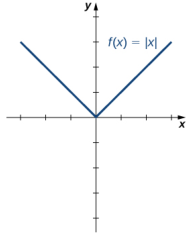
Figure 1.14 The graph of $f(x)=|x|$ is symmetric about the

$y$ -axis.

# Example 1.11

### Working with the Absolute Value Function

Find the domain and range of the function $f(x)=2|x-3|+4$

### Solution

Since the absolute value function is defined for all real numbers, the domain of this function is $(-\infty,\infty)$ .Since $|x-3|\geq0$ for all $X$ ，the function $f(x)=2|x-3|+4\geq4$ Therefore, the range is, at most, the set $|y|y\geq4$ To see that the range is, in fact, this whole set, we need to show that for $y\geq4$ there exists a real number $X$ such that

$$2|x-3|+4=y.$$

A real number $X$ satisfies this equation as long as

$$|x-3|=\frac{1}{2}(y-4).$$

Since $y\geq4$ ，we know $y-4\geq0$ , and thus the right-hand side of the equation is nonnegative, so it is possible that there is a solution. Furthermore,

$$|x-3|=\begin{cases}-(x-3)&\text{if}x<3\\x-3&\text{if}x\ge3\end{cases}.$$

Therefore, we see there are two solutions:

$$x=\pm\frac{1}{2}(y-4)+3.$$

The range of this function is $\{y|y\geq4\}$

1.8 For the function $f(x)=|x+2|-4$ ,find the domain and range

# 1.1 EXERCISES

For the following exercises, (a) determine the domain and the range of each relation, and (b) state whether the relation is a function.

1.

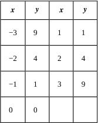

2.

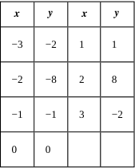

3.

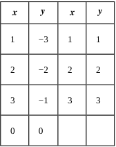

4.

<table>
	<tbody>
		<tr>
			<th>$x$</th>
			<th>$y$</th>
			<th>$x$</th>
			<th>$y$</th>
		</tr>
		<tr>
			<td>1</td>
			<td>1</td>
			<td>5</td>
			<td>1</td>
		</tr>
		<tr>
			<td>2</td>
			<td>1</td>
			<td>6</td>
			<td>1</td>
		</tr>
		<tr>
			<td>3</td>
			<td>1</td>
			<td>7</td>
			<td>1</td>
		</tr>
		<tr>
			<td> </td>
			<td>1</td>
			<td> </td>
			<td> </td>
		</tr>
	</tbody>
</table>

5.

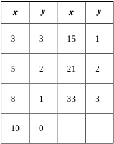

6.

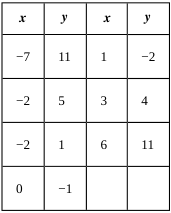

For the following exercises, find the values for each function, if they exist, then simplify.

a. $f(0)$ b. $f(1)$ C. $f(3)$ d. $f(-x)$ e. $f(a)$ f $f(a+h)$

7. $f(x)=5x-2$

8. $f(x)=4x^{2}-3x+1$ 9. $f(x)=\frac{2}{x}$ 10. $f(x)=|x-7|+8$ 11. $f(x)=\sqrt{6x+5}$ 12. $f(x)=\frac{x-2}{3x+7}$ 13. $f(x)=9$

For the following exercises, find the domain, range, and all zeros/intercepts, if any, of the functions.

14. f(x)=1615. $g(x)=\sqrt{8x-1}$ 16. $h(x)=\frac{3}{x^{2}+4}$ 17. $f(x)=-1+\sqrt{x+2}$ 18. $f(x)=\frac{1}{\sqrt{x-9}}$ 19. $g(x)=\frac{3}{x-4}$ 20. $f(x)=4|x+5|$ 21. $g(x)=\sqrt{\frac{7}{x-5}}$

For the following exercises, set up a table to sketch the graph of each function using the following values: x=3 $x=-3$ $x=-3,-2,-1,0,1,2,3$

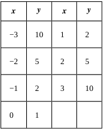

23. $f(x)=3x-6$

<table>
	<tbody>
		<tr>
			<th>$x$</th>
			<th>$y$</th>
			<th>$x$</th>
			<th>$y$</th>
		</tr>
		<tr>
			<td>-3</td>
			<td>-15</td>
			<td>1</td>
			<td>-3</td>
		</tr>
		<tr>
			<td>-2</td>
			<td>-12</td>
			<td>2</td>
			<td>0</td>
		</tr>
		<tr>
			<td>-1</td>
			<td>-9</td>
			<td>3</td>
			<td>3</td>
		</tr>
		<tr>
			<td> </td>
			<td>$\angle C$</td>
			<td> </td>
			<td> </td>
		</tr>
	</tbody>
</table>

$$f(x)=\frac{1}{2}x+1$$

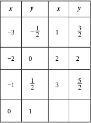

25. $f(x)=2|x|$

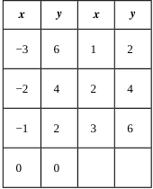

26. $f(x)=-x^{2}$

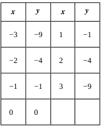

27. $f(x)=x^{3}$

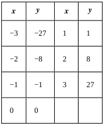

For the following exercises, use the vertical line test to determine whether each of the given graphs represents a function. Assume that a graph continues at both ends if it extendsbeyond the given grid.If thegraphrepresents a function, then determine the following for each graph

a.Domain and range b. $x$ -intercept, if any (estimate where necessary) C. $y$ -Intercept, if any (estimate where necessary) d.The intervals for which the function is increasing e.The intervals for which the function is decreasing f.The interyals for which the function is constant g.Symmetry about any axis and/or the origin h.Whether the function is even, odd, or neither

28.

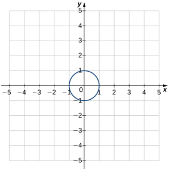

29.
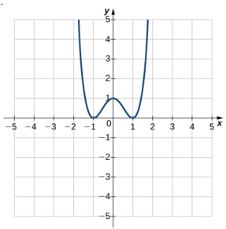

30.
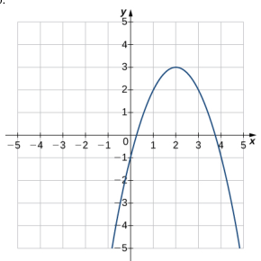

31.
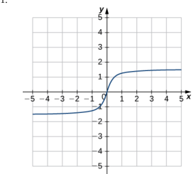

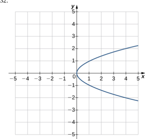

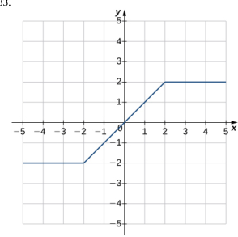

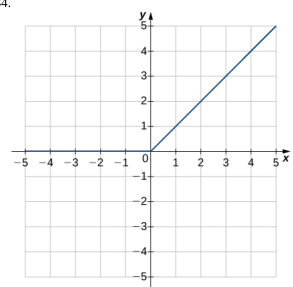

For the following exercises,for each pair of functions,find a. $f+g$ b. $f-g$ c. $f\cdot g$ d. $f/g$ . Determine the domain of each of these new functions.

36. $f(x)=3x+4$ $g(x)=x-2$ 37. f(x) = x - 8 $f(x)=x-8$ $f( x) = x- 8$, $g( x) = 5x^{2}$ g(x) = 5.x2 $g(x)=5x^{2}$ 38. $f(x)=3x^{2}+4x+1$ , g(x) =x+ 139. $f(x)=9-x^{2}$ ，g（x) = x²-2x- 340. $f( x) = \sqrt {x}$, $g( x) = x- 2$ 41. $f( x) = 6+ \frac 1x$, $g( x) = \frac 1x$

For the following exercises,for each pair of functions.find

a $(f\circ g)(x)$ and b. $(g\circ f)(x)$ Simplify the results. Find the domain of each of the results.

42. $f(x)=3x$ $f(x)=3x$ $f( x) = 3x$, $g( x) = x+ 5$ 43. $f(x)=x+4$ ,g（x)= 4x -144. f(x) = 2x + 4 $f(x)=2x+4$ $f( x) = 2x+ 4$, $g( x) = x^{2}- 2$ 45. $f( x) = x^{2}+ 7$, $g( x) = x^{2}- 3$ 46. $f(x)=\sqrt{x}$ ， $g(x)=x+9$ 47. $f( x) = \frac 3{2x+ 1}$, $g( x) = \frac 2x$ 48. $f(x)=|x+1|$ $g(x)=x^{2}+x-4$

49.The table below lists the NBA championship winners for the vears 2001 to 2012

<table>
	<tbody>
		<tr>
			<th>Year</th>
			<th>Winner</th>
		</tr>
		<tr>
			<td>2001</td>
			<td>LA Lakers</td>
		</tr>
		<tr>
			<td>2002</td>
			<td>LA Lakers</td>
		</tr>
		<tr>
			<td>2003</td>
			<td>San Antonio Spurs</td>
		</tr>
		<tr>
			<td>2004</td>
			<td>Detroit Pistons</td>
		</tr>
		<tr>
			<td>2005</td>
			<td>San Antonio Spurs</td>
		</tr>
		<tr>
			<td>2006</td>
			<td>Miami Heat</td>
		</tr>
		<tr>
			<td>2007</td>
			<td>San Antonio Spurs</td>
		</tr>
		<tr>
			<td>2008</td>
			<td>Boston Celtics</td>
		</tr>
		<tr>
			<td>2009</td>
			<td>LA Lakers</td>
		</tr>
		<tr>
			<td>2010</td>
			<td>LA Lakers</td>
		</tr>
		<tr>
			<td>2011</td>
			<td>Dallas Mavericks</td>
		</tr>
		<tr>
			<td>2012</td>
			<td>Miami Heat</td>
		</tr>
	</tbody>
</table>

a.Consider the relation in which the domain values are the years 2001 to 2012 and the range is the corresponding winner. Is this relation a function? Explain why or why not. b.Consider the relation where the domain values are the winners and the range is the corresponding years. Is this relation a function?Explain why or why not.

50. [T] The area $A$ of a square depends on the length of the side $s$

a.Write a function $A(s)$ for the area of a square b. Find and interpret $A(6.5)$ C.Find the exact and the two-significant-digit approximation to the length of the sides of a square with area 56 square units.

51. [T] The volume of a cube depends on the length of the sides 5

a.Write a function $V(s)$ for the volume of a cube. b.Find and interpret V(11.8)

52.[T]A rental car company rents cars for a flat fee of $\$20$ and an hourly charge of \$10.25. Therefore, the total cost $C$ to rent a car is a function of the hours $t$ the car is rented plus the flat fee. a.Write the formula for the function that models this

situation. b.Find the total cost to rent a car for 2 days and 7 hours. C.Determine how long the car was rented if the bill is \$432.73.

53. [T] A vehicle has a 20-gal tank and gets 15 mpg The number of miles $N$ that can be driven depends on the amount of gas $x$ in the tank. a.Write a formula that models this situation.

b.Determine the number of miles the vehicle can travel on (i) a full tank of gas and (ii) 3/4 of a tank of gas. C.Determine the domain and range of the function d.Determine how many times the driver had to stop for gas if she has driven a total of $578mi$

54.[T] The volume V of a sphere depends on the length of its radius as $V=(4/3)\pi r^{3}$ .Because Earth is not a perfect sphere, we can use the mean radius when measuring from the center to its surface. The mean radius is the average distance from the physical center to the surface, based on a large number of samples. Find the volume of Earth with mean radius $6.371\times10^{6}$m

55. [T] A certain bacterium grows in culture in a circular region. The radius of the circle, measured in centimeters, is given by $r(t)=6-\left[5/\left(t^{2}+1\right)\right].$ where t is time measured in hours since a circle of a $1-cm$ radius of the bacterium was put into the culture. a.Express the area of the bacteria as a function of

time. b.Find the exact and approximate area of the bacterial culture in 3 hours. C.Express the circumference of the bacteria as a function of time. d.Find the exact and approximate circumference of the bacteria in 3 hours.

56.[T] An American tourist visits Paris and must convert U.S. dollars to Euros, which can be done using the function $E(x)=0.79x$ ，where $x$ is the number of U.S. dollars and $E(x)$ is the equivalent number of Euros. Since conversion rates fluctuate, when the tourist returns to the United States 2 weeks later, the conversion from Euros to U.S. dollars is $D(x)=1.245x$ where $x$ is the number of Euros and $D(x)$ is the equivalent number of U.S. dollars.

a.Find the composite function that converts directly from U.S.dollars to U.S. dollars via Euros. Did this tourist lose value in the conversion process? b.Use (a) to determine how many U.S. dollars the tourist would get back at the end of her trip if she converted an extra S200 when she arrived in Paris.

57. [T] The manager at a skateboard shop pays his workers a monthly salary $S$ of $\$750$ plus a commission of $S8.50$ for each skateboard they sell

a.Write a function $y=S(x)$ that models a worker's monthly salary based on the number of skateboards $x$ he or she sells. b.Find the approximate monthly salary when a worker sells 25, 40, or 55 skateboards C.Use the INTERSECT feature on a graphing calculator to determine the number of skateboards that must be sold for a worker to earn a monthly income of $\$1400$ (Hint:Find the intersection of the function and the line $y=1400$ ）

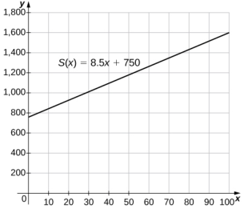

58.[T] Use a graphing calculator to graph the half-circle $y=\sqrt{25-(x-4)^{2}}$ Tote $x$ Cc $y$ NTERCEP ei

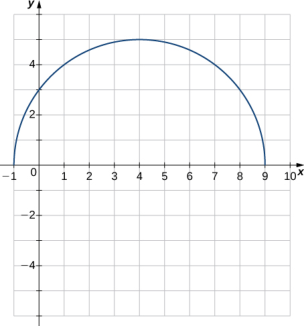

# 1.2 | Basic Classes of Functions.

# Learning Objectives

1.2.1 Calculate the slope of alinear function and interpret its meaning 1.2.2 Recognize the degree of a polynomial 1.2.3 Find the roots of a quadratic polynomial.. 1.2.4Describe the graphs of basicodd and even polynomial functions. 1.2.5 Identify a rational function.. 1.2.6 Describe the graphs of power and root functions 1.2.7 Explain the difference between algebraic and transcendental functions. 1.2.8 Graph a piecewise-defined function 1.2.9 Sketch the graph of a function that has been shifted, stretched,or reflected from its initial graph position.

We have studied the general characteristics of functions, so now let's examine some specific classes of functions. We begin by reviewing the basic properties of linear and quadratic functions, and then generalize to include higher-degree polynomials. By combining root functions with polynomials, we can define general algebraic functions and distinguish them from the transcendental functions we examine later in this chapter. We finish the section with examples of piecewise defined functions and take a look at how to sketch the graph of a function that has been shifted, stretched, or reflected from its initial form.

# Linear Functions and Slope.

The easiest type of function to consider is a linear function. Linear functions have the form $f(x)=ax+b$ ，where $a$ and $b$ are constants. In Figure 1.15, we see examples of linear functions when $u$ is positive, negative, and zero. Note that if $a>0$ ,the graph of the line rises as $X$ increases. In other words, $f(x)=ax+b$ is increasing on $(-\infty,\infty)$ .If $a<0$ the graph of the line falls as $X$ increases. In this case, $f(x)=ax+b$ is decreasing on $(-\infty,\infty)$ .If $a=0$ ，the line is horizontal.

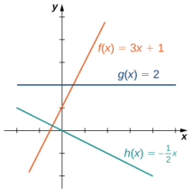
Figure 1.15 These linear functions are increasing or

decreasing on $(\infty,\infty)$ and one function is a horizontal line.

As suggested by Figure 1.15, the graph of any linear function is a line. One of the distinguishing features of a line is its slope. The slope is the change in $y$ for each unit change in $x.$ The slope measures both the steepness and the direction of a line. If the slope is positive, the line points upward when moving from left to right. If the slope is negative, the line points downward when moving from left to right. If the slope is zero, the line is horizontal. To calculate the slope of a line, we need to determine the ratio of the change in $y$ versus the change in $x$ . To do so, we choose any two points $(x_1,y_1)$ and

$(x_2,y_2)$ on the line and calculate $\frac{y_{2}-y_{1}}{x_{2}-x_{1}}.$ In Figure 1.16, we see this ratio is independent o the points chosen

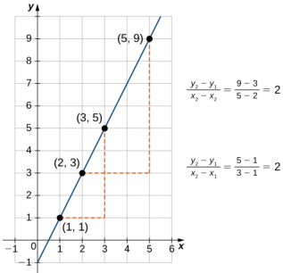
Figure 1.16 For any linear function, the slope

$(y_{2}-y_{1})/(x_{2}-x_{1})$ is independent of thechoice of points $(x_1,y_1)$ and $(x_2,y_2)$ on the line.

### Definition

Consider line $L$ passing through points $(x_1,y_1)$ and $(x_2,y_2)$ .Let $\Delta y=y_{2}-y_{1}$ and $\Delta x=x_{2}-x_{1}$ denote the changes in $y$ and $x$ respectively. The slope of the line is

$$m=\frac{y_{2}-y_{1}}{x_{2}-x_{1}}=\frac{\Delta y}{\Delta x}.$$

We now examine the relationship between slope and the formula for a linear function. Consider the linear function given by the formula $f(x)=ax+b$ .As discussed earlier, we know the graph of a linear function is given by a line. We can use our definition of slope to calculate the slope of this line. As shown, we can determine the slope by calculating $(y_{2}-y_{1})/(x_{2}-x_{1})$ for any points $(x_1,y_1)$ and $(x_2,y_2)$ on the line. Evaluating the function $f$ at $x=0$ ，we see that $(0,b)$ is a point on this line. Evaluating this function at $x=1$ ，we see that (1, $a+ b)$ is also a point on this line. Therefore, the slope of this line is

$$\frac{(a+b)-b}{1-0}=a.$$

We have shown that the coefficient $a$ is the slope of the line. We can conclude that the formula $f(x)=ax+b$ describes a line with slope $li$ . Furthermore, because this line intersects the $y$ -axis at the point $(0,b)$ ，we see that the $y$ -intercept for this linear function is $(0,b)$ .We conclude that the formula $f(x)=ax+b$ tells us the slope, $a$ ，and the $y$ -intercept, (0, b), for this line. Since we often use the symbol 777 to denote the slope of a line, we can write

$$f(x)=mx+b$$

to denote the slope-intercept form of a linear function.

Sometimes it is convenient to express a linear function in different ways. For example, suppose the graph of a linear function passes through the point $(x_1,y_1)$ and the slope of the line is 771 .Since any other point $( x$, $f( x) )$ on the graph of $f$ must satisfy the equation

$$m=\frac{f(x)-y_1}{x-x_1},$$

this linear function canbe expressed by writing

$$f(x)-y_1=m(x-x_1).$$

We call thiseauation the point-slope equation for thatlinear function

Since every nonvertical line is the graph of a linear function, the points on a nonvertical line can be described using the slope-intercept or point-slope equations. However, a vertical line does not represent the graph of a function and cannot be expressed in either of these forms. Instead, a vertical line is described by the equation $x=k$ for some constant $k$ .Since neither the slope-intercept form nor the point-slope form allows for vertical lines. we use the notation

$$ax+by=c,$$

where a, $b$ are both not zero, to denote the standard form of a line.

### Definition

Consider a line passing through the point $(x_1,y_1)$ with slope $m$ . The equation

$$y-y_1=m(x-x_1)$$

is the point-slope equation for that line.

Consider a line with slope $m$ and $y$ -intercept $(0,b)$ .The equatior

$$y=mx+b$$

is an equation for that line in slope-intercept form

The standard form of a line isgiven by the equation

$$ax+by=c,$$

where a and $b$ are both not zero.This form ismore general because it allows for a vertical line, $x=k$

# Example 1.12

Finding the Slope and Equations of Lines

Consider the line passing through the points (11, 4) and (4, 5),as shown in Figure 1.17

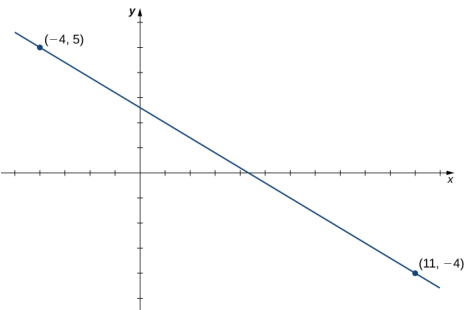
Figure 1.17 Finding the equation of a linear function with a graph that is a line between

two given points.

a.Find the slope of the line.

b.Find an equation for this linear function in point-slope form C.Find an equation for this linear function in slope-intercept form.

### Solution

a.The slope of the line is

$$m=\frac{y_2-y_1}{x_2-x_1}=\frac{5-(-4)}{-4-11}=\:-\frac{9}{15}=\:-\frac{3}{5}.$$

b. To find an equation for the linear function in point-slope form, use the slope $m=-3/5$ and choose any point on the line. If we choose the point (11, 4), we get the equation

$$f(x)+4=-\frac{3}{5}(x-11).$$

C. To find an equation for the linear function in slope-intercept form, solve the equation in part b. for $f(x)$ When we do this, we get the equation

$$f(x)=-\frac35x+\frac{13}5.$$

1.9 Consider the line passing through points (3, 2) and (1, 4). Find the slope of the line.

Find an equation of that line in point-slope form. Find an equation of that line in slope-intercept form

# Example 1.13

### A Linear Distance Function

Jessica leaves her house at 5:50 a.m. and goes for a 9-mile run. She returns to her house at 7:08 a.m. Answer the following questions, assuming Jessica runs at a constant pace.

a.Describe the distance $D$ (in miles) Jessica runs as a linear function of her run time (in minutes) b.Sketch a graph of $D$ C.Interpret the meaning of the slope

## Solution

a.At time $t=0$ Jessica is at her house, so $D(0)=0$ .At time $t=78$ minutes, Jessica has finished running 9 mi ,S0 $D(78)=9$ The slope of the linear function is

$$m=\frac{9-0}{78-0}=\frac{3}{26}.$$

The $y$ -intercept is (0,0) ,so the equation for this linear function is

$$D(t)=\frac{3}{26}t.$$

b.To graph $D$ ,，use the fact that the graph passes through the origin and has slope $m=3/26$

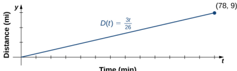

C.The slope $m=3/26\approx0.115$ describes the distance (in miles) Jessica runs per minute, or her average velocity.

# Polynomials

A linear function is a special type of a more general class of functions: polynomials. A polynomial function is any function that can be written in the form

$$f(x)=a_nx^n+a_{n-1}x^{n-1}+...+a_1x+a_0$$

for some integer $n\geq0$ and constants $a_{n}$ $a_{n-1},\ldots,a_{0}$ ，where $a_{n}\neq0$ 1. In the case when $n=0$ we allow for $a_{0}=0$ if $a_{0}=0$ ，the function $f(x)=0$ is called the zero function. The value $n$ is called the degree of the polynomial; the constant $u_{n}$ is called the leading coefficient. A linear function of the form $f(x)=mx+b$ is a polynomial of degree 1 if $m\neq0$ and degree 0 if $m=0$ .A polynomial of degree 0 is also called a constant function.A polynomial function of degree 2 is called a quadratic function. In particular, a quadratic function has the form $f(x)=ax^{2}+bx+c$ where $a\neq0$ .A polynomial function of degree3is called a cubic function.

### Power Functions

Some polynomial functions are power functions. A power function is any function of the form $f(x)=ax^{b}$ where $a$ and $b$ are any real numbers. The exponent in a power function can be any real number, but here we consider the case when the exponent is a positive integer. (We consider other cases later.) If the exponent is a positive integer, then $f(x)=ax^{n}$ is a polynomial. If 77 is even, then $f(x)=ax^{\prime\prime}$ is an even function because $f(-x)=a(-x)^{n}=ax^{n}$ if 77 is even. If 72 is odd, then $f(x)=ax^{n}$ is an odd function because $f(-x)=a(-x)^{n}=-ax^{n}$ if 77 is odd (Figure 1.18)

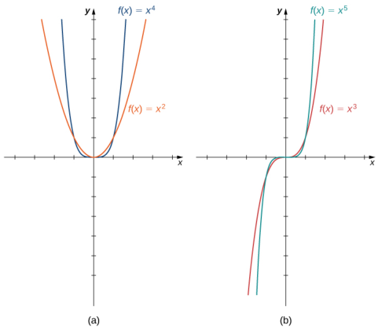
Figure 1.18 (a) For any even integer $H$ ， $f(x)=ax^{n}$ is an even function. (b) For any odd

integer 72 $f(x)=ax^n$ is an odd function

## Behavior at Infinity

To determine the behavior of a function $f$ as the inputs approach infinity, we look at the values $f(x)$ as the inputs, $x$ become larger. For some functions, the values of $f(x)$ approach a finite number. For example, for the function $f(x)=2+1/x$ the values $1/x$ become closer and closer to zero for all values of $X$ as they get larger and larger. For this function, we say “ $f(x)$ approaches two as $X$ goes to infinity,” and we write $f(x)\to2$ as $x\to\infty$ .The line $y=2$ is a horizontal asymptote for the function $f(x)=2+1/x$ because the graph of the function gets closer to the line as $x$ gets larger.

For other functions, the values $f(x)$ may not approach a finite number but instead may become larger for all values of $X$ as they get larger. In that case, we say ‘“ $f(x)$ approaches infinity as $X$ approaches infinity,” and we write $f(x)\to\infty$ as $x\to00$ .For example, for the function $f(x)=3x^{2}$ ，the outputs $f(x)$ become larger as the inputs $X$ get larger. We can conclude that the function $f(x)=3x^{2}$ approaches infinity as $X$ approaches infinity, and we write $3x^{2}\to\infty$ as $x\to\infty$ The behavior as $x\to-\infty$ and the meaning of $f(x)\to-\infty$ as $x\to\infty$ or $x\to-\infty$ can be defined similarly. We can describe what happens to the values of $f(x)$ as $X\to\infty$ and as $x\to-\infty$ as the end behavior of the function

To understand the end behavior for polynomial functions, we can focus on quadratic and cubic functions. The behavior for higher-degree polynomials can be analyzed similarly. Consider a quadratic function $f(x)=ax^{2}+bx+c$ .If $a>0$ ，the values $f(x)\to\infty$ as $x\to\pm\infty$ .If $a<0$ ，the values $f(x)\to-\infty$ as $x\to\pm\infty$ .Since the graph of a quadratic function is a parabola, the parabola opens upward if $a>0$ ; the parabola opens downward if $a<0$ .(See Figure 1.19(a).)

Now consider a cubic function $f(x)=ax^{3}+bx^{2}+cx+d$ If $a>0$ ，then $f(x)\to\infty$ as $X\rightarrow\infty$ and $f(x)\to-\infty$ as $x\to-\infty$ .If $a<0$ ，then $f(x)\to-\infty$ as $x\to\infty$ and $f(x)\to\infty$ as $x\to-\infty$ .As we can see from both of these graphs, the leading term of the polynomial determines the end behavior. (See Figure 1.19(b).)

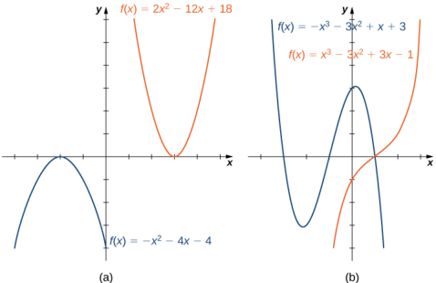
Figure 1.19 (a) For a quadratic function, if the leading coefficient $a>0$ the parabola opens

upward. If $a<0$ , the parabola opens downward. (b) For a cubic function $f$ ，if the leading coefficient $a>0$ ，the values $f(x)\to\infty$ as $x\to\infty$ and the values $f(x)\to-\infty$ as $x\to-\infty$ .If the leading coefficient $a<0$ the opposite is true.

### Zeros of Polynomial Functions

Another characteristic of the graph of a polynomial function is where it intersects the $X$ -axis. To determine where a function $f$ intersects the $X$ -axis, we need to solve the equation $f(x)=0$ for $X$ In the case of the linear function $f(x)=mx+b$ the $x$ -intercept is given by solving the equation $mx+b=0$ .In this case, we see that the $x$ -intercept is given by $(-b/m,0)$ .In the case of a quadratic function, finding the $X$ -intercept(s) requires finding the zeros of a quadratic equation: $ax^{2}+bx+c=0$ .In some cases, it is easy to factor the polynomial $ax^{2}+bx+c$ to find the zeros. If not, we make use of the quadratic formula.

### Rule: The Quadratic Formula

Consider the quadratic equation

$$ax^{2}+bx+c=0,$$

where $a\neq0$ .The solutions of this equation are given by the quadratic formula

$$x=\frac{-b\pm\sqrt{b^{2}-4ac}}{2a}.$$

If the discriminant $b^{2}-4ac>0$ ,this formula tells us there are two real numbers that satisfy the quadratic equation If $b^{2}-4ac=0$ ,this formula tells us there is only one solution, and it is a real number. If $b^{2}-4ac<0$ , no real numbers satisfy the quadratic equation.

In the case of higher-degree polynomials, it may be more complicated to determine where the graph intersects the $X$ -axis. In some instances, it is possible to find the $x$ -intercepts by factoring the polynomial to find its zeros. In other cases, it is impossible to calculate the exact values of the $x$ -intercepts. However, as we see later in the text, in cases such as this, we can use analytical tools to approximate (to a very high degree) where the $x$ -intercepts are located. Here we focus on the graphs of polynomials for which we can calculate their zeros explicitly.

# Example 1.14

### Graphing Polynomial Functions

For the following functions a. and b., i. describe the behavior of $f(x)$ as $x\to\pm\infty$ ,i. find all zeros of $f$ ，and ii. sketch a graph of $f$

$$\mathrm{a.}\quad f(x)=-2x^{2}+4x-1\\\mathrm{b.}\quad f(x)=x^{3}-3x^{2}-4x$$

### Solution

a.The function $f(x)=-2x^{2}+4x-1$ is a quadratic function

i.Because $a=-2<0$ ,as $x\to\pm\infty$ ， $f(x)\to-\infty$ i.To find the zeros of $f$ use the quadratic formula. The zeros are

$$x=\frac{-4\pm\sqrt{4^2-4(-2)(-1)}}{2(-2)}=\frac{-4\pm\sqrt{8}}{-4}=\frac{-4\pm2\sqrt{2}}{-4}=\frac{2\pm\sqrt{2}}{2}.$$

i. To sketch the graph of $f$ ,.use the information from your previous answers and combine it with the fact that the graph is a parabola opening downward

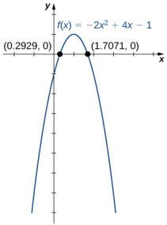

b.The function $f(x)=x^{3}-3x^{2}-4x$ is a cubic function

i.Because $a=1>0$ , as $x\to\infty$ $f(x)\to\infty$ .As $x\to-\infty$ ， $f(x)\to-\infty$ ii.To find the zeros of $f$ we need to factor the polynomial. First, when we factor $X$ out of all the terms, we find

$$f(x)=x(x^2-3x-4).$$

Then, when we factor the quadratic function $x^{2}-3x-4$ we find

$$f(x)=x(x-4)(x+1).$$

Therefore, the zeros of $f$ are $x=0$ 4, -1

ii. Combining the results from parts i. and i., draw a rough sketch of $f$

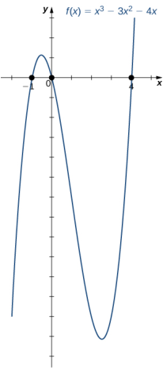

1.10 Consider the quadratic function $f(x)=3x^{2}-6x+2$ .Find the zeros of $f$ Does the parabola open upward or downward?

### Mathematical Models

A large variety of real-world situations can be described using mathematical models. A mathematical model is a method of simulating real-life situations with mathematical equations. Physicists, engineers, economists, and other researchers develop models by combining observation with quantitative data to develop equations, functions, graphs, and other mathematical tools to describe the behavior of various systems accurately. Models are useful because they help predict future outcomes. Examples of mathematical models include the study of population dynamics, investigations of weather patterns, and predictions of product sales.

As an example, let's consider a mathematical model that a company could use to describe its revenue for the sale of a particular item. The amount of revenue $R$ a company receives for the sale of $n$ items sold at a price of $p$ dollars per item is described by the equation $R=p\cdot n$ . The company is interested in how the sales change as the price of the item changes. Suppose the data in Table 1.6 show the number of units a company sells as a function of the price per item.

<table>
	<tbody>
		<tr>
			<th>$P$</th>
			<th>6</th>
			<th>8</th>
			<th>10</th>
			<th>12</th>
			<th>14</th>
		</tr>
		<tr>
			<td>$n$</td>
			<td>19.4</td>
			<td>18.5</td>
			<td>16.2</td>
			<td>13.8</td>
			<td>12.5</td>
		</tr>
	</tbody>
</table>

Table 1.6 Number of Units Sold $n$ (in Thousands)as a Function of Price per Unit $p$ (in Dollars)

In Figure 1.20, we see the graph the number of units sold (in thousands) as a function of price (in dollars). We note from the shape of the graph that the number of units sold is likely a linear function of price per item, and the data can be closely approximated by the linear function $n=-1.04p+26$ for $0\leq p\leq25$ where $n$ predicts the number of units sold in thousands. Using this linear function, the revenue (in thousands of dollars) can be estimated by the quadratic function

$$R(p)=p\cdot(-1.04p+26)=-1.04p^{2}+26p$$

for $0\leq p\leq25$ . In Example 1.15, we use this quadratic function to predict the amount of revenue the company receives depending on the price the company charges per item. Note that we cannot conclude definitively the actual number of units sold for values of $P$ ,for which no data are collected. However, given the other data values and the graph shown, it seems reasonable that the number of units sold (in thousands) if the price charged is $P$ dollars may be close to the values predictec by the linear function $n=-1.04p+26$

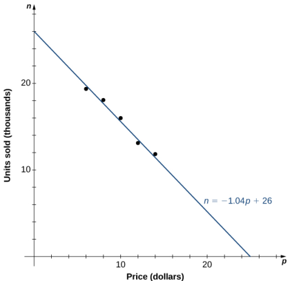
Figure 1.20The data collected for the number of items sold as a function of

price is roughly linear. We use the linear function $n=-1.04p+26$ to estimate this function.

## Maximizing Revenue

A company is interested in predicting the amount of revenue it will receive depending on the price it charges for a particular item. Using the data from Table 1.6, the company arrives at the following quadratic function to mode revenue $R$ (in thousands of dollars) as a function of price per item $P$

$$R(p)=p\cdot(-1.04p+26)=-1.04p^{2}+26p$$

for $0\leq p\leq25$

a.Predict the revenue if the company sells the item at a price of $p=85$ and $p=\$17$ b.Find the zeros of this function and interpret the meaning of the zeros C.Sketch a graph of $R$ d.Use the graph to determine the value of $P$ that maximizes revenue. Find the maximum revenue

### Solution

a.Evaluating the revenue function at $p=5$ and $p=17$ ,we can conclude that

$$\begin{aligned}&R(5)=-1.04(5)^{2}+26(5)=104,\:\mathrm{so~revenue}\:=\:\mathrm{S}104,000;\\&R(17)=-1.04(17)^{2}+26(17)=141.44,\:\mathrm{so~revenue}\:=\:\mathrm{S}141,440.\end{aligned}$$

b. The zeros of this function can be found by solving the equation $-1.04p^{2}+26p=0$ .When we factor the quadratic expression, we get $p(-1.04p+26)=0$ 1.The solutions to this equation are given by $p=0$ , 25. For these values of $p$ the revenue is zero. When $p=\$0$ ,the revenue is zero because the company is giving away its merchandise for free. When $p=\$25$ ,the revenue is zero because the price is too high, and no one will buy any items. C. Knowing the fact that the function is quadratic, we also know the graph is a parabola. Since the leading coefficient is negative, the parabola opens downward. One property of parabolas is that they are symmetric about the axis, so since the zeros are at $p=0$ and $p=25$ the parabola must be symmetric about the line halfway between them, or $p=12.5$

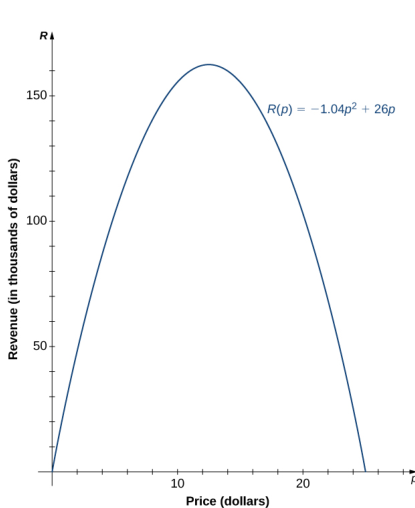
d. The function is a parabola with zeros at $p=0$ and $p=25$ ， and it is symmetric about the line

$p=12.5$ , so the maximum revenue occurs at a price of $p=\$12.50$ per item. At that price, the revenue is $R(p)=-1.04(12.5)^{2}+26(12.5)=\$162$ 500

## Algebraic Functions

By allowing for quotients and fractional powers in polynomial functions, we create a larger class of functions. An algebraic function is one that involves addition, subtraction, multiplication, division, rational powers, and roots. Two types of algebraic functions are rational functions and root functions.

Just as rational numbers are quotients of integers, rational functions are quotients of polynomials. In particular, a rational function is any function of the form $f(x)=p(x)/q(x)$ ，where $p(x)$ and $q(x)$ are polynomials. For example

$$f(x)=\frac{3x-1}{5x+2}\quad\mathrm{and}\quad g(x)=\frac{4}{x^{2}+1}$$

are rational functions. A root function is a power function of the form $f(x)=x^{1/n}$ ，where TE is a positive integer greater than one. For example, $f(x)=x^{1/2}=\sqrt{x}$ is the square-root function and $g(x)=x^{1/3}=\sqrt[3]{x}$ is the cube-root function. By allowing for compositions of root functions and rational functions, we can create other algebraic functions. For example, $f(x)=\sqrt{4-x^{2}}$ is an algebraic function

# Example 1.16

### Finding Domain and Range for Algebraic Functions

For each of the following functions, find the domain and range.

$$f(x)=\frac{3x-1}{5x+2}$$

b. To find the domain of $f$ ,we need $4-x^{2}\geq0$ .Or, $4\geq x^2$ Or $x^2\leq4$ , the solution to which is $-2\leq x\leq2$ .Therefore, the domain is $\{x|-2\leq x\leq2\}$ If $-2\leq x\leq2$ ，then $0\leq4-x^{2}\leq4$ Therefore, $0\leq\sqrt{4-x^{2}}\leq2$ and the range of $f$ is $\{y|0\leq x\leq2\}$

### Solution

a.It is not possible to divide by zero, so the domain is the set of real numbers $x$ such that $x\neq-2/5$ .Td find the range, we need to find the values $y$ for which there exists a real number $x$ such that

$$y=\frac{3x-1}{5x+2}.$$

When we multiply both sides of this equation by $5x+2$ ，we see that $X$ must satisfy the equation
$$5xy+2y=3x-1.$$

From this equation, we can see that X must satisfy

$$2y+1=x(3-5y).$$

If $y=3/5$ ,this equation has no solution. On the other hand, as long as $y\neq3/5$

$$x=\frac{2y+1}{3-5y}$$

satisfies this equation. We can conclude that the range of $f$ is $\langle y|v\neq3/5\rangle$

b.To find the domain of $f$ ，weneed $4-x^{2}\geq0$ .When we factor, we write $4-x^{2}=(2-x)(2+x)\geq0$ .This inequality holds if and only if both terms are positive or both terms are negative. For both terms to be positive, we need to find $X$ such that

$$2-x\geq0\quad\mathrm{and}\quad2+x\geq0.$$

These two inequalities reduce to $2\geq x$ and $x\geq-2$ .Therefore, the set $\{x|-2\leq x\leq2\}$ mustbe part of the domain. For both terms to be negative, we need

$$2-x\leq0\quad\mathrm{and}\quad2+x\geq0.$$

These two inequalities also reduce to $2\leq x$ and $x\geq-2$ .There are no values of $X$ that satisfy both of these inequalities. Thus, we can conclude the domain of this function is $\{x|-2\leq x\leq2\}$

If $-2\leq x\leq2$ ，then $0\leq4-x^{2}\leq4$ .Therefore, $0\leq\sqrt{4-x^{2}}\leq2$ ，and the range of $f$ is $\{y|0\leq y\leq2\}$

1.11 Find the domain and range for the function $f(x)=(5x+2)/(2x-1)$

The root functions $f(x)=x^{1/n}$ have defining characteristics depending on whethere 77 is odd or even. For all even integers $n\geq2$ ,， the domain of $f(x)=x^{1/n}$ is the interval $[0,\infty$ 0. For all od integers $n\geq1$ ， the domain of $f(x)=x^{1/n}$ is the set of all real numbers. Since $x^{1/n}=(-x)^{1/n}$ for odd integers 71 $f(x)=x^{1/n}$ is an odd function if $n$ is odd. See the graphs of root functions for different values of $n$ in Figure 1.21.

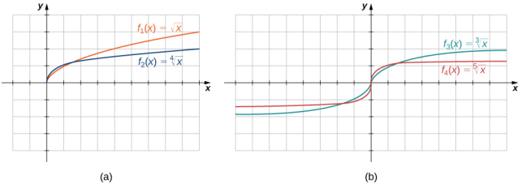
Figure 1.21 (a) If $n$ is even, the domain of $f(x)=\sqrt[n]{x}$ is $[0,\infty$ 0. (b)If $n$ is odd, the domain of $f(x)=\sqrt[n]{x}$ is

$( - \infty$, $\infty )$ and the function $f(x)=\sqrt[n]{x}$ is an odd function.

## Example 1.17

 Finding Domains for Algebraic Functions

For each of the following functions,determine the domain of the function

$$\begin{aligned}
&\mathrm{a.}\quad f(x) =\frac{3}{x^{2}-1} \\
&\mathbf{b}.\quad f(x) =\frac{2x+5}{3x^{2}+4} \\
&\mathbf{c}.\quad f(x) =\sqrt{4-3x} \\
&\mathrm{d.}\quad f(x) =\sqrt[3]{2x-1} 
\end{aligned}$$

### Solution

a.You cannot divide by zero, so the domain is the set of values $X$ such that $x^{2}-1\neq0$ . Therefore, the domain is $\{x|x\neq\pm1\}$

b.You need to determine the values of $X$ for which the denominator is zero. Since $3x^{2}+4\geq4$ for all real numbers $X$ the denominator is never zero. Therefore, the domain is $(-\infty,\infty)$

C.Since the square root of a negative number is not a real number, the domain is the set of values $X$ for

which $4-3x\geq0$ Therefore, the domain is $\{x|x\leq4/3\}$

d.The cube root is defined for all real numbers, so the domain is the interval $(-\infty,\infty)$

1.12Find the domain for each of the following functions: $f(x)=(5-2x)/(x^{2}+2)$ and $g(x)=\sqrt{5x-1}$

## Transcendental Functions

Thus far, we have discussed algebraic functions. Some functions, however, cannot be described by basic algebraic operations. These functions are known as transcendental functions because they are said to “transcend,” or go beyond algebra. The most common transcendental functions are trigonometric, exponential, and logarithmic functions. A trigonometric function relates the ratios of two sides of a right triangle. They are sinx, cosx,tanx, cotx, secx, and cscx. (We discuss trigonometric functions later in the chapter.) An exponential function is a function of the form $f(x)=b^{x}$ where the base $b>0$ b >0 $b>0,b\neq1$ b≠1 $b\neq1$ .A logarithmic function is a function of the form $f(x)=\log_b(x)$ for some constant $b>0$ $b\neq1$ ，where $\log_b(x)=y$ if and only if $b^{\mathcal{Y}}=x$ (We also discuss exponential and logarithmic functions later in the chapter.)

## Example 1.18

Classifying Algebraic and Transcendental Functions

Classify each of the following functions,a. through c., as algebraic or transcendental

a.f(x=4+) b. f(x)=2x2 c. $f(x)=\sin(2x)$

### Solution

a.Since this function involves basic algebraic operations only,it is an algebraic function

b.This function cannot be written as a formula that involves only basic algebraic operations, so it is transcendental. (Note that algebraic functions can only have powers that are rational numbers.

C.As in part b., this function cannot be written using a formula involving basic algebraic operations only therefore, this function is transcendental

1.13 Is $f(x)=x/2$ an algebraic or a transcendental function?

### Piecewise-Defined Functions

Sometimes a function is defined by different formulas on different parts of its domain. A function with this property is known as a piecewise-defined function. The absolute value function is an example of a piecewise-defined function because

the formula changes with the sign of $X.$

$$f(x)=\begin{cases}-x,\:x<0\\\:x,\:x\ge0\end{cases}.$$

Other piecewise-defined functions may be represented bv completely different formulas.depending on the part of the domain in which a point falls. To graph a piecewise-defined function, we graph each part of the function in its respective domain, on the same coordinate system. If the formula for a function is different for $X<a$ and $x>a$ ，we need to pay special attention to what happens at $A=U$ when we graph the function.Sometimes the graph needs to include an open or closed circle to indicate the value of the function at $A=U$ .We examine this in the next example.

### Example 1.19

## Graphing a Piecewise-Defined Function

Sketch a graph of the following piecewise-defined function:

$$f(x)=\begin{cases}x+3,\quad&x<1\\(x-2)^2,\quad&x\ge1\end{cases}.$$

## Solution

Graph the linear function $y=x+3$ on the interval $( - \infty$, 1) and graph the quadratic function $y=(x-2)^{2}$ on the interval [1, 00 ).Since the value of the function at $x=1$ is given by the formula $f(x)=(x-2)^{2}$ we see that $f(1)=1$ . To indicate this on the graph, we draw a closed circle at the point (1, 1). The value of the function is given by $f(x)=x+2$ for all $x<1$ ，but not at $x=1$ .To indicate this on the graph, we draw ar open circle at (1, 4).

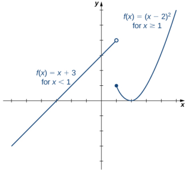
Fiqure 1.22This piecewise-defined function is linear fo.

$x<1$ and quadratic for $x\geq1$

1.14 Sketch a graph of the function

$$f(x)=\begin{cases}2-x,\:x\leq2\\x+2,\:x>2\end{cases}.$$

# Example 1.20

### Parking Fees Described by a Piecewise-Defined Function

In a big city, drivers are charged variable rates for parking in a parking garage. They are charged $\$10$ for the first hour or any part of the first hour and an additional $\$2$ for each hour or part thereof up to a maximum of S30 for the day. The parking garage is open from 6 a.m. to 12 midnight.

a.Write a piecewise-defined function that describes the cost $C$ to park in the parking garage as a functior of hours parked $x$ b.Sketch a graph of this function $C(x)$

### Solution

a.Since the parking garage is open 18 hours each day, the domain for this function is $\{x|0<x\leq18\}$ .The cost to park a car at this parking garage can be described piecewise by the function

$$\left.C(x)=\left\{\begin{array}{c}10,\:0<x\leq1\\12,\:1<x\leq2\\14,\:2<x\leq3\\16,\:3<x\leq4\\\vdots\\30,\:10<x\leq18\end{array}\right.\right..$$

b.The graph of the function consists of several horizontal line segments.

1.15The cost of mailing a letter is a function of the weight of the letter. Suppose the cost of mailing a letter is $49\varphi$ for the first ounce and $21\varphi$ for each additional ounce. Write a piecewise-defined function describing the cost $C$ as a function of the weight $x$ for $0<x\leq3$ ，where $C$ is measured in cents and $x$ is measured in ounces.

## Transformations of Functions

We have seen several cases in which we have added, subtracted, or multiplied constants to form variations of simple

functions. In the previous example, for instance, we subtracted 2 from the argument of the function $y=x^{2}$ to get the functiond $f(x)=(x-2)^{2}$ .This subtraction represents a shift of the function $y=x^{2}$ two units to the right. A shift, horizontally or vertically, is a type of transformation of a function. Other transformations include horizontal and vertical scalings, and reflections about the axes.

A vertical shift of a function occurs if we add or subtract the same constant to each output $y$ For $c>0$ ，the graph of $f(x)+c$ is a shift of the graph of $f(x)$ up $L$ units, whereas the graph of $f(x)-c$ is a shift of the graph of $f(x)$ down $C$ units. For example, the graph of the function $f(x)=x^{3}+4$ is $y=x^3$ shifted up 4 units; the graph of the function $f(x)=x^{3}-4$ is the graph of $y=x^{3}$ shifted down 4 units (Figure 1.23)

(a) (b)

Figure 1.23 (a) For $c>0$ ，the graph of $y=f(x)+c$ is a vertical shift up $c$ units of the graph of $y=f(x)$ . (b) For $c>0$ ，the graph of $y=f(x)-c$ is a vertical shift down $C$ units of the graph of $y=f(x)$

A horizontal shift of a function occurs if we add or subtract the same constant to each input $X$ .For $c>0$ ，the graph of $f(x+c)$ is a shift of the graph of $f(x)$ to the left $C$ units; the graph of $f(x-c)$ is a shift of the graph of $f(x)$ to the right C units. Why does the graph shift left when adding a constant and shift right when subtracting a constant? To answer this question,let's look at an example.

Consider the function $f(x)=|x+3|$ and evaluate this function at $x-3$ .Since $f(x-3)=|x|$ and $x-3<x$ ，the graph of $f(x)=|x+3|$ is the graph of $y=|x|$ shifted left 3 units. Similarly, the graph of $f(x)=|x-3|$ is the graph of $y=|x|$ shifted right 3 units (Figure 1.24)

Figure 1.24 (a)For $c>0$ ，the graph of $y=f(x+c)$ is a horizontal shift left $c$ units of the graph of $y=f(x)$ -(b) For

$c>0$ ，the graph of $y=f(x-c)$ is a horizontal shift right $c$ units of the graph of $y=f(x)$

A vertical scaling of a graph occurs if we multiply all outputs $y$ of a function by the same positive constant. For $c>0$ the graph of the function $cf(x)$ is the graph of $f(x)$ scaled vertically by a factor of $\boldsymbol{C}$ .If $c>1$ ，the values of the outputs for the function $cf(x)$ are larger than the values of the outputs for the function $f(x)$ ; therefore, the graph has been stretched vertically. If $0<c<1$ ，then the outputs of the function $cf(x)$ are smaller, so the graph has been compressed. For example, the graph of the function $f(x)=3x^{2}$ is the graph of $y=x^{2}$ stretched vertically by a factor of 3, whereas the graphof $f(x)=x^{2}/3$ is the graph of $y=x^{2}$ compressed vertically by a factor of 3 (Figure 1.25)

Figure 1.25 (a) If $c>1$ ， the graph of $y=cf(x)$ is a vertical stretch of the graph

of $y=f(x)$ (b) If $0<c<1$ ， the graph of $y=cf(x)$ is a vertical compression of the graph of $y=f(x)$

The horizontal scaling of a function occurs if we multiply the inputs $X$ by the same positive constant. For $c>0$ ，the graph of the function $f(cx)$ is the graph of $f(x)$ scaled horizontally by a factor of $\boldsymbol{C}$ .If $c>1$ ，the graph of $f(cx)$ is the graph of $f(x)$ compressed horizontally. If $0<c<1$ ，the graph of $f(cx)$ is the graph of $f(x)$ stretched horizontally. For

example, consider the function $f(x)=\sqrt{2x}$ and evaluate $f$ at $x/2$ .Since $f(x/2)=\sqrt{x}$ the graph of $f(x)=\sqrt{2x}$ is the graph of $y=\sqrt{x}$ compressed horizontally. The graph of $y=\sqrt{x/2}$ is a horizontal stretch of the graph of $y=\sqrt{x}$ (Figure 1.26).

Figure 1.26 (a)If $c>1$ ，the graph of $y=f(cx)$ is a horizontal compression of the graph

of $y=f(x)$ . (b) If $0<c<1$ ， the graph of $y=f(cx)$ is a horizontal stretch of the graph of $y=f(x)$

We have explored what happens to the graph of a function $f$ when we multiply $f$ by a constant $c>0$ to get a new function $cf(x)$ .We have also discussed what happens to the graph of a function $f$ when we multiply the independent variable $A$ by $c>0$ to get a new function $f(cx)$ .However, we have not addressed what happens to the graph of the function if the constant $C$ is negative. If we have a constant $c<0$ we can write L as a positive number multiplied by -1 : but, what kind of transformation do we get when we multiply the function or its argument by -17 When we multiply all the outputs by -1 ，we get a reflection about the $X$ -axis. When we multiply all inputs by -1 ，we get a reflection about the y-axis.For example.the graph of f(x)=-（x²+1)is the graph of y=(x²+1)reflected about the $X$ -axis The graph of $f(x)=(-x)^{3}+1$ is the graph of $y=x^{3}+1$ reflected about the $y$ -axis (Figure 1.27)

Figure 1.27 (a) The graph of $y=-f(x)$ is the graph of

$y=f(x)$ reflected about the $X$ -axis. (b) The graph of $y=f(-x)$ is the graph of $y=f(x)$ reflected about the $y$ -axis.

If the graph of a function consists of more than one transformation of another graph, it is important to transform the graph in the correct order. Given a function $f(x)$ ,the graph of the related function $y=cf(a(x+b))+d$ can be obtained from the graph of $y=f(x)$ by performing the transformations in the following order.

1.Horizontal shift of the graph of $y=f(x)$ .If $b>0$ ，shift left. If $b<0$ shift right 2.Horizontal scaling of the graph of $y=f(x+b)$ by a factor of $|a|$ .If $a<0$ ，reflect the graph about the $y$ -axis 3.Vertical scaling of the graph of $y=f(a(x+b))$ by a factor of $|c|$ .If $c<0$ ，reflect the graph about the $X$ -axis 4. Vertical shift of the graph of $y=cf(a(x+b))$ . If $d>0$ ，shift up. If $d<0$ ,shift down.

We can summarize the different transformations and their related effects on the graph of a function in the following table.

<table>
	<tbody>
		<tr>
			<th>Transformation of $f(c>0)$</th>
			<th>Effect on the graph of $f$</th>
		</tr>
		<tr>
			<td>$f(x)+c$</td>
			<td>Vertical shift up $c$ units</td>
		</tr>
		<tr>
			<td>$f(x)-c$</td>
			<td>Vertical shift down $c$ units</td>
		</tr>
		<tr>
			<td>$f(x+c)$</td>
			<td>Shift left by $c$ units</td>
		</tr>
		<tr>
			<td>$f(x-c)$</td>
			<td>Shift right by $c$ units</td>
		</tr>
		<tr>
			<td>$cf(x)$</td>
			<td>Vertical stretch if $c>1;$ vertical compression if $0<c<1$</td>
		</tr>
		<tr>
			<td>$f(cx)$</td>
			<td>Horizontal stretch if $0<c<1;$ horizontal compression if $c>1$</td>
		</tr>
		<tr>
			<td>$-f(x)$</td>
			<td>Reflection about the x-axis</td>
		</tr>
		<tr>
			<td>$f(-x)$</td>
			<td>Reflection about the y-axis</td>
		</tr>
	</tbody>
</table>
Table 1.7 Transformations of Functions

## Example 1.21

### Transforming a Function

For each of the following functions, a. and b., sketch a graph by using a sequence of transformations of a well known function

$$f(x)=-|x+2|-3$$
b. $f(x)=3\sqrt{-x}+1$

### Solution

a.Starting with the graph of $y=|x|$ ，shift 2 units to the left, reflect about the $x$ -axis, and then shift down 3 units.

Figure 1.28 The function $f(x)=-|x+2|-3$ can be

viewed as a sequence of three transformations of the function $y=|x|$

b.Starting with the graph of $y=\sqrt{x}$ ，reflect about the $y$ -axis, stretch the graph vertically by a factor of 3 and move up 1 unit.

Figure 1.29The function $f(x)=3\sqrt{-x}+1$ can be viewed

as a sequence of three transformations of the function $y=\sqrt{x}$

1.16 Describe how the function $f(x)=-(x+1)^{2}-4$ can be graphed using the graph of $y=x^{2}$ and sequence of transformations.

## 1.2 EXERCISES

For the following exercises,for each pair of points,a find the slope of the line passing through the points and b. indicate whether the line is increasing, decreasing horizontal, or vertical.

59.(2,4) and (1, 1) 60.-14and3-161.(3,5)and (-1, 2) 62.(6,4) and (4,-3) 63.(2,3) and (5,7） 64.(1, 9) and (-8, 5) 65.2,4 and1,466.(1, 4) and (1, 0)

For the following exercises, write the equation of the line satisfying the given conditions in slope-intercept form.

$$\begin{aligned}&67.\:\mathrm{Slope}\:=-6,\:\mathrm{passes~through}\:(1,\:3)\\&68.\:\mathrm{Slope}\:=3,\:\mathrm{passes~through}\:(-3,\:2)\\&69.\:\mathrm{Slope}\:=\frac{1}{3},\:\mathrm{passes~through}\:(0,\:4)\\&70.\:\mathrm{Slope}\:=\frac{2}{5},\:x\:\mathrm{-intercept}\:=8\end{aligned}$$
71.Passing through (2,1) and (2,1) 72. Passing through (—3, 7) and (1, 2) 73. $x$ -intercept =5 and y -intercept = 374. $x$ -intercept =-6 and $y$ -intercept =9

For the following exercises, for each linear equation, a. give the slope $m$ and $y$ -intercept $b$ ,if any, and b. graph the line.

75. $y=2x-3$ 76. $y=-\frac{1}{7}x+1$ 77. $f(x)=-6x$ 78. $f(x)=-5x+4$

79. $4y+24=0$

80. $8x-4=0$

81. $2x+3y=6$ 82. $6x-5y+15=0$

For the following exercises, for each polynomial, a. find the degree; b. find the zeros, if any; c. find the $y$ -intercept(s), if any; d.use the leading coefficient to determine the graph's end behavior; and e. determine algebraically whether the polynomial is even, odd, or neither.

83. $f(x)=2x^{2}-3x-5$ 84. $f(x)=-3x^{2}+6x$ 85. $f(x)=\frac{1}{2}x^{2}-1$ 86. $f(x)=x^{3}+3x^{2}-x-3$ 87. $f(x)=3x-x^{3}$

For the following exercises, use the graph of $f(x)=x^{2}$ to graph each transformed function g.

$$\begin{array}{ll}88.&g(x)=x^2-1\\\\89.&g(x)=\left(x+3\right)^2+1\end{array}$$

For the following exercises, use the graph of $f(x)=\sqrt{x}$ to graph each transformed function $g$

90. $g(x)=\sqrt{x+2}$ 91. $g(x)=-\sqrt{x}-1$

For the following exercises, use the graph of $y=f(x)$ to graph each transformed function g

92. $g(x)=f(x)+1$

93. $g(x)=f(x-1)+2$

For the following exercises,for each of the piecewise defined functions, a. evaluate at the given values of the independent variable and b.sketch the graph

$$f(x)=\begin{cases}4x+3,\:x\leq0\\-x+1,\:x>0\end{cases};\:f(-3);\:f(0);\:f(2)$$

96. $h(x)=\left\{\begin{matrix}{x+1,\:x\leq5}\\{4,\:x>5}\\\end{matrix}\right.$ : h();h(c) h(5) 97.
$$g(x)=\begin{cases}\frac{3}{x-2},\:x\neq2\\4,\:x=2\end{cases};g(0);g(-4);g(2)$$

For the following exercises, determine whether the statement is true or false.Explain why

98. $f(x)=(4x+1)/(7x-2)$ isatranscendenta function.

99. $g(x)=\sqrt[3]{x}$ is an odd root function

100.A logarithmic function is an algebraic function

101.A function of the form f(x)=xb,where $b$ is a real yalued constant, is an exponential function

102.The domain of an even root function is all real numbers.

103.[T] A company purchases some computer equipment for \$20,500. At the end of a 3-year period, the value of the equipment has decreased linearly to S12,300 a.Find a function $y=V(t)$ that determines the value

V of the equipment at the end of t years b.Find and interpret the meaning of the $x\cdot$ and $y$ -intercepts for this situation C.What is the value of the equipment at the end of 5 years? d.When will the value of the equipment be \$3000

104.[T] Total online shopping during the Christmas holidays has increased dramatically during the past 5 years. In 2012 $( t= 0]$ $(t=0$ (t=00,total online holiday sales were $\$42.3$ billion, whereas in 2013 they were $\$48.1$ billion. a.Find a linear function $S$ that estimates the total

online holiday sales in the year t b.Interpret the slope of the graph of S. C.Use part a. to predict the year when online shopping during Christmas will reach \$60 billion.

105. [T] A family bakery makes cupcakes and sells them at local outdoor festivals. For a music festival, there is a fixed cost of S125 to set up a cupcake stand. The owner estimates that it costs \$0.75 to make each cupcake. The owner is interested in determining the total cost $C$ as a function of number of cupcakes made. a.Find a linear function that relates cost $C$ to $X$ ,the

number of cupcakes made. b.Find the cost to bake 160 cupcakes. C. If the owner sells the cupcakes for $\$1.50$ apiece, how many cupcakes does she need to sell to start making profit? (Hint: Use the INTERSECTION function on a calculator to find this number.)

106. [T] A house purchased for $\$250,000$ is expected to be worth twice its purchase price in 18 years. a.Find a linear function that models the price $P$ of

the house versus the number of years t since the original purchase b.Interpret the slope of the graph of $P$ C. Find the price of the house 15 years from when it was originally purchased.

107. [T] A car was purchased for \$26,000. The value of the car depreciates by \$1500 per year a.Find a linear function that models the value Vof the

car after t years. b.Find and interpret V(4)

108. [T] A condominium in an upscale part of the city was purchased for \$432,000. In 35 years it is worth \$60,500 Find the rate of depreciation

109. [T] The total cost $C$ (in thousands of dollars) to produce a certain item is modeled by the function $C(x)=10.50x+28,500$ where $x$ is the number of items produced. Determine the cost to produce 175 items.

110. [T] A professor asks her class to report the amount of time t they spent writing two assignments. Most students report that it takes them about 45 minutes to type a fourpage assignment and about 1.5 hours to type a nine-page assignment. a.Find the linear function $y=N(t)$ that models this

situation, where $N$ is the number of pages typed and t is the time in minutes. b. Use part a. to determine how many pages can be typed in 2 hours. C. Use part a. to determine how long it takes to type a 20-page assignment.

111. [T] The output (as a percent of total capacity) of nuclear power plants in the United States can be modeled by the function $P(t)=1.8576t+68.052$ ，where tis time in years and $t=0$ corresponds to the beginning of 2000. Use the model to predict the percentage output in 2015.

112. [T] The admissions office at a public university estimates that $65\%$ of the students offered admission to the class of 2019 will actually enroll. a.Find the linear function $y=N(x)$ ，where $N$ is

the number of students that actually enroll and $X$ is the number of all students offered admission to the class of 2019. b.If the university wants the 2019 freshman class size to be 1350, determine how many students should be admitted.

# 1.3 | Trigonometric Functions

# Learning Objectives

1.3.1 Convert angle measures between degrees and radians

1.3.2 Recognize the triangular and circular definitions of the basic trigonometric functions. 1.3.3 Write the basic trigonometric identities. 1.3.4 Identify the graphs and periods of the trigonometric functions. 1.3.5Describe the shift of a sine or cosine graph from the equation of the function

Trigonometric functions are used to model many phenomena, including sound waves, vibrations of strings, alternating electrical current, and the motion of pendulums. In fact, almost any repetitive, or cyclical, motion can be modeled by some combination of trigonometric functions.In this section,we define the six basic trigonometric functions and look at some of the main identities involving these functions.

## Radian Measure

To use trigonometric functions, we first must understand how to measure the angles. Although we can use both radians and degrees, radians are a more natural measurement because they are related directly to the unit circle, a circle with radius 1. The radian measure of an angle is defined as follows. Given an angle $\theta$ ，let $s$ be the length of the corresponding arc on the unit circle (Figure 1.30). We say the angle corresponding to the arc of length 1 has radian measure 1.

Figure 1.30 The radian measure of an angle $\theta$ is the arc

length $s$ of the associated arc on the unit circle.

Since an angle of $360^\circ$ corresponds to the circumference of a circle, or an arc of length $2\pi$ ,we conclude that an angle with a degree measure of $360^{\circ}$ has a radian measure of $2\pi$ Similarly, we see that $180^{\circ}$ is equivalent to $\pi$ radians. Table 1.8 shows the relationship between common degree and radian values.

<table>
	<tbody>
		<tr>
			<th>Degrees</th>
			<th>Radians</th>
			<th>Degrees</th>
			<th>Radians</th>
		</tr>
		<tr>
			<td>0</td>
			<td>0</td>
			<td>120</td>
			<td>$2\pi/3$</td>
		</tr>
		<tr>
			<td>30</td>
			<td>$\pi/6$</td>
			<td>135</td>
			<td>$3\pi/4$</td>
		</tr>
		<tr>
			<td>45</td>
			<td>$\pi/4$</td>
			<td>150</td>
			<td>$5\pi/6$</td>
		</tr>
		<tr>
			<td>60</td>
			<td>$\pi/3$</td>
			<td>180</td>
			<td>$\pi$</td>
		</tr>
		<tr>
			<td>90</td>
			<td>$\pi/2$</td>
			<td> </td>
			<td> </td>
		</tr>
	</tbody>
</table>
Table 1.8 Common Angles Expressed in Degrees anc

Radians

# Example 1.22

Converting between Radians and Degrees

a.Express $225^{\circ}$ using radians. b.Express $5\pi/3$ rad using degrees.

### Solution

Use the fat that $180^{\circ}$ is equivalento $\pi$ radians as conversion factor: $1=\frac{\pi\mathrm{rad}}{180^{\circ}}=\frac{180^{\circ}}{\pi\mathrm{rad}}$

a. $225^{\circ}=225^{\circ}\cdot\frac{\pi}{180^{\circ}}=\frac{5\pi}{4}$ rad
$$\frac{5\pi}{3}\:\mathrm{rad}=\frac{5\pi}{3}\cdot\frac{180^{\circ}}{\pi}=300^{\circ}$$

1.17 Express $210^{\circ}$ using radians. Express $111\pi/6$ rad using degrees

## The Six Basic Trigonometric Functions

Trigonometric functions allow us to use angle measures, in radians or degrees, to find the coordinates of a point on any circlenot only on a unit circle—or to find an angle given a point on a circle. They also define the relationship among the sides and angles of a triangle

To define the trigonometric functions, first consider the unit circle centered at the origin and a point $P=(x,y)$ on the unit circle. Let $\theta$ be an angle with an initial side that lies along the positive $X$ -axis and with a terminal side that is the line segment $OP$ .An angle in this position is said to be in standard position (Figure 1.31). We can then define the values of the six trigonometric functions for $\theta$ in terms of the coordinates $X$ and $y$

Figure 1.31 The angle $\theta$ is in standard position. The values of the trigonometric functions for $\theta$ are defined in terms of the coordinates $x$ and $y$

### Definition

Let $P=(x,y)$ be a point on the unit circle centered at the origin 0 .Let $\theta$ be an angle with an initial side along the positive $x$ -axis and a terminal side given by the line segment $OP$ The trigonometric functions are then defined as

$$\sin\theta=y\csc\theta=\frac{1}{y}\\\cos\theta=x\sec\theta=\frac{1}{x}\\\tan\theta=\frac{y}{x}\cot\theta=\frac{x}{y}$$

If $x=0$ ,sec $\theta$ and $\tan\theta$ are undefined. If $y=0$ then cotθandcsc $\theta$ are undefined

We can see that for a point $P=(x,y)$ on a circle of radius $r$ with a corresponding angle $\theta$ the coordinates $x$ andy satisfy

$$\begin{gathered}
\cos\theta={\frac{x}{r}} \\
x=r\cos\theta  \\
\sin\theta={\frac{y}{r}} \\
y=r\sin\theta. 
\end{gathered}$$

The values of the other trigonometric functions can be expressed in terms of $x,y$ ，and $r$ (Figure 1.32)

Figure 1.32 Fora point $P= ( x$, $y)$ on a circle of radius $r$ the coordinates $x$ and $y$ satisfy $x=r\cos\theta$ and $y=r\sin\theta$

Table 1.9 shows the values of sine and cosine at the major angles in the first quadrant. From this table, we can determine the values of sine and cosine at the corresponding angles in the other quadrants. The values of the other trigonometric functions are calculated easily from the values of $\sin\theta$ and $\cos\theta$

<table>
	<tbody>
		<tr>
			<th>$\theta$</th>
			<th>$\sin\theta$</th>
			<th>$\cos\theta$</th>
		</tr>
		<tr>
			<td>0</td>
			<td>0</td>
			<td>1</td>
		</tr>
		<tr>
			<td>$\frac{\pi}6$</td>
			<td>$\frac{1}{2}$</td>
			<td>$\frac{\sqrt{3}}2$</td>
		</tr>
		<tr>
			<td>$\frac{\pi}{4}$</td>
			<td>$\underline{\underline{\sqrt{2}}}$ $\overline{2}$</td>
			<td>$\frac{\sqrt{2}}{2}$</td>
		</tr>
		<tr>
			<td>$\frac{\pi}{3}$</td>
			<td>$\frac{\sqrt{3}}{2}$ $\frac{1}{2}$</td>
			<td>$\frac{1}{2}$</td>
		</tr>
		<tr>
			<td>$\underline{\pi}$ $\frac{\mathbf{w}}{\mathbf{n}}$</td>
			<td>1</td>
			<td>0</td>
		</tr>
	</tbody>
</table>
Table 1.9 Values of sin

and cosθat Major Angles $\theta$ in the First Quadrant

## Example 1.23

### Evaluating Trigonometric Functions

Evaluate each of the following expressions.

a $\sin\left(\frac{2\pi}{3}\right)$ b. $\cos\left(-\frac{5\pi}6\right)$

c. tan(g)

### Solution

a. On the unit irle, the angle $\theta=\frac{2\pi}{3}$ corresponds to the point $\left(-\frac{1}{2},\frac{\sqrt{3}}{2}\right).$ Therefore, $\sin\left(\frac{2\pi}{3}\right)=y=\frac{\sqrt{3}}{2}.$

b. An angle $\theta=-\frac{5\pi}{6}$ corresponds to a revolution in the negative direction, as shown. Therefore.
$$\cos\biggl(-\frac{5\pi}{6}\biggr)=x=\:-\frac{\sqrt{3}}{2}.$$

C. An angle $\theta=\frac{15\pi}{4}=2\pi+\frac{7\pi}{4}.$ Therefor, this angle corresponds to more than one revolution, as shown. Knowing the fact that an angle of $\frac{7\pi}4$ corresponds to the point $\left(\frac{\sqrt{2}}{2},\:-\frac{\sqrt{2}}{2}\right)$, we can conclude tha
$$\tan\biggl(\frac{15\pi}{4}\biggr)=\frac{y}{x}=-1.$$

1.18 Evaluate $\cos(3\pi/4)$ and $\sin(-\pi/6)$

As mentioned earlier, the ratios of the side lengths of a right triangle can be expressed in terms of the trigonometric functions evaluated at either of the acute angles of the triangle. Let $\theta$ be one of the acute angles. Let $A$ be the length of the adjacent leg, 0 be the length of the opposite leg, and $H$ be the length of the hypotenuse. By inscribing the triangle into a circle of radius $H$ ，as shown in Figure 1.33,we see that $A$ $H$ ，and 0 satisfy the following relationships with $b$

Figure 1.33 By inscribing a right triangle in a circle, we can

express the ratios of the side lengths in terms of the trigonometric functions evaluated at. $\theta$

# Example 1.24

## Constructing a Wooden Ramp.

A wooden ramp is to be built with one end on the ground and the other end at the top of a short staircase. If the top of the staircase is 4 ft from the ground and the angle between the ground and the ramp is to be $10^{\circ}$ ，how

long does the ramp need to be?

### Solution

Let $x$ denote the length of the ramp. In the following image, we see that $x$ needs to satisfy the equation $\sin(10^{\circ})=4/x$ Solving this equation for $X.$ we see that $x=4/\sin(10^{\circ})\approx23.035$ ft.

1.19A house painter wants to lean a 20 -ft ladder against a house. If the angle between the base of the ladder and the ground is to be $60^\circ$ ，how far from the house should she place the base of the ladder?

## Trigonometric Identities

A trigonometric identity is an equation involving trigonometric functions that is true for all angles $\theta$ for which the functions are defined. We can use the identities to help us solve or simplify equations. The main trigonometric identities are listed next.

## Rule: Trigonometric Identities

## Reciprocal identities

$$\tan\theta=\frac{\sin\theta}{\cos\theta}\quad\cot\theta=\frac{\cos\theta}{\sin\theta}\\\csc\theta=\frac{1}{\sin\theta}\quad\sec\theta=\frac{1}{\cos\theta}$$

### Pythagorean identities

$$\sin^2\theta+\cos^2\theta=1\quad1+\tan^2\theta=\sec^2\theta\quad1+\cot^2\theta=\csc^2\theta $$

### Addition and subtraction formulas

$$\sin(\alpha\pm\beta)=\sin\alpha\cos\beta\pm\cos\alpha\sin\beta\\\cos(\alpha\pm\beta)=\cos\alpha\cos\beta\mp\sin\alpha\sin\beta $$

### Double-angle formulas

$$\sin(2\theta)=2\sin\theta\cos\theta\\\cos(2\theta)=2\cos^{2}\theta-1=1-2\sin^{2}\theta=\cos^{2}\theta-\sin^{2}\theta $$

## Example 1.25

# Solving Trigonometric Equations

For each of the following equations, use a trigonometric identity to find all solutions.

a. $1+\cos(2\theta)=\cos\theta$ b. $\sin(2\theta)=\tan\theta$

### Solution

a.Using the double-angle formula for $\cos(2\theta)$ we see that $\theta$ is a solution of

$$1+\cos(2\theta)=\cos\theta $$

if andonly if

$$1+2\mathrm{cos}^{2}\theta-1=\cos\theta,$$

which is true if and only if

$$2\cos^2\theta-\cos\theta=0.$$

To solve this equation, it is important to note that we need to factor the left-hand side and not divide both sides of the equation by $\cos\theta$ .The problem with dividing by $\cos\theta$ $\theta$ 0 is that it is possible that $\cos\theta$ is zero. In fact, if we did divide both sides of the equation by $\cos\theta$ we would miss some of the solutions of the original equation.Factoring the left-hand side of the equation, we see that $\theta$ is a solution of this equation if and only if

$$\cos\theta(2\cos\theta-1)=0.$$

Since $\cos\theta=0$ when

$$\theta=\frac{\pi}{2},\frac{\pi}{2}\pm\pi,\frac{\pi}{2}\pm2\pi,\ldots,$$

and $\cos\theta=1/2$ when

$$\theta=\frac{\pi}{3},\:\frac{\pi}{3}\pm2\pi,\ldots\mathrm{or}\:\theta=\:-\frac{\pi}{3},\:-\frac{\pi}{3}\pm2\pi,\ldots,$$

we conclude that the set of solutions to this equation is

$$\theta=\frac{\pi}{2}+n\pi,\:\theta=\frac{\pi}{3}+2n\pi,\:\mathrm{and}\:\theta=\:-\frac{\pi}{3}+2n\pi,\:n=0,\:\pm\:1,\:\pm\:2,\ldots $$

b.Using the double-angle formula for $\sin(2\theta)$ and the reciprocal identity for $\tan(\theta)$ (#) $(\theta)$ ，the equation can be written as

$$2\sin\theta\cos\theta=\frac{\sin\theta}{\cos\theta}.$$

To solve this equation, we multiply both sides by $\cos\theta$ 0 $\theta$ to eliminate the denominator, and say that if $\theta$ satisfies this equation, then $\theta$ satisfies the equatior

$$2\sin\theta\mathrm{cos}^2\theta-\sin\theta=0.$$

However, we need to be a little careful here. Even if $\theta$ satisfies this new equation, it may not satisfy the original equation because, to satisfy the original equation, we would need to be able to divide both sides of the equation by $\cos\theta$ .However, if $\cos\theta=0$ we cannot divide both sides of the equation by $\cos\theta$

Therefore, it is possible that we may arrive at extraneous solutions. So, at the end, it is important to check for extraneous solutions. Returning to the equation, it is important that we factor $\sin\theta$ out of both terms on the left-hand side instead of dividing both sides of the equation by $\sin\theta$ .Factoring the left-hand side of the equation, we can rewrite this equation as

$$\sin\theta(2\cos^2\theta-1)=0.$$

Therefore, the solutions are given by the angles $\theta$ such that $\sin\theta=0$ or $\cos^{2}\theta=1/2$ The solutions of the first equation are $\theta=0$ θ = 0 $\theta = 0$, $\pm \pi$, $\pm 2\pi , \ldots .$ The solutions of the second equation are $\theta=\pi/4$ ， $(\pi/4)\pm(\pi/2)$ ， $(\pi/4)\pm\pi,\ldots$ After checking for extraneous solutions, the set of solutions to the equation is

$$\theta=n\pi\quad\mathrm{and}\quad\theta=\frac{\pi}{4}+\frac{n\pi}{2},\:n=0,\:\pm\:1,\:\pm2,\ldots.$$

1.20 Find all solutions to the equation $\cos(2\theta)=\sin\theta$

## Example 1.26

Proving a Trigonometric Identity

Prove the trigonometric identity $1+\tan^{2}\theta=\sec^{2}\theta$

### Solution

We start with the identity

$$\sin^2\theta+\cos^2\theta=1.$$

Dividing both sides of this equation by $\cos^2\theta$ we obtain

$$\frac{\sin^2\theta}{\cos^2\theta}+1=\frac{1}{\cos^2\theta}.$$

Since sin 0/cos $\theta=\tan\theta$ and $1/\cos\theta=\sec\theta$ we conclude that

$$\tan^2\theta+1=\sec^2\theta.$$

1.21Prove the trigonometric identity $1+\cot^{2}\theta=\csc^{2}\theta$

# Graphs and Periods of the Trigonometric Functions

We have seen that as we travel around the unit circle, the values of the trigonometric functions repeat. We can see this pattern in the graphs of the functions. Let $P= ( x$, $y)$ be a point on the unit circle and let $\theta$ be the corresponding angle .Since the angle $\theta$ and $\theta+2\pi$ correspond to the same point $P$ the values of the trigonometric functions at $\theta$ and at $\theta+2\pi$ are the same. Consequently, the trigonometric functions are periodic functions. The period of a function $f$ is defined to be the smallest positive value $p$ such that $f(x+p)=f(x)$ for all values $X$ in the domain of $f$ .The sine, cosine, secant, and cosecant functions have a period of $2\pi$ .Since the tangent and cotangent functions repeat on an interval of length $\pi$ ，their period is $\lambda$ (Figure 1.34)

Figure 1.34 The six trigonometric functions are periodic.

Just as with algebraic functions, we can apply transformations to trigonometric functions.In particular, consider the following function

$$f(x)=A\sin(B(x-\alpha))+C.$$

In Figure 1.35,the constant $a$ causes a horizontal or phase shift. The factor $B$ changes the period. This transformed sine function will have a period $2\pi/|B|$ .The factor $A$ results in a vertical stretch by a factor of $|A|$ .We say $|A|$ is the “amplitude of $f$ "The constant $C$ causes a vertical shift.

Figure 1.35A graph of a general sine function.

Notice in Figure 1.34 that the graph of $y=\cos x$ is the graph of $y=\sin x$ shifted to the left $\pi/2$ units. Therefore, we

can write $\cos x=\sin(x+\pi/2)$ .Similarly, we can view the graph of $y=\sin x$ as the graph of $y=\cos x$ shifted right $\pi/2$ units, and state that $\sin x=\cos(x-\pi/2)$

A shifted sine curve arises naturally when graphing the number of hours of daylight in a given location as a function of the day of the year. For example, suppose a city reports that June 21 is the longest day of the year with 15.7 hours and December 21 is the shortest day of the year with 8.3 hours. It can be shown that the function

$$h(t)=3.7\sin\biggl(\frac{2\pi}{365}(t-80.5)\biggr)+12$$

is a model for the number of hours of daylight $h$ as a function of day of the year $t$ Figure 1.36)

Figure 1.36The hours of daylight as a function of day of the year can be modeled

by a shifted sine curve.

## Example 1.27

 Sketching the Graph of a Transformed Sine Curve

Sketch a graph of $f(x)=3\sin\Bigl(2\Bigl(x-\frac{\pi}{4}\Bigr)\Bigr)+1$

### Solution

This graph is a phase shift of $y=\sin(x)$ to the right by $\pi/4$ units, followed by a horizontal compression by a factor of 2, a vertical stretch by a factor of 3, and then a vertical shift by 1 unit. The period of $f$ is $\pi$

1.22 Describe the relationship between the graph of $f(x)=3\sin(4x)-5$ and the graph of $y=\sin(x)$

### 1.3 EXERCISES

For the following exercises, convert each angle in degrees to radians. Write the answer as a multiple of $\pi$

113.240114. $15^{\circ}$ 115. $-60^\circ$ 116. $-225^{\circ}$ 117.330

For the following exercises, convert each angle in radians to degrees.

118. $\frac{\pi}2$ $\frac{\pi}{2}$rad 119. $\frac{7\pi}6$rad 120. $\frac{11\pi}2$ rad 121. 3πrad 122.rad

Evaluate the following functional values

123. co(号) 124 $\tan\left(\frac{19\pi}{4}\right)$ 125. $\sin\left(-\frac{3\pi}{4}\right)$ 126. $\sec\left(\frac{\pi}{6}\right)$ 127. $\sin\left(\frac{\pi}{12}\right)$ 128. co()

for the angle at A. Where necessary, round to one decimal place.

129. $a=4$ $c=7$ 130. $a=21$ $c=29$ 131. $a=85.3$ $b=125.5$ 132. $b=40$ ,C=41133. $a=84$ b=13134. $b=28$ $c=35$

For the following exercises, $P$ is a point on the unit circle. a. Find the (exact) missing coordinate value of each point and b. find the values of the six trigonometric functions for the angle $\theta$ with a terminal side that passes through point $P$ . Rationalize denominators

135. $P\left ( \frac 7{25}$, $y\right )$, $y> 0$ 136. $P\left ( \frac {- 15}{17}$, $y\right )$, $y< 0$ 137. $P\left(x,\frac{\sqrt{7}}{3}\right),x<0$ 138. $P\left ( x, \frac {- \sqrt {15}}4\right )$, $x> 0$

For the following exercises, simplify each expression by writing it in terms of sines and cosines, then simplify. The final answer does not have to be in terms of sine and cosine only.

139.tanx+sinxcsc 140.secxsin.xcotx Foceee $C.$ Sade $\frac{\tan^2x}{\sec^2x}$ 142.secx -cosx 143. $(1+\tan\theta)^{2}-2\tan\theta$

163.

164.

144.sinxcscx-sinx

145. ct icost 146.+—

For the following exercises, verify that each equation is an identity.

147.
$$\frac{\tan\theta\cot\theta}{\csc\theta}=\sin\theta $$

$$\frac{\sec^2\theta}{\tan\theta}=\sec\theta\csc\theta $$
148.

149. $\frac{\sin t}{\csc t}+\frac{\cos t}{\sec t}=1$

150. $\frac{\sin x}{\cos x+1}+\frac{\cos x-1}{\sin x}=0$

151. $\cot\gamma+\tan\gamma=\sec\gamma\csc\gamma$ 152. $\sin^{2}\beta+\tan^{2}\beta+\cos^{2}\beta=\sec^{2}\beta$ 153. $\frac{1}{1-\sin\alpha}+\frac{1}{1+\sin\alpha}=2\sec^{2}\alpha$ 154. $\frac{\tan\theta-\cot\theta}{\sin\theta\cos\theta}=\sec^{2}\theta-\csc^{2}\theta$

For the following exercises, solve the trigonometric equations on the interval $0\leq\theta<2\pi$

155.2sin0-1=0156. $1+\cos\theta=\frac{1}{2}$ 157. $2\tan^{2}\theta=2$ 158. $4\sin^{2}\theta-2=0$ 159.3cot0+1=0160.3sec0-2/3=0161. 2cos0sin0= sin 162. $\csc^{2}\theta+2\csc\theta+1=0$

For the following exercises, each graph is of the form $y=A\sin Bx$ or $y=A\cos Bx$ where $B>0$ .Write the equation of the graph.

165.

166.

For the following exercises, find a. the amplitude, b. the period, and c. the phase shift with direction for each function.

$$\begin{aligned}
&167.\:y =\sin\biggl(x-\frac{\pi}{4}\biggr) \\
&168.\:y =3\cos(2x+3) \\
&169.\:y =\frac{-1}{2}\sin\biggl(\frac{1}{4}x\biggr) \\
&170.\:y =2\cos\biggl(x-\frac{\pi}{3}\biggr) \\
&171.\:y =-3\sin(\pi x+2) \\
&172.\:y =4\cos\biggl(2x-\frac{\pi}{2}\biggr) 
\end{aligned}$$

175. [T] As a point $P$ moves around a circle, the measure of the angle changes. The measure of how fast the angle is changing is called angular speed, $w$ ，and is given by $\omega=\theta/r$ where $\theta$ is in radians and $t$ is time. Find the angular speed for the given data. Round to the nearest thousandth. $\theta=\frac{7\pi}{4}$rad $t=10$ b. a. sec θ=3rad, t= 8 sec c. 0=2rad, $t=1$ min d 0 = 23.76rad.t = 14 min

176. [T] A total of $250,000\mathrm{~m}^{2}$ of land is needed to build a nuclear power plant. Suppose it is decided that the area on which the power plant is to be built should be circular a.Find the radius of the circular land area

b. If the land area is to form a $45^0$ sector of a circle instead of a whole circle, find the length of the curved side.

177. [T] The area of an isosceles triangle with equal sides of length $x$ is $\frac{1}{2}x^{2}\sin\theta$ ，where $\theta$ is the angle formed by the two sides. Find the area of an isosceles triangle with equal sides of length 8 in. and angle $\theta=5\pi/12$ rad.

178. [T] A particle travels in a circular path at a constant angular speed $w$ .The angular speed is modeled by the function $\omega=9|\cos(\pi t-\pi/12)|$ .Determine the angular speed at $t=9$ sec.

179. [T] An alternating current for outlets in a home has voltage given by the function $V(t)=150\cos368t$ where $V$ is the voltage in volts at time t in seconds a.Find the period of the function and interpret its

meaning b.Determine the number of periods that occur when 1 sec has passed.

180. [T] The number of hours of daylight in a northeast city is modeled by the function
$$N(t)=12+3\sin\biggl[\frac{2\pi}{365}(t-79)\biggr],$$

where $t$ is the number of days after January 1. a.Find the amplitude and period

b. Determine the number of hours of daylight on the longest day of the year. C.Determine the number of hours of daylight on the shortest day of the year d.Determine the number of hours of daylight 90 days after January 1. e.Sketch the graph of the function for one period starting on January 1.

173. [T] The diameter of a wheel rolling on the ground is 40 in. If the wheel rotates through an angle of $120^{\circ}$ how many inches does it move? Approximate to the nearest whole inch.

174.[T]Find the length of the arc intercepted by central angle $\theta$ in a circle of radius $r$ .Round to the nearest hundredth. a. $r=12.8$cm ， $\theta=\frac{5\pi}{6}$ rad b. $r=4.378$ cm $\theta=\frac{7\pi}{6}$ rad c. $r=0.964$cm,$\theta=50^\circ$ θ=50° $\theta=50^{\circ}$ d. $r=8.55$ cm
$$\theta=325^{\circ}$$

181. [T] Suppose that $T=50+10\sin\biggl[\frac{\pi}{12}(t-8)\biggr]$ isa mathematical model of the temperature (in degrees Fahrenheit) at t hours after midnight on a certain day of the week.

a.Determine the amplitude and period b.Find the temperature 7 hours after midnight C.At what time does $T=60^{\circ}$ d.Sketch the graph of 7 over $0\leq t\leq24$

182. IT] The function $H(t)=8\sin\left(\frac{\pi}{6}t\right)$ models the heigh $H$ (in feet) of the tide $I$ hours after midnight. Assume that $t=0$ is midnight.

a.Find the amplitude and period. b. Graph the function over one period. C.What is the height of the tide at 4:30 a.m.?

# 1.4 | Inverse Functions.

# Learning Objectives

1.4.1 Determine the conditions for when a function has an inverse. 1.4.2 Use the horizontal line test to recognize when a function is one-to-one. 1.4.3 Find the inverse of a given function. 1.4.4 Draw the graph of an inverse function. 1.4.5 Evaluate inverse trigonometric functions.

An inverse function reverses the operation done by a particular function. In other words, whatever a function does, the inverse function undoes it. In this section, we define an inverse function formally and state the necessary conditions for an inverse function to exist. We examine how to find an inverse function and study the relationship between the graph of a function and the graph of its inverse. Then we apply these ideas to define and discuss properties of the inverse trigonometric functions,

## Existence of an Inverse Function

We begin with an example. Given a function $f$ and an output $y=f(x)$ ,we are often interested in finding what value or values $x$ were mapped to $y$ by $f$ .For example, consider the function $f(x)=x^{3}+4$ .Since any output $y=x^{3}+4$ ,we can solve this equation for $X$ to find that the input is $x=\sqrt[3]{y-4}$ This equation defines $X$ as a function of $y.$ Denoting this function as $f^{-1}$ ，and writing $x=f^{-1}(y)=\sqrt[3]{y-4}$ we see that for any $X$ in the domain of $f$, $f^{- 1}( f( x) ) = f^{- 1}\left ( x^{3}+ 4\right ) = x$ Thus, this new function, $f^{-1}$ ，“undid" what the original function $f$ did. A function with this property is called the inverse function of the original function.

## Definition

Given a function $f$ with domain $D$ and range $R$ ,its inverse function (if it exists) is the function $f^{-1}$ with domain $R$ and range $D$ such that $f^{-1}(y)=x$ if $f(x)=y$ In other words, for a function $f$ and its inverse $f^{-1}$

$$f^{-1}(f(x))=x\text{for all x in}D,\:\mathrm{and}\:f\Big(f^{-1}(y)\Big)=y\text{for all y in}R.$$

Note that $f^{-1}$ is read as “f inverse.” Here, the -1 is not used as an exponent and $f^{-1}(x)\neq1/f(x)$ .Figure 1.37 shows the relationship between the domain and range of $f$ and the domain and range of $f^{-1}$

Figure 1.37 Given a function $f$ and its inverse $f^{-1}$ 1 $^{- 1}$, $f^{- 1}( y) = x$ if and only if $f(x)=y$ The range of $f$ becomes the domain of $f^{-1}$ and the domain of $f$ becomes the range of $f^{-1}$

Recall that a function has exactly one output for each input. Therefore, to define an inverse function, we need to map each

input to exactly one output. For example, let's try to find the inverse function for $f(x)=x^{2}$ . Solving the equation $y=x^{2}$ for $X$ ,we arrive at the equation $x=\pm\sqrt{\mathbf{y}}$ This equation does not describe $X$ as a function of $y$ because there are two solutions to this equation for every $y>0$ . The problem with trying to find an inverse function for $f(x)=x^2$ is that two inputs are sent to the same output for each output $y>0$ . The function $f(x)=x^{3}+4$ discussed earlier did not have this problem. For that function, each input was sent to a different output. A function that sends each input to a different output is called a one-to-one function

### Definition

We say a $f$ is a one-to-one function if $f(x_{1})\neq f(x_{2})$ when $x_{1}\neq x_{2}$

One way to determine whether a function is one-to-one is by looking at its graph. If a function is one-to-one, then no two inputs can be sent to the same output. Therefore, if we draw a horizontal line anywhere in the xy -plane, according to the horizontal line test, it cannot intersect the graph more than once. We note that the horizontal line test is different from the vertical line test. The vertical line test determines whether a graph is the graph of a function. The horizontal line test determines whether a function is one-to-one (Figure 1.38)

### Rule: Horizontal Line Test

A function $f$ is one-to-one if and only if every horizontal line intersects the graph of $f$ no more than once.

Figure 1.38 (a) The function $f(x)=x^{2}$ is not one-to-one

because it fails the horizontal line test. (b) The function $f(x)=x^{3}$ is one-to-one because it passes the horizontal line test.

# Example 1.28

Determining Whether a Function Is One-to-One

For each of the following functions, use the horizontal line test to determine whether it is one-to-one

b.

### Solution

a.Since the horizontal line $y=n$ for any integer $n\geq0$ intersects the graph more than once, this function is not one-to-one.

b.Since every horizontal line intersects the graph once (at most), this function is one-to-one.

1.23Is the function $f$ graphed in the following image one-to-one?

# Finding a Function's Inverse

We can now consider one-to-one functions and show how to find their inverses. Recall that a function maps elements in the domain of $f$ to elements in the range of $f$ . The inverse function maps each element from the range of $f$ back to its corresponding element from the domain of $f$ .Therefore, to find the inverse function of a one-to-one function $f$ ，given any $y$ in the range of $f$ ,we need to determine which $X$ in the domain of $f$ satisfies $f(x)=y$ Since $f$ is one-to-one, there is exactly one such value $X$ We can find that value $X$ by solving the equation $f(x)=y$ for $X$ Doing so, we are able to write $X$ as a function of $y^{\prime}$ where the domain of this function is the range of $f$ and the range of this new function is the domain of $f$ .Consequently, this function is the inverse of $f$ ，and we write $x=f^{-1}(y)$ .Since we typically use the variable $X$ to denote the independent variable and $y$ to denote the dependent variable, we often interchange the roles of $x$ and $y$ and write $y=f^{-1}(x)$ .Representing the inverse function in this way is also helpful later when we graph a function $f$ and its inverse $f^{-1}$ on the same axes.

### Problem-Solving Strategy: Finding an Inverse Function

1. Solve the equation $y=f(x)$ for $X$ 2. Interchange the variables $x$ and $y$ and write $y=f^{-1}(x)$

# Example 1.29

### Finding an Inverse Function

Find the inverse for the function $f(x)=3x-4$ .State the domain and range of the inverse function. Verify that
$$f^{-1}(f(x))=x.$$

### Solution

Follow the steps outlined in the strategy

Step 1. If $y=3x-4$ ，then $3x=y+4$ and $x=\frac{1}{3}y+\frac{4}{3}.$ Step 2. Rewrite as $y=\frac{1}{3}x+\frac{4}{3}$ and let $y=f^{-1}(x)$ Therefore, $f^{-1}\left(x\right)=\frac{1}{3}x+\frac{4}{3}$

Since the domain of $f$ is $( - \infty$, $\infty )$ ，the range of $f^{-1}$ is $( - \infty$, $\infty )$ .Since the range of $f$ is $( - \infty$, $\infty )$ ，the domain of $f^{-1}$ is $( - \infty$, $\infty )$

You can verify that $f^{-1}(f(x))=x$ by writing

$$f^{-1}(f(x))=f^{-1}(3x-4)=\frac{1}{3}(3x-4)+\frac{4}{3}=x-\frac{4}{3}+\frac{4}{3}=x.$$

Note that for $f^{-1}(x)$ to be the inverse of $f(x)$ ，both $f^{-1}(f(x))=x$ and $f(f^{-1}(x))=x$ for all $X$ in the domair of the inside function.

1.24 Find the inverse of the function $f(x)=3x/(x-2)$ . State the domain and range of the inverse function

### Graphing Inverse Functions.

Let's consider the relationship between the graph of a function $f$ and the graph of its inverse. Consider the graph of $f$ shown in Figure 1.39 and a point $(a,b)$ on the graph. Since $b=f(a)$ ，then $f^{-1}\left(b\right)=a$ .Therefore, when we graph $f^{-1}$ ，the point $( b$, $a)$ is on the graph. As a result, the graph of $f^{-1}$ is a reflection of the graph of $f$ about the line $y=x$

Figure 1.39 (a) The graph of this function $f$ shows point (a, b) on the graph of $f.$ (b)

Since (a, b) is on the graph of $f$ ，the point $( b$, $a)$ is on the graph of $f^{-1}$ .The graph of $f^{-1}$ is a reflection of the graph of $f$ about the line $y=x$

### Example 1.30

Sketching Graphs of Inverse Functions

For the graph of $f$ in the following image, sketch a graph of $f^{-1}$ by sketching the line $y=x$ and using symmetry. Identify the domain and range of $f^{-1}$

### Solution

Reflect the graph about the line $y=x$ . The domain of $f^{-1}$ is $[0,\infty$ 000 ). The range of $f^{-1}$ is $[-2,\infty)$ .By using the preceding strategy for finding inverse functions, we can verify that the inverse function is $f^{-1}(x)=x^{2}-2$ as shown in the graph.

1.25 Sketch the graph of $f(x)=2x+3$ and the graph of its inverse using the symmetry property of inverse functions.

### Restricting Domains

As we have seen, $f(x)=x^{2}$ does not have an inverse function because it is not one-to-one. However, we can choose a subset of the domain of $f$ such that the function is one-to-one. This subset is called a restricted domain. By restricting the domain of $f$ ,we can define a new function $g$ such that the domain of $g$ is the restricted domain of $f$ and $g(x)=f(x)$ for all X in the domain of $g$ . Then we can define an inverse function for $g$ on that domain.For example, since $f(x)=x^{2}$ is one-to-one on the interval [0, 00 ), we can define a new function $\mathcal{B}$ such that the domain of $g$ is [0, $\infty$ 000 and $g(x)=x^{2}$ for all $X$ in its domain. Since $g$ is a one-to-one function, it has an inverse function, given by the formula $g^{-1}(x)=\sqrt{x}.$ On the other hand, the function $f(x)=x^{2}$ is also one-to-one on the domain ( $-\infty$ , O]. Therefore, we could also define a new function $h$ such that the domain of $h$ is $(-\infty,0]$ and $h(x)=x^{2}$ for all $X$ in the domain of $h$ . Then $h$ is a one-to-one function and must also have an inverse. Its inverse is given by the formula $h^{-1}(x)=-\sqrt{x}$ (Figure 1.40)

Figure 1.40 (a) For $g(x)=x^2$ restricted to [0, $\infty$ . $g^{-1}(x)=\sqrt{x}$ (b) For

$h(x)=x^{2}$ restricted to $( - \infty$, 0], $h^{- 1}( x) = - \sqrt {x}.$

## Example 1.31

Restricting the Domain

Consider the function $f(x)=(x+1)^{2}$

a.Sketch the graph of $f$ and use the horizontal line test to show that $f$ is not one-to-one.

b.Show that $f$ is one-to-one on the restricted domain $[-1,\infty)$ 000 . Determine the domain and range for the inverse of $f$ on this restricted domain and find a formula for $f^{-1}$

### Solution

a.The graph of $f$ is the graph of $y=x^{2}$ shifted left 1 unit. Since there exists a horizontal line intersecting the graph more than once, $f$ is not one-to-one.

b.On the interval $[-1,\infty)$ ， $f$ is one-to-one.

The domain and range of $f^{-1}$ are given by the range and domain of $f$ respectively. Therefore, the domain of $f^{-1}$ is [0, $\infty )$ and the range of $f^{-1}$ is [-1, $\infty )$ .To find a formula for $f^{-1}$ ，solve the equation $y=(x+1)^{2}$ for $X.$ If $y=(x+1)^{2}$ ，then $x=-1\pm\sqrt{y}$ Since we are restricting the domain to the interval where $x\geq-1$ ， we need $\pm\sqrt{y}\geq0$ . Therefore, $x=-1+\sqrt{y}$ . Interchanging $X$ and $y$ we write $y=-1+\sqrt{x}$ and conclude that $f^{-1}(x)=-1+\sqrt{x}.$

1.26 Consider $f(x)=1/x^{2}$ restricted to the domain $(-\infty,0)$ .Verify that $f$ is one-to-one on this domain Determine the domain and range of the inverse of $f$ and find a formula for $f^{-1}$

## Inverse Trigonometric Functions

The six basic trigonometric functions are periodic, and therefore they are not one-to-one. However, if we restrict the domain of a trigonometric function to an interval where it is one-to-one, we can define its inverse. Consider the sine function (Figure 1.34). The sine function is one-to-one on an infinite number of intervals, but the standard convention is to restrict thedomaint the interval $\left[-\frac{\pi}{2},\frac{\pi}{2}\right].$ By ding so, we efine the inverse sine function on the domain -1, I such hat for any $x$ in the interval [-1, 1], the ivers sine function tellsus which angle $\theta$ in the interval $\left[-\frac{\pi}{2},\frac{\pi}{2}\right]$ satisfies $\sin\theta=x$ Similarly,we can restrict the domains of the other trigonometric functions to define inverse trigonometric functions, which are functions that tell us which angle in a certain interval has a specified trigonometric value.

### Definition

The inverse sine function, denoted $\sin^{-1}$ or arcsin, and the inverse cosine function, denoted $\cos^{-1}$ or arccos, are defined on the domain $D=\{x|-1\leq x\leq1\}$ as follows:

$$\sin^{-1}(x)=y\:\mathrm{if~and~only~if~sin}(y)=x\:\mathrm{and}\:-\frac{\pi}{2}\leq y\leq\frac{\pi}{2};\\\cos^{-1}(x)=y\:\mathrm{if~and~only~if~cos}(y)=x\:\mathrm{and}\:0\leq y\leq\pi.$$

The inverse tangent function, denoted $\tan^{-1}$ or arctan, and inverse cotangent function, denoted $cot^{-1}$ or arccot, are defined on the domain $D=\{x|-\infty<x<\infty\}$ as follows

$$\tan^{-1}(x)=y\:\mathrm{if~and~only~if~tan}(y)=x\:\mathrm{and}\:-\frac{\pi}{2}<y<\frac{\pi}{2};\\\cot^{-1}(x)=y\:\mathrm{if~and~only~if~cot}(y)=x\:\mathrm{and}\:0<y<\pi.$$

The inverse cosecant function, denoted $csc^{-1}$ or arccsc, and inverse secant function, denoted $sec^{-1}$ or arcsec, are defined on the domain $D=\{x||x|\geq1\}$ as follows

$$\csc^{-1}(x)=y\:\mathrm{if~and~only~if~csc}(y)=x\:\mathrm{and~}-\frac{\pi}{2}\leq y\leq\frac{\pi}{2},\:y\neq0;\\\sec^{-1}(x)=y\:\mathrm{if~and~only~if~sec}(y)=x\:\mathrm{and}\:0\leq y\leq\pi,\:y\neq\pi/2.$$

To graph the inverse trigonometric functions, we use the graphs of the trigonometric functions restricted to the domains defined earlier and reflect the graphs about the line $y=x$ (Figure 1.41)

Figure 1.41 The graph of each of the inverse trigonometric functions is a reflection about the line $y=x$ of

the corresponding restricted trigonometric function.

Go to the following site (http://www.openstax.org/l/2o_inversefun) for more comparisons of functions and their inverses.

When evaluating a inverse tigonomtric funtion, the outpu is an angle Forexampe, to evaluate $\cos^{-1}\left(\frac{1}{2}\right)$, we need to find an angle $\theta$ such that $\cos\theta=\frac{1}{2}.$ Clearly, many angles have this property. However, given the definition of $\cos^{-1}$ ，we need the angle $\theta$ that not only solves this equation, but also lies in the interval [0, $\pi ]$ .We conclude that $\cos^{-1}\left(\frac{1}{2}\right)=\frac{\pi}{3}.$ We now consider a composition of a trigonometric function and its inverse. For example, consider the two expressions sinsin-12 and $\sin^{-1}(\sin(\pi))$ . For the first one, we simplify as follows

$$\sin\biggl(\sin^{-1}\biggl(\frac{\sqrt{2}}{2}\biggr)\biggr)=\sin\biggl(\frac{\pi}{4}\biggr)=\frac{\sqrt{2}}{2}.$$

For the second one, we have

$$\sin^{-1}\left(\sin(\pi)\right)=\sin^{-1}(0)=0.$$

The inverse function is supposed to “undo” the original function, so why isn’t $\sin^{-1}(\sin(\pi))=\pi$ ? Recalling our definition of inverse functions, a function $f$ and its inverse $f^{-1}$ satisfy the conditions $f(f^{-1}(y))=y$ for all $y$ in the domain of $f^{-1}$ and $f^{-1}(f(x))=x$ for all $X$ in the domain of $f$, So what happened here? The issue is that the inverse sine function, $\sin^{-1}$ ，is the inverse of the restricted sine function defined on the domain , Therefore, for $X$ in the interval ， it is true that $\sin^{-1}(\sin x)=x$ However, for values of $X$ outside this interval, the equation does not hold, even though $\sin^{-1}(\sin x)$ is defined for all real numbers $X$

What about $\sin(\sin^{-1}y)$ ? Does that have a similar issue? The answer is no. Since the domain of $\sin^{-1}$ is the interval [-1,1] .we conclude that $\sin(\sin^{-1}y)=y$ if $-1\leq y\leq1$ and the expression is not defined for other values of $y$ Td Summarize,

$$\sin(\sin^{-1}y)=y\:\mathrm{if}\:-1\leq y\leq1$$

and

$$\sin^{-1}\left(\sin x\right)=x\:\mathrm{if}\:-\frac{\pi}{2}\leq x\leq\frac{\pi}{2}.$$

Similarly, for the cosine function,.

$$\cos(\cos^{-1}y)=y\:\mathrm{if}\:-1\leq y\leq1$$

and

$$\cos^{-1}(\cos x)=x\:\mathrm{if}\:0\leq x\leq\pi.$$

Similar properties hold for the other trigonometric functions and their inverses.

## Example 1.32

Evaluating Expressions Involving Inverse Trigonometric Functions

Evaluate each of the following expressions.

a. $\sin^{-1}\left(-\frac{\sqrt{3}}{2}\right)$ b. $\tan\left(\tan^{-1}\left(-\frac{1}{\sqrt{3}}\right)\right)$

$$\begin{array}{cc}\mathrm{c.}&\cos^{-1}\left(\cos\left(\frac{5\pi}{4}\right)\right)\\\\\mathrm{d.}&\sin^{-1}\left(\cos\left(\frac{2\pi}{3}\right)\right)\end{array}$$

### Solution

a.Evaluating $\sin^{-1}(-\sqrt{3}/2)$ is equivalent to finding theangle $\theta$ such that $\sin\theta=-\sqrt{3}/2$ and -/20/2.The angle $\theta=-\pi/3$ satisfiesthesetwoconditions.Therefore

b.First we use the fact that $\tan^{-1}\left(-1/\sqrt{3}\right)=-\pi/6$ ．Then $\tan(\pi/6)=-1/\sqrt{3}$ Therefore
$$\tan\bigl(\tan^{-1}\bigl(-1/\sqrt{3}\bigr)\bigr)=-1/\sqrt{3}.$$

c.To evaluate $\cos^{-1}(\cos(5\pi/4))$, first use the fact that $\cos(5\pi/4)=-\sqrt{2}/2$ .Then we need to find the angle $\theta$ such that $\cos(\theta)=-\sqrt{2}/2$ and $0\leq\theta\leq\pi$ Since $3\pi/4$ satisfies both these conditions, we have
$$\cos\Bigl(\cos^{-1}(5\pi/4)\Bigr)=\cos\Bigl(\cos^{-1}\bigl(-\sqrt{2}/2\bigr)\Bigr)=3\pi/4.$$

d.Since $\cos(2\pi/3)=-1/2$ ，we need to evaluate $\sin^{-1}\left(-1/2\right)$ .That is, we need to find the angle $\theta$ such that $\sin(\theta)=-1/2$ and $-\pi/2\leq\theta\leq\pi/2$ .Since $-\pi/6$ satisfies both these conditions, we can conclude that $\sin^{-1}(\cos(2\pi/3))=\sin^{-1}(-1/2)=-\pi/6.$

Student PROJECT

### The Maximum Value of a Function

In many areas of science, engineering, and mathematics, it is useful to know the maximum value a function can obtain, even if we don't know its exact value at a given instant.For instance, if we have a function describing the strength of a roof beam, we would want to know the maximum weight the beam can support without breaking. If we have a function that describes the speed of a train, we would want to know its maximum speed before it jumps off the rails. Safe design often depends on knowing maximum values.

This project describes a simple example of a function with a maximum value that depends on two equation coefficients We will see that maximum values can depend on several factors other than the independent variable x

1. Consider the graph in Figure 1.42 of the function $y=\sin x+\cos x$ Describe its overall shape. Is it periodic? How do you know?

Figure 1.42The graph of $y=\sin x+\cos x$

Using a graphing calculator or other graphing device, estimate the $x$ -and $y$ -values of the maximum point for the graph (the first such point where $x>0$ ).It may be helpful to express the $x$ -value as a multiple of nt

 2. Now consider other graphs of the form $y=A\sin x+B\cos x$ for various values of A and B. Sketch the graph when $A=2$ and $B=1$ , and find the $x$ - and y-values for the maximum point.(Remember to express the $x$ -value as a multiple of in, if possible.) Has it moved?

3.Repeat for $A=1$ $B=2$ Is there any relationship to what you found in part (2)

4.Complete the following table, adding a few choices of your own for A and B

<table>
	<tbody>
		<tr>
			<th>$A$</th>
			<th>$B$</th>
			<th>$x$</th>
			<th>$y$</th>
			<th>$A$</th>
			<th>$B$</th>
			<th>$x$</th>
			<th>$y$</th>
		</tr>
		<tr>
			<td>0</td>
			<td>1</td>
			<td> </td>
			<td> </td>
			<td>$\sqrt{3}$</td>
			<td>1</td>
			<td> </td>
			<td> </td>
		</tr>
		<tr>
			<td>1</td>
			<td>0</td>
			<td> </td>
			<td> </td>
			<td>1</td>
			<td>$\sqrt{3}$</td>
			<td> </td>
			<td> </td>
		</tr>
		<tr>
			<td>1</td>
			<td>1</td>
			<td> </td>
			<td> </td>
			<td>12</td>
			<td>5</td>
			<td> </td>
			<td> </td>
		</tr>
		<tr>
			<td>1</td>
			<td>2</td>
			<td> </td>
			<td> </td>
			<td>5</td>
			<td>12</td>
			<td> </td>
			<td> </td>
		</tr>
		<tr>
			<td>2</td>
			<td>1</td>
			<td> </td>
			<td> </td>
			<td> </td>
			<td> </td>
			<td> </td>
			<td> </td>
		</tr>
		<tr>
			<td>2</td>
			<td>2</td>
			<td> </td>
			<td> </td>
			<td> </td>
			<td> </td>
			<td> </td>
			<td> </td>
		</tr>
		<tr>
			<td>3</td>
			<td>4</td>
			<td> </td>
			<td> </td>
			<td> </td>
			<td> </td>
			<td> </td>
			<td> </td>
		</tr>
		<tr>
			<td>4</td>
			<td>3</td>
			<td> </td>
			<td> </td>
			<td> </td>
			<td> </td>
			<td> </td>
			<td> </td>
		</tr>
	</tbody>
</table>

5.Try to figure out the formula for the y-values

6.The formula for the $x$ -values is a litle harder. The most helpful points from the table are (1, 1). (1, V3), (V3, 1). (Hint: Consider inverse trigonometric functions.) 7. If you found formulas for parts (5) and (6), show that they work together. That is, substitute the $x$ -value formula you found into $y=A\sin x+B\cos x$ and simplify it to arrive at the $y$ -value formula you found

## 1.4 EXERCISES

For the following exercises, use the horizontal line test to determine whether each of the given graphs is one-to-one.

183.

184.

185.

186.

187.

188.

For the following exercises,a.find the inverse function and b. find the domain and range of the inverse function.

189. $f( x) = x^{2}- 4$, $x\geq$ 0190. $f(x)=\sqrt[3]{x-4}$ 191. $f(x)=x^{3}+1$ 192. $f(x)=(x-1)^{2}$ $x\leq1$

193. $f(x)=\sqrt{x-1}$

194. $f(x)=\frac{1}{x+2}$

For the following exercises, use the graph of $f$ to sketch the graph of its inverse function.

195.

196.

197.

198.

For the following exercises, use composition to determine which pairs of functions are inverses.

199. $f( x) = 8x$, $g( x) = \frac x8$ 200. f(x) = 8x + 3, g(x) = x3201. $f( x) = 5x- 7$, $g( x) = \frac {x+ 5}7$ 202. $f(x)=\frac{2}{3}x+2$ $g(x)=\frac{3}{2}x+3$ 203. f(x)=x1 $f(x)=\frac{1}{x-1}$ $f( x) = \frac 1{x- 1}$, $x\neq 1$, $g( x) = \frac 1x+ 1$, $x\neq 0$ 204. $f(x)=x^{3}+1$ f(x)= x²+ 1 $f( x) = x^{3}+ 1$, $g( x) = ( x- 1) ^{1/ 3}$ 205.
$$f(x)=x^{2}+2x+1,\:x\geq-1,\quad g(x)=-1+\sqrt{x},\:x\geq0$$
206.

$$f(x)=\sqrt{4-x^{2}},\:0\leq x\leq2,\:g(x)=\sqrt{4-x^{2}},\:0\leq x\leq2$$

For the following exercises, evaluate the functions. Give the exact value.

207. tan-(g) 208. $\cos^{-1}\left(-\frac{\sqrt{2}}{2}\right)$ 209. cot-′(1) 210. $\sin^{-1}(-1)$ 21. $\cos^{-1}\left(\frac{\sqrt{3}}{2}\right)$

212. $\cos(\tan^{-1}\left(\sqrt{3}\right)$

213. $\sin\left(\cos^{-1}\left(\frac{\sqrt{2}}{2}\right)\right)$

214. $\sin^{-1}\left(\sin\left(\frac{\pi}{3}\right)\right)$

215. $\tan^{-1}\left(\tan\left(-\frac{\pi}{6}\right)\right)$

216.The function $C=T(F)=(5/9)(F-32)$ converts degrees Fahrenheit to degrees Celsius

a.Find the inverse function $F=T^{-1}(C)$ b.What is the inverse function used for?

217. [T] The velocity $V$ (in centimeters per second) of blood in an artery at a distance $x$ cm from the center of the artery can be modeled by the function $V=f(x)=500(0.04-x^{2})$ for $0\leq x\leq0.2$

a.Find $x=f^{-1}(V)$

b.Interpret what the inverse function is used for C.Find the distance from the center of an artery with a velocity of 15 cm/sec, 10 cm/sec ,and 5 cm/sec

218. A function that converts dress sizes in the United States to those in Europe is given by $D(x)=2x+24$

a.Find the European dress sizes that correspond to sizes 6, 8, 10, and 12 in the United States. b.Find the function that converts European dress sizes to U.S. dress sizes. C.Use part b. to find the dress sizes in the United States that correspond to 46, 52, 62, and 70

219.[T] The cost to remove a toxin from a lake is modeled by the function $C(p)=75p/(85-p)$ ，where $C$ is the cost (in thousands of dollars) and $p$ is the amount of toxin in a small lake (measured in parts per billion [ppb]). This model is valid only when the amount of toxin is less than 85 ppb. a.Find the cost to remove 25 ppb, 40 ppb, and 50 ppb

of the toxin from the lake. b. Find the inverse function. c. Use part b. to determine how much of the toxin is removed for \$50,000.

220. [T] A race car is accelerating at a velocity given by $\nu(t)=\frac{25}{4}t+54$ ，where $v$ is the velocity (in feet per second) at time t. a.Find the velocity of the car at 10 sec.

b.Find the inverse function C.Use part b. to determine how long it takes for the car to reach a speed of 150 ft/sec.

221.[T] An airplane's Mach number $M$ is theratioof its speed to the speed of sound. When a plane is flying at a constant altitude, then its Mach angle is given by $\mu=2\sin^{-1}\bigl(\frac{1}{M}\bigr).$ Find the Mach angle (to the nearest degree) for the following Mach numbers

a.M = 1.4 b.M =2.8 C.M=4.3

222. [T] Using $\mu=2\sin^{-1}(\frac{1}{M})$, find the Mach number $M$ for the following angles
$$\begin{gathered}
rortherollowir \\
\mathrm{a.}\quad\mu={\frac{\pi}{6}} \\
\mathrm{b.}\quad\mu={\frac{2\pi}{7}} \\
c.\quad\mu={\frac{3\pi}{8}} 
\end{gathered}$$

223.[T] The average temperature (in degrees Celsius) of a city in the northern United States can be modeled by the function $T(x)=5+18\sin\biggl[\frac{\pi}{6}(x-4.6)\biggr]$, where $x$ is time in months and $x=1.00$ corresponds to January 1.Determine the month and day when the average temperature is $21^{\circ}C$

224. [T] The depth (in feet) of water at a dock changes with the rise and fall of tides. It is modeled by the function $D(t)=5\sin\left(\frac{\pi}{6}t-\frac{7\pi}{6}\right)+8$ ，where $t$ is the number of hours after midnight. Determine the first time after midnight when the depth is 11.75 ft.

225. [T] An object moving in simple harmonic motion is modeled by the function $s(t)=-6\cos\Bigl(\frac{\pi t}{2}\Bigr).$ where $s$ is measured in inches and $t$ is measured in seconds Determine the first time when the distance moved is 4.5 in.

226. [T] A local art gallery has a portrait 3 ft in height that is hung 2.5 ft above the eye level of an average person The viewing angle $\theta$ can be modeled by the function 0 = tan-15.5- tan-12.5where $x$ is the distance (in feet) from the portrait.Find the viewing angle when a person is 4 ft from the portrait.

227. [T] Use a calculator to evaluate $\tan^{-1}(\tan(2.1))$ and $\cos^{-1}(\cos(2.1))$ .Explain the results of each

228.[T] Use a calculator to evaluate $\sin(\sin^{-1}(-2))$ and $\tan(\tan^{-1}(-2))$ .Explain the results of each

# 1.5 | Exponential and Logarithmic Functions

# Learning Objectives.

1.5.1 Identify the form of an exponential function

1.5.2 Explain the difference between the graphs of $x^b$ and $b^x$ 1.5.3 Recognize the significance of the number $e$ 1.5.4Identify the form of a logarithmicfunction 1.5.5 Explain the relationship between exponential and logarithmic functions. 1.5.6 Describe how to calculate a logarithm to a different base. 1.5.7 Identify the hyperbolic functions, their graphs, and basic identities.

In this section we examine exponential and logarithmic functions. We use the properties of these functions to solve equations involving exponential or logarithmic terms, and we study the meaning and importance of the number e. We also define hyperbolic and inverse hyperbolic functions, which involve combinations of exponential and logarithmic functions. (Note that we present alternative definitions of exponential and logarithmic functions in the chapter Applications of Integrations, and prove that the functions have the same properties with either definition.)

## Exponential Functions

Exponential functions arise in many applications. One common example is population growth.

For example, if a population starts with $P_{0}$ individuals and then grows at an annual rate of $2\%$ ，its population after 1 year is

$$P(1)=P_0+0.02P_0=P_0(1+0.02)=P_0(1.02).$$

Its population after 2 years is

$$P(2)=P(1)+0.02P(1)=P(1)(1.02)=P_0\left(1.02\right)^2.$$

In general, its population after $t$ years is

$$P(t)=P_0(1.02)^t,$$

which is an exponential function. More generally, any function of the form $f(x)=b^{x}$ ，where b >0 $b>0$ $b> 0$, $b\neq 1$, b≠1 $b\neq1$ is an exponential function with base $b$ and exponent $X$ . Exponential functions have constant bases and variable exponents. Note that a function of the form $f(x)=x^{b}$ for some constant $b$ is not an exponential function but a power function

To see the difference between an exponential function and a power function, we compare the functions $y=x^{2}$ and $y=2^x$ In Table 1.10,we see that both $2^{x}$ and $x^{2}$ approach infinity as $x\to\infty$ .Eventually, however, $2^{x}$ becomes larger than $x^2$ and grows more rapidly as $X\to\infty$ . In the opposite direction, as $x\to-\infty$ $x^2\to\infty$ whereas $2^x\to0$ . The line $y=0$ is a horizontal asymptote for $y=2^{x}$

Table 1.10 Values of $x^2$ and $2^{x}$

In Figure 1.43, we graph both $y=x^{2}$ and $y=2^x$ to show how the graphs differ

Figure 1.43 Both $2^{x}$ and $x^2$ approach infinity as $x\to\infty$

but $2^{x}$ grows more rapidly than $x^2$ .As $x\to-\infty$ $x^2\to\infty$ whereas $2^x\to0$

### Evaluating Exponential Functions

Recall the properties of exponents: If $x$ is a positive integer, then we define $b^{x}=b\cdot b\cdots b$ (with $X$ factors of $E$ ）.If X is a negative integer, then $x=-y$ for some positive integer $y$ and we define $b^{x}=b^{-y}=1/b^{y}$ Also, $b^{0}$ is defined to be 1. If X is a rational number, then $x=p/q$ ，where $P$ and $q$ are integers and $b^{x}=b^{p/q}=\sqrt[q]{b^{P}}$ For example, $9^{3/2}=\sqrt{9^{3}}=27$ .However, how is $b^{x}$ defined if $x$ is an irrtional number? For example, what do we mean by $2^{\sqrt{2}}?$ This is too complex a question for us to answer fully right now; however, we can make an approximation. In Table 1.11 we list some rational numbers approaching $\sqrt{2}$ and the values of $2^{x}$ for each rational number $X$ are presented as well. We claim that if we choose rational numbers $x$ getting closer and closer to $\sqrt{2}$ the values of $2^{x}$ get closer and closer to some number $L$ .We define that number $L$ tobe $2^{\sqrt{2}}$

<table>
	<tbody>
		<tr>
			<th>$x$</th>
			<th>1.4</th>
			<th>1.41</th>
			<th>1.414</th>
			<th>1.4142</th>
			<th>1.41421</th>
			<th>1.414213</th>
		</tr>
		<tr>
			<td>$2^{x}$ </td>
			<td>2.639</td>
			<td>2.65737</td>
			<td>2.66475</td>
			<td>2.665119</td>
			<td>2.665138</td>
			<td>2.665143</td>
		</tr>
	</tbody>
</table>

Table 1.11 Values of $2^x$ for a List of Rational Numbers Approximating $\sqrt{2}$

## Example 1.33

## Bacterial Growth

Suppose a particular population of bacteria is known to double in size every 4 hours. If a culture starts with 1000 bacteria, the number of bacteria after 4 hours is $n(4)=1000\cdot2$ . The number of bacteria after 8 hours is $n(8)=n(4)\cdot2=1000\cdot2^{2}$ In general, the number of bacteria after $4m$ hours is $n(4m)=1000\cdot2^{m}$ Letting

$t=4m$ .we see that the number of bacteria after $t$ hours is $n(t)=1000\cdot2^{t/4}$ .Find the number of bacteria after 6 hours.10 hours.and 24 hours

### Solution

The number of bacteria after 6 hours is given by $n(6)=1000\cdot2^{6/4}\approx2828$ bacteria. The number of bacteria after 10 hours is given by $n(10)=1000\cdot2^{10/4}\approx5657$ bacteria. The number of bacteria after 24 hours is given by $n(24)=1000\cdot2^{6}=64,000$ bacteria.

1.27 Given the exponential function $f(x)=100\cdot3^{x/2}$ .evaluate $f(4)$ and $f(10)$

Goto World.Population Balance (http:/lwww.openstax.org//20 exponengrow) for another example o exponential population growth.

### Graphing Exponential Functions

For any base $b>0$ ， $b\neq1$ t he exponential function $f(x)=b^{x}$ is defined for all real numbers $X$ and $b^{x}>0$ .Therefore, the domain of $f(x)=b^{x}$ is $( - \infty$, $\infty )$ and the range is (0, $\infty$ 0. To graph $b^{x}$ we note that for $b>1$ ， $b^{x}$ is increasing on $( - \infty$, $\infty )$ and $b^{x}\to\infty$ as $x\to\infty$ ,whereas $b^{x}\to0$ as $x\to-\infty$ . On the other hand, if $0<b<1$ ， $f(x)=b^{x}$ is decreasing on $( - \infty$, $\infty )$ and $b^x\to0$ as $x\to\infty$ whereas $b^{x}\to\infty$ as $x\to-\infty$ （Figure 1.44)

Figure 1.44 If $b>1$ ，then $b^x$ is increasing on $( - \infty$, $\infty )$

If $0<b<1$ ，then $b^{x}$ is decreasing on $( - \infty$, $\infty )$

Visit this site (http://www.openstax.org/l/20_inverse)for more exploration of the graphs of exponential. functions.

Note that exponential functions satisfy the general laws of exponents. To remind you of these laws, we state them as rules.

## Rule: Lawsof Exponents

For any constants $a>0$ $b>0$ .and for all x and y.

1. $b^{x}\cdot b^{y}=b^{x+y}$
$$\frac{b^{x}}{b^{y}}=b^{x-y}$$

3. $(b^{x})^{y}=b^{xy}$ 4. $(ab)^{x}=a^{x}b^{x}$ 5. $\frac{a^x}{b^x}=\left(\frac{a}{b}\right)^x$

### Example 1.34

Using the Laws of Exponents

Use the laws of exponents to simplify each of the following expressions

$$\mathrm{a.}\quad\frac{\left(2x^{2/3}\right)^{3}}{\left(4x^{-1/3}\right)^{2}}\\\mathrm{b.}\quad\frac{\left(x^{3}y^{-1}\right)^{2}}{\left(xy^{2}\right)^{-2}}$$

### Solution

a.We can simplify as follows

$$\frac{\left(2x^{2/3}\right)^3}{\left(4x^{-1/3}\right)^2}=\frac{2^3\left(x^{2/3}\right)^3}{4^2\left(x^{-1/3}\right)^2}=\frac{8x^2}{16x^{-2/3}}=\frac{x^2x^{2/3}}{2}=\frac{x^{8/3}}{2}.$$

b.We can simplify as follows

$$\frac{\left(x^3y^{-1}\right)^2}{\left(xy^2\right)^{-2}}=\frac{\left(x^3\right)^2\left(y^{-1}\right)^2}{x^{-2}\left(y^2\right)^{-2}}=\frac{x^6y^{-2}}{x^{-2}y^{-4}}=x^6x^2y^{-2}y^4=x^8y^2.$$

1.28 Use the laws of exponents to simplify $\left(6x^{-3}y^{2}\right)(12x^{-4}y^{5}).$

### The Number e

A special type of exponential function appears frequently in real-world applications. To describe it, consider the following example of exponential growth,which arises from compounding interest in a savings account. Suppose a person invests $P$ dollars in a savings account with an annual interest rate $Y$ compounded annually. The amount of money after 1year is

$$A(1)=P+rP=P(1+r).$$

The amount of money after 2 years is

$$A(2)=A(1)+rA(1)=P(1+r)+rP(1+r)=P(1+r)^{2}.$$

More generally, the amount after $t$ years is

$$A(t)=P(1+r)^{t}.$$

If the money is compounded 2 times per year, the amount of money after half a year is

$$A\biggl(\frac12\biggr)=P+\biggl(\frac r2\biggr)P=P\biggl(1+\biggl(\frac r2\biggr)\biggr).$$

The amount of money after 1 year is

$$A(1)=A\biggl(\frac{1}{2}\biggr)+\biggl(\frac{r}{2}\biggr)A\biggl(\frac{1}{2}\biggr)=P\biggl(1+\frac{r}{2}\biggr)+\frac{r}{2}\biggl(P\biggl(1+\frac{r}{2}\biggr)\biggr)=P\biggl(1+\frac{r}{2}\biggr)^{2}.$$

After $t$ years, the amount of money in the account is

$$A(t)=P\Big(1+\frac{r}{2}\Big)^{2t}.$$

More generally, if the money is compounded 72 times per year, the amount of money in the account after $t$ years is given by the function

$$A(t)=P\bigl(1+\frac{r}{n}\bigr)^{nt}.$$

What happens as $n\to\infty$ ? To answer this question, we let $m=n/r$ and write

$$\begin{pmatrix}1+\frac{r}{n}\end{pmatrix}^{nt}=\begin{pmatrix}1+\frac{1}{m}\end{pmatrix}^{mrt},$$

and examine the behavior of $(1+1/m)^{m}$ as $m\rightarrow\infty$ ,using a table of values (Table 1.12).

<table>
	<tbody>
		<tr>
			<th>$m$</th>
			<th>10</th>
			<th>100</th>
			<th>1000</th>
			<th>10,000</th>
			<th>100,000</th>
			<th>1,000,000</th>
		</tr>
		<tr>
			<td>$m$ 1 1 +</td>
			<td>2.5937</td>
			<td>2.7048</td>
			<td>2.71692</td>
			<td>2.71815</td>
			<td>2.718268</td>
			<td>2.718280</td>
		</tr>
	</tbody>
</table>

Table 1.12 Values of $\left(1+\frac{1}{m}\right)^m$ as $m\rightarrow\infty$

Looking at this table, it appears that $\left(1+1/m\right)^{m}$ is approaching a number between 2.7 and 2.8 as $m\rightarrow\infty$ .In fact, $(1+1/m)^{m}$ does approach some number as $m\to\infty$ .We call this number $e$ . To six decimal places of accuracy,

$$e\approx2.718282.$$

The letter $e$ was first used to represent this number by the Swiss mathematician Leonhard Euler during the 1720s. Although Euler did not discover the number, he showed many important connections between $e$ and logarithmic functions. We still use the notation $e$ today to honor Euler's work because it appears in many areas of mathematics and because we can use it in many practical applications

Returning to our savings account example, we can conclude that if a person puts $P$ dollars in an account at an annual interest rate $r$ compounded continuously, then $A(t)=Pe^{rn}$ This function may be familiar. Since functions involving base $e$ arise often in applications,we call the function $f(x)=e^{x}$ the natural exponential function. Not only is this function interesting because of the definition of the number $e$ ,but also, as discussed next, its graph has an important property

Since $e>1$ ，we know $e^{X}$ is increasing on $(-\infty,\infty)$ .In Figure 1.45, we show a graph of $f(x)=e^{X}$ along with a tangent line to the graph of at $x=0$ .We give a precise definition of tangent line in the next chapter; but, informally, we say a tangent line to a graph of $f$ at $x=a$ is a line that passes through the point (a, $f(a)]$ and has the same “slope” as $f$ at that point . The function $f(x)=e^{x}$ is the only exponential function $b^{x}$ with tangent line at $x=0$ that has a slope of 1. As we see later in the text, having this property makes the natural exponential function the most simple exponential function to use in many instances

Figure 1.45 The graph of $f(x)=e^{x}$ has a tangent line with slope 1 at $x=0$

# Example 1.35

# Compounding Interest

Suppose $\$500$ is invested in an account at an annual interest rate of $r=5.5\%$ compounded continuously

a.Let $t$ denote the number of years after the initial investment and $A(t)$ denote the amount of money in the account at time $t.$ Find a formula for $A(t)$ b.Find the amount of money in the account after 10 years and after 20 years

### Solution

a.If $P$ dollars are invested in an account at an annual interest rate $r$ compounded continuously, ther $A(t)=Pe^{rt}$ .Here $P=\$500$ and $r=0.055$ . Therefore, $A(t)=500e^{0.055r}$

b.After 10 years, the amount of money in the account is

$$A(10)=500e^{0.055\cdot10}=500e^{0.55}\approx\$866.63.$$

After 20 years, the amount of money in the account is

$$A(20)=500e^{0.055\cdot20}=500e^{1.1}\approx\$1,\:502.08.$$

1.29If $\$750$ is invested in an account at an annual interest rate of $4\%$ compounded continuously, find formula for the amount of money in the account after $t$ years.Find the amount of money after 30 years

# Logarithmic Functions

Using our understanding of exponential functions, we can discuss their inverses, which are the logarithmic functions. These come in handy when we need to consider any phenomenon that varies over a wide range of values, such as pH in chemistry or decibels in sound levels.

The exponential function $f(x)=b^{x}$ is one-to-one, with domain $( - \infty$, $\infty )$ and range (0, $\infty )$ 000 .Therefore, it has an inverse function, called the logarithmic function with base $b$ .For any b>0 $b>0$ $b>0,b\neq1$ b≠1 $b\neq1$ ，the logarithmic function with base $b$ denoted $\log_b$ ,has domain (0, $\infty )$ and range $( - \infty$, $\infty )$ ，and satisfies

$\log_{b}(x)=y$ if and only if $b^{\prime}=x$

For example,

Furthermore, sincee $y=\log_{b}(x)$ and $y=b^{x}$ are inverse functions

$$\log_{b}(b^{x})=x\:\mathrm{and}\:b^{\log_{b}(x)}=x.$$

The most commonly used logarithmic function is the function $\log_{e}$ .Since this function uses natural $e$ as its base, it is called the natural logarithm. Here we use the notation $\ln(x)$ or $\ln x$ to mean $\log_{e}(x)$ .For example

$$\ln(e)=\log_{e}\left(e\right)=1,\:\ln\Bigl(e^{3}\Bigr)=\log_{e}\Bigl(e^{3}\Bigr)=3,\:\ln(1)=\log_{e}\left(1\right)=0.$$

Since the functions $f(x)=e^{.1}$ and $g(x)=\ln(x)$ are inverses of each other,

$$\ln(e^x)=x\:\mathrm{and}\:e^{\ln x}=x,$$

and their graphs are symmetric about the line $y=X$ (Figure 1.46)

Figure 1.46 The functions $y=e^{X}$ and $y=\ln(x)$ are

inverses of each other, so their graphs are symmetric about the line $y=x$

At this site (http://www.openstax.org/l/20_logscale) you can see an example of a base-10 logarithmic scale

In general, for any base $b>0$ . $b\neq1$ the function $g(x)=\log_{b}(x)$ is symmetric about the line $y=x$ with the functior $f(x)=b^{x}$ Using this fact and the graphs of the exponential functions, we graph functions $\log_b$ for several values of $b>1$ (Figure 1.47)

Figure 1.47 Graphs of $y=\log_{b}(x)$ are depicted for

b =2,e, 10.

Before solving some equations involving exponential and logarithmic functions, let's review the basic properties of logarithms

# Rule: Properties of Logarithms

If a,b, $c>0$ $b\neq1$ ， and $r$ is any real number, then

1. 2.
$$\begin{aligned}&\log_{b}(ac)=\log_{b}(a)+\log_{b}(c)&&\text{(Product property)}\\&\log_{b}(\frac{a}{C})=\log_{b}(a)-\log_{b}(c)&&\text{(Quotient property)}\\&\log_{b}(a^{r})=r\log_{b}(a)&&\text{(Power property)}\end{aligned}$$
3.

## Example 1.36

Solving Equations Involving Exponential Functions

Solve each of the following equations for X

a. $5^{x}=2$ b. $e^{x}+6e^{-x}=5$

### Solution

a.Applying the natural logarithm function to both sides of the equation, we have

$$\mathrm{ln}5^{x}=\ln2.$$

Using the power property of logarithms,

$$x\ln5=\ln2.$$

Therefore, $x=\ln2/\ln5$

b.Multiplying both sides of the equation by $e^{x}$ ,we arrive at the equation

$$e^{2x}+6=5e^{x}.$$

Rewriting this equation as

$$e^{2x}-5e^{x}+6=0,$$

we can then rewrite it as a quadratic equation in $e^{x}$

$$(e^x)^2-5(e^x)+6=0.$$

Now we can solve the quadratic equation.Factoring this equation,we obtain

$$(e^x-3)(e^x-2)=0.$$

Therefore, the solutions satisfy $e^{x}=3$ and $e^{x}=2$ .Taking the natural logarithm of both sides gives us the solutions $x=\ln3$ ,ln2

1.30 Solve $e^{2x}/(3+e^{2x})=1/2$

# Example 1.37

### Solving Equations Involving Logarithmic Functions

Solve each of the following equations for $X$

$$\ln\left(\frac{1}{X}\right)=4$$
b.log10vx + log10.x = 2 C. $\ln(2x)-3\ln\left(x^{2}\right)=0$

### Solution

a.By the definition of the natural logarithm function

$$\ln\biggl(\frac{1}{x}\biggr)=4\:\mathrm{if}\:\mathrm{and}\:\mathrm{only}\:\mathrm{if}\:e^{4}=\frac{1}{x}.$$

Therefore. the solution is $x=1/e^{4}$

b. Using the product and power properties of logarithmic functions, rewrite the left-hand side of the equation as

$$\log_{10}\sqrt x+\log_{10}x=\log_{10}x\sqrt x=\log_{10}x^{3/2}=\frac{3}{2}\log_{10}x.$$

Therefore, the equation can be rewritten as

$$\frac{3}{2}\mathrm{log}_{10}x=2\mathrm{~or}\log_{10}x=\frac{4}{3}.$$

The solution is $x=10^{4/3}=10^{3}{\sqrt[3]{10}}$

C. Using the power property of logarithmic functions, we can rewrite the equation as $\ln(2x)-\ln(x^{6})=0$ Using the quotient property, this becomes

$$\ln\biggl(\frac{2}{x^5}\biggr)=0.$$

Therefore, $2/x^{5}=1$ ，which implies $x=\sqrt[5]{2}$ We should then check for any extraneous solutions.

1.31 Solve $\ln(x^3)-4\ln(x)=1$

When evaluating a logarithmic function with a calculator, you may have noticed that the only options are $\log_{10}$ or log, called the common logarithm, or In, which is the natural logarithm. However, exponential functions and logarithm functions can be expressed in terms of any desired base $b$ .If you need to use a calculator to evaluate an expression with a different base, you can apply the change-of-base formulas first. Using this change of base, we typically write a given exponential or logarithmic function in terms of the natural exponential and natural logarithmic functions.

### Rule:Change-of-Base Formulas

Let $a>0$ a>0 $a>0,b>0$ b>0 $b>0$ and $a\neq1$ $b\neq1$ 1. $a^{x}=b^{x\log_{b}a}$ for any real number $x$ If $b=e$ , this equation reduces to $a^{x}=e^{x\log e^{a}}=e^{x\ln a}$ 2. $\log_{a}x=\frac{\log_{b}x}{\log_{b}a}$ for any real number $x>0$ If $b=e$ , this quation reduces to $\log_{a}x=\frac{\ln x}{\ln a}$

### Proof

For the first change-of-base formula, we begin by making use of the power property of logarithmic functions. We know that for any base $b>0$ $b\neq1$ ， $\log_{b}(a^{\lambda})=x\log_{b}a$ . Therefore,

$$b^{\log_{b}(a^{x})}=b^{x\log_{b}a}.$$

In addition, we know that $b^{x}$ and $\log_{b}(x)$ are inverse functions. Therefore

$$b^{\log_b(a^x)}=a^x.$$

Combinin he lat two equlies we concludethat $a^{x}=b^{\mathrm{~xlog}b}a$

To prove the second property, we show that

$$(\log_ba)\cdot(\log_ax)=\log_bx.$$

Let $u=\log_{b}a$ $\nu=\log_{a}x$ and $w=\log_{b}x$ .We will show that $ll\cdot V=W$ .By the definition of logarithmic functions, we

know that $b^{u}=a$ ， $a^{\nu}=x$ and $b^{w}=x$ From the previous equations,we see that

$$b^{u\nu}=(b^{u})^{\nu}=a^{\nu}=x=b^{w}.$$

Therefore, $b^{m}=b^{w}$ .Since exponential functions are one-to-one, we can conclude that $ll\cdot V=W$ 口

# Example 1.38

## Changing Bases

Use a calculating utility to evaluate $\log_37$ with the change-of-base formula presented earlier

### Solution

Use the second equation with $a=3$ and $e=3$

$$\log_{3}7=\frac{\ln7}{\ln3}\approx1.77124.$$

1.32 Use the change-of-base formula and a calculating utility to evaluate $\log_46$

# Example 1.39

Chapter Opener: The Richter Scale for Earthquakes

Figure 1.48 (credit: modification of work by Robb

Hannawacker, NPS)

In 1935, Charles Richter developed a scale (now known as the Richter scale) to measure the magnitude of an earthquake. The scale is a base-10 logarithmic scale, and it can be described as follows: Consider one earthquake with magnitude $R_{1}$ on the Richter scale and a second earthquake with magnitude $R_{2}$ on the Richter scale.

Suppose $R_1>R_2$ , which means the earthquake of magnitude $R_{1}$ is stronger, but how much stronger is it than the other earthquake? A way of measuring the intensity of an earthquake is by using a seismograph to measure the amplitude of the earthquake waves. If $A_{1}$ is the amplitude measured for the first earthquake and $A_2$ is the amplitude measured for the second earthquake, then the amplitudes and magnitudes of the two earthquakes satisfy the following equation:

$$R_{1}-R_{2}=\log_{10}\biggl(\frac{A_{1}}{A_{2}}\biggr).$$

Consider an earthquake that measures 8 on the Richter scale and an earthquake that measures 7 on the Richter scale. Then,

$$8-7=\log_{10}\biggl(\frac{A_{1}}{A_{2}}\biggr).$$

Therefore,

$$\log_{10}\biggl(\frac{A_1}{A_2}\biggr)=1,$$

which implies $A_{1}/A_{2}=10$ or $A_{1}=10A_{2}$ .Since $A_1$ is 10 times the size of $A_2$ ，we say that the first earthquake is 10 times as intense as the second earthquake. On the other hand, if one earthquake measures 8 on the Richter scale and another measures 6, then the relative intensity of the two earthquakes satisfies the equatior

$$\log_{10}\left(\frac{A_1}{A_2}\right)=8-6=2.$$

Therefore, $A_{1}=100A_{2}$ .That is, the first earthquake is 100 times more intense than the second earthquake.

How can we use logarithmic functions to compare the relative severity of the magnitude 9 earthquake in Japan ir 2011 with the magnitude 7.3 earthquake in Haiti in 2010

## Solution

To compare the Japan and Haiti earthquakes, we can use an equation presented earlier

$$9-7.3=\log_{10}\biggl(\frac{A_1}{A_2}\biggr).$$

Therefore, $A_{1}/A_{2}=10^{1.7}$ , and we conclude that the earthquake in Japan was approximately 50 times mon intense than the earthquake in Haiti

1.33Compare the relative severity of a magnitude 8.4 earthquake with a magnitude 7.4 earthquake

# Hyperbolic Functions

The hyperbolic functions are defined in terms of certain combinations of $e^{X}$ and $e^{-x}$ These functions arise naturally in various engineering and physics applications, including the study of water waves and vibrations of elastic membranes. Another common use for a hyperbolic function is the representation of a hanging chain or cable, also known as a catenary (Figure 1.49). If we introduce a coordinate system so that the low point of the chain lies along the $y$ -axis, we can describe the height of the chain in terms of a hyperbolic function. First, we define the hyperbolic functions

Figure 1.49 The shape of a strand of silk in a spider's web

can be described in terms of a hyperbolic function. The same shape applies to a chain or cable hanging from two supports with only its own weight. (credit: “Mtpaley”, Wikimedia Commons)

### Definition
<table>
	<tbody>
		<tr>
			<th>Hyperbolic cosine</th>
			<th>$cochr=e^{a}+e^{a}$</th>
		</tr>
		<tr>
			<td>Hyperbolic sine</td>
			<td>$\sin x=$</td>
		</tr>
		<tr>
			<td>Hyperbolic tangent</td>
			<td>$\tanh x=\frac{\sinh x}{\sinh x}$ cosh$x$</td>
		</tr>
		<tr>
			<td>Hyperbolic cosecant</td>
			<td>cschx S11</td>
		</tr>
		<tr>
			<td>Hyperbolic secant</td>
			<td>$sechx=$ coshx</td>
		</tr>
		<tr>
			<td>Hyperbolic cotangent</td>
			<td>$e^{x}+e^{-x}$ $cothr=coshx$</td>
		</tr>
		<tr>
			<td> </td>
			<td>coth.x $\sinh x$ $-\frac{1}{2}=\frac{1}{2}$ $,-x$ e $\frac{1}{2}=\frac{1}{2}$</td>
		</tr>
	</tbody>
</table>

The name cosh rhymes with “gosh,”whereas the name sinh is pronounced “cinch.” Tanh.sech,csch,and coth are pronounced "tanch," "seech," "coseech," and "cotanch," respectively

Using the definition of cosh(x) and principles of physics, it can be shown that the height of a hanging chain, such as the one in Fiqure 1.49,can be described by the function h（x)=acosh(x/a)+c for certain constants $a$ and $c$

But why are these functions called hyperbolic functions?To answer this question, consider the quantity $\cosh^{2}t-\sinh^{2}t$ Using the definition of cosh and sinh.we see that

$$\cosh^2t-\sinh^2t=\frac{e^{2t}+2+e^{-2t}}{4}-\frac{e^{2t}-2+e^{-2t}}{4}=1.$$

This identity is the analog of the trigonometric identity $\cos^2t+\sin^2t=1$ .Here, given a value $t$ the poin $( x$, $y) = ( \cosh t$ , sinht) lies on the unit hyperbola $x^{2}-y^{2}=1$ (Figure 1.50)

Figure 1.50 The unit hyperbola $\cosh^{2}t-\sinh^{2}t=1$

### Graphs of Hyperbolic Functions

To graph coshx and sinh.x, we make use of the fact that both functions approach $(1/2)e^x$ as $x\to\infty$ ， since $e^{-x}\to0$ as $x\to\infty$ .As $x\to-\infty$ , coshx approaches $1/2e^{-x}$ ,whereas sinhx approaches $-1/2e^{-x}$ Therefore, using the graphs of $1/2e^x$ ， $1/2e^{-x}$ ，and $-1/2e^{-x}$ as guides, we graph coshx and sinh.x. To graph tanhx, we use the fact that $\tanh(0)=0$ ， $-1<\tanh(x)<1$ for all $x$, tanh$x\to1$ as $x\to\infty$ ，and $\tanh x\to-1$ as $x\to-\infty$ .The graphs of the other three hyperbolic functions can be sketched using the graphs of cosh.x, sinh.x, and tanh.x (Figure 1.51).

Figure 1.51 The hyperbolic functions involve combinations of $e^{x}$ and

$e^{-x}$

### Identities Involving Hyperbolic Functions

The identity $\cosh^{2}t-\sinh^{2}t$ ,shown in Figure 1.50, is one of several identities involving the hyperbolic functions, some of which are listed next. The first four properties follow easily from the definitions of hyperbolic sine and hyperbolic cosine. Except for some differences in signs, most of these properties are analogous to identities for trigonometric functions.

### Rule: Identities Involving Hyperbolic Functions

1. $\cosh(-x)=\cosh x$ 2. $\sinh(-x)=-\sinh x$ 3. $\cosh x+\sinh x=e^{x}$ 4.coshx-sinhx=e-x

5. $\cosh^{2}x-\sinh^{2}x=1$ 6. $1-\tanh^{2}x=\mathrm{sech}^{2}x$ 7. $\cosh^{2}x-1=\cosh^{2}x$ 8. $\sinh(x\pm y)=\sinh x\cosh y\pm\cosh x\sinh y$ 土$\pm$ 9. $\cosh(x\pm y)=$ cosh.xcoshy $\pm$ sinhxsinhy

## Example 1.40

## Evaluating Hyperbolic Functions

a.Simplify $\sinh(5\ln x)$ b.If $\sinh x=3/4$ find the values of the remaining five hyperbolic functions.

### Solution

a.Using the definition of the sinh function, we write

$$\sinh(5\ln x)=\frac{e^{5\ln x}-e^{-5\ln x}}2=\frac{e^{\ln\left(x^{5}\right)}-e^{\ln\left(x^{-5}\right)}}2=\frac{x^{5}-x^{-5}}2.$$

b.Using the identity $\cosh^{2}x-\sinh^{2}x=1$, we see that

$$\cosh^2x=1+\left(\frac34\right)^2=\frac{25}{16}.$$

Since $\cosh x\geq1$ for all $X$ we must have $\cosh x=5/4$ .Then, using the definitions for the other hyperbolic functions, we conclude that $\tanh x=3/5$ ,csch $x=4/3$ ,sech $x=4/5$ ，and $\coth x=5/3$

1.34Simplify cosh(2lnx)

### Inverse Hyperbolic Functions

From the graphs of the hyperbolic functions, we see that all of them are one-to-one except cosh.x and sech.x. If we restrict the domains of these two functions to the interval $[0,\infty$ ),then all the hyperbolic functions are one-to-one, and we can define the inverse hyperbolic functions. Since the hyperbolic functions themselves involve exponential functions, the inverse hyperbolic functions involve logarithmic functions.

### Definition

### Inverse Hyperbolic Functions
$$\begin{aligned}&\sinh^{-1}x=\operatorname{arcsinh}x=\ln\Bigl(x+\sqrt{x^{2}+1}\Bigr)\quad\cosh^{-1}x=\operatorname{arccosh}x=\ln\Bigl(x+\sqrt{x^{2}-1}\Bigr)\\&\tanh^{-1}x=\operatorname{arctanh}x=\frac{1}{2}\mathrm{ln}\Bigl(\frac{1+x}{1-x}\Bigr)\quad\coth^{-1}x=\operatorname{arccot}x=\frac{1}{2}\mathrm{ln}\Bigl(\frac{x+1}{x-1}\Bigr)\\&\operatorname{sech}^{-1}x=\operatorname{arcsech}x=\ln\biggl(\frac{1+\sqrt{1-x^{2}}}{x}\biggr)\quad\operatorname{csch}^{-1}x=\operatorname{arccsch}x=\ln\biggl(\frac{1}{x}+\frac{\sqrt{1+x^{2}}}{|x|}\biggr)\end{aligned}$$

Let's look at how to derive the first equation. The others follow similarly. Suppose $y=\sinh^{-1}x.$ Then, $x=\sinh y$ and, by the defitiono the hyperbolie sine function, $x=\frac{e^{y}-e^{-y}}2.$ Therefore

$$e^{y}-2x-e^{-y}=0.$$

Multiplying this equation by $e^{1}$ ，we obtain

$$e^{2y}-2xe^{y}-1=0.$$

This can be solved like a quadratic equation, with the solution

$$e^{y}=\frac{2x\pm\sqrt{4x^{2}+4}}{2}=x\pm\sqrt{x^{2}+1}.$$

Since $e^{y}>0$ the only solution is the one with the positive sign. Applying the natural logarithm to both sides of the equation, we conclude that

$$y=\ln\Bigl(x+\sqrt{x^2+1}\Bigr).$$

## Example 1.41

Evaluating Inverse Hyperbolic Functions

Evaluate each of the following expressions.

$$\begin{matrix}\sinh^{-1}(2)\\\tanh^{-1}(1/4)\end{matrix}$$

### Solution
$$\begin{aligned}
&\sinh^{-1}{(2)}=\ln\biggl(2+\sqrt{2^{2}+1}\biggr)=\ln\biggl(2+\sqrt{5}\biggr)\approx1.4436 \\
&\mathrm{tanh}^{-1}(1/4)={\frac{1}{2}}\mathrm{ln}\biggl({\frac{1+1/4}{1-1/4}}\biggr)={\frac{1}{2}}\mathrm{ln}\biggl({\frac{5/4}{3/4}}\biggr)={\frac{1}{2}}\mathrm{ln}\biggl({\frac{5}{3}}\biggr)\approx0.2554
\end{aligned}$$

1.35 Evaluate tanh $^{-1}(1/2)$

### 1.5 EXERCISES

For the following exercises, evaluate the given exponential functions as indicated, accurate to two significant digits after the decimal.

229. $f(x)=5^{x}$ a. $x=3$ b. $x=\frac{1}{2}$ c. $x=\sqrt{2}$ 230. $f(x)=(0.3)^{x}$ a. $x=-1$ b. $x=4$ C. $x=-1.5$ 231. $f(x)=10^{x}$ a. $x=-2$ b. $x= 4$ $c$ $x=\frac{5}{3}$ 232. $f(x)=e^{x}$ a. $x=2$ b. $x=-3.2$ C. $x=\pi$

For the following exercises, match the exponential equation to the correct graph.

a.y = 4-x b. y= 3x-1 C. y=2x+1 d. $y=\left(\frac{1}{2}\right)^x+2$ e. $y=-3^{-x}$ f. $y=1-5^x$

233.

234.

235.

236.

238.

For the following exercises, sketch the graph of the exponential function. Determine the domain, range, and horizontal asymptote.

For the following exercises,write the equation in equivalent exponential form.

246. $\log_381=4$ 247. $\log_82=\frac13$ 248.logs 1 = 0249. $\log_525=2$ 250. $\log0.1=-1$ 251. $\ln\left(\frac{1}{e^{3}}\right)=-3$ 252. $\log_93=0.5$ 253.ln1=0

For the following exercises, write the equation in equivalent logarithmic form.

254.23 =8255. 4- =1256.102= 100257. $9^0=1$ 258 $\left(\frac{1}{3}\right)^{3}=\frac{1}{27}$

259. $\sqrt[3]{64}=4$ 260. $e^x=y$ 261.9= 150262.b3=45263. $4^{-3/2}=0.125$

For the following exercises, sketch the graph of the logarithmic function. Determine the domain, range, and vertical asymptote.

264. $f(x)=3+\ln x$ 265. $f(x)=\ln(x-1)$ 266. $f(x)=\ln(-x)$ 267. $f(x)=1-\ln x$ 268. $f(x)=\log x-1$ 269. $f(x)=\ln(x+1)$

For the following exercises, use properties of logarithms to write the expressions as a sum, difference, and/or product of logarithms.

270.logxy 271. $\log_3\frac{9a^3}b$ 272. Inab 273. 1ogs V125xy3274 $\log_4\frac{\sqrt[3]{xy}}{64}$ 275. $\ln\left(\frac{6}{\sqrt{e^3}}\right)$

For the following exercises, solve the exponential equation exactly.

276.5=125277. $e^{3x}-15=0$ 278. $8^x=4$

279. $4^{x+1}-32=0$ 280. $3^{x/14}=\frac{1}{10}$ 281.10=7.21282. 4.23x _20 = 0283.73x-2=11

For the following exercises, solve the logarithmic equation exactly, if possible.

284.logx=0285.log5x=-2286.log4(x + 5) = 0287. $\log(2x-7)=0$ 288. $\ln\sqrt{x+3}=2$ 289. $\log_{6}(x+9)+\log_{6}x=2$ 290. $\log_{4}(x+2)-\log_{4}(x-1)=0$ 291. $\ln x+\ln(x-2)=\ln4$

For the following exercises, use the change-of-base formula and either base 10 or base $e$ to evaluate the giver expressions. Answer in exact form and in approximate form, rounding to four decimal places.

292.1og s 47293. log782294. log6 103295. logo.5 211296. 1og2π 297. $\log_{0.2}0.452$

298.Rewrite the following expressions in terms of exponentials and simplify.a.2cosh(lnxb cosh4x+ sinh4x cosh2x sinh 2x d. C. ln(cosh.x + sinh.x) + ln(coshx sinhx

299.[T] The number of bacteria $N$ in a culture after t days can be modeled by the function $N(t)=1300\cdot(2)^{t/4}$ Find the number of bacteria present after 15 days.

300. [T] The demand $D$ (in millions of barrels) for oil in an oil-rich country is given by the function $D(p)=150\cdot(2.7)^{-0.25p}$ ，where $p$ isthe price(in dollars) of a barrel of oil. Find the amount of oil demanded (to the nearest million barrels) when the price is between S15 and $\$20$

301. [T] The amount A of a $\$100,000$ investment paying continuously and compounded for t years is given by $A(t)=100,000\cdot e^{0.055s}$ Find the amount A accumulated in 5 years.

302.[T] An investment is compounded monthly, quarterly, or yearly and is given by the function $A=P\bigg(1+\frac{j}{n}\bigg)^{m}$ .where $A$ is th value o the investment at time $t,P$ is the initial principle that was invested, $j$ is the annual interest rate, and $n$ is the number of time the interest is compounded per year. Given a yearly interest rate of $3.5\%$ and an initial principle of S100,000, find the amount A accumulated in 5 years for interest that is compounded a. daily, b., monthly, C. quarterly, and d. yearly.

303.[T] The concentration of hydrogen ions in a substance is denoted by $[\mathrm{H}^{+}]$, measured in moles per liter. The pH of a substance is defined by the logarithmic function pH= - log[ $H^{+ }$] . This function is used to measure the acidity of a substance. The pH of water is 7. A substance with a $pH$ less than 7 is an acid, whereas one that has a pH of more than 7 is a base. a.Find the pH of the following substances. Round

answers to one digit. b.Determine whether the substance is an acid or a base. i. Eggs: $\left[\mathrm{H}^{+}\right]=1.6\times10^{-8}$ mol/L ii.Beer: $\left[\mathrm{H}^{+}\right]=3.16\times10^{-3}$ mol/L lii. Tomato Juice: $\left[\mathrm{H}^{+}\right]=7.94\times10^{-5}$ mol/L

304. [T] Iodine-131 is a radioactive substance that decays according to the function $Q(t)=Q_{0}\cdot e^{-0.08664r}$ where

$Q_{0}$ is the initial quantity of a sample of the substance and t is in days. Determine how long it takes (to the nearest day) for $95\%$ of a quantity to decay.

305. [T] According to the World Bank, at the end of 2013( $t=0$ ） the U.S. population was 316 million and was increasing according to the following model $P(t)=316e^{0.0074t}$ ，where $P$ is measured in milions of people and t is measured in years after 2013. a.Based on this model, what will be the population of

the United States in 2020? b.Determine when the U.S. population will be twice what it is in 2013

306. [T] The amount A accumulated after 1000 dollars is invested for t years at an interest rate of $4\%$ is modeled by the function $A(t)=1000(1.04)^{f}$

a.Find the amount accumulated after 5 years and 10 years. b.Determine how long it takes for the original investment to triple.

307. [T] A bacterial colony grown in a lab is known to double in number in 12 hours. Suppose, initially, there are 1000 bacteria present a. Use the exponential function $Q=Q_{0}e^{kt}$ to

determine the value $k$ ，which is the growth rate of the bacteria. Round to four decimal places b.Determine approximately how long it takes for 200,000 bacteria to grow.

308. [T] The rabbit population on a game reserve doubles every 6 months. Suppose there were 120 rabbits initially. a. Use the exponential function $P=P_{0}a^{t}$ to

determine the growth rate constant $a$ .Round to four decimal places. b.Use the function in part a.to determine approximately how long it takes for the rabbit population to reach 3500

309. [T] The 1906 earthquake in San Francisco had a magnitude of 8.3 on the Richter scale. At the same time, in Japan, an earthquake with magnitude 4.9 caused only minor damage. Approximately how much more energy was released by the San Francisco earthquake than by the Japanese earthquake?

# CHAPTER 1 REVIEW

# KEY TERMS

absolute value function $f(x)=\begin{cases}-x,\:x<0\\x,\:x\geq0\end{cases}$

algebraic function a function involving any combination of only the basic operations of addition,subtraction multiplication, division, powers, and roots applied to an input variable $X$

base the number $b$ in the exponential function $f(x)=b^{x}$ and the logarithmic function $f(x)=\log_{b}x$

composite function given two functions $f$ and $g$ ,a new function, denoted $g\circ f$ ，such that $(g\circ f)(x)=g(f(x))$

cubic function a polynomial of degree 3;that is, a function of the form $f(x)=ax^{3}+bx^{2}+cx+d$, where a ≠ 0

decreasing on the interval. $I$ a function decreasing on the interval $I$ if, for all $x_1$, $x_2\in I$ ， $f(x_{1})\geq f(x_{2})$ if
$$x_1<x_2$$

degree for a polynomial function, the value of the largest exponent of any term

dependent variable the output variable for a function

domain the set of inputs for a function

even function a function is even if $f(-x)=f(x)$ for all $X$ in the domain of $f$

exponent the value $X$ in the expression $b^{x}$

function a set of inputs, a set of outputs, and a rule for mapping each input to exactly one output

graph of a function the set of points $(x,y)$ such that $X$ is in the domain of $f$ and $y=f(x)$

horizontal line test a function $f$ is one-to-one if and only if every horizontal line intersects the graph of $f$ ，at most once

hyperbolic functions the functions denoted sinh, cosh, tanh, csch, sech, and coth, which involve certair combinations of $e^{\lambda}$ and $e^{-x}$

increasing on the interval. $I$ a function increasing on the interval $I$ if for all $X_{1}$ ， $x_{2}\in I$ ， $f(x_{1})\leq f(x_{2})$ if $x_{1}<x_{2}$

independent variable the input variable for a function

inverse function for afunction $f$ the inverse function $f^{-1}$ satisfies $f^{-1}(y)=x$ if $f(x)=y$

inverse hyperbolic functions the inverses of the hyperbolic functions where cosh and sech are restricted to the domain $[0,\infty$ );: each of these functions can be expressed in terms of a composition of the natural logarithm function and an algebraic function

inverse trigonometric functions the inverses of the trigonometric functions are defined on restricted domains where they are one-to-one functions

linear function a function that can be written in the form $f(x)=mx+b$

logarithmic function a function of the form. $f(x)=\log_{b}(x)$ for some base $b>0$ ， $b\neq1$ such that $y=\log_{b}(x)$ i and only if $b^{y}=x$

mathematical model A method of simulating real-life situations with mathematical equations.

natural exponential function the function $f(x)=e^{.}$

natural logarithm the function $\ln x=\log_{e}x$

numbere as $m$ gets larger, the quantity $\left(1+\left(1/m\right)^{m}\right.$ gets closer to some real number; we define that real number to be $e$ ; the value of $\ell$ is approximately 2.718282

 odd function a function is odd if $f(-x)=-f(x)$ for all $X$ in the domain of $f$

one-to-one function a function $f$ is one-to-one if $f(x_{1})\neq f(x_{2})$ if $x_{1}\neq x_{2}$

periodic function a function is periodic if it has a repeating pattern as the values of $X$ move from left to right

piecewise-defined function a function that is defined differently on different parts of its domain

 point-slope equation equation of a linear function indicating its slope and a point on the graph of the function

polynomial function a function of the form $f(x)=a_{n}x^{n}+a_{n-1}x^{n-1}+\ldots+a_{1}x+a_{0}$

power function a function of the form $f(x)=x^n$ for any positive integer $n\geq1$

quadratic function a polynomial of degree 2; that is, a function of the form $f(x)=ax^{2}+bx+c$ where $a\neq0$

radians for a circular arc of length S on a circle of radius 1, the radian measure of the associated angle $\theta$ iss

range the set of outputs for a function

rational function a function of the form $f(x)=p(x)/q(x)$ ，where $p(x)$ and $q(x)$ are polynomials

restricted domain a subset of the domain of a function $f$

root function a function of the form $f(x)=x^{1/n}$ for any integer $n\geq2$

slope the change in y for each unit change in $X$

slope-intercept form equation of a linear function indicating its slope and y-intercept

symmetry about the origin the graph of a function $f$ is symmetric about the origin if $(-x,-y)$ is on the graph of $f$ whenever (x, y) is on the graph

symmetry about the y-axis the graph of a function $f$ is symmetric about the $y$ -axis if $( - x$, $y)$ is on the graph of $f$ whenever (x, y) is on the graph

table of values a table containing a list of inputs and their corresponding outputs

transcendental function a function that cannot be expressed by a combination of basic arithmetic operations

transformation of a function a shift, scaling,or reflection of a function

trigonometric functions functions of an angle defined as ratios of the lengths of the sides of a right triangle

trigonometric identity an equation involving trigonometric functions that is true for all angles $\theta$ for which the functions in the equation are defined

vertical line test given the graph of a function, every vertical line intersects the graph, at most, once

zeros of a function when a real number $X$ is a zero of a function $f$, $f( x) = 0$

# KEY EQUATIONS

Composition of two functions $(g\circ f)(x)=g(f(x))$

Absolute value function
$$f(x)=\begin{cases}-x,\:x<0\\\:x,\:x\ge0\end{cases}$$

Point-slope equation of a line $y-y_{1}=m(x-x_{1})$

Slope-intercept form of a line $y=mx+b$

·Standard form of a line $ax+by=c$

Polynomial function
$$f(x)=a_nx^n+a_{n-1}x^{n-1}+\cdots+a_1x+a_0$$
Generalized sine function $f(x)=A\sin(B(x-\alpha))+C$ Inverse functions $f^{-1}(f(x))=x$ for all $X$ in $D$ , and f(f-1 (y)= yfor all yin R

# KEY CONCEPTS

### 1.1 Review of Functions

·A function is a mapping from a set of inputs to a set of outputs with exactly one output for each input ·If no domain is stated for a function $y=f(x)$ ，the domain is considered to be the set of all real numbers $X$ for which the function is defined. ·When sketching the graph of a function $f$ each vertical line may intersect the graph, at most, once. •A function may have any number of zeros, but it has, at most, one y-intercept ·To define the composition $g\circ f$ ，the range of $f$ must be contained in the domain of $g$ •Even functions are symmetric about the $y$ -axis whereas odd functions are symmetric about the origin

## 1.2 Basic Classes of Functions

·The power function $f(x)=x^{n}$ is an even function if $n$ is even and $n\neq0$ and it is an odd function if $n$ is odd ·The root function $f(x)=x^{1/n}$ has the domain [0, $\infty )$ if $n$ is even and the domain $( - \infty$, $\infty )$ if $n$ is odd. If $n$ is odd, then $f(x)=x^{1/n}$ is an odd function ·The domain of the rational function $f(x)=p(x)/q(x)$ ，where $p(x)$ and $q(x)$ are polynomial functions, is the set of X such that $q(x)\neq0$ ·Functions that involve the basic operations of addition, subtraction, multiplication, division, and powers are algebraic functions. All other functions are transcendental. Trigonometric, exponential, and logarithmic functions are examples of transcendental functions ·A polynomial function $f$ with degree $n\geq1$ satisfies $f(x)\to\pm\infty$ as $x\to\pm\infty$ .The sign of the output as $x\to\infty$ depends on the sign of the leading coefficient only and on whether $n$ is even or odd ·Vertical and horizontal shifts, vertical and horizontal scalings, and reflections about the $x-$ and $y$ -axes are examples of transformations of functions

## 1.3 Trigonometric Functions

·Radian measure is defined such that the angle associated with the arc of length 1 on the unit circle has radian measure 1. An angle with a degree measure of $180^{\circ}$ has a radian measure of $\pi$ rad

·For acute angles $\theta$ ,the values of the trigonometric functions are defined as ratios of two sides of a right triangle in which one of the acute angles is $\theta$ ·For a general angle $\theta$ ，let $( x$, $y)$ be a point on a circle of radius $r$ corresponding to this angle 0. The trigonometric functions can be written as ratios involving $x,y$ ，and $r$ •The trigonometric functions are periodic. The sine, cosine, secant, and cosecant functions have period $2\pi$ The tangent and cotangent functions have period $\pi$

### 1.4 Inverse Functions

·For a function to have an inverse, the function must be one-to-one. Given the graph of a function, we can determine whether the function is one-to-one by using the horizontal line test. •If a function is not one-to-one, we can restrict the domain to a smaller domain where the function is one-to-one and then define the inverse of the function on the smaller domain ·For a function $f$ and its inverse $f^{- 1}$, $f\left ( f^{- 1}( x) \right ) = x$ for all $X$ in the domain of $f^{-1}$ and $f^{-1}(f(x))=x$ for all $X$ in the domain of $f$ ·Since the trigonometric functions are periodic, we need to restrict their domains to define the inverse trigonometric functions, ·The graph of a function $f$ and its inverse $f^{-1}$ are symmetric about the line $y=x$

### 1.5 Exponential and Logarithmic Functions

The exponential function $y=b^{x}$ is increasing if $b>1$ and decreasing if $0<b<1$ .Its domain is $(-\infty,\infty)$ and its range is (0, $\infty )$ The logarithmic function $y=\log_{b}(x)$ is the inverse of $y=b^{.}$ . Its domain is (0, $\infty )$ and its range is $( - \infty$, $\infty )$ •The natural exponential function is $y=e^{X}$ and the natural logarithmic function is $y=\ln x=\log_{e}x$ ·Given an exponential function or logarithmic function in base $d$ ，we can make a change of base to convert this function to any base $b>0$ ， $b\neq1$ .We typically convert to base $e$ The hyperbolic functions involve combinations of the exponential functions $e^{X}$ and $e^{-x}$ As a result, the inverse hyperbolic functions involve the natural logarithm

## CHAPTER 1 REVIEW EXERCISES

$$f=x^2+2x-3,\quad g=\ln(x-5),\quad h=\frac{1}{x+4}$$

True or False? Justify your answer with a proof or a counterexample

314.h

310. A function is always one-to-one.

315.9

311. $f\circ g=g\circ f$ ,assuming f and $g$ are functions.

316.hof

312. A relation that passes the horizontal and vertical line tests is a one-to-one function

317.g°f

313.A relation passing the horizontal line test is a function.

Find the degree, y-intercept, and zeros for the following polynomial functions.

For the following problems, state the domain and range of the given functions:

318. $f(x)=2x^{2}+9x-5$

319. $f(x)=x^{3}+2x^{2}-2x$

Simplify the following trigonometric expressions.

320. ²+ cos-x

321. $\cos^{2}x-\sin^{2}x$

Solve the following trigonometric equations on the interval $\theta = [ - 2\pi$, $2\pi ]$ exactly

322.6cosx-3=0

323.sec2x2secx+1=0

Solve the following logarithmic equations.

324. $5^x=16$

325. $\log_{2}(x+4)=3$

Are the following functions one-to-one over their domain of existence? Does the function have an inverse? If so, find the inverse $f^{-1}(x)$ of the function. Justify your answer

326. $f(x)=x^{2}+2x+1$

327. $f(x)=\frac{1}{x}$

For the following problems, determine the largest domain on which the function is one-to-one and find the inverse on that domain.

328. $f(x)=\sqrt{9-x}$

329. $f(x)=x^{2}+3x+4$

330. A car is racing along a circular track with diameter of 1 mi.A trainer standing in the center of the circle marks his progress every 5 sec. After 5 sec, the trainer has to turn $55^{\circ}$ to keep up with the car. How fast is the car traveling?

For the following problems, consider a restaurant owner who wants to sell T-shirts advertising his brand. He recalls that there is a fixed cost and variable cost, although he does not remember the values. He does know that the T-shirt printing company charges S440 for 20 shirts and S1000 for 100 shirts.

331. a. Find the equation $C=f(x)$ that describes the total cost as a function of number of shirts and b. determine how many shirts he must sell to break even if he sells the shirts for $\$10$ each.

332. a. Find the inverse function $x=f^{-1}(C)$ and describe the meaning of this function. b. Determine how many shirts the owner can buy if he has \$8000 to spend

For the following problems, consider the population of Ocean City, New Jersey, which is cyclical by season

333. The population can be modeled by $P(t)=82.5-67.5\cos[(\pi/6)t]$, where t is time in months $(t=0$ represents January 1) and $P$ is population (in thousands). During a year, in what intervals is the population less than 20,000? During what intervals is the population more than 140,000?

334. In reality, the overall population is most likely increasing or decreasing throughout each year. Let's the model reformulate as $P(t)=82.5-67.5\cos[(\pi/6)t]+t$ where $t$ is time in months ( $t=0$ represents January 1) and $P$ is population (in thousands). When is the first time the population reaches 200,000?

For the following problems, consider radioactive dating. A human skeleton is found in an archeological dig. Carbon dating is implemented to determine how old the skeleton is by using the equation $y=e^{n}$ ，where $y$ is the percentage of radiocarbon still present in the material, T is the number of years passed, and $r=-0.0001210$ is the decay rate of radiocarbon.

335. If the skeleton is expected to be 2000 years old, what percentage of radiocarbon should be present?

336. Find the inverse of the carbon-dating equation. What does it mean? If there is $25\%$ radiocarbon, how old is the skeleton?

# 2 | LIMITS

Figure 2.1 The vision of human exploration by the National Aeronautics and Space Administration (NASA) to distant parts of

the universe illustrates the idea of space travel at high speeds. But, is there a limit to how fast a spacecraft can go? (credit: NASA)

# Chapter Outline

2.1A Preview of Calculus 2.2 The Limit of a Function 2.3 The Limit Laws 2.4 Continuity 2.5 The Precise Definition of a Limit

## Introduction

Science fiction writers often imagine spaceships that can travel to far-off planets in distant galaxies. However, back in 1905, Albert Einstein showed that a limit exists to how fast any object can travel. The problem is that the faster an object moves, the more mass it attains (in the form of energy), according to the equation

$$m=\frac{m_0}{\sqrt{1-\frac{v^2}{c^2}}},$$

where $m_{0}$ is the object's mass at rest, $V$ is its speed, and C is the speed of light. What is this speed limit? (We explore this problem further in Example 2.12.)

The idea of a limit is central to all of calculus. We begin this chapter by examining why limits are so important. Then, we go on to describe how to find the limit of a function at a given point. Not all functions have limits at all points, and we discuss what this means and how we can tell if a function does or does not have a limit at a particular value. This chapter has been created in an informal, intuitive fashion, but this is not always enough if we need to prove a mathematical statement involving limits. The last section of this chapter presents the more precise definition of a limit and shows how to prove whether a function has a limit.

# 2.1 | A Preview of Calculus

# Learning Objectives

2.1.1Describe the tangent problem andhow it led to the idea ofa derivative. 2.1.2 Explain how the idea of a limit is involved in solving the tangent problem 2.1.3Recognize a tangent toa curve at a point as the limit of secant lines. 2.1.4Identify instantaneousvelocity as the limit of average velocity over a smalltime interval 2.1.5Describe the area problem and how it was solvedby the integral 2.1.6Explain how the idea of a limit is involved in solving the area problem. 2.1.7 Recognize how the ideas of limit,derivative,and integral led to the studies of infinite series and multivariable calculus.

As we embark on our study of calculus, we shall see how its development arose from common solutions to practical problems in areas such as engineering physics—like the space travel problem posed in the chapter opener. Two key problems led to the initial formulation of calculus: (1) the tangent problem, or how to determine the slope of a line tangent to a curve at a point; and (2) the area problem, or how to determine the area under a curve.

# The Tangent Problem and Differential Calculus

Rate of change is one of the most critical concepts in calculus. We begin our investigation of rates of change by looking at the graphs of the three lines $f(x)=-2x-3$ ，g(x) =x+ 1, and $h(x)=2$ ，shown in Figure 2.2

Figure 2.2 The rate of change of a linear function is constant in each of these three graphs, with the constant determined by the

slope.

As we move from left to right along the graph of $f(x)=-2x-3$ ，we see that the graph decreases at a constant rate.For every 1 unit we move to the right along the $x$ axis, the y-coordinate decreases by 2 units. This rate of change is determined by the slope (-2) of the line. Similarly, the slope of 1/2 in the function $g(x)$ tells us that for every change in $x$ of 1 unit there is a corresponding change in $y$ of 1/2 unit. The function $h(x)=2$ has a slope of zero,indicating that the values of the function remain constant. We see that the slope of each linear function indicates the rate of change of the function.

Compare the graphs of these three functions with the graph of $k(x)=x^{2}$ (Figure 2.3). The graph of $k(x)=x^{2}$ starts from the left by decreasing rapidly, then begins to decrease more slowly and level off, and then finally begins to increase—slowly at first, followed by an increasing rate of increase as it moves toward the right. Unlike a linear function, no single number represents the rate of change for this function. We quite naturally ask: How do we measure the rate of change of a nonlinear function?

Figure 2.3 The function $k(x)=x^{2}$ does not have a constant

rate of change.

We can approximate the rate of change of a function $f(x)$ at a point (a, $f(a))$ on its graph by taking another point $( x$, $f( x) )$ on the graph of $f(x)$ , drawing a line through the two points, and calculating the slope of the resulting line. Such a line is called a secant line. Figure 2.4 shows a secant line to a function $f(x)$ at a point (a, $f(a)$

Figure 2.4 The slope of a secant line through a point

(a, $f(a))$ estimates the rate of change of the function at the point (a, $f(a)]$

### Definition

The secant to the function $f(x)$ through the points (a, $f(a))$ and $(x,f(x))$ is the line passing through these points. Its slope is given by

$$m_{\mathrm{sec}}=\frac{f(x)-f(a)}{x-a}.$$

The accuracy of approximating the rate of change of the function with a secant line depends on how close $X$ is to $a$ .As we see in Figure 2.5,if $X$ is closer to $a$ , the slope of the secant line is a better measure of the rate of change of $f(x)$ at a.

Figure 2.5 As $x$ gets closer to $a$ , the slope of the secant line

becomes a better approximation to the rate of change of the function $f(x)$ at a.

The secant lines themselves approach a line that is called the tangent to the function $f(x)$ at α (Figure 2.6). The slope of the tangent line to the graph at a measures the rate of change of the function at $a$ . This value also represents the derivative of the function $f(x)$ at $a$ , or the rate of change of the function at $a$ . This derivative is denoted by $f^{\prime}(a)$ . Differential calculus is the field of calculus concerned with the study of derivatives and their applications.

For an interactive demonstration of the slope of a secant line that you can manipulate yourself, visit this applet (Note: this site requires a Java browser plugin): Math Insight (http://www.openstax.org/l/20_mathinsight)

Figure 2.6Solving the Tangent Problem: As $x$ approaches a,

the secant lines approach the tangent line.

Example 2.1 illustrates how to find slopes of secant lines. These slopes estimate the slope of the tangent line or, equivalently, the rate of change of the function at the point at which the slopes are calculated.

### Example 2.1

### Finding Slopes of Secant Lines

Estimate the slope of the tangent line (rate of change) to $f(x)=x^{2}$ at $x=1$ by finding slopes of secant lines through (1, 1) and each of the following points on the graph of $f(x)=x^{2}$

a.(2, 4) b. $\left(\frac{3}{2},\frac{9}{4}\right)$

### Solution

Use the formula for the slope of a secant line from the definition
$$\begin{aligned}&\mathrm{a.}\quad m_{\mathrm{sec}}=\frac{4-1}{2-1}=3\\&\mathrm{b.}\quad m_{\mathrm{sec}}=\frac{\frac{9}{4}-1}{\frac{3}{2}-1}=\frac{5}{2}=2.5\end{aligned}$$

The point in part b. is closer to the point (1, 1), so the slope of 2.5 is closer to the slope of the tangent line. A good estimate for the slope of the tangent would be in the range of 2 to 2.5 (Figure 2.7)

Figure 2.7The secant lines to $f(x)=x^{2}$ at (1, 1) through

(a) (2. 4) and(b) $\left(\frac{3}{2},\frac{9}{4}\right)$ provide sucessively loser approximations to the tangent line to $f(x)=x^{2}$ at (1, 1).

2.1Estimate the slope of the tangent line (rate of change) to $f(x)=x^{2}$ at $x=1$ by finding slopes of secant

lines through (1, 1) and the point $\left(\frac{5}{4},\frac{25}{16}\right)$ on the graph of $f(x)=x^{2}$

We continue our investigation by exploring a related question. Keeping in mind that velocity may be thought of as the rate of change of position, suppose that we have a function, $s(t)$ ，that gives the position of an object along a coordinate axis at any given time t. Can we use these same ideas to create a reasonable definition of the instantaneous velocity at a given time $t=a$ ? We start by approximating the instantaneous velocity with an average velocity. First, recall that the speed of an object traveling at a constant rate is the ratio of the distance traveled to the length of time it has traveled. We define the average velocity of an object over a time period to be the change in its position divided by the length of the time period.

## Definition

Let $s(t)$ be the position of an object moving along a coordinate axis at time t. The average velocity of the object over a time interval $[a,t]$ where $a<t$ (or [t, a] if $t<a$ is

$$\nu_{\mathrm{ave}}=\frac{s(t)-s(a)}{t-a}.$$

As $t$ is chosen closer to $a$ ,the average velocity becomes closer to the instantaneous velocity. Note that finding the average velocity of a position function over a time interval is essentially the same as finding the slope of a secant line to a function. Furthermore, to find the slope of a tangent line at a point $a$ , we let the $x$ -values approach $a$ in the slope of the secant line. Similarly, to find the instantaneous velocity at time $a$ , we let the t-values approach $a$ in the average velocity. This process of letting $x$ or $t$ approach a in an expression is called taking a limit. Thus, we may define the instantaneous velocity as follows.

## Definition

For a position function $s(t)$ ,the instantaneous velocity at a time $t=a$ is the value that the average velocities approach on intervals of the form [α, t] and [t, a] as the values of t become closer to $a$ , provided such a value exists.

Example 2.2 illustrates this concept of limits and average velocity,

# Example 2.2

# Finding Average Velocity

A rock is dropped from a height of 64 ft. It is determined that its height (in feet) above ground t seconds later (fon $0\leq t\leq2)$ is given by $s(t)=-16t^{2}+64$ .Find the average velocity of the rock over each of the given time intervals. Use this information to guess the instantaneous velocity of the rock at time $t=0.5$

a.[0.49, 0.5] b.[0.5, 0.51]

## Solution

Substitute the data into the formula for the definition of average velocity.

$$.\quad\nu_{\mathrm{ave}}=\frac{s(0.5)-s(0.49)}{0.5-0.49}=-15.84$$

$$\mathrm{b.}\quad\nu_{\mathrm{ave}}=\frac{s(0.51)-s(0.5)}{0.51-0.5}=-16.16$$

The instantaneous velocity is somewhere between 15.84 and 16.16 ft/sec. A good guess might be -16 ft/sec

2.2 An object moves along a coordinate axis so that its position at time $t$ is given by $s(t)=t^{3}$ Estimate its instantaneous velocity at time $t=2$ by computing its average velocity over the time interval [2, 2.001]

## The Area Problem and Integral Calculus.

We now turn our attention to a classic question from calculus. Many quantities in physicsfor example, quantities of work—may be interpreted as the area under a curve. This leads us to ask the question: How can we find the area between the graph of a function and the $x$ -axis over an interval (Figure 2.8)?

Figure 2.8 The Area Problem: How do we find the area of the shaded region?

As in the answer to our previous questions on velocity, we first try to approximate the solution. We approximate the area by dividing up the interval $[a,b]$ into smaller intervals in the shape of rectangles. The approximation of the area comes from addingup the areas of these rectangles(Figure 2.9)

Fiqure 2.9The area of theregion under the curve is

approximated by summing the areas of thin rectangles.

As the widths of the rectangles become smaller (approach zero), the sums of the areas of the rectangles approach the area between the graph of $f(x)$ and the $x$ -axis over the interval [a, b]. Once again, we find ourselves taking a limit. Limits of this type serve as a basis for the definition of the definite integral. Integral calculus is the study of integrals and their applications

# Example 2.3

## Estimation Using Rectangles

Estimate the area between the $x$ axis and the graph of $f(x)=x^{2}+1$ over the interval [0, 3] by using the three rectangles shown in Figure 2.10.

$$f(x)=x^2+1$$

Figure 2.10 The area of the region under the curve of

$f(x)=x^{2}+1$ can be estimated using rectangles.

### Solution

The areas of the three rectangles are 1 unit’, 2 unit$^2$ , and 5 unit?. Using these rectangles, our area estimate is 8 unit².

2.3Estimate the area between the $x$ -axis and the graph of $f(x)=x^{2}+1$ over the interval [0, 3] by using the three rectangles shown here:

$$f(x)=x^2+1$$

# Other Aspects of Calculus

So far, we have studied functions of one variable only. Such functions can be represented visually using graphs in two dimensions; however, there is no good reason to restrict our investigation to two dimensions. Suppose, for example, that instead of determining the velocity of an object moving along a coordinate axis, we want to determine the velocity of a rock fired from a catapult at a given time, or of an airplane moving in three dimensions. We might want to graph real-value functions of two variables or determine volumes of solids of the type shown in Figure 2.11. These are only a few of the types of questions that can be asked and answered using multivariable calculus. Informally, multivariable calculus can be characterized as the study of the calculus of functions of two or more variables. However, before exploring these and other ideas, we must first lay a foundation for the study of calculus in one variable by exploring the concept of a limit

Figure 2.11We canuse multivariable calculus to find the volume between a surface defined by a function of two variables and a plane.

# 2.1 EXERCISES

For the following exercises, points $P( 1$, 2) and $Q(x,y)$

are on the graph of the function $f(x)=x^{2}+1$

1.[T] Complete the following table with the appropriate values: $y$ coordinate of $Q$ , the point $Q(x,y)$ ，and the slope of the secant line passing through points $P$ and $Q$ Round your answer to eight significant digits.

<table>
	<tbody>
		<tr>
			<th>$x$</th>
			<th>$y$</th>
			<th>$Q(x,y)$</th>
			<th>$m_\mathrm{sec}$</th>
		</tr>
		<tr>
			<td>1.1</td>
			<td>a.</td>
			<td>$\mathbf{e}.$</td>
			<td>i.</td>
		</tr>
		<tr>
			<td>1.01</td>
			<td>$b.$</td>
			<td>f.</td>
			<td>$j.$</td>
		</tr>
		<tr>
			<td>1.001</td>
			<td>$\mathbb{C}.$</td>
			<td>$g.$</td>
			<td>$k.$</td>
		</tr>
		<tr>
			<td>1.0001</td>
			<td>d.</td>
			<td>$h.$</td>
			<td>$l.$</td>
		</tr>
	</tbody>
</table>

2.Use the values in the right column of the table in the preceding exercise to guess the value of the slope of the line tangent to $f$ at $x=1$

3.Use the value in the preceding exercise to find the equation of the tangent line at point $P$ Graph $f(x)$ and the tangent line.

For the following exercises, points $P( 1$, 1) and $Q(x,y)$ are on the graph of the function $f(x)=x^3$

4. [T] Complete the following table with the appropriate values: y-coordinate of $Q$ the point $Q(x,y)$ ,and the slope

of the secant line passing through points $P$ and $Q$ Round your answer to eight significant digits.

<table>
	<tbody>
		<tr>
			<th>$x$</th>
			<th>$y$</th>
			<th>$Q(x,y)$</th>
			<th>$m.$ Isec 1</th>
		</tr>
		<tr>
			<td>1.1</td>
			<td>a.</td>
			<td>$e.$</td>
			<td>i.</td>
		</tr>
		<tr>
			<td>1.01</td>
			<td>$b.$</td>
			<td>$f.$</td>
			<td>$j.$</td>
		</tr>
		<tr>
			<td>1.001</td>
			<td>$\mathbb{C}.$</td>
			<td>$g.$</td>
			<td>$k.$</td>
		</tr>
		<tr>
			<td>1.0001</td>
			<td>$d.$</td>
			<td>$h.$</td>
			<td>1.</td>
		</tr>
	</tbody>
</table>

5.Use the values in the right column of the table in the preceding exercise to guess the value of the slope of the tangent line to $f$ at $x=1$

6.Use the value in the preceding exercise to find the equation of the tangent line at point $P$ .Graph $f(x)$ and the tangent line

For the following exercises, points $P(4,2)$ and $Q(x,y)$ are on the graph of the function $f(x)=\sqrt{x}$

7.[T] Complete the following table with the appropriate values: y-coordinate of $Q$ ,the point $Q(x,y)$ ，and the slope of the secant line passing through points $P$ and $Q$ .Round your answer to eight significant digits.

<table>
	<tbody>
		<tr>
			<th>$x$</th>
			<th>$y$</th>
			<th>$Q(x,y)$</th>
			<th>$m.$ $l_{\mathrm{sec}}$</th>
		</tr>
		<tr>
			<td>4.1</td>
			<td>$a.$</td>
			<td>e.</td>
			<td>i.</td>
		</tr>
		<tr>
			<td>4.01</td>
			<td>$b.$</td>
			<td>$f.$</td>
			<td>$j.$</td>
		</tr>
		<tr>
			<td>4.001</td>
			<td>$\mathbb{C}.$</td>
			<td>$g.$</td>
			<td>$k.$</td>
		</tr>
		<tr>
			<td>4.0001</td>
			<td>$d.$</td>
			<td>$h.$</td>
			<td>$l.$</td>
		</tr>
	</tbody>
</table>

8.Use the values in the right column of the table in the preceding exercise to guess the value of the slope of the tangent line to $f$ at $x=4$

9.Use the value in the preceding exercise to find the equation of the tangent line at point $F$

For the following exercises, points $P(1.5,0)$ and Q(Φ,y) are on the graph of the function $f(\boldsymbol{\phi})=\cos(\pi\boldsymbol{\phi})$

10.[T] Complete the following table with the appropriate values: $y$ coordinate of $Q$ ，the point $Q( \varphi$, $y)$ ，and the

slope of the secant line passing through points $P$ and $Q$ Round your answer to eight significant digits.

<table>
	<tbody>
		<tr>
			<th>$X$</th>
			<th>$y$</th>
			<th>$Q(\phi,y)$</th>
			<th>$m$ $l_{\mathrm{sec}}$</th>
		</tr>
		<tr>
			<td>1.4</td>
			<td>a.</td>
			<td>$e.$</td>
			<td>$i.$</td>
		</tr>
		<tr>
			<td>1.49</td>
			<td>$b.$</td>
			<td>$f.$</td>
			<td>$j.$</td>
		</tr>
		<tr>
			<td>1.499</td>
			<td>$\mathbb{C}.$</td>
			<td>$g.$</td>
			<td>$k.$</td>
		</tr>
		<tr>
			<td>1.4999</td>
			<td>$d.$</td>
			<td>$h.$</td>
			<td>1.</td>
		</tr>
	</tbody>
</table>

11.Use the values in the right column of the table in the preceding exercise to guess the value of the slope of the tangent line to $f$ at $\varphi=1.5$

12. Use the value in the preceding exercise to find the equation of the tangent line at point $P$

For the following exercises, points $P(-1,-1)$ and $Q(x,y)$ are on the graph of the function $f(x)=\frac{1}{x}.$

13.[T] Complete the following table with the appropriate values: $y$ coordinate of $Q$ , the point $Q(x,y)$ ,and the slope of the secant line passing through points $P$ and $Q$ Round your answer to eight significant digits.

<table>
	<tbody>
		<tr>
			<th>$X$</th>
			<th>$y$</th>
			<th>$Q(x,y)$</th>
			<th>$m.$ $l_{\mathrm{sec}}$</th>
		</tr>
		<tr>
			<td>-1.05</td>
			<td>$a.$</td>
			<td>$e.$</td>
			<td>i.</td>
		</tr>
		<tr>
			<td>-1.01</td>
			<td>$b.$</td>
			<td>$f.$</td>
			<td>$j.$</td>
		</tr>
		<tr>
			<td>-1.005</td>
			<td>$\mathbb{C}.$</td>
			<td>$g.$</td>
			<td>$k.$</td>
		</tr>
		<tr>
			<td>-1.001</td>
			<td>$d.$</td>
			<td>$h.$</td>
			<td>$l.$</td>
		</tr>
	</tbody>
</table>

14. Use the values in the right column of the table in the preceding exercise to guess the value of the slope of the line tangent to $f$ at $x=-1$

15. Use the value in the preceding exercise to find the equation of the tangent line at point $P$

For the following exercises.the position function of a ball dropped from the top of a 200-meter tall building is given

by $s(t)=200-4.9t^{2}$ where position $S$ is measured in meters and time $t$ is measured in seconds. Round your answer to eight significant digits

16.[T] Compute the average velocity of the ball over the given time intervals. a.[4.995]

b.[5, 5.01] C.[4.9995] d.[55.001]

17. Use the preceding exercise to guess the instantaneous velocity of the ball at $t=5$ sec

For the following exercises, consider a stone tossed into the air from ground level with an initial velocity of 15 m/sec Its height in meters at time t seconds is $h(t)=15t-4.9t^{2}$

18. [T] Compute the average velocity of the stone over the given time intervals a.[1,1.05]

b.[1, 1.01] c.[1,1.005] d.[1, 1.001]

19.Use the preceding exercise to guess the instantaneous velocity of the stone at $t=1$ sec

For the following exercises, consider a rocket shot into the air that then returns to Earth. The height of the rocket in meters is given by $h(t)=600+78.4t-4.9t^{2}$ ,where t is measured in seconds.

20.[T] Compute the average velocity of the rocket over the given time intervals. a.[9,9.01]

b.[8.999] C.[99.001] d.[8.999, 9]

21. Use the preceding exercise to guess the instantaneous velocity of the rocket at $t=9$ sec

For the following exercises, consider an athlete running a $40-m$ dash. The position of the athlete is given by
$$d(t)=\frac{t^3}{6}+4t,$$
+ 4t,where $d$ is the position in meters and $t$ is the time elapsed, measured in seconds.

22. [T] Compute the average velocity of the runner over the given time intervals. a.[1.95, 2.05]

b.[1.995, 2.005] c.[1.9995, 2.0005] d.[2,2.00001]

23. Use the preceding exercise to guess the instantaneous velocity of the runner at $t=2$ sec.

For the following exercises, consider the function $f(x)=|x|$

24. Sketch the graph of $f$ over the interval [1, 2] and shade the region above the $X$ -axis.

25. Use the preceding exercise to find the aproximate value of the area between the $x$ axis and the graph of $f$ over the interval [-1,2] using rectangles. For the rectangles, use the square units, and approximate both above and below the lines. Use geometry to find the exact answer.

For the following exercises, consider the function $f(x)=\sqrt{1-x^{2}}$ . (Hint: This is the upper half of a circle of radius 1 positioned at (0, 0).)

26. Sketch the graph of $f$ over the interval [1, 1]

27. Use the preceding exercise to find the aproximate area between the $x$ -axis and the graph of $f$ over the interval [-1, 1] using rectangles. For the rectangles, use squares 0.4 by 0.4 units, and approximate both above and below the lines. Use geometry to find the exact answer.

For the following exercises, consider the function $f(x)=-x^{2}+1$

28. Sketch the graph of $f$ over the interval [1, 1]

29. Approximate the area of the region between the $x$ -axis and the graph of $f$ over the interval [1, 1]

# 2.2I The Limit of aFunction

# Learning Objectives

2.2.1 Using correct notation, describe the limit of a function

2.2.2Use a table of values to estimate thelimit of a function or to identify when the limit does not exist. 2.2.3 Use a graph to estimate the limit of a function or to identify when the limit does not exist. 2.2.4 Define one-sided limits and provide examples 2.2.5 Explain the relationship between one-sided and two-sided limits. 2.2.6 Using correct notation, describe an infinite limit. 2.2.7 Define a vertical asymptote

The concept of a limit or limiting process, essential to the understanding of calculus, has been around for thousands of years. In fact, early mathematicians used a limiting process to obtain better and better approximations of areas of circles. Yet, the formal definition of a limit—as we know and understand it today—did not appear until the late 19th century. We therefore begin our quest to understand limits, as our mathematical ancestors did, by using an intuitive approach. At the end of this chapter, armed with a conceptual understanding of limits, we examine the formal definition of a limit.

We begin our exploration of limits by taking a look at the graphs of the functions

$$f(x)=\frac{x^2-4}{x-2},\:g(x)=\frac{|x-2|}{x-2},\:\mathrm{and}\:h(x)=\frac{1}{\left(x-2\right)^{2}},$$

which are shown in Figure 2.12. In particular, let's focus our attention on the behavior of each graph at and around $x=2$

Figure 2.12These graphs show the behavior of three different functions around $x=2$

Each of the three functions is undefined at $x=2$ but if we make this statement and no other,we give a very incomplete picture of how each function behaves in the vicinity of $x=2$ .To express the behavior of each graph in the vicinity of 2 more completely, we need to introduce the concept of a limit.

# Intuitive Definition of a Limit

Let's first take a closer look at how the function f(x) = (x² 4)/(x - 2) behaves around $x=2$ in Figure2.12.As the values of $X$ approach 2 from either side of 2, the values of $y=f(x)$ approach 4.Mathematically,we say that the limit of $f(x)$ as $X$ approaches 2 is 4. Symbolically, we express this limit as

$$\lim_{x\to2}f(x)=4.$$

From this very brief informal look at one limit, let's start to develop an intuitive definition of the limit. We can think of the limit of a function at a number α as being the one real number $L$ that the functional values approach as the $x$ values approach $a$ , provided such a real number $L$ exists. Stated more carefully, we have the following definition:

### Definition

Let $f(x)$ be a function defined at al values in an open interval containing U , with the possible exception of $a$ itself, and let $L$ be a real number. If all values of the function $f(x)$ approach the real number $L$ as the values of $x(\neq a)$ approach the number $a$ , then we say that the limit of $f(x)$ as $X$ approaches $a$ is $L$ - (More succinct, as $x$ gets closer to $a$ $f(x)$ gets closer and stays close to $L$ .) Symbolically, we express this idea as

$$\lim_{x\to a}f(x)=L.$$

We can estimate limits by constructing tables of functional values and by looking at their graphs. This process is described in the following Problem-Solving Strategy

# Problem-Solving Strategy: Evaluating a Limit Using a Table of Functional Values

1. To evaluate $\lim_{x\to a}f(x)$ . we begin by completing a table of functional values. We should choose two sets of x-values-one set of values approaching a and less than a, and another set of values approaching α and greater than a. Table 2.1 demonstrates what your tables might look like.

<table>
	<tbody>
		<tr>
			<th>$X$</th>
			<th>$f(x)$</th>
			<th>$X$</th>
			<th>$f(x)$</th>
		</tr>
		<tr>
			<td>$a-0.1$</td>
			<td>$f(a-0.1)$</td>
			<td>$a+0.1$</td>
			<td>$f(a+0.1)$</td>
		</tr>
		<tr>
			<td>$a-0.01$</td>
			<td>$f(a-0.01)$</td>
			<td>$a+0.01$</td>
			<td>$f(a+0.01)$</td>
		</tr>
		<tr>
			<td>$a-0.001$</td>
			<td>$f(a-0.001)$</td>
			<td>$a+0.001$</td>
			<td>$f(a+0.001)$</td>
		</tr>
		<tr>
			<td>$a-0.0001$</td>
			<td>$f(a-0.0001)$</td>
			<td>$a+0.0001$</td>
			<td>$f(a+0.0001)$</td>
		</tr>
		<tr>
			<td colspan="2">Use additional values as necessary.</td>
			<td colspan="2">l values as necessary. Use additional values as necessary</td>
		</tr>
	</tbody>
</table>

Table 2.1 Table of Functional Values for $\lim_{x\to a}f(x)$

2. Next, let's look at the values in each of the $f(x)$ columns and determine whether the values seem to be approaching a single value as we move down each column. In our columns, we look at the sequence and and $f(a-0.1)$ $f(a-0.01)$ ， $f(a-0.001)$ " $f(a-0.0001)$ S0 on, $f(a+0.1)$ $f(a+0.01)$ ， $f(a+0.001)$ ， $f(a+0.0001)$ .and so on. (Note: Although we have chosen the $x$ -values $a\pm0.1$ $a\pm0.01$ $a\pm0.001$ ， $a\pm0.0001$ ,and so forth, and these values will probably work nearly every time, on very rare occasions we may need to modify our choices.) 3. If both columns approach a common y-value $L$ westate $\lim_{x\to a}f(x)=L$ .. We can use the following strategy to confirm theresult obtained from the table or as an alternative method for estimating alimit

4. Using a graphing calculator or computer software that allows us graph functions, we can plot the function $f(x)$ ,making sure the functional values of $f(x)$ for $X$ values near a are in our window. We can use the trace feature to move along the graph of the function and watch the $y$ -value readout as the $X$ -values approach a. If the y-values approach $L$ as our $X$ -values approach a from both directions, then $\lim_{x\to a}f(x)=L$ .. We may need to zoom in on our graph and repeat this process several times.

We apply this Problem-Solving Strategy to compute a limit in Example 2.4.

## Example 2.4

Evaluating a Limit Using a Table of Functional Values 1

Evaluate $\lim_{x\to0}\frac{\sin x}{x}$ using atable of functional ales

### Solution

We have calculated the values of $f(x)=(\sin x)/x$ for the values of $x$ listed in Table 2.2

<table>
	<tbody>
		<tr>
			<th>$x$</th>
			<th>$\underline{\sin x}$ $x$</th>
			<th>$X$</th>
			<th>$\underline{\sin x}$ $\overline{\boldsymbol{x}}$</th>
		</tr>
		<tr>
			<td>-0.1</td>
			<td>0.998334166468</td>
			<td>0.1</td>
			<td>0.998334166468</td>
		</tr>
		<tr>
			<td>-0.01</td>
			<td>0.99998333417</td>
			<td>0.01</td>
			<td>0.99998333417</td>
		</tr>
		<tr>
			<td>-0.001</td>
			<td>0.99999983333</td>
			<td>0.001</td>
			<td>0.99999983333</td>
		</tr>
		<tr>
			<td>-0.0001</td>
			<td>0.99999999833</td>
			<td>0.0001</td>
			<td>0.999999998333</td>
		</tr>
	</tbody>
</table>

Table 2.2 Tableof Funtonl Value for $\lim_{x\to0}\frac{\sin x}{x}$

Note: The values in this table were obtained using a calculator and using all the places given in the calculator output.

As we read down each $\frac{(\sin x)}x$ column, we se that the alues in each column appear to be approaching one Thus, it is fairly reasonableto conclude that $\lim_{x\to0}\frac{\sin x}{x}=1$ . A calculator or computer-generated graph off $f(x)={\frac{(\sin x)}{x}}$ would be similar to that shown in Figure 2.13, and it confirms our estimate

Figure 2.13 The graph of $f(x)=(\sin x)/x$ confirms the estimate from Table 2.2

## Example 2.5

Evaluating a Limit Using a Table of Functional Values 2

Evaluate $\lim_{x\to4}\frac{\sqrt{x}-2}{x-4}$ using tbleof funtional values

### Solution

As before, we use a table—in this case, Table 2.3to list the values of the function for the given values of $x$

<table>
	<tbody>
		<tr>
			<th>$X$</th>
			<th>$\sqrt{x}-2$ $x-4$</th>
			<th>$X$</th>
			<th>$\sqrt{\boldsymbol{x}}-2$ $x-4$</th>
		</tr>
		<tr>
			<td>3.9</td>
			<td>0.251582341869</td>
			<td>4.1</td>
			<td>0.248456731317</td>
		</tr>
		<tr>
			<td>3.99</td>
			<td>0.25015644562</td>
			<td>4.01</td>
			<td>0.24984394501</td>
		</tr>
		<tr>
			<td>3.999</td>
			<td>0.250015627</td>
			<td>4.001</td>
			<td>0.249984377</td>
		</tr>
		<tr>
			<td>3.9999</td>
			<td>0.250001563</td>
			<td>4.0001</td>
			<td>0.249998438</td>
		</tr>
		<tr>
			<td>3.99999</td>
			<td>0.25000016</td>
			<td>4.00001</td>
			<td>0.24999984</td>
		</tr>
	</tbody>
</table>
Table 2.3

Table of Functional Values for $\lim_{x\to4}\frac{\sqrt{x}-2}{x-4}$

After inspecting this table, we see that the functional values less than 4 appear to be decreasing towarc 0.25 whereas the functional values greater than 4 appear to be increasing toward 0.25. We conclude that

$\lim_{x\to1}\frac{\frac{1}{x}-1}{x-1}$ using tableof functionl values use rahto cofim your estimate

At this point, we see from Example 2.4 and Example 2.5 that it may be just as easy, if not easier, to estimate a limit of a function by inspecting its graph as it is to estimate the limit by using a table of functional values. In Example 2.6, we evaluate a limit exclusively by looking at a graph rather than by using a table of functional values.

## Example 2.6

Evaluating a Limit Using a Graph

For $g(x)$ shown in Figure 2.15, evaluate $\lim_{x\to-1}g(x)$

Figure 2.15The graph of $g(x)$ includes one value not on a

smooth curve

### Solution

Despite the fact that $g(-1)=4$ ，as the $x$ -values approach -1 from either side, the $g(x)$ values approach 3. Therefore, $\lim_{x\to-1}g(x)=3$ . Note that we can determine this limit without even knowing the algebraic expression

of the function.

Based on Example 2.6, we make the following observation: It is possible for the limit of a function to exist at a point, and for the function to be defined at this point, but the limit of the function and the value of the function at the point may be different.

2.5 Use the graph of $h(x)$ in Figure 2.16 to evaluatelim /(x),if possible.

Figure 2.16

Looking at a table of functional values or looking at the graph of a function provides us with useful insight into the value of the limit of a function at a given point. However, these techniques rely too much on guesswork. We eventually need to develop alternative methods of evaluating limits. These new methods are more algebraic in nature and we explore them in the next section:however, at this point we introduce two special limits that are foundational to the techniques to come

## Theorem 2.1: Two Important Limits

Let a be a real number and $c$ be a constant.

$$\begin{array}{cc}\mathrm{i.}&\lim_{x\to a}x=a\\\mathrm{ii.}&\lim_{x\to a}c=c\end{array}$$

We can make the following observations about these twolimits.

i. For the first limit, observe that as $x$ approaches a, so does $f(x)$ .because $f(x)=x$ . Consequently, $\lim_{x\to a}x=a$

ii.For the second limit, consider Table 2.4

Table 2.4 Table of Functional Values for $\lim_{x\to a}c=c$

Observe that for all values of $X$ (regardless of whether they are approaching a), the values $f(x)$ remain constant at c. We have no choice but to conclude $\lim_{x\to a}c=0$

### The Existence of a Limit

As we consider the limit in the next example, keep in mind that for the limit of a function to exist at a point, the functional values must approach a single real-number value at that point. If the functional values do not approach a single value, then the limit does not exist.

### Example 2.7

Evaluating a Limit That Fails to Exist

Evaluate $\lim_{x\to0}\sin(1/x)$ using a table of values.

### Solution

Table 2.5 lists values for the function $\sin(1/x)$ for the given values of $x$

<table>
	<tbody>
		<tr>
			<th>$X$</th>
			<th>$\sin\left(\frac{1}{x}\right)$</th>
			<th>$X$</th>
			<th>$\sin\left(\frac{1}{x}\right)$</th>
		</tr>
		<tr>
			<td>-0.1</td>
			<td>0.544021110889</td>
			<td>0.1</td>
			<td>-0.544021110889</td>
		</tr>
		<tr>
			<td>-0.01</td>
			<td>0.50636564111</td>
			<td>0.01</td>
			<td>-0.50636564111</td>
		</tr>
		<tr>
			<td>-0.001</td>
			<td>-0.8268795405312</td>
			<td>0.001</td>
			<td>0.826879540532</td>
		</tr>
		<tr>
			<td>-0.0001</td>
			<td>0.305614388888</td>
			<td>0.0001</td>
			<td>-0.305614388888</td>
		</tr>
		<tr>
			<td>-0.00001</td>
			<td>-0.035748797987</td>
			<td>0.00001</td>
			<td>0.035748797987</td>
		</tr>
		<tr>
			<td>-0.000001</td>
			<td>0.349993504187</td>
			<td>0.00001</td>
			<td>-0.349993504187</td>
		</tr>
	</tbody>
</table>
Table 2.5

Table of Functional Values for $\lim_{x\to0}\sin\left(\frac{1}{x}\right)$

After examining the table of functional values, we can see that the $y$ values do not seem to approach any one single value. It appears the limit does not exist. Before drawing this conclusion, let's take a more systematic approach. Take the following sequence of $x$ -values approaching 0

$$\frac{2}{\pi},\frac{2}{3\pi},\frac{2}{5\pi},\frac{2}{7\pi},\frac{2}{9\pi},\frac{2}{11\pi},....$$

The corresponding y-values are

$$1,-1,\:1,-1,\:1,-1,....$$

At this point we can indeed conclude that $\lim_{x\to0}\sin(1/x)$ does not exist. (Mathematicians frequently abbreviate

"does not exist" as DNE. Thus, we would write $\lim_{x\to0}\sin(1/x)$ DNE.) The graph of $f(x)=\sin(1/x)$ is shown in Figure 2.17 and it gives a clearer picture of the behavior of $\sin(1/x)$ as $X$ approaches 0. You can see that $\sin(1/x)$ oscillates ever more wildly between -1 and 1 as $x$ approaches 0.

Figure 2.17 The graph of $f(x)=\sin(1/x)$ oscillates rapidly

between -1 and 1 as $x$ approaches 0.

2.6 Use a table of unctioal vale to valatea $\lim_{x\to2}\frac{\left|x^{2}-4\right|}{x-2}$ .if posile

## One-Sided Limits

Sometimes indicating that the limit of a function fails to exist at a point does not provide us with enough information about the behavior of the function at that particular point. To see this, we now revisit the function $g(x)=|x-2|/(x-2)$ introduced at the beginning of the section (see Figure 2.12(b)). As we pick values of $X$ close to 2, $g(x)$ does not approach a single value, so the limit as $X$ approaches 2 does not existthat is, $\lim_{x\to2}g(x)$ DNE. However, this statement alone does not give us a complete picture of the behavior of the function around the $X$ -value 2. To provide a more accurate description, we introduce the idea of a one-sided limit.For all values to the left of 2 (or the negative side of 2), $g(x)=-1$ .Thus, as $X$ approaches 2 from the left, $g(x)$ approaches -1 Mathematically, we say that the limit as $X$ approaches 2 from the left is -1 Symbolically, we express this idea as
$$\lim_{x\to2^{-}}g(x)=-1.$$

Similarly, as $X$ approaches 2 from the right (or from the positive side), $g(x)$ approaches 1. Symbolically, we express this idea as

$$\lim_{x\to2^+}g(x)=1.$$

We can now present an informal definition of one-sided limits

### Definition

We define two typesof one-sided limits.

Limit from the left: Let $f(x)$ be a function defined at all values in an open interval of the form (c, a), and let $L$ be a real number. If the values of the function $f(x)$ approach the real number $L$ as the values of $X$ (where $x<a$ ）approach the number $a$ ,then we say that $L$ is the limit of $f(x)$ as $X$ approaches a from the left.Symbolically,we express this idea as

$$\lim_{x\to a^{-}}f(x)=L.$$

Limit from the right:Let $f(x)$ be a function defined at all values in an open interval of the form $(a,c)$ ，and let $L$ be a real number. If the values of the function $f(x)$ approach the real number L as the values of $X$ (where $x>a$ ) approach the number $a$ , then we say that $L$ is the limit of $f(x)$ as $X$ approaches $a$ from the right. Symbolically, we express this idea as

$$\lim_{x\to a^{+}}f(x)=L.$$

### Example 2.8

Evaluating One-Sided Limits

Fors tate $f(x)=\begin{cases}x+1&\text{if }x<2\\x^{2}-4&\text{if }x\geq2\end{cases}$, #2 $x<2$ ealearha olaes

$$\begin{array}{cc}\text{a.}&\lim_{x\to2^-}f(x)\\\\\text{b.}&\lim_{x\to2^+}f(x)\end{array}$$

### Solution

We can use tables of functional values again Table 2.6. Observe that for values of $x$ less than 2, we use $f(x)=x+1$ and for values of $x$ greater than 2, we use $f(x)=x^{2}-4$

<table>
	<tbody>
		<tr>
			<th>$X$</th>
			<th>$f(x)=x+1$</th>
			<th>$x$</th>
			<th>$f(x)=x^{2}-4$</th>
		</tr>
		<tr>
			<td>1.9</td>
			<td>2.9</td>
			<td>2.1</td>
			<td>0.41</td>
		</tr>
		<tr>
			<td>1.99</td>
			<td>2.99</td>
			<td>2.01</td>
			<td>0.0401</td>
		</tr>
		<tr>
			<td>1.999</td>
			<td>2.999</td>
			<td>2.001</td>
			<td>0.004001</td>
		</tr>
		<tr>
			<td>1.9999</td>
			<td>2.9999</td>
			<td>2.0001</td>
			<td>0.00040001</td>
		</tr>
		<tr>
			<td>1.99999</td>
			<td>2.99999</td>
			<td>2.00001</td>
			<td>0.0000400001</td>
		</tr>
	</tbody>
</table>
Table 2.6

Tabeof uncioalale fore $f(x)=\begin{cases}x+1:\\x^2-4\end{cases}$ $x<2$ #2 $x\geq2$

Based on this table, we can conclude that a. $\operatorname*{lim}_{x\to2^{-}}f(x)=3$ and b. $\operatorname*{lim}_{\rightarrow2^{+}}f(x)=0$ . Therefore, the (two-sided) limit of $f(x)$ does not exist at $x=2$ .Figure 2.18 shows a graph of $f(x)$ and reinforces our conclusion about these limits.

Figure 2.18 The grphoe $f(x)=\begin{cases}x+1\text{if}x<2\\x^{2}-4\text{if}x\geq2\end{cases}$ $x<2$ $x\geq2$ has a

break at $x=2$

2.7Use a table of functional values to estimate the following limits,if possible.

$$\mathrm{a.}\quad\operatorname*{lim}_{x\to2^{-}}\frac{\left|x^{2}-4\right|}{x-2}\\\mathrm{b.}\quad\operatorname*{lim}_{x\to2^{+}}\frac{\left|x^{2}-4\right|}{x-2}$$

Let us now consider the relationship between the limit of a function at a point and the limits from the right and left at that point. It seems clear that if the limit from the right and the limit from the left have a common value, then that common value is the limit of the function at that point. Similarly, if the limit from the left and the limit from the right take on different values, the limit of the function does not exist. These conclusions are summarized in Relating One-Sided and TwoSided Limits.

### Theorem 2.2: Relating One-Sided and Two-Sided Limits

Let $f(x)$ be a function defined at all values in an open interval containing a, with the possible exception of $a$ itself and let $L$ be a real number. Then.

$\lim_{x\to a}f(x)=L.$ if and only if $\lim_{x\to a^{-}}f(x)=L$ and $\operatorname*{lim}_{x\to a^{+}}f(x)=L.$

# Infinite Limits

Evaluating the limit of a function at a point or evaluating the limit of a function from the right and left at a point helps us to characterize the behavior of a function around a given value. As we shall see, we can also describe the behavior of functions that do not have finite limits

We now turn our attention to $h(x)=1/(x-2)^{2}$ ,the third and final function introduced at the beginning of this section (see Figure 2.12(c)).From its graph we see that as the values of $X$ approach 2, the values of $h(x)=1/(x-2)^2$ become larger and larger and, in fact, become infinite. Mathematically, we say that the limit of $h(x)$ as $X$ approaches 2 is positive infinity, Symbolically,we express this idea as

$$\lim_{x\to2}h(x)=+\infty.$$

More generally,we define infinite limits as follows

## Definition

We define three types of infinite limits.

Infinite limits from the left: Let $f(x)$ be a function defined at all values in an open interval of the form $( b$, $a)$

i. If the values of $f(x)$ increase without bound as the values of $X$ (where $x<a$ )approach the number a, then we say that the limit as $x$ approaches d from the left is positive infinity and we write

$$\lim_{x\to a^{-}}f(x)=+\infty.$$

ii.If the values of $f(x)$ decrease without bound as the values of $X$ (where $x<a$ ）approach the number a,then we say that the limit as $X$ approaches $a$ from the left is negative infinity and we write

$$\lim_{x\to a^{-}}f(x)=-\infty.$$

Infinite limits from the right: Let $f(x)$ be a function defined at all values in an open interval of the form (a, c)

i.If the values of $f(x)$ increase without bound as the values of $X$ (where $x>a$ ）approach the number a,then we say that the limit as $X$ approaches $a$ from the right is positive infinity and we write

$$\lim_{x\to a^{+}}f(x)=+\infty.$$

ii.If the values of $f(x)$ decrease without bound as the values of X (where $X>a$ ) approach the number $a$ then we say that the limit as $X$ approaches a from the right is negative infinity and we write

$$\lim_{x\to a^{+}}f(x)=-\infty.$$

Two-sided infinite limit: Let $f(x)$ be defined for all $x\neq a$ in an open interval containing U

i.If the values of $f(x)$ increase without bound as the values of $X$ (where $x\neq a$ ）approach the number a, then we say that the limit as $X$ approaches $a$ is positive infinity and we write

$$\lim_{x\to a}f(x)=+\infty.$$

i.If the values of $f(x)$ decrease without bound as the values of $X$ (where $x\neq a$ ）approach the number $a$ ,then we say that the limit as $X$ approaches U is negative infinity and we write

$$\lim_{x\to a}f(x)=-\infty.$$

 It is important to understand that when we write statements such as $\lim_{x\to a}f(x)=+\infty$ or $\lim_{x\to a}f(x)=-\infty$ we are describing the behavior of the function, as we have just defined it. We are not asserting that a limit exists. For the limit of a function $f(x)$ to exist at $a$ , it must approach a real number $L$ as $x$ approaches $a$ . That said, if, for example, $\lim_{x\to a}f(x)=+\infty$ we always write $\lim_{x\to a}f(x)=+\infty$ rather than $\lim_{x\to a}f(x)$ DNE

## Example 2.9

### Recognizing an Infinite Limit

Evaluate each of the following limits, if possible. Use a table of functional values and graph $f(x)=1/x$ to confirm your conclusion

$$\begin{array}{cc}\mathrm{a.}&\lim_{x\to0^{-}}\frac{1}{x}\\\\\mathrm{b.}&\lim_{x\to0^{+}}\frac{1}{x}\\\\\mathrm{c.}&\lim_{x\to0^{-}}\frac{1}{x}\end{array}$$

### Solution

Begin by constructing a table of functional values.

<table>
	<tbody>
		<tr>
			<th>$x$</th>
			<th>$\frac{1}{x}$</th>
			<th>$X$</th>
			<th>$\frac{1}{x}$</th>
		</tr>
		<tr>
			<td>-0.1</td>
			<td>-10</td>
			<td>0.1</td>
			<td>10</td>
		</tr>
		<tr>
			<td>-0.01</td>
			<td>-100</td>
			<td>0.01</td>
			<td>100</td>
		</tr>
		<tr>
			<td>-0.001</td>
			<td>-1000</td>
			<td>0.001</td>
			<td>1000</td>
		</tr>
		<tr>
			<td>-0.0001</td>
			<td>-10,000</td>
			<td>0.0001</td>
			<td>10,000</td>
		</tr>
		<tr>
			<td>-0.00001</td>
			<td>-100,000</td>
			<td>0.00001</td>
			<td>100,000</td>
		</tr>
		<tr>
			<td>-0.000001</td>
			<td>-1,000,000</td>
			<td>0.000001</td>
			<td>1,000,000</td>
		</tr>
	</tbody>
</table>
Table 2.7

Table of Functional Values for $f(x)=\frac{1}{x}$

a.The values of $1/x$ decrease without bound as $x$ approaches O from the left. We conclude thar

$$\lim_{x\to0^-}\frac{1}{x}=-\infty.$$

b.The values of $1/x$ increase without bound as $x$ approaches 0 from the right. We conclude tha

$$\lim_{x\to0^{+}}\frac{1}{x}=+\infty.$$

c.Since $\lim_{x\to0^{-}}\frac{1}{x}=-\infty$ and $\lim_{x\to0^{+}}\frac{1}{x}=+\infty$ have different value, we concludethat

$$\lim_{x\to0}\frac{1}{x}\mathrm{DNE}.$$

The graph of $f(x)=1/x$ in Figure 2.19 confirms these conclusions.

Figure 2.19 The graph of $f(x)=1/x$ confirms that the limit

as $x$ approaches 0 does not exist

 2.8Evaluate each of the following limits, if possible. Use a table of functional values and graph $f(x)=1/x^{2}$ to confirm your conclusion.

$$\begin{array}{cc}\text{a.}&\lim_{x\to0^-}\frac{1}{x^2}\\\\\text{b.}&\lim_{x\to0^+}\frac{1}{x^2}\\\\\text{c.}&\lim_{x\to0}\frac{1}{x^2}\end{array}$$

It is useful to point out that functions of the form $f(x)=1/(x-a)^n$ ,where n is a positive integer, have infinite limits as x approaches α from either the left or right (Figure 2.20). These limits are summarized in Infinite Limits from Positive Integers.

Figure 2.20 The function $f(x)=1/(x-a)^n$ has infinite limits at a.

### Theorem 2.3: Infinite Limits from Positive Integers

If $n$ is a positive even integer, then

$$\lim_{x\to a}\frac{1}{\left(x-a\right)^{n}}=+\infty.$$

If n is a positive odd integer, then

$$\lim_{x\to a^+}\frac{1}{\left(x-a\right)^n}=+\infty $$

$$\lim_{x\to a^{-}}\frac{1}{\left(x-a\right)^{n}}=-\infty.$$

and

We should also point out that in the graphs of $f(x)=1/(x-a)^n$ points on the graph having $x$ -coordinates very near to α are very close to the vertical line $x=a$ . That is, as $x$ approaches $a$ , the points on the graph of $f(x)$ are closer to the line $x=a$ . The line $x=a$ is called a vertical asymptote of the graph. We formally define a vertical asymptote as follows:

### Definition

Let $f(x)$ be a function. If any of the following conditions hold, then the line $x=a$ is a vertical asymptote of $f(x)$

$$\begin{aligned}
&\operatorname*{lim}_{x\to a^{-}}f(x)\:=\:+\infty\:\mathrm{or}\:-\infty \\
&\lim_{x\to a^{+}}f(x)&& =\:+\infty\:\mathrm{or}-\infty  \\
&&&\text{or} \\
\lim_{x\to a}f(x)& =\:+\infty\:\mathrm{or}\:-\infty 
\end{aligned}$$

## Example 2.10

### Finding a Vertical Asymptote

Evaluate each of the following limits using Infinite Limits from Positive Integers. Identify any vertical asymptotes of the function $f(x)=1/(x+3)^{4}$

$$\begin{aligned}&\mathrm{a.}\quad\operatorname*{lim}_{x\to-3^{-}}\frac{1}{\left(x+3\right)^{4}}\\&\mathrm{b.}\quad\operatorname*{lim}_{x\to-3^{+}}\frac{1}{\left(x+3\right)^{4}}\\&\mathrm{c.}\quad\operatorname*{lim}_{x\to-3}\frac{1}{\left(x+3\right)^{4}}\end{aligned}$$

### Solution

We can use Infinite Limits from Positive Integers directly.
$$\mathrm{a.}\quad\operatorname*{lim}_{x\to-3^{-}}\frac{1}{\left(x+3\right)^{4}}=+\infty\\\mathrm{b.}\quad\operatorname*{lim}_{x\to-3^{+}}\frac{1}{\left(x+3\right)^{4}}=+\infty\\\mathrm{c.}\quad\operatorname*{lim}_{x\to-3}\frac{1}{\left(x+3\right)^{4}}=+\infty $$

The function $f(x)=1/(x+3)^{4}$ has a vertical asymptote of $x=-3$

2.9 E alateacho thefolwin limis denf na vetialasypte o he untionr $f(x)=\frac{1}{\left(x-2\right)^{3}}.$

$$\mathrm{a.}\quad\operatorname*{lim}_{x\to2^{-}}\frac{1}{\left(x-2\right)^{3}}\\\mathrm{b.}\quad\operatorname*{lim}_{x\to2^{+}}\frac{1}{\left(x-2\right)^{3}}\\\mathrm{c.}\quad\operatorname*{lim}_{x\to2}\frac{1}{\left(x-2\right)^{3}}$$

In the next example we put our knowledge of various types of limits to use to analyze the behavior of a function at several different points.

### Example 2.11

### Behavior of a Function at Different Points

Use the graph of $f(x)$ in Figure 2.21 to determine each of the following values:

$$\lim_{x\to-4^-}f(x);\lim_{x\to-4^+}f(x);\lim_{x\to-4}f(x);f(-4)$$

$$\begin{aligned}
&\mathrm{b.}\quad\operatorname*{lim}_{x\to-2^{-}}f(x);\operatorname*{lim}_{x\to-2^{+}}f(x);\operatorname*{lim}_{x\to-2^{-}}f(x);\:f(-2) \\
&\mathrm{c.}\quad\operatorname*{lim}_{x\to1^{-}}f(x);\operatorname*{lim}_{x\to1^{+}}f(x);\operatorname*{lim}_{x\to1}f(x);f(1) \\
&\mathrm{d.}\quad\operatorname*{lim}_{x\to3^{-}}f(x);\operatorname*{lim}_{x\to3^{+}}f(x);\operatorname*{lim}_{x\to3}f(x);f(3)
\end{aligned}$$

Figure 2.21 The graph shows $f(x)$

### Solution

Using Infinite Limits from Positive Integers and the graph for reference, we arrive at the following values:
$$\lim_{x\to-4^{-}}f(x)=0;\lim_{x\to-4^{+}}f(x)=0;\lim_{x\to-4}f(x)=0;f(-4)=0$$

a. b. $\operatorname*{lim}_{x\to-2^{-}}f(x)=3.;\operatorname*{lim}_{x\to-2^{+}}f(x)=3;\operatorname*{lim}_{x\to-2}f(x)=3;f(-2)$ f(-2) $f(-2)$ is undefined
$$\lim\limits_{x\to1^-}f(x)=6;\lim\limits_{x\to1^+}f(x)=3;\lim\limits_{x\to1}f(x)\:\mathrm{DNE};\:f(1)=6$$
d. $\lim_{x\to3^{-}}f(x)=-\infty;\operatorname*{lim}_{x\to3^{+}}f(x)=-\infty$ $\operatorname*{lim}_{x\to3}f(x)=-\infty;f(3)$ is undefined

2.10 Evaluate $\operatorname*{lim}_{x\to1}f(x)$ for $f(x)$ shown here:

# Example 2.12

### Chapter Opener: Einstein's Equation

Figure 2.22 (credit: NASA)

In the chapter opener we mentioned briefly how Albert Einstein showed that a limit exists to how fast any object can travel. Given Einstein's equation for the mass of a moving object, what is the value of this bound

### Solution

Our starting point is Einstein’s equation for the mass of a moving object

$$m=\frac{m_0}{\sqrt{1-\frac{y^2}{c^2}}},$$

where m。is the object's mass at rest. $V$ is its speed, and L is the speed of light. To see how the mass changes a high speeds, we can graph the ratio of masses $m/m_0$ as a function of the ratio of speeds, v/c (Figure 2.23)

Figure 2.23 This graph shows the ratio of masses as a

function of the ratio of speeds in Einstein’s equation for the mass of a moving object.

We can see that as the ratio of speeds approaches 1—that is,as the speed of the object approaches the speee of light—the ratio of masses increases without bound. In other words, the function has a vertical asymptote at $v/c=1$ .We can try a few values of this ratio to test this idea.

<table>
	<tbody>
		<tr>
			<th>$\frac{v}{c}$</th>
			<th>$A\|_{1}$ 111 </th>
			<th>$m$ $\frac{m}{m_0}$</th>
		</tr>
		<tr>
			<td>0.99</td>
			<td>0.1411</td>
			<td>7.089</td>
		</tr>
		<tr>
			<td>0.999</td>
			<td>0.0447</td>
			<td>22.37</td>
		</tr>
		<tr>
			<td>0.9999</td>
			<td>0.0141</td>
			<td>70.71</td>
		</tr>
	</tbody>
</table>

Table 2.8 Ratio of Masses and Speeds for a Moving Object

Thus, according to Table 2.8, if an object with mass 100 kg is traveling at $0.9999c$ , its mass becomes 7071 kg Since no object can have an infinite mass, we conclude that no object can travel at or more than the speed of light

### 2.2 EXERCISES

For the following exercises, consider the function $f(x)=\frac{x^{2}-1}{|x-1|}.$

30.[T] Complete the following table for the function Round your solutions to four decimal places.
<table>
	<tbody>
		<tr>
			<th>$X$</th>
			<th>$f(x)$</th>
			<th>$X$</th>
			<th>$f(x)$</th>
		</tr>
		<tr>
			<td>0.9</td>
			<td>$a.$</td>
			<td>1.1</td>
			<td>e.</td>
		</tr>
		<tr>
			<td>0.99</td>
			<td>$b.$</td>
			<td>1.01</td>
			<td>$f.$</td>
		</tr>
		<tr>
			<td>0.999</td>
			<td>$\mathbb{C}.$</td>
			<td>1.001</td>
			<td>$g.$</td>
		</tr>
		<tr>
			<td>0.9999</td>
			<td>$d.$</td>
			<td>1.0001</td>
			<td>$h.$</td>
		</tr>
	</tbody>
</table>

31. What do your results in the preceding exercise indicate about the two-sided limit $\lim _{x\to 1}f( x)$ ? Explain your response

For the following exercises, consider the function $f(x)=(1+x)^{1/x}$

32. [T] Make a table showing the values of $f$ for $x=-0.01$ -0.001 -0.0001 -0.00001 andfor $x=0.01$ , 0.001, 0.0001, 0.00001. Round your solutions to five decimal places

<table>
	<tbody>
		<tr>
			<th>$X$</th>
			<th>$f(x)$</th>
			<th>$X$</th>
			<th>$f(x)$</th>
		</tr>
		<tr>
			<td>-0.01</td>
			<td>a.</td>
			<td>0.01</td>
			<td>$e.$</td>
		</tr>
		<tr>
			<td>-0.001</td>
			<td>$b.$</td>
			<td>0.001</td>
			<td>$f.$</td>
		</tr>
		<tr>
			<td>-0.0001</td>
			<td>$\mathbb{C}.$</td>
			<td>0.0001</td>
			<td>$g.$</td>
		</tr>
		<tr>
			<td>-0.00001</td>
			<td>$d.$</td>
			<td>0.00001</td>
			<td>$h.$</td>
		</tr>
	</tbody>
</table>

33. What does the table of values in the preceding exercise indicate about the function $f( x) = ( 1+ x) ^{1/ x}$ $p$

34.To which mathematical constant does the limit in the preceding exercise appear to be getting closer?

In the following exercises, use the given values to set up a

table to evaluate the limits. Round your solutions to eight decimal places.

35. [T]I $\lim_{x\to0}\frac{\sin2x}{x}$ ±0.1 ±0.01,±0.01 ±:001

<table>
	<tbody>
		<tr>
			<th>$X$</th>
			<th>$\underline{\sin2x}$ $\overline{x}$</th>
			<th>$x$</th>
			<th>$\sin2x$ $\overline{x}$</th>
		</tr>
		<tr>
			<td>-0.1</td>
			<td>$a.$</td>
			<td>0.1</td>
			<td>$e.$</td>
		</tr>
		<tr>
			<td>-0.01</td>
			<td>$b.$</td>
			<td>0.01</td>
			<td>$f.$</td>
		</tr>
		<tr>
			<td>-0.001</td>
			<td>$\mathbb{C}.$</td>
			<td>0.001</td>
			<td>$g.$</td>
		</tr>
		<tr>
			<td>-0.0001</td>
			<td>$d.$</td>
			<td>0.0001</td>
			<td>$h.$</td>
		</tr>
	</tbody>
</table>

# 36. $[\mathbf{T}]\lim_{x\to0}\frac{\sin3x}{x}\pm0.1,\pm0.01,\pm0.001,\pm0.0001$

<table>
	<tbody>
		<tr>
			<th>$X$</th>
			<th>$\underline{\sin3x}$ $\overline{x}$</th>
			<th>$x$</th>
			<th>$\underline{\sin3x}$ $X$</th>
		</tr>
		<tr>
			<td>-0.1</td>
			<td>$a.$</td>
			<td>0.1</td>
			<td>$\mathbf{e}.$</td>
		</tr>
		<tr>
			<td>-0.01</td>
			<td>$b.$</td>
			<td>0.01</td>
			<td>$f.$</td>
		</tr>
		<tr>
			<td>-0.001</td>
			<td>$\mathbb{C}.$</td>
			<td>0.001</td>
			<td>$g.$</td>
		</tr>
		<tr>
			<td>-0.0001</td>
			<td>$d.$</td>
			<td>0.0001</td>
			<td>$h.$</td>
		</tr>
	</tbody>
</table>

37.Use the preceding two exercises to conjecture (guess) the value of the fllowing limit: $\lim_{x\to0}\frac{\sin ax}{x}$ for $a$ a positive real value.

[T] In the following exercises, set up a table of values to find the indicated limit. Round to eight digits.

41. $\operatorname*{lim}_{z\to0}\frac{z-1}{z^{2}(z+3)}$

<table>
	<tbody>
		<tr>
			<th>$x$</th>
			<th>$\underline{x^{2}-4}$ $\|\|$ $+x-6$</th>
			<th>$X$</th>
			<th>$\underline{x^{2}-4}$ 1 $+x-6$</th>
			<th>$z$</th>
			<th>$z-1$ $\overline{z^2(z+3)}$</th>
			<th>$Z$</th>
			<th>$z-1$ $\overline{z^2(z+3]}$ $Z$</th>
		</tr>
		<tr>
			<td>1.9</td>
			<td>$a.$</td>
			<td>2.1</td>
			<td>e.</td>
			<td>-0.1</td>
			<td>$a.$</td>
			<td>0.1</td>
			<td>$e.$</td>
		</tr>
		<tr>
			<td>1.99</td>
			<td>$b.$</td>
			<td>2.01</td>
			<td>f.</td>
			<td>-0.01</td>
			<td>$b.$</td>
			<td>0.01</td>
			<td>$f.$</td>
		</tr>
		<tr>
			<td>1.999</td>
			<td>$\mathbb{C}.$</td>
			<td>2.001</td>
			<td>$g.$</td>
			<td>-0.001</td>
			<td>$\mathbb{C}.$</td>
			<td>0.001</td>
			<td>$g.$</td>
		</tr>
		<tr>
			<td>1.9999</td>
			<td>d.</td>
			<td>2.0001</td>
			<td>$h.$</td>
			<td>-0.0001</td>
			<td>$d.$</td>
			<td>0.0001</td>
			<td>$h.$</td>
		</tr>
	</tbody>
</table>

39. $\operatorname*{lim}_{x\to1}(1-2x)$

42. ,g

<table>
	<tbody>
		<tr>
			<th>$x$</th>
			<th>$1-2x$</th>
			<th>$X$</th>
			<th>1 $-2x$ </th>
		</tr>
		<tr>
			<td>0.9</td>
			<td>a.</td>
			<td>1.1</td>
			<td>e.</td>
		</tr>
		<tr>
			<td>0.99</td>
			<td>$b.$</td>
			<td>1.01</td>
			<td>$f.$</td>
		</tr>
		<tr>
			<td>0.999</td>
			<td>$\mathbb{C}.$</td>
			<td>1.001</td>
			<td>$g.$</td>
		</tr>
		<tr>
			<td>0.9999</td>
			<td>$d.$</td>
			<td>1.0001</td>
			<td>$h.$</td>
		</tr>
	</tbody>
</table>

<table>
	<tbody>
		<tr>
			<th>$t$</th>
			<th>cosl $\overline{t}$</th>
		</tr>
		<tr>
			<td>0.1</td>
			<td>$a.$</td>
		</tr>
		<tr>
			<td>0.01</td>
			<td>$b.$</td>
		</tr>
		<tr>
			<td>0.001</td>
			<td>$\mathbb{C}.$</td>
		</tr>
		<tr>
			<td>mn</td>
			<td>d 1</td>
		</tr>
	</tbody>
</table>

40. $\lim_{x\to0}\frac{5}{1-e^{1/x}}$

4. $\lim_{x\to2}\frac{1-\frac{2}{x}}{x^{2}-4}$

<table>
	<tbody>
		<tr>
			<th>$x$</th>
			<th>5 $\overline{1/x}$ $1-e$</th>
			<th>$x$</th>
			<th>5 $\overline{1/x}$ $1-e$</th>
		</tr>
		<tr>
			<td>-0.1</td>
			<td>$a.$</td>
			<td>0.1</td>
			<td>$e.$</td>
		</tr>
		<tr>
			<td>-0.01</td>
			<td>$b.$</td>
			<td>0.01</td>
			<td>$f.$</td>
		</tr>
		<tr>
			<td>-0.001</td>
			<td>$\mathbb{C}.$</td>
			<td>0.001</td>
			<td>$g.$</td>
		</tr>
		<tr>
			<td>-0.0001</td>
			<td>$d.$</td>
			<td>0.0001</td>
			<td>$h.$</td>
		</tr>
	</tbody>
</table>

<table>
	<tbody>
		<tr>
			<th>$x$</th>
			<th>$\underline{1-\frac{2}{x}}$ $\overline{x^{2}-4}$</th>
			<th>$X$</th>
			<th>1. - 2 $x$ $.\overline{2}$ 一 $x$ </th>
		</tr>
		<tr>
			<td>1.9</td>
			<td>a.</td>
			<td>2.1</td>
			<td>e.</td>
		</tr>
		<tr>
			<td>1.99</td>
			<td>$b.$</td>
			<td>2.01</td>
			<td>$f.$</td>
		</tr>
		<tr>
			<td>1.999</td>
			<td>$\mathbb{C}.$</td>
			<td>2.001</td>
			<td>$g.$</td>
		</tr>
		<tr>
			<td>1.9999</td>
			<td>$d.$</td>
			<td>2.0001</td>
			<td>$h.$</td>
		</tr>
	</tbody>
</table>

[T] In the following exercises, set up a table of values and round to eight significant digits. Based on the table of values, make a guess about what the limit is. Then, use a

calculator to graph the function and determine the limit. Was the conjecture correct? If not, why does the method of tables fail?

44. $\lim_{\theta\to0}\sin\left(\frac{\pi}{\theta}\right)$

<table>
	<tbody>
		<tr>
			<th>$\theta$</th>
			<th>$\left(\frac{\pi}{\theta}\right)$ sin</th>
			<th>$\theta$</th>
			<th>$\left(\frac{\pi}{\theta}\right.$ sin</th>
		</tr>
		<tr>
			<td>-0.1</td>
			<td>$a.$</td>
			<td>0.1</td>
			<td>$e.$</td>
		</tr>
		<tr>
			<td>-0.01</td>
			<td>$b.$</td>
			<td>0.01</td>
			<td>$f.$</td>
		</tr>
		<tr>
			<td>-0.001</td>
			<td>$C.$</td>
			<td>0.001</td>
			<td>$g.$</td>
		</tr>
		<tr>
			<td>-0.0001</td>
			<td>$d.$</td>
			<td>0.0001</td>
			<td>$h.$</td>
		</tr>
	</tbody>
</table>

45. $\operatorname*{lim}_{a\to0^{+}}\frac{1}{\alpha}\cos\left(\frac{\pi}{\alpha}\right)$

<table>
	<tbody>
		<tr>
			<th>$a$</th>
			<th>$\frac1\alpha$ $\cos|$ $:(\frac{\pi}{\alpha\alpha}$,</th>
		</tr>
		<tr>
			<td>0.1</td>
			<td>$a.$</td>
		</tr>
		<tr>
			<td>0.01</td>
			<td>$b.$</td>
		</tr>
		<tr>
			<td>0.01 001</td>
			<td>$b.$</td>
		</tr>
		<tr>
			<td>1001</td>
			<td>d</td>
		</tr>
	</tbody>
</table>

In the following exercises,consider the graph of the function $y=f(x)$ shown here. Which of the statements about $y=f(x)$ are true and which are false? Explain why a statement is false.

46. $\operatorname*{lim}_{x\to10}f(x)=0$ 47. Lim2+ (x)= 348. limf(x)= f(-8) 49. lim_f(x)= 5

In the following exercises, use the following graph of the function $y=f(x)$ to find the values, if possible. Estimate when necessary

50. $\lim_{x\to1^-}f(x)$ 51. Ilm, (x) 52.lim f(x) 53. $\lim_{x\to2}f(x)$ 54.f(1)

In the following exercises, use the graph of the function $y=f(x)$ shown here to find the values, if possible. Estimate when necessary

55. $\operatorname*{lim}_{x\to0^-}f(x)$

56. $\lim_{x\to0^+}f(x)$ 57. limf(x) 58.limf(x)

In the following exercises, use the graph of the function $y=f(x)$ shown here to find the values, if possible. Estimate when necessary

59. limf(x) 60. lim2+ () 61. $\operatorname*{lim}_{x\to-2}f(x)$ 62. Linm-f(x) 63. o, () 64. lim_f(x)

In the following exercises, use the graph of the function $y=g(x)$ shown here to find the values if possible. Estimate when necessary

$$\begin{array}{cc}66.&\lim_{x\to0^+}g(x)\\\\67.&\lim_{x\to0}g(x)\end{array}$$

In the following exercises, use the graph of the function $y=h(x)$ shown here to find the values, if possible.

Estimate when necessary

68. linm_ h(x)

69. Iimo4h(x)

70. lim,h(x)

In the following exercises, use the graph of the function $y=f(x)$ shown here to find the values, if possible. Estimate when necessary

71. lim- f(x) 72. Iim f(c) 73.limf(x) 74.lim_ f(x) 75.lim f(x)

In the following exercises, sketch the graph of a function with the given properties.

76.
$$\lim_{x\to2}f(x)=1,\:\lim_{x\to4^{-}}f(x)=3,\:\lim_{x\to4^{+}}f(x)=6,\:f(4)\:\mathrm{i}$$

not defined.

77.
$$\lim_{x\to-\infty}f(x)=0,\lim_{x\to-1^{-}}f(x)=-\infty,$$

$$\lim_{x\to-1^{+}}f(x)=\infty,\lim_{x\to0}f(x)=f(0),\:f(0)=1,\lim_{x\to\infty}f(x)=-\infty $$

78.

$$\lim_{x\to-\infty}f(x)=2,\lim_{x\to3^{-}}f(x)=-\infty,$$

lim f(x)=0, Jlimf(x)= ., ()=

79.

$$\lim_{x\to-\infty}f(x)=2,\lim_{x\to-2}f(x)=-\infty,$$

lim_f(x) = 2, f(0) = 0

80.
$$\lim_{x\to-\infty}f(x)=0,\lim_{x\to-1^{-}}f(x)=\infty,\lim_{x\to-1^{+}}f(x)=-\infty,$$

$$f(0)=-1,\lim_{x\to1^{-}}f(x)=-\infty,\lim_{x\to1^{+}}f(x)=\infty,\lim_{x\to\infty}f(x)=0$$

81.Shock waves arise in many physical applications, ranging from supernovas to detonation waves. A graph ofu. the density of a shock wave with respect to distance, $x$, is shown here. We are mainly interested in the location of the. front of the shock, labeled $x_{\mathrm{SF}}$ in the diagram

a. Evalate $\lim_{x\to x_{SF}^{+}}\rho(x)$

b. Evaluate $\lim_{x\to x_{SF}-}\rho(x)$ c. Evaluate $\lim_{x\to x_{SF}}\rho(x)$ Explain the physical meanings behind your answers.

82.A track coach uses a camera with a fast shutter to estimate the position of a runner with respect to time. A table of the values of position of the athlete versus time is given here, where $x$ is the position in meters of the runner and $t$ is time in seconds. What is lim x(t)? What does it

mean physically?

<table>
	<tbody>
		<tr>
			<th>$t\left(\mathrm{sec}\right)$</th>
			<th>$(m)$ $X$</th>
		</tr>
		<tr>
			<td>1.75</td>
			<td>4.5</td>
		</tr>
		<tr>
			<td>1.95</td>
			<td>6.1</td>
		</tr>
		<tr>
			<td>1.99</td>
			<td>6.42</td>
		</tr>
		<tr>
			<td>2.01</td>
			<td>6.58</td>
		</tr>
		<tr>
			<td>2.05</td>
			<td>6.9</td>
		</tr>
		<tr>
			<td>2.25</td>
			<td>8.5</td>
		</tr>
	</tbody>
</table>

# 2.3 | The Limit Laws

# Learning Objectives

2.3.1 Recognize the basiclimit laws.

2.3.2 Use the limit laws to evaluate the limit of a function. 2.3.3 Evaluate the limit of a function by factoring 2.3.4Use the limit laws to evaluate the limit of a polynomial or rational function 2.3.5Evaluate the limit of a function by factoring or byusing conjugates. 2.3.6Evaluate the limit of a function by using the squeeze theorem.

In the previous section, we evaluated limits by looking at graphs or by constructing a table of values. In this section, we establish laws for calculating limits and learn how to apply these laws. In the Student Project at the end of this section, you have the opportunity to apply these limit laws to derive the formula for the area of a circle by adapting a method devised by the Greek mathematician Archimedes. We begin by restating two useful limit results from the previous section. These two results, together with the limit laws, serve as a foundation for calculating many limits.

# Evaluating Limits with the Limit Laws

The first two limit laws were stated in Two Important Limits and we repeat them here. These basic results, together with the other limit laws, allow us to evaluate limits of many algebraic functions

### Theorem 2.4: Basic Limit Results

For any real number a and any constant c,

limx=α Jimc = c

## Example 2.13

Evaluating a Basic Limit

Evaluate each of the following limitsusingBasic Limit Results

a $\lim_{x\to2}x$ b. limm.5

### Solution

a.The limit of $x$ as $x$ approaches $a$ is $a$ : $\lim_{x\to2}x=2$ b. The limit of a constant is that constant: $\lim_{x\to2}5=5$

We now take a look at the limit laws. the individual properties of limits.The proofs that these laws hold are omitted here

### Theorem 2.5: Limit Laws

Let $f(x)$ and $g(x)$ be defined for all $x\neq a$ over some open interval containing a. Assume that $L$ and $M$ are real numbers such that $\lim_{x\to a}f(x)=L$ and $\lim_{x\to a}g(x)=M$ Let C be a constant Then, each of the following statements holds:

$$\lim_{x\to a}(f(x)+g(x))=\lim_{x\to a}f(x)+\lim_{x\to a}g(x)=L+M$$

Difference law for limits: $\operatorname*{lim}_{x\to a}(f(x)-g(x))=\operatorname*{lim}_{x\to a}f(x)-\operatorname*{lim}_{x\to a}g(x)=L-M$

Constant multiple law for limits: $\lim_{x\to a}cf(x)=c\cdot\lim_{x\to a}f(x)=cL$

Product law for limits: $\lim_{x\to a}(f(x)\cdot g(x))=\lim_{x\to a}f(x)\cdot\lim_{x\to a}g(x)=L\cdot M$

Quotiet n fo linits s $\operatorname*{lim}_{x\to a}\frac{f(x)}{g(x)}=\frac{x\to a^{f(x)}}{\lim_{x\to a^{g(x)}}}=\frac{L}{M}$ for $M\neq0$ Power law for limits: $\lim_{x\to a}(f(x))^{n}=\left(\lim_{x\to a}f(x)\right)^{n}=L^{n}$ for every positiv integer n

Root law for limits: $\lim_{x\to a}\sqrt[n]{f(x)}=\sqrt[n]{\lim_{x\to a}f(x)}=\sqrt[n]{L}$ for all $L$ if TI is odd and for $L\geq0$ if $n$ is even and $f(x)\geq0$

We now practice applying these limit laws to evaluate a limit

### Example 2.14

Evaluating a Limit Using Limit Laws.

Use the limit laws to evaluate $\lim_{x\to-3}(4x+2)$

### Solution

Let's apply the limit laws one step at a time to be sure we understand how they work. We need to keep in mind the requirement that, at each application of a limit law, the new limits must exist for the limit law to be applied
$$\begin{aligned}
\operatorname*{lim}_{x\to-3}(4x+2)&& \\
&&=4\cdot\lim_{x\to-3}x+\lim_{x\to-3}2\quad\mathrm{Apply~the~constant~multiple~law.} \\
&&\mathrm{simplify.}
\end{aligned}$$

### Example 2.15

Using Limit Laws Repeatedly

USseth imi ts t alate $\lim_{x\to2}\frac{2x^2-3x+1}{x^3+4}.$

### Solution

To find this limit, we need to apply the limit laws several times. Again, we need to keep in mind that as we rewrite the limit in terms of other limits, each new limit must exist for the limit law to be applied

 2.11 Use the limit laws to evaluate $\lim_{x\to6}(2x-1)\sqrt{x+4}$ In each step, indiate the limit law apied

## Limits of Polynomial and Rational Functions

By now you have probably noticed that, in each of the previous examples, it has been the case that $\lim_{x\to a}f(x)=f(a)$ .This is not always true, but it does hold for all polynomials for any choice of a and for all rational functions at all values of $a$ for which the rational function is defined

### Theorem 2.6: Limits of Polynomial and Rational Functions

Let $p(x)$ and $q(x)$ be polynomial functions. Let a be a real number. Then.

$$\lim_{x\to a}p(x)=p(a)$$

$$\lim_{x\to a}\frac{p(x)}{q(x)}=\frac{p(a)}{q(a)}\:\mathrm{when}\:q(a)\neq0.$$

To see that this theorem holds, consider the polynomial $p(x)=c_{n}x^{n}+c_{n-1}x^{n-1}+\cdots+c_{1}x+c_{0}$ By applying the sum, constant multiple, and power laws, we end up with

$$\begin{aligned}
\text{1} \\
\operatorname*{lim}_{x\to a}p(x)& =\lim_{x\to a}\Bigl(c_{n}x^{n}+c_{n-1}x^{n-1}+\cdots+c_{1}x+c_{0}\Bigr)  \\
&=c_{n}\Big(\lim_{x\to a}x\Big)^{n}+c_{n-1}\Big(\lim_{x\to a}x\Big)^{n-1}+\cdots+c_{1}\Big(\lim_{x\to a}x\Big)+\lim_{x\to a}c_{0} \\
&=c_{n}a^{n}+c_{n-1}a^{n-1}+\cdots+c_{1}a+c_{0} \\
&=p(a).
\end{aligned}$$

It now follows from the quotient law that if $p(x)$ and $q(x)$ are polynomials for which $q(a)\neq0$ ，then

$$\lim_{x\to a}\frac{p(x)}{q(x)}=\frac{p(a)}{q(a)}.$$

Example 2.16 applies this result.

### Example 2.16

### Evaluating a Limit of a Rational Function

Evalate the $\operatorname*{lim}_{x\to3}\frac{2x^{2}-3x+1}{5x+4}$

### Solution

Since is inthe domai o therationa functon $f(x)=\frac{2x^{2}-3x+1}{5x+4}$ . we can calculateth li by substing 3 for $x$ into the function.Thus

$$\lim_{x\to3}\frac{2x^{2}-3x+1}{5x+4}=\frac{10}{19}.$$

2.12 　 Evaluate $\operatorname*{lim}_{x\to-2}\bigl(3x^{3}-2x+7\bigr).$

### Additional Limit Evaluation Techniques

As we have sen, we may evaluate easily the limits of polynomials and limits of some (but not all) rational functions by direct substitution. However, as we saw in the introductory section on limits, it is certainly possible for $\lim_{x\to a}f(x)$ to exist when $f(a)$ is undefined. The following observation allows us to evaluate many limits of this type:

If for all $x\neq a$ $f(x)=g(x)$ over some open interval containing a,then $\operatorname*{lim}_{x\to a}f(x)=\operatorname*{lim}_{x\to a}g(x)$

To understan thisidea bete coniderth limit $\lim_{x\to1}\frac{x^{2}-1}{x-1}$

The function

$$\begin{aligned}
f(x)& =\frac{x^{2}-1}{x-1} \\
&=\frac{(x-1)(x+1)}{x-1}
\end{aligned}$$

and the function $g(x)=x+1$ are identical for all values of $x\neq1$ .The graphs of these two functions are shown in Figure 2.24.

Figure 2.24 The graphs of $f(x)$ and $g(x)$ are identical for all $x\neq1$ .Their limits at 1 are equal.

We see that

$$\begin{aligned}
\lim_{x\to1}\frac{x^{2}-1}{x-1}& =\lim_{x\to1}\frac{(x-1)(x+1)}{x-1} \\
&=\lim_{x\to1}(x+1) \\
&=2.
\end{aligned}$$

The limit has th form $\lim_{x\to a}\frac{f(x)}{g(x)}$ where $\lim_{x\to a}f(x)=0$ and $\operatorname*{lim}_{x\to a}g(x)=0$ .(In thiscase, we say that $f(x)/g(x)$ has the indeterminate form O/0.) The following Problem-Solving Strategy provides a general outline for evaluating limits of this type.

 Problem-Solving Strategy: Calculating a Limit When. $f(x)/g(x)$ has the Indeterminate Form 0/0

1. First, we need to make sure that our function has the appropriate form and cannot be evaluated immediately using the limit laws. 2. We then need to find a function that is equal to $h(x)=f(x)/g(x)$ for all $x\neq a$ over some interval containing a. To do this, we may need to try one or more of the following steps: a.If $f(x)$ and $g(x)$ are polynomials, we should factor each function and cancel out any common factors b. If the numerator or denominator contains a difference involving a square root, we should try multiplying the numerator and denominator by the conjugate of the expression involving the square root. C.If $f(x)/g(x)$ is a complex fraction, we begin by simplifying it. 3.Last, we apply the limit laws.

The next examples demonstrate the use of this Problem-Solving Strategy. Example 2.17 illustrates the factor-and-cancel technique; Example 2.18 shows multiplying by a conjugate. In Example 2.19, we look at simplifying a complex fraction.

### Example 2.17

### Evaluating a Limit by Factoring and Canceling

Evlate $\lim_{x\to3}\frac{x^2-3x}{2x^2-5x-3}.$

### Solution

Step 1. The function f(x) = 3x— is undefined for $x=3$ . In fact, if we substitute 3 into the function we get 0/0 ,which is undefined. Factoring and canceling is a good strategy:

$$\lim_{x\to3}\frac{x^2-3x}{2x^2-5x-3}=\lim_{x\to3}\frac{x(x-3)}{(x-3)(2x+1)}$$

Step 2. For al $x\neq3,\frac{x^{2}-3x}{2x^{2}-5x-3}=\frac{x}{2x+1}.$ Therefore

$$\lim\limits_{x\to3}\frac{x(x-3)}{(x-3)(2x+1)}=\lim\limits_{x\to3}\frac{x}{2x+1}.$$

Step 3.Evaluate using the limit laws:

$$\lim_{x\to3}\frac x{2x+1}=\frac37.$$

2.13 Evalate $\lim_{x\to-3}\frac{x^2+4x+3}{x^2-9}.$

### Example 2.18

### Evaluating a Limit by Multiplying by a Conjugate

Evalate $\lim_{x\to-1}\frac{\sqrt{x+2}-1}{x+1}$

### Solution

Step 1. Vx +21 has the form 0/0 at -1 . Let's begin by multiplying by $\sqrt{x+2}+1$ ， the conjugate of $\sqrt{x+2}-1$ ，on the numerator and denominator

$$\lim\limits_{x\to-1}\frac{\sqrt{x+2}-1}{x+1}=\lim\limits_{x\to-1}\frac{\sqrt{x+2}-1}{x+1}\cdot\frac{\sqrt{x+2}+1}{\sqrt{x+2}+1}.$$

Step 2. We then multiply out the numerator. We don't multiply out the denominator because we are hoping that the $(x+1)$ in the denominator cancels out in the end:

$$=\lim_{x\to-1}\frac{x+1}{(x+1)\left(\sqrt{x+2}+1\right)}.$$

Step 3.Then we cancel

Step 4. Last, we apply the limit laws

$$=\lim_{x\to-1}\frac{1}{\sqrt{x+2}+1}.$$

$$\lim_{x\to-1}\frac1{\sqrt{x+2}+1}=\frac12.$$

2.14 Evaluae $\lim_{x\to5}\frac{\sqrt{x-1}-2}{x-5}.$

### Example 2.19

Evaluating a Limit by Simplifying a Complex Fraction

Evalate $\lim_{x\to1}\frac{\frac{1}{x+1}-\frac{1}{2}}{x-1}.$

### Solution

Step 1. $\frac{\frac{1}{x+1}-\frac{1}{2}}{x-1}$ has the fom Io at . we sinpify the algbraie raction by mlipyig by $2(x+1)/2(x+1)$

$$\lim\limits_{x\to1}\frac{\frac{1}{x+1}-\frac{1}{2}}{x-1}=\lim\limits_{x\to1}\frac{\frac{1}{x+1}-\frac{1}{2}}{x-1}\cdot\frac{2(x+1)}{2(x+1)}.$$

Step 2. Next,we multiply through the numerators. Do not multiply the denominators because we want to be able to cancel the factor $(x-1)$

$$=\lim_{x\to1}\frac{2-(x+1)}{2(x-1)(x+1)}.$$

Step 3.Then.we simplify the numerator

$$=\lim_{x\to1}\frac{-x+1}{2(x-1)(x+1)}.$$

Step 4. Now we factor out -1 from the numerator

$$=\lim_{x\to1}\frac{-(x-1)}{2(x-1)(x+1)}.$$

Step 5. Then, we cancel the common factors of $(x-1)$

$$=\lim_{x\to1}\frac{-1}{2(x+1)}.$$

Step 6. Last, we evaluate using the limit laws

$$\lim_{x\to1}\frac{-1}{2(x+1)}=\:-\frac{1}{4}.$$

#2.15 Eralate $\lim_{x\to-3}\frac{\frac{1}{x+2}+1}{x+3}.$

Example 2.20 does not fall neatly into any of the patterns established in the previous examples. However, with a little creativity, we can still use these same techniques.

### Example 2.20

Evaluating a Limit When the Limit Laws Do Not Apply.

Evalute $\operatorname*{lim}_{x\to0}\left(\frac{1}{x}+\frac{5}{x(x-5)}\right).$

### Solution

Both $1/x$ and $5/x(x-5)$ fail to have a limit at zero. Since neither of the two functions has a limit at zero, we cannot apply the sum law for limits; we must use a different strategy. In this case, we find the limit by performing addition and then applying one of our previous strategies. Observe that

$$\begin{aligned}
{\frac{1}{x}}+{\frac{5}{x(x-5)}}& =\frac{x-5+5}{x(x-5)} \\
&=\frac{x}{x(x-5)}.
\end{aligned}$$

Thus,

$$\begin{aligned}
\lim_{x\to0}\biggl(\frac{1}{x}+\frac{5}{x(x-5)}\biggr)& =\lim_{x\to0}\frac{x}{x(x-5)} \\
&=\lim_{x\to0}\frac{1}{x-5} \\
&=-\frac15.
\end{aligned}$$

2.16 Eralae $\operatorname*{lim}_{x\to3}\biggl(\frac{1}{x-3}-\frac{4}{x^{2}-2x-3}\biggr).$

Let's now revisit one-sided limits. Simple modifications in the limit laws allow us to apply them to one-sided limits. For example, to apply the limit laws to a limit o the fom $\lim_{x\to a^{-}}h(x)$ ,we require the function $h(x)$ to be defined over an open interval of the form (b, a); for limit o the form $\lim_{x\to a^+}h(x)$ ,we require the function $h(x)$ to be defined over an open interval of the form (a, c). Example 2.21 illustrates this point

### Example 2.21

### Evaluating a One-Sided Limit Using the Limit Laws

Evaluate each of the following limits, if possible

a.  lim_ Vx- 3

b. lim V√x- 3

### Solution

Figure 2.25 illustrates the function $f(x)=\sqrt{x-3}$ and aids in our understanding of these limits.

Figure 2.25The graph shows the function $f(x)=\sqrt{x-3}$

a.The function $f(x)=\sqrt{x-3}$ is defined over the interval [3, $+\infty$ ).Since this function is not defined tc the left o 3, we cannot apply the limit laws to compute $\lim_{x\to3-}\sqrt{x-3}$ . In fat, since $f(x)=\sqrt{x-3}$ is undefined to the leftof 3, $\lim_{x\to3^-}\sqrt{x-3}$ does not exist. b. Since $f(x)=\sqrt{x-3}$ is defined to the right of 3, the limit laws do apply to $\lim_{x\to3^+}\sqrt{x-3}$ .By applying these limit laws we obtain $\operatorname*{lim}_{x\to3^{+}}\sqrt{x-3}=0$

In Example 2.22 we look at one-sided limits of a piecewise-defined function and use these limits to draw a conclusion about a two-sided limit of the same function

### Example 2.22

### Evaluating a Two-Sided Limit Using the Limit Laws

For $f(x)=\begin{cases}4x-3\\(x-3)^2\end{cases}$ i讯$x<2$ valateac o th folo ing is
$$\begin{array}{cc}\mathrm{a.}&\lim_{x\to2^{-}}f(x)\\\\\mathrm{b.}&\lim_{x\to2^{+}}f(x)\\\\\mathrm{c.}&\lim_{x\to2^{+}}f(x)\end{array}$$

### Solution

Figure 2.26 illustrates the function $f(x)$ and aids in our understanding of these limits.

Figure 2.26 This graph shows a function $f(x)$

a.Since $f(x)=4x-3$ for all $x$ in $(-\infty,2)$ replace $f(x)$ in the limit with $4x-3$ and apply the limit laws:

$$\lim_{x\to2^-}f(x)=\lim_{x\to2^-}(4x-3)=5.$$

b.Since $f(x)=(x-3)^{2}$ for all $x$ in $(2,+\infty)$ replace $f(x)$ in the limit with $(x-3)^2$ and apply the limit laws:

$$\lim_{x\to2^+}f(x)=\lim_{x\to2^+}(x-3)^2=1.$$

c. Since $\operatorname*{lim}_{x\to2^{-}}f(x)=5$ and $\operatorname*{lim}_{x\to2^{+}}f(x)=1$ weconclude that $\lim_{x\to2}f(x)$ does not exist

2.17
$$1\:f(x)=\begin{cases}-x-2\:\mathrm{if}\:x<-1\\2\:\mathrm{if}\:x=-1\\x^3\:\mathrm{if}\:x>-1\end{cases}\:\mathrm{and}\:\mathrm{evaluate}\:\lim_{x\to-1^{-}}f(x).$$

We now tum our atention to evaluating a limit of the fom $\lim_{x\to a}\frac{f(x)}{g(x)}$ where $\lim_{x\to a}f(x)=K$ ，where $K\neq0$ and $\lim_{x\to a}g(x)=0$ . That is, $f(x)/g(x)$ has the form $K/0$ $K\neq0$ at a.

### Example 2.23

Evaluating a Limit of the Form $K/0$ $K\neq0$ Using the Limit Laws

Evaluate $\lim_{x\to2^-}\frac{x-3}{x^2-2x}.$

### Solution

Step 1. After substituting in $x=2$ we see that this limit has the form -1/0 .That is, as $x$ approaches 2 from the

left, the numerator approaches -1 ; and the denominator approaches 0. Consequently, the magnitude of 3 becomes infinite. To get a better idea of what the limit is, we need to factor the denominator

$$\lim_{x\to2^-}\frac{x-3}{x^2-2x}=\lim_{x\to2^-}\frac{x-3}{x(x-2)}.$$

Step 2. Since $x-2$ is the only part of the denominator that is zero when 2 is substituted, we then separate $1/(x-2)$ from the rest of the function

$$=\lim_{x\to2^{-}}\frac{x-3}{x}\cdot\frac{1}{x-2}.$$

Step 3. $\operatorname*{lim}_{x\to2^{-}}\frac{x-3}{x}=-\frac{1}{2}$ and $\operatorname*{lim}_{x\to2^{-}}\frac{1}{x-2}=-\infty$ . Therefore, the produet of $(x-3)/x$ and $1/(x-2)$ ha a limit of $+\infty$

$$\lim_{x\to2^{-}}\frac{x-3}{x^{2}-2x}=+\infty.$$

2.18 Evalae $\lim_{x\to1}\frac{x+2}{\left(x-1\right)^{2}}$

## The Squeeze Theorem

The techniques we have developed thus far work very well for algebraic functions, but we are still unable to evaluate limits of very basic trigonometric functions. The next theorem, called the squeeze theorem, proves very useful for establishing basic trigonometric limits. This theorem allows us to calculate limits by “squeezing” a function, with a limit at a point a that is unknown, between two functions having a common known limit at a. Figure 2.27 illustrates this idea.

Figure 2.27 The Squeeze Theorem applies when

$f(x)\leq g(x)\leq h(x)$ and $\operatorname*{lim}_{x\to a}f(x)=\operatorname*{lim}_{x\to a}h(x)$

### Theorem 2.7: The Squeeze Theorem

Let $f(x)$ f(x) $f( x)$, $g( x)$ $g(x)$ g(x) ,and $h(x)$ be defined for all $x\neq a$ over an open interval containing a. If

$$f(x)\leq g(x)\leq h(x)$$

for all $x\neq a$ in an open interval containing a and

$$\lim_{x\to a}f(x)=L=\lim_{x\to a}h(x)$$

where $L$ is a real number, then lim g(x)= L.

## Example 2.24

Applying the Squeeze Theorem

Apply the squeeze theorem to evaluate $\lim_{x\to0}x\cos x$

### Solution

Because $-1\leq\cos x\leq1$ for all x, we have $-|x|\leq x\cos x\leq|x|$ . Since $\operatorname*{lim}_{x\to0}(-|x|)=0=\operatorname*{lim}_{x\to0}|x|$ ，from the squeeze theorem, we obtain lim_ xcos.x = O. The graphs of $f(x)=-$ [xl, $g(x)=x\cos x$ ，and $h(x)=|x|$ are shown inFigure 2.28

Figure 2.28 The graphs of $f(x)$ f(x) $f( x)$, $g( x)$ g（x） $g(x)$ ，and $h(x)$ are shown

around the point $x=0$

2.19Use the squeeze theorem t ealuate $\lim_{x\to0}x^2\sin\frac1x$

We now use the squeeze theorem to tackle several very important limits. Although this discussion is somewhat lengthy, these limits prove invaluable for the development of the material in both the next section and the next chapter. The first of these limits is $\lim_{\theta\to0}\sin\theta$ . Consider the unit circe shown in Figure 2.29. In the figure, we seethat $\sin\theta$ is the y-coordinate

on the unit circle and it corresponds to the line segment shown in blue. The radian measure of angle $b$ is the length of the arc it subtends on the unit circle. Therefore, we see that for O < θ < , $0<\sin\theta<\theta$

Figure 2.29 The sine function is shown as a line on the unit

circle.

Because $\lim_{\mathrm{~}}0=0$ and $\operatorname*{lim}_{\theta\to0^{+}}\theta=0$ .by using the queeze theorem we conclude that

$$\lim_{\theta\to0^+}\sin\theta=0.$$

To see that $\operatorname*{lim}_{\theta\to0^{-}}\sin\theta=0$ as well, observe that for $- \frac \pi 2< \theta < 0$, $0< - \theta < \frac \pi 2$ and hence, $0<\sin(-\theta)<-\theta$ Consequently, $0<-\sin\theta<-\theta$ .It follows that $0>\sin\theta>\theta$ An application of the squeeze theorem produces the desired limit. Thus, since $\operatorname*{lim}_{\theta\to0^{+}}\sin\theta=0$ and $\operatorname*{lim}_{\theta\to0^{-}}\sin\theta=0$

$$\lim_{\theta\to0}\sin\theta=0.$$

Next, using the identity $\cos\theta=\sqrt{1-\sin^{2}\theta}$ for $-\frac{\pi}{2}<\theta<\frac{\pi}{2}$, we see that

$$\lim\limits_{\theta\to0}\cos\theta=\lim\limits_{\theta\to0}\sqrt{1-\sin^{2}\theta}=1.$$

We now take a look at alimit tha plays an important role in Iaer chaptersnamely. $\lim_{\theta\to0}\frac{\sin\theta}{\theta}.$ To evaluate this limit we use the unit circle in Figure 2.30. Notice that this figure adds one additional triangle to Figure 2.30. We see that the length of the side opposite angle $\theta$ in this new triangle is $\tan\theta$ Thus, we see that for O<θ< $\sin\theta<\theta<\tan\theta$

Figure 2.30The sine and tangent functions are shown as lines

on the unit circle.

By dividing by $\sin\theta$ in all parts of the inequality,we obtain

$$1<\frac\theta{\sin\theta}<\frac1{\cos\theta}.$$

Equivalently, we have

$$1>\frac{\sin\theta}{\theta}>\cos\theta.$$

Since $\operatorname*{lim}_{\theta\to0^{+}}1=1=\operatorname*{lim}_{\theta\to0^{+}}\cos\theta$ we cncludethat $\lim_{\theta\to0^{+}}\frac{\sin\theta}{\theta}=1$ B aplying a manipulatio similarto tha usedl in demonstrating that $\operatorname*{lim}_{\theta\to0^{-}}\sin\theta=0$ we can show that $\operatorname*{lim}_{\theta\to0^{-}}\frac{\sin\theta}{\theta}=1$ . Thus,

$$\lim_{\theta\to0}\frac{\sin\theta}{\theta}=1.$$

In Example 2.25 we us this limit establish $\operatorname*{lim}_{\theta\to0}\frac{1-\cos\theta}{\theta}=0$ This lmitaso pros eulinlter haps.

### Example 2.25

Evaluating an Important Trigonometric Limit

Evluate $\lim_{\theta\to0}\frac{1-\cos\theta}{\theta}.$

### Solution

In the first step, we multiply by the conjugate so that we can use a trigonometric identity to convert the cosine in the numerator to a sine

$$\begin{aligned}
\operatorname*{lim}_{\theta\to0}\frac{1-\cos\theta}{\theta}& =\lim_{\theta\to0}\frac{1-\cos\theta}{\theta}\cdot\frac{1+\cos\theta}{1+\cos\theta}  \\
&=\lim_{\theta\to0}\frac{1-\cos^{2}\theta}{\theta(1+\cos\theta)} \\
&=\lim_{\theta\to0}\frac{\sin^{2}\theta}{\theta(1+\cos\theta)} \\
&=\lim_{\theta\to0}\frac{\sin\theta}{\theta}\cdot\frac{\sin\theta}{1+\cos\theta} \\
&=\:1\cdot\frac{0}{2}=0.
\end{aligned}$$

$$\lim_{\theta\to0}\frac{1-\cos\theta}{\theta}=0.$$

Therefore,

(2.19)

# Student PROJECT

## Deriving the Formula for the Area of a Circle

Some of the geometric formulas we take for granted today were first derived by methods that anticipate some of the methods of calculus. The Greek mathematician Archimedes (ca. 287-212; BCE) was particularly inventive, using polygons inscribed within circles to approximate the area of the circle as the number of sides of the polygon increased. He never came up with the idea of a limit, but we can use this idea to see what his geometric constructions could have predicted about the limit.

We can estimate the area of a circle by computing the area of an inscribed regular polygon. Think of the regulal polygon as being made up of $n$ triangles. By taking the limit as the vertex angle of these triangles goes to zero, you can obtain the area of the circle. To see this, carry out the following steps:

1.Express the height h and the base $b$ of the isosceles triangle in Figure 2.31 in terms of $\theta$ and $r$

2. Using the expressions that you obtained in step 1, express the area of the isosceles triangle in terms of $\theta$ and $r$ (Substitute $(1/2)\sin\theta$ for $\sin(\theta/2)\cos(\theta/2)$ in your expression.

3.If an $n$ -sided regular polygon is inscribed in a circle of radius $r$ find a relationship between θ and n.Solve this for TI .Keep in mind there are $2\pi$ radians in a circle. (Use radians, not degrees.)

4.Find an expression for the area of the $n$ sided polygon in terms of $r$ and 0

5.To find a formula for the area of the circle, find the limit of the expression in step 4 as θ goes to zero. (Hint: $\lim_{\theta\to0}\frac{(\sin\theta)}{\theta}=1$ .

The technique of estimating areas of regions by using polygons is revisited in Introduction to Integration

### 2.3 EXERCISES

Hach foloige ecs s aeitas eraee $\lim_{h\to0}\frac{\frac{1}{a+h}-\frac{1}{a}}{h}.$ where i on- er ealale limit law(s)

$$\begin{aligned}&83.\quad\operatorname*{lim}_{x\to0}\bigl(4x^{2}-2x+3\bigr)\\&84.\quad\operatorname*{lim}_{x\to1}\frac{x^{3}+3x^{2}+5}{4-7x}\\&85.\quad\operatorname*{lim}_{x\to-2}\sqrt{x^{2}-6x+3}\\&86.\quad\operatorname*{lim}_{x\to-1}(9x+1)^{2}\end{aligned}$$

In the following exercises,use direct substitution to evaluate each limit.

87. lim,288.lim(4x² - 1) 89.1imo1+ sinx 90. 1mg2-291. 1im2=7x 92. Jim,Ine3x

In the following exercises,use direct substitution to shov that each limit leads to the indeterminate form O/O. Then evaluate the limit.

93. im4²1694. 12295. 1m 2x-1296. $\lim_{h\to0}\frac{(1+h)^{2}-1}{h}$ 97. $\lim_{t\to9}\frac{t-9}{\sqrt{t}-3}$

constant

$$\begin{aligned}
&99.\quad\operatorname*{lim}_{\theta\to\pi}{\frac{\sin\theta}{\tan\theta}} \\
&100.\quad\operatorname*{lim}_{x\to1}{\frac{x^{3}-1}{x^{2}-1}} \\
&101.\quad\operatorname*{lim}_{x\to1/2}{\frac{2x^{2}+3x-2}{2x-1}} \\
&102.\quad\operatorname*{lim}_{x\to-3}{\frac{\sqrt{x+4}-1}{x+3}}
\end{aligned}$$

In the following exercises, use direct substitution to obtain an undefined expression. Then, use the method of Example 2.23 to simplify the function to help determine the limit.

$$103.\quad\operatorname*{lim}_{x\to-2^{-}}\frac{2x^{2}+7x-4}{x^{2}+x-2}\\104.\quad\operatorname*{lim}_{x\to-2^{+}}\frac{2x^{2}+7x-4}{x^{2}+x-2}\\105.\quad\operatorname*{lim}_{x\to1^{-}}\frac{2x^{2}+7x-4}{x^{2}+x-2}\\106.\quad\operatorname*{lim}_{x\to1^{+}}\frac{2x^{2}+7x-4}{x^{2}+x-2}$$

Inthefollowingexercises assumethat $\lim_{x\to6}f(x)=4,\lim_{x\to6}g(x)=9$ and $\lim_{x\to6}h(x)=6$ Use these three facts and the limit laws to evaluate each limit

107.lim2fxgx 108. 1img)-1109.limf(x+Jg(x 110. $\lim_{x\to6}\frac{(h(x))^3}2$ 111. [lim Vg(x)- f(x) 12. $\lim_{x\to6}x\cdot h(x)$

$$\begin{aligned}&3.\quad\operatorname*{lim}_{x\to6}[(x+1)\cdot f(x)]\\&4.\quad\operatorname*{lim}_{x\to6}(f(x)\cdot g(x)-h(x))\end{aligned}$$

[T]In the following exercises, use a calculator to draw the graph of each piecewise-defined function and study the graph to evaluate thegiven limits

$$\begin{aligned}&15.\quad f(x)=\begin{cases}x^2,&x\leq3\\x+4,&x>3\end{cases}\\&\mathrm{a.}\quad\operatorname*{lim}_{x\to3^{-}}f(x)\\&\mathrm{b.}\quad\operatorname*{lim}_{x\to3^{+}}f(x)\end{aligned}$$
116. $g(x)=\begin{cases}x^{3}-1,&x\leq0\\1,&x>0\end{cases}$ a. linm-g(x) b.lim+ g(x)
$$\begin{aligned}&17.\quad h(x)=\begin{cases}x^2-2x+1,&x<2\\3-x,&x\ge2\end{cases}\\&\mathrm{a.}\quad\operatorname*{lim}_{x\to2^{-}}h(x)\\&\mathrm{b.}\quad\operatorname*{lim}_{x\to2^{+}}h(x)\end{aligned}$$

In the following exercises, use the following graphs and the limit laws to evaluate each limit

118 1m+ (2 +g(6)

119. $\operatorname*{lim}_{x\to-3^{-}}(f(x)-3g(x))$ 120. $\operatorname*{lim}_{x\to0}\frac{f(x)g(x)}{3}$ 121. $\operatorname*{lim}_{x\to-5}\frac{2+g(x)}{f(x)}$ 122. fm,(Ce)2123. $\lim_{x\to1}\sqrt[3]{f(x)-g(x)}$

124. $\lim_{x\to-7}(x\cdot g(x))$

125. $\operatorname*{lim}_{x\to-9}[x\cdot f(x)+2\cdot g(x)]$

True False? 126. [T] or $2x-1\leq g(x)\leq x^{2}-2x+3$ ，then $\lim_{x\to2}g(x)=0$

For the following problems, evaluate the limit using the squeeze theorem. Use a calculator to graph the functions $f( x)$, $g( x)$ ，and $h(x)$ when possible.

$$\begin{aligned}&127.\:[\mathbf{T}]\:\lim_{\theta\to0}\theta^{2}\cos\left(\frac{1}{\theta}\right)\\&128.\quad\lim_{x\to0}f(x),\quad\mathrm{where}\:f(x)=\begin{cases}0,&x\text{ rational}\\x^2,&x\text{ irrrational}\end{cases}\end{aligned}$$

129. [T] In physics, the magnitude of an electric field generated by a point charge at a distance $r$ in vacuum is governed by Coulomb's law: $E(r)=\frac{q}{4\pi\varepsilon_{0}r^{2}}$ where

$E$ represents the magnitude of the electric field, $q$ is the charge of the particle, $r$ is the distance between the particle and where the srength o the fied is measured, and $\frac{1}{4\pi\varepsilon_{0}}$

is Coulomb's constant: $8. 988\times 10^{9}$ N$\cdot m^{2}$/ $C^{2}$

a.Use a graphing calculator to graph $E(r)$ given that the charge of the particle is $q=10^{-10}$ b. Evaluate $\lim_{r\to0^+}E(r)$ What is the physical meaning of this quantity? Is it physically relevant? Why are you evaluating from the right?

130. [T] The density of an object is given by its mass divided by its volume: $\rho=m/V$

a.Use a calculator to plot the volume as a function of density $(V=m/\rho)$ ,assuming you are examining something of mass $8\log(m=8)$ $m=8$ m = 8 b. Evaluate $\operatorname*{lim}_{\rho\to0^{+}}V(\rho)$ and explain the physical meaning.

# 2.4 | Continuity

# Learning Objectives

2.4.1Explain the three conditions for continuity at a point. 2.4.2 Describe three kinds of discontinuities 2.4.3 Define continuity on an interval. 2.4.4 State the theorem for limits of composite functions.. 2.4.5 Provide an example of the intermediate value theorem

Many functions have the property that their graphs can be traced with a pencil without lifting the pencil from the page. Such functions are called continuous. Other functions have points at which a break in the graph occurs, but satisfy this property over intervals contained in their domains. They are continuous on these intervals and are said to have a discontinuity at a point where a break occurs.

We begin our investigation of continuity by exploring what it means for a function to have continuity at a point. Intuitively. a function is continuous at a particular point if there is no break in its graph at that point.

## Continuity at a Point

Before we look at a formal definition of what it means for a function to be continuous at a point, let's consider various functions that fail to meet our intuitive notion of what it means to be continuous at a point. We then create a list of conditions that prevent such failures.

Our first function of interest is shown in Figure 2.32. We see that the graph of $f(x)$ has a hole at $a$ .In fact, $f(a)$ is undefined. At the very least, for $f(x)$ to be continuous at $a$ we need the following condition

Figure 2.32 The function $f(x)$ is not continuous at 

because $f(a)$ is undefined.

However, as we see in Figure 2.33, this condition alone is insufficient to guarantee continuity at the point a. Although $f(a)$ is defined, the function has a gap at a. In this example, the gap exists because lim_f(x) does not exist. We must add another condition for continuity at a—namely,

$$\mathrm{ii.}\lim_{x\to a}f(x)\:\mathrm{exists.}$$

Figure 2.33The function $f(x)$ is not continuous at a

because $\lim_{x\to a}f(x)$ does not exist.

However, as we see in Figure 2.34, these two conditions by themselves do not guarantee continuity at a point. The function in this figure satisfies both of our first two conditions, but is still not continuous at a. We must add a third condition to our list:

Figure 2.34 The function $f(x)$ is not continuous at a

because $\lim_{x\to a}f(x)\neq f(a)$

Now we put our list of conditions together and form a definition of continuity at a point.

### Definition

A function $f(x)$ is continuous at a point a if and only if the following three conditions are satisfied:

i. $f(a)$ is defined il $\lim_{x\to a}f(x)$ exists li。$\lim_{x\to a}f(x)=f(a)$

Afunction isdiscontinuous at apointaif it fails tobe continuous at a.

The following procedure can be used to analvze the continuitv of a function at a point using this definition

## Problem-Solving Strategy: Determining Continuity at a Point

1. Check to see if $f(a)$ isdefined. If $f(a)$ is undefined, we need go no further. The function is not continuous at $a$ .If $f(a)$ is defined, continue to step 2. 2. Compute $\lim_{x\to a}f(x)$ . In some cases, we may need to do this by first computing $\lim_{x\to a^{-}}f(x)$ and $\lim_{x\to a^+}f(x)$ If $\lim_{x\to a}f(x)$ does not exist (that is, it is not a real number), then the function is not continuous at $a$ and the problem is solved. If $\lim_{x\to a}f(x)$ exists, then continue to step 3. 3. Compare $f(a)$ and $\lim_{x\to a}f(x)$ . If $\lim_{x\to a}f(x)\neq f(a)$ , then the function is not continuous at $a$ . If $\lim_{x\to a}f(x)=f(a)$ , then the function is continuous at $a$

The next three examples demonstrate how to apply this definition to determine whether a function is continuous at a given point. These examples illustrate situations in which each of the conditions for continuity in the definition succeed or fail.

# Example 2.26

Determining Continuity at a Point, Condition 1

Using the definition, determine whether the function $f(x)=(x^{2}-4)/(x-2)$ is continuous at $x=2$ . Justify the conclusion.

# Solution

Let's begin by trying to calculate $f(2)$ .We can see that $f(2)=0/0$ which is undefined. Therefore, $f(x)=\frac{x^2-4}{x-2}$ is discontinuous at 2 because $f(2)$ is undefined. The graph of $f(x)$ is shown in Figure 2.35

Figure 2.35 The function $f(x)$ is discontinuous at 2 because

$f(2)$ is undefined.

### Example 2.27

### Determining Continuity at a Point, Condition 2

Usig th i he .cio $f(x)=\begin{cases}-x^{2}+4&\text{if}x\leq3\\4x-8&\text{if}x>3\end{cases}$ $x\leq3$ $x>3$ is coninous at $x=3$ Jusify the conclusion

### Solution

Let's begin by trying to calculate $f(3)$

$$f(3)=-(3^2)+4=-5.$$

Thus, $f(3)$ is defined. Next, we calculate $\lim_{x\to3}f(x)$ .To do this, we must compute $\lim_{x\to3^-}f(x)$ and $\lim_{x\to3^+}f(x)\colon$

$$\lim_{x\to3^-}f(x)=-(3^2)+4=-5$$

and

$$\lim_{x\to3^+}f(x)=4(3)-8=4.$$

Therefore, $\lim_{x\to3}f(x)$ does not exist. Thus, $f(x)$ is not continuous at 3. The graph of $f(x)$ is shown in Figure 2.36.

Figure 2.36 The function $f(x)$ is not continuous at 3

because $\lim_{x\to3}f(x)$ does not exist.

### Example 2.28

### Determining Continuity at a Point, Condition 3

Using the deiniton emine hethe h uncion $f(x)=\begin{cases}\frac{\sin x}{x}\\1\end{cases}$ i证$x\neq0$ is continous at $x=0$

### Solution

First, observe that

$$f(0)=1.$$

Next,

$$\lim\limits_{x\to0}f(x)=\lim\limits_{x\to0}\frac{\sin x}{x}=1.$$

Last, compare $f(0)$ and $\lim_{x\to1}f(x)$ .We see that

$$f(0)=1=\lim_{x\to0}f(x).$$

Since all three of the conditions in the definition of continuity are satisfied, $f(x)$ is continuous at $x=0$

2-2 Usig hedefntion eterie heterth fnctore $f(x)=\begin{cases}2x+1&\text{if}x<1\\2&\text{if}x=1\\-x+4&\text{if}x>1\end{cases}$ X1 $x<1$ is ontinou at $x=1$ If the function is not continuous at 1, indicate the condition for continuity at a point that fails to hold.

By applying the definition of continuity and previously established theorems concerning the evaluation of limits, we can state the following theorem.

### Theorem 2.8: Continuity of Polynomials and Rational Functions.

Polynomials and rational functions are continuous at every point in their domains.

### Proof

Previously, we showed that if $p(x)$ and $q(x)$ are polynomials, $\lim_{x\to a}p(x)=p(a)$ for every polynomial $p(x)$ and $\lim_{x\to a}\frac{p(x)}{q(x)}=\frac{p(a)}{q(a)}$ as long as $q(a)\neq0$ . Therefore, polymomials and raioal functions ae continuous o their domains

口We now apply Continuity of Polynomials and Rational Functions to determine the points at which a given rational function is continuous.

### Example 2.29

### Continuity of a Rational Function

For what values of $X$ is $f(x)={\frac{x+1}{x-5}}$ continuous?

### Solution

The rational function $f(x)=\frac{x+1}{x-5}$ is continuous for every value of $X$ except $x=5$

2.22For what values of $X$ is $f(x)=3x^{4}-4x^{2}$ continuous

## Types of Discontinuities

As we have seen in Example 2.26 and Example 2.27,discontinuities take on several different appearances. We classify the types of discontinuities we have seen thus far as removable discontinuities, infinite discontinuities, or jump discontinuities.Intuitively, a removable discontinuity is a discontinuity for which there is a hole in the graph, a jump discontinuity is a noninfinite discontinuity for which the sections of the function do not meet up, and an infinite discontinuity is a discontinuity located at a vertical asymptote. Figure 2.37 illustrates the differences in these types of discontinuities. Although these terms provide a handy way of describing three common types of discontinuities, keep in mind that not all discontinuities fit neatly into these categories.

Figure 2.37 Discontinuities are classified as (a) removable, (b) jump, or (c) infinite

These three discontinuities are formally defined as follows:

### Definition

If $f(x)$ is discontinuous at $a$ ,then

1. $f$ has a removable discontinuity at a if $\lim_{x\to a}f(x)$ exists. (Note: When we state that $\lim_{x\to a}f(x)$ exists, we mean that $\lim_{x\to a}f(x)=L$ ，where $L$ is a real number) 2. $f$ has a jump discontinuty a aif $\lim_{x\to a-}f(x)$ and $\lim_{x\to a^+}f(x)$ both exist, but $\operatorname*{lim}_{x\to a^{-}}f(x)\neq\operatorname*{lim}_{x\to a^{+}}f(x)$ (Note: When we state that $\lim_{x\to a^-}f(x)$ and $\lim_{x\to a^+}f(x)$ both exist, we mean that both are ral-valued and that neither take on the values $\pm\infty0$ 3. $f$ has an infinite discontinuityat $a$ if $\lim_{x\to a^{-}}f(x)=\pm\infty$ or $\operatorname*{lim}_{x\to a^{+}}f(x)=\pm\infty.$

## Example 2.30

### Classifying a Discontinuity

In Example 2.26, we showed that $f(x)=\frac{x^2-4}{x-2}$ is discontinuous at $x=2$ .Classify this discontinuity as removable, jump, or infinite.

### Solution

To classfy the discontinuity at 2 we must evaluate $\operatorname*{lim}_{x\to2}f(x)$

$$\begin{aligned}
\lim_{x\to2}f(x)& =\lim_{x\to2}\frac{x^{2}-4}{x-2} \\
&=\lim_{x\to2}\frac{(x-2)(x+2)}{x-2} \\
&=\lim_{x\to2}(x+2) \\
&=4.
\end{aligned}$$

Since $f$ is discontinuous at 2 and lim_f(x) exists, $f$ has a removable discontinuity at $x=2$

### Example 2.31

### Classifying a Discontinuity.

In Example 2.2, we shoved that $f(x)=\begin{cases}-x^{2}+4&\text{if }x\leq3\\4x-8&\text{if }x>3\end{cases}$ x≤3 $x\leq3$ is discontinuous at $x=3$ . Clasify this discontinuity as removable, jump, or infinite.

### Solution

Earlier, we showed that $f$ is discontinuous at 3 because $\operatorname*{lim}_{x\to3}f(x)$ does not exist. However, since $\lim_{x\to3^{-}}f(x)=-5$ and $\operatorname*{lim}_{x\to3^{+}}f(x)=4$ both exist, weconcle that theftionha jpdisntiity t

### Example 2.32

### Classifying a Discontinuity

Determine whether $f(x)=\frac{x+2}{x+1}$ is continuous at -1 .If the function is discontinuous at -1 , classify the discontinuity as removable, jump, or infinite.

### Solution

The function value $f(-1)$ is undefined. Therefore, the function is not continuous at -1 . To determine the type of

disontiuity west e hlitat -1 We se that $\lim_{x\to-1}-\frac{x+2}{x+1}=-\infty$
$$\lim_{x\to-1^{+}}\frac{x+2}{x+1}=+\infty.$$
Therefore, the function has an infinite discontinuity at -1

2.23 For $f(x)=\begin{cases}x^{2}\text{ if }x\neq1\\3\text{ if }x=1\end{cases}$, x≠1 $x\neq1$ decide whether $f$ is continuous a 1. f $f$ is not contiuou t I clasiy he discontinuity as removable, jump, or infinite

# Continuity over an Interval

Now that we have explored the concept of continuity at a point,we extend that idea to continuity over an interval. As we develop this idea for different types of intervals, it may be useful to keep in mind the intuitive idea that a function is continuous over an interval if we can use a pencil to trace the function between any two points in the interval without lifting the pencil from the paper. In preparation for defining continuity on an interval, we begin by looking at the definition of what it means for a function to be continuous from the right at a point and continuous from the left at a point.

### Continuity from the Right and from the Left

A function $f(x)$ is said to be continuous rom the right at a if $\lim_{x\to a^{+}}f(x)=f(a)$

A function $f(x)$ issid to e continous from thletat f $\lim_{x\to a^{-}}f(x)=f(a)$

A function is continuous over an open interval if it is continuous at every point in the interval. A function $f(x)$ is continuous over a closed interval of the form $[a,b]$ $b|$ b if it is continuous at every point in $(a,b)$ and is continuous from the right at a and is continuous from the left at $b$ . Analogously, a function $f(x)$ is continuous over an interval of the form (a, $b]$ if it is continuous over $(a,b)$ and is continuous from the left at $b$ . Continuity over other types of intervals are defined in a similar fashion

Requiring that $\operatorname*{lim}_{x\to a^{+}}f(x)=f(a)$ and $\operatorname*{lim}_{x\to b^{-}}f(x)=f(b)$ ensure that we can racethe graph of the fntion from the point (a, $f(a)]$ to the point $(b$ ， $f(b))$ without lifting the pencil. If, for example, $\operatorname*{lim}_{x\to a^{+}}f(x)\neq f(a)$ we would need to lift our pencil to jump from $f(a)$ to the graph of the rest of the function over (a, b]

## Example 2.33

### Continuity on an Interval

State the interval(s ver which the function $f(x)=\frac{x-1}{x^{2}+2x}$ is continuous

### Solution

Since $f(x)=\frac{x-1}{x^{2}+2x}$ isarationalfntion it is conius at every point its dmainhedn $f(x)$ is the set $(-\infty,-2)\cup(-2,0)\cup(0,+\infty)$ .Thus, $f(x)$ is continuous over each of the interval

(∞o, 2), (2, 0), and $(0,+\infty)$

# Example 2.34

### Continuity over an Interval

State the interval(s) over which the function $f(x)=\sqrt{4-x^{2}}$ is continuous.

## Solution

From the limit laws, we know that $\lim_{x\to a}\sqrt{4-x^{2}}=\sqrt{4-a^{2}}$ for all value of α in (-2, 2). We also know that im+14 -x2²=0 exis and $\lim_{x\to2^-}\sqrt{4-x^2}=0$ exis. Therefore, $f(x)$ is contiuous over the interval [2, 2].

2.24State the interval(s) over which the function $f(x)=\sqrt{x+3}$ is continuous

The Composite Function Theorem allows us to expand our ability to compute limits.In particular,this theorem ultimately allows us to demonstrate that trigonometric functions are continuous over their domains.

## Theorem 2.9: Composite Function Theorem

If $f(x)$ is continuous at $L$ and $\lim_{x\to a}g(x)=L$ ，then

$$\lim_{x\to a}f(g(x))=f\Big(\lim_{x\to a}g(x)\Big)=f(L).$$

Before we move on to Example 2.35, recal that earlier, in the section on limit laws, we showed $\lim_{x\to0}\cos x=1=\cos(0)$ Consequently, we know that $f(x)=\cos x$ is continuous at 0. In Example 2.35 we see how to combine this result with the composite function theorem.

## Example 2.35

Limit of a Composite Cosine Function

Evaluate $\lim_{x\to\pi/2}\cos\left(x-\frac{\pi}{2}\right).$

## Solution

The given function is a composite of cos.x and $x-\frac{\pi}{2}$ Since $\operatorname*{lim}_{x\to\pi/2}\left(x-\frac{\pi}{2}\right)=0$ and cos $X$ is continuous at 0, we may apply the composite function theorem. Thus,

$$\lim\limits_{x\to\pi/2}\cos\left(x-\frac{\pi}{2}\right)=\cos\left(\lim\limits_{x\to\pi/2}\left(x-\frac{\pi}{2}\right)\right)=\cos\left(0\right)=1.$$

2.25 Evaluate $\lim_{x\to\pi}\sin(x-\pi)$

The proof of the next theorem uses the composite function theorem as well as the continuity of $f(x)=\sin x$ and $g(x)=\cos x$ at the point O to show that trigonometric functions are continuous over their entire domains

# Theorem 2.10: Continuity of Trigonometric Functions

Trigonometric functions are continuous over their entire domains

# Proof

We begin by demonstrating that cos $x$ is continuous at every real number. To do this, we must show that $\lim_{x\to a}\cos x=\cos a$ for all values of $a$

$$\begin{aligned}
\lim_{x\to a}\cos x& =\lim_{x\to a}\cos((x-a)+a) && \operatorname{rewrite}x=x-a+a \\
&=\lim_{x\to a}(\cos(x-a)\cos a-\sin(x-a)\sin a)&& \mathrm{apply~the~identity~for~the~cosine~of~the~su} \\
&=\cos\Bigl(\lim_{x\to a}(x-a)\Bigr)\mathrm{cos}a-\sin\Bigl(\lim_{x\to a}(x-a)\Bigr)\mathrm{sin}a&& \operatorname*{lim}_{x\to a}(x-a)=0,\:\mathrm{and}\sin x\:\mathrm{and}\cos x\:\mathrm{are} \\
&=\cos(0)\cos a-\sin(0)\sin a&& \mathrm{evaluate~cos(0)~and~sin(0)~and~simplify} \\
&=1\cdot\cos a-0\cdot\sin a=\cos a.
\end{aligned}$$

The proof that $\sin x$ is continuous at every real number is analogous. Because the remaining trigonometric functions may be expressed in terms of $\sin x$ and cos.x, their continuity follows from the quotient limit law.

口As you can see, the composite function theorem is invaluable in demonstrating the continuity of trigonometric functions. As we continue our study of calculus, we revisit this theorem many times.

# The Intermediate Value Theorem.

Functions that are continuous over intervals of the form [a, b], where α and b are real numbers, exhibit many useful properties. Throughout our study of calculus, we will encounter many powerful theorems concerming such functions. The first of these theorems is the Intermediate Value Theorem..

# Theorem 2.11: The Intermediate Value Theorem

Let f be continuous over a closed, bounded interval $[a,b].$ If $Z$ is any real number between $f(a)$ and $f(b)$ ，then there is a number $c$ in $[a,b]$ satisfying $f(c)=z$ inFigure 2.38

Figure2.38There is a number $c\in[a,b]$ that satisfies

$$f(c)=z.$$

# Example 2.36

Application of the Intermediate Value Theorem

Show that $f(x)=x-\cos x$ has at least one zero.

### Solution

Since $f(x)=x-\cos x$ is continuous over $(-\infty,+\infty)$ ,it is continuous over any closed interval of the form [a, b]. If you can find an interval $[a,b]$ such that $f(a)$ and $f(b)$ have opposite signs, you can use the Intermediate Value Theorem to conclude there must be a real number $C$ in $(a,b)$ $b$ b that satisfies $f(c)=0$ .Note that

$$f(0)=0-\cos(0)=-1<0$$

and

$$f\Big(\frac{\pi}{2}\Big)=\frac{\pi}{2}-\cos\frac{\pi}{2}=\frac{\pi}{2}>0.$$

Using the Intermediate Value Theorem, we can see that there must be a real number $C$ in [0, $\pi / 2]$ that satisfies $f(c)=0$ . Therefore, $f(x)=x-\cos x$ has at least one zero

## Example 2.37

When Can You Apply the Intermediate Value Theorem?

If $f(x)$ is continuous over [0, 2], $f(0)>0$ and $f(2)>0$ ,can we use the Intermediate Value Theorem to conclude that $f(x)$ has no zeros in the interval [0, 2]? Explain.

### Solution

No. The Intermediate Value Theorem only allows us to conclude that we can find a value between $f(0)$ and $f(2)$ ; it doesn't allow us to conclude that we can't find other values. To see this more clearly, consider the function $f(x)=(x-1)^{2}$ It satisfies f(0) = 1 > 0 $f(0)=1>0$ f(2) =1>0 $f(2)=1>0$ $f( 0) = 1> 0$, $f( 2) = 1> 0$, and $f( 1) = 0.$

### Example 2.38

When Can You Apply the Intermediate Value Theorem?.

For $f(x)=1/x$ $f(-1)=-1<0$ and $f(1)=1>0$ .Can we conclude that $f(x)$ has a zero in the interval [1, 1]?

### Solution

No. The function is not continuous over [-1] , 1]. The Intermediate Value Theorem does not apply here.

2.26 Show that $f(x)=x^{3}-x^{2}-3x+1$ has a zero over the interval [0, 1]

### 2.4 EXERCISES $f(\theta)=\begin{cases}\sin\theta,&0\leq\theta<\frac{\pi}{2}\\\cos\left(\theta+k\right),&\frac{\pi}{2}\leq\theta\leq\pi\end{cases}$

132. —

131. f(x)= 133 (=x 134. $g(t)=t^{-1}+1$ 135. $f(x)=\frac{5}{e^{x}-2}$ 136. $f(x)=\frac{|x-2|}{x-2}$ 137.H(x)= tan2.
$$f(t)=\frac{t+3}{t^2+5t+6}$$

For the following exercises,decide if the function continuous at the given point. If it is discontinuous, what type of discontinuity is it?

139 $f(x){\frac{2x^{2}-5x+3}{x-1}}$ at x= 1140. $h(\theta)=\frac{\sin\theta-\cos\theta}{\tan\theta}$ at $\theta=\pi$
$$g(u)=\begin{cases}\frac{6u^2+u-2}{2u-1}\:\text{if}u\ne\frac{1}{2}\\\frac{7}{2}\:\text{if}u=\frac{1}{2}\end{cases},\:\text{at}u=\frac{1}{2}$$

$$\begin{aligned}&142.\quad f(y)={\frac{\sin(\pi y)}{\tan(\pi y)}},\quad{\mathrm{at}}\:y=1\\&143.\quad f(x)=\begin{cases}x^2-e^x&\mathrm{if}\:x<0\\x-1&\mathrm{if}\:x\geq0\end{cases},\quad{\mathrm{at}}\:x=0\\&144.\quad f(x)=\begin{cases}x\sin(x)\:\mathrm{if}\:x\leq\pi\\x\tan(x)\:\mathrm{if}\:x>\pi\end{cases},\quad{\mathrm{at}}\:x=\pi\end{aligned}$$

In the following exercises,find the value(s) of $k$ that make each function continuous over the given interval.

$$f(x)=\left\{\begin{matrix}3x+2,&x<k\\2x-3,&k\leq x\leq8\end{matrix}\right.$$

$$f(x)=\begin{cases}\frac{x^2+3x+2}{x+2},&x\neq-2\\\quad k,&x=-2\end{cases}$$
148.
$$f(x)=\begin{cases}\quad e^{kx},&0\le x<4\\x+3,&4\le x\le8\end{cases}$$

$$f(x)=\begin{cases}\:\sqrt{kx},&0\le x\le3\\x+1,&3<x\le10\end{cases}$$

In the following exercises,use the Intermediate Value Theorem (IVT).

$h(x)=\begin{cases}3x^{2}-4,&x\leq2\\5+4x,&x>2\end{cases}$ Over te interva [0, 4], there is no value of $x$ such that $h(x)=10$ although $h(0)<10$ and $h(4)>10$ .Explain why this does not contradict the IVT.

151.A particle moving along a line has at each time t a position function $s(t)$ ，which is continuous. Assume $s(2)=5$ and $s(5)=2$ .Another particle moves such that its position is given by $h(t)=s(t)-t$ .Explain why there must be a value $C$ for $2<c<5$ such that $h(c)=0$

152. [T] Use the statement “The cosine of $I$ is equal to t cubed." a.Write a mathematical equation of the statement.

b.Prove that the equation in part a.has at least one real solution. C.Use a calculator to find an interval of length 0.01 that contains a solution

153.Apply the IVT to determine whether $2^{x}=x^{3}$ has a solution in one of the intervals [1.25,1.375]or [1.375,1.5]. Briefly explain your response for each interval.e

154. Consider the graph of the function $y=f(x)$ shown in the following graph.

a. Find all values for which the function is discontinuous, b.For each value in part a.,state why the formal definition of continuity does not apply C. Classify each discontinuity as either jump, removable, or infinite.

15, Let $f(x)=\begin{cases}3x,\:x>1\\x^{3},\:x<1\end{cases}.$

a.Sketch the graph of $f.$ b.Is it possible to find a value $k$ such that $f(1)=k$ whichmakes $f(x)$ continuous for allreal numbers? Briefly explain

156. Let $f(x)=\frac{x^4-1}{x^2-1}$ for $x\neq-1$,

a.Sketch the graph of $f.$ b. Is it possible to find values $k_1$ and $k_2$ such that $f(-1)=k_{1}$ and $f(1)=k_2$ ，and that makes $f(x)$ continuous for all real numbers? Briefly explain.

157. Sketch the graph of the function $y=f(x)$ with properties i. through vi. i.The domain of $f$ is $(-\infty,+\infty)$

i. $f$ has an infinite discontinuity at $x=-6$ i. $f(-6)=3$ iv. $\lim_{x\to-3^{-}}f(x)=\lim_{x\to-3^{+}}f(x)=2$ V. $f(-3)=3$ vi. $f$ is left continuous but not right continuous at $x=3$ vi. $\lim_{x\to-\infty}f(x)=-\infty$ and $\lim_{x\to+\infty}f(x)=+\infty$

158. Sketch the graph of the function $y=f(x)$ with properties i. through iv. i.The domain of $f$ is [0, 5]

i $\lim_{x\to1^+}f(x)$ and $\lim_{x\to1^-}f(x)$ exist and are equal i. $f(x)$ is left continuous but not continuous at $x=2$ and right continuous but not continuous at $x=3$ iv. $f(x)$ has a removable discontinuity at $x=1$ ，a jump discontinuity at $x=2$ ，and the following limits hold: and $\lim_{x\to3^{-}}f(x)=-\infty$
$$\lim_{x\to3^+}f(x)=2.$$

In the following exercises, suppose $y=f(x)$ is defined for all $X$ For each description, sketch a graph with the indicated property.

159. Discontinuous at $x=1$ with lim f(x)=-1 and
$$\lim_{x\to2}f(x)=4$$

160.Discontinuous at $x=2$ but continuous elsewhere with $\lim_{x\to0}f(x)=\frac{1}{2}$

Determine whether each of the given statements is true Justify your response with an explanation o counterexample.

161. $f(t)=\frac{2}{e^{t}-e^{-t}}$ is continuous every where

162. If the left- and right-hand limits of $f(x)$ as $x\to a$ exist and are equal, then $f$ cannot be discontinuous at $x=a$

163. If a function is not continuous at a point, then it is not defined at that point

164. According to the IVT, $\cos x-\sin x-x=2$ has a solution over the interval [—1, 1]

165. If $f(x)$ is continuous such that $f(a)$ and $f(b)$ have opposite signs, then $f(x)=0$ has exactly one solution in [a, b].

166. The function $f(x)=\frac{x^{2}-4x+3}{x^{2}-1}$ is continus over the interval [0, 3]

167.If $f(x)$ iscontinuous everywhereand $f(a)$ $f(b)>0$ ，then there is no root of $f(x)$ in the interval [a, b]

[T] The following problems consider the scalar form of Coulomb's law, which describes the electrostatic force between two point charges, such as electrons. It is given by the equation $F(r)=k_{e}\frac{\left|q_{1}\:q_{2}\right|}{r^{2}}$ where $k_{e}$ is Coulomb's constant, $\Psi_{i}$ are the magnitudes of the charges of the two a.Explain the physical reasoning behind this

assumption b.What is the force equation? C.Evaluate the force $F$ using both Coulomb's law and our approximation, assuming two protons with of charge magnitude a $1.6022\times10^{-19}$ coulombs (C), the and Coulomb constant $k_{e}=8.988\times10^{9}\mathrm{Nm}^{2}/\mathrm{C}^{2}$ are $1m$ apart aesoasme $R<1$m Ce Hoe sach 17 Wheres $f(x)=\begin{cases}0\\1\end{cases}$ i $\lambda$ X is rmton oninos approximation reasonable? d.Is there any finite value of $R$ for which this system remains continuous at $R?$

169. Instead of making the force 0 at $R$ ,instead we let the force be $10^{-20}$ for $r\geq R$ Assume two protons, which have a magnitude of charge $1.6022\times10^{-19}$C ，and the Coulomb constant $k_{e}=8.988\times10^{9}\mathrm{Nm}^{2}/\mathrm{C}^{2}$ .Is there a value $R$ that can make this system continuous? If so, find it.

Recall the discussion on spacecraft from the chapter opener. The following problems consider a rocket launch from Earth's surface. The force of gravity on the rocket is given by $F(d)=-mk/d^{2}$ where $m$ is the mass of the rocket, $d$ is the distance of the rocket from the center of Earth, and $k$ is a constant

170. [T] Determine the value and units of $k$ given that the mass of the rocket is 3 million kg. (Hint: The distance from the center of Earth to its surface is 6378 km

171.[T] After a certain distance $D$ has passed, the gravitational effect of Earth becomes quite negligible, so we can approximate the force function by .Using the value of $k$ found in
$$F(d)=\begin{cases}-\frac{mk}{d^2}\quad\mathrm{if}\:d<D\\10,000\:\mathrm{if}\:d\ge D\end{cases}.$$
the previous exercise, find the necessary condition $D$ such that the force function remains continuous.

172. As the rocket travels away from Earth’s surface, there is a distance $D$ where the rocket sheds some of its mass, since it no longer needs the excess fuel storage. We can r $F$ $r=R$ $F(d)=\begin{cases}-\frac{m_{1}k}{d^{2}}\mathrm{if~}d<D\\-\frac{m_{2}k}{d^{2}}\mathrm{if~}d\geq D\end{cases}.$ H a $D$ value such that this function is continuous, assuming $m_1\neq m_2$ ？

Prove the following functions are continuous everywher

173. $f(\theta)=\sin\theta$

174. $g(x)=|x|$

# 2.5| ThePreciseDefinition of a Limit

# Learning Objectives

2.5.1 Describe the epsilon-delta definition of a limit

2.5.2 Apply the epsilon-delta definition to find the limit of a function. 2.5.3 Describe the epsilon-delta definitions of one-sided limits and infinite limits. 2.5.4Use the epsilon-delta definition to prove thelimit laws.

By now you have progressed from the very informal definition of a limit in the introduction of this chapter to the intuitive understanding of a limit. At this point, you should have a very strong intuitive sense of what the limit of a function means and how you can find it. In this section, we convert this intuitive idea of a limit into a formal definition using precise mathematical language. The formal definition of a limit is quite possibly one of the most challenging definitions you will encounter early in your study of calculus; however, it is well worth any effort you make to reconcile it with your intuitive notion of a limit. Understanding this definition is the key that opens the door to a better understanding of calculus

# Quantifying Closeness

Before stating the formal definition of a limit, we must introduce a few preliminary ideas. Recall that the distance between two points a and $b$ on a number line is given by $|a-b|$

·The statement $|f(x)-L|<\varepsilon$ may be interpreted as: The distance between $f(x)$ and $L$ is less than E.

·The statement $0<|x-a|<\delta$ may be interpreted as: $x\neq a$ and the distance between x and a is less than 5

It is also important to look at the following equivalences for absolute value:

·The statement $|f(x)-L|<\varepsilon$ is equivalent to the statement $L-\varepsilon<f(x)<L+\varepsilon$

·The statement $0<|x-a|<\delta$ is equivalent to the statement $a-\delta<x<a+\delta$ and $x\neq a$

With these clarifications,we can state the formal epsilon-delta definition of thelimit

### Definition

Let $f(x)$ be defined for all $x\neq a$ over an open interval containing a. Let $L$ be a real number. Then

$$\lim_{x\to a}f(x)=L$$

if, for every $\varepsilon>0$ there exists a $\delta>0$ ，such that if $0<|x-a|<\delta$ ，then $|f(x)-L|<\varepsilon$

This definition may seem rather complex from a mathematical point of view, but it becomes easier to understand if we break it down phrase by phrase. The statement itself involves something called a universal quantifier (for every $\varepsilon>0$ ),an existential quantifier (there exists a $\delta>0$ )，and, last,a conditional statement (if $0<|x-a|<\delta$ ，then $|f(x)-L|<\varepsilon)$ Let's take a look at Table 2.9, which breaks down the definition and translates each part.

<table>
	<tbody>
		<tr>
			<th>Definition</th>
			<th>Translation</th>
		</tr>
		<tr>
			<td>1.For every $\varepsilon>0$,</td>
			<td>1. For every positive distance $\varepsilon$ from $L$,</td>
		</tr>
		<tr>
			<td>2. there exists a $\delta>0$,</td>
			<td>2. There is a positive distance $\delta$ from a,</td>
		</tr>
		<tr>
			<td>3. such that</td>
			<td>3. such that</td>
		</tr>
		<tr>
			<td>4.if$0<|x-a|<\delta.$then $|f(x)-L|<\varepsilon.$</td>
			<td>4.ifxis closer than $\delta$ to a and $x\neq a$, then $f(x)$ is closer thar $\varepsilon toL.$</td>
		</tr>
	</tbody>
</table>
Table 2.9 Translation of the Epsilon-Delta Definition of the Limit.

We can get a better handle on this definition by looking at the definition geometrically.Figure 2.39 shows possible values of $\delta$ for various choices of $\varepsilon>0$ for a given function $f(x)$ a number a, and a limit $L$ at a. Notice that as we choose smaller values of $E$ (the distance between the function and the limit), we can always find a $\delta$ small enough so that if we have chosen an $x$ value within $\delta$ of $a$ , then the value of $f(x)$ is within $\varepsilon$ of the limit $L$

Figure 2.39 These graphs show possible values of $\delta$ , given successively smaller choices of E.

Visit the following applet to experiment with finding values of $\delta$ for selected values of $\varepsilon$

:The epsilon-delta definition of limit (http://www.openstax.org/l/20_epsilondelt)

Example 2.39 shows how you can use this definition to prove a statement about the limit of a specific function at a specified value.

# Example 2.39

Proving a Statement about the Limit of a Specific Function

Prove that $\lim_{x\to1}(2x+1)=3$

 Solution

Let $\varepsilon>0$

The first part of the definition begins “For every $\varepsilon>0$ This means we must prove that whatever follows is true no matter what positive value of $E$ is chosen. By stating “Let $\varepsilon>0$ we signal our intent to do so.

Choose $\delta={\frac{\varepsilon}{2}}$

The definition continues with “there exists a $\delta>0$ ." The phrase “there exists” in a mathematical statement is always a signal for a scavenger hunt. In other words, we must go and find $\delta$ So, where exactly did $\delta=\varepsilon/2$ come from? There are two basic approaches to tracking down $\delta$ One method is purely algebraic and the other is geometric.

We begin by tackling the problem from an algebraic point of view. Since ultimately we want $|(2x+1)-3|<\varepsilon$ we begin by manipulating this expression: $|(2x+1)-3|<\varepsilon$ is equivalent to $|2x-2|<\varepsilon$ which in turn is equivalent to $|2||x-1|<\varepsilon$ .Last, this is equivalent to $|x-1|<\varepsilon/2$ .Thus, it would seem that $\delta=\varepsilon/2$ is appropriate.

We may also find $\delta$ through geometric methods. Figure 2.40 demonstrates how this is done.

Figure 2.40 This graph shows how we find $\delta$ geometrically

Assume $0<|x-1|<\delta$ .When $\delta$ has been chosen, our goal is to show that if $0<|x-1|<\delta$ ，then $|(2x+1)-3|<\varepsilon$ To prove any statement of the form “If this, then that,” we begin by assuming “this” and trying to get “that.”

Thus,
$$\begin{aligned}
|(2x+1)-3|& =|2x-2| && \mathrm{property~of~absolute~value} \\
&=|2(x-1)| \\
&=|2||x-1|&& |2|=2 \\
&=2|x-1| \\
&<2\cdot\delta && \mathrm{here's~where~we~use~the~assumption~that~0<|x-1|<\delta} \\
&=2\cdot\frac{\varepsilon}{2}=\varepsilon && \mathrm{iere's~where~we~use~our~choice~of~\delta=\varepsilon/2} 
\end{aligned}$$

## Analysis

In this part of the proof, we started with $|(2x+1)-3|$ and used our assumption $0<|x-1|<\delta$ in a key part of the chain of inequalities to get $|(2x+1)-3|$ to be less than $E$ We could just as easily have manipulated the assumed inequality $0<|x-1|<\delta$ to arrive at $|(2x+1)-3|<\varepsilon$ as follows

$$\begin{aligned}
0<|x-1|<\delta & \Rightarrow|x-1|<\delta \\
&\Rightarrow-\delta<x-1<\delta \\
&\Rightarrow\:-\frac{\varepsilon}{2}<x-1<\frac{\varepsilon}{2} \\
&\Rightarrow-\varepsilon<2x-2<\varepsilon \\
&\Rightarrow-\varepsilon<2x-2<\varepsilon \\
&\Rightarrow|2x-2|<\varepsilon \\
&\Rightarrow|(2x+1)-3|<\varepsilon.
\end{aligned}$$

Therefore, $\operatorname*{lim}_{x\to1}(2x+1)=3$ (Having completed the proof, we state what we have accomplished.)

After removing all the remarks, here is a final version of the proof

Let $\varepsilon>0$

Choose $\delta=\varepsilon/2$

Assume $0<|x-1|<\delta$

Thus,
$$\begin{aligned}
|(2x+1)-3|& =|2x-2| \\
&=|2(x-1)| \\
&=|2||x-1| \\
&=2|x-1| \\
&<2\cdot\delta \\
&=2\cdot\frac{\varepsilon}{2} \\
&=\varepsilon.
\end{aligned}$$

Therefore, $\lim_{x\to1}(2x+1)=3$

The following Problem-Solving Strategy summarizes the type of proof we worked out in Example 2.39

 Problem-Solving Strategy: Proving That $\lim_{x\to a}f(x)=L$ for a Specific Function $f(x)$

1.Let's begin the proof with the following statement:Let $\varepsilon>0$ 2. Next, we need to obtain a value for $\delta$ .After we have obtained this value, we make the following statement, filling in the blank with our choice of $\delta:$ Choose 6= $\delta=$ $\delta=\_$ 3.The next statement in the proof should be (at this point, we fill in our given value for a): Assume $0<|x-a|<\delta$ 4. Next, based on this assumption, we need to show that $|f(x)-L|<\varepsilon$ where $f(x)$ and $L$ are our function $f(x)$ and our limit $L$ .At some point, we need to use $0<|x-a|<\delta$ 5. We conclude our proof with the statement: Therefore, $\lim_{x\to a}f(x)=L$

## Example 2.40

### Proving a Statement about a Limit

Complete the proo that $\lim_{x\to-1}(4x+1)=-3$ by filing in the blanks.

Let Choose $\delta=\underline{}$ Assume $0<|x-\_|<\delta$ Thus, I

### Solution

We begin by filling in the blanks where the choices are specified by the definition. Thus, we have

Let $\varepsilon>0$ Choose $\delta=\underline{}$ Assume $0<|x-(-1)|<\delta$ or equivalently, $0<|x+1|<\delta.$ Thus.
$$|(4x+1)-(-3)|=|4x+4|=|4||x+1|<4\delta\underline{\quad}\varepsilon.$$
Focusing on the final line of the proof, we se that we should choose $\delta=\frac{\mathcal{E}}{4}$ We now complete the final write-up of the proof Let $\varepsilon>0$ Choose $\delta=\frac{\varepsilon}{4}.$ Assume $0<|x-(-1)|<\delta$ (or equivalently, $0<|x+1|<\delta$ Thus, $|(4x+1)-(-3)|=|4x+4|=|4|x+1|<4\delta=4(\varepsilon/4)=\varepsilon.$

2.27Complete the proof that $\operatorname*{lim}_{x\to2}(3x-2)=4$ by filling in the blanks

Let Choose = Assume $0<|x-\underline{1<}$ Thus, Therefore, $\lim_{x\to2}(3x-2)=4$

In Example 2.39 and Example 2.40,the proofs were fairly straightforward, since the functions with which we were working were linear. In Example 2.41, we see how to modify the proof to accommodate a nonlinear function.

Example 2.41

### Proving a Statement about the Limit of a Specific Function (Geometric Approach)

Prove that $\lim_{x\to2}x^2=4$

### Solution

1.Let $\varepsilon>0$ .The first part of the definition begins “For every ${\mathcal E}>0$ ”so we must prove that whatever follows is true no matter what positive value of $E$ is chosen. By stating "Let $E>0$ we signal our intent to do so

2.Without loss of generality, assume $\varepsilon\leq4$ .Two questions present themselves: Why do we want $\varepsilon\leq4$ and why is it okay to make this assumption? In answer to the first question: Later on, in the process of solving for $\delta$ ,，we will discover that $\delta$ involves the quantity $\sqrt{4-\varepsilon}$ . Consequently, we need $E\leq4$ .In answer to the second question: If we can find $\delta>0$ that “works” for $\varepsilon\leq4$ ,then it will “"work" for any $\varepsilon>4$ as well. Keep in mind that, although it is always okay to put an upper bound on $E$ it isnever oka to put a lower bound (other than zero) on E.

3.Choose =min24-e,4 + ε-2}.Figure 2.41 shows how we made this choice of $\delta$

4.We must show: If $0<|x-2|<\delta$ then $|x^{2}-4|<\varepsilon$ ，so we must begin by assuming

$$0<|x-2|<\delta.$$

We don't really need $0<|x-2|$ (in other words, $x\neq2$ for this proof. Since $0<|x-2|<\delta\Rightarrow|x-2|<\delta$, it is okay to drop $0<|x-2$

$$|x-2|<\delta.$$

Hence,

$$-\delta<x-2<\delta.$$

Recallthat $\delta = \min \{ 2- \sqrt {4- \varepsilon }, \sqrt {4+ \varepsilon }- 2\} .$ Thus, $\delta \leq 2- \sqrt {4- \varepsilon }$ and co $\delta\leq2-\sqrt{4-\varepsilon}$ $\delta\leq2-\sqrt{4-\varepsilon}$ nsequently $-(2-\sqrt{4-\varepsilon})\leq-\delta$ We also use $\delta\leq\sqrt{4+\varepsilon}-2$ here. We might ask at this point: Why did we substitute $2-\sqrt{4-\varepsilon}$ for $\delta$ on the left-hand side of the inequality and $\sqrt{4+\varepsilon}-2$ on the right-hand side of the inequality? If we look at Figure 2.41, we see that $2-\sqrt{4-\varepsilon}$ corresponds to the distance on

the left of 2 on the X -axis and $\sqrt[4]{4}+\varepsilon-2$ corresponds to the distance on the right. Thus

$$-\bigl(2-\sqrt{4-\varepsilon}\bigr)\leq-\delta<x-2<\delta\leq\sqrt{4+\varepsilon}-2.$$

We simplify the expression on the left

$$-2+\sqrt{4-\varepsilon}<x-2<\sqrt{4+\varepsilon}-2.$$

Then, we add 2 to all parts of the inequality:

$$\sqrt{4-\varepsilon}<x<\sqrt{4+\varepsilon}.$$

We square all parts of the inequality. It is okay to do so, since all parts of the inequality are positive:

$$4-\varepsilon<x^{2}<4+\varepsilon.$$

We subtract 4 from all parts of the inequality

$$-\varepsilon<x^{2}-4<\varepsilon.$$

Last,

$$|x^{2}-4|<\varepsilon.$$

5.Therefore,

$$\lim_{x\to2}x^{2}=4.$$

2.28 Find 8 corresponding to $\varepsilon>0$ for a proof that $\lim_{x\to9}\sqrt{x}=3$

The geometric approach to proving that the limit of a function takes on a specific value works quite well for some functions. Also, the insight into the formal definition of the limit that this method provides is invaluable. However, we may also approach limit proofs from a purely algebraic point of view. In many cases, an algebraic approach may not only provide us with additional insight into the definition, it may prove to be simpler as well. Furthermore, an algebraic approach is the primary tool used in proofs of statements about limits. For Example 2.42, we take on a purely algebraic approach

## Example 2.42

Proving a Statement about the Limit of a Specific Function (Algebraic Approach

Prove that $\operatorname*{lim}_{x\to-1}\bigl(x^{2}-2x+3\bigr)=6.$

### Solution

Let's use our outline from the Problem-Solving Strategy

1.Let $\varepsilon>0$

2. Choose $\delta=\min\{1,\varepsilon/5\}$ 4.This choice of $\delta$ may appear odd at first glance, but it was obtained by

taking a look at our ultimate desired inequality: $\left|\left(x^{2}-2x+3\right)-6\right|<\varepsilon$ . This inequality is equivalent to $|x+1|\cdot|x-3|<\varepsilon$ .At this point, the temptation simply to choose $\delta=\frac{\varepsilon}{x-3}$ is very strong. Unfortunately, our choice of $\delta$ must depend on $E$ only and no other variable. If we can replace $|x-3$ by a numerical value, our problem can be resolved. This is the place where assuming $\delta\leq1$ comes into play The choice of $\delta\leq1$ here is arbitrary. We could have just as easily used any other positive number. In some proofs, greater care in this choice may be necessary. Now, since $\delta\leq1$ and $|x+1|<\delta\leq1$ ，we are able to show that $|x-3|<5$ .Consequently, $|x+1|\cdot|x-3|<|x+1|\cdot5$ .At this point we realize that we also need $\delta\leq\varepsilon/5$ .Thus, we choose $\delta = \operatorname* { min} \{$ 1, $\varepsilon / 5\}$

3. Assume $0<|x+1|<\delta$ .Thus,

$$|x+1|<1\:\mathrm{and}\:|x+1|<\frac{\varepsilon}{5}.$$

Since $|x+1|<1$ ，we may conclude that $-1<x+1<1$ .Thus, by subtracting 4 from all parts of the inequality, we obtain $-5<x-3<-1$ .Consequently, $|x-3|<5$ .This gives us

$$\left|\left(x^2-2x+3\right)-6\right|=|x+1|\cdot|x-3|<\frac{\varepsilon}{5}\cdot5=\varepsilon.$$

Therefore,

$$\lim\limits_{x\to-1}\Bigl(x^2-2x+3\Bigr)=6.$$

2.29 Comple the proof that $\lim_{x\to1}x^2=1$

Let $\varepsilon>0$ ；choose $\delta = \min \{$ 1, $\varepsilon / 3\}$ ; assume $0<|x-1|<\delta$

Since $|x-1|<1$ ，wemay conclude that $-1<x-1<1$ .Thus, $1<x+1<3$ .Hence, $|x+1|<3$

You will find that, in general, the more complex a function, the more likely it is that the algebraic approach is the easiest to apply. The algebraic approach is also more useful in proving statements about limits

## Proving Limit Laws

We now demonstrate how to use the epsilon-delta definition of a limit to construct a rigorous proof of one of the limit laws. The triangle inequality is used at a key point of the proof, so we first review this key property of absolute value.

### Definition

The triangle inequality states that if $a$ and $b$ are any real numbers,then $|a+b|\leq|a|+|b|$

### Proof

We prove the folowing limit law: If $\lim_{x\to a}f(x)=L$ and $\lim_{x\to a}g(x)=M$ ，then $\lim_{x\to a}(f(x)+g(x))=L+M$

Let $\varepsilon>0$

Choose $\delta_{1}>0$ so that if $0<|x-a|<\delta_{1}$ ，then $|f(x)-L|<\varepsilon/2$

Choose $\delta_{2}>0$ so that if $0<|x-a|<\delta_{2}$ ，then $|g(x)-M|<\varepsilon/2$

Choose $\delta = \min \{ \delta _{1}$, $\delta _{2}\}$

Assume $0<|x-a|<\delta$

Thus,

$0<|x-a|<\delta_{1}$ and $0<|x-a|<\delta_{2}$

Hence,

$$\begin{aligned}
\|f(x)+g(x)-(L+M)\|& =|(f(x)-L)+(g(x)-M)| \\
&\leq|f(x)-L|+|g(x)-M| \\
&<\frac{\varepsilon}{2}+\frac{\varepsilon}{2}=\varepsilon.
\end{aligned}$$

口

We now explore what it means for a limit not to exist. The limit $\operatorname*{lim}_{x\to a}f(x)$ does not exist if there is no real number $L$ for which lim_f(x) = L. Thus, for all real numbers $L$ ,lim_f(x) ≠ L. To understand what this means, we look at each part of the definition of $\lim_{x\to a}f(x)=L$ together with its opposite. A translation of the definition is given in Table 2.10.

<table>
	<tbody>
		<tr>
			<th>Definition</th>
			<th>Opposite</th>
		</tr>
		<tr>
			<td>1.For every $\varepsilon>0$,</td>
			<td>1.There exists $\varepsilon>0$ so that</td>
		</tr>
		<tr>
			<td>2.there exists a $\delta>0$, so that</td>
			<td>2.for every $\delta>0$,</td>
		</tr>
		<tr>
			<td>3.if$0<|x-a|<\delta.$then $|f(x)-L|<\varepsilon.$</td>
			<td>3. There is an $x$ satisfying $0<|x-a|<\delta$ so that $|f(x)-L|\geq\varepsilon.$</td>
		</tr>
	</tbody>
</table>

Table 2.10 Translation of the Definition of $\lim_{x\to a}f(x)=L$ and its Opposite

Finally, we may state what it means for a limit not to exist. The limit $\lim_{x\to a}f(x)$ does not exist if for every real number $L$ there exists a real number $\varepsilon>0$ So that for all $\delta>0$ there is an $x$ satisfying $0<|x-a|<\delta$ so that $|f(x)-L|\geq\varepsilon$ Let's apply this in Example 2.43 to show that a limit does not exist.

## Example 2.43

Showing That a Limit Does Not Exist

Show that $\lim_{x\to0}\frac{|x|}x$ does not exist. The graph of $f(x)=|x|/x$ is shown here

### Solution

Suppose that $L$ is a candidate for a limit. Choose $\varepsilon=1/2$

Let $\delta>0$ Either $L\geq0$ or $L<0$ .If $L\geq0$ ，then let $x=-\delta/2$ .Thus,

$$|x-0|=\begin{vmatrix}-\frac{\delta}{2}-0\end{vmatrix}=\frac{\delta}{2}<\delta $$

and

$$\left|\frac{\left|-\frac{\delta}{2}\right|}{-\frac{\delta}{2}}-L\right|=|-1-L|=L+1\geq1>\frac{1}{2}=\varepsilon.$$

On the other hand, if $L<0$ ，then let $x=\delta/2$ .Thus,

$$|x-0|=\left|\frac\delta2-0\right|=\frac\delta2<\delta $$

and

$$\left|\frac{\left|\frac{\delta}{2}\right|}{\frac{\delta}{2}}-L\right|=|1-L|=|L|+1\geq1>\frac{1}{2}=\varepsilon.$$

Thus, fo any value of $L$ $\lim_{x\to0}\frac{|x|}{x}\neq L$

## One-Sided and Infinite Limits

Just as we first gained an intuitive understanding of limits and then moved on to a more rigorous definition of a limit we now revisit one-sided limits. To do this, we modify the epsilon-delta definition of a limit to give formal epsilon-delta definitions for limits from the right and left at a point. These definitions only require slight modifications from the definition of the limit. In the definition of the limit from the right, the inequality $0<x-a<\delta$ replaces $0<|x-a|<\delta$ which ensures that we only consider values of $x$ that are greater than (to the right of) a. Similarly, in the definition of the limit from the left, the inequality. $-\delta<x-a<0$ replaces $0<|x-a|<\delta$ which ensures that we only consider values of $X$ that are less than (to the left of) $a$

### Definition

Limit from theRight:Let $f(x)$ be defined over an open interval of the form $(a,b)$ where $a<b$ .Then,

$$\lim_{x\to a^{+}}f(x)=L$$

if for every $\varepsilon>0$ ，there exists a $\delta>0$ such that if $0<x-a<\delta$ then $|f(x)-L|<\varepsilon$

Limit from the Left: Let $f(x)$ be defined over an open interval of the form $(b,c)$ where $b<c$ .Then

$$\lim_{x\to a^{-}}f(x)=L$$

if for every $\varepsilon>0$ ，there exists a $\delta>0$ such that if $-\delta<x-a<0$ then $|f(x)-L|<\varepsilon$

### Example 2.44

Proving a Statement about a Limit From the Right

$$\text{Prove that}\lim_{x\to4^+}\sqrt{x-4}=0.$$

### Solution

Let $\varepsilon>0$

Choose $\delta=\varepsilon^{2}$ .Since we ultimately want $\left|\sqrt{x-4}-0\right|<\varepsilon$ ,we manipulate this inequality to get $\sqrt{x-4}<\varepsilon$ or, equivalently, $0<x-4<\varepsilon^{2}$ ，making $\delta=\varepsilon^{2}$ a clear choice. We may also determine $\delta$ geometrically, as shown inFigure 2.42

Figure 2.42 This graph shows how we find 8 for the proof in

Example 2.44.

Assume $0<x-4<\delta$ .Thus, $0<x-4<\varepsilon^{2}$ Hence, $0<\sqrt{x-4}<\varepsilon$ . Finally, $\left|\sqrt{x-4}-0\right|<\varepsilon$ Therefore, $\operatorname*{lim}_{x\to4^+}\sqrt{x-4}=0.$

2.30 Find $\delta$ corresponding to for a proof that $\lim_{x\to1^-}\sqrt{1-x}=0$

We conclude the process of converting our intuitive ideas of various types of limits to rigorous formal definitions by

pursuing a formal definition of infinite limits. To have $\lim_{x\to a}f(x)=+\infty$ ,we want the values of the function $f(x)$ to get larger and larger as $x$ approaches $a$ . Instead of the requirement that $|f(x)-L|<\varepsilon$ for arbitrarily small $\varepsilon$ when $0<|x-a|<\delta$ for small enough $\delta$ ，we want $f(x)>M$ for arbitrarily large positive $M$ when $0<|x-a|<\delta$ for small enough $\delta.$ Figure 2.43 illustrates this idea by showing the value of $\delta$ for successively larger values of $M$

In each graph,8is the smaller of thelengths of the two brown intervals.

Figure 2.43 These graphs plot values of $\delta$ for $M$ to show that $\lim_{x\to a}f(x)=+\infty$

### Definition

Let $f(x)$ be defined for all $x\neq a$ in an open interval containing a. Then, we have an infinite limit

$$\lim_{x\to a}f(x)=+\infty $$

if for every $M>0$ there exists $\delta>0$ such that if $0<|x-a|<\delta$ then $f(x)>M$

Let $f(x)$ be defined for all $x\neq a$ in an open interval containing $a$ . Then, we have a negative infinite limit

$$\lim_{x\to a}f(x)=-\infty $$

if for every $M>0$ , there exists $\delta>0$ such that if $0<|x-a|<\delta$ then $f(x)<-M$ .

## 2.5 EXERCISES

In the following exercises, write the appropriate $\varepsilon-\delta$ definition for each of the given statements.

176.Jlim_f(x) = N

177. limg(t) = M

178.limh(x) = L 179. limgp(x) = A

The following graph of the function $f$ satisfies $\operatorname*{lim}_{x\to2}f(x)=2$ . In the following exercises, determine a

value of $\delta>0$ that satisfies each statement.

180.If $0<|x-2|<\delta$ then $|f(x)-2|<1$

181.If $0<|x-2|<\delta$ then $|f(x)-2|<0.5$

The following graph of the function $f$ satisfies $\lim_{x\to3}f(x)=-1$ . In the following exercises, determine a value of $\delta>0$ that satisfies each statement

182.If $0<|x-3|<\delta$ ，then $|f(x)+1|<1$

183.If $0<|x-3|<\delta$ then $|f(x)+1|<2$

The following graph of the function $f$ satisfies $\operatorname*{lim}_{x\to3}f(x)=2$ In the following exercise, for each value of $E$ , find a value of $\delta>0$ such that the precise definition of limit holds true.

184. $\varepsilon=1.5$

185.=3

[T]In the following exercises.use a graphing calculator to find a number $\delta$ such that the statements hold true

$$\begin{vmatrix}\sin(2x)-\frac{1}{2}\end{vmatrix}<0.1,\:\mathrm{whenever}\:\left|x-\frac{\pi}{12}\right|<\delta $$
186

187. $\left|\sqrt{x-4}-2\right|<0.1$ ,whenever $|x-8|<\delta$

In the following exercises, use the precise definition of limit to prove the given limits.

188.
$$\begin{aligned}&8.\quad\operatorname*{lim}_{x\to2}(5x+8)=18\\&9.\quad\operatorname*{lim}_{x\to3}\frac{x^{2}-9}{x-3}=6\\&0.\quad\operatorname*{lim}_{x\to2}\frac{2x^{2}-3x-2}{x-2}=5\\&1.\quad\operatorname*{lim}_{x\to0}x^{4}=0\\&2.\quad\operatorname*{lim}_{x\to2}(x^{2}+2x)=8\end{aligned}$$

189.

190.

192.

In the following exercises, use the precise definition of limit to prove the given one-sided limits.

193.
$$\lim_{x\to5^{-}}\sqrt{5-x}=0$$

194. $\operatorname*{lim}_{x\to0^{+}}f(x)=-2$ where $f(x)=\begin{cases}8x-3\\4x-2\end{cases}$ i x0 $x<0$ $x\geq0^{\cdot}$

$$\lim\limits_{x\to1^-}f(x)=3,\:\mathrm{where}\:f(x)=\begin{cases}5x-2,\:\mathrm{if}\:x<1\\7x-1,\:\mathrm{if}\:x\geq1\end{cases}.$$
195.

In the following exercises, use the precise definition of limit to prove the given infinite limits.

196. 197.
$$\begin{aligned}&{\mathrm{s.}}\quad\operatorname*{lim}_{x\to0}{\frac{1}{x^{2}}}=\infty\\&{{}_{x\to-1}{\frac{3}{\left(x+1\right)^{2}}}=\infty}\\&3.\quad\operatorname*{lim}_{x\to2}-{\frac{1}{\left(x-2\right)^{2}}}=-\infty\end{aligned}$$
198.

199. An engineer is using a machine to cut a flat square of Aerogel of area 144 $\bar{\mathrm{cm}} ^{2}$ If there is a maximum error tolerance in the area of $8cm^2$ how accuratelymust the engineer cut on the side, assuming all sides have the same length? How do these numbers relate to $\delta$, $\varepsilon , a$ and L?

200. Use the precise definition of limit to prove that the followin imit does not exist: $\lim_{x\to1}\frac{|x-1|}{x-1}$

201.Using precise definitions of limits, prove that $\lim_{x\to0}f(x)$ does not exist, given that $f(x)$ is the ceiling function. (Hint: Try any $\delta<1$ )

202.Using precise definitions of limits, prove that $\lim_{x\to0}f(x)$ des noe xist $f(x)=\begin{cases}1\\0\end{cases}$ 新i $JI$ $JI$ is ntiomal (Hint: Think about how you can always choose a rational number $0<r<d$ ，but $|f(r)-0|=1$

203. Using precise definitions of limits, determine $\lim_{x\to0}f(x)$ for $f(x)=\begin{cases}x\\0\end{cases}$ i $\lambda$ 是X is rational (Hint: Break into two cases. $X$ rational and $X$ irrational.

204. Using the function from the previous exercise, use the precise definition of limits to show that $\lim_{x\to a}f(x)$ does not exist for $a\neq0$

For the following exercises, suppose that $\operatorname*{lim}_{x\to a}f(x)=L$ and $\lim_{x\to a}g(x)=M$ both exist. Use the precise definition of limits to prove the following limit laws:

205. $\lim_{x\to a}(f(x)+g(x))=L+M$

206.lim [cf(x)]= cL for any real constant C (Hint Consider two cases: $c=0$ and $c\neq0$ .)

207. $\lim_{x\to a}[f(x)g(x)]=LM$ (Hint: $|f(x)g(x)-LM|=$
$$|f(x)g(x)-f(x)M+f(x)M-LM|\leq|f(x)||g(x)-M|+|M||f(x)-L|.)$$

## CHAPTER 2 REVIEW

# KEY TERMS

average velocity the change in an object's position divided by the length of a time period; the average velocity of ar object over a time interval [f, a](if $t<a$ or $[a,t]$ if $t>a$ )with a position given by $s(t)$ ，that is
$$v_{\mathrm{ave}}=\frac{s(t)-s(a)}{t-a}$$

constant multiple law for limits the limit law. $\operatorname*{lim}_{x\to a}cf(x)=c\cdot\operatorname*{lim}_{x\to a}f(x)=cL$

continuity at a point A function $f(x)$ is continuous at a point $a$ if and only if the following three conditions are satisfied: (1) $f(a)$ is defined, (2) $\lim_{x\to a}f(x)$ exists, and (3) $\lim_{x\to a}f(x)=f(a)$

continuity from the left A function is continuous from the left at $b$ if $\operatorname*{lim}_{x\to b^{-}}f(x)=f(b)$

continuity from the right A function is continuous from the right at a if lim f(x) = f(a)

continuity over an interval a function that can be traced with a pencil without lifting the pencil; a function is continuous over an open interval if it is continuous at every point in the interval; a function $f(x)$ is continuous over closed interval of the form $[a,b]$ b $b]$ if it is continuous at every point in $(a,b)$ ,and it is continuous from the right at a and from the left at b

difference law for limits the limit law $\operatorname*{lim}_{x\to a}(f(x)-g(x))=\operatorname*{lim}_{x\to a}f(x)-\operatorname*{lim}_{x\to a}g(x)=L-M$

differential calculus the field of calculus concerned with the study of derivatives and their applications

discontinuity at a point A function is discontinuous at a point or has a discontinuity at a point if it is not continuous at the point

epsilon-delta definition of the limit. $\lim_{x\to a}f(x)=L$ if for every $\varepsilon>0$ ，there exists a $\delta>0$ such that if
$$0<|x-a|<\delta,\:\mathrm{then}\:|f(x)-L|<\varepsilon $$

infinite discontinuity An infinte discontinuity occurs at a point a if $\operatorname*{lim}_{x\to a^{-}}f(x)=\pm\infty$ or lim+ f(x) = ±oo

infinite limit A function has an infinite limit at a point a if it either increases or decreases without bound as it approaches a

instantaneous velocity The instantaneous velocity of an object with a position function that is given by $s(t)$ is the value that the average velocities on intervals of the form [t, a] and $[a,t]$ approach as the values of t move closer to $a$ ,provided such a value exists

integral calculus the study of integrals and their applications

Intermediate Value Theorem Let $f$ be continuous over a closed bounded interval [a, b]; if $Z$ is any real number between $f(a)$ and $f(b)$ ，then there is a number $C$ in $[a,b]$ satisfying $f(c)=z$

intuitive definition of the limit If all values of the function $f(x)$ approach the real number $L$ as the values of $x(\neq a)$ approach α, $f(x)$ approaches L

jump discontinuity A jump discontinuity occurs at a point a if $\lim_{x\to a^-}f(x)$ and $\lim_{x\to a^+}f(x)$ both exist, but
$$\lim_{x\to a^-}f(x)\neq\lim_{x\to a^+}f(x)$$

limit the process of letting $x$ or $t$ approach $a$ in an expression; the limit of a function $f(x)$ as $x$ approaches $d$ is the value

that $f(x)$ approaches as $X$ approaches a

limit laws the individual properties of limits; for each of the individual laws, let $f(x)$ and $g(x)$ be defined for all $x\neq a$ over some open interval containing $a$ ;assume that $L$ and $M$ are real numbers so that $\operatorname*{lim}_{x\to a}f(x)=L$ and $\lim_{x\to a}g(x)=M$ ；let $C$ be a constant

multivariable calculus the study of the calculus of functions of two or more variables

one-sided limit A one-sided limit of a function is a limit taken from either the left or the righ

power law forlimits the limit law $\lim_{x\to a}(f(x))^{n}=\left(\lim_{x\to a}f(x)\right)^{n}=L^{n}$ for every positive integer 

product law for limits the limit law $\operatorname*{lim}_{x\to a}(f(x)\cdot g(x))=\operatorname*{lim}_{x\to a}f(x)\cdot\operatorname*{lim}_{x\to a}g(x)=L\cdot M$

quotien law for limits th litliw $\operatorname*{lim}_{x\to a}\frac{f(x)}{g(x)}=\frac{\operatorname*{lim}_{x\to a}f(x)}{\operatorname*{lim}_{x\to a}g(x)}=\frac{L}{M}$ for $M\neq0$

removable discontinuity A removable discontinuity occurs at a point $a$ if $f(x)$ is discontinuous at $a$ , but $\lim_{x\to a}f(x)$ exists

root law for limits th limit law $\lim_{x\to a}\sqrt[n]{f(x)}=\sqrt[n]{\lim_{x\to a}f(x)}=\sqrt[n]{L}$ for all $L$ if $m$ is od and for $L\geq0$ if T is even

secant A secant line to a function $f(x)$ at $a$ is a line through the point (α, $f(a)|$ and another point on the function; the slope of the secant line is given by $m_{\mathrm{sec}}=\frac{f(x)-f(a)}{x-a}$

squeeze theorem states thatif $f(x)\leq g(x)\leq h(x)$ forall $x\neq a$ over an open interval containing $a$ and $\lim_{x\to a}f(x)=L=\lim_{x\to a}h(x)$ where $L$ is a real number, then $\lim_{x\to a}g(x)=L$

$$\lim_{x\to a}(f(x)+g(x))=\lim_{x\to a}f(x)+\lim_{x\to a}g(x)=L+M$$

tangent A tangent line to the graph of a function at a point $( a$, $f( a) )$ is the line that secant lines through (a, $f(a))$ approach as they are taken through points on the function with $X$ -values that approach a; the slope of the tangent line to a graph at α measures the rate of change of the function at a

triangle inequality If a and $b$ are any real numbers, then $|a+b|\leq|a|+|b|$

vertical asymptoteA function has a vertical asymptote at $X=d$ if the limit as $X$ approaches $a$ from the right or left is infinite

# KEY EQUATIONS

·Slope ofaSecant Line
$$m_{\mathrm{sec}}=\frac{f(x)-f(a)}{x-a}$$

Average Velocity over Interval $[ a$, $t]$
$$\nu_{\mathrm{ave}}=\frac{s(t)-s(a)}{t-a}$$

·Intuitive Definition of the Limit
$$\lim_{x\to a}f(x)=L$$
Two Important Limits $\lim _{x\to a}x= a$ $\lim _{x\to a}c= c$ One-Sided Limits

$$\begin{aligned}
&\operatorname*{lim}_{x\to a^{-}}f(x)=L\quad\operatorname*{lim}_{x\to a^{+}}f(x)=L \\
&· InfiniteLimitsfromtheLeft \\
&\lim_{x\to a^{-}}f(x)=+\infty\quad\lim_{x\to a^{-}}f(x)=-\infty \\
&· \text{Infinite Limits from the Right} \\
&\lim_{x\to a^{+}}f(x)=+\infty\quad\lim_{x\to a^{+}}f(x)=-\infty 
\end{aligned}$$

$$\operatorname*{lim}_{x\to a}f(x)=+\infty:\operatorname*{lim}_{x\to a^{-}}f(x)=+\infty\:\mathrm{and}\operatorname*{lim}_{x\to a^{+}}f(x)=+\infty\\\operatorname*{lim}_{x\to a}f(x)=-\infty:\operatorname*{lim}_{x\to a^{-}}f(x)=-\infty\:\mathrm{and}\operatorname*{lim}_{x\to a^{+}}f(x)=-\infty $$

Basic Limit Results

Important Limits lim sinθ=0 →0 Jimcosθ = 1 in=1 lim- cosθ = 0

## KEY CONCEPTS

### 2.1 A Preview of Calculus

•Differential calculus arose from trying to solve the problem of determining the slope of a line tangent to a curve at a point. The slope of the tangent line indicates the rate of change of the function, also called the derivative. Calculating a derivative requires finding a limit

•Integral calculus arose from trying to solve the problem of finding the area of a region between the graph of a function and the $x$ -axis. We can approximate the area by dividing it into thin rectangles and summing the areas of these rectangles. This summation leads to the value of a function called the integral. The integral is also calculated by finding a limit and, in fact, is related to the derivative of a function

 Multivariable calculus enables us to solve problems in three-dimensional space, including determining motion in space and finding volumes of solids.

### 2.2 The Limit of a Function

•A table of values or graph may be used to estimate a limit.

•If the limit of a function at a point does not exist, it is still possible that the limits from the left and right at that point may exist.

•If the limits of a function from the left and right exist and are equal, then the limit of the function is that common value.

·We may use limits to describe infinite behavior of a function at a point

### 2.3 The Limit Laws

·The limit laws allow us to evaluate limits of functions without having to go through step-by-step processes each time. For polynomials and rational functions, $\operatorname*{lim}_{x\to a}f(x)=f(a)$

You can evaluate the limit of a function by factoring and canceling,by multiplving by a conjugate,or by simplifying a complex fraction. The squeeze theorem allows you to find thelimit of afunctionif thefunctionis alwavs greater than one function and less than another function with limits that are known

## 2.4 Continuity

·For a function to be continuous at a point, it must be defined at that point, its limit must exist at the point, and the value of the function at that point must equal the value of thelimit at that point. ·Discontinuities may be classified as removable, jump, or infinite ·A function is continuous over an open interval if it is continuous at every point in the interval. It is continuous over a closed interval if it is continuous at every point in its interior and is continuous at its endpoints. then · The composite function theorem states: If $f(x)$ is continuous at L and $\lim_{x\to a}g(x)=L$
$$\lim_{x\to a}f(g(x))=f\Big(\lim_{x\to a}g(x)\Big)=f(L).$$
•The Intermediate Value Theorem guarantees that if a function is continuous over a closed interval, then the function takes on every value between the values at its endpoints

## 2.5 The Precise Definition of a Limit.

The intuitive notion of a limit may be converted into a rigorous mathematical definition known as the epsilon-deltc definition of thelimit. •The epsilon-delta definition may be used to prove statements about limits. •The epsilon-delta definition of a limit may be modified to define one-sided limits

## CHAPTER 2 REVIEW EXERCISES

212. Using the graph, find each limit or explain why the limit doesnot exist a。$\lim_{x\to-1}f(x)$

True or False. In the following exercises, justify your answer with a proof or a counterexample

208.A function has to be continuous at $x=a$ if the $\lim_{x\to a}f(x)$ exists.

b. $\lim_{x\to1}f(x)$ C. $\lim_{x\to0^+}f(x)$ d $\lim_{x\to2}f(x)$

209. You can usethequotient ruleto evaluate $\lim_{x\to0}\frac{\sin x}{x}$

210.If there is a vertical asymptote at $x=a$ for the function $f(x)$ ，then $f$ is undefined at the point $x=a$

211.If $\lim_{x\to a}f(x)$ does not exist, then $f$ is undefined at the point $A=ld$

In the following exercises, evaluate the limit algebraically or explain why the limit does not exist.

213.
$$\lim_{x\to2}\frac{2x^2-3x-2}{x-2}$$

214. $\operatorname*{lim}_{x\to0}3x^{2}-2x+4$

215. $\operatorname*{lim}_{x\to3}\frac{x^{3}-2x^{2}-1}{3x-2}$

216. 1m/20x

217. $\lim_{x\to-5}\frac{x^2+25}{x+5}$

218. $\lim_{x\to2}\frac{3x^2-2x-8}{x^2-4}$

219. 号

20 —一1

21. 14-2

222.1im4x-2

In the following exercises, use the squeeze theorem to prove the limit.

223.
$$\lim_{x\to0}x^2\cos{(2\pi x)}=0$$

224. $\operatorname*{lim}_{x\to0}x^{3}\sin\left(\frac{\pi}{x}\right)=0$

225.Determine the domain such that the functior $f(x)=\sqrt{x-2}+xe^{x}$ is continuous over its domain.

In the following exercises,determine the value of $C$ such that the function remains continuous. Draw your resulting function to ensure it is continuous

$$f(x)=\begin{cases}x^2+1,\:x>c\\2x,\:x\leq c\end{cases}$$

$$f(x)=\begin{cases}\sqrt{x+1},\:x>-1\\x^2+c,\:x\le-1\end{cases}$$

In the following exercises,use the precise definition of limit to prove the limit.

228. $\lim_{x\to1}(8x+16)=24$

229. $\lim_{x\to0}x^3=0$

230. A ball is thrown into the air and the vertical position is given by $x(t)=-4.9t^{2}+25t+5$ . Use the Intermediate Value Theorem to show that the ball must land on the ground sometime between 5 sec and 6 sec after the throw.

231. A particle moving along a line has a displacement according to the function $x(t)=t^{2}-2t+4$ ，where $x$ is measured in meters and $t$ is measured in seconds. Find the average velocity over the time period $t=[0,2]$

232.From the previous exercises, estimate the instantaneous velocity at $t=2$ by checking the average velocity within $t=0.01$ sec.

# 3 | DERIVATIVES

Figure 3.1 The Hennessey Venom GT can go from 0 to 200 mph in 14.51 seconds. (credit: modification of work by Codex41

Flickr)

## Chapter Outline

3.1 Defining the Derivative 3.2The Derivative as a Function 3.3 Differentiation Rules 3.4 Derivatives as Rates of Change 3.5 Derivatives of Trigonometric Functions 3.6 The Chain Rule 3.7 Derivatives of Inverse Functions 3.8 Implicit Differentiation 3.9 Derivatives of Exponential and Logarithmic Functions

## Introduction

The Hennessey Venom GT is one of the fastest cars in the world. In 2014, it reached a record-setting speed of 270.49 mph It can go from 0 to 200 mph in 14.51 seconds. The techniques in this chapter can be used to calculate the acceleration the Venom achieves in this feat (see Example 3.8.)

Calculating velocity and changes in velocity are important uses of calculus, but it is far more widespread than that. Calculus is important in all branches of mathematics, science, and engineering, and it is critical to analysis in business and health as

well. In this chapter, we explore one of the main tools of calculus, the derivative, and show convenient ways to calculate derivatives. We apply these rules to a variety of functions in this chapter so that we can then explore applications of these techniques

# 3.1 | Defining the Derivative

# Learning Objectives

3.1.1Recognize the meaning of the tangent to a curve at a point. 3.1.2Calculate the slope of a tangent line. 3.1.3 Identify the derivative as the limit of a difference quotient. 3.1.4Calculate the derivative of a given function at a point. 3.1.5Describe thevelocity as a rate of change. 3.1.6 Explain the difference between average velocity and instantaneous velocity 3.1.7 Estimate the derivative from a table of values

Now that we have both a conceptual understanding of a limit and the practical ability to compute limits, we have established the foundation for our study of calculus, the branch of mathematics in which we compute derivatives and integrals Most mathematicians and historians agree that calculus was developed independently by the Englishman Isaac Newton (16431727) and the German Gottfried Leibniz (16461716), whose images appear in Figure 3.2. When we credit

Newton and Leibniz with developing calculus, we are really referring to the fact that Newton and Leibniz were the first to understand the relationship between the derivative and the integral. Both mathematicians benefited from the work of predecessors, such as Barrow, Fermat, and Cavalieri. The initial relationship between the two mathematicians appears to have been amicable; however, in later years a bitter controversy erupted over whose work took precedence. Although it seems likely that Newton did, indeed, arrive at the ideas behind calculus first, we are indebted to Leibniz for the notation that we commonly use today.

Figure 3.2 Newton and Leibniz are credited with developing calculus independently

## Tangent Lines

We begin our study of calculus by revisiting the notion of secant lines and tangent lines. Recall that we used the slope of a secant line to a function at a point $( a$, $f( a) )$ to estimate the rate of change, or the rate at which one variable changes in relation to another variable. We can obtain the slope of the secant by choosing a value of $X$ near $a$ and drawing a line through the points $( a$, $f( a) )$ and $( x$, $f( x) )$, as shown in Figure 3.3. The slope of this line is given by an equation in the form of a difference quotient

$$m_{\mathrm{sec}}=\frac{f(x)-f(a)}{x-a}.$$

We can also calculate the slope of a secant line to a function at a value a by using this equation and replacing $X$ with $a+h$ ,，where $h$ is a value close to O. We can then calculate the slope of the line through the points $( a$, $f( a) )$ and $( a+ h$, $f( a+ h) )$ .In this case, we find the secant line has a slope given by the following difference quotient with increment $h$

$$m_{\sec}=\frac{f(a+h)-f(a)}{a+h-a}=\frac{f(a+h)-f(a)}{h}.$$

### Definition

Let $f$ be a function defined on an interval $I$ containing $d$ If $x\neq a$ is in $I$ ，then

$$Q=\frac{f(x)-f(a)}{x-a}$$

### is a difference quotient.

Also.if $h\neq0$ is chosen so that $a+h$ is in $I$ ther

$$Q=\frac{f(a+h)-f(a)}{h}$$

is a difference quotient with increment $h$

View the development of the derivative (http://www.openstax.org/l/20_calcapplets) with this applet

These two expressions for calculating the slope of a secant line are illustrated in Figure 3.3. We will see that each of these two methods for finding the slope of a secant line is of value. Depending on the setting, we can choose one or the other. The primary consideration in our choice usually depends on ease of calculation

Figure 3.3 We can calculate the slope of a secant line in either of two ways.

In Figure 3.4(a) we see that, as the values of $X$ approach $a$ ,the slopes of the secant lines provide better estimates of the rate of change of the function at $d$ .Furthermore, the secant lines themselves approach the tangent line to the function at α,which represents the limit of the secant lines. Similarly, Figure 3.4(b) shows that as the values of $h$ get closer to 0, the secant lines also approach the tangent line. The slope of the tangent line at $a$ is the rate of change of the function at $a$ as shown in Figure 3.4(c)

Figure 3.4 The secant lines approach the tangent line (shown in green) as the second point approaches the first

You can use this site (http://www.openstax.org//20_diffmicros)to explore graphs to see if they have tangent line at a point.

In Figure 3.5 we show the graph of $f(x)=\sqrt{x}$ and its tangent line at (1, 1) in a series of tighter intervals about $x=1$ As the intervals become narrower, the graph of the function and its tangent line appear to coincide, making the values on the tangent line a good approximation to the values of the function for choices of $x$ close to 1. In fact, the graph of $f(x)$ itself appears to be locally linear in the immediate vicinity of $x=1$

Formally we may define the tangent line to the graph of a function as follows.

### Definition

Let $f(x)$ be a function defined in an open interval containing $u$ .The tangent line to $f(x)$ at $a$ is the line passing through the point $(a,f(a))$ having slope

$$m_{\tan}=\lim_{x\to a}\frac{f(x)-f(a)}{x-a}$$

provided this limit exists.

Equivalently,wemay define the tangent line to $f(x)$ at $a$ to be the line passing through the point a $f(a)|$ having slope

$$m_{\tan}=\lim_{h\to0}\frac{f(a+h)-f(a)}{h}$$

provided this limit exists.

Just as we have used two different expressions to define the slope of a secant line, we use two different forms to define the slope of the tangent line. In this text we use both forms of the definition. As before, the choice of definition will depend on the setting. Now that we have formally defined a tangent line to a function at a point, we can use this definition to find equations of tangent lines.

# Example 3.1

### Finding a Tangent Line

Find the equation of the line tangent to the graph of $f(x)=x^{2}$ at $x=3$

### Solution

First find the slope of the tangent line.In this example,use Equation 3.3
$$\begin{aligned}
&\text{1999年1999年1999年1999年1999年1999年1999年1999年1999年1999年1999年1} \\
&m_{\tan} =\lim_{x\to3}\frac{f(x)-f(3)}{x-3} && \mathrm{Apply~the~definition.} \\
&=\lim_{x\to3}\frac{x^{2}-9}{x-3}&& \mathrm{Substitute}\:f(x)=x^{2}\:\mathrm{and}\:f(3)=9. \\
&=\lim_{x\to3}\frac{(x-3)(x+3)}{x-3}=\lim_{x\to3}(x+3)=6&& \text{Factor the numerator to evaluate the l} 
\end{aligned}$$

Next, find a point on the tangent line. Since the line is tangent to the graph of $f(x)$ at $x=3$ ，it passes through the point (3, $f(3)).$ We have $f(3)=9$ so the tangent line passes through the point (3, 9)

Using the point-slope equation of the line with the slope $m=6$ and the point (3,9),we obtain the line $y-9=6(x-3)$ .Simplifying, we have $y=6x-9$ .The graph of $f(x)=x^{2}$ and its tangent line at 3 are shown inFiqure 3.6

Figure 3.6 The tangent line to $f(x)$ at $x=3$

## Example 3.2

The Slope of a Tangent Line Revisited

Use Equation 3.4 to find the slope of the line tangent to the graph of $f(x)=x^{2}$ at $x=3$

##  Solution

The steps are very similar to Example 3.1. See Equation 3.4 for the definition

Fiqure 3.7 The line is tangent to $f(x)$ at $x=2$

3.1Find the slope of the line tangent to the graph of $f(x)=\sqrt{x}$ at $x=4$

## The Derivative of a Function at a Point

The type of limit we compute in order to find the slope of the line tangent to a function at a point occurs in many applications across many disciplines. These applications include velocity and acceleration in physics, marginal profit functions in business, and growth rates in biology. This limit occurs so frequently that we give this value a special name: the derivative. The process of finding a derivative is called differentiation.

## Definition

Let $f(x)$ be a function defined in an open interval containing $a$ . The derivative of the function $f(x)$ at $u$ denoted by $f^{\prime}\left(a\right)$ ，is defined by

$$f'(a)=\lim_{x\to a}\frac{f(x)-f(a)}{x-a}$$

provided this limit exists..

Alternatively, we may also define the derivative of $f(x)$ at a as

$$f'(a)=\lim_{h\to0}\frac{f(a+h)-f(a)}{h}.$$

## Example 3.4

Estimating a Derivative

For $f(x)=x^2$ ，use a table to estimate $f^{\prime}(3)$ using Equation 3.5.

Solution

Create a table using values of $x$ just below 3 and just above 3.

After examining the table, we see that a good estimate is $f^{\prime}(3)=6$

3.2For $f(x)=x^{2}$ , use a table to estimate $f^{\prime}(3)$ using Equation 3.6

## Example 3.5

### Finding a Derivative

For $f(x)=3x^{2}-4x+1$ ，find $f^{\prime}(2)$ by using Equation 3.5

### Solution

Substitute the given function and value directly into the equation.
$$\begin{aligned}
f^{\prime}\left(x\right)& =\lim_{x\to2}\frac{f(x)-f(2)}{x-2} && \mathrm{Apply~the~definition.}  \\
&=\lim_{x\to2}\frac{\left(3x^{2}-4x+1\right)-5}{x-2}&& {\mathrm{Substitute~}}f(x)=3x^{2}-4x+1{\mathrm{~and~}}f(2)=5.  \\
&=\lim_{x\to2}\frac{(x-2)(3x+2)}{x-2}&& \mathrm{Simplify~and~factor~the~numerator.}  \\
&=\lim_{x\to2}(3x+2)&& \text{Cancel the common factor.}  \\
&=8&& \text{Evaluate the limit.} 
\end{aligned}$$

## Example 3.6

### Revisiting the Derivative

For $f(x)=3x^{2}-4x+1$ ，find $f^{\prime}(2)$ by using Equation 3.6

### Solution

Using this eauation.we can substitute two yalues of the function into the eauation.and we should get the same value as in Example 3.5

Apply the definition. Substitute $f(2)=5$ and
$$f(2+h)=3(2+h)^2-4(2+h)+1.$$

$$\begin{aligned}
f^{\prime}\left(2\right)& =\lim_{h\to0}\frac{f(2+h)-f(2)}{h} \\
&=\lim_{h\to0}\frac{\left(3(2+h)^{2}-4(2+h)+1\right)-5}{h} \\
&=\lim_{h\to0}\frac{3h^{2}+8h}{h} \\
&=\lim_{h\to0}\frac{h(3h+8)}{h} \\
&=\lim_{h\to0}(3h+8) \\
&=8
\end{aligned}$$
Simplify the numerator. Factor the numerator. Cancel the common factor Evaluate the limit

The results are the same whether we use Equation 3.5 or Equation 3.6

3.3For $f(x)=x^{2}+3x+2$ ，find $f^{\prime}\left(1\right)$

# Velocities and Rates of Change.

Now that we can evaluate a derivative, we can use it in velocity applications. Recall that if $s(t)$ is the position of an object moving along a coordinate axis, the average velocity of the object over a time interval $[ a$, $t]$ if $t>a$ or $[t,a]$ if $t<a$ is given by the difference quotient

$$\nu_{\mathrm{ave}}=\frac{s(t)-s(a)}{t-a}.$$

As the values of $t$ approach $a$ ，the values of $\nu_\mathrm{ave}$ approach the value we call the instantaneous velocity at $u$ .That is, instantaneous velocity at $a$ denoted $\nu(a)$ ，is given by

$$v(a)=s'(a)=\lim_{t\to a}\frac{s(t)-s(a)}{t-a}.$$

To better understand the relationship between average velocity and instantaneous velocity, see Figure 3.8. In this figure, the slope of the tangent line (shown in red) is the instantaneous velocity of the object at time $I=a$ whose position at time $t$ is given by the function $s(t)$ .The slope of the secant line (shown in green) is the average velocity of the object over the time interval [a, t]

Figure 3.8The slope of the secant line is the average velocity

over the interval [α, f]. The slope of the tangent line is the instantaneous velocity

We can use Equation 3.5 to calculate the instantaneous velocity, or we can estimate the velocity of a moving object by using a table of values. We can then confirm the estimate by using Equation 3.7.

# Example 3.7

## Estimating Velocity

A lead weight on a spring is oscillating up and down. Its position at time $t$ with respect to a fixed horizontal line is given by $s(t)=\sin t$ (Figure 3.9). Use a table of values to estimate $\nu(0)$ .Check the estimate by using Equation 3.5.

Figure 3.9 A lead weight suspended from a spring in vertical oscillatory motion.

### Solution

We can estimate the instantaneous velocity at $t=0$ by computing a table of average velocities using values of approaching 0, as shown in Table 3.1.

<table>
	<tbody>
		<tr>
			<th>$t$</th>
			<th>$\sin t-\sin0$ $\sin t$ $t-0$</th>
		</tr>
		<tr>
			<td>-0.1</td>
			<td>0.998334166</td>
		</tr>
		<tr>
			<td>-0.01</td>
			<td>0.999983333</td>
		</tr>
		<tr>
			<td>-0.001</td>
			<td>0.999999833</td>
		</tr>
		<tr>
			<td>0.001</td>
			<td>0.999999833</td>
		</tr>
		<tr>
			<td>0.01</td>
			<td>0.999983333</td>
		</tr>
		<tr>
			<td>0.1</td>
			<td>0.998334166</td>
		</tr>
	</tbody>
</table>
Table 3.1

Average velocities using values of t approaching 0

From the table we see that the average velocity over the time interval [-0.1,0] is 0.998334166, the average velocity over the time interval [0.01, 0] is 0.9999833333, and so forth. Using this table of values, it appears that a good estimate is $\nu(0)=1$

By using Equation 3.5,we can see that

$$v(0)=s'\left(0\right)=\lim\limits_{t\to0}\frac{\sin t-\sin0}{t-0}=\lim\limits_{t\to0}\frac{\sin t}{t}=1.$$

Thus, in fact, $\nu(0)=1$

3.4A rock is dropnedfrom aheigbt of 64feet.Its heigbt ahoye groundat timefsecondslater is givenhy $s(t)=-16t^{2}+64$ ， $0\leq t\leq2$ .Find its instantaneous velocity 1 second after it is dropped,using Equation 3.5.

As we have seen throughout this section, the slope of a tangent line to a function and instantaneous velocity are related concepts. Each is calculated by computing a derivative and each measures the instantaneous rate of change of a function, or the rate of change of a function at anypoint along the function.

### Definition

The instantaneous rate of change of a function $f(x)$ at a value $a$ is its derivative $f^{\prime}(a)$

# Example 3.8

Chapter Opener: Estimating Rate of Change of Velocity

Figure 3.10 (credit: modification of work by Codex41,

Flickr)

Reaching a top speed of 270.49 mph , the Hennessey Venom GT is one of the fastest cars in the world. In tests it went from 0 to 60 mph in 3.05 seconds, from 0 to 100 mph in 5.88 seconds, from 0 to 200 mph in 14.51 seconds, and from 0 to 229.9 mph in 19.96 seconds. Use this data to draw a conclusion about the rate of change of velocity (that is, its acceleration) as it approaches 229.9 mph .Does the rate at which the car is accelerating appear to be increasing, decreasing, or constant?

### Solution

First observe that 60 mph=88 ft/s, 100 mph$\approx146.67$ 146.67 $\approx146.67$ ft/s, 200 mph$\approx293.33$ ft/s, and 229.9 mph $\approx337.19$ ft/s. We can summarize the information in a table

Table 3.2

$\nu(t)$ at different values of t

Now compute the average acceleration of the car in feet per second per second on intervals of the form [, 19.96] as $t$ approaches 19.96, as shown in the following table

<table>
	<tbody>
		<tr>
			<th>$t$</th>
			<th>$\nu(t)-\nu(19.96)$ $t-19.96$</th>
			<th>$\underline{v(t)-337.19}$ $t-19.96$</th>
		</tr>
		<tr>
			<td>0.0</td>
			<td>16.89</td>
			<td> </td>
		</tr>
		<tr>
			<td>3.05</td>
			<td>14.74</td>
			<td> </td>
		</tr>
		<tr>
			<td>5.88</td>
			<td>13.46</td>
			<td> </td>
		</tr>
		<tr>
			<td>14.51</td>
			<td>8.05</td>
			<td> </td>
		</tr>
	</tbody>
</table>
Table 3.3

Average acceleration

The rate at which the car is accelerating is decreasing as its velocity approaches 229.9 mph (337.19 ft/s).

## Example 3.9

### Rate of Change of Temperature

A homeowner sets the thermostat so that the temperature in the house begins to drop from $70^\circ$F at $9p.m$ reaches a low of $60^{\circ}$ during the night, and rises back to $70^\circ$ by 7 a.m. the next morning. Suppose that the temperature in the house is given by $T(t)=0.4t^{2}-4t+70$ for $0\leq t\leq10$ ，where $t$ is the number of hours past $9p.m$ Find the instantaneous rate of change of the temperature at midnight

### Solution

Since midnight is 3 hours past $9p.m$ ., we want to compute $T^{\prime}(3)$ . Refer to Equation 3.5

Apply the definition Substitute $T(t)=0.4t^{2}-4t+70$ and $T(3)=61.6$
$$\begin{aligned}
T^{\prime}(3)& =\lim_{t\to3}\frac{T(t)-T(3)}{t-3} \\
&=\lim_{t\to3}\frac{0.4t^{2}-4t+70-61.6}{t-3} \\
&=\lim_{t\to3}\frac{0.4t^{2}-4t+8.4}{t-3} \\
&=\lim_{t\to3}\frac{0.4(t-3)(t-7)}{t-3} \\
&=\lim_{t\to3}0.4(t-7) \\
&=-1.6
\end{aligned}$$
Simplify
$$=\lim\limits_{t\to3}\frac{0.4(t-3)(t-7)}{t-3}$$
Cancel. Evaluate the limit

The instantaneous rate of change of the temperature at midnight is $-1.6^{\circ}$F per hour

## Example 3.10

### Rate of Change of Profit

A toy company can sell $x$ electronic gaming systems at a price of $p=-0.01x+400$ dollars per gaming system. The cost of manufacturing $x$ systems is given by $C(x)=100x+10,000$ dollars. Find the rate of change of profit when 10,0o0 games are produced. Should the toy company increase or decrease production?

### Solution

The profit $P(x)$ earned by producing $X$ gaming systems is $R(x)-C(x)$ ，where $R(x)$ is the revenue obtained from the sale of $X$ games. Since the company can sell $X$ games at $p=-0.01x+400$ per game,

$$R(x)=xp=x(-0.01x+400)=-0.01x^{2}+400x.$$

Consequently

$$P(x)=-0.01x^{2}+300x-10,000.$$

Therefore,evaluating the rate of change of profit gives
$$\begin{aligned}
&\text{VIV} \\
P^{\prime}\left(10000\right)& =\lim_{x\to10000}\frac{P(x)-P(10000)}{x-10000} \\
&=\lim_{x\to10000}\frac{-0.01x^{2}+300x-10000-1990000}{x-10000} \\
&=\lim_{x\to10000}\frac{-0.01x^{2}+300x-2000000}{x-10000} \\
&=100.
\end{aligned}$$

Since the rate of change of profit $P^{\prime}\left(10,000\right)>0$ and $P(10,000)>0$ the company should increase production.

Z

3.5A coffee shop determines that the daily profit on scones obtained by charging $s$ dollars per scone is $P(s)=-20s^{2}+150s-10$ .The coffee shop currently charges S3.25 per scone. Find $P^{\prime}(3.25)$ ，the rate of change of profit when the price is $\$3.25$ and decide whether or not the coffee shop should consider raising ol lowering its prices on scones.

### 3.1 EXERCISES

For the following exercises, use Equation 3.1 to find the slope of the secant line between the values $x_1$ and $x_2$ for each function $y=f(x)$

1. f(x) = 4x + 7 $f(x)=4x+7$ $f( x) = 4x+ 7; x_{1}= 2$, $x_{2}= 5$ $x_{1}=2$ $x_{1}=2$ x=5 $x_{2}=5$ 2. $f(x)=8x-3$ $f(x)=8x-3$ $f( x) = 8x- 3;$ $x_{1}= - 1$, $x_{2}= 3$ x1 =-1 $x_{1}=-1$ X2 =3 $x_{2}=3$ 3. $f(x)=x^{2}+2x+1$ $x_1=3$ $x_{2}=3.5$ 4. $f(x)=-x^{2}+x+2$ $x_{1}=0.5$ $x_{2}=1.5$ 5. $f( x) = \frac 4{3x- 1}; x_{1}= 1$, $x_{2}=$ X $x_{2}=3$ 6. $f( x) = \frac {x- 7}{2x+ 1};$ $x_{1}= 0$ $x_{2}=2$ 7. $f( x) = \sqrt {x};$ $x_{1}= 1$ x = 1 $x_{1}=1$ $x_{2}=16$ 8. $f(x)=\sqrt{x-9}$ $x_{1}=10$ $x_{2}=13$ 9. $f( x) = x^{1/ 3}+ 1; x_{1}= 0$, $x_{2}= 8$ 10. $f( x) = 6x^{2/ 3}+ 2x^{1/ 3};$ $x_{1}= 1$, $x_{2}= 27$ x=27 $x_{2}=27$

For the following functions,

a.use Equation 3.4 to find the slope of the tangent line $m_{\mathrm{tan}}=f^{\prime}\left(a\right)$ ，and b. find the equation of the tangent line to $f$ at $x=a$

11. $f(x)=3-4x$, $a=2$ 12. $f( x) = \frac x5+ 6$, $a= - 1$ $a=-1$ α = -113. $f( x) = x^{2}+ x$, $a= 1$ 14. $f(x)=1-x-x^{2}$ $a=0$ 15. $f( x) = \frac 7x$, $a= 3$ α =3 $a=3$ 16. $f(x)=\sqrt{x+8}$ $a=1$ 17. $f(x)=2-3x^{2}$ $a=-2$ 18. $f(x)=\frac{-3}{x-1}$ $a=4$

19. $f( x) = \frac 2{x+ 3}$, $a= - 4$

20. $f( x) = \frac 3{x^{2}}$, $a= 3$

For the following functions $y=f(x)$ ，find $f^{\prime}\left(a\right)$ using Equation 3.1

21. $f(x)=5x+4$ $a=-1$ 22. $f(x)=-7x+1$ $a=3$ 23. $f( x) = x^{2}+ 9x$, $a= 2$ 24. $f(x)=3x^{2}-x+2$ $a=1$ 25. $f( x) = \sqrt {x}$, $a= 4$ α = 4 $a=4$ 26. $f(x)=\sqrt{x-2}$ $a=6$ 27. $f(x)=\frac{1}{x}$ $a=2$ 28.f(x=x3a=-129. $f( x) = \frac 1{x^{3}}$, $a= 1$ 30. $f( x) = \frac 1{\sqrt {x}}$, $a= 4$

For the following exercises, given the function $y=f(x)$

a.find the slope of the secant line $PQ$ for each point $Q( x$, $f( x) )$ f(x)) $f(x))$ with $X$ value given in the table. b.Use the answers from a. to estimate the value of the slope of the tangent line at $P$ C.Use the answer from b. to find the equation of the tangent line to $f$ at point $P$

31.[T] $f(x)=x^{2}+3x+4$ $P( 1$, 8) (Round to6 decimal places.)
<table>
	<tbody>
		<tr>
			<th>$x$</th>
			<th>Slope $m_{PQ}$</th>
			<th>$X$</th>
			<th>Slope $m_{PQ}$</th>
		</tr>
		<tr>
			<td>1.1</td>
			<td>(i)</td>
			<td>0.9</td>
			<td>(vii)</td>
		</tr>
		<tr>
			<td>1.01</td>
			<td>(ii)</td>
			<td>0.99</td>
			<td>(viii)</td>
		</tr>
		<tr>
			<td>1.001</td>
			<td>(iii)</td>
			<td>0.999</td>
			<td>(ix)</td>
		</tr>
		<tr>
			<td>1.0001</td>
			<td>(iv)</td>
			<td>0.9999</td>
			<td>(x)</td>
		</tr>
		<tr>
			<td>1.00001</td>
			<td>(v)</td>
			<td>0.99999</td>
			<td>(xi)</td>
		</tr>
		<tr>
			<td>1.000001</td>
			<td>(vi)</td>
			<td>0.999999</td>
			<td>$^{\prime }$xii)</td>
		</tr>
	</tbody>
</table>

# 32. [T] $f(x)=\frac{x+1}{x^{2}-1}$ P(O. -1)

<table>
	<tbody>
		<tr>
			<th>$X$</th>
			<th>Slope $m_{PQ}$</th>
			<th>$X$</th>
			<th>Slope $m_{PQ}$</th>
		</tr>
		<tr>
			<td>0.1</td>
			<td>(i)</td>
			<td>-0.1</td>
			<td>(vii)</td>
		</tr>
		<tr>
			<td>0.01</td>
			<td>(ii)</td>
			<td>-0.01</td>
			<td>(viii)</td>
		</tr>
		<tr>
			<td>0.001</td>
			<td>(iii)</td>
			<td>-0.001</td>
			<td>(ix)</td>
		</tr>
		<tr>
			<td>0.0001</td>
			<td>(iv)</td>
			<td>-0.0001</td>
			<td>(x)</td>
		</tr>
		<tr>
			<td>0.00001</td>
			<td>(v)</td>
			<td>-0.00001</td>
			<td>(xi)</td>
		</tr>
		<tr>
			<td>0.000001</td>
			<td>(vi)</td>
			<td>-0.000001</td>
			<td>(xii)</td>
		</tr>
	</tbody>
</table>

33.[T] $f(x)=10e^{0.5x}$ $P(0,10)$ (Round to 4 decimal places.)

<table>
	<tbody>
		<tr>
			<th>$x$</th>
			<th>Slope</th>
			<th>$m_{PQ}$</th>
		</tr>
		<tr>
			<td>-0.1</td>
			<td>(i)</td>
			<td> </td>
		</tr>
		<tr>
			<td>-0.01</td>
			<td>(ii)</td>
			<td> </td>
		</tr>
		<tr>
			<td>-0.001</td>
			<td>(iii)</td>
			<td> </td>
		</tr>
		<tr>
			<td>-0.0001</td>
			<td>(iv)</td>
			<td> </td>
		</tr>
		<tr>
			<td>-0.00001</td>
			<td>(v)</td>
			<td> </td>
		</tr>
		<tr>
			<td>-0.000001</td>
			<td>(vi)</td>
			<td> </td>
		</tr>
	</tbody>
</table>

34. [T] $f(x)=\tan(x)$ $P(\pi,0)$

<table>
	<tbody>
		<tr>
			<th>$X$</th>
			<th>Slope</th>
			<th>$m_{PQ}$ e</th>
		</tr>
		<tr>
			<td>3.1</td>
			<td>(i)</td>
			<td> </td>
		</tr>
		<tr>
			<td>3.14</td>
			<td>(ii)</td>
			<td> </td>
		</tr>
		<tr>
			<td>3.141</td>
			<td>(iii)</td>
			<td> </td>
		</tr>
		<tr>
			<td>3.1415</td>
			<td>(iv)</td>
			<td> </td>
		</tr>
		<tr>
			<td>3.14159</td>
			<td>(v)</td>
			<td> </td>
		</tr>
		<tr>
			<td>3.141592</td>
			<td>(vi)</td>
			<td> </td>
		</tr>
	</tbody>
</table>

[T] For the following position functions $y=s(t)$ ，an object is moving along a straight line, where $t$ is in seconds and $s$ is in meters. Find

a.the simplified expression for the average velocity from $t=2$ to $t=2+h$ b.the average velocity between $t=2$ and $t=2+h$ where (i)$h=0.1$ (i)$h=0.1$ ( i) $h= 0. 1$, ( ii) $h= 0. 01$ (i ${\mathrm{ii}})h=0.001$ ， and (iv$)h=0.0001$ ; and C.use the answer from a. to estimate the instantaneous

velocity at $t=2$ second

35. $s(t)=\frac{1}{3}t+5$

36. $s(t)=t^{2}-2t$

37. $s(t)=2t^{3}+3$

38. $s(t)=\frac{16}{t^2}-\frac{4}{t}$

39. Use the following graph to evaluate a. $f^{\prime}\left(1\right)$ and b. $f^{\prime}\left(6\right)$

40. Use the following graph to evaluate a. $f^{\prime}(-3)$ and b. $f^{\prime}$ f $f^{\prime}(1.5)$

For the following exercises, use the limit definition of derivative to show that the derivative does not exist at $x=a$ for each of the given functions.

41. $f(x)=x^{1/3}$ $x=0$

42.f(x) = x2/3 $x=0$

43. $f( x) = \begin{cases} 1, \:x< 1\\ x, \:x\geq 1& \end{cases}$, $x= 1$ 44. $f(x)=\frac{|x|}{x}$ $x=0$

45. [T] The position in feet of a race car along a straight trackafter $t$ seconds is modeled by the function
$$s(t)=8t^2-\frac{1}{16}t^3.$$

a.Find the average velocity of the vehicle over the following time intervals to four decimal places i.[4, 4.1]

ii.[4, 4.01] iii.[4, 4.001] iv.[4, 4.0001]

b.Use a. to draw a conclusion about the instantaneous velocity of the vehicle at $t=4$ seconds.

46. [T] The distance in feet that a ball rolls down an incline is modeled by the function $s(t)=14t^{2}$ ,where tis seconds after the ball begins rolling

a.Find the average velocity of the ball over the following time intervals: i.[5, 5.1]

ii.[5,5.01] iii.[5, 5.001] iv.[5,5.0001

b.Use the answers from a. to draw a conclusion about the instantaneous velocity of the ball at $t=5$ seconds.

47.Two vehicles start out traveling side by side along a straight road. Their position functions, shown in the following graph, are given by $s=f(t)$ and $s=g(t)$ where $s$ is measured in feet and $t$ is measured in seconds

a.Which vehicle has traveledfarther at $t=2$ seconds? b.What is the approximate velocity of each vehicle at $t=3$ seconds? C.Which vehicle is traveling faster at $t=4$ seconds? d.What is true about the positions of the vehicles at $t=4$ seconds?

48.[T] The total cost $C(x)$ ，in hundreds of dollars toproduce $x$ jars of mayonnaise is given by $C(x)=0.000003x^{3}+4x+300$

a.Calculate the average cost per jar over the following intervals: i.[100, 100.1] ii.[100.100.01] iii.[100, 100.001] iv.[100, 100.0001] b.Use the answers from a. to estimate the average cost to produce 100 jars of mayonnaise

$$49.\quad[T]Forthefunction\quad f(x)=x^3-2x^2-11x+12,$$
do the following. a. Use a graphing calculator to graph $f$ inan

appropriate viewing window. b.Use the ZOOM feature on the calculator to approximate the two values of $x=a$ for which $m_{\tan}=f^{\prime}\left(a\right)=0$

50.[T] For the function $f(x)=\frac{x}{1+x^{2}}.$ do the following a.Use a graphing calculator to graph $f$ in an

appropriate viewing window. b. Use the ZOOM feature on the calculator to approximate the values of $x=a$ for which $m_{\tan}=f^{\prime}\left(a\right)=0$

51. Suppose that $N(x)$ computes the number of gallons of gas used by a vehicle traveling $X$ miles. Suppose the vehicle gets 30 mpg

a.Find a mathematical expression for $N(x)$ b.What is $N(100)?$ Explain the physical meaning C.What is $N^{\prime}(100)^{\circ}$ ? Explain the physical meaning.

52. [T] For the function $f(x)=x^{4}-5x^{2}+4$, do the following. a.Use a graphing calculator to graph $f$ inan

appropriate viewing window. b.Use the nDeriv function, which numerically finds the derivative, on a graphing calculator to estimate $f^{\prime}(-2)$ $f^{\prime}(-0.5)$ $f^{\prime}(1.7)$ ,and $f^{\prime}(2.718)$

53. [T] For the function $f(x)=\frac{x^2}{x^2+1}$ do the following. a. Use a graphing calculator to graph $f$ in an

appropriate viewing window. b.Use the nDeriv function on a graphing calculator to find $f^{\prime}$ (-4), $f^{\prime}(-2)$ $f^{\prime}(2)$ ，and $f^{\prime}(4)$

# 3.2 | The Derivative as a Function.

# Learning Objectives

3.2.1 Define the derivative function of a given tunctione 3.2.2Graph a derivative function from the graph of a given function. 3.2.3 State the connection between derivatives and continuity. 3.2.4 Describe three conditions for when a function does not have a derivative 3.2.5 Explain the meaning of a higher-order derivative

As we have seen, the derivative of a function at a given point gives us the rate of change or slope of the tangent line to the function at that point. If we differentiate a position function at a given time, we obtain the velocity at that time. It seems reasonable to conclude that knowing the derivative of the function at every point would produce valuable information about the behavior of the function. However, the process of finding the derivative at even a handful of values using the techniques of the preceding section would quickly become quite tedious. In this section we define the derivative function and learn a process for finding it.

## Derivative Functions

The derivative function gives the derivative of a function at each point in the domain of the original function for which the derivative is defined. We can formally define a derivative function as follows.

### Definition

Let $f$ be a function. The derivative function, denoted by $f^{\prime}$ , is the function whose domain consists of those values of $X$ such that the following limit exists

$$f'(x)=\lim_{h\to0}\frac{f(x+h)-f(x)}{h}.$$

A function $f(x)$ is said to be differentiable at $a$ if $f^{\prime}(a)$ exists.More generally,a function is said to be differentiable

on $S$ if it is differentiable at every point in an open set $S$ and a differentiable function is one in which $f^{\prime}(x)$ exists on its domain.

In the next few examples we use Equation 3.9 to find the derivative of a function

## Example 3.11

 Finding the Derivative of a Square-Root Function

Find the derivative of $f(x)=\sqrt{x}$

### Solution

Start directly with the definition of the derivative function.Use Equation 3.1

## Example 3.12

Finding the Derivative of a Quadratic Function

Find the derivative of the function $f(x)=x^{2}-2x$

### Solution

Follow the same procedure here, but without having to multiply by the conjugate

$$\begin{aligned}
&\text{AVV} \\
&\mathrm{Substitute}\:f(x+h)=\left(x+h\right)^{2}-2(x+h)\:\mathrm{a} \\
&f(x)=x^{2}-2x\:\mathrm{into} \\
&f^{\prime}(x)=\operatorname*{lim}_{h\to0}{\frac{f(x+h)-f(x)}{h}}. \\
&\operatorname{Expand}\left(x+h\right)^{2}-2(x+h).
\end{aligned}$$
Simplify. Factor out $h$ from the numerator Cancel the common factor of $h$ Evaluate the limit.

$$\begin{aligned}
f^{\prime}(x)& =\lim_{h\to0}\frac{((x+h)^{2}-2(x+h))-(x^{2}-2x)}{h} \\
&=\lim_{h\to0}\frac{x^{2}+2xh+h^{2}-2x-2h-x^{2}+2x}{h} \\
&=\lim_{h\to0}\frac{2xh-2h+h^{2}}{h} \\
&=\lim_{h\to0}\frac{h(2x-2+h)}{h} \\
&=\lim_{h\to0}(2x-2+h) \\
&=2x-2
\end{aligned}$$

3.6 Find the derivative of $f(x)=x^{2}$

We use a variety of different notations to express the derivative of a function. In Example 3.12 we showed that if $f(x)=x^{2}-2x$ ，then $f^{\prime}\left(x\right)=2x-2$ . If we had expressed this function in the form $y=x^{2}-2x$ ，we could have expressed the derivative as $y^{\prime}=2x-2$ or $\frac{dy}{dx}=2x-2$ We could have conveyed the same information by writing $\frac{d}{dx}(x^{2}-2x)=2x-2$ .Thus, for the function $y=f(x)$ ，each of the following notations represents the derivative of $f(x)$

$$f'(x),\:\frac{dy}{dx},\:y',\:\frac{d}{dx}(f(x)).$$

In place of $f^{\prime}\left(a\right)$ we may also use $\left.\frac{dy}{dx}\right|_{x=a}$ Use of the $\frac{dy}{dx}$ notion called Leibniz notation is qute common in engineering and physics. To understand this notation better, recall that the derivative of a function at a point is the limit of the slopes of secant lines as the secant lines approach the tangent line. The slopes of these secant lines are often expressed in the form $\frac{\Delta y}{\Delta x}$ where $\Delta y$ is the difference in the $y$ values corresponding to the differene in the $x$ values, which are expressed as $\Delta x$ (Figure 3.11). Thus the derivative, which can be thought of as the instantaneous rate of change of $y$ with respect to $X$ is expressed as

Figure 31 The derivative s expressed as $\frac{dy}{dx}=\lim_{\Delta x\to0}\frac{\Delta y}{\Delta x}$

# Graphing a Derivative

We have already discussed how to graph a function, so given the equation of a function or the equation of a derivative function, we could graph it. Given both, we would expect to see a correspondence between the graphs of these two functions, since $f^{\prime}(x)$ gives the rate of change of a function $f(x)$ (or slope of the tangent line to $f(x)$,

In Example 3.11 we found that for $f(x)=\sqrt{x}$ $f^{\prime}(x)=1/2\sqrt{x}$ If we graph these functions on the same axes, as in Figure 3.12, we can use the graphs to understand the relationship between these two functions. First, we notice that $f(x)$ is increasing over its entire domain, which means that the slopes of its tangent lines at all points are positive. Consequently, we expect $f^{\prime}(x)>0$ for all values of $X$ in its domain.Furthermore, as $X$ increases,the slopes of the tangent lines to $f(x)$ are decreasing and we expect to see a corresponding decrease in $f^{\prime}(x)$ .We also observe that $f(0)$ is undefined and that $\operatorname*{lim}_{x\to0^{+}}f^{\prime}\left(x\right)=+\infty$ corresponding to a verical tangento $f(x)$ at 0

Figure 3.12 The derivative $f^{\prime}(x)$ is positive everywhere

because the function $f(x)$ is increasing

In Example 3.12 we found that for $f(x)=x^{2}-2x$ $f^{\prime}(x)=2x-2$ .The graphs of these functions are shown in Figure 3.13. Observe that $f(x)$ is decreasing for $x<1$ .For these same values of $x$ , $f^{\prime }\left ( x\right ) < 0$ .For values of x > 1 $x>1$ $x> 1$, $f( x)$ $f(x)$ $f(x)$ is increasing and $f^{\prime}\left(x\right)>0$ .Also, $f(x)$ has a horizontal tangent at $x=1$ and $f^{\prime}(1)=0$

Figure 3.13 The derivative $f^{\prime}\left(x\right)<0$ where the function $f(x)$ is decreasing and $f^{\prime}(x)>0$ where $f(x)$ is increasing. The derivative is zero where the function has a horizontal tangent.

## Example 3.13

Sketching a Derivative Using a Function

Use the following graph of $f(x)$ to sketch a graph of $f^{\prime}(x)$

### Solution

The solution is shown in the following graph. Observe that $f(x)$ is increasing and $f^{\prime}(x)>0$ on ( 2, 3). Also, $f(x)$ is decreasing and $f^{\prime}\left(x\right)<0$ on $(-\infty,-2)$ and on $(3,+\infty)$ .Also note that $f(x)$ has horizontal tangents at -2 and 3, and $f^{\prime}\left(-2\right)=0$ and $f^{\prime}\left(3\right)=0$

3.7 Sketch the graph of $f(x)=x^{2}-4$ . On what interval is the graph of $f^{\prime}\left(x\right)$ above the $X$ -axis?

## Derivatives and Continuity

Now that we can graph a derivative, let's examine the behavior of the graphs. First, we consider the relationship between differentiability and continuity. We will see that if a function is differentiable at a point, it must be continuous there;

however, a function that is continuous at a point need not be differentiable at that point. In fact, a function may be continuous at a point and fail to be differentiable at the point for one of several reasons

## Theorem 3.1: Differentiability Implies Continuity

Let $f(x)$ be a function and $a$ be in its domain. If $f(x)$ is differentiable at $a$ then $f$ is continuous at a

## Proof

If $f(x)$ is differentiable at $u$ ，then $f^{\prime}(a)$ exists and

$$f'\left(a\right)=\lim_{x\to a}\frac{f(x)-f(a)}{x-a}.$$

We want to show that $f(x)$ is continuous at $d$ by showing that lim_f(x)=f(a). Thus

$$\begin{aligned}
\operatorname*{lim}_{x\to a}f(x)& =\lim_{x\to a}(f(x)-f(a)+f(a)) \\
&=\operatorname*{lim}_{x\to a}\biggl(\frac{f(x)-f(a)}{x-a}\cdot(x-a)+f(a)\biggr)\quad\mathrm{Multiply~and~divide~}f(x)-f(a)\:\mathrm{by~}x-a, \\
&=\left(\lim_{x\to a}\frac{f(x)-f(a)}{x-a}\right)\cdot\left(\lim_{x\to a}(x-a)\right)+\lim_{x\to a}f(a) \\
&=f^{\prime}(a)\cdot0+f(a) \\
&=f(a).
\end{aligned}$$

Therefore, since $f(a)$ is defined and $\operatorname*{lim}_{x\to a}f(x)=f(a)$ ，we conclude that $f$ is continuous at $u$

口

We have just proven that differentiability implies continuity.but now we consider whether continuity implies differentiability. To determine an answer to this question, we examine the function $f(x)=|x|$ . This function is continuous everywhere; however, $f^{\prime}(0)$ is undefined. This observation leads us to believe that continuity does not imply differentiability. Lets explore further. For $f(x)=|x|$

$$f'(0)=\lim\limits_{x\to0}\frac{f(x)-f(0)}{x-0}=\lim\limits_{x\to0}\frac{|x|-|0|}{x-0}=\lim\limits_{x\to0}\frac{|x|}{x}.$$

Thislimit does not existbecause

$$\lim_{x\to0^{-}}\frac{|x|}{x}=-1\:\mathrm{and}\lim_{x\to0^{+}}\frac{|x|}{x}=1.$$

See Figure 3.14.

Figure 3.14The function $f(x)=|x|$ is continuous at O but

is not differentiable at O.

Let's consider some additional situations in which a continuous function fails to be differentiable. Consider the functior $f(x)=\sqrt[3]{x}$

$$f'\left(0\right)=\lim\limits_{x\to0}\frac{\sqrt[3]{x}-0}{x-0}=\lim\limits_{x\to0}\frac{1}{\sqrt[3]{x^2}}=+\infty.$$

Thus $f^{\prime}\left(0\right)$ does not exist. A quick look at the graph of $f(x)=\sqrt[3]{x}$ clarifies the situation. The function has a vertical tangent line at 0 (Figure 3.15)

Figure 3.15 The function $f(x)=\sqrt[3]{x}$ has a vertical tangent at

$x=0$ .It is continuous at O but is not differentiable at 0

Th fncton $f(x)=\begin{cases}x\sin\left(\frac{1}{x}\right)\mathrm{if~}x\neq0\\0\mathrm{~if~}x=0\end{cases}$ als has dervave ta ahisitesin eavir o wesetae

$$f'(0)=\lim\limits_{x\to0}\frac{x\sin(1/x)-0}{x-0}=\lim\limits_{x\to0}\sin\biggl(\frac{1}{x}\biggr).$$

This limit does not exist, essentially because the slopes of the secant lines continuously change direction as they approach zero (Figure 3.16)

differentiable at O.

## In summary

1.We observe that if a function is not continuous, it cannot be differentiable, since every differentiable function must be continuous. However, if a function is continuous, it may still fail to be differentiable 2.We saw that $f(x)=|x|$ failed to be differentiable at O because the limit of the slopes of the tangent lines on the left and right were not the same. Visually, this resulted in a sharp corner on the graph of the function at O. From this we conclude that in order to be differentiable at a point, a function must be “smooth” at that point. 3.As we saw in the example of $f(x)=\sqrt[3]{x}$, a function fails to be differentiable at a point where there is a vertical tangent line. 4. Asw sw i $f(x)=\begin{cases}x\sin\left(\frac{1}{x}\right)\mathrm{if~}x\neq0\\0\mathrm{~if~}x=0\end{cases}$ af encto ae at efentale t iai oreoapee

ways as well.

## Example 3.14

A Piecewise Function that is Continuous and Differentiable

A toy company wants to design a track for a toy car that starts out along a parabolic curve and then converts toa straight line (Figure 3.17).The function that describes the track is to have the form
$$\text{to a suaignt nile (Piguie 3.1.}\\f(x)=\begin{cases}\frac{1}{10}x^2+bx+c\text{if}x<-10\\\quad-\frac{1}{4}x+\frac{5}{2}\text{if}x\geq-10\end{cases}$$
where $x$ and $f(x)$ are in inches. For the car to move smoothly along the track, the function $f(x)$ must be both continuous and differentiable at -10 Find values of $b$ and $C$ that make $f(x)$ both continuous and differentiable

Figure 3.17 For the car to move smoothly along the track, the

function must be both continuous and differentiable

### Solution

For the funtion to becontiuous at $x=-10,\operatorname*{lim}_{x\to10^{-}}f(x)=f(-10)$ . Thus, since

$$\lim_{x\to-10^-}f(x)=\frac{1}{10}(-10)^2-10b+c=10-10b+c$$

and $f(-10)=5$ ，we must have $10-10b+c=5$ .Equivalently, we have $c=10b-5$

For the function to be differentiable at -10

$$f'(10)=\lim\limits_{x\to-10}\frac{f(x)-f(-10)}{x+10}$$

must exist. Since $f(x)$ is defined using different rules on the right and the left, we must evaluate this limit from the right and the left and then set them equal to each other

$$\begin{aligned}
\operatorname*{lim}_{x\to-10^{-}}{\frac{f(x)-f(-10)}{x+10}}& =\lim_{x\to-10^{-}}\frac{\frac{1}{10}x^{2}+bx+c-5}{x+10}  \\
&=\lim_{x\to-10^{-}}\frac{\frac{1}{10}x^{2}+bx+(10b-5)-5}{x+10}&& \mathbf{Substitute}\:c=10b-5.  \\
&=\lim_{x\to-10^{-}}\frac{x^{2}-100+10bx+100b}{10(x+10)} \\
&=\lim_{x\to-10^{-}}\frac{(x+10)(x-10+10b)}{10(x+10)}&& \mathrm{Factor~by~grouping.}  \\
&=b-2.
\end{aligned}$$

We also have

$$\begin{aligned}
\operatorname*{lim}_{x\to-10^{+}}\frac{f(x)-f(-10)}{x+10}& =\lim_{x\to-10^{+}}\frac{-\frac{1}{4}x+\frac{5}{2}-5}{x+10}  \\
&=\lim_{x\to-10^{+}}\frac{-(x+10)}{4(x+10)} \\
&=-\frac14.
\end{aligned}$$

This gives us $b-2=-\frac{1}{4}.$ Thus $b=\frac{7}{4}$ and $c=10{\Big(}\frac{7}{4}\Big)-5=\frac{25}{2}$

3.8Find alues of $a$ and $b$ that make $f(x)=\left\{\begin{matrix}{ax+b\mathrm{~if~}x<3}\\{x^{2}\mathrm{~if~}x\geq3}\\\end{matrix}\right.$ x3 $x<3$ both cntiuou an diferentiabl at a

## Higher-Order Derivatives

The derivative of a function is itself a function. so we can find the derivative of a derivative.For example,the derivative of a position function is the rate of change of position, or velocity. The derivative of velocity is the rate of change of velocity, which is acceleration. The new function obtained by differentiating the derivative is called the second derivative. Furthermore, we can continue to take derivatives to obtain the third derivative, fourth derivative, and so on. Collectively, these are referred to as higher-order derivatives. The notation for the higher-order derivatives of $y=f(x)$ can be expressed in any of the following forms

$$\begin{gathered}
f^{\prime\prime}(x),\:f^{\prime\prime\prime}(x),\:f^{(4)}(x),...,\:f^{(n)}(x) \\
y^{\prime\prime}(x),\:y^{\prime\prime\prime}(x),\:y^{(4)}(x),...,\:y^{(n)}(x) \\
{\frac{d^{2}y}{dx^{2}}},{\frac{d^{3}y}{dx^{3}}},{\frac{d^{4}y}{dx^{4}}},\ldots,{\frac{d^{n}y}{dx^{n}}}. 
\end{gathered}$$

It isintesigto notethathe otaton fore $\frac{d^2y}{dx^2}$ may e veveda an atep t epres $\frac{d}{dx}\biggl(\frac{dy}{dx}\biggr)$ more compaely

Analogously,
$$\mathrm{sly,}\:{\frac{d}{dx}}\biggl({\frac{d}{dx}}\biggl({\frac{dy}{dx}}\biggr)\biggr)={\frac{d}{dx}}\biggl({\frac{d^{2}y}{dx^{2}}}\biggr)={\frac{d^{3}y}{dx^{3}}}.$$

## Example 3.15

Finding a Second Derivative

For $f(x)=2x^{2}-3x+1$ ，find $f^{\prime\prime}(x)$

### Solution

First find $f^{\prime}(x)$ Substitute $f(x)=2x^{2}-3x+1$ and
$$\begin{gathered}
f(x+h)=2(x+h)^{2}-3(x+h)+1 \\
{\mathrm{into}}\:f^{\prime}\left(x\right)=\operatorname*{lim}_{h\to0}{\frac{f(x+h)-f(x)}{h}}. 
\end{gathered}$$

$$\begin{aligned}
f^{\prime}(x)& =\lim_{h\to0}\frac{\left(2(x+h)^{2}-3(x+h)+1\right)-(2x^{2}-3x+1)}{h} \\
&=\lim_{h\to0}\frac{4xh+2h^{2}-3h}{h} \\
&=\lim_{h\to0}(4x+2h-3) \\
&=4x-3
\end{aligned}$$
Factor out the $h$ in the numeraton and cancel with the $h$ in the denominator. Take the limit.

Next, find $f^{\prime\prime}(x)$ by taking the derivative of $f^{\prime}\left(x\right)=4x-3$

$$\begin{aligned}
f^{\alpha}(x)& =\lim_{h\to0}\frac{f^{\prime}(x+h)-f^{\prime}(x)}{h} && \operatorname{Use}f^{\prime}(x)=\operatorname*{lim}_{h\to0}{\frac{f(x+h)-f(x)}{h}}\operatorname{with}f^{\prime}(x)\operatorname{in}  \\
&&&\mathrm{place~of~}f(x). \\
&=\lim_{h\to0}\frac{(4(x+h)-3)-(4x-3)}{h}&&  && f^{\prime}(x)=4x-3. && \mathrm{Substitute~}f^{\prime}\left(x+h\right)=4(x+h)-3\mathrm{~and}  \\
&=\lim_{h\to0}4&& \mathrm{Simplify.}  \\
&\text{=4}&& \text{Take the limit.} 
\end{aligned}$$

## Example 3.16

### Finding Acceleration

The position of a particle along a coordinate axis at time $t$ (in seconds) is given by $s(t)=3t^{2}-4t+1$ (ir meters). Find the function that describes its acceleration at time $t$

### Solution

Since $\nu(t)=s^{\prime}(t)$ and $a(t)=v^{\prime}\left(t\right)=s^{\prime\prime}(t)$ we begin by finding the derivative of $s(t)$

$$\begin{aligned}
s^{\prime}\left(t\right)& =\lim_{h\to0}\frac{s(t+h)-s(t)}{h}  \\
&=\lim_{h\to0}\frac{3(t+h)^{2}-4(t+h)+1-\left(3t^{2}-4t+1\right)}{h} \\
&=6t-4.
\end{aligned}$$

Next,

$$\begin{aligned}
s^{\alpha}(t)& =\lim_{h\to0}\frac{s^{\prime}\left(t+h\right)-s^{\prime}(t)}{h}  \\
&=\lim_{h\to0}\frac{6(t+h)-4-(6t-4)}{h} \\
&=6.
\end{aligned}$$

Thus, $a=6\mathrm{m/s}^{2}$

### 3.2 EXERCISES

derivative to find $f^{\prime}\left(x\right)$

54. $f(x)=6$ 55. $f(x)=2-3x$ 56. $f(x)=\frac{2x}{7}+1$ 57. $f(x)=4x^{2}$ 58. $f(x)=5x-x^{2}$ 59. $f(x)=\sqrt{2x}$ 60. $f(x)=\sqrt{x-6}$ 61. $f(x)=\frac{9}{x}$ 62. $f(x)=x+\frac{1}{x}$ 63. $f(x)=\frac{1}{\sqrt{x}}$

For the following exercises, use the graph of $y=f(x)$ to sketch the graph of its derivative $f^{\prime}\left(x\right)$

For the following exercises,use the definition of a65

66.

For the following exercises,the given limit represents the derivative of a function $y=f(x)$ at $x=a$ .Find $f(x)$ and $a$

For the following functions,

a.sketch the graph and b.use the definition of a derivative to show that the function is not differentiable at $x=1$

74. $f(x)=\begin{cases}2\sqrt{x},\:0\leq x\leq1\\3x-1,\:x>1\end{cases}$ 75. $f(x)=\begin{cases}3,\:x<1\\3x,\:x\geq1\end{cases}$ 76. $f(x)=\begin{cases}-x^{2}+2,\:x\leq1\\x,\:x>1\end{cases}$

77。$f(x)=\begin{cases}2x,\:x\leq1\\\frac{2}{x},\:x>1\end{cases}$

For the following graphs,

a.determine for which values of $x=a$ the $\lim_{x\to a}f(x)$ exists but $f$ is not continuous at $x=a$ ，and

b.determine for which values of $x=a$ the function is continuous but not differentiable at $x=a$

79.

80. Use the graph to evaluate a. $f^{\prime}(-0.5)$ ，b. $f^{\prime}\left(0\right)$ ，C. f $f^{\prime}$ $f^{\prime}\left(1\right)$ ，d. $f^{\prime}\left(2\right)$ ，and e. $f^{\prime}\left(3\right)$ ,if it exists.

following functions, For the use $f^{\prime\prime}(x)=\operatorname*{lim}_{h\to0}\frac{f^{\prime}(x+h)-f^{\prime}(x)}{h}$ to find $f^{\prime\prime}(x)$

81. $f(x)=2-3x$

82. $f(x)=4x^{2}$

83. $f(x)=x+\frac{1}{x}$

For the following exercises,use a calculator to graph $f(x)$ Determine the function $f^{\prime}\left(x\right)$ ,then use a calculator to graph $f^{\prime}\left(x\right)$

85.[T] $f(x)=3x^{2}+2x+4$

86.[T] $f(x)=\sqrt{x}+3x$

84. [T] f(x) = - 87. [T] $f(x)=\frac{1}{\sqrt{2x}}$ 88. [T] $f(x)=1+x+\frac{1}{x}$ 89.[T] f(x) = x²+ 1

For the following exercises,describe what the two expressions represent in terms of each of the given situations. Be sure to include units

$$\begin{matrix}f(x+h)-f(x)\\h\end{matrix}$$

b. $f^{\prime}\left(x\right)=\operatorname*{lim}_{h\to0}\frac{f(x+h)-f(x)}{h}$

90. $P(x)$ denotes the population of a city at time $x$ in years.

91. $C(x)$ denotes the total amount of money (in thousands of dollars) spent on concessions by $X$ customers at an amusement park

92. $R(x)$ denotes the total cost (in thousands of dollars) of manufacturing $X$ clock radios

93. $g(x)$ denotes the grade (in percentage points) receivec on a test, given $X$ hours of studying

94. $B(x)$ denotes the cost (in dollars) of a sociolog) textbook at university bookstores in the United States in $X$ years since 1990.

95. $p(x)$ denotes atmospheric pressure at an altitude of X feet.

96. Sketch the graph of a function $y=f(x)$ with all of the following properties
$$\begin{aligned}
&f^{\prime}\left(x\right)>0\mathrm{~for~}-2\leq x<1 \\
&f^{\prime}(2)=0 \\
&f^{\prime}\left(x\right)>0\:\mathrm{for}\:x>2 \\
&f(2)=2\:\mathrm{and}\:f(0)=1 \\
&\lim_{x\to-\infty}f(x)=0\:\mathrm{and}\:\lim_{x\to\infty}f(x)=\infty \\
&\text{f'(1) doac not avict}
\end{aligned}$$

d

97.Suppose temperature $T$ in degrees Fahrenheit at a height $x$ in feet above the ground is given by $y=T(x)$

a.Give a physical interpretation, with units, of $T^{\prime}(x)$ b.If we know that $T^{\prime}(1000)=-0.1$ ，explain the physical meaning,

98. Suppose the total profit of a company is $y=P(x)$ thousand dollars when $X$ units of an item are sold.

a. What does $\frac{P(b)-P(a)}{b-a}$ for $0<a<b$ measure and what are the units? b.What does $P^{\prime}(x)$ measure, and what are the units? C. Suppose that $P^{\prime}\left(30\right)=5$ ，what isthe approximate change in profit if the number of items sold increases from 30 to 31

99. The graph in the following figure models the number of people $N(t)$ who have come down with the flu $t$ weeks after its initial outbreak in a town with a population of 50,000 citizens.

a.Describe what $N^{\prime}(t)$ represents and how it behaves as $t$ increases. b.What does the derivative tell us about how this town is affected by the flu outbreak?

For the following exercises, use the following table, which shows the height $h$ of the Saturn $V$ rocket for the Apollo 11 mission f seconds after launch.

<table>
	<tbody>
		<tr>
			<th>Time (seconds)</th>
			<th>Height (meters)</th>
		</tr>
		<tr>
			<td>0</td>
			<td>0</td>
		</tr>
		<tr>
			<td>1</td>
			<td>2</td>
		</tr>
		<tr>
			<td>2</td>
			<td>4</td>
		</tr>
		<tr>
			<td>3</td>
			<td>13</td>
		</tr>
		<tr>
			<td>4</td>
			<td>25</td>
		</tr>
		<tr>
			<td>5</td>
			<td>32</td>
		</tr>
	</tbody>
</table>

100. What is the physical meaning of $h^{\prime}\left(t\right)?$ What are the units?

101. [T] Construct a table of values for $h^{\prime}(t)$ and graph both $h(t)$ and $h^{\prime}(t)$ on the same graph. (Hint: for interior points, estimate both the left limit and right limit and average them. An interior point of an interval I is an element of I which is not an endpoint of I.)

102. [T] The best linear fit to the data is given by $H(t)=7.229t-4.905$ ，where $H$ is the height of the rocket (in meters) and $t$ is the time elapsed since takeoff From this equation, determine $H^{\prime}(t)$ .Graph $H(t)$ with the given data and, on a separate coordinate plane, graph $H^{\prime}(t)$

103. [T] The best quadratic fit to the data is given by $G(t)=1.429t^{2}+0.0857t-0.1429$ ，where $G$ is the height of the rocket (in meters) and $t$ is the time elapsec since takeoff. From this equation, determine $G^{\prime}(t)$ .Graph $G(t)$ with the given data and, on a separate coordinate plane, graph $G^{\prime}\left(t\right)$

104. [T] The best cubic fit to the data is given by $F(t)=0.2037t^{3}+2.956t^{2}-2.705t+0.4683$ where $F$ is the height of the rocket (in m) and $t$ is the time elapsed since take off. From this equation, determine $F^{\prime}(t)$ .Graph $F(t)$ with the given data and, on a separate coordinate plane, graph $F^{\prime}(t)$ .Does the linear, quadratic, or cubic function fit the data best?

105. Using the best linear, quadratic, and cubic fits to the data, determine what $H^{\prime}(t)$ ， $G^{\prime\prime}(t)$ and $F^{\prime\prime}(t)$ are. What are the physical meanings of $H^{\prime\prime}(t)$ ， $G^{\prime\prime}(t)$ and $F^{\prime\prime}(t)$ ，and what are their units?

# 3.3 | Differentiation Rules

# Learning Objectives

3.3.1 State the constant, constant multiple,and power rules. 3.3.2 Apply the sum and difference rules to combine derivatives 3.3.3 Use the product rule for finding the derivative of a product of functions. 3.3.4 Use the quotient rule for finding the derivative of a quotient of functions. 3.3.5 Extend the power rule to functions with negative exponents. 3.3.6 Combine the differentiation rules to find the derivative of a polynomial or rational function

Finding derivatives of functions by using the definition of the derivative can be a lengthy and, for certain functions, a rather challenging process. For example, previously we found that $\frac{d}{dx}(\sqrt{x})=\frac{1}{2\sqrt{x}}$ by using a processthat involved multiplying an expression by a conjugatepriorto evaluatig imit The proces that we could use to evaluate $\frac{d}{dx}\Big(\sqrt[3]{x}\Big)$ using the defition, while similar, is more complicated. In this section, we develop rules for finding derivatives that allow us to bypass this process. We begin with the basics.

## The Basic Rules.

The functions $f(x)=c$ and $g(x)=x^n$ where 77 is a positive integer are the building blocks from which all polynomials and rational functions are constructed. To find derivatives of polynomials and rational functions efficiently without resorting to the limit definition of the derivative, we must first develop formulas for differentiating these basic functions.

### The Constant Rule

We first apply the limit definition of the derivative to find the derivative of the constant function, $f(x)=c$ .For this function, both $f(x)=C$ and $f(x+h)=c$ ,so we obtain the following result

$$\begin{aligned}
f^{\prime}(x)& =\lim_{h\to0}\frac{f(x+h)-f(x)}{h} \\
&=\lim_{h\to0}\frac{c-c}{h} \\
&=\lim_{h\to0}\frac{0}{h} \\
&=\lim_{h\to0}0=0.
\end{aligned}$$

The rule for differentiating constant functions is called the constant rule.It states that the derivative of a constant function is zero; that is, since a constant function is a horizontal line, the slope, or the rate of change, of a constant function is O. We restate this rule in the following theorem.

# Theorem 3.2: The Constant Rulee

Let $C$ be a constant. If $f(x)=c$ ，then $f^{\prime}(c)=0$ Alternatively, we may express this rule as

$$\frac{d}{dx}(c)=0.$$

## Example 3.17

### Applying the Constant Rule

Find the derivative of $f(x)=8$

### Solution

This is just a one-step application of the rule

$$f'(x)=0.$$

3.11 Find the derivative of $g(x)=-3$

### The Power Rule

We have shown that

$$\frac{d}{dx}\Big(x^{2}\Big)=2x\:\mathrm{and}\frac{d}{dx}\Big(x^{1/2}\Big)=\frac{1}{2}x^{-1/2}.$$

At this point, you might see a patten begining to develop for derivatives of the form $\frac{d}{dx}(x^{n})$ . We continue oun examination of derivative formulas by differentiating power functions of the form $f(x)=x^{\prime}$ where $Tr$ is a positive integer We develop formulas for derivatives of this type of function in stages, beginning with positive integer powers. Before stating and proving the general rule for derivatives of functions of this form, we take a look at a specific case, $\frac{d}{dx}(x^{3})$ . As we go through this derivation, note that the technique used in this case is essentially the same as the technique used to prove the general case.

### Example 3.18

### Differentiating $x^3$

Find $\frac{d}{dx}(x^3).$

### Solution

# 3.12 Find $\frac{d}{dx}(x^{4}).$

Notice that the first term in the expansionof $(x+h)^3$ is $x^{3}$ and the second term is $3x^2h$ . All other terms contain powers of $h$ that are two or greater. In this step the $x^3$ terms have been cancelled. leaving only terms containing h Factor out the common factor of $h$ After cancelling the common factor of $h$ ,the only term not containing $h$ is $3x^{2}$ Let h go to 0

As we shall see, the procedure for finding the derivative of the general form $f(x)=x^{n}$ is very similar. Although it is often unwise to draw general conclusions from specific examples, we note that when we differentiate $f(x)=x^{3}$ ，the power on $x$ becomes the coefficient of $x^{2}$ in the derivative and the power on $A$ in the derivative decreases by 1. The following theorem states that the power rule holds for all positive integer powers of $X$ We will eventually extend this result to negative integer powers. Later, we will see that this rule may also be extended first to rational powers of $X$ and then to arbitrary powers of $X$ Be aware, however, that this rule does not apply to functions in which a constant is raised to a variable power, such as $f(x)=3^{x}$

### Theorem 3.3:The Power Rule

Let $n$ be a positive integer. If $f(x)=x^{n}$ ，then

$$f^{\prime}(x)=nx^{n-1}.$$

Alternatively,we may express this rule as

$$\frac{d}{dx}x^{n}=nx^{n-1}.$$

### Proof

For $f(x)=x^n$ where 77 is a positive integer, we have

$$f^{\prime}\left(x\right)=\operatorname*{lim}_{h\to0}\frac{\left(x+h\right)^{n}-x^{n}}{h}.\\\mathrm{Since}\left(x+h\right)^{n}=x^{n}+nx^{n-1}h+{\binom{n}{2}}x^{n-2}h^{2}+{\binom{n}{3}}x^{n-3}h^{3}+\ldots+nxh^{n-1}+h^{n},$$

we see that

$$(x+h)^n-x^n=nx^{n-1}h+\binom{n}{2}x^{n-2}h^2+\binom{n}{3}x^{n-3}h^3+...+nxh^{n-1}+h^n.$$

Next, divide both sides by $h$

$$\frac{(x+h)^n-x^n}{h}=\frac{nx^{n-1}\:h+\binom{n}{2}x^{n-2}\:h^2+\binom{n}{3}x^{n-3}\:h^3+\ldots+nxh^{n-1}+h^n}{h}.$$

Thus,

$$\frac{\left(x+h\right)^{n}-x^{n}}{h}=nx^{n-1}+\binom{n}{2}x^{n-2}h+\binom{n}{3}x^{n-3}h^{2}+...+nxh^{n-2}+h^{n-1}.$$

Finally,

$$\begin{aligned}
f^{\prime}(x)& =\operatorname*{lim}_{h\to0}\Bigl(nx^{n-1}+{\binom{n}{2}}x^{n-2}\:h+{\binom{n}{3}}x^{n-3}\:h^{2}+\ldots+nxh^{n-1}+h^{n}\Bigr) \\
&=nx^{n-1}
\end{aligned}$$

口

## Example 3.19

Applying the Power Rule

Find the derivative of the function $f(x)=x^{10}$ by applying the power rule.

### Solution

Using the power rule with $n=10$ we obtain

$$f'(x)=10x^{10-1}=10x^{9}.$$

3.13 Find the derivative of $f(x)=x^{T}$

## The Sum, Difference, and Constant Multiple Rules

We find our next differentiation rules by looking at derivatives of sums, differences, and constant multiples of functions. Just as when we work with functions, there are rules that make it easier to find derivatives of functions that we add, subtract, or multiply by a constant. These rules are summarized in the following theorem.

## Theorem 3.4: Sum, Difference, and Constant Multiple Rules

Let $f(x)$ and $g(x)$ be differentiable functions and $k$ be a constant. Then each of the following equations holds.

Sum Rule. The derivative of the sum of a function $f$ and a function $g$ is the same as the sum of the derivative of $f$ and the derivative of $g$

$$\frac{d}{dx}(f(x)+g(x))=\frac{d}{dx}(f(x))+\frac{d}{dx}(g(x));$$

that is,

$$\mathrm{for}\:j(x)=f(x)+g(x),\:j^{\prime}(x)=f^{\prime}(x)+g^{\prime}(x).$$

Difference Rule. The derivative of the difference of a function $f$ and a function $g$ is the same as the difference of the

derivative of $f$ and the derivative of $g$

$$\frac{d}{dx}(f(x)-g(x))=\frac{d}{dx}(f(x))-\frac{d}{dx}(g(x));$$

that is,

$$\mathrm{for}\:j(x)=f(x)-g(x),\:j'(x)=f'(x)-g'(x).$$

Constant Multiple Rule. The derivative of a constant $k$ multiplied by a function $f$ is the same as the constant multiplied by the derivative

$$\frac{d}{dx}(kf(x))=k\frac{d}{dx}(f(x));$$

that is,

$$\mathrm{for}\:j(x)=kf(x),\:j^{\prime}(x)=kf^{\prime}(x).$$

### Proof

We provide only the proof of the sum rule here. The rest follow in a similar manner.

For differentiable functions $f(x)$ and $g(x)$ ，we set $j(x)=f(x)+g(x)$ .Using the limit definition of the derivative we have

$$j'\left(x\right)=\lim_{h\to0}\frac{j(x+h)-j(x)}{h}.$$

By substituting $j(x+h)=f(x+h)+g(x+h)$ and $j(x)=f(x)+g(x)$ ，we obtain

$$j'(x)=\lim\limits_{h\to0}\frac{(f(x+h)+g(x+h))-(f(x)+g(x))}{h}.$$

Rearranging and regrouping the terms, we have

$$j'(x)=\lim\limits_{h\to0}\biggl(\frac{f(x+h)-f(x)}{h}+\frac{g(x+h)-g(x)}{h}\biggr).$$

We now apply the sum law for limits and the definition of the derivative to obtain

$$j'(x)=\lim\limits_{h\to0}\biggl(\frac{f(x+h)-f(x)}{h}\biggr)+\lim\limits_{h\to0}\biggl(\frac{g(x+h)-g(x)}{h}\biggr)=f'(x)+g'(x).$$

口

# Example 3.20

Applying the Constant Multiple Rule

Find the derivative of $g(x)=3x^{2}$ and compare it to the derivative of $f(x)=x^{2}$

### Solution

We use the power rule directly:

$$g^{\prime}(x)=\frac{d}{dx}\Big(3x^{2}\Big)=3\frac{d}{dx}\Big(x^{2}\Big)=3(2x)=6x.$$

Since $f(x)=x^{2}$ has derivative $f^{\prime}(x)=2x$ we see that the derivative of $g(x)$ is 3 times the derivative of

$f(x)$ . This relationship is illustrated in Figure 3.18.

Figure 3.18 The derivative of $g(x)$ is 3 times the derivative of $f(x)$

### Example 3.21

Applying Basic Derivative Rules

Find the derivative of $f(x)=2x^{5}+7$

### Solution

We begin by applying the rule for differentiating the sum of two functions, followed by the rules for differentiating constant multiples of functions and the rule for differentiating powers. To better understand the sequence in which the differentiation rules are applied, we use Leibniz notation throughout the solution

$$\begin{aligned}
f^{\prime}(x)& =\frac{d}{dx}\Big(2x^{5}+7\Big) \\
&=\frac{d}{dx}\Big(2x^{5}\Big)+\frac{d}{dx}(7)&& \mathrm{Apply~the~sum~rule.} \\
&=2\frac{d}{dx}\Big(x^{5}\Big)+\frac{d}{dx}(7)&& \mathrm{Apply~the~constant~multiple~rule.} \\
&=2\bigl(5x^{4}\bigr)+0&& \mathrm{Apply~the~power~rule~and~the~constant~rule.} \\
&=10x^{4}&& \mathrm{Simplify.} 
\end{aligned}$$

3.14 Find the derivative of $f(x)=2x^{3}-6x^{2}+3$

### Example 3.22

Finding the Equation of a Tangent Line

Find the equation of the line tangent to the graph of $f(x)=x^{2}-4x+6$ at $x=1$

### Solution

To find the equation of the tangent line, we need a point and a slope. To find the point, compute

$$f(1)=1^2-4(1)+6=3.$$

This gives us the point (1, 3). Since the slope of the tangent line at 1 is $f^{\prime}\left(1\right)$ ,we must first find $f^{\prime}(x)$ .Using the definition of a derivative,we have

$$f'(x)=2x-4$$

so the slope of the tangent line is $f^{\prime}\left(1\right)=-2$ .Using the point-slope formula, we see that the equation of the tangent line is

$$y-3=-2(x-1).$$

Putting the equation of the line in slope-intercept form, we obtain

$$y=-2x+5.$$

3.15Find the equation of the line tangent to the graph of $f(x)=3x^{2}-11$ at $x=2$ Use the point-slope form.

## The Product Rule.

Now that we have examined the basic rules, we can begin looking at some of the more advanced rules. The first one examines the derivative of the product of two functions. Although it might be tempting to assume that the derivative of the product is the product of the derivatives, similar to the sum and difference rules, the product rule does not follow this pattern. To see why we cannot use this pattern, consider the function $f(x)=x^{2}$ whose derivative is $f^{\prime}(x)=2x$ and not
$$\frac{d}{dx}(x)\cdot\frac{d}{dx}(x)=1\cdot1=1.$$

### Theorem 3.5: Product Rule

Let $f(x)$ and $g(x)$ be differentiable functions. Then

$$\frac{d}{dx}(f(x)g(x))=\frac{d}{dx}(f(x))\cdot g(x)+\frac{d}{dx}(g(x))\cdot f(x).$$

That is,

$$\mathrm{if}\:j(x)=f(x)g(x),\:\mathrm{then}\:j^{\prime}(x)=f^{\prime}(x)g(x)+g^{\prime}(x)f(x).$$

This means that the derivative of a product of two functions is the derivative of the first function times the second function plus the derivative of thesecond function times thefirst function

### Proof

We begin by assuming that $f(x)$ and $g(x)$ are differentiable functions. At a key point in this proof we need to use the fact that, since $g(x)$ is differentiable, it is also continuous. In particular, we use the fact that since $g(x)$ is continuous, $\lim_{h\to0}g(x+h)=g(x)$

By applying the limit definition of the derivative to $j(x)=f(x)g(x)$ ，we obtain

$$j'(x)=\lim\limits_{h\to0}\frac{f(x+h)g(x+h)-f(x)g(x)}{h}.$$

By adding and subtracting $f(x)g(x+h)$ in the numerator, we have

$$j'\left(x\right)=\lim\limits_{h\to0}\frac{f(x+h)g(x+h)-f(x)g(x+h)+f(x)g(x+h)-f(x)g(x)}{h}.$$

After breaking apart this quotient and applying the sum law for limits, the derivative becomes

$$j'(x)=\lim\limits_{h\to0}\biggl(\frac{f(x+h)g(x+h)-f(x)g(x+h)}{h}\biggr)+\lim\limits_{h\to0}\biggl(\frac{f(x)g(x+h)-f(x)g(x)}{h}\biggr).$$

Rearranging, we obtain

$$j'(x)=\lim\limits_{h\to0}\biggl(\frac{f(x+h)-f(x)}{h}\cdot g(x+h)\biggr)+\lim\limits_{h\to0}\biggl(\frac{g(x+h)-g(x)}{h}\cdot f(x)\biggr).$$

By using the continuity of $g(x)$ ，the definition of the derivatives of $f(x)$ and $g(x)$ ,and applying the limit laws, we arrive at the product rule,

$$j'\left(x\right)=f'\left(x\right)g(x)+g'\left(x\right)f(x).$$

口

# Example 3.23

Applying the Product Rule to Functions at a Point

For $j(x)=f(x)g(x)$ ，use the product rule to find $j^{\prime}(2)$ if $f(2)=3$ $f^{\prime}\left(2\right)=-4$ ， $g(2)=1$ ，and $g^{\prime}\left(2\right)=6$

### Solution

Since jx=fxgx $j(x)=f(x)g(x)$ $j( x) = f( x) g( x)$, $j^{\prime }( x) = f^{\prime }( x) g( x) + g^{\prime }( x) f( x)$ and hence
$$j'(2)=f'(2)g(2)+g'(2)f(2)=(-4)(1)+(6)(3)=14.$$

# Example 3.24

## Applying the Product Rule to Binomials.

For $j(x)=(x^{2}+2)(3x^{3}-5x)$ ，find $j^{\prime}(x)$ by applying the product rule. Check the result by first finding the product and then differentiating

### Solution

If we set $f(x)=x^{2}+2$ and $g(x)=3x^{3}-5x$ ，then $f^{\prime}\left(x\right)=2x$ and $g^{\prime}(x)=9x^{2}-5$ .Thus,
$$j'(x)=f'(x)g(x)+g'(x)f(x)=(2x)\Big(3x^3-5x\Big)+(9x^2-5)(x^2+2).$$

Simplifying, we have

$$j'(x)=15x^4+3x^2-10.$$

To check, we see that $j(x)=3x^{5}+x^{3}-10x$ and, consequently, $j^{\prime}\left(x\right)=15x^{4}+3x^{2}-10$

3.16 Use the product rule to obtain the derivative of $j(x)=2x^{5}\left(4x^{2}+x\right).$

## The Quotient Rule

Having developed and practiced the product rule,we now consider differentiating quotients of functions.As we see in the following theorem, the derivative of the quotient is not the quotient of the derivatives; rather, it is the derivative of the function in the numerator times the function in the denominator minus the derivative of the function in the denominator times the function in the numerator, all divided by the square of the function in the denominator. In order to better grasp why we cannot simply take the quotient of the derivatives, keep in mind that

$$\frac{d}{dx}\Big(x^2\Big)=2x,\:\mathrm{not}\frac{\frac{d}{dx}\Big(x^3\Big)}{\frac{d}{dx}(x)}=\frac{3x^2}{1}=3x^2.$$

## Theorem 3.6: The Quotient Rule

Let $f(x)$ and $g(x)$ be differentiable functions. Then

$$\frac{d}{dx}\biggl(\frac{f(x)}{g(x)}\biggr)=\frac{\frac{d}{dx}(f(x))\cdot g(x)-\frac{d}{dx}(g(x))\cdot f(x)}{\left(g(x)\right)^2}.$$

That is,

$$\mathrm{if}\:j(x)=\frac{f(x)}{g(x)},\:\mathrm{then}\:j^{\prime}(x)=\frac{f^{\prime}(x)g(x)-g^{\prime}(x)f(x)}{\left(g(x)\right)^{2}}.$$

The proof of the quotient rule is very similar to the proof of the product rule, so it is omitted here. Instead, we apply this new rule for finding derivatives in the next example

## Example 3.25

## Applying the Quotient Rule

Use theguoien ruleto in hedervaiv of $k(x)=\frac{5x^{2}}{4x+3}$

### Solution

Let $f(x)=5x^{2}$ and $g(x)=4x+3$ .Thus, $f^{\prime}(x)=10x$ and $g^{\prime}\left(x\right)=4$ .Substituting into the quotient rule, we have

$$k'(x)=\frac{f'(x)g(x)-g'(x)f(x)}{\left(g(x)\right)^{2}}=\frac{10x(4x+3)-4(5x^{2})}{\left(4x+3\right)^{2}}.$$

Simplifying, we obtain

$$k'(x)=\frac{20x^2+30x}{\left(4x+3\right)^2}.$$

3.17 Find the derivative of $h(x)=\frac{3x+1}{4x-3}$

It is now possible to use the quotient rule to extend the power rule to find derivatives of functions of the form $x^k$ where $k$ is a negative integer.

### Theorem 3.7: Extended Power Rule

If $k$ is a negative integer, then

$$\frac{d}{dx}\bigl(x^{k}\bigr)=kx^{k-1}.$$

### Proof

If $k$ is a negative integer, we may set $n=-k$ so that $m$ is a positive integer with $k=-m$ .Since for each positive integer n, x-" =,we may now apply the quotient rule by setting $f(x)=1$ and $g(x)=x^n$ .In this case, $f^{\prime}(x)=0$ ano $g^{\prime}(x)=nx^{n-1}$ .Thus,

$$\frac{d}{\mathrm{dx}}(x^{-n})=\frac{0(x^n)-1\left(nx^{n-1}\right)}{\left(x^n\right)^2}.$$

Simplifying, we see that

$$\frac{d}{\mathrm{dx}}(x^{-n})=\frac{-nx^{n-1}}{x^{2n}}=-nx^{(n-1)-2n}=-nx^{-n-1}.$$

Finally, observe that since $k=-n$ ，by substituting we have

$$\frac{d}{dx}\Big(x^{k}\Big)=kx^{k-1}.$$

口

# Example 3.26

Using the Extended Power Rule

Find $\frac{d}{dx}(x^{-4}).$

###  Solution

By applying the extended power rule with $k=-4$ ，we obtain

$$\frac{d}{dx}\Big(x^{-4}\Big)=-4x^{-4-1}=-4x^{-5}.$$

## Example 3.27

Using the Extended Power Rule and the Constant Multiple Rule

Use the etende powe rul an the constant mutil ruleto fn the derivaie o r $f(x)=\frac{6}{x^{2}}.$

### Solution

It may seem tempting to use the quotient rule to find this derivative, and it would certainly not be incorrect to do so. However, it is far easier to differentiate this function by first rewriting it as $f(x)=6x^{-2}$

$$\begin{aligned}
f^{\prime}(x)& =\frac{d}{dx}\biggl(\frac{6}{x^{2}}\biggr)=\frac{d}{dx}\biggl(6x^{-2}\biggr) && \operatorname{Rewrite}{\frac{6}{x^{2}}}\operatorname{as}6x^{-2}. \\
&=6\frac{d}{dx}(x^{-2})&& \text{Apply the constant multiple rule.} \\
&=6(-2x^{-3})&& \mathrm{Use~the~extended~power~rule~to~differentiate~}x^{-2}. \\
&=-12x^{-3}&& \mathrm{Simplify} 
\end{aligned}$$

3.18 id he derivaive of $g(x)=\frac{1}{x^{7}}$ using the extende powverle

### Combining Differentiation Rules

As we have seen throughout the examples in this section, it seldom happens that we are called on to apply just one differentiation rule to find the derivative of a given function. At this point, by combining the differentiation rules, we may find the derivatives of any polynomial or rational function. Later on we will encounter more complex combinations of differentiation rules. A good rule of thumb to use when applying several rules is to apply the rules in reverse of the order in which we would evaluate the function

### Example 3.28

Combining Differentiation Rules

For $k(x)=3h(x)+x^{2}g(x)$ ，find $k^{\prime}(x)$

### Solution

Finding this derivative requires the sum rule, the constant multiple rule, and the product rule

Apply the sum rule Apply the constant multiple rule to
$$\begin{aligned}
k^{\prime}\left(x\right)& =\frac{d}{dx}\Big(3h(x)+x^{2}g(x)\Big)=\frac{d}{dx}(3h(x))+\frac{d}{dx}\Big(x^{2}g(x)\Big) \\
&=3\frac{d}{dx}(h(x))+\left(\frac{d}{dx}\Big(x^{2}\Big)g(x)+\frac{d}{dx}(g(x))x^{2}\right) \\
&=3h^{\prime}(x)+2xg(x)+g^{\prime}(x)x^{2}
\end{aligned}$$
differentiate $3h(x)$ and the product rule to differentiate $x^{2}g(x)$

## Example 3.29

Extending the Product Rule

For $k(x)=f(x)g(x)h(x)$ express $k^{\prime}\left(x\right)$ in terms of $f(x)$ gx, h(x)and their derivatives

### Solution

We can think of the function $k(x)$ as the product of the function $f(x)g(x)$ and the function $h(x)$ .That is $k(x)=(f(x)g(x))\cdot h(x)$ .Thus,

$$\begin{aligned}
&&&\text{Apply the product rule to the product} \\
k^{\prime}(x)& =\frac{d}{dx}(f(x)g(x))\cdot h(x)+\frac{d}{dx}(h(x))\cdot(f(x)g(x)) && \mathrm{of}\:f(x)g(x)\:\mathrm{and}\:h(x). \\
&=(f^{\prime}\left(x\right)g(x)+g^{\prime}\left(x\right)f(x))h(x)+h^{\prime}\left(x\right)f(x)g(x)&& \mathrm{Apply~the~product~rule~to~}f(x)g(x). \\
&=f^{\prime}(x)g(x)h(x)+f(x)g^{\prime}(x)h(x)+f(x)g(x)h^{\prime}(x).&& \mathrm{Simplify.} 
\end{aligned}$$

# Example 3.30

Combining the Quotient Rule and the Product Rule

$$\mathrm{or}\:h(x)={\frac{2x^{3}k(x)}{3x+2}},\:\mathrm{find}\:h^{\prime}(x).$$

### Solution

This procedure is typical for finding the derivative of a rational function
$$\begin{aligned}
h^{\prime}(x)& =\frac{\frac{d}{dx}\left(2x^{3}k(x)\right)\cdot(3x+2)-\frac{d}{dx}(3x+2)\cdot\left(2x^{3}k(x)\right)}{\left(3x+2\right)^{2}} \\
&=\frac{\left(6x^{2}k(x)+k^{\prime}\left(x\right)\cdot2x^{3}\right)(3x+2)-3\left(2x^{3}k(x)\right)}{\left(3x+2\right)^{2}} \\
&=\frac{-6x^{3}\:k(x)+18x^{3}\:k(x)+12x^{2}\:k(x)+6x^{4}\:k^{\prime}\:(x)+4x^{3}\:k^{\prime}\:(x)}{(3x+2)^{2}}
\end{aligned}$$

Apply the quotient rule. Apply the product rule to find
$$\frac{d}{dx}\Big(2x^{3}\:k(x)\Big).\:\mathrm{Use}\:\frac{d}{dx}(3x+2)=3.$$
Simplify.

## Example 3.31

Determining Where a Function Has a Horizontal Tangent

Determine the values of $X$ for which f(x) = x3 7x² + 8x + 1 has a horizontal tangent line

### Solution

To find the values of $X$ for which $f(x)$ has a horizontal tangent line, we must solve $f^{\prime}(x)=0$ .Since

$$f'(x)=3x^{2}-14x+8=(3x-2)(x-4),$$

we must solve $(3x-2)(x-4)=0$ .Thus we see that the function has horizontal tangent lines at x = ann $x=4$ as shown in the following graph.

Figure 3.19 This function has horizontal tangent lines at $x=$

2/3 and $x=4$

## Example 3.32

## Finding a Velocity

The position of an object on a coordinate axis at time $t$ is given by $s(t)=\frac{t}{t^{2}+1}$ What is the initial velocity o the object?

### Solution

Since the initial velocity is $v(0)=s^{\prime}(0)$ ，begin by finding $s^{\prime}(t)$ by applying the quotient rule:

$$s'\left(t\right)=\frac{1\left(t^2+1\right)-2t(t)}{\left(t^2+1\right)^2}=\frac{1-t^2}{\left(t^2+1\right)^2}.$$

After evaluating, we see that $\nu(0)=1$

3.20 Find the values of $X$ for which the graph of $f(x)=4x^{2}-3x+2$ has a tangent line parallel to the line $y=2x+3$

# Student PROJECI

### Formula One Grandstands

Formula One car races can be very exciting to watch and attract a lot of spectators. Formula One track designers have to ensure sufficient grandstand space is available around the track to accommodate these viewers. However, car racing can be dangerous, and safety considerations are paramount. The grandstands must be placed where spectators will not be in danger should a driver lose control of a car (Figure 3.20).

Figure 3.20The grandstand next to a straightaway of the Circuit de Barcelona-Catalunya race track, located where

the spectators are not in danger.

Safety is especially a concern on turns. If a driver does not slow down enough before entering the turn, the car may slide off the racetrack. Normally, this just results in a wider turn, which slows the driver down. But if the driver loses control completely, the car may fly off the track entirely, on a path tangent to the curve of the racetrack

Suppose you are designing a new Formula One track. One section of the track can be modeled by the function $f(x)=x^{3}+3x^{2}+x$ (Figure 3.21). The curent plan calls for grandstands to be built along the first straightaway and around a portion of the first curve. The plans call for the front corner of the grandstand to be located at the point (1.9, 2.8). We want to determine whether this location puts the spectators in danger if a driver loses control of the car.

Figure 3.21 (a) One section of the racetrack can be modeled by the function $f(x)=x^{3}+3x^{2}+x$ (b) The

front corner of the grandstand is located at (-1.9, 2.8).

1. Physicists have determined that drivers are most likely to lose control of their cars as they are coming into a turn, at the point where the slope of the tangent line is 1. Find the $(x,y)$ Coordinates of this point near the turn. 2. Find the equation of the tangent line to the curve at this point 3.To determine whether the spectators are in danger in this scenario,find the $x$ Coordinate of the point where the tangent line crosses the line $y=2.8$ .Is this point safely to the right of the grandstand? Or are the spectators in danger? 4.What if a driver loses control earlier than the physicists project? Suppose a driver loses control at the point (2.5, 0.625). What is the slope of the tangent line at this point? 5.If a driver loses control as described in part 4,are the spectators safe? 6.Should you proceed with the current design for the grandstand, or should the grandstands be moved?

### 3.3 EXERCISES

For the following exercises, find $f^{\prime}(x)$ for each function

106. $f(x)=x^{7}+10$

107. $f(x)=5x^{3}-x+1$

108. $f(x)=4x^{2}-7x$

109. $f(x)=8x^{4}+9x^{2}-1$

110. $f(x)=x^{4}+\frac{2}{x}$ 111. $f(x)=3x\biggl(18x^{4}+\frac{13}{x+1}\biggr)$ 112. $f(x)=(x+2)\bigl(2x^{2}-3\bigr)$ 113 $f(x)=x^{2}\left(\frac{2}{x^{2}}+\frac{5}{x^{3}}\right)$ 114. $f(x)={\frac{x^{3}+2x^{2}-4}{3}}$ 115. $f(x)=\frac{4x^{3}-2x+1}{x^{2}}$ 116. $f(x)=\frac{x^2+4}{x^2-4}$ 117. $f(x)=\frac{x+9}{x^{2}-7x+1}$

For the following exercises, find the equation of the tangen line $T(x)$ to thegraph of the given function at the indicated point. Use a graphing calculator to graph the function and the tangent line.

118. [T] $y=3x^{2}+4x+1$ at (0. 1) 119. [T] $y=2\sqrt{x}+1$ at (4,5) 120. [T] $y=\frac{2x}{x-1}$ at (-1, 1) 121. [T $1y=\frac{2}{x}-\frac{3}{x^{2}}$ at(1, -1)

For the following exercises, assume that $f(x)$ and $g(x)$ are both differentiable functions for all $x$ Find the derivative of each of the functions $h(x)$

123. $h(x)=x^{3}f(x)$

122. $h(x)=4f(x)+\frac{g(x)}{7}$ 124. $h(x)=\frac{f(x)g(x)}2$ 125. $h(x)=\frac{3f(x)}{g(x)+2}$

For the following exercises, assume that $f(x)$ and $g(x)$ are both differentiable functions with values as given in the following table. Use the following table to calculate the following derivatives.

<table>
	<tbody>
		<tr>
			<th>$x$</th>
			<th>1</th>
			<th>2</th>
			<th>3</th>
			<th>4</th>
		</tr>
		<tr>
			<td>$f(x)$</td>
			<td>3</td>
			<td>5</td>
			<td>-2</td>
			<td>0</td>
		</tr>
		<tr>
			<td>$g(x)$</td>
			<td>2</td>
			<td>3</td>
			<td>-4</td>
			<td>6</td>
		</tr>
		<tr>
			<td>$f^{\prime}(x)$</td>
			<td>-1</td>
			<td>7</td>
			<td>8</td>
			<td>-3</td>
		</tr>
		<tr>
			<td>$^{\prime}(x)$ $\varphi$</td>
			<td>4</td>
			<td>1</td>
			<td>2</td>
			<td>9</td>
		</tr>
	</tbody>
</table>

126. Find $h^{\prime}(1)$ if $h(x)=xf(x)+4g(x)$

127. Find $h^{\prime}(2)$ if $h(x)=\frac{f(x)}{g(x)}$ 128. Find $h^{\prime}(3)$ if $h(x)=2x+f(x)g(x)$ 129. Find $h^{\prime}(4)$ if $h(x)=\frac{1}{x}+\frac{g(x)}{f(x)}.$

For the following exercises, use the following figure to find the indicated derivatives, if they exist

130. Let $h(x)=f(x)+g(x)$ .Find

a. $h^{\prime}(1)$ b. $h^{\prime}(3)$ ，and C. $h^{\prime}\left(4\right)$

131. Let $h(x)=f(x)g(x)$ .Find

a. $h^{\prime}(1)$ b. $h^{\prime}(3)$ ，and C. $h^{\prime}\left(4\right)$

132. Let $h(x)=\frac{f(x)}{g(x)}.$ Find

a. $h^{\prime}(1)$ b. $h^{\prime}(3)$ ，and C. $h^{\prime}(4)$

For the following exercises.

a.evaluate $f^{\prime}\left(a\right)$ ，and b.graph the function $f(x)$ and the tangent line at $x=a$

133. [T] $f(x)=2x^{3}+3x-x^{2}$ $a=2$

134. [T] $f( x) = \frac 1x- x^{2}$, $a= 1$ 135. [T] $f( x) = x^{2}- x^{12}+ 3x+ 2$, $a= 0$ 136. [T] $f( x) = \frac 1x- x^{2/ 3}$, $a= - 1$ α = -1 $a=-1$

137. Find the equation of the tangent line to the graph of $f(x)=2x^{3}+4x^{2}-5x-3$ at $x=-1$

138. Find the equation of the tangent line to the graph of $f(x)=x^{2}+\frac{4}{x}-10$ at $x=8$

139.Find the equation of the tangent line to the graph of fx=3x-x3-x-x2at $x=1$

140. Find the point on the graph of $f(x)=x^{3}$ such that the tangent line at that point has an $X$ intercept of 6

141. Find the equation of the line passing through the point $P(3,3)$ and tangent to the graph of f(x) = 6

142.Determine all points on the graph of $f(x)=x^{3}+x^{2}-x-1$ for which a.the tangent line is horizontal b. the tangent line has a slope of -1

143.Find a quadratic polynomial such that $f(1)=5$ $f^{\prime}(1)=3$ and $f^{\prime\prime}(1)=-6$

144.A car driving along a freeway with traffic has traveled $s(t)=t^{3}-6t^{2}+9t$ meters in $t$ seconds

a.Determine the time in seconds when the velocity of the car is 0 b.Determine the acceleration of the car when the velocity is 0

145. [T] A herring swimming along a straight line has traveled $s(t)=\frac{t^{2}}{t^{2}+2}$ fee in $t$ seconds. Determine the velocity of the herring when it has traveled 3 seconds

146.The population in millions of arctic flounder in the Atlantic Ocean is modeled bythe function $P(t)=\frac{8t+3}{0.2t^{2}+1}$ where $t$ is measuredin years a. Determine the initial flounder population. b. Determine $P^{\prime}(10)$ and briefly interpret theresult

147.[T] The concentration of antibiotic in the bloodstream $t$ hours after being injected is given by the funcion C(t)= 2²+t. where $C$ is measured in milligrams per liter of blood a.Find the rate of change of $C(t)$

b.Determine the rate of change for $t=8$ ，12,24 and 36. C.Briefly describe what seems to be occurring as the number of hours increases

148. A book publisher has a cost function given by $C(x)=\frac{x^{3}+2x+3}{x^{2}}$ where $X$ is the mumberof copies ol a book in thousands and ${\mathcal{L}}$ is the cost, per book, measured in dollars. Evaluate $C^{\prime}(2)$ and explain its meaning

149.[T]According to Newton's law of universal gravitation, the force $F$ between two bodies of constant mass $m_1$ and $m_2$ is givenbythe formula $F=\frac{Gm_{1}m_{2}}{d^{2}}$ where $G$ is the gravitational constant and $d$ is the distance between the bodies. a.Suppose that $G$ $m_{1}$ , and $m_2$ are constants. Find

therate of change of force $F$ with respect to distance $d$ b.Find therate of change of force $F$ with $G=6.67\times10^{-11}$ gravitational constant $\mathrm{Nm}^{2}/\mathrm{kg}^{2}$ , on two bodies 10 meters apart, each with a mass of 1000 kilograms

# 3.4 | Derivatives as Rates of Change.

# Learning Objectives

3.4.1Determine a newvalue of a quantity from theold value and the amount of change 3.4.2 Calculate the average rate of change and explain how it differs from the instantaneous rate of change. 3.4.3 Apply rates of change to displacement, velocity, and acceleration of an object moving along a straight line. 3.4.4 Predict the future population from the present value and the population growth rate. 3.4.5 Use derivatives to calculate marginal cost and revenue in a business situation

In this section we look at some applications of the derivative by focusing on the interpretation of the derivative as the rate of change of a function. These applications include acceleration and velocity in physics, population growth rates in biology, and marginal functions in economics.

# Amount of Change Formula

One application for derivatives is to estimate an unknown value of a function at a point by using a known value of a function at some given point together with its rate of change at the given point. If $f(x)$ is a function defined on an interval $[ a$, $a+ h]$, then the amount of change of $f(x)$ over the interval is the change in the $y$ values of the function over that interval and is given by

$$f(a+h)-f(a).$$

The average rate of change of the function $f$ over that same interval is the ratio of the amount of change over that interval to the corresponding change in the $A$ values. It is given by

$$\frac{f(a+h)-f(a)}h.$$

As we already know, the instantaneous rate of change of $f(x)$ at $d$ is its derivative

$$f'(a)=\lim\limits_{h\to0}\frac{f(a+h)-f(a)}{h}.$$

For small enough values of $h$ , $f^{\prime }( a) \approx \frac {f( a+ h) - f( a) }h$ We can then solve for $f(a+h)$ to get the amount of change formula:

$$f(a+h)\approx f(a)+f'(a)h.$$

We can use this formula if we know only $f(a)$ and $f^{\prime}(a)$ and wish to estimate the value of $f(a+h)$ .For example, we may use the current population of a city and the rate at which it is growing to estimate its population in the near future. As we can see in Figure 3.22, we are approximating $f(a+h)$ by the $y$ coordinate at $a+h$ on the line tangent to $f(x)$ at $X=a$ .Observe that the accuracy of this estimate depends on the value of $h$ as well as the value of $f^{\prime}\left(a\right)$

Figure 3.22The new value of a changed quantity equals the

original value plus the rate of change times the interval of change: $f(a+h)\approx f(a)+f^{\prime}(a)$h

Here is an interesting demonstration (http://www.openstax.org/l/20_chainrule) of rate of change.

## Example 3.33

Estimating the Value of a Function

If $f(3)=2$ and $f^{\prime}(3)=5$ ,estimate $f(3.2)$

### Solution

Begin by finding $h$ .We have $h=3.2-3=0.2$ .Thus,
$$f(3.2)=f(3+0.2)\approx f(3)+(0.2)f'(3)=2+0.2(5)=3.$$

3.21 Given $f(10)=-5$ and $f^{\prime}\left(10\right)=6$ ,estimate $f(10.1)$

## Motion along a Line

Another use for the derivative is to analyze motion along a line. We have described velocity as the rate of change of position. If we take the derivative of the velocity, we can find the acceleration, or the rate of change of velocity. It is also important to introduce the idea of speed, which is the magnitude of velocity. Thus, we can state the following mathematical definitions.

### Definition

Let $s(t)$ be a function giving the position of an object at time f

The velocity of the object at time $t$ is given by $\nu(t)=s^{\prime}(t)$

The speed of the object at time $t$ is given by $|v(t)|$

The acceleration of the object at $t$ is given by $a(t)=v^{\prime}\left(t\right)=s^{\prime}\left(t\right)$

## Example 3.34

Comparing Instantaneous Velocity and Average Velocity

A ball is dropped from a height of 64 feet.Its height above ground (in feet) $t$ seconds later is given by $s(t)=-16t^{2}+64$

a.What is the instantaneous velocity of the ball when it hits the ground?

b. What is the average velocity during its fall?

### Solution

The first thing to do is determine how long it takes the ball to reach the ground. To do this, set $s(t)=0$ . Solving $-16t^{2}+64=0$ ,we get t = 2, so it take 2 seconds for the ball to reach the ground.

a.The instantaneous velocity of the ball as it strikes the ground is $\nu(2)$ .Since $v(t)=s^{\prime}\left(t\right)=-32t$ we obtain $\nu(t)=-64$ ft/s. b.The average velocity of the ball during its fall is
$$\nu_{ave}=\frac{s(2)-s(0)}{2-0}=\frac{0-64}{2}=-32\:\mathrm{fu/s}.$$

### Example 3.35

Interpreting the Relationship between. $\nu(t)$ and $a(t)$

A particle moves along a coordinate axis in the positive direction to the right.Its position at time $t$ is given by $s(t)=t^{3}-4t+2$ .Find $v(1)$ and $a(1)$ and use these values to answer the following questions.

a.Is the particlemoving from left to right or from right toleft at time $t=1$ b.Is the particle speeding up or slowing down at time $t=1$ ？

### Solution

Begin by finding $\nu(t)$ and $a(t)$

$v(t)=s^{\prime}(t)=3t^{2}-4$ and $a(t)=v^{\prime}(t)=s^{\prime\prime}(t)=6t$

Evaluating these functions at $t=1$ ，we obtain $\nu(1)=-1$ and $a(1)=6$

a.Because $\nu(1)<0$ ,the particle is moving from right to left b.Because $v(1)<0$ and $a(1)>0$ ,velocity and acceleration are acting in opposite directions. In other words, the particle is being accelerated in the direction opposite the direction in which it is traveling causing $|\nu(t)|$ to decrease. The particle is slowing down

# Example 3.36

Position and Velocity

The position of a particle moving along a coordinate axis is given by $s(t)=t^{3}-9t^{2}+24t+4$ $t\geq0$

a.Find $\nu(t)$

b.At what time(s) is the particle at rest? C.On what time intervals is the particle moving from left to right?From right to left？ d.Use the information obtained to sketch the path of the particle along a coordinate axis.

### Solution

a.The velocity is the derivative of the position function

$$\nu(t)=s'\left(t\right)=3t^{2}-18t+24.$$

b.The particle is at rest when $\nu(t)=0$ so set $3t^{2}-18t+24=0$ .Factoring the left-hand side of the equation produces $3(t-2)(t-4)=0$ Solving, we find that the particle is at rest at $t=2$ and $t=4$

C.The particle is moving from left to right when $\nu(t)>0$ and from right to left when $\nu(t)<0$ .Figure 3.23 gives the analysis of the sign of $\nu(t)$ for $t\geq0$ ，but it does not represent the axis along which the particle is moving

Figure 3.23 The sign of v(t) determines the direction of the

particle.

Since $3t^{2}-18t+24>0$ on [0, $2) \cup ( 2$, $+ \infty )$ ，the particle is moving from left to right on these intervals. Since $3t^{2}-18t+24<0$ on (2, 4), the particle is moving from right to left on this interval.

d.Before we can sketch the graph of the particle, we need to know its position at the time it starts moving $(t=0$ ) and at the times that it changes direction $(t=2$ , 4). We have $s(0)=4$ ， $s(2)=24$ ，and $s(4)=20$ . This means that the particle begins on the coordinate axis at 4 and changes direction at O and

20 on the coordinate axis. The path of the particle is shown on a coordinate axis in Figure 3.24

Figure 3.24The path of the particle can be determined by

analyzing v(t).

3.22 A particle moves along a coordinate axis. Its position at time $t$ is given by $s(t)=t^{2}-5t+1$ .Is the

particle moving from right to left or from left to right at time $t=3$ ？

# Population Change

In addition to analyzing velocity, speed, acceleration, and position, we can use derivatives to analyze various types of populations, including those as diverse as bacteria colonies and cities. We can use a current population, together with a growth rate, to estimate the size of a population in the future. The population growth rate is the rate of change of a population and consequently can be represented by the derivative of the size of the population

## Definition

If $P(t)$ is the number of entities present in a population, then the population growth rate of $P(t)$ is defined to be $P^{\prime}(t)$

## Example 3.37

# Estimating a Population

The population of a city is tripling every 5 years. If its current population is 10,000, what will be its approximate population 2 years from now?

# Solution

Let $P(t)$ be the population (in thousands) $t$ years from now. Thus, we know that $P(0)=10$ and based on the information, we anticipate $P(5)=30$ .Now estimate $P^{\prime}\left(0\right)$ ，the current growth rate, using

$$P'\left(0\right)\approx\frac{P(5)-P(0)}{5-0}=\frac{30-10}{5}=4.$$

By applying Equation 3.10 to $P(t)$ ，we can estimate the population 2 years from now by writing

$$P(2)\approx P(0)+(2)P^{\prime}(0)\approx10+2(4)=18;$$

thus. in 2 years the population will be 18.000.

3.23 The current population of a mosquito colony is known to be 3,0o0; that is, $P(0)=3,000$ .If $P^{\prime}\left(0\right)=100$ estimate the size of the population in 3 days,where $t$ is measured in days.

# Changes in Cost and Revenue

In addition to analyzing motion along a line and population growth, derivatives are useful in analyzing changes in cost revenue, and profit. The concept of a marginal function is common in the fields of business and economics and implies the use of derivatives.The marginal cost is the derivative of the cost function.The marginal revenue is the derivative of the revenue function. The marginal profit is the derivative of the profit function, which is based on the cost function and the revenue function.

## Definition

If $C(x)$ is the cost of producing $x$ items,then the marginal cost $MC(x)$ is $MC(x)=C^{\prime}\left(x\right)$

If $R(x)$ is the revenue obtained from selling $X$ items, then the marginal revenue $MR(x)$ is $MR(x)=R^{\prime}\left(x\right)$

If $P(x)=R(x)-C(x)$ is the profit obtained from selling $X$ items,then the marginal profit $MP(x)$ is defined to be $MP(x)=P^{\prime}\left(x\right)=MR(x)-MC(x)=R^{\prime}\left(x\right)-C^{\prime}\left(x\right)$

We can roughly approximate

$$MC(x)=C'(x)=\lim_{h\to0}\frac{C(x+h)-C(x)}{h}$$

by choosing an appropriate value for $h$ .Since $X$ represents objects, a reasonable and small value for $h$ is 1. Thus, by substituting $h=1$ ，we get the approximation $MC(x)=C^{\prime}(x)\approx C(x+1)-C(x)$ .Consequently, $C^{\prime}\left(x\right)$ for a given value of $X$ can be thought of as the change in cost associated with producing one additional item. In a similar way, $MR(x)=R^{\prime}(x)$ approximates the revenue obtained by selling one additional item, and $MP(x)=P^{\prime}(x)$ approximates the profit obtained by producing and selling one additional item

# Example 3.38

## Applying Marginal Revenue

Assume that the number of barbeque dinners that can be sold, $X$ ,can be related to the price charged, $P$ ，bythe equation $p(x)=9-0.03x$ . $0\leq x\leq300$

In this case, the revenue in dollars obtained by selling $X$ barbeque dinners is given by

$$R(x)=xp(x)=x(9-0.03x)=-0.03x^{2}+9x\mathrm{~for~}0\leq x\leq300.$$

Use the marginal revenue function to estimate the revenue obtained from selling the 101st barbeque dinner Compare this to the actual revenue obtained from the sale of this dinner.

## Solution

First, find the marginal revenue function: $MR(x)=R^{\prime}\left(x\right)=-0.06x+9$

Next, use $R^{\prime}\left(100\right)$ to approximate $R(101)-R(100)$ ,the revenue obtained from the sale of the 101st dinner Since $R^{\prime}\left(100\right)=3$ ,the revenue obtained from the sale of the 101st dinner is approximately $\$3$

The actual revenue obtained from the sale of the 101st dinner is

$$R(101)-R(100)=602.97-600=2.97,\mathrm{~or~}\$2.97.$$

The marginal revenue is a fairly good estimate in this case and has the advantage of being easy to compute

3.24 Suppose that the profit obtained from the sale of $x$ fish-fry dinners isgiven by $P(x)=-0.03x^{2}+8x-50$ . Use the marginal profit function to estimate the profit from the sale of the 101st fish-fry dinner.

## 3.4 EXERCISES

For the following exercises, the given functions represent the position of a particle traveling along a horizontal line.

a.Find the velocity and acceleration functions. b.Determine the time intervals when the object is slowing down or speeding up.

150. $s(t)=2t^{3}-3t^{2}-12t+8$

151. $s(t)=2t^{3}-15t^{2}+36t-10$

152 $s(t)=\frac{t}{1+t^{2}}$

153.A rocket is fired vertically upward from the ground The distance $s$ in feet that the rocket travels from the ground after $t$ seconds is given by $s(t)=-16t^{2}+560t$

a.Find the velocity of the rocket 3 seconds after being fired. b.Find the acceleration of the rocket 3 seconds after being fired

154. A ball is thrown downward with a speed of 8 ft/ s from the top of a 64-foot-tall building. After t seconds. its height above the ground is given by $s(t)=-16t^{2}-8t+64$

a.Determine how long it takes for the ball to hit the ground b.Determine the velocity of the ball when it hits the ground.

155. The position function $s(t)=t^{2}-3t-4$ represents the position of the back of a car backing out of a driveway and then driving in a straight line, where $s$ is in feet and $t$ is in seconds. In this case, $s(t)=0$ represents the time at which the back of the car is at the garage door, so $s(0)=-4$ is the starting position of the car, 4 feet inside the garage. a.Determine the velocity of the car when $s(t)=0$

b.Determine the velocity of the car when $s(t)=14$

156. The position of a hummingbird flying along a straight line in $t$ seconds is given by $s(t)=3t^{3}-7t$ meters.

a.Determine the velocity of the bird at $t=1$ sec. b.Determine the acceleration of the bird at $t=1$ sec. C.Determine the acceleration of the bird when the velocity equals O.

157. A potato is launched vertically upward with an initial velocity of 100 ft/s from a potato gun at the top of an 85-foot-tall building. The distance in feet that the potato travels from the ground after $t$ secondsis given by
$$s(t)=-16t^{2}+100t+85.$$

a.Find the velocity of the potato after $0.5s$ and $5.75s$ b.Find the speed of the potato at $0.5s$ and $5.75s$ C.Determine when the potato reaches its maximum height. d.Find the acceleration of the potato at 0.5 s and 1.5 e.Determine how long the potato is in the air. f.Determine the velocity of the potato upon hitting the ground.

158.The position function $s(t)=t^{3}-8t$ gives the position in miles of a freight train where east is the positive direction and $t$ is measured in hours.

a.Determine the direction the train is traveling wher $s(t)=0$ b.Determine the direction the train is traveling when $a(t)=0$ C.Determine the time intervals when the train is slowing down or speeding up.

159. The following graph shows the position $y=s(t)$ of an object moving along a straight line

a.Use the graph of the position function to determine

the time intervals when the velocity is positive, negative, or zero. b.Sketch the graph of the velocity function. C.Use the graph of the velocity function to determine the time intervals when the acceleration is positive, negative, or zero. d.Determine the time intervals when the object is speeding up or slowing down.

160.The cost function, in dollars, of a company that manufactures food processorsisgiven by

$C(x)=200+\frac{7}{x}+\frac{x^{2}}{7}$ where $x$ is the number of food processors manufactured. a.Find the marginal cost function.

b.Use the marginal cost function to estimate the cost of manufacturing the thirteenth food processor C. Find the actual cost of manufacturing the thirteenth food processor

161. The price $p$ (in dollars) and the demand $x$ for a certain digital clock radio is given by the pricedemand function $p=10-0.00\log x$

a.Find the revenue function $R(x)$ b.Find the marginal revenue function C.Find the marginal revenue at $x=2000$ and 5000

162. [T] A profit is earned when revenue exceeds cost. Suppose the profit function for a skateboard manufacturer is given by $P(x)=30x-0.3x^{2}-250$ ，where $x$ is the number of skateboards sold. a. Find the exact profit from the sale of the thirtieth

skateboard. b.Find the marginal profit function and use it to estimate the profit from the sale of the thirtieth skateboard.

163. [T] In general, the profit function is the difference and functions: between the cost revenue $P(x)=R(x)-C(x)$ .Suppose the price-demand and cost functions for the production of cordless drills is given and $p=143-0.03x$ respectively by $C(x)=75,000+65x$ ，where $x$ is the number of cordless drills that are sold at a price of $p$ dollars per drill and $C(x)$ is the cost of producing $x$ cordless drills

a.Find the marginal cost function. b.Find the revenue and marginal revenue functions. C.Find $R^{\prime}(1000)$ and $R^{\prime}(4000)$ .Interpret the results. d.Find the profit and marginal profit functions. e.Find $P^{\prime}(1000)$ and $P^{\prime}(4000)$ .Interpret the results.

164. A small town in Ohio commissioned an actuarial firm to conduct a study that modeled the rate of change of the town’s population. The study found that the town's population (measured in thousands of people) can be modeled by the function $P(t)=-\frac{1}{3}t^{3}+64t+3000$ where $t$ is measured in years

a.Find the rate of change function $P^{\prime}\left(t\right)$ of the population function. b.Find $P^{\prime}(1)$ P'(1) P'(2） $P^{\prime}(2)$ $P^{\prime }\left ( 1\right )$, $P^{\prime }\left ( 2\right )$, $P^{\prime }\left ( 3\right )$ P'(3） $P^{\prime}\left(3\right)$ and $P^{\prime}(4)$ .Interpret what the results mean for the town. C.Find $P^{\prime\prime}(1)$ P"(1) $P^{\prime\prime}(2)$ P"(2） $P^{\prime \prime }( 1)$, $P^{\prime \prime }( 2)$, $P^{\prime \prime }( 3)$ P"(3） $P^{\prime\prime}(3)$ ，and $P^{\prime\prime}(4)$ . Interpret what the results mean for the town’s population

165. [T] A culture of bacteria grows in number according to the funtion $N(t)=3000\biggl(1+\frac{4t}{t^{2}+100}\biggr).$ where $t$ is measured in hours. a.Find the rate of change of the number of bacteria.

b.Find $N^{\prime}\left(0\right)$ N' $N^{\prime}$ $N^{\prime}(10)$ $N^{\prime}\left(20\right)$ ，and $N^{\prime}\left(30\right)$ C.Interpret the results in (b) d.Find $N^{\prime\prime}(0)$ $N^{\prime\prime}(10)$ $N^{\prime\prime}(20)$ ，and $N^{\prime\prime}(30)$ Interpret what the answers imply about the bacteria population growth

166. The centripetal force of an object of mass $m$ is given by $F(r)=\frac{m\nu^2}r$ ，where $\nu$ is the speed of rotation and $r$ is the distance from the center of rotation. a.Find the rate of change of centripetal force with

respect to the distance from the center of rotation b. Find the rate of change of centripetal force of an object with mass 1000 kilograms, velocity of 13.89 m/s , and a distance from the center of rotation of 200 meters.

The following questions concern the population (in millions) of London by decade in the 19th century, which is listed in the following table.

<table>
	<tbody>
		<tr>
			<th>Years since 1800</th>
			<th>Population (millions)</th>
		</tr>
		<tr>
			<td>1</td>
			<td>0.8795</td>
		</tr>
		<tr>
			<td>111</td>
			<td>1.040</td>
		</tr>
		<tr>
			<td>21</td>
			<td>1.264</td>
		</tr>
		<tr>
			<td>31</td>
			<td>1.516</td>
		</tr>
		<tr>
			<td>41</td>
			<td>1.661</td>
		</tr>
		<tr>
			<td>51</td>
			<td>2.000</td>
		</tr>
		<tr>
			<td>61</td>
			<td>2.634</td>
		</tr>
		<tr>
			<td>71</td>
			<td>3.272</td>
		</tr>
		<tr>
			<td>81</td>
			<td>3.911</td>
		</tr>
		<tr>
			<td>91</td>
			<td>4.422</td>
		</tr>
	</tbody>
</table>
Table 3.4 Population of London Source:

http://en.wikipedia.org/wiki/ Demographics_of_London.

## 167.[T]

a.Using a calculator or a computer program, find the best-fit linear function to measure the population. b.Find the derivative of the equation in a. and explain its physical meaning C.Find the second derivative of the equation and explain its physical meaning

## 168.[T]

a.Using a calculator or a computer program, find the best-fit quadratic curve through the data. b.Find the derivative of the equation and explain its physical meaning, C.Find the second derivative of the equation and explain its physical meaning

For the following exercises, consider an astronaut on a large planet in another galaxy. To learn more about the composition of this planet, the astronaut drops an electronic sensor into a deep trench. The sensor transmits its vertical position every second in relation to the astronaut's position. The summary of the falling sensor data is displayed in the following table.

<table>
	<tbody>
		<tr>
			<th>Time after dropping (s)</th>
			<th>Position $1(m)$</th>
		</tr>
		<tr>
			<td>0</td>
			<td>0</td>
		</tr>
		<tr>
			<td>1</td>
			<td>-1</td>
		</tr>
		<tr>
			<td>2</td>
			<td>-2</td>
		</tr>
		<tr>
			<td>3</td>
			<td>-5</td>
		</tr>
		<tr>
			<td>4</td>
			<td>-7</td>
		</tr>
		<tr>
			<td>5</td>
			<td>-14</td>
		</tr>
	</tbody>
</table>

## 169.[T]

a.Using a calculator or computer program, find the best-fit quadratic curve to the data. b. Find the derivative of the position function and explain its physical meaning C.Find the second derivative of the position function and explain its physical meaning

# 170.[T]

a.Using a calculator or computer program, find the best-fit cubic curve to the data. b.Find the derivative of the position function and explain its physical meaning. C.Find the second derivative of the position function and explain its physical meaning d.Using the result from c. explain why a cubic function is not a good choice for this problem

The following problems deal with the Holling type I, IIL, and II equations. These equations describe the ecological event of growth of a predator population given the amount of prey available for consumption

171. [T] The Holling type I equation is described by $f(x)=ax$ ，where $x$ is the amount of prey available and

$a>0$ is the rate at which the predator meets the prey for consumption. a.Graph the Holling type I equation, given $a=0.5$

b. Determine the first derivative of the Holling type I equation and explain physically what the derivative implies. C.Determine the second derivative of the Holling type Iequation and explain physically what the derivative implies. d.Using the interpretations from b. and c. explain why the Holling type I equation may not be realistic.

172. [T] The Holling type II equation is described by $f(x)=\frac{ax}{n+x}$ ，where $x$ is the amount of prey available and $a>0$ is the maximum consumption rate of the predator. a.Graph the Holling type II equation given $a=0.5$

and $n=5$ What are the differences between the Holling type I and II equations? b.Take the first derivative of the Holling type II equation and interpret the physical meaning of the derivative. c. Show that $f(n)=\frac{1}{2}a$ and nterpet the meaning of the parameter 72 d.Find and interpret the meaning of the second derivative. What makes the Holling type I function more realistic than the Holling type I function?

173. [T] The Holling type III equation is described by $f(x)=\frac{ax^{2}}{n^{2}+x^{2}}$, where $\lambda$ is th amount o rey avalable and $a>0$ is the maximum consumption rate of the predator. a.Graph the Holling type II equation given $a=0.5$

and $n=5$ .What are the differences between the Holling type II and II equations? b.Take the first derivative of the Holling type II equation and interpret the physical meaning of the derivative. C. Find and interpret the meaning of the second derivative (it may help to graph the second derivative). d.What additional ecological phenomena does the Holling type III function describe compared with the Holling type II function?

174. [T] The populations of the snowshoe hare (in thousands) and the lynx (in hundreds) collected over 7 years from 1937 to 1943 are shown in the following table. The snowshoe hare is the primary prey of the lynx

<table>
	<tbody>
		<tr>
			<th>Population of snowshoe hare (thousands)</th>
			<th>Population of lynx ${\mathbf{x}}({\mathbf{h}}$undreds</th>
		</tr>
		<tr>
			<td>20</td>
			<td>10</td>
		</tr>
		<tr>
			<td>555</td>
			<td>15</td>
		</tr>
		<tr>
			<td>65</td>
			<td>55</td>
		</tr>
		<tr>
			<td>95</td>
			<td>60</td>
		</tr>
	</tbody>
</table>

### Table 3.5 Snowshoe Hare and Lynx Populations Source: http://www.biotopics.co.uk newgcse/predatorprey.html.

a. Graph the data points and determine which Holling-type function fits the data best. b.Using the meanings of the parameters $a$ and $n$ determine values for those parameters by examining a graph of the data. Recall that $n$ measures what prey value results in the halfmaximum of the predator value. C. Plot the resulting Holling-type I, II, and III functions on top of the data. Was the result from part a. correct?

# 3.5 | Derivatives of Trigonometric Functions.

# Learning Objectives

3.5.1 Find the derivatives of the sine and cosine function.

3.5.2 Find the derivatives of the standard trigonometric functions. 3.5.3 Calculate the higher-order derivatives of the sine and cosine.

One of the most important types of motion in physics is simple harmonic motion, which is associated with such systems as an object with mass oscillating on a spring. Simple harmonic motion can be described by using either sine or cosine functions. In this section we expand our knowledge of derivative formulas to include derivatives of these and other trigonometric functions. We begin with the derivatives of the sine and cosine functions and then use them to obtain formulas for the derivatives of the remaining four trigonometric functions.Being able to calculate the derivatives of the sine and cosine functions will enable us to find the velocity and acceleration of simple harmonic motion.

## Derivatives of the Sine and Cosine Functions.

We begin our exploration of the derivative for the sine function by using the formula to make a reasonable guess at its derivative. Recall that for a function $f(x)$

$$f'(x)=\lim\limits_{h\to0}\frac{f(x+h)-f(x)}{h}.$$

Consequently for values of $h$ very close to 0, $f^{\prime}(x)\approx\frac{f(x+h)-f(x)}{h}.$ We see tat by using $h=0.0$l

$$\frac{d}{dx}(\sin x)\approx\frac{\sin(x+0.01)-\sin x}{0.01}$$

By seting $D(x)=\frac{\sin(x+0.01)-\sin x}{0.01}$ and usin graphing uit, we can ge graphof an aproximaton t the derivative of sinx （Figure 3.25)

Figure 3.25 The graph of the function $D(x)$ looks a lot like a

cosine curve.

Upon inspection, the graph of $D(x)$ appears to be very close to the graph of the cosine function. Indeed, we will show that

$$\frac{d}{dx}(\sin x)=\cos x.$$

If we were to follow the same steps to approximate the derivative of the cosine function, we would find that

$$\frac{d}{dx}(\cos x)=-\sin\mathrm{x}.$$

### Theorem 3.8: The Derivatives of sin x and cos x

The derivative of the sine function is the cosine and the derivative of the cosine function is the negative sine

$$\begin{gathered}
{\frac{d}{dx}}(\sin x)=\cos x \\
{\frac{d}{dx}}(\cos x)=-\sin x 
\end{gathered}$$

## Proof

Because the proofs for $\frac{d}{dx}(\sin x)=\cos x$ and $\frac{d}{dx}(\cos x)=-\sin x$ use similar tecniques, we provide only the proof for $\frac{d}{dx}(\sin x)=\cos x$ . Before beginning, recal two important rigonometric limits we learned in Introduction to Limits:

$$\lim_{h\to0}\frac{\sin h}{h}=1\:\mathrm{and}\:\lim_{h\to0}\frac{\cos h-1}{h}=0.$$

The graphs of $y=\frac{(\sin h)}h$ and $y=\frac{(\cos h-1)}{h}$ are shown in Figure 3.26

Figure 3.26 These graphs show two important limits needed to establish the derivative formulas for the

sine and cosine functions.

We also recall the following trigonometric identity for the sine of the sum of two angles

$$\sin(x+h)=\sin x\cos h+\cos x\sin h.$$

Now that we have gathered all the necessary equations and identities, we proceed with the proof
$$\begin{aligned}
{\frac{d}{dx}}\sin x& =\lim_{h\to0}\frac{\sin(x+h)-\sin x}{h} \\
&=\lim_{h\to0}\frac{\sin x\cos h+\cos x\sin h-\sin x}{h} \\
&=\lim_{h\to0}\biggl(\frac{\sin x\cos h-\sin x}{h}+\frac{\cos x\sin h}{h}\biggr) \\
&=\lim_{h\to0}\biggl(\sin x\biggl(\frac{\cos h-1}{h}\biggr)+\cos x\biggl(\frac{\sin h}{h}\biggr)\biggr) \\
&=\sin x\cdot0+\cos x\cdot1 \\
&=\cos x
\end{aligned}$$

Apply the definition of the derivative Use trig identity for the sine of the sum of two angles Regroup. Factor out sin.x and cos.x. Apply trig limit formulas. Simplify

口

Figure 3.27 shows the relationship between the graph of $f(x)=\sin x$ and its derivative $f^{\prime}(x)=\cos x$ Notice that at the points where $f(x)=\sin x$ has a horizontal tangent, its derivative $f^{\prime}(x)=\cos x$ takes on the value zero. We also see that where $f(x)=\sin x$ is increasing, $f^{\prime}(x)=\cos x>0$ and where $f(x)=\sin x$ is decreasing, $f^{\prime}\left(x\right)=\cos x<0$

Figure 3.27 Where $f(x)$ has a maximum or a minimum,

$f^{\prime}(x)=0$ that is, $f^{\prime}(x)=0$ where $f(x)$ has a horizontal tangent. These points are noted with dots on the graphs

## Example 3.39

Differentiating a Function Containing sin $x$

Find the derivative of $f(x)=5x^{3}\sin x$

### Solution

Using the product rule, we have

$$\begin{gathered}
f'(x) ={\frac{d}{dx}}\biggl(5x^{3}\biggr)\cdot\sin x+{\frac{d}{dx}}(\sin x)\cdot5x^{3} \\
=15x^{2}\cdot\sin x+\cos x\cdot5x^{3}. 
\end{gathered}$$

After simplifying, we obtain

$$f'(x)=15x^2\sin x+5x^3\cos x.$$

3.25 Find the derivative of $f(x)=$ sin.xcos.x

# Example 3.40

Finding the Derivative of a Function Containing cos x

Find the derivative of $g(x)=\frac{\cos x}{4x^{2}}$

### Solution

By applying the quotient rule, we have

$$g'(x)=\frac{(-\sin x)4x^2-8x(\cos x)}{\left(4x^2\right)^2}.$$

Simplifying, we obtain

$$\begin{aligned}
g^{\prime}\left(x\right)& =\frac{-4x^{2}\sin x-8x\cos x}{16x^{4}} \\
&=\frac{-x\sin x-2\cos x}{4x^{3}}.
\end{aligned}$$

3.26 Find the derivative of $f(x)=\frac{x}{\cos x}$

### Example 3.41

### An Application to Velocity

A particle moves along a coordinate axis in such a way that its position at time $t$ is given by $s(t)=2\sin t-t$ for $0\leq t\leq2\pi$ .At what times is the particle at rest'

### Solution

To determine when the particle is at rest, set $s^{\prime}(t)=v(t)=0$ Begin by finding $s^{\prime}\left(t\right)$ .We obtain

$$s'(t)=2\cos t-1,$$

so we must solve

$$2\cos t-1=0\:\mathrm{for}\:0\leq t\leq2\pi.$$

The solutions to this equation are $t=\frac{\pi}{3}$ and $t=\frac{5\pi}{3}$ . Thus the particleis at rest a times $t=\frac{\pi}{3}$ and $t=\frac{5\pi}{3}$

3.27A particle moves along a coordinate axis. Its position at time t is given by $s(t)=\sqrt{3}t+2\cos t$ for $0\leq t\leq2\pi$ .At what times is the particle at rest

### Derivatives of Other Trigonometric Functions

Since the remaining four trigonometric functions may be expressed as quotients involving sine, cosine, or both, we can use the quotient rule to find formulas for their derivatives

## Finding theEquation of a Tangent Line

Find the equation of a line tangent to the graph of $f(x)=\cot x$ at x=

### Solution

To find the equation of the tangent line, we need a point and a slope at that point. To find the point, compute

$$f\Big(\frac{\pi}{4}\Big)=\cot\frac{\pi}{4}=1.$$

Thus the tangent line passes through the point $\left(\frac{\pi}{4},1\right).$ Next, find the slope by finding the derivative of $f(x)=\cot x$ and evaluating it at $\frac{\pi}4$

$$f'(x)=-\csc^2x\:\mathrm{and}\:f'\left(\frac{\pi}{4}\right)=-\csc^2\left(\frac{\pi}{4}\right)=-2.$$

Using the point-slope equation of the line, we obtain

$$y-1=-2\Big(x-\frac{\pi}{4}\Big)$$

or equivalently,

$$y=-2x+1+\frac\pi2.$$

## Example 3.44

### Finding the Derivative of Trigonometric Functions

Find the derivative of $f(x)=\csc x+x\tan x$ .

### Solution

To find this derivative, we must use both the sum rule and the product rule. Using the sum rule, we finc

$$f'(x)=\frac d{dx}(\csc x)+\frac d{dx}(x\tan x).$$

In the frs term, $\frac{d}{dx}(\csc x)=-\csc x\cot x$ and by applying the productrule to the second term we obtain

$$\frac{d}{dx}(x\tan x)=(1)(\tan x)+(\sec^2x)(x).$$

Therefore, we have

$$f'(x)=-\csc x\cot x+\tan x+x\sec^{2}x.$$

3.29 Find the derivative of $f(x)=2\tan x-3\cot x$

### Higher-Order Derivatives

The higher-order derivatives of sinx and cos.x follow a repeating pattern. By following the pattern, we can find any higher-order derivative of sin.x and cos.x

### Example 3.45

 Finding Higher-Order Derivatives of $y=\sin x$

Find the first four derivatives of $y=\sin x$

### Solution

Each step in the chain is straightforward

$$\begin{array}{rcl}y&=&\sin x\\{\frac{dy}{dx}}&=&\cos x\\{\frac{d^2y}{dx^2}}&=&-\sin x\\{\frac{d^3y}{dx^3}}&=&-\cos x\\{\frac{d^4y}{dx^4}}&=&\sin x.\end{array}$$

### Analysis

Once we recognize the pattern of derivatives, we can find any higher-order derivative by determining the step ir the pattern to which it corresponds. For example, every fourth derivative of sin $X$ equals sin x, s0

$$\frac{d^{4}}{dx^{4}}(\sin x)=\frac{d^{8}}{dx^{8}}(\sin x)=\frac{d^{12}}{dx^{12}}(\sin x)=\ldots=\frac{d^{4n}}{dx^{4n}}(\sin x)=\sin x\\\frac{d^{5}}{dx^{5}}(\sin x)=\frac{d^{9}}{dx^{9}}(\sin x)=\frac{d^{13}}{dx^{13}}(\sin x)=\ldots=\frac{d^{4n+1}}{dx^{4n+1}}(\sin x)=\cos x.$$

## Example 3.46

Using the Pattern for Higher-Order Derivatives of $y=\sin x$

Find $\frac{d^{74}}{dx^{74}}(\sin x)$

### Solution

We can see right away that for the 74th derivative of sin.x, 74=4(18)+2 ，SO

$$\frac{d^{74}}{dx^{74}}(\sin x)=\frac{d^{72+2}}{dx^{72+2}}(\sin x)=\frac{d^{2}}{dx^{2}}(\sin x)=-\sin x.$$

3.3 For = sinx, find g(sinx).

### Example 3.47

### An Application to Acceleration

A particle moves along a coordinate axis in such a way that its position at time $t$ is given by $s(t)=2-\sin t.$ Find $\nu(\pi/4)$ and $a(\pi/4)$ . Compare these values and decide whether the particle is speeding up or slowing down

### Solution

First find $\nu(t)=s^{\prime}\left(t\right)$

$$\nu(t)=s'(t)=-\cos t.$$

Thus,

$$\nu\biggl(\frac{\pi}{4}\biggr)=-\frac{1}{\sqrt{2}}.$$

Next, find $a(t)=v^{\prime}(t)$ .Thus, $a(t)=\nu^{\prime}\left(t\right)=\sin t$ and we have

$$a\biggl(\frac\pi4\biggr)=\frac1{\sqrt2}.$$

Since $\nu\left(\frac{\pi}{4}\right)=-\frac{1}{\sqrt{2}}<0$ and $a\biggl(\frac{\pi}{4}\biggr)=\frac{1}{\sqrt{2}}>0$ , we se that velocty and aceleration ae ating in oposite directions; that is, the object is being accelerated in the direction opposite to the direction in which it is travelling Consequently, the particle is slowing down.

Z

3.33A block attached to a spring is moving vertically. Its position at time $t$ is given by $s(t)=2\sin t$ .Find $\nu\left(\frac{5\pi}{6}\right)$ and $a\Big(\frac{5\pi}{6}\Big).$ Compare these values and decide whether the bock is speeding up or slowing down.

## 3.5 EXERCISES

For the following exercises, find $\frac{dy}{dx}$ for the given functions

175.y=x2-secx+1176. $y=3\csc x+\frac{5}{x}$ 177. $y=x^{2}\cot x$ 178. $y=x-x^{3}\sin x$ 179. $y=\frac{\sec x}{x}$ 180.y= sinxtanx 181. $y=(x+\cos x)(1-\sin x)$ 182. $y={\frac{\tan x}{1-\sec x}}$ 183. $y=\frac{1-\cot x}{1+\cot x}$ 184. $y=\cos x(1+\csc x)$

For the following exercises, find the equation of the tangent line to each of the given functions at the indicated values of $X$ .Then use a calculator to graph both the function and the tangent line to ensure the equation for the tangent line is correct

185. [T] $f(x)=-\sin x$, $x=0$ 186. [T] f(x) = cscx, $x=\frac{\pi}{2}$ 187. [T] $f( x) = 1+ \cos x$, $x= \frac {3\pi }2$ 188. [T] f(x) = secx, $x=\frac{\pi}{4}$ 189.[T] $f( x) = x^{2}- \tan x$, $x= 0$ 190. [T] $f( x) = 5\cot x$, $x= \frac \pi 4$

For the folwing erises find $\frac{d^2y}{dx^2}$ for the given functions.

$$y=x\sin x-\cos x$$

192. y = sinxcos.x

193. $y=x-\frac{1}{2}\sin x$

194. $y=\frac{1}{x}+\tan x$

195. $y=2\csc x$

196. $y=\sec^2x$

197.Findall $x$ values on the graph o $f(x)=-3$ sin .xcos.x where the tangent line is horizontal.

198. Find all $x$ values on the graph of $f(x)=x-2\cos x$ for $0<x<2\pi$ where the tangent line has slope 2

199. Let $f(x)=\cot x$ . Determine the points on the graph of $f$ for $0<x<2\pi$ where the tangent line(s) is (are) parallel to the line $y=-2x$

200. [T] A mass on a spring bounces up and down in simple harmonic motion, modeled by the function $s(t)=-6\cos t$ where $s$ is measured in inches and $t$ is measured in seconds. Find the rate at which the spring is oscillating at $t=5$ S

201. Let the position of a swinging pendulum in simple harmonic motion be given by $s(t)=a\cos t+b\sin t$ where $a$ and $b$ are constants, $t$ measures time in seconds, and $s$ measures position in centimeters. If the position is $0cm$ and the velocity is $3cm/s$ when $t=0$ , find the values of $a$ and $b$

202. After a diver jumps off a diving board, the edge of the board oscillates with position given by $s(t)=-5\cos t$ cm at $t$ seconds after the jump

a. Sketch one period of the position function for $t\geq0$ b.Find the velocity function C.Sketch one period of the velocity function for $t\geq0$ d.Determine the times when the velocity is O over one period. e. Find the acceleration function. f.Sketch one period of the acceleration function for $t\geq0$

203.The number of hamburgers sold at a fast-food restaurant in Pasadena, California, is given by $y=10+5\sin x$ where $y$ is the number of hamburgers sold and $x$ represents the number of hours after the restaurant opened at 11 a.m. until 11 p.m , when the store closes. Find $y^{\prime}$ and determine the intervals where the number of burgers being sold is increasing

204. [T] The amount of rainfall per month in Phoenix, Arizona, can be approximated by $\dot{y}(t)=0.5+0.3\cos x$ st, where $t$ is months since January. Find $y^{\prime}$ and use a calculator to determine the intervals where the amount of rain falling is decreasing

For the following exercises, use the quotient rule to derive the given equations.

205. $\frac{d}{dx}(\cot x)=-\csc^{2}x$ 206. $\frac{d}{dx}(\sec x)=\sec x\tan x$ 207. $\frac{d}{dx}(\csc x)=-\csc x\cot x$

208.Use the definition of derivative and the identity $\cos(x+h)=\cos x\cos h-\sin x\sin h$ toprovethat
$$\frac{d(\cos x)}{dx}=-\sin x.$$

For the following exercises, find the requested higher-order derivative for the given functions.

209.。$\frac{d^3y}{dx^3}$ of y=3osx 210. $\frac{d^2y}{dx^2}$ of y=3six + ²~cosx 21. $\frac{d^4y}{dx^4}$ of $y=5\cos x$ 212. $\frac{d^2y}{dx^2}$ of $y=\sec x+\cot x$ 213. $\frac{d^3y}{dx^3}$ 0F $y=x^{10}-\sec x$

# 3.6 | The Chain Rule

# Learning Objectives

3.6.1State the chain rule for the composition of twofunctions. 3.6.2Apply the chain rule together with the power rule. 3.6.3 Apply the chain rule and the product/quotient rules correctly in combination when both are necessary. 3.6.4 Recognize the chain rule for a composition of three or more functions. 3.6.5 Describe theproof of the chainrule.

We have seen the techniques for differentiating basic functions ( $x^{n}$ , sinx, cos.x, etc.) as well as sums, differences, products, quotients, and constant multiples of these functions. However, these techniques do not allow us to differentiate compositions of functions, such as $h(x)=\sin\left(x^{3}\right)$ or $k(x)=\sqrt{3x^{2}+1}$ .In this section, we study the rule for finding the derivative of the composition of two or more functions.

# Deriving the Chain Rule

When we have a function that is a composition of two or more functions, we could use all of the techniques we have already learned to differentiate it. However, using all of those techniques to break down a function into simpler parts that we are able to differentiate can get cumbersome. Instead, we use the chain rule, which states that the derivative of a composite function is the derivative of the outer function evaluated at the inner function times the derivative of the inner function

To put this rule into context, let's take a look at an example: $h(x)=\sin\left(x^{3}\right).$ We can think of the derivative of this function with respect to $X$ as the rate of change of $\sin(x^3)$ relative to the change in $\lambda$ Consequently, we want to know how $\sin(x^3)$ changes as $X$ changes. We can think of this event as a chain reaction: As $X$ changes, $x^{3}$ changes, which leads to a change in $\sin\left(x^{3}\right).$ This chain reaction gives us hints as to what is involved in computing the derivative of $\sin(x^{3}).$ First of all, a change in X forcing a change in $x^{3}$ suggests that somehow the derivative of $x^{3}$ is involved. In addition,the change in $x^3$ forcing a change in $\sin(x^3)$ suggests that the derivative of $\sin(u)$ with respect to llt ，where $ll=x^{3}$ ，is also part of the final derivative

We can take a more formal look at the derivative of $h(x)=\sin\left(x^{3}\right)$ by setting up the limit that would give us the derivative at a specific value $d$ in the domain of $h(x)=\sin\left(x^{3}\right).$

$$h'\left(a\right)=\lim_{x\to a}\frac{\sin\left(x^{3}\right)-\sin\left(a^{3}\right)}{x-a}.$$

This expression does not seem particularly helpful; however, we can modify it by multiplying and dividing by the expression $x^{3}-a^{3}$ to obtain

$$h'(a)=\lim_{x\to a}\frac{\sin\left(x^3\right)-\sin\left(a^3\right)}{x^3-a^3}\cdot\frac{x^3-a^3}{x-a}.$$

From the definition of the derivative, we can see that the second factor is the derivative of $x^{3}$ at $A=ld$ .That is.

$$\lim_{x\to a}\frac{x^3-a^3}{x-a}=\frac{d}{dx}\biggl(x^3\biggr)_{x=a}=3a^2.$$

However, it might be a little more challenging to recognize that the first term is also a derivative. We can see this by letting $u=x^{3}$ and observing that as x→a $X\rightarrow a$ $x\to a$, $u\to a^{3}$ $u\to a^{3}$ u →a3

$$\begin{aligned}
\operatorname*{lim}_{x\to a}\frac{\sin\left(x^{3}\right)-\sin\left(a^{3}\right)}{x^{3}-a^{3}}& =\lim_{u\to a^{3}}\frac{\sin u-\sin\left(a^{3}\right)}{u-a^{3}} \\
&=\frac{d}{du}(\sin u)_{u=a^{3}} \\
&=\cos\bigl(a^{3}\bigr).
\end{aligned}$$

# Thus, $h^{\prime}(a)=\cos\bigl(a^{3}\bigr)\cdot3a^{2}$

In other words, if $h(x)=\sin\bigl(x^{3}\bigr)$, then $h^{\prime}\left(x\right)=\cos\left(x^{3}\right)\cdot3x^{2}$ .Thus, if we think of $h(x)=\sin(x^{3})$ as the composition $(f\circ g)(x)=f[g(x)]$ where $f( x) =$ $\sin$ $x$ and $g(x)=x^{3}$ ， then the derivative of $h(x)=\sin\bigl(x^{3}\bigr)$ is the product of the derivative of $g(x)=x^3$ and the derivative of the function $f(x)=\sin x$ evaluated at the function $g(x)=x^{3}$ .At this point, we anticipate that for $h(x)=\sin(g(x))$ ，it is quite likely that $h^{\prime}(x)=\cos(g(x))g^{\prime}(x)$ .As we determined above, this is the case for $h(x)=\sin\left(x^{3}\right).$

Now that we have derived a special case of the chain rule, we state the general case and then apply it in a general form to other composite functions. An informal proof is provided at the end of the section.

## Rule: The Chain Rule

Let $f$ and $g$ be functions. For all $X$ in the domain of $g$ for which $g$ is differentiable at $x$ and $f$ is differentiable at $g(x)$ ,， the derivative of the composite function

$$h(x)=(f\circ g)(x)=f(g(x))$$

is given by

$$h^{\prime}(x)=f^{\prime}(g(x))g^{\prime}(x).$$

Alternatively, if $y$ is a function of $Lt$ and $ll$ is a function of X X $x$, then

$$\frac{dy}{dx}=\frac{dy}{du}\cdot\frac{du}{dx}.$$

Watch an animation (http://www.openstax.org/l/20 chainrule2) of the chain rule.

# Problem-Solving Strategy: Applying the Chain Rulee

1. To differentiate $h(x)=f(g(x)$ ,. begin by identifying $f(x)$ and $g(x)$ 2.Find $f^{\prime}(x)$ and evaluate it at $g(x)$ to obtain $f^{\prime}(g(x))$ 3. Find $g^{\prime}(x)$ 4.Write $h^{\prime}\left(x\right)=f^{\prime}\left(g(x)\right)\cdot g^{\prime}\left(x\right)$

 Note: When applying the chain rule to the composition of two or more functions, keep in mind that we work our way from the outside function in. It is also useful to remember that the derivative of the composition of two functions can be thought of as having two parts; the derivative of the composition of three functions has three parts; and so on. Also, remember that we never evaluate a derivative at a derivative.

### The Chain and Power Rules Combined.

We can now apply the chain rule to composite functions, but note that we often need to use it with other rules. For example, to find derivatives of functions of the form $h(x)=(g(x))^{\prime n}$ ,we need to use the chain rule combined with the power rule. To

do so, we can think of $h(x)=(g(x))^{\prime\prime}$ as $f(g(x))$ where $f(x)=x^{n}$ Then $f^{\prime}\left(x\right)=nx^{n-1}$ .Thus, $f^{\prime}\left(g(x)\right)=n(g(x))^{n-1}$ This leads us to the derivative of a power function using the chain rule,

$$h'\left(x\right)=n(g(x))^{n-1}g'\left(x\right)$$

### Rule:Power Rule for Composition of Functions

For all values of $X$ for which the derivative is defined, if

$$h(x)=(g(x))^{n}.$$

Then

$$h'\left(x\right)=n(g(x))^{n-1}g'\left(x\right).$$

Example 3.48

Using the Chain and Power Rules.

FEn de eriate $h(x)=\frac{1}{\left(3x^{2}+1\right)^{2}}$

### Solution

Fis terie $h(x)=\frac{1}{\left(3x^{2}+1\right)^{2}}=\left(3x^{2}+1\right)^{-2}$

 Applying the power rule with $g(x)=3x^{2}+1$ ,we have

$$h'\left(x\right)=-2{\left(3x^{2}+1\right)}^{-3}(6x).$$

Rewriting back to the original form gives us

$$h'\left(x\right)=\frac{-12x}{\left(3x^{2}+1\right)^{3}}.$$

3.34 Find the derivtive of $h(x)=\left(2x^{3}+2x-1\right)^{4}$

## Example 3.49

Using the Chain and Power Rules with a Trigonometric Function

Find the derivative of $h(x)=\sin^{3}x$

### Solution

First recall that $\sin^{3}x=(\sin x)^{3}$ ，so we can rewrite $h(x)=\sin^{3}x$ as $h(x)=(\sin x)^{\frac{2}{2}}$

Applying the power rule with $g(x)=\sin x$ ，we obtain

$$h'(x)=3(\sin x)^{2}\cos x=3\sin^{2}x\cos x.$$

## Example 3.50

Finding the Equation of a Tangent Line

Find the quation of line tangen tothe graph of $h(x)=\frac{1}{(3x-5)^{2}}$ at $x=2$

### Solution

Because we are finding an equation of a line, we need a point. The $X$ -Coordinate of the point is 2. To find the y-coordinate, substitute 2 into $h(x)$ .Since $h(2)=\frac{1}{\left(3(2)-5\right)^{2}}=1$ ， the point is (2. 1

For the slope, we need $h^{\prime}(2)$ . To find $h^{\prime}(x)$ ，first we rewrite $h(x)=(3x-5)^{-2}$ and apply the power rule to obtain

$$h'(x)=-2(3x-5)^{-3}(3)=-6(3x-5)^{-3}.$$

By substituting, we have $h^{\prime}\left(2\right)=-6(3(2)-5)^{-3}=-6.$ Therefore, the line has equation $y-1=-6(x-2)$ Rewriting, the equation of the line is $y=-6x+13$

3.35 Find the equation of the line tangent to the graph of $f(x)=\left(x^{2}-2\right)^{3}$ at $x=-2$

## Combining the Chain Rule with Other Rules

Now that we can combine the chain rule and the power rule. we examine how to combine the chain rule with the other rules we have learned. In particular, we can use it with the formulas for the derivatives of trigonometric functions or with the product rule

## Example 3.51

### Using the Chain Rule on a General Cosine Function

Find the derivative of $h(x)=\cos(g(x))$

### Solution

Thinkof $h(x)=\cos(g(x))$ as $f[g(x)]$ where $f(x)=\cos x$ .Since $f^{\prime}\left(x\right)=-\sin x$ wehave $f^{\prime}\left(g(x)\right)=-\sin\left(g(x)\right)$ Then we do the following calculation

$$\begin{aligned}h^{\prime}\left(x\right)&=f^{\prime}\left(g(x)\right)g^{\prime}\left(x\right)\quad\mathrm{Apply~the~chain~rule}.\\&=-\sin(g(x))g^{\prime}\left(x\right)\quad\mathrm{Substitute~}f^{\prime}\left(g(x)\right)=-\sin(g(x)).\end{aligned}$$

Thus, the derivative of $h(x)=\cos(g(x))$ is given by $h^{\prime}(x)=-\sin(g(x))\mathrm{g}^{\prime}(x)$

In the following example we apply the rule that we have just derived.

# Example 3.52

Using the Chain Rule on a Cosine Function

Find the derivative of $h(x)=\cos\left(5x^{2}\right)$

### Solution

Let $g(x)=5x^{2}$ . Then $g^{\prime}(x)=10x$ Using the result from the previous example,

$$\begin{aligned}
h^{\prime}\left(x\right)& =-\sin\bigl(5x^{2}\bigr)\cdot10x \\
&=-10x\sin\bigl(5x^{2}\bigr).
\end{aligned}$$

# Example 3.53

Using the Chain Rule on Another Trigonometric Function.

Find the derivative of $h(x)=\sec\left(4x^{5}+2x\right)$

### Solution

Apply the chain rule to $h(x)=\sec(g(x))$ to obtain

$$h'(x)=\sec(g(x)\tan(g(x))g'(x).$$

In this problem, $g(x)=4x^{5}+2x$ ，so we have $g^{\prime}\left(x\right)=20x^{4}+2$ Therefore, we obtain

$$\begin{aligned}
h^{\prime}(x)& =\sec\left(4x^{5}+2x\right)\tan\left(4x^{5}+2x\right)\left(20x^{4}+2\right)  \\
&=(20x^{4}+2)\mathrm{sech}\Bigl(4x^{5}+2x\Bigr)\mathrm{tan}\Bigl(4x^{5}+2x\Bigr).
\end{aligned}$$

3.36 Find the derivative of $h(x)=\sin(7x+2)$

At this point we provide a list of derivative formulas that may be obtained by applying the chain rule in conjunction with the formulas for derivatives of trigonometric functions.Their derivations are similar to those used in Example 3.51 and Example 3.53.For convenience, formulas are also given in Leibniz's notation, which some students find easier to remember. (We discuss the chain rule using Leibniz's notation at the end of this section.) It is not absolutely necessary to memorize these as separate formulas as they are all applications of the chain rule to previously learned formulas.

### Theorem 3.10: Using the Chain Rule with Trigonometric Functions

# Example 3.54

Combining the Chain Rule with the Product Rule

Find the derivative of $h(x)=(2x+1)^{5}(3x-2)^{7}$

### Solution

First apply the product rule, then apply the chain rule to each term of the product
$$\begin{aligned}
h^{\prime}\left(x\right)& ={\frac{d}{dx}}\Big((2x+1)^{5}\Big)\cdot(3x-2)^{7}+{\frac{d}{dx}}\Big((3x-2)^{7}\Big)\cdot(2x+1)^{5} && \text{Apply the product rule.} \\
&=5(2x+1)^{4}\cdot2\cdot(3x-2)^{7}+7(3x-2)^{6}\cdot3\cdot(2x+1)^{5}&& \mathrm{Apply~the~chain~rule.} \\
&=10(2x+1)^{4}(3x-2)^{7}+21(3x-2)^{6}(2x+1)^{5}&& \mathrm{Simplify.} \\
&=(2x+1)^{4}(3x-2)^{6}(10(3x-2)+21(2x+1))&& \mathrm{Factor~out~}(2x+1)^{4}(3x-2)^{6} \\
&=(2x+1)^{4}(3x-2)^{6}(72x+1)&& \mathrm{Simplify.} 
\end{aligned}$$

3.37 in he deivaive of $h(x)=\frac{x}{\left(2x+3\right)^{3}}$

# Composites of Three or More Functions

We can now combine the chain rule with other rules for differentiating functions, but when we are differentiating the composition of three or more functions.we need to apply the chain rule more than once.If we look at this situation in general terms, we can generate a formula, but we do not need to remember it, as we can simply apply the chain rule multiple times.

In general terms, first we let

$$k(x)=h(f(g(x))).$$

Then, applying the chain rule once we obtain

$$k'\left(x\right)=\frac{d}{dx}(h(f(g(x)))=h'(f(g(x)))\cdot\frac{d}{dx}f((g(x))).$$

Applying the chain rule again, we obtain

$$k'(x)=h'(f(g(x))f'(g(x))g'(x)).$$

## Rule: Chain Rule for a Composition of Three Functions

For all values of $X$ for which the function is differentiable, if

$$k(x)=h(f(g(x))),$$

then

$$k^{\prime}(x)=h^{\prime}(f(g(x)))f^{\prime}(g(x))g^{\prime}(x).$$

In other words, we are applying the chain rule twice.

Notice that the derivative of the composition of three functions has three parts. (Similarly, the derivative of the composition of four functions has four parts,and so on.)Also,remember,we can always work from the outside in, takinq one derivative at a time.

## Example 3.55

Differentiating a Composite of Three Functions

Find the derivative of $k(x)=\cos^{4}\left(7x^{2}+1\right).$

# Solution

First, rewrite $k(x)$ as

$$k(x)=\left(\cos\left(7x^{2}+1\right)\right)^{4}.$$

Then apply the chain rule several times.
$$\begin{aligned}
k^{\prime}(x)& =4\Big(\cos\Big(7x^{2}+1\Big)\Big)^{3}\Big(\frac{d}{dx}\mathrm{cos}\Big(7x^{2}+1\Big)\Big) && \mathrm{Apply~the~chain~rule.} \\
&=4\Big(\cos\Big(7x^{2}+1\Big)\Big)^{3}\Big(-\sin\Big(7x^{2}+1\Big)\Big)\Big(\frac{d}{dx}\Big(7x^{2}+1\Big)\Big)&& \mathrm{Apply~the~chain~rule.} \\
&=4\Big(\cos\Big(7x^{2}+1\Big)\Big)^{3}\Big(-\sin\Big(7x^{2}+1\Big)\Big)(14x)&& \mathrm{Apply~the~chain~rule.} \\
&=-56x\sin(7x^{2}+1)\mathrm{cos}^{3}(7x^{2}+1)&& \mathrm{Simplify.} 
\end{aligned}$$

3.38 Find the derivative of $h(x)=\sin^{6}(x^{3}).$

## Example 3.56

### Using the Chain Rule in a Velocity Problem

A particle moves along a coordinate axis. Its position at time $t$ is given by $s(t)=\sin(2t)+\cos(3t)$ .What is the velocity of the particle at time $t=\frac{\pi}{6}:$

## Solution

To find $\nu(t)$ ，the velocity of the particle at time $f$ we must differentiate $s(t)$ .Thus

$$\nu(t)=s'(t)=2\cos(2t)-3\sin(3t).$$

Substituting t =into $\nu(t)$ ，we obtain v=-2

3.39 A particle moves along a coordinate axis. Its position at time $t$ is given by $s(t)=\sin(4t)$ .Find its acceleration at time $f$

### Proof

At this point, we present a very informal proof of the chain rule. For simplicity’s sake we ignore certain issues: For example we assume that $g(x)\neq g(a)$ for $x\neq a$ in some open interval containing $a$ .We begin by applying the limit definition of the derivative to the function $h(x)$ to obtain $h^{\prime}(a)$

$$h'(a)=\lim_{x\to a}\frac{f(g(x))-f(g(a))}{x-a}.$$

Rewriting, we obtain

$$h'(a)=\lim\limits_{x\to a}\frac{f(g(x))-f(g(a))}{g(x)-g(a)}\cdot\frac{g(x)-g(a)}{x-a}.$$

Although it is clear that

$$\lim_{x\to a}\frac{g(x)-g(a)}{x-a}=g'(a),$$

it is not obvious that

$$\lim_{x\to a}\frac{f(g(x))-f(g(a))}{g(x)-g(a)}=f'(g(a)).$$

To see that this is true, first recall that since $g$ is differentiable at $a$ a $a,g$ g $g$ is also continuous at $d$ .Thus

$$\lim_{x\to a}g(x)=g(a).$$

Next, make the substitution $y=g(x)$ and $b=g(a)$ and use change of variables in the limit to obtain

$$\lim\limits_{x\to a}\frac{f(g(x))-f(g(a))}{g(x)-g(a)}=\lim\limits_{y\to b}\frac{f(y)-f(b)}{y-b}=f'(b)=f'(g(a)).$$

Finally,

$$h'\left(a\right)=\lim\limits_{x\to a}\frac{f(g(x))-f(g(a))}{g(x)-g(a)}\cdot\frac{g(x)-g(a)}{x-a}=f'\left(g(a)\right)g'\left(a\right).$$

口

## Example 3.57

Using the Chain Rule with Functional Values

$$\mathrm{f}\:g(1)=4,\:g^{\prime}(1)=3,\:\mathrm{and}\:f^{\prime}(4)=7,\:\mathrm{find}\:h^{\prime}(1).$$

### Solution

Use the chain rule. then substitute.
$$\begin{aligned}
1888888881 \\
h^{\prime}(1)& =f^{\prime}(g(1))g^{\prime}(1) && \mathrm{Apply~the~chain~rule.} \\
&=f^{\prime}(4)\cdot3&& \mathrm{Substitute}\:g(1)=4\:\mathrm{and}\:g^{\prime}\:(1)=3. \\
&=7\cdot3&& \mathrm{Substitute}\:f^{\prime}(4)=7. \\
& \mathrm{Simplify.} 
\end{aligned}$$

3.40Given $h(x)=f(g(x))$ If $g(2)=-3$ $g^{\prime}(2)=4$ ，and $f^{\prime}\left(-3\right)=7$ ，find h'(2)

## The Chain Rule Using Leibniz's Notation

As with other derivatives that we have seen. we can express the chain rule using Leibniz's notation. This notation for the chain rule is used heavily in physics applications.

For $h(x)=f(g(x))$, let $ll=g(x)$ and $y=h(x)=f(u)$ .Thus,

$$h'(x)=\frac{dy}{dx},\:f'(g(x))=f'(u)=\frac{dy}{du}\:\mathrm{and}\:g'(x)=\frac{du}{dx}.$$

Consequently,

$$\frac{dy}{dx}=h'(x)=f'(g(x))g'(x)=\frac{dy}{du}\cdot\frac{du}{dx}.$$

### Rule: Chain Rule Using Leibniz's Notation

If $y$ is a function of $lt$ ，and $lu$ is a function of $X$ ，then

$$\frac{dy}{dx}=\frac{dy}{du}\cdot\frac{du}{dx}.$$

## Example 3.58

Taking a Derivative Using Leibniz's Notation, Example 1

Find the erivatie of $y=\left(\frac{x}{3x+2}\right)^5$

### Solution

First, let $u=\frac{x}{3x+2}.$ Thus, $y=u^5$ . Next, find $\frac{du}{dx}$ and $\frac{dy}{du}.$ Using the quotiet rule

$$\frac{du}{dx}=\frac{2}{(3x+2)^{2}}$$

and

$$\frac{dy}{du}=5u^4.$$

Finally, we put it all together.
$$\begin{aligned}
\frac{dy}{dx}& =\frac{dy}{du}\cdot\frac{du}{dx} && \mathrm{Apply~the~chain~rule.} \\
&=5u^{4}\cdot\frac{2}{\left(3x+2\right)^{2}}&& {\mathrm{Substitute}}{\frac{dy}{du}}=5u^{4}\:{\mathrm{and}}{\frac{du}{dx}}={\frac{2}{\left(3x+2\right)^{2}}}. \\
&=5\biggl(\frac{x}{3x+2}\biggr)^{4}\cdot\frac{2}{\left(3x+2\right)^{2}}&& \mathrm{Substitute}\:u=\frac{x}{3x+2}. \\
&=\frac{10x^{4}}{\left(3x+2\right)^{6}}\quad\mathrm{Simplify.}
\end{aligned}$$

It is important to remember that.when using the Leibniz form of the chain rule.the final answer must be expressed entirely in terms of the original variable given in the problem

## Example 3.59

Taking a Derivative Using Leibniz's Notation, Example 2

Find the derivative of $y=\tan\left(4x^{2}-3x+1\right).$

### Solution

First, let $u=4x^{2}-3x+1$ . Then $y=\tan u$ . Next, find $\frac{du}{dx}$ and $\frac{dy}{du}$

$$\frac{du}{dx}=8x-3\:\mathrm{and}\frac{dy}{du}=\sec^{2}u.$$

Finally, we put it all together.
$$\begin{aligned}
\frac{dy}{dx}& =\frac{dy}{du}\cdot\frac{du}{dx} && \mathrm{Apply~the~chain~rule.} \\
&=\sec^{2}u\cdot(8x-3)&& \operatorname{Use}{\frac{du}{dx}}=8x-3\operatorname{and}{\frac{dy}{du}}=\sec^{2}u. \\
&=\sec^{2}(4x^{2}-3x+1)\cdot(8x-3)&& \mathrm{Substitute}\:u=4x^{2}-3x+1. 
\end{aligned}$$

Z

3.41 Use Leibniz's notation to find the derivative of $y=\cos(x^{3}).$ .Make sure that the final answer i expressed entirely in terms of the variable $x$

### 3.6 EXERCISES

For the following exercises, given $y=f(u)$ and $u=g(x)$ ，find $\frac{dy}{dx}$ by using Leibniz's notation for the chain ule $\frac{dy}{dx}=\frac{dy}{du}\frac{du}{dx}$

214.y = 3u -6, u = 2x²

215. $y= 6u^{3}$, $u= 7x- 4$

216. $y= \sin u$, $u= 5x- 1$

217. y = cosu, u=

218.y= tan, =9x + 2

219. $y= \sqrt {4u+ 3}$, $u= x^{2}- 6x$

For each of the following exercises

a.decompose each function in the form $y=f(u)$ and $u=g(x)$ ， and b. find $\frac{dy}{dx}$ a a funetion of $X$

220. $y=(3x-2)^{6}$

221. $y=\left(3x^2+1\right)^3$

222. $y=\sin^5(x)$

223. $y=\left(\frac{x}{7}+\frac{7}{x}\right)^{7}$

224.y=tansecx

225. $y=\csc(\pi x+1)$

226. $y=\cot^2x$

227. $y=-6\sin^{-3}x$

For the following exercse, ind $\frac{dy}{dx}$ for each function

$$\begin{aligned}&3.\quad y=\left(3x^{2}+3x-1\right)^{4}\\&9.\quad y=(5-2x)^{-2}\end{aligned}$$

230. $y=\cos^{3}(\pi x)$

231. $y=\left(2x^{3}-x^{2}+6x+1\right)^{3}$

232. $y=\frac{1}{\sin^{2}(x)}$

233. $y=(\tan x+\sin x)^{-3}$

234. $y=x^{2}\cos^{4}x$

235. $y=\sin(\cos7x)$

236. $y=\sqrt{6+\sec\pi x^{2}}$

237. $y=\cot^{3}(4x+1)$

238. Let $y=[f(x)]^3$ and suppose that $f^{\prime}(1)=4$ and $\frac{dy}{dx}=10$ for $x=1$ . Find $f(1)$

$$\mathrm{Let}\quad y=\left(f(x)+5x^2\right)^4\quad\mathrm{and}\quad\mathrm{suppose}\quad\mathrm{that}$$
239. $f(-1)=-4$ and $\frac{dy}{dx}=3$ when $x=-1$ . Find $f^{\prime}(-1)$

$$y=(f(u)+3x)^{2}\quad\mathrm{and}\quad u=x^{3}-2x.\quad\mathrm{If}$$
240. $f(4)=6$ and $\frac{dy}{dx}=18$ when $x=2$ 、find $f^{\prime}\left(4\right)$

241.[T]Find the equation of the tangentline to $y=-\sin\left(\frac{x}{2}\right)$ at the origin. Use a calculator to graph the function and the tangent line together.

242.[T]Find the equation of the tangent line to $y=\left(3x+\frac{1}{x}\right)^{2}$ at the poit (1, 16). Use a calculator to graph the function and the tangent line together

243. Find the $X$ -coordinates at which the tangent line to $y=\left(x-\frac{6}{x}\right)^8$ Iis horizontal.

244. [T] Find an equation of the line that is normal to $g(\theta)=\sin^{2}(\pi\theta)$ at the point $\left(\frac{1}{4},\frac{1}{2}\right).$ Use a calculator to graph the function and the normal line together

For the following exercises,use the information in the following table to find $h^{\prime}(a)$ at the given value for $d$

<table>
	<tbody>
		<tr>
			<th>$x$</th>
			<th>$f(x)$</th>
			<th>$f^{\prime}(x)$</th>
			<th>$g(x)$</th>
			<th>$g^{\prime}(x)$</th>
		</tr>
		<tr>
			<td>0</td>
			<td>2</td>
			<td>5</td>
			<td>0</td>
			<td>2</td>
		</tr>
		<tr>
			<td>1</td>
			<td>1</td>
			<td>-2</td>
			<td>3</td>
			<td>0</td>
		</tr>
		<tr>
			<td>2</td>
			<td>4</td>
			<td>4</td>
			<td>1</td>
			<td>-1</td>
		</tr>
		<tr>
			<td>3</td>
			<td>3</td>
			<td>-3</td>
			<td>2</td>
			<td>3</td>
		</tr>
	</tbody>
</table>

245. $h(x)=f(g(x));$ $a=0$

246. $h(x)=g(f(x));$ $a=0$

247. $h(x)=\left(x^{4}+g(x)\right)^{-2};a=1$

248. $h(x)=\left(\frac{f(x)}{g(x)}\right)^{2};a=3$

249. $h(x)=f(x+f(x));$ $a=1$

250. $h(x)=(1+g(x))^{3}$ $a=2$

251. $h( x) = g\left ( 2+ f\left ( x^{2}\right ) \right ) ;$ $a= 1$

252. $h(x)=f(g(\sin x))$ $a=0$

253. [T] The position function of a freight train is given by $s(t)=100(t+1)^{-2}$ ，with $s$ in meters and $t$ in seconds. At time $t=6$ s, find the train's

a.velocity and b.acceleration c.Using a. and b. is the train speeding up or slowing down?

254. [T] A mass hanging from a vertical spring is in simple harmonic motion as given by the following position function, where $t$ is measured in seconds and s is in inches: $s(t)=-3\cos\left(\pi t+\frac{\pi}{4}\right).$

a.Determine the position of the spring at $t=1.5$ S. b.Find the velocity of the spring at $t=1.5$ s

255. [T] The total cost to produce $x$ boxes of Thin Mint GirlScoutcookiesis $C$ ollars here $C=0.0001x^{3}-0.02x^{2}+3x+300$ .In $t$ weeks production is estimated to be $x=1600+100t$ boxes a.Find the marginal cost $C^{\prime}(x)$

b.Use Leibniz's notation for the chain rule $\frac{dC}{dt}=\frac{dC}{dx}\cdot\frac{dx}{dt}$ . to in the rate with respetc time $t$ that the cost is changing C.Use b. to determine how fast costs are increasing when $t=2$ weeks. Include units with the answer

256. [T] The formula for the area of a circle is $A=\pi r^{2}$ where $r$ is the radius of the circle. Suppose a circle is expanding, meaning that both the area $A$ and the radius $T$ (in inches) are expanding

a. Suppose $r=2-\frac{100}{(t+7)^{2}}$ where $t$ is time in seconds. Us the chain rule $\frac{dA}{dt}=\frac{dA}{dr}\cdot\frac{dr}{dt}$ to find the rate at which the area is expanding. b.Use a. to find the rate at which the area is expanding at $t=4$ s

257.[T]The formula for the volume of a sphere is $S=\frac{4}{3}\pi r^{3}$ ，where $r$ (in feet) is the radius of the sphere. Suppose a spherical snowball is melting in the sun.

a. Suppose $r=\frac{1}{\left(t+1\right)^{2}}-\frac{1}{12}$ where $t$ is time in minutes. Use the chain rule $\frac{dS}{dt}=\frac{dS}{dr}\cdot\frac{dr}{dt}$ to find the rate at which the snowball is melting. b.Use a. to find the rate at which the volume is changing at $t=1$ min

258.[T] The daily temperature in degrees Fahrenheit of Phoenix in the summer can be modeled by the function $T(x)=94-10\cos\biggl[\frac{\pi}{12}(x-2)\biggr]$, where $x$ is hours after midnight. Find the rate at which the temperature is changing at $4p.m$

259.[T] The depth (in feet) of water at a dock changes with the rise and fall of tides. The depth is modeled by the function $D(t)=5\sin\left(\frac{\pi}{6}t-\frac{7\pi}{6}\right)+8$ ，where $t$ is the number of hours after midnight. Find the rate at which the depth is changing at 6 a.m.

# 3.7 | Derivatives of Inverse Functions

# Learning Objectives

3.7.1 Calculate the derivative of an inverse function.

3.7.2 Recognize the derivatives of the standard inverse trigonometric functions

In this section we explore the relationship between the derivative of a function and the derivative of its inverse. For functions whose derivatives we already know, we can use this relationship to find derivatives of inverses without having to use the limit definition of the derivative. In particular, we will apply the formula for derivatives of inverse functions to trigonometric functions. This formula may also be used to extend the power rule to rational exponents.

# The Derivative of an Inverse Function

We begin by considering a function and its inverse. If $f(x)$ is both invertible and differentiable, it seems reasonable that the inverse of $f(x)$ is also differentiable. Figure 3.28 shows the relationship between a function $f(x)$ and its inverse $f^{-1}(x)$ . Look at the point $\begin{pmatrix}a,\:f^{-1}(a)\end{pmatrix}$ on the graph of $f^{-1}(x)$ having a tangent line with a slope of $\left(f^{-1}\right)^{\prime}(a)=\frac{p}{q}$ This point corresponds to a point $\left(f^{-1}\left(a\right),\:a\right)$ on the graph of $f(x)$ having a tangent line with a slope of f'(f1 (a)) = Thus, if $f^{-1}(x)$ is differentiable at $a$ ，then it must be the case that

Figure 3.28 The tangent lines of a function and its inverse are

related; so, too, are the derivatives of these functions.

We may also derive the formula for the derivative of the inverse by first recalling that $x=f\Big(f^{-1}(x)\Big).$ Then by differentiating both sides of this equation (using the chain rule on the right), we obtain

$$1=f'\left(f^{-1}(x)\right)\left(f^{-1})'(x)\right).$$

Solving for $(f^{-1})^{\prime}(x)$ ，we obtain

$$\begin{pmatrix}f^{-1}\end{pmatrix}'(x)=\frac{1}{f'\left(f^{-1}(x)\right)}.$$

We summarize this result in the following theorem.

### Theorem 3.11: Inverse Function Theorem

Let $f(x)$ be a function that is both invertible and differentiable. Let $y=f^{-1}(x)$ be the inverse of $f(x)$ .For all $x$ satisfying $f^{\prime}\left(f^{-1}\left(x\right)\right)\neq0$

$$\frac{dy}{dx}=\frac{d}{dx}\Big(f^{-1}(x)\Big)=\Big(f^{-1}\Big)'(x)=\frac{1}{f'\left(f^{-1}(x)\right)}.$$

Alternatively, if. $y=g(x)$ is the inverse of $f(x)$ ，then

$$g^{\prime}(x)=\frac{1}{f^{\prime}(g(x))}.$$

### Example 3.60

Applying the Inverse Function Theorem

Use the inverse function theorem to find the derivativeof $g(x)=\frac{x+2}{x}.$ Compare the resulting derivative to that obtained by differentiating the function directly.

### Solution The ivese of $g(x)=\frac{x+2}{x}$ is $f(x)=\frac{2}{x-1}$ Sice $g^{\prime}(x)=\frac{1}{f^{\prime}\left(g(x)\right)}$, begin fndig $f^{\prime}(x)$ Thus

$$f'\left(x\right)=\frac{-2}{\left(x-1\right)^{2}}\operatorname{and}f'\left(g(x)\right)=\frac{-2}{\left(g(x)-1\right)^{2}}=\frac{-2}{\left(\frac{x+2}{x}-1\right)^{2}}=\:-\frac{x^{2}}{2}.$$

Finally,

$$g'\left(x\right)=\frac{1}{f'\left(g\left(x\right)\right)}=\:-\frac{2}{x^{2}}.$$

We can verify that this is the correct derivative by applying the quotient rule to $g(x)$ to obtain

$$g'(x)=-\frac{2}{x^{2}}.$$

M

3.42Use theinverse funtion theorem tofind the derivative of $g(x)=\frac{1}{x+2}$ . Compare the result obtainec by differentiating $g(x)$ directly.

### Example 3.61

### Applying the Inverse Function Theorem.

Use the inverse function theorem to find the derivative of $g(x)=\sqrt[3]{x}$

### Solution

The function $g(x)=\sqrt[3]{x}$ is the inverse of the function $f(x)=x^{3}$ . Since $g^{\prime}(x)=\frac{1}{f^{\prime}(g(x))}$, begin by finding $f^{\prime}\left(x\right)$ .Thus,

$$f'(x)=3x^{2}\:\mathrm{and}\:f'(g(x))=3\Big(\sqrt[3]{x}\Big)^{2}=3x^{2/3}.$$

Finally,

$$g'(x)=\frac{1}{3x^{2/3}}=\frac{1}{3}x^{-2/3}.$$

3.43 Find the derivative of $g(x)=\sqrt[5]{x}$ by applying the inverse function theorem

From the previous example,we see that we can use the inverse function theorem to extend the power rule to exponents of the form $\frac{1}{n}$ where $n$ is a positive integer. This extension will ultimately allow us to differentiate $x^q$ ，where $q$ is any rational number.

### Theorem 3.12: Extending the Power Rule to Rational Exponents

The power rule may be extended to rational exponents. That is, if $n$ is a positive integer,then

$$\frac{d}{dx}\Big(x^{1/n}\Big)=\frac{1}{n}x^{(1/n)-1}.$$

Also, if $n$ is a positive integer and 177 is an arbitrary integer, ther

$$\frac{d}{dx}\Big(x^{m/n}\Big)=\frac{m}{n}x^{(m/n)-1}.$$

### Proof

Th functon $g(x)=x^{1/n}$ is h iveie f e uncioon $f(x)=x^{n}$ Since $g^{\prime}\left(x\right)=\frac{1}{f^{\prime}\left(g(x)\right)}$, begin b findig $f^{\prime}\left(x\right)$ Thus,

$$f'\left(x\right)=nx^{n-1}\:\mathrm{and}\:f'\left(g(x)\right)=n(x^{1/n})^{n-1}=nx^{(n-1)/n}.$$

Finally,

$$g^{'}(x)=\frac{1}{nx^{(n-1)/n}}=\frac{1}{n}x^{(1-n)/n}=\frac{1}{n}x^{(1/n)-1}.$$

To differentiate $x^{m/n}$ we must rewrite it as $\left(x^{1/n}\right)^m$ and apply the chain rule. Thus

$$\frac{d}{dx}\Big(x^{m/n}\Big)=\frac{d}{dx}\Big(\Big(x^{1/n}\Big)^m\Big)=m\Big(x^{1/n}\Big)^{m-1}\cdot\frac{1}{n}x^{(1/n)-1}=\frac{m}{n}x^{(m/n)-1}.$$

# Example 3.62

Applying the Power Rule to a Rational Power.

Find the equation of the line tangent to the graph of $y=x^{2/3}$ at $x=8$

### Solution

First find $\frac{dy}{dx}$ and evaluate it at $x=8$ . Since

$$\frac{dy}{dx}=\frac{2}{3}x^{-1/3}\:\mathrm{and}\frac{dy}{dx}\Big|_{x=8}=\frac{1}{3}$$

the slope of the tangent line to the graph at $x=8$ is $\frac{1}{3}.$

Substituting $x=8$ into the original function.we obtain $y=4$ Thus. the tangent line passes through the poin (8, 4). Substituting into the point-slope formula for a line, we obtain the tangent line

$$y=\frac13x+\frac43.$$

3.44 Find the derivative of $s(t)=\sqrt[2t+1]{}$

## Derivatives of Inverse Trigonometric Functions

We now turn our attention to finding derivatives of inverse trigonometric functions. These derivatives will prove invaluable in the study of integration later in this text. The derivatives of inverse trigonometric functions are quite surprising in that their derivatives are actually algebraic functions. Previously, derivatives of algebraic functions have proven to be algebraic functions and derivatives of trigonometric functions have been shown to be trigonometric functions. Here, for the first time, we see that the derivative of a function need not be of the same type as the original function

# Example 3.63

Derivative of the Inverse Sine Function

Use the inverse function theorem to find the derivative of $g(x)=\sin^{-1}x$

### Solution

Since for $x$ in the interval $\left[-\frac{\pi}{2},\frac{\pi}{2}\right],f(x)=\sin x$ is the inverse of $g(x)=\sin^{-1}x$ ，begin by finding $f^{\prime}(x)$ Since

$$f'(x)=\cos x\:\mathrm{and}\:f'(g(x))=\cos\left(\sin^{-1}x\right)=\sqrt{1-x^{2}},$$

we see that

$$g'\left(x\right)=\frac{d}{dx}\Big(\sin^{-1}x\Big)=\frac{1}{f'\left(g(x)\right)}=\frac{1}{\sqrt{1-x^{2}}}.$$

### Analysis

To see that $\cos\left(\sin^{-1}x\right)=\sqrt{1-x^{2}}$ consider the following argument. Set $\sin^{-1}x=\theta$ In this case, $\sin\theta=x$ where $-\frac{\pi}{2}\leq\theta\leq\frac{\pi}{2}.$ We begin by considering the case where $0<\theta<{\frac{n}{2}}.$ Since $\theta$ is an acute angle, we may construct a right triangle having acute angle $\theta$ a hypotenuse of length 1 and the side opposite angle $\theta$ having length $X$ From thePythagorean theorem,the side adjacent to angle $\theta$ has length $\sqrt[]{1-x^2}$ .This triangle is shown in Figure 3.29.Using thetriangle, we seethat $\cos\left(\sin^{-1}x\right)=\cos\theta=\sqrt{1-x^{2}}$

Figure 3.29 Using a right triangle having acute angle $\theta$ ,a hypotenuse of length 1, and the side opposite angle $\theta$ having length $x$ ，we can see that $\cos\left(\sin^{-1}x\right)=\cos\theta=\sqrt{1-x^{2}}$

In the case where $-\frac{\pi}{2}<\theta<0$ ,we make the observation that $0<-\theta<{\frac{\pi}{2}}$ and hence

$$\cos\left(\sin^{-1}x\right)=\cos\theta=\cos\left(-\theta\right)=\sqrt{1-x^2}.$$

Now if $\theta=\frac{\pi}{2}$ or $\theta=-\frac{\pi}{2}$ $x=1$ or $x=-1$ ,and since in either case $\cos\theta=0$ and $\sqrt[4]{1-x^2}=0$ we have

$$\cos\left(\sin^{-1}x\right)=\cos\theta=\sqrt{1-x^{2}}.$$

Finally, if 0 = - $\theta=.$ $\theta = -$, $x= 0$ x = 0 $x=0$ and $\cos\theta={\bar{\sqrt[n]{1}}}=1$

Consequently, in ll ases, $\cos\left(\sin^{-1}x\right)=\sqrt{1-x^2}$

## Example 3.64

### Applying the Chain Rule to the Inverse Sine Function

Apply the chain rule to the formula derived in Example 3.61 to find the derivative of $h(x)=\sin^{-1}\left(g(x)\right)$ and use this result to find the derivative of $h(x)=\sin^{-1}\left(2x^{3}\right)$

### Solution

Applying the chain rule to $h(x)=\sin^{-1}(g(x))$, we have

$$h'\left(x\right)=\frac{1}{\sqrt{1-\left(g(x)\right)^{2}}}g'\left(x\right).$$

Now let g(x) = 2x² $g(x)=2x^{3}$ $g( x) = 2x^{3}$, so$g^\prime(x)=6x^{2}$ $g^{\prime}\left(x\right)=6x^{2}$ g′(x) = 6.x² .Substituting into the previous result, we obtain

$$\begin{gathered}
h^{\prime}(x) =\frac{1}{\sqrt{1-4x^{6}}}\cdot6x^{2} \\
=\frac{6x^{2}}{\sqrt{1-4x^{6}}}. 
\end{gathered}$$

3.45Use the inverse function theorem to find the derivative of $g(x)=\tan^{-1}x$

The derivatives of the remaining inverse trigonometric functions may also be found by using the inverse function theorem. These formulas are provided in the following theorem.

<table>
	<tbody>
		<tr>
			<th> </th>
			<th>(3.22</th>
		</tr>
		<tr>
			<td> </td>
			<td> </td>
		</tr>
		<tr>
			<td> </td>
			<td>(3.24</td>
		</tr>
		<tr>
			<td> </td>
			<td>(3.25)</td>
		</tr>
		<tr>
			<td> </td>
			<td>(3.26.</td>
		</tr>
		<tr>
			<td> </td>
			<td>(3.27</td>
		</tr>
	</tbody>
</table>

## Example 3.65

Applying Differentiation Formulas to an Inverse Tangent Function

Find the derivative of $f(x)=\tan^{-1}\left(x^{2}\right).$

### Solution

Let $g(x)=x^2$ g(x) = x2 $g( x) = x^{2}$, so$g^\prime(x)=2x$ g’(x)= 2x $g^{\prime}\left(x\right)=2x$ .Substituting into Equation 3.24, we obtain

$$f'(x)=\frac{1}{1+\left(x^{2}\right)^{2}}\cdot(2x).$$

Simplifying, we have

$$f'(x)=\frac{2x}{1+x^{4}}.$$

## Example 3.66

Applying Differentiation Formulas to an Inverse Sine Function

Find the derivative of $h(x)=x^{2}\sin^{-1}x$

## Solution

By applying the product rule, we have

$$h'\left(x\right)=2x\sin^{-1}x+\frac{1}{\sqrt{1-x^{2}}}\cdot x^{2}.$$

3.46 Find the derivative of $h(x)=\cos^{-1}(3x-1)$

## Example 3.67

Applying the Inverse Tangent Function.

The position of a particle at time $t$ is given by $s(t)=\tan^{-1}\left(\frac{1}{t}\right)$ for $t\geq\frac{1}{2}.$ Find the velocity of the particle at time $t=1$

### Solution

Begin by differentiating $s(t)$ in order to find $\nu(t)$ .Thus

$$v(t)=s'\left(t\right)=\frac{1}{1+\left(\frac{1}{t}\right)^{2}}\cdot\frac{-1}{t^{2}}.$$

Simplifying, we have

$$v(t)=-\frac{1}{t^{2}+1}.$$

Thus, $\nu(1)=-\frac{1}{2}.$

3.47Find the equation of the line tangent to the graph of $f(x)=\sin^{-1}x$ at $x=0$

## 3.7 EXERCISES

For the following exercises, use the graph of $y=f(x)$ to

a.sketch the graph of $y=f^{-1}(x)$ ，and b. use part a. to estimate $\begin{pmatrix}f^{-1}\end{pmatrix}^{\prime}(1)$

260.

261.

262.

263.

For the following exercises, use the functions $y=f(x)$ to find

a. $\frac{df}{dx}$ at $x=a$ and b. $x=f^{-1}(y)$ C. Then ue at b to findl $\frac{df^{-1}}{dy}$ at $y=f(a)$ 264. $f(x)=6x-1$ $x=-2$ 265. $f(x)=2x^{3}-3$ $x=1$ 266. $f(x)=9-x^{2}$ 0≤x≤3, $x=2$ 267. $f(x)=\sin x$ $x=0$

For each of the following functions, find $\begin{pmatrix}f^{-1}\end{pmatrix}(a)$ 268. $f(x)=x^{2}+3x+2$ x≥-，a=2269. $f(x)=x^{3}+2x+3$ $a=0$ 270. $f( x) = x+ \sqrt {x}$, $a= 2$ 271. $f(x)=x-\frac{2}{x}$ x<0,a=1272. $f( x) = x+ \sin x$, $a= 0$ 273. $f(x)=\tan x+3x^{2}$ a=0 For each of the given functions $y=f(x)$ a.find the slope of the tangent line to its inverse function $f^{-1}$ at the indicated point $P$ ，and

b. find the equation of the tangent line to the graph of $f^{-1}$ at the indicated point.

274. $f(x)=\frac{4}{1+x^{2}}$ . P(2. 1

275. $f(x)=\sqrt{x-4}$ P(2,8)

276. $f(x)=\left(x^{3}+1\right)^{4}$ P(16. 1)

277. $f(x)=-x^{3}-x+2$ ,P(8, 2)

278. $f( x) = x^{5}+ 3x^{3}- 4x- 8$, $P( - 8$, 1)

For the following exercises, find $\frac{dy}{dx}$ for the given function.

279. y = sin-1(x2)

280. y = cos-(vx)

281. $y=\sec^{-1}\left(\frac{1}{x}\right)$

282. $y=\sqrt{\csc^{-1}x}$

283. $y=\left(1+\tan^{-1}x\right)^{3}$

284. $y=\cos^{-1}\left(2x\right)\cdot\sin^{-1}\left(2x\right)$ 285. $y=\frac{1}{\tan^{-1}\left(x\right)}$ 286. $y=\sec^{-1}(-x)$ 287. $y=\cot^{-1}\sqrt{4-x^{2}}$ 288. $y=x\cdot\csc^{-1}x$

For the following exercises, use the given values to find $\left(f^{-1}\right)^{\prime}(a)$

289. $f(\pi)=0$ $f^{\prime}(\pi)=-1$ , α = 0290. f(6)= 2 $f(6)=2$ $f( 6) = 2$, $f^{\prime }\left ( 6\right ) = \frac 13$, $a= 2$ 291. f(t)=-8 $f\left(\frac{1}{3}\right)=-8$ $f\left ( \frac 13\right ) = - 8$, $f^{\prime }\left ( \frac 13\right ) = 2$, $a= - 8$ a=-8 $a=-8$

292. $f( \sqrt {3}) = \frac 12$, $f^{\prime }( \sqrt {3}) = \frac 23$, $a= \frac 12$ a= $a=\frac{1}{2}$

293. $f(1)=-3$ $f^{\prime}(1)=10$ $a=-3$

294. $f(1)=0$ $f^{\prime}(1)=-2$ $a=0$

295. [T] The position of a moving hockey puck after f seconds is $s(t)=\tan^{-1}t$ where $S$ is in meters

a.Find the velocity of the hockey puck at any time t b.Find the acceleration of the puck at any time $t$ C.Evaluate a. and b. for $t=2$ ,4,and 6 seconds d.What conclusion can be drawn from the results in c.?

296. [T] A building that is 225 feet tall casts a shadow of various lengths $x$ as the day goes by. An angle of elevation $\theta$ is formed by lines from the top and bottom of the building to the tip of the shadow, as seen in the following figure. Find the rate of change of the angle of elevation $\frac{d\theta}{dx}$ when $x=272$ feet.

297. [T] A pole stands 75 feet tall. An angle $\theta$ is formed when wires of various lengths of $x$ feet are attached from the ground to the top of the pole, as shown in the following figre. Find theraeof change of the angle $\frac{d\theta}{dx}$ when a wire of length 90 feet is attached.

298.[T] A television camera at ground level is 2000 feet away from the launching pad of a space rocket that is set to take off vertically, as seen in the following figure. The angle of elevation of the camera can be found by $\theta=\tan^{-1}\left(\frac{x}{2000}\right)$, where $x$ is the heighto the rocket Find the rate of change of the angle of elevation after launch when the camera and the rocket are 50o0 feet apart.

299. [T] A local movie theater with a 30-foot-high screen that is 10 feet above a person's eye level when seated has a viewing angle $\theta$ (in radians)given by $\theta=\cot^{-1}\frac{x}{40}-\cot^{-1}\frac{x}{10}$ where $x$ is the distance in feet away from the movie screen that the person is sitting. as shown in the following figure

a. Find $\frac{d\theta}{dx}$

b. Evaluate $\frac{d\theta}{dx}$ for $x=5$ , 10, 15, and 20 C.Interpret the results in b. d. Evaluate $\frac{d\theta}{dx}$ for $x=25$ ,30, 35, and 40 e.Interpret the results in d. At what distance $X$ should the person stand to maximize his or her viewing angle?

# 3.8 | Implicit Differentiation.

<table>
	<tbody>
		<tr>
			<td> </td>
			<td>Learning Objectives</td>
		</tr>
		<tr>
			<td>3.8.1</td>
			<td>Find the derivatiw plicit differentiation.</td>
		</tr>
		<tr>
			<td>3.8.2</td>
			<td>tanqent line</td>
		</tr>
	</tbody>
</table>

We have already studied how to find equations of tangent lines to functions and the rate of change of a function at a specific point. In all these cases we had the explicit equation for the function and differentiated these functions explicitly. Suppose instead that we want to determine the equation of a tangent line to an arbitrary curve or the rate of change of an arbitrary curve at a point. In this section, we solve these problems by finding the derivatives of functions that define $y$ implicitly in terms of $x$

# Implicit Differentiation.

In most discussions of math, if the dependent variable $y$ is a function of the independent variable $x$ we express y in terms of $X$ If this is the case, we say that $y$ is an explicit function of $X.$ For example, when we write the equation $y=x^{2}+1$ we are defining y explicitly in terms of $X.$ On the other hand, if the relationship between the function $y$ and the variable $X$ is expressed by an equation where $y$ is not expressed entirely in terms of $X$ ,we say that the equation defines $y$ implicitly in terms of $A$ .For example, the equation $y-x^{2}=1$ defines the function $y=x^{2}+1$ implicitly

Implicit differentiation allows us to find slopes of tangents to curves that are clearly not functions (they fail the vertical line test). We are using the idea that portions of $y$ are functions that satisfy the given equation, but that $y$ is not actually a function of $X$

In general, an equation defines a function implicitly if the function satisfies that equation. An equation may define many different functions implicitly. For example, the functions.

which are illustrated in Figure 3.30, are just three of the many
$$y=\sqrt{25-x^2}\:\text{and}\:y=\begin{cases}\sqrt{25-x^2}\:\text{if}-5<x<0\\-\sqrt{25-x^2}\:\text{if}\:0<x<25\end{cases},$$
functions defined implicitly by the equation $x^{2}+y^{2}=25$

Figure 3.30 The equation $x^{2}+y^{2}=25$ defines many functions implicitly

If we want to find the slope of the line tangent to the graph of $x^{2}+y^{2}=25$ at the point (3, 4),we could evaluate the derivative of the function $y=\sqrt{25-x^{2}}$ at $x=3$ .On the other hand, if we want the slope of the tangent line at the point (3, 4), we could use the derivative of $y=-\sqrt{25-x^{2}}$ However, it is not always easy to solve for a function defined implicitly by an equation. Fortunately, the technique of implicit differentiation allows us to find the derivative of an implitly defined function without ever solving for the function explitly The proces of finding $\frac{dy}{dx}$ using implicit differentiation is described in the following problem-solving strategy

### Problem-Solving Strategy: Implicit Differentiatior

To perform implicit differentiation on an equation that defines a function $y$ implicitly in terms of a variable $x$ use the following steps:

1.Take the derivative of both sides of the equation. Keep in mind that y is a function of $x$ . Consequently, whereas $\frac{d}{dx}(\sin x)=\cos x,\frac{d}{dx}(\sin y)=\cos y\frac{dy}{dx}$ because we mutuse the han ruleto dfferertate sin y with respece to $X$ 2. Rewritethe equaion so tha a term ontaining $\frac{dy}{dx}$ are on the lef an al termn that o no ontain $\frac{dy}{dx}$ are on the right. 3. Factor out $\frac{dy}{dx}$ on the left. 4. Solve for $\frac{dy}{dx}$ by dividing hoth sidesof thequation by an apropriae algebraic expreson

### Example 3.68

### Using Implicit Differentiation

Assuming that $y$ is defined implicitly by the equation $x^{2}+y^{2}=25$ ，find 

### Solution

Follow the steps in the problem-solving strategy
$$\begin{aligned}
{\frac{d}{dx}}\:\left(x^{2}+y^{2}\right)& =\:\frac{d}{dx}(25 \\
{\frac{d}{dx}}\:\left(x^{2}\right)+{\frac{d}{dx}}\:\left(y^{2}\right)& \begin{array}{cc}=&0\end{array} \\
2x+2y{\frac{dy}{dx}}& =0 \\
2y{\frac{dy}{dx}}& =-2x \\
\frac{dy}{dx}& -\frac{x}{y} 
\end{aligned}$$

Step 1. Differentiate both sides of the equation. Step 1.1. Use the sum rule on the left. On the rig ht$\frac d{dx}(25)=0.$ Step 1.2. Take the derivatives, so $\frac{d}{dx}(x^{2})=2x$
$$\mathrm{and}\frac{d}{dx}\Big(y^2\Big)=2y\frac{dy}{dx}.$$
Step 2. Keep the terms with $\cdot\frac{dy}{dx}$ on the left Move the remaining terms to the right. Step 4. Divide both sides of the equation by 2y. (Step 3 does not apply in this case.)

### Analysis

Not that the resultin expression for $\frac{dy}{dx}$ is in terms of boththe independent variable $x$ and the dependent varable $y.$ Although in some case it may be posible t epres s $\frac{dy}{dx}$ in terms of $x$ only i is generaly non possible to do so.

### Example 3.69

Using Implicit Differentiation and the Product Rule

Assuming that $y$ is defined implicily by the equation $x^3\sin y+y=4x+3$ ，find

$$\begin{aligned}
&Solution \\
&&{\frac{d}{dx}}\Big(x^{3}\sin y+y\Big)& =\:\frac{d}{dx}(4x+3) \\
&&{\frac{d}{dx}}\Big(x^{3}\sin y\Big)+{\frac{d}{dx}}(y)& =4 \\
&&\left(\frac{d}{dx}\Big(x^{3}\Big)\cdot\sin y+\frac{d}{dx}(\sin y)\cdot x^{3}\right)+\frac{dy}{dx}& \text{= 4} \\
&&3x^{2}\sin y+\left(\cos y{\frac{dy}{dx}}\right)\cdot x^{3}+{\frac{dy}{dx}}& =4 \\
&&\mathbf{x}^{3}\cos y{\frac{dy}{dx}}+{\frac{dy}{dx}}& =\:4-3x^{2}\sin y \\
&&{\frac{dy}{dx}}\Big(\mathrm{x}^{3}\cos y+1\Big)& =\:4-3x^{2}\sin y \\
&&\frac{dy}{dx}& =\:\frac{4-3x^{2}\sin y}{x^{3}\cos y+1} 
\end{aligned}$$

Step 1: Differentiate both sides of the equation Step 1.1: Apply the sum rule on the left. On the right. $\frac{d}{dx}(4x+3)=4$ Step 1.2: Use the product rule to find
$$\frac{d}{dx}\Big(x^{3}\sin y\Big).\text{Observe that}\frac{d}{dx}(y)=\frac{dy}{dx}.$$
Step 1.3: We know $\frac{d}{dx}(x^{3})=3x^{2}.$ Use the chain rle to btain $\frac{d}{dx}(\sin y)=\cos y\frac{dy}{dx}.$ Step 2: Keepalterms containing $\frac{dy}{dx}$ onthe left. Move all other terms to the right. Step 3: Factor out $\frac{dy}{dx}$ on the left Step 4: Solve for $\frac{dy}{dx}$ by dividing boh sides of the equation by $\mathbf{x}^{3}\cos y+1$

### Example 3.70

Using Implicit Differentiation to Find a Second Derivative

$$\text{Find}\:\frac{d^2y}{dx^2}\:\text{if}\:x^2+y^2=25.$$

### Solution

In Example 3.68, we showed that $\frac{dy}{dx}=-\frac{x}{y}$ We can takethe derivativeof hoth sides of this equaion to find
$$\frac{d^2y}{dx^2}.$$

$$\begin{aligned}
\frac{d^{2}y}{dx^{2}}& =\frac{d}{dy}\left(-\frac{x}{y}\right) && \mathrm{Differentiate~both~sides~of~}{\frac{dy}{dx}}=-{\frac{X}{y}}. \\
&=\:-\frac{\left(1\cdot y-x\frac{dy}{dx}\right)}{y^{2}}&& \mathrm{Use~the~quotient~rule~to~find~}\frac{d}{dy}\biggl(-\frac{x}{y}\biggr). \\
&=\frac{-y+x\frac{dy}{dx}}{y^{2}}&& \mathrm{Simplify.} \\
&=\frac{-y+x\left(-\frac{x}{y}\right)}{y^{2}}&& \mathrm{Substitute}{\frac{dy}{dx}}=\:-{\frac{x}{y}}. \\
&=\frac{-y^{2}-x^{2}}{y^{3}}&& \mathrm{Simplify.} 
\end{aligned}$$

A ti oia e hav found a preson r $\frac{d^2y}{dx^2}.$ I we choe we ca simpfty he expeso urher y recllind hat $x^{2}+y^{2}=25$ and making hi u n h ai $\frac{d^2y}{dx^2}=-\frac{25}{y^3}$

3.48 Find $\frac{dy}{dx}$ for $y$ defie implily by he quation $4x^{5}+\tan y=y^{2}+5x$

### Finding Tangent Lines Implicitly

Now that we have seen the technique of implicit differentiation, we can apply it to the problem of finding equations of tangent lines to curves described by equations.

### Example 3.71

### Finding a Tangent Line to a Circle

Find the equation of the line tangent to the curve $x^{2}+y^{2}=25$ at the point (3,—4)

### Solution

Although we could find this equation without using implicit differentiation, using that method makes it much easier. In Example 3.68, we found $\frac{dy}{dx}=-\frac{x}{y}$

The slope of the tangent line is found by substituting (3, —4) into this expression. Consequently, the slope of the tangen ie is $\left.\frac{dy}{dx}\right|_{(3,\:-4)}=-\frac{3}{-4}=\frac{3}{4}.$

Using the point (3,-4) and theslope $\frac{3}{4}$ in the point-slope equation of the line, we obtain the equation $y=\frac{3}{4}x-\frac{25}{4}$ (Figure 3.31)

Figure 3.31 Th line $y=\frac{3}{4}x-\frac{25}{4}$ is tangent tc

$$x^2+y^2=25\:\text{at the point}\:(3,-4).$$

### Example 3.72

Finding the Equation of the Tangent Line to a Curve

Find the equation of the line tangent to the graph of $y^{3}+x^{3}-3xy=0$ at the point $\left(\frac{3}{2},\frac{3}{2}\right)$ (Figure 3.32). Thi curve is known as the folium (or leaf) of Descartes

Figure3.32Finding the tangent line to the folium of

Descates at $\left(\frac{3}{2},\frac{3}{2}\right).$

### Solution

Begin by finding $\frac{dy}{dx}$

$$\begin{array}{rcl}{{\frac{d}{dx}\big(y^{3}+x^{3}-3xy\big)}}&{=}&{{\frac{d}{dx}(0)}}\\{{3y^{2}{\frac{dy}{dx}}+3x^{2}-\left(3y+{\frac{dy}{dx}}3x\right)}}&{=}&{0}\\\\{{\frac{dy}{dx}}}&{=}&{{\frac{3y-3x^{2}}{3y^{2}-3x}.}}\end{array}$$

Next suste $\left(\frac{3}{2},\frac{3}{2}\right)$ into $\frac{dy}{dx}=\frac{3y-3x^2}{3y^2-3x}$ to in he sle o thetangen line

$$\frac{dy}{dx}\bigg|_{\left(\frac{3}{2},\frac{3}{2}\right)}=-1.$$

Finally, substitute into the point-slope equation of the line to obtain
$$y=-x+3.$$

### Example 3.73

### Applying Implicit Differentiation

In a simple video game, a rocket travels in an elliptical orbit whose path is described by the equation $4x^{2}+25y^{2}=100$ . The rocket can fire missiles along lines tangent to its path. The object of the game is to destroy an incoming asteroid traveling along the positive $x$ -axis toward (O, O). If the rocket fires a missile when it is located at $\left(3,\frac{8}{5}\right).$ where will it intersect the $x$ -axis?

### Solution

To solve this problem, we must determine where the line tangent to the graph of

$4x^{2}+25y^{2}=100$ at $\left(3,\frac{8}{5}\right)$ intersects the $X$ -axis Begin by finding $\frac{dy}{dx}$ implicitly

Differentiating, we have

$$8x+50y\frac{dy}{dx}=0.$$

Solving for $\frac{dy}{dx}$ we have

$$\frac{dy}{dx}=-\frac{4x}{25y}.$$

The slope o thetangen ineis $\left.\frac{dy}{dx}\right|_{\left(3,\frac{8}{5}\right)}=-\frac{3}{10}$ Thequaion o thetangen ineis $y=-\frac{3}{10}x+\frac{5}{2}$ T

determine where the line intersects the $x$ -axis, solve $0=-\frac{3}{10}x+\frac{5}{2}$ The solution is $x=\frac{25}{3}$ The missil intersects the $x$ axis at the point $\left(\frac{25}{3},0\right).$

3.49 Find the equation of the line tangent to the hyperbola $x^{2}-y^{2}=16$ at the point (5. 3)

### 3.8 EXERCISES

For the following exercises, use implicit differentiation to fnd $\frac{dy}{dx}$

300. $x^{2}-y^{2}=4$ 301. $6x^{2}+3y^{2}=12$ 302. $x^{2}y=y-7$ 303. $3x^{3}+9xy^{2}=5x^{3}$ 304. $xy-\cos(xy)=1$ 305. $y\sqrt{x+4}=xy+8$ 306. $-xy-2=\frac{x}{7}$ 307. $y\sin(xy)=y^{2}+2$ 308. $(xy)^{2}+3x=y^{2}$ 309. $x^{3}y+xy^{3}=-8$

For the following exercises, find the equation of the tangent line to the graph of the given equation at the indicated point. Use a calculator or computer software to graph the function and the tangent line

310. $[ \mathbf{T} ]$ $x^{4}y- xy^{3}= - 2$, (-1,-1) 311. [T] $x^{2}y^{2}+5xy=14$ (2. 1) 312. [T] $\tan(xy)=y,\left(\frac{\pi}{4},\:1\right)$ 313.[T] $xy^{2}+\sin(\pi y)-2x^{2}=10$ (2,-3) 314. [T] $\frac{x}{y}+5x-7=-\frac{3}{4}y$ (1,2） 315. [T] $xy+\sin\left(x\right)=1,\left(\frac{\pi}{2},0\right)$

316. [T] The graph of a folium of Descartes with equation $2x^{3}+2y^{3}-9xy=0$ is given in the following graph

a.Find the equation of the tangent line at the point (2,1).Graph the tangent line along with the folium. b.Find the equation of the normal line to the tangent line in a. at the point (2, 1)

317. For the equation $x^{2}+2xy-3y^{2}=0$

a.Find the equation of the normal to the tangent line at the point (1, 1). b.At what other point does the normal line in a. intersect the graph of the equation?

318.Find all points on the graph of $y^{3}-27y=x^{2}-90$ at which the tangent line is vertical

319. For the equation $x^{2}+xy+y^{2}=7$

a.Find the $x$ -intercept(s) b.Find the slope of the tangent line(s) at the $x$ -intercept(s) C.What does the value(s) in b.indicate about the tangent line(s)?

320. Find the equation of the tangent line to the graph of the equation $\sin^{-1}x+\sin^{-1}y=\frac{\pi}{6}$ at the point $\left(0,{\frac{1}{2}}\right).$

321. Find the equation of the tangent line to the graph of the equation $\tan^{-1}\left(x+y\right)=x^{2}+\frac{\pi}{4}$ at the point (0. 1).

322. Find $y^{\prime}$ and $y^n$ for $x^{2}+6xy-2y^{2}=3$

323. [T] The number of cell phones produced when $X$ dollars is spent on labor and $y$ dollars is spent on capital invested by a manufacturer can be modeled by the equation $60x^{3/4}y^{1/4}=3240$

a. Find $\frac{dy}{dx}$ and evaluate at the pint (81, 16) b.Interpret the result of a

324. [T] The number of cars produced when $x$ dollars is spent on labor and $y$ dollars is spent on capital invested by a manufacturer can be modeled by the equation $30x^{1/3}y^{2/3}=360$ (Both $x$ and $y$ are measured in thousands of dollars.)

a. Find $\frac{dy}{dx}$ and evaluate at the point (27, 8). b.Interpret the result of a

325.The volume of a right circular cone of radius $X$ and height $y$ is given by $V=\frac{1}{3}\pi x^{2}y.$ Suppose that the volume of the cone is $85\pi\mathrm{cm}^{3}$ . Find $\frac{dy}{dx}$ when $X=4$ and
$$y=16.$$

For the following exercises, consider a closed rectangular box with a square base with side $x$ and height y.

326.Find an equation for the surface area of the rectangular box, $S(x,y)$

 327. If the surface area of the rectangular box is 78 square fee, find $\frac{dy}{dx}$ when $x=3$ feet and $y=5$ feet

For the following exercises, use implicit differentiation to determine $y^{\prime}$ . Does the answer agree with the formulas we have previously determined?

328. $x=\sin y$ 329. x= cosy 330. $x=$ tany

# 3.9 | Derivatives of Exponential and Logarithmic

## Functions

# Learning Objectives.

3.9.1 Find the derivative of exponential functions. 3.9.2 Find the derivative of logarithmic functions. 3.9.3 Use logarithmic differentiation to determine the derivative of a function.

So far, we have learned how to differentiate a variety of functions, including trigonometric, inverse, and implicit functions. In this section, we explore derivatives of exponential and logarithmic functions. As we discussed in Introduction to Functions and Graphs,exponential functions play an important role in modeling population growth and the decay of radioactive materials. Logarithmic functions can help rescale large quantities and are particularly helpful for rewriting complicated expressions.

# Derivative of the Exponential Function

Just as when we found the derivatives of other functions, we can find the derivatives of exponential and logarithmic functions using formulas. As we develop these formulas, we need to make certain basic assumptions. The proofs that these assumptions hold are beyond the scope of this course.

First of all, we begin with the assumption that the function $B(x)=b^{.0}$ ， $b>0$ , is defined for every real number and is continuous. In previous courses, the values of exponential functions for all rational numbers were defined—beginning with the definition of $b^{n}$ ，where $n$ is a positive integer—as the product of $b$ multiplied by itself $n$ times. Later, we defined $b^{0}=1$ ， $b^{-n}=\frac{1}{b^{n}}$ for a positive integer 77 ，and $b^{s/t}=(\sqrt[]{b})^{s}$ for positive integers $s$ and t. These definitions leave open the question of the value of $b^{r}$ where $T$ is an arbitrary real number. By assuming the continuity of $B(x)=b^{x}$ ， $b>0$ we may interpret $b^{r}$ as $\lim_{x\to r}b^x$ where the values of $X$ as we take the limit are rational. For example we may view $4^{N}$ as the number satisfying

$$4^{3}<4^{\pi}<4^{4},\:4^{3.1}<4^{\pi}<4^{3.2},\:4^{3.14}<4^{\pi}<4^{3.15},\\4^{3.141}<4^{\pi}<4^{3.142},\:4^{3.1415}<4^{\pi}<4^{3.1416},....$$

As we see in the following table, $4^{x}\approx77.88$

Table 3.6 Approximating a Value of. $4^{\pi}$

We also assume that for $B(x)=b^{x}$ $b>0$ ，the value $B^{\prime}\left(0\right)$ of the derivative exists. In this section, we show that by making this one additional assumption, it is possible to prove that the function $B(x)$ is differentiable everywhere

We make one final assumption: that there is a unique value of $b>0$ for which $B^{\prime}\left(0\right)=1$ .We define $e$ to be this unique value, as we did in Introduction to Functions and Graphs.Figure 3.33 provides graphs of the functions $y=2^{x}$ $y=3^{x}$ $y=2.7^{x}$ ，and $y=2.8^{x}$ .A visual estimate of the slopes of the tangent lines to these functions at 0 provides evidence that the value of $e$ lies somewhere between 2.7 and 2.8. The function $E(x)=e^{.}$ is called the natural exponential function. Its inverse, $L(x)=\log_{e}x=\ln x$ is called the natural logarithmic function.

Figure 3.33 The graph of $E(x)=e^{x}$ is between $y=2^{x}$ and $y=3^{x}$

For a better estimate of $e$ ,we may construct a table of estimates of $B^{\prime}\left(0\right)$ for functions of the form $B(x)=b^{x}$ .Before doing this, recall that

$$B'(0)=\lim\limits_{x\to0}\frac{b^x-b^0}{x-0}=\lim\limits_{x\to0}\frac{b^x-1}{x}\approx\frac{b^x-1}{x}$$

for values of X very close to zero.For our estimates, we choose $x=0.00001$ and $x=-0.00001$ to obtain the estimate

$$\frac{b^{-0.00001}-1}{-0.00001}<B^{\prime}(0)<\frac{b^{0.00001}-1}{0.00001}.$$

See the following table

<table>
	<tbody>
		<tr>
			<th>$b$</th>
			<th>$h^{-0.0001}$ -1 0.00001 -1 $\cdot<B^{\prime}(0)$ $b$ -0.00001 $\measuredangle$ 0.00001</th>
			<th>$b$</th>
			<th> -0.00001 0.00001</th>
		</tr>
		<tr>
			<td>2</td>
			<td>$0.693145<B^{\prime}\left(0\right)<0.69315$</td>
			<td>2.7183</td>
			<td>$1.000002<B^{\prime}\left(0\right)<1.000012$</td>
		</tr>
		<tr>
			<td>2.7</td>
			<td>$0.993247<B^{\prime}\left(0\right)<0.993257$</td>
			<td>2.719</td>
			<td>$1.000259<B^{\prime}\left(0\right)<1.000269$</td>
		</tr>
		<tr>
			<td>2.71</td>
			<td>$0.996944<B^{\prime}\left(0\right)<0.996954$</td>
			<td>2.72</td>
			<td>$1.000627<B^{\prime}\left(0\right)<1.000637$</td>
		</tr>
		<tr>
			<td>2.718</td>
			<td>$0.999891<B^{\prime}(0)<0.999901$</td>
			<td>2.8</td>
			<td>$1.029614<B^{\prime}\left(0\right)<1.029625$</td>
		</tr>
		<tr>
			<td>2.7182</td>
			<td>$0.999965<R^{\prime}(0)<0.999975$</td>
			<td>3</td>
			<td>$1.098606<B^{\prime}\left(0\right)<1.098618$</td>
		</tr>
	</tbody>
</table>
Table 3.7 Estimating a Value of $e$

The evidence from the table suggests that $2.7182<e<2.7183$

The graph of $E(x)=e^{x}$ together with the line $y=x+1$ are shown in Figure 3.34. This line is tangent to the graph of $E(x)=e^{x}$ at $x=0$

Figure 3.34 The tangent line to $E(x)=e^{x}$ at $x=0$ has

slope 1.

Now that we have laid out our basic assumptions.we begin our investigation by exploring the derivative of $B(x)=b^{x}$ ， $b>0$ .Recall that we have assumed that $B^{\prime}\left(0\right)$ exists.By applying the limit definition to the derivative we conclude that

$$B'\left(0\right)=\lim\limits_{h\to0}\frac{b^{0+h}-b^{0}}{h}=\lim\limits_{h\to0}\frac{b^{h}-1}{h}.$$

Tuming to $B^{\prime}\left(x\right)$ ，we obtain the following

$$\begin{aligned}
B^{\prime}(x)& =\lim_{h\to0}\frac{b^{x+h}-b^{x}}{h}\quad\mathrm{Apply~the~limit~definition~of~the~derivative.} \\
&=\lim_{h\to0}\frac{b^{x}b^{h}-b^{x}}{h}\quad\mathrm{Note~that}\:b^{x+h}=b^{x}b^{h}. \\
&=\lim_{h\to0}\frac{b^{x}(b^{h}-1)}{h}&& \mathrm{Factor~out~}b^{x}. \\
&=b^{x}\lim_{h\to0}\frac{b^{h}-1}{h}&& \mathrm{Apply~a~property~of~limits.} \\
&=b^{x}B^{\prime}(0)&& \operatorname{Use}B^{\prime}(0)=\operatorname*{lim}_{h\to0}{\frac{b^{0+h}-b^{0}}{h}}=\operatorname*{lim}_{h\to0}{\frac{b^{h}-1}{h}}. 
\end{aligned}$$

We see that on the basis of the assumption that $B(x)=b^{x}$ is differentiable at 0 $B(x)$ is not only differentiable everywhere, but its derivative is

$$B'\left(x\right)=b^{x}B'\left(0\right).$$

For $E(x)=e^{X}$ $E^{\prime}\left(0\right)=1$ .Thus, we have $E^{\prime}\left(x\right)=e^{x}$ (The value of $B^{\prime}\left(0\right)$ for an arbitrary function of the form $B(x)=b^{x}$ $b>0$ will be derived later.)

### Theorem 3.14: Derivative of the Natural Exponential Function

Let $E(x)=e^{x}$ be the natural exponential function. Then

$$E^{'}(x)=e^{x}.$$

In general,

$$\frac{d}{dx}\Big(e^{g(x)}\Big)=e^{g(x)}g'(x).$$

### Example 3.74

Derivative of an Exponential Function

Find the derivative of $f(x)=e^{\tan(2x)}$

## Solution

Using the derivative formula and the chain rule,

$$\begin{aligned}
f^{\prime}(x)& =e^{\tan(2x)}\frac{d}{dx}(\tan(2x)) \\
&=e^{\tan(2x)}\sec^{2}(2x)\cdot2.
\end{aligned}$$

### Example 3.75

### Combining Differentiation Rules

Fin the dervative of $y=\frac{e^{x^{2}}}{x}$

# Solution

Use the derivative of the natural exponential function, the quotient rule. and the chain rule
$$\begin{aligned}y^{\prime}&=\frac{\left(e^{x^{2}}\cdot2\right)x\cdot x-1\cdot e^{x^{2}}}{x^{2}}\quad\text{Apply the quotient rule.}\\&=\frac{e^{x^{2}}\left(2x^{2}-1\right)}{x^{2}}\quad\mathrm{Simplify.}\end{aligned}$$

3.50 Find the derivative of $h(x)=xe^{2x}$

## Example 3.76

## Applying the Natural Exponential Function

A colony of mosquitoes has an initial population of 1000. After $t$ days, the population is given by $A(t)=1000e^{0.3t}$ .Show that the ratio of the rate of change of the population, $A^{\prime}(t)$ ，to the population, $A(t)$ is constant.

### Solution

First find $A^{\prime}(t)$ .By using the chain rule, we have $A^{\prime}(t)=300e^{0.3t}$ .Thus, the ratio of the rate of change of the population to the population is given by

$$A'(t)=\frac{300e^{0.3t}}{1000e^{0.3t}}=0.3.$$

The ratio of the rate of change of the population to the population is the constant 0.3.

3.51If $A(t)=1000e^{0.3t}$ describes the mosquito population after $t$ days, as in the preceding example, what is the rate of change of $A(t)$ after 4 days?

## Derivative of the Logarithmic Function

Now that we have the derivative of the natural exponential function, we can use implicit differentiation to find the derivative of its inverse, the natural logarithmic function.

# Theorem 3.15: The Derivative of the Natural Logarithmic Function

If $x>0$ and $y=\ln x$ then

$$\frac{dy}{dx}=\frac{1}{x}.$$

More generally, let $g(x)$ be a differentiable function. For all values of $x$ for which $g^{\prime}\left(x\right)>0$ the derivative of

$h(x)=\ln(g(x))$ is givenby

$$h^{\prime}\left(x\right)=\frac{1}{g(x)}g^{\prime}\left(x\right).$$

### Proof

If $x>0$ and $y=\ln x$ ，then $e^{y}=x.$ Differentiating both sides of this equation results in the equation

$$e^y\frac{dy}{dx}=1.$$

Solving for $\frac{dy}{dx}$ yields

$$\frac{dy}{dx}=\frac1{e^y}.$$

Finally, we substitute $x=e^{y}$ to obtain

$$\frac{dy}{dx}=\frac{1}{x}.$$

We may also derive this result by applying the inverse function theorem, as follows. Since $y=g(x)=\ln x$ is the inverse of $f(x)=e^{X}$ ,，by applying the inverse function theorem we have

$$\frac{dy}{dx}=\frac{1}{f'(g(x))}=\frac{1}{e^{\ln x}}=\frac{1}{X}.$$

Using this result and applying the chain rule to $h(x)=\ln(g(x))$ yields

$$h'\left(x\right)=\frac{1}{g\left(x\right)}g'\left(x\right).$$

口

The raph of $y=\ln x$ and its derivative $\frac{dy}{dx}=\frac{1}{x}$ are shown in Figure3.35

Figure 3.35The function $y=\ln x$ is increasing on

$(0,+\infty)$ . Its derivative $y^{\prime}=\frac{1}{x}$ is greater than zero on $(0,+\infty)$

### Example 3.77

Taking a Derivative of a Natural Logarithm

$$\frac{dy}{dx}=b^{x}\ln b.$$

More generally, if $h(x)=b^{g(x)}$ ，then

$$h^{\prime}\left(x\right)=b^{g\left(x\right)}g^{\prime}\left(x\right)\ln b.$$

### Proof

If $y=\log_{b}x$ ，then $b^{y}=x$ It follows that $\ln(b^{y})=\ln x$ Thus $y\ln b=\ln x$ Solving for $y$ ，we have y=l Differentiating and keeping in mind that $\ln b$ is a constant, we see that

$$\frac{dy}{dx}=\frac{1}{x\ln b}.$$

The derivative inEquation 3.33now follows from the chain rule.

If $y=b^{x}$ ，then $\ln y=x\ln b$ .Using implicit differentiation, again keeping in mind that $\ln b$ is constant, it follows that $\frac{1}{y}\frac{dy}{dx}=\ln b$ . Solving for $\frac{dy}{dx}$ and substituting $y=b^{x}$ we se thal

$$\frac{dy}{dx}=y\ln b=b^x\ln b.$$

The more general derivative (Equation 3.35) follows from the chain rule.

口

### Example 3.79

 Applying Derivative Formulas

Find tederivaive oe $h(x)=\frac{3^{x}}{3^{x}+2}$

### Solution

Use the quotient rule and Derivatives of General Exponential and Logarithmic Functions

h (x) = 3" n (3*+2)- 3" n3(3)Appl he quotient rule Simplify. 2+23

# Example 3.80

Finding the Slope of a Tangent Line

Find the slope of the line tangent to the graph of $y=\log_{2}(3x+1)$ at $x=1$

###  Solution

To fid the sope, we must evaluate $\frac{dy}{dx}$ at $x=1$ . Using Equation 3.33, we see that

$$\frac{dy}{dx}=\frac{3}{(3x+1)\ln2}.$$

By evaluating the derivative at $x=1$ ,we see that the tangent line has slope

$$\frac{dy}{dx}\Big|_{x=1}=\frac{3}{4\ln2}=\frac{3}{\ln16}.$$

3.53 Find the slope for the line tangent to $y=3^x$ at $x=2$

### Logarithmic Differentiation

At this point, we can take derivatives of functions of the form $y=(g(x))^{n}$ for certain values of $Tr$ ,as well as functions of the form $y=b^{g(x)}$ where $b>0$ and $b\neq1$ . Unfortunatey, we stilldo not know the derivatives of functions such as $y=x^{x}$ or $y=x^{n}$ . These functions require a technique called logarithmic differentiation, which allows us to differentiate any function of the form $h(x)=g(x)^{f(x)}$ It can also be used to convert a very complex differentiation problem into a simple ne suchas inding he deriaive rt $y=\frac{x\sqrt{2x+1}}{e^x\sin^3x}.$ e outinethis echnigu in th folwing roblem-sline strategy.

### Problem-Solving Strategy: Using Logarithmic Differentiation

1. To differentiate $y=h(x)$ using logarithmic differentiation, take the natural logarithm of both sides of the equation to obtain $\ln y=\ln\left(h\left(x\right)\right)$ 2. Use properties of logarithms to expand $\ln\left(h(x)\right)$ as much as possible. 3. ifferentit oth sides o the eguation On the let wl have $\frac{1}{y}\frac{dy}{dx}$ 4. Multiply both sidesof the equation by $y$ to solve for $\frac{dy}{dx}$ 5. Replace $y$ by $h(x)$

# Example 3.81

Using Logarithmic Differentiation

Find the derivative of $y=\left(2x^{4}+1\right)^{\tan x}$

### Solution

Use logarithmic differentiation to find this derivative

Step 1. Take the natural logarithm of both sides. Step 2. Expand using properties of logarithms. Step 3. Differentiate both sides. Use the product rule on the right Step 4. Multiply by y on both sides
$$\text{Step 5. Substitute y}=\left(2x^{4}+1\right)^{\tan x}.$$

## Example 3.82

Using Logarithmic Differentiation

Find thederaiv e $y=\frac{x\sqrt{2x+1}}{e^x\sin^3x}.$

### Solution

This problem really makes use of the properties of logarithms and the differentiation rules given in this chapter
$$\begin{aligned}\ln y&=\quad\ln{\frac{x\sqrt{2x+1}}{e^{x}\sin^{3}x}}\\\ln y&=\quad\ln x+\frac{1}{2}\ln(2x+1)-x\ln e-3\ln\sin x\\\frac{1}{y}\frac{dy}{dx}&=\quad\frac{1}{x}+\frac{1}{2x+1}-1-3\frac{\cos x}{\sin x}\\\frac{dy}{dx}&=\quad y\biggl(\frac{1}{x}+\frac{1}{2x+1}-1-3\cot x\biggr)\\\frac{dy}{dx}&=\quad\frac{x\sqrt{2x+1}}{e^{x}\sin^{3}x}\biggl(\frac{1}{x}+\frac{1}{2x+1}-1-3\cot x\biggr)\end{aligned}$$

Step 1.Take the natural logarithm of both sides. Step 2. Expand using properties of logarithms. Step 3. Differentiate both sides Step 4. Multiply by y on both sides
$$\text{Step 5. Substitute y}=\frac{x\sqrt{2x+1}}{e^{x}\sin^{3}x}.$$

## Example 3.83

Extending the Power Rule

Find the derivative of $y=x^r$ where $r$ is an arbitrary real number.

### Solution

The process is the same as in Example 3.82, though with fewer complications.

3.54Use logarithmic differentiation to find the derivative of $y=x^{X}$

3.55 Find the derivative of $y=(\tan x)^{\pi}$

### 3.9 EXERCISES

For the following exercises, find $f^{\prime}\left(x\right)$ for each function

331. $f(x)=x^{2}e^{x}$

332. $f(x)=\frac{e^{-x}}{x}$

33. $f(x)=e^{x^{3}\ln x}$

334. $f(x)=\sqrt{e^{2x}+2x}$ 335. $f(x)=\frac{e^{x}-e^{-x}}{e^{x}+e^{-x}}$ 336. $f(x)=\frac{10^x}{\ln10}$ 337. $f(x)=2^{4x}+4x^{2}$ 338. $f(x)=3^{\sin3x}$ 339. $f(x)=x^{\pi}\cdot\pi^{X}$ 340. $f(x)=\ln\left(4x^{3}+x\right)$ 341. $f(x)=\ln\sqrt{5x-7}$ 342. $f(x)=x^{2}\ln9x$ 343. $f(x)=\log(\sec x)$ 344. $f(x)=\log_{7}\left(6x^{4}+3\right)^{5}$ 345. $f(x)=2^{x}\cdot\log_{3}7^{x^{2}-4}$

For the following exercises, use logarithmic differentiation to find $\frac{dy}{dx}$

346. $y=x^{\sqrt{x}}$ 347. $y=(\sin2x)^{4x}$ 348. $y=(\ln x)^{\ln x}$ 349. $y=x^{\log_2x}$

351. $y=x^{\cot x}$

350. $y=\left(x^{2}-1\right)^{\ln x}$ 352。$y=\frac{x+11}{\sqrt[3]{x^2-4}}$ 353. $y=x^{-1/2}\left(x^{2}+3\right)^{2/3}(3x-4)^{4}$

 354. [T] Find an equation of the tangent line to the graph of $f(x)=4xe^{\left(x^{2}-1\right)}$ at the oint where $x=-1$ . Grapbh both the function and the tangent line.

355. [T] Find the equation of the line that is normal to the graph of $f(x)=x\cdot5^{x}$ at the point where $x=1$ .Graph both the function and the normal line.

356. [T] Find the equation of the tangent line to the graph of $x^{3}-x\ln y+y^{3}=2x+5$ at the point where $x=2$ (Hint: Use implit ifferetiation to find $\frac{dy}{dx}$ .) Graph both the curve and the tangent line

357. Consider the function $y=x^{1/x}$ for $x>0$

a. Determine the points on the graph where the tangent line is horizontal. b. Determine the points on the graph where $y^{\prime}>0$

and those where $y^{\prime}<0$

358. The formula $I(t)=\frac{\sin t}{e^{t}}$ is the formula for a

decaying alternating current. a.Complete the following table with the appropriate values.

b.Using only the values in the table, determine where the tangent line to the graph of $I(t)$ is horizontal.

359. [T] The population of Toledo, Ohio, in 2000 was approximately 500,000. Assume the population is increasing at a rate of $5\%$ per year. a.Write the exponential function that relates the total

population as a function of $t.$ b.Use a. to determine the rate at which the population is increasing in $t$ years. C.Use b. to determine the rate at which the population is increasing in 10 years

360. [T] An isotope of the element erbium has a half-life of approximately 12 hours. Initially there are 9 grams of the isotope present. a.Write the exponential function that relates the

amount of substance remaining as a function of $t$ measured in hours. b.Use a. to determine the rate at which the substance is decaying in t hours. C.Use b. to determine the rate of decay at $t=4$ hours.

361. [T] The number of cases of influenza in New York City from the beginning of 1960 to the beginning of 1961 modeled is the by function
$$N(t)=5.3e^{0.093t^{2}-0.87t},\:(0\leq t\leq4),\quad\mathrm{where}\quad N(t)$$
gives the number of cases (in thousands) and $t$ is measured in years, with $t=0$ corresponding to the beginning of 1960. a.Show work that evaluates $N(0)$ and $N(4)$ . Briefly

describe what these values indicate about the disease in New York City. b.Show work that evaluates $N^{\prime}(0)$ and $N^{\prime}(3)$ Briefly describe what these values indicate about the disease in New York City

362.[T] The relative rate of change of a differentiable functon $y=f(x)$ is given by $\frac{100\cdot f^{\prime}(x)}{f(x)}\%$ One modl for population growth is a Gompertz growth function, givenby $P(x)=ae^{-b\cdot e^{-cX}}$ where $a$, $b$ .and $c$ are constants a.Find the relative rate of change formula for the

generic Gompertz function b.Use a. to find the relative rate of change of a $x=20$ when population in months $a=204$ $b=0.0198$ ，and $c=0.15$ C.Briefly interpret what the result of b.means.

For the following exercises, use the population of New York City from 1790 to 1860, given in the following table.

<table>
	<tbody>
		<tr>
			<th>Years since 1790</th>
			<th>Population</th>
		</tr>
		<tr>
			<td>0</td>
			<td>33,131</td>
		</tr>
		<tr>
			<td>10</td>
			<td>60,515</td>
		</tr>
		<tr>
			<td>20</td>
			<td>96,373</td>
		</tr>
		<tr>
			<td>30</td>
			<td>123,706</td>
		</tr>
		<tr>
			<td>40</td>
			<td>202,300</td>
		</tr>
		<tr>
			<td>50</td>
			<td>312,710</td>
		</tr>
		<tr>
			<td>60</td>
			<td>515,547</td>
		</tr>
		<tr>
			<td>70</td>
			<td>813,669</td>
		</tr>
	</tbody>
</table>
Table 3.8 New York City Population Oye

Time Source: http://en.wikipedia.org/ wiki/ Largest_cities_in_the_United_States _by_population_by_decade.

363. [T] Using a computer program or a calculator, fit a growth curve to the data of the form $p=ab^{1}$

364. [T] Using the exponential best fit for the data, write a table containing the derivatives evaluated at each year.

365. [T] Using the exponential best fit for the data, write a table containing the second derivatives evaluated at each year.

366. [T] Using the tables of first and second derivatives and the best fit, answer the following questions: a. Will the model be accurate in predicting the future

population of New York City? Why or why not? b.Estimate the population in 2010. Was the prediction correct from a.?

## CHAPTER 3 REVIEW

# KEY TERMS

acceleration is the rate of change of the velocity,that is, the derivative of velocity

amount of change the amount of a function $f(x)$ over an interval $[ x$, $x+ h]$ is $f(x+h)-f(x)$

average rate of change is a function $f(x)$ over an interval $[ x$, $x+ h]$ is ${\frac{f(x+h)-f(a)}{b-a}}$

chain rule the chain rule defines the derivative of a composite function as the derivative of the outer function evaluatec at the inner function times the derivative of the inner function

constant multiple rule the derivative of a constant $C$ multiplied by a function $f$ is the same as the constant multiplied by the derivative: $\frac{d}{dx}(cf(x))=cf^{\prime}\left(x\right)$

constant rule the derivative of a constant function is ero: $\frac{d}{dx}(c)=0$ where $C$ is a constan

derivative the slope of the tangent line to a function at a point, calculated by taking the limit of the difference quotient, is the derivative

derivative function gives the derivative of a function at each point in the domain of the original function for which the derivative is defined

difference quotient of a function $f(x)$ at $d$ is given by

$$\frac{f(a+h)-f(a)}{h}\operatorname{or}\frac{f(x)-f(a)}{x-a}$$

difference rule the derivative of the difference of a function $f$ and a function $g$ is the same as the difference of the derivative of $f$ and the derivative of $g$ : $\frac{d}{dx}(f(x)-g(x))=f^{\prime}\left(x\right)-g^{\prime}\left(x\right)$

differentiable at aa function for which $f^{\prime}(a)$ exists is differentiable at $u$

differentiable function a function for which. $f^{\prime}(x)$ exists is a differentiable function

differentiable on Sa function for which $f^{\prime}(x)$ exists for each $A$ in the open set S is differentiable on $S$

differentiation the process of taking a derivative

higher-order derivative a derivative of a derivative, from the second derivative to the nth derivative, is called a higher order derivative

implit diferentiation is a technigue fr computing $\frac{dy}{dx}$ for a funtion defined by an equation, accomplished by differentiating both sides of the equation remembering to treat the variable $y$ as a function) and solving for 

instantaneous rate of change the rate of change of a function at any point along the function $d$ ,also called $f^{\prime}(a)$ or the derivative of the function at ①

logarithmic differentiation is a technique that allows us to differentiate a function by first taking the natural logarithm of both sides of an equation, applying properties of logarithms to simplify the equation, and differentiating implicitly

marginal cost is the derivative of the cost function, or the approximate cost of producing one more item

marginal profit is the derivative of the profit function, or the approximate profit obtained by producing and selling one more item

marginal revenue is the derivative of the revenue function, or the approximate revenue obtained by selling one more item

population growth rate is the derivative of the population with respect to time

power rule the derivative of a power function is a function in which the power on X becomes the coefficient of the term and the power on $X$ in the derivative decreases by 1: If 72 is an integer, then x” = nx” -

product rule the derivative of a product of two functions is the derivative of the first function times the second functior plus the derivative of the second function times the first function: $\frac{d}{dx}(f(x)g(x))=f^{\prime}\left(x\right)g(x)+g^{\prime}(x)f(x)$

quotient rule the derivative of the quotient of two functions is the derivative of the first function times the seconc function minus the derivative of the second function times the first function, all divided by the square of the second function: $\frac{d}{dx}\Big(\frac{f(x)}{g(x)}\Big)=\frac{f^{\prime}(x)g(x)-g^{\prime}(x)f(x)}{\left(g(x)\right)^{2}}$

speedis the absolute value of velocity,that is, $|v(t)|$ is the speed of an object at time $t$ whose velocity is given by $\nu(t)$

Sum rule the derivative of the sum of a function $f$ and a function $g$ is the same as the sum of the derivative of $f$ and the derivative of $g$ $\frac{d}{dx}(f(x)+g(x))=f^{\prime}\left(x\right)+g^{\prime}\left(x\right)$

## KEY EQUATIONS

Difference quotient
$$Q=\frac{f(x)-\hat{f}(a)}{x-a}$$

·Difference quotient with increment h
$$Q=\frac{f(a+h)-f(a)}{a+h-a}=\frac{f(a+h)-f(a)}{h}$$

$$\begin{aligned}&\text{slope ol tangent me}\\&m_{\tan}=\operatorname*{lim}_{x\to a}\frac{f(x)-f(a)}{x-a}\\&m_{\tan}=\operatorname*{lim}_{h\to0}\frac{f(a+h)-f(a)}{h}\end{aligned}$$

Derivative of $f(x)$ at $a$
$$\begin{aligned}
&f^{\prime}\left(a\right)=\operatorname*{lim}_{x\to a}{\frac{f(x)-f(a)}{x-a}} \\
&f^{\prime}(a)=\operatorname*{lim}_{h\to0}{\frac{f(a+h)-f(a)}{h}}
\end{aligned}$$

Average velocity
$$\nu_{a\mathrm{ve}}=\frac{s(t)-s(a)}{t-a}$$

Instantaneous velocity
$$v(a)=s^{\prime}\left(a\right)=\lim_{t\to a}\frac{s(t)-s(a)}{t-a}$$

The derivative function
$$f'(x)=\lim_{h\to0}\frac{f(x+h)-f(x)}{h}$$

Derivative of sine function
$$\frac{d}{dx}(\sin x)=\cos x$$

·Derivative of cosine function
$$\frac{d}{dx}(\cos x)=-\sin x$$

·Derivative of tangent function

$$\frac{d}{dx}(\tan x)=\sec^2x$$

Derivative of cotangent function
$$\frac{d}{dx}(\cot x)=-\csc^2x$$

Derivative of secant function
$$\frac{d}{dx}(\sec x)=\sec x\tan x$$

Derivative of cosecant function (csc x) = -csc xcot.x

The chain rule $h^{\prime}(x)=f^{\prime}\left(g(x)\right)\mathrm{g}^{\prime}(x)$

The power rule for functions $h^{\prime }( x) = n( g( x) ) ^{n- 1}$ $g^{\prime }( x)$

Inverse function theorem $\left(f^{-1}\right)^{\prime}\left(x\right)=\frac{1}{f^{\prime}\left(f^{-1}\left(x\right)\right)}$ whenever $f^{\prime}\left(f^{-1}(x)\right)\neq0$ and $f(x)$ is dferentiable

Power rule with rational exponents $\frac{d}{dx}\Big(x^{m/n}\Big)=\frac{m}{n}x^{(m/n)-1}$

Derivative of inverse sine functior $\frac{d}{dx}\sin^{-1}x=\frac{1}{\sqrt{1-\left(x\right)^{2}}}$

Derivative of inverse cosine function
$$\frac{d}{dx}\cos^{-1}x=\frac{-1}{\sqrt{1-\left(x\right)^{2}}}$$

Derivative of inverse tangent function
$$\frac{d}{dx}\tan^{-1}x=\frac{1}{1+\left(x\right)^{2}}$$

Derivative of inverse cotangent function
$$\frac{d}{dx}\mathrm{cot}^{-1}x=\frac{-1}{1+\left(x\right)^{2}}$$

Derivative of inverse secant function

Derivative of inverse cosecant function
$$\frac{d}{dx}\csc^{-1}x=\frac{-1}{|x|\sqrt{(x)^{2}-1}}$$

Derivative of the natural exponential function
$$\frac{d}{dx}\Big(e^{g(x)}\Big)=e^{g(x)}g'(x)$$

Derivative of the natural logarithmic function
$$\frac{d}{dx}(\ln g(x))=\frac{1}{g(x)}g^{\prime}(x)$$

Derivative of the general exponential function

$$\frac{d}{dx}\Big(b^{g(x)}\Big)=b^{g(x)}g'(x)\ln b$$

Derivative of the general logarithmic function
$$\frac{d}{dx}(\log_{b}g(x))=\frac{g^{\prime}(x)}{g(x)\ln b}$$

## KEY CONCEPTS

## 3.1 Defining the Derivative

·The slope of the tangent line to a curve measures the instantaneous rate of change of a curve. We can calculate it by

finding the limit of the difference quotient or the difference quotient with increment $h$

·The derivative of a function $f(x)$ at a value $d$ is found using either of the definitions for the slope of the tangent line.

Velocity is the rate of change of position. As such, the velocity $\nu(t)$ at time $t$ is the derivative of the position $s(t)$ at time $t$ Average velocity is given by

$$\nu_{\mathrm{ave}}=\frac{s(t)-s(a)}{t-a}.$$

Instantaneous velocity is given by.

$$v(a)=s'\left(a\right)=\lim_{t\to a}\frac{s(t)-s(a)}{t-a}.$$

·We may estimate a derivative by using a table of values

### 3.2 The Derivative as a Function

·The derivative of a function $f(x)$ is the function whose value at $A$ is $f^{\prime}(x)$

•The graph of a derivative of a function $f(x)$ is related to the graph of $f(x)$ .Where $f(x)$ has a tangent line with positive slope, $f^{\prime}(x)>0$ .Where $f(x)$ has a tangent line with negative slope, $f^{\prime}(x)<0$ .Where $f(x)$ has a horizontal tangent line,. $f^{\prime}(x)=0$

•If a function is differentiable at a point, then it is continuous at that point. A function is not differentiable at a point if it is not continuous at the point, if it has a vertical tangent line at the point, or if the graph has a sharp corner or cusp.

·Higher-order derivatives are derivatives of derivatives, from the second derivative to the nth derivative

## 3.3 Differentiation Rules

·The derivative of a constant function is zero.

·The derivative of a power function is a function in which the power on $X$ becomes the coefficient of the term and the power on $x$ in the derivative decreases by 1.

•The derivative of the sum of a function $f$ and a function $g$ is the same as the sum of the derivative of $f$ and the derivative of $g$

·The derivative of a constant C multiplied by a function $f$ is the same as the constant multiplied by the derivative •The derivative of the difference of a function $f$ and a function $g$ is the same as the difference of the derivative of $f$ and the derivative of $g$ •The derivative of a product of two functions is the derivative of the first function times the second function plus the derivative of the second function times the first function •The derivative of the quotient of two functions is the derivative of the first function times the second function minus

the derivative of the second function times the first function,all divided by the square of the second function

•We used the limit definition of the derivative to develop formulas that allow us to find derivatives without resorting to the definition of the derivative. These formulas can be used singly or in combination with each other.

## 3.4 Derivatives as Rates of Change

·Using $f(a+h)\approx f(a)+f^{\prime}(a)h$ ,it is possible to estimate $f(a+h)$ given $f^{\prime}\left(a\right)$ and $f(a)$ ·The rate of change of position is yelocity,and the rate of change of yelocitv is acceleration.Speed is the absolute value, or magnitude, of velocity •The population growth rate and the present population can be used to predict the size of a future population •Marginal cost, marginal revenue, and marginal profit functions can be used to predict, respectively, the cost of producing one more item, the revenue obtained by selling one more item, and the profit obtained by producing and selling one more item.

## 3.5 Derivatives of Trigonometric Functions

·We can find the derivatives of sin $X$ and cos $X$ by using the definition of derivative and the limit formulas found earlier. The results are

$$\frac{d}{dx}\sin x=\cos x\frac{d}{dx}\cos x=-\sin x.$$

•With these two formulas, we can determine the derivatives of all six basic trigonometric functions

## 3.6 The Chain Rule

•The chain rule allows us to differentiate compositions of two or more functions. It states that for $h(x)=f(g(x))$,

$$h'(x)=f'(g(x))g'(x).$$

In Leibniz's notation this rule takes the form

$$\frac{dy}{dx}=\frac{dy}{du}\cdot\frac{du}{dx}.$$

We can use the chain rule with other rules that we have learned. and we can derive formulas for some of them

·The chain rule combines with the power rule to form a new rule

$$\mathrm{If}\:h(x)=(g(x))^{n},\:\mathrm{then}\:h^{\prime}\:(x)=n(g(x))^{n-1}\:g^{\prime}\:(x).$$

·when appliedtothe composition of three functions.the chain rule can be expressedas follows:If $h(x)=f(g(k(x)))$ then $h^{\prime}\left(x\right)=f^{\prime}(g(k(x)|g^{\prime}\left(k(x)\right|k^{\prime}\left(x\right)$

### 3.7 Derivatives of Inverse Functions

·The inverse function theorem allows us to compute derivatives of inverse functions without using the limit definition of the derivative We can use the inverse function theorem to develop differentiation formulas for the inverse trigonometric functions.

## 3.8 Implicit Differentiatior

We use implicit differentiation to find derivatives of implicitly defined functions (functions defined by equations) •By using implicit differentiation,we can find the equation of a tangent line to the graph of a curve

## 3.9 Derivatives of Exponential and Logarithmic Functions

·On the basis of the assumption that the exponential function $y=b^x$ ， $b>0$ is continuous everywhere and

differentiable at O, this function is differentiable everywhere and there is a formula for its derivative

·We can use a formula to find the derivative of $y=\ln x$ and the relationship $\log_{b}x=\frac{\ln x}{\ln b}$ allows us to extend our differentiation formulas to include logarithms with arbitrary bases

·Logarithmic differentiation allows us to differentiate functions of the form $y=g(x)^{f(x)}$ or very complex functions by taking the natural logarithm of both sides and exploiting the properties of logarithms before differentiating

### CHAPTER 3 REVIEWEXERCISES

382. Third derivative of $y=(3x+2)^{2}$

True or False? Justify the answer with a proof or a counterexample

367. Every function has a derivative.

383. Second derivative of $y=4^{x}+x^{2}\sin(x)$

368.. A continuous function bas a continuous derivatiye

Find the equation of the tangent line to the following equations at the specified point.

369.. A. continuous function has a derivative.

384. $y=\cos^{-1}(x)+x$ at $x=0$

370.If a function is differentiable,it is continuous.

385. $y=x+e^{x}-\frac{1}{x}$ at $x=1$

Use the limit definition of the derivative to exactly evaluate the derivative

371. $f(x)=\sqrt{x+4}$

Draw the derivative for the following graphs

386.

372. $f(x)=\frac{3}{x}$

Find the derivatives of the following functions

373. $f(x)=3x^{3}-\frac{4}{x^{2}}$

374. $f(x)=\left(4-x^{2}\right)^{3}$

387.

375. $f(x)=e^{\sin x}$

376. $f(x)=\ln(x+2)$

377. $f(x)=x^{2}\cos x+x\tan(x)$

378. $f(x)=\sqrt{3x^{2}+2}$

379. $f(x)=\frac{x}{4}\sin^{-1}\left(x\right)$

The following questions concern the water level in Ocean City, New Jersey, in January, which can be approximated byw(t) = 1.9 + 2.9cost).where $t$ ismeasured in hours after midnight, and the height is measured in feet 388. Find and graph the derivative. What is the physical

380. $x^{2}$ $y= ( y+ 2) + xy\sin ( x)$

Find the following derivatives of various orders.

meaning?

381. First derivative of $y=x\ln(x)$ COS.x

389.Find $w^{\prime}(3)$ .What is the physical meaning of this value?

The following questions consider the wind speeds of Hurricane Katrina, which affected New Orleans, Louisiana in August 2005. The data are displayed in a table.

<table>
	<tbody>
		<tr>
			<th>Hours after Midnight, August 26</th>
			<th>wind s Speed $(mph)$</th>
		</tr>
		<tr>
			<td>1</td>
			<td>45</td>
		</tr>
		<tr>
			<td>5</td>
			<td>75</td>
		</tr>
		<tr>
			<td>111</td>
			<td>100</td>
		</tr>
		<tr>
			<td>29</td>
			<td>115</td>
		</tr>
		<tr>
			<td>49</td>
			<td>145</td>
		</tr>
		<tr>
			<td>58</td>
			<td>175</td>
		</tr>
		<tr>
			<td>73</td>
			<td>155</td>
		</tr>
		<tr>
			<td>81</td>
			<td>125</td>
		</tr>
		<tr>
			<td>85</td>
			<td>95</td>
		</tr>
		<tr>
			<td>107</td>
			<td>35</td>
		</tr>
	</tbody>
</table>
Table 3.9 Wind Speeds of Hurricane.

Katrina Source: http://news.nationalgeographic.com/news/2005/ 09/0914_050914_katrina_timeline.html

390. Using the table, estimate the derivative of the wind speed at hour 39. What is the physical meaning

391.Estimate the derivative of the wind speed at hour 83 What is the physical meaning?

# 4 | APPLICATIONS OF DERIVATIVES

Figure 4.1 As a rocket is being launched, at what rate should the angle of a video camera change to continue viewing the

rocket? (credit: modification of work by Steve Jurvetson, Wikimedia Commons)

# Chapter Outline

4.1 Related Rates 4.2 Linear Approximations and Differentials 4.3 Maxima and Minima 4.4 The Mean Value Theorem 4.5 Derivatives and the Shape of a Graph 4.6 Limits at Infinity and Asymptotes 4.7 Applied Optimization Problems 4.8 L'Hopital's Rule 4.9 Newton's Method 4.10 Antiderivatives

## Introduction.

A rocket is being launched from the ground and cameras are recording the event. A video camera is located on the ground a certain distance from the launch pad. At what rate should the angle of inclination (the angle the camera makes with the

ground) change to allow the camera to record the flight of the rocket as it heads upward? (See Example 4.3.)

A rocket launch involves two related quantities that change over time. Being able to solve this type of problem is just one application of derivatives introduced in this chapter. We also look at how derivatives are used to find maximum and minimum values of functions. As a result, we will be able to solve applied optimization problems, such as maximizing revenue and minimizing surface area. In addition, we examine how derivatives are used to evaluate complicated limits, to approximate roots of functions, and to provide accurate graphs of functions.

# 4.1 | Related Rates

# Learning Objectives.

4.1.1 Express changing quantities in terms of derivatives.

4.1.2 Find relationships among the derivatives in a given problem.

4.1.3Use the chainrule to find therate of change of one quantity that depends on therate of change of other quantities.

We have seen that for quantities that are changing over time, the rates at which these quantities change are given by derivatives. If two related quantities are changing over time, the rates at which the quantities change are related. For example, if a balloon is being filled with air, both the radius of the balloon and the volume of the balloon are increasing. In this section, we consider several problems in which two or more related quantities are changing and we study how to determine the relationship between the rates of change of these quantities.

# Setting up Related-Rates Problems

In many real-world applications, related quantities are changing with respect to time. For example, if we consider the balloon example again, we can say that the rate of change in the volume, $V$ is related to the rate of change in the radius, r. In this case, we say that $\frac{dV}{dt}$ and $\frac{dr}{dt}$ are related rates because $V$ is related to $r.$ Here we study everal examples f related quantities that are changing with respect to time and we look at how to calculate one rate of change given another rate of change.

## Example 4.1

## Inflating a Balloon

A spherical balloon is being filled with air at the constant rate of $2\mathrm{~cm}^3$ /sec (Figure 4.2). How fast is the radius increasing when the radius is $3cm$ ？

Figure 4.2 As the balloon is being filled with air, both the radius and the volume are increasing with respect to time.

### Solution

The volume of a sphere of radius 7 centimeters is

$$V=\frac{4}{3}\pi r^{3}\:\mathrm{cm}^{3}.$$

Since the balloon is being filled with air, both the volume and the radius are functions of time. Therefore, seconds after beginning to fill the balloon with air, the volume of air in the balloon is

$$V(t)=\frac{4}{3}\pi[r(t)]^{3}\:\mathrm{cm}^{3}.$$

Differentiating both sides of this equation with respect to time and applying the chain rule, we see that the rate of change in the volume is related to the rate of change in the radius by the equation

$$V^{\prime}(t)=4\pi[r(t)]^{2}r^{\prime}(t).$$

The balloon is being filled with air at the constant rate of $2\mathrm{~cm}^{3}/$sec S0 $V^{\prime}(t)=2\operatorname{cm}^{3}/\operatorname{sec}$ .Therefore

$$2\mathrm{cm}^3/\mathrm{sec}=\left(4\pi[r(t)]^2\mathrm{cm}^2\right)\cdot(r^{\prime}(t)\mathrm{cm/s}),$$

which implies

$$r'(t)=\frac{1}{2\pi[r(t)]^{2}}\mathrm{cm/sec}.$$

When the radius $r=3$cm

$$r^{\prime}(t)=\frac{1}{18\pi}\mathrm{cm/sec}.$$

4.1What is the instantaneous rate of change of the radius when $r=6$cm

Before looking at other examples, let's outline the problem-solving strategy we will be using to solve related-rates problems.

### Problem-Solving Strategy: Solving a Related-Rates Problem

1.Assign symbols to all variables involved in the problem. Draw a figure if applicable 2. State, in terms of the variables, the information that is given and the rate to be determined 3. Find an equation relating the variables introduced in step 1. 4.Using the chain rule, differentiate both sides of the equation found in step 3 with respect to the independent variable. This new equation will relate the derivatives. 5. Substitute all known values into the equation from step 4, then solve for the unknown rate of change.

Note that when solving a related-rates problem, it is crucial not to substitute known values too soon. For example, if the value for a changing quantity is substituted into an equation before both sides of the equation are differentiated, then that quantity willbehave as a constant and its derivative will not appear in the new equation found in step 4. We examine this potential error in the following example.

# Examples of the Process

Let's now implement the strategy just described to solve several related-rates problems. The first example involves a plane flying overhead. The relationship we are studying is between the speed of the plane and the rate at which the distance between the plane and a person on the ground is changing

# Example 4.2

## An Airplane Flying at a Constant Elevation

An airplane is flying overhead at a constant elevation of 4000 ft. A man is viewing the plane from a position 3000 ft from the base of a radio tower. The airplane is flying horizontally away from the man. If the plane is flying at the rate of 600 ft/sec, at what rate is the distance between the man and the plane increasing when the plane passes over the radio tower?

### Solution

Step 1. Draw a picture, introducing variables to represent the different quantities involved.

Figure 4.3 An airplane is flying at a constant height of 4000 ft. The distance between the

person and the airplane and the person and the place on the ground directly below the airplane are changing. We denote those quantities with the variables $s$ and $x$ respectively

As shown, $x$ denotes the distance between the man and the position on the ground directly below the airplane. The variable $s$ denotes the distance between the man and the plane. Note that both $x$ and $s$ are functions of time. We do not introduce a variable for the height of the plane because it remains at a constant elevation of 4000 ft. Since an object's height above the ground is measured as the shortest distance between the object and the ground, the line segment of length 4000 ft is perpendicular to the line segment of length $X$ feet, creating a right triangle

Step 2. Since $x$ denotes the horizontal distance between the man and the point on the ground below the plane, dxldt represents the peed of the plane. We are told the speed of the plane is 600ftsec. Therefore, $\frac{dx}{dt}=600$ ft/sec. Since we are asked to find the rate of change in the distance between the man and the plane when the plane is directly above the radio tower, we need to find ds/dt when $x=3000$ ft.

Step 3. From the figure, we can use the Pythagorean theorem to write an equation relating $X$ and $s$

$$[x(t)]^2+4000^2=[s(t)]^2.$$

Step 4. Differentiating this equation with respect to time and using the fact that the derivative of a constant is zero, we arrive at the equation

$$x\frac{dx}{dt}=s\frac{ds}{dt}.$$

Step 5. Find the rate at which the distance between the man and the plane is increasing when the plane is directly over the radio tower. That is, find $\frac{ds}{dt}$ when $x=3000$ ft. Since the speed of the plane is 600 ft/sec,we knov that dx = 600 ft/sec. We are not given an explicit value for $s$ :however, since we are trying to find d wher $x=3000$ ft ,we can use the Pythagorean theorem to determine the distance $s$ when $x=3000$ and the heigh is 4000 ft.Solving the equation

$$3000^2+4000^2=s^2$$

for $s$ ，wehave $s=5000$ ft at the time of interest. Using these values, we conclude that ds/dt is a solution o the equation

$$(3000)(600)=(5000)\cdot\frac{ds}{dt}.$$

Therefore,

$$\frac{ds}{dt}=\frac{3000\cdot600}{5000}=360\:\mathrm{ft/sec}.$$

Note: When solving related-rates problems, it is important not to substitute values for the variables too soon. For example, in step 3, we related the variable quantities $x(t)$ and $s(t)$ by the equation

$$[x(t)]^2+4000^2=[s(t)]^2.$$

Since the plane remains at a constant height, it is not necessary to introduce a variable for the height, and we are allowed to use the constant 4000 to denote that quantity. However, the other two quantities are changing. If we mistakenly substituted $x(t)=3000$ into the equation before differentiating, our equation would have been

$$3000^2+4000^2=[s(t)]^2.$$

After differentiating, our equation would become

$$0=s(t)\frac{ds}{dt}.$$

As a result, we would incorectlyconclude that $\frac{ds}{dt}=0$

4.2 What is the speed of the plane if the distance between the person and the plane is increasing at the rate of 300 ft/sec?

We now return to the problem involving the rocket launch from the beginning of the chapter.

## Example 4.3

### Chapter Opener:A Rocket Launch

Figure 4.4 (credit: modification of work by Steve Jurvetson,

Wikimedia Commons)

A rocket is launched so that it rises vertically. A camera is positioned 5000 ft from the launch pad. When the rocket is 1000 ft above the launch pad, its velocity is 600 ft/sec. Find the necessary rate of change of the camera's angle as a function of time so that it stays focused on the rocket

### Solution

Step 1. Draw a picture introducing the variables.

Figure 4.5 A camera is positioned 5000 ft from the launch pad of the rocket. The height of the

rocket and the angle of the camera are changing with respect to time. We denote those quantities with the variables $h$ and $\theta$ respectively

Let h denote the height of the rocket above the launch pad and $\theta$ be the angle between the camera lens and the

### ground

Step 2. We are trying to find the rate of change in the angle of the camera with respect to time when the rocket is 100ft of the ground. That is, we need to ind $\frac{d\theta}{dt}$ when $h=1000$ fo .At thatime, we know the velocity of the rocket is $\frac{dh}{dt}=600$ fi/sec.

Step 3. Now we need to find an equation relating the two quantities that are changing with respect to time: $h$ and $\theta$ .How can we create such an equation? Using the fact that we have drawn a right triangle, it is natural to think about trigonometric functions. Recall that $\tan\theta$ is the ratio of the length of the opposite side of the triangle to the length of the adjacent side.Thus,we have

$$\tan\theta=\frac{h}{5000}.$$

This gives us the equatior

$$h=5000\tan\theta.$$

Step 4. Differentiating this equation with respect to time $t$ we obtair

$$\frac{dh}{dt}=5000\sec^2\theta\frac{d\theta}{dt}.$$

Step 5. We want to find $\frac{d\theta}{dt}$ when $h=1000$ ft. At tis time, we know that $\frac{dh}{dt}=600$ fi/sc. We need to determine $\sec^2\theta$ .Recall that sec$\theta$ is the ratio of the length of the hypotenuse to the length of the adjacent side. We know the length of the adjacent side is 5000ft To determine the length of the hypotenuse, we use the Pythagorean theorem, where the length of one leg is 5000 ft ，the length of the other leg is $h=1000$ fr and the length of the hypotenuse is $c$ feet as shown in the following figure

We see that

$$1000^2+5000^2=c^2$$

and we conclude that the hypotenuse is

$$c=1000\sqrt{26}\:\mathrm{ft.}$$

Therefore, when $h=1000$ wehave

$$\sec^2\theta=\left(\frac{1000\sqrt{26}}{5000}\right)^2=\frac{26}{25}.$$

Recallfrom step 4 thathe equation elating $\frac{d\theta}{dt}$ to our known values is

$$\frac{dh}{dt}=5000\sec^2\theta\frac{d\theta}{dt}.$$

When $h=1000$ ft, we know that $\frac{dh}{dt}=600$ ft/sed and $\sec^{2}\theta=\frac{26}{25}$ Substiting these values into the

previous equation, we arrive at the equation

$$600=5000\biggl(\frac{26}{25}\biggr)\frac{d\theta}{dt}.$$

Therefore, $\frac{d\theta}{dt}=\frac{3}{26}$rad/sec

4.3What rate of change is necessary for the elevation angle of the camera if the camera is placed on the ground at a distance of 4000 ft from the launch pad and the velocity of the rocket is 50o ft/sec when the rocket is 2000ft off the ground?

In the next example, we consider water draining from a cone-shaped funnel. We compare the rate at which the level of water in the cone is decreasing with the rate at which the volume of water is decreasing

## Example 4.4

Water Draining from a Funnel

Water is draining from the bottom of a cone-shaped funnel at the rate of $0. 03\mathrm{~ft}^3/$sec. The height of the funnel is 2 ft and the radius at the top of the funnel is 1 ft. At what rate is the height of the water in the funnel changing when the height o the wateris $\frac{1}{2}$ft

### Solution

Step 1: Draw a picture introducing the variables

Figure 4.6 Water is draining from a funnel of height 2 ft and

radius 1 ft. The height of the water and the radius of water are changing over time. We denote these quantities with the variables $h$ and $r$ respectively

Let $h$ denote the height of the water in the funnel, $Y$ denote the radius of the water at its surface, and $V$ denote the volume of the water.

Step 2: We need to determine $\frac{dh}{dt}$ when $h=\frac{1}{2}:$ ft. We know that $\frac{dV}{dt}=-0.03$ ft/sec

Step 3: The volume of water in the cone is

$$V=\frac13\pi r^{2}h.$$

From the figure, we see that we have similar triangles. Therefore, the ratio of the sides in the two triangles is the same. Therefore, $\frac{r}{h}=\frac{1}{2}$ or $r=\frac{h}{2}.$ Using this fact, the equation for volume can be simplified to

$$V=\frac{1}{3}\pi\biggl(\frac{h}{2}\biggr)^{2}h=\frac{\pi}{12}h^{3}.$$

Step 4: Applying the chain rule while differentiating both sides of this equation with respect to time $t$ we obtair

$$\frac{dV}{dt}=\frac{\pi}{4}h^{2}\frac{dh}{dt}.$$

Step 5: We want to find $\frac{dh}{dt}$ when $h=\frac{1}{2}$ft . Since water is leaving at the rate of $0. 03\mathrm{~ft}^3/$sec ，we know that $\frac{dV}{dt}=-0.03\mathrm{~ft}^{3}/$sed . Therefore

$$-0.03=\frac{\pi}{4}\biggl(\frac{1}{2}\biggr)^{2}\frac{dh}{dt},$$

which implies

$$-0.03=\frac{\pi}{16}\frac{dh}{dt}.$$

It follows that

$$\frac{dh}{dt}=\:-\frac{0.48}{\pi}=-0.153\:\mathrm{f}t/\mathrm{sec}.$$

4.4 At what rteis the heigh o the water changing when the height o the wateris $\frac{1}{4}$ft

## 4.1 EXERCISES

For the following exercises, find the quantities for the given equation.

1. Find $\frac{dy}{dt}$ at $x=1$ and $y=x^{2}+3$ if $\frac{dx}{dt}=4$ 2.Find $\frac{dx}{dt}$ at $x=-2$ and $y=2x^{2}+1$ if=-13.Find $\frac{dz}{dt}$ at $( x$, $y) = ( 1$, 3) and $z^{2}=x^{2}+y^{2}$ i $\frac{dx}{dt}=4$ and $\frac{dy}{dt}=3$

For the following exercises,sketch the situation if necessary and used related rates to solve for the quantities.

4. [T] If two electrical resistors are connected in parallel, the total resistance (measured in ohms.denoted by the Greek capital letter omega, $\Omega$ )is given by the equation $\frac{1}{R}=\frac{1}{R_{1}}+\frac{1}{R_{2}}.$ If $R_{1}$ is increasing at a rate of 0.5 $\Omega / min$ and $R_{2}$ decreases at a rate of $1. 1\Omega /$min ，at what rate does the total resistance change when $R_{1}=20\Omega$ and
$$R_2=50\Omega\:?$$

5. A 10-ft ladder is leaning against a wall. If the top of the ladder slides down the wall at a rate of 2 ft/sec,how fast is the bottom moving along the ground when the bottom of the ladder is 5 ft from the wall?

6. A 25-ft ladder is leaning against a wall. If we push the ladder toward the wall at a rate of 1 ft/sec, and the bottom of the ladder is initially 20 ft away from the wall, how fast does the ladder move up the wall 5 sec after we start pushing?

7.Two airplanes are flying in the air at the same height airplane A is flying east at 250 mi/h and airplane $B$ is flying north at 300 mi/h .If they are both heading to the same airport, located 30 miles east of airplane A and 40 miles north of airplane B.at what rate is the distance between the airplanes changing?

8.You and a friend are riding your bikes to a restaurant that you think is east; your friend thinks the restaurant is north. You both leave from the same point, with you riding at 16 mph east and your friend riding 12mph north. After you traveled $4mi$ , at what rate is the distance between you changing?

9. Two buses are driving along parallel freeways that are $5mi$ apart, one heading east and the other heading west. Assuming that each bus drives a constant $55mph$ ，find the rate at which the distance between the buses is changing when they are $13mi$ apart, heading toward each other

10. A 6-ft-tall person walks away from a 10-ft lamppost at a constant rate of 3 ft/sec. What is the rate that the tip of the shadow moves away from the pole when the person is 10 ft away from the pole?

11. Using the previous problem, what is the rate at which the tip of the shadow moves away from the person when the person is 10 ft from the pole?

12. A 5-ft-tall person walks toward a wall at a rate of 2 ft/sec. A spotlight is located on the ground 40 ft from the wall. How fast does the height of the person's shadow on the wall change when the person is 10 ft from the wall?

13. Using the previous problem, what is the rate at which the shadow changes when the person is 10 ft from the wall, if the person is walking away from the wall at a rate of 2 ft/ sec?

14. A helicopter starting on the ground is rising directly into the air at a rate of 25 ft/sec. You are running on the ground starting directly under the helicopter at a rate of 10 ft/sec. Find the rate of change of the distance between the helicopter and yourself after 5 sec.

15. Using the previous problem, what is the rate at which the distance between you and the helicopter is changing when the helicopter has risen to a height of 60 ft in the air, assuming that, initially, it was 30 ft above you?

For the following exercises, draw and label diagrams to help solve the related-rates problems.

16. The side o a cube increases at a rate of $\frac{1}{2}$ m/sec. Find the rate at which the volume of the cube increases when the side of the cube is $4m$

17. The volume of a cube decreases at a rate of $10m^3/s$ Find the rate at which the side of the cube changes when the side of the cube is $2m$

18. The radius of a circle increases at a rate of 2 m/sec Find the rate at which the area of the circle increases when the radius is $5m$

19. The radius of a sphere decreases at a rate of 3 m/sec Find the rate at which the surface area decreases when the radius is $10m$

20. The radius of a sphere increases at a rate of 1 m/sec Find the rate at which the volume increases when the radius is $20m$

21. The radius of a sphere is increasing at a rate of $9cm/$ sec. Find the radius of the sphere when the volume and the radius of the sphere are increasing at the same numerical rate.

22. The base of a triangle is shrinking at a rate of 1 cm/min and the height of the triangle is increasing at a rate of $5cm/$ min. Find the rate at which the area of the triangle changes when the height is $22cm$ and the base is $10cm$

23. A triangle has two constant sides of length 3 ft and 5 ft. The angle between these two sides is increasing at a rate of 0.1 rad/sec. Find the rate at which the area of the triangle is changing when the angle between the two sides is $\pi/6$

24. A triangle has a height that is increasing at a rate of 2 cm/sec and its area is increasing at a rate of $4\mathrm{~cm}^{2}/$sec Find the rate at which the base of the triangle is changing when the height of the triangle is $4cm$ and the area is $\bar{20}\bar{\mathrm{~cm}^{2}}$

For the following exercises, consider a right cone that is leaking water. The dimensions of the conical tank are a height of 16 ft and a radius of 5 ft.

25. How fast does the depth of the water change when the water is 10 ft high if the cone leaks water at a rate of 10 $\mathrm{ft}^3/$min? 

26. Find the rate at which the surface area of the water changes when the water is 10 ft high if the cone leaks water at a rate of $10\mathrm{~ft}^3/$min

27. If the water level is decreasing at a rate of 3 in/min when the depth of the water is 8 ft, determine the rate at which water is leaking out of the cone.

28. A vertical cylinder is leaking water at a rate of 1 ft²/sec. If the cylinder has a height of 10 ft and a radius of 1 ft, at what rate is the height of the water changing when the height is 6 ft?

29. A cylinder is leaking water but you are unable to determine at what rate. The cylinder has a height of 2m and a radius of $2m$ .Find the rate at which the water is leaking out of the cylinder if the rate at which the height is decreasing is 10 cm/min when the height is $1m$

30. A trough has ends shaped like isosceles triangles, with width $3m$ and height $4m$ ，and the trough is 10 m long. Water is being pumped into the trough at a rate of $5\mathrm{m} ^3/$min .At what rate does the height of the water change when the water is $1m$ deep?

31. A tank is shaped like an upside-down square pyramid with base of $4m$ by $4m$ and a height of $12m$ (see the following figure). How fast does the height increase when the water is $2m$ deep if water is being pumped in at a rate of $\frac{2}{3}$ m'sec?

For the following problems, consider a pool shaped like the bottom half of a sphere, that is being filled at a rate of 25 $\mathrm{ft}^3/$min The radius of the pool is 10 ft

32.Find the rate at which the depth of the water is changing when the water has a depth of 5 ft.

33.Find the rate at which the depth of the water is changing when the water has a depth of 1 ft.

34. If the height is increasing at a rate of 1 in./sec when the depth of the water is 2 ft, find the rate at which water is being pumped in.

35. Gravel is being unloaded from a truck and falls into a pile shaped like a cone at a rate of $10\mathrm{~ft}^3/$min . The radius of the cone base is three times the height of the cone. Find the rate at which the height of the gravel changes when the pile has a height of 5 ft.

36. Using a similar setup from the preceding problem, find the rate at which the gravel is being unloaded if the pile is 5 ft high and the height is increasing at a rate of 4 in/min

For the following exercises, draw the situations and solve the related-rate problems

37. You are stationary on the ground and are watching a bird fly horizontally at a rate of 10 m/sec . The bird is located $40m$ above your head. How fast does the angle of elevation change when the horizontal distance between you and the bird is $9m?$

38. You stand 40 ft from a bottle rocket on the ground and watch as it takes off vertically into the air at a rate of 20 ft sec. Find the rate at which the angle of elevation changes when the rocket is 30 ft in the air.

39. A lighthouse, L, is on an island 4mi away from the closest point, $P$ , on the beach (see the following image). If the lighthouse light rotates clockwise at a constant rate of 10 revolutions/min, how fast does the beam of light move across the beach 2 mi away from the closest point on the beach?

40. Using the same setup as the previous problem, determine at what rate the beam of light moves across the beach 1 mi away from the closest point on the beach.

41. You are walking to a bus stop at a right-angle cormer. You move north at a rate of $2m/\sec$ and are $20m$ south of the intersection. The bus travels west at a rate of $10m/$ sec away from the intersection you have missed the bus! What is the rate at which the angle between you and the bus is changing when you are $20m$ south of the intersection and the bus is $10m$ west of the intersection?

For the following exercises, refer to the figure of baseball diamond, which has sides of 90 ft

42. [T] A batter hits a ball toward third base at 75 ft/sec and runs toward first base at a rate of 24 ft/sec. At what rate does the distance between the ball and the batter change when 2 sec have passed?

43.[T] A batter hits a ball toward second base at 80 ft/sec and runs toward first base at a rate of 30 ft/sec. At what rate does the distance between the ball and the batter change when the runner has covered one-third of the distance to first base? (Hint: Recall the law of cosines.)

44. [T] A batter hits the ball and runs toward first base at a speed of 22 ft/sec. At what rate does the distance between the runner and second base change when the runner has run 30 ft?

45. [T] Runners start at first and second base. When the baseball is hit, the runner at first base runs at a speed of 18 ft/sec toward second base and the runner at second base runs at a speed of 20 ft/sec toward third base. How fast is the distance between runners changing 1 sec after the ball is hit?

# 4.2 | Linear Approximations and Differentials.

# Learning Objectives

4.2.1Describe thelinear approximation to a function at apoint 4.2.2Write the linearization of a given function 4.2.3 Draw a graph that illustrates the use of differentials to approximate the change in a quantity. 4.2.4 Calculate the relative error and percentage error in using a differential approximation.

We have just seen how derivatives allow us to compare related quantities that are changing over time. In this section, we examine another application of derivatives: the ability to approximate functions locally by linear functions. Linear functions are the easiest functions with which to work, so they provide a useful tool for approximating function values. In addition, the ideas presented in this section are generalized later in the text when we study how to approximate functions by higher degree polynomials Introduction to Power Series and Functions (http://cnx.org/content/m53760/latest/)

## Linear Approximation of a Function at a Point

Consider a function $f$ that is differentiable at a point $X=d$ .Recall that the tangent line to the graph of $f$ at $a$ is given by the equation

$$y=f(a)+f'(a)(x-a).$$

For example, consider the function $f(x)=\frac{1}{x}$ at $a=2$ .Since $f$ is differentiable at $x=2$ and f(x) = -, we se that $f^{\prime}(2)=-\frac{1}{4}.$ Therefore, the tangent line to the graph of $f$ at $a=2$ is given by the equation

$$y=\frac12-\frac14(x-2).$$

Figure 4.7(a) shows a graph of $f(x)=\frac{1}{x}$ along with the tangent line to $f$ at $x=2$ .Note that for X near 2, the graph of the tangent line is close to the graph of $f$ .As a result, we can use the equation of the tangent line to approximate $f(x)$ for $X$ near 2. For example, if $x=2.1$ ，the $y$ value of the corresponding point on the tangent line is

$$y=\frac12-\frac14(2.1-2)=0.475.$$

The actual value of $f(2.1)$ is given by

$$f(2.1)=\frac{1}{2.1}\approx0.47619.$$

Therefore, the tangent line gives us a fairly good approximation of $f(2.1)$ (Figure 4.7(b). However, note that for values of X far from 2,the equation of the tangent line does not give us a good approximation.For example.if $x=10$ .the -value of the corresponding point on the tangent line is

$$y=\frac12-\frac14(10-2)=\frac12-2=-1.5,$$

whereas the value of the function at $x=10$ is $f(10)=0.1$

Figure 4.7 (a) The tangent line to $f(x)=1/x$ at $x=2$ provides a good approximation to $f$ for $x$ near 2.

(b) At $x=2.1$ ,，the value of $y$ on the tangent line to $f(x)=1/x$ is 0.475. The actual value of $f(2.1)$ is 1/2.1, which is approximately 0.47619.

In general, for a differentiable function $f$ ，the equation of the tangent line to $f$ at $x=d$ can be used to approximate $f(x)$ for $X$ near $a$ .Therefore,we can write

$$f(x)\approx f(a)+f'(a)(x-a)\:\mathrm{for}\:x\:\mathrm{near}\:a.$$

We call the linear function

$$L(x)=f(a)+f'(a)(x-a)$$

the linear approximation, or tangent line approximation, of $f$ at $X=d$ This function $L$ is also known as the linearization of $f$ at $X=\boldsymbol{\omega}$

To show how useful the linear approximation can be, we look at how to find the linear approximation for $f(x)=\sqrt{x}$ at $x=9$

# Example 4.5

Linear Approximation of $VX$

Find the linear approximation of $f(x)=\sqrt{x}$ at $x=9$ and use the approximation to estimate $\sqrt{9.1}$

### Solution

Since we are looking for the linear approximation at $x=9$ ，using Equation 4.1 we know the linear approximation is given by

$$L(x)=f(9)+f'(9)(x-9).$$

We need to find $f(9)$ and $f^{\prime}(9)$

$$\begin{array}{rcl}f(x)=\sqrt x&\Rightarrow&f(9)=\sqrt9=3\\f'(x)=\frac{1}{2\sqrt x}&\Rightarrow&f'(9)=\frac{1}{2\sqrt9}=\frac{1}{6}\end{array}$$

Therefore, the linear approximation is given by Figure 4.8

$$L(x)=3+\frac{1}{6}(x-9)$$

Using the linear approximation, we can estimate $\sqrt{9.1}$ by writing

Figure 4.8The local linear approximation to $f(x)=\sqrt{x}$ a $x=9$ provides an approximation to $f$ for $X$ near 9

### Analysis

Using a calculator, the value of $\sqrt{9.1}$ to four decimal places is 3.0166. The value given by the linear approximation, 3.0167, is very close to the value obtained with a calculator, so it appears that using this linear approximation is a good way to estimate $\sqrt{x}$ at least for $X$ near 9. At the same time, it may seem odd to use a linear approximation when we can just push a few buttons on a calculator to evaluate $\sqrt{9.1}$ .However, how does the calculator evaluate $\sqrt {9. 1}$ ? The calculator uses an approximation! In fact, calculators and computers use approximations all the time to evaluate mathematical expressions; they just use higher-degree approximations

4.5 Find the local linear approximation to $f(x)=\sqrt[3]{x}$ at $x=8$ . Use it to approximate $\sqrt[3]{8.1}$ to five decima places.

## Example 4.6

Linear Approximation of sinx

Find the linear approximation of $f(x)=\sin x$ at $x=\frac{\pi}{3}$ and use it to approximate $\sin(62^{\circ})$

## Solution

First we note that since $\frac{\pi}{3}$ rad is equivalent to $60^\circ$ ，using the linear approximation at $x=\pi/3$ seems reasonable. The linear approximation is given by

$$L(x)=f\biggl(\frac\pi3\biggr)+f^{\prime}\biggl(\frac\pi3\biggr)\biggl(x-\frac\pi3\biggr).$$

We see that

$$f(x)=\sin x\quad\Rightarrow\quad f\biggl(\frac{\pi}{3}\biggr)=\sin\biggl(\frac{\pi}{3}\biggr)=\frac{\sqrt{3}}{2}\\f^{\prime}(x)=\cos x\quad\Rightarrow\quad f^{\prime}\biggl(\frac{\pi}{3}\biggr)=\cos\biggl(\frac{\pi}{3}\biggr)=\frac{1}{2}$$

Therefore, the linear approximation of $f$ at $x=\pi/3$ is given by Figure 4.9

$$L(x)=\frac{\sqrt{3}}{2}+\frac{1}{2}\Big(x-\frac{\pi}{3}\Big)$$

To estimate $\sin(62^{\circ})$ using $L$ ,we must first convert $62^{\circ}$ to radians. We have 62° = 62π radians, so th estimate for $\sin(62^{\circ})$ is given by

Figure 4.9The linear approximation to $f(x)=\sin x$ at $x=\pi/3$ provides an approximation to $\sin x$ for $x$ near $\pi/3$

4.6 Find the linear approximation for $f(x)=\cos x$ at $x=\frac{\pi}{2}$

Linear approximations may be used in estimating roots and powers. In the next example, we find the linear approximation for $f(x)=(1+x)^n$ at $x=0$ ,which can be used to estimate roots and powers for real numbers near 1. The same idea can be extended to a function of the form $f(x)=(m+x)^{n}$ to estimate roots and powers near a different number $m$

### Example 4.7

## Approximating Roots and Powers

Find the linear approximation of $f(x)=(1+x)^{n}$ at $x=0$ . Use this approximation to estimate (1.01)3.

### Solution

The linear approximation at $x=0$ is given by

$$L(x)=f(0)+f'(0)(x-0).$$

Because

$$\begin{array}{rcl}f(x)=(1+x)^n&\Rightarrow&f(0)=1\\f'(x)=n(1+x)^{n-1}&\Rightarrow&f'(0)=n,\end{array}$$

the linear approximation is given by Figure 4.10(a).

$$L(x)=1+n(x-0)=1+nx$$

We can approximate $(1.01)^3$ by evaluating $L(0.01)$ when $n=3$ .We conclude that

$$(1.01)^3=f(1.01)\approx L(1.01)=1+3(0.01)=1.03.$$

Figure 4.10 (a) The linear approximation of $f(x)$ at $x=0$ is $L(x)$ . (b) The actual value of $1.01^3$ is

1.030301. The linear approximation of $f(x)$ at $x=0$ estimates $1.01^3$ to be 1.03

4.7Find the linear approximation of $f(x)=(1+x)^{4}$ at $x=0$ without using the result from the preceding example

# Differentials

We have seen that linear approximations can be used to estimate function values. They can also be used to estimate the amount a function value changes as a result of a small change in the input. To discuss this more formally, we define a related concept: differentials. Differentials provide us with a way of estimating the amount a function changes as a result of a smal change in input values

When we first looked at derivatives, we used the Leibniz notation dy/dx to represent the derivative of $y$ with respect to $x.$ Although we used the expressions dy and $dx$ in this notation, they did not have meaning on their own. Here we see a meaning to the expressions dy and dx.Suppose $y=f(x)$ is a differentiable function. Let $dx$ be an independent variable that can be assigned any nonzero real number, and define the dependent variable $dy$ by

$$dy=f'(x)dx.$$

It is important to notice that $dy$ is a function of both $\lambda$ and $dx$ .The expressions dy and $dx$ are called differentials. We can

divide both sides of Equation 4.2 by $dx$ ，which yields

$$\frac{dy}{dx}=f'(x).$$

This is the familiar expression we have used to denote a derivative. Equation 4.2 is known as the differential form of Equation 4.3

# Example 4.8

## Computing differentials

For each of the following functions, find dy and evaluate when $x=3$ and $dx=0.1$

$$\begin{array}{rl}\mathrm{a.}&y=x^2+2x\\\\\mathrm{b.}&y=\cos x\end{array}$$

### Solution

The key step is calculating the derivative. When we have that, we can obtain dy directly

$$dy=(2x+2)dx.$$

When $x=3$ and $dx=0.1$

$$dy=(2\cdot3+2)(0.1)=0.8.$$

a.Since $f(x)=x^{2}+2x$ ，we know $f^{\prime}(x)=2x+2$ ，and therefore b. Since $f( x) = \cos x$, $f^{\prime }( x) = - \sin ( x)$ .This gives us
$$dy=-\sin x\:dx.$$
When $x=3$ and $dx=0.1$
$$dy=-\sin(3)(0.1)=-0.1\sin(3).$$

4.8 For $y=e^{x^2}$ ，find dy

We now connect differentials to linear approximations.Differentials can be used to estimate the change in the value of a function resulting from a small change in input values. Consider a function $f$ that is differentiable at point. $a$ .Suppose the input $X$ changes by a smallamount.We are interested in how much the output y changes.If $X$ changes from $a$ to $a+dx$ ，then the change in $X$ is $dx$ (also denoted $\Delta x$ )，and the change in $y$ is given by

$$\Delta y=f(a+dx)-f(a).$$

Instead of calculating the exact change in $y$ ,however, it is often easier to approximate the change in $y$ by using a linear approximation. For $JI$ near $a$, $f( x)$ can be approximated by the linear approximation

$$L(x)=f(a)+f'(a)(x-a).$$

Therefore, if. $dx$ is small,

$$f(a+dx)\approx L(a+dx)=f(a)+f'(a)(a+dx-a).$$

That is,

$$f(a+dx)-f(a)\approx L(a+dx)-f(a)=f'(a)dx.$$

In other words, the actual change in the function $f$ if $X$ increases from $d$ to $a+dx$ is approximately the difference between $L(a+dx)$ and $f(a)$ ，where $L(x)$ is the linear approximation of $f$ at $d$ . By definition of $L(x)$ ， this difference is equal to $f^{\prime}(a)dx$ . In summary,

$$\Delta y=f(a+dx)-f(a)\approx L(a+dx)-f(a)=f^{\prime}(a)dx=dy.$$

Therefore, we can use the differential $dy=f^{\prime}(a)dx$ to approximate the change in $y$ if $X$ increases from $X=\mathbb{Q}$ to $x=a+dx$ .We can see this in the following graph

Figure 4.11 The differential $dy=f^{\prime}(a)dx$ is used to approximate the actual

change in $y$ if $x$ increases from $a$ to $a+dx$

We now take a look at how to use differentials to approximate the change in the value of the function that results from a small change in the value of the input. Note the calculation with differentials is much simpler than calculating actual values of functions and the result is very close to what we would obtain with the more exact calculation.

## Example 4.9

Approximating Change with Differentials

Let $y=x^{2}+2x$ .Compute△y and dy at $x=3$ if $dx=0.1$

### Solution

The actual change in $y$ if X changes from $x=3$ to $x=3.1$ is given by

$$\Delta y=f(3.1)-f(3)=[(3.1)^{2}+2(3.1)]-[3^{2}+2(3)]=0.81.$$

The approximate change in $y$ is given by $dy=f^{\prime}(3)dx$ .Since $f^{\prime}(x)=2x+2$ ，we have

$$dy=f'(3)dx=(2(3)+2)(0.1)=0.8.$$

4.9For $y=x^{2}+2x$, find △y and dy at $x=3$ if $dx=0.2$

# Calculating the Amount of Error

Any type of measurement is prone to a certain amount of error. In many applications, certain quantities are calculated based on measurements. For example, the area of a circle is calculated by measuring the radius of the circle. An error in the measurement of the radius leads to an error in the computed value of the area. Here we examine this type of error and study how differentials can be used to estimate the error

Consider a function $f$ with an input that is a measured quantity. Suppose the exact value of the measured quantity is $a$ but the measured value is $a+dx.$ We say the measurement error is $dx$ (or $\Delta x$ ).As a result, an error occurs in the calculated quantity $f(x)$ . This type of error is known as a propagated error and is given by

$$\Delta y=f(a+dx)-f(a).$$

Since all measurements are prone to some degree of error, we do not know the exact value of a measured quantity, so we cannot calculate the propagated error exactly. However, given an estimate of the accuracy of a measurement, we can use differentials to approximate the propagated error y. Specifically, if $f$ is a differentiable function at $a$ ，the propagated error is

$$\Delta y\approx dy=f^{\prime}(a)dx.$$

Unfortunately, we do not know the exact value $d$ .However,we can use the measured value $a+dx$ and estimate

$$\Delta y\approx dy\approx f^{\prime}(a+dx)dx.$$

In the next example, we look at how differentials can be used to estimate the error in calculating the volume of a box if we assume the measurement of the side length is made with a certain amount of accuracy

## Example 4.10

## Volume of a Cube

Suppose the side length of a cube is measured to be $5cm$ with an accuracy of 0.1 cm

a.Use differentials to estimate the error in the computed volume of the cube.

b.Compute the volume of the cube if the side length is (i) $4.9cm$ and (i) 5.1 cm to compare the estimatec error with the actual potential error

## Solution

a.The measurement of the side length is accurate to within $\pm0.1$ cm . Therefore,

$$-0.1\leq dx\leq0.1.$$

The volume of a cube is given by $V=x^{3}$ ，which leads to

$$dV=3x^{2}dx.$$

Using the measured side length of $5cm$ , we can estimate that

$$-3(5)^2(0.1)\leq dV\leq3(5)^2(0.1).$$

Therefore,

$$-7.5\leq dV\leq7.5.$$

b.If the side length is actually $4.9cm$ , then the volume of the cube is

$$V(4.9)=(4.9)^{3}=117.649\:\mathrm{cm}^{3}.$$

If the side length is actually 5.1 cm. then the volume of the cube is

$$V(5.1)=(5.1)^3=132.651\:\mathrm{cm}^3.$$

Therefore, the actual volume of the cube is between 117.649 and 132.651. Since the side length is measured to be $5cm$ , the computed volume is $V(5)=5^{3}=125$ . Therefore, the error in the computec volume is

$$117.649-125\leq\Delta V\leq132.651-125.$$

That is,

$$-7.351\leq\Delta V\leq7.651.$$

We see the estimatederror $dV$ is relatively close to the actual potential error in the computed volume

4.10Estimate the error in the computed volume of a cube if the side length is measured to be 6cm with an accuracy of 0.2cm

The measurement error dx $(=\Delta x^{\prime}$ ) and the propagated error $\Delta y$ are absolute errors. We are typically interested in the size of an error relative to the size of the quantity being measured or calculated. Given an absolute error $\Delta q$ for aparticular quantity, we define the relative error as $\frac{\Delta q}q$ where $q$ is the actual value of the quantity. The percentage eror is the relative error expressed as a percentage. For example, if we measure the height of a ladder to be 63 in. when the actual height is 62 in , the absolute eroris in but the relative eroris $\frac{1}{62}=0.016$ ，or $1.6\%$ . By comparison, if we measure the widthofa pieef carardtobe5in when the acual widthisin or ablte s $\frac{1}{4}$ in, whereas the relative eror is $\frac{0.25}{8}=\frac{1}{32}$ ，or $3.1\%$ . Therefore, the percentagero in the measuremen of the crdbhard islarge, even though 0.25 in. is less than 1 in.

### Example 4.11

## Relative and Percentage Error

An astronaut using a camera measures the radius of Earth as 40000 mi with an error of $\pm80$ mi .Let's use differentials to estimate the relative and percentage error of using this radius measurement to calculate the volume of Earth, assuming the planet is a perfect sphere

### Solution

If the measurement of the radius is accurate to within $\pm80$ ，we have

$$-80\leq dr\leq80.$$

Since the olume of a sphereisgivenby $V=\left(\frac{4}{3}\right)\pi r^{3}$ ，we have

$$dV=4\pi r^{2}dr.$$

Using the measured radius of 40000 mi , we can estimate

$$-4\pi(4000)^2(80)\leq dV\leq4\pi(4000)^2(80).$$

To estimate the relative error, consider $\frac{dV}V$ Since we do not know the exact value of the volume $V$ ，use the measured radius $r=4000$mi to estimate $V$ . We obtain V ~ (4(4000)3. Therefore the relative error satisfie.

$$\frac{-4\pi(4000)^2(80)}{4\pi(4000)^3/3}\leq\frac{dV}{V}\leq\frac{4\pi(4000)^2(80)}{4\pi(4000)^3/3},$$

which simplifies to

$$-0.06\leq\frac{dV}{V}\leq0.06.$$

The relative error is 0.06 and the percentage error is $6\%$

 4.1 Determine the percentage erorif the raduso Earthis measured to be 3950 mi with an eror of $\pm100$ mi.

### 4.2 EXERCISES

46. What is the linear approximation for any generic linear function $y=mx+b$

47.Determine the necessary conditions such that the linear approximation function is constant. Use a graph to prove your result.

48.Explain why the linear approximation becomes less accurate as you increase the distance between $x$ anda Use a graph to prove your argument.

49.When is the linear approximation exact?

For the following exercises, find the linear approximation $L(x)$ to $y=f(x)$ near $X=a$ for the function

50. $f( x) = x+ x^{4}$, $a=$ a= $a=0$ 51. $f( x) = \frac 1x$, $a= 2$ 52. f(x) = tan.x, $a=\frac{\pi}{4}$ 53. $f( x) = \sin x$, $a= \frac \pi 2$ a= $a=\frac{\pi}{2}$ 54. $f( x) = x\sin x$, $a= 2\pi$ 55. $f( x) = \sin ^{2}x$, $a= 0$ α = 0 $a=0$

For the following exercises, compute the values given within 0.01 by deciding on the appropriate $f(x)$ and $a$ and evaluating $L(x)=f(a)+f^{\prime}(a)(x-a)$ .Check you answer using a calculator

56.[T] (2.001) 57.[T] sin0.0258.[T]cOs0.0359. [T] (15.99)1/460. $[ T]$ $\frac 1{0. 98}$ 61.[T] sin3.14)

For the following exercises, determine the appropriate $f(x)$ and $a$ ，and evaluate $L(x)=f(a)+f^{\prime}\left(a\right)(x-a)$ Calculate the numerical error in the linear approximations that follow.

62.[T] (1.01)363.[T]cos0.01) 64.[T] sin(0.01) 65.[T] (1.01)-366. m (1+1) 67.[T]8.99

For the following exercises,find the differential of the function.

$$\begin{aligned}&68.\quad y=3x^{4}+x^{2}-2x+1\\&69.\quad y=x\cos x\\&70.\quad y=\sqrt{1+x}\\&71.\quad y={\frac{x^{2}+2}{x-1}}\end{aligned}$$

For the following exercises, find the differential and evaluate for the given $x$ and $dx$

$$\begin{aligned}
&\text{72. y} =3x^{2}-x+6,\quad x=2,\quad dx=0.1 \\
&73.\:y =\frac{1}{x+1},\quad x=1,\quad dx=0.25 \\
&74.\:y =\tan x,\quad x=0,\quad dx=\frac{\pi}{10} \\
&75.\:y =\frac{3x^{2}+2}{\sqrt{x+1}},\quad x=0,\quad dx=0.1 \\
&76.\:y =\frac{\sin(2x)}{x},\quad x=\pi,\quad dx=0.25 \\
&77.\:y =x^{3}+2x+\frac{1}{x},\quad x=1,\quad dx=0.05 
\end{aligned}$$

For the following exercises, find the change in volume dV or in surface area $dA$

78. $dV$ if the sides of a cube change from 10 to 10.1. 79. dA if the sides of a cube change from $X$ to $x+dx$ 80. dA if the radius of a sphere changes from $r$ by $dr$

81. $dV$ if the radius of a sphere changes from 7 by $dr$

82. $dV$ if a circular cylinder with $r=2$ changes height from $3cm$ to $3.05cm$

83. $dV$ if a circular cylinder of height 3 changes from $r=2$ to $r=1.9$cm

For the following exercises, use differentials to estimate the maximum and relative error when computing the surface area or volume.

84.A spherical golf ball is measured to have a radius of $5mm$ ，with a possible measurement error of $0.1mm$ What is the possible change in volume?

85. A pool has a rectangular base of 10 ft by 20 ft and a depth of 6 ft. What is the change in volume if you only fill it up to 5.5 ft?

86.An ice Cream cone has height 4 in. and radius 1 in. If the cone is 0.1 in. thick, what is the difference between the volume of the cone, including the shell, and the volume of the ice cream you can fit inside the shell?

For the following exercises, confirm the approximations by using the linear approximation at $x=0$

87. $\sqrt{1-x}\approx1-\frac{1}{2}x$ 88. $\frac{1}{\sqrt{1-x^2}}\approx1$ 89. $\sqrt{c^2+x^2}\approx c$

# 4.3| Maxima and Minima

# Learning Objectives

4.3.1 Define absolute extrema.

4.3.2 Define local extrema.

4.3.3Explainhow to find the criticalpoints ofa function over a closed interval. 4.3.4 Describe how to use critical points to locate absolute extrema over a closed interval

Given a particular function, we are often interested in determining the largest and smallest values of the function. This information is important in creating accurate graphs. Finding the maximum and minimum values of a function also has practical significance because we can use this method to solve optimization problems, such as maximizing profit, minimizing the amount of material used in manufacturing an aluminum can, or finding the maximum height a rocket can reach. In this section, we look at how to use derivatives to find the largest and smallest values for a function

# Absolute Extrema

Consider the function $f(x)=x^{2}+1$ over the interval $(-\infty,\infty)$ .As $x\rightarrow \pm \infty$, $f( x) \rightarrow \infty$ . Therefore, the function does not have a largest value. However, since $x^{2}+1\geq1$ for all real numbers $x$ and $x^{2}+1=1$ when $x=0$ ，the function has a smallest value, 1, when $x=0$ .We say that 1 is the absolute minimum of $f(x)=x^{2}+1$ and it occurs at $x=0$ .We say that $f(x)=x^{2}+1$ does not have an absolute maximum (see the following figure)

Fiqure 4.12 The given function has an absolute minimum of 1 at $x=0$ .The function does not have an absolute maximum

### Definition

Let $f$ be a function defined over an interval $I$ and let $c\in I$ .We say $f$ has an absolute maximum on $I$ at $C$ if $f(c)\geq f(x)$ for all $x\in I$ We say $f$ has an absolute minimum on $I$ at $c$ if $f(c)\leq f(x)$ for all $x\in I.$ If $f$ has an absolute maximum on $I$ at $C$ or an absolute minimum on $I$ at $C$ ，we say $f$ has an absolute extremum on $I$ at C.

Before proceeding, let's note two important issues regarding this definition. First, the term absolute here does not refer to absolute value. An absolute extremum may be positive, negative, or zero. Second, if a function $f$ has an absolute extremum over an interval $I$ at $C$ the absolute extremum is $f(c)$ .The real number $C$ is a point in the domain at which the absolute extremum occurs. For example, consider the function $f(x)=1/(x^{2}+1)$ over the interval $( - \infty$, $\infty )$ .Since

$$f(0)=1\geq\frac{1}{x^{2}+1}=f(x)$$

for all real numbers $x$ wesay $f$ has an absolute maximum over $( - \infty$, $\infty )$ at $X=0$ . The absolute maximum is

### $f(0)=1$ .It occurs at $X=0$ as shown in Figure 4.13(b)

A function may have both an absolute maximum and an absolute minimum, just one extremum, or neither. Figure 4.13 shows several functions and some of the different possibilities regarding absolute extrema. However, the following theorem, called the Extreme Value Theorem,guarantees that a continuous function $f$ over a closed, bounded interval $\bar{[}a,b]$ has

both an absolute maximum and an absolute minimum

Fiqure 4.13 Graphs (a). (b), and (c) show several possibilities for absolute extrema for functions with a domain o

$( - \infty$, $\infty )$ . Graphs (d), (e), and (f) show several possibilities for absolute extrema for functions with a domain that is a

bounded interval.

### Theorem 4.1:Extreme Value Theoren

If $f$ is a continuous function over the closed, bounded interval $[a,b]$ ，then there is a point in [a, b] at which $f$ has an absolute maximum over $[a,b]$ and there is a point in $[a,b]$ at which $f$ has an absolute minimum over [a, b]

The proof of the extreme value theorem is beyond the scope of this text. Typically, it is proved in a course on real analysis. There are a couple of key points to note about the statement of this theorem. For the extreme value theorem to apply, the

function must be continuous over a closed, bounded interval. If the interval $I$ is open or the function has even one point of discontinuity, the function may not have an absolute maximum or absolute minimum over $I$ For example, consider the functions shown in Figure 4.13(d), (e), and (f). All three of these functions are defined over bounded intervals. However, the function in graph (e) is the only one that has both an absolute maximum and an absolute minimum over its domain. The extreme value theorem cannot be applied to the functions in graphs (d) and (f) because neither of these functions is continuous over a closed, bounded interval. Although the function in graph (d) is defined over the closed interval [O, 4], the function is discontinuous at $x=2$ . The function has an absolute maximum over [O, 4] but does not have an absolute minimum. The function in graph (f) is continuous over the half-open interval [O, 2), but is not defined at $x=2$ ，and therefore is not continuous over a closed, bounded interval. The function has an absolute minimum over [O, 2), but does not have an absolute maximum over [O, 2). These two graphs illustrate why a function over a bounded interval may fail to have an absolute maximum and/or absolute minimum

Before looking at how to find absolute extrema, let's examine the related concept of local extrema. This idea is useful in determining where absolute extrema occur.

## Local Extrema and Critical Points

Consider the function $f$ shown in Figure 4.14. The graph can be described as two mountains with a valley in the middle. The absolute maximum value of the function occurs at the higher peak, at $x=2$ .However, $x=0$ is also a point of interest. Although $f(0)$ is not the largest value of $f$ ，the value $f(0)$ is larger than $f(x)$ for all $X$ near 0. We say $f$ has a local maximum at $x=0$ Similarly, the function $f$ does not have an absolute minimum, but it does have a local minimum at $x=1$ because $f(1)$ is less than $f(x)$ for $x$ near 1

Figure 4.14 This function $f$ has two local maxima and one

local minimum. The local maximum at $x=2$ is also the absolute maximum.

### Definition

A function $f$ has a local maximum at $C$ if there exists an open interval $I$ containing $C$ such that $I$ is contained in the domain of. $f$ and $f(c)\geq f(x)$ for all $x\in I$ A function $f$ has a local minimum at $C$ if there exists an open interval $I$ containing C such that $I$ is contained in the domain of $f$ and $f(c)\leq f(x)$ for all $x\in I$ A function $f$ has a local extremum at $C$ if $f$ has a local maximum at $C$ or $f$ has a local minimum at $C$

Note that if $f$ has an absolute extremum at $C$ and $f$ is defined over an interval containing $C$ ，then $f(c)$ is also considered a local extremum. If an absolute extremum for a function $f$ occurs at an endpoint, we do not consider that to be

a local extremum, but instead refer to that as an endpoint extremum.

Given the graph of a function $f$ it is sometimes easy to see where a local maximum or local minimum occurs. However, it is not always easy to see, since the interesting features on the graph of a function may not be visible because they occur at a very small scale. Also, we may not have a graph of the function. In these cases, how can we use a formula for a function to determine where these extrema occur?

To answer this question, let's look at Figure 4.14 again. The local extrema occur at $x= 0$, $x= 1$ ,and $x=2$ .Notice that at $x=0$ and $x=1$ ，the derivative $f^{\prime}(x)=0$ .At $x=2$ ，the derivative $f^{\prime}(x)$ does not exist, since the function $f$ has a corner there. In fact, if $f$ has a local extremum at a point $x=c$ the derivative $f^{\prime}(c)$ must satisfy one of the following conditions: either $f^{\prime}(c)=0$ or $f^{\prime}(c)$ is undefined. Such a value $C$ is known as a critical point and it is important in finding extreme values for functions.

### Definition

Let $c$ be an interior point in the domain of $f$ We say that $C$ is a critical point of $f$ if $f^{\prime}(c)=0$ or $f^{\prime}(c)$ is undefined.

As mentioned earlier, if $f$ has a local extremum at a point $X=C$ ，then $c$ must be a critical point of $f$ . This fact is known as Fermat's theorem

## Theorem 4.2: Fermat's Theorem

If $f$ has a local extremum at $C$ and $f$ is differentiable at C ，then $f^{\prime}(c)=0$

## Proof

Suppose $f$ has a local extremum at $c$ and $f$ is differentiable at $C$ .We need to show that $f^{\prime}(c)=0$ .To do this, we will show that $f^{\prime}(c)\geq0$ and $f^{\prime}(c)\leq0$ ，and therefore $f^{\prime}(c)=0$ .Since $f$ has a local extremum at $c$, $f$ f $f$ has a local maximum or local minimum at $C$ .Suppose $f$ has a local maximum at $C$ The case in which $f$ has a local minimum at $C$ can be handled similarly. There then exists an open interval $I$ such that $f(c)\geq f(x)$ for all $x\in I$ .Since $f$ is differentiable at $\textbf{L}$ from the definition of the derivative,we know that

$$f'(c)=\lim_{x\to c}\frac{f(x)-f(c)}{x-c}.$$

Since this limit exists, both one-sided limits also exist and equal $f^{\prime}(c)$ . Therefore,

$$f'(c)=\lim_{x\to c^+}\frac{f(x)-f(c)}{x-c},$$

and

$$f'(c)=\lim_{x\to c^{-}}\frac{f(x)-f(c)}{x-c}.$$

Since $f(c)$ is a local maximum, we see that $f(x)-f(c)\leq0$ for $X$ near $C$ .Therefore, for $X$ near $C$ ，but $X>C$ we have $\frac{f(x)-f(c)}{x-c}\leq0$ . From Equation 4.4 we conclude that $f^{\prime}(c)\leq0$ .Similarly, it can be shown that $f^{\prime}(c)\geq0$ Therefore, $f^{\prime}(c)=0$

口

From Fermat's theorem, we conclude that if $f$ has a local extremum at $C$ ，then either $f^{\prime}(c)=0$ or $f^{\prime}(c)$ is undefined. In other words, local extrema can only occur at critical points

Note this theorem does not claim that a function $f$ must have a local extremum at a critical point. Rather, it states that critical points are candidates for local extrema. For example, consider the function $f(x)=x^{3}$ .We have $f^{\prime}(x)=3x^{2}=0$ when $x=0$ . Therefore, $x=0$ is a critical point. However, $f(x)=x^{3}$ is increasing over $( - \infty$, $\infty )$ ，and thus $f$ does not have a local extremum at $x=0$ .In Figure 4.15,we see several different possibilities for critical points.In some of these cases, the functions have local extrema at critical points, whereas in other cases the functions do not. Note that these graphs do not show all possibilities for the behavior of a function at a critical point.

(d) (e)

Figure 4.15 (ae) A function $f$ has a critical point at $c$ if $f^{\prime}(c)=0$ or $f^{\prime}(c)$ is undefined. A function may or may not have a local extremum at a critical point.

Later in this chapter we look at analytical methods for determining whether a function actually has a local extremum at a critical point. For now, let's turn our attention to finding critical points. We will use graphical observations to determine whether a critical point is associated with a local extremum

## Example 4.12

### Locating Critical Points

For each of the following functions, find all critical points. Use a graphing utility to determine whether the function has a local extremum at each of the critical points

$$\begin{aligned}&\mathrm{a.}\quad f(x)=\frac{1}{3}x^{3}-\frac{5}{2}x^{2}+4x\\&\mathrm{b.}\quad f(x)=\left(x^{2}-1\right)^{3}\\&\mathrm{c.}\quad f(x)={\frac{4x}{1+x^{2}}}\end{aligned}$$

## Solution

a. The derivative $f^{\prime}(x)=x^{2}-5x+4$ is defined for all real numbers $X$ Therefore, we only need to find the values for $X$ where $f^{\prime}(x)=0$ Since f'（x)=x²-5x + 4 =（x -4）（x -1),the critical points are $x=1$ and $x=4$ .From the graph of $f$ in Figure 4.16, we see that $f$ has a local maximum at $x=1$ and a local minimum at $x=4$

Fiaure 4.16This function has a local maximum and a loca

minimum.

b.Using the chain rule,we see the derivative is

$$f'(x)=3\Big(x^{2}-1\Big)^{2}(2x)=6x\Big(x^{2}-1\Big)^{2}.$$

Therefore, $f$ has critical points when $x=0$ and when $x^{2}-1=0$ We conclude that the critical points are $x=0,\pm1$ ±1士1 From the graph of $f$ in Figure 4.17, we see that $f$ has a local (and absolute) minimum at $x=0$ ,but does not have a local extremum at $x=1$ or $x=-1$

Figure 4.17This function has three critical points: $x=0$ $x=1$ ，and $x=-1$ .The function has a local (and absolute) minimum at $x=0$ but does not have extrema at the other two critical points.

C.By the chain rule, we see that the derivative is

$$f'(x)=\frac{\left(1+x^24\right)-4x(2x)}{\left(1+x^2\right)^2}=\frac{4-4x^2}{\left(1+x^2\right)^2}.$$

The derivative is defined everywhere.Therefore,we only need to find values for $\lambda I$ where $f^{\prime}(x)=0$ Solving $f^{\prime}(x)=0$ ，we see that $4-4x^{2}=0$ ，which implies $x=\pm1$ .Therefore, the critical points are $x=\pm1$ .From the graph of $f$ in Figure 4.18, we see that $f$ has an absolute maximum at $x=1$

and an absolute minimum at $x=-1$ .Hence, $f$ has a local maximum at $x=1$ and a local minimum a $x=-1$ .(Note that if $f$ has an absolute extremum over an interval $I$ at a point $\mathbf{C}$ that is not an endpoin of $I$ then $f$ has a local extremum at $C$ ）

Figure 4.18 This function has an absolute maximum and an

absolute minimum

4.12 Fin ll rical points for $f(x)=x^{3}-\frac{1}{2}x^{2}-2x+1$

# Locating Absolute Extrema

The extreme value theorem states that a continuous function over a closed, bounded interval has an absolute maximum and an absolute minimum. As shown in Figure 4.13, one or both of these absolute extrema could occur at an endpoint. If an absolute extremum does not occur at an endpoint, however, it must occur at an interior point, in which case the absolute extremum is a local extremum. Therefore, by Fermat’s Theorem, the point $c$ at which the local extremum occurs must be a critical point. We summarize this result in the following theorem

### Theorem 4.3:Location of Absolute Extrema

Let $f$ be a continuous function over a closed, bounded interval I. The absolute maximum of $f$ over $I$ and the absolute minimum of $f$ over $I$ must occur at endpoints of $I$ or at critical points of $f$ in $I$

With this idea in mind, let's examine a procedure for locating absolute extrema.

Problem-Solving Strategy: Locating Absolute Extrema over a Closed Interval

 Consider a continuous function $f$ defined over the closed interval [a, b].

1.Evaluate $f$ at the endpoints $x=a$ and $x=b$ 2. Find all critical points of $f$ that lie over the interval $(a,b)$ and evaluate $f$ at those critical points 3. Compare all values found in (1) and (2). From Location of Absolute Extrema, the absolute extrema must occur at endpoints or critical points. Therefore, the largest of these values is the absolute maximum of $f$ .The smallest of these values is the absolute minimum of $f$

Now let's look at how to use this strategy to find the absolute maximum and absolute minimum values for continuous functions,

### Example 4.13

### Locating Absolute Extrema

For each of the following functions, find the absolute maximum and absolute minimum over the specified interval and state where those values occur.

a. $f(x)=-x^{2}+3x-2$ over [1, 3]. b. $f(x)=x^{2}-3x^{2/3}$ over [0., 2].

### Solution

a.Step 1. Evaluate $f$ at the endpoints $x=1$ and $x=3$

$$f(1)=0\:\mathrm{and}\:f(3)=-2$$

Step 2. Since $f^{\prime}(x)=-2x+3$ $f^{\prime}$ is defined for all real numbers $x$ Therefore, there are no critical points where the derivative is undefined. It remains to check where $f^{\prime}(x)=0$ .Since $f^{\prime}(x)=-2x+3=0$ at $x=\frac{3}{2}$ and $\frac{3}{2}$ is in the interval [1, 3], $f\left(\frac{3}{2}\right)$ is a candidate for an absolute extremum of $f$ over [1, 3]. We evaluate f} and find

$$f\biggl(\frac{3}{2}\biggr)=\frac{1}{4}.$$

Step 3. We set up the following table to compare the values found in steps 1 and 2.

<table>
	<tbody>
		<tr>
			<th>$x$</th>
			<th>$f(x)$</th>
			<th>Conclusion</th>
		</tr>
		<tr>
			<td>0</td>
			<td>0</td>
			<td> </td>
		</tr>
		<tr>
			<td>$\frac{3}{2}$</td>
			<td>$\frac{1}{4}$</td>
			<td>Absolute maximum</td>
		</tr>
		<tr>
			<td>3</td>
			<td>-2</td>
			<td>Absolute minimum</td>
		</tr>
	</tbody>
</table>

From the table, we find that the absolute maximum of $f$ over the interval [1, 3] is $\frac{1}{4}$ and it occurs at $x=\frac{3}{2}.$ The absolute minimum of $f$ over the interval [1, 3] is -2 , and it ocurs at $x=3$ as shown in the following graph.

Figure 4.19This function has both an absolute maximum and an absolute minimum.

b.Step 1. Evaluate $f$ at the endpoints $x=0$ and $x=2$

$$f(0)=0\:\mathrm{and}\:f(2)=4-3\sqrt[3]{4}\approx-0.762$$

Step 2. The derivative of $f$ is given by

$$f'(x)=2x-\frac{2}{x^{1/3}}=\frac{2x^{4/3}-2}{x^{1/3}}$$

for $x\neq0$ .The derivative is zero when $2x^{4/3}-2=0$ ,which implies $x=\pm1$ .The derivative is undefined at $x=0$ .Therefore, the critical points of $f$ are x =0 $x=0$ $x= 0$, 1,-1 -1 -1 .The point $x=0$ is an endpoint, so we already evaluated $f(0)$ in step 1. The point $x=-1$ is not in the interval of interest, so we need only evaluate $f(1)$ .We find that

$$f(1)=-2.$$

Step 3. We compare the values found in steps 1 and 2, in the following table.

<table>
	<tbody>
		<tr>
			<th>$x$</th>
			<th>$f(x)$</th>
			<th>Conclusion</th>
		</tr>
		<tr>
			<td>0</td>
			<td>0</td>
			<td>Absolute maximum</td>
		</tr>
		<tr>
			<td>1</td>
			<td>-2</td>
			<td>Absolute minimum</td>
		</tr>
		<tr>
			<td>7</td>
			<td>-0.762</td>
			<td> </td>
		</tr>
	</tbody>
</table>

We conclude that the absolute maximum of $f$ over the interval [0, 2] is zero, and it occurs at $x=0$ .The absolute minimum is -2 , and it occurs at $x=1$ as shown in the following graph.

Fiaure 4.20This function has an absolute maximum at an

endpoint of the interval.

4.13 Find the absolute maximum and absolute minimum of $f(x)=x^{2}-4x+3$ over the interval [1, 4]

At this point, we know how to locate absolute extrema for continuous functions over closed intervals. We have also defined local extrema and determined that if a function $f$ has a local extremum at a point $C$ ，then $C$ must be a critical point of $f$ However, $C$ being a critical point is not a sufficient condition for $f$ to have a local extremum at $C$ Later in this chapter we show how to determine whether a function actually has a local extremum at a critical point. First, however, we need to introduce the Mean Value Theorem, which will help as we analyze the behavior of the graph of a function.

## 4.3 EXERCISES

90.In precalculus, you learned a formula for the position of the maximum or minimum of a quadratic equation $y=ax^{2}+bx+c$ ，which was $h=-\frac{b}{(2a)}.$ Prove this

formula using calculus

91.If you are finding an absolute minimum over an interval $[a,b]$ ，why do you need to check the endpoints? Draw a graph that supports your hypothesis.

92. If you are examining a function over an interval (a,b),for a and $b$ finite, is it possible not to have an absolute maximum or absolute minimum?

93.When you are checking for critical points, explain why you also need to determine points where $f^{\prime}(x)$ is undefined. Draw a graph to support your explanation

94.Can you have a finite absolute maximum for $y=ax^{2}+bx+c$ over $( - \infty$, $\infty )$ ? Explain why or why not using graphical arguments

95.Can you havea finite absolute maximum for $y=ax^{3}+bx^{2}+cx+d$ over $( - \infty$, $\infty )$ assuming α is non-zero? Explain why or why not using graphical arguments.

96.Let $m$ be the number of local minima and $M$ be the number of local maxima. Can you create a function where $M>m+2?$ Draw a graph to support your explanation.

97.Is it possible to have more than one absolute maximum? Use a graphical argument to prove your hypothesis.

98.Is it possible to have no absolute minimum or maximum for a function? If so, construct such a function. If not, explain why this is not possible.

99. [T] Graph the function $y=e^{ax}$ For which values of $a$ ,on any infinite domain, will you have an absolute minimum and absolute maximum?

For the following exercises, determine where the local and absolute maxima and minima occur on the graph given. Assume the graph represents the entirety of each function

For the following problems, draw graphs of $f(x)$ ，which

is continuous, over the interval[—4,4] with the following properties:

104.Absolute maximum at $x=2$ and absolute minima at $x=\pm3$

105. Absolute minimum at $x=1$ and absolute maximum at $x=2$

106. Absolute maximum at $x=4$ ,absolute minimum at $x=-1$ ， local maximum at $x=-2$ , and a critical point that is not a maximum or minimum at $x=2$

107.Absolute maxima at $x=2$ and $x=-3$ ,local minimum at $x=1$ ，and absolute minimum at $x=4$

For the following exercises, find the critical points in the domains of the following functions.

110. $y=\frac{1}{x-1}$

108. y = 4x3 3x 109. y= 4vx-x²111. $y=\ln(x-2)$ 112. $y=\tan(x)$ 113. $y=\sqrt{4-x^{2}}$ 114. $y=x^{3/2}-3x^{5/2}$ 115. $y=\frac{x^{2}-1}{x^{2}+2x-3}$ 116. y = sin²(x) 117. y=x+↓

For the following exercises, find the local and/or absolute maxima for the functions over the specified domain

118. $f(x)=x^{2}+3$ over [1, 4] 119. $y=x^{2}+\frac{2}{x}$ over [1, 4] 120. $y=\left(x-x^{2}\right)^{2}$ over [-1, 1] 121. $y=\frac{1}{\left(x-x^{2}\right)}$ over (0. 1) 122. $y=\sqrt{9-x}$ over [1, 9]

123. $y=x+\sin(x)$ over [0,2π]

124. $y=\frac{x}{1+x}$ over [0., 100] 125. $y=|x+1|+|x-1|$ over [3, 2] 126. $y=\sqrt{x}-\sqrt{x^{3}}$ over [0. 4] 127. $y=\sin x+\cos x$ over [0, 2π] 128. $y=4\sin\theta-3\cos\theta$ over [02

For the following exercises,find the local and absolute minima and maxima for the functions over $( - \infty$, $\infty )$

129.y = x² + 4x + 5130. $y=x^{3}-12x$ 131. $y=3x^{4}+8x^{3}-18x^{2}$ 132. $y=x^{3}(1-x)^{6}$ 133. $y=\frac{x^2+x+6}{x-1}$ 134. $y=\frac{x^2-1}{x-1}$

For the following functions, use a calculator to graph the function and to estimate the absolute and local maxima and minima. Then, solve for them explicitly

135.[T] y = 3x1 x2136. [T] $y=x+\sin(x)$ 137. [T] $y=12x^{5}+45x^{4}+20x^{3}-90x^{2}-120x+2$ 138. [T] $y=\frac{x^{3}+6x^{2}-x-30}{x-2}$ 139 [T] $y=\frac{\sqrt{4-x^2}}{\sqrt{4+x^2}}$

140. A company that produces cell phones has a cost function of $C=x^{2}-1200x+36,400$ ，where $C$ is cost in dollars and $x$ is number of cell phones produced (in thousands). How many units of cell phone (in thousands) minimizes this cost function?

141. A ball is thrown into the air and its position is given by $h(t)=-4.9t^{2}+60t+5$m .Find the height at which the ball stops ascending. How long after it is thrown does this happen?

For the following exercises,consider the production of Bpodeig socaeme $G(t)=\frac{(25t)}{\left(t^{2}+16\right)}$

where $t$ is the number of years since the rush began $(0\leq t\leq40)$ and $G$ is ounces of gold produced (in millions). A summary of the data is shown in the following figure.

142.Find when the maximum (local and global) gold production occurred, and the amount of gold produced during that maximum.

143. Find when the minimum (local and global) gold production occurred. What was the amount of gold produced during this minimum?

Find the critical points, maxima, and minima for the following piecewise functions.

$$144.\quad y=\begin{cases}x^2-4x&0\leq x\leq1\\x^2-4&1<x\leq2\end{cases}\\\\145.\quad y=\begin{cases}\quad x^2+1&x\leq1\\x^2-4x+5&x>1\end{cases}$$

For the following exercises.find the critical points of the following generic functions. Are they maxima, minima, or neither? State the necessary conditions.

$$y=ax^2+bx+c,\:\text{given that}\:a>0$$

147. $y=(x-1)^{a}$ ：given that $a>1$ and $a$ is an integer.

# 4.4 | The Mean Value Theorem

# Learning Objectives.

4.4.1 Explain the meaning of Rolle's theorem.

4.4.2 Describe the significance of the Mean Value Theorem

4.4.3 State three important consequences of the Mean Value Theorem

The Mean Value Theorem is one of the most important theorems in calculus. We look at some of its implications at the end of this section. First, let's start with a special case of the Mean Value Theorem, called Rolle’s theorem.

# Rolle's Theorem

Informally, Rolle’s theorem states that if the outputs of a differentiable function $f$ are equal at the endpoints of an interval, then there must be an interior point $C$ where $f^{\prime}(c)=0$ Figure 4.21 illustrates this theorem

Figure 4.21 If a differentiable function $f$ satisfies $f(a)=f(b)$ ,then its derivative must be zero at some point(s)

between $a$ and $b$

## Theorem 4.4: Rolle's Theorem

Let $f$ be a continuous function over the closed interval $[a,b]$ and differentiable over the open interval (a, b) such that $f(a)=f(b)$ . There then exists at least one $c\in(a,b)$ such that $f^{\prime}(c)=0$

### Proof

Let $k=f(a)=f(b)$ .We consider three cases:

1. $f(x)=k$ for all $x\in(a,b)$ 2. There exists $x\in(a,b)$ such that $f(x)>k$ 3.There exists $x\in(a,b)$ such that $f(x)<k$ Case 1: If $f(x)=k$ for all $x\in(a,b)$ ，then f(x) = 0 for all $x\in(a,b)$

Case 2: Since $f$ is a continuous function over the closed, bounded interval $[a,b]$ ，by the extreme value theorem, it has an absolute maximum. Also, since there is a point $x\in(a,b)$ such that $f(x)>k$ the absolute maximum is greater than $k$ Therefore, the absolute maximum does not occur at either endpoint. As a result, the absolute maximum must occur at an interior point $c\in(a,b)$ . Because $f$ has a maximum at an interior point $C$ ,and $f$ is differentiable at $C$ ，by Fermat's theorem, $f^{\prime}(c)=0$

Case 3: The case when there exists a point $x\in(a,b)$ such that $f(x)<k$ is analogous to case 2, with maximum replaced by minimum

口

An important point about Rolle’s theorem is that the differentiability of the function $f$ is critical. If $f$ is not differentiable, even at a single point, the result may not hold. For example, the function $f(x)=|x|-1$ is continuous over [-1,1] and $f(-1)=0=f(1)$, but $f^{\prime}(c)\neq0$ for any $c\in ( - 1$, 1) as shown in the following figure

No c such that $f^{\prime}(c)=0$

Figure 4.22 Since $f(x)=|x|-1$ is not differentiable at $x=0$ ,the conditions of Rolle’s theorem are not satisfied. Ir fact, the conclusion does not hold here; there is no $c\in ( - 1$, 1) such that $f^{\prime}(c)=0$

Let's now consider functions that satisfy the conditions of Rolle's theorem and calculate explicitly the points $C$ where $f^{\prime}(c)=0$

## Example 4.14

## Using Rolle's Theorem

For each of the following functions, verify that the function satisfies the criteria stated in Rolle's theorem and find all values $C$ in the given interval where $f^{\prime}(c)=0$

a. $f(x)=x^{2}+2x$ over [2, 0] b. $f(x)=x^{3}-4x$ over [2, 2]

### Solution

a.Since $f$ is a polynomial, it is continuous and differentiable everywhere. In addition, $f(-2)=0=f(0)$ Therefore, $f$ satisfies the criteria of Rolle's theorem. We conclude that there exists at least one value weseethat $c\in(-2,0)$ suchthat $f^{\prime}(c)=0$ Since $f^{\prime}(x)=2x+2=2(x+1)$ $f^{\prime}(c)=2(c+1)=0$ implies $c=-1$ as shown in the following graph

Figure 4.23 This function is continuous and differentiable

over [-2,0] ， $f^{\prime}(c)=0$ when $c=-1$

b. As in part a. $f$ is a polynomial and therefore is continuous and differentiable everywhere. Also, $f(-2)=0=f(2)$ .That said, $f$ satisfies the criteria of Rolle's theorem. Differentiating, we find that $f^{\prime}(x)=3x^{2}-4$ .Therefore, $f^{\prime}(c)=0$ when $x=\pm\frac{2}{\sqrt{3}}.$ Both points are in the interval [2, 2], and therefore,both points satisfy the conclusion of Rolle's theorem as shown in the following graph

at $x=\pm2/\sqrt{3}$

4.14 Verify that the function $f(x)=2x^{2}-8x+6$ defined over the interval [1, 3] satisfies the conditions of Rolle’s theorem. Find all points $C$ guaranteed by Rolle's theorem

# The Mean Value Theorem and Its Meaning

Rolle's theorem is a special case of the Mean Value Theorem. In Rolle's theorem, we consider differentiable functions $f$ defined on a closed interval $[a,b]$ b $b1$ with $f( a) = f( b)$ . The Mean Value Theorem generalizes Rolle's theorem by considering functions that do not necessarily have equal value at the endpoints. Consequently, we can view the Mean Value Theorem as a slanted version of Rolle's theorem (Figure 4.25). The Mean Value Theorem states that if $f$ is continuous over the closed interval $[a,b]$ and differentiable over the open interval $(a,b)$ ，then there exists a point $c\in(a,b)$ such that the tangent line to the graph of $f$ at $C$ is parallel to the secant line connecting (a, $f(a))$ and $( b$, $f( b) ) .$

Fiqure 4.25The Mean Value Theorem says that for a function that meets its conditions, at some point the tangent line has the same slope as the secant line between the ends. For this function, there are two values $c_1$ and $c_2$ such that the tangent line to $f$ at $c_1$ and $c_2$ has the same slope as the secant line.

### Theorem 4.5:Mean Value Theorem

Let $f$ be continuous over the closed interval $[a,b]$ and differentiable over the open interval $(a,b)$ .Then, there exists at least one point $c\in(a,b)$ such that

$$f'(c)=\frac{f(b)-f(a)}{b-a}.$$

### Proof

The proof follows from Rolle's theorem by introducing an appropriate function that satisfies the criteria of Rolle's theorem. Consider the line connecting $( a$, $f( a) )$ and $( b$, $f( b)$ 1.Since the slope of that line is

$$\frac{f(b)-f(a)}{b-a}$$

and the line passes through the point $( a$, $f( a) )$ ,the equation of that line can be written as

$$y=\frac{f(b)-f(a)}{b-a}(x-a)+f(a).$$

Let $g(x)$ denote the vertical difference between the point $( x$, $f( x) )$ and the point $(x,y)$ on that line. Therefore

$$g(x)=f(x)-\biggl[\frac{f(b)-f(a)}{b-a}(x-a)+f(a)\biggr].$$

Figure 4.26 The value $g(x)$ is the vertical difference between the point $( x$, $f( x) )$ and the point $(x,y)$ on the secant line connecting $( a$, $f( a) )$ and $( b$, $f( b) )$

Since the graph of $f$ intersects the secant line when $x=a$ and $x=b$ ，we see that $g(a)=0=g(b)$ .Since $f$ is a differentiable function over $( a, b)$, $g$ g $g$ is also a differentiable function over (a, $b$ ). Furthermore, since $f$ is continuous over $[ a, b]$, $g$ is also continuous over $[a,b]$ . Therefore, $g$ satisfies the criteria of Rolle's theorem. Consequently, there exists a point $c\in(a,b)$ such that $g^{\prime}(c)=0$ .Since

$$g'(x)=f'(x)-\frac{f(b)-f(a)}{b-a},$$

we see that

$$g'(c)=f'(c)-\frac{f(b)-f(a)}{b-a}.$$

Since $g^{\prime}(c)=0$ we conclude that

$$f'(c)=\frac{f(b)-f(a)}{b-a}.$$

口

In the next example, we show how the Mean Value Theorem can be applied to the function $f(x)=\sqrt{X}$ over the interval [0, 9]. The method is the same for other functions, although sometimes with more interesting consequences.

## Example 4.15

### Verifying that the Mean Value Theorem Applies

For $f(x)=\sqrt{x}$ over the interval [0, 9], show that $f$ satisfies the hypothesis of the Mean Value Theorem, and therefore there exists at least one value $c\in(0,9)$ such that $f^{\prime}(c)$ is equal to the slope of the line connecting (0, $f( 0) \rangle$ and (9, $f(9)$ 1. Find these values $C$ guaranteed by the Mean Value Theorem

### Solution

We know that $f(x)=\sqrt{x}$ is continuous over [O, 9] and differentiable over (O, 9). Therefore, $f$ satisfies the hypotheses of the Mean Value Theorem, and there must exist at least one value $c\in(0,9)$ such that $f^{\prime}(c)$ is equal to the slope of the line connecting (0, $f( 0) )$ and (9, $f( 9) )$ (Figure 4.27). To determine which value(s)

of $C$ are gane rs cale he eraie re $f$ The dervaive $f^{\prime}(x)=\frac{1}{(2\sqrt{x})}$ Th slope o hlie connecting (0, $f( 0) )$ and (9, $f( 9) )$ is given by

$$\frac{f(9)-f(0)}{9-0}=\frac{\sqrt9-\sqrt0}{9-0}=\frac39=\frac13.$$

We want to find $L$ such that $f^{\prime}(c)=\frac{1}{3}$ That is, we want to find $L$ such that

$$\frac1{2\sqrt{c}}=\frac13.$$

Solving this equation for $C$ ,we obtain c = . At this point, the slope of the tangent line equals the slope of the line joining the endpoints.

Figure 4.27 The slope of the tangent line at $c=9/4$ is the same as the slope of the line segment

connecting (0, 0) and (9, 3).

One application that helps illustrate the Mean Value Theorem involves velocity. For example, suppose we drive a car for $1h$ down a straight road with an average velocity of 45 mph. Let $s(t)$ and $\nu(t)$ denote the position and velocity of the car, respectively, for $0\leq t\leq1$ h. Assuming that the position function $s(t)$ is differentiable, we can apply the Mean Value Theorem to conclude that, at some time $c\in(0,1)$ ,the speed of the car was exactly

$$\nu(c)=s'\left(c\right)=\frac{s(1)-s(0)}{1-0}=45\:\mathrm{mph}.$$

## Example 4.16

##  Mean Value Theorem and Velocity

If a rock is dropped from a height of 100 ft, its position $t$ seconds after it is dropped until it hits the ground is

given by the function $s(t)=-16t^{2}+100$

a.Determine how long it takes before the rock hits the ground b.Find the average velocity $\nu_\mathrm{avg}$ of the rock for when the rock is released and the rock hits the ground. C.Find the time $t$ guaranteed by the Mean Value Theorem when the instantaneous velocity of the rockis $\nu_\mathrm{avg}$

### Solution

a.When the rock hits the ground, its position is $s(t)=0$ .Solving the equation $-16t^{2}+100=0$ for $t$ we find that $t=\pm\frac{5}{2}\sec$ . Since we are only considering $t\geq0$ ，the ball will hit the ground sec afte it is dropped

b.The average velocity is given by

$$\nu_{\mathrm{avg}}=\frac{s(5/2)-s(0)}{5/2-0}=\frac{0-100}{5/2}=-40\:\mathrm{ft/sec}.$$

C.The instantaneous velocity is given by the derivative of the position function. Therefore, we need to find a time $t$ such that $\nu(t)=s^{\prime}(t)=\nu_{\mathrm{avg}}=-40$ ft/sec. Since $s(t)$ is continuous over the interval [0, 5/2] and differentiable over the interval (O, 5/2), by the Mean Value Theorem, there is guaranteed to be a point $c\in ( 0$, 5/2) such that

$$s'(c)=\frac{s(5/2)-s(0)}{5/2-0}=-40.$$

Taking the derivative of the position function $s(t)$ ，we find that $s^{\prime}\left(t\right)=-32t$ Therefore, the equatior reduces to $s^{\prime}(c)=-32c=-40$ . Solving this equation for $C$ we have $c=\frac{5}{4}.$ Therefore, $\frac{5}{4}$ sec afte the rock is dropped, the instantaneous velocity equals the average velocity of the rock during its free fall -40 ft/sec.

Figure 4.28 At time $t=5/4$ sec, the velocity of the rock is

equal to its average velocity from the time it is dropped until it hits the ground.

V

4.15 Suppose a ballis dropped from a height of 200 ft. Its position at time $t$ is $s(t)=-16t^{2}+200$ Find the time $t$ when the instantaneous velocity of the ball equals its average velocity

# Corollaries of the Mean Value Theorem

Let's now look at three corollaries of the Mean Value Theorem. These results have important consequences, which we use in upcoming sections.

At this point, we know the derivative of any constant function is zero. The Mean Value Theorem allows us to conclude that the converse is also true. In particular, if $f^{\prime}(x)=0$ for all $x$ in some interval $I$ ，then $f(x)$ is constant over that interval. This result may seem intuitively obvious, but it has important implications that are not obvious, and we discuss them shortly.

### Theorem 4.6: Corollary 1: Functions with a Derivative of Zerc

Let $f$ be differentiable over an interval $I$ If $f^{\prime}\left(x\right)=0$ for all $x\in I$ then $f(x)=$ constant for all $x\in I$

## Proof

Since $f$ is differentiable over $I$, $f$ f $f$ must be continuous over $I$ .Suppose $f(x)$ is not constant for all $X$ in $I$ .Then there exist $d$ ， $b\in I$ where $a\neq b$ and $f(a)\neq f(b)$ .Choose the notation so that $a<b$ .Therefore,

$$\frac{f(b)-f(a)}{b-a}\neq0.$$

Since $f$ is a differentiable function, by the Mean Value Theorem, there exists $c\in(a,b)$ such that

$$f'\left(c\right)=\frac{f(b)-f(a)}{b-a}.$$

Therefore, there exists $c\in I$ such that $f^{\prime}(c)\neq0$ ,，which contradicts the assumption that $f^{\prime}(x)=0$ for all $x\in I$

口From Corollary 1:Functions with a Derivative of Zero,it follows that if two functions have the same derivative, they differ by, at most, a constant.

### Theorem 4.7:Corollary 2:Constant Difference Theorem

If $f$ and $g$ are differentiable over an interval $I$ and $f^{\prime}\left(x\right)=g^{\prime}\left(x\right)$ for all $x\in I$ ，then $f(x)=g(x)+C$ for some constant $C$

## Proof

Let $h(x)=f(x)-g(x)$ .Then, $h^{\prime}\left(x\right)=f^{\prime}\left(x\right)-g^{\prime}\left(x\right)=0$ for all $x\in I$ . By Corollary 1, there is a constant $C$ such that $h(x)=C$ for all $x\in I$ .Therefore, $f(x)=g(x)+C$ for all $x\in I$

口The third corollary of the Mean Value Theorem discusses when a function is increasing and when it is decreasing. Recall that a function $f$ is increasing over $I$ if $f(x_{1})<f(x_{2})$ whenever $x_{1}<x_{2}$ whereas $f$ is decreasing over $I$ if $f(x)_{1}>f(x_{2})$ whenever $x_{1}<x_{2}$ . Using the Mean Value Theorem, we can show that if the derivative of a function is positive, then the function is increasing; if the derivative is negative, then the function is decreasing (Figure 4.29). We make use of this fact in the next section. where we show how to use the derivative of a function to locate local maximum and minimum values of the function, and how to determine the shape of the graph.

This fact is important because it means that for a given function $f$ ,if there exists a function $F$ such that $F^{\prime}\left(x\right)=f(x)$ then, the only other functions that have a derivative equal to $f$ are $F(x)+C$ for some constant $C$ We discuss this result in more detail later in the chapter

fis increasing fis decreasing fis increasing

Figure 4.29 If a function has a positive derivative over some interval $I$ then the function increases over that interval $I$ ; if the derivative is negative over some interval $I$ ，then the function decreases over that interval $I$

## Theorem 4.8: Corollary 3: Increasing and Decreasing Functions

Let $f$ be continuous over the closed interval $[a,b]$ and differentiable over the open interval $(a,b)$

i.If $f^{\prime}\left(x\right)>0$ for all $x\in(a,b)$ ，then $f$ is an increasing function over [a, b] ii. If $f^{\prime}(x)<0$ for all $x\in(a,b)$ ，then $f$ is a decreasing function over $[a,b]$

### Proof

We will prove i.; the proof of i. is similar. Suppose $f$ is not an increasing function on $I$ Then there exist $a$ and $b$ in $I$ such that $a<b$ ，but $f(a)\geq f(b)$ .Since $f$ is a differentiable function over $I$ ,by the Mean Value Theorem there exists $c\in(a,b)$ such that

$$f'\left(c\right)=\frac{f(b)-f(a)}{b-a}.$$

Since $f(a)\geq f(b)$ we know that $f(b)-f(a)\leq0$ .Also, $a<b$ tells us that $b-a>0$ .We conclude that

$$f'(c)=\frac{f(b)-f(a)}{b-a}\leq0.$$

However, $f^{\prime}(x)>0$ for all $x\in I.$ This is a contradiction, and therefore $f$ must be an increasing function over $I.$ 口

### 4.4 EXERCISES

148.Why do you need continuity to apply the Mean Value Theorem? Construct a counterexample

149.Why do you need differentiability to apply the Mean Value Theorem? Find a counterexample

150.When are Rolle's theorem and the Mean Value Theorem equivalent?

151. If you have a function with a discontinuity, is it stil possible to have $f^{\prime}(c)(b-a)=f(b)-f(a)$ ？ Draw such an example or prove why not

For the following exercises, determine over what intervals (if any) the Mean Value Theorem applies. Justify your answer.

152. y = sin(πx)

153.
$$y=\frac{1}{x^3}$$

154. y= V4-x2155. y = x² - 4156. $y=\ln(3x-5)$

For the following exercises, graph the functions on a calculator and draw the secant line that connects the endpoints.Estimate the number of points $c$ such that $f^{\prime}(c)(b-a)=f(b)-f(a)$

157. [T] $y=3x^{3}+2x+1$ over [1, 1] 158. [T] $y=\tan\left(\frac{\pi}{4}x\right)$ over [≥· 3] 159. [T] $y=x^{2}\cos(\pi x)$ over [2, 2]

$$\begin{aligned}&\text{160.}\\&y=x^{6}-\frac{3}{4}x^{5}-\frac{9}{8}x^{4}+\frac{15}{16}x^{3}+\frac{3}{32}x^{2}+\frac{3}{16}x+\frac{1}{32}\\&[-1,\:1]\end{aligned}$$

over

For the following exercises, use the Mean Value Theorem and find all points $0<c<2$ uch t a

$f(2)-f(0)=f^{\prime}(c)(2-0)$

161. $f(x)=x^3$

162. $f(x)=\sin(\pi x)$

163. $f(x)=\cos(2\pi x)$

164. $f(x)=1+x+x^{2}$ 165. $f(x)=\left(x-1\right)^{10}$ 166. $f(x)=(x-1)^{9}$

For the following exercises, show there is no $c$ such that $f(1)-f(-1)=f^{\prime}(c)(2)$ .Explain why the Mean Value Theorem does not apply over the interval [—1, 1].

167. $f(x)=\left|x-\frac{1}{2}\right|$
$$f(x)=\frac1{x^2}$$
169. $f(x)=\sqrt{|x|}$

170. $f(x)=\lfloor x\rfloor$ (Hint: This is called the floor function and it is defined so that $f(x)$ is the largest integer less than or equal to $X.$ )

For the following exercises.determine whether the Mear Value Theorem applies for the functions over the giver interval $[a,b]$ .Justify your answer.

171. $y=e^{X}$ over [0, 1] 172. y = In(2x + 3) over 3. 0] 173. $f(x)=\tan(2\pi x)$ over [0, 2] 174. $y=\sqrt{9-x^{2}}$ over [3, 3] 175. $y=\frac{1}{|x+1|}$ over [0. 3] 176. $y=x^{3}+2x+1$ over [0. 6] 177. $y={\frac{x^{2}+3x+2}{x}}$ over [-1, 1] 178. $y=\frac{x}{\sin(\pi x)+1}$ over [0, 1] 179. $y=\ln(x+1)$ over [0, $e- 1]$ 180. $y=x\sin(\pi x)$ over [0, 2]

181. $y=5+|x|$ over [1, 1]

For the following exercises, consider the roots of the equation

182.Show that the equation $y=x^{3}+3x^{2}+16$ has exactly one real root. What is it?

183. Find the conditions for exactly one root (double root) for the equation $y=x^{2}+bx+c$

184. Find the conditions for $y=e^{x}-b$ to have one root. Is it possible to have more than one root?

For the following exercises, use a calculator to graph the function over the interval $[a,b]$ and graph the secant line from $u$ to $b$ .Use the calculator to estimate all values of $C$ as guaranteed by the Mean Value Theorem. Then, find the exact value of $C$ ,if possible, or write the final equation and use a calculator to estimate to four digits.

185. [T] $y=\tan(\pi x)$ over $\left[-\frac{1}{4},\frac{1}{4}\right]$

186. [T] $y=\frac{1}{\sqrt{x+1}}$ over [0. 3] 187. [T] $y=\left|x^{2}+2x-4\right|$ over [4, 0] 188. [T] $y=x+\frac{1}{x}$ over [. 4] 189. [T] $y={\sqrt{x+1}}+{\frac{1}{x^{2}}}$ over [3, 8]

190. At 10:17 a.m., you pass a police car at $55mph$ that is stopped on the freeway. You pass a second police car at 55 mph at 10:53 a.m., which is located $39mi$ from the first police car. If the speed limit is 60 mph , can the police cite you for speeding?

191. Two cars drive from one spotlight to the next, leaving at the same time and arriving at the same time. Is there ever a time when they are going the same speed? Prove or disprove.

192. Show that $y=\sec^{2}x$ and $y=\tan^{2}x$ have the same derivative. What can you say about $y= \sec ^{2}x- \tan ^{2}x$ ?

193. Show that $y=\csc^{2}x$ and $y=\cot^{2}x$ have the same derivative. What can you say about $y= \csc ^{2}x- \cot ^{2}x$ ?

# 4.5|Derivatives and theShapeof a Graph

# Learning Objectives

4.5.1Explain how the sign of the first derivative affects the shape of a function's graph. 4.5.2State the first derivative test for critical points. 4.5.3Use concavity and inflection points to explain how the sign of the second derivative affects the shape of a function's graph. 4.5.4 Explain the concavity test for a function over an open interval 4.5.5 Explain the relationship between a function and its first and second derivatives. 4.5.6 State the second derivative test for local extrema

Earlier in this chapter we stated that if a function $f$ has a local extremum at a point $C$ ，then $c$ must be a critical point of $f$ .However, a function is not guaranteed to have a local extremum at a critical point. For example, $f(x)=x^3$ has a critical point at $x=0$ since $f^{\prime}(x)=3x^{2}$ is zero at $x=0$ but $f$ does not have a local extremum at $x=0$ . Using the results from the previous section, we are now able to determine whether a critical point of a function actually corresponds to a local extreme value. In this section, we also see how the second derivative provides information about the shape of a graph by describing whether the graph of a function curves upward or curves downward.

## The First Derivative Test

Corollary 3 of the Mean Value Theorem showed that if the derivative of a function is positive over an interval $I$ thenthe function is increasing over $I.$ On the other hand, if the derivative of the function is negative over an interval $I$ ，then the function is decreasing over $I$ as shown in the following figure

(a, b). At each point $x$ ， the derivative $f^{\prime}(x)>0$ .Both

functions are decreasing over the interval $(a,b)$ .At each point $x.$ the derivative $f^{\prime}(x)<0$

A continuous function $f$ has a local maximum at point $U$ if and only if $f$ switches from increasing to decreasing at point $C$ . Similarly, $f$ has a local minimum at $C$ if and only if $f$ switches from decreasing to increasing at $C$ If $f$ is a continuous function over an interval $I$ containing $C$ and differentiable over $I$ ，except possibly at $\boldsymbol{C}$ the only way $f$ can switch from increasing to decreasing (or vice versa) at point $C$ is if $f^{\prime\prime}$ changes sign as $X$ increases through $C$ .If $f$ is differentiable at $C$ ，the only way that $f^{\prime}$ .can change sign as $X$ increases through $\boldsymbol{L}$ is if $f^{\prime}(c)=0$ . Therefore, for a function $f$ that is continuous over an interval $I$ containing C and differentiable over $I$ ，except possibly at $C$ ，the only way $f$ can switch from increasing to decreasing (or vice versa) is if $f^{\prime}(c)=0$ or $f^{\prime}\left(c\right)$ is undefined. Consequently, to locate local extrema for a function $f$ ，we look for points $C$ in the domain of $f$ such that $f^{\prime}(c)=0$ or $f^{\prime}(c)$ is undefined. Recall that such points are called critical points of $f$

Note that $f$ need not have a local extrema at a critical point. The critical points are candidates for local extrema only. In Figure 4.31, we show that if a continuous function $f$ has a local extremum, it must occur at a critical point, but a function may not have a local extremum at a critical point. We show that if $f$ has a local extremum at a critical point, then the sign of $f^{\prime}$ switches as $x$ increases through that point

Figure 4.31 The function $f$ has four critical points: α, $b$ $C$ ，and $d$ The function $f$ has local maxima at a

and $d$ and a local minimum at $b$ .The function $f$ does not have a local extremum at $c$ .The sign of f changes at all local extrema.

Using Fiqure 4.31,we summarize the main results regarding local extrema

·If a continuous function $f$ has a local extremum, it must occur at a critical point $C$ ·The function has a local extremum at the critical point $C$ if and only if the derivative $f^{\prime}$ switches sign as $X$ increases through $C$ •Therefore, to test whether a function has a local extremum at a critical point $C$ ，we must determine the sign of $f^{\prime}\left(x\right)$ to the left and right of $C$

This result is known as the first derivative test.

# Theorem 4.9: First Derivative Test

Suppose that $f$ is a continuous function over an interval $I$ containing a critical point $C$ .If $f$ is differentiable over $I$ ，except possibly at point $c$ ，then $f(c)$ satisfies one of the following descriptions:

i.If $f^{\prime}$ changes sign from positive when $x<c$ to negative when $x>c$ ，then $f(c)$ is a local maximum of $f$ il.If $f^{\prime}$ changes sign from negative when $x<c$ to positive when $x>c$ ，then $f(c)$ is a local minimum of $f$ ii If $f^{\prime}$ has the same sign for $x<c$ and $x>c$ then $f(c)$ is neither a local maximum nor a local minimum of $f$

We can summarize the first derivative test as a strategy for locating local extrema.

## Problem-Solving Strategy: Using the First Derivative Test

 Consider a function $f$ that is continuous over an interval $I$

1. Find all critical points of $f$ and divide the interval $I$ into smaller intervals using the critical points as endpoints. 2. Analyze the sign of $f^{\prime}$ in each of the subintervals. If $f^{\prime}$ is continuous over a given subinterval (which is typically the case), then the sign of $f^{\prime}$ in that subinterval does not change and, therefore, can be determined by choosing an arbitrary test point $X$ in that subinterval and by evaluating the sign of $f^{\prime}$ at that test point. Use the sign analysis to determine whether $f$ is increasing or decreasing over that interval. 3.Use First Derivative Test and the results of step 2 to determine whether $f$ has a local maximum, a local minimum, or neither at each of the critical points.

Now let's look at how to use this strategy to locate all local extrema for particular functions.

# Example 4.17

## Using the First Derivative Test to Find Local Extrema

Use the first derivative test to find the location of all local extrema for $f(x)=x^{3}-3x^{2}-9x-1$ .Use a graphing utility to confirm your results.

### Solution

Step 1. The derivative is $f^{\prime}\left(x\right)=3x^{2}-6x-9$ . To find the critical points, we need to find where $f^{\prime}\left(x\right)=0$ Factoring the polynomial, we conclude that the critical points must satisfy

$$3(x^2-2x-3)=3(x-3)(x+1)=0.$$

Therefore, the critical points are $x=3,-1$ .Now divide the interval $( - \infty$, $\infty )$ into the smaller intervals $(-\infty,-1)$ , (1, 3) and $(3,\infty$ 000

Step 2. Since $f^{\prime}$ is a continuous function, to determine the sign of $f^{\prime}\left(x\right)$ over each subinterval, it suffices to choose a point over each of the intervals $(-\infty,-1)$ , (1, 3) and (3, $\infty$ ) and determine the sign of $f^{\prime}$ at each

of these points. For example, let's choose $x=-2$ ， $x=0$ ,and $x=4$ as test points.

<table>
	<tbody>
		<tr>
			<th>Interval</th>
			<th>Test Point</th>
			<th>$\textbf{Sign of}f^{\prime }( x) = 3( x- 3) ( x+ 1)$ at Test Point</th>
			<th>Conclusion</th>
		</tr>
		<tr>
			<td>$(-\infty,-1)$</td>
			<td>$x=-2$</td>
			<td>(+)(-)(-)=+</td>
			<td>is increasing</td>
		</tr>
		<tr>
			<td>(-1,3)</td>
			<td>$x=0$</td>
			<td>(+)(-)(+)=-</td>
			<td>is decreasing</td>
		</tr>
		<tr>
			<td>(3, $\infty$</td>
			<td>$x=4$</td>
			<td>(+)(+)(+)=+</td>
			<td>is increasing</td>
		</tr>
	</tbody>
</table>

Step 3. Since $f^{\prime}$ switches sign from positive to negative as $X$ increases through $1,f$ f $f$ has a local maximum a $x=-1$ . Since $f^{\prime}$ switches sign from negative to positive as $x$ increases through 3, $f$ has a local minimum at $x=3$ .These analytical results agree with the following graph

Figure 4.32 The function $f$ has a maximum at $x=-1$ and

a minimum at $x=3$

## Example 4.18

### Using the First Derivative Test

Use the first derivative test to find the location of all local extrema for $f(x)=5x^{1/3}-x^{5/3}$ .Use a graphing utility to confirm your results.

### Solution

Step 1. The derivative is

$$f'(x)=\frac{5}{3}x^{-2/3}-\frac{5}{3}x^{2/3}=\frac{5}{3x^{2/3}}-\frac{5x^{2/3}}{3}=\frac{5-5x^{4/3}}{3x^{2/3}}=\frac{5\left(1-x^{4/3}\right)}{3x^{2/3}}.$$

The derivative $f^{\prime}(x)=0$ when $1-x^{4/3}=0$ . Therefore, $f^{\prime}(x)=0$ at $x=\pm1$ .The derivative $f^{\prime}(x)$ is undefined at $x=0$ Therefore, we have three critical points: $x= 0$, $x= 1$ ，and $x=-1$ .Consequently divide the interval $( - \infty$, $\infty )$ into the smaller intervals $(-\infty,-1)$ --1 $( - \infty , - 1)$, (-1, 0), (0, 1) ,and $(1,\infty)$ 000

Step 2: Since $f^{\prime}$ is continuous over each subinterval, it suffices to choose a test point $x$ in each of the intervals from step 1 and determine the sign of $f^{\prime}$ at each of these points.The points $x=-2$ $x= - \frac 12$, $x= \frac 12$, and $x=2$ are test points for these intervals.

<table>
	<tbody>
		<tr>
			<th>Interval</th>
			<th>Test Point</th>
			<th>5(1 $1-x^{4/3}$ Sign of $f^{\prime}(x)$ 1 at Test Point $3r2/3$</th>
			<th>Conclusion</th>
		</tr>
		<tr>
			<td>$(-\infty,-1)$</td>
			<td>$x=-2$</td>
			<td>$\underline{(+)(-)}$ +</td>
			<td>$f$ is decreasing</td>
		</tr>
		<tr>
			<td>(-1, 0)</td>
			<td>$-\frac{1}{2}$ $x=$</td>
			<td>(+)(+) $\overline{+}$ =+</td>
			<td>is increasing </td>
		</tr>
		<tr>
			<td>(0,1)</td>
			<td>$\frac{1}{2}$ $x=$</td>
			<td>(+)(+) =+ $\overline{+}$</td>
			<td>is increasing </td>
		</tr>
		<tr>
			<td>$(1,\infty)$</td>
			<td>$x=2$</td>
			<td>$\underline{(+)(-)}$</td>
			<td>$f$ is decreasing</td>
		</tr>
	</tbody>
</table>

Step 3: Since $f$ is decreasing over the interval $(-\infty,-1)$ and increasing over the interval (-1,0) ， $f$ has a local minimum at $x=-1$ . Since $f$ is increasing over the interval (-1, 0) and the interval (0, 1), $f$ does not have a local extremum at $x=0$ .Since $f$ is increasing over the interval (O, 1) and decreasing over the interval (1, $\infty )$ $\infty$ $f$ has a local maximum at $x=1$ .The analytical results agree with the following graph

Figure 4.33 The function $f$ has a local minimum at $x=-1$

and a local maximum at $x=1$

4.17Use the first derivative test to find allocal extrema for $f(x)=\sqrt[3]{x-1}$

# Concavity and Points of Inflection

We now know how to determine where a function is increasing or decreasing. However, there is another issue to consider regarding the shape of the graph of a function. If the graph curves, does it curve upward or curve downward? This notion is called the concavity of the function.

Figure 4.34(a) shows a function $f$ with a graph that curves upward. As $x$ increases, the slope of the tangent line increases. Thus, since the derivative increases as $x$ increases, $f^{\prime}$ is an increasing function. We say this function $f$ is concave up. Figure 4.34(b) shows a function $f$ that curves downward. As $x$ increases, the slope of the tangent line decreases. Since the derivative decreases as $x$ increases, $f^\prime$ is a decreasing function. We say this function $f$ is concave down.

### Definition

Let $f$ be a function that is differentiable over an open interval $I.$ If $f^{\prime}$ is increasing over $I$ ，we say $f$ is concave up over $I.$ If $f^{\prime}$ is decreasing over $I$ we say $f$ is concave down over $I$

Figure 4.34 (a),(c) Since $f^{\prime}$ is increasing over the interval (a, b), we say $f$

is concave up over $(a,b)$ . (b), (d) Since $f^{\prime}$ is decreasing over the interval $(a,b)$ we say $f$ is concave down over $(a,b)$

In general, without having the graph of a function $f$ how can we determine its concavity? By definition, a function $f$ is concave up if $f^{\prime}$ is increasing. From Corollary 3, we know that if $f^{\prime}$ is a differentiable function, then $f^{\prime}$ is increasing if its derivative $f^{\prime\prime}(x)>0$ .Therefore, a function $f$ that is twice differentiable is concave up when $f^{\ast}(x)>0$ . Similarly, a function $f$ is concave down if $f^{\prime}$ is decreasing. We know that a differentiable function $f^{\prime}$ is decreasing if its derivative $f^{\ast}(x)<0$ . Therefore, a twice-differentiable function $f$ is concave down when $f^{\prime\prime}(x)<0$ .Applying this logic is known as the concavity test.

## Theorem 4.10: Test for Concavity

Let $f$ be a function that is twice differentiable over an interval $I$

i.If $f^{\prime\prime}(x)>0$ for all $x\in I$ ，then $f$ is concave up over $I$ ilIf $f^{\prime\prime}(x)<0$ for all $x\in I$ ，then $f$ is concave down over I.

We conclude that we can determine the concavity of a function $f$ by looking at the second derivative of $f.$ In addition, we observe that a function $f$ can switch concavity (Figure 4.35). However, a continuous function can switch concavity only at a point $X$ if $f^{\alpha}(x)=0$ or $f^{\prime\prime}(x)$ is undefined. Consequently, to determine the intervals where a function $f$ is concave up and concave down, we look for those values of $X$ where $f^{\prime\prime}(x)=0$ or $f^{\prime}(x)$ is undefined. When we have determined

these points, we divide the domain of $f$ into smaller intervals and determine the sign of $f^{n}$ over each of these smaller intervals. If $f^{\prime\prime}$ changes sign as we pass through a point X then $f$ changes concavity. It is important to remember that a function $f$ may not change concavity at a point $X$ even if $f^{\prime}(x)=0$ or $f^{\prime\prime}(x)$ is undefined. If, however, $f$ does change concavity at a point $a$ and $f$ is continuous at $a$ ，we say the point (a, $f(a))$ is an inflection point of $f$

## Definition

If $f$ is continuous at $a$ and $f$ changes concavity at $a$ ，the point $(a,f(a))$ is an inflection point of $f$

Figure 4.35 Since $f^{\prime\prime}(x)>0$ for $x<a$ the function $f$ is concave up over the interval

$(-\infty$ ,a). Since $f^{\prime\prime}(x)<0$ for $x>a$ ，the function $f$ is concave down over the interval $( a$, $\infty )$ 000 .The point (a, $f(a))$ is an inflection point of $f$

# Example 4.19

## Testing for Concavity

For the function $f(x)=x^{3}-6x^{2}+9x+30$ ,determine all intervals where $f$ is concave up and all intervals where $f$ is concave down. List all inflection points for $f$ Use a graphing utility to confirm your results.

# Solution

To determine concavity, we need to find the second derivative $f^{\prime\prime}(x)$ .The first derivative is $f^{\prime}(x)=3x^{2}-12x+9$ ，so the second derivative is $f^{\prime\prime}(x)=6x-12$ . If the function changes concavity, it occurs either when $f^{\prime\prime}(x)=0$ or $f^{\prime\prime}(x)$ is undefined. Since $f^{\prime\prime}$ is defined for all real numbers $X$ ，we need only find where $f^{\prime\prime}(x)=0$ .Solving the equation $6x-12=0$ we see that $x=2$ is the only place where $f$ could change concavity. We now test points over the intervals $(-\infty,2)$ and (2, $\infty$ to determine the concavity of $f$ The points $x=0$ and $x=3$ are test points for these intervals.

<table>
	<tbody>
		<tr>
			<th>Interval</th>
			<th>Test Point</th>
			<th>Sign of $f^{\prime\prime}(x)=6x-12$ at Test Point</th>
			<th>Conclusion</th>
		</tr>
		<tr>
			<td>$( - \infty$, 2)</td>
			<td>$x=0$</td>
			<td> </td>
			<td>$f$ is concave down</td>
		</tr>
		<tr>
			<td>(2, $,\infty)$ </td>
			<td>$x=3$</td>
			<td>+</td>
			<td>is concave :up.</td>
		</tr>
	</tbody>
</table>

We conclude that $f$ is concave down over the interval $( - \infty$, 2) and concave up over the interval (2, $\infty )$ .Since $f$ changes concavity at $x=2$ ，the point (2, $f( 2) ) = ( 2$, 32) is an inflection point. Figure 4.36 confirms the analytical results.

Figure 4.36 The given function has a point of inflection at

(2, 32) where the graph changes concavity

4.18For $f(x)=-x^{3}+\frac{3}{2}x^{2}+18x$ ,find all intervals where $f$ is concave up and all intervals where $f$ is concave down.

We now summarize, in Table 4.1, the information that the first and second derivatives of a function $f$ provide about the graph of $f$ and illustrate this information in Figure 4.37.

<table>
	<tbody>
		<tr>
			<th>Sign of $f^{\prime}$</th>
			<th>Sign of $f^{\prime\prime}$</th>
			<th>Is $f$ increasing or decreasing?</th>
			<th>Concavity</th>
		</tr>
		<tr>
			<td>Positive</td>
			<td>Positive</td>
			<td>Increasing</td>
			<td>Concave up</td>
		</tr>
		<tr>
			<td>Positive</td>
			<td>Negative</td>
			<td>Increasing</td>
			<td>Concave dowr</td>
		</tr>
		<tr>
			<td>Negative</td>
			<td>Positive</td>
			<td>Decreasing</td>
			<td>Concave up $\frac{1}{2}$</td>
		</tr>
		<tr>
			<td>Neqative</td>
			<td>Neqative</td>
			<td>Decreasing</td>
			<td>Concave dowr</td>
		</tr>
	</tbody>
</table>
Table 4.1What Derivatives TellUs about Graphs

Figure 4.37 Consider a twice-differentiable function $f$ over an open interval $I.$ If $f^{\prime}(x)>0$ for all $x\in I$ ，the

function is increasing over $I$ If $f^{\prime}(x)<0$ for all $x\in I$ the function is decreasing over $I.$ If $f^{\prime\prime}(x)>0$ for all $x\in I$ ，the function is concave up. If $f^{\prime\prime}(x)<0$ for all $x\in I$ ,the function is concave down on $I$

## The Second Derivative Test.

The first derivative test provides an analytical tool for finding local extrema, but the second derivative can also be used to locate extreme values. Using the second derivative can sometimes be a simpler method than using the first derivative.

We know that if a continuous function has a local extrema, it must occur at a critical point. However, a function need not have a local extrema at a critical point. Here we examine how the second derivative test can be used to determine whether a function has a local extremum at a critical point. Let $f$ be a twice-differentiable function such that $f^{\prime}\left(a\right)=0$ and $f^{\prime\prime}$ is continuous over an open interval $I$ containing $d$ Suppose $f^{\prime\prime}(a)<0$ .Since $f^{\prime\prime}$ is continuous over $I$ ， $f^{\prime\prime}(x)<0$ for all $x\in I$ (Figure 4.38). Then, by Corollary 3, $f^{\prime}$ is a decreasing function over $I$ Since $f^{\prime}(a)=0$ we conclude that for all $x\in I$ ， $f^{\prime}(x)>0$ if $X<a$ and $f^{\prime}(x)<0$ if $X>u$ Therefore, by the first derivative test, $f$ has a local maximum at $x=a$ . On the other hand, suppose there exists a point $b$ such that $f^{\prime}(b)=0$ but $f^{\prime\prime}(b)>0$ .Since $f^{r}$ is continuous over an open interval $I$ containing $b$ ，then $f^{\prime\prime}(x)>0$ for all $x\in I$ (Figure 4.38). Then, by Corollary 3, $f^{\prime }$ f $f^{\prime}$ is an increasing function overe $I$ Since $f^{\prime}\left(b\right)=0$ ,we conclude that for all $x\in I$ xEI $x\in I$, $f^{\prime }\left ( x\right ) < 0$ if $x<b$ and $f^{\prime}(x)>0$ if $x>b$ .Therefore, by the first derivative test, $f$ has a local minimum at $x=b$

Figure 4.38 Consider a twice-differentiable function $f$ such that $f^{\prime\prime}$ is continuous. Since $f^{\prime}(a)=0$ and $f^{\prime\prime}(a)<0$ there is an interval $I$ containing $a$ such that for all $X$ in $I$ ，f is increasing if $x<a$ and $f$ is decreasing if $x>a$ .As a result, $f$ has a local maximum at $x=a$ .Since $f^{\prime}(b)=0$ and $f^{\prime\prime}(b)>0$ ,there is an interval $I$ containing $b$ such that for all $X$ in $I$, $f$ f $f$ is decreasing if $x<b$ and $f$ is increasing if $x>b$ .As a result, $f$ has a local minimum at $x=b$

# Theorem 4.11: Second Derivative Test

Suppose $f^{\prime}(c)=0$ $f^{\prime\prime}$ is continuous over an interval containing $C$

i.If $f^{\prime\prime}(c)>0$ ，then $f$ has a local minimum at $C$ ii.If $f^{\prime\prime}(c)<0$ ，then $f$ has a local maximum at c iiIf $f^{\prime\prime}(c)=0$ ,，then the test is inconclusive.

Note that for case ii. when $f^{\prime\prime}(c)=0$ then $f$ may have a local maximum, local minimum, or neither at $C$ .For example, the functions $f( x) = x^{3}$, $f( x) = x^{4}$, and $f(x)=-x^{4}$ all have critical points at $x=0$ In each case, the second derivative is zero at $x=0$ However, the function $f(x)=x^{4}$ has a local minimum at $x=0$ whereas the function $f(x)=-x^{4}$ has a local maximum at $X$ and the function $f(x)=x^{3}$ does not have a local extremum at $x=0$ Let's now look at how to use the second derivative test to determine whether $f$ has a local maximum or local minimum at a critical point C where $f^{\prime}(c)=0$

# Example 4.20

Using the Second Derivative Test

Use the second derivative to find the location of all local extrema for $f(x)=x^{5}-5x^{3}$

## Solution

To apply the second derivative test, we first need to find critical points $C$ where $f^{\prime}(c)=0$ .The derivative is

## $f^{\prime}\left(x\right)=5x^{4}-15x^{2}$ . Therefore, $f^{\prime}\left(x\right)=5x^{4}-15x^{2}=5x^{2}\left(x^{2}-3\right)=0$ when x = 0, ±V3.

To determine whether $f$ has a local extrema at any of these points, we need to evaluate the sign of $f^{\prime\prime}$ at these points. The second derivative is

$$f''(x)=20x^3-30x=10x\Big(2x^2-3\Big).$$

In the following table, we evaluate the second derivative at each of the critical points and use the second derivative test to determine whether $f$ has a local maximum or local minimum at any of these points

<table>
	<tbody>
		<tr>
			<th>$x$</th>
			<th>$f^{\prime\prime}(x)$</th>
			<th>Conclusion</th>
		</tr>
		<tr>
			<td>$-\sqrt{3}$</td>
			<td>$-30\sqrt{3}$</td>
			<td>Local maximum</td>
		</tr>
		<tr>
			<td>0</td>
			<td>0</td>
			<td>Second derivative test is inconclusive</td>
		</tr>
		<tr>
			<td>$\sqrt{3}$</td>
			<td>$30\sqrt{3}$</td>
			<td>Local minimum</td>
		</tr>
	</tbody>
</table>

By the second derivative test, we conclude that $f$ has a local maximum at $x=-\sqrt{3}$ and $f$ has a local minimum at $x=\sqrt{3}$ The second derivative test is inconclusive at $x=0$ To determine whether $f$ has a local extrema a $x=0$ we apply the first derivative test. To evaluate the sign of $f^{\prime}\left(x\right)=5x^{2}\left(x^{2}-3\right)$ for $x\in ( - \sqrt {3}$, 0) and $x\in ( 0$, $\sqrt {3})$, let $x=-1$ and $x=1$ be the two test points. Since $f^{\prime}\left(-1\right)<0$ and $f^{\prime}(1)<0$ we conclude that $f$ is decreasing on both intervals and, therefore, $f$ does not have a local extrema at $x=0$ as shown in the following graph.

Figure 4.39The function $f$ has a local maximum at $x=-\sqrt{3}$ and a local minimum at $x=\sqrt{3}$

4.19 Consider the function $f(x)=x^{3}-\left(\frac{3}{2}\right)x^{2}-18x$ . The points $c=3,-2$ -2 -2 satisfy $f^{\prime}(c)=0$ Use the second derivative test to determine whether $f$ has a local maximum or local minimum at those points.

We have now developed the tools we need to determine where a function is increasing and decreasing, as well as acquired an understanding of the basic shape of the graph. In the next section we discuss what happens to a function as $x\to\pm\infty$ At that point, we have enough tools to provide accurate graphs of a large variety of functions.

## 4.5 EXERCISES

194.If $C$ is a critical point of $f(x)$ ，when is there no local maximum or minimum at $c$ ? Explain

195.For the function $y=x^3$ ，is $x=0$ bothan inflection point and a local maximum/minimum?

196.For the function $y=x^3$ ，is $x=0$ an inflection point?

197. Is it possible for a point $C$ to be both an inflection point and a local extrema of a twice differentiable function?

198.Why do you need continuity for the first derivative test? Come up with an example.

199.Explain whether a concave-down function has to CrOss $y=0$ for some value of $X$

200.Explain whether a polynomial of degree 2 can have an inflection point.

For the following exercises, analyze the graphs of $f^{\prime}$ then list all intervals where $f$ is increasing or decreasing

202.

203.

204.

205.

For the following exercises, analyze the graphs of $f^{\prime}$ then list all intervals where

a. $f$ is increasing and decreasing and b.the minima and maxima are located.

206.

207.

208.

209.

210.

For the following exercises, analyze the graphs of $f^{\prime}$ then list all inflection points and intervals $f$ that are concave up and concave down.

211.

212.

213.

215.

For the following exercises, draw a graph that satisfies the given specifications for the domain $x= [ - 3$, 3] 1.The function does not have to be continuous or differentiable

$$f(x)>0,\:f'(x)>0$$

$x>1$ ， $-3<x<0$ $f^{\prime}(x)=0$ over 0<x<1

$$f'(x)>0\:\mathrm{over}\:x>2,\:-3<x<-1,\:f'(x)<0$$

over $-1<x<2$ $f^{\prime\prime}(x)<0$ for all $x$

218.

$$f^{\prime\prime}(x)<0$$

$-1<x<1$ ， $f^{\prime\prime}(x)>0$ -3x-11x3

local maximum at $x=0$ ,local minima at $x=\pm2$

219. There is a local maximum at $x=2$ local minimum at $x=1$ ，and the graph is neither concave up nor concave down.

220. There are local maxima at $x=\pm1$ ，the function is concave up for all $X$ and the function remains positive for all $X$

For the following exercises, determine.

a. intervals where $f$ is increasing or decreasing and

b.local minima and maxima of $f$ 222. $f(x)=x^{2}+\cos x$

For the following exercises, determine a. intervals where $f$ is concave up or concave down, and b. the inflection points of $f$

$$f(x)=x^3-4x^2+x+2$$

214.

For the following exercises, determine

a. intervals where $f$ is increasing or decreasing. b.local minima and maxima of $f$ C. intervals where $f$ is concave up and concave down, and d.the inflection points of $f$

226. $f(x)=x^{4}-6x^{3}$

224. $f(x)=x^{2}-6x$ 225. $f(x)=x^{3}-6x^{2}$ 227. $f(x)=x^{11}-6x^{10}$ 228. $f(x)=x+x^{2}-x^{3}$ 229. $f(x)=x^{2}+x+1$ 230. $f(x)=x^{3}+x^{4}$

For the following exercises, determine

a. intervals where $f$ is increasing or decreasing b. local minima and maxima of $f$ c. intervals where $f$ is concave up and concave down, and d. the inflection points of $f$ .Sketch the curve, then use a calculator to compare your answer. If you cannot determine the exact answer analytically, use a calculator.

231. [T] $f(x)=\sin(\pi x)-\cos(\pi x)$ over $x= [ - 1$, 1]

232. [T] $f(x)=x+\sin(2x)$ over $x=\left[-\frac{\pi}{2},\frac{\pi}{2}\right]$ 233. [T] $f(x)=\sin x+\tan x$ over $\left(-\frac{\pi}{2},\frac{\pi}{2}\right)$ 234. [T] $f(x)=(x-2)^{2}(x-4)^{2}$ 235. [T] $f( x) = \frac 1{1- x}$, $x\neq 1$ 236. [T] $f(x)=\frac{\sin x}x$ over $x=$ $[ 2\pi , 0) \cup ( 0, 2\pi ]$ 237. $f(x)=\sin(x)e^{x}$ over $x= [ - \pi$, $\pi ]$ 238. $f( x) = \ln x\sqrt {x}$, $x>$ x > $x>0$

239. $f( x) = \frac 14\sqrt {x}+ \frac 1x$, $x>$ 0240. $f( x) = \frac {e^{x}}x$, $x\neq 0$

For the following exercises, interpret the sentences in terms of $f,f^{\prime}$ ，and $f^{n}$

241. The population is growing more slowly. Here $f$ is the population.

242. A bike accelerates faster, but a car goes faster. Here $f=$ Bike's position minus Car's position.

243. The airplane lands smoothly. Here $f$ is the plane's altitude.

244. Stock prices are at their peak. Here $f$ is the stock price.

245. The economy is picking up speed. Here $f$ is a measure of the economy, such as GDP

For the following exercises, consider a third-degree which has the properties polynomial $f(x)$ $f^{\prime}(1)=0$ $f^{\prime}\left(3\right)=0$ . Determine whether the following statements are true or false. Justify your answer

246. $f(x)=0$ for some 1 ≤ x≤3247. $f^{\prime\prime}(x)=0$ for some $1\leq x\leq3$

248. There is no absolute maximum at $x=3$

249.If $f(x)$ has three roots, then it has 1 inflection point.

250.If $f(x)$ has one inflection point, then it has three real roots.

# 4.6 | Limits at Infinity and Asymptotes.

# Learning Objectives.

4.6.1 Calculate the limit of a function as $x$ increases or decreases without bound.

4.6.2 Recognize a horizontal asymptote on the graph of a function. 4.6.3Estimate the end behavior of a function as $x$ increases or decreases without bound. 4.6.4 Recognize an oblique asymptote on the graph of a function. 4.6.5Analyze a function and its derivatives to draw its graph

We have shown how to use the first and second derivatives of a function to describe the shape of a graph. To graph a function $f$ defined on an unbounded domain, we also need to know the behavior of $f$ as $x\to\pm\infty$ In this section,we define limits at infinity and show how these limits affect the graph of a function. At the end of this section, we outline a strategy for graphing an arbitrary function $f$

# Limits at Infinity

We begin by examining what it means for a function to have a finite limit at infinity. Then we study the idea of a function with an infinite limit at infinity.Back in Introduction to Functions and Graphs,we looked at vertical asymptotes; in this section we deal with horizontal and oblique asymptotes.

## Limits at Infinity and Horizontal Asymptotes.

Recall that $\operatorname*{lim}_{x\to a}f(x)=L$ means $f(x)$ becomes arbitrarily close to $L$ as long as $X$ is sufficiently close to $u$ .We can extend this idea to limits at infinity. For example, consider the function $f(x)=2+\frac{1}{x}$ .As can be seen graphically in Figure 4.40 and numerically in Table 4.2, as the values of $\lambda$ get larger, the values of $f(x)$ approach 2. We say the limit as $X$ approaches 00 of $f(x)$ is 2 and write $\lim_{x\to\infty}f(x)=2$ .Similarly, for $x<0$ ,as the values $|x|$ get larger, the values of $f(x)$ approaches 2. We say the limit as $X$ approaches $-\infty$ of $f(x)$ is 2 and write $\lim_{x\to-\infty}f(x)=2$

Figure 4.40 The function approaches the asymptote $y=2$ as $x$ approaches $\pm\infty$

<table>
	<tbody>
		<tr>
			<th>$x$</th>
			<th>10</th>
			<th>100</th>
			<th>1,000</th>
			<th>10,000</th>
		</tr>
		<tr>
			<td>$2+\frac{1}{x}$ 1</td>
			<td>2.1</td>
			<td>2.01</td>
			<td>2.001</td>
			<td>2.0001</td>
		</tr>
		<tr>
			<td>$x$</td>
			<td>-10</td>
			<td>-100</td>
			<td>-1000</td>
			<td>-10,000</td>
		</tr>
		<tr>
			<td>1 2+</td>
			<td>1.9</td>
			<td>1.99</td>
			<td>1.999</td>
			<td>1.9999</td>
		</tr>
	</tbody>
</table>

Table 4.2 Values of a function $f$ as $x\to\pm\infty$

More generally, for any function $f$ ,we say the limit as $x\to\infty$ of $f(x)$ is $L$ if $f(x)$ becomes arbitrarily close to $L$ as long as $X$ is sufficiently large. In that case, we write $\lim_{x\to\infty}f(x)=L$ .Similarly, we say the limit as $x\to-\infty$ of $f(x)$ is $L$ if $f(x)$ becomes arbitrarily close to $L$ as long as $x<0$ and $|x|$ is sufficiently large. In that case, we write $\lim_{x\to-\infty}f(x)=L$ . We now lok at the definition of a function having a limi at infinity.

## Definition

(Informal) If the values of $f(x)$ become arbitrarily close to $L$ as X becomes sufficiently large, we say the function $f$ has a limit at infinity and write

$$\lim_{x\to\infty}f(x)=L.$$

If the values of $f(x)$ becomes arbitrarily close to $L$ for $x<0$ as $|x|$ becomes sufficiently large, we say that the function $f$ has a limit at negative infinity and write

$$\lim_{x\to-\infty}f(x)=L.$$

If the values $f(x)$ are getting arbitrarily close to some finite value $L$ as $x\to\infty$ or $x\to-\infty$ ，the graph of $f$ approaches the line $y=L$ . In that case, the line $y=L$ is a horizontal asymptote of $f$ (Figure 4.41). For example, for the function $f(x)=\frac{1}{x}$, since $\lim_{x\to\infty}f(x)=0$ ，the line $y=0$ is a horizontal asymptote of $f(x)=\frac{1}{x}$

#  Definition

If $\lim_{x\to\infty}f(x)=L$ or $\lim_{x\to-\infty}f(x)=L$ we say the line $y=L$ is a horizontal asymptote of $f$

Figure 4.41 (a) As $x\to\infty$ ,the values of $f$ are getting arbitrarily close to $L$ The line $y=L$

is a horizontal asymptote of $f.$ (b) As $x\to-\infty$ ，the values of $f$ are getting arbitrarily close to $M$ .The line $y=M$ is a horizontal asymptote of $f$

A function cannot cross a vertical asymptote because the graph must approach infinity (or $-\infty$ )from at least one direction as $X$ approaches the vertical asymptote. However, a function may cross a horizontal asymptote. In fact, a function may cros a horizontl asymptote an unlimited number o times For example,the funtion $f(x)={\frac{(\cos x)}{x}}+1$ shown in Figure 4.42 intersects the horizontal asymptote $y=1$ an infinite number of times as it oscillates around the asymptote with everdecreasing amplitude

Figure 4.42 The graph of $f(x)=(\cos x)/x+1$ Crosses its

horizontal asymptote $y=1$ an infinite number of times.

The algebraic limit laws and squeeze theorem we introduced in Introduction to Limits also apply to limits at infinity. We illustrate how to use these laws to compute several limits at infinity

# Example 4.21

## Computing Limits at Infinity

For each of the following functions $f$ evaluate $\lim_{x\to\infty}f(x)$ and $\lim_{x\to-\infty}f(x)$ . Determine the horizontal asymptote(s) for $f$

$$\begin{aligned}
&\mathrm{a.}\quad f(x) =5-\frac{2}{x^{2}}  \\
&\mathrm{b.}\quad f(x) =\frac{\sin x}{x}  \\
&\mathbf{c}.\quad f(x) =\tan^{-1}(x) 
\end{aligned}$$

### Solution

Similarly, $\lim_{x\to-\infty}f(x)=5$ . Therefore, $f(x)=5-\frac{2}{x^{2}}$ has a horizontal asymptote of $y=5$ and $f$ approaches this horizontal asymptote as $x\to\pm\infty$ as shown in the following graph.

Figure 4.43 This function approaches a horizontal asymptot

as $x\to\pm\infty$

b.Since $-1\leq\sin x\leq1$ for all $x$ we have

$$\frac{-1}{x}\leq\frac{\sin x}{x}\leq\frac1x$$

for all $x\neq0$ Also, since

$$\lim_{x\to\infty}\frac{-1}{x}=0=\lim_{x\to\infty}\frac{1}{x},$$

we can apply the squeeze theorem to conclude that

$$\lim_{x\to\infty}\frac{\sin x}{x}=0.$$

Similarly,

$$\lim_{x\to-\infty}\frac{\sin x}{x}=0.$$

Thus, $f(x)=\frac{\sin x}{x}$ has a horizontal asymptote of $y=0$ and $f(x)$ approaches this horizontal asymptote as $x\to\pm\infty$ as shown in the following graph

Figure 4.44 This function crosses its horizontal asymptote multiple times.

C. To evaluate $\lim_{x\to\infty}\tan^{-1}\left(x\right)$ and $\lim_{x\to-\infty}\tan^{-1}(x)$ ，we first consider the graph of $y=\tan(x)$ over the interval $(-\pi/2,\pi/2)$ as shown in the following graph

Figure 4.45 The graph of tan $x$ has vertical asymptotes at

$$x=\pm\frac\pi2$$

Since

$$\lim_{x\to(\pi/2)^{-}}\tan x=\infty,$$

it follows that

$$\lim_{x\to\infty}\tan^{-1}(x)=\frac\pi2.$$

Similarly, since

$$\lim_{x\to(-\pi/2)^+}\tan x=-\infty,$$

it follows that

$$\lim_{x\to-\infty}\tan^{-1}(x)=-\frac{\pi}{2}.$$

As a result, $y=\frac{\pi}{2}$ and $y=-\frac{\pi}{2}$ are horizontal asymptotes of $f(x)=\tan^{-1}(x)$ as shown in the following graph.

Figure 4.46 This function has two horizontal asymptotes.

4.20Evaluate $\lim_{x\to-\infty}\left(3+\frac{4}{x}\right)$ and $\lim_{x\to\infty}\bigl(3+\frac{4}{x}\bigr).$ Determine the horizontal asymptotes of $f(x)=3+\frac{4}{x}$ i ? any.

### Infinite Limits at Infinity

Sometimes the values of a function $f$ become arbitrarily large as $x\to\infty$ (or as $x\to-\infty$ ). In this case, we write $\lim_{x\to\infty}f(x)=\infty$ (or $\lim_{x\to-\infty}f(x)=\infty$ ). On the other hand if the values of $f$ are negative but become arbitrarily large in magnitude as $x\to\infty$ (or as $x\to-\infty$ ), we write $\lim_{x\to\infty}f(x)=-\infty$ (or $\lim_{x\to-\infty}f(x)=-\infty)$

For example, consider the function $f(x)=x^3$ .As seen in Table 4.3 and Figure 4.47, as $x\to\infty$ the values $f(x)$ become arbitrarily large. Therefore, $\lim_{x\to\infty}x^{3}=\infty$ .On the other hand, as $x\to-\infty$ ， the values of $f(x)=x^3$ are negative but become arbitrarily large in magnitude. Consequently, $\lim_{x\to-\infty}x^{3}=-\infty$

<table>
	<tbody>
		<tr>
			<th>$x$</th>
			<th>10</th>
			<th>20</th>
			<th>50</th>
			<th>100</th>
			<th>1000</th>
		</tr>
		<tr>
			<td>3 $x$</td>
			<td>1000</td>
			<td>8000</td>
			<td>125,000</td>
			<td>1,000,000</td>
			<td>1,000,000,000</td>
		</tr>
		<tr>
			<td>$x$</td>
			<td>-10</td>
			<td>-20</td>
			<td>-50</td>
			<td>-100</td>
			<td>-1000</td>
		</tr>
		<tr>
			<td>3 $Y$</td>
			<td>-1000</td>
			<td>-8000</td>
			<td>-125,000</td>
			<td>-1,000,000</td>
			<td>-1.000.000.0000</td>
		</tr>
	</tbody>
</table>

Table 4.3Valuesof a power function as $x\to\pm\infty$

Figure 4.47For this function, the functional values approach infinity as

$x\to\pm\infty$

### Definition

(Informal) We say a function $f$ has an infinite limit at infinity and write

$$\lim_{x\to\infty}f(x)=\infty.$$

if $f(x)$ becomes arbitrarily large for $X$ sufficiently large.We say a function has a negative infinitelimit at infinity and write

$$\lim_{x\to\infty}f(x)=-\infty.$$

if $f(x)<0$ and $|f(x)|$ becomes arbitrarily large for $X$ sufficiently large. Similarly, we can define infinite limits as $x\to-\infty$

## Formal Definitions

Earlier, we used the terms arbitrarily close, arbitrarily large, and sufficiently large to define limits at infinity informally Although these terms provide accurate descriptions of limits at infinity, they are not precise mathematically. Here are more formal definitions of limits at infinity.We then look at how to use these definitions to prove results involving limits at infinity.

### Definition

 (Formal) We say a function $f$ has a limit at infinity, if there exists a real number $L$ such that for all $\varepsilon>0$ there exists $N>0$ such that

$$|f(x)-L|<\varepsilon $$

for all $x>N$ In that case, we write

$$\lim_{x\to\infty}f(x)=L$$

### (see Figure 4.48)

We say a function $f$ has a limit at negative infinity if there exists a real number $L$ such that for all $\varepsilon>0$ there exists $N<0$ such that

$$|f(x)-L|<\varepsilon $$

for all $x<N$ In that case, we write

$$\lim_{x\to-\infty}f(x)=L.$$

Figure 4.48 For a function with a limit at infinity, for all

$x>N$ x > N $x> N$, $| f( x) - L| < \varepsilon .$

Earlier in this section, we used graphical evidence in Figure 4.40 and numerical evidence in Table 4.2 to conclude that $\lim_{x\to\infty}\left(2+\frac{1}{x}\right)=2$ .Here weuse theformaldfinition of lmit at infinity to prove thisresult rigorously

## Example 4.22 A Finite Limit at Infinity Example

Use the formal definition of limit at infinity to prove that $\lim_{x\to\infty}\left(2+\frac{1}{x}\right)=2$

### Solution

Let $\varepsilon>0$ .Let $N=\frac{1}{\varepsilon}.$ Therefore, for all $x>N$ ，we have

$$\begin{vmatrix}2+\frac{1}{x}-2\end{vmatrix}=\begin{vmatrix}\frac{1}{x}\end{vmatrix}=\frac{1}{x}<\frac{1}{N}=\varepsilon.$$

4.Usld $\lim_{x\to\infty}\left(3-\frac{1}{x^{2}}\right)=3$

We now turn our attention to a more precise definition for an infinite limit at infinity.

## Definition

(Formal) We say a function $f$ has an infinite limit at infinity and write

$$\lim_{x\to\infty}f(x)=\infty $$

if for all $M>0$ , there exists an $N>0$ such that

$$f(x)>M$$

for all $x>N$ (see Figure 4.49).

We say a function has a negative infinite limit at infinity and write

$$\lim_{x\to\infty}f(x)=-\infty $$

if for all $M<0$ there exists an $N>0$ such that

$$f(x)<M$$

for all $x>N$

Similarly we can define limits as $x\to-\infty$

Figure 4.49For a function with an infinite limit at infinity, for

all $x>N$ x > N $x> N$, $f( x) > M$

Earlier, we used graphical evidence (Figure 4.47) and numerical evidence (Table 4.3) to conclude that $\lim_{x\to\infty}x^{3}=\infty$ Here we use the formal definition of infinite limit at infinity to prove that result.

## Example 4.23 An Infinite Limit at Infinity

Use the fomal definition of infinite limit at ifinityto prove that $\lim_{x\to\infty}x^3=\infty$

### Solution

Let $M>0$ .Let $N=\sqrt[3]{M}$ Then, for all $x>N$ ，we have

$$x^3>N^3=\left(\sqrt[3]{M}\right)^3=M.$$

Therefore, $\lim_{x\to\infty}x^{3}=\infty$

4.22 Use the formal definition of infinite imit a infinity to prove that $\lim_{x\to\infty}3x^2=\infty$

## End Behavior

The behavior of a function as $x\to\pm\infty$ is called the function's end behavior. At each of the function's ends, the function could exhibit one of the following tvpes of behavior

1.The function $f(x)$ approaches a horizontal asymptote $y=L$

2. The function $f(x)\to\infty$ or $f(x)\to-\infty$

3. The function does not approach a finite limit, nor does it approach $\infty$ or $-\infty$ . In this case, the function may have some oscillatory behavior.

Let's consider several classes of functions here and look at the different types of end behaviors for these functions.

End Behavior for Polynomial Functions

Consider the power function $f(x)=x^n$ where 71 is a positive integer. From Figure 4.50 and Figure 4.51, we see that

$$\lim_{x\to\infty}x^{n}=\infty;n=1,\:2,\:3,...$$

and

Figure 4.50 For power functions with an even power of $n$

$$\lim_{x\to\infty}x^n=\infty=\lim_{x\to-\infty}x^n.$$

Figure 4.51 For power functions with an odd power of $n$

$\lim_{x\to\infty}x^n=\infty$ and $\lim_{x\to-\infty}x^n=-\infty$

Using these facts, it is not difficult to evaluate lim cx” andlim cx”,where $C$ is any constant and 71 is a positive integer. If $c>0$ the graph of $y=cx^n$ is a vertical stretch or compression of $y=x^{n}$ ,and therefore

$$\lim\limits_{x\to\infty}cx^n=\lim\limits_{x\to\infty}x^n\:\mathrm{and}\lim\limits_{x\to-\infty}cx^n=\lim\limits_{x\to-\infty}x^n\:\mathrm{if}\:c>0.$$

If $c<0$ ，the graph of $y=cx^n$ is a vertical stretch or compression combined with areflection about the $x$ -axis, and therefore

$$\lim\limits_{x\to\infty}cx^{n}=-\lim\limits_{x\to\infty}x^{n}\:\mathrm{and}\:\lim\limits_{x\to-\infty}cx^{n}=-\lim\limits_{x\to-\infty}x^{n}\:\mathrm{if}\:c<0.$$

If $c=0$ $y=cx^{n}=0$ ，in which case $\lim_{x\to\infty}cx^{n}=0=\lim_{x\to-\infty}cx^{n}$

## Example 4.24

## Limits at Infinity for Power Functions

For each function $f$ .evaluate $\lim_{x\to\infty}f(x)$ and $\lim_{x\to-\infty}f(x)$

$$\begin{array}{ll}\text{a.}&f(x)=-5x^3\\\\\text{b.}&f(x)=2x^4\end{array}$$

### Solution

a.Since the coefficient of $x^{3}$ is -5 ，the graph of $f(x)=-5x^{3}$ involves a vertical stretch and reflection of the graph of $y=x^{3}$ about the $X$ -axis. Therefore, $\lim_{x\to\infty}(-5x^{3})=-\infty$ and $\lim_{x\to-\infty}\bigl(-5x^{3}\bigr)=\infty$ b.Since the coefficient of $x^{4}$ is 2, the graph of $f(x)=2x^{4}$ is a vertical stretch of the graph of $y=x^{4}$ Therefore, $\lim_{x\to\infty}2x^{4}=\infty$ and $\lim_{x\to-\infty}2x^{4}=\infty$

4.23Let $f(x)=-3x^{4}$ . Find $\lim_{x\to\infty}f(x)$

We now look at how the limits at infinity for power functions can be used to determine $\lim_{x\to\pm\infty}f(x)$ for any polynomial function $f$ Consider a polynomial function

$$f(x)=a_nx^n+a_{n-1}x^{n-1}+...+a_1x+a_0$$

of degree $n\geq1$ so that $a_{n}\neq0$ .Factoring, we see thar

$$f(x)=a_nx^n\biggl(1+\frac{a_{n-1}}{a_n}\frac{1}{x}+...+\frac{a_1}{a_n}\frac{1}{x^{n-1}}+\frac{a_0}{a_nx^n}\biggr).$$

As $x\to\pm\infty$ .all the terms inside the parentheses approach zero except the first term. We conclude tha

$$\lim_{x\to\pm\infty}f(x)=\lim_{x\to\pm\infty}a_{n}x^{n}.$$

For example, the function $f(x)=5x^{3}-3x^{2}+4$ behaves like $g(x)=5x^{3}$ as $x\to\pm\infty$ as shown in Figure 4.52 and Table 4.4.

Fiaure 4.52The end behavior of a polvnomial is determinec

by the behavior of the term with the largest exponent

<table>
	<tbody>
		<tr>
			<th>$x$</th>
			<th>10</th>
			<th>100</th>
			<th>1000</th>
		</tr>
		<tr>
			<td>$f(x)=5x^{3}-3x^{2}+4$</td>
			<td>4704</td>
			<td>4,970,004</td>
			<td>4,997,000,004</td>
		</tr>
		<tr>
			<td>$g(x)=5x^{9}$</td>
			<td>5000</td>
			<td>5,000,000</td>
			<td>5,000,000,000</td>
		</tr>
		<tr>
			<td>$x$</td>
			<td>-10</td>
			<td>-100</td>
			<td>-1000</td>
		</tr>
		<tr>
			<td>$f(x)=5x^{3}-3x^{2}+4$</td>
			<td>-5296</td>
			<td>-5,029,996</td>
			<td>-5,002,999,996</td>
		</tr>
		<tr>
			<td>$g(x)=5x^{3}$</td>
			<td>-5000</td>
			<td>-5,000,000</td>
			<td>-5,000,000.0000</td>
		</tr>
	</tbody>
</table>
Table 4.4 A polynomial's end behavior is determined by the term with the

largest exponent.

### End Behavior for Algebraic Functions

The end behavior for rational functions and functions involving radicals is a little more complicated than for polynomials. In Example 4.25, we show tha the limits infinityof aioal function $f(x)=\frac{p(x)}{q(x)}$ depend on the relatinship bet eer the degree of the numerator and the degree of the denominator. To evaluate the limits at infinity for a rational function, we divide the numerator and denominator by the highest power of X appearing in the denominator. This determines which term in the overall expression dominates the behavior of the function at large values of X

## Example 4.25

Determining End Behavior for Rational Functions

For each of the following functions, determine the limits as $x\to\infty$ and $x\to-\infty$ .Then, use this information to describe the end behavior of the function

a. $f(x)=\frac{3x-1}{2x+5}$ (Note: The degreeo the numerator and the denominator ae the same.)

$f(x)=\frac{3x^{2}+2x}{4x^{3}-5x+7}$ ote he t o . $f(x)=\frac{3x^{2}+4x}{x+2}$ (Note: The degreof numeratoris greaerthan the degreo the enominator.

### Solution

a.The highest power of $X$ in the denominator is $x.$ Therefore, dividing the numerator and denominator by $X$ and applying the algebraic limit laws, we see that

$$\begin{aligned}
\operatorname*{lim}_{x\to\pm\infty}{\frac{3x-1}{2x+5}}& =\lim_{x\to\pm\infty}\frac{3-1/x}{2+5/x} \\
&=\frac{\lim_{x\to\pm\infty}(3-1/x)}{\lim_{x\to\pm\infty}(2+5/x)} \\
&=\frac{\lim_{x\to\pm\infty}3-\lim_{x\to\pm\infty}1/x}{\lim_{x\to\pm\infty}2+\lim_{x\to\pm\infty}5/x} \\
&=\frac{3-0}{2+0}=\frac32.
\end{aligned}$$

Since $\lim_{x\to\pm\infty}f(x)=\frac{3}{2}$, we know that $y=\frac{3}{2}$ is a horizontal asymptote fo this function as shown in the following graph

Figure 4.53 The graph of this rational function approaches a

horizontal asymptote as $x\to\pm\infty$

b. Since the largest power of $X$ appearing in the denominator is $x^{3}$ ，divide the numerator and denominato by $x^{3}$ .After doing so and applying algebraic limit laws, we obtain

$$\lim_{x\to\pm\infty}\frac{3x^{2}+2x}{4x^{3}-5x+7}=\lim_{x\to\pm\infty}\frac{3/x+2/x^{2}}{4-5/x^{2}+7/x^{3}}=\frac{3(0)+2(0)}{4-5(0)+7(0)}=0.$$

Therefore $f$ has a horizontal asymptote of $y=0$ as shown in the following graph

Figure 4.54The graph of this rational function approaches

the horizontal asymptote $y=0$ as $x\to\pm\infty$

C.Dividing the numerator and denominator by $X$ we have

$$\lim_{x\to\pm\infty}\frac{3x^{2}+4x}{x+2}=\lim_{x\to\pm\infty}\frac{3x+4}{1+2/x}.$$

As $x\to\pm\infty$ the denominator approaches 1. As $x\to\infty$ the numerator approaches $+\infty$ .As $x\to-\infty$ , the numerator approaches $-\infty$ . Therefore $\lim_{x\to\infty}f(x)=\infty$ .whereas $\lim_{x\to-\infty}f(x)=-\infty$ as shown in the following figure.

Figure 4.55 As $x\to\infty$ ，the values $f(x)\to\infty$ .As $x\to-\infty$ ，the

values $f(x)\to-\infty$

4.24 Evalate $\operatorname*{lim}_{x\to\pm\infty}\frac{3x^{2}+2x-1}{5x^{2}-4x+7}$ anduse thee lmistdemine the end behavior 
$$f(x)=\frac{3x^2+2x-1}{5x^2-4x+7}.$$

Before proceeding, consider the graph of $f(x)=\frac{\left(3x^{2}+4x\right)}{\left(x+2\right)}$ shown in Figure 4.56. As $x\to\infty$ and $x\to-\infty$ ，the graph of $f$ appears almost linear. Although $f$ is certainly not a linear function, we now investigate why the graph of $f$ seems to be approaching a linear function. First, using long division of polynomials, we can write

$$f(x)=\frac{3x^2+4x}{x+2}=3x-2+\frac4{x+2}.$$

Since $\frac{4}{(x+2)}\to0$ as $x\to\pm\infty$ ，we conclude that

$$\lim_{x\to\pm\infty}(f(x)-(3x-2))=\lim_{x\to\pm\infty}\frac{4}{x+2}=0.$$

Therefore, the graph of $f$ approaches the line $y=3x-2$ as $x\to\pm\infty$ .This line isknown as an oblique asymptote for $f$ (Figure 4.56)

Figure 4.56 The graph of the rational function

$f(x)=\left(3x^{2}+4x\right)(x+2)$ approaches the oblique asymptote
$$y=3x-2\:\mathrm{as}\:x\to\pm\infty.$$

We can summarize the results of Example 4.25 to make the following conclusion regarding end behavior for rational functions. Consider a rational function

$$f(x)=\frac{p(x)}{q(x)}=\frac{a_nx^n+a_{n-1}x^{n-1}+...+a_1x+a_0}{b_mx^m+b_{m-1}x^{m-1}+...+b_1x+b_0},$$

where $a_{n}\neq0$ and $b_{m}\neq0$

1. If the degree of the numerator is the same as the degree of the denominator $(n=m)$ then $f$ has a horizontal asymptote of $y=a_{n}/b_{m}$ as $x\to\pm\infty$

2.If the degree of the numerator is less than the degree of the denominator $(n<m)$ ，then $f$ has a horizontal asymptote of $y=0$ as $x\to\pm\infty$

3.If the degree of the numerator is greater than the degree of the denominator $(n>m)$ .then $f$ does not have a

horizontal asymptote. The limits at infinity are either positive or negative infinity, depending on the signs of the leading terms. In addition,using long division, the function can be rewritten as

$$f(x)=\frac{p(x)}{q(x)}=g(x)+\frac{r(x)}{q(x)},$$

where the degree of $r(x)$ is less than the degree of $q(x)$ .As a result,lim _r(x)/q(x) = O.Therefore,the values of $\left[f(x)-g(x)\right]$ approach zero as $x\to\pm\infty$ .If the degree of $p(x)$ is exactly one more than the degree of $q(x)$ $(n=m+1)$ ，the function $g(x)$ is a linear function. In this case, we call $g(x)$ an oblique asymptote Now let's consider the end behavior for functions involving a radical

## Example 4.26

Determining End Behavior for a Function Involving a Radical

Find the limits as $x\to\infty$ and $x\to-\infty$ for $f(x)=\frac{3x-2}{\sqrt{4x^{2}+5}}$ and describe the end behavior of $f$

## Solution

Let's use the same strategy as we did for rational functions: divide the numerator and denominator by a power of $X$ .To determine the appropriate power of $X$, consider the expression $\sqrt{4x^2+5}$ in the denominator. Since

$$\sqrt{4x^{2}+5}\approx\sqrt{4x^{2}}=2|x|$$

for large values of $X$ in effect $X$ appears just to the first power in the denominator. Therefore, we divide the numerator and denominator by $|x|$ .Then, using the fact that $|x|=x$ for $x> 0$, $| x| = - x$ for $x<0$ ，and $|x|=\sqrt{x^{2}}$ for all $X$ ,we calculate the limits as follows:

$$\begin{aligned}
&\lim_{x\to\infty}\frac{3x-2}{\sqrt{4x^{2}+5}} =\:\lim_{x\to\infty}\frac{(1/|x|)(3x-2)}{(1/|x|)\sqrt{4x^{2}+5}} \\
&=\quad\lim_{x\to\infty}\frac{(1/x)(3x-2)}{\sqrt{\left(1/x^{2}\right)\left(4x^{2}+5\right)}} \\
&=\:\lim_{x\to\infty}\frac{3-2/x}{\sqrt{4+5/x^{2}}}=\frac{3}{\sqrt{4}}=\frac{3}{2} \\
&\operatorname*{lim}_{x\to-\infty}{\frac{3x-2}{\sqrt{4x^{2}+5}}} =\:\lim_{x\to-\infty}\frac{(1/|x|)(3x-2)}{(1/|x|)\sqrt{4x^{2}+5}} \\
&=\:\lim_{x\to-\infty}\frac{(-1/x)(3x-2)}{\sqrt{(1/x^{2})(4x^{2}+5)}} \\
&=\:\lim_{x\to-\infty}\frac{-3+2/x}{\sqrt{4+5/x^{2}}}=\frac{-3}{\sqrt{4}}=\frac{-3}{2}.
\end{aligned}$$

Therefore, $f(x)$ approaches the horizontal asymptote $y=\frac{3}{2}$ as $X\to00$ and the horizontal symptote $y=-\frac{3}{2}$ as $x\to-\infty$ as shown in the following graph

Figure 4.57 This function has two horizontal asymptotes and it crosses one

of the asymptotes.

4.25 Evaluate $\lim_{x\to\infty}\frac{\sqrt{3x^2+4}}{x+6}.$

### Determining End Behavior for Transcendental Functions

The six basic trigonometric functions are periodic and do not approach a finite limit as $x\to\pm\infty$ .For example, sin.x oscillates between 1 and -1 (Figure 4.58). The tangent function $x$ has an infinite number of vertical asymptotes as $x\to\pm\infty$ ; therefore, it does not approach a finite limit nor does it approach $\pm\infty$ as $x\to\pm\infty$ as shown in Figure 4.59

Figure 4.58 The function $f(x)=\sin x$ oscillates between

1 and -1 as $x\to\pm\infty$

Figure 4.59 The function $f(x)=\tan x$ does not approach a

limit and does not approach $\pm\infty$ as $x\to\pm\infty$

Recall that for any base $b>0$ $b\neq1$ ，the function $y=b^{x}$ is an exponential function with domain $( - \infty$, $\infty )$ and range (0, $\infty )$ .If $b>1$ b >1 $b>1,y=b^{x}$ is increasing over $( - \infty$, $\infty )$ .If $0< b< 1$, $y= b^{x}$ is decreasing over $( - \infty$, $\infty )$ .For the natural exponential function $f( x) = e^{x}$, $e\approx 2. 718> 1$ . Therefore, $f(x)=e^{x}$ is increasing on $( - \infty$, $\infty )$ and the

range is $\cdot ( 0$, $\infty )$ . The exponential function $f(x)=e^{x}$ approaches $\infty0$ as $x\to\infty$ and approaches 0 as $x\to-\infty$ as shown in Table 4.5and Figure 4.60.

<table>
	<tbody>
		<tr>
			<th>$x$</th>
			<th>-5</th>
			<th>-2</th>
			<th>0</th>
			<th>2</th>
			<th>5</th>
		</tr>
		<tr>
			<td>$x$ $P$</td>
			<td>0.00674</td>
			<td>0.135</td>
			<td>1</td>
			<td>7.389</td>
			<td>148.4</td>
		</tr>
	</tbody>
</table>

Table 4.5 End behavior of the natural exponential function

Figure 4.60 The exponential function approaches zero as $x\to-\infty$ and approaches $\infty$ as $x\to\infty$

Recall that the natural logarithm function $f(x)=\ln(x)$ is the inverse of the natural exponential function $y=e^{x}$ Therefore, the domain of $f(x)=\ln(x)$ is (0, $\infty )$ and the range is $( - \infty$, $\infty )$ . The graph of $f(x)=\ln(x)$ is the reflection of the graph of $y=e^{x}$ about the line $y=x$ . Therefore, $\ln(x)\to-\infty$ as $x\to0^+$ and $\ln(x)\to\infty$ as $x\to\infty$ as shown inFigure 4.61 and Table 4.6

<table>
	<tbody>
		<tr>
			<th>$x$</th>
			<th>0.01</th>
			<th>0.1</th>
			<th>1</th>
			<th>10</th>
			<th>100</th>
		</tr>
		<tr>
			<td>$\ln(x)$</td>
			<td>-4.605</td>
			<td>-2.303</td>
			<td>$f$</td>
			<td>2.303</td>
			<td>4.6</td>
		</tr>
	</tbody>
</table>

Table 4.6 End behavior of the natural logarithm function

Figure 4.61 The natural logarithm function approaches $\infty$ as

$x\rightarrow\infty$

## Example 4.27

### Determining End Behavior for a Transcendental Function

Fin he lit s $x\to\infty$ and $x\to-\infty$ for $f(x)=\frac{(2+3e^{X})}{(7-5e^{X})}$ andeserbe hend eaiorof $f$

### Solution

To find the limit as $x\to\infty$ ，divide the numerator and denominator by $e^{\lambda}$

$$\begin{aligned}
\lim_{x\to\infty}f(x)& =\lim_{x\to\infty}\frac{2+3e^{x}}{7-5e^{x}} \\
&=\lim_{x\to\infty}\frac{(2/e^{x})+3}{(7/e^{x})-5}.
\end{aligned}$$

As shown in Figure 4.60, $e^{x}\to\infty$ as $x\to\infty$ .Therefore,

$$\lim_{x\to\infty}\frac{2}{e^{x}}=0=\lim_{x\to\infty}\frac{7}{e^{x}}.$$

We conclude that $\lim_{x\to\infty}f(x)=-\frac{3}{5}$ and the graph of $f$ approaches the horizontal asymptote $y=-\frac{3}{5}$ as $x\to\infty$ .To find the limit as $x\to-\infty$ ，use the fact that $e^{x}\to0$ as $x\to-\infty$ to conclude that lim_f(x) = ，and therefore the graph of approaches the horizontal asymptote $y=\frac{2}{7}$ as $x\to-\infty$

4.26 Fnd th limits as $x\to\infty$ and $x\to-\infty$ for $f(x)=\frac{(3e^{x}-4)}{(5e^{x}+2)}.$

### Guidelines for Drawing the Graph of a Function

We now have enough analytical tools to draw graphs of a wide variety of algebraic and transcendental functions. Before showing how to graph specific functions, let's look at a general strategy to use when graphing any function.

### Problem-Solving Strategy: Drawing the Graph of a Function

Given a function $f$ ,use the following steps to sketch a graph of $f$

1.Determine the domain of the function.

2. Locate the $x$ - and $y$ -intercepts. 3. Evaluate $\lim_{x\to\infty}f(x)$ and $\lim_{x\to-\infty}f(x)$ to determine the end behavior. If either of these limits is a finite number $L$ ，then $y=L$ is a horizontal asymptote.If either of these limits is 00 or $-\infty0$ ,determine whether $f$ has an oblique asymptote. If $f$ is a rational function such that $f(x)=\frac{p(x)}{q(x)}$ , where the degree of the numerator is greater than the degree of the denominator, then $f$ can be written as

$$f(x)=\frac{p(x)}{q(x)}=g(x)+\frac{r(x)}{q(x)},$$

where the degree of $r(x)$ is less than the degree of $q(x)$ . The values of $f(x)$ approach the values of $g(x)$ as

$x\to\pm\infty0$ . If $g(x)$ is a linear function, it is known as an oblique asymptote. 4. Determine whether $f$ has any vertical asymptotes. 5. Calculate $f^{\prime}$ . Find all critical points and determine the intervals where $f$ is increasing and where $f$ is decreasing. Determine whether $f$ has any local extrema 6. Calculate $f^{\prime\prime}$ . Determine the intervals where $f$ is concave up and where $f$ is concave down. Use this information to determine whether $f$ has any inflection points. The second derivative can also be used as an alternate means to determine or verify that $f$ has a local extremum at a critical point

Now let's use this strategy to graph several different functions. We start by graphing a polynomial function.

# Example 4.28

## Sketching a Graph of a Polynomial

Sketch a graph of $f(x)=(x-1)^{2}(x+2)$

### Solution

Step 1. Since $f$ is a polynomial, the domain is the set of all real numbers.

Step 2. When $x=0$ ， $f(x)=2$ .Therefore, the $y$ -intercept is (O, 2). To find the $X$ -intercepts, we need to solve the equation $(x-1)^{2}(x+2)=0$ gives us the $X$ -intercepts (1, 0) and (—2, 0)

Step 3. We need to evaluate the end behavior of $f.$ As $x\to\infty$ x→∞ $x\to \infty$, $( x- 1) ^{2}\to \infty$ and $(x+2)\to\infty$ . Therefore, $\lim_{x\to\infty}f(x)=\infty$ . As $x\to-\infty$ x→-00 $x\to - \infty$, $( x- 1) ^{2}\to \infty$ and $(x+2)\to-\infty$ . Therefore,e $\lim_{x\to-\infty}f(x)=-\infty$ . To get even more information about the end behavior of $f$ ,we can multiply the factors of $f$ When doing so, we see that

$$f(x)=(x-1)^2(x+2)=x^3-3x+2.$$

Since the leading term of $f$ is $x^3$ ，we conclude that $f$ behaves like $y=x^3$ as $x\to\pm\infty$

Step 4. Since $f$ is a polynomial function, it does not have any vertical asymptotes

Step 5. The first derivative of $f$ is

$$f'\left(x\right)=3x^{2}-3.$$

Therefore, $f$ has two critical points: $x=1$ ， -1 .Divide the interval $( - \infty$, $\infty )$ into the three smaller intervals $(-\infty,-1)$ -11and (1, $\infty )$ 0000 .Then, choose test points $x= - 2$, $x= 0$ ，and $x=2$ from these intervals and evaluate the sign of $f^{\prime}(x)$ at each of these test points, as shown in the following table

<table>
	<tbody>
		<tr>
			<th>Interval</th>
			<th>Test Point</th>
			<th>Sign of Derivative $f^{\prime}(x)=3x^{2}-3=3(x-1)(x+1)$</th>
			<th>Conclusion</th>
		</tr>
		<tr>
			<td>$(-\infty,-1)$</td>
			<td>$x=-2$</td>
			<td>(+)(-)(-)=+</td>
			<td>$is$ increasing</td>
		</tr>
		<tr>
			<td>(-1, 1)</td>
			<td>$x=0$</td>
			<td>(+)(-)(+)=-</td>
			<td>$f$ is decreasing</td>
		</tr>
		<tr>
			<td>$(1,\infty)$</td>
			<td>$x=2$</td>
			<td>(+)(+)(+)(+)=+</td>
			<td>is increasing</td>
		</tr>
	</tbody>
</table>

From the table, we see that $f$ has a local maximum at $x=-1$ and a local minimum at $x=1$ .Evaluating $f(x)$ at those two points, we find that the local maximum value is $f(-1)=4$ and the local minimum value is $f(1)=0$

Step 6. The second derivative of $f$ is

$$f''(x)=6x.$$

The second derivative is zero at $x=0$ .Therefore, to determine the concavity of $f$ ，divide the interval $( - \infty$, $\infty )$ into the smaller intervals $(-\infty,0)$ and (0, $\infty )$ , and choose test points $x=-1$ and $x=1$ to determine the concavity of $f$ on each of these smaller intervals as shown in the following table

<table>
	<tbody>
		<tr>
			<th>$\mathbf{Interval}$</th>
			<th>Test Point</th>
			<th>${\mathbf{Sign~of~}}f^{\prime\prime}(x)=6x$</th>
			<th>Conclusiom</th>
		</tr>
		<tr>
			<td>$( - \infty$, 0)</td>
			<td>$x=-1$</td>
			<td> </td>
			<td>$f$ is concave down</td>
		</tr>
		<tr>
			<td>(0, $\infty )$</td>
			<td>$x=1$</td>
			<td>+</td>
			<td>is concave $up.$</td>
		</tr>
	</tbody>
</table>

We note that the information in the preceding table confirms the fact, found in step 5, that $f$ has a local maximum at $x=-1$ and a local minimum at $x=1$ . In addition, the information found in step 5 —namely, $f$ has a local maximum at $x=-1$ and a local minimum at $x=1$ ，and $f^{\prime}(x)=0$ at those pointscombined with the fact that $f^{\prime\prime}$ changes sign only at $x=0$ confirms the results found in step 6 on the concavity of $f$ Combining this information, we arrive at the graph of $f(x)=(x-1)^{2}(x+2)$ shown in the following graph.

4.27 Sketch a graph of $f(x)=(x-1)^{3}(x+2)$

### Example 4.29

Sketching a Rational Function

Skech ne ahoe $f(x)=\frac{x^2}{\left(1-x^2\right)}.$

### Solution

Step 1. The function $f$ is defined as long as the denominator is not zero. Therefore, the domain is the set of al real numbers $X$ except $x=\pm1$

Step 2. Find the intercepts. If $x=0$ ，then $f(x)=0$ ，so 0 is an intercept. If y = 0, then (x2) = ( which implies $x=0$ Therefore, (O, O) is the only intercept

Step 3. Evaluate the limits at infinity. Since $f$ is a rational function, divide the numerator and denominator by the highest power in the denominator: $x^{2}$ We obtain

$$\lim_{x\to\pm\infty}\frac{x^{2}}{1-x^{2}}=\lim_{x\to\pm\infty}\frac{1}{\frac{1}{x^{2}}-1}=-1.$$

Therefore, $f$ has a horizontal asymptote of $y=-1$ as $x\to\infty$ and $x\to-\infty$

Step 4. To determine whether $f$ has any vertical asymptotes, first check to see whether the denominator has any zeroes. We find the denominator is zero when $x=\pm1$ .To determine whether the lines $x=1$ or $x=-1$ are vertical asymptotes of $f$ .evaluate $\lim_{x\to1}f(x)$ and $\operatorname*{lim}_{x\to-1}f(x)$ . By looking at each one-sided limit as $x\to1$ we see that

$$\lim_{x\to1^+}\frac{x^2}{1-x^2}=-\infty\mathrm{~and}\lim_{x\to1^-}\frac{x^2}{1-x^2}=\infty.$$

In addition, by looking at each one-sided limit as $x\to-1$ ，we find that

$$\lim_{x\to-1^+}\frac{x^2}{1-x^2}=\infty\:\mathrm{and}\lim_{x\to-1^-}\frac{x^2}{1-x^2}=-\infty.$$

Step 5. Calculate the first derivative

$$f'\left(x\right)=\frac{\left(1-x^{2}\right)(2x)-x^{2}\left(-2x\right)}{\left(1-x^{2}\right)^{2}}=\frac{2x}{\left(1-x^{2}\right)^{2}}.$$

Critical points occur at points $X$ where $f^{\prime}(x)=0$ or $f^{\prime}(x)$ is undefined. We see that $f^{\prime}(x)=0$ when $x=0$ The derivative $f^{\prime}$ is not undefined at any point in the domain of $f$ . However, $x=\pm1$ are not in the domain of $f$ Therefore, to determine where $f$ is increasing and where $f$ is decreasing, divide the interval $( - \infty$, $\infty )$ into four smaller intervals: $(-\infty,-1)$ ，(-1, 0), (0, 1), and (1, $\infty )$ , and choose a test point in each interval to determine the sign of $f^{\prime}\left(x\right)$ in each of these intervals. The values x= -2, x= -， x= ， and $x=2$ are good choices for test points as shown in the following table.

<table>
	<tbody>
		<tr>
			<th>Interval</th>
			<th>Test Point</th>
			<th>$\underline{2x}$ Sign of $f^{\prime}(x)$ - $\left(\mathbf{1}-\mathbf{1}\right)$</th>
			<th>Conclusion</th>
		</tr>
		<tr>
			<td>$(-\infty,-1)$</td>
			<td>$x=-2$</td>
			<td>-/+=-1</td>
			<td>$f$ is decreasing</td>
		</tr>
		<tr>
			<td>(-1,0)</td>
			<td>$x=-1/2$</td>
			<td>-1+=-1</td>
			<td>$f$ is decreasing</td>
		</tr>
		<tr>
			<td>(0,1)</td>
			<td>$x=1/2$</td>
			<td>+/+=+</td>
			<td>$f$ is increasing</td>
		</tr>
		<tr>
			<td>$(1,\infty)$</td>
			<td>$x=2$</td>
			<td>+/+=+</td>
			<td>is increasing</td>
		</tr>
	</tbody>
</table>

From this analysis, we conclude that $f$ has a local minimum at $x=0$ but no local maximum.

Step 6.Calculate the second derivative

$$\begin{aligned}
f^{\prime\prime}(x)& =\frac{\left(1-x^{2}\right)^{2}(2)-2x\left(2\left(1-x^{2}\right)(-2x)\right)}{\left(1-x^{2}\right)^{4}} \\
&=\frac{\left(1-x^{2}\right)\left[2\left(1-x^{2}\right)+8x^{2}\right]}{\left(1-x^{2}\right)^{4}} \\
&=\frac{2\Big(1-x^{2}\Big)+8x^{2}}{\Big(1-x^{2}\Big)^{3}} \\
&=\frac{6x^{2}+2}{\left(1-x^{2}\right)^{3}}.
\end{aligned}$$

To determine the intervals where $f$ is concave up and where $f$ is concave down, we first need to find all points $X$ where $f^{\prime\prime}(x)=0$ or $f^{\prime\prime}(x)$ is undefined. Since the numerator $6x^{2}+2\neq0$ for any $x$, $f^{\prime \prime }( x)$ is never zero. Furthermore, $f^{r}$ is not undefined for any $x$ in the domain of $f$ .However, as discussed earlier, $x=\pm1$ are not in the domain of $f$ Therefore, to determine the concavity of $f$ we divide the interval $( - \infty$, $\infty )$ into the three smaller intervals $(-\infty,-1)$ ， (-1,-1) ，and $(1,\infty$ ),and choose a test point in each of these intervals to evaluate the sign of $f^{\prime\prime}(x)$ .in each of these intervals. The values $x= - 2$, $x= 0$, x =0 $x=0$ and $x=2$ are possible test points as shown in the following table.

<table>
	<tbody>
		<tr>
			<th>Interval</th>
			<th>Test Point</th>
			<th>$6x^{2}+2$ Sign of $f^{\prime\prime}(x)$ $\left(1-x^{2}\right)^{3}$</th>
			<th>Conclusion</th>
		</tr>
		<tr>
			<td>$(-\infty,-1)$</td>
			<td>$x=-2$</td>
			<td>+1-=-1</td>
			<td>$f$ is concave down</td>
		</tr>
		<tr>
			<td>(-1,-1)</td>
			<td>$x=0$</td>
			<td>+/+ = +</td>
			<td>$f$ is concave up.</td>
		</tr>
		<tr>
			<td>(1, $\infty )$</td>
			<td>$x=2$</td>
			<td>+1-= -</td>
			<td>is concave down</td>
		</tr>
	</tbody>
</table>

Combining all this information, we arrive at the graph of $f$ shown below. Note that, although $f$ changes concavity at $x=-1$ and $x=1$ ，there are no inflection points at either of these places because $f$ is not continuous at $x=-1$ or $x=1$

4.2 ketcha graph of $f(x)=\frac{(3x+5)}{(8+4x)}.$

## Example 4.30

Sketching a Rational Function with an Oblique Asymptote

Ssketch he graph of $f(x)=\frac{x^2}{(x-1)}$

### Solution

Step 1. The domain of $f$ is the set of all real numbers $JI$ except $x=1$

Step 2. Find the intercepts. We can see that when $x= 0$, $f( x) = 0$, so(0,0) is the only intercept.

Step 3.Evaluate the limits at infinity. Since the degree of the numerator is one more than the degree of the denominator, $f$ must have an oblique asymptote. To find the oblique asymptote, use long division of polynomials to write

$$f(x)=\frac{x^2}{x-1}=x+1+\frac{1}{x-1}.$$

Since $1/(x-1)\to0$ as $x\to \pm \infty$, $f( x)$ f(x) $f(x)$ approaches the line $y=x+1$ as $x\to\pm\infty$ .The line $y=x+1$ is an oblique asymptote for $f$

Step 4. To check for vertical asymptotes, look at where the denominator is zero. Here the denominator is zero at $x=1$ . Looking at both one-sided limits as $x\to1$ ,we find

$$\lim_{x\to1^+}\frac{x^2}{x-1}=\infty\:\mathrm{and}\lim_{x\to1^-}\frac{x^2}{x-1}=-\infty.$$

Therefore, $x=1$ is a vertical asymptote, and we have determined the behavior of $f$ as $X$ approaches 1 from the right and the left.

Step 5. Calculate the first derivative:

$$f'(x)=\frac{(x-1)(2x)-x^2(1)}{(x-1)^2}=\frac{x^2-2x}{(x-1)^2}.$$

We have $f^{\prime}(x)=0$ when $x^{2}-2x=x(x-2)=0$ . Therefore, $x=0$ and $x=2$ are critical points. Since $f$ is undefined at $x=1$ ，we need to divide the interval $( - \infty$, $\infty )$ into the smaller intervals $(-\infty,0)$ (0,1), (1, 2), and (2, $\infty )$ ,and choose a test point from each interval to evaluate the sign of $f^{\prime}\left(x\right)$ in each of these smaller intervals. For example, let x = -1, x = ↓, x = , and $x=3$ be the test points as shown in the following table.

<table>
	<tbody>
		<tr>
			<th>Interval</th>
			<th>Test Point</th>
			<th>Sign of $f^{\prime }( x) = \frac {x^{2}- 2x}2$ $x(x-2)$ $(x-1)^{2}$ $(x-1)^{2}$</th>
			<th>Conclusion</th>
		</tr>
		<tr>
			<td>$( - \infty$, 0)</td>
			<td>$x=-1$</td>
			<td>(-)(-)/+=+</td>
			<td>is increasing</td>
		</tr>
		<tr>
			<td>(0,1)</td>
			<td>=1/2 $x=$</td>
			<td>(+)(-)/+=-</td>
			<td>is decreasing T </td>
		</tr>
		<tr>
			<td>(1,2)</td>
			<td>$x=3/2$</td>
			<td>(+)(-)/+=-</td>
			<td>$f$ is decreasing</td>
		</tr>
		<tr>
			<td>(2, $\infty )$</td>
			<td>$x=3$</td>
			<td>(+)(+)/+=+</td>
			<td>is increasing</td>
		</tr>
	</tbody>
</table>

From this table, we see that $f$ has a local maximum at $x=0$ and a local minimum at $x=2$ .The value of J at the local maximum is $f(0)=0$ and the value of $f$ at the local minimum is $f(2)=4$ . Therefore, (0,0) and (2, 4) are important points on the graph.

Step 6.Calculate the second derivative:

$$\begin{aligned}
f^{\alpha}(x)& =\frac{(x-1)^{2}(2x-2)-\left(x^{2}-2x\right)(2(x-1))}{\left(x-1\right)^{4}} \\
&=\frac{(x-1)\Big[(x-1)(2x-2)-2\Big(x^{2}-2x\Big)\Big]}{(x-1)^{4}} \\
&=\frac{(x-1)(2x-2)-2\left(x^{2}-2x\right)}{\left(x-1\right)^{3}} \\
&=\frac{2x^{2}-4x+2-\left(2x^{2}-4x\right)}{\left(x-1\right)^{3}} \\
&=\frac{2}{\left(x-1\right)^{3}}.
\end{aligned}$$

We see that $f^{\prime\prime}(x)$ is never zero or undefined for $x$ in the domain of $f$ Since $f$ is undefined at $x=1$ ，to check concavity we just divide the interval $( - \infty$, $\infty )$ into the two smaller intervals $(-\infty,1)$ and $(1,\infty)$ and choose a test point from each interval to evaluate the sign of $f^{\prime\prime}(x)$ in each of these intervals. The values $x=0$

and $x=2$ are possible test points as shown in the following table.

<table>
	<tbody>
		<tr>
			<th>Interval</th>
			<th>Test Point</th>
			<th>Sign of $f^{\prime\prime}(x)$ = $\overline{(x-1)^3}$</th>
			<th>Conclusion</th>
		</tr>
		<tr>
			<td>$(-\infty$, 1)</td>
			<td>$x=0$</td>
			<td>+/-=-1</td>
			<td>$f$ is concave down</td>
		</tr>
		<tr>
			<td>(1, $\infty)$</td>
			<td>$x=2$</td>
			<td>+/+=+</td>
			<td>$f$ is concave up.</td>
		</tr>
	</tbody>
</table>

From the information gathered, we arrive at the following graph for $f$

4.29 ind he obiu asepie oor $f(x)=\frac{\left(3x^{3}-2x+1\right)}{\left(2x^{2}-4\right)}$

### Example 4.31

Sketching the Graph of a Function with a Cusp

Sketch a graph of $f(x)=(x-1)^{2/3}$

### Solution

Ste 1. i he eb- functio i defind o l ea pumes $X$ and $(x-1)^{2/3}=\left(\sqrt[3]{x-1}\right)^{2}$ . thedomain of $f$ is all real numbers.

Step 2: To find the $y$ -intercept, evaluate $f(0)$ .Since $f(0)=1$ ，the $y$ -intercept is (O, 1). To find the $x$ -intercept, solve $(x-1)^{2/3}=0$ .The solution of this equation is $x=1$ ，so the $X$ -intercept is (1, 0).

Step 3: Since lim(x 1)2/3 = co, the function continues to grow without bound as $x\to\infty$ and $x\to-\infty$ Step 4: The function has no vertical asymptotes

Step 5: To determine where $f$ is increasing or decreasing, calculate $f^{\prime}$ .We find

$$f'(x)=\frac{2}{3}(x-1)^{-1/3}=\frac{2}{3(x-1)^{1/3}}.$$

This function is not zero anywhere, but it is undefined when $x=1$ Therefore, the only critical point is $x=1$ Divide the interval $(-\infty,\infty)$ into the smaller intervals $(-\infty,1)$ and $(1,\infty)$ ,and choose test points in each of these intervals to determine the sign of $f^{\prime}\left(x\right)$ in each of these smaller intervals. Let $x=0$ and $x=2$ be the test points as shown in the following table.

<table>
	<tbody>
		<tr>
			<th>Interval</th>
			<th>Test Point</th>
			<th>Sign of $f^{\prime}(x)$ 2 1 二 $3(x-1)^{1/3}$</th>
			<th>Conclusion</th>
		</tr>
		<tr>
			<td>$(-\infty,1$ 1)</td>
			<td>$x=0$</td>
			<td>+1-=-1</td>
			<td>$f$ is decreasing </td>
		</tr>
		<tr>
			<td>$\infty$ 11.</td>
			<td>$x=2$</td>
			<td>+/+=+</td>
			<td>is increasing</td>
		</tr>
	</tbody>
</table>

We conclude that $f$ has a local minimum at $x=1$ . Evaluating $f$ at $x=1$ ,we find that the value of $f$ at the local minimum is zero. Note that $f^{\prime}\left(1\right)$ is undefined, so to determine the behavior of the function at this critical point, we need to examine $\lim_{x\to1}f^{\prime}(x)$ . Looking at the one-sided limits, we have

$$\lim_{x\to1^{+}}\frac{2}{3(x-1)^{1/3}}=\infty\:\mathrm{and}\:\lim_{x\to1^{-}}\frac{2}{3(x-1)^{1/3}}=-\infty.$$

Therefore, $f$ has a cusp at $x=1$

Step 6: To determine concavity, we calculate the second derivative of $f$

$$f''(x)=\:-\frac{2}{9}(x-1)^{-4/3}=\frac{-2}{9(x-1)^{4/3}}.$$

We find that $f^{\prime\prime}(x)$ is defined for all $x$ but is undefined when $x=1$ .Therefore, divide the interval $(-\infty,\infty)$ into the smaller intervals $(-\infty,1)$ and $(1,\infty$ ), and choose test points to evaluate the sign of $f^{\prime\prime}(x)$ in eachof these intervals. As we did earlier, let $x=0$ and $x=2$ be test points as shown in the following table

<table>
	<tbody>
		<tr>
			<th>Interval</th>
			<th>Test Point</th>
			<th>-2 Sign of $f^{\prime\prime}(x)$ 二 $9(x-1)$</th>
			<th>Conclusion</th>
		</tr>
		<tr>
			<td>$(-\infty$, 1)</td>
			<td>$x=0$</td>
			<td>-1+=-1</td>
			<td>$f$ is concave down</td>
		</tr>
		<tr>
			<td>(1. 00</td>
			<td>$x=2$</td>
			<td>-1+=-1</td>
			<td>is concave down</td>
		</tr>
	</tbody>
</table>

From this table, we conclude that $f$ is concave down everywhere. Combining all of this information, we arrive at the following graph for $f$ .

4.30 Consider the function $f(x)=5-x^{2/3}$ .Determine the point on the graph where a cusp is located Determine the end behavior of $f$

## 4.6 EXERCISES

For the following exercises, examine the graphs. Identify where the vertical asymptotes are located.

253.

254.

255.

For the following functions $f(x)$ determine whether there is an asymptote at $x=a$ .Justify your answer without graphing on a calculator.

$$f(x)=\frac{x+1}{x^2+5x+4},\:a=-1$$
257. $f(x)=\frac{x}{x-2}$ a=2258. $f( x) = ( x+ 2) ^{3/ 2}$, $a= - 2$ 259. $f(x)=(x-1)^{-1/3}$ ,a= 1260. $f(x)=1+x^{-2/5}$ $a=1$

For the following exercises, evaluate the limit

$$\lim_{x\to\infty}\frac{1}{3x+6}$$

262. 1im 2x- 5263. mx+±5264. 1m-3228

265. 1m-4+4

260 2m02

267.1

268. m1

269. -1

270.imx-+

For the following exercises, find the horizontal and vertical asymptotes.

271. f(x)=x- 272. $f(x)=\frac{1}{1-x^{2}}$ 273 $f(x)=\frac{x^3}{4-x^2}$ 274 $f(x)=\frac{x^2+3}{x^2+1}$ 275. $f(x)=\sin(x)\sin(2x)$

276. $f(x)=\cos x+\cos(3x)+\cos(5x)$ 277. $f(x)=\frac{x\sin(x)}{x^{2}-1}$ 278. $f(x)={\frac{x}{\sin(x)}}$ 279. $f(x)=\frac{1}{x^{3}+x^{2}}$ 280. $f(x)=\frac{1}{x-1}-2x$

281. $f(x)=\frac{x^{3}+1}{x^{3}-1}$ 282. $f(x)=\frac{\sin x+\cos x}{\sin x-\cos x}$ 283. $f(x)=x-\sin x$ 284. $f(x)=\frac{1}{x}-\sqrt{x}$

For the following exercises, construct a function $f(x)$ that has the given asymptotes

285. $x=1$ and $y=2$ 286. $x=1$ and $y=0$ 287.y=4x=-1288.x=0

For the following exercises, graph the function on graphing calculator on the window $x= [ - 5$, 5] and estimate the horizontal asymptote or limit. Then, calculate the actual horizontal asymptote or limit.

$$\begin{aligned}
&289.\:[\mathbf{T}]\:f(x)={\frac{1}{x+10}} \\
&290.\:[\mathbf{T}]\:f(x)={\frac{x+1}{x^{2}+7x+6}} \\
&291.\:[\mathbf{T}]\:\lim_{x\to-\infty}x^{2}+10x+25 \\
&\text{2} 92.\:[\mathbf{T}]\:\operatorname*{lim}_{x\to-\infty}{\frac{x+2}{x^{2}+7x+6}} \\
&293.\:[\mathbf{T}]\:\operatorname*{lim}_{x\to\infty}{\frac{3x+2}{x+5}}
\end{aligned}$$

For the following exercises, draw a graph of the functions without using a calculator. Be sure to notice all important features of the graph: local maxima and minima, inflection points, and asymptotic behavior

294.y = 3x² + 2x + 4295. y=x² - 3x²+ 4296. $y=\frac{2x+1}{x^{2}+6x+5}$ 297. $y=\frac{x^{3}+4x^{2}+3x}{3x+9}$

298. $y=\frac{x^{2}+x-2}{x^{2}-3x-4}$ 299. $y=\sqrt{x^{2}-5x+4}$

300. $y=2x\sqrt{16-x^{2}}$

301.y=COSxon x=[-2n2]

302. $y=e^{x}-x^{3}$

303. y= xtanx, $x= [ - \pi$, $\pi ]$

304. $y= x\ln ( x)$, $x> 0$

305. y = x²sin(x) $y=x^{2}\sin(x)$ $y= x^{2}\sin ( x)$, $x= [ - 2\pi$, $2\pi ]$

306. For $f(x)=\frac{P(x)}{Q(x)}$ to have an asymptote at $y=2$ then the polynomials $P(x)$ and $Q(x)$ must have what relation?

307. For $f(x)=\frac{P(x)}{Q(x)}$ to have an asymptote at $x=0$ then the polynomials $P(x)$ and $Q(x)$ .must have what relation?

308.If $f^{\prime}(x)$ has asymptotes at $y=3$ and $x=1$ ，then $f(x)$ has what asymptotes?

309. Both $f(x)=\frac{1}{(x-1)}$ and $g(x)=\frac{1}{(x-1)^{2}}$ have

asymptotes at $x=1$ and $y=0$ .What is the most obvious difference between these two functions?

310.True or false: Every ratio of polynomials has vertical asymptotes

# 4.7 | Applied Optimization Problems

# Learning Objectives

4.7.1Set up and solve optimizationproblems in several applied fields.

One common application of calculus is calculating the minimum or maximum value of a function. For example, companies often want to minimize production costs or maximize revenue. In manufacturing, it is often desirable to minimize the amount of material used to package a product with a certain volume. In this section, we show how to set up these types of minimization and maximization problems and solve them by using the tools developed in this chapter.

# Solving Optimization Problems over a Closed, Bounded Interval

The basic idea of the optimization problems that follow is the same. We have a particular quantity that we are interestec in maximizing or minimizing. However, we also have some auxiliary condition that needs to be satisfied. For example, in Example 4.32, we are interested in maximizing the area of a rectangular garden. Certainly, if we keep making the side lengths of the garden larger, the area will continue to become larger. However, what if we have some restriction on how much fencing we can use for the perimeter? In this case, we cannot make the garden as large as we like. Let's look at how we can maximize the area of a rectangle subject to some constraint on the perimeter.

# Example 4.32

Maximizing the Area of a Garden

A rectangular garden is to be constructed using a rock wall as one side of the garden and wire fencing for the other three sides (Figure 4.62). Given 100 ft of wire fencing, determine the dimensions that would create a garden of maximum area. What is the maximum area?

y that will create a garden with a maximum area using 100 ft of fencing.

## Solution

Let $x$ denote the length of the side of the garden perpendicular to the rock wall and $y$ denote the length of the side parallel to the rock wall. Then the area of the garden is

$$A=x\cdot y.$$

We want to find the maximum possible area subject to the constraint that the total fencing is 10o ft.From Figure 4.62, the total amount of fencing used will be $2x+y$ Therefore, the constraint equation is

$$2x+y=100.$$

Solving this equation for $y$ ，we have $y=100-2x$ Thus, we can write the area as

$$A(x)=x\cdot(100-2x)=100x-2x^{2}.$$

Before trying to maximize the area function $A(x)=100x-2x^{2}$ ,we need to determine the domain under consideration. To construct a rectangular garden, we certainly need the lengths of both sides to be positive. Therefore, we need $x>0$ and $y>0$ .Since $y=100-2x$ ，if $y>0$ ，then $x<50$ .Therefore, we are trying to determine the maximum value of $A(x)$ for $X$ over the open interval (0, 50). We do not know that a function necessarily has a maximum value over an open interval. However, we do know that a continuous function has an absolute maximum (and absolute minimum) over a closed interval. Therefore, let's consider the function $A(x)=100x-2x^{2}$ over the closed interval [0, 50]. If the maximum value occurs at an interior point, then we have found the value $X$ in the open interval (O, 50) that maximizes the area of the garden. Therefore, we consider the following problem:

Maximize $A(x)=100x-2x^{2}$ over the interval [0, 50]

As mentioned earlier, since $A$ is a continuous function on a closed, bounded interval, by the extreme value theorem, it has a maximum and a minimum. These extreme values occur either at endpoints or critical points. At the endpoints, $A(x)=0$ .Since the area is positive for all $X$ in the open interval (0, 50), the maximum must occur at a critical point. Differentiating the function $A(x)$ ，we obtain

$$A'\left(x\right)=100-4x.$$

Therefore, the only critical point is $x=25$ (Figure 4.63).We conclude that the maximum area must occur wher $x=25$ .Then we have $y=100-2x=100-2(25)=50$ To maximize the area of the garden, let $x=25$ ft and $y=50$ ft The area of this garden is $1250\mathrm{~ft}^{2}$

Figure 4.63 To maximize the area of the garden, we need to find the

maximum value of the function $A(x)=100x-2x^{2}$

4.31 Dermin the maximum area if we want to make the same rectangular garden a in Figure 4.63, but we have 200 ft of fencing

Now let's look at a general strategy for solving optimization problems similar to Example 4.32

### Problem-Solving Strategy: Solving Optimization Problems

1. Introduce all variables. If applicable, draw a figure and label all variables 2. Determine which quantity is to be maximized or minimized, and for what range of values of the other variables (if this can be determined at this time). 3. Write a formula for the quantity to be maximized or minimized in terms of the variables. This formula may involve more than one variable 4. Write any equations relating the independent variables in the formula from step 3. Use these equations to write the quantity to be maximized or minimized as a function of one variable. 5. Identify the domain of consideration for the function in step 4 based on the physical problem to be solved. 6. Locate the maximum or minimum value of the function from step 4. This step typically involves looking for critical points and evaluating a function at endpoints.

Now let's apply this strategy to maximize the volume of an open-top box given a constraint on the amount of material to be used.

# Example 4.33

## Maximizing the Volume of a Box

An open-top box is to be made from a 24 in. by 36 in. piece of cardboard by removing a square from each corner of the box and folding up the flaps on each side. What size square should be cut out of each corner to get a boxwith the maximum volume?

## Solution

Step 1:Let $x$ be the side length of the square to be removed from each corner (Figure 4.64). Then, the remaining four flaps can be folded up to form an open-top box. Let $V$ be the volume of the resulting box

Figure 4.64A square with side length $x$ inches is removed from each

corner of the piece of cardboard. The remaining flaps are folded to form an open-top box.

Step 2: We are trying to maximize the volume of a box. Therefore, the problem is to maximize $V$

Step 3: As mentioned in step 2, are trying to maximize the volume of a box. The volume of a box is $V=L\cdot W\cdot H$ ，where L, $W$ ，and $H$ are the length, width, and height, respectively

Step 4: From Figure 4.64, we se that the height of the box is X inches, the length is $36-2x$ inches, and the width is $24-2x$ inches.Therefore,the volume of the box is

$$V(x)=(36-2x)(24-2x)x=4x^{3}-120x^{2}+864x.$$

Step 5: To determine the domain of consideration, let's examine Figure 4.64. Certainly, we need $x>0$ Furthermore, the side length of the square cannot be greater than or equal to half the length of the shorter side, 24 in.; otherwise, one of the flaps would be completely cut off. Therefore, we are trying to determine whether there is a maximum volume of the box for $A$ over the open interval (0, 12). Since $V$ is a continuous function over the closed interval [0, 12], we know $V$ will have an absolute maximum over the closed interval. Therefore we consider $V$ over the closed interval [O, 12] and check whether the absolute maximum occurs at an interior point.

Step 6: Since $V(x)$ is a continuous function over the closed, bounded interval [0, 12], $V$ must have an absolute maximum (and an absolute minimum). Since $V(x)=0$ at the endpoints and $V(x)>0$ for $0<x<12$ ，the maximum must occur at a critical point. The derivative is

$$V'(x)=12x^{2}-240x+864.$$

To find the critical points, we need to solve the equation

$$12x^2-240x+864=0.$$

Dividing both sides of this equation by 12, the problem simplifies to solving the equatior

$$x^2-20x+72=0.$$

Using the quadratic formula.we find that the critical points are

$$x=\frac{20\pm\sqrt{\left(-20\right)^{2}-4(1)(72)}}{2}=\frac{20\pm\sqrt{112}}{2}=\frac{20\pm4\sqrt{7}}{2}=10\pm2\vee7.$$

Since $10+2\sqrt{7}$ is not in the domain of consideration, the only critical point we need to consider is $10-2\sqrt{7}$ Therefore,the volume is maximized if we let $x=10-2\sqrt{7}$ in.The maximum volume is $V(10-2\sqrt{7})=640+448\sqrt{7}\approx1825$ in 3 as shown in the following graph.

Figure 4.65 Maximizing the volume of the box leads to finding the maximum value of a

cubic polynomial.

Watch a video (http://www.openstax.org/l/20_boxvolume) about optimizing the volume of a box.

4.32 Suppose the dimensions of the cardboard in Example 4.33 are 20 in.by 30 in. Let $x$ be the side length of each square and write the volume of the open-top box as a function of $x$ Determine the domain of consideration for $x$

# Example 4.34

# Minimizing Travel Time

An island is $2mi$ due north of its closest point along a straight shoreline. A visitor is staying at a cabin on the shore that is 6mi west of that point. The visitor is planning to go from the cabin to the island. Suppose the visitor runs at a rate of 8 mph and swims at a rate of 3 mph .How far should the visitor run before swimming to minimize the time it takes to reach the island?

## Solution

Step 1: Let $x$ be the distance running and let $y$ be the distance swimming (Figure 4.66). Let $T$ be the time it takes to get from the cabin to the island.

Figure 4.66 How can we choose $X$ and $y$ to minimize the travel time from

the cabin to the island?

Step 2: The problem is to minimize 7

Step 3: To find the time spent traveling from the cabin to the island, add the time spent running and the time spen swimming. Since Distance = Rate $x$ Time $(D=R\times T$, the time spent running is

$$T_{\mathrm{running}}=\frac{D_{\mathrm{running}}}{R_{\mathrm{running}}}=\frac x8,$$

and the time spent swimming is

$$T_{\mathrm{swimming}}=\frac{D_{\mathrm{swimming}}}{R_{\mathrm{swimming}}}=\frac y3.$$

Therefore, the total time spent traveling is

$$T=\frac x8+\frac y3.$$

Step 4: From Figure 4.66, the line segment of $y$ miles forms the hypotenuse of a right triangle with legs of length $2mi$ and $6-x\min_{i=1}$ .Therefore, by the Pythagorean theorem, $2^{2}+(6-x)^{2}=y^{2}$, and we obtain $y=\sqrt{\left(6-x\right)^{2}+4}$ Thus, the total time spent traveling is given by the function

$$T(x)=\frac x8+\frac{\sqrt{\left(6-x\right)^{2}+4}}{3}.$$

Step 5: From Figure 4.66,we see that $0\leq x\leq6$ .Therefore, [O, 6] is the domain of consideration

Step 6: Since $T(x)$ is a continuous function over a closed, bounded interval, it has a maximum and a minimum Let's begin by looking for any critical points of 7 over the interval O, 6] The derivative is

$$T'(x)=\frac{1}{8}-\frac{1}{2}\frac{\left[\left(6-x\right)^{2}+4\right]^{-1/2}}{3}\cdot2(6-x)=\frac{1}{8}-\frac{\left(6-x\right)}{3\sqrt{\left(6-x\right)^{2}+4}}.$$

If $T^{\prime}(x)=0$ ，then

$$\frac18=\frac{6-x}{3\sqrt{\left(6-x\right)^{2}+4}}.$$

Therefore,

$$3\sqrt{\left(6-x\right)^{2}+4}=8(6-x).$$

Squaring both sides of this equation, we see that if $X$ satisfies this equation, then $X$ must satisfy

$$9\Big[(6-x)^2+4\Big]=64(6-x)^2,$$

which implies

$$55(6-x)^2=36.$$

We conclude that if $X$ is a critical point. then $X$ satisfies

$$(x-6)^2=\frac{36}{55}.$$

Therefore, the possibilities for critical points are

$$x=6\pm\frac{6}{\sqrt{55}}.$$

Since $x=6+6/\sqrt{55}$ is not in the domain, it is not a possibility for a critical point. On the other hand $x=6-6/\sqrt{55}$ is in the domain. Since we squared both sides of Equation 4.6 to arrive at the possible critical points, it remains to verify that $x=6-6/\sqrt{55}$ satisfies Equation 4.6. Since $x=6-6/\sqrt{55}$ does satisfy that equation, we conclude that $x=6-6/\sqrt{55}$ is a critical point, and it is the only one. To justify that the time is minimized for this value of $x$ we just need to check the values of $T(x)$ at the endpoints $x=0$ and $x=6$ and compare them with the value of $T(x)$ at the critical point $x=6-6/\sqrt{55}$ We find that $T(0)\approx2.108$ h and $T(6)\approx1.417$ h whereas T66/55 1.368 h.Therefore, we conclude that 7 has a local minimum at $x\approx5.19$ mi

4.33Suppose the island is l mi from shore, and the distance from the cabin to the point on the shore closest to the island is $15mi$ Suppose a visitor swims at the rate of 2.5 mph and runs at a rate of 6mph .Let $x$ denote the distance the visitor will run before swimming, and find a function for the time it takes the visitor to get from the cabin to the island.

In business, companies are interested in maximizing revenue. In the following example, we consider a scenario in which a company has collected data on how many cars it is able to lease, depending on the price it charges its customers to rent a car. Let's use these data to determine the price the company should charge to maximize the amount of money it brings in.

# Example 4.35

## Maximizing Revenue

Owners of a car rental company have determined that if they charge customers $p$ dollars per day to rent a car, where $50\leq p\leq200$ ，the number of cars $n$ they rent per day can be modeled by the linear functior

$n(p)=1000-5p$ .If they charge S50 per day or less, they will rent all their cars. If they charge $\$200$ per day or more, they will not rent any cars. Assuming the owners plan to charge customers between $\$50$ per day and $\$200$ per day to rent a car, how much should they charge to maximize their revenue?

### Solution

Step 1: Let $P$ be the price charged per car per day and let $n$ be the number of cars rented per day. Let $R$ be the revenue per day.

Step 2: The problem is to maximize $k$

Step 3: The revenue (per day) is equal to the number of cars rented per day times the price charged per car per day—that is, $R=n\times p$

Step 4: Since the number of cars rented per day is modeled by the linear function $n(p)=1000-5p$ ，the revenue $R$ can be represented by the function

$$R(p)=n\times p=(1000-5p)p=-5p^{2}+1000p.$$

Step 5: Since the owners plan to charge between $\$50$ per car per day and $\$200$ per car per day, the problem is to find the maximum revenue $R(p)$ for $p$ in the closed interval [50, 200]

Step 6:Since $R$ is a continuous function over the closed, bounded interval [50, 200], it has an absolute maximum (and an absolute minimum) in that interval. To find the maximum value, look for critical points. The derivative is $R^{\prime}\left(p\right)=-10p+1000$ .Therefore, the critical point is $p=100$ When $p=100$ $R(100)=\$50,000$ When $p= 50$, $R( p) = \$ 37, 500$ .When $p=200$ p =200 $p= 200$, $R( p) = \$ 0$ Therefore, the absolute maximum occurs at $p=\$100$ .The car rental company should charge $\$100$ per day per car to maximize revenue as shown in the following figure.

maximize revenue. a car company has to

balance the price of a rental against the number of cars people will rent at that price.

4.34 A car rental company charges its customers $p$ dollars per day, where $60\leq p\leq150$ It has found that the number of cars rented per day can be modeled by the linear function $n(p)=750-5p$ .How much should the company charge each customer to maximize revenue?

#  Example 4.36

### Maximizing the Area of an Inscribed Rectangle

A rectangle is to be inscribed in the ellipse

$$\frac{x^2}{4}+y^2=1.$$

What should the dimensions of the rectangle be to maximize its area? What is the maximum area?

### Solution

Step 1: For a rectangle to be inscribed in the ellipse. the sides of the rectangle must be parallel to the axes. Let $L$ be the length of the rectangle and $W$ be its width. Let $A$ be the area of the rectangle

Figure 4.68We want to maximize the area of a rectangle inscribed in an

ellipse.

Step 2: The problem is to maximize $A$

Step 3: The area of the rectangle is $A=LW$

Step 4: Let $(x,y)$ be the cormer of the rectangle that lies in the first quadrant, as shown in Figure 4.68. We can write length $L=2x$ and width $W=2y$ Since $\frac{x^{2}}{4}+y^{2}=1$ and $y>0$ ，we have y =↑1 -x. Therefore the area is

$$A=LW=(2x)(2y)=4x\sqrt{1-\frac{x^{2}}{4}}=2x\sqrt{4-x^{2}}.$$

Step 5: From Figure 4.68, we see that to inscribe a rectangle in the ellipse, the $\lambda$ -coordinate of the corner in the first quadrant must satisfy $0<x<2$ Therefore, the problem reduces to looking for the maximum value of $A(x)$ over the open interval (0, 2). Since $A(x)$ will have an absolute maximum (and absolute minimum) over the closed interval [0, 2], we consider $A(x)=2x/4-x^{2}$ over the interval [0, 2]. If the absolute maximum occurs at an interior point, then we have found an absolute maximum in the open interval.

Step 6: As mentioned earlier, $A(x)$ is a continuous function over the closed, bounded interval [O, 2]. Therefore, it has an absolute maximum (and absolute minimum). At the endpoints $x=0$ and $x= 2$, $A( x) = 0$ .Fon $0< x< 2$, $A( x) > 0.$ A(x) > 0 $A(x)>0$ Therefore, the maximum must occur at a critical point. Taking the derivative of $A(x)$ we obtain

$$\begin{aligned}
A^{\prime}(x)& =2\sqrt{4-x^{2}}+2x\cdot\frac{1}{2\sqrt{4-x^{2}}}(-2x) \\
&=2\sqrt{4-x^{2}}-\frac{2x^{2}}{\sqrt{4-x^{2}}} \\
&=\frac{8-4x^{2}}{\sqrt{4-x^{2}}}.
\end{aligned}$$

To find critical points.we need to find where $A^{\prime}(x)=0$ .We can see that if $X$ is a solution of

$$\frac{8-4x^2}{\sqrt{4-x^2}}=0,$$

then $X$ must satisfy

$$8-4x^{2}=0.$$

Therefore, $x^{2}=2$ .Thus, $x=\pm\sqrt{2}$ are the possible solutions of Equation 4.7. Since we are considering $X$ over the interval [0, 2], $x=\sqrt{2}$ is a possibility for a critical point, but $x=-\sqrt{2}$ is not. Therefore, we check whether $\sqrt[1]{2}$ is a solution of Equation 4.7. Since $x=\sqrt{2}$ is a solution of Equation 4.7, we conclude that $\sqrt[2]{2}$ is the only critical point of $A(x)$ in the interval [O, 2]. Therefore, $A(x)$ must have an absolute maximum at the critical point $x=\sqrt[2]{2}$ .To determine the dimensions of the rectangle, we need to find the length $L$ and the width $W$ .If $x=v^{\prime}2$ then

$$y=\sqrt{1-\frac{(\sqrt{2})^{2}}{4}}=\sqrt{1-\frac{1}{2}}=\frac{1}{\sqrt{2}}.$$

Therefore, the dimensions of the rectangle are $L=2x=2\sqrt{2}$ and $W=2y=\frac{2}{\sqrt{2}}=\sqrt{2}$ . The area of this rectangle is $A=LW=(2\sqrt{2})(\sqrt{2})=4$

4.35 Modify the area function $A$ if therectangleis to be isribed inthe unit circle $x^{2}+y^{2}=1$ .What is the domain of consideration?

# Solving Optimization Problems when the Interval Is Not Closed or Is Unbounded

In the previous examples, we considered functions on closed, bounded domains. Consequently, by the extreme value theorem, we were guaranteed that the functions had absolute extrema. Let‘s now consider functions for which the domain is neither closed nor bounded

Many functions still have at least one absolute extrema, even if the domain is not closed or the domain is unbounded. For example, the function $f(x)=x^{2}+4$ over $( - \infty$, $\infty )$ has an absolute minimum of 4 at $x=0$ .Therefore, we can still consider functions over unbounded domains or open intervals and determine whether they have any absolute extrema. In the next example, we try to minimize a function over an unbounded domain. We will see that, although the domain of consideration is (0, $\infty )$ ,the function has an absolute minimum

In the following example, we look at constructing a box of least surface area with a prescribed volume. It is not difficult to show that for a closed-top box, by symmetry, among all boxes with a specified volume, a cube will have the smallest surface area. Consequently, we consider the modified problem of determining which open-topped box with a specified volume has the smallest surface area.

# Example 4.37

## Minimizing Surface Area

A rectangular box with a square base, an open top, and a volume of 216 in .3 is to be constructed. What should the dimensions of the box be to minimize the surface area of the box? What is the minimum surface area

### Solution

Step 1: Draw a rectangular box and introduce the variable $X$ to represent the length of each side of the square base; let $y$ represent the height of the box. Let $S$ denote the surface area of the open-top box

Figure 4.69We want to minimize the surface area of a square-based box with a given volume.

Step 2: We need to minimize the surface area. Therefore, we need to minimize S

Step 3: Since the box has an open top, we need only determine the area of the four vertical sides and the base The area of each of the four vertical sides is $x\cdot y$ .The area of the base is $x^{2}$ .Therefore, the surface area of the box is

$$S=4xy+x^{2}.$$

Step 4: Since the volume of this box is $x^{2}y$ and the volume is given as 216 in.?, the constraint equation is

$$x^{2}y=216.$$

Solving the constraint equation for $y$, we have y = 216. Therefore, we can write the surface area as a function of $X$ only:

$$S(x)=4x\biggl(\frac{216}{x^2}\biggr)+x^2.$$

Therefore,d $S(x)=\frac{864}{x}+x^{2}$

Step 5: Since we are requiring that $x^{2}y=216$ ，we cannot have $x=0$ .Therefore, we need $x>0$ .On the other hand, $x$ is allowed to have any positive value.Note that as $x$ becomes large,the height of the box $y$ becomes correspondingly small so that $x^{2}y=216$ .Similarly, as $x$ becomes small, the height of the box becomes correspondingly large. We conclude that the domain is the open, unbounded interval (0, $\infty )$ .Note that unlike the previous examples.we cannot reduce our problem to looking for an absolute maximum or absolute minimum over a closed, bounded interval. However, in the next step, we discover why this function must have an absolute minimum over the interval $(0,\infty)$

Step 6: Note that as $x\to 0^{+ }$, $S( x) \to \infty$ .Also, as $x\to \infty$, $S( x) \to \infty$ .Since $S$ is a continuous functior

that approaches infinity at the ends, it must have an absolute minimum at some $x\in ( 0$, $\infty )$ .This minimum mus occur at a critical point of $S$ The derivative is

$$S'\left(x\right)=-\frac{864}{x^{2}}+2x.$$

Therefore, $S^{\prime}\left(x\right)=0$ when $2x=\frac{864}{x^{2}}$ .Solving this equation for $X$ ，we obtain $x^{3}=432$ ，so $x=\sqrt[3]{432}=6\sqrt[3]{2}$ Since this is the only critical point of $S$ , the absolute minimum must occur at $x=6\sqrt[3]{2}$ (eFgure470) e $x= 6\sqrt [ 3] {2}$, $y= \frac {216}{\left ( 6^{3}\sqrt [ 3] {2}\right ) ^{2}}= 3\sqrt [ 3] {2}$in . lefe eiesoesa t oastoe e $x=6\sqrt[3]{2}$in . and $y=3\sqrt[3]{2}$ in. With these dimensions, the surface area is

Figure 4.70We can use a graph to determine the dimensions

of a box of given the volume and the minimum surface area.

4.36 Consider the same open-top box, which is to have volume 216in .3. Suppose the cost of the material for the base is $20\varphi/$in .2 and the cost of the material for the sides is $30\varphi/$in .2 and we are trying to minimize the cost of this box. Write the cost as a function of the side lengths of the base. (Let $x$ be the side length of the base and $y$ be the height of the box.)

# 4.7 EXERCISES

For the following exercises, answer by proof, counterexample, or explanation.

311.When you find the maximum for an optimization problem, why do you need to check the sign of the derivative around the critical points?

312.Why do you need to check the endpoints for optimization problems?

313.True or False. For every continuous nonlinear function, you can find the value $x$ that maximizes the function.

314.True or False. For every continuous nonconstant function on a closed, finite domain, there exists at least one $x$ that minimizes or maximizes the function

For the following exercises, set up and evaluate each optimization problem

315. To carry a suitcase on an airplane, the length +width+ height of the box must be less than or equal to 62 in .Assuming the height is fixed, show that the maximum volume is $V=h\left(31-\left(\frac{1}{2}\right)h\right)^{2}$ What height allows you to have the largest volume?

316.You are constructing a cardboard box with the dimensions $2m$ by $4m$ .You then cut equal-size squares from each corner so you may fold the edges. What are the dimensions of the box with the largest volume?

317. Find the positive integer that minimizes the sum of the number and its reciprocal.

318. Find two positive integers such that their sum is 10 and minimize and maximize the sum of their squares

For the following exercises, consider the construction of a pen to enclose an area.

319.You have 400ft of fencing to construct a rectangular pen for cattle. What are the dimensions of the pen that maximize the area?

320. You have 800 ft of fencing to make a pen for hogs. If you have a river on one side of your property, what is the dimension of the rectangular pen that maximizes the area?

321.You need to construct a fence around an area of 1600 ft. What are the dimensions of the rectangular pen to minimize the amount of material needed?

322. Two poles are connected by a wire that is also connected to the ground. The first pole is 20 ft tall and the second pole is 10 ft tall. There is a distance of 30 ft between the two poles. Where should the wire be anchored to the ground to minimize the amount of wire needed?

323. [T] You are moving into a new apartment and notice there is a corner where the hallway narrows from 8 ft to 6 ft. What is the length of the longest item that can be carried horizontally around the corner?

324. A measures patient's pulse 70 bpm , 80 bpm, then 120 bpm To determine an accurate measurement of pulse. the doctor wants to know minimizes what value the expression $(x-70)^{2}+(x-80)^{2}+(x-120)^{2}?$ Whatalue minimizes it?

325. In the previous problem, assume the patient was nervous during the third measurement, so we only weight that value half as much as the others. What is the value that minimizes $( x- 70) ^{2}+ ( x- 80) ^{2}+ \frac 12( x- 120) ^{2}$ ?

326. You can run at a speed of 6 mph and swim at a speed of $3mph$ and are located on the shore, 4 miles east of an island that is 1 mile north of the shoreline. How far should you run west to minimize the time needed to reach the island?

For the following problems, consider a lifeguard at a circular pool with diameter $40m$ .He must reach someone who is drowning on the exact opposite side of the pool, at position $C$ .The lifeguard swims with a speed $\nu$ and runs around the pool at speed $w=3v$

327.Find a function that measures the total amount of time it takes to reach the drowning person as a function of the swim angle, $\theta$

328.Find at what angle $\theta$ the lifeguard should swim to reach the drowning person in the least amount of time

329. A truck uses gas as $g(v)=av+\frac{b}{\nu}$ ，where $\nu$ represents the speed of the truck and $g$ represents the gallons of fuel per mile. At what speed is fuel consumption minimized?

For the following exercises, consider a limousine that gets $m(\nu)=\frac{(120-2\nu)}{5}$mi/gal at speed $\nu$ the chauffeu costs $S15/h$ ,and gas is 83.5/gal

330. Find the cost per mile at speed v

331. Find the cheapest driving speed.

For the following exercises, consider a pizzeria that sell

pizzas for a revenue of $R(x)=ax$ andcosts $C(x)=b+cx+dx^{2}$ ，where $x$ represents the number of pizzas.

332. Find the profit function for the number of pizzas How many pizzas gives the largest profit per pizza? 333.Assume that $R(x)=10x$ and $C(x)=2x+x^{2}$ How many pizzas sold maximizes the profit?

$$334.\quad\mathrm{Assume}\quad\mathrm{that}\quad R(x)=15x,\quad\mathrm{and}\\C(x)=60+3x+\frac{1}{2}x^{2}.\quad\mathrm{How}\quad\mathrm{many}\quad\mathrm{pizzas}\quad\mathrm{sold}$$

maximizes the profit?

For the following exercises, consider a wire 4 ft long cut into two pieces. One piece forms a circle with radius $r$ and the other forms a square of side $x$

335.Choose $x$ to maximize the sum of their areas

336.Choose $x$ to minimize the sum of their areas.

For the following exercises, consider two nonnegative numbers $x$ and $y$ such that $x+y=10$ .Maximize and minimize the quantities

337.xy 338. $x^2y^2$ 339. $y-\frac{1}{x}$ 340. $x^2-y$

For the following exercises, draw the given optimization problem and solve

341. Find the volume of the largest right circular cylinder that fits in a sphere of radius 1

342. Find the volume of the largest right cone that fits in a sphere of radius 1.

343. Find the area of the largest rectangle that fits into the triangle with sides $x=0$ $y=0$ and $\frac{x}{4}+\frac{y}{6}=1$

344. Find the largest volume of a cylinder that fits into a cone that has base radius $R$ and height $h$ 345.Find the dimensions of the closed cylinder volume $V=16\pi$ that has the least amount of surface area. 346.Find the dimensions of a right cone with surface area $S=4\pi$ that has the largest volume

For the following exercises, consider the points on the given graphs. Use a calculator to graph the functions

347.[T] Where is the line $y=5-2x$ closest to the origin?

348. [T] Where is the line $y=5-2x$ closest to point (1, 1)？

349. [T] Where is the parabola $y=x^2$ closest to point (2, 0)? 350. [T] Where is the parabola $y=x^{2}$ closest topoint (0, 3)?

For the following exercises, set up, but do not evaluate, each optimization problem.

351.A window is composed of a semicircle placed on top of a rectangle. If you have 20 ft of window-framing materials for the outer frame. what is the maximum size of the window you can create? Use $r$ to represent the radius of the semicircle

352. You have a garden row of 20 watermelon plants that produce an average of 30 watermelons apiece. For any additional watermelon plants planted, the output per watermelon plant drops by one watermelon. How many extra watermelon plants should you plant?

353. You are constructing a box for your cat to sleep in The plush material for the square bottom of the box costs $85/ft^2$ and the material for the sides costs $\$2/ft^2$ You need a box with volume $4ft^2$ .Find the dimensions of the box that minimize cost. Use $x$ to represent the length of the side of the box.

354. You are building five identical pens adjacent to each other with a total area of $10000m^2$ ，as shown in the following figure. What dimensions should you use to minimize the amount of fencing?

355. You are the manager of an apartment complex with 50units.When you set rent at S800/month,all apartments are rented. As you increase rent by \$25 $\$25$, S25/month ，one fewer apartment is rented. Maintenance costs run S50/month for each occupied unit. What is the rent that maximizes the total amount of profit?

# 4.8 | L'Hopital's Rule

# Learning Objectives

4.8.1 Recognize when to apply L'Hopital's rule. 4.8.2 Identify indeterminate forms produced by quotients, products, subtractions, and powers, and apply L'Hopital's rule in each case 4.8.3 Describe the relative growth rates of functions

In this section,we examine a powerful tool for evaluating limits.This tool. known as L'Hopital’s rule.uses derivatives to calculate limits. With this rule, we will be able to evaluate many limits we have not yet been able to determine. Instead of relying on numerical evidence to conjecture that a limit exists, we will be able to show definitively that a limit exists and to determine its exact value.

# Applying L'Hopital's Rule

L'Hopital's rule can be used to evaluate limits involving the quotient of two functions. Conside

$$\lim_{x\to a}\frac{f(x)}{g(x)}.$$

If $\operatorname*{lim}_{x\to a}f(x)=L_{1}$ and $\operatorname*{lim}_{x\to a}g(x)=L_{2}\neq0$ ，then

$$\lim_{x\to a}\frac{f(x)}{g(x)}=\frac{L_{1}}{L_{2}}.$$

However, what happens if $\operatorname*{lim}_{x\to a}f(x)=0$ and $\lim_{x\to a}g(x)=0$ ? We callthis one of the indeterminate forms, of type $\frac{0}{0}$ This is considered an indeterminate form because we cannot determine the exact behavior of $\frac{f(x)}{g(x)}$ as $x\to a$ withou further analvsis.We have seen examples of this earlier in the text. For example. conside

$$\lim_{x\to2}\frac{x^2-4}{x-2}\mathrm{and}\lim_{x\to0}\frac{\sin x}{x}.$$

For the first of these examples,we can evaluate the limit by factoring the numerator and writing

$$\lim_{x\to2}\frac{x^{2}-4}{x-2}=\lim_{x\to2}\frac{(x+2)(x-2)}{x-2}=\lim_{x\to2}(x+2)=2+2=4.$$

For $\lim_{x\to0}\frac{\sin x}{x}$ we were able to show, using a geometic argument, that

$$\lim_{x\to0}\frac{\sin x}{x}=1.$$

Here we use a different technique for evaluating limits such as these. Not only does this technique provide an easier way to evaluate these limits, but also, and more important, it provides us with a way to evaluate many other limits that we could not calculate previously

The idea behind L'Hopital’s rule can be explained using local linear approximations. Consider two differentiable functions $f$ and $g$ such that $\operatorname*{lim}_{x\to a}f(x)=0=\operatorname*{lim}_{x\to a}g(x)$ and such that $g^{\prime}(a)\neq0$ For $X$ near $u$ ,we can write

$$f(x)\approx f(a)+f'(a)(x-a)$$

and

$$g(x)\approx g(a)+g'(a)(x-a).$$

Therefore,

$$\frac{f(x)}{g(x)}\approx\frac{f(a)+f'\:(a)(x-a)}{g(a)+g'\:(a)(x-a)}.$$

Figure 4.71 If $\lim_{x\to a}f(x)=\lim_{x\to a}g(x)$ , then the ratio $f(x)/g(x)$ is

approximately equal to the ratio of their linear approximations near a.

Since $f$ is differentiable at $a$ ，then $f$ is continuous at $a$ ，and therefore $f(a)=\lim_{x\to a}f(x)=0$ .Similarly, g(a)=lim_g(x)= 0.If we also assume that $f^{\prime}$ and $g^{\prime}$ are continuous at $x=a$ thenfa=lim fx and $g^{\prime}(a)=\lim_{x\to a}g^{\prime}(x)$ . Using these ideas, we conclude that

$$\lim\limits_{x\to a}\frac{f(x)}{g(x)}=\lim\limits_{x\to a}\frac{f'(x)(x-a)}{g'(x)(x-a)}=\lim\limits_{x\to a}\frac{f'(x)}{g'(x)}.$$

Note that the assumption that $f^{\prime}$ and $g^{\prime}$ are continuous at $a$ and $g^{\prime}(a)\neq0$ can be loosened. We state L'Hopital’s rule formally for the indeterminate form $\frac{0}{0}$ Also note that the notation $\frac{0}{0}$ does not mean we are actually dividing zero by zero. Rather, we are using the notation $\frac{0}{0}$ to represent a quotient of limits, each of which is zero.

### Theorem 4.12: L'Hopital's Rule (0/0 Case

Suppose $f$ and $g$ are differentiable functions over an open interval containing $a$ ，except possibly at $a$ .If $\lim_{x\to a}f(x)=0$ and $\lim_{x\to a}g(x)=0$ then

$$\lim_{x\to a}\frac{f(x)}{g(x)}=\lim_{x\to a}\frac{f^{\prime}(x)}{g^{\prime}(x)},$$

assuming the limit on the right exists or is 00 or $-\infty0$ .This result also holds if we are considering one-sided limits, or if $a=00$ and $-\infty$

### Proof

We provide a proof of this theorem in the special case when $f$, $g$, $f^{\prime }$ ，and $g^{\prime}$ are all continuous over an open interval containing $a$ . In that case, since $\lim_{x\to a}f(x)=0=\lim_{x\to a}g(x)$ and $f$ and $g$ are continuous at $a$ ，it follows that $f(a)=0=g(a)$ . Therefore

$$\begin{aligned}
\operatorname*{lim}_{x\to a}\frac{f(x)}{g(x)}& =\lim_{x\to a}\frac{f(x)-f(a)}{g(x)-g(a)} && \operatorname{since}f(a)=0=g(a) \\
&=\lim_{x\to a}\frac{\frac{f(x)-f(a)}{x-a}}{\frac{g(x)-g(a)}{x-a}}&& \text{algebra} \\
&=\frac{\lim_{x\to a}\frac{f(x)-f(a)}{x-a}}{\lim_{x\to a}\frac{g(x)-g(a)}{x-a}}&& \mathrm{limit~of~a~quotient} \\
&=\frac{f^{\prime}\left(a\right)}{g^{\prime}\left(a\right)}&& \text{definition of the derivativ} \\
&=\frac{\lim_{x\to a}f^{\prime}(x)}{\lim_{x\to a}g^{\prime}(x)}&& \mathrm{continuity~of~}f^{\prime}\mathrm{~and~}g^{\prime} \\
&=\lim_{x\to a}\frac{f^{\prime}(x)}{g^{'}(x)}.&& \mathrm{limit~of~a~quotient} 
\end{aligned}$$

Note that L'Hopital's rule states we can calculate the limit of a quotient $\frac{f}{g}$ by considering the limit of the quotient of the derivatives $\frac{f^{\prime}}{g^{\prime}}.$ It is important to realize that we are not calculating the derivative of the quotient $\frac{f}{g}$

口

### Example 4.38

Applying L'Hopital's Rule (0/o Case)

Evaluate each of the following limits by applying L'Hopital’s rule.

a. $\lim_{x\to0}\frac{1-\cos x}{x}$ b. $\lim_{x\to1}\frac{\sin(\pi x)}{\ln x}$ C.m d. 1imsinx-x

### Solution

a.Since the numerator $1-\cos x\to0$ and the denominator $x\to0$ ,we can apply L'Hopital's rule to evaluate this limit. We have

$$\begin{aligned}
\lim_{x\to0}\frac{1-\cos x}{x}& =\lim_{x\to0}\frac{\frac{d}{dx}(1-\cos x)}{\frac{d}{dx}(x)}  \\
&=\lim_{x\to0}\frac{\sin x}{1} \\
&=\frac{\lim_{x\to0}(\sin x)}{\lim_{x\to0}(1)} \\
&=\frac{0}{1}=0.
\end{aligned}$$

b.As $x\to1$ ，the numerator $\sin(\pi x)\to0$ and the denominator $\ln(x)\to0$ .Therefore, we can apply L'Hopital's rule. We obtain

$$\begin{aligned}
\operatorname*{lim}_{x\to1}\frac{\sin(\pi x)}{\ln x}& =\lim_{x\to1}\frac{\pi\cos(\pi x)}{1/x} \\
&=\lim_{x\to1}(\pi x)\mathrm{cos}(\pi x) \\
&=(\pi\cdot1)(-1)=-\pi.
\end{aligned}$$

C.As $x\to\infty$ ，the numerator $e^{1/x}-1\to0$ and the denominator (]→0.Therefore,we can appl L'Hopital's rule. We obtain

$$\lim_{x\to\infty}\frac{e^{1/x}-1}{\frac{1}{x}}=\lim_{x\to\infty}\frac{e^{1/x}\left(\frac{-1}{x^{2}}\right)}{\left(\frac{-1}{x^{2}}\right)}=\lim_{x\to\infty}e^{1/x}=e^{0}=1.$$

d.As $x\to0$ ，both the numerator and denominator approach zero. Therefore, we can apply L'Hopital’s rule. We obtain

$$\lim_{x\to0}\frac{\sin x-x}{x^{2}}=\lim_{x\to0}\frac{\cos x-1}{2x}.$$

 Since the numerator and denominator of this new quotient both approach zero as $x\to0$ weapply L'Hopital’s rule again. In doing so, we see that

$$\lim_{x\to0}\frac{\cos x-1}{2x}=\lim_{x\to0}\frac{-\sin x}{2}=0.$$

Therefore, we conclude that

$$\lim_{x\to0}\frac{\sin x-x}{x^{2}}=0.$$

# 4.37 Evaluate $\lim_{x\to0}\frac{x}{\tan x}$

We can also use L'Hopital's ruleto evaluate limits of quotients $\frac{f(x)}{g(x)}$ in which $f(x)\to\pm\infty$ and $g(x)\to\pm\infty$ . Limits of this form are classified as indeterminate forms of type oo/oo. Again, note that we are not actually dividing $\infty$ by $\infty$ Since $\infty0$ is not a real number, that is impossible; rather, $\infty/\infty$ .is used to represent a quotient of limits, each of which is $\infty$ or $-\infty$

## Theorem 4.13: L'Hopital's Rule $00/\infty0$ Case)

Suppose $f$ and $g$ are differentiable functions over an open interval containing $a$ ，except possibly at $d$ Suppose lim_f(x)= ∞o (or $-\infty$ )and lim_g(x)=oo (or $-\infty$ ).Then

$$\lim_{x\to a}\frac{f(x)}{g(x)}=\lim_{x\to a}\frac{f^{\prime}(x)}{g^{\prime}(x)},$$

assuming the limit on the right exists or is 00 or $-\infty0$ .This result also holds if the limit is infinite, if $a=\infty$ or

# Example 4.39

## Applying L'Hopital's Rule (co/co Case

Evaluate each of the following limits by applying L'Hopital’s rule.

$$\begin{array}{cc}\mathrm{a.}&\lim_{x\to\infty}\frac{3x+5}{2x+1}\\\\\mathrm{b.}&\lim_{x\to0^+}\frac{\ln x}{\cot x}\end{array}$$

### Solution

a.Since $3x+5$ and $2x+1$ are first-degree polynomials with positive leading coefficients, $\lim_{x\to\infty}(3x+5)=\infty$ and $\lim_{x\to\infty}(2x+1)=\infty$ .Therefore, we apply LHopital's rule and obtain

$$\lim_{x\to\infty}\frac{3x+5}{2x+1/\:x}=\lim_{x\to\infty}\frac{3}{2}=\frac{3}{2}.$$

Note that this limit can also be calculated without invoking L'Hopital's rule. Earlier in the chapter we showed how to evaluate such a limit by dividing the numerator and denominator by the highest power of $X$ in the denominator. In doing so,we saw that

$$\lim_{x\to\infty}\frac{3x+5}{2x+1}=\lim_{x\to\infty}\frac{3+5/x}{2x+1/x}=\frac{3}{2}.$$

L'Hopital's rule provides us with an alternative means of evaluating this type of limit

b. Here, $\operatorname*{lim}_{x\to0^{+}}\ln x=-\infty$ and $\operatorname*{lim}_{x\to0^{+}}\cot x=\infty$ .Therefore, we can aly Hpitals ule and obtain

$$\lim_{x\to0^{+}}\frac{\ln x}{\cot x}=\lim_{x\to0^{+}}\frac{1/x}{-\csc^{2}x}=\lim_{x\to0^{+}}\frac{1}{-x\csc^{2}x}.$$

Now as $x\to 0^{+ }$, $\csc ^{2}x\to \infty$ Therefore, the first term in the denominator is approaching zero and the second term is getting really large. In such a case, anything can happen with the product. Therefore, we cannot make any conclusion yet. To evaluate the limit, we use the definition of $\csc x$ towrite

$$\lim_{x\to0^+}\frac{1}{-x\csc^2x}=\lim_{x\to0^+}\frac{\sin^2x}{-x}.$$

Now $\operatorname*{lim}_{x\to0^{+}}\sin^{2}x=0$ and $\lim_{x\to0^+}x=0.$ so we apply I'Hopital' ule again. We find

$$\lim_{x\to0^{+}}\frac{\sin^{2}x}{-x}=\lim_{x\to0^{+}}\frac{2\sin x\cos x}{-1}=\frac{0}{-1}=0.$$

We conclude that

$$\lim_{x\to0^{+}}\frac{\ln x}{\cot x}=0.$$

As mentioned, L'Hopital’s rule is an extremely useful tool for evaluating limits. It is important to remember, however, that to apply L'Hopitl'srule to a quotient $\frac{f(x)}{g(x)}$ .it is essential that the limit of $\frac{f(x)}{g(x)}$ be of the form $\frac{0}{0}$ or $\infty/\infty$ . Consider the following example

### Example 4.40

When L'Hopital's Rule Does Not Apply

Consider $\lim_{x\to1}\frac{x^{2}+5}{3x+4}.$ Show thath limi cano e evluaedby aplying L Hopital' sulet

### Solution

Because the limits of the numerator and denominator are not both zero and are not both infinite, we cannot apply L'Hopital's rule. If we try to do so, we get

$$\frac{d}{dx}\Big(x^2+5\Big)=2x$$

and

$$\frac d{dx}(3x+4)=3.$$

At which point we would conclude erroneously that

$$\lim_{x\to1}\frac{x^2+5}{3x+4}=\lim_{x\to1}\frac{2x}{3}=\frac{2}{3}.$$

However, since $\operatorname*{lim}_{x\to1}\bigl(x^{2}+5\bigr)=6$ and $\lim_{x\to1}(3x+4)=7.$ weactully have

$$\lim_{x\to1}\frac{x^2+5}{3x+4}=\frac{6}{7}.$$

We can conclude that

$$\lim_{x\to1}\frac{x^{2}+5}{3x+4}\neq\lim_{x\to1}\frac{\frac{d}{dx}\Big(x^{2}+5\Big)}{\frac{d}{dx}(3x+4)}.$$

4.39 Explain why we canot aply L'Hopitl' ruleto evaluate $\operatorname*{lim}_{x\to0^{+}}\frac{\cos x}{x}$ Evaluate $\lim_{x\to0^{+}}\frac{\cos x}{x}$ by othee means.

### Other Indeterminate Forms

L'Hopital's ruleis very useful for evaluating limits involving the indeterminate forms $\frac{0}{0}$ and $\infty/\infty$ .However, we can also use L'Hopital’s rule to help evaluate limits involving other indeterminate forms that arise when evaluating limits.The expressions $0\cdot\infty$ ， $\infty-\infty$ ， $1^{\infty}$ ， $\infty^{0}$ ，and $0^0$ are all considered indeterminate forms. These expressions are not real numbers. Rather, they represent forms that arise when trying to evaluate certain limits. Next we realize why these are indeterminate forms and then understand how to use L'Hopital's rule in these cases. The key idea is that we must rewrite

the indeterminate forms in such a way that we arrive at the indeterminate form or $\infty/\infty$

### Indeterminate Form of Type 0.cc

Suppose we want to evaluate $\operatorname*{lim}_{x\to a}(f(x)\cdot g(x))$ ，where $f(x)\to0$ and $g(x)\to\infty$ (or $-\infty$ )as $X\to u$ .Since one term in the product is approaching zero but the other term is becoming arbitrarily large (in magnitude), anything can happen to the product. We use the notation $0\cdot\infty$ to denote the form that arises in this situation. The expression $0\cdot\infty$ is considered indeterminate because we cannot determine without further analysis the exact behavior of the product $f(x)g(x)$ as $x\to a$ For example, let 71 be a positive integer and consider

$$f(x)=\frac{1}{(x^n+1)}\:\mathrm{and}\:g(x)=3x^2.$$

As x→∞0 $x\to00$ $x\to \infty$, $f( x) \to 0$ and $g(x)\to\infty$ . However, the limit as $X\to00$ of f(x)g(x) = ~3+ varies, depending on $Tr$ If $n=2$ ，then $\lim_{x\to\infty}f(x)g(x)=3$ .If $n=1$ ，then $\operatorname*{lim}_{x\to\infty}f(x)g(x)=\infty$ . If $n=3$ ，then $\operatorname*{lim}_{x\to\infty}f(x)g(x)=0$ .Here we consider another limit involving the indeterminate form $0\cdot\infty$ and show how to rewrite the function as a quotient to use L'Hopital's rule

## Example 4.41

Indeterminate Form of Type $0\cdot\infty$

Evaluate lim, In x.

## Solution

First, rewrite the function $x\ln x$ as a quotient to apply L'Hopital’s rule. If we write

$$x\ln x=\frac{\ln x}{1/x},$$

we see that $\ln x\to-\infty$ as $x\to0^+$ and $\frac{1}{x}\to\infty$ as $x\to0^+$ .Therefore, we can apply L'Hopital’s rule and obtain

$$\lim\limits_{x\to0^+}\frac{\ln x}{1/x}=\lim\limits_{x\to0^+}\frac{\frac{d}{dx}(\ln x)}{\frac{d}{dx}(1/x)}=\lim\limits_{x\to0^+}\frac{1/x}{-1/x^2}=\lim\limits_{x\to0^+}(-x)=0.$$

We conclude that

$$\lim_{x\to0^+}x\ln x=0.$$

Figure 4.72 Finding the limit at $x=0$ of the function

$$f(x)=x\ln x.$$

4.40 Evaluate $\lim_{x\to0}x\cot x$

### Indeterminate Form of Type $\infty-\infty$

Another type of indeterminate form is $\infty-\infty$ .Consider the following example. Let $n$ be a positive integer and let $f(x)=3x^{n}$ and $g(x)=3x^{2}+5$ .As $x\to \infty$, $f( x) \to \infty$ and $g(x)\to\infty$ . We are interested in $\operatorname*{lim}_{x\to\infty}(f(x)-g(x))$ Depending on whether $f(x)$ grows faster, $g(x)$ grows faster, or they grow at the same rate, as we see next, anything car happen in this limit. Since $f(x)\to\infty$ and $g(x)\to\infty$ ，we write $\infty-\infty$ to denote the form of this limit.As with our other indeterminate forms, $\infty-\infty$ has no meaning on its own and we must do more analysis to determine the value of the limit.For example, suppose the exponent 72 in the function $f(x)=3x^{n}$ is $n=3$ ，then

$$\lim_{x\to\infty}(f(x)-g(x))=\lim_{x\to\infty}\Bigl(3x^3-3x^2-5\Bigr)=\infty.$$

On the other hand, if $n=2$ ，then

$$\lim_{x\to\infty}(f(x)-g(x))=\lim_{x\to\infty}\Bigl(3x^{2}-3x^{2}-5\Bigr)=-5.$$

However, if $n=1$ ，then

$$\lim_{x\to\infty}(f(x)-g(x))=\lim_{x\to\infty}\Bigl(3x-3x^{2}-5\Bigr)=-\infty.$$

Therefore, the limit cannot be determined by considering only $\infty-\infty$ . Next we see how to rewrite an expression involving the indeterminate form $\infty-\infty$ as a fraction to apply L'Hopital’s rule.

# Example 4.42

Indeterminate Form of Type $\infty-\infty$

Evalute Lin,( - alx)

### Solution

By combining the fractions, we can write the function as a quotient. Since the least common denominator is $x^2\tan x$ wehave

$$\frac1{x^2}-\frac1{\tan x}=\frac{(\tan x)-x^2}{x^2\tan x}.$$

As $x\to0^+$ ，the numerator $\tan x-x^{2}\to0$ and the denominator $x^{2}\tan x\to0$ .Therefore, we can apply L'Hopital's rule. Taking the derivatives of the numerator and the denominator, we have

$$\lim_{x\to0^+}\frac{(\tan x)-x^2}{x^2\tan x}=\lim_{x\to0^+}\frac{\left(\sec^2x\right)-2x}{x^2\sec^2x+2x\tan x}.$$

As $x\to 0^{+ }$, $\left ( \sec ^{2}x\right ) - 2x\to 1$ and $x^{2}\sec^{2}x+2x\tan x\to0$ .Since the denominator is positive as $x$ approaches zero from the right, we conclude that

$$\lim_{x\to0^+}\frac{\left(\sec^2x\right)-2x}{x^2\sec^2x+2x\tan x}=\infty.$$

Therefore,

$$\lim\limits_{x\to0^+}\left(\frac{1}{x^2}-\frac{1}{\tan x}\right)=\infty.$$

4.41Evaluate lim(-sin.x)

Another type of indeterminate form that arises when evaluating limits involves exponents. The expressions $0^0$, $\infty ^0$ ，and $1^{\infty}$ are all indeterminate forms. On their own, these expressions are meaningless because we cannot actually evaluate these expressions as we would evaluate an expression involving real numbers. Rather, these expressions represent forms that arise when finding limits. Now we examine how L'Hopital’s rule can be used to evaluate limits involving these indeterminate forms.

Since L'Hopital’s rule applies to quotients,we use the natural logarithm function and its properties to reduce a problem evaluating a limit involving exponents to a related problem involving a limit of a quotient. For example, suppose we want to evaluate $\lim_{x\to a}f(x)^{g(x)}$ and we arrive at the indeterminate form $\infty^{0}$ . (The indeterminate forms) $0^{0}$ and $1^{\infty}$ can be handled similarly,) We proceed as follows. Let

$$y=f(x)^{g(x)}.$$

Then,

$$\ln y=\ln\biggl(f(x)^{g(x)}\biggr)=g(x)\ln(f(x)).$$

Therefore,

$$\lim_{x\to a}[\ln(y)]=\lim_{x\to a}[g(x)\mathrm{ln}(f(x))].$$

Since $\lim_{x\to a}f(x)=\infty$ ，we know that $\lim_{x\to a}\ln(f(x))=\infty$ . Therefore, $\lim_{x\to a}g(x)\ln(f(x))$ is of the indeterminate form

$0\cdot\infty$ ，and we can use the techniques discussed earlier to rewrite the expression $g(x)\ln(f(x))$ in a form so that we can apply L'Hopital's rule. Suppose $\lim_{x\to a}g(x)\ln(f(x))=L$, where $L$ may be $\infty0$ or $-\infty$ .Then

$$\lim_{x\to a}[\ln(y)]=L.$$

Since the natural logarithm function is continuous, we conclude that

$$\ln\Bigl(\lim_{x\to a}y\Bigr)=L,$$

which gives us

$$\lim_{x\to a}y=\lim_{x\to a}f(x)^{g(x)}=e^{L}.$$

### Example 4.43

Indeterminate Form of Type 

Evaluate $\lim_{x\to\infty}x^{1/x}$

### Solution

Let $y=x^{1/x}$ Then,

$$\ln\Bigl(x^{1/x}\Bigr)=\frac{1}{x}\ln x=\frac{\ln x}{x}.$$

We need to evaluate $\lim_{x\to\infty}\frac{\ln x}{x}.$ Applying L'Hopital's rule, we obtain

$$\lim_{x\to\infty}\ln y=\lim_{x\to\infty}\frac{\ln x}{x}=\lim_{x\to\infty}\frac{1/x}{1}=0.$$

Therefore, $\lim_{x\to\infty}\ln y=0$ . Since the natural logarithm function is continuous, we conclude that

$$\ln\bigl(\lim_{x\to\infty}y\bigr)=0,$$

which leads to

$$\lim_{x\to\infty}y=\lim_{x\to\infty}\frac{\ln x}{x}=e^{0}=1.$$

Hence,

$$\lim_{x\to\infty}x^{1/x}=1.$$

4.42 Evaluate $\lim_{x\to\infty}x^{1/\ln(x)}$

## Example 4.44

## Indeterminate Form of Type. $0^{0}$

Evaluate lim+ xsi t

### Solution

Let

$$y=x^{\sin x}.$$

Therefore,

$$\ln y=\ln\Bigl(x^{\sin x}\Bigr)=\sin x\ln x.$$

Wenow evaluate lim sinxlmx. Since $\lim_{x\to0^+}\sin x=0$ and $\operatorname*{lim}_{x\to0^{+}}\ln x=-\infty$ we have the indetermiate form $0\cdot\infty$ .To apply L'Hopital’s rule, we need to rewrite sin.xln.x as a fraction. We could write

$$\sin x\ln x=\frac{\sin x}{1/\ln x}$$

or

$$\sin x\ln x=\frac{\ln x}{1/\sin x}=\frac{\ln x}{\csc x}.$$

Let's consider the first option, In this case, applving L'Hopital's rule, we would obtain

$$\lim\limits_{x\to0^+}\sin x\ln x=\lim\limits_{x\to0^+}\frac{\sin x}{1/\ln x}=\lim\limits_{x\to0^+}\frac{\cos x}{-1/\left(x(\ln x)^2\right)}=\lim\limits_{x\to0^+}\left(-x(\ln x)^2\cos x\right).$$

Unfortunately, we not only have another expression involving the indeterminate form $0\cdot\infty$ but the new limit is even more complicated to evaluate than the one with which we started. Instead, we try the second option. By writing

$$\sin x\ln x=\frac{\ln x}{1/\sin x}=\frac{\ln x}{\csc x},$$

and applying L'Hopital’s rule, we obtain

$$\lim_{x\to0^{+}}\sin x\ln x=\lim_{x\to0^{+}}\frac{\ln x}{\csc x}=\lim_{x\to0^{+}}\frac{1/x}{-\csc x\cot x}=\lim_{x\to0^{+}}\frac{-1}{x\csc x\cot x}.$$

Using the fact that $\csc x=\frac{1}{\sin x}$ and $\cot x=\frac{\cos x}{\sin x}$ .we can rewrite the expression on the right-hand side a

$$\lim\limits_{x\to0^{+}}\frac{-\sin^{2}x}{x\cos x}=\lim\limits_{x\to0^{+}}\biggl[\frac{\sin x}{x}\cdot(-\tan x)\biggr]=\biggl(\lim\limits_{x\to0^{+}}\frac{\sin x}{x}\biggr)\cdot\biggl(\lim\limits_{x\to0^{+}}(-\tan x)\biggr)=1\cdot0=0.$$

We cocldethat $\lim_{x\to0^+}\ln y=0$ . Therefore, $\ln\left(\lim_{x\to0^+}y\right)=0$ and we ave

$$\lim_{x\to0^+}y=\lim_{x\to0^+}x^{\sin x}=e^0=1.$$

Hence,

$$\lim_{x\to0^+}x^{\sin x}=1.$$

4.43 Evaluate $\lim_{\epsilon\to0^+}x^x$

## Growth Rates of Functions

Suppose the functions $f$ and $g$ both approach infinity as $x\to\infty$ .Although the values of both functions become arbitrarily large as the values of $x$ become sufficiently large, sometimes one function is growing more quickly than the other. For example, $f(x)=x^{2}$ and $g(x)=x^3$ both approach infinity as $x\to\infty$ .However, as shown in the following table, the values of $x^3$ are growing much faster than the values of $x^2$

<table>
	<tbody>
		<tr>
			<th>$x$</th>
			<th>10</th>
			<th>100</th>
			<th>1000</th>
			<th>10,000</th>
		</tr>
		<tr>
			<td>$f(x)=x^{2}$</td>
			<td>100</td>
			<td>10,000</td>
			<td>1,000,000</td>
			<td>100,000,000</td>
		</tr>
		<tr>
			<td>$=r^{3}$</td>
			<td>1000</td>
			<td>1,000,000</td>
			<td>1.000.000.0000</td>
			<td>1.000.000.000.0000</td>
		</tr>
	</tbody>
</table>

Table 4.7 Comparing the Growth Rates of $x^2$ and $x^3$

In fact,

$$\lim\limits_{x\to\infty}\frac{x^{3}}{x^{2}}=\lim\limits_{x\to\infty}x=\infty.\mathrm{or,equivalently,}\lim\limits_{x\to\infty}\frac{x^{2}}{x^{3}}=\lim\limits_{x\to\infty}\frac{1}{x}=0.$$

As a result, we say $x^3$ is growing more rapidly than $x^2$ as $x\to\infty$ .On the other hand, for $f(x)=x^2$ and $g(x)=3x^{2}+4x+1$ ，although the values of $g(x)$ are always greater than the values of $f(x)$ for $x>0$ ，each value of $g(x)$ is roughly three times the corresponding value of $f(x)$ as $x\to\infty$ ,as shown in the following table. In fact,

$$\lim_{x\to\infty}\frac{x^2}{3x^2+4x+1}=\frac{1}{3}.$$

<table>
	<tbody>
		<tr>
			<th>$x$</th>
			<th>10</th>
			<th>100</th>
			<th>1000</th>
			<th>10,000</th>
		</tr>
		<tr>
			<td>$f(x)=x^{2}$</td>
			<td>100</td>
			<td>10,000</td>
			<td>1,000,000</td>
			<td>100,000,000</td>
		</tr>
		<tr>
			<td>$-3v^{2}$ $+4x+1$ $drl-$</td>
			<td>341</td>
			<td>30,401</td>
			<td>3,004.001</td>
			<td>300,040,00</td>
		</tr>
	</tbody>
</table>

Table 4.8 Comparing the Growth Rates of $x^2$ and $3x^{2}+4x+1$

In this case, we say that $x^2$ and $3x^{2}+4x+1$ are growing at the same rate as $x\to\infty$

More generally, suppose $f$ and $g$ are two functions that approach infinity as $x\to\infty$ .We say $g$ grows more rapidly than $f$ as $x\to\infty$ if

$$\lim_{x\to\infty}\frac{g(x)}{f(x)}=\infty;\:\mathrm{or,equivalently,}\:\lim_{x\to\infty}\frac{f(x)}{g(x)}=0.$$

On the other hand, if there exists a constant $M\neq0$ such that

$$\lim_{x\to\infty}\frac{f(x)}{g(x)}=M,$$

we say $f$ and $g$ grow at the same rate as $X\to00$

### Example 4.45

Comparing the Growth Rates of In(x), $x^{2}$ ，and $e^{x}$

Forch $\lim_{x\to\infty}\biggl(\frac{f(x)}{g(x)}\biggr).$

a $f(x)=x^{2}$ and $g(x)=e^{x}$ b. $f(x)=\ln(x)$ and $g(x)=x^{2}$

### Solution

a. Since $\lim_{x\to\infty}x^{2}=\infty$ and $\lim_{x\to\infty}e^x=\infty$ .we can use LHpitals rule to evaluate $\lim_{x\to\infty}\left[\frac{x^2}{e^x}\right]$ W obtain

$$\lim_{x\to\infty}\frac{x^{2}}{e^{x}}=\lim_{x\to\infty}\frac{2x}{e^{x}}.$$

Since $\lim_{x\to\infty}2x=\infty$ and $\lim_{x\to\infty}e^{x}=\infty$ ,we can apply L'Hopital's rule again. Sinc

$$\lim_{x\to\infty}\frac{2x}{e^{x}}=\lim_{x\to\infty}\frac{2}{e^{x}}=0,$$

we conclude that

$$\lim_{x\to\infty}\frac{x^{2}}{e^{x}}=0.$$

Therefore, $e^{x}$ grows more rapidly than $x^{2}$ as $x\to\infty$ (See Figure 4.73and Table 4.9)

Figure 4.73 An exponential function grows at a faster rate

than a power function.

<table>
	<tbody>
		<tr>
			<th>$x$</th>
			<th>5</th>
			<th>10</th>
			<th>15</th>
			<th>20</th>
		</tr>
		<tr>
			<td>.2 $x$</td>
			<td>25</td>
			<td>100</td>
			<td>225</td>
			<td>400</td>
		</tr>
		<tr>
			<td>$x$ $P$</td>
			<td>148</td>
			<td>22.026</td>
			<td>3.269.017</td>
			<td>485.165.19</td>
		</tr>
	</tbody>
</table>

Table 4.9 Growth rates of a power function and an exponential function.

b. Since $\lim_{x\to\infty}\ln x=\infty$ and $\lim_{x\to\infty}x^{2}=\infty$ ,we can use L'Hopital's rule to evaluate lim . We obtain

$$\lim_{x\to\infty}\frac{\ln x}{x^{2}}=\lim_{x\to\infty}\frac{1/x}{2x}=\lim_{x\to\infty}\frac{1}{2x^{2}}=0.$$

Thus, $x^{2}$ grows more rapidly than $\ln x$ as $X\to\mathbb{CO}$ (see Figure 4.74 and Table 4.10)

Figure 4.74 A power function grows at a faster rate than a

logarithmic function.

<table>
	<tbody>
		<tr>
			<th>$x$</th>
			<th>10</th>
			<th>100</th>
			<th>1000</th>
			<th>10,000</th>
		</tr>
		<tr>
			<td>$\ln(x)$</td>
			<td>2.303</td>
			<td>4.605</td>
			<td>6.908</td>
			<td>9.210</td>
		</tr>
		<tr>
			<td>2 $\Upsilon$</td>
			<td>100</td>
			<td>10,000</td>
			<td>1.000.000</td>
			<td>100,000,000</td>
		</tr>
	</tbody>
</table>

Table 4.10 Growth rates of a power function and a logarithmic function

4.44Compare the growth rates of $x^{100}$ and $2^{x}$

Using the same ideas as in Example 4.45a. it is not difficult to show that $e^{x}$ grows more rapidly than $x^{p}$ for any $p>0$ In Figure 4.75 and Table 4.11, we compare $e^{\Lambda}$ with $x^{3}$ and $x^{4}$ as $x\to\infty$

Figure 4.75 The exponential function $e^{x}$ grows faster than $x^{P}$ for any $p>0$ - (a) A comparison of $e^{X}$ with

$x^3$ (b) A comparison of $e^{x}$ with $x^4$

Table 4.11 An exponential function grows at a faster rate than

any power function

Similarly, it is not difficult to show that $x^{P}$ grows more rapidly than $\ln x$ for any $p>0$ .In Figure 4.76 and Table 4.12 we compare $\ln x$ with $\sqrt[3]{x}$ and $\sqrt{x}$

Figure 4.76 The function $y=\ln(x)$ grows more slowly than

$x^{P}$ for any $p>0$ as $x\rightarrow\infty$

<table>
	<tbody>
		<tr>
			<th>$x$</th>
			<th>10</th>
			<th>100</th>
			<th>1000</th>
			<th>10,000</th>
		</tr>
		<tr>
			<td>$\ln(x)$</td>
			<td>2.303</td>
			<td>4.605</td>
			<td>6.908</td>
			<td>9.210</td>
		</tr>
		<tr>
			<td>$\sqrt[3]{x}$</td>
			<td>2.154</td>
			<td>4.642</td>
			<td>10</td>
			<td>21.544</td>
		</tr>
		<tr>
			<td>$\sqrt[4]{x}$</td>
			<td>3.162</td>
			<td>10</td>
			<td>31.623</td>
			<td>100</td>
		</tr>
	</tbody>
</table>

Table 4.12 A logarithmic function grows at a slower rate than any root function

### 4.8 EXERCISES

For the following exercises,evaluate the limit

356. Evaluate the limit $\lim_{x\to\infty}\frac{e^x}x$

357. Evaluate thelimit $\lim_{x\to\infty}\frac{e^{x}}{x^{k}}.$

358. Evaluate the limit $\lim_{x\to\infty}\frac{\ln x}{x^k}.$ 359. Evaluate the limit $\operatorname* { lim} _{x\to a}\frac {x- a}{x^{2}- a^{2}}$, $a\neq 0$ 360. Evaluate the limit Jim3a# 0 . 361. Evaluate the limit Jim a# 0 .

For the following exercises,determine whether you can apply L'Hopital's rule directly. Explain why or why not. Then, indicate if there is some way you can alter the limit so you can apply L'Hopital’s rule

362. 1m+*210x 363. limx1/x 364. Jim 24x 365. 1m07366.lim

For the following exercises, evaluate the limits with either L'Hopital's rule or previously learned methods.

367. m,2368. 1im3369. $\operatorname*{lim}_{x\to0}\frac{(1+x)^{-2}-1}{x}$ 370. 1m2g-x 371. Jim Sx

374. $\lim_{x\to0}\frac{\left(1+x\right)^n-1-nx}{x^2}$

375. $\lim_{x\to0}\frac{\sin x-\tan x}{x^3}$

376. $\lim_{x\to0}\frac{\sqrt{1+x}-\sqrt{1-x}}{x}$

372. $\lim_{x\to1}\frac{x-1}{\sin x}$ 373. $\lim_{x\to0}\frac{(1+x)^n-1}{x}$ 377 1imx1378.lim anx 379. im 380. lim(x+ 1)1/x 381. 血一382. 1i0+-2383.lim xsin(1) 384. 1inm gix- 385. Iim, xla(x-) 386.limx-e) 387. $\lim_{x\to\infty}x^2e^{-x}$ 388. $\lim_{x\to0}\frac{3^x-2^x}x$ 389. 1im% 390. lim/4(1 - tan.x)cot.x

391. limxe /x 392. 1im -/ 393. 1mg,+1x 394.im(1-1) 395. lim(1-↓)*

For the following exercises, use a calculator to graph the function and estimate the value of the limit, then use L'Hopital’s rule to find the limit directly

40. [m m,-1]

396. [T] lim-1397. [T] lim xsin() 398. [TI im1cos(x) 399. m1 $\lim_{x\to1}\frac{e^{(x-1)}-1}{x-1}$ 401. [1m 402. [TI Jim(cscx 1) 403. [TI limn ta(cr) 40.4 0一量405. [T] $\lim_{x\to0}\frac{e^{x}-e^{-x}}{x}$

# 4.9 | Newton's Method.

# Learning Objectives

4.9.1 Describe the steps of Newton's method. 4.9.2 Explain what an iterative process means. 4.9.3 Recognize when Newton’s method does not work. 4.9.4 Apply iterative processes to various situations

In many areas of pure and applied mathematics, we are interested in finding solutions to an equation of the form $f(x)=0$ For most functions, however, it is difficult—if not impossible—to calculate their zeroes explicitly. In this section, we take a look at a technique that provides a very efficient way of approximating the zeroes of functions. This technique makes use of tangent line approximations and is behind the method used often by calculators and computers to find zeroes.

## Describing Newton's Method.

Consider the task of finding the solutions of $f(x)=0$ 1.If $f$ is the first-degree polynomial $f(x)=ax+b$ ，then the solution of $f(x)=0$ is given by the formula $x=-\frac{b}{a}.$ If $f$ is the second-degree polynomial $f(x)=ax^{2}+bx+c$ the solutions of $f(x)=0$ can be found by using the quadratic formula. However, for polynomials of degree 3 or more, finding roots of $f$ becomes more complicated. Although formulas exist for third- and fourth-degree polynomials, they are quite complicated. Also, if $f$ is a polynomial of degree 5 or greater, it is known that no such formulas exist. For example, consider the function

$$f(x)=x^5+8x^4+4x^3-2x-7.$$

No formula exists that allows us to find the solutions of $f(x)=0$ . Similar difficulties exist for nonpolynomial functions. For example, consider the task of finding solutions of $\tan(x)-x=0$ .No simple formula exists for the solutions of this equation. In cases such as these, we can use Newton’s method to approximate the roots.

Newton’s method makes use of the following idea to approximate the solutions of $f(x)=0$ .By sketching a graph of $f$ ，we can estimate a root of $f(x)=0$ Let's call this estimate ${\mathcal{A}}_{0}$ .We then draw the tangent line to $f$ at $\lambda_{0}$ If $f^{\prime}(x_{0})\neq0$ , this tangent line intersects the $A$ -axis at some point (x1 $(x_{1}$ $(x_{1},0).$ Now let $x_1$ be the next approximation to the actual root. Typically, $\lambda_1$ is closer than ${\mathcal{L}}_{0}$ to an actual root. Next we draw the tangent line to $f$ at $\lambda_{1}$ . If $f^{\prime}(x_{1})\neq0$ this tangent line also intersects the $X$ -axis, producing another approximation, $x_{2}$ . We continue in this way, deriving a list of approximations: x0 $X_{0}$ $A1$ X1 $x_{0},x_{1},x_{2},.$ ... Typically, the numbers $x_0$, $x_1$, $x_2, \ldots$ quickly approach an actual root $x^{\text{非}}$ ， as shown in the following figure.

Figure 4.77 The approximations $x_0$, $x_1$, $x_2, .$ X2 $x_2$ . aproach the actual root $x^{*}$ .The

approximations are derived by looking at tangent lines to the graph of $f$

Now let's look at how to calculate the approximations $x_0$, $x_1$, $x_2, \ldots$ If $x_0$ is our first approximation, the approximation $X1$ is defined by letting $(x_1,0)$ bethe $X$ -intercept of the tangent line to $f$ at $X_{0}$ . The equation of this tangent line is given by

$$y=f(x_0)+f'(x_0)(x-x_0).$$

Therefore, $X_{1}$ must satisfy

$$f(x_0)+f'(x_0)(x_1-x_0)=0.$$

Solving this equation for $x_{1}$ ，we conclude that

$$x_1=x_0-\frac{f(x_0)}{f^{\prime}(x_0)}.$$

Similarly, the point $(x_2,0)$ is the $X$ -intercept of the tangent line to $f$ at $x_{1}$ .Therefore, $x_{2}$ satisfies the equation

$$x_2=x_1-\frac{f(x_1)}{f^{\prime}(x_1)}.$$

In general, for $n>0$ ， $X_{n}$ satisfies

$$x_n=x_{n-1}-\frac{f(x_{n-1})}{f^{\prime}(x_{n-1})}.$$

Next we see how to make use of this technique to approximate the root of the polynomial $f(x)=x^{3}-3x+1$

### Example 4.46

### Finding a Root of a Polynomial

Use Newton’'s method to approximate a root of $f(x)=x^{3}-3x+1$ in the interval [1, 2]. Let $x_{0}=2$ and find $x_1$, $x_2$, $x_3$, $x_4$ X4 $x_4$ ，and $X5$

### Solution

From Figure 4.78, we see that $f$ has one root over the interval (1, 2). Therefore $x_{0}=2$ seems like a reasonable first approximation. To find the next approximation, we use Equation 4.8. Since $f(x)=x^{3}-3x+1$ ，the derivative is $f^{\prime}\left(x\right)=3x^{2}-3$ .Using Equation 4.8 with $n=1$ (and a calculator that displays 10 digits),we obtain

$$x_{1}=x_{0}-\frac{f(x_{0})}{f^{\prime}(x_{0})}=2-\frac{f(2)}{f^{\prime}(2)}=2-\frac{3}{9}\approx1.666666667.$$

To find the next approximation, $x_{2}$ ，we use Equation 4.8 with $n=2$ and the value of $x_{1}$ stored on the calculator. We find that

$$x_2=x_1=\frac{f(x_1)}{f'(x_1)}\approx1.548611111.$$

Continuing in this way, we obtain the following results:

$x_{1}\approx1.666666667$ $x_{2}\approx1.54861111$ $x_{3}\approx1.532390162$ $x_{4}\approx1.532088989$ x 1.53208888661.532088886.

We note that we obtained the same value for $\lambda5$ and $x_{6}$ .Therefore, any subsequent application of Newton' method will most likely give the same value for $X_{n}$

Figure 4.78 The function $f(x)=x^{3}-3x+1$ has one root

over the interval [1, 2]

4.45 Letting $x_{0}=0$ let's use Newton's method to approximate the root of $f(x)=x^{3}-3x+1$ over the interval [0, 1] by calculating $x_1$ and $x_2$

Newton’s method can also be used to approximate square roots. Here we show how to approximate $\sqrt{12}$ This method can be modified to approximate the square root of any positive number.

### Example 4.47

## Finding aSquare Root

Use Newton's method to approximate $\sqrt{2}$ (Figure 4.79). Let $f(x)=x^{2}-2$ ，let $x_{0}=2$ ，and calculate x1 $x_{1}$ $x_1$, $x_2$, $x_3$, $x_4$, $x_5$ (We note that since $f(x)=x^{2}-2$ has a zero at $\sqrt{2}$ the initial value $x_{0}=2$ is a reasonable choice to approximate $\sqrt[4]{2}$ )

### Solution

For $f(x)=x^{2}-2$ $f^{\prime}\left(x\right)=2x$ .From Equation 4.8,we know tha

$$\begin{aligned}
x_{n}& =x_{n-1}-\frac{f(x_{n-1})}{f^{\prime}(x_{n-1})} \\
&=x_{n-1}-\frac{x^{2}{}_{n-1}-2}{2x_{n-1}} \\
&=\frac{1}{2}x_{n-1}+\frac{1}{x_{n-1}} \\
&=\frac{1}{2}\biggl(x_{n-1}+\frac{2}{x_{n-1}}\biggr).
\end{aligned}$$

Therefore,

$$\begin{aligned}&x_{1}=\frac{1}{2}\Big(x_{0}+\frac{2}{x_{0}}\Big)=\frac{1}{2}\Big(2+\frac{2}{2}\Big)=1.5\\&x_{2}=\frac{1}{2}\Big(x_{1}+\frac{2}{x_{1}}\Big)=\frac{1}{2}\Big(1.5+\frac{2}{1.5}\Big)\approx1.416666667.\end{aligned}$$

Continuing in this way, we find that

$$\begin{aligned}
&x_{1} =1.5 \\
&x_{2} \approx1.416666667 \\
&x_{3} \approx1.414215686 \\
&x_{4} \approx1.414213562 \\
&x_{5} \approx1.414213562. 
\end{aligned}$$

Since we obtained the same value for $x_4$ and $x_5$ , it is unlikely that the value $x_n$ will change on any subsequent application of Newton's method. We conclude that $\sqrt{2}\approx1.414213562$

Figure 4.79 We can use Newton’s method to find $\sqrt{2}$

4.46Use Newton's method to approximate $\sqrt{3}$ by letting $f(x)=x^{2}-3$ and $x_{0}=3$ . Find $x_1$ and $x_{2}$

When using Newton’s method, each approximation after the initial guess is defined in terms of the previous approximatior by using the same formula. In prticular, by defining the function $F(x)=x-\left[\frac{f(x)}{f^{\prime}(x)}\right].$ we can rewrite Equation 4.8 as $x_{n}=F(x_{n-1})$ .This type of process, where each $X_{n}$ is defined in terms of $x_{n-1}$ by repeating the same function, is an example of an iterative process. Shortly, we examine other iterative processes. First, let's look at the reasons why Newton’s method could fail to find a root

## Failures of Newton's Method

Typically, Newton’s method is used to find roots fairly quickly. However, things can go wrong. Some reasons why Newton's method might fail include the following

1. At one of the approximations $x_n$ ，the derivative $f^{\prime}$ is zero at $X_{n}$ but $f(x_{n})\neq0$ .As a result, the tangent line of $f$ at $X_{n}$ does not intersect the $X$ -axis. Therefore, we cannot continue the iterative process. 2. The approximations $x_0$, $x_1$, $x_2, \ldots$ may approach a different root. If the function $f$ has more than one root, it is possible that our approximations do not approach the one for which we are looking, but approach a different root (see Figure 4.80). This event most often occurs when we do not choose the approximation $X_{0}$ close enough to the desired root 3.The approximations may fail to approach a root entirely. In Example 4.48, we provide an example of a function and an initial guess $x_0$ such that the successive approximations never approach a root because the successive approximations continue to altermate back and forthbetween two values

Figure 4.80 If the initial guess $x_0$ is too far from the root sought, it may lead to approximations that approach a different root.

## Example 4.48

### When Newton's Method Fails

Consider the function $f(x)=x^{3}-2x+2$ . Let $x_{0}=0$ .Show that the sequence $x_1,x_2,\ldots$ fails to approach a root of $f$

### Solution

For $f(x)=x^{3}-2x+2$ ， the derivative is $f^{\prime}(x)=3x^{2}-2$ . Therefore

$$x_{1}=x_{0}-\frac{f(x_{0})}{f^{'}(x_{0})}=0-\frac{f(0)}{f^{'}(0)}=\:-\frac{2}{-2}=1.$$

In the next step,

$$x_{2}=x_{1}-\frac{f(x_{1})}{f'(x_{1})}=1-\frac{f(1)}{f'(1)}=1-\frac{1}{1}=0.$$

Consequently, the numberse $x_0$, $x_1$, $x_2, \ldots$ continue to bounce back and forth between O and 1 and never get closer to the root of $f$ which is over the interval [2, 1] (see Figure 4.81). Fortunately, if we choose an initial approximation $X_{0}$ closer to the actual root, we can avoid this situation.

Figure 4.81 The approximations continue to alternate

between O and 1 and never approach the root of $f$

4.47 For $f(x)=x^{3}-2x+2$ ，let $x_{0}=-1.5$ and find $x_1$ and $x_2$

From Example 4.48, we see that Newton's method does not always work. However, when it does work, the sequence of approximations approaches the root very quickly. Discussions of how quickly the sequence of approximations approach a root found using Newton's method are included in texts on numerical analysis.

## Other Iterative Processes

As mentioned earlier, Newton’s method is a type of iterative process. We now look at an example of a different type of iterative process.

Consider a function $F$ and an initial number $x_0$ Define the subsequent numbers $x_n$ by the formula $x_{n}=F(x_{n-1})$ .This process is an iterative process that creates a list of numbers x2 $x_2$ $x_0$, $x_1$, $x_2, . . .$, $x_n, \ldots$ Xn $x_n$ .This list of numbers may approach a finite number $x^{-1}$ as $n$ gets larger, or it may not. In Example 4.49, we see an example of a function $F$ and an initial guess $x_0$ such that the resulting list of numbers approaches a finite value.

## Example 4.49

## Finding a Limit for an Iterative Process

Let $F(x)=\frac{1}{2}x+4$ and let $x_{0}=0$ . For all $n\geq1$ ，let $x_{n}=F(x_{n-1})$ . Find the values $x_1$, $x_2$, $x_3$, $x_4$, $x_5$ Make a conjecture about what happens to this list of numbers $x_1$, $x_2$, $x_3\ldots$, $x_n, \ldots$ as $n\to\infty$ . If the list of numbers x2 $x_{2}$ $x_{1}$, $x_{2}$, $x_{3}, \ldots$ approaches a finite number $x^{*}$ ，then $x^{20}$ satisfies $x^{*}=F(x^{*})$ ，and $x^{\text{非}}$ is called a fixed point of $F$

## Solution

If $x_{0}=0$ ，then

From this list, we conjecture that the values $x_n$ approach 8

Figure 4.82 provides a graphical argument that the values approach 8 as $n\to\infty$ .Starting at the point $( x_0$, $x_0)$ ,we draw a vertical line to the point $( x_0$, $F( x_0) )$ . The next number in our list is $x_{1}=F(x_{0})$ .We use $x_1$ to calculate $x_2$ . Therefore, we draw a horizontal line connecting $( x_0$, $x_1)$ to the point $( x_1$, $x_1)$ on the line $y=x$ ,and then draw a vertical line connecting $(x_1,x_1)$ to the point $(x_{1},F(x_{1})).$ The output $F(x_{1})$ becomes $x_2$ Continuing in this way, we could create an infinite number of line segments. These line segments are trapped between the lines $F(x)=\frac{x}{2}+4$ and $y=x$ . The line segments get closer to the intersection point of these two lines, which occurs when $x=F(x)$ .Solving the equation x =+ 4,we conclude they intersect at $x=8$ Therefore, our graphical evidence agrees with our numerical evidence that the list of numbers $x_{0}$, $x_{1}$, $x_{2}, \ldots$ approaches $x^{*}=8$ as $n\to00$

Figure 4.82 This iterative process approaches the value

$x^{*}=8$

4.48 Consider the function $F(x)=\frac{1}{3}x+6$ Let $x_0=0$ and let $x_{n}=F(x_{n-1})$ for $n\geq2$ .Find

$x_1$, $x_2$, $x_3$, $x_4$, $x_5$ Make a conjecture about what happens to the list of numbers $x_1$, $x_2$, $x_3, \ldots x_n$ $, \ldots$ as $n\to\infty$

# Student PROJECI

### Iterative Processes and Chaos

Iterative processes can yield some very interesting behavior. In this section, we have seen several examples of iterative processes that converge to a fixed point. We also saw in Example 4.48 that the iterative process bounced back and forth between two values. We call this kind of behavior a 2 -cycle. Iterative processes can converge to cycles with various periodicities, such as 2- cycles, 4 - cycles (where the iterative process repeats a sequence of four values),

8-cycles, and so on.

Some iterative processes yield what mathematicians call chaos. In this case, the iterative process jumps from value to value in a seemingly random fashion and never converges or settles into a cycle. Although a complete exploration of chaos is beyond the scope of this text, in this project we look at one of the key properties of a chaotic iterative process: sensitive dependence on initial conditions. This property refers to the concept that small changes in initial conditions can generate drastically different behavior in the iterative process

Probably the best-known example of chaos is the Mandelbrot set (see Figure 4.83), named after Benoit Mandelbrot (19242010), who investigated its properties and helped popularize the field of chaos theory. The Mandelbrot set is usually generated by computer and shows fascinating details on enlargement, including self-replication of the set. Several colorized versions of the set have been shown in museums and can be found online and in popular books on the subject.

Figure 4.83The Mandelbrot set is a well-known example of a set of points generated by the

iterative chaotic behavior of a relatively simple function.

In this project we use the logistic map

$$f(x)=rx(1-x),\:\mathrm{where}\:x\in[0,\:1]\:\mathrm{and}\:r>0$$

as the function in our iterative process. The logistic map is a deceptively simple function; but, depending on the value of $r$ ,the resulting iterative process displays some very interesting behavior. It can lead to fixed points, cycles, and even chaos.

To visualize the long-term behavior of the iterative process associated with the logistic map, we will use a tool called a cobweb diaqram.As we did with the iterative process we examined earlierin this section.we first draw a vertical line from the point $(x_0,0)$ to the point $(x_{0},f(x_{0}))=(x_{0},x_{1})$ .We then draw a horizontal line from that point to the point $(x_1,x_1)$ , then draw a vertical line to $(x_{1},f(x_{1}))=(x_{1},x_{2})$ ,and continue the process until the long-term behavior of the system becomes apparent.Figure 4.84 shows the long-term behavior of the logistic map when $r=3.55$ and $x_{0}=0.2$ . (The first 100 iterations are not plotted.) The long-term behavior of this iterative process is an 8 -cycle

Figure 4.84A cobweb diagram for $f(x)=3.55x(1-x)$ is

presented here. The sequence of values results in an 8 -cycle.

1.Let $r=0.5$ and choose $x_{0}=0.2$ .Either by hand or by using a computer,calculate the first10 values in the sequence. Does the sequence appear to converge? If so, to what value? Does it result in a cycle? If so, what kind of cycle(for example, 2- cycle, 4- cycle.)?

2.What happens when $r=2$ ？

3.For $r=3.2$ and $r=3.5$ ，calculate the first 100 sequence values. Generate a cobweb diagram for each iterative process. (Several free applets are available online that generate cobweb diagrams for the logistic map.) What is the long-term behavior in each of these cases? 4. Now let $r=4$ Calculate the first100 sequence values and generate a cobweb diagram.What is the long term behavior in this case? 5.Repeat the process for $r=4$ ，but let $x_{0}=0.201$ .How does this behavior compare with the behavior for
$$x_{0}=0.2?$$

### 4.9 EXERCISES

For the following exercises, write Newton's formula as $x_{n+1}=F(x_{n})$ for solving $f(x)=0$

406. $f(x)=x^{2}+1$

407. $f(x)=x^{3}+2x+1$

408. $f(x)=\sin x$

409. $f(x)=e^{x}$

410. $f(x)=x^{3}+3xe^{x}$

For the following exercises, solve $f(x)=0$ using the iteration $x_{n+1}=x_n-cf(x_n)$ ，which differs slightly from Newton’s method. Find a $c$ that works and a $c$ that fails to converge, with the exception of $c=0$

$$f(x)=x^2-4,\quad\mathrm{with}\:x_0=0$$
412. $f(x)=x^{2}-4x+3$ ，with xo = 2413. What is the value of ‘ $^{\prime}C$ ”for Newton's method?

For the following exercises, start at

a. $x_0=0.6$ and

b. $x_{0}=2$

Compute $x_1$ and $x_2$ using the specified iterative method.

414. $x_{n+1}=x_{n}{}^{2}-\frac{1}{2}$ 415. $x_{n+1}=2x_{n}(1-x_{n})$ 416. $x_{n+1}=\sqrt{x_n}$ 417. $x_{n+1}=\frac{1}{\sqrt{x_n}}$ 418. $x_{n+1}=3x_{n}(1-x_{n})$ 419. $x_{n+1}=x_{n}^{2}+x_{n}-2$ 420. $x_{n+1}=\frac{1}{2}x_{n}-1$ 421. $x_{n+1}=|x_n|$

For the following exercises, solve to four decimal places

using Newton's method and a computer or calculator Choose any initial guess $x_0$ that is not the exact root.

424. $x^{2}-x=0$

425. $x^{3}-x=0$

422. $x^{2}-10=0$ 423. $x^{4}-100=0$ 426. $x+5\cos(x)=0$ 427. $x+\tan(x)=0$ choose $x_{0}\in\left(-\frac{\pi}{2},\frac{\pi}{2}\right)$ 428. $\frac{1}{1-x}=2$ 429. $1+x+x^{2}+x^{3}+x^{4}=2$ 430. $x^{3}+(x+1)^{3}=10^{3}$ 431. $x=\sin^{2}(x)$

For the following exercises, use Newton’s method to find the fixed points of the function where $f(x)=x$ round to three decimals.

432.sin.x 433. tan(x) on $x=\left(\frac{\pi}{2},\frac{3\pi}{2}\right)$ 434. $e^x-2$ 435. $\ln(x)+2$

Newton's method can be used to find maxima and minima of functions in addition to the roots. In this case apply Newton’s method to the derivative function $f^{\prime}(x)$ to find its roots, instead of the original function. For the following exercises, consider the formulation of the method

436. To find candidates for maxima and minima, we need to find the critical points $f^{\prime}(x)=0$ Show that to solve for the critical points of a function $f(x)$ Newton’s method is

given by $x_{n+1}=x_{n}-\frac{f^{\prime}(x_{n})}{f^{\prime\prime}(x_{n})}.$

437. What additional restrictions are necessary on the function $f$ ？

For the following exercises,use Newton's method to find the location of the local minima and/or maxima of the following functions; round to three decimals.

438. Minimum of $f(x)=x^{2}+2x+4$

439. Minimum of $f(x)=3x^{3}+2x^{2}-16$

440. Minimum of $f(x)=x^{2}e^{x}$

441. Maximum of $f(x)=x+\frac{1}{x}$

442. Maximum of $f(x)=x^{3}+10x^{2}+15x-2$

443. Maximum of $f(x)=\frac{\sqrt{x}-\sqrt[3]{x}}{x}$

444.Minimum of $f(x)=x^{2}\sin x$ closest non-zero minimum to $x=0$

445. Minimum of $f(x)=x^{4}+x^{3}+3x^{2}+12x+6$

For the following exercises, use the specified method to solve the equation. If it does not work, explain why it does not work.

446. Newton's method, $x^{2}+2=0$

447. Newton's method, $0=e^{X}$

448. Newton’s method, $0=1+x^{2}$ starting at $x_{0}=0$

$$\textrm{g}x_{n+1}=-x_{n}^{3}\textrm{starting at}\:x_{0}=-1$$

For the following exercises,use the secant method, an alternative iterative method to Newton’s method. The formula is given by

$$x_{n}=x_{n-1}-f(x_{n-1})\frac{x_{n-1}-x_{n-2}}{f(x_{n-1})-f(x_{n-2})}.$$

450.Find a root to $0=x^{2}-x-3$ accurate to three decimal places.

451.Finda root to $0=\sin x+3x$ accurate to four decimal places.

452. Find a root to $0=e^{x}-2$ accurate to four decimal places.

453.Find a root to $\ln(x+2)=\frac{1}{2}$ accurate to fou decimal places.

454.Why would you use the secant methodover Newton’s method? What are the necessary restrictions on $f$ ？

For the following exercises, use both Newton's method and the secant method to calculate a root for the following equations. Use a calculator or computer to calculate how many iterations of each are needed to reach within three decimal places of the exact answer. For the secant method, use the first guess from Newton's method.

455. $f(x)=x^{2}+2x+1$ ， $x_0=1$

456. $f( x) = x^{2}$, $x_{0}= 1$ xo= 1 $x_0=1$

457. $f( x) = \sin x$, $x_0= 1$ $x_0=1$ xo = 1458. $f(x)=e^{x}-1$ $x_{0}=2$ 459. $f(x)=x^{3}+2x+4$ ， $x_{0}=0$

In the following exercises, consider Kepler's equation regarding planetary orbits, $M=E-\varepsilon\sin(E)$ ，where $M$ is the mean anomaly, $E$ is eccentric anomaly, and $\varepsilon$ measures eccentricity

460.Use Newton's method to solve for the eccentric anomaly $E$ when the mean anomaly $M=\frac{\pi}{3}$ and the eccentricity of the orbit $\varepsilon=0.25$ ；round to three decimals

461.Use Newton's method to solve for the eccentric anomaly $E$ when the mean anomaly $M=\frac{3\pi}{2}$ and the eccentricity of the orbit $\varepsilon=0.8$ ; round to three decimals.

The following two exercises consider a bank investment. The initial investment is $\$10,000$ .After 25 years, the investment has tripled to $\$30,000$

462. Use Newton’s method to determine the interest rate if the interest was compounded annually

463. Use Newton’s method to determine the interest rate if the interest was compounded continuously

464. The cost for printing a book can be given by the equation $C(x)=1000+12x+(\frac{1}{2})x^{2/3}$ .Use Newton's method to find the break-even point if the printer sells each book for $\$20$

# 4.10 | Antiderivatives

# Learning Objectives

4.10.1Find the general antiderivative of a given function.

4.10.2Explain the terms and notation used for an indefinite integral 4.10.3State the power rule for integrals. 4.10.4 Use antidifferentiation to solve simple initial-value problems.

At this point, we have seen how to calculate derivatives of many functions and have been introduced to a variety of their applications. We now ask a question that turns this process around: Given a function $f$ how do we find a function with the derivative $f$ and why would we be interested in such a function?

We answer the first part of this question by defining antiderivatives. The antiderivative of a function $f$ is a function with a derivative $f$ .Why are we interested in antiderivatives? The need for antiderivatives arises in many situations, and we look at various examples throughout the remainder of the text. Here we examine one specific example that involves rectilinear motion. In our examination in Derivatives of rectilinear motion, we showed that given a position function $s(t)$ of an object, then its velocity function $\nu(t)$ is the derivative of $s(t)$ —that is, $\nu(t)=s^{\prime}(t)$ . Furthermore, the acceleration $a(t)$ is the derivative of the velocity $\nu(t)$ —that is, $a(t)=v^{\prime}(t)=s^{\prime\prime}(t)$ .Now suppose we are given an acceleration function $a$ ，but not the velocity function $v$ or the position function S .Since $a(t)=\nu^{\prime}(t)$ ,determining the velocity function requires us to find an antiderivative of the acceleration function. Then, since $\nu(t)=s^{\prime}(t)$ determining the position function requires us to find an antiderivative of the velocity function. Rectilinear motion is just one case in which the need for antiderivatives arises. We will see many more examples throughout the remainder of the text. For now, let's look at the terminology and notation for antiderivatives, and determine the antiderivatives for several types of functions. We examine various techniques for finding antiderivatives of more complicated functions later in the text (lntroduction to Techniques of Integration (http:l/cnx.org/content/m53654/latest/) )

# The Reverse of Differentiation

At this point, we know how to find derivatives of various functions. We now ask the opposite question. Given a function $f$ ,how can we find a function with derivative $f$ ? If we can find a function $F$ derivative $f$ ,we call $F$ an antiderivative of $f$

### Definition

A function $F$ is an antiderivative of the function $f$ if

$$F^{\prime}(x)=f(x)$$

for all $X$ in the domain of $f$

Consider the function $f(x)=2x$ Knowing the power rule of differentiation, we conclude that $F(x)=x^{2}$ is an antiderivative of $f$ since $F^{\prime}(x)=2x$ .Are there any other antiderivatives of $f$ ?Yes; since the derivative of any constant ${\boldsymbol{L}}$ is zero, $x^{2}+C$ is also an antiderivative of $2x$ . Therefore, $x^{2}+5$ and $x^{2}-\sqrt{2}$ are also antiderivatives. Are there any others that are not of the form $x^{2}+C$ for some constant $C$ ? The answer is no. From Corollary 2 of the Mean Value Theorem, we know that if $F$ and $G$ are differentiable functions such that $F^{\prime}\left(x\right)=G^{\prime}\left(x\right)$ ，then $F(x)-G(x)=C$ for some constant $\boldsymbol{C}$ .This fact leads to the following important theorem.

## Theorem 4.14: General Form of an Antiderivative

Let $F$ be an antiderivative of $f$ over an interval $I.$ Then

i.for each constant $C$ the function $F(x)+C$ is also an antiderivative of $f$ over $I$

ilif G is an antiderivative of $f$ over $I$ , there is a constant $C$ for which $G(x)=F(x)+C$ over $I$

In other words,themostgeneral form of the antiderivative of $f$ over $I$ is $F(x)+C$

We use this fact and our knowledge of derivatives to find all the antiderivatives for several functions.

## Example 4.50

### Finding Antiderivatives

For each of the following functions.find all antiderivatives
$$\begin{aligned}&\mathbf{a}.\quad f(x)=3x^{2}\\&\mathbf{b}.\quad f(x)={\frac{1}{x}}\\&\mathbf{c}.\quad f(x)=\cos x\\&\mathbf{d}.\quad f(x)=e^{x}\end{aligned}$$

## Solution

a.Because

$$\frac{d}{dx}(x^3)=3x^2$$

then $F(x)=x^{3}$ is an antiderivative of $3x^2$ .Therefore, every antiderivative of $3x^2$ is of the form $x^3+C$ for some constant $C$ and every function of the form $x^{3}+C$ is an antiderivative of $3x^2$

b. Let $f(x)=\ln|x|$ .For $x>0$ ， $f(x)=\ln(x)$ and

$$\frac d{dx}(\ln x)=\frac1x.$$

For $x<0$ $f(x)=\ln(-x)$ and

$$\frac d{dx}(\ln(-x))=-\frac1{-x}=\frac1x.$$

Therefore,

$$\frac d{dx}(\ln|x|)=\frac1x.$$

Thus, $F(x)=\ln|x|$ is an antiderivative of $\frac{1}{x}.$ Therefore, every antiderivative of $\frac{1}{x}$ is of the form $\ln|x|+C$ for some constant $C$ and every function of the form $\ln|x|+C$ is an antiderivative of $\frac{1}{x}$ C. We have

$$\frac{d}{dx}(\sin x)=\cos x,$$

SO $F(x)=\sin x$ is an antiderivative of cosx. Therefore, every antiderivative of $\cos x$ is of the form $\sin x+C$ for some constant $\boldsymbol{C}$ and every function of the form $\sin x+C$ is an antiderivative of cos.x. d.Since

$$\frac{d}{dx}(e^x)=e^x,$$

then $F(x)=e^{x}$ is an antiderivative of $e^{\lambda}$ . Therefore, every antiderivative of $e^{x}$ is of the form $e^{x}+C$ for some constant $C$ and every function of the form $e^{x}+C$ is an antiderivative of $e^{\lambda}$

4.49 Find all antiderivatives of $f(x)=\sin x$

## Indefinite Integrals

We now look at the formal notation used to represent antiderivatives and examine some of their properties. These properties allow usto find antiderivatives of more complicated functions. Given a function $f$ we use the notation $f^{\prime}\left(x\right)$ ord to denote the derivative of $f$ Here we introduce notation for antiderivatives. If $F$ is an antiderivative of $f$ ，we say that $F(x)+C$ is the most general antiderivative of $f$ and write

$$\int f(x)dx=F(x)+C.$$

The symbol $\int$ is called an integral sign, and $\int f(x)dx$ is called the indefinite integral of $f$

### Definition

Given a function $f$ the indefinite integral of $f$ denoted

$$\int f(x)dx,$$

is the most general antiderivative of $f.$ If $F$ is an antiderivative of $f$ ，then

$$\int f(x)dx=F(x)+C.$$

The expression $f(x)$ is called the integrand and the variable $X$ is the variable of integration

Given the terminology introduced in this definition, the act of finding the antiderivatives of a function $f$ is usually referred to as integrating $f$

For a function $f$ and an antiderivative $F$ the functions $F(x)+C$ ，where $C$ is any real number, is often referred to as the family of antiderivatives of $f$ For example, since $x^2$ is an antiderivative of $2x$ and any antiderivative of $2x$ is of the form $x^{2}+C$ we write

$$\int2xdx=x^{2}+C.$$

The collection of all functions of the form $x^{2}+C$ ，where $C$ is any real number,isknown as the family of antiderivatives of $2x$ Figure 4.85 shows a graph of this family of antiderivatives

Figure 4.85The family of antiderivatives of $2x$ consists of all functions of the

form $x^{2}+C$ ，where $C$ is any real number

For some functions, evaluating indefinite integrals follows directly from properties of derivatives. For example, for $n\neq-1$

$$\int x^ndx=\frac{x^{n+1}}{n+1}+C,$$

which comes directly from

$$\frac{d}{dx}\biggl(\frac{x^{n+1}}{n+1}\biggr)=(n+1)\frac{x^n}{n+1}=x^n.$$

This fact is known as the power rule for inteqrals.

# Theorem 4.15: Power Rule for Integrals

For $n\neq-1$

$$\int x^ndx=\frac{x^{n+1}}{n+1}+C.$$

Evaluating indefinite integrals for some other functions is also a straightforward calculation. The following table lists the indefinite integrals for several common functions. A more complete list appears in Appendix B

<table>
	<tbody>
		<tr>
			<th>Differentiation Formula</th>
			<th>Indefinite Integral</th>
		</tr>
		<tr>
			<td>$\frac{d}{dx}(k)=0$</td>
			<td>$\int_{kdx}=$ $\int kx^{0}dx=kx+C$</td>
		</tr>
		<tr>
			<td>$\frac{d}{dx}(x^{n}):$ $1=nx^{n-1}$</td>
			<td>$\int r^{n}dn-x^{n+1}$ $-+C$ for $n\neq-$ $n+1$</td>
		</tr>
		<tr>
			<td>$\frac{d}{d\mathrm{r}}(\ln|x|)$ $)=\frac{1}{x}$  $\overline{dx}$ 1 = </td>
			<td>$\int\frac{1}{x}dx=\ln|x|+C$</td>
		</tr>
		<tr>
			<td>$\frac{d}{J}(e^{x})=e^{x}$</td>
			<td>$\int e^{x}dx=e^{x}+C$</td>
		</tr>
		<tr>
			<td>$\frac{d}{d\mathrm{r}}(\sin x)=c$ $\cos x$ $dx$</td>
			<td>$\cos xdx=\sin x+C$</td>
		</tr>
		<tr>
			<td>$-(\tan x)=\sec^{2}x$ $dx$</td>
			<td>$r_{\sec^{2}x}dx=\tan x+C$</td>
		</tr>
		<tr>
			<td>$(\csc x)=-\csc x\cot x$ $dx$</td>
			<td>$\csc x\cot xdx=-\csc x+C$</td>
		</tr>
		<tr>
			<td>$(\sec x)=$ $\sec x\tan x$  $dx$</td>
			<td>$\sec x\tan xdx=\sec x+C$</td>
		</tr>
		<tr>
			<td>$\frac{d}{dr}(\cot x)=-\csc^{2}x$ $\overline{dx}$</td>
			<td>$\int\csc^{2}xdx=-\cot x+C$</td>
		</tr>
		<tr>
			<td>$\frac{d}{dx}\Big(\sin^{-1}x\Big)=$ $\sqrt{1-x^2}$</td>
			<td>$\sin^{-1}x+C$ $V1-x$ 17</td>
		</tr>
		<tr>
			<td>$\frac{d}{d\mathrm{r}}(\tan^{-1}x)=-\frac{d}{d\mathrm{r}}(\tan^{-1}x)$ $1+x$ 1</td>
			<td>${\frac{1}{2}}dx=\tan^{-1}x+C$ 2 $1+x$</td>
		</tr>
		<tr>
			<td>$|\sec^{-1}|x||$</td>
			<td>$dx=\sec$ $|x|+C$</td>
		</tr>
	</tbody>
</table>
Table 4.13 Integration Formulas

From the definition of indefinite integral of $f$ ，we know

$$\int f(x)dx=F(x)+C$$

if and only if $F$ is an antiderivative of $f$ Therefore, when claiming that

$$\int f(x)dx=F(x)+C$$

it is important to check whether this statement is correct by verifying that $F^{\prime}\left(x\right)=f(x)$

### Example 4.51

### Verifying an Indefinite Integral

Each of the following statements is of the form $\int f(x)dx=F(x)+C$ Verify that each statement is correct by showing that $F^{\prime}\left(x\right)=f(x)$

a. $\int(x+e^{x})dx=\frac{x^{2}}{2}+e^{x}+C$ b. $\int xe^{x}dx=xe^{x}-e^{x}+C$

### Solution

a.Since

$$\frac{d}{dx}\biggl(\frac{x^2}{2}+e^x+C\biggr)=x+e^x,$$

the statement

$$\int(x+e^x)dx=\frac{x^2}{2}+e^x+C$$

is correct

Note that we ae verifying an indefinite integral for a sum. Furthermore, $\frac{x^{2}}{2}$ and $e^{.1}$ are antiderivative of $X$ and $e^{x}$ ,respectively, and the sum of the antiderivatives is an antiderivative of the sum. We discus this fact again later in this section.

b.Using the product rule, we see that

$$\frac{d}{dx}(xe^x-e^x+C)=e^x+xe^x-e^x=xe^x.$$

Therefore, the statement

$$\int xe^xdx=xe^x-e^x+C$$

is correct. Note that we are verifying an indefinite integral for a product. The antiderivative $xe^{x}-e^{x}$ is not

a product of the antiderivatives. Furthermore, the product of antiderivatives, $x^2e^x/2$ is not an antiderivative of $xe^{x}$ since

$$\frac{d}{dx}\biggl(\frac{x^2e^x}{2}\biggr)=xe^x+\frac{x^2e^x}{2}\neq xe^x.$$

In general, the product of antiderivatives is not an antiderivative of a product

# 4.50 Verifythat $\int x\cos xdx=x\sin x+\cos x+C$

In Table 4.13, we listed the indefinite integrals for many elementary functions. Let's now turn our attention to evaluating indefinite integrals for more complicated functions. For example, consider finding an antiderivative of a sum $f+g$ In Example 4.51a we showed ha an anidervative f the sum $x+e^{\lambda}$ is give by the sumn $\left(\frac{x^{2}}{2}\right)+e^{x}$ -that is, an antiderivative of a sum is given by a sum of antiderivatives. This result was not specific to this example. In general, if $F$ and $G$ are antiderivatives of any functions $f$ and $g$ ,respectively, ther

$$\frac{d}{dx}(F(x)+G(x))=F'\left(x\right)+G'\left(x\right)=f(x)+g(x).$$

Therefore, $F(x)+G(x)$ is an antiderivative of $f(x)+g(x)$ and we have

$$\int(f(x)+g(x))dx=F(x)+G(x)+C.$$

Similarly,

$$\int(f(x)-g(x))dx=F(x)-G(x)+C.$$

In addition, consider the task of finding an antiderivative of $kf(x)$ ，where $k$ is any real number. Since

$$\frac{d}{dx}(kf(x))=k\frac{d}{dx}F(x)=kf'(x)$$

for any real number $k$ we conclude that

$$\int kf(x)dx=kF(x)+C.$$

These properties are summarized next.

### Theorem 4.16:Properties of Indefinite Integrals

Let $F$ and G be antiderivatives of $f$ and $g$ respectively, and let $k$ be any real number.

Sums and Differences

$$\int(f(x)\pm g(x))dx=F(x)\pm G(x)+C$$

Constant Multiplese

$$\int kf(x)dx=kF(x)+C$$

From this theorem, we can evaluate any integral involving a sum, difference, or constant multiple of functions with antiderivatives that are known. Evaluating integrals involving products, quotients, or compositions is more complicated (see Example 4.51b. for an example involving an antiderivative of a product.) We look at and address integrals involving these more complicated functions in Introduction to Integration.In the next example,we examine how to use this theorem to calculate the indefinite integrals of several functions

# Example 4.52

Evaluating Indefinite Integrals

Evaluate each of the following indefinite integrals

a. $\int(5x^{3}-7x^{2}+3x+4)dx$ b. $\int\frac{x^2+4\sqrt[3]{x}}xdx$ C. $\int\frac{4}{1+x^2}dx$ d.Stanxcos xdx

### Solution

a.Using Properties ofIndefinite Integrals,we can integrate each of the four terms in the integranc separately. We obtain

$$\int\Bigl(5x^3-7x^2+3x+4\Bigr)dx=\int5x^3dx-\int7x^2dx+\int3xdx+\int4dx.$$

From the second part of Properties of Indefinite Integrals, each coefficient can be written in front of the integral sign.which gives

$$\int5x^3dx-\int7x^2dx+\int3xdx+\int4dx=5\int x^3dx-7\int x^2dx+3\int xdx+4\int1dx.$$

Using the power rule for integrals, we conclude that

$$\int\Bigl(5x^3-7x^2+3x+4\Bigr)dx=\frac{5}{4}x^4-\frac{7}{3}x^3+\frac{3}{2}x^2+4x$$

b.Rewrite the integrand as

$$\frac{x^2+4\sqrt[3]{x}}{x}=\frac{x^2}{x}+\frac{4\sqrt[3]{x}}{x}=0.$$

Then, to evaluate the integral, integrate each of these terms separately. Using the power rule, we have
$$\begin{aligned}
\text{VU}& \text{1000}  \\
\int\:\left(x+{\frac{4}{x^{2/3}}}\right)\:dx& =\int xdx+4\int x^{-2/3}dx  \\
&=\frac{1}{2}x^{2}+4\frac{1}{\left(\frac{-2}{3}\right)+1}x^{(-2/3)+1}+C \\
&=\frac{1}{2}x^{2}+12x^{1/3}+C. \\
1-1-1-1-1-1-1-1&  
\end{aligned}$$

c.Using Properties of Indefinite Integrals, write the integral as

$$4\int\frac{1}{1+x^2}dx.$$

Then, use hefact hat $\tan^{-1}(x)$ is n andervative o $\frac{1}{\left(1+x^2\right)}$ to cocludetha

$$\int\:\frac{4}{1+x^{2}}dx=4\tan^{-1}\left(x\right)+C.$$

d.Rewrite the integrand as

$$\tan x\cos x=\frac{\sin x}{\cos x}\cos x=\sin x.$$