$Calc-$

# Calculus Volume 2

SENIOR CONTRIBUTING AUTHORS

GILBERT STRANG, MASSACHUSETTS INSTITUTE OF TECHNOLOGY

EDWIN "JED" HERMAN, UNIVERSITY OF WISCONSIN AT STEVENS POINT

### OpenStax

Rice University 6100 Main Street MS-375 Houston,Texas 77005

To learn more about OpenStax, visit https:/openstax.org Individual print copies and bulk orders can be purchased through our website.

$①2016$ Rice University. Textbook content produced by OpenStax is licensed under a Creative Commons Attribution Non-Commercial ShareAlike 4.0 International License (CC BY-NC-SA 4.0). Under this license, any user of this textbook or the textbook contents herein can share, remix, and build upon the content for noncommercial purposes only. Any adaptations must be shared under the same type of license. In any case of sharing the original or adapted material, whether in whole or in part, the user must provide proper attribution as follows

-If you noncommercially redistribute this textbook in a digital format(including but not limited toPDF and HTML), then you must retain on every page the following attribution "Access for free at openstax.org. -If you noncommercially redistribute this textbook in a print format, then you must include on every physical page the following attribution "Access for free at openstax.org. -If you noncommercially redistribute part of this textbook, then you must retain in every digital format page view (including but not limited to PDF and HTML) and on every physical printed page the following attribution: "Access for free at openstax.org." If you use this textbook as a bibliographic reference, please include. https://openstax.org/details/books/calculus-volume-2 in your citation

For questions regarding this licensing, please contact support@openstax.org

### Trademarks

The OpenStax name, OpenStax logo, OpenStax book covers, OpenStax CNX name, OpenStax CNX logo OpenStax Tutor name, Openstax Tutor logo, Connexions name, Connexions logo, Rice University name, anc Rice University logo are not subject to the license and may not bereproduced without the prior and express written consent of Rice University

978-1-938168-06-2978-1-50669-807-6978-1-947172-14-22016

HARDCOVER BOOKISBN-13 B&W PAPERBACK BOOK ISBN-13 DIGITAL VERSION ISBN-13 ORIGINAL PUBLICATION YEAR 2 345678910 CJP2416

### OPENSTAX

OpenStax provides free, peer-reviewed, openly licensed textbooks for introductory college and Advanced Placement@ courses and low-cost, personalized courseware that helps students learn. A nonprofit ed tech initiative based at Rice University, we're committed to helping students access the tools they need to complete their courses and meet their educational goals.

RICE UNIVERSITY

OpenStax is an initiative of Rice University. As a leading research university with a distinctive commitment to undergraduate education, Rice University aspires to path-breaking research, unsurpassed teaching, and contributions to the bettermentof our world.It seeks to fulfill thismission bycultivating a diverse community of learning and discovery that produces leaders across the spectrum of human endeavor

PHILANTHROPIC SUPPORT

OpenStax is grateful for the generous philanthropic partners who advance our mission to improve educational access and learning for everyone.To see the impact of our supporter community and our most updatedlist of partners, please visitopenstax.org/foundatior

Burt and Deedee McMurtry Michelson 20MM Foundation National Science Foundation The Open Society Foundations Jumee Yhu and David E. Park III Brian D. Patterson USA-International Foundation The Bill and Stephanie SickFund Steven L. Smith & Diana T.Go Stand Together Robin and Sandy Stuart Foundation The Stuart Family Foundation Tammy and Guillermo Trevinc Valhalla Charitable Foundatior White Star Education Foundation Schmidt Futures William Marsh Rice University

Arnold Ventures Chan Zuckerberg Initiative Chegg, Inc. Arthur and Carlyse Ciocca Charitable Foundatior Digital Promise Ann and John Doerr Bill & Melinda Gates Foundation Girard Foundation Google Inc. The William and Flora Hewlett Foundation The Hewlett-Packard Company Intel Inc. Rusty and John Jaggers The Calvin K. Kazanjian Economics Foundatior Charles Koch Foundation Leon Lowenstein Foundation, Inc. The Maxfield Foundation

# Study where you want, what you want, when you want.

When you access your book in our web view, you can use our new online highlighting and note-taking features to create your own study guides.

Our books are free and flexible,forever Get started at openstax.org/details/books/calculus-volume-2

iluS

### Contents

## Preface 1

## Integration 5

Introduction 5

1.1 Approximating Areas 61.2 The Definite Integral241.3 The Fundamental Theorem of Calculus 401.4 Integration Formulas and the Net Change Theorem 561.5 Substitution741.6 Integrals Involving Exponential and Logarithmic Functions831.7 Integrals Resulting in Inverse Trigonometric Functions 94 Chapter Review101

## 2Applications of Integration 107

Introduction 107

2.1 Areas between Curves 1082.2 Determining Volumes by Slicing 1192.3 Volumes of Revolution: Cylindrical Shells 1372.4 Arc Length of a Curve and Surface Area 1502.5 Physical Applications1622.6 Moments and Centers of Mass1772.7 Integrals, Exponential Functions, and Logarithms1932.8 Exponential Growth and Decay2032.9 Calculus of the Hyperbolic Functions 213 Chapter Review 224

## 3Techniques of Integration 231

Introduction 231

3.1 Integration by Parts 2313.2 Trigonometric Integrals 2413.3 Trigonometric Substitution2503.4 Partial Fractions 2623.5 Other Strategies for Integration 2723.6 Numerical Integration2763.7 Improper Integrals287 Chapter Review302

## Introduction to Differential Equations 307

Introduction 307

4.1 Basics of Differential Equations 3084.2 Direction Fields and Numerical Methods3174.3 Separable Equations3344.4 The Logistic Equation 344

4.5 First-order Linear Equations356 Chapter Review 369

### Sequences and Series 373

Introduction3735.1 Sequences 3745.2 Infinite Series 3945.3 The Divergence and Integral Tests4135.4 Comparison Tests 4265.5 Alternating Series 4375.6Ratio and Root Tests 449 Chapter Review462

### Power Series 469

Introduction 4696.1 Power Series and Functions4706.2 Properties of Power Series4816.3 Taylor and Maclaurin Series 4976.4Workinq with Taylor Series 513 Chapter Review 531

## 7Parametric Equations and Polar Coordinates 535

Introduction 535

7.1 Parametric Equations5367.2 Calculus of Parametric Curves 5507.3 Polar Coordinates 5667.4 Area and ArcLength in Polar Coordinates 5837.5 Conic Sections591 Chapter Review 612

ATable of Integrals 617

B

Table of Derivatives 623

### Review of Pre-Calculus 625

Answer Key 629

Index 727

# Preface

Welcome to Calculus Volume 2, an OpenStax resource. This textbook was written to increase student access to high quality learning materials, maintaining highest standards of academic rigor at little to no cost.

# About OpenStax

OpenStax is a nonprofit based at Rice University, and it's our mission to improve student access to education. Our first openly licensed college textbook was published in 2012, and our library has since scaled to over 20 books for college and AP courses used by hundreds of thousands of students. Our adaptive learning technology, designed to improve learning outcomes through personalized educational paths, is being piloted in college courses throughout the country. Through our partnerships with philanthropic foundations and our alliance with other educational resource organizations OpenStax is breaking down the most common barriers to learning and empowering students and instructors to succeed

## About OpenStax's Resources

### Customization

Ca/cu/us Vo/ume 2 is licensed under a Creative Commons Attribution-NonCommercial-ShareAlike 4.0 International (CC. BY-NC-SA) license, which means that you can distribute, remix, and build upon the content, as long as you provide attribution to OpenStax and its content contributors, do not use the content for commercial purposes, and distribute the content under the same CC-BY-NC-SA license.

Because our books are openly licensed, you are free to use the entire book or pick and choose the sections that are most relevant to the needs of your course.Feel free to remix the content by assigning your students certain chapters and sections in your syllabus, in the order that you prefer. You can even provide a direct link in your syllabus to the sections in the web view of your book.

Instructors also have the option of creating a customized version of their OpenStax book. The custom version can be made available to students in low-cost print or digital form through their campus bookstore. Visit your book page on openstax.org for more information

## Errata All OpenStax textbooks undergo a rigorous review process. However, like any professional-grade textbook, errors

sometimes occur. Since our books are web based, we can make updates periodically when deemed pedagogically necessary. If you have a correction to suggest, submit it through the link on your book page on openstax.org. Subject matter experts review all errata suggestions. OpenStax is committed to remaining transparent about all updates, so you will also find a list of past errata changes on your book page on openstax.org

### Format

You can access this textbook for free in web view or PDF through openstax.org, and for a low cost in print

## About Calculus Volume 2

Calcu/us is designed for the typical two- or three-semester general calculus course, incorporating innovative features tc enhance student learning. The book guides students through the core concepts of calculus and helps them understand how those concepts apply to their lives and the world around them. Due to the comprehensive nature of the material we are offering the book in three volumes for flexibility and efficiency. Volume 2 covers integration, differential equations, sequences and series, and parametric equations and polar coordinates

## Coverage and Scope Our Calculus Volume 2 textbook adheres to the scope and sequence of most general calculus courses nationwide.We

have worked to make calculus interesting and accessible to students while maintaining the mathematical rigor inherent in the subject. With this objective in mind, the content of the three volumes of Calculus have been developed and arranged to provide a logical progression from fundamental to more advanced concepts, building upon what students have already learned and emphasizing connections between topics and between theory and applications. The goal of each section is to enable students not just to recognize concepts, but work with them in ways that will be useful in later courses and future careers. The organization and pedagogical features were developed and vetted with feedback from mathematics educators dedicated to the project.

### Volume1

·Chapter 1:Functions and Graphs Chapter 2: Limits Chapter 3:Derivatives Chapter 4: Applications of Derivatives

Chapter 5: Integration Chapter 6: Applications of Integration

## Volume2

Chapter 1: Integration Chapter 2: Applications of Integration Chapter 3: Techniques of Integration .Chapter 4: Introduction to Differential Equations ·Chapter 5:Sequences and Series Chapter 6:Power Series Chapter 7: Parametric Equations and Polar Coordinates

### Volume3

Chapter 1: Parametric Equations and Polar Coordinates ·Chapter 2: Vectors in Space Chapter 3: Vector-Valued Functions ·Chapter 4: Differentiation of Functions of Several Variables Chapter 5: Multiple Integration Chapter 6: Vector Calculus Chapter 7: Second-Order Differential Equations

## Pedagogical Foundation Throughout Calculus Volume 2 you will find examples and exercises that present classical ideas and techniques as well as

modern applications and methods. Derivations and explanations are based on years of classroom experience on the part of long-time calculus professors, striving for a balance of clarity and rigor that has proven successful with their students. Motivational applications cover important topics in probability, biology, ecology, business, and economics, as well as areas of physics, chemistry, engineering, and computer science. Student Projects in each chapter give students opportunities to explore interesting sidelights in pure and applied mathematics, from showing that the number e is irrational, to calculating the center of mass of the Grand Canyon Skywalk or the terminal speed of a skydiver. Chapter Opening Applications pose problems that are solved later in the chapter, using the ideas covered in that chapter Problems include the hydraulic force against the Hoover Dam, and the comparison of the relative intensity of two earthquakes. Definitions, Rules, and Theorems are highlighted throughout the text, including over 60 Proofs of theorems.

## Assessments That Reinforce Key Concepts

In-chapter Examples walk students through problems by posing a question, stepping out a solution, and then asking students to practice the skill with a “Check Your Learning” component. The book also includes assessments at the end of each chapter so students can apply what they've learned through practice problems. Many exercises are marked with a [T] to indicate they are suitable for solution by technology, including calculators or Computer Algebra Systems (CAS) Answers for selected exercises are available in the Answer Key at the back of the book.

## Early or Late Transcendentals

Calculus Volume 2 is designed to accommodate both Early and Late Transcendental approaches to calculus. Exponential and logarithmic functions are presented in Chapter 2. Integration of these functions is covered in Chapters 1 for instructors who want to include them with other types of functions. These discussions, however, are in separate sections that can be skipped for instructors who prefer to wait until the integral definitions are given before teaching the calculus derivations of exponentials and logarithms..

## Comprehensive Art Program

Our art program is designed to enhance students' understanding of concepts through clear and effective illustrations diagrams, and photographs.

Answers to Questions in the Book

Answers to Examples are provided just below the question in the book. All Checkpoint answers are provided in the Answer Key. Odd-numbered Exercises and Review Exercises questions are provided to students in the Answer Key as well as the Student Solution Guide on the Student Resources page. Even-numbered answers are provided only to instructors in the InstructorAnswer Guide via the Instructor Resources page.

## Additional Resources

### Student and Instructor Resources We've compiled additional resources for both students and instructors, including Getting Started Guides, an instructor

solution manual, and PowerPoint slides. Instructor resources require a verified instructor account, which can be requested on your openstax.org log-in. Take advantage of these resources to supplement your OpenStax book.

### Partner Resources

OpenStax Partners are our allies in the mission to make high-quality learning materials affordable and accessible to students and instructors everywhere. Their tools integrate seamlessly with our OpenStax titles at a low cost. To access the partner resources for your text, visit your book page on openstax.org

## About The Authors

## Senior Contributing Authors Gilbert Strang, Massachusetts Institute of Technology

Dr. Strang received his PhD from UCLA in 1959 and has been teaching mathematics at MIT ever since. His Calculus online textbook is one of eleven that he has published and is the basis from which our final product has been derived and updated for today's student. Strang is a decorated mathematician and past Rhodes Scholar at Oxford University

## Edwin "Jed" Herman, University of Wisconsin-Stevens Point

Dr. Herman earned a BS in Mathematics from Harvey Mudd College in 1985, an MA in Mathematics from UCLA in 1987 and a PhD in Mathematics from the University of Oregon in 1997. He is currently a Professor at the University of Wisconsin-Stevens Point. He has more than 20 years of experience teaching college mathematics, is a student research mentor, is experienced in course development/design, and is also an avid board game designer and player

### Contributing Authors Catherine Abbott, Keuka College

Nicoleta Virginia Bila, Fayetteville State University. Sheri J. Boyd, Rollins College Joyati Debnath, Winona State University Valeree Falduto, Palm Beach State College Joseph Lakey, New Mexico State University Julie Levandosky, Framingham State University David McCune, William Jewell College Michelle Merriweather, Bronxville High School Kirsten R. Messer, Colorado State University -Pueblc Alfred K. Mulzet, Florida State College at Jacksonville William Radulovich (retired), Florida State College at Jacksonville Erica M. Rutter, Arizona State University David Smith, University of the Virgin Islands Elaine A. Terry, Saint Joseph's University David Torain, Hampton University

### Reviewers

Marwan A. Abu-Sawwa, Florida State College at Jacksonville Kenneth J. Bernard, Virginia State University John Beyers, University of Maryland Charles Buehrle, Franklin & Marshall College Matthew Cathey, Wofford College Michael Cohen, Hofstra University William DeSalazar, Broward County School System Murray Eisenberg, University of Massachusetts Amherst Kristyanna Erickson, Cecil College Tiernan Fogarty, Oregon Institute of Technology David French, Tidewater Community College Marilyn Gloyer, Virginia Commonwealth University Shawna Haider, Salt Lake Community College Lance Hemlow, Raritan Valley Community College Jerry Jared, The Blue Ridge School Peter Jipsen, Chapman University David Johnson, Lehigh University M.R. Khadivi, Jackson State University Robert J. Krueger, Concordia University Tor A.Kwembe, Jackson State University Jean-Marie Magnier, Springfield Technical Community College. Cheryl Chute Miller, SUNY Potsdam Bagisa Mukherjee, Penn State University, Worthington Scranton Campus Kasso Okoudjou, University of Maryland College Park Peter Olszewski, Penn State Erie,The Behrend College Steven Purtee, Valencia College Alice Ramos, Bethel College Doug Shaw, University of Northern Iowa Hussain Elalaoui-Talibi, Tuskegee University Jeffrey Taub, Maine Maritime Academy William Thistleton, SUNY Polytechnic Institute A. David Trubatch, Montclair State University Carmen Wright, Jackson State University Zhenbu Zhang, Jackson State University

Figure 1.1 Iceboating is a popular winter sport in parts of the northern United States and Europe. (credit: modification of

work by Carter Brown, Flickr]

## Chapter Outline

1.1 Approximating Areas 1.2 The Definite Integral 1.3The Fundamental Theorem of Calculus 1.4 Integration Formulas and the Net Change Theorem 1.5 Substitution 1.6 Integrals Involving Exponential and Logarithmic Functions 1.7 Integrals Resulting in Inverse Trigonometric Functions

## Introduction

Iceboats are a common sight on the lakes of Wisconsin and Minnesota on winter weekends. Iceboats are similar to sailboats, but they are fitted with runners, or “skates, and are designed to run over the ice, rather than on water Iceboats can move very quickly, and many ice boating enthusiasts are drawn to the sport because of the speed. Top iceboat racers can attain speeds up to five times the wind speed. If we know how fast an iceboat is moving, we can use integration to determine how far it travels. We revisit this question later in the chapter (see Example 1.27)

Determining distance from velocity is just one of many applications of integration. In fact, integrals are used in a wide variety of mechanical and physical applications. In this chapter, we first introduce the theory behind integration and use

integrals to calculate areas. From there, we develop the Fundamental Theorem of Calculus, which relates differentiatior and integration. We then study some basic integration techniques and briefly examine some applications.

# 1.1 Approximating Areas

# Learning Objectives

1.1.1 Use sigma (summation) notation to calculate sums and powers of integers 1.1.2 Use the sum of rectangular areas to approximate the area under a curve 1.1.3 Use Riemann sums to approximate area

Archimedes was fascinated with calculating the areas of various shapes-in other words, the amount of space enclosed by the shape. He used a process that has come to be known as the method of exhaustion, which used smaller and smaller shapes, the areas of which could be calculated exactly, to fill an irregular region and thereby obtain closer and closer approximations to the total area. In this process, an area bounded by curves is filled with rectangles, triangles, and shapes with exact area formulas. These areas are then summed to approximate the area of the curved region.

In this section, we develop techniques to approximate the area between a curve, defined by a function $f(x)$ ,and the x-axis on a closed interval $[a,b]$ . Like Archimedes, we first approximate the area under the curve using shapes of known area (namely, rectangles). By using smaller and smaller rectangles, we get closer and closer approximations to the area. Taking a limit allows us to calculate the exact area under the curve.

Let's start by introducing some notation to make the calculations easier. We then consider the case when $f(x)$ is continuous and nonnegative. Later in the chapter, we relax some of these restrictions and develop techniques that apply in more general cases

# Sigma (Summation) Notation

As mentioned, we will use shapes of known area to approximate the area of an irregular region bounded by curves. This process often requires adding up long strings of numbers. To make it easier to write down these lengthy sums, we look at some new notation here, called sigma notation (also known as summation notation). The Greek capital letter $\Sigma$ sigma, is used to express long sums of values in a compact form. For example, if we want to add all the integers from 1 to 20 without sigma notation,wehave to write

$$1+2+3+4+5+6+7+8+9+10+11+12+13+14+15+16+17+18+19+20.$$

We could probably skip writing a couple of terms and write

$$1+2+3+4+\cdots+19+20,$$

which is better,but still cumbersome.With siqma notation,we write this sum as

which is much more compact.

Typically, sigma notation is presented in the form

$$\sum_{i=1}^na_i$$

where $a_i$ describes the terms to be added, and the $i$ is called the index.Each term is evaluated, then we sum all the values, beginning with the value when. $i=1$ and ending with the value when $i=n$ .For example, an expression like $\sum_{i=2}^7s_i$ isitepeted s $s_{2}+s_{3}+s_{4}+s_{5}+s_{6}+s_{7}.$ Notehatheinesused nlt e takofhetemst e

added;it does not factorinto the calculation of the sum itself. Theindex is therefore called a dummy variable.We car

use any letter we like for the index.Typically,mathematicians use $i,j,k,m_r$ m $m.$ and $n$ for indices

Let's try a couple of examples of usinq siqma notation.

### EXAMPLE 1.1

## Using Sigma Notation

a.Write in sigma notation and evaluate the sum of terms $3^i$ for $i=1,2,3,4,5$

b.Write the sum in sigma notation:

$$1+\frac{1}{4}+\frac{1}{9}+\frac{1}{16}+\frac{1}{25}.$$

### $②$ Solution a.Write

$$\begin{aligned}
\sum_{i=1}^{5}3^{i}& =3+3^{2}+3^{3}+3^{4}+3^{5} \\
&=363.
\end{aligned}$$

$\sum_{i=1}^5\frac1{i^2}$

Write in sigma notation and evaluate the sum of terms 2′ for i = 3, 4, 5, 6

The properties associated with the summation process are given in the following rule.

### Rule: Properties of Siqma Notation

Let $a_1,a_2,\ldots,a_n$ $a_n$ an and $b_1,b_2,\ldots,b_n$ bn $b_n$ represent two sequences of terms and let c be a constant. The following properties hold for all positive integers n and for integers $m.$ with $1\leq m\leq n$

1.

$$\begin{gathered}
\sum_{i=1}^{n}c=nc \\
\sum_{i=1}^{n}ca_{i}=c\sum_{i=1}^{n}a_{i} \\
\sum_{i=1}^{n}\left(a_{i}+b_{i}\right)=\sum_{i=1}^{n}a_{i}+\sum_{i=1}^{n}b_{i} \\
\sum_{i=1}^{n}\left(a_{i}-b_{i}\right)=\sum_{i=1}^{n}a_{i}-\sum_{i=1}^{n}b_{i} \\
\sum_{i=1}^{n}a_{i}=\sum_{i=1}^{m}a_{i}+\sum_{i=m+1}^{n}a_{i} 
\end{gathered}$$

2.

3.

4.

5.

### Proof

We prove properties 2. and 3.here,and leaveproof of the other properties to the Exercises.

2. We have

$$\begin{aligned}
\sum_{i=1}^nca_i& =ca_{1}+ca_{2}+ca_{3}+\cdots+ca_{n} \\
&=c\left(a_{1}+a_{2}+a_{3}+\cdots+a_{n}\right) \\
&=c\sum_{i=1}^{n}a_{i}\:.
\end{aligned}$$

3. We have

$$\begin{aligned}
\sum_{i=1}^{n}\left(a_{i}+b_{i}\right)& =(a_{1}+b_{1})+(a_{2}+b_{2})+(a_{3}+b_{3})+\cdots+(a_{n}+b_{n}) \\
&=(a_1+a_2+a_3+\cdots+a_n)+(b_1+b_2+b_3+\cdots+b_n) \\
&=\sum_{i=1}^{n}a_{i}+\sum_{i=1}^{n}b_{i}\:.
\end{aligned}$$

口

Afew more formulas for frequently found functions simplify the summation process further.These are shown in the next rule,for sums and powers of integers, and we use them in the next set of examples.

### Rule: Sums and Powers of Integers

1.The sum of n integers is given by

$$\sum_{i=1}^{n}i=1+2+\cdots+n=\frac{n\left(n+1\right)}{2}.$$

2.The sum of consecutive integers squared is given by
$$\sum_{i=1}^{n}i^{2}=1^{2}+2^{2}+\cdots+n^{2}=\frac{n\left(n+1\right)\left(2n+1\right)}{6}.$$

3.The sum of consecutive integers cubed is given by
$$\sum_{i=1}^{n}i^{3}=1^{3}+2^{3}+\cdots+n^{3}=\frac{n^{2}(n+1)^{2}}{4}.$$

# EXAMPLE 1.2

### Evaluation Using Sigma Notation Write using sigma notation and evaluate:

a.The sum of the terms $(i-3)^2$ for $i=1,2,...,200$ b.The sum of the terms $(i^{3}-i^{2})$ for $i=1,2,3,4,5,6$

## $①$ Solution a. Multiplying out $(i-3)^{2}$, we can break the expression into three terms.

$$\sum_{i=1}^{200}{(i-3)^2}\:=\sum_{i=1}^{200}{\left(i^2-6i+9\right)}$$

$$\begin{aligned}
&=\sum_{i=1}^{200}i^{2}-\sum_{i=1}^{200}6i+\sum_{i=1}^{200}9 \\
&=\sum_{i=1}^{200}i^{2}-6\sum_{i=1}^{200}i+\sum_{i=1}^{200}9 \\
&=\frac{200(200+1)(400+1)}{6}-6\left[\frac{200(200+1)}{2}\right]+9\:(200) \\
&=2,686,700-120,600+1800 \\
&=2,567,900
\end{aligned}$$

b.Use sigma notation property iv. and the rules for the sum of squared terms and the sum of cubed terms.
$$\begin{array}{rcl}\text{ane ianes ion ane sain oi squan ca}\\\sum_{i=1}^{6}\left(i^{3}-i^{2}\right)&=\sum_{i=1}^{6}i^{3}-\sum_{i=1}^{6}i^{2}\end{array}$$

$$\begin{aligned}
&=\frac{6^{2}(6+1)^{2}}{4}-\frac{6(6+1)(2(6)+1)}{6} \\
&=\frac{1764}4-\frac{546}{6} \\
&=350
\end{aligned}$$

Find the sum of the values of $4+3i$ for $i=1,2,\ldots,100.$

### EXAMPLE 1.3

### Finding the Sum of the Function Values

Find the sum of the values of $f(x)=x^{3}$ over the integers $1,2,3,\ldots,10$

Solution Using the formula, we have

$$\begin{aligned}
\sum_{i=1}^{10}i^{3}& =\frac{(10)^{2}(10+1)^{2}}{4} \\
&=\frac{100(121)}{4} \\
&=3025.
\end{aligned}$$

13 Evaluate the sum indicated by the notation
$$\cap\sum_{k=1}^{20}\left(2k+1\right).$$

## Approximating Area

Now that we have the necessary notation, we return to the problem at hand: approximating the area under a curve. Let $f(x)$ be a continuous, nonnegative function defined on the closed interval $[a,b]$ . We want to approximate the area A bounded by $f(x)$ above, the x-axis below, the line $x=a$ on the left, and the line $x=b$ on the right (Figure 1.2)

Figure 1.2 An area (shaded region) bounded by the curve $f\left(x\right)$ at top,thex-axis at bottom,the line $x=a$ to the left, and. theline $x=b$ atright

How do we approximate the area under this curve? The approach is a geometric one. By dividing a region into many small shapes that have known area formulas, we can sum these areas and obtain a reasonable estimate of the true area We begin by dividing the interval $[a,b]$ into $n$ subintervals of equal width, $\frac{b-a}n$ . We do this by selecting equally spacec points $x_0,x_1,x_2,...,x_n$ with $x_{0}=a,x_{n}=b$ , and

$$x_i-x_{i-1}=\frac{b-a}{n}$$

for $i=1,2,3,...,n$

We denote the width of each subinterval with the notation $\Delta x.$ so x =b anc

$$x_{i}=x_{0}+i\Delta x$$

for $i=1,2,3,\ldots,n$ This notion of dividing an interval $[a,b]$ into subintervals by selecting points from within the interval is used quite often in approximating the area under a curve, so let's define some relevant terminology.

### Definition

A set of points. $P=\{x_{i}\}$ for $i=0,1,2,\ldots,n$ with $a=x_{0}<x_{1}<x_{2}<\cdots<x_{n}=b$ ,which divides the interval $[a,b]$ into subintervals of the form $[x_0,x_1],[x_1,x_2],\ldots$ $\left[x_{n-1},x_n\right]$ is called a partition of $[a,b].$ If the subintervals all have the same width, the set of points forms a regular partition of the interval $[a,b]$

We can use this regular partition as the basis of a method for estimating the area under the curve. We next examine two methods: the left-endpoint approximation and the right-endpoint approximation

### Rule: Left-Endpoint Approximation

 On each subinterval $\left[x_{i-1},x_i\right]$ (for $i=1,2,3,\ldots,n)$ ,construct a rectangle with width△x and height equal to $f\left(x_{i-1}\right)$ which is the function value at the left endpoint of the subinterval. Then the area of this rectangle is $f\left(x_{i-1}\right)\Delta$. Adding the areas of all these rectangles, we get an approximate value for A (Figure 1.3). We use the notation $L_n$ to denote that this is a left-endpoint approximation ofA usingn subintervals.

$$A\approx L_{n}\:=f\left(x_{0}\right)\Delta x+f\left(x_{1}\right)\Delta x+\cdots+f\left(x_{n-1}\right)\Delta x$$

$$=\sum_{i=1}^{n}f\left(x_{i-1}\right)\Delta x$$

Figure 1.3 In the left-endpoint approximation of area under a curve, the height of each rectangle is determined by the function value at the left of each subinterva

The second method for approximating area under a curve is the right-endpoint approximation.It is almost the same as the left-endpoint approximation,but now the heights of the rectanqlesare determined by thefunction valuesat the right of each subinterval.

### Rule: Right-Endpoint Approximatior

 Construct a rectangle on each subinterval $\left[x_{i-1},x_{i}\right]$, only this time the height of the rectangle is determined by the function value $f(x_i)$ at the right endpoint of the subinterval. Then, the area of each rectangle is $f\left(x_i\right)\Delta x$ and the approximation for A is given by

$$A\approx R_{n}\:=f\left(x_{1}\right)\Delta x+f\left(x_{2}\right)\Delta x+\cdots+f\left(x_{n}\right)\Delta x$$

$$=\sum_{i=1}^{n}f\left(x_{i}\right)\Delta x.$$

The notation $R_{n}$ indicates this is a right-endpoint approximation for A (Figure 1.4)

Fiqure 1.4 In the riqht-endpoint approximation of area under a curve, the heiqht of each rectanqle is determined by the function value at the right of each subinterval. Note that the right-endpoint approximation differs from the left-endpoin approximation in Eigure 1.3

The graphs in Figure 1.5 represent the curve $f\left(x\right)=\frac{x^{2}}{2}$ In graph (a) we ivide the region represented by the interva

[0, 3] into six subintervals, each of width 0.5. Thus, $\Delta x=0.5$ .We then form six rectangles by drawing vertical lines perpendicular to $x_{i-1}$ ,the left endpoint of each subinterval. We determine the height of each rectangle by calculating $f\left(x_{i-1}\right)$ for $i=1,2,3,4,5,6.$ The intervals are [0,0.5],[0.5, 1] ,[1, 1.5],[1.5,2] ,[2, 2.5],[2.5, 3] . We find the area of each rectangle by multiplying the height by the width. Then, the sum of the rectangular areas approximates the area between $f\left(x\right)$ and the x-axis. When the left endpoints are used to calculate height, we have a left-endpoint approximation.Thus,

Figure 1.5 Methods of approximating the area under a curve by using (a) the left endpoints and (b) the right endpoints.

In Eigure 1.5(b), we draw vertical lines perpendicular to $x_i$ such that $x_i$ is the right endpoint of each subinterval, and calculate $f(x_i)$ for $i=1,2,3,4,5,6$ We multiply each $f(x_i)$ by $\Delta x$ to find the rectangular areas, and then add them. This is a right-endpoint approximation of the area under $f(x).$ Thus,

$$\begin{aligned}
A\approx R_{6}& =\sum_{i=1}^{6}f\left(x_{i}\right)\Delta x=f\left(x_{1}\right)\Delta x+f\left(x_{2}\right)\Delta x+f\left(x_{3}\right)\Delta x+f\left(x_{4}\right)\Delta x+f\left(x_{5}\right)\Delta x+f\left(x_{6}\right)\Delta x \\
&=0.0625+0.25+0.5625+1+1.5625+2.25 \\
&=5.6875.
\end{aligned}$$

# EXAMPLE 1.4

# Approximating the Area Under a Curve Use both left-endpoint and right-endpoint approximations to approximate the area under the curve of $f\left(x\right)=x^{2}$ onthe

interval [0, 2]; use $n=4$

## $②$ Solution First, divide the interval [0,2] into $n$ equal subintervals. Using $n=4,\Delta x=\frac{(2-0)}{4}=0.5$ .This is the width of each

rectangle. The intervals [0, 0.5] , [0.5, 1] , [1, 1.5] , [1.5, 2] are shown in Figure 1.6. Using a left-endpoint approximation, the heights are $f\left(0\right)=0,f\left(0.5\right)=0.25,f\left(1\right)=1,f\left(1.5\right)=2.25$ Then

Figure 1.6 The graph shows the left-endpoint approximation of the area under $f\left(x\right)=x^{2}$ from 0 to 2.

The right-endpoint approximation isshown in Figure 1.7.The intervals are the same, $\Delta x=0.5$ ,but now use the right endpoint to calculate the height of the rectangles. We have

Figure 1.7 The graph shows the right-endpoint approximation of the area under $f\left(x\right)=x^{2}$ from 0 to 2.

The left-endpoint approximation is 1.75; the right-endpoint approximation is 3.75.

1.4 Sketch left-endpoint and right-endpoint approximations for $f(x)=\frac1x$ on [1, 2] ; use $\eta=4.$ Approximate the area using both methods

Looking at Eiqure 1.5 and the graphs in Example 1.4, we can see that when we use a small number of intervals, neither the left-endpoint approximation nor the right-endpoint approximation is a particularly accurate estimate of the area under the curve. However, it seems logical that if we increase the number of points in our partition, our estimate of A will improve. We will have more rectangles, but each rectangle will be thinner, so we will be able to fit the rectangles to the curve more precisely,

We can demonstrate the improved approximation obtained through smaller intervals with an example. Let's explore the idea of increasing $n$, first in a left-endpoint approximation with four rectangles, then eight rectangles, and finally 32 rectangles. Then, let's do the same thing in a right-endpoint approximation, using the same sets of intervals, of the same curved region.Eigure 1.8shows the area of theregion under the curve $f(x)=(x-1)^{3}+4$ on the interval [0, 2] using a left-endpoint approximation where $n=4.$ The width of each rectangle is

$$\Delta x=\frac{2-0}{4}=\frac{1}{2}.$$

The area is approximated by the summed areasof the rectangles,or

$$\begin{aligned}L_{4}&=f\left(0\right)\left(0.5\right)+f\left(0.5\right)\left(0.5\right)+f\left(1\right)\left(0.5\right)+f\left(1.5\right)0.5\\&=7.5.\end{aligned}$$

Figure 1.8With a left-endpoint approximation and dividing the regionfrom a to b into four equal intervals, the area under the curve is approximately equal to the sum of the areas of the rectangles.

Figure 1.9 shows the same curve divided into eight subintervals. Comparing the graph with four rectangles in Figure 1.8 with this graph with eight rectangles,we can see there appears to be less white space under the curve when $n=8$ .This white space is area under the curve we are unable to include using our approximation. The area of the rectangles is

$$\begin{aligned}
L_{8}& =f\left(0\right)\left(0.25\right)+f\left(0.25\right)\left(0.25\right)+f\left(0.5\right)\left(0.25\right)+f\left(0.75\right)\left(0.25\right) \\
&+f\left(1\right)\left(0.25\right)+f\left(1.25\right)\left(0.25\right)+f\left(1.5\right)\left(0.25\right)+f\left(1.75\right)\left(0.25\right) \\
&=7.75.
\end{aligned}$$

Figure 1.9 The region under the curve is divided into $n=8$ rectangular areas of equal width for a left-endpoint approximation.

The graph in Fiqure 1.10 shows the same function with 32 rectangles inscribed under the curve. There appears to be little white space left.The area occupied by the rectangles is

$$\begin{aligned}L_{32}&=f\left(0\right)(0.0625)+f\left(0.0625\right)(0.0625)+f\left(0.125\right)(0.0625)+\cdots+f\left(1.9375\right)(0.0625)\\&=7.9375.\end{aligned}$$

Figure 1.10 Here, 32 rectangles are inscribed under the curve for a left-endpoint approximation.

We can carry out a similar process for the right-endpoint approximation method. A right-endpoint approximation of the same curve, using four rectangles (Figure 1.11),yields an area

$$\begin{array}{rl}R_{4}&=f\left(0.5\right)\left(0.5\right)+f\left(1\right)\left(0.5\right)+f\left(1.5\right)\left(0.5\right)+f\left(2\right)\left(0.5\right)\\&=8.5.\end{array}$$

Figure 1.11 Now we divide the area under the curve into four equal subintervals for a right-endpoint approximation. Dividing the region over the interval [0, 2] into eight rectangles results in $\Delta x=\frac{2-0}{8}=0.25.$ The graphis shown in Fiqure 1.12. The area is

$$\begin{aligned}R_{8}&=f\left(0.25\right)\left(0.25\right)+f\left(0.5\right)\left(0.25\right)+f\left(0.75\right)\left(0.25\right)+f\left(1\right)\left(0.25\right)\\&+f\left(1.25\right)\left(0.25\right)+f\left(1.5\right)\left(0.25\right)+f\left(1.75\right)\left(0.25\right)+f\left(2\right)\left(0.25\right)\\&=8.25.\end{aligned}$$

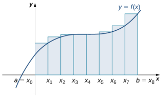

Figure 1.12 Here we use right-endpoint approximation for a region divided into eight equal subintervals.

Last, the right-endpoint approximation with $n=32$ is close to the actual area(Figure 1.13). The area is approximately
$$R_{32}\:=f\left(0.0625\right)\left(0.0625\right)+f\left(0.125\right)\left(0.0625\right)+f\left(0.1875\right)\left(0.0625\right)+\cdots+f\left(2\right)\left(0.0625\right)$$
= 8.0625.

Figure 1.13 The region is divided into 32 equal subintervals for a right-endpoint approximation.

Based on these figures and calculations, it appears we are on the right track; the rectangles appear to approximate the area under the curve better as n gets larger. Furthermore, as n increases, both the left-endpoint and right-endpoint approximations appear to approach an area of 8 square units. Table 1.1 shows a numerical comparison of the left- and right-endpoint methods. The idea that the approximations of the area under the curve get better and better as $n$ gets larger and larger is very important, and we now explore this idea in more detail.

<table>
	<tbody>
		<tr>
			<th>Values sof n</th>
			<th>Approximate Area $Ln$</th>
			<th>Approximate Area $Rn$</th>
		</tr>
		<tr>
			<td>$n=4$</td>
			<td>7.5</td>
			<td>8.5</td>
		</tr>
		<tr>
			<td>$n=8$</td>
			<td>7.75</td>
			<td>8.25</td>
		</tr>
		<tr>
			<td>32 $\eta=$</td>
			<td>7.94</td>
			<td>8.06</td>
		</tr>
	</tbody>
</table>

Table 1.1 Converging Values of Left- and Right-Endpoint Approximations as n Increases

## Forming Riemann Sums

So far we have been usinq rectanqles to approximate the area under a curve.The heiqhts of these rectanqles have been determined by evaluating the function at either the right or left endpoints of the subinterval $\left[x_{i-1},x_{i}\right].$ In reality, there is no reason to restrict evaluation of the function to one of these two points only. We could evaluate the function at any point $x_i^*$ in the subinterval $\left[x_{i-1},x_{i}\right]$, and use $f\left(x_{i}^{*}\right)$ as the height of our rectangle. This gives us an estimate for the area of the form

$$A\approx\sum_{i=1}^{n}f\left(x_{i}^{*}\right)\Delta x.$$

A sum of this form is called a Riemann sum.named for the 19th-centurymathematician Bernhard Riemann.who developed the idea

### Definition

Let $f\left(x\right)$ be defined on a closed interval $[a,b]$ and let $P$ be a regular partition of $[a,b].$ Let △x be the width of each subinterval $\left[x_{i-1},x_i\right]$ and for each $i$, let $x_{i}^{*}$ be any point in $\left[x_{i-1},x_{i}\right].$ A Riemann sum is defined for $f(x)$ as

$$\sum_{i=1}^{n}f\left(x_{i}^{*}\right)\Delta x.$$

Recall that with the left- and right-endpoint approximations, the estimates seem to get better and better as n get larger and larger. The same thing happens with Riemann sums. Riemann sums give better approximations for larger values of n. We are now ready to define the area under a curve in terms of Riemann sums

### Definition

Let $f\left(x\right)$ be a continuous, nonegativefuntion on an interal $[a,b]$ , and let $\sum_{i=1}^{n}f\left(x_{i}^{*}\right)\Delta x$ be a Rieman sum for $f\left(x\right)$ .Then,the area under the curve $y=f\left(x\right)$ on $[a,b]$ is givenby

$$A=\lim_{n\to\infty}\sum_{i=1}^{n}f\left(x_{i}^{*}\right)\Delta x.$$

### MEDIA

See a graphical demonstration (http:/www.openstax.org/l/20 riemannsums) of the construction of a Riemann sum.

Some subtleties here are worth discussing.First,note that taking the limit of a sum is a little different from taking the limit of a function $f(x)$ as $x$ goes to infinity. Limits of sums are discussed in detail in the chapter on Sequences ano Series; however, for now we can assume that the computational techniques we used to compute limits of functions can also be used to calculate limits of sums.

### EXAMPLE 1.6

Finding Lower and Upper Sums for $f(x)=\sin x$ Find a lower sum for $f(x)=\sin x$ over the interval $[a,b]=[0,\frac{\pi}{2}]$ ;let $n=6$

### のSolution

Let's first look at the graph in Figure 1.15 to get a better idea of the area of interest.

Figure 1.15 The graph of $y=$ y= $y=\sin x$ is divided into six regions: $\Delta x=\frac{\pi/2}{6}=\frac{\pi}{12}$

 The intervals are [0, [0, $[0,\frac{\pi}{12}]$ ，[否，]、[，]、[，引]，[，]，and[，].Note that $f(x)=\sin x$ is increasing on the interval $\left[0,\frac{\pi}{2}\right]$, so a left-endpoint approximation gives usthe lower sum.A left-endpoint approximation is the Riemann

Su n$\sum_i=0^5\sin x_i\left(\frac{\pi}{12}\right)$ Wehave
$$\begin{array}{rcl}A&\approx\sin\left(0\right)\left(\frac{\pi}{12}\right)+\sin\left(\frac{\pi}{12}\right)\left(\frac{\pi}{12}\right)+\sin\left(\frac{\pi}{6}\right)\left(\frac{\pi}{12}\right)+\sin\left(\frac{\pi}{4}\right)\left(\frac{\pi}{12}\right)+\sin\left(\frac{\pi}{3}\right)\left(\frac{\pi}{12}\right)+\sin\left(\frac{5\pi}{12}\right)\left(\frac{\pi}{12}\right)\end{array}$$
= 0.863.

$\boxed{-1}$ 1.6Using the function $f\left(x\right)=\sin x$ over the interval $\left [ 0, \frac \pi 2\right ]$ , find an upper sum; let n = 6

### SECTION 1.1 EXERCISES

1.State whether the given

sums are equal or unequal.

b. and-5) (R-)

In the following exercises. yse the rules for sums of powers of integers to compute the sums

#
$$\begin{aligned}&Supposethat\sum_{i=1}^{100}a_{i}\:=\:15\:and\:\sum_{i=1}^{100}b_{i}\:=\:-12.\:In\:the\:following\:exercises,\:compute\:the\:sums.\\&4.\sum_{i=1}^{100}(a_{i}+b_{i})\quad5.\quad\sum_{i=1}^{100}(a_{i}-b_{i})\quad6.\quad\sum_{i=1}^{100}(3a_{i}-4b_{i})\\&7.\sum_{i=1}^{100}(5a_{i}+4b_{i})\end{aligned}$$

$$3.\sum_{i=5}^{10}i^2$$

In the following exercises,use summationproperties and formulas torewrite and evaluate the sums
$$\mathbf{8}.\sum_{k=1}^{20}100\left(k^{2}-5k+1\right)\mathbf{9}.\sum_{j=1}^{50}\left(j^{2}-2j\right)\mathbf{10}.\sum_{j=11}^{20}\left(j^{2}-10j\right)\\\mathbf{11}.\sum_{k=1}^{25}\left[(2k)^{2}-100k\right]$$

Let $L_n$ denote the left-endpoint sum using n subintervals and let $R_{n}$ denote the corresponding right-endpoint sum. In the following exercises, compute the indicated left and right sums for the given functions on the indicated interval

12. $L_4$ for f (x) = on [2,3]

13. $R_{4}$ for $g\left(x\right)=\cos\left(\pi x\right)$ on [0, 1]

14. $L_6$ for $f\left(x\right)=\frac{1}{x\left(x-1\right)}$ on [2,5]

17. $L_4$ for on [-2,2]

16. $R_4$ for $\frac{1}{x^{2}+1}$ on [2,2]

15. $R_6$ for $f(x)=\frac{1}{x(x-1)}$ on [2,5]

18. $R_{8}$ for $x^{2}-2x+1$ on [0,2]

19. $L_{8}$ for $x^{2}-2x+1$ on [0, 2]

20.Compute the left and right Riemann sums- $\cdot L_4$ and $R_{4}$ respectively-for $f\left(x\right)=\left(2-\left|x\right|\right)$ on [-2,2] .Compute their average value and compare it with the area under the graph of $f.$

22.Compute the left and right Riemann sums—L4 and $R_{4r}$ respectively-for $f(x)={\sqrt{4-x^{2}}}$ on [-2,2] and compare their values.

23.Compute the left and right Riemann sums—L6 and $R_6$ respectively-for $f\left(x\right)=\sqrt{9-\left(x-3\right)^{2}}$ on [0,6] and compare their values.

21.Compute the left and right Riemann sums—L6 and $R_{6,}$ respectively-for $f(x)=(3-|3-x|)$ on [0, 6]. Compute their average value and compare it with the area under the graph of f.

Express the following endpoint sums in sigma notation but do not evaluate them

24. $L_{30}$ for $f\left(x\right)=x^{2}$ on[1,2]

25. $L_{10}$ for $f\left(x\right)=\sqrt{4-x^{2}}$ on [2,2]

26. $R_{20}$ for $f(x)=\sin x$ on $[0,\pi]$

27. $R_{100}$ for lnx on[1,e]

In the following exercises, graph the function then use a calculator or a comouter program to evaluate the following lef and right endpoint sums. If the two agree, say "neither.

29.[T] $L_{100}$ and $R_{100}$ for $y=x^{2}$ on the interval [0,1]

28.[T] $L_{100}$ and $R_{100}$ for $y=x^{2}-x+3$ on the interval [-1, 1]

30.[T] $L50$ and $R50$ for $y=\frac{x+1}{x^{2}-1}$ on the interval [2,4]

31.[T] $L_{100}$ and $R_{100}$ for [-1,1] $y=x^{3}$ (-1. on the interal

33.[T] $L_{100}$ and $R_{100}$ for $y=e^{2x}$ on the interval [-1,1]

32.[T] $L50$ and $R_{50}$ for $y=\tan\left(x\right)$ on the interval [0.]

35. Let $r_{j}$ denote the total rainfall in Portland on the jth day of the year in 2009 Interee $\sum_{j=1}^{31}r_j.$

34. Let $t_{j}$ denote the time that it took Tejay van Garteren toride the/th stage of the Tour de France in 2014.If there were a total of 21 stage itere $\sum_{j=1}^{21}t_j$

36.Let $d_{j}$ denote the hours of daylight and $\delta_{j}$ denote the increase in the hours of daylight from day $j-1$ to day/ in Fargo, North Dakota, on the jth day of the year. Interpret
$$d_1+\sum_{j=2}^{365}\delta_j.$$

39. The following table gives the approximate increase in sea level in inches over 20 years starting in the given year. Estimate the net change in mean sea level from 1870 to 2010.

37.To help get in shape,Joe gets a new pair of running shoes. If joe runs 1 mi each day in week 1 and adds $\frac{1}{10}$ mi to his daily routine each week, what is the total mileage on Joe's shoes after 25 weeks?

38.The following table gives approximate values of the average annual atmospheric rate of increase in carbon dioxide $(\mathrm{CO}_{2})$ each decade since 1960, in parts per million (ppm). Estimate the total increase in atmospheric $c0_2$ between 1964 and 2013.

<table>
	<tbody>
		<tr>
			<th>Starting Year</th>
			<th>20-Year Change</th>
		</tr>
		<tr>
			<td>1870</td>
			<td>0.3</td>
		</tr>
		<tr>
			<td>1890</td>
			<td>1.5</td>
		</tr>
		<tr>
			<td>1910</td>
			<td>0.2</td>
		</tr>
		<tr>
			<td>1930</td>
			<td>2.8</td>
		</tr>
		<tr>
			<td>1950</td>
			<td>0.7</td>
		</tr>
		<tr>
			<td>1970</td>
			<td>1.1</td>
		</tr>
		<tr>
			<td>1990</td>
			<td>1.5</td>
		</tr>
	</tbody>
</table>

<table>
	<tbody>
		<tr>
			<th>Decade</th>
			<th>$Ppm/y$</th>
		</tr>
		<tr>
			<td>1964-1973</td>
			<td>1.07</td>
		</tr>
		<tr>
			<td>1974-1983</td>
			<td>1.34</td>
		</tr>
		<tr>
			<td>1984-1993</td>
			<td>1.40</td>
		</tr>
		<tr>
			<td>1994-2003</td>
			<td>1.87</td>
		</tr>
		<tr>
			<td>2004-2013</td>
			<td>2.07</td>
		</tr>
	</tbody>
</table>

Table 1.2 Average Annual Atmospheric $co_2$ Increase 1964-2013 Source http://www.esrl.noaa.g ov/gmd/ccgg/trends/

Table 1.3 Approximate 20-Year Sea Level Increases,1870-1990 Source: http://link.springer.com/ article/ 10.1007%2Fs10712-011-9119 -1

40.The following table gives the approximate increase in dollars in the average price of a gallon of gas per decade since 1950. If the average price of a gallon of gas in 2010 was $\$2.60$ what was the average price of a gallon of gas in 1950?

<table>
	<tbody>
		<tr>
			<th>Starting Year</th>
			<th>10-Year Change</th>
		</tr>
		<tr>
			<td>1950</td>
			<td>0.03</td>
		</tr>
		<tr>
			<td>1960</td>
			<td>0.05</td>
		</tr>
		<tr>
			<td>1970</td>
			<td>0.86</td>
		</tr>
		<tr>
			<td>1980</td>
			<td>-0.03</td>
		</tr>
		<tr>
			<td>1990</td>
			<td>0.29</td>
		</tr>
		<tr>
			<td>2000</td>
			<td>1.12</td>
		</tr>
	</tbody>
</table>

Table 1.4 Approximate 10-Year Gas Price Increases,1950-2000 Source: http://epb.lbl.gov/ homepages/Rick_Diamond/ docs/lbnl55011-trends.pdf

41. The following table gives the percent growth of the U.S. population beginning in July of the year indicated.If the U.S population was 281,421,906 in July 2000, estimate the U.S. population inJuly 2010

<table>
	<tbody>
		<tr>
			<th>Year</th>
			<th>96 Change/Year</th>
		</tr>
		<tr>
			<td>2000</td>
			<td>1.12</td>
		</tr>
		<tr>
			<td>2001</td>
			<td>0.99</td>
		</tr>
		<tr>
			<td>2002</td>
			<td>0.93</td>
		</tr>
		<tr>
			<td>2003</td>
			<td>0.86</td>
		</tr>
		<tr>
			<td>2004</td>
			<td>0.93</td>
		</tr>
		<tr>
			<td>2005</td>
			<td>0.93</td>
		</tr>
		<tr>
			<td>2006</td>
			<td>0.97</td>
		</tr>
		<tr>
			<td>2007</td>
			<td>0.96</td>
		</tr>
		<tr>
			<td>2008</td>
			<td>0.95</td>
		</tr>
		<tr>
			<td>2009</td>
			<td>0.88</td>
		</tr>
	</tbody>
</table>
Table 1.5 Annyal

 Percentage Growth of U.S.Population 2000-2009 Source: http://www.census.gov/ popest/data

(Hint: To obtain the population in July 2001, multiply the population in July 2000 by 1.0112 to get 284,573,831.

In the following exercises, estimate the areas under the curves by computing the left Riemann sums,Lg

47. [T] Use a computer algebra system to compute the Riemann sum, $L_{Nr}$ for $N=10$ , 30, 50 for $f\left(x\right)={\frac{1}{\sqrt{1+x^{2}}}}$ on [-1, 1]

46.[T] Use a computer algebra system to compute the Riemann sum, $L_{N}$ ,for $N=10,30,50$ for $f(x)=\sqrt{1-x^{2}}$ on [-1,1]

48.[T] Use a computer algebra system to compute the Riemann sum, $L_{N}.$ for $N=10$ ,30,50 for $f(x)=\sin^{2}x$ on $[0,2\pi]$ Compare these estimates with πt.

In the following exercises, use a calculator or a computer program to evaluate the endpoint sums Rn and Ln for $N=1,10,100$ How do these estimates compare with the exact answers, which you can find via geometry?

49.[ $\Pi y=\cos\left(\pi x\right)$ on the interval [0, 1]

50. $[\mathbf{T}]y=3x+2$ on the interval [3, 5]

In the following exercises, use a calculator or a computer program to evaluate the endpoint sums Ry and Ly for $N=1,10,100$

52.[T $1y=\ln x$ on the interval [1,2],which has an exact area of 21n (2) -1

51. $[\Pi]y=x^{4}-5x^{2}+4$ on the interval [2, 2], which has an exact area off $\frac{32}{15}$

53.Explain why, if $f(a)\geq0$ and fis increasing on $[a,b]$ ,that the left endpoint estimate is a lower bound for the area below the graph of fon $[a,b]$

55.Show that, in general
$$R_N-L_N=(b-a)\times\frac{f(b)-f(a)}{N}.$$

54. Explain why, if $f(b)\geq0$ and $f$ is decreasing on $[a,b]$ ,that the left endpoint estimate is an upper bound for the area below the graph of fon $[a,b]$

57.For eachof the three qraphs: a.Obtain a lower bound $L\left(A\right)$ for the area enclosed by the curve by smaller while $U\left(A\right)$ gets addinq the areasof the squares enc/osed completely by the curve. b.Obtain an upper bound $U\left(A\right)$ fo

58.In the previous exercise explain why $L\left(A\right)$ gets no no larqer as the squares are subdivided into four boxes of equal area.

the area by adding to $L\left(A\right)$ the areas $B\left(A\right)$ of the squares enclosed partially by the curve

Graph 1

Graph 2

Graph3

56. Explain why, if fis increasing on $[ a, b]$ , the error between either $L_{N}$ or $R_{N}$ and the area A below the graph of fis at most $(b-a)\frac{f(b)-f(a)}{N}$

59. A unit circle is made up of n wedges equivalent to the inner wedge in the figure. The base of the inner triangle is 1 unit and its height is sin $\left(\frac{2\pi}{n}\right).$ The base of the outer triangle is $B=\cos\left(\frac{\pi}{n}\right)+\sin\left(\frac{\pi}{n}\right)\tan\left(\frac{\pi}{n}\right)$ and the height is $H=B\sin\left(\frac{2\pi}{n}\right).$ Use this information to argue that the area of a unit circle is equal to TL.

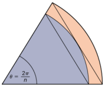

# 1.2 The Definite Integral.

# Learning Objectives

1.2.1State the definition of the definite integral. 1.2.2 Explainthe terms integrand, limits of integration, and variable of integratior 1.2.3 Explain when a functin i integrable 1.2.4 Describe the relationship between the definite integral and net area. 1.2.5Use geometry and the properties of definite integrals to evaluate them 1.2.6Calculate the average value of a function

In the preceding section we defined the area under a curve in terms of Riemann sums:

$$A=\lim_{n\to\infty}\sum_{i=1}^{n}f\left(x_{i}^{*}\right)\Delta x.$$

However, this definition came with restrictions. We required $f(x)$ to be continuous and nonnegative. Unfortunately, real world problems don't always meet these restrictions. In this section, we look at how to apply the concept of the area under the curve to a broader set of functions through the use of the definite integral

## Definition and Notation

The definite integral generalizes the concept of the area under a curve. We lift the requirements that $f(x)$ be continuous and nonnegative, and define the definite integral as follows.

### Definition

If $f\left(x\right)$ is a function defined on an interval $[a,b]$ ,the definite integral of ffrom a to bis given by

$$\int_{a}^{b}f\left(x\right)dx=\lim_{n\to\infty}\sum_{i=1}^{n}f\left(x_{i}^{*}\right)\Delta x,$$

 provided the limit exists. If this limit exists, the function $f(x)$ is said to be integrable on $[a,b]$ , or is an integrable function.

The integral symbol in the previous definition should look familiar. We have seen similar notation in the chapter on Applications of Derivatives (http://openstax.org/books/calculus-volume-1/pages/4-introduction), where we used the indefinite integral symbol (without the a and b above and below) to represent an antiderivative. Although the notation for indefinite integrals may look similar to the notation for a definite integral, they are not the same. A definite integral is a number. An indefinite integral is a family of functions. Later in this chapter we examine how these concepts are related. However, close attention should always be paid to notation so we know whether we're working with a definite integral or an indefinite integral.

Integral notation goes back to the late seventeenth century and is one of the contributions of Gottfried Wilhelm Leibniz who is often considered to be the codiscoverer of calculus, along with Isaac Newton.The integration symbol is an elongated S, suggesting sigma or summation. On a definite integral, above and below the summation symbol are the boundaries of the interval, [a, b]. The numbers a and b are x-values and are called the limits of integration; specifically a is the lower limit and b is the upper limit. To clarify, we are using the word limit in two different ways in the context of

the definite integral. First, we talk about the limit of a sum as $n\to\infty$ Second,the boundaries of theregion are called the limits of integration

We call the function $f(x)$ the integrand, and the dx indicates that $f(x)$ is a function with respect to $x$, called the variable of integration.Note that,like the index in a sum, the variable of integration is a dummy variable, and has no impact on the computation of the integral. We could use any variable we like as the variable of integration

$$\int_{a}^{b}f\left(x\right)dx=\int_{a}^{b}f\left(t\right)dt=\int_{a}^{b}f\left(u\right)du$$

Previously, we discussed the fact that if $f(x)$ is continuous on $[a,b]$ ,then the limit lim ≥ f (x* )△x exists and i →00 j=

unique. This leads to the following theorem, which we state without proof

### Theorem 1.1

### Continuous Functions Are Integrablee

If $f(x)$ is continuous on $[a,b]$ ,then fis integrable on $[a,b]$

Functions that are not continuous on $[a,b]$ may still be integrable, depending on the nature of the discontinuities. For example, functions continuous on a closed interval, apart from a finite number of jump discontinuities, are integrable

It is also worth noting here that we have retained the use of a regular partition in the Riemann sums. This restriction is not strictly necessary. Any partition can be used to form a Riemann sum. However, if a nonregular partition is used tc define the definite integral, it is not sufficient to take the limit as the number of subintervals goes to infinity. Instead, we must take the limit as the width of the largest subinterval goes to zero. This introduces a little more complex notation in our limits and makes the calculations more difficult without really gaining much additional insight, so we stick with regular partitions for the Riemann sums

# EXAMPLE 1.7

### Evaluating an Integral Using the Definition USse the deiniton te deinteintega t iaelaa $\int_{0}^{2}x^{2}dx$ Use a riht endpoin aproimaton o genert t

Riemann sum.

## $①$ Solution

We first want to set up a Riemann sum.Based on the limits of integration, we have $a=0$ and $b=2$ .For $i=0,1,2,...,n$ let $P=\{x_{i}\}$ be a regular partition of [0, 2] . Then

$$\Delta x=\frac{b-a}{n}=\frac2n.$$

Since we are using a right-endpoint approximation to generate Riemann sums, for each $i_n$ we need to calculate the function value at the right endpoint of the interval $\left[x_{i-1},x_{i}\right].$ The right endpoint of the interval is $x_i$ , and since $P$ is a regular partition,

$$x_i=x_0+i\Delta x=0+i\left[\frac{2}{n}\right]=\frac{2i}{n}.$$

Thus, the function value at the right endpoint of the interval is

$$f\left(x_i\right)=x_i^2=\left(\frac{2i}{n}\right)^2=\frac{4i^2}{n^2}.$$

Then the Riemann sum takes the form

$$\sum_{i=1}^{n}f\left(x_{i}\right)\Delta x=\sum_{i=1}^{n}\left(\frac{4i^{2}}{n^{2}}\right)\frac{2}{n}=\sum_{i=1}^{n}\frac{8i^{2}}{n^{3}}=\frac{8}{n^{3}}\sum_{i=1}^{n}i^{2}.$$

Usin tesumato foruafor $\sum_{i=1}^ni^2$, wehave

$$\sum_{i=1}^{n}f\left(x_{i}\right)\Delta x\:=\frac{8}{n^{3}}\sum_{i=1}^{n}i^{2}$$

$$\begin{aligned}
&=\frac{8}{n^{3}}\biggl[\frac{n(n+1)(2n+1)}{6}\biggr] \\
&=\frac{8}{n^{3}}\left[\frac{2n^{3}+3n^{2}+n}{6}\right] \\
&=\frac{16n^{3}+24n^{2}+8n}{6n^{3}} \\
&=\frac{8}{3}+\frac{4}{n}+\frac{8}{6n^{2}}.
\end{aligned}$$

Now, to calculate the definite integral, we need to take the limit as $n\to\infty$ .We ge

$$\begin{matrix}\int_0^2x^2dx&=\lim_{n\to\infty}\sum_{i=1}^nf\left(x_i\right)\Delta x\end{matrix}$$

$$\begin{aligned}
&=\lim_{n\to\infty}\left(\frac{8}{3}+\frac{4}{n}+\frac{8}{6n^{2}}\right) \\
&=\lim_{n\to\infty}\left(\frac{8}{3}\right)+\lim_{n\to\infty}\left(\frac{4}{n}\right)+\lim_{n\to\infty}\left(\frac{8}{6n^{2}}\right) \\
&=\frac83+0+0=\frac83.
\end{aligned}$$

 1 us he deintono thedeint intera t evalate $\int_0^3\left(2x-1\right)dx.$ Sse arght endpin aproeination to generate the Riemann sum.

## Evaluating Definite Integrals

Evaluating definite integrals this way can be quite tedious because of the complexity of the calculations. Later in this chapter we develop techniques for evaluating definite integrals without taking limits of Riemann sums. However, for now, we can rely on the fact that definite integrals represent the area under the curve, and we can evaluate definite integrals by using geometric formulas to calculate that area. We do this to confirm that definite integrals do, indeed represent areas, so we can then discuss what to do in the case of a curve of a function dropping below the x-axis

### EXAMPLE 1.8

Using Geometric Formulas to Calculate Definite Inteqrals

Use te formula forthearaoa cicleto ealate $\int_{3}^{6}\sqrt{9-(x-3)^{2}}dx.$

### Solution

The function describes a semicircle with radius 3. To find

$$\int_{3}^{6}\sqrt{9-\left(x-3\right)^{2}}dx,$$

we want to find the area under the curve over the interval[3,6]. The formula for the area of a circle is $A=\pi r^{2}$ .The area of a semicircle is just one-half the area of a circle, or $A=\left(\frac{1}{2}\right)\pi r^{2}.$ The shaded area in Figure 1.16 covers one-half of the semicircle, or $A=\left({\frac{1}{4}}\right)\pi r^{2}.$ Thus,

Figure 1.16 The value of the integral of the function $f\left(x\right)$ over the interval [3, 6] is the area of the shaded region

 1 use th formul forth area o rapezi t valuate J (x 3 dx

### Area and the Definite Integral

When we defined the definite integral, we lifted the requirement that $f\left(x\right)$ be nonnegative.But how do we interpret“the area under the curve” when $f(x)$ is negative?

### NetSigned Area

Let us return to the Riemann sum. Consider, for example, the function $f\left(x\right)=2-2x^{2}$ (shown in Eigure 1.17) on the interval [0,2] . Use $n=8$ and choose $\{x_i^*\}$ as the left endpoint of each interval. Construct a rectangle on each subinterval of height $f\left(x_{i}^{*}\right)$ and width $\Delta x.$ When $f\left(x_{i}^{*}\right)$ is positive, the product $f\left(x_{i}^{*}\right)$ .x represents the area of the rectangle, as before. When $f\left(x_{i}^{*}\right)$ is negative, however, the product $f\left(x_{i}^{*}\right)\Delta x$ represents the negative of the area of the rectangle.The Riemann sum then becomes

 f (x*）△x = (Area of rectangles above thex-axis) - (Area of rectangles below the $X$ -axis)

Figure 1.17 For a function that is partly negative, the Riemann sum is the area of the rectangles above the x-axis less the area of the rectanqles below the x-axis

Taking the limit as $n\to\infty$ ,the Riemann sum approaches the area between the curve above the x-axis and the x-axis, less the area between the curve below the x-axis and the x-axis, as shown in Figure 1.18. Then,

$$\begin{aligned}\int_{0}^{2}f\left(x\right)dx&=\lim_{n\to\infty}\sum_{i=1}^{n}f\left(c_{i}\right)\Delta x\\&=A_{1}-A_{2}.\end{aligned}$$

The quantity $A_1-A_2$ is called the net signed area

Figure 1.18 In the limit, the definite integral equals area A less area $A_{2r}$ or the net signed area

Notice that net signed area can be positive, negative, or zero.If the area above the x-axis is larger, the net signed area is positive.If the areabelow the x-axis is larger,the net signed area is negative.If the areas above and below the x-axis are equal,the net siqned area iszero

### EXAMPLE1.9

### Finding the Net Signed Area

Find the net signed area between the curve of the function $f(x)=2x$ and the x-axis over the interval [3,3].

## $②$ Solution

The function produces a straight line that forms two triangles: one from $x=-3$ to $x=0$ and the other from $x=0$ to $x=3$ (Eigure 1.19). Using the geometric formula for the area of a triangle, $A=\frac{1}{2}bh$ ,the area of triangle $A_1$ ,above the axis, is

$$A_{1}=\frac{1}{2}3\:(6)=9,$$

where 3 is the base and $2\left(3\right)=6$ is the height. The area of triangle $A_2.$ below the axis,is

$$A_{2}=\frac{1}{2}(3)\:(6)=9,$$

where 3 is the base and 6 is the height. Thus, the net area is

$$\int_{-3}^32xdx=A_1-A_2=9-9=0.$$

Figure 1.19 The area above the curve and below the x-axis equals the area below the curve and above the x-axis

If $A_1$ is the area above the x-axis and $A_2$ is the area below the x-axis, then the net area is $A_{1}-A_{2}.$ Since the areas of the two triangles are equal, the net area is zero.

1.9 Find the net signed area of $f\left(x\right)=x-2$ over the interval [0, 6], llustrated in the following image

### Total Area

One application of the definite integral is finding displacement when given a velocity function. If $\upsilon\left(t\right)$ represents the velocity of an object as a function of time, then the area under the curve tells us how far the object is from its original position. This is a very important application of the definite integral, and we examine it in more detail later in the chapter. For now, we're just going to look at some basics to get a feel for how this works by studying constant velocities.

When velocity is a constant, the area under the curve is just velocity times time. This idea is already very familiar. If a car travels away from its starting position in a straight line at a speed of 70 mph for 2 hours, then it is 140 mi away from its oriqinal position (Eigure 1.20). Using inteqral notation, we have

$$\int_0^270dt=140.$$

Figure 1.20 The area under the curve $\upsilon\left(t\right)=70$ tells us how far the car is from its starting point at a given time.

In the context of displacement, net signed area allows us to take direction into account. If a car travels straight north at a speed of 60 mph for 2 hours, it is $120mi$ north of its starting position. If the car then turns around and travels south at a speed of 40 mph for 3 hours, it will be back at it starting position (Figure 1.21). Again, using integral notation, we have

$$\begin{aligned}\int_{0}^{2}60dt+\int_{2}^{5}-40dt&=120-120\\&=0.\end{aligned}$$

In this case the displacement is zero.

Figure 1.21 The area above the axis and the area below the axis are equal, so the net signed area is zero.

Suppose we want to know how far the car travels overall, regardless of direction. In this case, we want to know the area between the curve and the x-axis, regardless of whether that area is above or below the axis. This is called the total area.

Graphically, it is easiest to think of calculating total area by adding the areas above the axis and the areas below the axis (rather than subtracting the areas below the axis, as we did with net signed area). To accomplish this mathematically, we use the absolute value function. Thus, the total distance traveled by the car is

$$\begin{aligned}
\int_{0}^{2}|60|\:dt+\int_{2}^{5}|-40|\:dt& =\int_{0}^{2}60dt+\int_{2}^{5}40dt \\
&=120+120 \\
&=240.
\end{aligned}$$

Bringing these ideas together formally, we state the following definitions

### Definition

Let $f\left(x\right)$ be an integrable function defined on an interval $[a,b].$ Let $A_1$ represent the area between $f\left(x\right)$ andthe x-axis that lies above the axis and let $A_2$ represent the area between $f\left(x\right)$ and the x-axis that lies below the axis. Then, thenet signed area between $f(x)$ and the x-axis is given by

$$\int_{a}^{b}f\left(x\right)dx=A_{1}-A_{2}.$$

The total area between $f\left(x\right)$ and the x-axis is given by

$$\int_a^b|f(x)|\:dx=A_1+A_2.$$

# EXAMPLE 1.10

### Finding the Total Area

Find the total area between $f(x)=x-2$ and the x-axis over the interval [0, 6] .

Calculate the x-intercept as (2,0) (set $y=0$ , solve for x). To find the total area, take the area below the x-axis over the subinterval[0, 2] and add it to the area above the x-axis on the subinterval [2, 6](Figure 1.22)

Figure 1.22 The total area between the line and the x-axis over [0,6] is Az plus A1

We have

$$\int_0^6|(x-2)|\:dx=A_2+A_1\:.$$

Then,using the formula for the area of a triangle,we obtain

$$\begin{gathered}
A_{2}=\frac{1}{2}bh=\frac{1}{2}\cdot2\cdot2=2 \\
A_{1}={\frac{1}{2}}bh={\frac{1}{2}}\cdot4\cdot4=8. 
\end{gathered}$$

The total area, then, is

$$A_1+A_2=8+2=10.$$

### Properties of the Definite Inteqral

The properties of indefinite integrals apply to definite integrals as well. Definite integrals also have properties that relate to the limits of integration. These properties, along with the rules of integration that we examine later in this chapter help us manipulate expressions to evaluate definite integrals.

### Rule:Properties of the Definite Integra

1.

$$\int_a^af\left(x\right)dx=0$$

If the limits of integration are the same, the integral is just a line and contains no area.

2.

$$\int_b^af\left(x\right)dx=-\int_a^bf\left(x\right)dx$$

If the limits are reversed,then place a negative sign in front of the integral.

3.

$$\int_{a}^{b}\left[f\left(x\right)+g\left(x\right)\right]dx=\int_{a}^{b}f\left(x\right)dx+\int_{a}^{b}g\left(x\right)dx$$

The integral of a sum is the sum of the integrals

4.

$$\int_{a}^{b}\left[f\left(x\right)-g\left(x\right)\right]dx=\int_{a}^{b}f\left(x\right)dx-\int_{a}^{b}g\left(x\right)dx$$

The integral of a difference is the difference of the integrals

5.

$$\int_a^bcf\left(x\right)dx=c\int_a^bf(x)dx$$

for constant c. The integral of the product of a constant and a function is equal to the constant multiplied by the integral of the function

6.

$$\int_{a}^{b}f\left(x\right)dx=\int_{a}^{c}f\left(x\right)dx+\int_{c}^{b}f\left(x\right)dx$$

Although this formula normally applies when c is between a and $b.$ the formula holds for all values of a, b, and c provided $f(x)$ is integrable on the largest interval.

### EXAMPLE 1.11

### Using the Properties of the Definite Integral Use the properties of the definite integral to express the definite integral of $f(x)=-3x^{3}+2x+2$ over the interval

[-2,1] as the sum of three definite integrals

### $②$ Solution Using integral ntatine w aeaa $\int_{-2}^{1}\left(-3x^{3}+2x+2\right)dx$ IWeapy roperies a an t toget

$$\begin{aligned}
\int_{-2}^{1}\left(-3x^{3}+2x+2\right)dx& =\int_{-2}^{1}-3x^{3}dx+\int_{-2}^{1}2xdx+\int_{-2}^{1}2dx \\
&=-3\int_{-2}^{1}x^{3}dx+2\int_{-2}^{1}xdx+\int_{-2}^{1}2dx.
\end{aligned}$$

Use the properties of the definite integral to express the definite integral of $f\left(x\right)=6x^{3}-4x^{2}+2x-3$ $\boxed{\sqrt{2}}$ 1.11 over the interval [1,3] as the sum of four definite integrals.

# EXAMPLE 1.12

## Using the Properties of the Definite Integral

Ifits nowthat $\int_{0}^{8}f\left(x\right)dx=10$ and $\int_{0}^{5}f\left(x\right)dx=5$ fin the valueof $\int _{5}^{8}f( x)$ $dx$

### Solution

By property 6.,

$$\int_{a}^{b}f\left(x\right)dx=\int_{a}^{c}f\left(x\right)dx+\int_{c}^{b}f\left(x\right)dx.$$

Thus,

$$\begin{aligned}\int_{0}^{8}f\left(x\right)dx&=\:\int_{0}^{5}f\left(x\right)dx+\int_{5}^{8}f\left(x\right)dx\\10&=\:5+\int_{5}^{8}f\left(x\right)dx\\5&=\:\int_{5}^{8}f\left(x\right)dx.\end{aligned}$$

$$\boxed{\checkmark}\quad112\quad\text{If it is known that}\int_1^5f\left(x\right)dx=-3\mathrm{~and}\int_2^5f\left(x\right)dx=4,\text{find the value of}\int_1^2f\left(x\right)dx.$$

### Comparison Properties of Integrals

A picture can sometimes tell us more about a function than the results of computations. Comparing functions by their graphs as well as by their algebraic expressions can often give new insight into the process of integration. Intuitively, we might say that if a function $f(x)$ is above another function $g(x)$ ,then the area between $f\left(x\right)$ and the x-axis is greater than the area between $g\left(x\right)$ and the x-axis. This is true depending on the interval over which the comparison is made. The properties of definite integrals are valid whether $a<b,a=b$ or $a>b$ . The following properties, however, concern only the case $a\leq b$ , and are used when we want to compare the sizes of integrals.

### Theorem 1.2

### Comparison Theorem

i.If $f(x)\geq0$ for $a\leq x\leq b$ ,then

$$\int_{a}^{b}f\left(x\right)dx\geq0.$$

ilIf $f\left(x\right)\geq g\left(x\right)$ for $a\leq x\leq b$ .then

$$\int_{a}^{b}f\left(x\right)dx\geq\int_{a}^{b}g\left(x\right)dx.$$

ii.If m and M are constants such that $m\leq f\left(x\right)\leq M$ for $a\leq x\leq b$, then

$$\begin{aligned}m\left(b-a\right)&\leq\int_{a}^{b}f\left(x\right)dx\\&\leq M\left(b-a\right).\end{aligned}$$

# EXAMPLE 1.13

### Comparing Two Functions over a Given Interval Compare $f(x)=\sqrt{1+x^{2}}$ and $g\left(x\right)={\sqrt{1+x}}$ over the interval [0, 1].

Graphinq these functions is necessary to understand how they compare over the interval [0, 1]. Initially, when qraphed on a graphing calculator, $f\left(x\right)$ appears to be above $g\left(x\right)$ everywhere. However, on the interval [0, 1], the graphs appear to be on top of each other. We need to zoom in to see that, on the interval $[0,1],g\left(x\right)$ (x) $(x)$ is above $f(x)$ The two functions intersect at $x=0$ and $x=1$ (Fiqure 1.23)

Figure 1.23 (a) The function $f\left(x\right)$ appears above the function $g\left(x\right)$ except over the interval [0, 1] (b) Viewing the same graph with a greater zoom shows this more clearly

We can see from the graph that over the interval $[0,1],g(x)\geq f(x).$ Comparing the integrals over the specified interval [0 l e als ethat $\int_{0}^{1}g\left(x\right)dx\geq\int_{0}^{1}f\left(x\right)dx$ (Eigure124. he tin,redshaded arashowsut how uch difference there is between these two integrals over the interval [0, 1]

Figure 1.24 (a) The graph shows that over the interval $[0,1],g\left(x\right)\geq f\left(x\right)$, where equality holds only at the endpoints of theinterval.(b) Viewing thesame qraph with a qreaterzoom shows thismore clearly

## Average Value of a Function

We oftenneed tofind the average ofa setofnumbers.such asan averaae test arade.Supposeyou received the following test scores in your algebra class: 89, 90, 56, 78, 100, and 69. Your semester grade is your average of test scores and you want to know what grade to expect. We can find the average by adding all the scores and dividing by the number of scores.In this case, there are six test scores.Thus

$$\frac{89+90+56+78+100+69}{6}=\frac{482}{6}\approx80.33.$$

Therefore, your average test grade is approximately 80.33, which translates to a B- at most schools.

Suppose, however, that we have a function $\upsilon\left(t\right)$ that gives us the speed of an object at any time $t_r$ and we want to find the object's average speed. The function $v\left(t\right)$ takes on an infinite number of values, so we can't use the process just described. Fortunately, we can use a definite integral to find the average value of a function such as this.

Let $f(x)$ be continuous over the interval $[a,b]$ and let $[a,b]$ be divided into $m$ subintervals of width $\Delta x=(b-a)/n$ Choose a representative $x_i^*$ in each subinterval and calculate $f\left(x_{i}^{*}\right)$ for $i=1,2,\ldots,n.$ In other words, consider each $f\left(x_i^*\right)$ as a sampling of the function over each subinterval. The average value of the function may then be approximated as

$$\frac{f\left(x_1^*\right)+f\left(x_2^*\right)+\cdots+f\left(x_n^*\right)}{n},$$

which is basically the same expression used to calculate the averaae of discrete values

But we know $\Delta x=\frac{b-a}n$ ,So $n=\frac{b-a}{\Delta x}$ , and we get

$$\frac{f\left(x_1^*\right)+f\left(x_2^*\right)+\cdots+f\left(x_n^*\right)}{n}=\frac{f\left(x_1^*\right)+f\left(x_2^*\right)+\cdots+f\left(x_n^*\right)}{\frac{(b-a)}{\Delta x}}.$$

Followin h eih wt te alebe, te emeratoi ten hat re eer e a $\sum_{i=1}^{n}f\left(x_{i}^{*}\right)$ and we ar didin ty fraction. To divide by a fraction, invert the denominator and multiply. Thus, an approximate value for the average value of the function is givenby

$$\begin{aligned}
\sum_{i=1}^{n}f(x_{i}^{*})\\\frac{(b-a)}{\Delta x}& =\left(\frac{\Delta x}{b-a}\right)\sum_{i=1}^{n}f\left(x_{i}^{*}\right) \\
&=\left(\frac{1}{b-a}\right)\sum_{i=1}^{n}f\left(x_{i}^{*}\right)\Delta x.
\end{aligned}$$

This is a Riemann sum.Then, to qet the exact averaqe value, take the limit as $n$ qoes to infinity. Thus, the average value of a function is given by

$$\begin{aligned}\frac{1}{b-a}&\lim_{n\to\infty}\sum_{i=1}^{n}f\left(x_{i}\right)\Delta x=\frac{1}{b-a}\int_{a}^{b}f\left(x\right)dx.\end{aligned}$$

### Definition

Let $f\left(x\right)$ be continuous over the interval $[a,b]$ .Then, the average value of the function $f\left(x\right)$ (or $f_{\mathrm{ave}})$ on $[a,b]$ is given by

$$f_{\mathrm{avc}}=\frac{1}{b-a}\int_{a}^{b}f\left(x\right)dx.$$

# EXAMPLE 1.14

 Finding the Average Value of a Linear Function Find the average value of $f\left(x\right)=x+1$ over the interval [0, 5]

First, graph the function on the stated interval, as shown in Figure 1.25.

### Solution

Figure 1.25 The graph shows the area under the function $f\left(x\right)=x+1$ over [0, 5]

The region is a trapezoid lying on its side,so we can use the area formula for a trapezoid A =h (a + b),where $h$ represents height, and a and b represent the two parallel sides. Then,

$$\begin{aligned}
\text{1} \\
\int_{0}^{5}x+1dx& =\frac{1}{2}h\left(a+b\right) \\
&=\frac{1}{2}\cdot5\cdot(1+6) \\
&=\frac{35}{2}.
\end{aligned}$$

Thus the average value of the function is

$$\frac{1}{5-0}\int_{0}^{5}x+1dx=\frac{1}{5}\cdot\frac{35}{2}=\frac{7}{2}.$$

Find the average value of $f\left(x\right)=6-2x$ over the interval [0, 3] 

### SECTION 1.2EXERCISES

In the following exercises,express the limits as integrals

60. lim ≥ (x*) △x over 61. lim (5(x) 3(x)3) Ax 6. lim sin²(2x*)A →00 j=1 over [0,1] [1,3] over [0, 2]

63.mco(2x) 4x over [0, 1]

In the following exercises. given Ln or Re as indicated. express their limits as n - 8 as definite intearals. identifving the correct intervals
$$\begin{aligned}&1.\quad L_{n}=\frac{1}{n}\sum_{i=1}^{n}\frac{i-1}{n}&&65.\quad R_{n}=\frac{1}{n}\sum_{i=1}^{n}\frac{i}{n}&&66.\quad L_{n}=\frac{2}{n}\sum_{i=1}^{n}\left(1+2\frac{i-1}{n}\right)\\&I.\quad R_{n}=\frac{3}{n}\sum_{i=1}^{n}\left(3+3\frac{i}{n}\right)&&68.\quad L_{n}=\frac{2\pi}{n}\sum_{i=1}^{n}2\pi\frac{i-1}{n}\cos\left(2\pi\frac{i-1}{n}\right)\\&P.\quad R_{n}=\frac{1}{n}\sum_{i=1}^{n}\left(1+\frac{i}{n}\right)\log\left(\left(1+\frac{i}{n}\right)^{2}\right)\end{aligned}$$

In the following exercises, evaluate the integrals of the functions graphed using the formulas for areas of triangles ana. circles,and subtracting the areas below the x-axis

In the following exercises, evaluate the integral using area formulas.

In the following exercises, use averages of values at the left (L) and right (R) endpoints to compute the integrals of the piecewise linear functions with graphs that pass through the given list of points over the indicated intervals

84. $\{(0,0),(2,1),(4,3),(5,0),(6,0),(8,3)\}$ 85. $\{(0,2),(1,0),(3,5),(5,5),(6,2),(8,0)\}$ over [0, 8] over [0,8] 86. $\{(-4,-4),(-2,0),(0,-2),(3,3),(4,3)\}$ 87. $\{(-4,0),(-2,2),(0,0),(1,2),(3,2),(4,0)\}$ over [4, 4] over [4, 4]

$$Supposethat\int_0^4f\left(x\right)dx=5\:and\int_0^2f\left(x\right)dx=-3,and\int_0^4g\left(x\right)dx=-1\:and\int_0^2g\left(x\right)dx=2.Int$$
exercises, compute the integrals

88
$$\begin{aligned}&\int_{0}^{4}\left(f\left(x\right)+g\left(x\right)\right)dx&&\mathbf{89.}\:\int_{2}^{4}\left(f\left(x\right)+g\left(x\right)\right)dx&&\mathbf{90.}\:\int_{0}^{2}\left(f\left(x\right)-g\left(x\right)\right)dx\\&.\:\int_{2}^{4}\left(f\left(x\right)-g\left(x\right)\right)dx&&\mathbf{92.}\:\int_{0}^{2}\left(3f\left(x\right)-4g\left(x\right)\right)dx&&\mathbf{93.}\:\int_{2}^{4}\left(4f\left(x\right)-3g\left(x\right)\right)dx\end{aligned}$$
91

$$\text{In the following exercises, use the identity}\int_{-A}^{A}f\left(x\right)dx=\int_{-A}^{0}f\left(x\right)dx+\int_{0}^{A}f\left(x\right)dx\text{to compute the}$$

95
$$\int_{-\sqrt{\pi}}^{\sqrt{\pi}}\frac{t}{1+\cos t}dt$$

94. $\int_{-\pi}^{\pi}\frac{\sin t}{1+t^{2}}dt$

In the following exercises, find the net signed area between $f(x)$ and the x-axis

96. $\int_{1}^{3}\left(2-x\right)dx$ (Hint Lok) at the graph of $f.$

97. $\int_{2}^{4}(x-3)^{3}dx$ (Hin: Lok at the graph of $f.$

In the following exercises, given that xdx = x2²dx = , and x3 dx =↓, compute the integrals.
$$\begin{aligned}&\int_{0}^{1}\left(1+x+x^{2}+x^{3}\right)dx&&\mathbf{99.}\:\int_{0}^{1}\left(1-x+x^{2}-x^{3}\right)dx&&\mathbf{100.}\:\int_{0}^{1}(1-x)^{2}dx\\&\cdot\:\int_{0}^{1}\left(1-2x\right)^{3}dx&&\mathbf{102.}\:\int_{0}^{1}\left(6x-\frac{4}{3}x^{2}\right)dx&&\mathbf{103.}\:\int_{0}^{1}\left(7-5x^{3}\right)dx\end{aligned}$$

98.

101.

 In the following exercises, use the comparison theorem

106. Show that
$$\int_{0}^{3}\left(x^{2}-6x+9\right)dx\geq0.\quad\int_{-2}^{3}\left(x-3\right)\left(x+2\right)dx\leq0.\quad\int_{0}^{1}\sqrt{1+x^{3}}dx\leq\int_{0}^{1}\sqrt{1+x^{2}}$$

105.Show that

104. Show that

107. Show that fVI+xdxfV1+x~dx

109. Show that
$$\int_{-\pi/4}^{\pi/4}\cos tdt\geq\pi\sqrt{2}/4.$$

108.Show that nl sinrd 2 Hint sint over [0,引]

In the following exercises,find the average value $f_{ave}$ of f between a and b, and find a point c, where $f\left(c\right)=f_{\text{ave}}$

110. $f\left(x\right)=x^{2},a=-1,b=1$ 111. $f\left(x\right)=x^{5},a=-1,b=1$ 112. $f\left(x\right)=\sqrt{4-x^{2}},a=0,b=2$ 113. $f\left(x\right)=\left(3-\left|x\right|\right),a=-3,b=3$ 114. $f\left(x\right)=\sin x,a=0,b=2\pi$ 115. $f\left(x\right)=\cos x,a=0,b=2\pi$

In the following exercises, approximate the average value using Riemann sums L1oo and $R_{100}$ How does your answer compare with the exact given answer?.

117. [T$]y=e^x/2$ over the interval [0.1]; the exact solution is $2\left(\sqrt{e}-1\right)$

116. $[ \mathbf{T} ]$ $y= \ln ( x)$ over the interval [1,4]; the exact solution is $\frac{\ln(256)}3-1$

118. $[ \mathbf{T} ]$ $y= \tan x$ over the interval $\left[0,\frac{\pi}{4}\right]$ ; the exact solution is $\frac{2\ln(2)}\pi$

119. [ $71y=\frac{x+1}{\sqrt{4-x^{2}}}$ overthe interval [1, 1]; the exact solution is $\frac{\pi}6$

In the following exercises, compute the average value using the left Riemann sums Ly for N = 1.10, 100. How does the accuracy compare with the given exact value?

121.[ $\eta y=xe^{x^2}$ over the interval [0, 2]; the exact solution is $\frac{1}{4}\big(e^{4}-1\big)$

120.[ $\mathbf{l}y=x^{2}-4$ over the interval [0, 2]; the exact solution is $-\frac{8}{3}$

122. [T] $\mid y=\left(\frac{1}{2}\right)^x$ over the interval [0,4] ; the exact solution is $\frac{15}{64\ln(2)}$

123. [T] $y=x\sin\left(x^{2}\right)$ overthe interval $[-\pi,0]$ ;the exact solution is $\frac{\cos\left(\pi^2\right)-1}{2\pi}$

126.Show that the average value of $\sin^2t$ over $[0,2\pi]$ is equal to 1/2 Without further calculation,e determine whether the average value of $\sin^2t$ over $[0,\pi]$ is also equal to 1/2.

129. Suppose that parabola $p\left(x\right)=ax^{2}+bx+c$ opens downward $(a<0)$ and has a vertex of $y={\frac{-b}{2a}}>0$ .For which interval $[A,B]$ is
$$\int_A^B\left(ax^2+bx+c\right)dx$$
as large as possible?

125. Suppose that A4 ec21a and $B=\int_{-\pi/4}^{\pi/4}\tan^2tdt$ Show that $A-B=\frac{\pi}{2}$

124. Suppose that A=J。s inrtdtand B o2dl.Show that $A+B=2\pi$ and $A=B$

127.Show that the average value of $\cos^2t$ over $[0,2\pi]$ is equal to 1/2.Without further calculation determine whether the average value of cos² (r) over $[0,\pi]$ is also equal to 1/2

128.Explain why the graphs of a quadratic function (parabola) $p\left(x\right)$ and a linear function $\ell\left(x\right)$ can intersect in at most twc points. Suppose that $p\left(a\right)=\ell\left(a\right)$ and $p\left(b\right)=\ell\left(b\right)$ ,and that
$$\int_{a}^{b}p\left(t\right)dt>\int_{a}^{b}\ell\left(t\right)dt.$$

$$\begin{aligned}
&Explainwny \\
&\int_{c}^{d}p\left(t\right)>\int_{c}^{d}\ell\left(t\right)dt \\
&\mathrm{whenever}\:a\leq c<d\leq b.
\end{aligned}$$

131. Suppose fand $g$ are continuous functions such that
$$\int_{c}^{d}f\left(t\right)dt\leq\int_{c}^{d}g\left(t\right)dt$$
for every subinterval [c,d] of $[a,b]$ . Explain why $f(x)\leq g(x)$ for all values of $X$

130.Suppose $[a,b]$ can be subdivided into subintervals such that either $f\geq0$ over $\begin{bmatrix}a_{i-1},a_i\end{bmatrix}$ or $f\leq0$ over $\left[a_{i-1},a_{i}\right].$ Set
$$A_{i}=\int_{a_{i-1}}^{a_{i}}f\left(t\right)dt.$$
a.Explain why
$$\int_{a}^{b}f\left(t\right)dt=A_{1}+A_{2}+\cdots+A_{N}.$$
b.Then, explain why
$$\left|\int_a^bf\left(t\right)dt\right|\leq\int_a^b\left|f\left(t\right)\right|dt.$$

134. Suppose that for each i such that $1\leq i\leq N$ one has $\int_{i-1}^{i}f\left(t\right)dt=i.$
$$\int_0^Nf\left(t\right)dt=\frac{N\left(N+1\right)}{2}.$$

133. Suppose that $[a,b]$ can be partitioned. taking
$$a=a_{0}<a_{1}<\cdots<a_{N}=b$$
such that the averagevalue of fover each subinterval $\left[a_{i-1},a_{i}\right]=1$ is equal to 1 for each $i=1,\ldots,N$ Explain why the average value of fover $[a,b]$ is also equal to 1.

132.Suppose the average value of fover $[a,b]$ is 1 and the average value of $f$ over $[b,c]$ is 1 where $a<c<b$ Show that the average value of fover [a, c] is also 1.

136.[T] Compute the left and right Riemann sums $L_{10}$ and $R_{10}$ and their average $\frac{L_{10}+R_{10}}2$ for $f(t)=t^2$ over [0,1] .Given that $\int_{0}^{1}t^{2}dt=0.{\overline{3}}$ .to how many decimal places is $\frac{L_{10}+R_{10}}2$ accurate?

137.[T] Compute theleft and right Riemann sums, $L_{10}$ and $R_{10}.$ and their average $\frac{L_{10}+R_{10}}2$ for $f\left(t\right)=\left(4-t^{2}\right)$ over [1,2]. Given that $\int_{1}^{2}\left(4-t^{2}\right)dt=1.66$, to how many decimal places is $\frac{L_{10}+R_{10}}2$ accurate?

139. stmate $\int_0^1$ Tdrsing 4o siate $\int_{0}^{1}$ $\int_0^1tdt$ by the left and right endpoint sums,each with a single rectangle. How does the average of these left and right endpoint sums compare with the actual vale $\int_{0}$ J $\int_0^1tdt?$

comparison with the area of a single rectangle with height equal to the value of t at the midpoint $t={\frac{1}{2}}$ How does this midpoint estimate compare with the atual aule $\int_0$ $\int_0^1tdt?$

141.From the graph of $\sin(2\pi x)$ shown:142. If fis 1-periodic $\left(f\left(t+1\right)=f\left(t\right)\right)$ ,odd, and integrable over [0, 1] , is it always true that $\int_{0}^{1}f\left(t\right)dt=0?$

a. Exlainwhy $\int_{0}^{1}\sin\left(2\pi t\right)dt=0$ b.Explain why, in general, $\int_{a}^{a+1}\sin\left(2\pi t\right)dt=0$ forany value of a.

143. If fis 1-periodic and $\int _{0}^{1}f( t)$ $dt= A$ isit necessarily true that $\int_{a}^{1+a}f\left(t\right)dt=A$ fre

## 1.3 The Fundamental Theorem of Calculus

### Learning Objectives

1.3.1 Describe the meaning of the Mean Value Theorem for Integrals 1.3.2 State the meaning of the Fundamental Theorem of Calculus, Part 1. 1.3.3 Use the Fundamental Theorem of Calculus, Part 1, to evaluate derivatives of integrals. 1.3.4 State the meaning of the Fundamental Theorem of Calculus,Part 21.3.5 Use the Fundamental Theorem of Calculus,Part 2, to evaluate definite integrals. 1.3.6 Explain the relationship between differentiation and integration

In the previous two sections, we looked at the definite integral and its relationship to the area under the curve of a function. Unfortunately, so far, the only tools we have available to calculate the value of a definite integral are geometric area formulas and limits of Riemann sums, and both approaches are extremely cumbersome. In this section we look at some more powerful and useful techniques for evaluating definite integrals.

These new techniques rely on the relationship between differentiation and integration. This relationship was discovered and explored by both Sir Isaac Newton and Gottfried Wilhelm Leibniz (among others) during the late 1600s and early

1700s, and it is codified in what we now call the Fundamental Theorem of Calculus,which has two parts that we examine in this section.Its very name indicates how central this theorem is to the entire development of calculus.

## MEDIA

Isaac Newton's contributions to mathematics and physics changed the way we look at the world. The relationships he discovered, codified as Newton's laws and the law of universal gravitation, are still taught as foundational material in physics today, and his calculus has spawned entire fields of mathematics. To learn more, read a brief biography (http://www.openstax.org/l/20 newtonbio) of Newton with multimedia clips.

Before we get to this crucial theorem, however, let's examine another important theorem, the Mean Value Theorem for Integrals, which is needed to prove the Fundamental Theorem of Calculus

# The Mean Value Theorem for Integrals.

The Mean Value Theorem for Integrals states that a continuousfunction on a closed interval takes on its average value at some point in that interval. The theorem guarantees that if $f(x)$ is continuous, a point c exists in an interval $[a,b]$ such that the value of the function at $c$ is equal to the average valueof $f(x)$ over $[a,b]$ .We state this theorem mathematically with the help of the formula for the average value of a function that we presented at the end of the preceding section.

### Theorem 1.3

### The Mean Value Theorem for Integrals

If $f\left(x\right)$ is continuous over an interval $[a,b]$ , then there is at least one point $c\in[a,b]$ such that

$$f\left(c\right)=\frac{1}{b-a}\int_{a}^{b}f\left(x\right)dx.$$

This formula can also be stated as

$$\int_a^bf\left(x\right)dx=f\left(c\right)\left(b-a\right).$$

## Proof

Since $f(x)$ is continuous on $[a,b]$ , by the extreme value theorem (see Maxima and Minima (http://openstax.org/books/. calculus-volume-1/pages/4-3-maxima-and-minima)), it assumes minimum and maximum values-m and M respectively-on $[a,b].$ Then, for all $x$ in $[ a, b]$ , we have $m\leq f(x)\leq M.$ Therefore,by the comparison theorem (see Ihe Definite Integral), we have

$$m\left(b-a\right)\leq\int_{a}^{b}f\left(x\right)dx\leq M\left(b-a\right).$$

Dividing by $b-a$ gives us

$$m\leq\frac{1}{b-a}\int_{a}^{b}f\left(x\right)dx\leq M.$$

Since 。f(x)dx is a number between $m$ and M, and since $f(x)$ is continuous and assumes the values m and M over $[a,b]$ , by the Intermediate Value Theorem (see Continuity (http://openstax.org/books/calculus-volume-1/pages/ 2-4-continuity), there is a number $c$ over $[a,b]$ such that

$$f\left(c\right)=\frac{1}{b-a}\int_{a}^{b}f\left(x\right)dx,$$

and the proof is complete

口

## EXAMPLE 1.15

### Finding the Average Value of a Function

Find the average value of the function $f(x)=8-2x$ over the interval [0, 4] and find c such that $f\left(c\right)$ equals the average value of the function over [0, 4]

### $②$ Solution

The formula states the mean value of $f(x)$ is given by

$$\frac{1}{4-0}\int_{0}^{4}(8-2x)\:dx.$$

We can see in Figure 1.26 that the function represents a straight line and forms aright triangle bounded by the $x-$ and y-axes. The area of the triangle is $A=\frac{1}{2}$ (base) (height) . We have

$$A=\frac{1}{2}(4)\:(8)=16.$$

The average value is found by multiplying the area by 1/(4-0) . Thus, the average value of the function is

$$\frac14(16)=4.$$

Set the average value equal to $f\left(c\right)$ and solve for c

$$\begin{array}{rcl}8-2c&=&4\\c&=&2\end{array}$$

At $c=2,f(2)=4$

Figure 1.26 By the Mean Value Theorem, the continuous function $f\left(x\right)$ takes on its average value at c at least once over a closed interval.

# EXAMPLE 1.16

### Finding the Point Where a Function Takes on Its Average Value

Given x²dx = 9, find c such that $f\left(c\right)$ equals the average alue of $f(x)=x^{2}$ over [0,3]

We are looking for the value of c such that

$$f\left(c\right)=\frac{1}{3-0}\int_{0}^{3}x^{2}dx=\frac{1}{3}(9)=3.$$

 Replacing $f\left(c\right)$ with $c^{2}.$ we have

$$\begin{array}{lll}c^2&=&3\\c&=&\pm\sqrt{3}.\end{array}$$

Since $-\sqrt{3}$ is outside the interval, take only the positive value.Thus, $c=\sqrt{3}$ (Eigure 1.27)

Figure 1.27 Over the interval [0, 3], the function $f\left(x\right)=x^{2}$ takes on its average value at $c=\sqrt{3}$

115 Given (2x² - 1) dx = 15, find c such that f(c) equals the average value of $f(x)=2x^2-1$ over [0. 3]

### Fundamental Theorem of Calculus Part 1: Inteqrals and Antiderivatives

As mentioned earlier, the Fundamental Theorem of Calculus is an extremely powerful theorem that establishes the relationship between differentiation and integration, and gives us a way to evaluate definite integrals without using Riemann sums or calculating areas. The theorem is comprised of two parts, the first of which, the Fundamental Theorem of Calculus, Part 1, is stated here. Part 1 establishes the relationship between differentiation and integration

### Theorem 1.4

### Fundamental Theorem of Calculus.Part 

If $f\left(x\right)$ is continuous over an interval $[ a, b]$ , and the function $F(x)$ is defined by

$$F\left(x\right)=\int_{a}^{x}f\left(t\right)dt,$$

then $F^{\prime}(x)=f(x)$ over $[a,b]$

Before we delve into the proof, a couple of subtleties are worth mentioning here. First, a comment on the notation. Note that we have defined a function, $F(x)$ , as the definite integral of another function, $f(t)$ ,from the point a to the point $x.$

At first glance, this is confusing, because we have said several times that a definite integral is a number, and here it looks like it's a function. The key here is to notice that for any particular value of $x_r$ the definite integral is a number. So the function $F(x)$ returns a number (the value of the definite integral) for each value of $x.$

Second, it is worth commenting on some of the key implications of this theorem.There is a reason it is called the Fundamenta/Theorem of Calculus. Not only does it establish a relationship between inteqration and differentiation, but also it guarantees that any integrable function has an antiderivative.

### Proof

Applying the definition of the derivative, we have

$$\begin{aligned}
F^{\prime}(x)& =\lim_{h\to0}\frac{F(x+h)-F(x)}{h} \\
&=\lim_{h\to0}\frac{1}{h}\left[\int_{a}^{x+h}f\left(t\right)dt-\int_{a}^{x}f\left(t\right)dt\right] \\
&=\lim_{h\to0}\frac{1}{h}\left[\int_{a}^{x+h}f\left(t\right)dt+\int_{x}^{a}f\left(t\right)dt\right] \\
&=\lim_{h\to0}\frac{1}{h}\int_{x}^{x+h}f\left(t\right)dt.
\end{aligned}$$

Lokin aly t ti ast ersion, ee $\frac{1}{h}\int_{x}^{x+h}f\left(t\right)dt$ i us he averag ale o he ntion $f\left(x\right)$ overthe interal $[x,x+h]$ . Therefore, by The Mean Value Theorem for Integrals, there is some number cin $[x,x+h]$ such that

$$\frac{1}{h}\int_{x}^{x+h}f\left(x\right)dx=f\left(c\right).$$

In addition, since $c$ is between $x$ and $x+h$, $C$ approaches $x$ as $h$ approaches zero. Also, since $f(x)$ is continuous, we have $\lim_{h\to0}f\left(c\right)=\lim_{c\to x}f\left(c\right)=f\left(x\right).$ Putting al these pieces together, we have

$$\begin{aligned}
F^{\prime}(x)& =\lim_{h\to0}\frac{1}{h}\int_{x}^{x+h}f\left(x\right)dx \\
&=\lim_{h\to0}f\left(c\right) \\
&=f\left(x\right),
\end{aligned}$$

and the proof is complete

口

### EXAMPLE 1.17

### Finding a Derivative with the Fundamental Theorem of Calculus

Use the Fundamental Theorem of Calculus.Part 1 to find the derivative of

$$g\left(x\right)=\int_{1}^{x}\frac{1}{t^{3}+1}dt.$$

### $②$ Solution

According to the Fundamental Theorem of Calculus, the derivative is qiven by

$$g'(x)=\frac{1}{x^3+1}.$$

### EXAMPLE 1.18

### Using the Fundamental Theorem and the Chain Rule to Calculate Derivatives Let $F(x)=\int_{1}^{\sqrt{x}}\sin tdt$ Find $F^{\prime}(x)$

### $②$ Solution

Leting $u\left(x\right)=\sqrt{x}$ wehave $F(x)=\int_{1}^{u(x)}$si nd. Thus y te Fundamental thore of Ciculus an te chi rule

$$\begin{aligned}
F^{\prime}(x)& =\sin\left(u\left(x\right)\right)\frac{du}{dx} \\
&=\sin\left(u\left(x\right)\right)\cdot\left(\frac{1}{2}x^{-1/2}\right) \\
&=\frac{\sin\sqrt{x}}{2\sqrt{x}}.
\end{aligned}$$

 11 Le () / costd.Fn F(o).

### EXAMPLE 1.19

### Using the Fundamental Theorem of Calculus with Two Variable Limits of Integration Let $F(x)=\int_{x}^{2x}t^{3}dt.$ Find $F^{\prime}(x)$

### のSolution We have $F(x)=\int_{x}^{2x}t^3dt$ Bothlmit finegraton arevarable s we ne tosplthisito w inegras wegete

$$\begin{aligned}
F\left(x\right)& =\int_{x}^{2x}t^{3}dt  \\
&=\int_{x}^{0}t^{3}dt+\int_{0}^{2x}t^{3}dt \\
&=-\int_{0}^{x}t^{3}dt+\int_{0}^{2x}t^{3}dt.
\end{aligned}$$

Differentiating the first term, we obtain

$$\frac{d}{dx}\left[-\int_0^xt^3dt\right]=-x^3.$$

Differentiating the second term, we first let $u(x)=2x$ .Then,

$$\begin{aligned}
{\frac{d}{dx}}\left[\int_{0}^{2x}t^{3}dt\right]& =\frac{d}{dx}\left[\int_{0}^{u(x)}t^{3}dt\right]  \\
&=(u\left(x\right))^{3}\frac{du}{dx} \\
&=(2x)^{3}\cdot2 \\
&=16x^{3}.
\end{aligned}$$

Thus,

$$\begin{aligned}
F^{\prime}(x)& =\frac{d}{dx}\left[-\int_{0}^{x}t^{3}dt\right]+\frac{d}{dx}\left[\int_{0}^{2x}t^{3}dt\right] \\
&=-x^{3}+16x^{3} \\
&=15x^{3}.
\end{aligned}$$

118
$$\textrm{t}F(x)=\int_{x}^{x^{2}}\cos tdt.\textrm{Find}F^{\prime}(x).$$

## Fundamental Theorem of Calculus, Part 2: The Evaluation Theorem

The Fundamental Theorem of Calculus,Part 2, is perhaps the most important theorem in calculus.After tireless efforts by mathematicians for approximately 5o0 years, new techniques emerged that provided scientists with the necessary tools to explain many phenomena. Using calculus, astronomers could finally determine distances in space and map planetary orbits. Everyday financial problems such as calculating marginal costs or predicting total profit could now be handled with simplicity and accuracy. Engineers could calculate the bending strength of materials or the three dimensional motion of objects. Our view of the world was forever changed with calculus.

After finding approximate areas by adding the areas of n rectangles, the application of this theorem is straightforward by comparison. It almost seems too simple that the area of an entire curved region can be calculated by just evaluating an antiderivative at the first and last endpoints of an interval.

### Theorem 1.5

### The Fundamental Theorem of Calculus.Part 2

If fis continuous over the interval $[a,b]$ and $F(x)$ is any antiderivative of $f( x)$ , ther

$$\int_{a}^{b}f\left(x\right)dx=F\left(b\right)-F\left(a\right).$$

We often see the notation $F(x)|_a^b$ to denote the expression $F( b) - F( a)$ . We use this vertical bar and associated limits a and b to indicate that we should evaluate the function $F(x)$ at the upper limit (in this case,b),and subtract the value of the function $F(x)$ evaluated at the lower limit (in this case, a)

The Fundamental Theorem of Calculus, Part 2 (also known as the evaluation theorem) states that if we can find an antiderivative for the integrand, then we can evaluate the definite integral by evaluating the antiderivative at the endpoints of the interval and subtracting.

## Proof

Let $P=\left\{x_{i}\right\},i=0,1,...,n$ be a regular partition of $[ a, b]$ . Then, we can write

$$\begin{aligned}
F\left(b\right)-F\left(a\right)& =F(x_{n})-F(x_{0}) \\
&=\left[F\left(x_{n}\right)-F\left(x_{n-1}\right)\right]+\left[F\left(x_{n-1}\right)-F\left(x_{n-2}\right)\right]+\ldots+\left[F\left(x_{1}\right)-F\left(x_{0}\right)\right] \\
&=\sum_{i=1}^{n}\left[F(x_{i})-F\left(x_{i-1}\right)\right].
\end{aligned}$$

Now, we know $F$ is an antiderivative of fover $[a,b]$ , so by the Mean Value Theorem (see The Mean Value Theorem (http://openstax.org/books/calculus-volume-1/pages/4-4-the-mean-value-theorem)) for $i=0$ , 1.,.., n we can find $c_i$ ir $\left[x_{i-1},x_i\right]$ such that

$$F\left(x_{i}\right)-F\left(x_{i-1}\right)=F'\left(c_{i}\right)\left(x_{i}-x_{i-1}\right)=f\left(c_{i}\right)\Delta x.$$

Then, substituting into the previous equation, we have

$$F\left(b\right)-F\left(a\right)=\sum_{i=1}^{n}f\left(c_{i}\right)\Delta x.$$

Taking the limit of both sides as $n\to\infty$ , we obtain

$$\begin{aligned}
F\left(b\right)-F\left(a\right)& =\operatorname*{lim}_{n\to\infty}\sum_{i=1}^{n}f\left(c_{i}\right)\Delta x \\
&=\int_{a}^{b}f\left(x\right)dx.
\end{aligned}$$

口

### EXAMPLE 1.20

Evaluating an Integral with the Fundamental Theorem of Calculus

Use Ihe Fundamental Theorem of Calculus, Part 2 to evaluate

$$\int_{-2}^{2}\left(t^{2}-4\right)dt.$$

## $①$ Solution

Recall the power rule for Antiderivatives (http://openstax.org/books/calculus-volume-1/pages/4-10-antiderivatives)

$$\mathrm{If}\:y=x^n,\int x^ndx=\frac{x^{n+1}}{n+1}+C.$$

Use this rule to find the antiderivative of the function and then apply the theorem. We have

$$\int_{-2}^2\left(t^2-4\right)dt\:=\frac{t^3}{3}-4t|_{-2}^2$$

$$\begin{aligned}
&=\left[\frac{(2)^{3}}{3}-4\left(2\right)\right]-\left[\frac{(-2)^{3}}{3}-4\left(-2\right)\right] \\
&=\begin{pmatrix}\frac{8}{3}-8\end{pmatrix}-\begin{pmatrix}-\frac{8}{3}+8\end{pmatrix} \\
&=\frac{8}{3}-8+\frac{8}{3}-8 \\
&=\frac{16}{3}-16 \\
&=-\frac{32}{3}\:.
\end{aligned}$$

Notice that we did not include the $“+C^{\prime}$ term when we wrote the antiderivative. The reason is that, according to the Fundamental Theorem of Calculus, Part 2, any antiderivative works. So, for convenience,we chose the antiderivative with $C=0$ . If we had chosen another antiderivative, the constant term would have canceled out. This always happens when evaluating a definite integral.

The reqion of the area we just calculated is depicted in Fiqure 1.28. Note that the reqion between the curve and the x-axis is all below the x-axis. Area is always positive, but a definite integral can still produce a negative number (a net signed area). For example, if this were a profit function, a negative number indicates the company is operating at a loss over the given interval.

Figure 1.28 The evaluation of a definite integral can produce a negative value, even though area is always positive

## EXAMPLE 1.21

Evaluating a Definite Inteqral Using the Fundamental Theorem of Calculus, Part 2 Evaluate the following integral using the Fundamental Theorem of Calculus,Part 2

$$\int_1^9\frac{x-1}{\sqrt{x}}dx.$$

## $②$ Solution

First, eliminate the radical by rewriting the integral usinq rational exponents. Then, separate the numerator terms b writing each one over the denominator

$$\int_1^9\frac{x-1}{x^{1/2}}dx=\int_1^9\left(\frac{x}{x^{1/2}}-\frac{1}{x^{1/2}}\right)dx.$$

Use the properties of exponents to simplify

$$\int_1^9\left(\frac{x}{x^{1/2}}-\frac{1}{x^{1/2}}\right)dx=\int_1^9\left(x^{1/2}-x^{-1/2}\right)dx.$$

Now, integrate using the power rule:

$$\begin{aligned}
\int_{1}^{9}\left(x^{1/2}-x^{-1/2}\right)dx& =\left(\frac{x^{3/2}}{\frac{3}{2}}-\frac{x^{1/2}}{\frac{1}{2}}\right)\biggr|_{1}^{9} \\
&=\left[\frac{(9)^{3/2}}{\frac{3}{2}}-\frac{(9)^{1/2}}{\frac{1}{2}}\right]-\left[\frac{(1)^{3/2}}{\frac{3}{2}}-\frac{(1)^{1/2}}{\frac{1}{2}}\right] \\
&=\left[\frac{2}{3}(27)-2\left(3\right)\right]-\left[\frac{2}{3}(1)-2\left(1\right)\right] \\
&=18-6-\frac{2}{3}+2 \\
&=\frac{40}{3}.
\end{aligned}$$

## See Figure 1.29

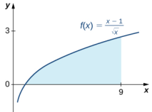

Figure 1.29 The area under the curve from $x=1$ to $x=9$ can be calculated by evaluating a definite integral

11 s The FundamenaTheoe o calulus Part valate - dr

### EXAMPLE 1.22

### A Roller-Skating Race

James and Kathy are racing on roller skates. They race along a long, straight track, and whoever has gone the farthest after 5 sec wins a prize.If James can skate at a velocity of $f(t)=5+2t$ ft/sec andKathy can skate at a velocity of $g\left(t\right)=10+\cos\left(\frac{\pi}{2}t\right)$ ft/sec, who is going to win the race?

We need to integrate both functions over the interval [0,5] and see which value is bigger. For James, we want to calculate

$$\int_0^5\left(5+2t\right)dt.$$

Using the power rule, we have

$$\begin{aligned}
\int_{0}^{5}\left(5+2t\right)dt& =\left.(5t+t^{2})\right|_{0}^{5} \\
&=(25+25)=50.
\end{aligned}$$

Thus, James has skated 50 ft after 5 sec. Turning now to Kathy, we want to calculate

$$\int_0^510+\cos\left(\frac{\pi}{2}t\right)dt.$$

We know sint is an antiderivative of cost, so it is reasonable to expect that an antiderivative of cos $\left(\frac{\pi}{2}t\right)$ would involve $\sin\left(\frac{\pi}{2}t\right).$ However, when we differentiate $\sin\left(\frac{\pi}{2}t\right)$, we get $\frac{\pi}{2}\cos\left(\frac{\pi}{2}t\right)$ as a result of the chain rule, so we have to account for this additional coefficient when we inteqrate. We obtair

$$\begin{aligned}
\int_{0}^{5}10+\cos\left({\frac{\pi}{2}}t\right)dt& =\left.\left(10t+\frac{2}{\pi}\sin\left(\frac{\pi}{2}t\right)\right)\right|_{0}^{5}  \\
&=\left(50+\frac{2}{\pi}\right)-\left(0-\frac{2}{\pi}\mathrm{sin}0\right) \\
&\approx50.6.
\end{aligned}$$

Kathy has skated approximately 50.6 ft after 5 sec.Kathy wins,but not by much!

STUDENT PROJECT

A Parachutist in Free Fall

Figure 1.30 Skydivers can adjust the velocity of their dive by changing the position of their body during the free fall

(credit: Jeremy T. Lock)

Julie is an avid skydiver. She has more than 300 jumps under her belt and has mastered the art of making adjustments to her body position in the air to control how fast she falls. If she arches her back and points her belly toward the ground, she reaches a terminal velocity of approximately 120 mph (176 ft/sec). If, instead, she orients her body with her head straight down, she falls faster, reaching a terminal velocity of 150 mph (220 ft/sec).

Since Julie will be moving (falling) in a downward direction, we assume the downward direction is positive to simplify our calculations.Julie executes her jumps from an altitude of 12,500 ft. After she exits the aircraft, she immediately starts falling at a velocity given by $\boldsymbol{\upsilon}\left(t\right)=32t.$ She continues to accelerate according to this velocity function until she reaches terminal velocity. After she reaches terminal velocity, her speed remains constant until she pulls her ripcord and slows down to land.

On her first jump of the day, Julie orients herself in the slower “belly down" position (terminal velocity is 176 ft/sec) Using this information, answer the following questions.

1.How long after she exits the aircraft doesJulie reach terminal velocity？ 2.Based on your answer to question 1, set up an expression involving one or more integrals that represents the distance Julie falls after 30 sec 3.If Julie pulls her ripcord at an altitude of 30o0 ft, how long does she spend in a free fall? 4.Julie pulls her ripcord at 3000 ft. It takes 5 sec for her parachute to open completely and for her to slow down, during which time she falls another 400 ft. After her canopy is fully open, her speed is reduced to 16 ft/sec. Find the total time Julie spends in the air, from the time she leaves the airplane until the time her feet touch the ground. On Julie's second jump of the day, she decides she wants to fall a little faster and orients herself in the *head down” position. Her terminal velocity in this position is 220 ft/sec. Answer these questions based on this velocity 5.How long does it take Julie to reach terminal velocity in this case? 6.Before pulling her ripcord, Julie reorients her body in the “belly down position so she is not moving quite as fast

when her parachute opens. If she begins this maneuver at an altitude of 40oo ft, how long does she spend in a free fall before beginning the reorientation?

Some jumpers wear "wingsuits" (see Figure 1.31). These suits have fabric panels between the arms and legs and allow the wearer to glide around in a free fall, much like a flying squirrel. (Indeed, the suits are sometimes called *flying squirrel suits.") When wearing these suits, terminal velocity can be reduced to about 30 mph (44 ft/sec), allowing the wearers a much longer time in the air. Wingsuit flyers still use parachutes to land; although the vertical velocities are within the margin of safety, horizontal velocities can exceed 70 mph, much too fast to land safely.

Figure 1.31 The fabric panels on the arms and legs of a wingsuit work to reduce the vertical velocity of a skydiver's

fall. (credit: Richard Schneider)

Answer the following question based on the velocity in a wingsuit

7.If Julie dons a wingsuit before her third jump of the day, and she pulls her ripcord at an altitude of 30o0 ft, how long does she get to spend gliding around in the air?

## SECTION 1.3 EXERCISES

144. Consider two athletes running at variable speeds $v_1\left(t\right)$ and $v_2\left(t\right)$ The runners start and finish a race at exactly the same time. Explain why the two runners must be going the same speed at some point.

145. Two mountain climbers start their climb at base camp,taking two different routes, one. steeper than the other and arrive at the peak at exactly the same time.Is it necessarily true that, at some point, both climbers. increased in altitude at. the same rate?

147. Set $F(x)=\int_{1}^{x}\left(1-t\right)dt$ Find $F^{\prime}(2)$ and the average value of $F^{'}$ over [1,2].

146. To get on a certain toll road a driver has to take a card that lists the mile entrance point. The card also has a timestamp. When going to pay the tollat the exit,the driver is surprised to receive a speeding ticket along with the toll. Explain how this can happen.

In the following exercises, use the Fundamental Theorem of Calculus, Part 1, to find each derivative

150. $\frac{d}{dx}\int_3^x\sqrt{9-y^2}dy$

149. $\frac{d}{dx}\int_{1}^{x}e^{\cos t}dt$

148. $\frac{d}{dx}\int_{1}^{x}e^{-t^2}dt$ 151. $\frac{d}{dx}\int_3^x\frac{ds}{\sqrt{16-s^2}}$

153. $\frac{d}{dx}\int_0^{\sqrt{x}}tdt$

152. d

16. $\frac{d}{dx}\int_{1}^{\sqrt{x}}\frac{t^2}{1+t^4}dt$

154. $\frac{d}{dx}\int_{0}^{\sin x}\sqrt{1-t^2}dt$

155. $\frac{d}{dx}\int_{\cos x}^1\sqrt{1-t^2}dt$

157. $\frac{d}{dx}\int_1^{x^2}\frac{\sqrt t}{1+t}dt$

158. $\frac{d}{dx}\int_0^{\ln x}e^tdt$

159. $\frac{d}{dx}\int_1e^x\ln u^2du$

16. Thegraphof $y=\int_{0}^{x}f(t)dt$ . where161. hegrahof $y=\int_{0}^{x}f(t)dt$ ,wherel is a piecewise constant function, is shown here.

is a piecewise constant function, is shown here.

a.Over which intervals is f positive?

a.Over which intervals is fpositive Over which intervals is it neqative Over which intervals,if any, is it equal to zero? b.What are the maximum and minimum values of $f7$ C.What is the average value of $f7$

Over which intervals is it negative? Over which intervals,if any, is it equal to zero? b.What are the maximum and minimum values of $f7$ c.What is the average value of $f?$

162. The graph of $y=\int_0^x\ell(t)dt$ , where163. The graph of $y=\int_{0}^{x}\ell(t)dt$ ,where $e$ is a piecewise linear function, is shown here.

is a piecewise linear function, is shown here.

a.Over which intervals is positive？ Over which intervals is it neqative？ Over which, if any, is it zero? b.Over which intervals is $\ell$ increasing? Over which is it decreasing? Over which intervals if any, is it constant? C.What is the averaqe value of $\ell7$

a.Over which intervals is positive? Over which intervals is it negative? Over which, if any, is it zero？ b.Over which intervals is increasing? Over which is it decreasinq? Over which, if any, is it constant? c.What is the average value of $E7$

In the following exercises, use a calculator to estimate the area under the curve by computing $T_{10r}$ the average of the Part 2, determine the exact area

164. [T] $y=x^{2}$ over [0, 4]

166. [T] $y=\sqrt{x^3}$ over [0.6]

165. $[\Pi]y=x^{3}+6x^{2}+x-5$ over [4, 2]

169. $\Pi\int\frac{4}{x^{2}}dx$ over 1,])

167. [T] $\mid y=\sqrt{x}+x^{2}$ over [1,9]

168. $[\Pi]\int(\cos x-\sin x)dx$ over$[ 0, \pi ]$

In the following exercises, evaluate each definite integral using the Fundamental Theorem of Calculus, Part 2

172. $\int_{-2}^3\left(t+2\right)\left(t-3\right)dt$

171. $\int_{-2}^{3}\left(x^{2}+3x-5\right)dx$

170. $\int_{-1}^2\left(x^2-3x\right)dx$ 173. $\int_{2}^{3}\left(t^{2}-9\right)\left(4-t^{2}\right)dt$ 174. $\int_{1}^{2}x^{9}dx$

175. $\int_0^1x^{99}dx$

178. $\int_{1}^{2}\frac{2}{x^{3}}dx$

176. $\int_{4}^{8}\left(4t^{5/2}-3t^{3/2}\right)dt$

177. $\int_{1/4}^4\left(x^2-\frac1{x^2}\right)dx$

180. $\int_1^4\frac{2-\sqrt t}{t^2}dt$

181. $\int_{1}^{16}\frac{dt}{t^{1/4}}$

179. $\int_1^4\frac{1}{2\sqrt{x}}dx$

182. $\int_0^{2\pi}\cos\theta d\theta$

183. $\int_{0}^{\pi/2}\sin\theta d\theta$

184. $\int_{0}^{\pi/4}\sec^2\theta d\theta$

185. $\int_0^{\pi/4}$ $\int_0^{\pi/4}$ $\int_0^{\pi/4}\sec\theta\tan\theta d\theta$

186. $\int_{\pi/3}^{\pi/4}\csc\theta\cot\theta d\theta$

187. $\int_{\pi/4}^{\pi/2}\csc^2\theta d\theta$

188. $\int_{1}^{2}\left(\frac{1}{t^{2}}-\frac{1}{t^{3}}\right)dt$

189. $\int_{-2}^{-1}\left(\frac{1}{t^2}-\frac{1}{t^3}\right)dt$

In the following exercises, use the evaluation theorem to express the integral as a function F(x)

190. $\int_a^xt^2dt$

192. J osdt

191. $\int_1^xe^tdt$

193. $\int_{-x}^x\sin tdt$

In the following exercises, identify the roots of the integrand to remove absolute values, then evaluate using the Fundamental Theoremof Calculus.Part2

194. $\int_{-2}^3\left|x\right|dx$ 195. $\int_{-2}^4\left|t^2-2t-3\right|dt$ 196 Iosldl

197. $\int_{-\pi/2}^{\pi/2}\left|\sin t\right|d$

198.Suppose that the number of hours of daylight on a given day in Seattle is modeled by the function $-3.75\cos\left(\frac{\pi t}{6}\right)+12.25$ with t given in months and $l=0$ correspondinge to the winter solstice a.What is the average number of daylight hours in a year? b.At which times $t_1$ and $t_{2}$, where $0\leq t_{1}<t_{2}<12$ ,do the number of daylight hours equal the average number? C.Write an integral that expresses the total number of daylight hours in Seattle between $t_1$ and $t_2$ d.Compute the mean hours of daylight in Seattle between $t_1$ and $t_2$ ,where $0\leq t_{1}<t_{2}<12$ ,and then between $t_2$ and $t_1$ , and show that the average of the two is equal to the average day length.

199. Suppose the rate of gasoline consumption over the course of a year in the United States can be modeled by a sinusoidal function of the form $\left(11.21-\cos\left(\frac{\pi t}{6}\right)\right)\times10^{9}$ gal/mo. a.What is the average monthly consumption and for which values of tis the rate at time t equal to the average rate? b.what is the number of gallons of gasoline consumed in the United States in a year? C.Write an integral that expresses the average monthly U.S. gas consumption during the part of the year between the beginning of April $(t=3$ andthe end of September $(t=9$

200. Explain why, if fis continuous over $[a,b]$ there is at least one point $c\in[a,b]$ such that
$$\begin{array}{l}{\text{c}\subset[a,v]\:\text{sucil cilat}}\\{f\left(c\right)=\frac{1}{b-a}\int_{a}^{b}f\left(t\right)dt.}\\\end{array}$$

201. Explain why, if fis continuous over $[a,b]$ and is not equal to a constant there is at least one point $M\in[a,b]$ such that
$$f\left(M\right)>\frac{1}{b-a}\int_{a}^{b}f\left(t\right)dt$$
and at least one point $m\in[a,b]$ such that
$$\begin{aligned}&m\in[u,v]\:\mathrm{sucir~uiac}\\&f\left(m\right)<\frac{1}{b-a}\int_{a}^{b}f\left(t\right)dt.\end{aligned}$$

202. Kepler's first law states that the planets move in elliptical orbits with the Sun at one focus. The closest point of a planetary orbit to the Sun is called the perihelion (for Earth, it currently occurs around January 3) and the farthest point is called the aphelion (for Earth, it currently occurs around July 4). Kepler's second law states that planets sweep out equal areas of their elliptical orbits in equal times. Thus, the two arcs indicated in the following figure are swept out in equal times. At what time of year is Earth moving fastest in its orbit? When is it moving slowest?

205. The force of gravitational attraction between the Sun and a planet is $F(\theta)=\frac{G\dot{m}M}{r^{2}(\theta)}$ ,where $m$ i the mass of the planet, $M$ is the mass of the Sun, G is a universal constant, and $r(\theta)$ is the distance between the Sun and the planet when the planet is at an angle θ with the major axis of its orbit. Assuming that M, m, and the ellipse parameters a and b (half-lengths of the major and minor axes) are given, set up—but do not evaluatean integral that expresses in terms of $G,m,M,a,b$ the average gravitational force between the Sun and the planet.

203. A point on an ellipse with major axis length $2a$ and minor axis length 2b has the coordinates $\left(a\cos\theta,b\sin\theta\right),0\leq\theta\leq2\pi.$ a.Show that the distance from this point to the focus at $(-c,0)$ is $d\left(\theta\right)=a+c\cos\theta$ where $c=\sqrt{a^{2}-b^{2}}$ b.Use these coordinates to show that the average distance $\bar{d}$ from a point on the ellipse to the focus at $(-c,0)$ with respect to angle $\theta.$ is a.

204. As implied earlier according to Kepler's laws, Earth's orbit is an ellipse with the Sun at one focus. The perihelion for Earth's orbit around the Sun is 147,098,290 km and the aphelion is 152,098,232 km a.By placing the major axis along the x-axis find the average distance from Earth to the Sun. b.The classic definitior. of an astronomical unit (AU) is the distance from Earth to the Sun, and its value was computed as the average of the perihelion and aphelion distances. Is this definition justified?

206.The displacement from rest of a mass attached to a spring satisfies the simple harmonic motion equation $x\left(t\right)=A\cos\left(\omega t-\phi\right)$ where $\phi$ is a phase constant, w is the angular frequency, and A is the amplitude. Find the average velocity, the average speed (magnitude of velocity), the average displacement, and the average distance from rest (magnitude of displacement) of the mass.

# 1.4 Integration Formulas and the Net Change Theorem.

### Learning Objectives

1.4.1Apply the basic integration formulas 1.4.2 Explain the significance of the net change theorem. 1.4.3Use the net change theorem to solve applied problems. 1.4.4Apply the integrals of odd and even functions.

In this section, we use some basic integration formulas studied previously to solve some key applied problems. It is important to note that these formulas are presented in terms of indefinite integrals. Although definite and indefinite integrals are closely related, there are some key differences to keep in mind. A definite integral is either a number (when the limits of integration are constants) or a single function (when one or both of the limits of integration are variables) An indefinite integral represents a family of functions, all of which differ by a constant. As you become more familiar with integration, you will get a feel for when to use definite integrals and when to use indefinite integrals. You will naturally select the correct approach for a given problem without thinking too much about it. However, until these concepts are cemented in your mind, think carefully about whether you need a definite integral or an indefinite integral and make sure you are using the proper notationbased on your choice.

## Basic Integration Formulas

 Recall the integration formulas given in the table in Antiderivatives (http://openstax.org/books/calculus-volume-1/pages/ 4-10-antiderivatives) and the rule on properties of definite integrals. Let's look at a few examples of how to apply these rules.

### EXAMPLE 1.23

### Integrating a Function Using the Power Rule Use the poweulet iteate e unat $\int_{1}^{4}\sqrt{t}\left(1+t\right)dt$

### $②$ Solution

The first step is to rewrite the function and simplify it so we can apply the power rule
$$\begin{aligned}\int_{1}^{4}\sqrt{t}(1+t)dt&=\int_{1}^{4}t^{1/2}(1+t)dt\\&=\int_{1}^{4}\left(t^{1/2}+t^{3/2}\right)dt.\end{aligned}$$

Now apply the power rule:

$$\begin{aligned}
\int_{1}^{4}\left(t^{1/2}+t^{3/2}\right)dt& =\left(\frac{2}{3}t^{3/2}+\frac{2}{5}t^{5/2})\right|_{1}^{4} \\
&=\left[\frac{2}{3}(4)^{3/2}+\frac{2}{5}(4)^{5/2}\right]-\left[\frac{2}{3}(1)^{3/2}+\frac{2}{5}(1)^{5/2}\right] \\
&=\frac{256}{15}.
\end{aligned}$$

1.21 Find the definite integral of $f\left(x\right)=x^2-3x$ over the interval [1, 3] .

## The Net Change Theorem

The net change theorem considers the integral of a rate of change.It says that when a quantity changes, the new value equals the initial value plus the integral of the rate of change of that quantity. The formula can be expressed in two ways. The second is more familiar; it is simply the definite integral.

### Theorem 1.6

### Net Change Theorem

The new value of a changing quantity equals the initial value plus the integral of the rate of change

$$F\left(b\right)=F\left(a\right)+\int_{a}^{b}F^{\prime}\left(x\right)dx\\\mathrm{or}\\\int_{a}^{b}\:F^{\prime}\left(x\right)dx=F\left(b\right)-F\left(a\right).$$

Subtracting $F(a)$ from both sides of the first equation yields the second equation.Since they are equivalent formulas which one we use depends on the application

The significance of the net change theorem lies in the results.Net change can be applied to area, distance, and volume, to name only a few applications.Net change accounts for neaative guantities automatically without having to write more than one integral. To illustrate, let's apply the net change theorem to a velocity function in which the result is displacement.

We looked at a simple example of this in The Definite Integral. Suppose a car is moving due north (the positive direction) at 40 mph between 2 p.m. and $4p.m.$ , then the car moves south at 30 mph between $4p.m$ . and 5 p.m. We can graph this motion as shown in Figure 1.32

Figure 1.32 The graph shows speed versus time for the given motion of a car.

Just aswe did before,we can use definite inteqrals to calculate the net displacement as wellas the total distance traveled. The net displacement is given by

$$\begin{aligned}
\int_{2}^{5}v(t)dt& =\int_{2}^{4}40dt+\int_{4}^{5}-30dt \\
&=80-30 \\
&=50.
\end{aligned}$$

Thus. at 5 p.m.the car is 50 mi north of its starting position.The total distance traveled is aiven by

$$\begin{gathered}
\int_{2}^{s}|v(t)|\:dt =\int_{2}^{4}40dt+\int_{4}^{5}30dt \\
=80+30 \\
=110. 
\end{gathered}$$

Therefore, between 2 p.m. and $5p.m$ , the car traveled a total of $110mi$

To summarize,net displacement may include both positive and neqative values. In other words, the velocity function accounts for both forward distance and backward distance. To find net displacement, integrate the velocity function over the interval. Total distance traveled, on the other hand, is always positive.To find the total distance traveled by an object regardless of direction, we need to integrate the absolute value of the velocity function.

## EXAMPLE 1.24

### Finding Net Displacement

Given a velocity function $v\left(t\right)=3t-5$ (in meters per second) for a particle in motion from time $l=0$ to time $t=3$ ,find the net displacement of the particle.

Applying the net change theorem, we have

$$\begin{aligned}
\int_{0}^{3}\left(3t-5\right)dt& =\left.\frac{3t^{2}}{2}-5t\right|_{0}^{3}  \\
&=\left[\frac{3(3)^{2}}{2}-5\left(3\right)\right]-0 \\
&=\frac{27}{2}-15 \\
&=\frac{27}{2}-\frac{30}{2} \\
&=-\frac{3}{2}.
\end{aligned}$$

The net displacement is $-\frac{3}{2}$ m (Figqure 1.33)

Figure 1.33 The graph shows velocity versus time for a particle moving with a linear velocity function.

## EXAMPLE 1.25

### Finding the Total Distance Traveled UseExample 1.24 to find the total distance traveled by a particle according to the velocity function $v(t)=3t-5$ m/sec

over a time interval [0,3]

## $②$ Solution

The total distance traveled includes both the positive and the negative values. Therefore, we must integrate the absolute value of the velocity function to find the total distance traveled.

To continue with the example, use two integrals to find the total distance.First, find the t-intercept of the function, since that is where the division of the interval occurs.Set the eauation eaual to zero and solve for t Thus

$$\begin{array}{rcl}3t-5&=&0\\3t&=&5\\t&=&\frac53.\end{array}$$

The two subintervals are $\left[0,\frac{5}{3}\right]$ and $\left[\frac{5}{3},3\right].$ To find the total distance traveled, integrate the absolute value of the function. Since the function is negative over the interval $\left[0,\frac{5}{3}\right]$ ,we have $|v\left(t\right)|=-v\left(t\right)$ over that interval. Over $\begin{bmatrix}\frac{5}{3},3\end{bmatrix}$ the function is positive, so $|v(t)|=v(t)$ Thus, we have

$$\begin{aligned}
\int_{0}^{3}\left|v\left(t\right)\right|dt& =\int_{0}^{5/3}-v(t)dt+\int_{5/3}^{3}v(t)dt  \\
&=\int_{0}^{5/3}5-3tdt+\int_{5/3}^{3}3t-5dt \\
&=\left.\left(5t-\frac{3t^{2}}{2}\right)\right|_{0}^{5/3}+\left(\frac{3t^{2}}{2}-5t\right)\biggr|_{5/3}^{3} \\
&=\left[5\left(\frac{5}{3}\right)-\frac{3(5/3)^{2}}{2}\right]-0+\left[\frac{27}{2}-15\right]-\left[\frac{3(5/3)^{2}}{2}-\frac{25}{3}\right] \\
&=\frac{25}{3}-\frac{25}{6}+\frac{27}{2}-15-\frac{25}{6}+\frac{25}{3} \\
&=\frac{41}{6}.
\end{aligned}$$

So, the total distance traveled is $\frac{41}{6}m$

1.22 Find the net displacement and total distance traveled in meters given the velocity function $f\left(t\right)=\frac{1}{2}e^{I}-2$ over the interval [0, 2].

# Applying the Net Change Theorem.

The net change theorem can be applied to the flow and consumption of fluids, as shown in Example 1.26

### EXAMPLE 1.26

### How Many Gallons of Gasoline Are Consumed?

If the motor on a motorboat is started at $t=0$ and the boat consumes gasoline at the rate of $5-0.1t^3$ gal/hr how much gasoline is used in the first 2 hours?

## $②$ Solution

Express the problem as a definite integral, integrate, and evaluate using the Fundamental Theorem of Calculus. The limits of integration are the endpoints of the interval [0, 2]. We have

$$\begin{gathered}
\int_{0}^{2}\left(5-0.1t^{3}\right)dt=\left(5t-0.1\frac{t^{4}}{4}\right)\Bigg|_{0}^{2} \\
=\left[5\left(2\right)-0.1\frac{(2)^{4}}{4}\right]-0 \\
=10-0.4 \\
=9.6 
\end{gathered}$$

Thus,the motorboat uses9.6gal of gas in2hours.

# EXAMPLE 1.27

### Chapter Opener: Iceboats

Figure 1.34 (credit: modification of work by Carter Brown, Flickr).

As we saw at the beginning of the chapter, top iceboat racers (Figure 1.1) can attain speeds of up to five times the wind speed. Andrew is an intermediate iceboater, though, so he attains speeds equal to only twice the wind speed. Suppose Andrew takes his iceboat out one morning when a light 5-mph breeze has been blowing all morning. As Andrew gets his iceboat set up, though, the wind begins to pick up. During his first half hour of iceboating, the wind speed increases according to the function $v\left(t\right)=20\iota+5$ .For the second half hour of Andrew's outing, the wind remains steady at 15

mph. In other words, the wind speed is given by

$$v\left(t\right)=\left\{\begin{array}{lll}20t+5&\mathrm{for}&0\leq t\leq\frac{1}{2}\\15&\mathrm{for}&\frac{1}{2}\leq t\leq1.\end{array}\right.$$

Recalling that Andrew's iceboat travels at twice the wind speed, and assuming he moves in a straight line away from his starting point,how far is Andrew from his starting point after 1 hour?

## のSolution To figure out how far Andrew has traveled, we need to integrate his velocity, which is twice the wind speed. Then

$$e=\int_{0}^{1}2v\left(t\right)dt.$$
Distance

Substituting the expressions we were given for $v\left(t\right)$, we get

$$\begin{aligned}
\int_{0}^{1}2v\left(t\right)dt& =\int_{0}^{1/2}2v\left(t\right)dt+\int_{1/2}^{1}2v\left(t\right)dt \\
&=\int_{0}^{1/2}2\left(20t+5\right)dt+\int_{1/2}^{1}2\left(15\right)dt \\
&=\int_{0}^{1/2}\left(40t+10\right)dt+\int_{1/2}^{1}30dt \\
&=\left[20t^{2}+10t\right]\left|_{0}^{1/2}+[30t]\right|_{1/2}^{1} \\
&=\left(\frac{20}{4}+5\right)-0+(30-15) \\
&=25.
\end{aligned}$$

Andrew is 25 mi from his startinq point after 1 hour

1.23 Suppose that, instead of remaining steady during the second half hour of Andrew's outing, the wind starts to die down according to the function $v\left(t\right)=-10t+15$ . In other words, the wind speed is given by

$$\left.v\left(t\right)=\left\{\begin{array}{ll}20t+5&\mathrm{for}\quad0\leq t\leq\frac{1}{2}\\-10t+15&\mathrm{for}\quad\frac{1}{2}\leq t\leq1.\end{array}\right.\right.$$

Under these conditions, how far from his starting point is Andrew after 1 hour?

# Integrating Even and Odd Functions

We saw in Functions and Graphs (http://openstax.org/books/calculus-volume-1/pages/1-introduction) that an even function is a function in which $f(-x)=f(x)$ for all x in the domain—that is, the graph of the curve is unchanged when $X$ isreplaced with $-x.$ The graphs of even functions are symmetric about they-axis.Anodd function is one in which $f\left(-x\right)=-f\left(x\right)$ for all $x$ in the domain, and the graph of the function is symmetric about the origin.

Integrals of even functions, when the limits of integration are from -a to a, involve two equal areas, because they are symmetric about the y-axis. Integrals of odd functions, when the limits of integration are similarly $[-a,a]$ ,evaluate to zero because the areasabove andbelow thex-axis are equal

### Rule: Inteqrals of Even and Odd Functions

For continuous even functionssuch that $f\left(-x\right)=f\left(x\right)$

$$\int_{-a}^{a}f\left(x\right)dx=2\int_{0}^{a}f\left(x\right)dx.$$

For continuous odd functions such that $f\left(-x\right)=-f\left(x\right)$

$$\int_{-a}^{a}f\left(x\right)dx=0.$$

### EXAMPLE 1.28

### Integrating an Even Function

Integrate the ven unction $\int_{-2}^{2}\left(3x^{8}-2\right)dx$ and veriy tha theinterton te mul o even untions hodndnd

### $②$ Solution The symmetry appears in the graphs in Figure 1.35. Graph (a) shows the region below the curve and above the x-axis. We

have to zoom in to this graph by a huge amount to see the region. Graph (b) shows the region above the curve and below the x-axis. The signed area of this region is negative. Both views illustrate the symmetry about the y-axis of an even function.We have

$$\begin{aligned}
\int_{-2}^{2}\left(3x^{8}-2\right)dx& \left.=\left(\frac{x^{9}}{3}-2x\right)\right|_{-2}^{2} \\
&=\left[\frac{\left(2\right)^{9}}{3}-2\left(2\right)\right]-\left[\frac{\left(-2\right)^{9}}{3}-2\left(-2\right)\right] \\
&=\left(\frac{512}{3}-4\right)-\left(-\frac{512}{3}+4\right) \\
&=\frac{1000}{3}.
\end{aligned}$$

To verify the integration formula for even functions, we can calculate the integral from 0 to 2 and double it, then check to make sure we get the same answer.

$$\begin{aligned}
\int_{0}^{2}\left(3x^{8}-2\right)dx& =\left({\frac{x^{9}}{3}}-2x\right)\Big|_{0}^{2} \\
&=\frac{512}{3}-4 \\
&=\frac{500}{3}
\end{aligned}$$

Since $2\cdot\frac{500}{3}=\frac{1000}{3}.$ we have verified the formula for even functions in this particular example

Figure 1.35 Graph (a) shows the positive area between the curve and the x-axis, whereas graph (b) shows the negative area between the curve and the x-axis.Both views show the symmetry about the y-axis

### EXAMPLE 1.29

### Integrating an Odd Function

Evaluate the definite integral of theodd function $-5\sin x$ over the interval $[-\pi,\pi]$

### $②$ Solution

The graph is shown in Figure 1.36. We can see the symmetry about the origin by the positive area above the $x-$ axis over $[-\pi,0]$ ,and the negative area below the $x-$ axis over $[0,\pi].$ We have

$$\int_{-\pi}^{\pi}-5\sin xdx\quad=-5\left(-\cos x\right)|_{-\pi}^{\pi}$$

$$\begin{aligned}
&=5\cos x|_{-\pi}^{\pi} \\
&=[5\cos\pi]-[5\cos{(-\pi)}] \\
&=-5-(-5) \\
&=0.
\end{aligned}$$

Figure 1.36 The graph shows areas between a curve and the x-axis for an odd function

### SECTION 1.4 EXERCISES

Use basic integration formulas to compute the following antiderivatives or definite integrals
$$\begin{aligned}&\int\left(\sqrt{x}-\frac{1}{\sqrt{x}}\right)dx&&208.\:\int\left(e^{2x}-\frac{1}{2}e^{x/2}\right)dx&&209.\:\int\frac{dx}{2x}\\&.\:\int\frac{x-1}{x^{2}}dx&&211.\:\int_{0}^{\pi}\left(\sin x-\cos x\right)dx&&212.\:\int_{0}^{\pi/2}\left(x-\sin x\right)dx\end{aligned}$$

20

213. Write an integral that expresses the increase in the perimeter $P(s)$ of a square when its side length s increases from 2 units to 4 units and evaluate the integral.

214. Write an integral that quantifies the change in the area $A\left(s\right)=s^{2}$ ofa square when the side length doubles from S units to 2S units and evaluate the integral.

215. A regular N-gon (an N-sided polygon with sides that have equal length $S_{i}$ such as a pentagon or hexagon) has perimeter Ns. Write an integral that expresses the increase in perimeter of a regular N-gon when the length of each side increases from 1 unit to 2 units and evaluate the integral.

218. An icosahedron is a Platonic solid with a surface that consists of 20 equilateral triangles. By how much does the surface area of an icosahedron increase as the side length of each triangle doubles from a unit to $2a$ units

217. A dodecahedron is a Platonic solid with a surface that consists of 12 pentagons, each of equal area. By how much does the surface area of a dodecahedron increase as the sidelength of each pentagon doubles from 1 unit to 2 units?

216. The area of a regular pentagon with side length $a>0$ is $pa^2$ with $p=\frac{1}{4}\sqrt{5+\sqrt{5+2\sqrt{5}}}.$ The Pentagon in Washington, DC, has inner sides of length 360 ft and outer sides of length 920 ft. Write an integral to express the area of the roof of the Pentagon according to these dimensions and evaluate this area.

219.Write an integral that quantifies the change in the area of the surface of a cube when its side length doubles from s unit to 2s units and evaluate the integral.

222. Write an integral that quantifies the increase in the volume of a sphere as its radius doubles from $R$ unit to 2R units and evaluate the integral.

220. Write an integral that quantifies the increase in the volume of a cube when the side length doubles from s unit to 2s units and evaluate the integral.

223. Suppose that a particle moves along a straight line with velocity $v\left(t\right)=4-2t$ ,where $0\leq t\leq2$ (in meters per second). Find the displacement at time t and the total distance traveled up to $t=2$

221.Write an integral that quantifies the increase in the surface area of a sphere as its radius doubles from R unit to 2R units and evaluate the integral.

224.Suppose that a particle moves along a straight line with velocity defined by $v\left(t\right)=t^{2}-3t-18$ where $0\leq1\leq6$ (in meters per second).Find the displacement at timet and the total distance traveled up to $t=6$

225.Suppose that a particle moves along a straight line with velocity defined by $v\left(t\right)=\left|2t-6\right|$ ,where $0\leq1\leq6$ (in meters per second). Find the displacement at time and the total distance traveled up to $t=6$

226.Suppose that a particle moves along a straight line with acceleration defined by $r(t)=t-3$ where $0\leq1\leq6$ (in meters per second). Find the velocity and displacement at time and the total distance traveled up to $t=6$ if $v\left(0\right)=3$ and $d\left(0\right)=0$

229. The area A (t) of a circular shape is growing at a constant rate.If the area increases from $4\pi$ units to 9π units between times $t=2$ and $t=3$ ,find the net change in the radius during that time.

227.Aball is thrown upward from a height of $1.5m$ at an initial speed of $40m/$ sec. Acceleration resultinc from gravity is $.9.8m/$ sec². Neglecting air resistance, solve for the velocity $\upsilon\left(t\right)$ and the height h (t) of the ballt seconds after it is thrown and before it returns to the ground.

230.A spherical balloon is being inflated at a constant rate. If the volume of the balloon changes from 36πin.3 to 288π in.3between time $t=30$ and $t=60$ seconds, find the net change in the radius of theballoon during that time.

228.A ball is thrown upward from a height of $3m$ at an initial speed of 60 m/sec. Acceleration resulting from gravity is $.9.8m/$ sec². Neglecting air resistance, solve for the velocity $v\left(t\right)$ and the height h(t) of the ball t seconds after it is thrown and before it returns to the ground.

231.Water flows into a conical tank with cross-sectional area $\pi x^2$ at height x and volume $\frac{\pi x^3}3$ up to height x. If water flows into the tank at a rate of 1 $m^3/min$ find the height of water in the tank after 5 min. Find the change in height between 5 min and $10min$

232. A horizontal cylindrical tank has cross-sectional area $A\left(x\right)=4\left(6x-x^{2}\right)m^{2}$ at height $x$ meters above the bottom when $x\leq3$ a.The volume Vbetween heights a and $b$ is $\int_{a}^{\bar{b}}A\left(x\right)dx.$ Fin the volume at heights between $2m$ and $3m$ b.Suppose that oil is being pumped into the tank at a rate of $50U$ min. Using the chain rule, $\frac {dx}{dt}= \frac {dx}{dV}$ $\frac {dV}{dt}$ ,at how many meters per minute is the height of oil in the tank changing, expressed in terms of $x$, when the height is at $x$ meters? c.How long does it take to fill the tank to $3m$ starting from a fill level of $2m7$

233. The following table lists the electrical power in gigawatts-the rate at which energy is consumed—used in a certain city for different hours of the day, in a typical 24-hour period, with hour 1 corresponding to midnight to 1 a.m.

<table>
	<tbody>
		<tr>
			<th>Hour</th>
			<th>Power</th>
			<th>Hour</th>
			<th>Power</th>
		</tr>
		<tr>
			<td>1</td>
			<td>28</td>
			<td>13</td>
			<td>48</td>
		</tr>
		<tr>
			<td>2</td>
			<td>25</td>
			<td>14</td>
			<td>49</td>
		</tr>
		<tr>
			<td>3</td>
			<td>24</td>
			<td>15</td>
			<td>49</td>
		</tr>
		<tr>
			<td>4</td>
			<td>23</td>
			<td>16</td>
			<td>50</td>
		</tr>
		<tr>
			<td>5</td>
			<td>24</td>
			<td>17</td>
			<td>50</td>
		</tr>
		<tr>
			<td>6</td>
			<td>27</td>
			<td>18</td>
			<td>50</td>
		</tr>
		<tr>
			<td>7</td>
			<td>29</td>
			<td>19</td>
			<td>46</td>
		</tr>
		<tr>
			<td>8</td>
			<td>32</td>
			<td>20</td>
			<td>43</td>
		</tr>
		<tr>
			<td>9</td>
			<td>34</td>
			<td>21</td>
			<td>42</td>
		</tr>
		<tr>
			<td>10</td>
			<td>39</td>
			<td>22</td>
			<td>40</td>
		</tr>
		<tr>
			<td>11</td>
			<td>42</td>
			<td>23</td>
			<td>37</td>
		</tr>
		<tr>
			<td>12</td>
			<td>46</td>
			<td>24</td>
			<td>34</td>
		</tr>
	</tbody>
</table>

Find the total amount of energy in gigawatt-hours (gW-h) consumed by the city in a typical 24-hour period.

234. The average residential electrical power use (in hundreds of watts) per hour is given in the following table.

<table>
	<tbody>
		<tr>
			<th>Hour</th>
			<th>Power</th>
			<th>Hour</th>
			<th>Power</th>
		</tr>
		<tr>
			<td>1</td>
			<td>8</td>
			<td>13</td>
			<td>12</td>
		</tr>
		<tr>
			<td>2</td>
			<td>6</td>
			<td>14</td>
			<td>13</td>
		</tr>
		<tr>
			<td>3</td>
			<td>5</td>
			<td>15</td>
			<td>14</td>
		</tr>
		<tr>
			<td>4</td>
			<td>4</td>
			<td>16</td>
			<td>15</td>
		</tr>
		<tr>
			<td>5</td>
			<td>5</td>
			<td>17</td>
			<td>17</td>
		</tr>
		<tr>
			<td>6</td>
			<td>6</td>
			<td>18</td>
			<td>19</td>
		</tr>
		<tr>
			<td>7</td>
			<td>7</td>
			<td>19</td>
			<td>18</td>
		</tr>
		<tr>
			<td>8</td>
			<td>8</td>
			<td>20</td>
			<td>17</td>
		</tr>
		<tr>
			<td>9</td>
			<td>9</td>
			<td>21</td>
			<td>16</td>
		</tr>
		<tr>
			<td>10</td>
			<td>10</td>
			<td>22</td>
			<td>16</td>
		</tr>
		<tr>
			<td>11</td>
			<td>10</td>
			<td>23</td>
			<td>13</td>
		</tr>
		<tr>
			<td>12</td>
			<td>11</td>
			<td>24</td>
			<td>11</td>
		</tr>
	</tbody>
</table>

a.Compute the average total energy used in a day in kilowatt-hours (kWh) b.If a ton of coal generates 1842 kWh, how long does it take for an average residence to burn a ton of coal? c.Explain why the data miqht fit a plot of the form $p\left(t\right)=11.5-7.5\sin\left(\frac{\pi l}{12}\right).$

235. The data in the following table are used to estimate the average power output produced by Peter Sagan for each of the last 18 sec of Stage 1 of the 2012 Tour de France.

<table>
	<tbody>
		<tr>
			<th>Second</th>
			<th>Watts</th>
			<th>Second</th>
			<th>Watts</th>
		</tr>
		<tr>
			<td>1</td>
			<td>600</td>
			<td>10</td>
			<td>1200</td>
		</tr>
		<tr>
			<td>2</td>
			<td>500</td>
			<td>11</td>
			<td>1170</td>
		</tr>
		<tr>
			<td>3</td>
			<td>575</td>
			<td>12</td>
			<td>1125</td>
		</tr>
		<tr>
			<td>4</td>
			<td>1050</td>
			<td>13</td>
			<td>1100</td>
		</tr>
		<tr>
			<td>5</td>
			<td>925</td>
			<td>14</td>
			<td>1075</td>
		</tr>
		<tr>
			<td>6</td>
			<td>950</td>
			<td>15</td>
			<td>1000</td>
		</tr>
		<tr>
			<td>7</td>
			<td>1050</td>
			<td>16</td>
			<td>950</td>
		</tr>
		<tr>
			<td>8</td>
			<td>950</td>
			<td>17</td>
			<td>900</td>
		</tr>
		<tr>
			<td>9</td>
			<td>11100</td>
			<td>18</td>
			<td>780</td>
		</tr>
	</tbody>
</table>

Table 1.6 Average Power Output Source: sportsexercisengineering.com

Estimate the net energy used in kilojoules (k), noting that $1W= 1$ $j/ s.$ and the average power output by Sagan during this time interval.

236. The data in the following table are used to estimate the average power output producedby PeterSagan for each 15-min interval of Stage 1 of the 2012 Tour de France.

<table>
	<tbody>
		<tr>
			<th>Minutes</th>
			<th>Watts</th>
			<th>Minutes</th>
			<th>Watts</th>
		</tr>
		<tr>
			<td>15</td>
			<td>200</td>
			<td>165</td>
			<td>170</td>
		</tr>
		<tr>
			<td>30</td>
			<td>180</td>
			<td>180</td>
			<td>220</td>
		</tr>
		<tr>
			<td>45</td>
			<td>190</td>
			<td>195</td>
			<td>140</td>
		</tr>
		<tr>
			<td>60</td>
			<td>230</td>
			<td>210</td>
			<td>225</td>
		</tr>
		<tr>
			<td>75</td>
			<td>240</td>
			<td>225</td>
			<td>170</td>
		</tr>
		<tr>
			<td>90</td>
			<td>210</td>
			<td>240</td>
			<td>210</td>
		</tr>
		<tr>
			<td>105</td>
			<td>210</td>
			<td>255</td>
			<td>200</td>
		</tr>
		<tr>
			<td>120</td>
			<td>220</td>
			<td>270</td>
			<td>220</td>
		</tr>
		<tr>
			<td>135</td>
			<td>210</td>
			<td>285</td>
			<td>250</td>
		</tr>
		<tr>
			<td>150</td>
			<td>150</td>
			<td>300</td>
			<td>400</td>
		</tr>
	</tbody>
</table>
Table 1.7 Average Power Output

Source: sportsexercisengineering.com

Estimate the net energy used in kilojoules, noting that 1W $^{\prime }= 1$ $j/ s$

237. The distribution of incomes as of 2012 in the United States in \$5ooo increments is given in the following table. The kth row denotes the percentage of households with incomes between $S5000xk$ and $5000xk+4999$ .The row $k=40$ contains all households with income between \$200,000 and $\$250,000$

<table>
	<tbody>
		<tr>
			<th>0</th>
			<th>3.5</th>
			<th>11</th>
			<th>3.5</th>
			<th>21</th>
			<th>1.5</th>
			<th>31</th>
			<th>0.6 1</th>
		</tr>
		<tr>
			<td>1</td>
			<td>4.1</td>
			<td>12</td>
			<td>3.7</td>
			<td>22</td>
			<td>1.4</td>
			<td>32</td>
			<td>0.5</td>
		</tr>
		<tr>
			<td>2</td>
			<td>5.9</td>
			<td>13</td>
			<td>3.2</td>
			<td>23</td>
			<td>1.3</td>
			<td>33</td>
			<td>0.5</td>
		</tr>
		<tr>
			<td>3</td>
			<td>5.7</td>
			<td>14</td>
			<td>3.0</td>
			<td>24</td>
			<td>1.3</td>
			<td>34</td>
			<td>0.4</td>
		</tr>
		<tr>
			<td>4</td>
			<td>5.9</td>
			<td>15</td>
			<td>2.8</td>
			<td>25</td>
			<td>1.1</td>
			<td>35</td>
			<td>0.3</td>
		</tr>
		<tr>
			<td>5</td>
			<td>5.4</td>
			<td>16</td>
			<td>2.5</td>
			<td>26</td>
			<td>1.0</td>
			<td>36</td>
			<td>0.3</td>
		</tr>
		<tr>
			<td>6</td>
			<td>5.5</td>
			<td>17</td>
			<td>2.2</td>
			<td>27</td>
			<td>0.75</td>
			<td>37</td>
			<td>0.3</td>
		</tr>
		<tr>
			<td>7</td>
			<td>5.1</td>
			<td>18</td>
			<td>2.2</td>
			<td>28</td>
			<td>0.8</td>
			<td>38</td>
			<td>0.2</td>
		</tr>
		<tr>
			<td>8</td>
			<td>4.8</td>
			<td>19</td>
			<td>1.8</td>
			<td>29</td>
			<td>1.0</td>
			<td>39</td>
			<td>1.8</td>
		</tr>
		<tr>
			<td>9</td>
			<td>4.1</td>
			<td>20</td>
			<td>2.1</td>
			<td>30</td>
			<td>0.6</td>
			<td>40</td>
			<td>2.3</td>
		</tr>
		<tr>
			<td>10</td>
			<td>4.3</td>
			<td> </td>
			<td> </td>
			<td> </td>
			<td> </td>
			<td> </td>
			<td> </td>
		</tr>
	</tbody>
</table>
Table 1.8 Income Distributions Source:

http://www.census.gov/prod/2013pubs/ p60-245.pdf

a.Estimate the percentage of U.S.households in 2012 with incomes less than $\$55,000$ b.What percentage of households had incomes exceeding \$85,000? c.Plot the data and try to fit its shape to that of a graph of the form $a\left(x+c\right)e^{-b\left(x+e\right)}$ for suitable $a,b,c$

240.John is a 25-year old man who weighs 160 Ib. He burns $500-50t$ calories/ hr while riding his bike for thours. If an oatmeal cookie has 55 cal and John eats 4tcookies during the tth hour, how many net calories has he lost after 3 hours riding his bike?

238.Newton's law of gravity states that the gravitational force exerted by an object of mass M and one of mass $m$ with centers that are separated by a distance ris $F=G\frac{mM}{r^{2}}$ ,with $G$ an empirical constant $G= 6. 67x10^{- 11}$ $m^{3}/ \left ( kg\cdot s^{2}\right )$, The work done by a variable force over an interval $[a,b]$ is defined as $W= \int _{a}^{b}F( x)$ $dx$ If Earth has mass $5.97219\times10^{24}$ and radius 6371 km compute the amount of work to elevate a polar weather satellite of mass 1400 kg to its orbiting altitude of $850km$ above Earth.

241. Sandra is a 25-year old woman who weighs 120 Ib. She burns $300-50t$ cal/hr while walking on her treadmill. Her caloric intake from drinking Gatorade is 100t calories during the tth hour. What is her net decrease in calories after walking for 3 hours?

239.For a givenmotor vehicle the maximum achievable deceleration from braking is approximately 7 m/sec2 on dry concrete. On wet asphalt, it is approximately 2.5 m/sec2 Given that 1 mph corresponds to $0.447m/$ sec,find the total distance that a car travels in meters on dry concrete after the brakes are applied until it comes to a complete stop if the initial velocity is 67 mph $[30m/$ sec) or if the initial braking velocity is 56 mph (25 m/sec). Find the corresponding distances if the surface is slippery wet asphalt. 242. A motor vehicle has a

243. Although some engines are more efficient at given a horsepower than others, on average, fuel efficiency decreases with horsepower at a rate of 1/25 mpg/horsepower. If a typical 50-horsepower engine has an average fuel efficiency of 32 mpg what is the average fuel efficiency of an engine with the following horsepower: 150, 300, 450?

maximum efficiency of 33 mpg at a cruising speed of 40 mph. The efficiency drops at a rate of 0.1 mpg/mph between 40 mph and 50 mph, and at a rate of 0.4 mpg/mph between 50 mph and 80 mph. What is the efficiency in miles per gallon if thecar iscruising at 50 mph? What is the efficiency in miles per gallon if the car is cruising at 80 mph? If gasoline costs \$3.50/gal, what is the cost of fuel to drive 50 mi at 40 mph, at 50 mph, and at 80 mph?

244. [T] The following table lists the 2013 schedule of federal income tax versus taxable income

245.[T] The following table provides hypothetical data regarding the level. of service for a certain highway

<table>
	<tbody>
		<tr>
			<th>Highway Speed Range $(mph)$</th>
			<th>Vehicles per Hour per Lane</th>
			<th>Density Range (vehicles/ mi)</th>
		</tr>
		<tr>
			<td>》 60 1 1</td>
			<td>600</td>
			<td>$\xi$ 10</td>
		</tr>
		<tr>
			<td>60-57</td>
			<td>600-1000</td>
			<td>10-20</td>
		</tr>
		<tr>
			<td>57-54</td>
			<td>1000-1500</td>
			<td>20-30</td>
		</tr>
		<tr>
			<td>54-46</td>
			<td>1500-1900</td>
			<td>30-45</td>
		</tr>
		<tr>
			<td>46-30</td>
			<td>1900-2100</td>
			<td>45-70</td>
		</tr>
		<tr>
			<td><30</td>
			<td>Unstable</td>
			<td>70-200</td>
		</tr>
	</tbody>
</table>

<table>
	<tbody>
		<tr>
			<th>Taxable Income Range</th>
			<th>The Tax Is</th>
			<th>Ofthe Amount Over</th>
		</tr>
		<tr>
			<td>$\$0-\$8925$</td>
			<td>1096</td>
			<td>$\$0$</td>
		</tr>
		<tr>
			<td>$\$8925-\$36,250$</td>
			<td>5892.50 $15\%$</td>
			<td>$\$8925$</td>
		</tr>
		<tr>
			<td>$\$36,250-\$87,850$</td>
			<td>$\$4,991.25$ $25\%$</td>
			<td>$\$36,250$</td>
		</tr>
		<tr>
			<td>$\$87,850–\$183,250$</td>
			<td>$\$17,891.25$ 2896</td>
			<td>$\$87,850$</td>
		</tr>
		<tr>
			<td>$\$183,250-\$398,350$</td>
			<td>$\$44,603.25$ 3396</td>
			<td>$\$183,250$</td>
		</tr>
		<tr>
			<td>$\$398,350-\$400,000$</td>
			<td>$\$115,586.25$ 3596</td>
			<td>$\$398,350$</td>
		</tr>
		<tr>
			<td>$\$400,000$</td>
			<td>$\$116,163.75$ 39.6%</td>
			<td>$\$400,000$</td>
		</tr>
	</tbody>
</table>
Table 1.9 Federal Income Tax Versus Taxable

Table 1.10

Income Source: http://www.irs.gov/pub/irs-prior/ i1040tt-2013.pdf.

a.Plot vehicles per hour per lane on the x-axis and highway speed on the y-axis. b.Compute the average decrease in speed (in miles per hour) per unit increase in congestion (vehicles per hour per lane) as the latter increases from 600 to 1000,from 1000 to 1500, and from 1500 to 2100. Does the decrease in miles per hour depend linearly on the increase in vehicles per hour per lane? C.Plot minutes per mile (60 times the reciprocal of miles per hour) as a function of vehicles per hour per lane. Is this function linear?

Suppose that Steve just received a $\$10,000$ raise. How much of this raise is left after federal taxes if Steve's salary before receiving the raise was $\$40,000?$ If it was $\$90,0007$ If it was \$385,000?

Table 1.11 Population of Breeding Bald Eagle Pairs Source: http://www.fws.gov/Midwest/eagle/population/

chtofprs.html.

<table>
	<tbody>
		<tr>
			<th>Year</th>
			<th>Population of Breeding Pairs of Bald Eagles</th>
		</tr>
		<tr>
			<td>1986</td>
			<td>1875</td>
		</tr>
		<tr>
			<td>1992</td>
			<td>3749</td>
		</tr>
		<tr>
			<td>1996</td>
			<td>5094</td>
		</tr>
		<tr>
			<td>2000</td>
			<td>6471</td>
		</tr>
	</tbody>
</table>

Table 1.11 Population of Breeding Bald Eagle Pairs

Source: http://www.fws.gov/Midwest/eagle/population/ chtofprs.html.

247.[T] The graph below plots the cubic $p\left(t\right)=\bar{0.07}t^{3}+2.42t^{2}-25.63t+521.23$ against the data in the preceding table, normalized so that $t=0$ corresponds to 1963. Estimate the average number of bald eagles per year present for the 37 years by computing the average value of $p$ over [0,37] .

246. [T] The graph below plots the quadratic
$$p(t)=6.48t^{2}-80.3\:1t+585.69$$
against the data in preceding table normalized so that $t=0$ corresponds to 1963. Estimate the average number of bald eagles per year present for the 37 years by computing the average value of $p$

248.[T] Supposeyou go on aroad trip and record your speed at every half hour, as compiled in the following table. The best quadratic fit to the data is $q\left(t\right)=5x^{2}-11x+49$ ,shown in the accompanying graph. Integrate $q$ to estimate the total distance driven over the 3 hours.

<table>
	<tbody>
		<tr>
			<th>Time $(hr)$</th>
			<th>Speed d(mph 1</th>
		</tr>
		<tr>
			<td>(start) 0 11</td>
			<td>50</td>
		</tr>
		<tr>
			<td>1</td>
			<td>40</td>
		</tr>
		<tr>
			<td>2</td>
			<td>50</td>
		</tr>
		<tr>
			<td>3</td>
			<td>60</td>
		</tr>
	</tbody>
</table>

As a car accelerates,it does not accelerate at a constant rate;rather the acceleration is variable.For the following exercises, use the following table, which contains the acceleration measured at every second as a driver merges onto a freeway.

<table>
	<tbody>
		<tr>
			<th>Time $(sec)$</th>
			<th>Acceleration(mph/sec)</th>
		</tr>
		<tr>
			<td>1</td>
			<td>11.2</td>
		</tr>
		<tr>
			<td>2</td>
			<td>10.6</td>
		</tr>
		<tr>
			<td>3</td>
			<td>8.1</td>
		</tr>
		<tr>
			<td>4</td>
			<td>5.4</td>
		</tr>
		<tr>
			<td>5</td>
			<td>0</td>
		</tr>
	</tbody>
</table>

249.[T] The accompanying graph plots 250.[T] Using your the best quadratic fit, C $\imath(t)=-0.70t^{2}+1.44t+10.44$ ,to the data from the preceding table. Compute the average value of a (t) to estimate the average acceleration between $t=0$ and $t=5$

acceleration equation from the previous exercise, find the corresponding velocity. equation. Assuming the initial velocity is 0 mph, find the velocity at time $t=0$

251. [T] Using your velocity equation from the previous exercise, find the corresponding distancee equation, assuming your initial distance is 0mi How far did you travel while you accelerated your car? (Hint: You wil need to convert time units.)

253.[T] An athlete runs by a motion detector, which records her speed, as displayed in the following table.The best linear fit to this data $\ell\left(t\right)=-0.068t+5.14$, is shown in the accompanying graph.Use the average value of $t^{\prime}(t)$ between $t=0$ and $t=40$ to estimate the runner's average speed.

252.[T] The number of hamburgerssold at a restaurant throughout the day is given in the following table, with the accompanying graph plotting the best cubic fit to the data, $b\left(t\right)=0.12t^{3}-2.13t^{2}+12.13t+3.91$ with $t=0$ corresponding to 9 a.m. and $t=12$ corresponding to $9p.m$ Compute the average value of $b\left(t\right)$ to estimate the average number of hamburgers sold per hour.

1.5 Substitution

Learning Objectives

1.5.1 Use substitution to evaluate indefinite integrals 1.5.2 Use substitution to evaluate definite integrals

The Fundamental Theorem of Calculus gave us a method to evaluate integrals without using Riemann sums. The drawback of this method, though, is that we must be able to find an antiderivative, and this is not always easy. In this section we examine a technique, called integration by substitution, to help us find antiderivatives. Specifically, this method helps us find antiderivatives when the integrand is the result of a chain-rule derivative.

At first, the approach to the substitution procedure may not appear very obvious. However, it is primarily a visual task—that is, the integrand shows you what to do; it is a matter of recognizing the form of the function. So, what are we supposed to see? We are looking for an integrand of the form $f[g(x)]g^{\prime}(x)dx$ For example,in the integral

$\int\left(x^{2}-3\right)^{3}2xdx$, we have $f(x)=x^{3},g(x)=x^{2}-3$ and $g^{\prime}(x)=2x$ .Then

$$f\left[g\left(x\right)\right]g'\left(x\right)=\left(x^{2}-3\right)^{3}\left(2x\right),$$

and we see that our intearand is in the correct form.

The method is called substitution because we substitute part of the intearand with the yariable u and part of the integrand with du.It is also referred to as change of variables becausewe are changing variables toobtain an expression that is easier to work with for applying the integration rules

### Theorem 1.7

### Substitution with Indefinite Inteqrals

Let $u=g\left(x\right)$ ,where $g^{\prime}(x)$ is continuous over an interval, let $f\left(x\right)$ be continuous over the corresponding range ofg and let $F(x)$ be an antiderivative of $f(x).$ Then

$$\begin{aligned}
\int f\left[g\left(x\right)\right]g^{\prime}(x)dx& =\int f\left(u\right)du \\
&=F\left(u\right)+C \\
&=F(g(x))+C.
\end{aligned}$$

# Proof

Let $f,g,u$, and $F$ be as specified in the theorem.Then

$$\begin{aligned}
\frac{d}{dx}F(g(x))& =F^{\prime}(g(x))g^{\prime}(x) \\
&=f\left[g\left(x\right)\right]g^{\prime}(x)
\end{aligned}$$

Integrating both sides withrespect to $X.$ we see that

$$\int f\left[g\left(x\right)\right]g'(x)dx=F\left(g\left(x\right)\right)+C.$$

If we now substitute $u=g\left(x\right)$, and $du=g^{\prime}\left(x\right)dx$, we get

$$\begin{aligned}
\int f\left[g\left(x\right)\right]g^{\prime}(x)dx& =\int f\left(u\right)du \\
&=F(u)+C \\
&=F\left(g\left(x\right)\right)+C.
\end{aligned}$$

口

Returning to the problem we looked at originally,we let $u=x^{2}-3$ and then $du=2xdx$ .Rewrite the integral in terms of u:

$$\int\underbrace{\left(x^2-3\right)}_{u}\:\underbrace{\left(2xdx\right)}_{du}=\int u^3du.$$

Using the power rule for integrals, we have

$$\int u^3du=\frac{u^4}{4}+C.$$

Substitute the original expression for $x$ back into the solution:

$$\frac{u^4}{4}+C=\frac{\left(x^2-3\right)^4}{4}+C.$$

We can generalize the procedure in the following Problem-Solving Strategy.

## Problem-Solving Strategye

### Integration by Substitution

1.Look carefully at the integrand and select an expression $g\left(x\right)$ within the integrand to set equal to u. Let's select $g\left(x\right)$ such that $g^{\prime}(x)$ is also part of the integrand. 2. Substitute $u=g\left(x\right)$ and $du=g^{\prime}(x)dx$ into the integral. 3.We should now be able to evaluate the integral with respect to u. If the integral can't be evaluated we need to go back and select a different expression to use as u 4.Evaluate the integral in terms of u 5.Write the result in terms of $x$ and the expression $g\left(x\right)$

# EXAMPLE 1.30

### Using Substitution to Find an Antiderivative

Use substitutionto fin the antiderivativee $\int6x\left(3x^{2}+4\right)^{4}dx$

### Solution

The first step is to choose an expression for $U$ We choose $u=3x^{2}+4$ because then $du=6xdx$ ,and we already have du in the inteqrand.Write the inteqral in terms of u

$$\int6x\big(3x^2+4\big)^4dx=\int u^4du.$$

Remember that du is the derivative of the expression chosen for $U_r$ regardless of what is inside the integrand. Now we can evaluate the intearal with respect to u

$$\int u^4du=\frac{u^5}{5}+C$$

$$=\frac{\left(3x^2+4\right)^5}{5}+C.$$

### $⑥$ Analysis

We can check our answer by taking the derivative of the result of integration. We should obtain the integrand. Picking a value for $C$ of 1, we let y = (3x² + 4) + 1. We have

$$y=\frac15\left(3x^2+4\right)^5+1,$$

SO

$$\begin{gathered}
\text{y} =\left(\frac{1}{5}\right)5\left(3x^{2}+4\right)^{4}6x \\
=6x\left(3x^{2}+4\right)^{4}. 
\end{gathered}$$

 This is exactly the expression we started with inside the integrand.

1.25 Use substitution to find the antiderivative
$$:\int3x^{2}\left(x^{3}-3\right)^{2}dx.$$

Sometimes we need to adjust the constants in our integral if they don't match up exactly with the expressions we are substituting.

### EXAMPLE 1.31

### Using Substitution with Alteration Use substutionto find $\int z\sqrt{z^2-5}dz$

### のSolution

Rewrite the integral as / z(z2 - 5)1² dz. Let $u=z^{2}-5$ and $du= 2z$ $dz$ .Now we have a problem because $du=2z$ dz and the original expressionhas only zdz We have to alter our expression for du or the integral in u will be twice as large as it should be. If we multiply both sides of the du equation by $\frac{1}{2}.$ we can solve this problem. Thus,

$$\begin{aligned}
&\text{u}&& =z^{2}-5 \\
&\text{du}&& =2z\:dz \\
&\frac{1}{2}du&& =\frac{1}{2}(2z)\:dz=z\:dz. 
\end{aligned}$$

Write the integral in terms of $U_r$ but pull the $\frac{1}{2}$ outside the integration symbol

$$\int z\big(z^2-5\big)^{1/2}dz=\frac{1}{2}\int u^{1/2}du.$$

Integrate the expression in u:

$$\begin{aligned}
{\frac{1}{2}}\int u^{1/2}du& =\left(\frac{1}{2}\right)\frac{u^{3/2}}{\frac{3}{2}}+C \\
&=\left(\frac{1}{2}\right)\left(\frac{2}{3}\right)u^{3/2}+C \\
&=\frac{1}{3}u^{3/2}+C \\
&=\frac{1}{3}\left(z^{2}-5\right)^{3/2}+C.
\end{aligned}$$

 12 Usesustutio to indl $\int x^2\left(x^3+5\right)^9dx.$

### EXAMPLE 1.32

### Using Substitution with Integrals of Trigonometric Functions Use sustutin o vauate te itegra $\int\frac{\sin t}{\cos^{3}t}dt$

### Solution

We know the derivative of cost is-sint,soweset u= $u=$ $u=\cos t$ . Then $du=$ -sinrdt. Substituting into the integral,we hav

$$\int\frac{\sin t}{\cos^3t}dt=-\int\frac{du}{u^3}.$$

Evaluating the integral, we get

$$\begin{aligned}
-\int{\frac{du}{u^{3}}}& =-\int u^{-3}du  \\
&=-\left(-\frac12\right)u^{-2}+C.
\end{aligned}$$

Putting the answer back in terms of $t_n$ we get

$$\begin{aligned}
\int{\frac{\sin t}{\cos^{3}t}}dt& =\frac{1}{2u^{2}}+C \\
&=\frac{1}{2\mathrm{cos}^{2}t}+C.
\end{aligned}$$

Use sustiution o evalate the intgla $\int\frac{\cos t}{\sin^2t}dt.$

Sometimes we need to manipulate an integral in ways that are more complicated than just multiplying or dividing by a constant. We need to eliminate all the expressions within the integrand that are in terms of the original variable. When we are done, u should be the only variable in the integrand. In some cases, this means solving for the original variable in terms of u.This technique should become clear in the next example.

### EXAMPLE 1.33

### Finding an Antiderivative Using u-Substitution Use ston n $\int\frac{x}{\sqrt{x-1}}dx.$

### If we let $u=x-1$ ,then $du=dx$ .But this does not account for the $x$ in the numerator of the integrand.We need to

express xin terms of $u.$ If $u=x-1$ ,then $x=u+1.$ Nowwecanrewrite the integral in termsof u

$$\begin{aligned}
\int{\frac{x}{\sqrt{x-1}}}dx& =\int\frac{u+1}{\sqrt{u}}du \\
&=\int\sqrt{u}+\frac{1}{\sqrt{u}}du \\
&=\int\left(u^{1/2}+u^{-1/2}\right)du.
\end{aligned}$$

Then we integrate in the usual way, replace u with the original expression, and factor and simplify the result. Thus
$$\begin{aligned}
& \text{V} \\
&\int\left(u^{1/2}+u^{-1/2}\right)du =\frac{2}{3}u^{3/2}+2u^{1/2}+C \\
&=\frac{2}{3}(x-1)^{3/2}+2(x-1)^{1/2}+C \\
&=(x-1)^{1/2}\left[\frac{2}{3}(x-1)+2\right]+C \\
&=(x-1)^{1/2}\left(\frac{2}{3}x-\frac{2}{3}+\frac{6}{3}\right) \\
&=(x-1)^{1/2}\left(\frac{2}{3}x+\frac{4}{3}\right) \\
&=\frac{2}{3}(x-1)^{1/2}\:(x+2)+C.
\end{aligned}$$

 128Usesubstitution t evaluate theindefinit integra / cosrsin d?

### Substitution for Definite Integrals

Substitution can be used with definite integrals, too. However using substitution to evaluate a definite integral requires a change to the limits of integration.If we change variables in the integrand, the limits of integration change as well

### Theorem 1.8

### Substitution with Definite Integrals

Let $u=g\left(x\right)$ and let $g^{\prime}$ be continuous over an interval $[a,b]$, and let fbe continuous over the range of $u=g\left(x\right)$ Then,

$$\int_{a}^{b}f\left(g(x)\right)g'(x)dx=\int_{g(a)}^{g(b)}f\left(u\right)du.$$

Althouqh we will not formally prove this theorem,we justify it with some calculations here.From the substitution rule for indefinite integrals, if $F(x)$ is an antiderivative of $f( x)$ , wehave

$$\int f\left(g(x)\right)g'(x)dx=F\left(g(x)\right)+C.$$

Then

$$\begin{aligned}
\int_{a}^{b}f\left[g\left(x\right)\right]g^{\prime}\left(x\right)dx& =F\left(g\left(x\right)\right)|_{x=a}^{x=b} \\
&=F\left(g\left(b\right)\right)-F\left(g\left(a\right)\right) \\
&=F\left(u\right)|_{u=g(a)}^{u=g(b)}
\end{aligned}$$

—o

and we have the desired result

### EXAMPLE 1.34

### Using Substitution to Evaluate a Definite Integral

Use substitutin t evalate $\int_{0}^{1}x^{2}\left(1+2x^{3}\right)^{5}dx$

### $②$ Solution Let $u=1+2x^{3}$ ,So $du=6x^{2}dx.$ Since the original function includes one factor of $x^2$ and $du=6x^{2}dx$, multiply both

sides of the du equation by 1/6 .Then,

$$\begin{array}{lll}du&=&6x^2dx\\\frac{1}{6}du&=&x^2dx.\end{array}$$

To adjust the limits of integration,note that when $x=0,u=1+2\left(0\right)=1$ ,and when $x=1,u=1+2(1)=3$ Then

$$\int_{0}^{1}x^{2}\left(1+2x^{3}\right)^{5}dx=\frac{1}{6}\int_{1}^{3}u^{5}du.$$

Evaluating this expression, we get

$$\begin{aligned}
{\frac{1}{6}}\int_{1}^{3}u^{5}du& =\left.\left(\frac{1}{6}\right)\left(\frac{u^{6}}{6}\right)\right|_{1}^{3}  \\
&=\frac{1}{36}\Big[(3)^{6}-(1)^{6}\Big] \\
&=\frac{182}{9}.
\end{aligned}$$

12 Use substution t evaluae the definite integral y(2y2 3) dy

### EXAMPLE 1.35

### Using Substitution with an Exponential Function Usesustuton t evalate $\int_{0}^{1}xe^{4x^{2}+3}dx$

Let $u=4x^{2}+3$ Then, $du=8xdx.$ To adjust the limits of integration, we note that when $x=0,u=3$ , and when

$x=1,u=7.$ So our substitution gives

$$\begin{aligned}
\int_{0}^{1}\:xe^{4x^{2}+3}\:dx& =\frac{1}{8}\int_{3}^{7}e^{u}du \\
&=\frac{1}{8}e^{\mu}\Big|_{3}^{7} \\
&=\frac{e^{7}-e^{3}}{8} \\
&\approx134.568.
\end{aligned}$$

1.30 Use substitution to evaluat
$$e\:\int_{0}^{1}\:x^{2}\cos\left({\frac{\pi}{2}}x^{3}\right)dx.$$

Substitution may be only one of the techniques needed to evaluate a definite integral. All of the properties and rules of integration apply independently, and trigonometric functions may need to be rewritten using a trigonometric identity before we can apply substitution. Also, we have the option of replacing the original expression for u after we find the antiderivative, which means that we do not have to change the limits of integration. These two approaches are shown in Example 1.36

### EXAMPLE 1.36

### Using Substitution to Evaluate a Trigonometric Integra Use sustutin o valate $\int _{0}^{\pi / 2}\cos ^2\theta$ $d\theta$

Let us frst use a trigonometric identity to rewrite the integral.The trig identity $\cos^{2}\theta=\frac{1+\cos2\theta}{2}$ allows us to rewrite the

integral as

$$\int_0^{\pi/2}\cos^2\theta d\theta=\int_0^{\pi/2}\frac{1+\cos2\theta}{2}d\theta.$$

Then,

$$\int_0^{\pi/2}\left(\frac{1+\cos2\theta}{2}\right)d\theta\:=\int_0^{\pi/2}\left(\frac{1}{2}+\frac{1}{2}\cos2\theta\right)d\theta $$

$$=\frac{1}{2}\int_{0}^{\pi/2}d\theta+\frac{1}{2}\int_{0}^{\pi/2}\cos2\theta d\theta.$$

We can evaluate the first integral as it is, but we need to make a substitution to evaluate the second integral. Let $u=2\theta$ Then, $du=2d\theta$ ,or $\frac{1}{2}du=d\theta$ Also, when $\theta=0,u=0$ , and when $\theta=\pi/2,u=\pi$ Expressing the second integral in terms

of $u$ we have

$$\begin{aligned}
{\frac{1}{2}}\int_{0}^{\pi/2}d\theta+{\frac{1}{2}}\int_{0}^{\pi/2}\cos2\theta d\theta & =\frac{1}{2}\int_{0}^{\pi/2}d\theta+\frac{1}{2}\left(\frac{1}{2}\right)\int_{0}^{\pi}\cos udu \\
&=\left.\frac{\theta}{2}\right|_{\theta=0}^{\theta=\pi/2}+\left.\frac{1}{4}\sin u\right|_{u=0}^{u=\pi} \\
&=\begin{pmatrix}\frac{\pi}{4}-0\end{pmatrix}+(0-0)=\frac{\pi}{4}.
\end{aligned}$$

### SECTION 1.5EXERCISES

254. Why is u-substitution referred to as change of Variable?

255. 2.If $f=g\circ h$ when reversing the chainrule $\frac{d}{dx}(g\circ h)(x)=g^{\prime}(h(x))h^{\prime}(x)$, should you take $u=g\left(x\right)$ or
$$u=h\left(x\right)?$$

In the following exercises, verify each identity using differentiation. Then, using the indicated u-substitution, identify f uch that the negral akes the on $n\int f\left(u\right)du$

$$\int x\sqrt{x+1}dx=\frac{2}{15}(x+1)^{3/2}\:(3x-2)+C;u=x+1$$

257. For
$$\begin{aligned}
&x>1:\int\frac{x^{2}}{\sqrt{x-1}}dx=\frac{2}{15}\sqrt{x-1}\left(3x^{2}+4x+8\right)+C;u=x-1 \\
&\int x\sqrt{4x^{2}+9}dx=\frac{1}{12}\left(4x^{2}+9\right)^{3/2}+C;u=4x^{2}+9 \\
&\int\frac{x}{\sqrt{4x^{2}+9}}dx=\frac{1}{4}\sqrt{4x^{2}+9}+C;u=4x^{2}+9\quad260.\quad\int\frac{x}{\left(4x^{2}+9\right)^{2}}dx=-\frac{1}{8(4x^{2}+9)};u=4x^{2}+9
\end{aligned}$$

258

259.

In the following exercises, find the antiderivative using the indicated substitution.

261. $\int(x+1)^{4}dx;u=x+1$ 262. $\int(x-1)^{5}dx;u=x-1$ 263. $\int(2x-3)^{-7}dx;u=2x-3$

264.
$$\int(3x-2)^{-11}dx;u=3x-2\quad265.\:\int\frac{x}{\sqrt{x^{2}+1}}dx;u=x^{2}+1\quad266.\:\int\frac{x}{\sqrt{1-x^{2}}}dx;u=1-x^{2}$$

267. $\int\left(x-1\right)\left(x^{2}-2x\right)^{3}dx;u=x^{2}-2x$ 268. $\int\left(x^{2}-2x\right)\left(x^{3}-3x^{2}\right)^{2}dx;u=x^{3}-3x^{2}$ 269. $\int\cos^{3}\theta d\theta;u=\sin\theta$ 270. $\int\sin^{3}\theta d\theta;u=\cos\theta$ $(Hint:\sin^{2}\theta=1-\cos^{\cdot})$ Fo0 $(Hint{:}\cos^{2}\theta=1-\sin^{2}\theta)$

In the following exercises, use a suitable change of variables to determine the indefinite integral

271. $\int x(1-x)^{99}dx$ 272. $\int t\left(1-t^2\right)^{10}dt$ 273. $\int(11x-7)^{-3}dx$ 276. $\int\sin^7\theta\cos\theta d\theta$ 274. $\int(7x-11)^{4}dx$ 275. $\int\cos^3\theta\sin\theta d\theta$

279. $\int t\sin\left(t^{2}\right)\cos\left(t^{2}\right)dt$

277. $\int\cos^{2}\left(\pi t\right)\sin\left(\pi t\right)dt$

278. $\int\sin^2x\cos^3xdx$ $(Hint:\sin^{2}x+\cos^{2}x=1)$

280. $\int t^{2}\cos^{2}\left(t^{3}\right)\sin\left(t^{3}\right)dt$ 281. $\int\frac{x^2}{\left(x^3-3\right)^2}dx$

#

284. $\int\cos\theta\left(1-\cos\theta\right)^{99}\sin\theta d\theta$ 285. $\int\left(1-\cos^{3}\theta\right)^{10}\cos^{2}\theta\sin\theta d\theta$

283. $\int\frac{y^5}{\left(1-y^3\right)^{3/2}}dy$

$$.\:\int\left(\cos\theta-1\right)\left(\cos^{2}\theta-2\cos\theta\right)^{3}\sin\theta d\theta\quad287.\:\int\left(\sin^{2}\theta-2\sin\theta\right)\left(\sin^{3}\theta-3\sin^{2}\theta\right)^{3}\cos\theta d\theta $$
286.

In the following exercises,use a calculator to estimate the area under the curve using left Riemann sums with 50 terms then use substitution to solve for the exact answer
$$.\:[\Pi]\:y=3(1-x)^{2}\:\mathrm{over}\quad289.\:[\Pi]\:y=x\left(1-x^{2}\right)^{3}\:\mathrm{over}\quad290.\:[\Pi]\:y=\sin x(1-\cos x)^{2}$$

291. $[ \Pi ]$ $y= \frac x{\left ( x^{2}+ 1\right ) ^{2}}$ over [1, 1]

In the following exercises, use a change of variables to evaluate the definite integra.
$$\begin{aligned}&\int_{0}^{1}x\sqrt{1-x^{2}}dx&&293.\:\int_{0}^{1}\frac{x}{\sqrt{1+x^{2}}}dx&&294.\:\int_{0}^{2}\frac{t}{\sqrt{5+t^{2}}}dt\\&{}_{0}^{1}\frac{t^{2}}{\sqrt{1+t^{3}}}dt&&296.\:\int_{0}^{x/4}\sec^{2}\theta\tan\theta d\theta&&297.\:\int_{0}^{x/4}\frac{\sin\theta}{\cos^{4}\theta}d\theta\end{aligned}$$

292

In the fllowigercises evaluatethe indeite integral (x) dx with constant $C=0$ using u-substitution. then graph the function and the antiderivative over the indicated interval. If possible, estimate a value of C that would need to be adledt t anideriatie t akeit lat th deiein egle $F\left(x\right)=\int_{a}^{x}f\left(t\right)dt$ wth heletenopoit or the given interval

$[\pi]\int\left(2x+1\right)e^{x^{2}+x-6}dx$ 湖$\Pi\int_{[0,2]}\frac{\cos\left(\ln\left(2x\right)\right)}{x}dx$

over [1, 2]

303. [m1 / 3x2 √2x + 1dx over [0, 1]

301. $[\Pi]\int\frac{\sin x}{\cos^{3}x}dx$ over [一等,等]

$$\begin{aligned}&[\Pi]\\&\int(x+2)\:e^{-x^{2}-4x+3}dx\\&\text{over}[-5,1]\end{aligned}$$

304.If $h\left(a\right)=h\left(b\right)$ in $\int _{a}^{b}$ $g^{\prime }\left ( h\left ( x\right ) \right ) h^{\prime }\left ( x\right ) dx$ what can you say about the value of theinteqral?

305.Is the substitution $u=1-x^{2}$ in the definite integal $\int_{0}^{2}\frac{x}{1-x^{2}}dx$ okay? If not, why not?

In the following exercises, use a change of variables to show that each definite integral is equal to zero

307. $\int_{0}^{\sqrt{\pi}}t\cos\left(t^{2}\right)\sin\left(t^{2}\right)dt$ 308. $\int_0^1\left(1-2t\right)dt$

306. $\int_{0}^{\pi}\cos^{2}\left(2\theta\right)\sin\left(2\theta\right)d\theta$

310. $\int_{0}^{\pi}\sin\left(\left(t-\frac{\pi}{2}\right)^{3}\right)\cos\left(t-\frac{\pi}{2}\right)dt$ 311. $\int_{0}^{2}\left(1-t\right)\cos\left(\pi t\right)dt$

0 $\int_0^1\frac{1-2t}{\left(1+\left(t-\frac12\right)^2\right)}dt$ 312. $\int_{\pi/4}^{3\pi/4}\sin^2t\cos tdt$

313.Show that the average value of $f(x)$ over an interval $[a,b]$ is the same as the averaqe value of $f($cx) over the interval $\left[\frac{a}{c},\frac{b}{c}\right]$ for $c>0$

314. Find the area under the graph of $f\left(t\right)={\frac{l}{\left(1+t^{2}\right)^{a}}}$ between $t=0$ and $t=x$ where $a>0$ and $a\neq1$ is fixed,and evaluate the limit as $x\to\infty$

315. Find the area under the graphof $g\left(t\right)={\frac{I}{\left(1-t^{2}\right)^{a}}}$ between $t=0$ and $t=x$ where $0<x<1$ and $a>0$ is fixed. Evaluate the limit as $x\to1$

317. The area of the top half of an ellipse with a maior axis that is the x-axis from $x=-a$ to $x=a$ and with a minor axis that is the y-axis from $y=-b$ to $y=b$ can be written as $\cdot a$ $-a^{\cdot a}b\sqrt{1-\frac{x^{2}}{a^{2}}}dx$ $-a^{\cdot a}b\sqrt{1-\frac{x^{2}}{a^{2}}}dx$ Uuse the substitution

316. The area of a semicircle of radius 1 can be expressed as $\int_{-1}^{1}\sqrt{1-x^{2}}dx.$ Use the substitution $x=\cos t$ to express the area of a semicircle as the integral of a trigonometric function.You do not need to compute the integral

$x=$ $x=$ $x=a\cos t$ to express this area in terms of an integral of a trigonometric function. You do not need to compute the integral

1.6 Integrals Involving Exponential and Logarithmic Functions

### Learning Objectives

1.6.1 Integrate functions involving exponential functions. 1.6.2 Integrate functions involving logarithmic functions.

Exponential and logarithmic functions are used to model population growth, cell growth, and financial growth, as well as depreciation, radioactive decay, and resource consumption, to name only a few applications. In this section, we explore integration involving exponential and logarithmic functions

## Integrals of Exponential Functions

The exponential function is perhaps the most efficient function in terms of the operations of calculus. The exponential function, $y=e^{x}$ , is its own derivative and its own integral

### Rule: Inteqrals of Exponential Functions

Exponential functions can be integrated using the following formulas.

$$\begin{array}{rcl}\int e^xdx&=&e^x+C\\\\\int a^xdx&=&\frac{a^x}{\ln a}+C\end{array}$$

# EXAMPLE 1.37

### Finding an Antiderivative of an Exponential Function

Find the antiderivative of the exponential function $e^{-x}$

### Solution

Use substitution, setting $u=-x$ , and then $du=-1dx$ .Multiply the du equation by -1, so you now have $-du=dx$ .Then,

$$\begin{aligned}
\int e^{-x}dx& =-\int e^{u}du \\
&=-e^{u}+C \\
&=-e^{-x}+C.
\end{aligned}$$

Find the antiderivative of the function using substitution: $x^2e^{-2x^3}$ 1.31

A common mistake when dealing with exponential expressions is treating the exponent on $e$ the same way we treat exponents in polynomial expressions. We cannot use the power rule for the exponent on e. This can be especially confusing when we have both exponentials and polynomials in the same expression, as in the previous checkpoint. In these cases, we should always double-check to make sure we're using the right rules for the functions we're integrating.

### EXAMPLE 1.38

### Square Root of an Exponential Function

Find the antiderivative of the exponential function $e^{x}\sqrt{1+e^{x}}$

### Solution

First rewrite the problem using a rational exponent

$$\int e^x\sqrt{1+e^x}dx=\int e^x\left(1+e^x\right)^{1/2}dx.$$

Using substitution, choose $u=1+e^{x}$ .Then, $du=e^{x}dx.$ We have (Figure 1.37)

$$\int e^x\left(1+e^x\right)^{1/2}dx=\int u^{1/2}du.$$

Then

Figure 1.37 The graph shows an exponential function times the square root of an exponential function.

1.32Find the antiderivative of $e^{X}(3e^{X}-2)^{2}$

## EXAMPLE 1.39

## Using Substitution with an Exponential Function Use sustutionto valuatethe ndeiniteintegle $\int 3x^{2}e^{2x^{3}}$ $dx$

### Solution Here we choose tolet u equal the expression in the exponent on e.Let $u=2x^{3}$ and $du=6x^{2}dx.$ Again,duis off by 

constant multiplier; the original functioncontains a factor of $3x^2$ not $6x^2$ .Multiply both sides of the equation by $\frac{1}{2}$ So that the integrand in u equals the integrand in $x.$ Thus

$$\int3x^2e^{2x^3}dx=\frac{1}{2}\int e^udu.$$

Integrate the expression in u and then substitute the original expression in $x$ back into the u integral

$$\frac12\int e^udu=\frac12e^u+C=\frac12e^{2x^3}+C.$$

 13 Evalate th indefit integral/ 2 a* dx

As mentioned at the beginning of this section, exponential functions are used in many real-life applications. The number e is often associated with compounded or accelerating growth, as we have seen in earlier sections about the derivative. Although the derivative represents a rate of change or a growth rate, the integral represents the total change or the total growth. Let's look at an example in which integration of an exponential function solves a common business application.

A price-demand function tells us the relationship between the quantity of a product demanded and the price of the product. In general, price decreases as quantity demanded increases. The marginal price-demand function is the derivative of the price-demand function and it tells us how fast the price changes at a given level of production. These functions are used in business to determine the price-elasticity of demand, and to help companies determine whether changing production levels would be profitable.

# EXAMPLE 1.40

### Finding a Price-Demand Equation

Find the price-demand equation for a particular brand of toothpaste at a supermarket chain when the demand is 50 tubes per week at $\$2.35$ per tube, given that the marginal price—demand function, $p^{\prime}(x)$ ,for x number of tubes per week, is given as

$$p^{\prime}(x)=-0.015e^{-0.01x}.$$

If the supermarket chain sells 100 tubes per week, what price should it set?

### $②$ Solution

To find the price-demand equation, integrate the marginal price-demand function. First find the antiderivative, then look at the particulars. Thus,

$$\begin{aligned}
p\left(x\right)& =\int-0.015e^{-0.01x}dx \\
&=-0.015\int e^{-0.01x}dx.
\end{aligned}$$

Using substitution, let $u=-0.01x$ and $du=-0.01dx$ Then, divide both sides of the $du$ equation by -0.01. This give

$$\begin{aligned}
\frac{-0.015}{-0.01}\int e^{u}du& =1.5\int e^{u}du \\
&=1.5e^{\mu}+C \\
&=1.5e^{-0.01x}+C.
\end{aligned}$$

The next step is to solve for C. We know that when the price is $\$2.35$ per tube,the demand is 50 tubes per week.Thi means

$$\begin{array}{rl}p\left(50\right)&=1.5e^{-0.01\left(50\right)}+C\\&=2.35.\end{array}$$

Now, just solve for C

$$\begin{aligned}
\text{C}& =2.35-1.5e^{-0.5} \\
&=2.35-0.91 \\
&=1.44.
\end{aligned}$$

Thus,

$$p(x)=1.5e^{-0.01x}+1.44.$$

If the supermarket sells 100 tubes of toothpaste per week, the price would be

$$p(100)=1.5e^{-0.01(100)}+1.44=1.5e^{-1}+1.44\approx1.99.$$

The supermarket should charge $\$1.99$ per tube if it is selling 100 tubes per week.

### EXAMPLE 1.41

### Evaluating a Definite Integral Involving an Exponential Function EValate te deiteint graa $\int_{1}^{2}e^{1-x}dx.$

## $②$ Solution

Again, substitution is the method to use. Let $u=1-x$ so $du=-1dx$ or $-du=dx$ . Then el-× dx = - e"du. Nex change the limits of integration. Using the equation $u=1-x$ ,we have

The inteqral then becomes

$$\begin{array}{l}u=1-(1)=0\\u=1-(2)=-1.\end{array}$$

$$\begin{aligned}
\int_{1}^{2}e^{1-x}dx& =-\int_{0}^{-1}e^{u}du \\
&=\int_{-1}^{0}e^{u}du \\
&=e^{u}\mathrm{i}_{-1}^{0} \\
&=e^{0}-\left(e^{-1}\right) \\
&=-e^{-1}+1.
\end{aligned}$$

## See Figure 1.38.

Figure 1.38 The indicated area can be calculated by evaluating a definite integral using substitution.

### EXAMPLE 1.42

### Growth of Bacteria in a Culture

Suppose the rate of growth of bacteria in a Petri dish is given by $q(t)=3^t$ , where tis given in hours and $q(t)$ is given in thousands of bacteria per hour. If a culture starts with 10,ooo bacteria, find a function $Q(t)$ that gives the number of bacteria in the Petri dish at any time t. How many bacteria are in the dish after 2 hours?

### $(O)$ Solution We have

$$Q(t)=\int3^t\:dt=\frac{3^t}{\ln3}+C.$$

Then, at $t=0$ we have Q(0) = 10 =+ C, so $C\approx9.090$ and we get

$$Q(t)=\frac{3^t}{\ln3}+9.090.$$

At time $t=2$ , we have

$$\begin{aligned}Q(2)&=\frac{3^{2}}{\ln3}+9.090\\&=17.282.\end{aligned}$$

After 2 hours. there are 17.282 bacteria in the dish

1.35 From Example 1.42, suppose the bacteria grow at a rate of $q(t)=2^f$ . Assume the culture still starts with 10,000 bacteria. Find Q(t). How many bacteria are in the dish after 3 hours?

### EXAMPLE 1.43

### Fruit Fly Population Growth Suppose a population of fruit flies increases at a rate of $g(t)=2e^{0.02t}$ , in flies per day. If the initial population of fruit flies

is 100 flies, how many flies are in the population after 10 days？

### Solution

Let $G(t)$ represent the number of flies in the population at time t. Applying the net change theorem, we have

$$\begin{aligned}
G(10)& =G(0)+\int_{0}^{10}2e^{0.02t}dt \\
&=\left.100+\left[\frac{2}{0.02}e^{0.02t}\right]\right|_{0}^{10} \\
&=100+\left[100e^{0.02t}\right]|_{0}^{10} \\
&=100+100e^{0.2}-100 \\
&\approx122.
\end{aligned}$$

There are 122 flies in the population after 10 days.

1.36 Suppose the rate of growth of the fly population is given by $g(t)=e^{0.01t}$ and the initial fly population is 100 flies. How many flies are in the population after 15 days?

## EXAMPLE 1.44

### Evaluating a Definite Integral Using Substitution alate t si $\int_{1}^{2}\frac{e^{1/x}}{x^{2}}dx$

### Solution

This problem requires some rewriting to simplify applying the properties. First, rewrite the exponent on e as a power of $x$, then bring the $x^2$ in the denominator up to thenumeratorusing a negativeexponent.We have

$$\int_1^2\frac{e^{1/x}}{x^2}dx=\int_1^2e^{x^{-1}}x^{-2}dx.$$

Let $u=x^{-1}$ ,the exponent on e.Then

$$\begin{array}{rl}du&=-x^{-2}dx\\-du&=x^{-2}dx.\end{array}$$

Bringing the negative sign outside the integral sign, the problem now reads

$$-\int e^{u}du.$$

Next, change the limits of integration:

$$\begin{array}{l}u=(1)^{-1}=1\\u=(2)^{-1}=\frac{1}{2}.\end{array}$$

Notice that now the limits begin with the larqer number meaning we must multiply by -1 and interchange the limits Thus,

$$\begin{aligned}
-\int_{1}^{1/2}e^{\mu}du& =\int_{1/2}^{1}e^{u}du \\
&=e^{\mu}|_{1/2}^{1} \\
&=e-e^{1/2} \\
&=e-\sqrt{e}.
\end{aligned}$$

 13 evlatethe deint intgra usin sustuionias $\int_1^2\frac1{x^3}e^{4x^{-2}}dx.$

### Integrals Involving Logarithmic Functions.

Integrating functions of the form $f(x)=x^{-1}$ result in the absolute value of the natural log function, as shown in the following rule. Integral formulas for other logarithmic functions, such as $f(x)=\ln x$ and $f(x)=\log_ax$ , are also included in the rule.

### Rule: Integration Formulas Involving Logarithmic Functions

The following formulas can be used to evaluate integrals involving logarithmic functions
$$\begin{aligned}&\int x^{-1}\:dx\:=\:\ln|x|+C\\&\int\ln x\:dx\:=\:x\ln x-x+C=x\:(\ln x-1)+C\\&\int\log_{a}x\:dx\:=\:\frac{x}{\ln a}(\ln x-1)+C\end{aligned}$$

### EXAMPLE 1.45

 Finding an Antiderivative Involving In x Find the antiderivative of the function $\frac{3}{x-10}$

First factor the 3 outside the integral symbol. Then use the $u^{-1}$ rule. Thus
$$\begin{aligned}
\text{一}& \text{m nim m 1 mini 111mm} \\
\int{\frac{3}{x-10}}dx& =3\int{\frac{1}{x-10}}dx \\
&=3\int\frac{du}{u} \\
&=3\ln|u|+C \\
&=3\ln|x-10|+C,x\neq10.
\end{aligned}$$

### See Figure 1.39

Figure 1.39 The domain of this function is $x\neq10$

1.38Find the antiderivative of 2

### EXAMPLE 1.46

### Finding an Antiderivative of a Rational Function Find te antiderivtive of $\frac{2x^3+3x}{x^4+3x^2}$

Solution

This can be rewritten as /(2x²+ 3x)(x4+3x²)dx.Use substitution. Let $u=x^{4}+3x^{2}$, then $du=4x^{3}+6x.$ Alter du by factoring out the 2. Thus

$$\begin{array}{rcl}du&=&\begin{pmatrix}4x^3+6x\end{pmatrix}dx\\&=&2\begin{pmatrix}2x^3+3x\end{pmatrix}dx\\\frac{1}{2}\:du&=&\begin{pmatrix}2x^3+3x\end{pmatrix}dx.\end{array}$$

Rewrite the integrand in u:

$$\int\left(2x^3+3x\right)\left(x^4+3x^2\right)^{-1}dx=\frac{1}{2}\int u^{-1}du.$$

Then we have

$$\begin{aligned}
{\frac{1}{2}}\int u^{-1}du& =\frac{1}{2}\ln|u|+C \\
&=\frac{1}{2}\mathrm{ln}\left|x^{4}+3x^{2}\right|+C.
\end{aligned}$$

### EXAMPLE 1.47

Finding an Antiderivative of a Logarithmic Function Find the antiderivative of the log function $\log_2x$

### Solution

Follow the format in the formula listed in the rule on inteqration formulas involving logarithmic functions.Based on this format, we have

$$\int\log_2xdx=\frac{x}{\ln2}(\ln x-1)+C.$$

Example 1.48 is a definite integral of a trigonometric function. With trigonometric functions, we often have to apply a trigonometric property or an identity before we can move forward. Finding the right form of the integrand is usually the key to a smooth integration.

### EXAMPLE 1.48

### Evaluating a Definite Integral id the eniteinega $\int_{0}^{\pi/2}\frac{\sin x}{1+\cos x}dx$

### Solution

We need substitution to evaluate this problem. Let $u=1+\cos x$, ,SO $du= - \sin x$ $dx.$ Rewrite the integral in terms of u, changing the limits of integration as well. Thus,

$$\begin{aligned}&u=1+\cos(0)=2\\&u=1+\cos\left(\frac{\pi}{2}\right)=1.\end{aligned}$$

Then

$$\int_0^{\pi/2}\frac{\sin x}{1+\cos x}\:=-\int_2^1u^{-1}du$$

$$\begin{aligned}
&=\int_{1}^{2}u^{-1}du \\
&=\ln|u||_{1}^{2} \\
&=[\ln2-\ln1] \\
&=\ln2.
\end{aligned}$$

### SECTION 1.6EXERCISES

In the following exercises, compute each indefinite integral

320. $\int e^{2x}dx$ 33. $\int3^{-x}dx$

321. $\int e^{-3x}dx$

322. $\int2^xdx$ 325. $\int\frac{2}{x}dx$

324. $\int\frac{1}{2x}dx$

326. $\int\frac{1}{x^2}dx$

327 $\frac1{\sqrt{x}}dx$

In the following exercises, find each indefinite integral by using appropriate substitutions

328. $\int\frac{\ln x}{x}dx$

330. $\int\frac{dx}{x\ln x}\left(x>1\right)$

329. $\int\frac{dx}{x(\ln x)^2}$

333. $\int\frac{\cos x-x\sin x}{x\cos x}dx$

331. $\int\frac{dx}{x\ln x\ln(\ln x)}$

332. $\int \tan \theta$ $d\theta$

336. $\int xe^{-x^2}dx$

335. $\int\ln(\cos x)\tan xdx$

334. $\int\frac{\ln(\sin x)}{\tan x}dx$ 337. $\int x^2e^{-x^3}dx$

339. $\int e^{\tan x}\sec^2xdx$

338. $\int e^{\sin x}\cos xdx$

3414

340. $\int e^{\ln x}\frac{dx}x$

In the folowing exercise, verify by ifferentiation tha Inx dx = x (Inx - 1) + C, then use apropriatechanges of variables to compute the integral..

343. $\int x^{2}\ln ( x^{2})$ $dx$

$$344.\:\int\frac{\ln x}{x^{2}}dx\\(Hint:\operatorname{Set}u=\frac{1}{x}.)$$

342. $\int x\ln xdx$ (Hint: $\int x\ln xdx=\frac{1}{2}\int x\ln\left(x^{2}\right)dx)$

345 $\int\frac{\ln x}{\sqrt{x}}dx$ (Hint: Set $u=\sqrt{x}.)$

346.Write an integral to express the area under the graph of $y=\frac{1}{l}$ from $t=1$ to $e^x$ and evaluate the integral

347. Write an integral to express the area under the graph of $y=e^{\prime}$ between $t=0$ and $t=\ln x$ ,and evaluate the integral.

In the following exercises, use appropriate substitutions to express the trigonometric integrals in terms of compositions with logarithms

350
$$.\:\int\frac{x\sin\left(x^2\right)}{\cos\left(x^2\right)}dx$$

348. $\int\tan\left(2x\right)dx$

349. $\int\frac{\sin\left(3x\right)-\cos\left(3x\right)}{\sin\left(3x\right)+\cos\left(3x\right)}dx$

351. $\int x\csc\left(x^{2}\right)dx$

352. $\int \ln \left ( \cos x\right ) \tan x$ $dx$

353. $\int\ln\left(\csc x\right)$ cotxdx

354. $\int\frac{e^x-e^{-x}}{e^x+e^{-x}}dx$

In the following exercises, evaluate the definite integral.

35 $\int_{1}^{2}\frac{1+2x+x^{2}}{3x+3x^{2}+x^{3}}dx$

356. $\int _{0}^{\pi / 4}\tan x$ $dx$

357. $\int_{0}^{\pi/3}\frac{\sin x-\cos x}{\sin x+\cos x}dx$

359. $\int_{\pi/4}^{\pi/3}\cot xdx$

358. $\int_{\pi/6}^{\pi/2}\csc xdx$

In the following exercises,integrate using the indicated substitution

362.31x- x3 dx u = 3x - x

360. $\int\frac{x}{x-100}dx;u=x-100$ 361. $\int\frac{y-1}{y+1}dy;u=y+1$

363. $\int\frac{\sin x+\cos x}{\sin x-\cos x}dx;u=\sin x-\cos x$ 364. $\int e^{2x}\sqrt{1-e^{2x}}dx;u=e^{2x}$

365.
$$.\:\int\ln\left(x\right)\frac{\sqrt{1-\left(\ln x\right)^{2}}}{x}dx;u=\ln x$$

In the following exercises, does the right-endpoint approximation overestimate or underestimate the exact area? Calculate the right endpoint estimate $R_{50}$ and solve for the exact area

366.[T] $y=e^x$ over [0, 1]

367.[T $]y=e^{-x}$ over [0, 1]

368. $[ \mathbf{T} ]$ $y= \ln ( x)$ over [1, 2]

370.[T] $y=2^x$ over [1, 0]

371.[T] $\mid y=-2^{-x}$ over [0, 1]

369. [T $\mathbf{l}y=\frac{x+1}{x^{2}+2x+6}$ over [0,1]

In the following exercises, $f\left(x\right)\geq0$ for $a\leq x\leq b$ .Find the area under the graph of f (x) between the given values and b by integrating

$$f\left(x\right)=\frac{\log_{2}\left(x\right)}{x};a=32,b=64\quad374.\quad f\left(x\right)=2^{-x};a=1,b=2$$

372. $f\left(x\right)=\frac{\log_{10}(x)}{x};a=10,b=100$

375. $f\left(x\right)=2^{-x};a=3,b=4$

376. Find the area under the graph of the function $\bar{f}(x)=xe^{-x^{2}}$ between $x=0$ and $x=5$

377.Compute the integral of $f\left(x\right)=xe^{-x^{2}}$ and find the smallest value of $N$ such that the area under the graph $f(x)=xe^{-x^{2}}$ between $x=N$ and $x=N+1$ is,at most, 0.01.

379. Show that
$$\begin{aligned}&\text{Snow tnat}\\&\int_{a}^{b}\frac{dt}{t}=\int_{1/b}^{1/a}\frac{dt}{t}\:\mathrm{whe}\\&0<a\leq b.\end{aligned}$$

378. Find the limit, as Ntends to infinity, of the area under the graph of $f(x)=xe^{-x^{2}}$ between $x=0$ and $x=N$

380. Suppose that $f(x)>0$ for all $x$ and that f and $g$ are differentiable. Use the identity $f^{\mathcal{g}}=e^{\mathcal{g}\ln f}$ and the chain rule to find the derivative of $f^{\mathcal{g}}$

382. Show that if $c>0$ ,then the integral of $1/x$ from ac to $bc\left(0<a<b\right)$ isthe same as the integral of $1/x$ from a to b.

381.Use the previous exercise to find the antiderivative of $h\left(x\right)=x^{x}\left(1+\ln x\right)$ and evaluate
$$\int_{2}^{3}x^{x}\left(1+\ln x\right)dx.$$

The following exercises are intended to derive the fundamental properties of the natural log starting from the definitior $\ln\left(x\right)=\int_{1}^{x}\frac{dt}{t}.$ using roperie f te defite ntegra and makin no uter asumption

384.Use a change of variable in the integral $\int_{1}^{xy}\frac{1}{t}dt$ to show that
$$\ln xy=\ln x+\ln y\:\mathrm{for}\:x,y>0.$$

383. Use the identity $\ln\left(x\right)=\int_{1}^{x}\frac{dt}{t}$ to derive the identity $\ln\left(\frac{1}{x}\right)=-\ln x.$

385. Use the identity $\ln x=\int_{1}^{x}\frac{dt}{t}$ to show that $\ln(x)$ is an increasing function of $x$ on $[0,\infty)$ and use the previous exercises to show that the range of $\ln(x)$ is $\left(-\infty,\infty\right).$ Without any further assumptions conclude that $\ln(x)$ has ar inverse function defined on $\left(-\infty,\infty\right)$

387. Pretend,for the moment, that we do not know that $e^{x}$ is the inverse function of $\ln x$ ,but keep in mind that $\ln x$ has an inverse function defined on $\left(-\infty,\infty\right).$ Callit E. Show that $E^{\prime}\left(t\right)=E\left(t\right)$

386. Pretend, for the moment that we do not know that $e^{\mathbf{Y}}$ is the inverse function of $\ln(x)$ ，but keep in mind that $\ln(x)$ has an inverse function defined on $\left(-\infty,\infty\right)$ . Callit Ee U se the identity $\ln xy=\ln x+\ln y$ to deduce that $E\left(a+b\right)=E\left(a\right)E\left(b\right)$ for any real numbers a, b.

388. The sine inteqral, defined as $S\left(x\right)=\int_{0}^{x}\frac{\sin t}{t}dt$ isan mportan uantity in engineering. Although it does not have a simple closed formula, it is possible to estimate its behavior for large $x.$ Show that
$$\begin{aligned}&k\geq1,|S\left(2\pi k\right)-S\left(2\pi\left(k+1\right)\right)|\leq\frac{1}{k\left(2k+1\right)\pi}.\\&(Hint;\sin\left(t+\pi\right)=-\sin t)\end{aligned}$$

389.[T] The normal distribution in probability is given by $p\left(x\right)=\frac{1}{\sigma\sqrt{2\pi}}e^{-(x-\mu)^{2}/2\sigma^{2}}.$ where $\sigma$ is the standard deviation and $\mu$ is the average. The standard. normal distribution in probability, $p_s$ corresponds to $\mu=0$ and $\sigma=1$ .Compute the right endpoint estimates $R_{10}$ and $R_{100}$ of
$$\begin{aligned}&\text{esumates n}_{10}\text{ana }\\&\int_{-1}^{1}\frac{1}{\sqrt{2\pi}}e^{-\frac{x^{2}}{2}}dx.\end{aligned}$$

390.[T] Compute the right endpoint estimates $R_{50}$ and $R_{100}$ of
$$\int_{-3}^{5}\frac{1}{2\sqrt{2\pi}}e^{-(x-1)^{2}/8}.$$

# 1.7 Integrals Resulting in Inverse Trigonometric Functions

### Learning Objectives

1.7.1 Integrate functions resulting in inverse trigonometric functions

In this section we focus on integrals that result in inverse trigonometric functions. We have worked with these functions before. Recall from Functions and Graphs (http://openstax.org/books/calculus-volume-1/pages/1-introduction) that trigonometric functions are not one-to-one unless the domains are restricted. When working with inverses of trigonometric functions, we always need to be careful to take these restrictions into account. Also in Derivatives (http://openstax.org/books/calculus-volume-1/pages/3-introduction), we developed formulas for derivatives of inverse trigonometric functions. The formulas developed there give rise directly to integration formulas involving inverse trigonometric functions.

## Integrals that Result in Inverse Sine Functions

Let us begin this last section of the chapter with the three formulas. Along with these formulas, we use substitution to evaluate the integrals. We prove the formula for the inverse sine integral.

Rule: Inteqration Formulas Resulting in Inverse Trigonometric Functions

The following integration formulas yield inverse trigonometric functions. Assume $a>0$

1.

$$\int\frac{du}{\sqrt{a^2-u^2}}=\frac{1}{a}\sin^{-1}\frac{u}{|a|}+C$$

2.

$$\int\frac{du}{a^2+u^2}=\frac{1}{a}\tan^{-1}\frac{u}{a}+C$$

3.

$$\int\frac{du}{u\sqrt{u^2-a^2}}=\frac{1}{|a|}\sec^{-1}\frac{|u|}{a}+C$$

### Proof Let $y=\sin^{-1}\frac{x}{a}$ . Then asin $y=x$ .Now let's use implicit differentiation. We obtain

$$\begin{aligned}
\text{1} \\
\frac{d}{dx}\left(a\sin y\right)& =\:\frac{d}{dx}\:(x) \\
a\cos y{\frac{dy}{dx}}& =1 \\
\frac{dy}{dx}& =\:\frac{1}{a\cos y}. 
\end{aligned}$$

For $-\frac{\pi}{2}\leq y\leq\frac{\pi}{2},\cos y\geq0.$ cos y ≥ 0 $\cos y\geq0$ Thus, applying the Pythagorean identity $\sin^{2}y+\cos^{2}y=1$ , we have $\cos y=\sqrt{1-\sin^{2}y}$ This gives

$$\begin{aligned}
\frac{1}{a\cos y}& =\frac{1}{a\sqrt{1-\sin^{2}y}} \\
&=\frac{1}{\sqrt{a^{2}-a^{2}\sin^{2}y}} \\
&=\frac{1}{\sqrt{a^{2}-x^{2}}}.
\end{aligned}$$

Then for $-a\leq x\leq a$ , and generalizing to $u_{\mu}$ we have

$$\int\frac{1}{\sqrt{a^2-u^2}}du=\sin^{-1}\left(\frac{u}{a}\right)+C.$$

口

### EXAMPLE 1.49

### Evaluating a Definite Integral Using Inverse Trigonometric Functions Ses $\int_0^{\frac12}\frac{dx}{\sqrt{1-x^2}}.$

### $②$ Solution

We can go directly to the formula for the antiderivative in the rule on integration formulas resulting in inverse trigonometric functions, and then evaluate the definite integral. We have

$$\begin{aligned}
\int_{0}^{\sqrt{3}/2}\frac{du}{\sqrt{1-u^{2}}}& =\sin^{-1}u|_{0}^{\sqrt{3}/2} \\
&=\left[\sin^{-1}\left(\frac{\sqrt{3}}{2}\right)\right]-\left[\sin^{-1}\left(0\right)\right] \\
&=\frac{\pi}{3}.
\end{aligned}$$

## Integrals Resulting in Other Inverse Trigonometric Functions.

There are six inverse trigonometric functions.However, only three integration formulas are noted in the rule on integration formulas resulting in inverse trigonometric functions because the remaining three are negative versions of the ones we use. The only difference is whether the integrand is positive or negative. Rather than memorizing three more formulas, if the integrand is negative, simply factor out -1 and evaluate the integral using one of the formulas already provided. To close this section, we examine one more formula: the integral resulting in the inverse tangent function.

### EXAMPLE 1.52

### Finding an Antiderivative Involving the Inverse Tangent Function

Evlate th integral $\int\frac{1}{1+4x^{2}}dx$

## $②$ Solution

Comparing this problem with the formulas stated in the rule on integration formulas resulting in inverse trigonometric functions, the integrand looks similar to the formula for $\tan^{-1}u+C.$ So we use substitution, letting $u=2x$ ,then $du=2dx$ and $1/2du=dx$ Then, we have

$$\frac{1}{2}\int\frac{1}{1+u^{2}}du=\frac{1}{2}\tan^{-1}u+C=\frac{1}{2}\tan^{-1}\left(2x\right)+C.$$

 14 us ubstutio to in he aniderivaive $\int\frac{dx}{25+4x^2}$

## EXAMPLE 1.53

### Applying the Integration Formulas Evalate the intgrel $\int\frac{1}{9+x^{2}}dx$

### $②$ Solution

Apply the formula with $a=3.$ Then,

$$\int\frac{dx}{9+x^2}=\frac13\tan^{-1}\left(\frac x3\right)+C.$$

14  alet hinegal/ 1e+x 2

### EXAMPLE 1.54

Evaluating a Definite Integral Evaluteth dent it ge $\int_{\sqrt{3}/3}^{\sqrt{3}}\frac{dx}{1+x^2}.$

Use the formula for the inverse tangent. We have

$$\begin{aligned}
\int_{\sqrt{3}/3}^{\sqrt{3}}\frac{dx}{1+x^{2}}& =\tan^{-1}x|_{\sqrt{3}/3}^{\sqrt{3}} \\
&=\left[\tan^{-1}\left(\sqrt{3}\right)\right]-\left[\tan^{-1}\left(\frac{\sqrt{3}}{3}\right)\right] \\
&=\frac{\pi}{6}.
\end{aligned}$$

 14 Evaluae h deint integal $\int_0^2\frac{dx}{4+x^2}.$

### SECTION 1.7 EXERCISES

In the following exercises, evaluate each integral in terms of an inverse trigonometric function
$$1.\:\int_{0}^{\sqrt{3}/2}\frac{dx}{\sqrt{1-x^{2}}}392.\:\int_{-1/2}^{1/2}\frac{dx}{\sqrt{1-x^{2}}}393.\:\int_{\sqrt{3}}^{1}\frac{dx}{1+x^{2}}\\4.\:\int_{1/\sqrt{3}}^{\sqrt{3}}\frac{dx}{1+x^{2}}395.\:\int_{\frac{2}{\sqrt{3}}}^{\sqrt{2}}\frac{dx}{|x|\sqrt{x^{2}-1}}396.\:\int_{\sqrt{2}}^{2}\frac{dx}{|x|\sqrt{x^{2}-1}}$$

391.

394.

In the following exercises, find each indefinite integral, using appropriate substitutions

399. $\int\frac{dx}{9+x^2}$

397.
$$.\:\int\frac{dx}{\sqrt{9-x^{2}}}$$

398.  1-16-2

400. $\int\frac{dx}{25+16x^{2}}$

401. 1 √x - 9

402    16

$$\begin{aligned}&&&\text{404. Explan the Telatorsilp}\\&-\cos^{-1}t+C=\int\frac{dt}{\sqrt{1-t^{2}}}=\sin^{-1}t+C.\quad\sec^{-1}t+C=\int\frac{dt}{\left|t\right|\sqrt{t^{2}-1}}=-\csc^{-1}t+C.\\\end{aligned}$$

404. Explain the relationship

$$\cos^{-1}t=-\sin^{-1}t?$$

406. Explain what is wrong
$$\text{wiul uie ionowing}\\\text{integral:}\int_{-1}^{1}\frac{dt}{|t|\:\sqrt{t^{2}-1}}.$$

405.Explain what is wrong
$$\text{Witn trie tollowing}\\\text{integral:}\int_{1}^{2}\frac{dt}{\sqrt{1-t^{2}}}.$$

In the following exercises, solvefor the antideivative $\int f$ off with $C=0$ , then use a calculatorto graph f and the antiderivative over the given interval [a,b].Identify a value of C such that adding C to the antiderivative recovers the definie integral $F\left(x\right)=\int_{a}^{x}f\left(t\right)dt.$

40

407.md over [3,3]

40.

410. $[\Pi]\int\frac{e^x}{1+e^{2x}}dx$ over [6,6]

In the following exercises, compute the antiderivative using appropriate substitutions.
$$\begin{aligned}&1.\:\int\frac{\sin^{-1}tdt}{\sqrt{1-t^{2}}}&&412.\:\int\frac{dt}{\sin^{-1}t\sqrt{1-t^{2}}}&&413.\:\int\frac{\tan^{-1}(2t)}{1+4t^{2}}dt\\&4.\:\int\frac{t\tan^{-1}\left(t^{2}\right)}{1+t^{4}}dt&&415.\:\int\frac{\sec^{-1}\left(\frac{t}{2}\right)}{|t|\:\sqrt{t^{2}-4}}dt&&416.\:\int\frac{t\sec^{-1}\left(t^{2}\right)}{t^{2}\sqrt{t^{4}-1}}dt\end{aligned}$$

In the following exercises, use a calculator to graph the antiderivativef with $C=0$ over the given interval [a, b] Approximate a value of C, if possible, such that adding C to the antiderivative gives the same value as the definite integral $F\left(x\right)=\int_{a}^{x}f\left(t\right)dt.$

$$\begin{aligned}&\mathbf{417.[T]}\int{\frac{1}{x\sqrt{x^{2}-4}}}dx\:\mathrm{over}\quad\mathbf{418.[T]}\int{\frac{1}{(2x+2)\:\sqrt{x}}}dx\:\mathrm{over}\quad\mathbf{419.[T]}\int{\frac{(\sin x+x\cos x)}{1+x^{2}\sin^{2}x}}dx\\&[2,6][0,6]\quad\mathrm{over}[-6,6]\\&\mathbf{420.[T]}\int{\frac{2e^{-2x}}{\sqrt{1-e^{-4x}}}}dx\:\mathrm{over}\quad\mathbf{421.[T]}\int{\frac{1}{x+x\ln^{2}x}}\:\mathrm{over}\quad\mathbf{422.[T]}\int{\frac{\sin^{-1}x}{\sqrt{1-x^{2}}}}\:\mathrm{over}\\&[0,2][0,2][0,2][0,2][0,1]\end{aligned}$$

In the following exercises, compute each integral using appropriate substitutions.

424Ccd

4 $\int\frac{dt}{t\left(1+\ln^2t\right)}$

425428.CC

427.24

In the following exercises, compute each definite integral.

$$.\:\int_{0}^{1/2}\frac{\sin\left(\tan^{-1}t\right)}{1+t^{2}}dt$$

430  ar0-1

429. $\int_{0}^{1/2}\frac{\tan\left(\sin^{-1}t\right)}{\sqrt{1-t^{2}}}dt$

433.For $A>0$ ,compute $I\left(A\right)=\int_{-A}^{A}\frac{dt}{1+t^{2}}$ and evaluate lim I(A),the →00 area under the qraph of $\frac{1}{1+t^2}$ on $\left[-\infty,\infty\right]$

435. Use the substitution $u=\sqrt{2}$ cotx and the identity $1+\cot^{2}x=\csc^{2}x$ to evaluate $\int\frac{dx}{1+\cos^{2}x}.$ (Hint: Multiply the top and bottom of the integrand by $\csc^2x.$ ）

436.[T]Approximate the points at which the graphs of $f(x)=2x^{2}-1$ and
$$g\left(x\right)=\left(1+4x^{2}\right)^{-3/2}$$
intersect to four decimal places, and approximate the area between their graphs to three decimal places.

438. Use the following graph to prove that
$$\int_0^x\sqrt{1-t^2}dt=\frac{1}{2}x\sqrt{1-x^2}+\frac{1}{2}\sin^{-1}x.$$

434.For $1<B<\infty$ , compute and
$$I(B)=\int_{1}^{B}\frac{dt}{t\sqrt{t^{2}-1}}\:\mathrm{a}\\\text{evaluate}\lim_{B\to\infty}I(B),\mathrm{the}$$
area under the qraph of
$$\frac{1}{t\sqrt{t^{2}-1}}\:\mathrm{over}\:[1,\infty).$$

437.47.[T]Approximate the points at which the graphs of $f(x)=x^{2}-1$ and $g(x)=\left(x^{2}+1\right)^{\frac{1}{2}}$ intersect to four decima places, and approximate the area between their graphs to three decimal places.

# Chapter Review Key Terms

average value of a function (or $f_{\mathrm{ave}})$ the average value of a function on an interval can be found by calculating the definite integral of the function and dividing that value by the length of the interval change of variablesthe substitution of a variable,such asu,for an expression in theintegrand

definite integrala primary operation of calculus; the area between the curve and the x-axis over a given interval is a definite integral fundamental theorem of calculus the theorem, central to the entire development of calculus, that establishes the

relationship between differentiation and integration

fundamental theorem of calculus,part 1usesa definite integralto define an antiderivative of a function

fundamental theorem of calculus, part 2 (also, evaluation theorem) we can evaluate a definite integral by evaluating the antiderivative of the integrand at the endpoints of the interval and subtracting

integrable functiona function is integrable if the limit defining the integral exists; in other words, if the limit of the Riemann sums as n goes to infinity exists integrandthe function to the right of the integration symbol; the integrand includes the function being integrated

integration by substitutiona technique forintegration that allowsintegration of functions that are the result of a chain-rule derivative

left-endpoint approximationan approximation of the area under a curve computed by using the left endpoint of each subinterval to calculate the height of the vertical sides of each rectangle limits of integrationthese values appear near the top and bottom of the integral sign and define the interval over

which the function should be integrated lower suma sum obtained by using the minimum value of $f(x)$ on each subinterval

mean value theorem forintegrals guarantees that a point cexists such that $f(c)$ is equal to the average value of the

function

net change theoremif we know the rate of change of a quantity,the net change theorem says the future quantityis equal to the initial quantity plus the integral of the rate of change of the quantity net signed areathe area between a function and the x-axis such that the area below the x-axis is subtracted from the

area above the x-axis; the result is the same as the definite integral of the function

partition a set of points that divides an interval into subintervals

regular partitiona partition in which the subintervals all have the same width riean sutm an stimt ote aea ude te euveo te r $A\approx\sum_{i=1}^{n}f(x_{i}^{*})\Delta x$

right-endpoint approximation the right-endpoint approximation is an approximation of the area of the rectangles under a curve using the right endpoint of each subinterval to construct the vertical sides of each rectangle

sigma notation (also,summation notation) the Greek letter sigma (Z)indicates addition of the values; the values of the index above and below the sigma indicate where to begin the summation and where to end it

total areatotal area between a function and the x-axis is calculated by adding the area above the $x.$ axis and the area below the x-axis; the result is the same as the definite integral of the absolute value of the function

upper sum a sum obtained by using the maximum value of $f(x)$ on each subinterva

variable of integrationindicates which variable you are integrating with respect to; if it is $x$, then the function in the integrand is followed by dx

### Key Equations

Properties of Sigma Notation

$$\begin{aligned}
&\sum_{i=1}^{n}c=nc \\
&\sum_{i=1}^{n}ca_{i}=c\sum_{i=1}^{n}a_{i} \\
&\sum_{i=1}^{n}\left(a_{i}+b_{i}\right)=\sum_{i=1}^{n}a_{i}+\sum_{i=1}^{n}b_{i} \\
&\sum_{i=1}^{n}\left(a_{i}-b_{i}\right)=\sum_{i=1}^{n}a_{i}-\sum_{i=1}^{n}b_{i} \\
&\sum_{i=1}^{n}a_{i}=\sum_{i=1}^{m}a_{i}+\sum_{i=m+1}^{n}a_{i}
\end{aligned}$$

$$\begin{aligned}
&\sum_{i=1}^{n}i=1+2+\cdots+n=\frac{n(n+1)}{2} \\
&\sum_{i=1}^{n}i^{2}=1^{2}+2^{2}+\cdots+n^{2}=\frac{n(n+1)(2n+1)}{6} \\
&\sum_{i=0}^{n}i^{3}=1^{3}+2^{3}+\cdots+n^{3}={\frac{n^{2}(n+1)^{2}}{4}}
\end{aligned}$$

Sums and Powers of Integers

Left-Endpoint Approximation
$$A\approx L_n=f\left(x_0\right)\Delta x+f\left(x_1\right)\Delta x+\cdots+f\left(x_{n-1}\right)\Delta x=\sum_{i=1}^nf\left(x_{i-1}\right)\Delta x$$

$$A\approx R_{n}=f\left(x_{1}\right)\Delta x+f\left(x_{2}\right)\Delta x+\cdots+f\left(x_{n}\right)\Delta x=\sum_{i=1}^{n}f\left(x_{i}\right)\Delta x$$
 Right-Endpoint Approximation

$$\int_{a}^{b}f\left(x\right)dx=\lim_{n\to\infty}\sum_{i=1}^{n}f\left(x_{i}^{*}\right)\Delta x$$

### Definite Integral

Properties of the Definite Integral

$$\begin{aligned}
&\int_{a}^{a}f\left(x\right)dx=0 \\
&\int_{b}^{a}f\left(x\right)dx=-\int_{a}^{b}f\left(x\right)dx \\
&\int_{a}^{b}\left[f\left(x\right)+g\left(x\right)\right]dx=\int_{a}^{b}f\left(x\right)dx+\int_{a}^{b}g\left(x\right)dx \\
&\int_{a}^{b}\left[f\left(x\right)-g\left(x\right)\right]dx=\int_{a}^{b}f\left(x\right)dx-\int_{a}^{b}g\left(x\right)dx \\
&\int_{a}^{b}cf\left(x\right)dx=c\int_{a}^{b}f\left(x\right)\mathrm{for~constant~c} \\
&\int_{a}^{b}f\left(x\right)dx=\int_{a}^{c}f\left(x\right)dx+\int_{c}^{b}f\left(x\right)dx
\end{aligned}$$

If $f(x)$ is continuous over an interval $[a,b]$ , then there is at least one point.

Mean Value Theorem for Integrals

$c\in[a,b]$ such that $f\left(c\right)=\frac{1}{b-a}\int_{a}^{b}f\left(x\right)dx.$

If $f(x)$ is continuous over an interval $[a,b]$ ,and the function $F(x)$ is defined by
$$F\left(x\right)=\int_{a}^{x}f\left(t\right)dt,\text{then}F^{\prime}\left(x\right)=f\left(x\right).$$

Fundamental Theorem of Calculus Part1

If fis continuous over the interval $[a,b]$ and $F(x)$ is any antiderivative of $f(x)$ ,then
$$\int_{a}^{b}f\left(x\right)dx=F\left(b\right)-F\left(a\right).$$

Fundamental Theorem of Calculus Part2

$$F\left(b\right)=F\left(a\right)+\int_{a}^{b}F\left(x\right)dx\text{or}\int_{a}^{b}F\left(x\right)dx=F\left(b\right)-F\left(a\right)$$
Net Change Theorem

Substitution with Indefinite Inteqrals
$$\int f\left[g\left(x\right)\right]g'(x)dx=\int f\left(u\right)du=F\left(u\right)+C=F\left(g\left(x\right)\right)+C$$

$$\int_{a}^{b}f\left(g\left(x\right)\right)g'\left(x\right)dx=\int_{g\left(a\right)}^{g\left(b\right)}f\left(u\right)du$$
Substitution with Definite Integrals

$$\begin{aligned}\int e^x\:dx&=e^x+C\\\int a^x\:dx&=\frac{a^x}{\ln a}+C\end{aligned}$$

Integrals of Exponential Functions

Integration Formulas Involving Logarithmic Functions
$$\begin{aligned}
&\int x^{-1}\:dx=\ln|x|+C \\
&\int\ln x\:dx=x\ln x-x+C=x\:(\ln x-1)+C \\
&\int\log_{a}x\:dx=\frac{x}{\ln a}(\ln x-1)+C
\end{aligned}$$

Integrals That Produce Inverse Trigonometric Functions
$$\begin{gathered}
\int{\frac{du}{\sqrt{a^{2}-u^{2}}}}=\sin^{-1}\left({\frac{u}{a}}\right)+C \\
\int{\frac{du}{a^{2}+u^{2}}}={\frac{1}{a}}\tan^{-1}\left({\frac{u}{a}}\right)+C \\
\int{\frac{du}{u\sqrt{u^{2}-a^{2}}}}={\frac{1}{a}}\sec^{-1}\left({\frac{u}{a}}\right)+C 
\end{gathered}$$

### Key Concepts

### 1.1 Approximating Areas

 he useof igm simaton ntatono t $\sum_{i=1}^na_i$ en se np form.

·For a continuous function defined over an interval $[a,b]$ , the process of dividing the interval into n equal parts, extending a rectangle to the graph of the function, calculating the areas of the series of rectangles, and then summing the areas yields an approximation of the area of that region. ·The width of each rectangle is $\Delta x=\frac{b-a}n$ Rieman ums ae e resons f te oto $\sum_{i=1}^{n}f\left(x_{i}^{*}\right)\Delta x$ an an be ued t stimal th ara ndethe eun

$y=f(x)$ Left- and right-endpoint approximations are special kinds of Riemann sums where the values of $\left\{x_{i}^{*}\right\}$ are chosen to be the left or right endpoints of the subintervals, respectively Riemann sums allow for much flexibility in choosing the set of points $\left\{x_{i}^{*}\right\}$ at which the function is evaluated, often with an eye to obtaining a lower sum or an upper sum.

## 1.2 The Definite Integral

·The definite integral can be used to calculate net signed area, which is the area above the x-axis less the area below the x-axis. Net signed area can be positive, negative, or zero. ·The component parts of the definite integral are the integrand, the variable of integration, and the limits of integration. Continuous functions on a closed interval are integrable. Functions that are not continuous may still be integrable depending on the nature of the discontinuities ·The properties of definite integrals canbe used to evaluate integrals. ·The area under the curve of many functions can be calculated using geometricformulas. ·The average value of a function can be calculated using definite integrals.

## 1.3 The Fundamental Theorem of Calculus

·The Mean Value Theorem for Integrals states that for a continuous function over a closed interval, there is a value such that $f$ (c) equals the average value of the function. See The Mean Value Theorem for Integrals ·The Fundamental Theorem of Calculus,Part 1 shows the relationship between the derivative and the integral.See Fundamental Theorem of Calculus,Part 1 •The Fundamental Theorem of Calculus, Part 2 is a formula for evaluating a definite integral in terms of an antiderivative of its integrand. The total area under a curve can be found using this formula. See The Fundamental Theorem of Calculus, Part 2.

## 1.4 Integration Formulas and the Net Change Theorem

·The net change theorem states that when a quantity changes, the final value equals the initial value plus the integral of the rate of change. Net change can be a positive number, a negative number, or zero. ·The area under an even function over a symmetric interval can be calculated by doubling the area over the positive x-axis. For an odd function, the integral over a symmetric interval equals zero, because halfthe area is negative.

### 1.5 Substitution

Substitution is a technique that simplifies the integration of functions that are the result of a chain-rule derivative The term‘substitution'refers to changing variables or substituting the variable u and du for appropriate expressions in the integrand. ·When using substitution for a definite integral, we also have to change the limits of integration

## 1.6 Integrals Involving Exponential and Logarithmic Functions

 Exponential and logarithmic functions arise in many real-world applications, especially those involving growth and decay. ·Substitution is often used to evaluate integrals involving exponential functions or logarithms

## 1.7 Integrals Resulting in Inverse Trigonometric Functions.

 Formulas for derivatives of inverse trigonometric functions developed in Derivatives of Exponential and Logarithmic Functions (http://openstax.org/books/calculus-volume-1/pages/3-7-derivatives-of-inverse-functions) lead directly to integration formulas involving inverse trigonometric functions. •Use the formulas listed in the rule on integration formulas resulting in inverse trigonometric functions to match up the correct format and make alterations as necessary to solve the problem Substitution is oftenrequired toput the integrand in thecorrect form.

### Review Exercises

True or False. Justify your answer with a proof or a counterexample. Assume all functions f and g are continuous ove. their domains

439. 1f $x$ $f(x)>0,f^{\prime}(x)>0$ frg40. $\int_{a}^{b}f(x)^{2}dx=\int_{a}^{b}f(x)dx\int_{a}^{b}f(x)dx$ 441. $x\in[a,b]$ #@ $f\left(x\right)\leq g\left(x\right)$ foral

$$\int_{a}^{b}f(x)\leq\int_{a}^{b}g\left(x\right).$$

rule underestimates the integral $\int_a^bf(x)$ Usea graph to justify your answer

442. All continuous functions have an antiderivative

Evaluate the Riemann sums $L_{4}$ and $R_4$ for the following functions over the specified interval. Compare your answer with the exact answerwhen possible. or use a calculator to determine the answe

444. $y=\ln\left(x^{2}+1\right)$ over [0,e] 445. $y=x^{2}\sin x$ over $[0,\pi]$

443. $y=3x^{2}-2x+1$ over [1, 1] 446. $y={\sqrt{x}}+{\frac{1}{x}}$ over [1, 4]

Evaluate the following integrals

449. $\int_{\pi/3}^{\pi/2}2\sec\left(2\theta\right)\tan\left(2\theta\right)d\theta$

447. $\int_{-1}^{1}\left(x^{3}-2x^{2}+4x\right)dx$ 48. $\int_0^4\frac{3t}{\sqrt{1+6t^2}}dt$

450. $\int _{0}^{\pi / 4}e^{\cos ^{2}x}\sin x\cos x$ $dx$

Find the antiderivative.

452. $\int x\ln\left(x^2\right)dx$

$$.\:\int\frac{4x^{2}}{\sqrt{1-x^{6}}}dx$$

451. $\int\frac{dx}{(x+4)^3}$

454. $\int\frac{e^{2x}}{1+e^{4x}}dx$

Find the derivative

456. $\frac{d}{dx}\int_{1}^{x^3}\sqrt{4-t^2}dt$

457. $\frac{d}{dx}\int_{1}^{\ln(x)}\left(4t+e^{I}\right)dt$

4s5. $\frac{d}{dt}\int_0^t\frac{\sin x}{\sqrt{1+x^2}}dx$ 458. $\frac{d}{dx}\int_{0}^{\cos x}e^{t^2}dt$

The following problems consider the historic average cost per gigabyte of RAM on a computer

<table>
	<tbody>
		<tr>
			<th>Year</th>
			<th>5-Year C Change(s)</th>
		</tr>
		<tr>
			<td>1980</td>
			<td>0</td>
		</tr>
		<tr>
			<td>1985</td>
			<td>-5,468,750</td>
		</tr>
		<tr>
			<td>1990</td>
			<td>-755,495</td>
		</tr>
	</tbody>
</table>

459. If the average cost per gigabyte of RAM in 2010 is $\$12$ ,find the average cost per gigabyte of RAM in 1980.

<table>
	<tbody>
		<tr>
			<th>Year</th>
			<th>5-Year C Change(s)</th>
		</tr>
		<tr>
			<td>1995</td>
			<td>-73,005</td>
		</tr>
		<tr>
			<td>2000</td>
			<td>-29,768</td>
		</tr>
		<tr>
			<td>2005</td>
			<td>-918</td>
		</tr>
		<tr>
			<td>2010</td>
			<td>-177</td>
		</tr>
	</tbody>
</table>

461. Find the average cost of 1GB RAM for 2005 to 2010.

460. The average cost per gigabyte of RAM can be approximated by the function $C\left(t\right)=8,500,000(0.65)^{l}$ where $t$ is measured in years since 1980, and $C$ is cost in US\$. Find the average cost per gigabyte of RAM for 1980 to 2010.

463.What is the average velocity of the bullet for the first half-second?

462. The velocity of a bullet from a rifle can be approximated by $v\left(t\right)=6400t^{2}-6505t+2686$ where $t$ is seconds after the shot and $\upsilon$ is the velocity measured in feet per second. This equation only models the velocity for the first halfsecond after the shot: $0\leq1\leq0.5$ What is the total distance the bullet travels in 0.5 sec?

Figure 2.1 Hoover Dam is one of the United States'iconic landmarks, and provides irrigation and hydroelectric power for

millions of people in the southwest United States. (credit: modification of work by Lynn Betts, Wikimedia)

## Chapter Outline

2.1 Areas between Curves 2.2 Determining Volumes by Slicing 2.3 Volumes of Revolution: Cylindrical Shells 2.4 Arc Length of a Curve and Surface Area 2.5 Physical Applications 2.6 Moments and Centers of Mass 2.7 Integrals, Exponential Functions, and Logarithms 2.8 Exponential Growth and Decay 2.9 Calculus of the Hyperbolic Functions

## Introduction

The Hoover Dam is an engineering marvel. When Lake Mead, the reservoir behind the dam, is full, the dam withstands a great deal of force. However, water levels in the lake vary considerably as a result of droughts and varying water demands. Later in this chapter, we use definite integrals to calculate the force exerted on the dam when the reservoir is full and we examine how changing water levels affect that force (see Example 2.28).

Hydrostatic force is only one of the many applications of definite integrals we explore in this chapter. From geometric applications such as surface area and volume, to physical applications such as mass and work, to growth and decay models, definite integrals are a powerful tool to help us understand and model the world around us.

# 2.1 Areas between Curves.

## Learning Objectives

2.1.1Determine the area of a region between two curves by integrating with respect to the independent variable 2.1.2 Find the area of a compound region 2.1.3Determine the area of a reqionbetween two curves byinteqrating withrespect to the dependen variable

In Introduction to Inteqration,we developed the concept of the definite inteqral to calculate the area below a curve on a given interval. In this section, we expand that idea to calculate the area of more complex regions. We start by finding the area between two curves that are functions of $x$ ,beginning with the simple case in which one function value is always greater than the other. We then look at cases when the graphs of the functions cross.Last, we consider how to calculate the area between two curves that are functions of $y$

# Area of a Region between Two Curves

Let $f(x)$ and $g(x)$ be continuous functions over an interval $[a,b]$ such that $f(x)\geq g(x)$ on $[a,b].$ We want to find the area between the graphs of the functions, as shown in the following figure

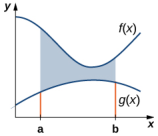

Figure 2.2 The area between the graphs of two functions, $f(x)$ and $g(x)$ ,on the interval $[a,b]$

As we did before,we are going to partition the interval on the $x$ -axis and approximate the area between the graphs of the functions with rectangles. So, for $i=0,1,2,\ldots,n$ let $P=\{x_{i}\}$ be a regular partition of $[a,b]$ . Then, for $i=1,2,\ldots,n$ choose a point $x_{i}^{*}\in\left[x_{i-1},x_{i}\right]$, and on each interval $\begin{bmatrix}x_{i-1},x_i\end{bmatrix}$ construct a rectangle that extends vertically from $g(x_i^*$ to $f(x_i^*)$ Figure 2.3(a) shows the rectangles when $x_i^{*}$ is selected to be the left endpoint of the interval and $n=10$ Figure 2.3(b) shows a representative rectangle in detail.

### MEDIA

Use this calculator (http://www.openstax.org/l/20 CurveCalc) to learn more about the areas between two

Figure 2.3 (a)We can approximate the area between the graphs of two functions, $f(x)$ and $g(x)$ ,with rectangles. (b) The area ofa typicalrectanqle qoes from onecurve to the other

The height of each individual rectangle is $f(x_{i}^{n})-g(x_{i}^{*})$ and the width of each rectangle is $\Delta x$ . Adding the areas of all the rectangles, we see that the area between the curves is approximated by

$$A\approx\sum_{i=1}^n\left[f(x_i^*)-g(x_i^*)\right]\Delta x.$$

This is a Riemann sum, so we take the limit as $n\to00$ and we get

$$A=\lim_{n\to\infty}\sum_{i=1}^{n}\left[f(x_{i}^{*})-g(x_{i}^{*})\right]\Delta x=\int_{a}^{b}\left[f(x)-g(x)\right]dx.$$

These findings are summarized in the following theorem

### Theorem 2.1

### Finding theArea between Two Curves

Let $f(x)$ and $g(x)$ be continuous functions such that $f(x)\geq g(x)$ over an interval $[a,b]$ . Let $R$ denote the region bounded above by the graph of $f(x)$ ,below by the graph of $g(x)$ , and on the left and right by the lines $x=a$ ano $x=b$ ,respectively. Then, the area of $R$ is given by

$$A=\int_a^b[f(x)-g(x)]\:dx.$$

We apply this theorem in the following example.

# EXAMPLE 2.1

### Finding the Area of a Region between Two Curves 1

If $R$ is the region bounded above by the graph of the function $f(x)=x+4$ and below by the graph of thefunctior $g(x)=3-\frac{x}{2}$ over the interval [1, 4] , find the area of region $R$

### $②$ Solution

The region is depicted in the following figure.

Figure 2.4 Aregion between two curves is shown where one curve is always greater than the other.

We have

$$\begin{aligned}
\text{A}& =\int_{a}^{b}\left[f(x)-g(x)\right]dx \\
&=\int_{-2}^{6}\left[9-\left(\frac{x}{2}\right)^{2}-(6-x)\right]dx=\int_{-2}^{6}\left[3-\frac{x^{2}}{4}+x\right]dx \\
&=\left[3x-\frac{x^{3}}{12}+\frac{x^{2}}{2}\right]\bigg|_{-2}^{6}=\frac{64}{3}.
\end{aligned}$$

The area of the region is 64/3 units2.

2.2 If R is the region bounded above by the graph of the function $f(x)=\chi$ and below by the graph of the function $g(x)=x^4$ find the area of region R.

# Areas of Compound Regions

So far, we have required $f(x)\geq g(x)$ over the entire interval of interest,but what if we want to look at regions bounded by the graphs of functions that cross one another? In that case, we modify the process we just developed by using the absolute value function.

### Theorem 2.2

### Finding the Area of a Reqion between Curves That Cross

Let $f(x)$ and $g(x)$ becontinuous functions over an interval $[a,b]$ . Let $R$ denote the region between the graphs of $f(x)$ and $g(x)$ , and be bounded on the left and right by the lines $x=a$ and $x=b$ ,respectively. Then, the area of $R$ is given by

$$A=\int_a^b|f(x)-g(x)|\:dx.$$

In practice, applying this theorem requires us to break up the interval $[a,b]$ and evaluate several integrals, depending on which of the function values is greater over a given part of the interval. We study this process in the following example.

### EXAMPLE 2.3

### Finding the Area of a Region Bounded by Functions That Cross

If $R$ is the region between the graphs of the functions. $f(x)=\sin x$ and $g(x)=\cos x$ over the interval $[0,\pi]$ , find the area of region $R$

### Solution

Figure 2.6 The region between two curves can be broken into two sub-regions

The graphs of the functions intersect at $x=\pi/4$ For $x\in[0,\pi/4]$ $x\in[0,\pi/4]$ $x\in[0,\pi/4],\cos x\geq\sin x$, 60

$$|f(x)-g(x)|=|\sin x-\cos x|=\cos x-\sin x.$$

On the other hand, for $x\in[\pi/4,\pi]$ , sin $x\geq\cos x$ SC

$$|f(x)-g(x)|=|\sin x-\cos x|=\sin x-\cos x.$$

Then

$$\begin{aligned}
\text{A}& =\int_{a}^{b}|f(x)-g(x)|\:dx \\
&=\int_{0}^{\pi}|\sin x-\cos x|\:dx=\int_{0}^{\pi/4}(\cos x-\sin x)\:dx+\int_{\pi/4}^{\pi}(\sin x-\cos x)\:dx \\
&=[\sin x+\cos x]\mid_{0}^{\pi/4}+[-\cos x-\sin x]\mid_{\pi/4}^{\pi} \\
&=\left(\sqrt{2}-1\right)+\left(1+\sqrt{2}\right)=2\sqrt{2}.
\end{aligned}$$

The area of the region is $2\sqrt{2}$ units2

If R is the region between the graphs of the functions f(x) = sin x $f(x)=\sin x$ $f(x)=\sin x$ and $g(x)=\cos x$ g(x) = cos x $g(x)=\cos x$ over the interva $[\pi/2,2\pi]$ find the area of region R.

### EXAMPLE 2.4

### Finding the Area of a Complex Region

Consider the region depicted in Eigure 2.7. Find the area of $R$

Figure 2.7 Two integrals are required to calculate the area of this region

### Solution

As with Example 2.3, we need to divide the interval into two pieces. The graphs of the functions intersect at $x=1$ (se $f(x)=g(x)$ and solve for x), so we evaluate two separate integrals: one over the interval [0, 1] and one over the interval [1,2].

Over the interval [0, 1], the region is bounded above by $f(x)=x^{2}$ and below by the $x.$ axis, so we have

$$A_1=\int_0^1x^2dx=\left.\frac{x^3}{3}\right|_0^1=\frac{1}{3}.$$

Over the interval [1,2],the reqion is bounded above by $g(x)=2-x$ andbelowby the X -axis, so we have

$$A_2=\int_1^2(2-x)\:dx=\left[2x-\frac{x^2}{2}\right]\bigg|_1^2=\frac{1}{2}.$$

Adding these areas together, we obtain

$$A=A_1+A_2=\frac{1}{3}+\frac{1}{2}=\frac{5}{6}.$$

The area of the region is 5/6 units2.

Consider the region depicted in the following figure. Find the area of R

# Regions Defined with Respect to y

In Example 2.4, we had to evaluate two separate integrals to calculate the area of the region. However, there is another approach that requires only one integral. What if we treat the curves as functions of $y$ ,instead of as functions of $X$ Review Eigure 2.7. Note that the left graph, shown in red, is represented by the function $y=f(x)=x^{2}.$ We could just as easily solve this for $x$ and represent the curve by the function $x=v(y)=\sqrt{y}$ . (Note that $x=-{\sqrt{y}}$ is also a valid representation of the function $y=f(x)=x^{2}$ as a function of y. However, based on the graph, it is clear we are interested in the positive square root.) Similarly, the right graph is represented by the function $y=g(x)=2-x$ ,but could just as easily be represented by the function $x=u(y)=2-y$ When the graphs are represented as functions of $y$ we see the region is bounded on the left by the graph of one function and on the right by the graph of the other function.Therefore, if we integrate with respect to $y$ , we need to evaluate one integral only. Let's develop a formula for this type of integration.

Let $u(y)$ and $\upsilon(y)$ be continuous functions over an interval [c, d] such that $u(y)\geq v(y)$ for all $y\in[c,d].$ We want to find the area between the graphs of the functions, as shown in the following figure.

Figure 2.8 We can find the area between the graphs of two functions, $u(y)$ and $v(y)$

This time, we are going to partition the interval on the $y$ -axis and use horizontal rectangles to approximate the area between the functions. So, for i = 0 $i=0$ $i=0,1,2,\ldots,n$ let $Q=\{y_{i}\}$ be a regular partition of [c, d] . Then, for $i=1,2,...,n$ choose a point $y_{i}^{*}\in[y_{i-1},y_{i}]$ ,then over each interval $\begin{bmatrix}y_{i-1},y_i\end{bmatrix}$ construct a rectangle that extends horizontally from $v\left(y_{i}^{*}\right)$ to $u\left(y_i^*\right)$ . Figure 2.9(a) shows the rectangles when $y_i^*$ is selected to be the lower endpoint of the interval and $n=10.$ Figure 2.9(b) shows a representative rectangle in detail.

Figure 2.9 (a) Approximating the area between the graphs of two functions, $\iota\iota(y)$ and v(y), with rectangles. (b) The area of a typical rectangle.

The height of each individual rectangle is $\Delta y$ and the width of each rectangle is $u\left(y_{i}^{*}\right)-v\left(y_{i}^{*}\right).$ Therefore, the area between the curves is approximately

$$A\approx\sum_{i=1}^{n}\left[u\left(y_{i}^{*}\right)-v\left(y_{i}^{*}\right)\right]\Delta y.$$

This is a Riemann sum, so we take the limit as $n\to\infty$ ,obtaining

$$A=\lim\limits_{n\to\infty}\sum\limits_{i=1}^{n}\left[u\left(y_{i}^{*}\right)-v\left(y_{i}^{*}\right)\right]\Delta y=\int\limits_{c}^{d}\left[u(y)-v(y)\right]dy.$$

These findings are summarized in the following theorem.

### Theorem 2.3

Finding the Area between Two Curves, Inteqrating along the y-axis

Let $u(y)$ and $\upsilon(y)$ be continuous functions such that $u(y)\geq v(y)$ for all $y\in[c,d].$ Let $R$ denote the region bounded on the right by the graph of $u(y)$ , on the left by the graph of $\upsilon(y)$ , and above and below by the lines $y=d$ and $y=c$ respectively. Then, the area of $R$ is given by

$$A=\int_c^d\left[u(y)-v(y)\right]dy.$$

# EXAMPLE 2.5

### Integrating with Respect to y

Let's revisit Example 2.4, only this time let's integrate with respect to $y.$ Let $R$ be the region depicted in Eigure 2.10. Find the area of $R$ by integrating with respect to $y$

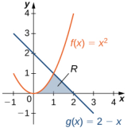

Figure 2.10 The area of region $R$ can be calculated using one integral only when the curves are treated as functions of y.

### $①$ Solution

We must first express the graphs as functions of $y$ .As we saw at the beginning of this section, the curve on the left can be represented by the function $x=v(y)=\sqrt{y}$ and the curve on the right can be represented by the function
$$x=u(y)=2-y.$$

Now we have to determine the limits of integration. The region is bounded below by the x-axis, so the lower limit of integration is $y=0$ . The upper limit of integration is determined by the point where the two graphs intersect, which is the point (1,1) , so the upper limit of integration is $y=1$ , Thus, we have $[c,d]=[0,1]$

Calculating the area of the region, we get

The area of the region is 5/6 units2.

2.5 Let's revisit the checkpoint associated with Example 2.4, only this time, let's integrate with respect to y. Let R be the region depicted in the following figure. Find the area of $R$ by integrating with respect to y.

### SECTION 2.1 EXERCISES

 For the following exercises, determine the area of the region between the two curves in the given figure by integrating over the x-axis.

2. $y=x^{2}$ and $y=3x+4$ 1. $y=x^{2}-3$ and $y=1$

For the following exercises,split the region between the two curves into two smaller regions, then determine the area b integrating over the $\chi$ -axis. Note that you will have two integrals to solve

For the following exercises, determine the area of the region between the two curves by integrating over they-axis.

For the following exercises,qraph the equations and shade the area of the region between the curves.Determine its area by integrating over the $x$ -axis

7. $y=x^{2}$ and $y=-x^{2}+18x$ 9. y = cos x and $y=\cos^{2}x$ on 8. $y=\frac{1}{x},y=\frac{1}{x^{2}}$ , and $x=3$ X = [-, ]

10. $y=e^{x},y=e^{2x-1}$ , and $x=0$ 11. $y=e^{x},y=e^{-x},x=-1$ and $x=1$ 12. $y=e,y=e^{x}$ , and $y=e^{-x}$

13. $y=|x|$ and $y=x^{2}$

47.[T] $y=\cos x,y=e^{x},x=-\pi$, and $x=0$

48.The larqest triangle with a base on the $x$ -axis that fits inside the upper half of the unit circle $y^{2}+x^{2}=1$ is given by $y=1+x$ and $y=1-x$ .See the followinq fiqure. What is the area inside the semicircle but outside the trianqle？

49. A factory selling cell phones has a marginal cost function $C(x)=0.01x^{2}-3x+229$ where $x$ represents the number of cell phones,and a marginal revenue function given by $R(x)=429-2x$ .Find the area between the graphs of these curves and $x=0$ What does this area represent?

50.An amusement park has a marqinal cost function $C(x)=1000e^{-x}+5$ where $x$ represents the number of tickets sold, and a marginal revenue function given by $R(x)=60-0.1x.$ Find the total profit generated when selling 550 tickets. Use a calculator to determine intersection points, if necessary, to two decimal places

52.The tortoise versus the hare The speed of the hare is given by the sinusoidal function whereas the speed of the tortoise is $T(t)={\sqrt{t}}$ ,where is time measured in hours and speed is measured in kilometers per hour. If the race is over in 1 hour who won the race and by how much? Use a calculator to determine the intersectior points, if necessary, accurate. to three decimal places

51. The tortoise versus the hare: The speed of the hare is given by the sinusoidal function
$$H(t)=1-\cos{((\pi t)/2)}$$
whereas the speed of the tortoise is $T(t)=(1/2)\tan^{-1}(t/4)$ where fis time measured in hours and the speed is measured in miles per hour. Find the area between the curves from time $t=0$ to the first time after one hour when the tortoise and hare are traveling at the same speed. What does it represent? Use a calculator to determine the intersection points, if necessary, accurate tc three decimal places.

For the following exercises, find the area between the curves by integrating with respect to x and then with respect to y Is one method easier than the other? Do you obtain the same answer?

53. $y=x^{2}+2x+1$ and $y=-x^{2}-3x+4$ 54.y=x4and $x=y^5$ 55.x =y2-2 and x=2

For the following exercises, solve using calculus, then check your answer with geometry

57. Find the area between the perimeter of the unit circle and the triangle created from $y=2x+1,y=1-2x$ and $y=-\frac{3}{5}$ ,as seen in the following figure. Is there a way to solve this without using calculus?

56.Determine the eauations for the sides of the square that touches the unit circle on all four sides, asseen in the following fiqure Find the area between the perimeter of this square and the unit circle. Is there another way to solve this without using

# 2.2 Determining Volumes by Slicing

## Learning Objectives

2.2.1 Determine the volume of a solid by integrating a cross-section (the slicing method) 2.2.2 Find the volume of a solid of revolution using the disk method 2.2.3Find thevolume of a solid of revolution with a cavity usinq the washer method

In the preceding section, we used definite integrals to find the area between two curves. In this section, we use definite integrals to find volumes of three-dimensional solids. We consider three approaches-slicing, disks, and washersfor finding these volumes, depending on the characteristics of the solid

# Volume and the Slicing Method

Just as area is the numerical measure of a two-dimensional region, volume is the numerical measure of a threedimensional solid. Most of us have computed volumes of solids by using basic geometric formulas. The volume of a rectangular solid, for example, can be computed by multiplying length, width, and height: $V=lwh.$ The formulas for the volume of a sphere( $V={\frac{4}{3}}\pi r^{5}$ ), a cone $(V=\frac{1}{3}\pi r^{2}h)$ ,and a pyramid $\left(V=\frac{1}{3}Ah\right.$ ) have also been introduced. Although some of these formulas were derived using geometry alone, all these formulas can be obtained by using integration

We can also calculate the volume of a cylinder. Although most of us think of a cylinder as having a circular base, such as a soup can or a metal rod, in mathematics the word cylinder has a more general meaning. To discuss cylinders in this more general context, we first need to define some vocabulary

We define the cross-section of a solid to be the intersection of a plane with the solid. A cylinder is defined as any solid that can be generated by translating a plane region along a line perpendicular to the region, called the axis of the cylinder. Thus, all cross-sections perpendicular to the axis of a cylinder are identical. The solid shown in Eigure 2.11 is an example of a cylinder with a noncircular base. To calculate the volume of a cylinder, then, we simply multiply the area of the cross-section by the height of the cylinder: $V=A\cdot h.$ In the case of a right circular cylinder (soup can), this becomes $V=\pi r^{2}h$

Figure 2.11 Each cross-section of a particular cylinder is identical to the others.

If a solid does not have a constant cross-section (and it is not one of the other basic solids), we may not have a formula for its volume. In this case, we can use a definite integral to calculate the volume of the solid. We do this by slicing the solid into pieces, estimating the volume of each slice, and then adding those estimated volumes together.The slices should all be parallel to one another, and when we put all the slices together, we should get the whole solid. Consider, for example, the solid S shown in Figure 2.12, extending along the $x$ -axis.

Figure 2.12 A solid with a varying cross-section.

We want to divide $S$ into slices perpendicular to the $x$ -axis. As we see later in the chapter, there may be times when we want to slice the solid in some other direction—say, with slices perpendicular to the y-axis. The decision of which way to slice the solid is very important. If we make the wrong choice, the computations can get quite messy. Later in the chapter, we examine some of these situations in detail and look at how to decide which way to slice the solid. For the purposes of this section, however, we use slices perpendicular to the $x$ -axis.

Because the cross-sectional area is not constant, we let $A\left(x\right)$ represent the area of the cross-section at point $x$ . Now let $\bar{P}=\{x_{0},x_{1}...,X_{n}\}$ be a regular partition of $[a,b]$ ,and for $i=1,2,\ldots n$ let $S_{i}$ represent the slice of $S$ stretching from $x_{i-1}$ xj1 $x_{i-1}$to $x_i$ Xj $x_{i}$ The following figure shows the sliced solid with $n=3$

Figure 2.13 The solid $S$ has been divided into three slices perpendicular to the $x$ -axis

Finally, for $i=1,2,\ldots n$ let $x_i^{*}$ be an arbitrary point in $\begin{bmatrix}x_{i-1},x_i\end{bmatrix}.$ Then the volume of slice $S_i$ can be estimated by $V(S_{i})\approx A\left(x_{i}^{*}\right)\Delta x.$ Adding these approximations together, we see the volume of the entire solid $S$ can be approximated by

$$V\left(S\right)\approx\sum_{i=1}^{n}A\left(x_{i}^{*}\right)\Delta x.$$

By now, we can recognize this as a Riemann sum, and our next step is to take the limit as $n\to00$ .Then we have

$$V\left(S\right)=\lim\limits_{n\to\infty}\sum\limits_{i=1}^{n}A\left(x_{i}^{*}\right)\Delta x=\int\limits_{a}^{b}A\left(x\right)dx.$$

The technique we have just described is called the slicing method. To apply it, we use the following strategy.

### Problem-Solving Strategy

### Finding Volumes by the Slicing Method

1.Examine the solid and determine the shape of a cross-section of the solid. It is often helpful to draw a picture if one is not provided 2.Determine a formula for the area of the cross-section. 3.Integrate the area formula over the appropriate interval toget thevolume.

Recall that in this section, we assume the slices are perpendicular to the $X$ -axis.Therefore,the area formula is in terms of x and the limits of integration lie on the $x$ -axis. However, the problem-solving strategy shown here is valid regardless of how we choose to slice the solid.

## EXAMPLE 2.6

### Deriving the Formula for the Volume of a Pyramid

We know from geometry that the formula for the volume of a pyramid is $V=\frac{1}{3}Ah.$ If the pyramid has a square base, this becomes $V=\frac{1}{3}a^{2}h$ ,where a denotes the length of one side of the base.We are going to use the slicing method to derive this formula

## $②$ Solution

We want to apply the slicing method to a pyramid with a square base. To set up the integral, consider the pyramid shown in Fiqure 2.14, oriented along the $x$ -axis

Figure 2.14 (a) A pyramid with a square base is oriented along the x-axis. (b) A two-dimensional view of the pyramid is

seen from the side.

We first want to determine the shape of a cross-section of the pyramid. We know the base is a square, so the crosssections are squares as well (step 1). Now we want to determine a formula for the area of one of these cross-sectional squares. Looking at Figure 2.14(b), and using a proportion, since these are similar triangles, we have

$$\frac{s}{a}=\frac{x}{h}\:\mathrm{or}\:s=\frac{ax}{h}.$$

Therefore. the area of one of the cross-sectional sauares is

$$A\left(x\right)=s^{2}=\left(\frac{ax}{h}\right)^{2}\left(\mathrm{step}\:2\right).$$

Thenwefind thevolume of thepyramid by integrating from 0 to h (step 3)

$$\begin{aligned}
V& =\int_{0}^{h}A\left(x\right)dx \\
&=\int_{0}^{h}\left(\frac{ax}{h}\right)^{2}dx=\frac{a^{2}}{h^{2}}\int_{0}^{h}x^{2}dx \\
&=\left[\frac{a^{2}}{h^{2}}\big(\frac{1}{3}x^{3}\big)\right]\bigg|_{0}^{h}=\frac{1}{3}a^{2}h.
\end{aligned}$$

This is the formula we were looking for.

$\boxed{\sqrt{2}}$ 2.6 Use the slicing method to derive the formula $V=\frac{1}{3}\pi r^{2}h$ for the volume of a circular cone

## Solids of Revolution

If a reqion in a plane is revolved around a line in that plane, the resulting solid is called a solid of revolution,as shown ir the following figure.

Figure 2.15 (a) This is the region that is revolved around the x-axis. (b) As the region begins to revolve around the axis, it

sweeps out a solid of revolution. (c) This is the solid that results when the revolution is complete.

Solids of revolution are common in mechanical applications, such as machine parts produced by a lathe. We spend the rest of this section looking at solids of this type.The next example uses the slicing method to calculate the volume of a solid of revolution.

### MEDIA

Use an online inteqral calculator (http://www.openstax.orq/l/20 IntCalc2) to learn more

## EXAMPLE 2.7

### Using the Slicing Method to find the Volume of a Solid of Revolution

Use the slicing method to find the volume of the solid of revolution bounded by the graphs of $f\left(x\right)=x^{2}-\bar{4}x+5,x=1$ , and $x=4$ ,and rotated about the $x$ -axis.

## $②$ Solution

Using the problem-solving strategy, we first sketch the graph of the quadratic function over the interval [1, 4] as shown in the following figure

Figure 2.16 A region used to produce a solid of revolution

Next, revolve the region around the $x.$ axis, as shown in the following figure.

Figure 2.17 Two views, (a) and (b), of the solid of revolution produced by revolving the region in Figure 2.16 about the

$X$ -axis.

Since the solid was formed by revolving the region around the $x$ -axis, the cross-sections are circles (step 1). The area of the cross-section, then, is the area of a circle, and the radius of the circle is given by $f(x)$ Use the formula for the area of the circle:

$$A\left(x\right)=\pi r^{2}=\pi[f\left(x\right)]^{2}=\pi\left(x^{2}-4x+5\right)^{2}(\mathrm{step}\:2).$$

The volume, then, is (step 3)

$$\begin{aligned}
\text{V}& =\int_{a}^{b}A\left(x\right)dx \\
&=\int_{1}^{4}\pi\Big(x^{2}-4x+5\Big)^{2}dx=\pi\int_{1}^{4}\left(x^{4}-8x^{3}+26x^{2}-40x+25\right)dx \\
&=\pi\left(\frac{x^{5}}{5}-2x^{4}+\frac{26x^{3}}{3}-20x^{2}+25x\right)\biggr|_{1}^{4}=\frac{78}{5}\pi.
\end{aligned}$$

The volume is $78\pi/5$

 Use the method of slicing to find the volume of the solid of revolution formed by revolving the regior between the graph of the function $f\left(x\right)=1/x$ and the x-axis over the interval [1, 2] around the x-axis. See the following figure.

### The Disk Method

When we use the slicing method with solids of revolution, it is often called the disk method because,for solids of revolution, the slices used to over approximate the volume of the solid are disks. To see this, consider the solid of revolution generated by revolving the region between the graph of the function $f(x)=(x-1)^{2}+1$ and the $x$ -axis over the interval [-1,3] around the $x$ -axis.The graph of thefunction and a representative disk are shown inFigure 2.18(a) and (b). The region of revolution and the resulting solid are shown in Figure 2.18(c) and (d).

Figure 2.18 (a) A thin rectangle for approximating the area under a curve.(b) A representative disk formed by revolving

the rectangle about the $x$ axis. (c) The region under the curve is revolved about the $x$ -axis, resulting in (d) the solid of revolution.

We already used the formal Riemann sum development of the volume formula when we developed the slicing method. We know that

$$V=\int_{a}^{b}A\left(x\right)dx.$$

The only difference with the disk method is that we know the formula for the cross-sectional area ahead of time; it is the area of a circle.This gives the following rule

### Rule:The Disk Method

Let $f(x)$ be continuous and nonnegative. Define $R$ as the region bounded above by the graph of $f(x).$ below by the $X$ -axis, on the left by the line $x=a$ , and on the right by the line $x=b$ Then, the volume of the solid of revolution

formed by revolving $R$ around the X -axis is given by

$$V=\int_a^b\pi[f(x)]^2dx.$$

The volume of the solid we have been studying (Figure 2.18) is given by
$$\begin{aligned}
V& =\int_{a}^{b}\pi[f(x)]^{2}dx \\
&=\int_{-1}^{3}\pi\Big[(x-1)^{2}+1\Big]^{2}dx=\pi\int_{-1}^{3}\Big[(x-1)^{4}+2(x-1)^{2}+1\Big]\:dx \\
&=\pi\Big[\frac{1}{5}(x-1)^{5}+\frac{2}{3}(x-1)^{3}+x\Big]\Big|_{-1}^{3}=\pi\Big[\Big(\frac{32}{5}+\frac{16}{3}+3\Big)-\Big(-\frac{32}{5}-\frac{16}{3}-1\Big)\Big]=\frac{412\pi}{15}\:\mathrm{units}^{3}.
\end{aligned}$$

Let's look at some examples.

# EXAMPLE 2.8

### Using the Disk Method to Find the Volume of a Solid of Revolution 1

Use the disk method to find the volume of the solid of revolution generated by rotating the region between the graph of $f(x)=\sqrt{x}$ and the $x$ -axis over the interval [1,4] around the $x$ -axis.

### $②$ Solution

The qraphs of the function and the solid of revolution are shown in the following fiqure.

Figure 2.19 (a) The function $f(x)=\sqrt{x}$ over the interval [1,4] . (b) The solid of revolution obtained by revolving the

region under the graph of $f(x)$ about the $X$ -axis.

We have

$$\begin{aligned}
V& =\int_{a}^{b}\pi[f(x)]^{2}dx  \\
&=\int_{1}^{4}\pi\Big[\sqrt{x}\Big]^{2}dx=\pi\int_{1}^{4}x\:dx \\
&=\frac{\pi}{2}x^{2}\Big|_{1}^{4}=\frac{15\pi}{2}.
\end{aligned}$$

The volume is $(15\pi)/2$ units3

Sofar,our examples have all concerned regions revolved around the $X$ -axis, but we can generate a solid of revolution by revolving a plane region around any horizontal or vertical line. In the next example, we look at a solid of revolution that has been generated by revolving a region around the. $y$ -axis.The mechanics of the diskmethod are nearly the same as when the $x$ -axis is the axis of revolution, but we express the function in terms of $y$ and we integrate with respect to y as well. This is summarized in the following rule.

### Rule: The Disk Method for Solids of Revolution around the y-axis.

Let g (y) be continuous and nonnegative. Define $Q$ as the region bounded on the right by the graph of $g\left(y\right)$, onthe left by the $y$ -axis, below by the line $y=c$ ,and above by the line $y=d.$ Then, the volume of the solid of revolution formed by revolving $Q$ around the y-axis is given by

$$V=\int_{c}^{d}\pi[g(y)]^{2}dy.$$

The next example shows how thisrule works in practice

## EXAMPLE 2.9

### Using the Disk Method to Find the Volume of a Solid of Revolution 2

Let $R$ be the region bounded by the graph of $g\left(y\right)={\sqrt{4-y}}$ and the $y$ axis over the $y$ axis interval [0, 4]. Use the disk method to find the volume of the solid of revolution generated by rotating $R$ around the $y$ -axis

### Solution

Figure 2.20 shows the function and a representative disk that can be used to estimate the volume. Notice that since we are revolving the function around the y-axis, the disks are horizontal, rather than vertical.

Figure 2.20 (a) Shown is a thin rectangle between the curve of the function $g\left(y\right)=\sqrt{4-y}$ and the y-axis. (b) The

rectanqle forms a representative disk after revolution around the y-axis.

The region to be revolved and the full solid of revolution are depicted in the following figure.

Figure 2.21 (a) The region to the left of the function $g\left(y\right)=\sqrt{4-y}$ over the y-axis interval [0, 4] . (b) The solid of

revolution formed by revolving the region about the y-axis.

To find the volume, we integrate with respect to y. We obtain

The volume is 8π units3

2.9 Use the disk method to find the volume of the solid of revolution generated by rotating the region between the graph of $g\left(y\right)=y$ and the y-axis over the interval [1, 4] around the y-axis.

## The Washer Method

Some solids of revolution have cavities in the middle; they are not solid all the way to the axis of revolution. Sometimes this is just a result of the way the region of revolution is shaped with respect to the axis of revolution. In other cases cavities arise when the region of revolution is defined as the region between the graphs of two functions. A third way thiscan happen iswhen an axis of revolution other than the $X$ axis or y-axis isselected.

When the solid of revolution has a cavity in the middle, the slices used to approximate the volume are not disks, but washers (disks with holes in the center). For example, consider the region bounded above by the graph of the function $f(x)={\sqrt{x}}$ and below by the graph of the function $g(x)=1$ over the interval [1, 4] . When this region is revolved around the X -axis, the result is a solid with a cavity in the middle, and the slices are washers. The graph of the function and a representative washer are shown in Figure 2.22(a) and (b). The region of revolution and the resulting solid are shown in Figure 2.22(c) and (d)

Figure 2.22 (a) A thin rectangle in the region between two curves.(b) A representative washer formed by revolving the

rectangle about the $x$ -axis.(c) The region between the curves over the given interval.(d) The resulting solid of revolution

The cross-sectional area, then,is the area of the outer circle less the area of the inner circle. In this case

$$A\left(x\right)=\pi\left(\sqrt{x}\right)^{2}-\pi\left(1\right)^{2}=\pi\left(x-1\right).$$

Then the volume of the solid is

$$\begin{aligned}
V& =\int_{a}^{b}A\left(x\right)dx \\
&=\int_{1}^{4}\pi\left(x-1\right)dx=\pi\left[\frac{x^{2}}{2}-x\right]\bigg|_{1}^{4}=\frac{9}{2}\pi\:\mathrm{units}^{3}.
\end{aligned}$$

Generalizing this process gives the washer method

Rule: The Washer Method

Suppose $f(x)$ and $g\left(x\right)$ are continuous, nonnegative functions such that. $f\left(x\right)\geq g\left(x\right)$ over $[a,b].$ Let $R$ denote the regionbounded above by the graph of $f(x)$ ，below by the graph of $g\left(x\right)$ ,on the left by the line $x=a$ and on the right by the line $x=b$ . Then, the volume of the solid of revolution formed by revolving $R$ around the $x$ -axis is qiver by

$$V=\int_{a}^{b}\pi\left[(f(x))^{2}-(g(x))^{2}\right]dx.$$

### EXAMPLE 2.10

### Using the Washer Method

Find the volume of a solid of revolution formed by revolving the region bounded above by the graph of $f\left(x\right)=x$ and below by the graph of $g\left(x\right)=1/x$ over the interval [1, 4] around the $x$ -axis

The graphs of the functions and the solid of revolution are shown in the following figure.

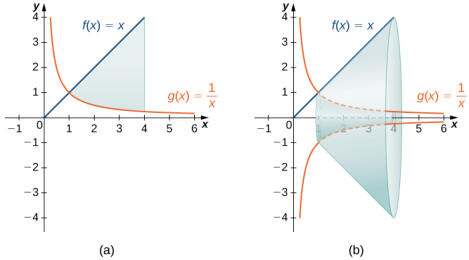
Figure 2.23 (a) The region between the graphs of the functions $f\left(x\right)=x$ and $g\left(x\right)=1/x$ over the interval [1,4]. (b)

Revolving theregion about the $x$ =axis generates a solid of revolution with a cavity in the middle

We have

$$\begin{aligned}
V& =\int_{a}^{b}\pi\left[(f\left(x\right))^{2}-(g\left(x\right))^{2}\right]dx \\
&=\pi\int_{1}^{4}\left[x^{2}-\left(\frac{1}{x}\right)^{2}\right]dx\:=\pi\left[\frac{x^{3}}{3}+\frac{1}{x}\right]\bigg|_{1}^{4}=\frac{81\pi}{4}\:\mathrm{units}^{3}.
\end{aligned}$$

2.10 Find the volume of a solid of revolution formed by revolving the region bounded by the graphs of $f\left(x\right)=\sqrt{x}$ and g $(x)=1/x$ over the interval [1, 3] around the x-axis.

As with the disk method.we can also apply the washer method to solids of revolution that result from revolving a reaion around the y-axis. In this case, the following rule applies.

### Rule:The WasherMethod for Solids of Revolution around they-axis

Suppose $u(y)$ and $v(y)$ are continuous, nonnegative functions such that $v\left(y\right)\leq u\left(y\right)$ for $y\in[c,d].$ Let $Q$ denote the region bounded on the right by the graph of $u(y)$ ,on the left by the graph of $v(y)$ , below by the line $y=c$ ,and above by the line $y=d.$ Then, the volume of the solid of revolution formed by revolving $Q$ around the y-axis is given by

$$V=\int_{c}^{d}\pi\left[\left(u\left(y\right)\right)^{2}-\left(v\left(y\right)\right)^{2}\right]dy.$$

Rather than looking at an example of the washer method with the $y$ -axis as the axis of revolution, we now consider an example in which the axis of revolution is a line other than one of the two coordinate axes.The same qeneral methoc applies, but you may have to visualize just how to describe the cross-sectional area of the volume.

## EXAMPLE 2.11

### The Washer Method with a Different Axis of Revolutior

Find the volume of a solid of revolution formed by revolving the region bounded above by $f\left(x\right)=4-x$ and belowby the $x$ -axis over the interval [0,4] around the line $y=-2$

The graph of the region and the solid of revolution are shown in the following figure.

Figure 2.24 (a) The region between the graph of the function $f\left(x\right)=4-x$ andthe $x$ -axis over the interval [0, 4] . (b)

Revolving theregion about the line $y=-2$ generates a solid of revolution with a cylindrical hole through its middle.

We can't apply the volume formula to this problem directly because the axis of revolution is not one of the coordinate axes. However, we still know that the area of the cross-section is the area of the outer circle less the area of the inner circle. Looking at the graph of the function, we see the radius of the outer circle is given by $f(x)+2$ , which simplifies to

$$f(x)+2=(4-x)+2=6-x.$$

Theradius of the inner circle is $g\left(x\right)=2$ . Therefore, we have

$$\begin{aligned}
V& =\int_{0}^{4}\pi\left[(6-x)^{2}-(2)^{2}\right]dx \\
&=\pi\int_{0}^{4}\left(x^{2}-12x+32\right)dx\:=\pi\left[\frac{x^{3}}{3}-6x^{2}+32x\right]\bigg|_{0}^{4}=\frac{160\pi}{3}\:\mathrm{units}^{3}.
\end{aligned}$$

 2.1lFind the volume of a solid of revolution formed by revolving the region bounded above by the graph of $f\left(x\right)=x+2$ and below by the $\chi$ -axis over the interval [0, 3] around the line $y=-1.$

### SECTION 2.2EXERCISES

59.Use the slicinq method to derive the formula for the volume of a cone.

58. Derive the formula for the volume of a sphere using the slicing method.

60.Use the slicing method to derive the formula for the yolume of a tetrahedron with side length α

62. Explain when you would use the disk method versus the washer method. When are they interchangeable?

61.Use the disk method to derive theformula for the volume of a trapezoidal cylinder.

For the following exercises, draw a typical slice and find the volume using the slicing method for the given volume

65.A tetrahedron with a base side of 4 units, as seen here.

63.A pyramid with height 6 units and square base of side 2 units, as pictured here.

64. A pyramid with height 4 units and a rectangular base with length 2 units and width 3units,as pictured here.

66.A pyramid with height 5units, and 67.A cone of radius r and height hhas an isosceles trianqular base with lengths of 6 units and 8 units, as seen here.

a smaller cone of radius $r/2$ and height $h/2$ removed from the top,as seen here.The resulting solid is called a frustum

For the following exercises, draw an outline of the solid and find the volume using the slicing method

68. The base is a circle of radius a, The slices perpendicular to the base are squares.

69.Thebase is a trianglewith vertices (0,0),(1,0) ,and (0,1) . Slices perpendicular to the x-axis are semicircles,

70. The base is the region under the parabola $y=1-x^{2}$ in the first quadrant. Slices perpendicular to the xy-plane and parallel to the y-axis are squares.

73. The base is the area between $y=x$ and $y=x^{2}$ Slices perpendicular to the x-axis are semicircles.

71.The base is the reqion under the parabola $y=1-x^{2}$ and above the $X$ -axis. Slices perpendicular to the $y$ -axis are squares

72. The base is the region enclosed by $y=\bar{x^{2}}$ and $y=9$ . Slices perpendicular to the x-axis are right isosceles triangles. The intersection of one of these slices and the base is the leg of the triangle

For the following exercises,draw theregion bounded by the curves.Then,use the disk method tofind thevolume when the region isrotated around the x-axis

74. $x+y=8,x=0$ ,and $y=0$ 75. $y=2x^{2},x=0,x=4$ and $y=0$ 76. $y=e^{x}+1,x=0,x=1$ and $y=0$ 77. $y=x^{4},x=0$ ,and $y=1$for $x\geq0$ 78.y=xx=0,x=4,and $y=0$ 79. $y=\sin x,y=\cos x$ ,and $x=0$ 81. $x^{2}-y^{2}=9$ and $x+y=9,y=0$ and $x=0$ 80. $y=\frac{1}{x},x=2$ , and $y=3$

For the following exercises. draw the region bounded by the curyes.Then.find the yolume when the region is rotateo around the y-axis.

82.y =4-x,x =0, and $y=0$ 83. $y=2x^{3},x=0,x=1$ ,and $y=0$ 84. $y=3x^{2},x=0$ , and $y=3$

85. $y=\sqrt{4-x^{2}},y=0$ , and $x=0$ 86.y=x=0 $x=3$ , and $y=0$ 0

87. $x=\sec\left(y\right)$ and $y=\frac{\pi}{4}$ ， $y=0$ and $x=0$ 88. $y=\frac{1}{x+1},x=0$ ， $x=2$ , and $y=0$ 89. $y=4-x,y=x$ ,and $x=0$

around the x-axis

92.x2=yandx3=y 90. $y=x+2,y=x+6,x=0$ , and $x=5$ 91. $y=x^{2}$ and $y=x+2$

93. $y=4-x^{2}$ and $y=2-x$ 94.[T] 95. $y=\sqrt{x}$ and $y=x^{2}$ $y=\cos x,y=e^{-x},x=0$ , and x = 1.29296. $y=\sin x,y=5\sin x,x=0$ x,x = 0 $x,x=0$ and $x=\pi$ 97. $y={\sqrt{1+x^{2}}}$ and $y=\sqrt{4-x^{2}}$

For the following exercises,draw theregion bounded by thecurves.Then,use the washer method to find the volume when the region is revolved around the y-axis

98. $y=\sqrt{x},x=4$ , and $y=0$ 99. $y=x+2,y=2x-1$ , and $x=0$ 100. $y=\sqrt[3]{x}$ and $y=x^{3}$

101. $x=e^{2y},x=y^{2},y=0$ , and $y=\ln\left(2\right)$ 102. $x=\sqrt{9-y^{2}},x=e^{-y},y=0$ , and $y=3$

103.Yogurt containers can be shaped like frustums. Rotate the line $y=\frac{1}{m}x$ around the y-axis to find the volume between $y=a$ and $y=b$

104. Rotate the ellipse $\left(x^{2}/a^{2}\right)+\left(y^{2}/b^{2}\right)=1$ around the

X-axis to approximate the volume of a football, as seen here.

105. Rotate the ellipse $\left(x^{2}/a^{2}\right)+\left(y^{2}/b^{2}\right)=1$ around the y-axis to approximate the volume of a football.

106. A better approximation of the volume of a footbal is given by the solid that comes from rotating $y=\sin x$ around the x-axis from $x=0$ to $x=\pi$ What is the volume of this football approximation, as seen here？

107. What is the volume of the Bundt cake that comes from rotating $y=\sin x$ around the y-axis from $x=0$ to $x=\pi?$

### For the following exercises,find the volume of the solid described

110.Bore a hole of radius α dowr the axis of a right cone of height b and radius $b$ through the base of the cone as seen here.

108. The base is the region between $y=x$ and $y=x^{2}$ Slices perpendicular to the x-axis are semicircles.

109. The base is the region enclosed by the generic ellipse $(x^{\dot{2}}/a^{2})+(y^{2}/b^{2})=1.$ Slices perpendicular to the x-axis are semicircles

112.Find the volume of a spherical cap of13.Find the volume of a sphere of radius height h and radius r where $h<r$ ,as seen here.

$R$ with a cap of height / removed from the top, as seen here.

111.Find the volume common to two spheres of radius with centers that are $2h$ apart, as shown here.

# 2.3 Volumes of Revolution: Cylindrical Shells

## Learning Objectives

2.3.1Calculate the volume of a solid of revolution by using the method of cylindrical shells 2.3.2Compare the different methods for calculating a volume of revolution

In this section, we examine the method of cylindrical shells, the final method for finding the volume of a solid of revolution. We can use this method on the same kinds of solids as the disk method or the washer method; however, with the disk and washer methods, we integrate along the coordinate axis parallel to the axis of revolution. With the method of cylindrical shells, we integrate along the coordinate axis perpendicularto the axis of revolution. The ability to choose which variable of integration we want to use can be a significant advantage with more complicated functions. Also, the specific geometry of the solid sometimes makes the method of using cylindrical shells more appealing than using the washer method. In the last part of this section, we review all the methods for finding volume that we have studied and lay out some guidelines to help you determine which method to use in a given situation.

# The Method of Cylindrical Shells.

Again, we are working with a solid of revolution. As before, we define a region $R$ ,bounded above by the graph of a function $y=f(x)$ ,below by the $X$ -axis,and on the left and right by the lines $x=a$ and $x=b$ ,respectively, as shown in Eiqure 2.25(a). We then revolve this region around the y-axis, as shown in Eiqure 2.25(b). Note that this is different from what we have done before.Previously, regions defined in terms of functions of $x$ wererevolved around the $x$ -axis or a line parallel to it.

Figure 2.25 (a) A region bounded by the graph of a function of x. (b) The solid of revolution formed when the region is

revolved around the y-axis.

As we have done many times before, partition the interval $[a,b]$ using a regular partition, $P=\{x_{0},x_{1},...,x_{n}\}$ and, for $i=1,2,\ldots,n$ choose a point $x_{i}^{*}\in\left[x_{i-1},x_{i}\right]$, Then, construct a rectangle over the interval $\left[x_{i-1},x_{i}\right]$ of height $f(x_i^*)$ and width $\Delta x$ . A representative rectangle is shown in Eigure 2.26(a). When that rectangle is revolved around the y-axis instead of a disk or a washer, we get a cylindrical shell, as shown in the following figure.

Figure 2.26 (a) A representative rectangle. (b) When this rectangle is revolved around the y-axis, the result is a cylindrical

shell.(c)when we put all the shells toqether we qet an approximation of the oriqinal solid.

To calculate the volume of this shell, consider Figure 2.27

Figure 2.27 Calculating the volume of the shell.

The shellis a cylinder, so its volume is the cross-sectional area multiplied by the height of the cylinder. The cross-sections are annuli (ring-shaped regions--essentiall, circles with a hole in the center), with outer radius $x_i$ and inner radius $x_{i-1}$ Thus, the cross-sectional area is $\pi x_{i}^{2}-\pi x_{i-1}^{2}.$ The height of the cylinder is $f(x_i^*)$ . Then the volume of the shell is

$$\begin{aligned}
V_{\mathrm{shell}}& =f(x_{i}^{*})(\pi x_{i}^{2}-\pi x_{i-1}^{2}) \\
&=\pi f(x_{i}^{*})\left(x_{i}^{2}-x_{i-1}^{2}\right) \\
&=\pi f(x_{i}^{*})\left(x_{i}+x_{i-1}\right)(x_{i}-x_{i-1}) \\
&=2\pi f(x_{i}^{*})\left(\frac{x_{i}+x_{i-1}}{2}\right)\left(x_{i}-x_{i-1}\right).
\end{aligned}$$

Note that $x_{i}-x_{i-1}=\Delta x$ so we have

$$V_{\mathrm{shell}}=2\pi f(x_{i}^{*})\left(\frac{x_{i}+x_{i-1}}{2}\right)\Delta x.$$

Furthermore, $\frac{x_i+x_{i-1}}2$ is both the midpoint of the interval $[x_{i-1},x_i]$ and the average radius of the shell, and we can approximate this by $x_i^{n}$ .We then have

$$V_{\mathrm{shell}}\approx2\pi f(x_{i}^{*})x_{i}^{*}\Delta x.$$

Another way to think of this is to think of making a vertical cut in the shell and then opening it up to form a flat plate (Figure 2.28)

Figure 2.28 (a) Make a vertical cut in a representative shell. (b) Open the shell up to form a flat plate.

In reality, the outer radius of the shell is greater than the inner radius, and hence the back edge of the plate would be slightly longer than the front edge of the plate. However, we can approximate the flattened shell by a flat plate of height $f(x_i^*)$ ,width $2\pi x_i^{*}$ , and thickness $\Delta x$ (Eiqure 2.28). The volume of the shell, then, is approximately the volume of the flat plate. Multiplying the height, width, and depth of the plate, we get

$$V_{\mathrm{shell}}\approx f(x_{i}^{*})\left(2\pi x_{i}^{*}\right)\Delta x,$$

which is the same formula we had before

To calculate the yolume of the entire solid, we then add the yolumes of all the shells and obtair

$$V\approx\sum_{i=1}^{n}\left(2\pi x_{i}^{*}f(x_{i}^{*})\Delta x\right).$$

Here we have another Riemann sum, this time for the function $2\pi xf(x)$ , Taking the limit as $n\to\infty$ gives us

$$V=\lim_{n\to\infty}\sum_{i=1}^{n}\left(2\pi x_{i}^{*}f(x_{i}^{*})\Delta x\right)=\int_{a}^{b}\left(2\pi xf(x)\right)dx.$$

This leads to the following rule for the method of cylindrical shells.

### Rule: The Method of Cylindrical Shells

Let $f(x)$ be continuous and nonnegative. Define $R$ as the region bounded above by the graph of $f(x)$ ,below by the X -axis, on the left by the line $x=a$ ,and on the right by the line $x=b$ Then the volume of the solid of revolution formed by revolving $R$ around the y-axis is given by

$$V=\int_a^b\left(2\pi xf(x)\right)dx.$$

Now let's consider an example

# EXAMPLE 2.12

### The Method of Cylindrical Shells 1

Define $R$ as the region bounded above by the graph of $f(x)=1/x$ and below by the $x$ -axis over the interval [1, 3]. Find the volume of the solid of revolution formed by revolving. $R$ around the $y$ -axis.

## $②$ Solution

First we must graph the region $R$ and the associated solid of revolution,as shown in the following figure

Figure 2.29 (a) The region R under the graph of $f(x)=1/x$ over the interval [1,3].(b) The solid of revolution generated

by revolving $R$ about the y-axis.

Then the volume of the solid is given by

$$\begin{aligned}
\text{V}& =\int_{a}^{b}\left(2\pi xf(x)\right)dx \\
&=\int_{1}^{3}\left(2\pi x\left(\frac{1}{x}\right)\right)dx \\
&=\int_{1}^{3}2\pi\:dx=2\pi x|_{1}^{3}=4\pi\:\mathrm{units}^{3}.
\end{aligned}$$

2.12 Define R as the region bounded above by the graph of $f(x)=x^2$ and below by the x-axis over the interval [1, 2] . Find the volume of the solid of revolution formed by revolving $R$ around the y-axis.

### EXAMPLE 2.13

### The Method of Cylindrical Shells 2

DefineRas the reqionbounded above by the qraphof $f(x)=2x-x^{2}$ and belowby the $x$ -axis over the interval[0.2] Find the volume of the solid of revolution formed by revolving $R$ around the $y$ -axis.

First graph theregion $R$ and the associated solid of revolution, as shown in the following figure

Figure 2.30 (a) The region $R$ under the graph of $f(x)=2x-x^{2}$ over the interval [0, 2]. (b) The volume of revolution obtained by revolving $R$ about the $y$ -axis.

Then the volume of the solid is given by

$$\begin{aligned}
\text{1} \\
V& =\int_{a}^{b}\left(2\pi xf(x)\right)dx \\
&=\int_{0}^{2}\left(2\pi x\left(2x-x^{2}\right)\right)dx=2\pi\int_{0}^{2}\left(2x^{2}-x^{3}\right)dx \\
&=2\pi\left[\frac{2x^{3}}{3}-\frac{x^{4}}{4}\right]\bigg|_{0}^{2}=\frac{8\pi}{3}\:\mathrm{units}^{3}.
\end{aligned}$$

2.13 Define R as the region bounded above by the graph of $f(x)=3x-x^2$ and below by the $X$ -axis over the interval [0, 2] . Find the volume of the solid of revolution formed by revolving R around the y-axis.

As with the disk method and the washer method, we can use the method of cylindrical shells with solids of revolution revolved around the $x$ -axis,when wewant to integrate with respect to $y.$ The analogous rule for this type of solid is given here.

### Rule: The Method of Cylindrical Shells for Solids of Revolution around the x-axis

Let $g(y)$ be continuous and nonnegative. Define $Q$ as the region bounded on the right by the graph of $g(y)$ ,on the left by the $y$ -axis, below by the line $y=c$ , and above by the line $y=d.$ Then, the volume of the solid of revolution formed by revolving $Q$ around the $x$ -axis is given by

$$V=\int_{c}^{d}\left(2\pi yg(y)\right)dy.$$

# EXAMPLE 2.14

### The Method of Cylindrical Shells for a Solid Revolved around the x-axis

Define $Q$ as the region bounded on the right by the graph of $g(y)=2\sqrt{y}$ and on the left by the $y$ -axis for $y\in[0,4]$ Find the volume of the solid of revolution formed by revolving $Q$ around the x-axis.

### $②$ Solution

First, we need to graph the region $Q$ and the associated solid of revolution, as shown in the following figure

Figure 2.31 (a) The region $Q$ to the left of the function $g(y)$ over the interval[0,4]. (b) The solid of revolution generated

by revolving $Q$ around the $x$ -axis.

Label the shaded region $Q$ . Then the volume of the solid is given by

$$\begin{aligned}
\text{V}& =\int_{c}^{d}\left(2\pi yg(y)\right)dy \\
&=\int_{0}^{4}\left(2\pi y\left(2\sqrt{y}\right)\right)dy=4\pi\int_{0}^{4}y^{3/2}dy \\
&=4\pi\biggl[\frac{2y^{5/2}}{5}\biggr]\biggl|_{0}^{4}=\frac{256\pi}{5}\:\mathrm{units}^{3}.
\end{aligned}$$

$\boxed{\sqrt{2}}$ 2.14 Define $Q$ as the region bounded on the right by the graph of $g(y)=3/y$ and on the left by the y-axis for $y\in[1,3]$ Find the volume of the solid of revolution formed by revolving $Q$ around the x-axis.

For the next example,we look at a solid of revolution for which the qraph of a function is revolved around a line other than one of the two coordinate axes.To set this up,we need to revisit the development of the method of cylindrica shells. Recall that we found the volume of one of the shells to be given by

$$\begin{aligned}
V_{\mathrm{shell}}& =f(x_{i}^{*})(\pi x_{i}^{2}-\pi x_{i-1}^{2}) \\
&=\pi f(x_{i}^{*})\left(x_{i}^{2}-x_{i-1}^{2}\right) \\
&=\pi f(x_{i}^{*})\left(x_{i}+x_{i-1}\right)\left(x_{i}-x_{i-1}\right) \\
&=2\pi f(x_{i}^{*})\left(\frac{x_{i}+x_{i-1}}{2}\right)\left(x_{i}-x_{i-1}\right).
\end{aligned}$$

This was based on a shell with an outer radius of $X_{i}$ and an inner radius of $x_{i-1}$ . If, however, we rotate the region around a line other than the y-axis, we have a different outer and inner radius. Suppose, for example, that we rotate the region around the line $x=-k$ , where $k$ is some positive constant. Then, the outer radius of the shell is $x_{i}+k$ and the inner radius of the shell is $x_{i-1}+k$ .Substituting these terms into the expression for volume, we see that when a plane region is rotated around the line $x=-k$ , the volume of a shell is given by

$$\begin{aligned}
V_{\mathrm{shell}}& =2\pi f(x_{i}^{*})\left(\frac{\left(x_{i}+k\right)+\left(x_{i-1}+k\right)}{2}\right)\left((x_{i}+k)-\left(x_{i-1}+k\right)\right) \\
&=2\pi f(x_{i}^{*})\left(\left(\frac{x_{i}+x_{i-2}}{2}\right)+k\right)\Delta x.
\end{aligned}$$

As before, we notice that $\frac{x_i+x_{i-1}}2$ is the midpoint of the interval $\left[x_{i-1},x_{i}\right]$ and can be approximated by $x_{i}^{n}$ . Then, the approximate volume of the shell is

$$V_{\mathrm{shell}}\approx2\pi\left(x_{i}^{*}+k\right)f(x_{i}^{*})\Delta x.$$

The remainder of the development proceeds as before, and we see that

$$V=\int_{a}^{b}\left(2\pi\left(x+k\right)f(x)\right)dx.$$

We could also rotate the reqion around other horizontal or vertical lines, such as a verticalline in the riqht half plane.In each case, the volume formula must be adjusted accordingly. Specifically, the $x$ -term in the integral must be replaced with an expression representinq the radius of a shell. To see how this works, consider the following example

## EXAMPLE 2.15

## A Region of Revolution Revolved around a Line

Define $R$ as the region bounded above by the graph of $f(x)=x$ and below by the $x$ -axis over the interval [1, 2]. Find the volume of the solid of revolution formed by revolving $R$ around the line $x=-1$

## $②$ Solution

First, graph the region $R$ and the associated solid of revolution, as shown in the following figure.

Figure 2.32(a) Theregion R between the graph of $f(x)$ and the $x$ -axis over the interval [1, 2] . (b) The solid of revolution

generated by revolving $R$ around the line $x=-1$ .

Note that the radius of a shell is given by $x+1$ .Then the volume of the solid is given by

$$\begin{aligned}
V& =\int_{1}^{2}\left(2\pi\left(x+1\right)f(x)\right)dx \\
&=\int_{1}^{2}\left(2\pi\left(x+1\right)x\right)dx=2\pi\int_{1}^{2}\left(x^{2}+x\right)dx \\
&=2\pi\left[\frac{x^{3}}{3}+\frac{x^{2}}{2}\right]\Bigg|_{1}^{2}=\frac{23\pi}{3}\:\mathrm{units}^{3}.
\end{aligned}$$

2.15 Define R as the region bounded above by the graph of $f(x)=x^2$ and below by the $\chi$ -axis over the interval [0, 1] . Find the volume of the solid of revolution formed by revolving $R$ around the line $x=-2$

For our final example in this section, let's look at the volume of a solid of revolution for which the region of revolution is bounded by the graphs of two functions.

# EXAMPLE 2.16

### A Region of Revolution Bounded by the Graphs of Two Functions Define $R$ as the region bounded above by the graph of the function $f(x)=\sqrt{x}$ and below by the graph of the function

$g(x)=1/x$ over the interval [1,4] . Find the volume of the solid of revolution generated by revolving $R$ around the $y$ -axis.

First, graph the region $R$ and the associated solid of revolution, as shown in the following figure.

Figure 2.33 (a) The region $R$ between the graph of $f(x)$ and the graph of $g(x)$ over the interval [1, 4] . (b) The solid of

revolution generated by revolving $R$ around the y-axis.

Note that the axis of revolution is the $y$ -axis, so the radius of a shell is given simply by $x.$ We don't need to make any adjustments to the x-term of our integrand. The height of a shell, though, is given by $f(x)-g(x)$ , so in this case we need to adjust the $f(x)$ term of the integrand. Then the volume of the solid is given by

$$\begin{aligned}
V& =\int_{1}^{4}\left(2\pi x\left(f(x)-g(x)\right)\right)dx \\
&=\int_{1}^{4}\left(2\pi x\left(\sqrt{x}-\frac{1}{x}\right)\right)dx=2\pi\int_{1}^{4}\left(x^{3/2}-1\right)dx \\
&=2\pi\left[\frac{2x^{5/2}}{5}-x\right]\bigg|_{1}^{4}=\frac{94\pi}{5}\:\mathrm{units}^{3}.
\end{aligned}$$

2.16 Define R as the region bounded above by the graph of $f(x)=x$ and below by the graph of $g(x)=x^2$ over the interval [0, 1]. Find the volume of the solid of revolution formed by revolving R around the y-axis

## Which Method Should We Use?.

We have studied several methods for finding the volume of a solid of revolution,but how do we know which method tc use? It often comes down to a choice of which integral is easiest to evaluate. Fiqure 2.34 describes the different approaches for solids of revolution around the $x$ -axis. It's up to you to develop the analogous table for solids of revolution around the $y$ -axis.

Comparing the Methods for Finding the Volume of a Solid Revolution around the $x$ -axis

<table>
	<tbody>
		<tr>
			<th>Compare</th>
			<th>Disk Method</th>
			<th>Washer Method</th>
			<th>Vasher Method</th>
			<th>Shell Method</th>
		</tr>
		<tr>
			<td>Volume formula</td>
			<td>$\int_a^t$ $V$ $\pi [ f( x) ] ^2$ $dx$</td>
			<td>$\int_{-1}^{b}$ $\pi\left[(f(x))^2-(g(x))^2\right]dx$</td>
			<td>·F $\pi[(f(x))^2-\left(g(x)\right)^2]dx$ B</td>
			<td>$\int_{-}^{c}$ 1 $2\pi y$ $g( y)$ $dy$ V</td>
		</tr>
		<tr>
			<td>Solid</td>
			<td>No cavity in the center</td>
			<td>Cavity in the center</td>
			<td>in the center</td>
			<td>With or without a cavity in the center</td>
		</tr>
		<tr>
			<td>Interval to partition</td>
			<td>$[a,b]$ on x-axis</td>
			<td>$a,b]$on x-axis</td>
			<td>on x-axis</td>
			<td>$[c,d]$on y-axis</td>
		</tr>
		<tr>
			<td>Rectangle</td>
			<td>Vertical</td>
			<td>Vertical</td>
			<td>al</td>
			<td>Horizontal</td>
		</tr>
		<tr>
			<td rowspan="1">Typical region</td>
			<td>$f(x)$</td>
			<td>$f(x)$ $g(x)$ 1 1</td>
			<td>$f(x)$ $g(x)$</td>
			<td>$d$ $g(y)$ $C$</td>
		</tr>
		<tr>
			<td> </td>
			<td>$x$ 上 $a$ $b$</td>
			<td>$b$ $x$ $a$</td>
			<td>$a$ $b$ $x$</td>
			<td>V</td>
		</tr>
		<tr>
			<td rowspan="1">Typical element</td>
			<td>$f(x)$</td>
			<td>$f(x)$ $g(x)$</td>
			<td>$f(x)$ $g(x)$</td>
			<td>$g(y)$</td>
		</tr>
	</tbody>
</table>

Let's take a look at a couple of additional problems and decide on the best approach to take for solving them

# EXAMPLE 2.17

### Selecting the Best Method

For each of the following problems, select the best method to find the volume of a solid of revolution generated by

revolving the given region around the $X$ -axis, and set up the integral to find the volume (do not evaluate the integral).

a.The region bounded by the graphs of $y=x$ $y=2-x$ ,and the $X$ -axis b.The region bounded by the graphs of $y=4x-x^{2}$ and the $x$ -axis.

## $②$ Solution

a.First, sketch the reqion and the solid of revolution as shown

Figure 2.35 (a) The region $R$ bounded by two lines and the $X$ -axis. (b) The solid of revolution generated by revolvin

$R$ about the $x$ -axis

Looking at the region, if we want to integrate with respect to $X$ , we would have to break the integral into two pieces, because we have different functions bounding the region over [0,1] and [1,2]. In this case, using the disk method, we would have
$$V=\int_{0}^{1}\left(\pi x^{2}\right)dx+\int_{1}^{2}\left(\pi(2-x)^{2}\right)dx.$$

If we used the shell method instead, we would use functions of $y$ to represent the curves, producing
$$\begin{aligned}\text{Would use iunctions ol y to represe}\\V&=\int_{0}^{1}\left(2\pi y\left[(2-y)-y\right]\right)dy\\&=\int_{0}^{1}\left(2\pi y\left[2-2y\right]\right)dy.\end{aligned}$$

Neither of these integrals is particularly onerous, but since the shell method requires only one integral, and the integrand requires less simplification, we should probably go with the shell method in this case. b.First,sketch the region and the solid of revolution as shown

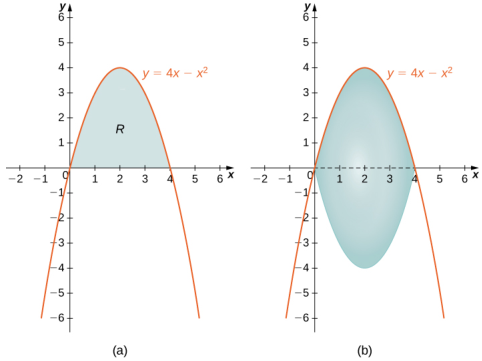
Figure 2.36 (a) Theregion $R$ between the curve and the $x$ -axis.(b) The solid of revolution generated byrevolving $R$

about the $x$ -axis

Looking at the region,it would be problematic to define a horizontal rectangle; the region is bounded on the left and right by the same function. Therefore, we can dismiss the method of shells. The solid has no cavity in the middle, so we can use the method of disks. Then
$$V=\int_{0}^{4}\pi\bigl(4x-x^{2}\bigr)^{2}dx.$$

Select the best method to find the volume of a solid of revolution generated by revolving the given regior around the x-axis, and set up the inteqral to find the volume (do not evaluate the inteqral): the reqior bounded by the graphs of $y=2-x^{2}$ and $y=x^2$

### SECTION 2.3 EXERCISES

For the following exercises, find the volume generated when the region between the two curves is rotated around the given axis. Use both the shell method a. oh the functions and draw a typica slice by hand.

114.[T] Bounded by the curves $y=3x,x=0$ X = 0 $x=0$ , and $y=3$ rotated around the y-axis

115.[T] Bounded by the curves $y=3x$ $y=0$ , and $x=3$ rotated around the y-axis.

116.[T] Bounded by the curves $y=3x$ $y=0$ ,and $y=3$ rotated around the $x$ -axis.

118.[T] Bounded by the curves $y=2x^{3},y=0$ , and $x=2$ rotated around the $y$ -axis.

117. [T] Bounded by the curves $y=3x,y=0$ , and $x=3$ rotated around the X -axis.

119. [T] Bounded by the curves $y=2x^{3},y=0$ ,and $x=2$ rotated around the $X$ -axis.

For the following exercises, use shells to find the volumes of the given solids. Note that the rotated regions lie betweer the curve and the x-axis and are rotated around the y-axis

120. $y=1-x^{2},x=0$ , and $x=1$ 121. $y=5x^{3},x=0$ , and $x=1$

122.y=x=1and $x=100$

123. $y=\sqrt{1-x^{2}},x=0$ , and $x=1$ 124.y=，x=0, and $x=3$ 125. $y=\sin x^{2},x=0$ , and $x=\sqrt{\pi}$

126.y=，x =0, and $x=\frac{1}{2}$ 127. $y=\sqrt{x},x=0$ , and $x=1$ 128. $y=\left(1+x^{2}\right)^{3},x=0$ , and $x=1$ 129. $y=5x^{3}-2x^{4},x=0$ ,and $x=2$

For the following exercises,useshellsto find the volume generated byrotating the regionsbetween the given curve and $y=0$ around the $x$ -axis.

133.y=， $x=1$ ， $x=2$ and the x-axis

132. $y=\frac{x^{3}}{2}$ ， $x=0$ ， $x=2$ 130. $y=\sqrt{1-x^{2}},x=0$ ， $x=1$ 131. $y=x^{2},x=0$ $x=2$ and and the $x-$ axis the x-axis and the x-axis 134. $x=\frac{1}{1+y^{2}},y=1$ , and $y=4$ 135. $x= \frac {1+ y^{2}}y, y= 1$, $y= 4$, $y=4$ y=4 and the yaxis 136. $x=\sqrt{4-y^{2}},x=0,y=0$ 137. $x=y^{3}-2y^{2}$ ， $x=0$ $x=9$ 138. x=y+1 $x=\sqrt{y}+1$ $x= \sqrt {y}+ 1$, $x= 1$, $x= 3$ x = 1, $x= 1$, $x= 3$ $x=3$ and the x-axis 139. $x=\sqrt[3]{27\text{y}}$and $x=\frac{3y}{4}$

For the following exercises,find the volume generated when the region between the curves is rotated around the given axis.

rotated around the $y$ -axis.

142. $y=x^{2},y=x$ , rotated around the $y$ -axis

140. $y=3-x,y=0,x=0$ $x=0$ x =0 ,and $x=2$ 141. $y=x^{3},x=0$ ,and $y=8$ rotated around the $y$ -axis

145. $y=\sqrt{x}$ and $y=x^{2}$ rotated around the $y$ axis

144.y =,x =1, $x=2$ and $y=0$ rotated around the line $x=4$

143.y=xy=0and $x=1$ rotated around the line $x=2$

147. $x=y^{3},x=\frac{1}{y},x=1$ , and $x=2$ rotated around the $x$ -axis.

146. $y=\sqrt{x}$ and $y=x^{2}$ 148. $x=y^{2}$ and $y=x$ rotated around the line $y=2$ rotated around the line $x=2$

149. [T] Left of $x=\sin\left(\pi y\right)$ right of $y=x$ ,around the $y$ -axis.

For the following exercises, use technology to graph the region. Determine which method you think would be easiest to use to calculate the volume generated when the function is rotated around the specified axis.Then,use your choser method to find the volume

150. $[\Pi]y=x^2$ and $y=4x$ rotated around the $y$ -axis

151.[T] $y=\cos\left(\pi x\right),y=\sin\left(\pi x\right),x=\frac{1}{4}$ and $x=\frac{5}{4}$ rotated around the $y$ axis. This exercise requires advanced technique. You may use technology to perform the integration

153.[T] $y=x^{2}-2x,x=2$ , and $x=4$ rotated around the $x$ -axis

152.[T] $y=x^{2}-2x,x=2$ , and $x=4$ rotated around the y-axis

154.[T] $y=3x^{3}-2,y=x$ ,and $x=2$ rotated around the $x$ -axis

155.[T] $y=3x^{3}-2,y=x$ and $x=2$ rotated around the $y$ -axis

157. [T] $x=y^{2},x=y^{2}-2y+1$ ,and $x=2$ rotated around the $y$ -axis

156. $[ \Pi ]$ $x= \sin$ $( \pi y^{2})$ and $x=\sqrt{2}y$ rotated around the $x$ -axis.

For the following exercises.use the method ofshells to approximate the volumes ofsome common obiects.which are pictured in accompanying figures

158.Use the method of shells to find the volume of a sphere of radius r.

159.Use the method of shells to find the volume of a cone with radius r and height h

161. Use the method of shells to find the volume of a cylinder with radius $r$ and height $h$

160. Use the method of shells to find the volume of an ellipsoid $\left(x^{2}/a^{2}\right)+\left(y^{2}/b^{2}\right)=1$ rotated around the $x$ -axis.

162. Use the method of shells to find the volume of the donut created when the circle $x^{2}+y^{2}=4$ is rotated around the line $x=4$

163. Consider he region enclosed by the graphs of $y=f\left(x\right),y=1+f\left(x\right),x=0,y=0$ , and $x=a>0$ What is the volume of the solid generated when this region is rotated around the y-axis?Assume that the function is defined over the interval $[0,a]$

164. Consider the function $y=f(x)$ , which decreases from $f\left(0\right)=b$ to $f(1)=0$ . Set up the integrals for determining the volume, using both the shell method and the disk method,of the solid generated when this region, with $x=0$ and $y=0$ , is rotated around the $y$ -axis. Prove that both methods approximate the same volume. Which method is easier to apply?(Hint: Since $f(x)$ is one-to-one, there exists an inverse $f^{-1}(y)$ ）

# 2.4 Arc Length of a Curve and Surface Area

## Learning Objectives

2.4.1Determine thelength of a curve, $y=f(x)$ ,between two points. 2.4.2 Determine the length of a curve, $x=g(y)$ ,between two points. 2.4.3Find the surface area of a solid of revolution

In this section, we use definite integrals to find the arc length of a curve. We can think of arc length as the distance you would travel if you were walking along the path of the curve. Many real-world applications involve arc length.If a rocket is launched along a parabolic path, we might want to know how far the rocket travels. Or, if a curve on a map represents a road, we might want to know how far we have to drive to reach our destination.

We begin by calculating the arc length of curves defined as functions of $X$ , then we examine the same process for curves defined as functions of $y$ (The process is identical, with the roles of $X$ and $y$ reversed.) The techniques we use to find arc length can be extended to find the surface area of a surface of revolution, and we close the section with an examination of this concept.

# Arc Length of the Curve $y=f(x)$

In previous applications of integration, we required the function $f(x)$ to be integrable, or at most continuous. However for calculating arc length we have a more stringent requirement for $f(x)$ . Here, we require $f(x)$ to be differentiable, anc furthermore we require its derivative, $f^{\prime}(x)$ , to be continuous. Functions like this, which have continuous derivatives, are called smooth. (This property comes up again in later chapters.)

Let $f(x)$ be a smooth function defined over $[a,b].$ We want to calculate the length of the curve from the point $(a,f(a))$ to the point $(b,f(b)).$ We start by using line segments to approximate the length of the curve.For $i=0$ ,1.,2...,, let $P=\{x_{i}\}$ be a regular partition of $[a,b]$ . Then, for $i=1,2,...,n$ ,construct a line segment from the point $\left(x_{i-1},f(x_{i-1})\right)$ to the point $(x_{i},f(x_{i}))$ .Although it might seem logical to use either horizontal or vertical line segments,we want our line segments to approximate the curve as closely as possible.Fiqure 2.37depicts this construct for $n=5$

Figure 2.37 We can approximate the length of a curve by adding line segments

To help us find the length of each line seqment, we look at the change in vertical distance as well as the chanqe in horizontal distance over each interval.Because we have used a reqular partition, the chanqe in horizontal distance over each interval is given by $\Delta x$ .The change in vertical distance varies from interval to interval, though, so we use $\Delta y_{i}=f(x_{i})-f(x_{i-1})$ to represent the change in vertical distance over the interval $\begin{bmatrix}x_{i-1},x_i\end{bmatrix}$, as shown in Figure 2.38 Note that some (or all) $\Delta y_i$ may be negative

Figure 2.38 A representative line segment approximates the curve over the interval $\left[x_{i-1},x_i\right]$

By the Pythagorean theorem, the length of the line segment is $\sqrt{(\Delta x)^{2}+(\Delta y_{i})^{2}}.$ We can also write this as $\Delta x\sqrt{1+((\Delta y_{i})/(\Delta x))^{2}}.$ Now, by the Mean Value Theorem, there is a point $x_{i}^{*}\in\left[x_{i-1},x_{i}\right]$ such that $f^{\prime }( x_{i}^{* }) = ( \Delta y_{i}) / ( \Delta x)$ . Then the length of the line segment is given by $\Delta x\sqrt{1+\left[f^{\prime}(x_{i}^{*})\right]^{2}}.$ Adding up the lengths of al the line segments, we get

$$\text{Arc Length}\approx\sum_{i=1}^{n}\sqrt{1+\left[f'(x_{i}^{*})\right]^{2}}\:\Delta x.$$

This is a Riemann sum. Taking the limit as $n\to\infty$ ,we have

$$\text{Arc Length}=\lim\limits_{n\to\infty}\sum\limits_{i=1}^{n}\sqrt{1+\left[f'(x_{i}^{*})\right]^{2}}\:\Delta x=\int\limits_{a}^{b}\sqrt{1+\left[f'(x)\right]^{2}}\:dx.$$

We summarize these findings in the following theorem.

### Theorem 2.4

### Arc Length for $y=f(x)$

Let $f(x)$ be a smooth function over the interval $[a,b].$ Then the arc length of the portion of the graph of $f(x)$ from the point $(a,f(a))$ to the point $( b$, $f( b) )$ is given by

$$\text{Arc Length}=\int_a^b\sqrt{1+\left[f'(x)\right]^2}\:dx.$$

Note that we are integrating an expression involving $f^{\prime}(x)$ ,so we need to be sure $f^{\prime}(x)$ is integrable. This is why we require $f(x)$ to be smooth.The following example shows how to apply the theorem.

### EXAMPLE 2.18

## Calculating the Arc Length of a Function of x Let $f(x)=2x^{3/2}.$ Calculate the arc length of the graph of $f(x)$ over the interval [0, 1] . Round the answer to three

decimal places.

### $②$ Solution

We have $f^{\prime}(x)=3x^{1/2}$, so $\left[f^{\prime}(x)\right]^{2}=9x.$ Then, the arc length is

$$\begin{aligned}
\mathrm{Arc~Length}& =\int_{a}^{b}\sqrt{1+\left[f^{\prime}(x)\right]^{2}}\:dx  \\
&=\int_{0}^{1}\sqrt{1+9x}\:dx.
\end{aligned}$$

Substitute $u=1+9x.$ Then, $du= 9$ $dx.$ When $x=0$ ,then $u=1$ , and when $x=1$ ,then $u=10$ .Thus

$$\begin{aligned}
\mathrm{Arc~Length}& =\int_{0}^{1}\sqrt{1+9x}\:dx \\
&=\frac{1}{9}\int_{0}^{1}\sqrt{1+9x}9dx=\frac{1}{9}\int_{1}^{10}\sqrt{u}\:du \\
&=\frac{1}{9}\cdot\frac{2}{3}u^{3/2}\Big|_{1}^{10}=\frac{2}{27}\Big[10\sqrt{10}-1\Big]\approx2.268\mathrm{~units}.
\end{aligned}$$

2.18 Let $f( x) = ( 4/ 3)$ $x^{3/ 2}$ . Calculate the arc length of the graph of $f(x)$ over the interval [0, 1] . Round the answer to three decimal places.

Although it is nice to have a formula for calculating arc length, this particular theorem can generate expressions that are difficult to integrate. We study some techniques for integration in Introduction_to Techniques of Integration. In some cases,wemay have to use a computer or calculator to approximate thevalue of theintegral.

### EXAMPLE 2.19

Using a Computer or Calculator to Determine the Arc Length of a Function of x

Let $f(x)=x^{2}$ . Calculate the arc length of the graph of $f(x)$ over the interval [1, 3]

Solution

We have $f^{\prime}(x)=2x$ ,so $\left[f^{\prime}(x)\right]^{2}=4x^{2}$ . Then the arc length is given by

$$\text{Arc Length}=\int_a^b\sqrt{1+\left[f'(x)\right]^2}\:dx=\int_1^3\sqrt{1+4x^2}\:dx.$$

Using a computer to approximate the value of this integral, we get

$$\int_1^3\sqrt{1+4x^2}\:dx\approx8.26815.$$

2.19 Let $f(x)=\sin x.$ Calculate the arc length of the graph of $f(x)$ over the interval $[ 0, \pi ]$ . Use a computer or calculator to approximate the value of the integral.

# ArcLengthof the Curve $x=g(y)$

We have just seen how to approximate the length of a curve with line segments. If we want to find the arc length of the graph of a function of $y.$ we can repeat the same process, except we partition the $y$ -axis instead of the $x$ -axis.Figure 2.39 shows a representative line segment.

Figure 2.39 A representative line segment over the interval $[y_{i-1},y_i]$

Then the length of the line segment is $\sqrt{(\Delta y)^{2}+(\Delta x_{i})^{2}}$, which can also be written as $\Delta y\sqrt{1+((\Delta x_{i})/(\Delta y))^{2}}.$ If we now follow the same development we did earlier, we get a formula for arc length of a function $x=g(y)$

### Theorem 2.5

## Arc Length for $x=g(y)$ Let $g(y)$ be a smooth function over a $y$ interval [c, d] . Then, the arc length of the graph of $g(y)$ from the point

$( g( d)$, $d)$ to the point (g(c), c) is given by

$$\text{Arc Length}=\int_c^d\sqrt{1+\left[g'(y)\right]^2}\:dy.$$

### EXAMPLE 2.20

### Calculatinq the Arc Lenqth of a Function of y Let $g(y)=3y^{3}$ .Calculate the arc length of the graph of $g(y)$ over the interval [1,2]

We have $g^{\prime}(y)=9y^{2}$, SO $\left[g^{\prime}(y)\right]^2=81y^4$ Then the arc length is

$$\text{Arc Length}=\int_{c}^{d}\sqrt{1+\left[g'(y)\right]^{2}}\:dy=\int_{1}^{2}\sqrt{1+81y^{4}}\:dy.$$

Using a computer to approximate the value of this integral, we obtain

$$\int_1^2\sqrt{1+81y^4}\:dy\approx21.0277.$$

$\boxed{-1}$ 2.20 Let $g(y)=1/y.$ Calculate the arc length of the graph of $g(y)$ over the interval [1, 4] . Use a computer on calculator to approximate the value of the integral

## Area of a Surface of Revolution

The concepts we used to find the arc length of a curve can be extended to find the surface area of a surface of revolution.Surface area is the total area of the outer layer of an object. For objects such as cubes or bricks, the surface area of the object is the sum of the areas of all of its faces. For curved surfaces, the situation is a little more complex. Le $f(x)$ be a nonnegative smooth function over the interval [a, b]. We wish to find the surface area of the surface of revolution created by revolving the graph of $y=f(x)$ around the $x$ -axis as shown in the following figure.

Figure 2.40 (a) A curve representing the function $f(x).$ (b) The surface of revolution formed by revolving the graph of

$f(x)$ around the $\chi$ -axis

As we have done many times before, we are going to partition the interval $[a,b]$ and approximate the surface area by

calculating the surface area of simpler shapes. We start by using line segments to approximate the curve, as we did earlier in this section.For $i=0,1,2,\ldots,n$ let $P=\{x_{i}\}$ be a regular partition of $[a,b]$ . Then, for $i=1,2,\ldots,n$ ,construct a line segment from the point $\left(x_{i-1},f(x_{i-1})\right)$ to the point $(x_{i},f(x_{i})).$ Now, revolve these line segments around the $x$ -axis to generate an approximation of the surface of revolution as shown in the following figure

Figure 2.41 (a) Approximating $f(x)$ with line segments. (b) The surface of revolution formed by revolving the line seqments around the $x$ -axis

Notice that when each line seqment is revolved around the axis,it produces a band. These bands are actually pieces of cones (think of an ice cream cone with the pointy end cut off).A piece of a cone like this is called a frustum of a cone

To find the surface area of the band, we need to find the lateral surface area, $S$ ,of the frustum (the area of just the slanted outside surface of the frustum, not including the areas of the top or bottom faces). Let $r_1$ and $r_2$ be the radi of the wide end and the narrow end of the frustum, respectively,and let $I$ be the slant height of the frustum as shown in the following figure.

Figure 2.42 A frustum of a cone can approximate a small part of surface area.

We know the lateral surface area of a cone is given by

Lateral Surface Area $=\pi rs$

where $r$ is the radius of the base of the cone and $s$ is the slant height (see the following figure)

Figure 2.43 The lateral surface area of the cone is given by $\pi rs$

Since a frustum canbe thought of as a pieceof a cone,thelateral surface area of thefrustum is given by thelateral surface area of the whole cone less the lateral surface area of the smaller cone (the pointy tip) that was cut off (see the following figure).

Figure 2.44 Calculating the lateral surface area of a frustum of a cone.

The cross-sections of the small cone and the large cone are similar triangles, so we see that

$$\frac{r_2}{r_1}=\frac{s-l}{s}.$$

Solving for s, we get

$$\begin{aligned}
\frac{r_{2}}{r_{1}}& =\quad\frac{s-l}{s}  \\
r_{2}s& =\:r_{1}\:(s-l)  \\
r_{2}s& =\:r_{1}s-r_{1}l  \\
r_{1}/& =\:r_{1}s-r_{2}s  \\
r_{1}/& =\:(r_{1}-r_{2})\:s  \\
\frac{r_{1}l}{r_{1}-r_{2}}& =s. 
\end{aligned}$$

Then the lateral surface area (SA) of the frustum is

$$\begin{aligned}
\text{S}& =\mathrm{~(Lateral~SA~of~large~cone)-(Lateral~SA~of~sm} \\
&=\pi r_{1}\:s-\pi r_{2}\:(s-l) \\
&=\pi r_{1}\left(\frac{r_{1}l}{r_{1}-r_{2}}\right)-\pi r_{2}\left(\frac{r_{1}l}{r_{1}-r_{2}}-l\right) \\
&=\frac{\pi r_{1}^{2}l}{r_{1}-r_{2}}-\frac{\pi r_{1}r_{2}l}{r_{1}-r_{2}}+\pi r_{2}l \\
&=\frac{\pi r_{1}^{2}l}{r_{1}-r_{2}}-\frac{\pi r_{1}r_{2}l}{r_{1}-r_{2}}+\frac{\pi r_{2}l(r_{1}-r_{2})}{r_{1}-r_{2}} \\
&=\frac{\pi r_{1}^{2}l}{r_{1}-r_{2}}-\frac{\pi r_{1}r_{2}l}{r_{1}-r_{2}}+\frac{\pi r_{1}r_{2}l}{r_{1}-r_{2}}-\frac{\pi r_{2}^{2}l}{r_{1}-r_{2}} \\
&=\frac{\pi\left(r_{1}^{2}-r_{2}^{2}\right)l}{r_{1}-r_{2}}=\frac{\pi(r_{1}-r_{2})(r_{1}+r_{2})l}{r_{1}-r_{2}}=\pi\left(r_{1}+r_{2}\right)l.
\end{aligned}$$

Let's now use this formula to calculate the surface area of each of the bands formed by revolving the line segments around the $x$ -axis. A representative band is shown in the following figure

Figure 2.45 A representative band used for determining surface area

Note that the slant height of this frustum is just the length of the line segment used to generate it. So, applying the surface area formula.we have

$$\begin{aligned}
\text{S}& =\pi\left(r_{1}+r_{2}\right)l \\
&=\pi\left(f(x_{i-1})+f(x_{i})\right)\sqrt{\Delta x^{2}+(\Delta y_{i})^{2}} \\
&=\pi\left(f(x_{i-1})+f(x_{i})\right)\Delta x\sqrt{1+\left(\frac{\Delta y_{i}}{\Delta x}\right)^{2}}.
\end{aligned}$$

Now, as we did in the development of the arc length formula, we apply the Mean Value Theorem to select $x_{i}^{*}\in\left[x_{i-1},x_{i}\right]$ such that $f^{\prime}(x_{i}^{*})=(\Delta y_{i})/\Delta x.$ This gives us

$$S=\pi\left(f(x_{i-1})+f(x_{i})\right)\Delta x\sqrt{1+\left(f^{\prime}(x_{i}^{*})\right)^{2}}.$$

Furthermore, since $f(x)$ is continuous, by the Intermediate Value Theorem,there is a point $x_{i}^{**}\in\left[x_{i-1},x_{i}\right]$ such tha $f(x_{i}^{**})=(1/2)\left[f(x_{i-1})+f(x_{i})\right]$, so we get

$$S=2\pi f(x_{i}^{**})\Delta x\sqrt{1+\left(f^{\prime}(x_{i}^{*})\right)^{2}}.$$

Then the approximate surface area of the whole surface of revolution is given by

$$\tiny\text{Surface Area}\approx\sum_{i=1}^n2\pi f(x_i^{**})\Delta x\sqrt{1+\left(f'(x_i^*)\right)^2}.$$

This almost looks like a Riemann sum, except we have functions evaluated at two different points, $x_i^{*}$ and $x_{i}^{k**}$, overthe interval $\left[x_{i-1},x_{i}\right].$ Although we do not examine the details here, it turns out that because $f(x)$ is smooth,if we let $n\to\infty$ , the limit works the same as a Riemann sum even with the two different evaluation points. This makes sense intuitively. Both $x_{i}^{*}$ and $x_{i}^{-4}$ are in the interval $\left[x_{i-1},x_{i}\right]$, so it makes sense that as $n\to\infty$ ,both $x_{i}^{*}$ and $x_i^{q+q}$ approach x

Those of you who are interested in the details should consult an advanced calculus text.

Taking the limit as $n\to\infty$ , we get

$$\text{Surface Area}=\lim\limits_{n\to\infty}\sum\limits_{i=1}^{n}2\pi f(x_{i}^{**})\Delta x\sqrt{1+\left(f'(x_{i}^{*})\right)^{2}}=\int\limits_{a}^{b}\left(2\pi f(x)\sqrt{1+\left(f'(x)\right)^{2}}\right)dx.$$

As with arc length, we can conduct a similar development for functions of $y$ to get a formula for the surface area of surfaces of revolution about the $y$ -axis.These findings are summarized in the following theorem.

### Theorem 2.6

### Surface Area of a Surface of Reyolutior

Let $f(x)$ be a nonnegative smooth function over the interval $[a,b].$ Then, the surface area of the surface of revolution formed by revolving the graph of $f(x)$ around the x-axis is given by

$$\text{Surface Area}=\int_a^b\left(2\pi f(x)\sqrt{1+\left(f'(x)\right)^2}\right)dx.$$

Similarly, let $g(y)$ be a nonnegative smooth function over the interval $[c,d].$ Then, the surface area of the surface of revolution formed by revolving the graph of $g(y)$ around the y-axis is given by

$$\text{Surface Area}=\int_{c}^{d}\left(2\pi g(y)\sqrt{1+\left(g'(y)\right)^{2}}\right)dy.$$

# EXAMPLE 2.21

### Calculating the Surface Area of a Surface of Revolution 1 Let $f(x)=\sqrt{x}$ over the interval [1, 4] . Find the surface area of the surface generated by revolving the graph of $f(x)$

around the $x$ -axis. Round the answer to three decimal places

### $②$ Solution

The graph of $f(x)$ and the surface of rotation are shown in thefollowing figure.

Figure 2.46 (a) The graph of $f(x).$ (b) The surface of revolution

We have $f(x)=\sqrt{x}.$ Then, $f^{\prime}(x)=1/\left(2\sqrt{x}\right)$ and $\left ( f^{\prime }( x) \right ) ^2= 1/ ( 4x)$ . Then,

$$\begin{aligned}
\text{Surface Area}& =\int_{a}^{b}\left(2\pi f(x)\sqrt{1+\left(f^{\prime}(x)\right)^{2}}\right)dx \\
&=\int_{1}^{4}\left(2\pi\sqrt{x}\sqrt{1+\frac{1}{4x}}\right)dx \\
&=\int_{1}^{4}\left(2\pi\sqrt{x+\frac{1}{4}}\right)dx.
\end{aligned}$$

Let $u=x+1/4$ .Then, $du=dx.$ When $x=1,u=5/4$ , and when x = 4 $x=4$ $x=4,u=17/4$ This gives us
$$\begin{aligned}
\int_{1}^{4}\left(2\pi{\sqrt{x+{\frac{1}{4}}}}\right)dx& =\int_{5/4}^{17/4}2\pi\sqrt{u}\:du \\
&=2\pi\Big[\frac{2}{3}u^{3/2}\Big]\Big|_{5/4}^{17/4}=\frac{\pi}{6}\Big[17\sqrt{17}-5\sqrt{5}\Big]\approx30.846.
\end{aligned}$$

2.21 Let $f(x)=\sqrt{1-x}$ over the interval [0,1/2] . Find the surface area of the surface generated by revolving the graph of $f(x)$ around the $X$ -axis. Round the answer to three decimal places

### EXAMPLE 2.22

### Calculating the Surface Area of a Surface of Revolution 2

Let $f(x)=y=\sqrt[3]{3x}$ Consider the portion of the curve where $0\leq y\leq2$ .Find the surface area of the surface generated by revolving the graph of $f(x)$ around the $y$ -axis.

Notice that we are revolving the curve around the y-axis, and the interval is in terms of $y$ so we want to rewrite the function as a function of $y.$ We get $x=g(y)=\left(1/3\right)y^{3}.$ The graph of $g(y)$ and the surface of rotation are shown in the following figure.

Figure 2.47 (a) The graph of $g(y).$ (b) The surface of revolution

We have $g( y) = ( 1/ 3)$ $y^{3}$, 5o $g^{\prime}(y)=y^{2}$ and $\left(g^{\prime}(y)\right)^{2}=y^{4}.$ Then

$$\begin{aligned}
\text{Surface Area}& =\int_{c}^{d}\left(2\pi g(y)\sqrt{1+\left(g^{\prime}(y)\right)^{2}}\right)dy  \\
&=\int_{0}^{2}\left(2\pi\left(\frac{1}{3}y^{3}\right)\sqrt{1+y^{4}}\right)dy \\
&=\frac{2\pi}{3}\int_{0}^{2}\left(y^{3}\sqrt{1+y^{4}}\right)dy.
\end{aligned}$$

Let $u=y^{4}+1.$ Then $du=4y^{3}dy$ .When y =0 $y=0$ $y=0,u=1$ $u=1$ u = 1 , and when $y=2$ y=2 $y=2,u=17$ Then
$$\begin{aligned}
{\frac{2\pi}{3}}\int_{0}^{2}\left(y^{3}{\sqrt{1+y^{4}}}\right)dy& =\frac{2\pi}{3}\int_{1}^{17}\frac{1}{4}\sqrt{u}du \\
&=\frac{\pi}{6}\Big[\frac{2}{3}u^{3/2}\Big]\Big|_{1}^{17}=\frac{\pi}{9}\Big[(17)^{3/2}-1\Big]\approx24.118.
\end{aligned}$$

2.22 Let $g(y)=\sqrt{9-y^2}$ over the interval $y\in[0,2]$ . Find the surface area of the surface generated by revolving the graph of $g(y)$ around the y-axis.

### SECTION 2.4 EXERCISES

 For the following exercises, find the length of the functions over the given interval

165. $y=5x$ from $x=0$ to $x=2$ 166. $y=-\frac{1}{2}x+25$ from $x=1$ to $x=4$ 167. $x=4y$ from $y=-1$ to $y=1$

169. Find the surface area of the volume17o. Find the surface area of the generated when the curve $y=\sqrt{x}$ revolves around the $x$ -axis from (1,1) to (4, 2), as seen here.

volume generated when the curve $y=x^{2}$ revolves around the $y$ axis from (1,1) to (3,9)

168. Pick an arbitrary linear function $x=g\left(y\right)$ over any interval of your choice $(y_1,y_2)$ Determine the length of the function and then prove the length is correct by using geometry

For the following exercises, find the lenqths of the functions of x over the given interval.If you cannot evaluate the integral exactly, use technology to approximate it..

171. $y=x^{3/2}$ from (0,0) to (1, 1)

172. $y=x^{2/3}$ from (1,1) to (8,4)

173. $y=\frac{1}{3}\left(x^{2}+2\right)^{3/2}$ from x =0 to $x=1$

174. $y=\frac{1}{3}\left(x^{2}-2\right)^{3/2}$ from $x=2$ to $x=4$

175. $[\Pi]y=e^{x}$ on $x=0$ to x = 1

176. $y=\frac{x^3}{3}+\frac{1}{4x}$ from x = 1 to x = 3

178. $y=\frac{2x^{3/2}}{3}-\frac{x^{1/2}}{2}$ from $x=1$ to $x=4$ x = 4 $x=4$

179. $y=\frac{1}{27}\left(9x^{2}+6\right)^{3/2}$ from x=0 to $x=2$

177. $y=\frac{x^4}{4}+\frac{1}{8x^2}$ from x = 1 to $x=2$

180.[T $\log y=\sin x$ on $x=0$ to $x=\pi$

For the following exercises,find the lengths of thefunctions ofy over the given interval. If you cannot evaluate the integral exactly, use technology to approximate it

183. $x=5y^{3/2}$ from $y=0$ to y = 1

181. $y=\frac{5-3x}{4}$ from $y=0$ to $y=4$

182. $x=\frac{1}{2}\Big(e^{y}+e^{-y}\Big)$ from y = 1 to $y=1$

184. [T] $x=y^{2}$ from $y=0$ to $y=1$

186. $x=\frac{2}{3}\left(y^{2}+1\right)^{3/2}$ from $y=1$ to $y=3$

185. $x=\sqrt{y}$ from
$$y=0\:\mathrm{to}\:y=1$$

189.[T] $x=4^{y}$ from y =0to $y=2$

187.[T] $x=\tan y$ from $y=0$ to $y=\frac{3}{4}$

188.[T] $x=\cos^{2}y$ from $y=-\frac{\pi}{2}$ to $y=\frac{\pi}{2}$

190.[T] $x=\ln(y)$ on $y=\frac{1}{e}$ to y=e

For the following exercises,find the surface area of thevolume generated when the following curvesrevolve around the $X$ -axis. If you cannot evaluate the integral exactly, use your calculator to approximate it

192. $y=x^{3}$ from $x=0$ to $x=1$

191. $y=\sqrt{x}$ from $x=2$ to $x=6$

193. $y=7x$ from x =-1 to $x=1$

196. $y=\sqrt{4-x^{2}}$ from $x=-1$ to $x=1$

195. $y=\sqrt{4-x^{2}}$ from x =0 to $x=2$

194. [T] $y=\frac{1}{x^{2}}$ from x = 1 to x = 3

197. $y=5x$ from $x=1$ to $x=5$

198.[T] y = tan x from $x=-\frac{\pi}{4}$ to $x=\frac{\pi}{4}$

For the following exercises,find the surface area of the volume generated when the following curves revolve around the y-axis. If you cannot evaluate the integral exactly,use your calculator to approximate it

199. $y=x^2$ from $x=0$ to $x=2$

201. $y=x+1$ from $x=0$ to $x=3$

200.y =x2 +from x = 0 to x = 1

204. $[\mathbf{T}]y=3x^{4}$ from $x=0$ to $x=1$

202. [T] $y=\frac{1}{x}$ from $x=\frac{1}{2}$ to X =1

203. $y=\sqrt[3]{x}$ from x=1 to x=27

206. $[\Pi]y=\cos x$ from $x=0$ to $x=\frac{\pi}{2}$

205. $[ \Pi ]$ $y= \frac 1{\sqrt {x}}$ from $x=1$ to x = 3

207. The base of a lamp is constructed by revolving a quarter circle $y=\sqrt{2x-x^{2}}$ around the $y$ axis from $x=1$ to $x=2$ ,as seen here. Create an integral for the surface area of this curve and compute it.

208. A light bulb is a sphere with radius 1/2 in. with the bottom sliced off to fit exactly onto a cylinder of radius 1/4 in. and length 1/3 in., as seen here. The sphere is cut off at the bottom to fit exactly onto the cylinder, so the radius of the cut is 1/4 in. Find the surface area (not including the top or bottom of the cylinder)

209. [T] A lampshade is constructed by rotating $y=1/x$ around the $x$ -axis from $y=1$ to $y=2$ ,as seen here Determine how much material you would need to construct this lampshade-that is, the surface area—accurate to four decimal places.

210.[T] An anchor dragsbehinda boat according to the function $y=\bar{2}4e^{-x/2}-24$ where $y$ represents the depth beneath the boat and $x$ is the horizontal distance of the anchor from the back of the boat.If the anchor is 23 ft below the boat, how much rope do you have to pull to reach the anchor? Round your answer to three decimal places.

211.[T] You are building a bridge that will span 10 ft. You intend to add decorative rope in the shape of $y=5$ y = 5 $y=5\left|\sin\left((x\pi)/5\right)\right|$ where $x$ is the distance in feet from one end of the bridge. Find out how much rope you need to buy, rounded to the nearest foot.

For the following exercises,find the exact arc length for the following problems over the given interval

212. $y=\ln(\sin x)$ from $x=\pi/4$ to $x=(3\pi)/4$ (Hint: Recall trigonometric identities.)

214. Compare the lenqths of the parabola $x=y^{2}$ and the line $x=b\mathbf{J}$ from (0,0) to $(b^{2},b)$ as $b$ increases. What do you notice?

213. Draw graphs of $y=x^{2}$ $y=x^{6}$ ,and $y=x^{10}$ .For $y=x^n$ ,as n increases formulate a prediction on the arc length from (0,0) to (1,1). Now, compute the lengths of these three functions and determine whether your prediction is correct.

217. Explain why the surface area is infinite when $y=1/x$ is rotated around the $x$ -axis for $1\leq x<\infty$ but the volume is finite

215.Solve for the length of 216. [T] Which is longer $x=y^{2}$ from between (1, 1) and (2,1/2) :the hyperbola (0,0) to (1,1) .Show that $y=1/x$ or the graph of $x= ( 1/ 2)$ $y^{2}$ from (0,0) to $x+2y=3?$ (2, 2) is twice as long Graph both functions and explain why this is so.

# 2.5 Physical Applications

## Learning Objectives 2.5.1Determine the mass of a one-dimensional object from its linear density function

2.5.2 Determine the mass of a two-dimensional circular object from its radial density function. 2.5.3 Calculate the work done by a variable force acting along a line 2.5.4Calculate the work done inpumping a liquid from one height to another 2.5.5 Find the hydrostatic force against a submerged vertical plate.

In this section, we examine some physical applications of integration. Let's begin with a look at calculating mass from a density function. We then turn our attention to work, and close the section with a study of hydrostatic force

## Mass and Density

We can use integration to develop a formula for calculating mass based on a density function. First we consider a thin rod or wire. Orient the rod so it aligns with the $x$ -axis,with theleft end of the rod at $x=a$ and the right end of the rod at $x=b$ (Figure 2.48). Note that although we depict the rod with some thickness in the figures, for mathematical purposes we assume the rod is thin enough tobe treated as a one-dimensional object

Figure 2.48We cancalculate the massof a thin rod oriented along the $x$ -axis by integrating its density function

If the rod has constant density $\rho$ , given in terms of mass per unit length, then the mass of the rod is just the product of the density and the length of the rod: $( b- a)$ $\rho$ If the density of the rod is not constant, however, the problem becomes a little more challenging. When the density of the rod varies from point to point, we use a linear density function, $\rho(x)$ ,to denote the density of the rod at any point, $X$ . Let $\rho(x)$ be an integrable linear density function. Now, for $i=0,1,2,...,n$ let $P=\{x_{i}\}$ be a regular partition of the interval $[a,b]$ ,and for $i=1,2,...,n$ choose an arbitrary point $x_{i}^{*}\in\left[x_{i-1},x_{i}\right]$ Fiqure 2.49 shows a representative segment of the rod

Figure 2.49 A representative segment of the rod

The mass $m_i$ of the segment of the rod from $x_{i-1}$ to $x_i$ is approximated by

$$m_{i}\approx\rho(x_{i}^{*})\begin{pmatrix}x_{i}-x_{i-1}\end{pmatrix}=\rho(x_{i}^{*})\Delta x.$$

Adding the masses of all the seqments qives us an approximation for the mass of the entire rod

$$m=\sum_{i=1}^{n}m_{i}\approx\sum_{i=1}^{n}\rho(x_{i}^{*})\Delta x.$$

This is a Riemann sum. Taking the limit as $n\to\infty$ ,we get an expression for the exact mass of the rod:

$$m=\lim_{n\to\infty}\sum_{i=1}^{n}\rho(x_{i}^{*})\Delta x=\int_{a}^{b}\rho(x)dx.$$

We state this result in the following theorem.

### Theorem 2.7

Mass-Density Formula of a One-Dimensional Object

Given a thin rod oriented along the $x$ -axis over the interval $[a,b]$ ,let $\rho(x)$ denote a linear density function giving the density of the rod at a point $x$ in the interval. Then the mass of the rod is given by

$$m=\int_a^b\rho(x)dx.$$

We apply this theorem in the next example.

# EXAMPLE 2.23

### Calculating Mass from Linear Density

Consider a thin rod oriented on the x-axis over the interval $[\pi/2,\pi].$ If the density of the rod is given by $\rho(x)=\sin x$ what is the mass of the rod?

## $②$ Solution

Applying Equation 2.10 directly, we have

$$m=\int_{a}^{b}\rho(x)dx=\int_{\pi/2}^{\pi}\sin x\:dx=-\cos x|_{\pi/2}^{\pi}=1.$$

$\boxed{\sqrt{1}}$ 2.23 Consider a thin rod oriented on the X-axis over the interval [1, 3] . If the density of the rod is given by $\rho(x)=2x^{2}+3$ what is the mass of the rod?

We now extend this concept to find the mass of a two-dimensional disk of radius r. As with the rod we looked at in the one-dimensional case, here we assume the disk is thin enough that, for mathematical purposes, we can treat it as a two dimensional object. We assume the density is given in terms of mass per unit area (called area density), and further assume the density varies only along the disk's radius (called radial density). We orient the disk in the $xy$ -plane,with the center at the origin. Then, the density of the disk can be treated as a function of $x$ , denoted $\rho(x)$ . We assume $\rho(x)$ is integrable.Because density is a function of $x$ ,we partition the interval from $[0,r]$ along the $X$ -axis. For $i=0,1,2,\ldots,n$ let $P=\{x_{i}\}$ be a regular partition of the interval $[0,r]$ , and for $i=1,2,...,n$ , choose an arbitrary point $x_{i}^{*}\in\left[x_{i-1},x_{i}\right]$ Now, use the partition to break up the disk into thin (two-dimensional) washers. A disk and a representative washer are depicted in the following figure.

Figure 2.50 (a) A thin disk in the xy-plane. (b) A representative washer.

We now approximate the density and area of the washer to calculate an approximate mass, $m_i$ . Note that the area of the washer is given by

$$\begin{aligned}
\text{A}& =\pi(x_{i})^{2}-\pi(x_{i-1})^{2} \\
&=\pi\left[x_{i}^{2}-x_{i-1}^{2}\right] \\
&=\pi\left(x_{i}+x_{i-1}\right)\left(x_{i}-x_{i-1}\right) \\
&=\pi(x_{i}+x_{i-1})\Delta x.
\end{aligned}$$

You may recall that we had an expression similar to this when we were computing volumes by shells. As we did there, we use $x_{i}^{*}\approx(x_{i}+x_{i-1})/2$ to approximate the average radius of the washer. We obtain

$$A_{i}=\pi(x_{i}+x_{i-1})\Delta x\approx2\pi x_{i}^{*}\Delta x.$$

Using $\rho(x_i^*)$ to approximate the density of the washer, we approximate the mass of the washer by

$$m_{i}\approx2\pi x_{i}^{*}\rho(x_{i}^{*})\Delta x.$$

Adding up the masses of the washers, we see the mass 177 of the entire disk is approximated by

$$m=\sum_{i=1}^{n}m_{i}\approx\sum_{i=1}^{n}2\pi x_{i}^{*}\:\rho(x_{i}^{*})\Delta x.$$

We again recognize this as a Riemann sum, and take the limit as $n\to\infty$ . This gives us

$$m=\lim_{n\to\infty}\sum_{i=1}^{n}2\pi x_{i}^{*}\:\rho(x_{i}^{*})\Delta x=\int_{0}^{r}2\pi x\rho(x)dx.$$

We summarize these findings in the following theorem.

### Theorem 2.8

### Mass-Density Formula of a Circular Object

Let $\rho(x)$ be an integrable function representing the radial density of a disk of radius r. Then the mass of the disk is given by

$$m=\int_0^r2\pi x\rho(x)dx.$$

## EXAMPLE 2.24

### Calculating Mass from Radial Density

Let $\rho(x)=\sqrt{x}$ represent the radial density of a disk. Calculate the mass of a disk of radius 4.

Solution

Applying the formula, we find

$$\begin{aligned}
\text{m}& =\int_{0}^{r}2\pi x\rho(x)dx \\
&=\int_{0}^{4}2\pi x\sqrt{x}dx=2\pi\int_{0}^{4}x^{3/2}dx \\
&=2\pi\frac{2}{5}x^{5/2}\Big|_{0}^{4}=\frac{4\pi}{5}[32]=\frac{128\pi}{5}.
\end{aligned}$$

2.24 Let $\rho(x)=3x+2$ represent the radial density of a disk. Calculate the mass of a disk of radius 2.

# Work Done by a Force

We now consider work. In physics, work is related to force, which is often intuitively defined as a push or pull on an object. When a force moves an object, we say the force does work on the object. In other words, work can be thought of as the amount of energy it takes to move an object. According to physics, when we have a constant force, work can be expressed as the product of force and distance.

In the English system, the unit of force is the pound and the unit of distance is the foot, so work is given in foot-pounds. In the metric system, kilograms and meters are used. One newton is the force needed to accelerate 1 kilogram of mass at the rate of $l^{\mathrm{~m/sec}^2}$ Thus, the most common unit of work is the newton-meter. This same unit is also called the joule Both are defined as kilograms times meters squared over seconds squared (kg$\cdot \mathrm{m} ^{2}/ \mathrm{s} ^{2})$

When we have a constant force, things are pretty easy. It is rare, however, for a force to be constant. The work done to compress (or elongate) a spring, for example, varies depending on how far the spring has already been compressed (or stretched). We look at springs in more detail later in this section.

Suppose we have a variable force $F(x)$ that moves an object in a positive direction along the x-axis from point a to point $b$ To calculate the work done, we partition the interval [a, $b]$ and estimate the work done over each subinterval.So,for $i=0,1,2,...,n$ let $P=\{x_{i}\}$ be a regular partition of the interval $[a,b]$ ,and for $i=1,2,\ldots,n$ ,choose an arbitrary point $x_{i}^{\ast}\in\left[x_{i-1},x_{i}\right].$ To calculate the work done to move an object from point $x_{\mathrm{i-1}}$ to point $X_{i}$ ,we assume the force is roughly constant over the interval, and use $F(x_{i}^{*})$ to approximate the force. The work done over the interval $[x_{i-1},x_i]$ then, is given by

$$W_{i}\approx F(x_{i}^{*})\left(x_{i}-x_{i-1}\right)=F(x_{i}^{*})\Delta x.$$

Therefore, the work done over the interval $[a,b]$ is approximately

$$W=\sum_{i=1}^{n}W_{i}\approx\sum_{i=1}^{n}F(x_{i}^{*})\Delta x.$$

Taking the limit of this expression as $n\to\infty$ gives us the exact value for work:

$$W=\lim_{n\to\infty}\sum_{i=1}^{n}F(x_{i}^{*})\Delta x=\int_{a}^{b}F(x)dx.$$

Thus, we can define work as follows.

### Definition

If a variable force $F(x)$ moves an object in a positive direction along the x-axis from point a to point b, then the work done on the object is

$$W=\int_{a}^{b}F(x)dx.$$

Note that if $F$ is constant, the integral evaluates to $F\cdot(b-a)=F\cdot d$ , which is the formula we stated at the beginning of

### this section

Now let's look at the specific example of the work done to compress or elongate a spring. Consider a block attached to a horizontal spring. The block moves back and forth as the spring stretches and compresses. Although in the real world we would have to account for the force of friction between the block and the surface on which it is resting, we ignore friction here and assume the block is resting on a frictionless surface. When the spring is at its natural length (at rest), the system is said to be at equilibrium. In this state, the spring is neither elongated nor compressed, and in this equilibrium position the block does not move until some force is introduced. We orient the system such that $x=0$ corresponds to the equilibrium position (see the following figure)

Figure 2.51A block attached to a horizontal spring at equilibrium, compressed, and elongated

According to Hooke's law, the force required to compress or stretch a spring from an equilibrium position is given by $F(x)=kx$ for some constant $k$ . The value of $k$ depends on the physical characteristics of the spring.The constant $k$ is called the spring constant and is always positive. We can use this information to calculate the work done to compress or elongate a spring,as shown in the following example

### EXAMPLE 2.25

## The Work Required to Stretch or Compress a Spring

Suppose it takes a force of $10N$ (in the negative direction) to compress a spring $0.2m$ from the equilibrium position How much work is done to stretch the spring $0.5m$ from the equilibrium position

## $②$ Solution

First find the spring constant, $k.$ When $x=-0.2$ , we know $F(x)=-10$ SO

$$\begin{array}{rcl}F(x)&=&kx\\-10&=&k(-0.2)\\k&=&50\end{array}$$

and $F(x)=50x$ . Then, to calculate work, we integrate the force function, obtaining

$$W=\int_a^bF(x)dx=\int_0^{0.5}50x\:dx=25x^2\Big|_0^{0.5}=6.25.$$

The work done to stretch the spring is 6.25

# Work Done in Pumping

Consider the work done to pump water (or some other liquid) out of a tank. Pumping problems are a little more complicated than spring problems because many of the calculations depend on the shape and size of the tank. In addition, instead of being concerned about the work done to move a single mass, we are looking at the work done to move a volume of water, and it takes more work to move the water from the bottom of the tank than it does to move the water from the top of the tank.

We examine the process in the context of a cylindrical tank,then look at a couple of examples using tanks of different shapes. Assume a cylindrical tank of radius $4m$ and height $10m$ is filled to a depth of $8m$ How much work does it take to pump all the water over the top edge of the tank?

The first thing we need to do is define a frame of reference. We let $x$ represent thevertical distance below the top of the tank. That is, we orient the $x$ -axis vertically, with the origin at the top of the tank and the downward direction being positive (see the following figure).

Figure 2.52 How much work is needed to empty a tank partially filled with water?

Using this coordinate system, the water extends from $x=2$ to $x=10$ Therefore, we partition the interval [2, 10] anc look at the work required to lift each individual “layer"of water.So,for $i=0,1,2,\ldots,n$, let $P=\{x_{i}\}$ be a regular partitior of the interval [2, 10] , and for $i=1,2,\ldots,n$, choose an arbitrary point $x_{i}^{*}\in\left[x_{i-1},x_{i}\right]$ Figure 2.53 shows a representative layer.

Figure 2.53 A representative layer of water

In pumping problems, the force required to lift the water to the top of the tank is the force required to overcome gravity so it is equal to the weight of the water.Given that the weight-density of water is $9800N/m^{3}$ or 62.4 lb/ft, calculating the volume of each layer gives us the weight. In this case, we have

$$V=\pi(4)^{2}\Delta x=16\pi\Delta x.$$

Then, the force needed to lift each layer is

$$F=9800\cdot16\pi\Delta x=156,800\pi\Delta x.$$

Note that this step becomes a little more difficult if we have a noncylindrical tank.We look at a noncylindrical tank in the next example

We also need to know the distance the water must be lifted. Based on our choice of coordinate systems, we can use $x_i^*$ as an approximation of the distance the layer must be lifted. Then the work to lift the ith layer of water $W_{i}$ is approximately

$$W_{i}\approx156,800\pi x_{i}^{*}\:\Delta x.$$

Adding the work for each layer, we see the approximate work to empty the tank is given by

$$W=\sum_{i=1}^{n}W_{i}\approx\sum_{i=1}^{n}156,800\pi x_{i}^{*}\Delta x.$$

This is a Riemann sum, so taking the limit as $n\to\infty$ ,weget

$$\begin{aligned}
\text{W}& =\lim_{n\to\infty}\sum_{i=1}^{n}156,800\pi x_{i}^{*}\Delta x \\
&=156{,}800\pi\int_{2}^{10}xdx \\
&=156{,}800\pi\biggl[\frac{x^{2}}{2}\biggr]\biggr|_{2}^{10}=7{,}526{,}400\pi\approx23{,}644{,}883.
\end{aligned}$$

The work required to empty the tank is approximately 23,650,000 j.

For pumping problems,the calculations vary depending on the shape of the tank or container.The following problem solving strategy lays out a step-by-step process for solving pumping problems.

## Problem-Solving Strategy

### Solving Pumping Problem

1.Sketch a picture of the tank and select an appropriate frame of reference 2.Calculate the volume of a representative layer of water 3.Multiply the volume by the weight-density of water to get the force 4.Calculate thedistance the layer of water must be lifted 5.Multiply the force and distance to get an estimate of the work needed to lift the layer of water 6.Sum the work required to lift all the layers. This expression is an estimate of the work required to pump out the desired amount of water,and itis in the form ofaRiemann sum 7.Take the limit as $n\to\infty$ and evaluate the resulting integral to get the exact work required to pump out the desired amount of water

We now apply this problem-solving strategy in an example with a noncylindrical tank

## EXAMPLE 2.26

## A Pumping Problem with a Noncylindrical Tank

Assume a tank in the shape of an inverted cone, with height 12 ft and base radius 4 ft. The tank is full to start with, and water is pumped over the upper edge of the tank until the height of the water remaining in the tank is 4 ft. How much work is required to pump out that amount of water?

## $②$ Solution

The tank is depicted in Eiqure 2.54. As we did in the example with the cylindrical tank, we orient the $x$ -axis vertically, with the origin at the top of the tank and the downward direction being positive (step 1)

Figure 2.54Awater tank in theshape of an invertedcone

The tank starts out full and ends with 4 ft of water left, so, based on our chosen frame of reference, we need to partition the interval [0, 8] . Then, for $i=0$ i=0 $i=0,1,2,\ldots,n$, let $P=\{x_{i}\}$ be a regular partition of the interval [0,8], and for $i=1,2,\ldots,n$ choose an arbitrary pointe $x_{i}^{*}\in[x_{i-1},x_{i}]$ . We can approximate the volume of a layer by using a disk, then use similar triangles to find the radius of the disk (see the following figure)

Figure 2.55 Using similar triangles to express the radius of a disk of water

From properties of similar triangles,we have

$$\begin{aligned}
\frac{r_{i}}{12-x_{i}^{*}}& =\:\frac{4}{12}=\frac{1}{3} \\
3r_{i}& =\quad12-x_{i}^{*} \\
r_{i}& =\quad\frac{12-x_{i}^{*}}{3} \\
&=\:4-\frac{x_{i}^{*}}{3}.
\end{aligned}$$

Then the volume ofthe disk is

$$V_{i}=\pi\biggl(4-\frac{x_{i}^{*}}{3}\biggr)^{2}\Delta x\:(\mathrm{step}\:2).$$

The weight-density of water is 62.4 Ib/ft², so the force needed to lift each layer is approximately

$$F_i\approx62.4\pi\biggl(4-\frac{x_i^*}{3}\biggr)^2\Delta x\:(\mathrm{step}\:3).$$

Based on the diagram, the distance the water must be lifted is approximately $x_{i}^{*}$ feet (step 4), so the approximate work needed to lift the layer is

$$W_{i}\approx62.4\pi x_{i}^{*}\left(4-\frac{x_{i}^{*}}{3}\right)^{2}\Delta x\:(\mathrm{step}\:5).$$

Summing the work required to lift all the layers, we get an approximate value of the total work
$$W=\sum_{i=1}^nW_i\approx\sum_{i=1}^n62.4\pi x_i^*\left(4-\frac{x_i^*}{3}\right)^2\Delta x\:(\mathrm{step}\:6).$$

Taking the limit as $n\to\infty$ , we obtain

It takes approximately 33,450 ft-lb of work to empty the tank to the desired level.

2.26 A tank is in the shape of an inverted cone, with height 10 ft and base radius 6 ft. The tank is filled to a depth of 8 ft to start with, and water is pumped over the upper edge of the tank until 3 ft of water remain in the tank. How much work is required to pump out that amount of water?

# Hydrostatic Force and Pressure

In this last section, we look at the force and pressure exerted on an object submerged in a liquid. In the English system, force is measured in pounds. In the metric system, it is measured in newtons. Pressure is force per unit area, so in the English system we have pounds per square foot (or, perhaps more commonly, pounds per square inch, denoted psi). In the metric system we have newtons per square meter, also called pascals.

Let's begin with the simple case of a plate of area $A$ submerged horizontally in water at a depth 5 (Figure 2.56).Then, the force exerted on the plate is simply the weight of the water above it, which is given by $F=\rho As$ ,where $\rho$ is the weight density of water (weight per unit volume). To find the hydrostatic pressure—that is, the pressure exerted by water on a submerged object-we divide the force by the area. So the pressure is $p=F/A=\rho s$

Figure 2.56 A plate submerged horizontally in water

By Pascal's principle, the pressure at a given depth is the same in all directions, so it does not matter if the plate is submerged horizontally or vertically. So, as long as we know the depth, we know the pressure. We can apply Pascal's principle to find the force exerted on surfaces, such as dams, that are oriented vertically. We cannot apply the formula $F=\rho As$ directly, because the depth varies from point to point on a vertically oriented surface. So, as we have done many times before, we form a partition, a Riemann sum, and,ultimately, a definite integral to calculate the force.

Suppose a thin plate is submerged in water. We choose our frame of reference such that the x-axis is oriented vertically, with the downward direction being positive, and point $x=0$ corresponding to a logical reference point. Let $s(x)$ denote the depth at point $X$ Note we often let $x=0$ correspond to the surface of the water. In this case, depth at any point is simply given by $s(x)=x$ .However, in some cases we may want to select a different reference point for $x=0$ ,sowe proceed with the development in the more general case.Last, let $u(x)$ denote the width of the plate at thepoint $X$

Assume the top edge of the plate is at point $x=a$ and the bottom edge of the plate is at point $x=b$ . Then, for $i=0,1,2,\ldots,n$ let $P=\{x_{i}\}$ be a regular partition of the interval $[ a, b]$ , and for $i=1,2,\ldots,n$ choose an arbitrary point $x_{i}^{*}\in\left[x_{i-1},x_{i}\right].$ The partition divides the plate into several thin, rectangular strips (see the following figure)

Figure 2.57 A thin plate submerged vertically in water.

Let's now estimate the force on a representative strip. If the strip is thin enough, we can treat it as if it is at a constant depth, $s(x_i^{*}.$ ).We then have

$$F_{i}=\rho As=\rho\begin{bmatrix}v(x_{i}^{*})\Delta x\end{bmatrix}s(x_{i}^{*}).$$

Adding the forces, we get an estimate for the force on the plate

$$F\approx\sum_{i=1}^nF_i=\sum_{i=1}^n\rho\left[w(x_i^*)\Delta x\right]s(x_i^*).$$

This is a Riemann sum, so takinq the limit qives us the exact force.We obtain

$$F=\lim_{n\to\infty}\sum_{i=1}^{n}\rho\left[w(x_{i}^{*})\Delta x\right]s(x_{i}^{*})=\int_{a}^{b}\rho w(x)s(x)dx.$$

Evaluating this integral gives us the force on the plate. We summarize this in the following problem-solving strategy

### Problem-Solving Strategy

### Finding Hydrostatic Force

1.Sketch a picture and select an appropriate frame of reference.(Note that if we select a frame of reference other than the one used earlier we may have to adjust Equation 2.13 accordingly. 2.Determine the depth and width functions, $s(x)$ and $uv(x)$ 3.Determine the weight-density of whatever liquid with which you are working. The weight-density of water is 62.4 Ib/ft²3, or $9800N/m^{3}$ 4.Use the equation to calculate the total force.

### EXAMPLE 2.27

### Finding Hydrostatic Force

A water trough 15 ft long has ends shaped like inverted isosceles triangles, with base 8 ft and height 3 ft. Find the force on one end of the trough if the trough is full of water

Fiqure 2.58 shows the trough and a more detailed view of one end.

Figure 2.58 (a) A water trough with a triangular cross-section.(b) Dimensions of one end of the water trough.

Select a frame of reference with the $x$ -axis oriented vertically and the downward direction being positive. Select the top of the trough as the point corresponding to $x=0$ (step 1). The depth function, then, is $s(x)=x$ . Using similar triangles,. we see that $w( x) = 8- ( 8/ 3)$ $x$ (step 2). Now, the weight density of water is 62.4 Ib/ft² (step 3), so applying Equation 2.13,

### we obtain

$$\begin{aligned}
\text{F}& =\int_{a}^{b}\rho w(x)s(x)dx \\
&=\int_{0}^{3}62.4\left(8-\frac{8}{3}x\right)x\:dx=62.4\int_{0}^{3}\left(8x-\frac{8}{3}x^{2}\right)dx \\
&=62.4\Big[4x^{2}-\frac{8}{9}x^{3}\Big]\Big|_{0}^{3}=748.8.
\end{aligned}$$

The water exerts a force of 748.8 Ib on the end of the trough (step 4).

2.27 A water trough 12 m long has ends shaped like inverted isosceles triangles, with base 6 m and height 4 m. Find the force on one end of the trough if the trough is full of water

### EXAMPLE 2.28

### Chapter Opener: Finding Hydrostatic Force

We now return our attention to the Hoover Dam,mentioned at the beginning of this chapter. The actual dam is arched rather than flat, but we are going to make some simplifying assumptions to help us with the calculations. Assume the face of the Hoover Dam is shaped like an isosceles trapezoid with lower base 750 ft, upper base 1250 ft, and height 750 ft (see the following figure).

When the reservoir is full, Lake Mead’s maximum depth is about 530 ft, and the surface of the lake is about 10 ft below

the top of the dam (see the following figure).

Figure 2.59 A simplified model of the Hoover Dam with assumed dimensions

a.Find the force on the face of the dam when the reservoir is full b.The southwest United States has been experiencing a drought, and the surface of Lake Mead is about 125 ft below where it would be if the reservoir were full.what is the force on the face of the dam under these circumstances?

## $①$ Solution

a.We begin by establishing a frame of reference. As usual, we choose to orient the $x$ -axis vertically, with the downward direction being positive.This time,however, we are going to let $x=0$ represent the top of the dam rather than the surface of the water. When the reservoir is full, the surface of the water is 10 ft below the top of the dam, so $s(x)=x-10$ (see the following figure)

Figure 2.60 We first choose a frame of reference

To find the width function, we again turn to similar triangles as shown in the figure below.

Figure 2.61 We use similar triangles to determine a function for the width of the dam.(a) Assumed dimensions of

the dam; (b) highlighting the similar triangles

From the figure, we see that $w(x)=750+2r$ . Using properties of similar triangles, we get $r= 250- ( 1/ 3)$ $x.$ Thus
$$w(x)=1250-\frac{2}{3}x\:(\mathrm{step}\:2).$$

Using a weight-density of 62.4 Ib/ft² (step 3) and applying Equation 2.13, we get
$$\begin{aligned}
\text{V}& \text{一}  \\
\text{F}& =\int_{a}^{b}\rho w(x)s(x)dx  \\
&=\int_{10}^{540}62.4\left(1250-\frac{2}{3}x\right)(x-10)\:dx=62.4\int_{10}^{540}-\frac{2}{3}\left[x^{2}-1885x+18750\right]\:dx \\
&=-62.4\left(\frac{2}{3}\right)\left[\frac{x^{3}}{3}-\frac{1885x^{2}}{2}+18750x\right]\biggr|_{10}^{540}\approx8,832,245,000\:\mathrm{lb}=4,416,122.5\:\mathrm{t.}
\end{aligned}$$

Note the change frompounds to tons (2000 Ib =1 ton) (step 4).

b.Notice that the drought changes our depth function, $s(x)$ , and our limits of integration. We have $s(x)=x-135$ The lower limit of integration is 135. The upper limit remains 540. Evaluating the integral, we get

$$\begin{aligned}
\text{F}& =\int_{a}^{b}\rho w(x)s(x)dx \\
&=\int_{135}^{540}62.4\left(1250-\frac{2}{3}x\right)(x-135)\:dx \\
&=-62.4\left(\frac{2}{3}\right)\int_{135}^{540}\left(x-1875\right)\left(x-135\right)dx=-62.4\left(\frac{2}{3}\right)\int_{135}^{540}\left(x^{2}-2010x+253125\right)dx \\
&=-62.4\left(\frac{2}{3}\right)\left[\frac{x^{3}}{3}-1005x^{2}+253125x\right]\bigg|_{135}^{540}\approx5,015,230,000\:\mathrm{lb}=\:2,507,615\:\mathrm{t.}
\end{aligned}$$

2.28 When the reservoir is at its average level, the surface of the water is about 50 ft below where it would be if the reservoir were full. What is the force on the face of the dam under these circumstances?

### MEDIA

To learn more about Hoover Dam, see this article (http:/www.openstax.org/l/20 HooverDam) published by th History Channel

### SECTION 2.5 EXERCISES

For the following exercises, find the work done.

218.Find the work done when. a constant force $F=12$ Ib moves a chair from $x=0.9$ to $x=1.1$ ft.

219.Howmuch workis done when a person lifts a 50 Ib box of comics onto a truck that is 3 ft off the ground?

220.whatis the work done lifting a $20kg$ child from the floor to aheight of 2 m? (Note that a mass of1 kg weighs $9.8N$ near the surface of the Earth.

222.Compute the work done for a force $F=12/x^{2}$ N from $x=1$ to $x=2$m

221. Find the work done when you push a box along the floor $2m$ when you apply a constant force of $F=100$N

223.What is the work done moving a particle from $x=0$ to $x=1$ m if the force acting on it is $F=3x^{2}$ N?

For the following exercises, find the mass of the one-dimensional object.

224. A wire that is 2 ft long (starting at $x=0$ and has a density function of $\rho\left(x\right)=x^{2}+2x$ Ib/ft

225.A car antenna that is 3 f long (starting at $x=0$ and has a density function of $\rho\left(x\right)=3x+2$ Ib/ft

226.A metal rod that is 8 in. long (starting at $x=0$ and has a density function of $\rho\left(x\right)=e^{1/2x}$ Ib/in.

227.A pencil that is 4 in.long (starting at $x=2$ )and has a density function of $\rho(x)=5/x$ oz/in.

228.A ruler that is 12 in.long (starting at $x=5$ )and has a density function of $\rho ( x) = \ln ( x) + ( 1/ 2)$ $x^{2}$ oz/in.

### For the following exercises, find the mass of the two-dimensional object that is centered at the origin

231. A plate of radius $10in$ with density function
$$\rho\left(x\right)=1+\cos\left(\pi x\right)$$

230.A frisbee of radius 6 in with density functior
$$\rho\left(x\right)=e^{-x}$$

229.An oversized hockey puck of radius 2 in. with density functiond
$$\rho\left(x\right)=x^{3}-2x+5$$

232.Aiar lid of radius 3 in with density function
$$\rho(x)=\ln(x+1)$$

233._A disk of radjus 5 cm with density function
$$\rho\left(x\right)=\sqrt{3x}$$

234. A 12-in. spring is stretched to 15 in. by a force of 75Ib.What is the spring constant?

236.A 1-m spring requires 10 J to stretch the spring to 1.1 m. How much work would it take to stretch the spring from lm to 1.2 m?

235.A spring has a natural length of $10cm$ .It takes2 Jto stretch the spring to $15cm$ . How much work would it take to stretch the spring from $15cm$ to

237. A spring requires 5」to stretch the spring from 8 cm to $12cm$ and an additional 4J to stretch the spring from $12cm$ to $14cm$ . What is the natural length of the spring?

240.Find the work done by winding up a hanging cable of length 100 ft and weight-density 5 Ib/ft

238. A shock absorber is compressed 1 in. by a weight of 1 t. What is the spring constant?

239. Aforce of $F=20x-x^{3}$ N stretches a nonlinear spring by $x$ meters. What work is required to stretch the spring from $x=0$ to $x=2$ m?

241. For the cable in the preceding exercise, how much work is done to lift the cable 50 ft?

242. For the cable in the preceding exercise, how much additional work is done by hanging a 200 Ib weight at the end of the cable?

243. [T] A pyramid of height 500 ft has a square base 800 ft by 800 ft. Find the area A at height h. If the rock used to build the pyramid weighs approximately $w=1001b/\mathrm{ft}^{3}$ ,how much work did it take to lift all the rock?

246.[T] For the rocket in the preceding exercise, find the work to lift the rocket from $x=6400$ to $x=\infty$

244. [T] For the pyramid in the preceding exercise, assume there were 1000 workers each working 10 hours a day, 5 days a week, 50 weeks a year. If the workers, on average. lifted 10 100Ib rocks 2 ft/ hr how long did it take to build the pyramid?

245. [T] The force of gravity on a mass m is
$$F=-\left((GMm)/x^{2}\right)$$
newtons.For a rocket of mass $m=1000$ kg , compute the work to lift the rocket from $x=6400$ to $x=6500$ km. State your answers with three significant figures (Note: $G=6.67\times10^{-11}$N$\mathrm{m}^{2}/\mathrm{kg}^{2}$ and $M=6\times10^{24}$kg.

249.[T] Find the work requirec to pump all the water out of the cylinder in the preceding exercise if the cylinder is only half full

248.[T] Find the workrequired to pump all the water out of a cylinder that has a circular base of radius 5 ft and height 200 ft.Use the fact that the density of water is 62 Ib/ft3

247.[T] A rectangular dam is 40 ft high and 60 ft wide Assume the weight density of water is 62.5 Ibs/ft3. Compute the total force $F$ on the dam when a.the surface of the water is at the top of the dam and b.the surface of the water is halfway down the dam.

252. For the cylinder in the preceding exercise, compute the work to pump all the water to the top if the cylinder is only half full

251. A cylinder of depth $H$ and cross-sectional area $A$ stands full of water at density $\rho$ .Compute the work to pump all the water to the top.

250. [T] How much work is required to pump out a swimming pool if the area of the base is 800 $\mathrm{ft}^{2}$ the water is 4 ft deep, and the top is 1 ft above the water level? Assume that the density of water is 62 Ib/ ft3.

253.A cone-shaped tank has a cross-sectional area that increases with its depth: $A=\left(\pi r^{2}h^{2}\right)/H^{3}$ Show that the work to empty it is half the work for a cylinder with the same height and base.

# 2.6 Moments and Centers of Mass

### Learning Objectives

2.6.1Find the center of mass of objects distributed along a line. 2.6.2Locate the center of mass of a thin plate 2.6.3Usesymmetry to help locate the centroid of a thin plate. 2.6.4 Apply the theorem of Pappus for volume

In this section, we consider centers of mass (also called centroids, under certain conditions) and moments. The basic idea of the center of mass is the notion of a balancing point. Many of us have seen performers who spin plates on the ends of sticks. The performers try to keep several of them spinning without allowing any of them to drop. If we look at a single plate (without spinning it), there is a sweet spot on the plate where it balances perfectly on the stick. If we put the stick anywhere other than that sweet spot, the plate does not balance and it falls to the ground. (That is why performers spin the plates; the spin helps keep the plates from falling even if the stick is not exactly in the right place.) Mathematically,that sweet spot is called the center of mass of the plate

In this section, we first examine these concepts in a one-dimensional context, then expand our development to consider centers of mass of two-dimensional regions and symmetry. Last, we use centroids to find the volume of certain solids by applying the theorem of Pappus

## Center of Mass and Moments.

Let's begin by looking at the center of mass in a one-dimensional context. Consider a long, thin wire or rod of negligible mass resting on a fulcrum, as shown in Figure 2.62(a). Now suppose we place objects having masses $m_{1}$ and $m_2$ at distances $d_1$ and $d_2$ from the fulcrum, respectively, as shown in Figure 2.62(b)

Figure 2.62 (a) A thin rod rests on a fulcrum. (b) Masses are placed on the rod.

The most common real-life example of a svstem like this is a plavaround seesaw, or teeter-totter with children of different weights sitting at different distances from the center. On a seesaw, if one child sits at each end, the heavier child sinks down and the lighter child is lifted into the air. If the heavier child slides in toward the center, though, the seesaw balances. Applying this concept to the masses on the rod, we note that the masses balance each other if and only if $m_{1}d_{1}=m_{2}d_{2}$

In the seesaw example, we balanced the system by moving the masses (children) with respect to the fulcrum. However we are really interested in systems in which the masses are not allowed to move, and instead we balance the system b moving the fulcrum. Suppose we have two point masses, $m_{1}$ and $m_2$ , located on a number line at points $x_1$ and $x_2$ respectively (Eiqure 2.63). The center of mass, $\overline{x}$ is the point where the fulcrum should be placed to make the system balance.

Figure 2.63 The center of mass $X$ is the balance point of the system

Thus. we have

$$\begin{aligned}
m_{1}\left|{\overline{x}}-x_{1}\right|& =\quad m_{2}\left|x_{2}-\overline{x}\right| \\
m_{1}\left({\overline{x}}-x_{1}\right)& =\quad m_{2}\left(x_{2}-\overline{x}\right) \\
m_{1}\:\overline{x}-m_{1}\:x_{1}& =\quad m_{2}x_{2}-m_{2}\overline{x} \\
{\overline{x}}\left(m_{1}+m_{2}\right)& =\quad m_{1}\:x_{1}+m_{2}\:x_{2} \\
\overline{x}& =\quad\frac{m_{1}x_{1}+m_{2}x_{2}}{m_{1}+m_{2}}. 
\end{aligned}$$

The expression in the numerator, $m_1x_1+m_2x_2$ , is called the first moment of the system with respect to the origin. If the context is clear,we often drop the word first and just refer to this expression as the moment of the system.The expression in the denominator, $m_{1}+m_{2}$ , is the total mass of the system. Thus, the center of mass of the system is the point at which the total massof the system could be concentrated without changing the moment

This idea is not limited just to two point masses. In general, if n masses, $m_{1}$ m1 $m_1,m_2,\ldots,m_n$ , are placed on a number line a points $x_1,x_2,\ldots,x_n$, respectively,then the center of mass of the system is given by

### Theorem 2.9

Center of Mass of Objects on a Line

Let $m_1,m_2,\ldots,m_n$ be point masses placed on a number line at points $x_1,x_2,\ldots,x_n$ , respectively, a denote the total mass of the system.Then,themoment of thesystem withrespect to the oriqin is qiven by

$$M=\sum_{i=1}^nm_ix_i$$

and the center of mass of the system is given by

$$\bar{x}=\frac{M}{m}.$$

We apply this theorem in the following example.

### EXAMPLE 2.29

### Finding the Center of Mass of Objects along a Line Suppose four point masses are placed on a number line as follows

$$m_{1}=30\:\mathrm{kg,placed\:at}\:x_{1}=-2\:\mathrm{m}\quad m_{2}=5\:\mathrm{kg,placed\:at}\:x_{2}=3\:\mathrm{m}\\m_{3}=10\:\mathrm{kg,placed\:at}\:x_{3}=6\:\mathrm{m}\quad m_{4}=15\:\mathrm{kg,placed\:at}\:x_{4}=-3\:\mathrm{m}.$$

Find the moment of the system with respect to the origin and find the center of mass of the system.

First, we need to calculate the moment of the system:

$$\begin{aligned}M&=\sum_{i=1}^{4}m_{i}\:x_{i}\\&=-60+15+60-45=-30.\end{aligned}$$

Now. to find the center of mass. we need the total mass of the svstem

$$\begin{aligned}m&=\sum_{i=1}^{4}m_{i}\\&=30+5+10+15=60\:\mathrm{kg}.\end{aligned}$$

Then we have

$$\overline{x}=\frac Mm=\frac{-30}{60}=-\frac12.$$

The center of mass is located $1/2m$ to theleft of the origin

2.29 Suppose four point masses are placed on a number line as follows:

$$m_{1}=12\:\mathrm{kg,placed~at~}x_{1}=-4\:\mathrm{m}m_{2}=12\:\mathrm{kg,placed~at~}x_{2}=4\:\mathrm{m}\\m_{3}=30\:\mathrm{kg,placed~at~}x_{3}=2\:\mathrm{m}m_{4}=6\:\mathrm{kg,placed~at~}x_{4}=-6\:\mathrm{m.}$$
Find the moment of the system with respect to the origin and find the center of mass of the system

We can generalize this concept to find the center of mass of a system of point masses in a plane. Let $m_{1}$ be a point mass located at point $(x_{1},y_{1})$ in the plane. Then the moment $M_{x}$ of the mass with respect to the $x.$ axis is given by $M_{X}=m_{1}y_{1}$ . Similarly, the moment $M_{y}$ with respect to the y-axis is given by $M_{y}=m_{1}x_{1}$ . Notice that the x-coordinate of the point is used to calculate the moment with respect to the y-axis, and vice versa. The reason is that the $x$ coordinate

gives the distance from the point mass to the y-axis, and the y-coordinate gives the distance to the x-axis (see the following figure).

Figure 2.64 Point mass $m_{1}$ is located at point $(x_1,y_1)$ in the plane

If we have several point masses in the xy-plane, we can use the moments with respect to the $x-$ and y-axes to calculate the $x-$ and y-coordinates of the center of mass of the system

### Theorem 2.10

### Center of Mass of Objects in a Plane Let $m_1,m_2,\ldots,m_n$ be point masses located in the xy-plane at points $(x_1,y_1),(x_2,y_2),...,(x_n,y_n)$, respectively, and

et m = m; denotethe total mass of the system. Then the moments $M_x$ and $M_y$ of the system with respect to the $x-$ and y-axes, respectively, are given by

$$M_x=\sum_{i=1}^nm_iy_i\quad\mathrm{and}\quad M_y=\sum_{i=1}^nm_ix_i.$$

Also, the coordinates of the center of mass $(\overline{x},\overline{y})$ of the system are

$$\bar{x}=\frac{M_{y}}{m}\quad\mathrm{and}\quad\bar{y}=\frac{M_{x}}{m}.$$

The next example demonstrates how to apply this theorem.

# EXAMPLE 2.30

### Finding theCenter of Mass of objectsinaPlane

Suppose three point masses are placed in the xy-plane as follows (assume coordinates are given in meters):

$$\begin{gathered}
m_{1} =2\:\mathrm{kg,\:placed\:at\:(-1,3)}, \\
m_{2} =6\:\mathrm{kg,\:placed\:at\:(1,1)}, \\
\text{m3} =4\:\mathrm{kg,\:placed\:at\:(2,-2)\:.} 
\end{gathered}$$

Find the center of massof the system

## $①$ Solution

First we calculate the total mass of the system:

$$m=\sum_{i=1}^3m_i=2+6+4=12\:\mathrm{kg}.$$

Next we find the moments with respect to the $x.$ and yaxes:

$$M_{y}=\sum_{i=1}^{3}m_{i}\:x_{i}=-2+6+8=12,\\M_{x}=\sum_{i=1}^{3}m_{i}\:y_{i}=6+6-8=4.$$

Then we have

$$\overline{x}=\frac{M_{y}}{m}=\frac{12}{12}=1\:\mathrm{and}\:\overline{y}=\frac{M_{x}}{m}=\frac{4}{12}=\frac{1}{3}.$$

The center of mass of the system is (1,1/3) ,in meters.

2.30 Suppose three point masses are placed on a number line as follows (assume coordinates are given in meters):

m = 5 kg, placed at (—2, —3) m2 = 3 kg, placed at (2, 3), m = 2 kg, placed at (3, 2)

Find the center of mass of the system

## Center of Mass of Thin Plates

So far we have looked at systems of point masses on a line and in a plane. Now, instead of having the mass of a system concentrated at discrete points, we want to look at systems in which the mass of the system is distributed continuously across a thin sheet of material. For our purposes, we assume the sheet is thin enough that it can be treated as if it is two dimensional. Such a sheet is called a lamina. Next we develop techniques to find the center of mass of a lamina. In this section,we also assume the density of the lamina is constant

Laminas are often represented by a two-dimensional region in a plane. The geometric center of such a region is called its centroid. Since we have assumed the density of the lamina is constant, the center of mass of the lamina depends only on the shape of the corresponding region in the plane; it does not depend on the density. In this case, the center of mass of the lamina corresponds to the centroid of the delineated region in the plane.As with systems of point masses we need to find the total mass of the lamina, as well as the moments of the lamina with respect to the $x-$ and y-axes.

We first consider a lamina in the shape of a rectangle. Recall that the center of mass of a lamina is the point where the lamina balances. For a rectangle, that point is both the horizontal and vertical center of the rectangle. Based on this understanding, it is clear that the center of mass of a rectangular lamina is the point where the diagonals intersect which isa result of the symmetryprinciple,and it isstated herewithout proof

### Theorem 2.11

### The Symmetry Principle

If a region Ris symmetric about a line $I$, then the centroid of R lies on I

Let's turn to more general laminas. Suppose we have a lamina bounded above by the graph of a continuous function $f(x)$ , below by the x-axis, and on the left and right by the lines $x=a$ and $x=b$ ,respectively, as shown in the following figure.

Figure 2.65 A region in the plane representing a lamina

As with svstems of point masses. to find the center of mass of the lamina. we need to find the total mass of the lamina as well as the moments of the lamina with respect to the $x.$ and y-axes. As we have done many times before, we approximate these quantities by partitioning the interval $[a,b]$ and constructing rectangles.

For $i=0,1,2,\ldots,n$ let $P=\{x_{i}\}$ be a regular partition of $[a,b]$ . Recall that we can choose any point within the interval $\begin{bmatrix}x_{i-1},x_i\end{bmatrix}$ as our $x_i^{2\pi}$ . In this case, we want $x_i^{*}$ to be the x-coordinate of the centroid of our rectangles.Thus, for $i=1,2,\ldots,n$ we select $x_{i}^{*}\in\left[x_{i-1},x_{i}\right]$ such that $x_i^{2k}$ is the midpoint of the interval. That is, $x_{i}^{*}=\left(x_{i-1}+x_{i}\right)/2$ Now,for $i=1,2,\ldots,n$ construct arectangle of height $f\left(x_{i}^{*}\right)$ on $\begin{bmatrix}x_{i-1},x_{i}\end{bmatrix}.$ The center of mass of this rectangle is $\left(x_{i}^{*},\left(f(x_{i}^{*})\right)/2\right)$ as shown in the following figure

Figure 2.66 A representative rectangle of the lamina

Next, we need to find the total mass of the rectangle. Let $\rho$ represent the density of the lamina (note that $\rho$ is a constant) In this case, $\rho$ is expressed in terms of mass per unit area. Thus, to find the total mass of the rectangle, we multiply the area of the rectangle by $\rho$ . Then, the mass of the rectangle is given by $\rho f(x_{i}^{*})\Delta x$

To get the approximate mass of the lamina, we add the masses of all the rectangles to get

$$m\approx\sum_{i=1}^{n}\rho f(x_{i}^{*})\Delta x.$$

This is a Riemann sum. Taking the limit as $n\to\infty$ qives the exact mass of the lamina

$$m=\lim_{n\to\infty}\sum_{i=1}^{n}\rho f(x_{i}^{*})\Delta x=\rho\int_{a}^{b}f(x)dx.$$

Next, we calculate the moment of the lamina with respect to the x-axis.Returning to the representative rectangle,recall its center of mass is $\left(x_{i}^{*},\left(f(x_{i}^{*})\right)/2\right).$ Recall also that treating the rectangle as if it is a point mass located at the center of mass doesnot change the moment.Thus,the moment of therectangle withrespect to thex-axis isqivenby the mass of the rectangle, $\rho f(x_{i}^{*})\Delta x$ , multiplied by the distance from the center of mass to the x-axis: $\left(f(x_{i}^{*})\right)/2$ . Therefore, the moment with respect tothex-axis of the rectangle is $\rho\left(\left[f(x_{i}^{\phi})\right]^{2}/2\right)\Delta x.$ Adding the momentsof the rectangles and taking the limit of the resulting Riemann sum,we see that the moment of the lamina with respect to the x-axis is

$$M_{x}=\lim_{n\to\infty}\sum_{i=1}^{n}\rho\frac{\left[f(x_{i}^{*})\right]^{2}}{2}\Delta x=\rho\int_{a}^{b}\frac{\left[f(x)\right]^{2}}{2}dx.$$

We derive the moment with respect to the y-axis similarly, noting that the distance from the center of mass of the

rectangle to they-axis is $x_{i}^{* }$ . Then the moment of the lamina with respect to the y-axis is given by

$$M_{y}=\lim_{n\to\infty}\sum_{i=1}^{n}\rho x_{i}^{*}f(x_{i}^{*})\Delta x=\rho\int_{a}^{b}xf(x)dx.$$

We find the coordinates of the center of mass by dividing the moments by the total mass to give ${\bar{x}}=M_{y}/m$ and $y=M_{x}/m$ If we look closely at the expressions for $M_{x},M_{y}$ , and $m$ ,we notice that the constant $\rho$ cancels out when $\overline{X}$ and $\overline{y}$ are calculated

We summarize these findings in the following theorem

### Theorem 2.12

### Center of Mass of a Thin Plate in the xy-Plane

Let R denote a region bounded above by the graph of a continuous function $f(x)$ ,below by the x-axis, and on the left and right by the lines $x=a$ and $x=b$ , respectively. Let $\rho$ denote the density of the associated lamina.Then we can make the following statements

i.The mass of the lamina is

$$m=\rho\int_{a}^{b}f(x)dx.$$

ii.The moments $M_{x}$ and $M_{y}$ of the lamina with respect to the $x-$ and y-axes, respectively, are
$$M_{x}=\rho\int_{a}^{b}\frac{[f(x)]^{2}}{2}dx\mathrm{~and~}M_{y}=\rho\int_{a}^{b}xf(x)dx.$$

ili.The coordinates of the center of mass $(x,y)$ are

$$\overline{x}=\frac{M_{y}}{m}\:\mathrm{and}\:\overline{y}=\frac{M_{x}}{m}.$$

In the next example.we use this theorem to find the center of mass of a lamina

## EXAMPLE 2.31

### Finding the Center of Mass of a Lamina Let R be the region bounded above by the graph of the function $f(x)=\sqrt{x}$ and below by the Xx-axis over the interval

[0,4].Find the centroid of the region.

The region is depicted in the following figure.

Figure 2.67 Finding the center of mass of a lamina.

Since we are only asked for the centroid of the reqion, rather than the mass or moments of the associated lamina, we know the density constant $\rho$ cancels out of the calculations eventually.Therefore,for the sake of convenience, let's assume $\rho=1$

First, we need to calculate the total mass:

$$m=\rho\int_{a}^{b}f(x)dx=\int_{0}^{4}\sqrt{x}\:dx\\=\frac{2}{3}x^{3/2}\Big|_{0}^{4}=\frac{2}{3}[8-0]=\frac{16}{3}.$$

Next,we compute the moments

$$\begin{aligned}
M_{x}& =\rho\int_{a}^{b}\frac{[f(x)]^{2}}{2}dx \\
&=\int_{0}^{4}\frac{x}{2}dx=\frac{1}{4}x^{2}\Big|_{0}^{4}=4
\end{aligned}$$

and

$$\begin{aligned}
M_{y}& =\rho\int_{a}^{b}xf(x)dx \\
&=\int_{0}^{4}x\sqrt{x}dx=\int_{0}^{4}x^{3/2}dx \\
&=\frac{2}{5}x^{5/2}\Big|_{0}^{4}=\frac{2}{5}[32-0]=\frac{64}{5}.
\end{aligned}$$

Thus, we have

$$\overline{x}=\frac{M_{y}}{m}=\frac{64/5}{16/3}=\frac{64}{5}\cdot\frac{3}{16}=\frac{12}{5}\:\mathrm{and}\:\overline{y}=\frac{M_{x}}{m}=\frac{4}{16/3}=4\cdot\frac{3}{16}=\frac{3}{4}.$$

The centroid of the region is (12/5, 3/4) .

2.31 Let R be the region bounded above by the graph of the function $f(x)=x^2$ and below by the x-axis over the interval [0, 2] . Find the centroid of the region.

We can adapt this approach to find centroids of more complex regions as well. Suppose our region is bounded above by the graph of a continuous function $f(x)$ as before, but now, instead of having the lower bound for the region be the x-axis, suppose the region is bounded below by the graph of a second continuous function, $g(x)$ ,as shown in the following figure.

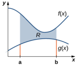

Figure 2.68 A region between two functions.

Again, we partition the interval $[a,b]$ and construct rectangles.A representative rectangle is shown in the following figure.

Fiqure 2.69 A representative rectangle of the region between two functions

Note that the centroid of this rectangle is $\left(x_{i}^{*},\left(f(x_{i}^{*})+g(x_{i}^{*})\right)/2\right).$ We won't go through allthe details of the Riemann sum development, but let's look at some of the key steps. In the development of the formulas for the mass of the lamina and the moment with respect to the y-axis,the height of each rectangle is given by $f(x_{i}^{*})-g(x_{i}^{*})$ , which leads to the expression $f(x)-g(x)$ in the integrands.

In the development of the formula for the moment with respect to the x-axis, the moment of each rectangle is found by multiplying the area of the rectangle, $\rho\left[f(x_{i}^{*})-g(x_{i}^{*})\right]\Delta x$ ,by the distance of the centroid from the x-axis $\left(f(x_{i}^{*})+g(x_{i}^{*})\right)/2$ , which gives $\rho\left(1/2\right)\left\{\left[f(x_{i}^{*})\right]^{2}-\left[g(x_{i}^{*})\right]^{2}\right\}\Delta x.$ Summarizing these findings, we arrive at the following theorem

### Theorem 2.13

### Center of Mass of a Lamina Bounded by Two Functions

Let R denote a region bounded above by the graph of a continuous function $f(x)$ ，below by the graph of the continuous function $g(x)$ , and on the left and right by the lines $x=a$ and $x=E$ , respectively. Let $\rho$ denote the density of the associated lamina.Then we can make the following statements

i.The mass of the lamina is

$$m=\rho\int_a^b[f(x)-g(x)]\:dx.$$

ii.The moments $M_{x}$ and $M_{y}$ of thelamina withrespect to the $X=$ and y-axes, respectively, are
$$M_{x}=\rho\int_{a}^{b}\frac{1}{2}\Big([f(x)]^{2}-[g(x)]^{2}\Big)\:dx\mathrm{~and~}M_{y}=\rho\int_{a}^{b}x\left[f(x)-g(x)\right]dx.$$

ili.The coordinates of the center of mass $(x,y)$ are

$$\overline{x}=\frac{M_{y}}{m}\:\mathrm{and}\:\overline{y}=\frac{M_{x}}{m}.$$

We illustrate this theorem in the following example

### EXAMPLE 2.32

### Finding the Centroid of a Region Bounded by Two Functions Let R be the region bounded above by the graph of the function $f(x)=1-x^{2}$ and below by the graph of the function

$g(x)=x-1.$ Find thecentroid of theregion

## $②$ Solution

The reqion is depicted in the following fiqure

Figure 2.70 Finding the centroid of a region between two curves

The graphs of the functions intersect at (-2,-3) and (1,0) , So we integrate from -2 to 1. Once again, for the sake of convenience, assume $\rho=1$

First,weneed to calculate the total mass:

$$\begin{aligned}
\text{m}& =\rho\int_{a}^{b}\left[f(x)-g(x)\right]dx \\
&=\int_{-2}^{1}\left[1-x^{2}-(x-1)\right]dx=\int_{-2}^{1}(2-x^{2}-x)dx \\
&=\left[2x-\frac{1}{3}x^{3}-\frac{1}{2}x^{2}\right]\Big|_{-2}^{1}=\left[2-\frac{1}{3}-\frac{1}{2}\right]-\left[-4+\frac{8}{3}-2\right]=\frac{9}{2}.
\end{aligned}$$

Next, we compute the moments.

$$\begin{aligned}
M_{x}& =\rho\int_{a}^{b}\frac{1}{2}\Big([f(x)]^{2}-[g(x)]^{2}\Big)\:dx \\
&=\frac{1}{2}\int_{-2}^{1}\left(\left(1-x^{2}\right)^{2}-(x-1)^{2}\right)dx=\frac{1}{2}\int_{-2}^{1}\left(x^{4}-3x^{2}+2x\right)dx \\
&=\frac{1}{2}\biggl[\frac{x^{5}}{5}-x^{3}+x^{2}\biggr]\biggr|_{-2}^{1}=-\frac{27}{10}
\end{aligned}$$

and

$$\begin{aligned}
M_{y}&& =\rho\int_{a}^{b}x\left[f(x)-g(x)\right]dx \\
&&=\int_{-2}^{1}x\left[\left(1-x^{2}\right)-\left(x-1\right)\right]dx=\int_{-2}^{1}x\left[2-x^{2}-x\right]dx \\
=\int_{-2}^{1}\left(2x-x^{3}-x^{2}\right)dx \\
&&=\left.\left[x^{2}-\frac{x^{4}}{4}-\frac{x^{3}}{3}\right]\right|_{-2}^{1}=-\frac{9}{4}.
\end{aligned}$$

Therefore, we have

$$\overline{x}=\frac{M_{y}}{m}=-\frac{9}{4}\cdot\frac{2}{9}=-\frac{1}{2}\:\mathrm{and}\:\overline{y}=\frac{M_{x}}{m}=-\frac{27}{10}\cdot\frac{2}{9}=-\frac{3}{5}.$$

Thecentroid of theregion is (-(1/2) ,-(3/5))

2.32 Let R be the region bounded above by the graph of the function $f(x)=6-x^2$ and below by the graph of the function $g(x)=3-2x.$ Find the centroid of the region.

## The Symmetry Principle

We stated the symmetry principle earlier, when we were looking at the centroid of a rectangle. The symmetry principle can be a great help when finding centroids of regions that are symmetric. Consider the following example

# EXAMPLE 2.33

### Finding the Centroid of a Symmetric Region Let R be the region bounded above by the graph of the function $f(x)=4-x^{2}$ and below by the x-axis. Find the centroid

of the region.

## $②$ Solution

The region is depicted in the following figure.

Figure 2.71 We can use the symmetry principle to help find the centroid of a symmetric region

The region is symmetric with respect to the y-axis.Therefore, the x-coordinate of the centroid is zero. We need only calculate y. Once again, for the sake of convenience, assume $\rho=1$

First, we calculate the total mass:

$$\begin{aligned}
\text{m}& =\rho\int_{a}^{b}f(x)dx  \\
&=\int_{-2}^{2}\left(4-x^{2}\right)dx \\
&=\left[4x-\frac{x^{3}}{3}\right]\bigg|_{-2}^{2}=\frac{32}{3}.
\end{aligned}$$

Next, we calculate the moments. We only need $M_{x}$

$$\begin{aligned}
M_{x}& =\rho\int_{a}^{b}\frac{[f(x)]^{2}}{2}dx  \\
&=\frac{1}{2}\int_{-2}^{2}\left[4-x^{2}\right]^{2}dx=\frac{1}{2}\int_{-2}^{2}\left(16-8x^{2}+x^{4}\right)dx \\
&=\frac{1}{2}\biggl[\frac{x^{5}}{5}-\frac{8x^{3}}{3}+16x\biggr]\biggr|_{-2}^{2}=\frac{256}{15}.
\end{aligned}$$

Then we have

$$\bar{y}=\frac{M_{x}}{m}=\frac{256}{15}\cdot\frac{3}{32}=\frac{8}{5}.$$

The centroid of the region is (0,8/5)

### STUDENT PROJECT

## The Grand Canyon Skywalk

The Grand Canyon Skywalk opened to the public on March 28, 2007. This engineering marvel is a horseshoe-shaped observation platform suspended 4ooo ft above the Colorado River on the West Rim of the Grand Canyon. Its crystalclear glass floor allows stunning views of the canyon below (see the following figure).

Figure 2.72 The Grand Canyon Skywalk offers magnificent views of the canyon. (credit: 10da_ralta, Wikimedia

Commons)

The Skywalk is a cantilever design, meaning that the observation platform extends over the rim of the canyon, with no visible means of support below it. Despite the lack of visible support posts or struts, cantilever structures are engineered to be very stable and the Skywalk is no exception. The observation platform is attached firmly to support posts that extend 46 ft down into bedrock. The structure was built to withstand 100-mph winds and an 8.0-magnitude earthquake within 50mi , and is capable of supporting more than 70,o00,o00 Ib.

One factor affecting the stability of the Skywalk is the center of gravity of the structure. We are going to calculate the center of gravity of the Skywalk, and examine how the center of gravity changes when tourists walk out onto the observation platform.

The observation platform is U-shaped. The legs of the U are 10 ft wide and begin on land, under the visitors' center 48 ft from the edge of the canyon. The platform extends 70 ft over the edge of the canyon.

To calculate the center of mass of the structure, we treat it as a lamina and use a two-dimensional region in the xy-plane to represent the platform. We begin by dividing the region into three subregions so we can consider each subregion separately. The first region, denoted $R_{1}$ ,consists of the curved part of the U. Wemodel $R_1$ as a semicircular annulus, with inner radius 25 ft and outer radius 35 ft, centered at the origin (see the following figure).

Figure 2.73 We model the Skywalk with three sub-regions

The legs of the platform, extending 35 ft between $R_{\mathrm{l}}$ and the canyon wall, comprise the second sub-region, $R_{2}.$ Last, the ends of the legs, which extend 48 ft under the visitor center, comprise the third sub-region, $R_3$ .Assume the density of the lamina is constant and assume the total weight of the platform is 1,20o,ooo Ib (not including the weight of the visitor center; we will consider that later). Use $g=32$ ft/sec2

1.Compute the area of each of the three sub-regions. Note that the areas of regions $R_2$ and $R_3$ should include the areas of the legs only, not the open space between them. Round answers to the nearest square foot. 2.Determine the mass associated with each of the three sub-regions 3.Calculate the center of mass of each of the three sub-regions. 4.Now, treat each of the three sub-regions as a point mass located at the center of mass of the corresponding subregion. Using this representation, calculate the center of mass of the entire platform. 5.Assume the visitor center weighs 2,20o,oo0 Ib, with a center of mass corresponding to the center of mass of $R_3$ Treating the visitor center as a point mass, recalculate the center of mass of the system. How does the center of mass change? 6.Although the Skywalk was built to limit the number of people on the observation platform to 120, the platform is capable of supporting up to 800 people weighing 200 Ib each. If all 800 people were allowed on the platform, and all of them went to the farthest end of the platform,how would the center of gravity of the system be affected? (Include the visitor center in the calculations and represent the people by a point mass located at the farthest edge of the platform, 70 ft from the canyon wall.)

# Theorem of Pappus

Thissection ends with a discussion of the theorem ofPappus for volume,which allowsusto find thevolume of particular kinds of solids by using the centroid. (There is also a theorem of Pappus for surface area, but it is much less useful than the theorem for volume.

### Theorem 2.14

### Theorem of Pappus for Volume

Let Rbe a region in the plane and let/be a line in theplane that does not intersect R.Then the yolume of the solid of revolution formed by revolving R around /is equal to the area of $R$ multiplied by the distance d traveled by the centroid of R.

## Proof

We can prove the case when the region is bounded above by the graph of a function $f(x)$ and below by the graph of a. function $g(x)$ over an interval $[a,b]$ , and for which the axis of revolution is the y-axis. In this case, the area of the region 5 $A=\int_{a}^{b}\left[f(x)-g(x)\right]dx.$ depends only on the $x.$ coordinate of the centroid, $X$ which is

$$x=\frac{M_{y}}{m},$$

where

$$m=\rho\int_{a}^{b}\left[f(x)-g(x)\right]dx\:\mathrm{and}\:M_{y}=\rho\int_{a}^{b}x\left[f(x)-g(x)\right]dx.$$

Then,

$$d=2\pi\frac{\rho\int_a^bx\left[f(x)-g(x)\right]dx}{\rho\int_a^b\left[f(x)-g(x)\right]dx}$$

and thus

$$d\cdot A=2\pi\int_{a}^{b}x\left[f(x)-g(x)\right]dx.$$

However, using the method of cylindrical shells, we have

$$V=2\pi\int_{a}^{b}x\left[f(x)-g(x)\right]dx.$$

So,

$$V=d\cdot A$$

and the proof is complete.

口

## EXAMPLE 2.34E

### Using the Theorem of Pappus for Volume

Let R be a circle of radius 2 centered at (4,0) . Use the theorem of Pappus for volume to find the volume of the torus generated by revolving R around the y-axis.

### $②$ Solution

The region and torus are depicted in the following figure.

Figure 2.74 Determining the volume of a torus by using the theorem of Pappus. (a) A circular region Rin the plane; (b

 the torus generated by revolving R about the y-axis

ThereqionRis a circle of radius2,so thearea of $R$ is $A=4\pi$ units2. By the symmetry principle, the centroid of $R$ is the center of the circle. The centroid travels around the y-axis in a circular path of radius 4, so the centroid travels $d=8\pi$ units. Then, the volume of the torus is $A\cdot d=32\pi^{2}$ units3

2.34 Let R be a circle of radius 1 centered at (3,0) . Use the theorem of Pappus for volume to find the volume of the torus generated by revolving R around the y-axis.

### SECTION 2.6EXERCISES

For the following exercises, calculate the center of mass for the collection of masses given

254. $m_1=2$ at $x_{\mathrm{l}}=1$ and 255. $m_1=1$ at $x_1=-1$ and 256. $m=3$ at $x=0,1,2,6$ $m_{2}=4$ at $x_{2}=2$ $m_{2}=3$ at $x_{2}=2$ 257.Unit masses at 258. $m_1=1$ at (1,0) and 259. $m_{1}=1$ at (1,0) anc $(x,y)=(1,0),(0,1),(1,1)$ $m_2=4$ at (0,1) $m_{2}=3$ at (2,2)

For the following exercises, compute the center of mass x.

261. $\rho=x^{2}$ for $x\in(0,L)$ 260. $\rho=1$ for $x\in(-1,3)$ 262. $\rho=1$ for $x\in(0,1)$ and $\rho=2$ for $x\in(1,2)$ 263. $\rho=\sin x$ for $x\in(0,\pi)$ 264. $\rho=\cos x$ for $x\in(0,\frac{\pi}{2})$ 265. $\rho=e^x$ for $x\in(0,2)$ 266. $\rho=x^{3}+xe^{-x}$ for 268. $\rho=\sqrt{x}$ for $x\in(1,4)$ 267. $\rho=x\sin x$ for $x\in(0,\pi)$ $x\in(0,1)$ 269. $\rho=\ln x$ for $x\in(1,e)$

For the following exercises,compute the center of mass $(x,y)$ .Use symmetry to help locate the center of mass whenever possible

270. $\rho=7$ in the square 271. $\rho=3$ in the trianglewith 272. $\rho=2$ for theregion $0\leq x\leq1,0\leq y\leq1$ vertices (0,0) $(a,0)$ ,and bounded by $y=\cos(x)$ $(0,b)$ $y=-\cos(x),x=-\frac{\pi}{2}$ x=- $x=-\frac{\pi}{2}$ and $x=\frac{\pi}{2}$

For the following exercises.use a calculator to draw the region.then compute the center ofmass(x.y).Use symmetr to help locate the center of mass whenever possible

275.[T] The reqion between $y=\frac{5}{4}x^{2}$ and $y=5$

274.[T] The region between $y= 2x^{2}$, $y= 0$, $x= 0$, $y=0$ $y=0$ x = 0 $x=0$ and $x=1$

273.[T] The region bounded by $y= \cos ( 2x)$, $x= - \frac \pi 4$ $x=-\frac{\pi}{4}$ X=一and $x=\frac{\pi}{4}$

277. Tl The reqion boundec by $y= 0$, $\frac {x^{2}}4+ \frac {y^{2}}9= 1$

276.[T] Region between $y= \sqrt {x}$, $y= \ln ( x)$, $x= 1$, x = 1 $x=1$ and $x=4$

278. TlThe region bounded by y = 0 $y=0$ $y=0,x=0$ x = 0 $x=0$ , and
$$\frac{x^2}{4}+\frac{y^2}{9}=1$$

279.[TlThe region bounded by $y=x^{2}$ and $y=x^{4}$ in the first quadrant

For the following exercises. use the theorem of Pappus to determine the volume of the shape

280.Rotating $y=mx$ around the $x$ -axis between $x=0$ and $x=1$

281.Rotating $y=mx$ around the y-axis between $x=0$ and $x=1$

282.A general cone created by rotating a triangle with Vertices (0,0) $(a,0)$ ,and $(0,b)$ around the y-axis. Does your answer agree with the yolume of a cone?

284.A sphere created by rotating a semicircle with radius α around the y-axis. Does your answer agree with thevolume of a sphere？

283.A general cylinder created by rotating a rectangle with vertices (0,0) $(a,0),(0,b)$ , and $(a,b)$ around the y-axis.Does your answer agree with the volume of a cylinder?

For the following exercises, use a calculator to draw the region enclosed by the curve. Find the area M and the centroic. $(\overline{x},\overline{y})$ for the given shapes. Use symmetry to help locate the center of mass whenever possible.

287. [T] Lens: $y=x^{2}$ and $y=x$

286.[T] Triangle: $y=x$ $y=2-x$ and $y=0$

285.[T] Ouarter-circle $y=\sqrt{1-x^{2}},y=0$ ,and x=0

288.[T] Ring: $y^{2}+x^{2}=1$ and $y^{2}+x^{2}=4$

289. [T] Half-ring: $y^{2}+x^{2}=1$ $y^{2}+x^{2}=4$ and $y=0$

290. Find the generalized center ofmass in the sliver between $y=x^{a}$ and $y=x^b$ with $a>b$ Then, use the Pappus theorem to find the volume of the solid generated when revolving around the y-axis

293.Use the theorem of Pappus to find the volume of a torus(pictured here).Assume that a disk of radius ( is positioned with the left end of the circle at $x=b$ $b>0$ ,and isrotated around the y-axis

291. Find the generalized center of mass betweer $y=a^{2}-x^{2}$ $x=0$ ,and $y=0$ .Then, use the Pappus theorem to find the volume of the solid generated when revolving around the y-axis.

292. Find the generalized center of mass between $y=b$ sin(ax), $x=0$ ,and $x=\frac{\pi}{a}$ Then, use the Pappus theorem to find the volume of the solid generated when revolving around the y-axis.

294. Find the center of mass $(\overline{x},\overline{y})$ for a thin wire along the semicircle $y={\sqrt{1-x^{2}}}$ with unit mass. (Hint: Use the theorem of Pappus.)

# 2.7 Integrals, Exponential Functions, and Logarithms

### Learning Objectives

2.7.1 Write the definition of the natural logarithm as an integral. 2.7.2 Recognize the derivative of the natural logarithm 2.7.3 Integrate functions involving the natural logarithmic function 2.7.4 Define the number $e$ through an integral. 2.7.5 Recognize the derivative and integral of the exponential function 2.7.6 Prove properties of logarithms and exponential functions using integrals 2.7.7 Express general logarithmic and exponential functions in terms of natural logarithms and exponentials

We already examined exponential functions and logarithms in earlier chapters. However, we glossed over some key details in the previous discussions. For example, we did not study how to treat exponential functions with exponents that are irrational. The definition of the number e is another area where the previous development was somewhat incomplete. We now have the tools to deal with these concepts in a more mathematically rigorous way, and we do so in this section.

For purposes of this section, assume we have not yet defined the natural logarithm, the number e, or any of the integration and differentiation formulas associated with these functions.By the end of the section, we will have studied these concepts in a mathematically rigorous way (and we will see they are consistent with the concepts we learned earlier).

We begin the section by defining the natural logarithm in terms of an integral. This definition forms the foundation for the section. From this definition, we derive differentiation formulas, define the number e, and expand these concepts tc logarithms and exponential functions of any base.

## The Natural Logarithm as an Integral

Recall the power rule for integrals:.

$$\int x^ndx=\frac{x^{n+1}}{n+1}+C,\:n\neq-1.$$

Clearly, tisdoes not work when $n=-1$ a itwould force us to dideby ero. So, what do wedo with $\int\frac{1}{x}dx?$ Recal from th Ffundamentl Theorem of cacusthat $\int_{1}^{x}\frac{1}{t}dt$ isan antideriatve of $1/x$ Therefore we can make the following definition.

### Definition

For $x>0$ , define the natural logarithm function by

$$\ln x=\int_1^x\frac{1}{t}dt.$$

For $x>1$ ,this s just thearea under the curve $y=1/t$ from1to $x$ For $x<1$ we have dt = --dt,sointhis case it is the negative of the area under the curve from $x$ to 1 (see the following figure)

Figure 2.75 (a) When $x>1$ , the natural logarithm is the area under the curve $y=1/t$ from 1 to x. (b) When $x<1$, the

natural logarithm is the negative of the area under the curve from $x$ to 1

Notice that In 1=0 . Furthermore, the function $y=1/t>0$ for $x>0$ . Therefore, by the properties of integrals, it is clear that In $x$ is increasing for $x>0$

## Properties of the Natural Logarithm

Because of the way we defined the natural logarithm, the following differentiation formula falls out immediately as a result of to the Fundamental Theorem of Calculus.

### Theorem 2.15

### Derivative of the Natural Logarithm

For $x>0$ ,the derivative of the natural logarithm is givenby

$$\frac{d}{dx}\ln x=\frac{1}{x}.$$

### Theorem 2.16

Corollary to the Derivatiye of the Natural Logarithm

The function In x is differentiable:therefore.it is continuous

A graph of ln $x$ ishown in igure2.76. Notice that itis continuous throughout its domain of $\begin{pmatrix}0,\infty\end{pmatrix}$

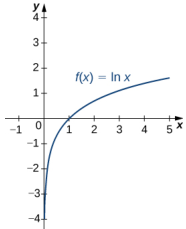

Figure 2.76 The graph of $f\left(x\right)=\ln x$ shows that it is a continuous function.

### EXAMPLE 2.35

### Calculating Derivatives of Natural Logarithms Calculate the following derivatives:

a. $\frac{d}{dx}\ln\left(5x^{3}-2\right)$ b. $\frac{d}{dx}(\ln(3x))^{2}$

### $①$ Solution

We need to apply the chain rule in both cases.

a. $\frac{d}{dx}\ln\left(5x^{3}-2\right)=\frac{15x^{2}}{5x^{3}-2}$ b. $\frac{d}{dx}(\ln{(3x)})^{2}=\frac{2(\ln(3x))\cdot3}{3x}=\frac{2(\ln(3x))}{x}$

$\boxed{\cdot}\boxed{\cdot}$ 2.35 Calculate the following derivatives:

a. $\frac{d}{dx}\ln\left(2x^2+x\right)$ b. $\frac{d}{dx}\left(\ln\left(x^3\right)\right)^2$

Note that if we use the absolute value function and create a new function In $|x|$ ,we can extend the domain of the natural logarithm to include $x<0$ Then $(d/(dx))$ ln $|x|=1/x.$ This gives rise to the familiar integration formula

### Theorem 2.17

### Integral of (1/u) du The natural logarithm is the antiderivative of the function $f\left(u\right)=1/u$

$$\int\frac1udu=\ln\:|u|+C.$$

### EXAMPLE 2.36

### Calculating Integrals Involving Natural Logarithms Calclate te negral $\int\frac{x}{x^{2}+4}dx$

### $②$ Solution

Using u-substitution, let $u=x^{2}+4.$ Then $du= 2x$ $dx$ and we have

$$\int\frac{x}{x^{2}+4}dx=\frac{1}{2}\int\frac{1}{u}du=\frac{1}{2}\ln\:|u|+C=\frac{1}{2}\ln\left|x^{2}+4\right|+C=\frac{1}{2}\ln\left(x^{2}+4\right)+C.$$

 .3 Calclte heinegral $\int\frac{x^2}{x^3+6}dx.$

Although we have called our function a *logarithm, we have not actually proved that any of the properties of logarithms hold for this function. We do so here.

### Theorem 2.18

### Properties of the Natural Logarithm

Ifa, $b>0$ and $r$ is a rational number, then

$$\begin{aligned}&\mathrm{i.}\quad\ln1=0\\&\mathrm{ii.}\quad\ln\left(ab\right)=\ln a+\ln b\\&\mathrm{ii.}\quad\ln\left({\frac{a}{b}}\right)=\ln a-\ln b\\&\mathrm{v.}\quad\ln\left(a^{r}\right)=r\ln a\end{aligned}$$

### Proof

1.Byderinton, i 1 $1= \int _{1}^{1}\frac 1tdt= 0.$

 ii. We have

$$\ln\left(ab\right)=\int_{1}^{ab}\frac{1}{t}dt=\int_{1}^{a}\frac{1}{t}dt+\int_{a}^{ab}\frac{1}{t}dt.$$

Use $ld$ -substitution on the last integral in this expression.Let $u=t/a.$ Then $du=\left(1/a\right)dt$ . Furthermore, when $t=a,u=1$ and when $t=ab,u=b$ So we get

$$\ln\left(ab\right)=\int_{1}^{a}\frac{1}{t}dt+\int_{a}^{ab}\frac{1}{t}dt=\int_{1}^{a}\frac{1}{t}dt+\int_{a}^{ab}\frac{a}{t}\cdot\frac{1}{a}dt=\int_{1}^{a}\frac{1}{t}dt+\int_{1}^{b}\frac{1}{u}du=\ln a+\ln b.$$

iv.Note that

$$\frac{d}{dx}\mathrm{ln}\left(x^r\right)=\frac{rx^{r-1}}{x^r}=\frac{r}{x}.$$

Furthermore,

$$\frac d{dx}(r\ln x)=\frac rx.$$

Since the derivatives of these two functions are the same, by the Fundamental Theorem of Calculus, they must differ by a constant. So we have

$$\ln\left(x^r\right)=r\ln x+C$$

for some constant $C.$ Taking $x=1$, we get

$$\begin{array}{rcl}\ln{(1^r)}&=&r\ln{(1)}+C\\0&=&r\left(0\right)+C\\C&=&0.\end{array}$$

Thus $\ln(x^r)=r\ln x$ and the proof is complete. Note that we can extend this property to irrational values of $r$ later in this section. Part ii. follows from parts ii. and iv. and the proof is left to you.

口

### EXAMPLE 2.37

### Using Properties of Logarithms

Use properties of logarithms to simplify the following expression into a single logarithm:

$$\ln9-2\ln3+\ln\left(\frac{1}{3}\right).$$

We have

$$\ln9-2\ln3+\ln\left(\frac{1}{3}\right)=\ln\left(3^2\right)-2\ln3+\ln\left(3^{-1}\right)=2\ln3-2\ln3-\ln3=-\ln3.$$

2.37 Use properties of logarithms to simplify the following expression into a single logarithm:

$$\ln8-\ln2-\ln\left(\frac{1}{4}\right).$$

## Defining the Number e

Now that we have the natural loaarithm defined. we can use that function to define the number e

### Definition

The number e is defined to be the real number such that

$$\ln e=1.$$

To put it another way, the area under the curve. $y=1/t$ between $t=1$ and $t=e$ is 1 (Fiqure 2.77). The proof that such a number exists and is unique is left to you.(Hint: Use the Intermediate Value Theorem to prove existence and the fact that In $x$ is increasing to prove uniqueness.)

Figure 2.77 The areaunder thecurve from 1 to $e$ is equal to one

The number e can be shown to be irrational, although we wont do so here (see the Student Project in Taylor and Maclaurin Series). Its approximate value is given by

e  2.71828182846.

## The Exponential Function

We now turn our attention to the function $e^{\mathrm{Y}}$ .Note that the natural logarithm is one-to-one and therefore has an inverse function. For now, we denote this inverse function by exp $x$ Then,

$$\exp\left(\ln x\right)=x\mathrm{~for~}x>0\mathrm{~and}\ln\left(\exp x\right)=x\mathrm{~for~all~}x.$$

The following figure shows the graphs of exp $x$ and $\ln x$

Figure 2.78 The graphs of ln x and exp x

We hypothesize that exp $x=e^x.$ For rational values of $x$ , this is easy to show. If $x$ is rational, then we have $\ln\left(e^{x}\right)=x$ In $e=x$ Thus, when $x$ is rational, $e^{x}=\exp x$ .For irrational values of $x$ , we simply define $e^x$ as the inverse function of In $x$

### Definition

For any real number $x$ ,define $y=e^{X}$ to be the number for which

$$\ln y=\ln\left(e^x\right)=x.$$

Then we have $e^{X}=\exp\left(x\right)$ for all X .and thus

$$e^{\ln x}=x\:\mathrm{for}\:x>0\:\mathrm{and}\ln\left(e^{x}\right)=x$$

for all $X$

### Properties of the Exponential Function

Since the exponential function was defined in terms of an inverse function, and not in terms of a power of e,we must verify that the usual laws of exponentshold for the function $e^{X}$

### Theorem 2.19

### Properties of the Exponential Function

If $P$ and $q$ are any real numbers and $r$ is a rational number, then

i. ee9 = e+q 1. $\frac{e^p}{e^q}=e^{p-q}$ il. (eP)r = epr

### Proof

Note that if $P$ and $q$ are rational, the properties hold. However, if $P$ or $q$ are irrational, we must apply the inverse function definition of $e^{X}$ and verify the properties. Only the first property is verified here; the other two are left to you. We have

$$\ln\left(e^pe^q\right)=\ln\left(e^p\right)+\ln\left(e^q\right)=p+q=\ln\left(e^{p+q}\right).$$

Since In $x$ is one-to-one, then

$$e^{p}e^{q}=e^{p+q}.$$

口

As with part iv.of the loqarithm properties,we can extend property ii.to irrational values of $I$ and we do so by the enc of the section.

We also want to verify the differentiation formula for the function $y=e^{x}.$ To do this, we need to use implicit differentiation. Let $y=e^{X}$ . Then

$$\begin{gathered}
\text{lny} \begin{array}{cc}=&x\end{array} \\
{\frac{d}{dx}}\ln y =\quad\frac{d}{dx}x \\
{\frac{1}{y}}{\frac{dy}{dx}} =1 \\
\frac{dy}{dx} \begin{array}{cc}{=}&{y.}\end{array} 
\end{gathered}$$

Thus, we see

$$\frac{d}{dx}e^x=e^x$$

as desired, which leads immediately to the integration formula

$$\int e^xdx=e^x+C.$$

We apply these formulas in the following examples

### EXAMPLE 2.38

### Using Properties of Exponential Functions

Evaluate the following derivatives:

a. $\frac{d}{dt}e^{3t}e^{t^2}$ b. $\frac{d}{dx}e^{3x^2}$

### $②$ Solution We apply the chain rule as necessary.

a. $\frac{d}{dt}e^{3t}e^{l^{2}}=\frac{d}{dt}e^{3t+t^{2}}=e^{3t+t^{2}}(3+2t)$ b. $\frac{d}{dx}e^{3x^{2}}=e^{3x^{2}}6x$

$\boxed{\sim}$ 2.38 Evaluate the following derivatives:

a $\frac{d}{dx}\left(\frac{e^{x^2}}{e^{5x}}\right)$ b. $\frac{d}{dt}\left(e^{2t}\right)^3$

# EXAMPLE 2.39

### Using Properties of Exponential Functions Evalate he llowin inegral: $\int2xe^{-x^2}dx$

### Solution

Using u-substitution, let $u=-x^{2}$ . Then $du= - 2x$ $dx$ ,and we have

$$\int2xe^{-x^{2}}\:dx=-\int e^{u}du=-e^{u}+C=-e^{-x^{2}}+C.$$

$\boxed{-1}$ 2.39Evaluae h flowin integral: $\int\frac{4}{e^{3x}}dx.$

## General Logarithmic and Exponential Functions

We close this section by looking at exponential functions and logarithms with bases other than e. Exponential functions are functions of the form $f(x)=a^{X}$ . Note that unless $a=e$ ,we still do not have a mathematically rigorous definition of these functions for irrational exponents. Let's rectify that here by defining the function $f(x)=a^{\mathrm{T}}$ interms of the exponential function. $e^{x}$ .We then examine logarithms with bases other than $\boldsymbol{e}$ as inverse functions of exponential functions.

### Definition

For any $a>0$ and for any real number x,define $y=a^{x}$ as follows:

$$y=a^x=e^{x\ln a}.$$

Now $a^{\mathrm{x}}$ is defined rigorously for all values of $X.$ This definition also allows us to generalize property iv. of logarithms and property ii. of exponential functions to apply to both rational and irrational values of $r$ It isstraightforward to show that properties of exponents hold for general exponentialfunctions defined in this way.

Let'snow apply this definition to calculate a differentiation formula for $a^{\mathrm{x}}.$ We have

$$\frac{d}{dx}a^{x}=\frac{d}{dx}e^{x\ln a}=e^{x\ln a}\ln a=a^{x}\ln a.$$

The corresponding integration formula follows immediately

### Theorem 2.20

### Derivatives and Integrals Involying General Exponential Functions

Let $a>0$ Then,

$$\frac{d}{dx}a^x=a^x\ln a$$

and

$$\int a^xdx=\frac{1}{\ln a}a^x+C.$$

If $a\neq1$ , then the function $a^{x}$ is one-to-one and has a well-defined inverse. Its inverse is denoted by $\log_ax$ .Then,

$y=\log_{a}x$ if and only if $x=a^{y}$

Note that general logarithm functions can be written in terms of the natural logarithm. Let $y=\log_{a}x.$ Then, $x=a^{y}$ Taking the natural logarithm of both sides of this second equation, we get

$$\begin{aligned}
\text{lnx}& =\:\ln(a^{y}) \\
\ln x& =\:y\ln a \\
\text{y}& =\quad\frac{\ln x}{\ln a} \\
\log_{a}x& =\quad\frac{\ln x}{\ln a}\:. 
\end{aligned}$$

Thus, we see that all logarithmic functions are constant multiples of one another. Next, we use this formula to find a differentiation formula for a logarithm with base α.Again, let $y=\log_{a}x$ Then,

$$\begin{aligned}
\frac{dy}{dx}& =\frac{d}{dx}\left(\log_{a}x\right) \\
&=\frac{d}{dx}\left(\frac{\ln x}{\ln a}\right) \\
&=\left(\frac{1}{\ln a}\right)\frac{d}{dx}(\ln x) \\
&=\frac1{\ln a}\cdot\frac1x \\
&=\frac{1}{x\ln a}.
\end{aligned}$$

### Theorem 2.21

Derivatives of General Logarithm Functions Let $a>0.$ Then,

$$\frac{d}{dx}\mathrm{log}_{a}x=\frac{1}{x\ln a}.$$

### EXAMPLE 2.40

### Calculating Derivatives of General Exponential and Logarithm Functions Evaluate the following derivatives:

a. $\frac{d}{dt}\left(4^{t}\cdot2^{t^{2}}\right)$ b. $\frac{d}{dx}\log_{8}\left(7x^{2}+4\right)$

### $②$ Solution We need to apply the chain rule as necessary.

a. $\frac{d}{dt}\left(4^{t}\cdot2^{t^{2}}\right)=\frac{d}{dt}\left(2^{2t}\cdot2^{t^{2}}\right)=\frac{d}{dt}\left(2^{2t+t^{2}}\right)=2^{2t+t^{2}}\ln\left(2\right)\left(2+2t\right)$ b. $\frac{d}{dx}\log_{8}\left(7x^{2}+4\right)=\frac{1}{\left(7x^{2}+4\right)\left(\ln8\right)}(14x)$

$\boxed{\sqrt{2}}$ 2.40 Evaluate the following derivatives

a. 44 b.log3(Vx2+1)

# EXAMPLE 2.41

### Integrating General Exponential Functions Evalat thefoowingintegralt $\int\frac{3}{2^{3x}}dx$

### $①$ Solution

Use $u$ -substitution and let $u=-3x$ . Then $du=-3dx$ and we have

$$\int\frac{3}{2^{3x}}dx=\int3\cdot2^{-3x}dx=-\int2^{u}du=-\frac{1}{\ln2}2^{u}+C=-\frac{1}{\ln2}2^{-3x}+C.$$

 2.41 Evalate th olowing intgral $\int x^22^{x^3}dx.$

### SECTION 2.7 EXERCISES

For the following exercises,find the derivative

295. $y=\ln\left(2x\right)$ 297.y=x 296.y=ln(2x+ 1)

For the following exercises,find the indefinite integra.

298. $\int\frac{dt}{3t}$

299. $\int\frac{dx}{1+x}$

For the following exercises,find the derivative dy/dx.(You can use a calculator to plot the function and the derivative to confirm that it is correct.)

300. $[\Pi]y=\frac{\ln(x)}{x}$

301.[T] y=x ln（x) 302.[] ] $y= \log _{10}x$

305. $[\mathbf{T}]y=7\ln(4x)$

303. [T$]y=\ln(\sin x)$

304. $\left[\text{T}\right]y=\ln\left(\ln x\right)$

308.[T]y =ln tan3x

307.[T] y =ln (tan x)

306. $[ \Pi ]$ $y= \ln \left ( ( 4x) ^{7}\right )$ 309.[T] $\mid y=\ln\left(\cos^{2}x\right)$

For the following exercises. find the definite or indefinite integra

312. $\int_0^2\frac{x\:dx}{x^2+1}$

311 $\int_0^1\frac{dt}{3+2t}$

310. $\int_0^1\frac{dx}{3+x}$

313. $\int_{0}^{2}\frac{x^3dx}{x^2+1}$

314. $\int_2^e\frac{dx}{x\ln x}$

315. $\int_2^e\frac{dx}{x\left(\ln x\right)^2}$

316 $\int\frac{\cos x\:dx}{\sin x}$

317. $\int _0^{\pi / 4}\tan x$ $dx$

318. $\int\cot\left(3x\right)dx$

319. $\int\frac{(\ln x)^2dx}x$

For the following exercises, compute dy/dx by differentiating In y

321. $y=\sqrt{x^{2}+1}\sqrt{x^{2}-1}$

320. $y=\sqrt{x^{2}+1}$

322. $y=e^{\sin x}$

324. $y=e^{(ex)}$

323. $y=x^{-1/x}$

325. $y=x^{e}$

326. $y=x^{(ex)}$

328. $y=x^{-1/\ln x}$

327. $y= \sqrt {x}$ $\sqrt [ 3] {x}$ $\sqrt [ 6] {x}$

329. $y=e^{-\ln x}$

For the following exercises, evaluate by any method.

330. $\int_5^{10}\frac{dt}t-\int_{5x}^{10x}\frac{dt}t$ 3. $\frac{d}{dx}\int_x^{x^2}\frac{dt}t$

331 $\int_1^{e^\pi}\frac{dx}{x}+\int_{-2}^{-1}\frac{dx}{x}$

3 $\frac{d}{dx}\int_x^1\frac{dt}{t}$

334. $\frac{d}{dx}\ln\left(\sec x+\tan x\right)$

For the following exercises,use the functionln x.Ifyou are unable to find intersection points analytically.use a calculator.

336.[T] Find the arc length of In $x$ from $x=1$ to $x=2$

337. Find the area between In $x$ and the x-axis from $x=1$ to $x=2$

335. Find the area of the region enclosed by $x=1$ and $y=5$ above $y=\ln x$

338.Find the volume of the shape create3B9.[T] Find the surface area when rotating this curye from $x=1$ to $x=2$ around the x-axis, as pictured here.

of the shape created when rotating the curve in the previous exercise from $x=1$ to $x=2$ around the x-axis.

If you are unable to find intersection points analytically in the following exercises, use a calculator

341.rm1 Find the arc length of $y=1/x$ from $x=1$ to $x=4$

342.Find the area under $y=1/x$ and above the x-axis from $x=1$ to $x=4$

340.Find the area of the hyperbolic quarter-circle enclosed by $x=2$ and $y=2$ above $y=1/x$

For the following exercises,verify the derivatives and antiderivatives

343
$$\frac{d}{dx}\ln\left(x+\sqrt{x^{2}+1}\right)=\frac{1}{\sqrt{1+x^{2}}}\quad344.\quad\frac{d}{dx}\ln\left(\frac{x-a}{x+a}\right)=\frac{2a}{\left(x^{2}-a^{2}\right)}\quad345.\quad\frac{d}{dx}\ln\left(\frac{1+\sqrt{1-x^{2}}}{x}\right)=-\frac{1}{x\sqrt{1-a^{2}}}$$

346
$$\frac{d}{dx}\ln\left(x+\sqrt{x^2-a^2}\right)=\frac{1}{\sqrt{x^2-a^2}}\quad347.\:\int\frac{dx}{x\ln\left(x\right)\ln\left(\ln x\right)}=\ln\left(\ln\left(\ln x\right)\right)+C$$

# 2.8 Exponential Growth and Decay

### Learning Objectives

2.8.1 Use the exponential growth model in applications, including population growth and compounc interest. 2.8.2 Explain the concept of doubling time 2.8.3 Use the exponential decay model in applications, including radioactive decay and Newton's law o. cooling 2.8.4Explain the concept of half-life

One of the most prevalent applications of exponential functions involves growth and decay models. Exponential growth and decay show up in a host of natural applications.From population growth and continuously compounded interest to radioactive decay and Newton's law of cooling, exponential functions are ubiquitous in nature. In this section, we examine exponential growth and decay in the context of some of these applications

## Exponential Growth Model

Many systems exhibit exponential growth. These systems follow a model of the form $y=y_{0}e^{kt}$ ,where $y_{0}$ represents the initial state of the system and $k$ is a positive constant, called the growth constant.Notice that in an exponential growth

model, we have

$$y'=ky_{0}e^{kt}=ky.$$

That is,the rate of qrowth is proportional to the current function value.This is akey feature of exponential qrowth Eguation 2.27 involves derivatives and is called a differentia/ eauation, We learn more about differential eguations in Introduction to Differential Equations.

### Rule: Exponential Growth Model

Systems that exhibit exponential growth increase according to the mathematical model

$$y=y_0e^{kt},$$

where $y_{0}$ represents the initial state of the system and $k>0$ is a constant, called the growth constant

Population growth js a common example of exponential arowth.Consider a population of bacteria.for instance. It seems plausible that the rate of population growth would be proportional to the size of the population. After all, the more bacteria there are to reproduce, the faster the population grows. Figure 2.79 and Table 2.1 represent the growth of a population of bacteria with an initial population of 200 bacteria and a growth constant of 0.02. Notice that after only 2 hours (120 minutes),the population is 10 times its oriqinal size

Figure 2.79 An example of exponential growth for bacteria

<table>
	<tbody>
		<tr>
			<th>Time $(min)$</th>
			<th>Population Size (no.of bacteria</th>
		</tr>
		<tr>
			<td>10</td>
			<td>244</td>
		</tr>
		<tr>
			<td>20</td>
			<td>298</td>
		</tr>
		<tr>
			<td>30</td>
			<td>364</td>
		</tr>
		<tr>
			<td>40</td>
			<td>445</td>
		</tr>
		<tr>
			<td>50</td>
			<td>544</td>
		</tr>
		<tr>
			<td>60</td>
			<td>664</td>
		</tr>
		<tr>
			<td>70</td>
			<td>811</td>
		</tr>
	</tbody>
</table>

Table 2.1 Exponential Growth of a Bacterial Population

<table>
	<tbody>
		<tr>
			<th>Time $(min)$</th>
			<th>Population Size (no.of bacteria)</th>
		</tr>
		<tr>
			<td>80</td>
			<td>991</td>
		</tr>
		<tr>
			<td>90</td>
			<td>1210</td>
		</tr>
		<tr>
			<td>100</td>
			<td>1478</td>
		</tr>
		<tr>
			<td>110</td>
			<td>1805</td>
		</tr>
		<tr>
			<td>120</td>
			<td>2205</td>
		</tr>
	</tbody>
</table>

Table 2.1 Exponential Growth of a Bacteria Population

Note that we are using a continuous function to model what is inherently discrete behavior. At any given time, the realworld population contains a whole number of bacteria, although the model takes on noninteger values.When using exponential growth models, we must always be careful to interpret the function values in the context of the phenomenon we are modeling.

# EXAMPLE 2.42

## Population Growthe Consider the population of bacteria described earlier This population grows according to the function $f(t)=200e^{0.02t}$

where tis measured in minutes. How many bacteria are present in the population after 5 hours (300 minutes)? When does the population reach 100,000 bacteria?

Wehave $f(t)=200e^{0.02t}$ Then

### Solution

$$f(300)=200e^{0.02(300)}\approx80,686.$$

There are 80,686 bacteria in the population after 5 hours.

To find when the population reaches 100.o00 bacteria, we solve the equatior

$$\begin{aligned}100,000&=\quad200e^{0.02t}\\500&=\quad e^{0.02t}\\\ln500&=\quad0.02t\\t&=\quad\frac{\ln500}{0.02}\approx310.73.\end{aligned}$$

The population reaches 100,000 bacteria after 310.73 minutes.

2.42 Consider a population of bacteria that grows according to the function $f(t)=500e^{0.05t}$ , where t is measured in minutes. How many bacteria are present in the population after 4 hours? When does the population reach 100 million bacteria?

Let's now turn our attention to a financial application: compound interest. Interest that is not compounded is called simple interest. Simple interest is paid once, at the end of the specified time period (usually 1 year). So, if we put $s1000$ in a savings account earning $2\%$ simple interest per year, then at the end of the year we have

$$1000\:(1+0.02)=\$1020.$$

Compound interest is paid multiple times per year, depending on the compounding period.Therefore,if the bank compounds the interest every 6 months, it credits half of the year's interest to the account after 6 months. During the second half of the year, the account earns interest not only on the initial $S1000$ ,but also on the interestearned during the first half of the year. Mathematically speaking, at the end of the year, we have

$$1000\biggl(1+\frac{0.02}{2}\biggr)^2=81020.10.$$

Similarly, if the interest is compounded every 4 months, we have

$$1000\biggl(1+\frac{0.02}{3}\biggr)^3=\$1020.13,$$

and if the interest is compounded daily (365 times per year),we have $\$1020.20$ If we extend this concept,so that the interest is compounded continuously, after t years we have

$$1000\lim\limits_{n\to\infty}\left(1+\frac{0.02}{n}\right)^{nt}.$$

Now let's manipulate this expression so that we have an exponential growth function. Recall that the number e can be expressed as a limit

$$e=\lim\limits_{m\to\infty}\left(1+\frac{1}{m}\right)^{m}.$$

Based on this, we want the expression inside the parentheses to have the form $(1+1/m)$ . Let $n=0.02m$ Note that as $n\to\infty,m\to\infty$ as well. Then we get

$$1000\lim\limits_{n\to\infty}\left(1+\frac{0.02}{n}\right)^{nt}=1000\lim\limits_{m\to\infty}\left(1+\frac{0.02}{0.02m}\right)^{0.02mt}=1000\left[\lim\limits_{m\to\infty}\left(1+\frac{1}{m}\right)^{m}\right]^{0.02t}.$$

We recognize the limit inside the brackets as the number e.So, the balance in our bank account after $l$ years is given by $1000e^{0.02r}$ .Generalizing this concept, we see that if a bank account with an initial balance of $\$P$ earns interest at arate of $r\%$ ,compounded continuously, then the balance of the account after f years is

$$\text{Balance}=Pe^{rt}.$$

# EXAMPLE 2.43

## Compound Interest

A 25-year-old student is offered an opportunity to invest some money in a retirement account that pays $5\%$ annual interest compounded continuously. How much does the student need to invest today to have $\$1$ million when she retires at age 65? what if she could earn $6\%$ annual interest compounded continuously instead?

## $②$ Solution

We have

$$\begin{array}{rcl}1,000,000&=&Pe^{0.05(40)}\\P&=&135,335.28.\end{array}$$

She must invest \$135,335.28 at $5\%$ interest

If, instead, she is able to earn $6\%$ , then the equation becomes.

$$\begin{array}{rcl}1,000,000&=&Pe^{0.06(40)}\\P&=&90,717.95.\end{array}$$

In this case, she needs to invest only S90,717.95. This is roughly two-thirds the amount she needs to invest at $5\%$ .The fact that the interest is compounded continuously greatly magnifies the effect of the $1\%$ increase in interest rate.

If a quantity grows exponentially, the time it takes for the quantity to double remains constant. In other words, it takes the same amount of time for a population of bacteria to grow from 100 to 200 bacteria as it does to grow from 10.000 to

20,0o0 bacteria. This time is called the doubling time. To calculate the doubling time, we want to know when the quantity reaches twice its oriqinal size. So we have

$$\begin{aligned}
2y_{0}& =\:y_{0}e^{kt} \\
\text{2}& =\:e^{kt} \\
\ln2& \text{= kt} \\
\text{t}& =\quad\frac{\ln2}{k}. 
\end{aligned}$$

### Definition

If a quantity grows exponentially, the doubling time is the amount of time it takes the quantity to double. It is given by

$$\text{Doubling time }=\frac{\ln2}{k}.$$

## EXAmpLE 2.44

### Using the Doubling Time

Assume a population of fish grows exponentially. A pond is stocked initially with 500 fish. After 6 months, there are 1000 fish in the pond. The owner will allow his friends and neighbors to fish on his pond after the fish population reaches 10,000. when will the owner's friends be allowed to fish?

## $②$ Solution

We know it takes the population of fish 6 months to double in size.So, if t represents time in months, by the doubling time formula, we have $6=(\ln2)/k$ Then, $k=(\ln2)/6$ .Thus, the population is given by $y= 500e^{( ( \ln 2) / 6) t}$ . To figureout when the population reaches 10,000 fish,we must solve the following equation:

$$\begin{aligned}10,000&=\quad500e^{(\ln2/6)t}\\20&=\quad e^{(\ln2/6)t}\\\ln20&=\quad\left(\frac{\ln2}{6}\right)t\\t&=\quad\frac{6(\ln20)}{\ln2}\approx25.93.\end{aligned}$$

The owner's friends have to wait 25.93 months (a little more than 2 years) to fish in the pond

2.44 Suppose it takes 9 months for the fish population in Example 2.44 to reach 1000 fish. Under these circumstances, how long do the owner's friends have to wait

# Exponential Decay Model

Exponential functions can also be used to model populations that shrink (from disease, for example), or chemical compounds that break down over time.We say that such systems exhibit exponential decay,rather than exponential growth. The model is nearly the same, except there is a negative sign in the exponent. Thus, for some positive constant $k$ , we have $y=y_{0}e^{-kt}$

As with exponential growth, there is a differential equation associated with exponential decay. We have

$$y'=-ky_{0}e^{-kt}=-ky.$$

##  Rule: Exponential Decay Model

Systems that exhibit exponential decay behave according to the model

$$y=y_0e^{-kt},$$

where $y_0$ represents the initial state of the system and $k>0$ is a constant,called the decay constant

The followinq fiqure shows a qraph of a representative exponential decay function

Figure 2.80 An example of exponential decay

Let's look at a physical application of exponential decay. Newton's law of cooling says that an object cools at a rate proportional to the difference between the temperature of the object and the temperature of the surroundings. In other words, if $T$ represents the temperature of the object and $T_{a}$ represents the ambient temperature in a room, then

$$T^{\prime}=-k\left(T-T_{a}\right).$$

Note that this is not auite the riaht model for exponential decay.We want the derivative to be proportional to the function, and this expression has the additional $T_{a}$ term.Fortunately,we canmake a change of variables that resolves this issue. Let $y(t)=T(t)-T_{a}$, Then $y^{\prime}(t)=T^{\prime}(t)-0=T^{\prime}(t)$, and our equation becomes

$$y'=-ky.$$

From our previous work, we know this relationship between y and its derivative leads to exponential decay. Thus

$$y=y_{0}e^{-kt},$$

and we see that

$$\begin{array}{rcl}T-T_a&=&(T_0-T_a)\:e^{-kt}\\T&=&(T_0-T_a)\:e^{-kt}+T_a\end{array}$$

where $T_0$ represents the initial temperature. Let's apply this formula in the following example

### EXAMPLE 2.45

### Newton's Law of Cooling

According to experienced baristas, the optimal temperature to serve coffee is between $155^{\circ}F$ and $175^{\circ}F.$ Suppose coffee is poured at a temperature of $200^\circ$F and after 2 minutes in a $70^\circ$F room it has cooled to $180^{\circ}$F .When is the coffee first cool enough to serve?When is the coffee too cold to serve?Round answers to the nearest half minute

## $②$ Solution

We have

$$\begin{aligned}
T:& =\:(T_{0}-T_{a})\:e^{-kt}+T_{a}  \\
\text{180}& =\:(200-70)e^{-k(2)}+70  \\
\text{110}& =\:130e^{-2k}  \\
\frac{11}{13}& e^{-2k}  \\
\ln{\frac{11}{13}}& -2k  \\
\ln11-\ln13& -2k  \\
\text{k}  & =\:\frac{\ln13-\ln11}{2}. 
\end{aligned}$$

Then, the model is

$$T=130e^{\left(\frac{\ln11-\ln13}{2}\right)t}+70.$$

The coffee reaches $175^{\circ}F$ when

$$\begin{aligned}175&=\quad130e^{\left(\frac{\ln11-\ln13}{2}\right)t}+70\\105&=\quad130e^{\left(\frac{\ln11-\ln13}{2}\right)t}\\\frac{21}{26}&=\quad e^{\left(\frac{\ln11-\ln13}{2}\right)t}\\\ln\frac{21}{26}&=\quad\frac{\ln11-\ln13}{2}t\\\ln21-\ln26&=\quad\frac{\ln11-\ln13}{2}t\\t&=\quad\frac{2(\ln21-\ln26)}{\ln11-\ln13}\approx2.56.\end{aligned}$$

The coffee can be served about 2.5 minutes after it is poured. The coffee reaches $155^{\circ}F$ at

$$\begin{aligned}155&=\quad130e^{\left(\frac{\ln11-\ln13}{2}\right)t}+70\\85&=\quad130e^{\left(\frac{\ln11-\ln13}{2}\right)t}\\\frac{17}{26}&=\quad e^{\left(\frac{\ln11-\ln13}{2}\right)t}\\\ln17-\ln26&=\quad\left(\frac{\ln11-\ln13}{2}\right)t\\t&=\quad\frac{2(\ln17-\ln26)}{\ln11-\ln13}\approx5.09.\end{aligned}$$

The coffee is too cold to be served about 5 minutes after it is poured.

2.45 Suppose the room is warmer $(75^\circ$F) and, after 2 minutes, the coffee has cooled only to $185^\circ$F. When isthe coffee first cool enough to serve? When is the coffee be too cold to serve? Round answers to the nearest half minute.

Just as systems exhibiting exponential growth have a constant doubling time, systems exhibiting exponential decay have a constant half-life. To calculate the half-life, we want to know when the quantity reaches half its original size. Therefore, we have

$$\begin{aligned}
&\frac{y_{0}}{2} =\:y_{0}e^{-kt} \\
&\frac{1}{2} =\:e^{-kt} \\
-\ln2& =-kt \\
&\text{t} =\quad\frac{\ln2}{k}. 
\end{aligned}$$

Note: This is the same expression we came up with for doubling time.

### Definition

If a quantity decays exponentially, the half-life is the amount of time it takes the quantity to be reduced by half. It is given by

$$\text{Half-life}=\frac{\ln2}{k}.$$

# EXAMPLE 2.46

###  Radiocarbon Dating

One of the most common applications of an exponential decay model is carbon dating. Carbon-14 decays (emits a

radioactive particle) at a reqular and consistent exponential rate. Therefore, if we know how much carbon was oriqinall present in an object and how much carbon remains, we can determine the age of the object.The half-life of carbon-14 is approximately 5730 years--meaning, after that many years, half the material has converted from the original carbon-14 to the new nonradioactive nitrogen-14. If we have $100g$ carbon-14 today, how much is left in 50 years? If an artifact that originally contained $100g$ of carbon now contains $10g$ of carbon, how old is it? Round the answer to the nearest hundred years.

### Solution

We have

$$\begin{array}{rcl}5730&=&\frac{\ln2}{k}\\k&=&\frac{\ln2}{5730}.\end{array}$$

So, the model says

$$y=100e^{-(\ln2/5730)t}.$$

In 50 years, we have

$$\begin{array}{rcl}y&=&100e^{-(\ln2/5730)(50)}\\&\approx&99.40.\end{array}$$

Therefore, in 50 years, 99.40 g of carbon-14 remains.

To determine the aae of the artifact we must solve

$$\begin{array}{rcl}10&=&100e^{-(\ln2/5730)t}\\\frac{1}{10}&=&e^{-(\ln2/5730)t}\\t&\approx&19035.\end{array}$$

The artifact is about 19.000 years old

2.46 If we have 100 g of carbon-14, how much is left after 500 years? If an artifact that originally contained 100 g of carbon now contains $20g$ of carbon, how old is it? Round the answer to the nearest hundred years

### SECTION 2.8 EXERCISES

True or False?If true, prove it.If false,find the true answer

348.The doubling time for $y=e^{ct}$ is (ln (2))/(ln (c)).

349.If you invest $\$500$ an annual rate of interest of $3\%$ yields more money in the first year than a $2.5\%$ continuous rate of interest.

350. If you leave a $100^{\circ}C$ pot of tea at room temperature $(25^{\circ}\mathbf{C})$ and an identical potin the refrigerator $(5^{\circ}\mathbf{C})$ ,with $k=0.02$ ,the tea in the refrigerator reaches a drinkable temperature $(70^{\circ}\mathbf{C})$ more than 5 minutes before the tea at room temperature.

351. If given a half-life of t

years, the constant $k$ for $y=e^{kt}$ is calculated by $k=\ln{(1/2)/t}$

355.If a relic contains $90\%$ as much radiocarbon as new material, can it have come from the time of Christ (approximately 2000 years ago)? Note that the half-life of radiocarbon is 5730 years.

358.Suppose the value of SI in Japanese yen decreases at $2\%$ per year. Starting from $\$1=¥250$ ,when will $\$1=¥1?$

For the following exercises, use y = yoekt

353. If bacteria increase by a factor of 10in l0 hours how many hours does it take to increase by 100?

352. If a culture of bacteria doubles in 3 hours, how many hours does it take to multiply by 10?

356. The population of Cairo grew from 5 million to 10 million in 20 years. Use an exponential model to find when the population was 8 million.

354. How old is a skull that contains one-fifth as much radiocarbon as a modern skull? Note that the half-life of radiocarbon is 5730 years.

357. The populations of New York and Los Angeles are growing at $1\%$ and $1.4\%$ a year, respectively. Starting from 8 million (New York) and 6 million (Los Angeles), when are the populations equal?

360.If $y=1000$ at $t=3$ and $y=3000$ at $t=4$ ,what was $y_{0}$ at $t=0?$

361.If $y=100$ at $t=4$ and $y=10$ at $t=8$ ,when does $y=1?$

359. The effect of advertising decays exponentially. If $40\%$ of the population remembers a new product after 3 days, how long will $20\%$ remember it?

362. If a bank offers annua interest of $7.5\%$ or continuous interest of $7.25\%$ ,which has a better annual yield?

365. You are trying to save \$50,000 in 20 years for college tuition for your child. If interest is a continuous $10\%$ ,how much do you need to invest initially?

363. What continuous interest rate has the same yield as an annual rate of $9\%^{\epsilon}$

364.If you deposit S5000 at $8\%$ annual interest, how many years can you withdraw $\$500$ (starting after the first year) without running out of money?

366. You are cooling a turkey that was taken out of the oven with an internal temperature of $165^{\circ}F$ After 10 minutes of resting the turkey in a $70^{\circ}$F apartment, the temperature has reached $155^\circ$F What is the temperature of the turkey 20 minutes after taking it out of the oven?

369. The spent fuel of a nuclear reactor contains plutonium-239, which has a half-life of 24,000 years If 1 barrel containing $10kg$ of plutonium-239 is sealed, how many years must pass until only $10g$ of plutonium-239 is left?

368.You are an archaeoloqist and are given a bone that is claimed to be from a Tyrannosaurus Rex. You know these dinosaurs lived during the Cretaceous Era (146 million years to 65 million years ago), and you find by radiocarbon dating that there is $0.000001\%$ the amount of radiocarbon. Is this bone from the Cretaceous?

367.You are trying to thaw some veqetables that are at a temperature of $1^{\circ}F$ To thaw vegetables safely you must put them in the refrigerator, which has an ambient temperature of $44^{\circ}$F You check on your vegetables 2 hours after putting them in the refrigerator to find that they are now $12^{\circ}F$ Plot the resulting temperature curve and use it to determine when the vegetables reach $33^{\circ}$F

For the next set of exercises, use the following table, which features the world population by decade

<table>
	<tbody>
		<tr>
			<th>Years since 1950</th>
			<th>Population (millions)</th>
		</tr>
		<tr>
			<td>0</td>
			<td>2,556</td>
		</tr>
		<tr>
			<td>10</td>
			<td>3,039</td>
		</tr>
		<tr>
			<td>20</td>
			<td>3,706</td>
		</tr>
		<tr>
			<td>30</td>
			<td>4.453</td>
		</tr>
		<tr>
			<td>40</td>
			<td>5,279</td>
		</tr>
		<tr>
			<td>50</td>
			<td>6,083</td>
		</tr>
		<tr>
			<td>60</td>
			<td>6,849</td>
		</tr>
	</tbody>
</table>

Source:http://www.factmonster.com/ipka A0762181.html

372.[T] Find and graph the second derivative of your equation. Where is it increasing and what is the meaning of this increase?

371.[T] Find and graph the derivative $y^{\prime}$ of your equation. Where is it increasing and what is the meaning of this increase?

370.[T] The best-fit exponential curve to the data of the form $P(t)=ae^{bt}$ is given by $P(t)=2686e^{\bar{0.01604}t}$ .Use a graphing calculator to graph the data and the exponential curve together.

373.[T] Find the predicted date when the populatior reaches 10 billion. Using your previous answers about the first and second derivatives, explain why exponential growth is unsuccessful ir predicting the future.

For the next set of exercises.use the following table.which shows the population of San Francisco during the 19tt century

<table>
	<tbody>
		<tr>
			<th>Years since 1850</th>
			<th>Population (thousands)</th>
		</tr>
		<tr>
			<td>0</td>
			<td>21.00</td>
		</tr>
		<tr>
			<td>10</td>
			<td>56.80</td>
		</tr>
		<tr>
			<td>20</td>
			<td>149.5</td>
		</tr>
		<tr>
			<td>30</td>
			<td>234.0</td>
		</tr>
	</tbody>
</table>

Source: http://www.sfgenealogy.com/sf/history hgpop.htm.

376. [T] Find and graph the second derivative of your equation. Where is it increasing? What is the meaning of this increase?

375. [T] Find and graph the derivative $y^{\prime}$ of your equation.Where is it increasing? What is the meaning of this increase? Is there a value where the increase is maximal?

374. [T] The best-fit exponential curve to the data of the form $P(t)=ae^{bt}$ is given by $P(t)=35.26e^{\bar{0}.06407t}$ Use a graphing calculator to graph the data and the exponential curve together.

# 2.9 Calculus of the Hyperbolic Functions.

### Learning Objectives

2.9.1 Apply the formulas for derivatives and integrals of the hyperbolic functions 2.9.2 Apply the formulas for the derivatives of the inverse hyperbolic functions and their associatec integrals. 2.9.3 Describe the common applied conditions of a catenary curve.

We were introduced to hyperbolic functions in Introduction to Functions and Graphs (http:/openstax.org/books/. calculus-volume-1/pages/1-5-exponential-and-logarithmic-functions), along with some of their basic properties. In this section, we look at differentiation and integration formulas for the hyperbolic functions and their inverses

## Derivatives and Integrals of the Hyperbolic Functions.

Recall that the hyperbolic sine and hyperbolic cosine are defined as

$$\sinh x=\frac{e^x-e^{-x}}{2}\:\mathrm{and}\cosh x=\frac{e^x+e^{-x}}{2}.$$

The other hyperbolic functions are then defined in terms of sinh $x$ and cosh $x$ . The graphs of the hyperbolic functions are shown in the following figure.

Figure 2.81 Graphs of the hyperbolic functions

It is easy to develop differentiation formulas for the hyperbolic functions.For example,looking at $\sinh x$ x $x$ we have

$$\begin{aligned}
\frac{d}{dx}(\sinh x)& =\frac{d}{dx}\biggl(\frac{e^{x}-e^{-x}}{2}\biggr) \\
&=\frac{1}{2}\Big[\frac{d}{dx}(e^{x})-\frac{d}{dx}\Big(e^{-x}\Big)\Big] \\
&=\frac{1}{2}\left[e^{x}+e^{-x}\right]=\cosh x.
\end{aligned}$$

Similarly, (d/dx) cosh $x=\sinh x$ .We summarize the differentiation formulas for the hyperbolic functions in the following table.

Table 2.2Derivatives of the Hyperbolic Functions

Table 2.2 Derivatives of the Hyperbolic Functions

Let's take a moment to compare the derivatives of the hyperbolic functions with the derivatives of the standarc trigonometric functions. There are a lot of similarities, but differences as well. For example, the derivatives of the sine functions match: (d/dx) sin $x=\cos x$ and (d/dx) sinh $x=\cosh x$ The derivatives of the cosine functions,however, differ in sign: (d/dx) cos $x=-\sin x$ ,but (d/dx) cosh $x=\sinh x$ . As we continue our examination of the hyperbolic functions we must be mindful of their similarities and differences to the standard trigonometric functions

These differentiation formulas for the hyperbolic functions lead directly to the following integral formulas
$$\int\sinh u\:du\:=\:\cosh u+C\int\cosh^{2}u\:du\:=\:-\coth u+C\\\int\cosh u\:du\:=\:\sinh u+C\int\mathrm{sech}u\tanh u\:du\:=\:-\mathrm{sech}u+C\\\int\mathrm{sech}^{2}u\:du\:=\:\tanh u+C\int\cosh u\coth u\:du\:=\:-\mathrm{csch}u+C$$

# EXAMPLE 2.47

### Differentiating Hyperbolic Functions

Evaluate the following derivatives:

a. $\frac{d}{dx}\left(\sinh\left(x^{2}\right)\right)$ b. $\frac{d}{dx}(\cosh x)^2$

## $②$ Solution

Using the formulas in Table 2.2 and the chain rule, we get

a. $\frac{d}{dx}\big(\sinh\big(x^{2}\big)\big)=\cosh\big(x^{2}\big)\cdot2x$ b. $\frac{d}{dx}(\cosh x)^{2}=2\cosh x\sinh x$

2.47 Evaluate the following derivatives a.(tanh (x² + 3x)) b. $\frac{d}{dx}\left(\frac{1}{(\sinh x)^2}\right)$

# EXAMPLE 2.48

### Integrals Involving Hyperbolic Functions

Evaluate the following integrals:

# $\int \tanh x$ $dx$ / $\int x\cosh\left(x^{2}\right)dx$ $\int \tanh x$ $dx$

### $②$ Solution

We can use u-substitution in both cases.

a.Let $u=x^{2}$ Then, $du=2x$ dx and
$$\int x\cosh\left(x^2\right)dx=\int\frac{1}{2}\cosh u\:du=\frac{1}{2}\sinh u+C=\frac{1}{2}\sinh\left(x^2\right)+C.$$

b.Let $u=\cosh x$ .Then, $du= \sinh x$ $dx$ and
$$\text{au}\\\int\tanh x\:dx=\int\frac{\sinh x}{\cosh x}dx=\int\frac{1}{u}du=\ln|u|+C=\ln|\cosh x|+C.$$

Note that cosh $x>0$ for all $x$ , so we can eliminate the absolute value signs and obtain
$$\int\tanh x\:dx=\ln\left(\cosh x\right)+C.$$

2.48 Evaluate the following integrals:.

asinh?x coshx dx b. / sech (3x dx

### Calculus of Inverse Hyperbolic Functions

Looking at the graphs of the hyperbolic functions, we see that with appropriate range restrictions, they all have inverses Most of the necessary range restrictions can be discerned by close examination of the graphs. The domains and ranges of the inverse hyperbolic functions are summarized in the following table.

<table>
	<tbody>
		<tr>
			<th>Function</th>
			<th>Domain</th>
			<th>Range</th>
		</tr>
		<tr>
			<td>sinh$^{-1}$ $X$</td>
			<td>$\left(-\infty,\infty\right.$ 7</td>
			<td>$-\infty,\infty$</td>
		</tr>
		<tr>
			<td>$cosh^{-1}$ $x$</td>
			<td>$\left[1,\infty\right)$</td>
			<td>$\begin{bmatrix}0,\infty\\0\end{bmatrix}$</td>
		</tr>
		<tr>
			<td>$tanh^{-1}$ $x$</td>
			<td>(-1,1)</td>
			<td>$-\infty,\infty$</td>
		</tr>
		<tr>
			<td>coth$^{-1}$ $x$</td>
			<td>$\left(-\infty,-1\right)\cup\left(1,\infty\right)$ 1</td>
			<td>$\left(-\infty,0\right)\cup\left(0,\infty\right)$</td>
		</tr>
		<tr>
			<td>$sech^{-1}$ $x$</td>
			<td>(0,1]</td>
			<td>$\left|0,\infty\right|$ </td>
		</tr>
		<tr>
			<td>$csch^{-1}$ $x$</td>
			<td> </td>
			<td> </td>
		</tr>
	</tbody>
</table>

Table 2.3 Domains and Ranges of the Inverse Hyperbolic Functions

The graphs of the inverse hyperbolic functions are shown in the following figure.

Figure 2.82 Graphs of the inverse hyperbolic functions.

To find the derivatives of the inverse functions, we use implicit differentiation.We have

$$\begin{aligned}
\text{y}& =\:\sinh^{-1}x \\
\sinh y& =x \\
{\frac{d}{dx}}\sinh y& =\quad\frac{d}{dx}x \\
\cosh y{\frac{dy}{dx}}& \begin{array}{cc}=&1.\end{array} 
\end{aligned}$$

Recall that $\cosh^{2}y-\sinh^{2}y=1$ ,SOcos ${\mathrm{ih~}y=\sqrt{1+\sinh^{2}y}}$ Then

$$\frac{dy}{dx}=\frac{1}{\cosh y}=\frac{1}{\sqrt{1+\sinh^{2}y}}=\frac{1}{\sqrt{1+x^{2}}}.$$

We can derive differentiation formulas for the other inverse hyperbolic functions in a similar fashion.These differentiation formulas are summarized in the following table

Table 2.4 Derivatives of the Inverse Hyperbolic Functions

<table>
	<tbody>
		<tr>
			<th>$f(x)$</th>
			<th>$\frac{d}{dx}f(x)$</th>
		</tr>
		<tr>
			<td>tanh$^{-1}$ $X$</td>
			<td>I $1-x^{2}$</td>
		</tr>
		<tr>
			<td>$coth^{-1}$ $X$</td>
			<td>I $1-x^{2}$</td>
		</tr>
		<tr>
			<td>$\mathrm{csch}^{-1}$ $X$</td>
			<td>-1 $|x|\sqrt{1+x^{\prime}}$</td>
		</tr>
		<tr>
			<td>-</td>
			<td>一 、</td>
		</tr>
		<tr>
			<td>LOUI</td>
			<td>$+x$</td>
		</tr>
	</tbody>
</table>

Table 2.4 Derivatives of the Inverse Hyperbolic Functions

Note that the derivatives of $\tanh^{-1}x$ and $coth^{-1}x$ are the same.Thus,when we integrate $1/\left(1-x^{2}\right)$, we need to select theproper antiderivative based on the domain of thefunctions and the valuesof X . Integration formulas involving the inverse hyperbolic functions are summarized as follows.

$$\begin{aligned}&\int{\frac{1}{\sqrt{1+u^{2}}}}du\:=\:\sinh^{-1}u+C&&\int{\frac{1}{u\sqrt{1-u^{2}}}}du\:=\:-\mathrm{sech}^{-1}\:|u|+C\\&\int{\frac{1}{\sqrt{u^{2}-1}}}du\:=\:\cosh^{-1}u+C&&\int{\frac{1}{u\sqrt{1+u^{2}}}}du\:=\:-\mathrm{csch}^{-1}\:|u|+C\\&\int{\frac{1}{1-u^{2}}}du\:=\:\left\{\begin{array}{ll}\tanh^{-1}u+C\:\mathrm{if}\:|u|<1\\\cosh^{-1}u+C\:\mathrm{if}\:|u|>1\end{array}\right.\end{aligned}$$

 EXAMPLE 2.49

Differentiating Inverse Hyperbolic Functions

Evaluate the following derivatives:

a. $\frac{d}{dx}\big(\sinh^{-1}\big(\frac{x}{3}\big)\big)$ b. $\frac{d}{dx}\left(\tanh^{-1}x\right)^{2}$

### $②$ Solution

Using the formulas in Table 2.4 and the chain rule, we obtain the following results
$$\begin{aligned}&.\quad\frac{d}{dx}\left(\sinh^{-1}\left(\frac{x}{3}\right)\right)=\frac{1}{3\sqrt{1+\frac{x^{2}}{9}}}=\frac{1}{\sqrt{9+x^{2}}}\\&.\quad\frac{d}{dx}\left(\tanh^{-1}x\right)^{2}=\frac{2\left(\tanh^{-1}x\right)}{1-x^{2}}\end{aligned}$$

b.

 2.49 Evaluate the fllowing derivatives

1. $\frac d{dx}\left ( \cosh ^{- 1}\left ( 3x\right ) \right )$ 1. $\frac d{dx}\left ( \coth ^{- 1}x\right ) ^{3}$

### EXAMPLE 2.50

Integrals Involving Inverse Hyperbolic Functions Evaluate the following integrals:

$②$ $\int\frac{1}{\sqrt{4x^{2}-1}}dx$ $\int\frac{1}{2x\sqrt{1-9x^{2}}}dx$

We can use $lt$ -substitution in both cases.

a.Let $u=2x$ Then, $du=2dx$ and we have
$$uu=2ux\:\mathrm{and~we~nave}\\\int\frac{1}{\sqrt{4x^{2}-1}}dx=\int\frac{1}{2\sqrt{u^{2}-1}}du=\frac{1}{2}\cosh^{-1}u+C=\frac{1}{2}\cosh^{-1}{(2x)}+C.$$

b.Let $u=3x.$ Then, $du=3dx$ and we obtain
$$\begin{array}{l}{{\mathrm{nen},\:au=3ax~and~we~obtan}}\\{{\int{\frac{1}{2x\sqrt{1-9x^{2}}}}dx={\frac{1}{2}}\int{\frac{1}{u\sqrt{1-u^{2}}}}du=-{\frac{1}{2}}\mathrm{sech}^{-1}\:|u|+C=-{\frac{1}{2}}\mathrm{sech}^{-1}\:|3x|+C.}}\end{array}$$

$\boxed{\sqrt{2}}$ 2.50 Evaluate the following integrals:.

a4dxx>2 b. $\int\frac1{\sqrt{1-e^{2x}}}dx$

### Applications

One physical application of hyperbolic functions involves hanging cables. If a cable of uniform density is suspended between two supports without any load other than its own weight,the cable forms a curve called a catenary. Highvoltage power lines, chains hanging between two posts, and strands of a spider's web all form catenaries. The following figure shows chains hanging from a row of posts.

Figure 2.83 Chains between these posts take the shape of a catenary.(credit: modification of work by

OKFoundryCompany, Flickr)

Hyperbolic functions can be used to model catenaries. Specifically, functions of the form y=α $y=a$ $y=a\cosh\left(x/a\right)$ are catenaries Eigure 2.84 shows the graph of $y=2$ $y=2$ $y=2\cosh(x/2)$

Figure 2.84 A hyperbolic cosine function forms the shape of a catenary

### EXAMPLE 2.51

### Using a Catenary to Find the Lenqth of a Cable

Assume a hanging cable has the shape 10 cosh (x/10) for $-15\leq x\leq15$ ,where $x$ is measured in feet. Determine the length of the cable(in feet).

Solution Recall from Section 2.4 that the formula for arc length i.

$$\text{Arc Length}=\int_{a}^{b}\sqrt{1+\left[f'(x)\right]^{2}}\:dx.$$

We have $f(x)=10\cosh\left(x/10\right)$ , SO $f^{\prime}(x)=\sinh\left(x/10\right).$ Then

$$\begin{aligned}
\mathrm{Arc~Length}& =\int_{a}^{b}\sqrt{1+\left[f^{\prime}(x)\right]^{2}}\:dx \\
&=\int_{-15}^{15}\sqrt{1+\sinh^{2}\left(\frac{x}{10}\right)}\:dx.
\end{aligned}$$

Now recall that $1+\sinh^2x=\cosh^2x$, So we haVe
$$\begin{aligned}
\mathrm{Arc~Length}& =\int_{-15}^{15}\sqrt{1+\sinh^{2}\left(\frac{x}{10}\right)}\:dx \\
&=\int_{-15}^{15}\cosh\left(\frac{x}{10}\right)dx \\
&=10\sinh\bigl(\frac{x}{10}\bigr)\bigr|_{-15}^{15}=10\left[\sinh\bigl(\frac{3}{2}\bigr)-\sinh\bigl(-\frac{3}{2}\bigr)\right]=20\sinh\bigl(\frac{3}{2}\bigr) \\
&\approx42.586\:\mathrm{ft.}
\end{aligned}$$

2.51 Assume a hanging cable has the shape 15 cosh (x/15) for $-20\leq x\leq20.$ Determine the length of the cable (in feet).

### SECTION 2.9 EXERCISES

379.Show that cosh $(x)$ and $\sinh\left(x\right)$ satisfy $y^{\prime\prime}=y.$

378.From the definitions of cosh $(x)$ and $\sinh\left(x\right)$ ,find their antiderivatives

377.[T] Find expressions for cosh $x+$ sinh $x$ and cosh $x-\sinh x$ . Use a calculator to graph these functions and ensure your expression is correct.

381. Derive $\cosh^{2}\left(x\right)+\sinh^{2}\left(x\right)=\cosh\left(2x\right)$ from the definition.

380.Use the quotient rule to verify that
$$\tanh\left(x\right)^{\prime}=\mathrm{sech}^{2}\left(x\right).$$

382.Take the derivative of the previous expression to find an expression for sinh$\left(2x\right)$

383.ProVe

sinh $(x+y)=\sinh\left(x\right)\cosh\left(y\right)+\cosh\left(x\right)\sinh\left(y\right)$ by changing the expression to exponentials.

384.Take the derivative of the previous expression to find an expression for $\cosh\left(x+y\right)$

For the following exercises, find the derivatives of the given functions and graph along with the function to ensure you. answer is correct
$$\begin{aligned}&385.[T]\cosh{(3x+1)}&&386.[T]\sinh{(x^{2})}&&387.[T]\frac{1}{\cosh(x)}\\&388.[T]\sinh{(\ln{(x)})}&&389.[T]\cosh^{2}{(x)}+\sinh^{2}{(x)}&&390.[T]\cosh^{2}{(x)}-\sinh^{2}{(x)}\\&391.[T]\tanh{\left(\sqrt{x^{2}+1}\right)}&&392.[T]\frac{1+\tanh(x)}{1-\tan(x)}&&393.[T]\sinh^{6}{(x)}\end{aligned}$$

394.[T] $\ln\left(\operatorname{sech}\left(x\right)+\operatorname{tanh}\left(x\right)\right)$

For the following exercises.find the antiderivatives for the given functions

395. $\cosh(2x+1)$

396.tanh3x+2

397.x cosh (x2）

400.tanhxsechx

398. $3x^{3}$tanh$\left(x^{4}\right)$

399.coshxsinhx

403. cosh $(x)+\sinh\left(x\right)$

402.cothx

401. $\frac{\sinh(x)}{1+\cosh(x)}$

404. $(\cosh(x)+\sinh(x))^{n}$

For the following exercises,find the derivatives for the functions

405.tanh14x

407. $\sinh^{-1}\left(\cosh\left(x\right)\right)$

406. $\sinh^{-1}\left(x^2\right)$

410. $e^{\sinh^{-1}(x)}$

409.tanh-cosx

408. $\cosh^{-1}\left(x^{3}\right)$

411. $\ln\left(\mathrm{tanh}^{-1}\left(x\right)\right)$

For the following exercises,find the antiderivatives for the functions.

413. $\int\frac{dx}{a^2-x^2}$

412. $\int\frac{dx}{4-x^2}$

414. $\int\frac{dx}{\sqrt{x^2+1}}$ 417. $\int\frac{e^x}{\sqrt{e^{2x}-1}}$

415. $\int\frac{x\:dx}{\sqrt{x^2+1}}$

416. $\int-\frac{dx}{x\sqrt{1-x^2}}$

418. $\int-\frac{2x}{x^4-1}$

For the following exercises.yse the fact that a falling body with friction.equal to velocity squared obevs the equatio $dv/dt=g-v^{2}$

419.Show that $\upsilon(t)=\sqrt{g}\tanh\left((\sqrt{g})t\right)$ satisfies this equation

420.Derive the previous expression for $v(t)$ by integrating $\frac{dv}{g-v^{2}}=dt$

421.rT1Estimate how far a body has fallen in 12 seconds by finding the area underneath the curve of $v(t)$

For the following exercises, use this scenario: A cable hanging under its own weight has a slope $S=dy/dx$ that satisfie $dS/dx=c\sqrt{1+S^{2}}.$ The constant c is the ratio of cable density to tension

422.Show that $S=\sinh(cx)$ satisfies this equation.

424. Sketch the cable and determine how far down it sags at $x=0$

423.Integrate $dy/dx=\sinh(cx)$ tofind the cableheight $y(x)$ if $y(0)=1/c$

For the following exercises,solve each problem

425. [T] A chain hangs from two posts $2m$ apart to form a catenary described bythe equation $y=2$ cosh $(x/2)-1$ Find the slope of the catenary at the left fence post.

426.[T]A chain hangs from two posts four meters apart to form a catenary described by the equation $y=4$ cosh $(x/4)-3$ . Find thetotal lenqth of the catenary (arc length)

427.[T] A high-voltage power line is a catenary described by $y=10\cosh\left(x/10\right).$ Find the ratio of the area under the catenary to its arc length. What do you notice?

430.Prove the formula for the derivative of $y=\cosh^{-1}(x)$ by differentiating x = cosh(y) (Hint: Use hyperbolic trigonometric identities.

429.Prove the formula for the derivative of $y=\sinh^{-1}(x)$ by differentiating $x=\sinh(y)$ .Hint:Use hyperbolic trigonometric identities.)

432.Prove that
$$(\cosh(x)+\sinh(x))^{n}=\cosh(nx)+\sinh(nx).$$

428.A telephone line is a catenary described by y =a $y=a$ $y=a\cosh\left(x/a\right).$ Find the ratio of the area under the catenary to its arc length. Does this confirm your answer for the previous question?

431.Prove the formula for the derivative of $y=\operatorname{sech}^{-1}(x)$ by differentiating $x=$ sech(y).(Hint:Use hyperbolic trigonometric identities.)

433. Prove the expression for $\sinh^{-1}(x)$ . Multiply $x=\sinh(y)=(1/2)\left(e^{y}+e^{-y}\right)$ by $2e^{y}$ and solve for y. Does your expression match the textbook?

434. Prove the expression for $\cosh^{-1}(x)$ Multiply $x=\cosh(y)=(1/2)\left(e^{y}-e^{-y}\right)$ by $2e^{y}$ and solve for $y.$ Does your expression match the textbook?

# Chapter Review

# Key Terms

arc lengththe arc length of a curve can be thought of as the distance a person would travel along the path of the curve catenarya curvein the shape of the function $y=a\cosh\left(x/a\right)$ is a catenary; a cable of uniform density suspended

between two supports assumes the shape of acatenary center of mass the point at which the total mass of the system could be concentrated without changing the moment

centroidthe centroid of a region is the geometric center of the region; laminas are often represented by regions in the plane; if the lamina has a constant density, the center of mass of the lamina depends only on the shape of the corresponding planar region; in this case, the center of mass of the lamina corresponds to the centroid of the representative region cross-sectionthe intersection of a plane and a solid object

density functiona density function describes how mass is distributed throughout an object; it can be a linear density expressed in terms of mass per unit length; an area density, expressed in terms of mass per unit area; or a volume density, expressed in terms of mass per unit volume; weight-density is also used to describe weight (rather than mass) per unit volume diskmethoda special case of the slicing method used with solids of revolution when the slices are disks

doubling timeif a quantity grows exponentially, the doubling time is the amount of time it takes the quantity to double, and is given by $(\ln2)/k$ exponential decay systems that exhibit exponential decay follow a model of the form. $y=y_{0}e^{-kt}$

exponential growth systems that exhibit exponential growth follow a model of the form $y=y_{0}e^{kf}$

frustuma portion of a cone; a frustum is constructed by cutting the cone with a plane parallel to the base

half-lifeif a quantity decays exponentially, the half-life is the amount of time it takes the quantity to be reduced by half

It is given by $(\ln2)/k$ Hooke's lawthis law states that the force required to compress (or elongate) a spring is proportional to the distance

the spring has been compressed (or stretched) from equilibrium; in other words, $F=kx$ ,where $k$ is a constant hydrostatic pressurethe pressure exerted by water on a submerged object

lamina a thin sheet of material; laminas are thin enough that, for mathematical purposes, they can be treated as if

they are two-dimensional

method of cylindrical shellsa method of calculating the volume of a solid of revolution by dividing the solid into nested cylindrical shells; this method is different from the methods of disks or washers in that we integrate with respect to the opposite variable

moment if n masses are arranged on a number line, the moment of the system with respect to the origin is given by M $[a,b]$ $M=\sum_{i=1}^{n}m_{i}x_{i}$ Hiesw $x-$ me $M_{x}=\rho\int_{a}^{b}\frac{[f(x)]^{2}}{2}dx$ $f(x)$ S
$$M_{y}=\rho\int_{a}^{b}xf(x)dx,\text{re}$$
slicing methoda method of calculating the volume of a solid that involves cutting the solid into pieces, estimating the

volume of each piece, then adding these estimates to arrive at an estimate of the total volume; as the number of slices goes to infinity, this estimate becomes an integral that gives the exact value of the volume solid of revolutiona solid generated by revolving aregion in a plane around a linein that plane

surface areathe surface area of a solid is the total area of the outer layer of the object;for objects such as cubes or

bricks, the surface area of the object is the sum of the areas of all of its faces symmetry principlethe symmetry principle states that if aregion $R$ is symmetric about a line $I_{\mu}$ then the centroid of R

lies on /

theorem of Pappus for volumethis theorem states that the volume of a solid of revolution formed by revolving region around an external axis is equal to the area of the region multiplied by the distance traveled by the centroid of the region

washer methoda special case of the slicing method used with solids of revolution when the slices are washers

work the amount of energy it takes to move an object; in physics, when a force is constant, work is expressed as the product of force and distance

###  Key Equations

Aenne  

Are ewe wocunes negatngathe ars -  io-ole

Disk Mthadaong he as  r ord

Disk Method along the y-axis
$$V=\int_{c}^{d}\pi[g(y)]^{2}dy$$

$$V=\int_a^b\pi\left[\left(f\left(x\right)\right)^2-\left(g\left(x\right)\right)^2\right]dx$$

Washer Method

Method of Cylindrical Shells
$$V=\int_a^b\left(2\pi xf(x)\right)dx$$

Arc Length of a unctionof Arc Length$= \int _a^b\sqrt {1+ \left [ f^{\prime }( x) \right ] ^2}$ $dx$

Ar length f aFunction o yy Arc Length$= \int _{c}^d\sqrt {1+ \left [ g^{\prime }( y) \right ] ^2}$ $dy$

Surace Area o a functio of x Sufacc Area$=\int_a^b\left(2\pi f(x)\sqrt{1+\left(f^{\prime}(x)\right)^2}\right)dx$

 Mass of a one-dimensional object
$$m=\int_a^b\rho(x)dx$$

$$m=\int_0^r2\pi x\rho(x)dx$$
Mass of a circular object

Work doneon an object

$$W=\int_a^bF(x)dx$$

 Hydrostatic force on a plate
$$F=\int_a^b\rho w(x)s(x)dx$$

Mass of a lamina

$$m=\rho\int_a^bf(x)dx$$

$$M_x=\rho\int_a^b\frac{[f(x)]^2}{2}dx\:\mathrm{and}\:M_y=\rho\int_a^bxf(x)dx$$

 Moments of a lamina

$$\overline{x}=\frac{M_{y}}{m}\:\mathrm{and}\:\overline{y}=\frac{M_{x}}{m}$$
Center of mass of a lamina

Naturalogrithm funtonIn = J* dt z

Exponential function y =ex In y = ln（e)=x Z

# Key Concepts

## 2.1 Areas between Curves.

·Just as definite integrals can be used to find the area under a curve, they can also be used to find the area betweer two curves ·To find the areabetween two curves defined by functions,integrate the differenceof the functions •If the graphs of the functions cross, or if the region is complex,use the absolute value of the difference of the functions. In this case, it may be necessary to evaluate two or more integrals and add the results to find the area of the region ·Sometimes it can be easier to integrate with respect to yto find the area. The principles are the same regardless of which variable is used as the variable of integration.

## 2.2 Determining Volumes by Slicing

Definite integrals can be used to find the volumes of solids. Using the slicing method, we can find a volume by integrating the cross-sectional area. ·For solids of revolution, the volume slices are often disks and the cross-sections are circles. The method of disks involves applying the method of slicing in the particular case in which the cross-sections are circles, and using the formula for the area of a circle. If a solid of revolution has a cavity in the center, the volume slices are washers. With the method of washers, the area of the inner circle is subtracted from the area of the outer circle before integrating

## 2.3 Volumes of Revolution: Cylindrical Shells

·The method of cylindrical shells is another method for using a definite integral to calculate the volume of a solid of revolution. This method is sometimes preferable to either the method of disks or the method of washers because we integrate with respect to the other variable. In some cases, one integral is substantially more complicated than the other. ·The geometry of the functions and the difficulty of the integration are the main factors in deciding which integratior

method to use.

## 2.4 Arc Length of a Curve and Surface Area

·The arc length of a curve can be calculated using a definite integral. ·The arc length is first approximated using line segments, which generates a Riemann sum. Taking a limit then gives us the definite integral formula. The same process can be applied to functions of y. ·The concepts used to calculate the arc length can be generalized to find the surface area of a surface of revolution ·The integrals generated by both the arc length and surface area formulas are often difficult to evaluate. It may be necessary to use a computer or calculator to approximate the values of the integrals

## 2.5 Physical Applications

Several physical applications of the definite integral are common in engineering and physics. •Definite integrals can be used to determine the mass of an object if its density function is known. ·Work can also be calculated from integrating a force function, or when counteracting the force of gravity, as in a pumping problem ·Definite integralscan alsobe used tocalculate the force exerted on an object submerged in a liquid

## 2.6 Moments and Centers of Mass

·Mathematically, the center of mass of a system is the point at which the total mass of the system could be concentrated without changing the moment. Loosely speaking, the center of mass can be thought of as the balancing point of the system. ·For point masses distributed along a number line, the moment of the system with respect to the origin is $M=\sum_{i=1}^{n}m_{i}x_{i}.$ For point mass distributedi a plae,the momentsof the system wth respet the $X.$ and

J-axes, repetivel are $M_{x}=\sum_{i=1}^{n}m_{i}y_{i}$ and $M_{y}=\sum_{i=1}^{n}m_{i}x_{i}$, respectively ·For a lamina bounded above by a function $f(x)$ ,the moments of the system with respect to the $x.$ and y-axes respetivel are $M_{x}=\rho\int_{a}^{b}\frac{[f(x)]^{2}}{2}dx$ and $M_{y}=\rho\int_{a}^{b}xf(x)dx$ ·The $x.$ and y-coordinates of the center of mass can be found by dividing the moments around the yaxis and arounc

the x-axis, respectively, by the total mass. The symmetry principle says that if a region is symmetric with respect to a line, then the centroid of the region lies on the line ·The theorem of Pappus for volume says that if a region is revolved around an external axis, the volume of the resulting solid is equal to the area of the region multiplied by the distance traveled by the centroid of the region

## 2.7 Integrals, Exponential Functions, and Logarithms

·The earlier treatment of logarithms and exponential functions did not define the functions precisely and formally This section develops the concepts in a mathematically rigorous way. ·The cornerstone of the development is the definition of the natural logarithm in terms of an integral ·The function $e^{x}$ is then defined as the inverse of the natural logarithm. ·General exponential functions are defined in terms of $e^{X}$ ,and the corresponding inverse functions are general logarithms. ·Familiar properties of logarithms and exponents stilhold in this more rigorous context.

## 2.8 Exponential Growth and Decay

·Exponential growth and exponential decay are two of the most common applications of exponential functions ·Systems that exhibit exponential growth follow a model of the form $y=y_{0}e^{kr}$ ·In exponential growth, the rate of growth is proportional to the quantity present. In other words, $y^{\prime}=ky$ ·Systems that exhibit exponential growth have a constant doubling time, which is given by $(\ln2)/k$ ·Systems that exhibit exponential decay follow a model of the form $y=y_{0}e^{-kf}$ ·Systems that exhibit exponential decay have a constant half-life, which is given by $(\ln2)/k$

## 2.9 Calculus of the Hyperbolic Functions

 Hyperbolic functions are defined in terms of exponential functions Term-by-term differentiation yields differentiation formulas for the hyperbolic functions. These differentiatior formulas give rise, in turn, to integration formulas. With appropriate range restrictions, the hyperbolic functions all have inverses Implicit differentiation yields differentiation formulas for the inverse hyperbolic functions, which in turn give rise tc integration formulas. : The most common physical applications of hyperbolic functions are calculations involving catenaries.

## Review Exercises

True or False?justify your answer with a proof or a counterexample

436.If the force is constant the amount of work to move an object from $x=a$ to $x=b$ is $F(b-a)$

437.The disk method can be used in any situation in which the washer method is successful at finding the volume of a solid of revolution

435.The amount of work to pump the water out of a half-full cylinder is half the amount of work to pump the water out of the full cylinder

438. If the half-life of seaborgium-266 is 360 ms, then $k=(\ln(2))/360$

For the following exercises,yse the requested method to determine the volume of the solid

441. $x=y^{2}$ and $x=3y$ rotated around the y-axis using the washer method

440. The region bounded by the curve $y$ = $x^{2}- x$ and the x-axis from $x=1$ to $x=4$ , rotated around the y-axis using the washer method

439. The volume that has a base of the ellipse $x^{2}/4+y^{2}/9=1$ and cross-sections of an equilateral triangle perpendicular to the $y$ axis.Use the method of slicing.

442. $x=2y^{2}-y^{3},x=0$ , and $y=0$ rotated around the x-axis using cylindrical shells

For the following exercises, find

a.the area of the region, b. the volume of the solid when rotated around the x-axis, and c.the volume of the solid when rotated around the y-axis.Use whichever method seems most appropriate to you

443. $y=x^{3},x=0,y=0$ and $x=2$

444. $y=x^{2}-x$ and $x=0$

445.[T]
$$y=\ln\left(x\right)+2\:\mathrm{and}\:y=x$$

446. $y=x^2$ and $y=\sqrt{x}$

448. Below $x^2+y^2=1$ and above $y=1-x$

$$47.\:y=5+x,\:y=x^{2},\:x=0,$$

449. Find the mass of $\rho=e^{-x}$ on a disk centered at the origin with radius 4.

450. Find the center of mass for $\rho=\tan^{2}x$ on $x\in\left(-\frac{\pi}{4},\frac{\pi}{4}\right)$

451. Find the mass and the center of mass of $\rho=1$ on the region bounded by $y=x^5$ and $y=\sqrt{x}$

For the following exercises, find the requested arc lengths.

452.The lenqth of $x$ for $y=\cosh\left(x\right)$ from $x=0$ to $x=2$

453. The length of $y$ for $x=3-\sqrt{y}$ from $y=0$ to y = 4

For the following exercises,find the surface area and volume when the given curves are revolved around the specified axis.

455. The loudspeaker created by revolving $y=1/x$ from $x=1$ to $x=4$ around the x-axis.

454.The shape created by revolving the region between $y=4+x$ $y=3-x$ $x=0$ ,and $x=2$ rotated around the y-axis.

456. For this exercise, consider the Karun-3 dam in Iran. Its shape can be approximated as an inverted isosceles triangle spanning across the river, with height. $205m$ and width (across the top of the dam) $388m$ Assume the current depth of the water is $180m$ .The density of water is 1000 $kg/m^3$ Find the total force on the wall of the dam.

457. You are a crime scene investigator attempting to determine the time of death of a victim. It is noon and $45^\circ F$ outside and the temperature of the body is $78^{\circ}$F. You know the cooling constant is $k=0.00824^{\circ}$F/min When did the victim die assuming that a human's temperature is $98^{\circ}F$ ?

For the following exercise,consider the stock market crash in 1929 in the United States.The table lists the DowJones industrial average per year leading up to the crash.

<table>
	<tbody>
		<tr>
			<th>Years after 1920</th>
			<th>Value(s)</th>
		</tr>
		<tr>
			<td>1</td>
			<td>63.90</td>
		</tr>
		<tr>
			<td>3</td>
			<td>100</td>
		</tr>
		<tr>
			<td>5</td>
			<td>110</td>
		</tr>
		<tr>
			<td>7</td>
			<td>160</td>
		</tr>
		<tr>
			<td>9</td>
			<td>381.17</td>
		</tr>
	</tbody>
</table>

Source: http://stockcharts.com/ freecharts/historical djia19201940.html

458. [T] The best-fit exponential curve to these data is given by $y=40.71+1.224^{x}.$ Why do you think the gains of the market were unsustainable? Use first and second derivatives to help justify your answer What would this model predict the Dow Jones industrial averaqe to be in 2014?

For the following exercises,consider the catenoid,the only solid ofrevolution that has a minimal surface,or zero mean curvature.A catenoid in nature can be found when stretching soap between two rings

459. Find the volume of the catenoid $y=\cosh\left(x\right)$ from $x=-1$ to $x=1$ that is created by rotating this curve around the $x$ -axis, as shown here.

460. Find surface area of the catenoid $y=\cosh\left(x\right)$ from $x=-1$ to $x=1$ that is created by rotating this curve around the $x$ -axis.

Figure 3.1 Careful planning of traffic signals can prevent or reduce the number of accidents at busy intersections. (credit:

modification of work by David McKelvey,Flickr)

## Chapter Outline

3.1 Integration by Parts 3.2 Trigonometric Integrals 3.3 Trigonometric Substitution 3.4 Partial Fractions 3.5 Other Strategies for Integration 3.6 Numerical Integration 3.7 Improper Integrals

### Introduction

In a large city, accidents occurred at an average rate of one every three months at a particularly busy intersection. After residents complained, changes were made to the traffic lights at the intersection. It has now been eight months since the changes were made and there have been no accidents. Were the changes effective or is the eight-month interval without an accident a result of chance? We explore this question later in this chapter and see that integration is an essential part of determining the answer (see Example 3.49)

We saw in the previous chapter how important integration can be for all kinds of different topics—from calculations of volumes to flow rates, and from using a velocity function to determine a position to locating centers of mass. It is no surprise, then, that techniques for finding antiderivatives (or indefinite integrals) are important to know for everyone who uses them. We have already discussed some basic integration formulas and the method of integration by substitution. In this chapter, we study some additional techniques, including some ways of approximating definite integrals when normal techniques do not work.

# 3.1 Integration by Parts

## Learning Objectives

3.1.1 Recognize when to use integration by parts. 3.1.2 Use the integration-by-parts formula to solve integration problems. 3.1.3 Use the integration-by-parts formula for definite integrals.

By now we have a fairly thorough procedure for how to evaluate many basic integrals. However, although we car integrate $\int x\sin(x^{2})dx$ by using the substitution, $u=x^{2}$ , omething as simple looking asxsinxdx defiesus.Man students want toknow whether there is a product rule forinteqration.There isn't,but there is a technique based on the product rule for differentiation that allows us to exchange oneintegral for another.We call this technique integration by parts.

### The Integration-by-Parts Formula

If $h(x)=f(x)g(x)$ , thenby using the product rule,we obtain $h^{\prime}(x)=f^{\prime}(x)g(x)+g^{\prime}(x)f(x)$ Although at firstit may see ountetie, e' intrte h si o this quation $\int h^{\prime}(x)dx=\int\left(g(x)f^{\prime}(x)+f(x)g^{\prime}(x)\right)dx.$ This gives us

$$h(x)=f(x)g(x)=\int g(x)f'(x)dx+\int f(x)g'(x)dx.$$

Nowwesle for $\int f(x)g^{\prime}(x)dx$

$$\int f(x)g'(x)dx=f(x)g(x)-\int g(x)f'(x)dx.$$

By making the substitutions $u=f(x)$ and $v=g(x)$ , which in turn make $du=f^{\prime}(x)dx$ and $dv=g^{\prime}(x)dx$, we have the more compact form

$$\int u\:dv=uv-\int v\:du.$$

### Theorem 3.1

### Integration by Parts

Let $u=f(x)$ and $\boldsymbol{U}=g(x)$ be functions with continuous derivatives. Then, the integration-by-parts formula for th integral involving these two functions is

$$\int u\:dv=uv-\int v\:du.$$

The advantage of using the integration-by-parts formula is that we can use it to exchange one integral for another possibly easier, integral. The following example illustrates its use

# EXAMPLE 3.1

### Using Integration by Parts

Use integration by parts with $u=x$ and $dv= \sin x$ $dx$ to evaluate xsinx dx

### $②$ Solution By choosing $u=x$ ,we have $du=1dx$ Since $dv= \sin x$ $dx$, weget $v= \int \sin x$ $dx= - \cos x.$ It is handy to keep track o

these values as follows:

$$\begin{array}{rcl}u&=&x&dv&=&\sin x\:dx\\du&=&1dx&v&=&\int\sin x\:dx=-\cos x.\end{array}$$

Applying the integration-by-parts formula results in

$$\begin{aligned}
\int x\sin x\:dx& =(x)(-\cos x)-\int(-\cos x)(1dx) && \text{Substitute.} \\
&=-x\cos x+\int\cos x\:dx&& \mathrm{Simplify.} \\
&=-x\cos x+\sin x+C.&& \mathrm{Use}\:\int\cos x\:dx=\sin x+C. 
\end{aligned}$$

### Analysis

At this point, there are probably a few items that need clarification. First of all, you may be curious about what would have happened if we had chosen $u=\sin x$ and $dv=x$ . If we had done so, then we would have $du=\cos x$ dxand

$v=\frac{1}{2}x^{2}.$ Thus ate appin ntegraton by pats wehave $\int$ $x\sin x$ $dx= \frac 12x^{2}\sin x- \int$ $\frac 12x^{2}\cos x$ $dx.$

Unfortunately, with the new integral, we are in no better position than before. It is important to keep in mind that wher we apply integration byparts,we may need to try several choicesfor $u$ and $dv$ before finding a choice that works.

Second, youmay wonderwhy when we find $v=\int$ $v=\int$ $v= \int$ $\sin x$ $dx= - \cos x$ we do notuse $v=-\cos x+K$ To sethatit makes no difference, we can rework the problem using $v=-\cos x+K$

$$\begin{aligned}
\int\:x\sin x\:dx& =(x)(-\cos x+K)-\int\:(-\cos x+K)(1dx) \\
&=-x\cos x+Kx+\int\:\cos x\:dx-\int\:Kdx \\
&=-x\cos x\:+Kx+\sin x-Kx+C \\
&=-x\cos x+\sin x+C.
\end{aligned}$$

As you can see, it makes no difference in the final solution

Last, we can check to make sure that our antiderivative is correct by differentiating $-x\cos x+\sin x+C$

$$\begin{gathered}
{\frac{d}{dx}}(-x\cos x+\sin x+C) =(-1)\cos x+(-x)(-\sin x)+\cos x \\
=x\sin x. 
\end{gathered}$$

Therefore, the antiderivative checks out

## MEDIA

Watch this video (http://www.openstax.org/l/20 intbyparts1) and visit this website (http://www.openstax.org/l. 20 intbyparts2) for examples of inteqration by parts

3.1 Evaluate xe2x dx using the integration-by-parts formula with u = x and du = e2x dx

The natural question to ask at this point is: How do we know how to choose u and $dv?$ Sometimes it is a matter of trial and error; however, the acronym LIATE can often help to take some of the guesswork out of our choices. This acronym stands for Logarithmic Functions, Inverse Trigonometric Functions, Algebraic Functions, Trigonometric Functions, and Exponential Functions.This mnemonicserves as an aid in determining an appropriate choice for u

The type of function in the integral that appears first in the list should be our first choice of u.For example, if an integral contains a logarithmic function and an algebraic function, we should choose $u$ to be the logarithmic function, because L comes before A in LIATE. The integral in Example 3.1 has a trigonometric function (sin x) and an algebraic function $(x)$ Because A comes before T in LIATE, we chose $u$ to be the algebraic function. When we have chosen u, $d_{U}$ is selected to be the remaining part of the function to be integrated, together with dx.

Why does this mnemonic work? Remember that whatever we pick to be $dv$ must be something we can integrate. Since we do not have integration formulas that allow us to integrate simple logarithmic functions and inverse trigonometric

functions, it makes sense that they should not be chosen as values for du. Consequently, they should be at the head of the list as choices for u. Thus, we put LI at the beginning of the mnemonic. (We could just as easily have started with IL, since these two types of functions won't appear together in an integration-by-parts problem.) The exponential and trigonometric functions are at the end of our list because they are fairly easy to integrate and make good choices for du Thus, we have TE at the end of our mnemonic. (We could just as easily have used ET at the end, since when these types of functions appear together it usually doesn't really matter which one is u and which one is du. ) Algebraic functions are generally easy both to integrate and to differentiate,and they come in the middle of the mnemonic

### EXAMPLE 3.2

### Using Integration by Parts Evaluate $\int\frac{\ln x}{x^{3}}dx$

Solution

Begin by rewriting the integral:

$$\int\frac{\ln x}{x^3}dx=\int\quad x^{-3}\ln x\:dx.$$

Since this integral contains the algebraic function $x^{-3}$ and the logarithmic function $\ln x$, choose $u=\ln x$ , since L comes before A in LIATE. After we have chosen $u=\ln x$ we must choose $dv=x^{-3}dx$

Next, since $u=\ln x$ , we have $du=\frac{1}{x}dx$ . Also, v = x- dx = -x-2.Summarizing

$$\begin{array}{rcl}u&=&\ln x&dv&=&x^{-3}dx\\\\du&=&\frac{1}{x}dx&v&=&\int&x^{-3}dx=-\frac{1}{2}x^{-2}.\end{array}$$

Substituting into the integration-by-parts formula (Equation 3.1) gives

$$\begin{aligned}
\int{\frac{\ln x}{x^{3}}}dx& =\int\quad x^{-3}\ln x\:dx=\left(\ln x\right)(-\frac{1}{2}x^{-2})-\int\quad\left(-\frac{1}{2}x^{-2}\right)(\frac{1}{x}dx) \\
&=-\frac{1}{2}x^{-2}\ln x+\int\quad\frac{1}{2}x^{-3}dx&& \mathrm{Simplify.} \\
&=-\frac{1}{2}x^{-2}\ln x-\frac{1}{4}x^{-2}+C&& \mathrm{Integrate}. \\
&=-\frac{1}{2x^{2}}\ln x-\frac{1}{4x^{2}}+C.&& \mathrm{Rewrite~with~positive~i} 
\end{aligned}$$

 3 2 Ealuae / xlnx dx.

In some cases, as in the next two examples,it may be necessary to apply inteqration by parts more than once

### EXAMPLE 3.3

### Applying Integration by Parts More Than Once

Evaluate $\int$ $x^2e^{3x}dx.$

## $②$ Solution

Using LIATE, choose $u=x^{2}$ and $dv=e^{3x}dx$ Thus, $du= 2x$ $dx$ and u=e3xdx =()e3x Therefore

$$\begin{array}{rcl}u&=&x^2&dv&=&e^{3x}dx\\du&=&2x\:dx&v&=&\int e^{3x}dx=\frac{1}{3}e^{3x}.\end{array}$$

Substituting into Equation 3.1 produces

$$\int x^2e^{3x}\:dx=\frac{1}{3}x^2e^{3x}-\int\frac{2}{3}xe^{3x}\:dx.$$

We stil cannot itegratexe3 dx directly,but the integral nowhas a lower power on $X$ .We can evaluate this new integral by using integration by parts again. To do this, choose $u=x$ and du =2e3x dx.Thus, $du=dx$ and $v=\int\left(\frac{2}{3}\right)e^{3x}dx=\left(\frac{2}{9}\right)e^{3x}.$ Nowe have

$$\begin{array}{rcl}u&=&x&dv&=&\frac{2}{3}e^{3x}dx\\\\du&=&dx&v&=&\int\frac{2}{3}e^{3x}dx=\frac{2}{9}e^{3x}.\end{array}$$

Substituting back into the previous equation yields

$$\int\quad x^2e^{3x}\:dx=\frac{1}{3}x^2e^{3x}-\left(\frac{2}{9}xe^{3x}-\int\quad\frac{2}{9}e^{3x}\:dx\right).$$

After evaluating the last integral and simplifying, we obtain

$$\int x^{2}e^{3x}dx=\frac{1}{3}x^{2}e^{3x}-\frac{2}{9}xe^{3x}+\frac{2}{27}e^{3x}+C.$$

## EXAMPLE 3.4

### Applying Integration by Parts When LIATE Doesn't Quite Work

Evaluate $\int$ $t^3e^{t^2}dt.$

### $①$ Solution

If we use a strict interpretation of the mnemonic LIATE to make our choice of $u$ , we end up with $u=t^3$ and $dv=e^{t^2}dt$ Unfortuntely, hi choice wont work because we ae nal t evalatee $\int$ $\int$ $\int$ $e^{t^2}dt.$ However sine e can evaluate te²dr, we can try choosing $u=t^{2}$ and $dv= te^{t^{2}}$ $dt.$ With these choices we have

$$\begin{array}{rcl}u&=&t^{2}&dv&=&te^{t^{2}}dt\\\\du&=&2t\:dt&v&=&\int&te^{t^{2}}dt=\frac{1}{2}e^{t^{2}}.\end{array}$$

Thus, we obtain

$$\begin{aligned}
\int\:t^{3}e^{t^{2}}\:dt& =\frac{1}{2}t^{2}e^{t^{2}}-\int\frac{1}{2}e^{t^{2}}2tdt  \\
&=\frac{1}{2}t^{2}e^{t^{2}}-\frac{1}{2}e^{t^{2}}+C.
\end{aligned}$$

## EXAMPLE 3.5

### Applying Integration by Parts More Than Once

Evaluate $\int$ $\sin ( \ln x) dx.$

### $②$ Solution

This integral appears to have only one function—namely, sin$(\ln x)$ —however, we can always use the constant function 1 as the other function.In this example,let's choose $u=\sin(\ln x)$ and $dv=|dx$ (The decision to use $u=\sin(\ln x)$ is easy We can't choose $dv=\sin(\ln x)dx$ because if we could integrate it, we wouldn't be using integration by parts in the first

place!) Consequently, $du=(1/x)$cos$(\ln x)dx$ and u = Idx = x. After applying integration by parts to the integral and simplifying, we have

$$\int\quad\sin(\ln x)dx=x\sin\left(\ln x\right)-\int\quad\cos\left(\ln x\right)dx.$$

Unfortunately, this process leaves us with a new integral that is very similar to the original. However, let's see what happens when we apply integration by parts again. This time let's choose $u=\cos(\ln x)$ and $dv=1dx$ ,making

$du=-(1/x)\sin(\ln x)dx$ and $v= \int$ $1dx= x.$ Substuting we have

$$\int\quad\sin(\ln x)dx=x\sin{(\ln x)}-\Bigg(x\cos(\ln x)-\int\quad-\sin(\ln x)dx\Bigg).$$

After simplifying, we obtain

$$\int\quad\sin(\ln x)dx=x\sin(\ln x)-x\cos(\ln x)-\int\quad\sin(\ln x)dx.$$

The last integral is now the same as the original. It may seem that we have simply gone in a circle, but now we car actual evaluateth integral Toseho t do this morecleary substute $I= \int$ $\sin ( \ln x) dx.$ Thus, te equatior becomes

$$I=x\sin(\ln x)-x\cos(\ln x)-I.$$

First, add $I$ to both sides of the equation to obtain

$$2I=x\sin(\ln x)-x\cos(\ln x).$$

Next, divide by 2:

$$I=\frac{1}{2}x\sin(\ln x)-\frac{1}{2}x\cos(\ln x).$$

Substituting $I=\int$ I= $I= \int$ $\sin ( \ln x) dx$ again, we hauve

$$\int\quad\sin(\ln x)dx=\frac{1}{2}x\sin(\ln x)-\frac{1}{2}x\cos(\ln x).$$

From this we see that $(1/2)x\sin(\ln x)-(1/2)x\cos(\ln x)$ is an antiderivative of $\sin(\ln x)dx$ For the most general antiderivative, add $+C$

$$\int\quad\sin(\ln x)dx=\frac12x\sin(\ln x)-\frac12x\cos(\ln x)+C.$$

### $⑨$ Analysis If this method feels a little strange at first, we can check the answer by differentiation

$$\begin{aligned}
&\frac{d}{dx}\Big(\frac{1}{2}x\sin(\ln x)-\frac{1}{2}x\cos(\ln x)\Big) \\
&=\frac{1}{2}(\sin(\ln x))+\cos(\ln x)\cdot\frac{1}{x}\cdot\frac{1}{2}x-\left(\frac{1}{2}\cos(\ln x)-\sin(\ln x)\cdot\frac{1}{x}\cdot\frac{1}{2}x\right) \\
&=\sin(\ln x).
\end{aligned}$$

 3.3 Ealuate x²sinx dx

### Integration by Parts for Definite Integrals

Now that we have used integration by parts successfully to evaluate indefinite integrals, we turn our attention to definite integrals. The integration technique is really the same, only we add a step to evaluate the integral at the upper and lower limits of integration.

### Theorem 3.2

### Integration by Parts for Definite Integrals

Let $u=f(x)$ and $U=g(x)$ be functions with continuous derivatives on $[a,b]$ . Then

$$\int_a^bu\:dv=uv|_a^b-\int_a^bv\:du.$$

### EXAMPLE 3.6

### Finding the Area of a Region

Find the area of the region bounded above by the graph of $y=\tan^{-1}x$ and below by the $x$ -axis over the interval [0,1]

Thi ngin on e e $\int _0^1\tan ^{- 1}x$ $dx.$

### Solution

Figure 3.2 To find the area of the shaded region, we have to use integration by parts

For this integral, let's choose $u=\tan^{-1}x$ and $dv=dx$ ,thereby making $du=\frac{1}{x^{2}+1}dx$ and $v=x$ .After applying the integration-by-parts formula (Equation 3.2) we obtain

$$\mathrm{Area}=x\tan^{-1}x|_0^1-\int\limits_0^1\frac{x}{x^2+1}dx.$$

Use u-substitution to obtain

$$\int\limits_{0}^{1}\frac{x}{x^{2}+1}dx=\frac{1}{2}\ln\Bigl|x^{2}+1\Bigr|_{0}^{1}.$$

Thus,

$$\mathrm{Area}=x\:\tan^{-1}x\bigg|_{0}^{1}-\frac{1}{2}\mathrm{ln}\bigg|x^{2}+1\bigg|_{0}^{1}=\frac{\pi}{4}-\frac{1}{2}\mathrm{ln}\:2.$$

At this point it might not be a bad idea to do a “reality check”on the reasonableness of our solution.Since $\frac{\pi}{4}-\frac{1}{2}\ln2\approx0.4388$ , and from Figure 3.2 we expect our area to be slightly less than 0.5, this solution appears to be reasonable.

### EXAMPLE 3.7

### Finding a Volume of Revolution

Find the volume of the solid obtained by revolving the region bounded by the graph of $f(x)=e^{-x}$ ,the x-axis,the y-axis and the line $x=1$ about the y-axis.

### $②$ Solution

The best option to solving this problem is to use the shell method. Begin by sketching the region to be revolved, along with a typical rectangle (see the following graph).

Fiqure 3.3 We can use the shell method to find a volume of revolution

To find thevolume using shlls we mus evaluate $2\pi\int_0^1xe^{-x}dx.$ To do this, let $u=x$ and $dv=e^{-x}$ . These choices eadl to $du=dx$ and $v= \int$ $e^{- x}= - e^{- x}.$ Substituting into Equation 3.2, we obtain

$$\begin{aligned}
\mathrm{Volume}& =2\pi\int_{0}^{1}xe^{-x}\:dx=2\pi(-xe^{-x}\Bigg|_{0}^{1}+\int_{0}^{1}e^{-x}\:dx) && \text{Use integration by parts.}  \\
&=-2\pi xe^{-x}|_{0}^{1}-2\pi e^{-x}|_{0}^{1}&& \mathrm{Evaluate}\left.\int_{0}^{1}e^{-x}dx=-e^{-x}\right|_{0}^{1}.  \\
&=2\pi-\frac{4\pi}{e}.&& \mathrm{Evaluate~and~simplify.} 
\end{aligned}$$

Analysis

Again, it is a good idea to check the reasonableness of our solution.We observe that the solid has a volume slightly less than that of a cylinder of radius 1 and height of 1/e added to the volume of a cone of base radius 1 and height of $1-\frac{1}{e}$ Consequently, the solid should have a volume a bit less than
$$\pi(1)^2\frac1e+\left(\frac\pi3\right)(1)^2\left(1-\frac1e\right)=\frac{2\pi}{3e}+\frac\pi3\approx1.8177.$$

Since $2\pi-\frac{4\pi}{e}\approx1.6603$ ,we see that our calculated volume is reasonable

 3 Ealate J xos dx.

### SECTION 3.1 EXERCISES

In using the technique of integrationby parts, you must carefully choose which expression is u.Foreach of the following problems, use the guidelines in this section to choose u.Do not evaluate the integrals

3. / cosydy

1. $\int x^3e^{2x}dx$

2 xin(d

4. $\int x^2\arctan x$ $dx$

5. asi(2dx

Find the integral by using the simplest method.Not all problems require integration by parts

7. $\int \ln x$ $dx$ $( Hint\int \ln x$ $dx$ is 8. $\int x\cos x$ $dx$

6. $\int v\sin vdv$

equivalent to $\int1\cdot\ln(x)dx.)$

9. $\int \tan ^{- 1}x$ $dx$

10. $\int x^2e^xdx$

11. $\int x\sin(2x)dx$

12. $\int xe^{4x}dx$

13. $\int xe^{-x}dx$

14. $\int x\cos 3x$ $dx$

17 $\int\ln(2x+1)dx$

15. $\int x^2\cos x$ $dx$

16. $\int x\ln x$ $dx$

18. $\int x^2e^{4x}dx$

19. $\int e^x\sin x$ $dx$

20. $\int e^x\cos x$ $dx$

21. $\int xe^{-x^2}dx$

22. $\int x^2e^{-x}dx$

23. $\int\sin(\ln(2x))dx$

24. $\int cos(\ln x)dx$

25. $\int(\ln x)^2dx$

26. $\int\ln(x^2)dx$

28. $\int \sin ^{- 1}x$ $dx$

27. $\int x^2\ln x$ $dx$

29. $\int\cos^{-1}(2x)dx$

30. $\int x\arctan x$ $dx$

31. $\int x^2\sin x$ $dx$

32. $\int x^3\cos x$ $dx$ 35. $\int x\sec ^{- 1}x$ $dx$

34. $\int x^3e^xdx$

33. $\int x^3\sin x$ $dx$ 36. $\int x\sec ^2x$ $dx$

37. $\int x\cosh x$ $dx$

Compute the definite integrals. Use a graphing utility to confirm your answers

Derive the following formulas using the technigue of integration by parts.Assume that n is a positive integer. These formulas are called reduction formulas because the exponentin thex termhas been reduced by one in each case.The second integral is simpler than the original integral

$$\int x^{n}e^{x}dx=x^{n}e^{x}-n\int x^{n-1}e^{x}dx\quad49.\:\int x^{n}\cos x\:dx=x^{n}\sin x-n\int x^{n-1}\sin x\:dx$$
51. Integrate $\int2x\sqrt{2x-3}dx$ 50. $\int x^{n}\sin x$ $dx= \underline {}$ using two methods a.Using parts, letting $dv= \sqrt {2x- 3}$ $dx$ b.Substitution, letting
$$u=2x-3$$

State whether you would use integration by parts to evaluate the integral. If so,identify u and dv.If not, describe the technique used to perform the integration without actually doing the problem

53. $\int\frac{\ln^2x}xdx$ 52. $\int x\ln x$ $dx$
$$\begin{aligned}&54.\:\int xe^{x}dx\\&57.\:\int x^{2}\sin(3x^{3}+2)dx\end{aligned}$$
55. $\int xe^{x^2-3}dx$ 56. $\int x^2\sin x$ $dx$

Sketch theregion bounded above by the curve,the x-axis,and $x=1.$ and find the area of theregion.Provide the exaci form or round answers to the number of places indicated

59. $y=e^{-x}\sin(\pi x)$ (Approximate answer to five decimal places.)

58. $y=2xe^{-x}$ (Approximate answer to four decimal places.)

Find the volume generated by rotating the region bounded by the given curves about the specified line. Express the answers in exact form or approximate to the number of decimal places indicated

60. y = sin x $y=\sin x$ $y=\sin x,y=0,x=2\pi,x=3\pi$ $x=3\pi$ x=3π about the y-axis (Express the answer in exact form.)

61. $y=e^{-x}$ $y=0,x=-1x=0$ about $x=1$ (Express the answer in exact form.)

62.A particle movinq alonq a straight line has a velocity of $v(t)=t^{2}e^{-t}$ after tsec. How far does it travel in the first 2 sec? (Assume the units are in feet and express the answer in exact form.)

64. Find the area between $y=(x-2)e^{x}$ and the x-axis from $x=2$ to $x=5$ (Express the answer in exact form.)

63.Find the area under the graph of $y=\sec^{3}x$ from $x=0$ to $x=1$ .(Round the answer to two significant digits.)

65.Find the area of theregion enclosed by the curve $y=x\cos x$ and the x-axis for $\frac{11\pi}{2}\leq x\leq\frac{13\pi}{2}.$ (Express the answer in exact form.)

66.Find the volume of the solid generated by revolving the region bounded by the curve $y=\ln x$ ,the x-axis, and the vertical line $x=e^2$ about the x-axis. (Express the answer in exact form.)

68.Find the volume of the solid generated by revolving the region in the first quadrant bounded by $y=e^{x}$ and the x-axis, from $x=0$ to $x=\ln(7)$ ,about the y-axis. (Express the answer in exact form.)

67.Find the volume of the solid generated by revolving the region bounded by the curve $y=4\cos x$ and the x-axis $\frac{\pi}{2}\leq x\leq\frac{3\pi}{2}$ ,about the x-axis.(Express the answer in exact form.)

# 3.2 Trigonometric Integrals

### Learning Objectives 3.2.1Solve integration problems involving products and powers of sinx and cos.x.

3.2.2 Solve integration problems involving products and powers of tanx and secx. 3.2.3 Use reduction formulas to solve trigonometric integrals.

In this section we look at how to integrate a variety of products of trigonometric functions. These integrals are called trigonometric integrals. They are an important part of the integration technique called trigonometric substitution, which is featured in Trigonometric Substitution. This technique allows us to convert algebraic expressions that we may not be able to integrate into expressions involving trigonometric functions, which we may be able to integrate using the techniques described in this section. In addition, these types of integrals appear frequently when we study polar, cylindrical, and spherical coordinate systems later. Let's begin our study with products of. $\sin x$ and cos x.

## Integrating Products and Powers of sinx and cosx.

A key idea behind the strategy used to integrate combinations of products and powers of $\sin x$ and cos $x$ involves rewriting these expresions sums an diferencesof integralsof the formn $\int \sin ^jx\cos x$ $dx$ or $\int \cos ^{j}x\sin x$ $dx.$ After rewriting these integrals, we evaluate them using u-substitution. Before describing the general process in detail, let's take a look at the following examples.

### EXAMPLE 3.8

 Integrating $\int \cos ^jx\sin x$ $dx$ EValuate $\int \cos ^{3}x\sin x$ $dx$

### Solution Use $u$ substitution and let $u=$ Ⅱ= $u=\cos x$ .In this case, $du=$ -sin x dx.Thus,

$$\begin{aligned}
\int\cos^{3}x\sin x\:dx& =-\int u^{3}\:du  \\
&=-\frac{1}{4}u^{4}+C \\
&=-\frac{1}{4}\mathrm{cos}^{4}x+C.
\end{aligned}$$

   Eealate/ sin cosx dxal

## EXAMPLE 3.9

A Prelmiary Eampe: negrating $\int \cos ^jx\sin ^kx$ $dx$ Where kis Od

Evalate $\int \cos ^2x\sin ^3x$ $dx.$

### $①$ Solution To overt ti intl nral f the for $\int \cos ^jx\sin x$ $dx$ rewrite $\sin^{3}x=\sin^{2}x\sin x$ and malke th sbstutor

$\sin^2x=1-\cos^2x.$ Thus,
$$\begin{aligned}
\int\cos^{2}x\sin^{3}x\:dx& \int\cos^{2}x{\left(1-\cos^{2}x\right)}\sin x\:dx\quad{\mathrm{Let}}\:u=\cos x;\:{\mathrm{then}}\:du=-\sin x\:dx. \\
&=-\int u^{2}\:\left(1-u^{2}\right)du \\
&=\int\left(u^{4}-u^{2}\right)du \\
&=\frac{1}{5}u^{5}-\frac{1}{3}u^{3}+C \\
&=\frac{1}{5}\mathrm{cos}^{5}x-\frac{1}{3}\mathrm{cos}^{3}x+C.
\end{aligned}$$

 3.6 Evaluate / cos"xsnxdx.

In the next example, we see the strategy that must be applied when there are only even powers of $\sin x$ and cos x. For integrals of this type, the identities

$$\sin^2x=\frac{1}{2}-\frac{1}{2}\cos(2x)=\frac{1-\cos{(2x)}}{2}$$

and

$$\cos^2x=\frac{1}{2}+\frac{1}{2}\cos(2x)=\frac{1+\cos{(2x)}}{2}$$

are invaluable.These identities are sometimes known as power-reducing identities and they may be derived from the double-angle identity $\cos{(2x)}=\cos^{2}x-\sin^{2}x$ and the Pythagorean identity $\cos^{2}x+\sin^{2}x=1$

### EXAMPLE 3.10

### Inteqrating an Even Power of sinx EValuate $\bar{\int } \sin ^{2}x$ $dx$

### To evaluate this integral, let's use the trigonometric identity $\sin^{2}x=\frac{1}{2}-\frac{1}{2}\cos(2x)$ Thus,

$$\begin{aligned}\int\sin^{2}x\:dx&=\int\left(\frac{1}{2}-\frac{1}{2}\mathrm{cos}(2x)\right)dx\\&=\frac{1}{2}x-\frac{1}{4}\sin{(2x)}+C.\end{aligned}$$

3.7 Evalae/ osxdx.

The general process for integrating products of powers of $\sin x$ and $\cos x$ is summarized in the following set of guidelines

### Problem-Solving Strategy

### Integrating Products and Powers of sin x and cos x

To integrate $\int \cos ^{j}x\sin ^{k}x$ $dx$ use th folowing trategies

1.If $k$ is odd, rewrite $\sin^{k}x=\sin^{k-1}x\sin x$ and use the identity $\sin^{2}x=1-\cos^{2}x$ to rewrite $\sin^{k-1}x$ in terms of cos x. Integrate using the substitution $u=\cos x$ This substitution makes $du= - \sin x$ $dx$ 2.If $j$ is odd, rewrite $\cos^{j}x=\cos^{j-1}x\cos x$ and use the identity $\cos^{2}x=1-\sin^{2}x$ to rewrite $cos^{j-1}x$ in terms of sinx. Integrate using the substitution $u=\sin x$ This substitution makes $du=$ cos x dx. (Note: If both $j$ and $k$ are odd, either strategy 1 or strategy 2 may be used.) 3.If both $j$ and $k$ are even, use $\sin^{2}x=(1/2)-(1/2)\cos(2x)$ and $\cos^{2}x=(1/2)+(1/2)\cos(2x)$ After applying these formulas, simplify and reapply strategies 1 through 3 as appropriate.

### EXAMPLE 3.11

Integrating $\int \cos ^{j}x\sin ^{k}x$ $dx$ where kis Od

Evaluate $\int \cos ^{8}x\sin ^{5}x$ $dx.$

### $②$ Solution

Since thepower on $\sin x$ is odd, use strategy 1. Thus
$$\begin{aligned}
\int\cos^{8}x\sin^{5}x\:dx& =\int\cos^{8}x\sin^{4}x\sin x\:dx \\
&=\int\cos^{8}x(\sin^{2}x)^{2}\sin x\:dx \\
&=\int\cos^{8}x(1-\cos^{2}x)^{2}\sin x\:dx \\
&=\int u^{8}(1-u^{2})^{2}(-du) \\
&=\int\left(-u^{8}+2u^{10}-u^{12}\right)du \\
&=-\frac{1}{9}u^{9}+\frac{2}{11}u^{11}-\frac{1}{13}u^{13}+C \\
&=-\frac{1}{9}\cos^{9}x+\frac{2}{11}\cos^{11}x-\frac{1}{13}\cos^{13}x+
\end{aligned}$$

Break off sinx. Rewrite sinx =(sin²x)² Substitute sin2x = 1 cos2 x Let u = cos x and du =-sin x dx. Expand. Evaluate the integral. Substitute u = cos x

### EXAMPLE 3.12

Integrating $\int \cos ^{j}x\sin ^{k}x$ $dx$ Wwhere and j ae Even

Evaluate $\int \sin ^{4}x$ $dx$

### $②$ Solution

Since the power on $\sin x$ is even ${^{\prime}}k=4$ and the power on cos x is even $(j=0$ ),we must use strategy 3. Thus,

$$\begin{aligned}
\int\sin^{4}x\:dx& =\int\left(\sin^{2}x\right)^{2}dx && \mathrm{Rewrite}\sin^{4}x=\left(\sin^{2}x\right)^{2}. \\
&=\int\left(\frac{1}{2}-\frac{1}{2}\mathrm{cos}(2x)\right)^{2}dx&& \mathrm{Substitute}\sin^{2}x=\frac{1}{2}-\frac{1}{2}\cos(2x). \\
&=\int\left(\frac{1}{4}-\frac{1}{2}\mathrm{cos}\left(2x\right)+\frac{1}{4}\mathrm{cos}^{2}(2x)\right)dx&& \operatorname{Expand}\left({\frac{1}{2}}-{\frac{1}{2}}\cos(2x)\right)^{2}. \\
&=\int\left(\frac{1}{4}-\frac{1}{2}\mathrm{cos}\left(2x\right)+\frac{1}{4}(\frac{1}{2}+\frac{1}{2}\mathrm{cos}(4x)\right)dx. \\
&\text{1}
\end{aligned}$$

Since $\cos^2(2x)$ has an even power, substitute $\cos^{2}(2x)=\frac{1}{2}+\frac{1}{2}\cos\left(4x\right)$

$$\begin{aligned}
&=\int\left(\frac{3}{8}-\frac{1}{2}\mathrm{cos}\left(2x\right)+\frac{1}{8}\mathrm{cos}(4x)\right)dx\quad\mathrm{Simplify}. \\
&=\frac{3}{8}x-\frac{1}{4}\sin{(2x)}+\frac{1}{32}\sin{(4x)}+C\quad\mathrm{Evaluate~the~integral.}
\end{aligned}$$

 3. ealate cosx dx.

. Ealuae / os(xdx.

In some areas of physics, such as quantum mechanics, signal processing, and the computation of Fourier series, it is often necessary to integrate products that include sin(ax), sin(bx), cos(ax), and $\cos(bx)$ . These integrals are evaluated by applying trigonometric identities, as outlined in the following rule.

Rule: Inteqrating Products of Sines and Cosines of Different Anqles

To integrate products involving $\sin(ax),\sin(bx),\cos(ax)$ , and cos(bx), use the substitutions

$$\sin\left(ax\right)\sin\left(bx\right)=\frac{1}{2}\cos(\left(a-b\right)x)-\frac{1}{2}\cos(\left(a+b\right)x)$$

$$\sin\left(ax\right)\cos\left(bx\right)=\frac{1}{2}\sin\left(\left(a-b\right)x\right)+\frac{1}{2}\sin(\left(a+b\right)x)$$

$$\cos\left(ax\right)\cos\left(bx\right)=\frac{1}{2}\cos(\left(a-b\right)x)+\frac{1}{2}\cos(\left(a+b\right)x)$$

These formulas may be derived from the sum-of-angle formulas for sine and cosine

### EXAMPLE 3.13

Evaluating $\int\sin(ax)\cos(bx)dx$

Evaluate $\int\sin(5x)\cos(3x)dx$

Apply the identity $\sin(5x)\cos(3x)=\frac{1}{2}\sin(2x)+\frac{1}{2}\sin(8x)$ Thus,

$$\begin{aligned}
\int\sin{(5x)}\cos(3x)dx& =\int{\frac{1}{2}}\sin(2x)\mathrm{d}x+\int{\frac{1}{2}}\sin(8x)\:\mathrm{d}x  \\
&=-\frac{1}{4}\mathrm{cos}\left(2x\right)-\frac{1}{16}\mathrm{cos}\left(8x\right)+C.
\end{aligned}$$

3.10Evaluate cos(6x)cos(5x)dx

### Integrating Products and Powers of tanx and secx

Before discussing the integration of products and powers of tanx and sec x,it is useful to recall the integrals involving tan x and sec $x$ we have already learned：

$$\begin{aligned}
&\int\sec^{2}x\:dx=\tan x+C \\
&\int\sec x\tan x\:dx=\sec x+C \\
&\int\tan x\:dx=\ln|\sec x|+C \\
&\int\sec x\:dx=\ln|\sec x+\tan x|+C.
\end{aligned}$$
3. 4.

Formostintegrals of products and powers of tan $x$ and sec $x$ ,we rewrite the expression we wish to integrate as the sum or dfferene otinteralso he oriro $\int \tan ^jx\sec ^2x$ $dx$ or $\int \sec ^jx\tan x$ $dx$ As we sein thefolowingexample wecan evaluate these new integrals by using u-substitution

EXAMPLE 3.14

Gia $\int \sec ^5x\tan x$ $dx$ 1$\int \sec ^{j}x\tan x$ $dx$ $\text{sec}^{5}x\tan x$ $dx.$ $\int \sec ^jx\tan x$ $dx$

### $②$ Solution Start by rewriting $\sec^5x\tan x$ as sec* x sec xtan x.

 sec x tan x dx = sec4 x sc xtanx dxLet u = secx; then, du = sec x tan x dx =Jardu Evaluate the integral. =u+C Substitute secx = u =secx+C

### MEDIA

You can read some interestinq information at this website (http://www.openstax.orq/l/20 intseccube) to learn abou a common integral involving the secant.

 3.1 Evaluate /tan?xse²x dx

We now take a look at the various strategies for integrating products and powers of sec .x and tan.x.

###  Problem-Solving Strategy

Integrating / tan* x secx dx

To integrate $\int \tan ^kx\sec ^jx$ $dx$ ,use the flwing strategies

1.If $j$ is even and $j\geq2$, rewrite $\sec^jx=\sec^{j-2}x\sec^2x$ and use $\sec^2x=\tan^2x+1$ to rewrite $\sec^{j-2}x$ in terms of

2.If $k$ is odd and $j\geq1$ , rewrite $\tan^kx\sec^jx=\tan^{k-1}x\sec^{j-1}x\sec x\tan x$ and use $\tan^2x=\sec^2x-1$ to rewrite $\tan^{k-1}x$ in terms of sec.x. Let $u=\sec x$ and $du= \sec x\tan x$ $dx.$ (Note: If $j$ is even and $k$ is odd,then either strategy 1 or strategy 2 may be used.)

tan x. Let $u=\tan x$ and $du= \sec ^{2}x$ $dx$ 3.If $k$ is odd where $k\geq3$ and $j=0$ ,rewrite $\tan^{k}x=\tan^{k-2}x\tan^{2}x=\tan^{k-2}x(\sec^{2}x-1)=\tan^{k-2}x\sec^{2}x-\tan^{k-2}x.$ It may be necessary to repeat this process on the $\tan^{k-2}x$ term. 4.If $k$ is even and $j$ is odd, then use $\tan^2x=\sec^2x-1$ to express $\tan^kx$ in terms of sec x. Use integration by parts to integrate odd powers of sec x.

## EXAMPLE 3.15

Integrating $\int \tan ^kx\sec ^jx$ $dx$ when jis Even

Evaluate $\int \tan ^{6}x\sec ^{4}x$ $dx.$

### $②$ Solution

Since the power on sec x is even,rewrite $\sec^4x=\sec^2x\sec^2x$ and use $\sec^2x=\tan^2x+1$ to rewrite the first $\sec^2x$ in terms of tanx. Thus,

$$\begin{aligned}
\int\tan^{6}x\sec^{4}x\:dx& =\int\tan^{6}x\left(\tan^{2}x+1\right)\sec^{2}x\:dx && \operatorname{Let}u=\tan x{\mathrm{~and~}}du=\sec^{2}x\:\mathrm{dx}. \\
&=\int u^{6}\left(u^{2}+1\right)du&& \mathrm{Expand.} \\
&=\int(u^{8}+u^{6})du&& \mathrm{Evaluate~the~integral.} \\
&=\frac{1}{9}u^{9}+\frac{1}{7}u^{7}+C&& \mathrm{Substitute}\tan x=u. \\
&=\frac{1}{9}\tan^{9}x+\frac{1}{7}\tan^{7}x+C.
\end{aligned}$$

## EXAMPLE 3.16

Integrating/tnkxsex dx when k is Od

Evaluate $\int \tan ^{5}x\sec ^{3}x$ $dx.$

### $②$ Solution Since the power on $\tan x$ $x$ x is odd,begin by rewriting $\tan^5x\sec^3x=\tan^4x\sec^2x\sec x\tan x.$ Thus

$$\begin{aligned}
\tan^{5}x\sec^{3}x& =\:\tan^{4}x\sec^{2}x\sec x\tan x. \\
\int\tan^{5}x\sec^{3}x\:dx& =\:\int\left(\tan^{2}x\right)^{2}\sec^{2}x\sec x\tan x\:dx \\
&=\:\int\left(\sec^{2}x-1\right)^{2}\sec^{2}x\sec x\tan x\:dx \\
&=\:\int\left(u^{2}-1\right)^{2}u^{2}du \\
&=\:\int\left(u^{6}-2u^{4}+u^{2}\right)du \\
&=\quad\frac17u^{7}-\frac25u^{5}+\frac13u^{3}+C \\
&=\:\frac{1}{7}\sec^{7}x-\frac{2}{5}\sec^{5}x+\frac{1}{3}\sec^{3}x+C.
\end{aligned}$$

$$\mathrm{Write}\tan^4x=\left(\tan^2x\right)^2.$$
Use tan²x = sec²x -1. Let u = sec x and du = sec xtan x dx Expand. Integrate. Substitute secx = u

## EXAMPLE 3.17

Integratingtan* x dx where $k$ is Odd and $k\geq3$ Evalate $\int \tan ^3x$ $dx$

### $②$ Solution

Begin by rewriting $\tan^{3}x=\tan x\tan^{2}x=\tan x\left(\sec^{2}x-1\right)=\tan x\sec^{2}x-\tan x.$ Thus,
$$\begin{aligned}
&\text{1} \\
&\int\tan^{3}x\:dx =\int\left(\tan x\sec^{2}x-\tan x\right)dx \\
&=\int\tan x\sec^{2}x\:dx-\int\tan x\:dx \\
&=\frac{1}{2}\tan^{2}x-\ln|\sec x|+C. \\
\end{aligned}$$

For the first integral, use the substitution u= $u=$ $u=\tan x$ .For the second integral, use the formula

### EXAMPLE 3.18

Integrating / sce*x dx

 Integrate $\int \sec ^3x$ $dx$

### $②$ Solution This integral requires integration by parts. To begin, let $u=\sec x$ and $dv=\sec^{2}x$ dx. These choices make $du=\sec x\tan x$

and $v=\tan x$ .Thus,
$$\begin{aligned}
\int\sec^{3}x\:dx& =\sec x\tan x-\int\tan x\sec x\tan x\:dx \\
&=\sec x\tan x-\int\tan^{2}x\sec x\:dx&& \mathrm{Simplify.} \\
&=\sec x\tan x-\int\left(\sec^{2}x-1\right)\sec x\:dx&& \mathrm{Substitute}\tan^{2}x=\sec^{2}x-1. \\
&=\sec x\tan x+\int\sec x\:dx-\int\sec^{3}x\:dx&& Rewrite. \\
&=\sec x\tan x+\ln|\sec x+\tan x|-\int\sec^{3}x\:dx.\quad\mathrm{Evaluate}\int\sec x\:dx.
\end{aligned}$$

We now have

$$\int\sec^3x\:dx=\sec x\tan x+\ln|\sec x+\tan x|-\int\sec^3x\:dx.$$

Since th integral $\int \sec ^3x$ $dx$ has reapeare n therighthand side we can sole for $\int \sec ^3x$ $dx$ byadingit both sides. In doing so, we obtain

$$2\int\sec^3x\:dx=\sec x\tan x+\ln\left|\sec x+\tan x\right|.$$

Dividing by 2, we arrive at

$$\int\sec^3x\:dx=\frac{1}{2}\sec x\tan x+\frac{1}{2}\ln|\sec x+\tan x|+C.$$

### Reduction Formulas

Evaluating $\int \sec ^nx$ $dx$ for values f n where $n$ isod reguiresintegration by parts In diton we mut also nowthe value of $\int \sec ^{n- 2}x$ $dx$ to evaluate $\int \sec ^nx$ $dx$ The ealaton of $\int \tan ^nx$ $dx$ alsoreguires eing abl t integrate $\int \tan ^{n- 2}x$ $dx$ To make the proces easie we an derv and aply te fllowing poweredution formulas hese rules allow us to replace the integral of a power of sec $x$ or tan $X$ with the integral of a lower power of sec x or tanx.

Rule eductin Formlas o? $\int \sec ^nx$ $dx$ and $\int \tan ^nx$ $dx$

$$\int\sec^nx\:dx=\frac{1}{n-1}\sec^{n-2}x\tan x+\frac{n-2}{n-1}\int\sec^{n-2}x\:dx$$

$$\int\tan^nx\:dx=\frac{1}{n-1}\tan^{n-1}x-\int\tan^{n-2}x\:dx$$

 The first power reduction rule may be verified by applying integration by parts. The second may be verified by following the strategy outlined for integrating odd powersof tan x.

### EXAMPLE 3.19

Revisiting $\int \sec ^3x$ $dx$ Appy reuto formul t evalate $\int \sec ^3x$ $dx$

### $②$ Solution

By applying the first reduction formula, we obtain

$$\begin{aligned}
\int\sec^{3}x\:dx& =\frac{1}{2}\sec x\tan x+\frac{1}{2}\int\sec x\:dx \\
&=\frac{1}{2}\sec x\tan x+\frac{1}{2}\ln|\sec x+\tan x|+C.
\end{aligned}$$

### EXAMPLE 3.20

### Using a Reduction Formula Evaluate $\int \tan ^4x$ $dx$

### $②$ Solution Applying the edutin formula for $\int \tan ^4x$ $dx$ we have

$$\begin{aligned}
\int\tan^{4}x\:dx& =\frac{1}{3}\tan^{3}x-\int\tan^{2}x\:dx  \\
&=\frac{1}{3}\tan^{3}x-(\tan x-\int\tan^{0}x\:dx)\quad\text{Apply the reduction formula to}\int\tan^{2}x\:dx. \\
&=\frac{1}{3}\tan^{3}x-\tan x+\int1\:dx \mathrm{Simplify.}  \\
&\text{1} \\
&=\frac{1}{3}\tan^{3}x-\tan x+x+C.\quad\mathrm{Evaluate}\int1dx.
\end{aligned}$$

3 pythereductonfor la to $\int \sec ^5x$ $dx.$

### SECTION 3.2EXERCISES

Fill in the blank to make a true statement

69. $\sin^2x+\underline{1}$ 70.sec²x-1 =

Use an identity to reduce the power of the trigonometric function to a trigonometric function raised to the first power

71. $\sin^2x=.$ 72. cos²x =_

Evaluate each of the following integrals by u-substitution.

74. $\int \sqrt {\cos x}\sin x$ $dx$ 75. tan (2x)sec(2x)d) 73. $\int \sin ^3x\cos x$ $dx$

76. $\int\sin^{7}(2x)\cos(2x)dx$ 77. $\int\tan\left(\frac{x}{2}\right)\sec^2\left(\frac{x}{2}\right)dx$ 78. / tan²xsec~xdx

Compute the following integrals using the guidelines for integrating powers of trigonometric functions. Use a CAS to check the solutions.(Note:Some of the problems may be done using techniques ofintegration learned previously.)

79. $\int \sin ^3x$ $dx$ 80. $\int \cos ^3x$ $dx$ 81. $\int \sin x\cos x$ $dx$ 82. $\int \cos ^5x$ $dx$ 84. $\int \sin ^3x\cos ^3x$ $dx$ 83. $\int \sin ^5x\cos ^2x$ $dx$ 86. $\int \sqrt {\sin x}\cos ^3x$ $dx$ 85. $\int \sqrt {\sin x}\cos x$ $dx$ 87. $\int \sec x\tan x$ $dx$ 8. $\int\tan(5x)dx$ 89. $\int \tan ^2x\sec x$ $dx$ 90. $\int \tan x\sec ^3x$ $dx$ 91. $\int \sec ^4x$ $dx$ 93. $\int\csc xdx$ 92. $\int \cot x$ $dx$ 94. $\int\frac{\tan^3x}{\sqrt{\sec x}}dx$

For the following exercises, find a general formula for the integrals

95. $\int \sin ^{2}ax\cos ax$ $dx$ 96. $\int \sin ax\cos ax$ $dx.$

Use the double-angle formulas to evaluate the following integrals

99. $\int \cos ^23x$ $dx$ 98. $\int _0^\pi \sin ^4x$ $dx$ 97. $\int _0^\pi \sin ^2x$ $dx$ 100. $\int \sin ^2x\cos ^2x$ $dx$ 101. $\int \sin ^{2}x$ $dx+ \int \cos ^{2}x$ $dx$ 102. $\int\sin^{2}x\cos^{2}(2x)dx$

For the following exercises, evaluate the definite integrals. Express answers in exact form whenever possible

103. $\int _0^{2\pi }\cos x\sin 2x$ $dx$ 104. $\int _{0}^{\pi }\sin 3x\sin 5x$ $dx$ 105. $\int_{0}^{\pi}\cos(99x)\sin(101x)dx$ 107. $\int_{0}^{2\pi}\sin x\sin(2x)\sin(3x)dx$ 108. $\int_{0}^{4\pi}\cos(x/2)\sin(x/2)dx$ 106. $\int_{-\pi}^{\pi}\cos^2(3x)dx$

11. $\int_{0}^{\pi/2}\sqrt{1-\cos(2x)}dx$

110. $\int_{-\pi/3}^{\pi/3}\sqrt{\sec^2x-1}dx$

109. $\int_{\pi/6}^{\pi/3}\frac{\cos^3x}{\sqrt{\sin x}}dx$ (Round) this answer to three decimal places.)

112.Find the area of the region bounded by the graphsof the equations $y=\sin x,y=\sin^{3}x,x=0$ and $x=\frac{\pi}{2}$

113. Find the area of the region bounded by the graphsof the equations $y=\cos^{2}x,y=\sin^{2}x,x=-\frac{\pi}{4}$ , and $x=\frac{\pi}{4}$

115.Find the average value of the functior $f(x)=\sin^{2}x\cos^{3}x$ over the interval $[-\pi,\pi]$

114.Aparticlemoves in a straight line with the velocity function $\upsilon(t)=\sin(\omega t)\cos^{2}\left(\omega t\right)$ Find its position function $x=f(t)$ if $f(0)=0$

For the following exercises.solve the differentialequations

116. $\frac{dy}{dx}=\sin^{2}x.$ The curve passes through point (0,0)

117. $\frac{dy}{d\theta}=\sin^{4}\left(\pi\theta\right)$ 118.Find the length of the curve
$$y=\ln(\csc x),\frac\pi4\leq x\leq\frac\pi2.$$

119. Find the length of the curve
$$y=\ln(\sin x),\frac\pi3\leq x\leq\frac\pi2.$$

120. Find the volume generated by revolving the curve $y=\cos(3x)$ about the x-axis, $0\leq x\leq\frac{\pi}{36}$

For the following exercises, use this information: The inner product of two functions f and g over $[a,b]$ is defined by
$$f(x)\cdot g(x)=\langle f,g\rangle=\int_a^bf\cdot gdx.$$
- gdx. Two distinct functions f and g are said to be orthogonal $if\langle f,g\rangle=0$

123.Integrate
$$y^{\prime}=\sqrt{\tan x}\sec^{4}x.$$

122. Evaluate
$$\int_{-\pi}^{\pi}\sin(mx)\mathrm{cos}(nx)dx.$$

121.Show that $\{\sin(2x),\cos(3x)\}$ are orthogonal over the interval $[-\pi,\pi]$

For each pair of integrals, determine which one is more difficult to evaluate.Explain your reasoning

124 $\int \sin ^{2}x\cos ^{2}x$ $dx$ $\int \sin ^{456}x\cos x$ $dx$ $\int \sin ^{456}x\cos x$ $dx$ ol $\int \sin ^{2}x\cos ^{2}x$ $dx$

13 $\int \tan ^{350}x\sec ^{2}x$ $dx$ o $\int \tan ^{350}x\sec x$ $dx$

## 3.3 Trigonometric Substitution

Learning Objectives

3.3.1Solve integration problems involving the square root of a sum or difference of two squares.

In this section,we explore integrals containing expressions of the form $\sqrt{a^2-x^2}$ $\sqrt{a^2+x^2}$ and $\sqrt{x^{2}-a^{2}}$ , where the values of α are positive. We have already encountered and evaluated integrals containing some expressions of this type but many still remain inaccessible.The technique of trigonometric substitution comes in very handy when evaluating these integrals. This technique uses substitution to rewrite these integrals as trigonometric integrals

Integrals Involving $\sqrt{a^2-x^2}$

Before developin a eneral trategy forintegrals cntaining $\sqrt{a^2-x^2}$ consider th intgral $\int\sqrt{9-x^{2}}dx.$ This integral cannot be evaluated using any of the techniques we have discussed so far. However, if we make the substitution $x=3\sin\theta$ ,we have $dx=3$ cos θdθ.After substituting into the integral,we have

$$\int\sqrt{9-x^2}\:dx=\int\quad\sqrt{9-(3\sin\theta)^2}3\cos\theta d\theta.$$

After simplifying, we have

$$\int\quad\sqrt{9-x^2}\:dx=\int\quad9\sqrt{1-\sin^2\theta}\cos\theta d\theta.$$

Letting $1-\sin^{2}\theta=\cos^{2}\theta$ ,wenow have

$$\int\quad\sqrt{9-x^2}\:dx=\int\quad9\sqrt{\cos^2\theta}\cos\theta d\theta.$$

Assuming that cos $\theta\geq0$ ,we have

$$\int\quad\sqrt{9-x^2}dx=\int\quad9\cos^2\theta d\theta.$$

At this point,we can evaluate the inteqral usinq the techniques developed forinteqrating powers and products of trigonometric functions. Before completing this example, let's take a look at the general theory behind this idea.

To evaluate integrals involving $\sqrt{a^{2}-x^{2}}$ , we make the substitution $x=a\sin\theta$ and $dx=a\cos\theta$ .To see that this actually makes sense, consider the following argument: The domain of $\sqrt{a^{2}-x^{2}}$ is $[-a,a]$ . Thus, $-a\leq x\leq a.$ Consequently, $-1\leq\frac{x}{a}\leq1$ .Since the range of $\sin x$ over $[-(\pi/2),\pi/2]$ is [-1, 1], there is a unique angle $\theta$ satisfying $-(\pi/2)\leq\theta\leq\pi/2$ so that $\sin\theta=x/a$ , or equivalently, so that $x=a\sin\theta$ .If we substitute $x=a\sin\theta$ into $\sqrt{a^{2}-x^{2}}$ , we get

$$\begin{aligned}
\sqrt{a^{2}-x^{2}}& =\sqrt{a^{2}-(a\sin\theta)^{2}} && {\mathrm{Let}}\:x=a\sin\theta\:{\mathrm{where}}\:-{\frac{\pi}{2}}\leq\theta\leq{\frac{\pi}{2}}.\:{\mathrm{Simpl}} \\
&=\sqrt{a^{2}-a^{2}\sin^{2}\theta}&& \mathrm{Factor~out~}a^{2}. \\
&=\sqrt{a^{2}(1-\sin^{2}\theta)}&& \mathrm{Substitute~1-sin^{2}x=cos^{2}x.} \\
&=\sqrt{a^{2}\cos^{2}\theta}&& \text{Take the square root.} \\
&=|a\cos\theta| \\
&=a\cos\theta.
\end{aligned}$$

Since cos $.\theta\geq0$ on $-\frac{\pi}{2}\leq\theta\leq\frac{\pi}{2}$ and $a>0$ $|a\cos\theta|=a\cos\theta$ .We can see, from this discussion, that by making the substitution $x=a\sin\theta$ , we are able to convert an integral involving a radical into an integral involving trigonometric functions. After we evaluate the integral, we can convert the solution back to an expression involving $X$ .To see how to do this, let's begin by assuming that $0<x<a$ In this case, $0<\theta<{\frac{\pi}{2}}$ . Since $\sin\theta={\frac{x}{a}}$ , we can draw the reference triangle in Figure 3.4 to assist in expressing the values of cos $.\theta$ , tanθ,and theremaining trigonometric functions in terms of $x$ It can be shown that this triangle actually produces the correct values of the trigonometric functions evaluated at $\theta$ for all $\theta$ satisfying $-{\frac{\pi}{2}}\leq\theta\leq{\frac{\pi}{2}}.$ It is useful to observe that the expression $\sqrt{a^{2}-x^{2}}$ actually appears as the length of one side of the triangle. Last, should $\theta$ appear by itself, we use $\theta=\sin^{-1}\left(\frac{x}{a}\right)$

Figure 3.4A reference triangle can help express the trigonometric functions evaluated at $\theta$ in terms of $X$

The essential part of this discussion is summarized in the following problem-solving strategy

### Problem-Solving Strategy

### Integrating Expressions Involving $\sqrt{a^2-x^2}$

1.It is a good idea to make sure the integral cannot be evaluated easily in another way. For example, although this method can be apledto integrasof the form $\int\frac{1}{\sqrt{a^{2}-x^{2}}}dx,\int\frac{x}{\sqrt{a^{2}-x^{2}}}dx$ and $\int x{\sqrt{a^{2}-x^{2}}}dx$, they can each be integrated directly either by formula or by a simple u-substitution

 2. Make the substitution $x=a\sin\theta$ and dx = acos Ado. Note: This substitution yields $\sqrt{a^2-x^2}=a\cos\theta$ 3.Simplify the expression. 4. Evaluate the integral using techniques from the section on trigonometric integrals. 5.Use the reference triangle from Figure 3.4 to rewrite the result in terms of $x$ You may also need to use some trigonometric identities and the relationship $\theta=\sin^{-1}\left(\frac{x}{a}\right)$

The following example demonstrates the application of this problem-solving strategy

## EXAMPLE 3.21

Integrating an Expression Involving $\sqrt{a^2-x^2}$

$$e\int\:{\sqrt{9-x^{2}}}\:dx.$$
Evaluate

### $②$ Solution

Begin by making the substitutions $x=3\sin\theta$ and $dx=3$ cos Ad0. Since $\sin\theta=\frac{x}{3}$ we can construct the reference triangle shown in the following figure.

Figure 3.5 A reference triangle can be constructed for Example 3.21

Thus,

### EXAMPLE 3.22

Integrating an Expression Involvinge $\sqrt{a^2-x^2}$ Evalate $\int\frac{\sqrt{4-x^2}}xdx$

### $②$ Solution

First make the substitutions $x=2\sin\theta$ and $dx=2$ cos θd0. Since $\sin\theta=\frac{x}{2}$, we can construct the reference triangle shown in the following figure.

Figure 3.6 A reference triangle can be constructed for Example 3.22

Thus,

$$\begin{aligned}
\int{\frac{\sqrt{4-x^{2}}}{x}}dx& =\int\frac{\sqrt{4-\left(2\sin\theta\right)^{2}}}{2\sin\theta}2\cos\theta d\theta \\
&=\int\frac{2\cos^{2}\theta}{\sin\theta}d\theta \\
&=\int\frac{2(1-\sin^{2}\theta)}{\sin\theta}d\theta \\
&=\int\quad(2\csc\theta-2\sin\theta)d\theta \\
&=2\ln|\csc\theta-\cot\theta|+2\cos\theta+C \\
&=2\ln\left|\frac{2}{x}-\frac{\sqrt{4-x^{2}}}{x}\right|+\sqrt{4-x^{2}}+C
\end{aligned}$$

Substitute $x=2\sin\theta$ and dx =2 cos0d0 Substitute cos $\theta=1-\sin^{2}\theta$ and simplify. Substitute sin²θ =1 -cos²0 Separate the numerator, simplify, and use $\csc\theta=\frac{1}{\sin\theta}$ Evaluate the integral Use the reference triangle to rewrite the expression in terms of $x$ and simplify.

In the next example, we see that we sometimes have a choice of methods.

### EXAMPLE 3.23

Integrating an Expression Involvinge $\sqrt{a^2-x^2}$ TwoWays

Evaluate $\int$ $x^3\sqrt {1- x^2}dx$ two ways irs sin h sustati $u=1-x^{2}$ nd hen y sin rigonome substitution

### $②$ Solution

### Method1

Let $u=1-x^{2}$ and hence $x^{2}=1-u$ Thus, $du= - 2x$ $dx$ In this case,the integral becomes

Make the substitution Expand the expression
$$\begin{aligned}
\int\:x^{3}\sqrt{1-x^{2}}\:dx& =-\frac{1}{2}\int\quad x^{2}\sqrt{1-x^{2}}(-2x\:dx) \\
&=-\frac{1}{2}\int\:(1-u)\sqrt{u}\:du \\
&=-\frac{1}{2}\int\left(u^{1/2}-u^{3/2}\right)du \\
&=-\frac{1}{2}\Big(\frac{2}{3}u^{3/2}-\frac{2}{5}u^{5/2}\Big)+C \\
&=-\frac{1}{3}\left(1-x^{2}\right)^{3/2}+\frac{1}{5}\left(1-x^{2}\right)^{5/2}+C.
\end{aligned}$$
Evaluate the integral Rewrite in terms of $X$

### Method2

Let $x=\sin\theta$ .In this case, $dx=\cos\theta d\theta$ . Using this substitution, we have.

 314 Rewrt heinegal $\int\frac{x^3}{\sqrt{25-x^2}}dx$ sin the aproprat rigonemeri sustution o no glae the integral)

# Integrating Expressions Involving $\sqrt{a^2+x^2}$

For integrals containing $\sqrt{a^{2}+x^{2},}$ let's first consider the domain of this expression.Since $\sqrt{a^{2}+x^{2}}$ is defined for all real values of $x$ we restrict our choice to those trigonometric functions that have a range of all real numbers. Thus, our choice is restricted to selecting either $x=a\tan\theta$ or $x=a\cot\theta$ Either of these substitutions would actually work, but the standard substitution is $x=a\tan\theta$ or, equivalently, tan $\theta=x/a$ . With this substitution, we make the assumption that $-(\pi/2)<\theta<\pi/2$ ,so that we also have $\theta=\tan^{-1}\left(x/a\right).$ The procedure for using thissubstitution is outlined in the following problem-solving strategy.e

### Problem-Solving Strategy

### Integrating Expressions Involving 1.Check to see whether the integral can be evaluated easily by using another method. In some cases, it is more

convenient to use an alternative method 2.Substitute $x=a\tan\theta$ and $dx=a\sec^2\theta d$ 9. This substitution yields $\sqrt{a^{2}+x^{2}}=\sqrt{a^{2}+(a\tan\theta)^{2}}=\sqrt{a^{2}(1+\tan^{2}\theta)}=\sqrt{a^{2}\sec^{2}\theta}=|a\sec\theta|=a\sec\theta$ (Since $-\frac{\pi}{2}<\theta<\frac{\pi}{2}$ and sec $\theta>0$ over this interval,a $\sec\theta|=a\sec\theta.$ 3.Simplify the expression 4. Evaluate the integral using techniques from the section on trigonometric integrals. 5.Use thereference triangle from Fiqure 3.7 to rewrite the result in terms of $X$ Youmay also need touse some trigonometric identities and the relationship $\theta=\tan^{-1}\left(\frac{x}{a}\right).$ (Note: The reference triangle is based on the assumption that $x>0$ ; however, the trigonometric ratios produced from the reference triangle are the same as the ratios for which $x\leq0$

Figure 3.7Areference triangle can be constructed to express the trigonometric functions evaluated at $\theta$ in terms of x

### EXAMPLE 3.24

# Integrating an Expression Involving $\sqrt{a^2+x^2}$ Evaluae $\int\frac{dx}{\sqrt{1+x^{2}}}$ and check th soutio by f rentitian

### $②$ Solution

Begin with the substitution $x=\tan\theta$ and $dx=\sec^{2}\theta d\theta$ Since tan $\theta=x$ ,draw the reference triangle in the following figure.

Figure 3.8 The reference triangle for Example 3.24

Thus,

Substitute $x=\tan\theta$ and $dx=\sec^{2}\theta d\theta$ This substitution makes $\sqrt{1+x^{2}}=\sec\theta$ . Simplify Evaluate the integral.
$$\begin{aligned}
\int{\frac{dx}{\sqrt{1+x^{2}}}}& =\int\frac{\sec^{2}\theta}{\sec\theta}d\theta  \\
&=\int\quad\sec\theta d\theta \\
&=\ln|\sec\theta+\tan\theta|+C \\
&=\ln\left|\sqrt{1+x^{2}}+x\right|+C.
\end{aligned}$$
Use the reference triangle to express the result in terms of $x$

To check the solution, differentiate:

$$\begin{aligned}
{\frac{d}{dx}}\left(\ln\left|{\sqrt{1+x^{2}}}+x\right|\right)& =\frac{1}{\sqrt{1+x^{2}}+x}\cdot\left(\frac{x}{\sqrt{1+x^{2}}}+1\right)  \\
&=\frac{1}{\sqrt{1+x^{2}}+x}\cdot\frac{x+\sqrt{1+x^{2}}}{\sqrt{1+x^{2}}} \\
&=\frac{1}{\sqrt{1+x^{2}}}.
\end{aligned}$$

Since $\sqrt{1+x^{2}}+x>0$ for ll values of $x$ we could rewrite $\ln\left|\sqrt{1+x^{2}}+x\right|+C=\ln\left(\sqrt{1+x^{2}}+x\right)+C.$ if desirec

# EXAMPLE 3.25

Evaluating $\int\frac{dx}{\sqrt{1+x^2}}$ Using iferen sustution

Use the sustuton $x=\sinh\theta$ to evaluate $\int\frac{dx}{\sqrt{1+x^2}}$

### $②$ Solution Because $\sinh\theta$ has a range of all real numbers, and $1+\sinh^{2}\theta=\cosh^{2}\theta$ we may also use the substitution $x=\sinh\theta$ to

evaluate this integral. In this case, dx = $dx=$ $dx=\cosh\theta d\theta$ . Consequently,

Substitute $x=\sinh\theta$ and dx = $dx=$ $dx=\cosh\theta d\theta$ Substitute $1+\sinh^2\theta=\cosh^2\theta$
$$\sqrt{\cosh^2\theta}=|\cosh\theta|$$
$|\cosh\theta|=\cosh\theta$ since cosh $\theta>0$ for all $\theta$
$$\begin{aligned}
\int{\frac{dx}{\sqrt{1+x^{2}}}}& =\int\frac{\cosh\theta}{\sqrt{1+\sinh^{2}\theta}}d\theta \\
&=\int\frac{\cosh\theta}{\sqrt{\cosh^{2}\theta}}d\theta \\
&=\int\frac{\cosh\theta}{|\cosh\theta|}d\theta \\
&=\int\frac{\cosh\theta}{\cosh\theta}d\theta \\
&=\int_{1d\theta} \\
&=\theta+C \\
&=\sinh^{-1}x+C.
\end{aligned}$$
Simplify. Evaluate the integral Since $x=\sinh\theta$ we know $\theta=\sinh^{-1}x$

### $①$ Analysis

This answer looks quite different from the answer obtained using the substitution $x=\tan\theta.$ To see that the solutions are the same, set $y=\sinh^{-1}x.$ Thus, $\sinh y=x$ .From this equation we obtain:

$$\frac{e^y-e^{-y}}{2}=x.$$

After multiplying both sides by $2e^{y}$ and rewriting, this equation becomes:

$$e^{2y}-2xe^{y}-1=0.$$

Use the quadraticequation to solvefor $e^{y}$

$$e^y=\frac{2x\pm\sqrt{4x^2+4}}{2}.$$

Simplifying, we have:

$$e^{y}=x\pm\sqrt{x^{2}+1}.$$

Since $x-\sqrt{x^{2}+1}<0$ , it must be the case that $e^{y}=x+\sqrt{x^{2}+1}.$ Thus

$$y=\ln\left(x+\sqrt{x^2+1}\right).$$

Last, we obtain

$$\sinh^{-1}x=\ln\left(x+\sqrt{x^2+1}\right).$$

After we make the final observation that, since $x+\sqrt{x^{2}+1}>0$

$$\ln\left(x+\sqrt{x^2+1}\right)=\ln\left|\sqrt{1+x^2}+x\right|,$$

we see that the two different methods produced equivalent solutions

# EXAMPLE 3.26

### Finding an Arc Length Find the length of the curve $y=x^{2}$ over the interval $[0,\frac{1}{2}]$

### Solution

Because $\frac{dy}{dx}=2x$ , the arc length is given by

$$\int_0^{1/2}\sqrt{1+\left(2x\right)^2}dx=\int_0^{1/2}\sqrt{1+4x^2}dx.$$

To evaluate this integral, use the substitution $x=\frac{1}{2}\tan\theta$ and $dx=\frac{1}{2}\sec^{2}\theta d\theta$ .We also need to change the limits of integration. If $x=0$ ,then $\theta=0$ and if $x=\frac{1}{2}$ then $\theta=\frac{\pi}{4}$ . Thus,

After substitution, $\sqrt{1+4x^{2}}=\tan\theta$ . Substitute $1+\tan^{2}\theta=\sec^{2}\theta$ and simplify. We derived this integral in the previous section
$$\begin{aligned}
\int_{0}^{1/2}\sqrt{1+4x^{2}}\:dx& =\int_{0}^{\pi/4}\sqrt{1+\tan^{2}\theta}\frac{1}{2}\sec^{2}\theta d\theta \\
&=\frac{1}{2}\int_{0}^{\pi/4}\sec^{3}\theta d\theta \\
&=\left.\frac{1}{2}\big(\frac{1}{2}\sec\theta\tan\theta+\frac{1}{2}\ln|\sec\theta+\tan\theta|\big)\right|_{0}^{\pi/4} \\
&=\frac{1}{4}(\sqrt{2}+\ln(\sqrt{2}+1)).
\end{aligned}$$
Evaluate and simplify.

 31 earte 3 x2 + dx byusinga sbstuio invovingtangl

# Integrating Expressions Involving $\sqrt{x^2-a^2}$

The domain of the expression √x2- a² is (-∞o,-aUa,+o）. Thus, either $x\leq-a$ or $x\geq a$ .Hence, $\frac{x}{a}\leq-1$ or $\frac{x}{a}\geq1$ . Since these intervals correspond to the range of sec on the set $\left[0,\frac{\pi}{2}\right)\cup\left(\frac{\pi}{2},\pi\right]$ it makes sense to use the substitution sec $\theta={\frac{x}{a}}$ or, equivalently, $x=a\sec\theta$ ,where $0\leq\theta<{\frac{\pi}{2}}$ or $\frac{\pi}{2}<\theta\leq\pi$ . The corresponding substitution for $dx$ is $dx=a\sec\theta\tan\theta d\theta.$ The procedure for using this substitution is outlined in the following problem-solving strategy

### Problem-Solving Strategy

### Integrals Inyolying

1.Check to see whether the integral cannot be evaluated using another method. If so, we may wish to consider applyinq an alternative technique 2. Substitute $x=a\sec\theta$ and dx = asec θtan Odo.This substitution yields

$$\sqrt{x^{2}-a^{2}}=\sqrt{(a\sec\theta)^{2}-a^{2}}=\sqrt{a^{2}(\sec^{2}\theta-1)}=\sqrt{a^{2}\tan^{2}\theta}=|a\tan\theta|\:.$$

For $x\geq a$ ， $|a\tan\theta|=a\tan\theta$ and for x≤-a $x\leq-a$ $x\leq-a,|a\tan\theta|=-a\tan\theta$

3.Simplify the expression

4. Evaluate the integral using technigues from the section on trigonometric integrals. 5.Use the reference triangles from Figure 3.9 to rewrite the result in terms of X .You may also need to use some trigonometric identities and the relationship $\theta=\sec^{-1}\left(\frac{x}{a}\right)$, (Note: We need both reference triangles, since the values of some of the trigonometric ratios are different depending on whether $x\geq a$ or $x\leq-a$

Figure 3.9 Use the appropriate reference triangle to express the trigonometric functions evaluated at $\theta$ in terms of $x$

### EXAMPLE 3.27

### Finding the Area of a Region Find the area of the region between the graph of $f\left(x\right)={\sqrt{x^{2}-9}}$ and the x-axis over the interval [3, 5]

First, sketch a rough graph of the region described in the problem, as shown in the following figure.

Figure 3.10 Calculating the area of the shaded region requires evaluating an integral with a trigonometric substitution.

We can seethat the area is A =x² - 9 dx. To evaluatethis defite integral, substitute $x=3$ sec θ and dx = 3sec θtan θd0.We must also change the limits of integration.If $x=3$ ,then 3=3 sec $\theta$ and hence $\theta=0$ .If $x=5$ then $\theta=\sec^{-1}\left(\frac{5}{3}\right).$ After making these substitutions and simplifying, we have

$$\mathrm{Use}\tan^2\theta=1-\sec^2\theta.$$
Expand. Evaluate the integral
$$\begin{aligned}
\text{Area}& =\int_{3}^{5}\sqrt{x^{2}-9}dx \\
&=\int_{0}^{\sec^{-1}(5/3)}9\tan^{2}\theta\sec\theta d\theta \\
&=\int_{0}^{\sec^{-1}(5/3)}9(\sec^{2}\theta-1)\sec\theta d\theta \\
&=\int_{0}^{\sec^{-1}(5/3)}9(\sec^{3}\theta-\sec\theta)d\theta \\
&=\left(\frac{9}{2}\ln|\sec\theta+\tan\theta|+\frac{9}{2}\sec\theta\tan\theta\right)-9\ln|\sec\theta+\tan\theta|\Bigg|_{0} \\
&=\left.\frac{9}{2}\sec\theta\tan\theta-\frac{9}{2}\ln\left|\sec\theta+\tan\theta\right|\right|_{0} \\
&=\frac{9}{2}\cdot\frac{5}{3}\cdot\frac{4}{3}-\frac{9}{2}\mathrm{ln}\left|\frac{5}{3}+\frac{4}{3}\right|-\left(\frac{9}{2}\cdot1\cdot0-\frac{9}{2}\mathrm{ln}\left|1+0\right|\right) \\
&=10-\frac{9}{2}\mathrm{ln}3.
\end{aligned}$$
Simplify.d Evaluate. Use sec $\left(\sec^{-1}\frac53\right)=\frac53$ and tan $\left(\sec^{-1}\frac53\right)=\frac43$

316 Ealate $\int\frac{dx}{\sqrt{x^2-4}}$ Asme tat x 2

### SECTION3.3 EXERCISES

Simplify the following expressions by writing each one using a single trigonometric function

126. $4-4\sin^{2}\theta$ 127.9sec-9128.a2+atan0129. $a^{2}+a^{2}\sinh^{2}\theta$ 130.16cosh-16

Use the technique ofcompleting the square to express each trinomial as the square of a binomial or the square ofa binomial plus a constant

131. $4x^{2}-4x+1$ 132. $2x^{2}-8x+3$ 133.-x2-2x+4

Integrate using the method of trigonometric substitution.Express the final answer in terms of the variable

136. $\int \sqrt {4- x^2}$ $dx$

134. $\int\frac{dx}{\sqrt{4-x^2}}$ 135. $\int\frac{dx}{\sqrt{x^2-a^2}}$

139. $\int\frac{dx}{x^2\sqrt{1-x^2}}$

138. $\int\frac{x^2dx}{\sqrt{1-x^2}}$

137. $\int\frac{dx}{\sqrt{1+9x^2}}$

142. $\int\frac{\sqrt{x^2-25}}xdx$

141. $\int\sqrt{x^2+9}dx$ 做商$\int\frac{\theta^3d\theta}{\sqrt{9-\theta^2}}$ $\int\frac{dx}{\left(1+x^{2}\right)^{2}}$

145. $\int\sqrt{x^6-x^8}dx$

14. $\int\frac{dx}{\sqrt{x^6-x^2}}$

148. $\int\frac{\sqrt{1+x^2}\:dx}{x}$ 146. $\int\frac{dx}{\left(1+x^2\right)^{3/2}}$ 147. $\int\frac{dx}{\left(x^2-9\right)^{3/2}}$

150. $\int\frac{x^{2}dx}{x^{2}+4}$

“ $\int\frac{x^2dx}{\sqrt{x^2-1}}$ $\int\frac{x^2dx}{\sqrt{1+x^2}}$

151. $\int\frac{dx}{x^2\sqrt{x^2+1}}$

153. $\int\left(1-x^{2}\right)^{3/2}dx$

In the following exercises,use the substitutions x= sinhθ,coshθ,ortanh0.Express the final answers in terms of the variable x.

156. J√x²-1dx

154. $\int\frac{dx}{\sqrt{x^2-1}}$

155. $\int\frac{dx}{x\sqrt{1-x^2}}$

159. $\int\frac{\sqrt{1+x^2}}{x^2}dx$

157. $\int\frac{\sqrt{x^2-1}}{x^2}dx$

158. $\int\frac{dx}{1-x^2}$

Use the technigue of completing the square to evaluate the following integral:

160. $\int\frac{1}{x^2-6x}dx$

161. $\int\frac{1}{x^{2}+2x+1}dx$

162. $\int\frac{1}{\sqrt{-x^{2}+2x+8}}dx$

163. $\int\frac{1}{\sqrt{-x^2+10x}}dx$

164. $\int\frac{1}{\sqrt{x^{2}+4x-12}}dx$

165.Evaluate the integra without usinq calculus:
$$\int_{-3}^{3}\sqrt{9-x^{2}}dx.$$

166.Find the area enclosed by the ellise $\frac{x^2}4+\frac{y^2}9=1$

168.Evaluate the integral $\int\frac{dx}{x\sqrt{x^2-1}}$ using the substitution $x=\sec\theta$ Next,evaluate the same integral using the substitution $x=\csc\theta$ Show that the results are equivalent

167.Evaluate the integra $\int\frac{dx}{\sqrt{1-x^2}}$ usigtyo different substitutions. First, let $x=\cos\theta$ and evaluate using trigonometric substitution.Second. let $x=\sin\theta$ and use trigonometric substitution. Are the answers the same?

170.State the method of integration you would use to evaluate the integral $\int x\sqrt {x^{2}+ 1}$ $dx.$ Why did you choose this method?

171.State the method of integration you would use to evaluate the integral $\int x^{2}\sqrt {x^{2}- 1}$ $dx.$ Why did you choose this method?

169. Evaluate the integral $\int\frac{x}{x^2+1}dx$ using the form $\int\frac{1}{u}du$ Next, evaluate the same integral using $x=\tan\theta$ Are the results the same?

172. Evlate $\int_{-1}^1\frac{x\:dx}{x^2+1}$

173.Find the length of the arc of the curve over the specified interval: $y=\ln x,[1,5]$ Round the answer to three decimal places.

174.Find the surface area of the solic generated by revolving the regionbounded by the graphs of $y=x^{2},y=0,x=0$ , and $x={\sqrt{2}}$ about the x-axis. (Round the answer to three decimal places)

175. The region bounded by the graph of $f(x)={\frac{1}{1+x^{2}}}$ and the $x-$ axis between $x=0$ and $x=1$ is revolved about the x-axis. Find the volume of the solid that is generated.

Solve the initial-value problem for y as a function of x.

176. $\left(x^{2}+36\right)\frac{dy}{dx}=1,y(6)=0$ 177. $\left(64-x^{2}\right)\frac{dy}{dx}=1,y(0)=3$

178.Find the area bounded by
$$y=\frac{2}{\sqrt{64-4x^{2}}},x=0,y=0,\mathrm{and}\:x=2.$$

181. Find the length of the curve $y={\bar{\sqrt{16-x^{2}}}}$ between $x=0$ and $x=2$

179.An oilstorage tank can be described as the yolume generated by revolving the area bounded by
$$y=\frac{16}{\sqrt{64+x^{2}}},x=0,y=0,x=2$$
about the x-axis. Find the volume of the tank (in cubic meters).

180.Durinq each cycle, the velocity $v$ (in feet per second) of a robotic welding device is given by $v=2t-\frac{14}{4+t^{2}}$ ,where tis time in seconds. Find the expression for the displacement $s$ (in feet) as a function of tif $s=0$ when $t=0$

## 3.4 Partial Fractions

### Learning Objectives

3.4.1 Integrate a rational function using the method of partial fractions 3.4.2 Recoqnize simple linear factors in a rational function 3.4.3 Recoqnize repeated linear factors in a rational function 3.4.4 Recognize quadratic factors in a rational function

We have seen some techniques that allow us to integrate specific rational functions.For example,we know that

$$\int\frac{du}{u}=\ln|u|+C\:\mathrm{and}\:\int\frac{du}{u^{2}+a^{2}}=\frac{1}{a}\tan^{-1}\left(\frac{u}{a}\right)+C.$$

However, we do not yet have a technique that allows us to tackle arbitrary quotients of this type. Thus, it is not immediatly obious hw to go about evaluating $\int\frac{3x}{x^{2}-x-2}dx.$ However, we know from matria previously developed that

$$\int\left(\frac{1}{x+1}+\frac{2}{x-2}\right)dx=\ln|x+1|+2\ln|x-2|+C.$$

In fact, by getting a common denominator, we see that

$$\frac{1}{x+1}+\frac{2}{x-2}=\frac{3x}{x^{2}-x-2}.$$

Consequently,

$$\int\frac{3x}{x^2-x-2}dx=\int\left(\frac{1}{x+1}+\frac{2}{x-2}\right)dx.$$

In this section, we examine the method of partial fraction decomposition, which allows us to decompose rationa functions into sums of simpler, more easily integrated rational functions. Usinq this method, we can rewrite an. expression such as: $\frac{3x}{x^{2}-x-2}$ as an expression such as $\frac{1}{x+1}+\frac{2}{x-2}$

Thekey to the method ofpartial fraction decomposition is being able to anticipate the form that the decomposition of a rational function will take.As we shall see, this form is both predictable and hiqhly dependent on the factorization of the denominator of the rational function. It is also extremely important to keep in mind that partial fraction decomposition

can be applied to a rational function $\frac{P(x)}{Q(x)}$ only if $\deg\left(P(x)\right)<\deg\left(Q\left(x\right)\right).$ In the case when $\deg\left(P\left(x\right)\right)\geq\deg\left(Q\left(x\right)\right)$ weus frs peformlon diso torewrtetheauote tet $\frac{P(x)}{Q(x)}$ in the torm $A(x)+\frac{R(x)}{Q(x)}$ where $\deg\left(R\left(x\right)\right)<\deg\left(Q\left(x\right)\right).$ We then do a partia fraction decomposionon $\frac{R(x)}{Q(x)}$ .The folowing example athough not requiring partial fraction decomposition, illustrates our approach to integrals of rational functions of the form $\int\frac{P(x)}{Q(x)}dx$ where $\deg\left(P\left(x\right)\right)\geq\deg\left(Q\left(x\right)\right)$

### EXAMPLE 3.28

Integrating $\int\frac{P(x)}{Q(x)}dx$, where $\deg\left(P\left(x\right)\right)\geq\deg\left(Q\left(x\right)\right)$ Evalate $\int\frac{x^{2}+3x+5}{x+1}dx.$

Since deg $\left(x^{2}+3x+5\right)\geq\deg\left(x+1\right)$, we perform long division to obtain

$$\frac{x^2+3x+5}{x+1}=x+2+\frac{3}{x+1}.$$

Thus,

$$\begin{aligned}
\int{\frac{x^{2}+3x+5}{x+1}}dx& =\int\left(x+2+\frac{3}{x+1}\right)dx \\
&=\frac{1}{2}x^{2}+2x+3\ln|x+1|+C.
\end{aligned}$$

### MEDIA

Visit this website (http://www.openstax.org/l/20 polylongdiv) for a review of long division of polynomials.

EValuate $\int\frac{x-3}{x+2}dx.$

T integrte $\int\frac{P(x)}{Q(x)}dx$ ,where deg $\left(P\left(x\right)\right)<\deg\left(Q\left(x\right)\right)$ we must beginb factoring $Q(x)$

### Nonrepeated Linear Factors

If $Q(x)$ can be factored as $(a_{1}x+b_{1})(a_{2}x+b_{2})\ldots(a_{n}x+b_{n})$ , where each linear factor is distinct, then it is possible to find constants $A_{1}$ A1 A2 $A_2$ $4_{1},A_{2},\ldots A_{n}$ An $A_n$ satisfying

$$\frac{P(x)}{Q(x)}=\frac{A_1}{a_1x+b_1}+\frac{A_2}{a_2x+b_2}+\cdots+\frac{A_n}{a_nx+b_n}.$$

The proof that such constants exist is beyond the scope of this course.

In this next example, we see how to use partial fractions to integrate a rational function of this type.

### EXAMPLE 3.29

### Partial Fractions with Nonrepeated Linear Factors Evaluate $\int\frac{3x+2}{x^{3}-x^{2}-2x}dx$

### $②$ Solution Since $\deg(3x+2)<\deg\left(x^{3}-x^{2}-2x\right)$, we begin by factoring the denominator of $\frac{3x+2}{x^3-x^2-2x}$ We can see thar

$x^{3}-x^{2}-2x=x(x-2)(x+1)$ Thus, there are constants A, $B$ , and $C$ satisfying

$$\frac{3x+2}{x(x-2)(x+1)}=\frac{A}{x}+\frac{B}{x-2}+\frac{C}{x+1}.$$

We must now find these constants. To do so, we begin by getting a common denominator on the right. Thus,

$$\frac{3x+2}{x(x-2)(x+1)}=\frac{A\left(x-2\right)\left(x+1\right)+Bx\left(x+1\right)+Cx(x-2)}{x(x-2)(x+1)}.$$

Now, we set the numerators equal to each other, obtaininc

$$3x+2=A\left(x-2\right)(x+1)+Bx\left(x+1\right)+Cx\left(x-2\right).$$

There are two different strateqies for finding the coefficients $A$ ， $B$ ,and $C.$ We refer to theseasthemethod ofequatinc coefficients and the method of strateaic substitution

Rule:Method of Equating Coefficients

Rewrite Equation 3.8 in the form

$$3x+2=(A+B+C)\:x^{2}+(-A+B-2C)\:x+(-2A)\:.$$

Equating coefficients produces the system of equations

$$\begin{array}{rcl}A+B+C&=&0\\-A+B-2C&=&3\\-2A&=&2.\end{array}$$

To solve this system,we first observe that $-2A=2\Rightarrow A=-1.$ Substituting this value into the first two equations gives us the system

$$\begin{array}{rcl}B+C&=&1\\B-2C&=&2.\end{array}$$

Multiplying the second equation by -1 and adding the resulting equation to the first produces

$$-3C=1,$$

which in turn implies that $C=-\frac{1}{3}.$ Substituting this value into the equation $B+C=1$ yields B=.Thus, solving these equations yields $A=-1$ ， $B=\frac{4}{3}$ , and $C=-\frac{1}{3}$

It is important to note that the system produced by this method is consistent if and only if we have set up the decomposition correctly.If the system is inconsistent, there is an error in our decomposition

## Rule: Method of Strategic Substitution

The method of strategic substitution is based on the assumption that we have set up the decomposition correctly. If the decomposition is set up correctly,then there must be values of $A$ $B$ and $C$ that satisfy Equation 3.8 for all values of $x.$ That is, this equation must be true for any value of $X$ we care to substitute into it. Therefore, by choosing values of $x$ carefully and substituting them into the equation, we may find $A$ ,B, and $C$ easily. For example, if we substitute. $x=0$ ,the equation reduces to $2=A\left(-2\right)\left(1\right)$ Solving for $A$ yields $A=-1$ . Next, by substituting $x=2$ the equatior reduces to $8=B\left(2\right)\left(3\right)$ or equivalently $B=4/3$ Last, we substitute $x=-1$ into the equation and obtair $-1=C(-1)(-3)$ . Solving, we have $C=-\frac{1}{3}$

It is important to keep in mind that if we attempt to use this method with a decomposition that has not been set up correctly, we are still able to find values for the constants, but these constants are meaningless. If we do opt to use the method of strategic substitution, then it is a good idea to check the result by recombining the terms algebraically

Now that wehave the values of $A$ ， $B$ ,and $C$ , we rewrite the original inteqral:.

$$\int\frac{3x+2}{x^3-x^2-2x}dx=\int\left(-\frac{1}{x}+\frac{4}{3}\cdot\frac{1}{(x-2)}-\frac{1}{3}\cdot\frac{1}{(x+1)}\right)dx.$$

Evaluating the integral gives us

$$\int\frac{3x+2}{x^3-x^2-2x}dx=-\ln|x|+\frac{4}{3}\ln|x-2|-\frac{1}{3}\ln|x+1|+C.$$

In the next example, we integrate a rational function in which the degree of the numerator is not less than the degree of the denominator

### EXAMPLE 3.30

### Dividing before Applying Partial Fractions Evalate $\int\frac{x^{2}+3x+1}{x^{2}-4}dx.$

### $②$ Solution Since degree $e(x^{2}+3x+1)\geq$degree$(x^2-4)$ ,we must perform long division of polynomials.This results in

$$\frac{x^2+3x+1}{x^2-4}=1+\frac{3x+5}{x^2-4}.$$

Next, we perform partial fraction decomposition on $\frac{3x+5}{x^{2}-4}=\frac{3x+5}{(x+2)(x-2)}.$ Wehave

$$\frac{3x+5}{(x-2)(x+2)}=\frac A{x-2}+\frac B{x+2}.$$

Thus,

$$3x+5=A\left(x+2\right)+B\left(x-2\right).$$

Solving for $A$ and $B$ using either method,we obtain $A=11/4$ and $B=1/4$

Rewriting the original integral, we have

$$\int\frac{x^2+3x+1}{x^2-4}dx=\int\left(1+\frac{11}{4}\cdot\frac{1}{x-2}+\frac{1}{4}\cdot\frac{1}{x+2}\right)dx.$$

Evaluating the integral produces

$$\int\frac{x^2+3x+1}{x^2-4}dx=x+\frac{11}{4}\ln|x-2|+\frac{1}{4}\ln|x+2|+C.$$

As we see in the next example, it may be possible to apply the technique of partial fraction decomposition to a nonrational function. The trick is to convert the nonrational function to a rational function through a substitution.

## EXAMPLE 3.31

### Applying Partial Fractions after a Substitution Evaluate $\int\frac{\cos x}{\sin^{2}x-\sin x}dx$

### のSolution

Let's begin by letting $u=\sin x$ . Consequently, du = $du=$ $du=\cos xdx$ . After making these substitutions, we have

$$\int\frac{\cos x}{\sin^2x-\sin x}dx=\int\frac{du}{u^2-u}=\int\frac{du}{u(u-1)}.$$

Applying partial fraction decomposition to $1/u(u-1)$ gives $\frac{1}{u(u-1)}=-\frac{1}{u}+\frac{1}{u-1}$

Thus,

$$\begin{aligned}
\int{\frac{\cos x}{\sin^{2}x-\sin x}}dx& =-\ln|u|+\ln|u-1|+C \\
&=-\ln|\sin x|+\ln|\sin x-1|+C.
\end{aligned}$$

 3.18 Evaluate / (x+3+x2dx.

## Repeated Linear Factors

For some applications, we need to integrate rational expressions that have denominators with repeated linear factorsthat is, rational functions with at least one factor of the form $(ax+b)^{\prime\prime}$ ,where $n$ is a positive integer greater than or equal to 2. If the denominator contains the repeated linear factor $(ax+b)^{\prime\prime}$ , then the decomposition must contain

$$\frac{A_1}{ax+b}+\frac{A_2}{(ax+b)^2}+\cdots+\frac{A_n}{(ax+b)^n}.$$

As we see in our next example. the basic techniaue used for solving for the coefficients is the same. but it reauires more algebra to determine the numerators of the partial fractions

### EXAMPLE 3.32

### Partial Fractions with Repeated Linear Factors Evaluate $\int\frac{x-2}{(2x-1)^{2}(x-1)}dx$

### $②$ Solution

We have degree (x - 2)< degree $\left((2x-1)^{2}\left(x-1\right)\right)$, so we can proceed with the decomposition.Since $(2x-1)^{2}$ is a repeated linear factor include $\frac{A}{2x-1}+\frac{B}{(2x-1)^{2}}$ in the decomposition. Thus

$$\frac{x-2}{(2x-1)^2(x-1)}=\frac{A}{2x-1}+\frac{B}{(2x-1)^2}+\frac{C}{x-1}.$$

After getting a common denominator and equating the numerators, we have

$$x-2=A\left(2x-1\right)\left(x-1\right)+B\left(x-1\right)+C(2x-1)^{2}.$$

We then use the method of equating coefficients to find the values of $A$ $B$ ,and $C$

$$x-2=\left(2A+4C\right)x^{2}+\left(-3A+B-4C\right)x+\left(A-B+C\right).$$

Equating coefficients yields $2A+4C=0,-3A+B-4C=1$ ,and $A-B+C=-2$ Solving this system yields $A=2$ $B=3$ , and $C=-1$

Alternatively, we can use the method of strategic substitution. In this case, substituting $x=1$ and $x=1/2$ into Equation 3.9 easily produces the values $B=3$ and $C=-1$ . At this point, it may seem that we have run out of good choices for $x$ however, since we already have values for $B$ and $C$ we can substitute in these values and choose any value for $x$ not previously used. The value $x=0$ is a good option. In this case, we obtain the equation $-2=A\left(-1\right)\left(-1\right)+3\left(-1\right)+\left(-1\right)\left(-1\right)^{2}$ or equivalently, $A=2$

Now that we have the values for $A$ $B$ ,and $C$ ,we rewrite the original integral and evaluate it
$$\begin{aligned}\int\frac{x-2}{(2x-1)^{2}(x-1)}dx&=\int\left(\frac{2}{2x-1}+\frac{3}{(2x-1)^{2}}-\frac{1}{x-1}\right)dx\\&=\ln|2x-1|-\frac{3}{2(2x-1)}-\ln|x-1|+C.\end{aligned}$$

## The General Method

Now that we are beainning to get the idea of how the techniaue of partial fraction decomposition works.let's outline the basic method in the following problem-solving strategy.

### Problem-Solving Strategy

### Partial Fraction Decomposition

To decompose the rational function $P(x)/Q(x)$ ,use the following steps

1.Make sure that degree (P(x))< $(P(x))<$ $\left(P\left(x\right)\right)<$degree$\left(Q\left(x\right)\right)$ . If not, perform long division of polynomials 2.Factor $Q(x)$ into the product of linear and irreducible quadratic factors. An irreducible quadratic is a quadratic that has no real zeros 3.Assuming that ( $\operatorname{leg}\left(P\left(x\right)\right)<\operatorname{deg}(Q\left(x\right))$, the factors of $Q(x)$ determine the form of the decomposition of $P(x)/Q(x)$ a.If $Q(x)$ can be factored as $( a_{1}x+ b_{1}) ( a_{2}x+ b_{2}) \ldots ( a_{n}x+ b_{n})$ , where each linear factor is distinct, then it is

possible to find constants $A_1,A_2,\ldots A_n$ satisfying
$$\frac{P(x)}{Q(x)}=\frac{A_{1}}{a_{1}x+b_{1}}+\frac{A_{2}}{a_{2}x+b_{2}}+\cdots+\frac{A_{n}}{a_{n}x+b_{n}}.$$

$$\frac{A_{1}}{ax+b}+\frac{A_{2}}{(ax+b)^{2}}+\cdots+\frac{A_{n}}{(ax+b)^{n}}.$$

b.If $Q(x)$ contains the repeated linear factor $(ax+b)^n$ ,then the decomposition must contair c.For each irreducible quadratic factor $ax^{2}+bx+c$ that $Q(x)$ contains, the decomposition must include
$$\frac{Ax+B}{ax^2+bx+c}.$$
d. For each repeated irreducible quadratic factor $\left(ax^{2}+bx+c\right)^{n}$, the decomposition must include
$$\frac{A_1x+B_1}{ax^2+bx+c}+\frac{A_2x+B_2}{\left(ax^2+bx+c\right)^2}+\cdots+\frac{A_nx+B_n}{\left(ax^2+bx+c\right)^n}.$$
e. After the appropriate decomposition is determined, solve for the constants f.Last, rewrite the integral in its decomposed form and evaluate it using previously developed techniques or integration formulas.

### Simple Quadratic Factors

Now let's look at integrating a rational expression in which the denominator contains an irreducible quadratic factor Recall that the quadratic $a\bar{x^{2}}+bx+c$ is irreducible if $ax^{2}+bx+c=0$ has no real zeros—that is, if $b^{2}-4ac<0$

### EXAMPLE 3.33

### Rational Expressions with an Irreducible Quadratic Factor Evaluate $\int\frac{2x-3}{x^{3}+x}dx$

## $②$ Solution Since $\deg(2x-3)<\deg(x^{3}+x)$ , factor the denominator and proceed with partial fraction decomposition. Since.

$x^{3}+x=x(x^{2}+1)$ contains the irreducible quadratic factor $x^2+1$ , include $\frac{Ax+B}{x^{2}+1}$ as part of the decomposition, along with $\frac{C}{x}$ for the linear term $x$ .Thus, the decomposition has the form

$$\frac{2x-3}{x(x^2+1)}=\frac{Ax+B}{x^2+1}+\frac{C}{x}.$$

After getting a common denominator and equating the numerators, we obtain the equation

$$2x-3=\left(Ax+B\right)x+C\left(x^{2}+1\right).$$

Solving for A $A$ $A,B$ B $B$ and $C$ , we get $A=3$ ， $B=2$ ,and $C=-3$

Thus,

$$\frac{2x-3}{x^3+x}=\frac{3x+2}{x^2+1}-\frac{3}{x}.$$

Substituting back into the inteqral, we obtain
$$\begin{aligned}
&\int{\frac{2x-3}{x^{3}+x}}dx&& =\int\left(\frac{3x+2}{x^{2}+1}-\frac{3}{x}\right)dx \\
&&&=3\int\frac{x}{x^{2}+1}dx+2\int\frac{1}{x^{2}+1}dx-3\int\frac{1}{x}dx&& \mathrm{Split~up~the~integral.} \\
&&&=\frac{3}{2}\ln\left|x^{2}+1\right|+2\tan^{-1}x-3\ln\left|x\right|+C.&& \text{Evaluate each integral} 
\end{aligned}$$

Note:We may rewrite $\ln\left|x^{2}+1\right|=\ln(x^{2}+1)$ if we wish to do so, since $x^{2}+1>0$

### EXAMPLE 3.34

### Partial Fractions with an Irreducible Quadratic Factor Evaluate $\int\frac{dx}{x^3-8}$

### $②$ Solution We can start by factoring $x^{3}-8=(x-2)(x^{2}+2x+4)$ . We see that the quadratic factor $x^{2}+2x+4$ is irreducible since

$2^{2}-4\left(1\right)\left(4\right)=-12<0$ .Using the decomposition described in the problem-solving strategy, we get

$$\frac1{(x-2)(x^2+2x+4)}=\frac A{x-2}+\frac{Bx+C}{x^2+2x+4}.$$

After obtaining a common denominator and equating the numerators, this becomes

$$1=A\left(x^2+2x+4\right)+\left(Bx+C\right)\left(x-2\right).$$

Applying either method, we get $A=\frac{1}{12},B=-\frac{1}{12}$ , and $C=-\frac{1}{3}$

Rewrtig $\int\frac{dx}{x^3-8}$ wehave

$$\int\frac{dx}{x^3-8}=\frac{1}{12}\int\frac{1}{x-2}dx-\frac{1}{12}\int\frac{x+4}{x^2+2x+4}dx.$$

We can see that

$\int\frac{1}{x-2}dx=\ln|x-2|+C$, but $\int\frac{x+4}{x^{2}+2x+4}dx$ requires a btmorefort ets egi y comleting hesqguare on $x^{2}+2x+4$ to obtain

$$x^{2}+2x+4=(x+1)^{2}+3.$$

By letting $u=x+1$ and consequently $du=dx$ we see that
$$\begin{aligned}
&\text{11} \\
\int\frac{x+4}{x^{2}+2x+4}dx& =\int\frac{x+4}{(x+1)^{2}+3}dx \\
&=\int\frac{u+3}{u^{2}+3}du \\
&=\int\frac{u}{u^{2}+3}du+\int\frac{3}{u^{2}+3}du \\
&=\frac{1}{2}\mathrm{ln}\left|u^{2}+3\right|+\frac{3}{\sqrt{3}}\mathrm{tan}^{-1}\frac{u}{\sqrt{3}}+C \\
&=\frac{1}{2}\ln\left|x^{2}+2x+4\right|+\sqrt{3}\tan^{-1}\left(\frac{x+1}{\sqrt{3}}\right)+C.
\end{aligned}$$

Complete the square on the denominator. Substitute $u=x+1,x=u-1$ and $du=dx$ Split the numerator apart. Evaluate each integral Rewrite in terms of X and simplify.

Substituting back into the original integral and simplifying gives

$$\int\quad\frac{dx}{x^3-8}=\frac{1}{12}\ln|x-2|-\frac{1}{24}\ln|x^2+2x+4|-\frac{\sqrt{3}}{12}\tan^{-1}\left(\frac{x+1}{\sqrt{3}}\right)+C.$$

Here again, we can drop the absolute value if we wish to do so, since $x^{2}+2x+4>0$ for all $x$

### EXAMPLE 3.35

### Finding aVolume Fin th olume o the old o reoluton otained y reorin th egin eneloe y he rap $f(x)=\frac{x^2}{\left(x^2+1\right)^2}$ ane

the x-axis over the interval [0,1] about the y-axis.

### $②$ Solution

Let's begin by sketching the region to be revolved (see Eiqure 3.11). From the sketch, we see that the shell method is a good choice for solving this problem

Figure 3.11 We can use the shell method to find the volume of revolution obtained by revolving the region shown about the y-axis.

The volume is given by

$$V=2\pi\int_{0}^{1}x\cdot\frac{x^{2}}{\left(x^{2}+1\right)^{2}}dx=2\pi\int_{0}^{1}\frac{x^{3}}{\left(x^{2}+1\right)^{2}}dx.$$

Since $\deg\left(\left(x^{2}+1\right)^{2}\right)=4>3=\deg(x^{3})$, we can proceed with partial fraction decomposition. Note that $\left(x^2+1\right)^2$ is a repeated irreducible quadratic. Using the decomposition described in the problem-solving strategy, we get

$$\frac{x^3}{\left(x^2+1\right)^2}=\frac{Ax+B}{x^2+1}+\frac{Cx+D}{\left(x^2+1\right)^2}.$$

Finding a common denominator and equating the numeratorsgives

$$x^3=(Ax+B)\left(x^2+1\right)+Cx+D.$$

Solving, we obtain $A=1$ $B=0$ $C=-1$ ,and $D=0$ Substituting back into the integral, we have

$$\begin{aligned}
V& =2\pi\int_{0}^{1}\frac{x^{3}}{\left(x^{2}+1\right)^{2}}dx \\
&=2\pi\int_{0}^{1}\left(\frac{x}{x^{2}+1}-\frac{x}{\left(x^{2}+1\right)^{2}}\right)dx \\
&=2\pi\left(\frac{1}{2}\mathrm{ln}(x^{2}+1)+\frac{1}{2}\cdot\frac{1}{x^{2}+1}\right)\Bigg|_{0}^{1} \\
&=\pi\left(\ln2-\frac{1}{2}\right).
\end{aligned}$$

[3 2 stup th paralfratio decompostionfor $\int \frac {x^2+ 3x+ 1}{( x+ 2) ( x- 3) ^2( x^2+ 4) ^2}$ $dx.$

### SECTION 3.4EXERCISES

Express the rational function as a sum or difference of two simpler rational expressions

183. $\frac{x^2+1}{x(x+1)(x+2)}$

182. $\frac{1}{(x-3)(x-2)}$

做古喜$\frac{1}{x^{3}-x}$ $\frac{2x^4}{x^2-2x}$

185. $\frac{3x+1}{x^2}$

186. $\frac{3x^2}{x^2+1}$ (Hint: Use long division first.)

188. $\frac{1}{(x-1)(x^{2}+1)}$

190. $\frac{x}{x^2-4}$

189. $\frac{1}{x^{2}(x-1)}$

191. $\frac{1}{x(x-1)(x-2)(x-3)}$

192. $\frac{1}{x^{4}-1}=\frac{1}{(x+1)(x-1)\left(x^{2}+1\right)}$ 193. $\frac{3x^{2}}{x^{3}-1}=\frac{3x^{2}}{(x-1)(x^{2}+x+1)}$

195. $\frac{3x^{4}+x^{3}+20x^{2}+3x+31}{\left(x+1\right)\left(x^{2}+4\right)^{2}}$

194. $\frac{2x}{(x+2)^{2}}$

Use the method of partial fractions to evaluate each of the following integrals

197. $\int\frac{3x}{x^2+2x-8}dx$

196. $\int\frac{dx}{(x-3)(x-2)}$

198. $\int\frac{dx}{x^3-x}$

200. $\int\frac{dx}{x(x-1)(x-2)(x-3)}$ 201. $\int\frac{2x^{2}+4x+22}{x^{2}+2x+10}dx$

199. $\int\frac{x}{x^2-4}dx$

202. $\int\frac{dx}{x^2-5x+6}$

203. $\int\frac{2-x}{x^{2}+x}dx$

204. $\int\frac{2}{x^{2}-x-6}dx$

206. $\int\frac{dx}{x^4-10x^2+9}$

205. $\int\frac{dx}{x^{3}-2x^{2}-4x+8}$

Evaluate the following integrals, which have irreducible guadratic factors

209. $\int\frac{x^{3}+6x^{2}+3x+6}{x^{3}+2x^{2}}dx$

207. $\int\frac{2}{\left(x-4\right)\left(x^{2}+2x+6\right)}dx$ 208. $\int\frac{x^{2}}{x^{3}-x^{2}+4x-4}dx$

210. $\int\frac{x}{\left(x-1\right)\left(x^{2}+2x+2\right)^{2}}dx$

### Use the method of partial fractions to evaluate the following integrals

212. $\int\frac{2}{(x+2)^{2}(2-x)}dx$

211. $\int\frac{3x+4}{\left(x^{2}+4\right)\left(3-x\right)}dx$

213. $\int \frac {3x+ 4}{x^{3}- 2x- 4}dx$ $( Hint:$ Use the rational root theorem.)

Use substitution to convert the integrals to integt integrals.

214. $\int_0^1\frac{e^x}{36-e^{2x}}dx$ (Give the 215. $\int\frac{e^x}{e^{2x}-e^x}dx$

216. $\int\frac{\sin xdx}{1-\cos^2x}$

exact answer and the decimal equivalent Round to five decimal places.)

218. $\int\frac{1-\sqrt{x}}{1+\sqrt{x}}dx$

217. $\int\frac{\sin x}{\cos^{2}x+\cos x-6}dx$

219. $\int\frac{dt}{\left(e^t-e^{-t}\right)^2}$

220. $\int\frac{1+e^x}{1-e^x}dx$

221. $\int\frac{dx}{1+\sqrt{x+1}}$

22. $\int\frac{dx}{\sqrt{x}+\sqrt[4]{x}}$

223. $\int\frac{\cos x}{\sin x(1-\sin x)}dx$

2 $\int_1^2\frac{1}{x^2\sqrt{4-x^2}}dx$

24. $\int\frac{e^x}{\left(e^{2x}-4\right)^2}dx$

22. $\int\frac{1}{2+e^{-x}}dx$

227. $\int\frac{1}{1+e^x}dx$

Use the given substitution to convert the integral to an integral of a rational function, then evaluate.

229. $\int\frac{1}{\sqrt{x}+\sqrt[3]{x}}dx;x=u^{6}$

228. $\int\frac{1}{t-\sqrt[3]{t}}dtt=x^3$

230. Graph the curve $y=\frac{x}{1+x}$ over the interval [0, 5] Then, find the area of the region bounded by the curve, the x-axis, and the line $x=4$

231. Find the volume of the solid generated when the region bounded by $y=1/\sqrt{x(3-x)}$ $y=0$ $x=1$ , and $x=2$ revolved about the x-axis

232. The velocity of a particle moving along a line is a function of time given by $v(t)=\frac{88t^{2}}{t^{2}+1}$ Find the distance that the particle has traveled after $t=5$ sec.

Solve the initial-value problem for x as a function of t

$$\begin{pmatrix}t^2-7t+12\end{pmatrix}\frac{dx}{dt}=1,(t>4,x(5)=0)\quad\textbf{234.}(t+5)\frac{dx}{dt}=x^2+1,t>-5,x(1)=\tan1$$

235. $\left(2t^{3}-2t^{2}+t-1\right)\frac{dx}{dt}=3,x(2)=0$ 236. Find the x-coordinate of

the centroid of the area bounded by $y\left(x^{2}-9\right)^{\prime}=1.$ $y=0,x=4$ ,and $x=5$ (Round the answer to two decimal places.)

239. Evaluate the integra
$$\int\frac{dx}{x^{3}+1}.$$

237. Find the volume generated by revolving the area bounded by $y=\frac{1}{x^{3}+7x^{2}+6x},x=1,x=7$ $x=1,x=7$ x= 1,x = 7 , and $y=0$ about the y-axis.

238. Find the area bounded by $y=\frac{x-12}{x^{2}-8x-20}$ $y=0,x=2$ ,and $x=4$ (Round the answer to the nearest hundredth.)

$$\ln\left({\frac{x}{2}}\right)=t,\:dx={\frac{2}{1+t^{2}}}dt,\sin x={\frac{2t}{1+t^{2}}},\:and\cos x={\frac{1-t^{2}}{1+t^{2}}}.$$

240. $\int\frac{dx}{3-5\sin x}$

241.Find the area underthe curve $y=\frac{1}{1+\sin x}$ between $x=0$ and $x=\pi$ (Assume the dimensions are in inches.)

242. Given tan $(\frac{x}{2})=t$ derive the formulas $dx=\frac{2}{1+t^{2}}dt$ $\sin x=\frac{2t}{1+t^{2}}$ and CoSx=L

243. Evlate $\int\frac{\sqrt[3]{x-8}}{x}dx.$

# 3.5 Other Strategies for Integration

### Learning Objectives

3.5.1 Use a table of integrals to solve integration problems. 3.5.2 Use a computer algebra system (CAS) to solve integration problems.

In addition to the techniques of integration we have already seen, several other tools are widely available to assist with the process of integration.Among these tools are integration tables, which are readily available in many books including the appendices to this one.Also widely available are computer algebra systems (CAs), which are found on calculators and in many campus computer labs, and are free online.

## Tables of Integrals

Integration tables, if used in the right manner, can be a handy way either to evaluate or check an integral quickly. Keep ir mind that when using a table to check an answer, it is possible for two completely correct solutions to look very different. For example, in Trigonometric Substitution, we found that, by using the substitution. $x=\tan6$ ,we can arrive at

$$\int\frac{dx}{\sqrt{1+x^2}}=\ln\left(x+\sqrt{x^2+1}\right)+C.$$

However, using $x=\sinh\theta$ , we obtained a different solution-namely

$$\int\frac{dx}{\sqrt{1+x^2}}=\sinh^{-1}x+C.$$

Welater showed algebraically that the two solutions are equivalent.That is,we showed that $\sinh^{-1}x=\ln\left(x+{\sqrt{x^{2}+1}}\right)$ In this case, the two antiderivatives that we found were actually equal. This need not be the case.However, as lonq as the difference in the two antiderivatives is a constant, they are equivalent

### EXAMPLE 3.36

### Using a Formula from a Table to Evaluate an Integral Use the table formula

$$\int\frac{\sqrt{a^2-u^2}}{u^2}du=-\frac{\sqrt{a^2-u^2}}{u}-\sin^{-1}\frac{u}{a}+C$$

t valate $\int\frac{\sqrt{16-e^{2x}}}{e^{x}}dx$

### $①$ Solution

If we look at integration tables, we see that several formulas contain expressions of the form $\sqrt{a^{2}-u^{2}}$ This expression is actually similar to ${\sqrt{16-e^{2x}}}$ ,where $a=4$ and $u=e^{X}$ . Keep in mind that we must also have $du=e^{x}$ dx. Multiplying the numerator and the denominator of the given integral by $e^{X}$ should help to put this integral in a useful form. Thus, we now have

$$\int\frac{\sqrt{16-e^{2x}}}{e^{x}}dx=\int\frac{\sqrt{16-e^{2x}}}{e^{2x}}e^{x}dx.$$

Sustuting $u=e^{X}$ and $du=e^{X}$ ds prouces $\int\frac{\sqrt{a^2-u^2}}{u^2}du.$ From theinegrato tableta in pendiAli

$$\int\frac{\sqrt{a^2-u^2}}{u^2}du=-\frac{\sqrt{a^2-u^2}}{u}-\sin^{-1}\frac{u}{a}+C.$$

Thus,

$$\begin{aligned}
\int{\frac{\sqrt{16-e^{2x}}}{e^{x}}}dx& =\int\frac{\sqrt{16-e^{2x}}}{e^{2x}}e^{x}\:dx && \mathrm{Substitute}\:u=e^{x}\:\mathrm{and}\:du=e^{x}\:dx. \\
&=\int\frac{\sqrt{4^{2}-u^{2}}}{u^{2}}du&& \mathrm{Apply~the~formula~using~}a=4. \\
&=-\frac{\sqrt{4^{2}-u^{2}}}{u}-\sin^{-1}\frac{u}{4}+C&& \mathrm{Substitute}\:u=e^{x}\:. \\
&=-\frac{\sqrt{16-e^{2x}}}{e^{x}}-\sin^{-1}\left(\frac{e^{x}}{4}\right)+C.
\end{aligned}$$

### Computer Algebra Systems

If available, a CAS is a faster alternative to a table for solving an integration problem. Many such systems are widely available and are, in general, quite easy to use.

### EXAMPLE 3.37

### Usinq a Computer Algebra System to Evaluate an Integra Us acomputeralebra syse to evalate $\int\frac{dx}{\sqrt{x^{2}-4}}$ Compare hisresut with $\ln\left|\frac{\sqrt{x^{2}-4}}{2}+\frac{x}{2}\right|+C$, aresut we

might have obtained if we had used triqonometric substitution

### $②$ Solution

Using Wolfram Alpha,we obtain

$$\int\frac{dx}{\sqrt{x^2-4}}=\ln\left|\sqrt{x^2-4}+x\right|+C.$$

Notice that

$$\ln\left|\frac{\sqrt{x^2-4}}{2}+\frac{x}{2}\right|+C=\ln\left|\frac{\sqrt{x^2-4}+x}{2}\right|+C=\ln\left|\sqrt{x^2-4}+x\right|-\ln2+C.$$

Since these two antiderivatives differ by only a constant, the solutions are equivalent.We could have also demonstrated that each of these antiderivatives is correct by differentiating them

### MEDIA

You can access an integral calculator (http://www.openstax.org/l/2o intcalc) for more examples

### EXAMPLE 3.38

### Using a CAS to Evaluate anIntegral

Evalate $\int$ $\sin ^3xdx$ sing a CS comprethe eu o $\frac{1}{3}\cos^{3}x-\cos x+C$ te eut ig ae tae using the technique for integrating odd powers of $\sin x$ discussed earlier in this chapter

Using Wolfram Alpha, we obtain

$$\int\sin^3x\:dx=\frac{1}{12}(\cos{(3x)}-9\cos{x})+C.$$

This looks quite different from $\frac{1}{3}\cos^{3}x-\cos x+C.$ To see that these antiderivatives are equivalent, we can make use of a few trigonometric identities:

$$\begin{aligned}
\frac{1}{12}(\cos{(3x)}-9\cos{x})& =\frac{1}{12}(\cos{(x+2x)}-9\cos{x})  \\
&=\frac{1}{12}(\cos\left(x\right)\cos\left(2x\right)-\sin\left(x\right)\sin\left(2x\right)-9\cos x) \\
&=\frac{1}{12}(\cos x\left(2\cos^{2}x-1\right)-\sin x\left(2\sin x\cos x\right)-9\cos x) \\
&=\frac{1}{12}(2\mathrm{cos}^{3}x-\mathrm{cos}x-2\mathrm{cos}x\left(1-\mathrm{cos}^{2}x\right)-9\mathrm{cos}x) \\
&=\frac{1}{12}(4\mathrm{cos}^{3}x-12\mathrm{cos}x) \\
&=\frac{1}{3}\mathrm{cos}^{3}x-\cos x.
\end{aligned}$$

Thus, the two antiderivatives are identical.

We may also use a CAS to compare the qraphs of the two functions,as shown in the followinq fiqure

Figure 3.12 The graphs of $y=\frac{1}{3}\cos^{3}x-\cos x$ and $y=\frac{1}{12}(\cos{(3x)}-9\cos{x})$ are identical

2 use CAstealate $\int\frac{dx}{\sqrt{x^2+4}}.$

### SECTION 3.5EXERCISES

Use a table of integrals to evaluate the following integrals.

246. $\int x^3\sqrt {1+ 2x^2}$ $dx$

245. $\int\frac{x+3}{x^2+2x+2}dx$

洲$\int_0^4\frac{x}{\sqrt{1+2x}}dx$

249. $\int x\cdot2^{x^2}dx$

248. $\int\frac{x}{x+1}dx$

247. $\int\frac{1}{\sqrt{x^{2}+6x}}dx$

252. $\int\sin^{3}(2x)\cos(2x)dx$

250. $\int\frac{1}{4x^{2}+25}dx$

251. $\int\frac{dy}{\sqrt{4-y^2}}$

253. $\int\csc(2w)\cot(2w)dw$

254. $\int2^ydy$

2 $\int_0^1\frac{3x\:dx}{\sqrt{x^2+8}}$

256. $\int_{-1/4}^{1/4}\sec^2(\pi x)\tan\left(\pi x\right)dx$ 257. $\int_{0}^{\pi/2}\tan^{2}\left(\frac{x}{2}\right)dx$

258. $\int \cos ^3x$ $dx$

260. $\int\sin^2y\cos^3ydy$

259. $\int\tan^5\left(3x\right)dx$

Usea CAS to evaluate the following integrals.Tables can alsobe used toverify the answers.

262. m / - cs (T1)

263 m 4cos+3 s

261. $\Pi\int\frac{dw}{1+\sec\left(\frac{w}{2}\right)}$

264. $[\pi]\int\frac{\sqrt{x^2-9}}{3x}dx$

265. m / 2+x1

26m/ 

268.xx-9dx

267.[ /xsinxdx

 269. m / 1+-2 dx

270. m / 3 dx

272. m / e cos-(-dx

21. m/ 

Use a calculator or CAS to evaluate the following integrals

274. m Jx e-x²dx

273. $\Pi\int_{0}^{\pi/4}\cos(2x)dx$

$$\begin{aligned}&275.\:[T]\int_{0}^{8}\frac{2x}{\sqrt{x^{2}+36}}dx\\\\&278.\:[T]\int\frac{dx}{1+\sin x}\end{aligned}$$

276. $[\pi]\int_{0}^{2/\sqrt{3}}\frac{1}{4+9x^{2}}dx$

277. m /2 + 4x+ 13

Use tables to evaluate the integrals. You may need to complete the square or change variables to put the integral into a form given in the table.

279. $\int\frac{dx}{x^{2}+2x+10}$

281. $\int\frac{e^x}{\sqrt{e^{2x}-4}}dx$

280. $\int\frac{dx}{\sqrt{x^2-6x}}$

283. $\int\frac{\arctan\left(x^3\right)}{x^4}dx$

284. $\int\frac{\ln|x|\arcsin(\ln|x|)}xdx$

282. $\int\frac{\cos x}{\sin^{2}x+2\sin x}dx$

Use tables to perform the integration

286. $\int\frac{3x}{2x+7}dx$

287. $\int\frac{dx}{1-\cos\left(4x\right)}$

285. $\int\frac{dx}{\sqrt{x^2+16}}$

208. $\int\frac{dx}{\sqrt{4x+1}}$

289. Find the area bounded by $y\left(4+25x^{2}\right)=5,x=0,y=0$ and $x=4$ Use a table of integrals or a CAS

291. Use substitution and a table of integrals to find the area of the surface qenerated by revolvinq the curve $y=e^{x}$ $0\leq x\leq3$ ,about the x-axis.(Round the answer to two decimal places.)

292. [T] Use an inteqral table and a calculator to find the area of the surface qenerated by revolvinc the curve $y=\frac{x^{2}}{2},0\leq x\leq1$ ,about the x-axis.(Round the answer to two decima places.)

290.The region bounded between the curve $y=\frac{1}{\sqrt{1+\cos x}},0.3\leq x\leq1.1$, and the x-axis is revolvec about the x-axis to generate. a solid, Use a table of integrals to find the volume of the solid generated (Round the answer to two decimal places.)

294. Find the length of the curve $y=\frac{x^{2}}{4}$ over [0, 8].

295.Find the lenqth of the curve $y=e^{X}$ over $[0,\ln(2)]$

293.[T] Use a CAS or tables tc find the area of the surface generated by revolving the curve about the x-axis.(Round the answer to two decimal places.)

297. Find the average value of the function $f(x)=\frac{1}{x^{2}+1}$ over the interval [-3, 3]

296.Find the area of the surface formed by revolving the graph of $y=2\sqrt{x}$ over the interval [0, 9] about the x-axis.

298.Approximate the arc length of the curve $y=\tan\left(\pi x\right)$ over the interval $\left[0,\frac{1}{4}\right].$ (Round the answer to three decimal places.)

# 3.6 Numerical Integration

## Learning Objectives

3.6.1Approximate the value of a definite integral by using the midpoint and trapezoidal rules 3.6.2 Determine the absolute and relative error in using a numerical integration technique

3.6.3 Estimate the absolute and relative error using an error-bound formula 3.6.4 Recognize when the midpoint and trapezoidal rules over-or underestimate the true value of an integral. 3.6.5 Use Simpson's rule to approximate the value of a definite integral to a given accuracy

The antiderivatives of many functions either cannot be expressed or cannot be expressed easily in closed form (that is, in terms of known functions). Consequently, rather than evaluate definite integrals of these functions directly, we resort to various techniques of numerical integration to approximate their values.In thissection we explore several of these techniques. In addition, we examine the process of estimating the error in using these techniques

## The Midpoint Rule.

Earlier in this text we defined the definite inteqral of a function over an interval as the limit of Riemann sums.In qeneral any iean sum of functon $f(x)$ over aniteral $[a,b]$ may vewedas an stimate f $\int_{a}^{b}f(x)dx$ Recal hat a Riemann sum of a function $f(x)$ over an interval $[a,b]$ is obtained by selecting a partition

$P=\{x_{0},x_{1},x_{2},...,x_{n}\}$ ,where $a=x_{0}<x_{1}<x_{2}<\cdots<x_{n}=b$

and a set

$S=\left\{x_{1}^{*},x_{2}^{*},\ldots,x_{n}^{*}\right\}$ ，where $x_{i-1}\leq x_{i}^{*}\leq x_{i}$ for all i.

The Riemann sum corresponding to the partition $P$ and the set S is given by f(x)xi, where $\Delta x_{i}=x_{i}-x_{i-1}$ the length of the ith subinterval.

The midpoint rule for estimating a definite integral uses a Riemann sum with subintervals of equal width and the midpoints, $m_i$ , of each subinterval in place of $x_{i}^{*}$ .Formally, we state a theoremregarding the convergence of the midpoint rule as follows.

### Theorem 3.3

### The Midpoint Rule

Assume that $f(x)$ is continuous on $[ a, b]$ . Let n be a positive integer and $\Delta x=\frac{b-a}n$ If $[a,b]$ is divided into $n$ subintervals, each of length $\Delta x$, and $m_{i}$ is the midpoint of the ith subinterval, set

$$M_n=\sum_{i=1}^nf\left(m_i\right)\Delta x.$$

$${\textrm{en}}\operatorname*{lim}_{n\to\infty}M_{n}=\int_{a}^{b}f\left(x\right)dx.$$

As we can seein Figure313 f $f(x)\geq0$ over $[a,b]$ .then $\sum_{i=1}^nf(m_i)\Delta x$ corresponds to the sum of the areas o rectangles approximating the areabetween the graph of $f(x)$ and the x-axis over $[a,b].$ The graph shows the rectangles corresponding to $M_{4}$ for a nonnegative function over a closed interval $[a,b]$

Figure 3.13 The midpoint rule approximates the area between the graph of $f(x)$ and the x-axis by summing the areas of rectangles with midpoints that are points on $f(x)$

## EXAMPLE 3.39

### Using the Midpoint Rule with $M_4$ Use te midpon rl t estimate $\int_{0}^{1}x^{2}dx$ using ou subinterais cempare te ru ith he atal gle o i

 integral.

### $②$ Solution

Each subinterval has length $\Delta x=\frac{1-0}{4}=\frac{1}{4}$ .Therefore, the subintervals consist o

$$\left[0,\frac{1}{4}\right],\left[\frac{1}{4},\frac{1}{2}\right],\left[\frac{1}{2},\frac{3}{4}\right],\mathrm{and}\left[\frac{3}{4},1\right].$$

The midpoints of these subintervals are $\left\{\frac{1}{8},\frac{3}{8},\frac{5}{8},\frac{7}{8}\right\}.$ Thus,

$$M_{4}={\frac{1}{4}}f\left({\frac{1}{8}}\right)+{\frac{1}{4}}f\left({\frac{3}{8}}\right)+{\frac{1}{4}}f\left({\frac{5}{8}}\right)+{\frac{1}{4}}f\left({\frac{7}{8}}\right)={\frac{1}{4}}\cdot{\frac{1}{64}}+{\frac{1}{4}}\cdot{\frac{9}{64}}+{\frac{1}{4}}\cdot{\frac{25}{64}}+{\frac{1}{4}}\cdot{\frac{49}{64}}={\frac{21}{64}}.$$

Since

$$\int_0^1x^2dx=\frac{1}{3}\:\mathrm{and}\left|\frac{1}{3}-\frac{21}{64}\right|=\frac{1}{192}\approx0.0052,$$

we see that the midpoint rule produces an estimate that is somewhat close to the actualvalue of the definite intearal

### EXAMPLE 3.40

### Using the Midpoint Rule with $M_{6}$ Use $M_{6}$ to estimate the length of the curve $y=\frac{1}{2}x^{2}$ on [1,4]

### Solution

The length of $y=\frac{1}{2}x^{2}$ on [1, 4] is

$$\int_{1}^{4}\sqrt{1+\left(\frac{dy}{dx}\right)^{2}}dx.\\\mathrm{becomes}\int_{1}^{4}\sqrt{1+x^{2}}\:dx.$$

Since $\frac{dy}{dx}=x$

If [1,4] is divided into six subintervals, then each subinterval has length $\Delta x=\frac{4-1}{6}=\frac{1}{2}$ and the midpoints of the subintervals are $\begin{cases}\frac{5}{4},\frac{7}{4},\frac{9}{4}\end{cases}$ ,,}.Ifwe set $f\left(x\right)=\sqrt{1+x^{2}}$

$$M_{6}=\frac{1}{2}f\left(\frac{5}{4}\right)+\frac{1}{2}f\left(\frac{7}{4}\right)+\frac{1}{2}f\left(\frac{9}{4}\right)+\frac{1}{2}f\left(\frac{11}{4}\right)+\frac{1}{2}f\left(\frac{13}{4}\right)+\frac{1}{2}f\left(\frac{15}{4}\right)\\\approx\frac{1}{2}(1.6008+2.0156+2.4622+2.9262+3.4004+3.8810)=8.1431.$$

 3 s th mipon rul th t estmate dx

## The Trapezoidal Rule

We can also approximate the value of a definite integral by using trapezoids rather than rectangles. In Figure 3.14, the area beneath the curve is approximated by trapezoids rather than by rectangles.

Fiqure3.14 Trapezoids may be used to approximate the areaunder a curve,hence approximating the definite inteqral

The trapezoidal rule for estimating definite integrals uses trapezoids rather than rectangles to approximate the area under a curve. To gain insight into the final form of the rule, consider the trapezoids shown in Figure 3.14. We assume that the length of each subinterval is given by. $\Delta x$ .First,recall that the areaof a trapezoidwithaheight of $h$ and bases of length $b_1$ and $b_2$ is given by Area $=\frac{1}{2}h(b_{1}+b_{2})$ . We see that the first trapezoid has a height $\Delta x$ and parallel bases of

length $f(x_0)$ and $f(x_{\mathrm{l}}).$ Thus, the area of the first trapezoid in Figure 3.14 is

$$\frac{1}{2}\Delta x(f(x_0)+f(x_1)).$$

The areas of the remaining three trapezoids are

$$\frac{1}{2}\Delta x(f(x_1)+f(x_2)),\frac{1}{2}\Delta x(f(x_2)+f(x_3)),\mathrm{and}\frac{1}{2}\Delta x(f(x_3)+f(x_4)).$$

Consequently,

$$\int_{a}^{b}f(x)dx\approx{\frac{1}{2}}\Delta x(f(x_{0})+f(x_{1}))+{\frac{1}{2}}\Delta x(f(x_{1})+f(x_{2}))+{\frac{1}{2}}\Delta x(f(x_{2})+f(x_{3}))+{\frac{1}{2}}\Delta x(f(x_{3})+f(x_{3}))$$

After taking out a common factor of $\frac{1}{2}\Delta x$ and combining like terms, we have

$$\int_{a}^{b}f(x)dx\approx\frac{1}{2}\Delta x\left(f(x_{0})+2f\left(x_{1}\right)+2f(x_{2})+2f\left(x_{3}\right)+f(x_{4})\right).$$

Generalizing, we formally state the following rule.

### Theorem 3.4

### The Trapezoidal Rule

Assume that $f(x)$ is continuous over $[a,b]$ . Let n be a positive integer and $\Delta x=\frac{b-a}{n}.$ Let $[a,b]$ be divided into n subintervals, each of length $\Delta x$ , with endpoints at $P=\{x_{0},x_{1},x_{2}\ldots,x_{n}\}.$ Set

$$\begin{gathered}
\Gamma_{n}=\frac{1}{2}\Delta x\left(f(x_{0})+2f\left(x_{1}\right)+2f(x_{2})+\cdots+2f\left(x_{n-1}\right)+f(x_{n})\right) \\
\operatorname*{lim}_{n\to+\infty}T_{n}=\int_{a}^{b}f\left(x\right)dx. 
\end{gathered}$$

Before continuing. let's make a few observations about the trapezoidal rule.First of all. it is useful to note that
$$T_n=\frac{1}{2}(L_n+R_n)\text{where}L_n=\sum_{i=1}^nf(x_{i-1})\Delta x\text{and}R_n=\sum_{i=1}^nf(x_i)\Delta x.$$

That is, $L_{n}$ and $R_{r}$ approximate the integral using the left-hand and right-hand endpoints of each subinterval, respectively. In addition, a careful examination of Figure 3.15 leads us to make the following observations about using the trapezoidal rules and midpoint rules to estimate the definite integral of a nonnegative function. The trapezoidal rule tends to overestimate the value of a definite integral systematically over intervals where the function is concave up and to underestimate the value of a definite integral systematically over intervals where the function is concave down. On the other hand, the midpoint rule tends to average out these errors somewhat by partially overestimating and partially underestimating the value of the definite integral over these same types of intervals. This leads us to hypothesize that, in general, the midpoint rule tends to be more accurate than the trapezoidal rule.

Figure 3.15 The trapezoidal rule tends to be less accurate than the midpoint rule

## EXAMPLE 3.41

### Using the Trapezoidal Rule Us the trapezodl rul t estimate $\int_0^1x^2dx$ using fou subintersls

### $②$ Solution The endpoints of the subintervalsconsist of elments of theset $P=\left\{0,\frac{1}{4},\frac{1}{2},\frac{3}{4},1\right\}$ and $\Delta x=\frac{1-0}{4}=\frac{1}{4}$ . Thus,

$$\begin{aligned}
\int_{0}^{1}x^{2}dx& \approx\frac{1}{2}\cdot\frac{1}{4}\Big(f\left(0\right)+2f\left(\frac{1}{4}\right)+2f\left(\frac{1}{2}\right)+2f\left(\frac{3}{4}\right)+f\left(1\right)\Big) \\
&=\frac{1}{8}\left(0+2\cdot\frac{1}{16}+2\cdot\frac{1}{4}+2\cdot\frac{9}{16}+1\right) \\
&=\frac{11}{32}.
\end{aligned}$$

 3 us thetrapezida rle wth = tesimae -dx

### Absolute and Relative Error

An important aspect of using these numerical approximation rules consists of calculating the error in using them for estimating the value of a definite integral. We first need to define absolute error and relative error.

### Definition

If $B$ is our estimate of some quantity having an actual value of A, then the absolute error is given by $\left|A-B\right|.$ The relative error is the error as a percentage of the absolute value and is given by $\left|\frac{A-B}{A}\right|=\left|\frac{A-B}{A}\right|\cdot100\%$

### EXAMPLE 3.42

### Calculating Errorin the Midpoint Rule Calulate he aosoute n eletiveroin thetateof $\int_{0}^{1}x^{2}dx$ using the midpin rue foun in sampl3

The calculated value is $\int_0^1x^2dx=\frac{1}{3}$ and our estimate rom the exampl is $M_{4}=\frac{21}{64}.$ Thus the absolute error is giver by $\left|(\frac{1}{3}\right)-\left(\frac{21}{64}\right)\left|=\frac{1}{192}\approx0.0052\right|$ . The relative error is

$$\frac{1/192}{1/3}=\frac{1}{64}\approx0.015625\approx1.6\%.$$

## EXAMPLE 3.43

### Calculating Error in the Trapezoidal Rule Calculatethe bolue and eltiver i th estinat $\int_0^1x^2dx$ using h rapezida rue foun in semple 

### $②$ Solution

The calculated value is x²dx = and our estimate from the example is $T_{4}=\frac{11}{32}.$ Thus, theablteror sgi by $\left|\frac{1}{3}-\frac{11}{32}\right|=\frac{1}{96}\approx0.0104$ The relative error is given by

$$\frac{1/96}{1/3}=0.03125\approx3.1\%.$$

3.24 In an earier chckpoin estimated. $\int_1^2\frac1xdx$ tusas Using $\frac{24}{35}\approx0.6857$ and $\ln2\approx0.6931$, calculate the absolute errorand therelative err

In the two previous examples,we were able to compare our estimate of an inteqral with the actual value of the inteqral however, we do not typically have this luxury. In general, if we are approximating an integral, we are doing so because we cannot compute the exact value of the integral itself easily. Therefore, it is often helpful to be able to determine an upper bound for the error in an approximation of an integral. The following theorem provides error bounds for the midpoint and trapezoidal rules. The theorem is stated without proof

### Theorem 3.5

### Error Bounds for the Midpoint and Trapezoidal Rules

Let $f(x)$ be a continuous function over $[a,b]$ ,having a second derivative $f^{\prime}(x)$ over this interval. If M is the maximum value of $|f^{\sigma}(x)|$ over $[a,b].$ then the upper bounds for the error in using $M_n$ and $T_{n}$ to estimate

$$\text{Error in}M_n\leq\frac{M(b-a)^3}{24n^2}$$

and

$$\text{Error in}T_n\leq\frac{M(b-a)^3}{12n^2}.$$

We can use these bounds to determine the valueof $n$ necessary to guarantee that the error in an estimate is less than a specified value.

### EXAMPLE 3.44

### Determining the Number of Intervals to Use Wehat valueofn shoul e use tg guaranethatanestimate of $\int_{0}^{1}e^{x^2}dx$ is acurate . wtin . se 

midpoint rule?

### $②$ Solution

We beqin by determining the value of $M$ , the maximum value of $|f^{\prime\prime}(x)|$ over [0,1] for fx)= ex.Sinc $f^{\prime}\left(x\right)=2xe^{x^{2}}$ ,we have

$$f^{''}(x)=2e^{x^{2}}+4x^{2}e^{x^{2}}.$$

Thus,

$$|f''(x)|=2e^{x^{2}}\left(1+2x^{2}\right)\leq2\cdot e\cdot3=6e.$$

From the error-bound Equation 3.12, we have

$$\text{Error in}M_n\leq\frac{M(b-a)^3}{24n^2}\leq\frac{6e(1-0)^3}{24n^2}=\frac{6e}{24n^2}.$$

Now wesolve the following inequality for $n$

$$\frac{6e}{24n^2}\leq0.01.$$

Thus, n 600e 8.24. Since $n$ must be an integer satisfying this inequality, a choiceoff $n=9$ would guarantee that $\left|\int_{0}^{1}e^{x^{2}}dx-M_{n}\right|<0.01.$

### ® Analysis

We might havebeen tempted to round 8.24 down and choose $n=8$ , but this would be incorrect because we must have an integer greater than or equal to 8.24.We need to keep in mind that the error estimates provide an upper bound only for the error The actual estimate may, in fact, be a much better approximation than is indicated by the error bound

32 us eguaton.31 n anuper oun forth erori usig u estimae 

# Simpson's Rule

With the midpoint rule, we estimated areas of regions under curves by using rectangles. In a sense, we approximated the curve with piecewise constant functions.With the trapezoidal rule, we approximated the curve by using piecewise linear functions. What if we were, instead, to approximate a curve using piecewise quadratic functions? with Simpson's Fadesee $\int_{x_{0}}^{x_{2}}f\left(x\right)dx$ $\int_{x_{0}}^{x_{2}}p\left(x\right)dx$ Are $p\left(x\right)=Ax^{2}+Bx+C$ Eete function passing through $(x_{0},f(x_{0}))$ $(x_{1},f(x_{1}))$ , and $(x_{2},f(x_{2}))$ (Figure 3.16). Over the next pair of subintervals we aprximate $\int_{x_2}^{x_4}f\left(x\right)dx$ w he inegra o anethe gla iai antio psin aih $(x_2,f(x_2)),(x_3,f(x_3))$ (and $(x_{4},f(x_{4}))$ . This process is continued with each successive pair of subintervals.

Figure 3.16 With Simpson's rule, we approximate a definite integral by integrating a piecewise quadratic function.

To understand the formula that we obtain for Simpson's rule,we beqin by deriving a formula for this approximation over the first two subintervals.As we qo throuqh the derivation,we need tokeep in mind the following relationships

$$f\left(x_{0}\right)=p\left(x_{0}\right)=A{x_{0}}^{2}+Bx_{0}+C\\f\left(x_{1}\right)=p\left(x_{1}\right)=A{x_{1}}^{2}+Bx_{1}+C\\f\left(x_{2}\right)=p\left(x_{2}\right)=A{x_{2}}^{2}+Bx_{2}+C$$

$x_{2}-x_{0}=2\Delta x$ ,where $\Delta x$ is the length of a subinterval.

$$x_2+x_0=2x_1,\:\sin ce\:x_1=\frac{(x_2+x_0)}{2}.$$

Thus,

Find the antiderivative Evaluate the antiderivative.
$$\begin{aligned}
\int_{x_{0}}^{x_{2}}f\left(x\right)dx& \approx\int_{x_{0}}^{x_{2}}p\left(x\right)dx \\
&=\int_{x_{0}}^{x_{2}}(Ax^{2}+Bx+C)dx \\
&=\frac{A}{3}x^{3}+\frac{B}{2}x^{2}+Cx\Bigg|_{x_{0}}^{x_{2}} \\
&=\frac{A}{3}\Big(x_{2}{}^{3}-x_{0}{}^{3}\Big)+\frac{B}{2}\Big(x_{2}{}^{2}-x_{0}{}^{2}\Big)+C(x_{2}-x_{0}) \\
&=\frac{A}{3}(x_{2}-x_{0})\left(x_{2}{}^{2}+x_{2}x_{0}+x_{0}{}^{2}\right) \\
&+\frac{B}{2}(x_{2}-x_{0})\left(x_{2}+x_{0}\right)+C(x_{2}-x_{0}) \\
&=\frac{x_{2}-x_{0}}{6}\left(2A\left(x_{2}{}^{2}+x_{2}x_{0}+x_{0}{}^{2}\right)+3B(x_{2}+x_{0})+6C\right) \\
&=\frac{\Delta x}{3}\big(\big(Ax_{2}{}^{2}+Bx_{2}+C\big)+(Ax_{0}{}^{2}+Bx_{0}+C\big) \\
&+A\left(x_{2}{}^{2}+2x_{2}x_{0}+x_{0}{}^{2}\right)+2B\left(x_{2}+x_{0}\right)+4C) \\
&=\frac{\Delta x}{3}\Big(f\left(x_{2}\right)+f\left(x_{0}\right)+A(x_{2}+x_{0})^{2}+2B\left(x_{2}+x_{0}\right)+4C\Big)
\end{aligned}$$
Factor out $\frac{x_2-x_0}6$ Rearrange the terms Factor and substitute
$$\begin{aligned}
&\text{1 uctor uilu vuviutusc.} \\
&f\left(x_{2}\right)=A{x_{2}}^{2}+Bx_{2}+C\:\mathrm{and} \\
&f\left(x_{0}\right)=Ax_{0}^{2}+Bx_{0}+C. \\
&\mathrm{Substitute~}x_{2}+x_{0}=2x_{1}.
\end{aligned}$$

$$\begin{aligned}
&=\frac{\Delta x}{3}\Big(f(x_{2})+f(x_{0})+A(2x_{1})^{2}+2B(2x_{1})+4C\Big) \\
&=\frac{\Delta x}{3}(f(x_{2})+4f(x_{1})+f(x_{0}))\:.
\end{aligned}$$
Expand and substitute
$$\hat{f(x_{1})}=Ax_{1}{}^{2}+Bx_{1}+C.$$
If weaproximate $\int_{x_2}^{x_4}f\left(x\right)dx$ usig th same method wese thtwehave

$$\int_{x_{0}}^{x_{4}}f\left(x\right)dx\approx\frac{\Delta x}{3}(f\left(x_{4}\right)+4f\left(x_{3}\right)+f\left(x_{2}\right)).$$

Combining these two approximations, we get

$$\int_{x_0}^{x_4}f\left(x\right)dx=\frac{\Delta x}{3}(f\left(x_0\right)+4f\left(x_1\right)+2f\left(x_2\right)+4f\left(x_3\right)+f\left(x_4\right)).$$

The pattern continues as we add pairs of subintervals to our approximation. The general rule may be stated as follows.

### Theorem 3.6

### Simpson's Rule

Assume that $f(x)$ is continuous over $[a,b].$ Let n be a positive even integer and $\Delta x=\frac{b-a}{n}.$ Let $[a,b]$ be divided into n subintervals, each of length .x, with endpoints at $P=\{x_{0},x_{1},x_{2},...,x_{n}\}.$ Set

$$S_{n}=\frac{\Delta x}{3}\left(f\left(x_{0}\right)+4f\left(x_{1}\right)+2f\left(x_{2}\right)+4f\left(x_{3}\right)+2f\left(x_{4}\right)+\cdots+2f\left(x_{n-2}\right)+4f\left(x_{n-1}\right)+f\left(x_{n}\right)\right).$$

Then,

$$\lim\limits_{n\to+\infty}S_{n}=\int_{a}^{b}f\left(x\right)dx.$$

Just as the trapezoidal rule is the average of the left-hand and right-hand rules for estimating definite integrals, Simpson's rule may be obtained from the midpoint and trapezoidal rules by using a weiqhted averaqe.It can be showr that $S_{2n}=\left(\frac{2}{3}\right)M_{n}+\left(\frac{1}{3}\right)T_{n}$

It is also possible to put a bound on the error when using Simpson's rule to approximate a definite integral. The bound in the error is given by the following rule

### Rule: Error Bound for Simpson's Rule

Let $f(x)$ be a continuous function over $[a,b]$ having a fourth derivative, $f^{(4)}(x)$ , over this interval. If $M$ is the maximum value of $\left|f^{(4)}(x)\right|$ over $[a,b]$ ,then theupper bound forthe error inusing $S_{n}$ to estimate / f (x)dx i given by

$$\text{Error in}S_n\leq\frac{M(b-a)^5}{180n^4}.$$

## EXAMPLE 3.45

### Applying Simpson's Rule 1 Use $S_2$ to approximate $\int_0^1x^3dx$ Estimate a bound fortherorin $S_{2}$

### $②$ Solution

Since [0, 1] is divided into two intervals, each subinterval has length $\Delta x={\frac{1-0}{2}}={\frac{1}{2}}$ .The endpoints of these subintervals are $\left\{0,\frac{1}{2},1\right\}.$ If we set $f\left(x\right)=x^{3}$ , then

$$S_{4}=\frac{1}{3}\cdot\frac{1}{2}\left(f\left(0\right)+4f\left(\frac{1}{2}\right)+f\left(1\right)\right)=\frac{1}{6}\left(0+4\cdot\frac{1}{8}+1\right)=\frac{1}{4}.$$

$$\text{Error in}S_2\leq\frac{0(1)^5}{180\cdot2^4}=0.$$

This bound indicates that the value obtained through Simpson's rule is exact. A quick check will verify that, in fact
$$\int_0^1x^3dx=\frac{1}{4}.$$

### EXAMPLE 3.46

### Applying Simpson's Rule 2 Use $S_{6}$ to estimate the length of the curve $y=\frac{1}{2}x^{2}$ over [1, 4].

### $②$ Solution

The length of $y=\frac{1}{2}x^{2}$ over [1,4] is I + x dx.I we divide[1, 4] into ix subintervals, then each subinterval has length $\Delta x=\frac{4-1}{6}=\frac{1}{2}$ , and the endpoints of the subintervals are $\left\{1,\frac{3}{2},2,\frac{5}{2},3,\frac{7}{2},4\right\}.$ Setting $f\left(x\right)=\sqrt{1+x^{2}}$

$$S_{6}=\frac{1}{3}\cdot\frac{1}{2}\left(f\left(1\right)+4f\left(\frac{3}{2}\right)+2f\left(2\right)+4f\left(\frac{5}{2}\right)+2f\left(3\right)+4f\left(\frac{7}{2}\right)+f\left(4\right)\right).$$

After substituting, we have

$$\begin{aligned}S_{6}&=\frac{1}{6}(1.4142+4\cdot1.80278+2\cdot2.23607+4\cdot2.69258+2\cdot3.16228+4\cdot3.64005+4.12311)\\&\approx8.14594.\end{aligned}$$

326Uusestesimae  d .

### SECTION 3.6 EXERCISES

Approximate the following integrals using either the midpoint rule, trapezoidal rule, or Simpson's rule as indicated (Round answers to three decimal places.)

29. $\int_1^2\frac{dx}{x}$ $n=5$ tepeolarie e $\int_0^3\sqrt{4+x^3}dx$

trapezoidal rule; $n=6$

301. $\int_{0}^{3}\sqrt{4+x^{3}}dx;$ trapezoidal rule; $n=3$

302. $\int_{0}^{12}x^2dx$ mtone $\int_0^1\sin^2\left(\pi x\right)dx$ $n=3$

304. Use the midpoint rule with eight subdivisions to estmate $\int_{2}^{4}x^{2}dx$

305.Use the trapezoidal rule with four subdivisions to estimate $\int_{2}^{4}x^{2}dx$

306.Find the exact value of $\int_2^4x^2dx$ Find therorn of approximation between the exact value and the value calculated using the trapezoidal rule with four subdivisions Draw a graph to illustrate.

Approximate the integral to three decimal places using the indicated rule.

308. $\int_0^3\frac{1}{1+x^3}dx$ trapezoidal rule; $n=6$

307. $\int_0^1\sin^2\left(\pi x\right)dx$ trapezoidal rule; $n=6$

309. $\int_0^3\frac{1}{1+x^3}dx:$ trapezoidal rule; $n=3$

rule; $n=4$

310. $\int_{0}^{0.8}e^{-x^2}dx.$ trapezoidal 31. $\int_{0}^{0.8}e^{-x^{2}}dx;$ Simpson's rule; $n=4$

312. $\int_{0}^{0.4}\sin(x^{2})dx;$ trapezoidal rule; $n=4$

313. $\int_{0}^{0.4}\sin(x^{2})dx;$ Simpson's rule; $n=4$

314. $\int_{0.1}^{0.5}\frac{\cos x}{x}dx;$ trapezoidal rule; $n=4$

315. $\int_{0.1}^{0.5}\frac{\cos x}{x}dx;$ Simpon's rule; $n=4$

317. Aproximate $\int_{2}^{4}\frac{1}{\ln x}dx$ 318. Approximate $\int_{2}^{4}\frac{1}{\ln x}dx$ using the midpoint rule with four subdivisions to four decimal places.

using the trapezoidal rule with eight subdivisions to four decimal places.

316. Evalatel $\int_{0}^{1}\frac{dx}{1+x^{2}}$ exactly and show that the result is $\pi/4$ . Then, find the approximate value of the integral using the trapezoidal rule with $n=4$ subdivisions. Use the result to approximate the value of $\pi$

321. Using Simpson's rule with four subdivisions, find
$$\int_0^{\pi/2}\cos(x)dx.$$

319. Use the trapezoidal rule with four subdivisions to estmate $\int_{0}^{0.8}x^3dx$ t four decimal places.

320. Use the trapezoidal rule with four subdivisions to estimate $\int_{0}^{0.8}x^{3}dx.$ Compare this value with the exact value and find the error estimate.

324. Find an upper bound for the error in estimating $\int_{0}^{3}(5x+4)dx$ using the trapezoidal rule with six steps.

327. Find an upper bound for the errorin estimating $\int_2^5\frac{1}{x-1}dx$ using Simpson's rule with $n=10$ steps.

330. Determine a value of $n$ such that the trapezoidal rule will approximate $\int_0^1\sqrt{1+x^2}dx$ withan error of no more than 0.01.

322. Show that the exact value of $\int_{0}^{1}xe^{-x}dx=1-\frac{2}{e}$ Find the absolute error if you approximate the integral using the midpoint rule with 16 subdivisions

325. Find an upper bound for the error in estimating $\int_{4}^{5}\frac{1}{(x-1)^{2}}dx$ Cisie seven subdivisions

328. Find an upper bound for the error in estimating $\int_0^\pi2x\cos(x)dx$ Leinon steps.

331. Estimate the minimum number of subintervals. needed to approximate the integral
$$\int_{2}^{3}\left(2x^{3}+4x\right)dx\text{with}$$
an error ofmaqnitude less than 0.0001 using the trapezoidal rule.

334. Use Simpson's rule with $n=14$ to approximate (to three decimal places) the area of the region bounded by the graphs of y =0 $y=0$ $y=0,x=0$ x = 0 $x=0$ ,and $x=\pi/2$

323.Given
$$\int_{0}^{1}xe^{-x}dx=1-\frac{2}{e},$$
use the trapezoidal rule with 16 subdivisions to approximate the integral and find the absolute error.

326. Find an upper bound for the error in estimating $\int_0^3(6x^2-1)dx$ using Simpson's rule with $n=10$ steps.

329. Estimate the minimum number of subintervals needed to approximate the integral $\int_{1}^{4}\left(5x^{2}+8\right)dx$ withan error magnitude of less than 0.0001 using the trapezoidal rule.

333. Use Simpson's rule with four subdivisions to approximate the area under the probability density function $y=\frac{1}{\sqrt{2\pi}}e^{-x^{2}/2}$ from $x=0$ to $x=0.4$

332. Estimate the minimum number of subintervals needed to approximate the integral $\int_{3}^{4}\frac{1}{(x-1)^{2}}dx$ witha than 0.0001 using the trapezoidal rule.

335. The length of one arch of the curve $y=3\sin(2x)$ is given by
$$L=\int_0^{\pi/2}\sqrt{1+36\cos^2(2x)}dx.$$
Estimate $L$ using the trapezoidal rule with $n=6$

337. Estimate the area of the surface generated by revolving the curve $y=\cos(2x),0\leq x\leq\frac{\pi}{4}$ about the x-axis. Use the trapezoidal rule with six subdivisions

336. The length of the ellipse $x=a\cos(t),y=b\sin(t),0\leq t\leq2\pi$ is given by
$$L=4a\int_{0}^{\pi/2}\sqrt{1-e^{2}\cos^{2}(t)}\:dt,$$
where eis the eccentricity of the ellipse. Use Simpson's rule with $n=6$ subdivisions to estimate the length of the ellipse when $a=2$ and $e=1/3$

338. Estimate the area of the surface generated by revolving the curve $y=2x^{2}$ $0\leq x\leq3$ about the $x$ -axis. Use Simpson's rule with $n=6$

340. [T] Use a calculator to approximate $\int_{0}^{1}\sin\left(\pi x\right)dx$ using the midpoint rule with 25 subdivisions. Compute the relative error of approximation.

341.[T] Given
$$\int_1^5\left(3x^2-2x\right)dx=100,$$
approximate the value of this integral using the trapezoidal rule with 16 subdivisions and determine the absolute error.

339. The growth rate of a certain tree (in feet) is given by $y=\frac{2}{l+1}+e^{-t^{2}/2}$, wheret is time in years. Estimate the growth of the tree through the end of the second year by using Simpson's rule, using two subintervals. (Round the answer to the nearest hundredth.)

342.Given that we know the Fundamental Theorem of Calculus, why would we want to develop numerical methods for definite integrals?

343. The table represents the coordinates $\begin{pmatrix}x,&y\end{pmatrix}$ that give the boundary of a lot. The units of measurement are meters. Use the trapezoidal rule to estimate the number of square meters of land that is in this lot.

344.Choose the correct answer. When Simpson's rule is used to approximate the definite integral, it is necessary that the number of partitions be a.an even number b.odd number C.either an even or an odd number d.a multiple of 4

<table>
	<tbody>
		<tr>
			<th>$x$</th>
			<th>$y$</th>
			<th>$x$</th>
			<th>$y$</th>
		</tr>
		<tr>
			<td>0</td>
			<td>125</td>
			<td>600</td>
			<td>95</td>
		</tr>
		<tr>
			<td>100</td>
			<td>125</td>
			<td>700</td>
			<td>88</td>
		</tr>
		<tr>
			<td>200</td>
			<td>120</td>
			<td>800</td>
			<td>75</td>
		</tr>
		<tr>
			<td>300</td>
			<td>112</td>
			<td>900</td>
			<td>35</td>
		</tr>
		<tr>
			<td>400</td>
			<td>90</td>
			<td>1000</td>
			<td>0</td>
		</tr>
		<tr>
			<td>500</td>
			<td>90</td>
			<td> </td>
			<td> </td>
		</tr>
	</tbody>
</table>

345. The “Simpson" sum is based on the area under a

346. The error formula for Simpson's rule depends on_ a. $f(x)$ b. $f^{\prime}(x)$ C. $f^{(4)}(x)$ d.the number of steps

# 3.7 Improper Integrals

Learning Objectives 3.7.1 Evaluate an integral over an infinite interval.

3.7.2 Evaluate an integral over a closed interval with an infinite discontinuity within the interval 3.7.3Use the comparison theorem to determine whether a definite integral is convergent

Is the area between the graph of $f\left(x\right)=\frac{1}{x}$ and the x-axis over the interval $[1,+\infty)$ finite or infinite? If this same region is revolved about the x-axis, is the volume finite or infinite? Surprisingly, the area of the region described is infinite, but the volume of the solid obtained by revolving this region about the $x-$ axis is finite

In this section, we define inteqrals over an infinite interval as well as integrals of functions containing a discontinuity on the interval. Inteqrals of these types are called improper inteqrals. We examine several techniques for evaluating. improper integrals,all of which involve taking limits.

### Integrating over an Infinite Interval

How shuid we go abou definingan iteralothetype $\int_{a}^{+\infty}f\left(x\right)dx?$ We can integrate $\int _{a}^{t}f( x)$ $dx$ forany vlue of 1, so it is reasonable to look at the behavior of this integral as we substitute larger values of $t.$ Figure 3.17shows that $\int _a^tf( x)$ $dx$ may be interte as area fo various values of $t$ I ther word, ay ee an mproe intalasa limit, taken as one of the limits of integration increases or decreases without bound.

Figure 3.17 To integrate a function over an infinite interval, we consider the limit of the integral as the upper limit increases without bound

### Definition

1.Let $f(x)$ be continuous over an interval of the form $[a,+\infty)$ .Ther

$$\int_{a}^{+\infty}f\left(x\right)dx=\lim_{t\to+\infty}\int_{a}^{t}f\left(x\right)dx,$$

provided this limit exists.

2. Let $f(x)$ be continuous over an interval of the form $(-\infty,b]$ . Ther

$$\int_{-\infty}^{b}f\left(x\right)dx=\lim_{t\to-\infty}\int_{t}^{b}f\left(x\right)dx,$$

provided this limit exists.

In each case, if the limit exists, then the improper inteqral is said to converge. If the limit does not exist, ther the improper integral is said to diverge

3.Let $f(x)$ be continuous over $(-\infty,+\infty)$ .Then

$$\int_{-\infty}^{+\infty}f\left(x\right)dx=\int_{-\infty}^{0}f\left(x\right)dx+\int_{0}^{+\infty}f\left(x\right)dx,$$

provid that $\int_{-\infty}^0f\left(x\right)dx$ and $\int_{0}^{+\infty}f\left(x\right)dx$  ter r  nra

diverg, then $\int_{-\infty}^{+\infty}f\left(x\right)dx$ divrges(tcan beshown that infat

$$\int_{-\infty}^{+\infty}f\left(x\right)dx=\int_{-\infty}^{a}f\left(x\right)dx+\int_{a}^{+\infty}f\left(x\right)dx\text{for any value of}a.)$$

In our first example, we return to the question we posed at the start of this section: Is the area between the graph of $f(x)=\frac{1}{x}$ and the $x$ -axis over the interval $[1,+\infty)$ finite or infinite?

# EXAMPLE 3.47

### Finding anArea

Determine whether the area between the graph of $f(x)=\frac{1}{x}$ and the x-axis over the interval $[1,+\infty)$ is finite or infinite.

We first do a quick sketch of the region in question, as shown in the following graph

Figure 3.18 We can find the area between the curve $f(x)=1/x$ and the x-axis on an infinite interval.

We can se tha th are f tis egionis ie $A=\int_{1}^{\infty}\frac{1}{x}dx$ Then wehav

Since the improper integral diverges to $+\infty$ , the area of the region is infinite.

### EXAMPLE 3.48

### Finding aVolume Find the volume of the solid obtained by revolving the region bounded by the graph off $f(x)=\frac{1}{x}$ and the x-axis over the

interval $[1,+\infty)$ about the $x$ -axis.

### $②$ Solution

The solid is shown in Eiqure 3.19. Using the disk method, we see that the volume Vis

Figure 3.19 The solid of revolution can be generated by rotating an infinite area about the X-axis.

Then we have

The improper integral converges to $\pi$ . Therefore, the volume of the solid of revolution is $\pi$

In conclusion,although the areaof the regionbetween the x-axis and the graph of $f(x)=1/x$ Over the interval $[1,+\infty)$ is infinite, the volume of the solid generated by revolving this region about the X-axis is finite. The solid generated is known as Gabriel's Horn

## MEDIA

Visit this website (http://www.onenstax.org/l/20 GabrielsHorn) to read more about Gabriel's Horn

# EXAMPLE 3.49

Chapter Opener: Traffic Accidents in a City

Figure 3.20 (credit: modification of work by David McKelvey,Flickr)

In the chapter opener, we stated the following problem: Suppose that at a busy intersection, traffic accidents occur at an average rate of one every three months.Afterresidents complained, changes were made to the traffic lights at the intersection. It has now been eight months since the changes were made and there have been no accidents. Were the changes effective or is the 8-month interval without an accident a result of chance?

Probability theory tells us that if the average time between events is $k$ the probability that $X$ , the time between events, is between a and $b$ is given by

$$P\left(a\leq x\leq b\right)=\int_{a}^{b}f\left(x\right)dx\:\mathrm{where}f\left(x\right)=\left\{\begin{array}{c}0\:\mathrm{if}\:x<0\\ke^{-kx}\:\mathrm{if}\:x\geq0\end{array}\right..$$

Thus, if accidents are occurring at a rate of one every 3 months, then the probability that $X$ , the time between accidents, is between a and $b$ is given by

$$P\left(a\leq x\leq b\right)=\int_{a}^{b}f\left(x\right)dx\:\mathrm{where}\:f\left(x\right)=\left\{\begin{array}{c}0\:\mathrm{if}x<0\\3e^{-3x}\:\mathrm{if}x\geq0\end{array}\right..$$

To ansertheguston we mus tompute $P(X\geq8)=\int_{8}^{+\infty}3e^{-3x}dx$ and decide theteisiely hat nah could have passed without an accident if there had been no improvement in the traffic situation

## の Solution

We need to calculate the probability as an improper integral

$$\begin{aligned}
P(X\geq8)& =\int_{8}^{+\infty}3e^{-3x}dx \\
&=\lim_{t\to+\infty}\int_{8}^{t}3e^{-3x}dx \\
&=\lim_{t\to+\infty}\left.-e^{-3x}\right|_{8}^{t} \\
&=\lim_{t\to+\infty}(-e^{-3t}+e^{-24}) \\
&\approx3.8\times10^{-11}.
\end{aligned}$$

The value $3.8\times10^{-11}$ represents the probability of no accidents in 8 months under the initial conditions.Since this value is very, very small, it is reasonable to conclude the changes were effective.

# EXAMPLE 3.50

### Evaluating an Improper Integral over an Infinite Interva Evluate $\int_{-\infty}^{0}\frac{1}{x^{2}+4}dx.$ Stat hether te impoperinegra covere o divergege

### $②$ Solution Begin b rerting $\int_{-\infty}^{0}\frac{1}{x^{2}+4}dx$ a a imi using uatin .1 tm thedeintin huh

$$\begin{aligned}
\int_{-\infty}^{0}{\frac{1}{x^{2}+4}}dx& =\lim_{x\to-\infty}\int_{t}^{0}\frac{1}{x^{2}+4}dx \\
&=\left.\lim_{t\to-\infty}\frac{1}{2}\tan^{-1}\frac{x}{2}\right|_{t}^{0} \\
&=\frac{1}{2}\lim_{t\to-\infty}(\tan^{-1}0-\tan^{-1}\frac{t}{2}) \\
&=\frac{\pi}{4}.
\end{aligned}$$

Rewrite as a limit Find the antiderivative Evaluate the antiderivative Evaluate the limit and simplify The improper integral converges toe $\frac{\pi}{4}$

### EXAMPLE 3.51

### Evaluating an Improper Integral on $(-\infty,+\infty)$

Evaluate $\int_{-\infty}^{+\infty}xe^xdx.$ t ht eina ee r dve

Start by splitting up the integral:

$$\int_{-\infty}^{+\infty}xe^xdx=\int_{-\infty}^{0}xe^xdx+\int_{0}^{+\infty}xe^xdx.$$

Ifether $\int_{-\infty}^0xe^xdx$ or $\int_{0}^{+\infty}xe^xdx$ diveres, hen $\int_{-\infty}^{+\infty}xe^xdx$ diveges. cempute eah intgra seperatey othh first integral,

Rewrite as a limit. Use integration by parts to find the
$$\begin{aligned}
&\text{-} \\
&&\int_{-\infty}^{0}\:xe^{x}\:dx& =\lim_{t\to-\infty}\int_{t}^{0}xe^{x}dx \\
&&&=\lim_{l\to-\infty}(xe^{x}-e^{x})\Bigg|_{l}^{0} \\
&&&=\lim_{t\to-\infty}\left(-1-te^{t}+e^{t}\right)
\end{aligned}$$
antiderivative. (Here $u=x$ and $dv=e^{x}$ dx.) Evaluate the antiderivative Evaluate the limit.Note:lim $te^{i}$ is f→→00 indeterminate of the $\operatorname{form}0\cdot\infty$ .Thus, = -1.
$$\lim_{t\to-\infty}te^{t}=\lim_{t\to-\infty}\frac{t}{e^{-t}}=\lim_{t\to-\infty}\frac{-1}{e^{-t}}=\lim_{t\to-\infty}-e^{t}=0\:\mathrm{by}$$
L'Hopital's Rule

The first improper inteqral converqes.For the second inteqral

Thus, $\int_{0}^{+\infty}xe^{x}dx$ diverges sine tisintgra gereee $\int_{-\infty}^{+\infty}xe^xdx$ diveres a ele

 32 valuate -~dx tate hethet h iproperinegra converge ordiveres

### Integrating a Discontinuous Integrand

Now let's examine integrals of functions containing an infinite discontinuity in the interval over which the integration occurs. nide an itegra the tor $\int_a^bf(x)dx$ where $f(x)$ i ontinuos over $[a,b)$ and discotuous at $b$ Since the function $f(x)$ is ontiuous over $[a,t]$ for lvalues of satsing $a<t<b$ , the integral $\int_a^tf(x)dx$ isdefine for al such valuesof $l.$ Thus i make ense t consider te va es o $\int_a^tf(x)dx$ as apraches $b$ for $a<1<b$ .Thatis we define $\int_{a}^{b}f(x)dx=\operatorname*{lim}_{t\to b^{-}}\int_{a}^{t}f(x)dx$ provide thisit eists igure 32 ilusrates $\int_a^tf(x)dx$ as area o regions for values of $t$ approaching $b$

Figure 3.21 As tapproaches bfrom the left, the value of the area from ato tapproaches the area from ato b.

We use simlaraprach t defne $\int_a^bf(x)dx$, Iwhere $f(x)$ i ontinuous ove $(a,b]$ and discontinsu atat $a$ Wenow proceed with a formal definition.

### Definition

1. Let $f(x)$ be continuous over $[a,b)$ . Then,

$$\int_a^bf(x)dx=\lim_{t\to b^-}\int_a^tf(x)dx.$$

2.Let $f(x)$ be continuous over $(a,b].$ Then,

$$\int_{a}^{b}f(x)dx=\lim_{t\to a^{+}}\int_{t}^{b}f(x)dx.$$

In each case, if the limit exists, then the improper integral is said to converge. If the limit does not exist, then the improper integral is said to diverge

3.If $f(x)$ is continuous over $[a,b]$ except at a point c in $(a,b)$ ,then
$$\text{cept at a ponit c in }(u,v),\text{cien}\\\int_{a}^{b}f(x)dx=\int_{a}^{c}f(x)dx+\int_{c}^{b}f(x)dx,$$

provided both $\int_a^cf(x)dx$ and $\int_{c}^{b}f(x)dx$ converge ther o thes integral divergesgthen $\int_a^bf(x)dx$ diverges.

The following examples demonstrate the application of this definition.

### EXAMPLE 3.52

### Integrating a Discontinuous Integrand Evaluate $\int_0^4\frac1{\sqrt{4-x}}dx$ i psbe ste teteteinera oe es er 

### $②$ Solution The function $f\left(x\right)=\frac{1}{\sqrt{4-x}}$ is continuous over [0,4) and discontinuous at 4 Using Equation 3.19 from thedefition,

rewrte $\int_{0}^{4}\frac{1}{\sqrt{4-x}}dx$ asalint

Rewrite as a limit. Find the antiderivative
$$\begin{aligned}
\int_{0}^{4}{\frac{1}{\sqrt{4-x}}}dx& =\lim_{t\to4^{-}}\int_{0}^{t}\frac{1}{\sqrt{4-x}}dx \\
&=\lim_{t\to4^{-}}\left(-2\sqrt{4-x}\right)\Bigg|_{0}^{t} \\
&=\lim_{t\to4^{-}}\left(-2\sqrt{4-t}+4\right) \\
&=4.
\end{aligned}$$
Evaluate the antiderivative.. Evaluate the limit.

The improper integral converges.

## EXAMPLE 3.53

### Integrating a Discontinuous Integrand Evaluate $\int _{0}^{2}x\ln x$ $dx.$ Stewhthertheitega er erese ver

### $①$ Solution Since $f(x)=x\ln x$ is continuous over (0, 2] and is discontinuous at zero, we can rewrite the integral in limit form using

Equation 3.20

The improper integral converges.

### EXAMPLE 3.54

### Inteqrating a Discontinuous Inteqrand Vvaluate $\int_{-1}^{1}\frac{1}{x^{3}}dx.$ State whethe theimproper ntga overes o dvergee

Since $f(x)=1/x^{3}$ is discontinuous at zero, using Equation 3.21, we can write

$$\int_{-1}^1\frac{1}{x^3}dx=\int_{-1}^0\frac{1}{x^3}dx+\int_0^1\frac{1}{x^3}dx.$$

I ethero the w negras ieres the th orgialinegralieres eg th $\int_{-1}^0\frac1{x^3}dx$
$$\begin{aligned}
\int_{-1}^{0}\frac{1}{x^{3}}dx& =\lim_{t\to0^{-}}\int_{-1}^{t}\frac{1}{x^{3}}dx && \text{Rewrite as a limit.} \\
&=\lim_{t\to0^{-}}\left(-\frac{1}{2x^{2}}\right)\Bigg|_{-1}^{t}&& \text{Find the antiderivative.} \\
&=\lim_{t\to0^{-}}\left(-\frac{1}{2t^{2}}+\frac{1}{2}\right)&& Evaluatetheantiderivative. \\
&=+-\infty.&& Evaluatethelimit. 
\end{aligned}$$

Thereore,e $\int_{-1}^{0}\frac{1}{x^{3}}dx$ diverges inse $\int_{-1}^0\frac{1}{x^3}dx$ diverges.Is d dergess

 328 Ealuae $\int_0^2\frac1xdx.$ Stae hetherth inegral onverge ordiergss

### A Comparison Theorem

It is not always easy or even possible to evaluate an improperinteqral directly:however, by comparing it with another carefully chosen integral, it may be possible to determine its convergence or divergence. To see this, consider two continuous functions $f(x)$ and $g(x)$ satisfying $0\leq f(x)\leq g(x)$ for $x\geq a$ (Figure 3.22). In this case, we may view integrals of these functions over intervals of the form[a,t] as areas, so we have the relationship

$$0\leq\int_{a}^{t}f\left(x\right)dx\leq\int_{a}^{t}g(x)dx\:\mathrm{for}\:t\geq a.$$

Figure 3.22If $0\leq f(x)\leq g(x)$ for $x\geq a$ ,then for $t\geq a,\int_{a}^{t}f(x)dx\leq\int_{a}^{t}g(x)dx.$

Thus, if

$$\int_{a}^{+\infty}f\left(x\right)dx=\lim_{t\to+\infty}\int_{a}^{t}f\left(x\right)dx=+\infty,$$

then

$$\int_{a}^{+\infty}g\left(x\right)dx=\lim\limits_{t\to+\infty}\int\limits_{a}^{t}g\left(x\right)dx=+\infty\text{aswell.Thatis,iftheareaoftheregionbetweenthegraphof}$$

$x-$ axis over $[a,+\infty)$ is infinite,then the area of the region between the graph of $g(x)$ and the x-axis over $[a,+\infty)$ is infinite too.

On the otherhand,if

$\int_{a}^{+\infty}g\left(x\right)dx=\lim_{t\to+\infty}\int_{a}^{t}g\left(x\right)dx=L$ for some real number $L$, then

$\int_{a}^{+\infty}f\left(x\right)dx=\lim_{t\to+\infty}\int_{a}^{t}f\left(x\right)dx$ mst conve t se alues tha or euat $L$ snce $\int _a^tf( x)$ $dx$ increses as Iinceases and $\int_{a}^{t}f\left(x\right)dx\leq L$ for all $t\geq a$

If the areaof theregionbetween the graph of $g(x)$ and the x-axis over $[a,+\infty)$ is finite, then the area of the region between the graph of $f(x)$ and the $x=$ axis over $[a,+\infty)$ is also finite.

These conclusions are summarized in the followinq theorem

### Theorem 3.7

### A Comparison Theorem

Let f(x) and g(x) be continuous over $[a,+\infty)$ , Assume that $0\leq f(x)\leq g(x)$ for $x\geq a$

$$\mathrm{If}\:\int_{a}^{+\infty}f\left(x\right)dx=\operatorname*{lim}_{t\to+\infty}\int_{a}^{t}f\left(x\right)dx=+\infty,\mathrm{then}\:\int_{a}^{+\infty}g\left(x\right)dx=\operatorname*{lim}_{t\to+\infty}\int_{a}^{t}g\left(x\right)dx=+\infty.$$
1. $\int_{a}^{+\infty}g\left(x\right)dx=\operatorname*{lim}_{t\to+\infty}\int_{a}^{t}g\left(x\right)dx=L.$ Wwhere $L$ is rea smbethen

$$\int_{a}^{+\infty}f\left(x\right)dx=\lim_{t\to+\infty}\int_{a}^{t}f\left(x\right)dx=M\text{f}$$

### EXAMPLE 3.55

### Applying the Comparison Theorem

Use acomparisonto show that $\int_{1}^{+\infty}\frac{1}{xe^{x}}dx$ converges

### Solution

We can see that

$$0\leq\frac{1}{xe^{x}}\leq\frac{1}{e^{x}}=e^{-x},$$

soif $\int_{1}^{+\infty}e^{-x}dx$ converges, henso does $\int_{1}^{+\infty}\frac{1}{xe^{x}}dx$ To evaluate $\int_{1}^{+\infty}e^{-x}dx$ is ert a lt

$$\begin{aligned}
\int_{1}^{+\infty}e^{-x}dx& =\lim_{t\to+\infty}\int_{1}^{t}e^{-x}dx \\
&=\lim_{t\to+\infty}\left(-e^{-x}\right)\bigg|_{1}^{t} \\
&=\lim_{t\to+\infty}\left(-e^{-t}+e^{-1}\right) \\
&=e^{-1}.
\end{aligned}$$

Since $\int_{1}^{+\infty}e^{-x}dx$ convere se es $\int_{1}^{+\infty}\frac{1}{xe^{x}}dx$

### EXAMPLE 3.56

### Applying the Comparison Theorem

Usethe comparisontheorem to show that $\int_{1}^{+\infty}\frac{1}{x^p}dx$ diverges for al $p<1$

### Solution

For $p<1$ $1/x\leq1/(x^p)$ over $[1,+\infty)$ In Example 3.47, we shwed that $\int_{1}^{+\infty}\frac{1}{x}dx=+\infty$ Therefore, /+ d diverges for all $p<1$

 32 use comparson tosho that J Io d dierges s

### STUDENT PROJECT

### Laplace Transforms In the last few chapters, we have looked at several ways to use integration for solving real-world problems.For this

next project, we are going to explore a more advanced application of integration: integral transforms. Specifically, we describe the Laplace transform and some of its properties. The Laplace transform is used in engineering and physics to simplify the computationsneeded to solve some problems.It takesfunctions expressed in terms of time and transforms them to functions expressed in terms of frequency.It turns out that, in many cases, the computations needed to solve problems in the frequency domain are much simpler than those required in the time domain.

The Laplace transform is defined in terms of an integral as

$$L\left\{f(t)\right\}=F(s)=\int_{0}^{\infty}e^{-st}f(t)dt.$$

Note that the input to a Laplace transform is a function of time, $f(t)$ , and the output is a function of frequency, $F(s)$ Although many real-world examples require the use of complex numbers (involving the imaginary number $i=\sqrt{-1}$, in this project we limit ourselves to functions of real numbers.

Let's start with a simple example. Here we calculate the Laplace transform of $f(t)=t.$ We have

$$L\left\{t\right\}=\int_{0}^{\infty}te^{-st}dt.$$

This is an improper integral, so we express it in terms of a limit, which gives

$$\begin{aligned}L\left\{t\right\}&=\int_{0}^{\infty}te^{-st}dt=\lim_{z\to\infty}\int_{0}^{z}te^{-st}dt.\end{aligned}$$

Now we use integration by parts to evaluate the integral. Note that we are integrating with respect to t, so we treat the variable s as a constant. We have

$$\begin{array}{rclrcl}u&=&t&\quad dv&=&e^{-st}dt\\du&=&dt&\quad v&=&-\frac{1}{s}e^{-st}.\end{array}$$

Then we obtain

$$\begin{aligned}
\operatorname*{lim}_{z\to\infty}\int_{0}^{z}te^{-st}dt& =\:\lim_{z\to\infty}\:\left[\left[-\frac{t}{s}e^{-st}\right]\right|_{0}^{z}+\frac{1}{s}\:\int_{0}^{z}e^{-st}\:dt \\
&=\lim_{z\to\infty}\left[\left[-\frac{z}{s}e^{-sz}+\frac{0}{s}e^{-0s}\right]+\frac{1}{s}\int_{0}^{z}e^{-st}dt\right] \\
&=\lim_{z\to\infty}\left[\left[-\frac{z}{s}e^{-sz}+0\right]-\frac{1}{s}\left[\frac{e^{-st}}{s}\right]\right|_{0}^{z} \\
&=\lim_{z\to\infty}\left[\left[-\frac{z}{s}e^{-sz}\right]-\frac{1}{s^{2}}\left[e^{-sz}-1\right]\right] \\
&=\lim_{z\to\infty}\left[-\frac{z}{se^{sz}}\right]-\lim_{z\to\infty}\left[\frac{1}{s^{2}e^{sz}}\right]+\lim_{z\to\infty}\frac{1}{s^{2}} \\
&=0-0+\frac1{s^{2}} \\
&=\frac{1}{s^{2}}.
\end{aligned}$$

1.Calculate the Laplace transform of $f(t)=1$ 2. Calculate the Laplace transform of $f(t)=e^{-3t}$

3.Calculate the Laplace transform of $f(t)=t^2.$ (Note, you will have to integrate by parts twice.) Laplace transforms are often used to solve differential equations. Differential equations are not covered in detail until laterin thisbook;but,for now,let's lookat the relationship between the Laplace transform of a functior and the Laplace transform of its derivative Let's start with the definition of the Laplace transform. We have

$$L\left\{f(t)\right\}=\int_{0}^{\infty}e^{-st}f(t)dt=\lim_{z\to\infty}\int_{0}^{z}e^{-st}f(t)dt.$$

4.Use integration by parts to evaluate lim
$$\mathrm{ate}\operatorname*{lim}_{z\to\infty}\int_{0}^{z}e^{-st}f(t)dt.\:(\mathrm{Let}\:u=f(t)\:\mathrm{and}\:dv=e^{-st}\:dt.\:)$$

After integrating by parts and evaluating the limit, you should see that
$$\begin{aligned}&\text{my une minit, you siloulu see ulat}\\&L\left\{f(t)\right\}=\frac{f(0)}{s}+\frac{1}{s}\left[L\left\{f^{\prime}(t)\right\}\right].\end{aligned}$$

Then,

$$L\begin{Bmatrix}f'(t)\end{Bmatrix}=sL\begin{Bmatrix}f(t)\end{Bmatrix}-f(0).$$

Thus,differentiation in the time domain simplifies to multiplication by sin the frequency domain The final thing we look at in this project is how the Laplace transforms of $f(t)$ and its antiderivative are related.

Let $g(t)=\int_0^tf(u)du$ Then

$$L\left\{g(t)\right\}=\int_{0}^{\infty}e^{-st}g(t)dt=\lim_{z\to\infty}\int_{0}^{z}e^{-st}g(t)dt.$$

5. Us integrtion by artsto evaeatee $\lim_{\rightarrow\infty}\int_{0}^{z}e^{-st}g(t)dt.$ (Let) $u=g(t)$ and $dv=e^{-st}dt.$ Note by theway thatwye

have defined g(t) $,du=f(t)dt.$

As you might expect, you should see that

$$L\left\{g(t)\right\}=\frac{1}{s}\cdot L\left\{f(t)\right\}.$$

Integration in the time domain simplifies to division by $S$ in the frequency domain

### SECTION 3.7 EXERCISES

Evaluate the following integrals.If the integral is not convergent, answer "divergent.

348. $\int_0^\infty\frac1{4+x^2}dx$

37. $\int_2^4\frac{dx}{(x-3)^2}$

34. $\int_0^2\frac{1}{\sqrt{4-x^2}}dx$

350. $\int_{1}^{\infty}\frac{1}{x\ln x}dx$

351. $\int_{1}^{\infty}xe^{-x}dx$

332. $\int_{-\infty}^{\infty}\frac{x}{x^2+1}dx$

353.Without integrating, determine whether the

354. Without integrating determine whether the

inegrel $\int_{1}^{\infty}\frac{1}{\sqrt{x^3+1}}dx$ converges or diverges by

intgral $\int_1^\infty\frac{1}{\sqrt{x+1}}dx$ converges or diverges.

comparing the function $f(x)=\frac{1}{\sqrt{x^{3}+1}}$ with $g(x)=\frac{1}{\sqrt{x^{3}}}$

Determine whether theimproper integrals converge or diverge. If possible, determine the value of the integrals that converge

356. $\int_{1}^{\infty}\frac{\ln x}{x}dx$

355. $\int_0^\infty e^{-x}\cos xdx$

397. $\int_0^1\frac{\ln x}{\sqrt{x}}dx$

358. $\int_0^1\ln xdx$

359. $\int_{-\infty}^{\infty}\frac{1}{x^{2}+1}dx$

360. $\int_1^5\frac{dx}{\sqrt{x-1}}$

362. $\int_{0}^{\infty}e^{-x}dx$

361. $\int_{-2}^{2}\frac{dx}{(1+x)^2}$

8. $\int_0^\infty\sin xdx$

364. $\int_{-\infty}^{\infty}\frac{e^x}{1+e^{2x}}dx$

36. $\int_0^2\frac{dx}{x^3}$

365. $\int_0^1\frac{dx}{\sqrt[3]{x}}$

367. $\int_{-1}^2\frac{dx}{x^3}$

369. $\int_0^3\frac{1}{x-1}dx$

368. $\int_0^1\frac{dx}{\sqrt{1-x^2}}$

371. $\int_3^5\frac{5}{(x-4)^2}dx$

370. $\int_{1}^{\infty}\frac{5}{x^{3}}dx$

Determine the convergence of each of the following integrals by comparison with the given intearal.If the integra converges. find the number to which it converges

372. $\int_{1}^{\infty}\frac{dx}{x^{2}+4x}$ : compare Wwth $\int_{1}^{\infty}\frac{dx}{x^2}$

373. $\int_{1}^{\infty}\frac{dx}{\sqrt{x}+1}$ i compare Ioth $\int_{1}^{\infty}\frac{dx}{2\sqrt{x}}$

Evaluate the integrals. If the integral diverges, answer "diverges.'

375. $\int_{0}^{1}\frac{dx}{x^{\pi}}$

374. $\int_{1}^{\infty}\frac{dx}{x^e}$

376. $\int_0^1\frac{dx}{\sqrt{1-x}}$

378. $\int_{-\infty}^0\frac{dx}{x^2+1}$

377. $\int_0^1\frac{dx}{1-x}$

379. $\int_{-1}^1\frac{dx}{\sqrt{1-x^2}}$

380. $\int_0^1\frac{\ln x}xdx$

381. $\int_0^e\ln(x)dx$

38. $\int_{0}^{\infty}xe^{-x}dx$

384. $\int_0^\infty e^xdx$

383. $\int_{-\infty}^{\infty}\frac{x}{\left(x^{2}+1\right)^{2}}dx$

Evaluate the improper integrals. Each of these integrals has an infinite discontinuity either at an endpoint or at an interior point of the interval.

386. $\int_{-27}^1\frac{dx}{x^{2/3}}$

385. $\int_0^9\frac{dx}{\sqrt{9-x}}$

387. $\int_0^3\frac{dx}{\sqrt{9-x^2}}$

39. $\int_0^4x\ln(4x)dx$

388. $\int_{6}^{24}\frac{dt}{t\sqrt{t^2-36}}$

30. $\int_0^3\frac{x}{\sqrt{9-x^2}}dx$

392 olate $\int_1^4\frac{dx}{\sqrt{x^2-1}}$ (Express the answer in exact form.)

393. Evaluate
$$\int_{2}^{\infty}\frac{dx}{\left(x^{2}-1\right)^{3/2}}.$$

31 salate $\int_S^1\frac{dx}{\sqrt{1-x^2}}$ Be careful!) (Express your answer using three decimal places.)

395.Find the area of the region bounded by the curve $y=\frac{7}{x^{2}}$ ,the x-axis, and on the left by $x=1$

396. Find the area under the curve $y=\frac{1}{(x+1)^{3/2}}$ bounded on the left by $x=3$

394.Find the area of the region in the first quadrant between the curve $y=e^{-6x}$ and the x-axis.

397. Find the area under $y=\frac{5}{1+x^{2}}$ in the first quadrant

399.Find the volume of the solid generated by revolving about the y-axis the region under the curve $y=6e^{-2x}$ in the first quadrant.

398.Find the yolume of the solid generated by revolving about the $x.$ axis the region under the curve $y=\frac{3}{x}$ from $x=1$ to $x=\cos(x)$

400.Find the yolume of the solid generated by revolving about the x-axis the area under the curve $y=3e^{-x}$ in the first quadrant.

The Laplace ran torm of cninuou unton oer theinteva lo, o i derile d $F(s)=\int_{0}^{\infty}e^{-sx}f(x)dx$ (see the Student Project).This definition is used to solve some important initial-value problems in differential equations, as discussed later The domain of F is the set of all real numbers s such that the improper integral converges. Find the Laplace transform F of each of the following functions and give the domain of F

401. $f(x)=1$

402. $f(x)=x$

$$03.\:f(x)=\cos(2x)$$

404. $f(x)=e^{ax}$

405.Use the formula for arc length to show that the circumference of the circle $x^{2}+y^{2}=1$ is $2\pi$

$$\begin{aligned}&ivefunctionisaprobabilitydensityfunctionifitsatisfiesthefollowingdefinition:\int_{-\infty}^{\infty}f(t)dt=1.The\\&hatarandomvariablexliesbetweenandbisgivenbyP(a\leq x\leq b)=\int_{a}^{b}f(t)dt.\end{aligned}$$

406.Show that
$$\left.f(x)=\left\{\begin{array}{c}0\mathrm{if}x<0\\7e^{-7x}\mathrm{if}x\geq0\end{array}\right.\right.\text{is}$$
a probability density function.

407. Find the probability that x is between 0 and 0.3. (Use the function defined in the preceding problem.) Use four-place decimal accuracy

# Chapter Review

# Key Terms

absolute error if $B$ is an estimate of some quantity having an actual value of A, then the absolute error is given by $|A-B|$

computer algebra system (cAs) technology used to perform many mathematical tasks, including integration improperintegralan integral over an infinite interval or an integral of a function containing an infinite discontinuity

on the interval; an improper integral is defined in terms of a limit. The improper integral converges if this limit is a finite real number; otherwise, the improper integral diverges integration by partsa technique of integration that allows the exchange of one integral for another using the formula

$$\int\quad u\:dv=uv-\int\quad v\:du$$
integration table a table that lists integration formulas

midpoint rule a rulethat uses a Rieman sum of the form $M_{n}=\sum_{i=1}^{n}f(m_{i})\Delta x$ where $m_i$ is the midpoint of the ith Subinterat apainaoat $\int _a^bf( x)$ $dx$

numerical integration the variety of numerical methods used to estimate the value of a definite integral, including the midpoint rule, trapezoidal rule, and Simpson's rule partial fraction decompositiona technique used to break down arationalfunction into the sum of simplerational

functions

power reduction formulaa rule that allows an integral of a power of a trigonometric function to be exchanged for an integral involving a lower power relative error error as a percentage of the absolute value, given by $\left|\frac{A-B}{A}\right|=\left|\frac{A-B}{A}\right|\cdot100\%$

Simpson's ule a ule ha aproximate $\int _{a}^{b}f( x)$ $dx$ usin h interal ofa iecewiseguaraiefunctona he

approxiation $S_{n}$ to $\int_{a}^{b}f\left(x\right)dx$ isgve by 号((x0 +4(812(12)+4 (2+2(42+4(s5) trapezoidal ule rule hat aproximate $\int _{a}^{b}f( x)$ $dx$ using trapezids

trigonometric integral an integral involving powers and products of trigonometric functions

trigonometric substitution an integration technique that converts an algebraic integral containing expressions of the form $\sqrt{a^2-x^2}$ $\sqrt{a^{2}+x^{2}}$, or $\sqrt{x^{2}-a^{2}}$ into a trigonometric integral

## Key Equations

$$\int u\:dv=uv-\int v\:du$$

Integration by parts formula

Integration by parts for definite integrals
$$\int_a^bu\:dv=uv|_a^b-\int_a^bv\:du$$

To integrate products involving $\sin(ax)$ $\sin(bx)$ $\cos(ax)$ , and $\cos(bx)$ , use the substitutions.

$$\sin{(ax)}\sin{(bx)}=\frac{1}{2}\cos((a-b)\:x)-\frac{1}{2}\cos((a+b)\:x)$$

Sine Products

$$\sin\left(ax\right)\cos\left(bx\right)=\frac{1}{2}\sin\left(\left(a-b\right)x\right)+\frac{1}{2}\sin(\left(a+b\right)x)$$

Sine and Cosine Products

$$\cos\left(ax\right)\cos\left(bx\right)=\frac{1}{2}\cos(\left(a-b\right)x)+\frac{1}{2}\cos(\left(a+b\right)x)$$

Cosine Products

Power Reduction Formula

$$\int\sec^nx\:dx=\frac{\sec^{n-2}x\:\tan x}{n-1}+\frac{n-2}{n-1}\int\sec^{n-2}x\:dx;n\neq1$$

Power Reduction Formula
$$\int\tan^nx\:dx=\frac{1}{n-1}\tan^{n-1}x-\int\tan^{n-2}x\:dx$$

Midpoint rule
$$\begin{aligned}&M_{n}=\sum_{i=1}^{n}f\left(m_{i}\right)\Delta x\\&T_{n}=\frac{1}{2}\Delta x\left(f(x_{0})+2f\left(x_{1}\right)+2f(x_{2})+\cdots+2f\left(x_{n-1}\right)+f(x_{n})\right)\\&S_{n}=\frac{\Delta x}{3}\left(f\left(x_{0}\right)+4f\left(x_{1}\right)+2f\left(x_{2}\right)+4f\left(x_{3}\right)+2f\left(x_{4}\right)+4f\left(x_{5}\right)+\cdots+2f\left(x_{n-2}\right)+4f\left(x_{n-1}\right)+f\left(x_{n-1}\right)\right)\end{aligned}$$

Trapezoidal rule

Simpson's rule

Error bound for
$$\text{Error in }M_n\leq\frac{M(b-a)^3}{24n^2}$$
midpoint rule

Error bound for
$$\text{Error in}T_n\leq\frac{M(b-a)^3}{12n^2}$$
trapezoidal rule

Error bound for
$$\text{Error in}S_n\leq\frac{M(b-a)^5}{180n^4}$$
Simpson's rule

Improper integrals
$$\begin{aligned}
&\int_{a}^{+\infty}f\left(x\right)dx=\operatorname*{lim}_{t\to+\infty}\int_{a}^{t}f\left(x\right)dx \\
&\int_{-\infty}^{b}f\left(x\right)dx=\operatorname*{lim}_{t\to-\infty}\int_{t}^{b}f\left(x\right)dx \\
&\int_{-\infty}^{+\infty}f\left(x\right)dx=\int_{-\infty}^{0}f\left(x\right)dx+\int_{0}^{+\infty}f\left(x\right)dx
\end{aligned}$$

## Key Concepts

### 3.1 Integration by Parts

he l o ye a

### 3.2 Trigonometric Inteqrals

·Integrals of trigonometric functions can be evaluated by the use of various strategies. These strategies include 1.Applying trigonometric identities to rewrite the integral so that it may be evaluated by u-substitution 2.Using integration by parts 3.Applying trigonometric identities to rewrite products of sines and cosines with different arguments as the sum ofindividual sine and cosine functions 4. Applying reduction formulas

### 3.3 Trigonometric Substitution

 For integrals involving $\sqrt{a^{2}-x^{2}}$ use the substitution $x=a\sin\theta$ and $dx=$ acos 0do. : For integrals involving $\sqrt{a^{2}+x^{2}}$ use the substitution $x=a\tan\theta$ and $dx=a\sec^{2}\theta d\theta$ For integrals involving $\sqrt{x^{2}-a^{2}}$, substitute $x=a\sec\theta$ and $dx=a\sec\theta\tan\theta d\theta$

### 3.4 Partial Fractions

Partial fraction decomposition is a techniaue used tobreak down arationalfunction into a sum ofsimple rationa

functions that can be integrated using previously learned techniques. When applying partial fraction decomposition, we must make sure that the degree of the numerator is less than the degree of the denominator. If not, we need to perform long division before attempting partial fraction decomposition •The form the decomposition takes depends on the type of factors in the denominator. The types of factors include

nonrepeated linear factors, repeated linear factors, nonrepeated irreducible quadratic factors, and repeated irreducible quadratic factors.

### 3.5 Other Strategies for Integration

·An integration table may be used to evaluate indefinite integrals ·A CAS (or computer algebra system) may be used to evaluate indefinite integrals ·It may require some effort to reconcile equivalent solutions obtained using different methods

## 3.6 Numerical Integration

·We can use numerical integration to estimate the values of definite integrals when a closed form of theintegral is difficult to find or when an approximate value only of the definite integral is needed ·The most commonly used techniques for numerical integration are the midpoint rule,trapezoidal rule,and Simpson's rule

·The midpoint rule approximates the definite integral using rectangular regions whereas the trapezoidal rule approximates the definite integral using trapezoidal approximations ·Simpson's rule approximates the definite integral by first approximating the original function using piecewise quadratic functions.

### 3.7 Improper Integrals

Inteqrals of functions overinfinite intervals are defined in terms of limits ·Integrals of functions over an interval for which the function has a discontinuity at an endpoint may be defined ir terms of limits. ·The convergence or divergence of an improper integral may be determined by comparing it with the value of an improper integral for which the convergence or divergence is known.

### Review Exercises

For the following exercises, determine whether the statement is true or false. Justify your answer with a proof or a counterexample

408. $\int e^x\sin(x)dx$ canot be integrated by parts.

409. $\int\frac{1}{x^4+1}dx$ cannot be integrated using partial fractions

410.In numerical integration increasing the number of points decreases the error.

411.Integration by parts can always yield the integral.

For the following exercises. evaluate the integral using the specified method

413. $\int\frac{1}{x^{2}\sqrt{x^{2}+16}}dx$ using4. $\int\sqrt{x}\ln(x)dx$ using inteqration by parts

412. $\int x^2\sin(4x)dx$ using integration by parts.

trigonometric substitution

41. $\int\frac{3x}{x^{3}+2x^{2}-5x-6}dx$ 416. $\int\frac{x^5}{\left(4x^2+4\right)^{5/2}}dx$ usng 417. $\int\frac{\sqrt{4-\sin^{2}(x)}}{\sin^{2}(x)}\cos(x)dx$

or a CAS

trigonometric substitution

For the following exercises, integrate using whatever method you choose

420. $\int\frac{3x^{2}+1}{x^{4}-2x^{3}-x^{2}+2x}dx$ 418. $\int\sin^{2}(x)\cos^{2}(x)dx$ 419. $\int x^3\sqrt{x^2+2}dx$

422. 3 16x d x

421. $\int\frac{1}{x^4+4}dx$

For the following exercises, approximate the integrals using the midpoint rule, trapezoidal rule, and Simpson's rule using four subintervals, rounding to three decimals.

$$424.[T]\int_{0}^{\sqrt{\pi}}e^{-\sin(x^{2})}dx\quad425.[T]\int_{1}^{4}\frac{\ln{(1/x)}}{x}dx$$

$$[\mathbf{T}]\int_1^2\sqrt{x^5+2}dx$$
423

For the following exercises, evaluate the integrals, if possible

427.dx

426. $\int_{1}^{\infty}\frac{1}{x^{n}}dx$ forwhat values of n does this integral converge or diverge?

For th ollowing exercies consider the gamma functiongiven byT() = " e,yae-+ d

428.Show that
$$\Gamma(a)=(a-1)\Gamma(a-1).$$

429. Extend to show that $\Gamma(a)=(a-1)$ !430.[T] Use the graph to assuming a is a positiveinteger The fastest car in the world, the Bugati Veyron, can reach a top speed of 408 km/h .The graph represents its velocity.

estimate the velocity every 20 sec and fit to a graph of the form $\bar{\upsilon}(t)=a\exp^{bx}\sin(cx)+d$ (Hint: Consider the time units.)

431.[T] Using your function from the previous problem, find exactly how far the Bugati Veyron traveled in the 1 min 40 sec included in the graph

Figure 4.1 The white-tailed deer (Odocoileus virginianus) of the eastern United States.Differential equations can be used

to study animal populations. (credit: modification of work by Rachel Kramer, Flickr)

## Chapter Outline

4.1 Basics of Differential Equations 4.2 Direction Fields and Numerical Methods 4.3 Separable Equations 4.4 The Logistic Equation 4.5 First-order Linear Equations

## Introduction

Many real-world phenomena can be modeled mathematically by using differential equations. Population growth,. radioactive decay, predator-prey models, and spring-mass systems are four examples of such phenomena.In this chapter we study some of these applications.

Suppose we wish to study a population of deer over time and determine the total number of animals in a given area. We can first observe the population over a period of time, estimate the total number of deer, and then use various assumptions to derive a mathematical model for different scenarios.Some factors that are often considered are environmental impact, threshold population values, and predators. In this chapter we see how differential equations can be used to predict populations over time (see Example 4.14)

Another goal of this chapter is to develop solution techniques for different types of differential equations. As the equations become more complicated, the solution techniques also become more complicated, and in fact an entire course could be dedicated to the study of these equations.In this chapter we study several types of differential equations and their corresponding methods of solution

# 4.1 Basics of Differential Equations

# Learning Objectivese

4.1.1 Identify the order of a differential equation 4.1.2 Explain what is meant by a solution to a differential equation

4.1.3 Distinguish between the general solution and a particular solution of a differential equation 4.1.4 Identify an initial-value problem 4.1.5 Identify whether a given function is a solution to a differential equation or an initial-value problem.

Calculus is the mathematics of change, and rates of change are expressed by derivatives. Thus, one of the most common ways to use calculus is to set up an equation containing an unknown function $y=f(x)$ and its derivative, known as a differential equation. Solving such equations often provides information about how quantities change and frequentl provides insight into how and why the changes occur

Techniques for solving differential equations can take many different forms, including direct solution, use of graphs, or computer calculations. We introduce the main ideas in this chapter and describe them in a little more detail later in the course. In this section we study what differential equations are, how to verify their solutions, some methods that are used for solving them, and some examples of common and useful equations.

# General Differential Equations.

Consider the equation $y^{\prime}=3x^{2}$ , which is an example of a differential equation because it includes a derivative. There is a relationship between the variables X and y: y is an unknown function of $x$ .Furthermore, the left-hand side of the equation is the derivative of y. Therefore we can interpret this equation as follows: Start with some function $y=f(x)$ and take its derivative. The answer must be equal to $3x^2$ .What function has a derivative that is equal to $3x^2$ ?One such function is $y=x^{3}$ so thisfunction is considered a solution toa differential equation

### Definition

A differential equation is an equation involving an unknown function $y=f(x)$ and one or more of its derivatives.A solution to a differential equation is a function $y=f(x)$ that satisfies the differential equation when $f$ and its derivatives are substituted into the equation.

### MEDIA

Go to this website (http://www.openstax.org/l/20 Differential) to explore more on this topic.

Some examples of differential equations and their solutions appear in Table 4.1.

<table>
	<tbody>
		<tr>
			<th>Equation</th>
			<th>Solution</th>
		</tr>
		<tr>
			<td>$=2x$ -</td>
			<td>$V=X^{2}$</td>
		</tr>
		<tr>
			<td>$+3y=6x+11$</td>
			<td>$+2x+3$ $1,=a^{-3}A$ $\frac{1}{2}=\frac{1}{2}=\frac{1}{2}$</td>
		</tr>
		<tr>
			<td>=2 $7A$ 1</td>
			<td>$3\rho X$ $\frac{1}{2}=\frac{1}{2}=\frac{1}{2}$ $1a2x$ $\eta_{\Delta}-2\pi$ -</td>
		</tr>
	</tbody>
</table>

Table 4.1 Examples of Differential Equations and Their Solutions

Note that a solution to a differential equation is not necessarily unique, primarily because the derivative of a constant is zero. For example, $y=x^{2}+4$ is also a solution to the first differential equation in Table 4.1. We will return to this idea a little bit later in this section.For now, let's focus on what it means for a function to be a solution to a differential equation.

# EXAMPLE 4.1

### Verifying Solutions of Differential Equations Verify that the function $y=e^{-3x}+2x+3$ is a solution to the differential equation $y^{\prime}+3y=6x+11$

### Solutior

To verify the solution, we first calculate $y^{\prime}$ using the chain rule for derivatives. This gives $y^{\prime}=-3e^{-3x}+2.$ Next we substitute $y$ and $y^{\prime}$ into the left-hand side of the differential equation:

$$(-3e^{-3x}+2)+3(e^{-3x}+2x+3).$$

The resulting expression can be simplified by first distributing to eliminate the parentheses, giving

$$-3e^{-3x}+2+3e^{-3x}+6x+9.$$

Combining like terms leads to the expression $6x+11$ , which is equal to the right-hand side of the differential equation This result verifies that $y=e^{-3x}+2x+3$ is a solution of the differential equation

4.1 Verify that $y=2e^{3x}-2x-2$ is a solution to the differential equation $y^{\prime}-3y=6x+4.$

It is convenient to define characteristics of differential equations that make it easier to talk about them and categorize them.The most basiccharacteristic of a differential equation is its order

## Definition

The order of a differential equation is thehighest order of any derivative of theunknown function that appears in the equation.

# EXAMPLE 4.2

### Identifying the Order of a Differential Equation

What is the order of each of the following differential equations?

a. $y^{\prime}-4y=x^{2}-3x+4$ b. $x^{2}y^{\prime\prime}-3xy^{\prime}+xy^{\prime}-3y=\sin x$ C. $\frac{4}{x}y^{(4)}-\frac{6}{x^{2}}y^{\prime}+\frac{12}{x^{4}}y=x^{3}-3x^{2}+4x-12$

## $②$ Solution

a.The highest derivative in the equation is $y^{\prime}$ , so the order is 1. b.The highest derivative in the equation is $y^{\mathrm{ov}}$ , so the order is 3. C.The highest derivative in the equation is $y^{(4)}$ , so the order is 4.

4.2 What is the order of the following differential equation?

$$\begin{pmatrix}x^4-3x\end{pmatrix}y^{(5)}-\begin{pmatrix}3x^2+1\end{pmatrix}y'+3y=\sin x\cos x$$

## General and Particular Solutions

We already noted that the differential equation $y^{\prime}=2x$ has at least two solutions: $y=x^{2}$ and $y=x^{2}+4$ The only difference between these two solutions is the last term, which is a constant.What if the last term is a different constant? Will this expression still be a solution to the differential equation? In fact, any function of the form $y=x^{2}+C$ ,where $C$ represents any constant, is a solution as well. The reason is that the derivative of $x^{2}+C$ is $2x$ ,regardless of the value of C.It can be shown that any solution of this differential equationmust be of the form $y=x^{2}+C$ . This is an example of a general solution to a differential equation. A graph of some of these solutions is given in Eigure 4.2. (Note: in this graph we used even integer values for $C$ ranging between -4 and 4. In fact, there is no restriction on the value of ${\boldsymbol{C}}$ ;it can be an integer or not.)

Figure 4.2Family of solutions to the differential equation $y^{\prime}=2x$

In this example, we are free to choose any solution we wish; for example, $y=x^{2}-3$ is a member of the family of solutions to this differential equation.This is called a particular solution to the differential equation.A particular solution can often be uniquely identified if we are given additional information about the problem.

## EXAMPLE 4.3

### Finding a Particular Solution

Find the particular solution to the differential equation $y^{\prime}=2x$ passing through the point (2,7)

### Solution

Any function of the form $y=x^{2}+C$ is a solution to this differential equation.To determine the value of $C$ we substitute the values $x=2$ and $y=7$ into this equation and solve for $C$

$$\begin{array}{l}y=x^2+C\\7=2^2+C=4+C\\C=3.\end{array}$$

Therefore the particular solution passing through the point (2,7) is $y=x^{2}+3$

4.3 Find the particular solution to the differential equation

$$y'=4x+3$$

passing through the point (1, 7), given that $y=2x^{2}+3x+C$ is a general solution to the differentia equation.

## Initial-Value Problems

Usually a given differential equation has an infinite number of solutions, so it is natural to ask which one we want to use. To choose one solution,more information is needed.Some specific information that can be useful is an initial value which is an ordered pair that is used to find a particular solution

A differential equation together with one or more initial values is called an initial-value problem. The general rule is that the number of initial values needed for an initial-value problem is equal to the order of the differential equation. For example, if we have the differential equation $y^{\prime}=2x$ ,then $y(3)=7$ is an initial value, and when taken together, these equations form an initial-value problem. The differential equation $y^{\prime\prime}-3y^{\prime}+2y=4e^{x}$ is second order, so we need two initial values. With initial-value problems of order greater than one, the same value should be used for the independent variable. An example of initial values for this second-order equation would be $y(0)=2$ and $y^{\prime}(0)=-1$ . These two initial values together with the differential equation form an initial-value problem. These problems are so named because often the independent variable in the unknown function is t, which represents time. Thus, a value of $t=0$ represents the beginning of the problem.

# EXAMPLE 4.4

## Verifying a Solution to an Initial-Value Problem Verify that thefunction $y=2e^{-2t}+e^{t}$ is a solution to the initial-value problem

$$y'+2y=3e^{t},\quad y(0)=3.$$

### Solution

For a function to satisfy an initial-value problem, it must satisfy both the differential equation and the initial condition. To show that $y$ satisfies the differential equation, we start by calculating $y^{\prime}$ . This gives $y^{\prime}=-4e^{-2t}+e^{t}.$ Next we substitute both $y$ and $y^{\prime}$ into the left-hand side of the differential equation and simplify

$$\begin{aligned}
&\text{1} \\
y^{\prime}+2y& =\left(-4e^{-2t}+e^{t}\right)+2\left(2e^{-2t}+e^{t}\right) \\
&=-4e^{-2t}+e^{t}+4e^{-2t}+2e^{t} \\
&=3e^{t}.
\end{aligned}$$

This is equal to the right-hand side of the differential equation, o $y=2e^{-2t}+e^{I}$ solves the differential equation. Next we calculate $y(0)$

$$\begin{array}{rl}y(0)&=2e^{-2(0)}+e^0\\&=2+1\\&=3.\end{array}$$

This result yerifies the initial yalue.Therefore the given function satisfies the initial-value problem

4.4 Verify that $y=3e^{2t}+4\sin t$ is a solution to the initial-value problem
$$y'-2y=4\cos t-8\sin t,\quad y(0)=3.$$

In Example 4.4, the initial-value problem consisted of two parts. The first part was the differential equation

$y^{\prime}+2y=3e^{I}$ ,and thesecondpart was the initial value $y(0)=3$ These two equations together formed the initial-value problem.

The same is true in general. An initial-value problem consists of two parts: the differential equation and the initial condition. The differential equation has a family of solutions, and the initial condition determines the value of $C$ The family of solutions to the differential equation inExample 4.4isgiven by $y=2e^{-2t}+Ce^{t}$ This family of solutions is shown inEigure 4.3,with the particular solution $y=2e^{-2t}+e^{t}$ labeled

Figure 4.3A family of solutions to the differential equation $y^{\prime}+2y=3e^{t}.$ The particular solution $y=2e^{-2t}+e^{t}$ is labeled.

# EXAMPLE 4.5

Solving an Initial-value Problem

Solve the following initial-value problem

$$y'=3e^{x}+x^{2}-4,\quad y(0)=5.$$

## $②$ Solution

The first step in solving this initial-value problem is to find a general family of solutions. To do this, we find an antiderivative of both sides of the differential equatior

$$\int y'dx=\int\left(3e^x+x^2-4\right)dx,$$

namely,

$$y+C_1=3e^x+\frac{1}{3}x^3-4x+C_2.$$

We are able to integrate both sides because the y term appears by itself. Notice that there are two integration constants: $C_{1}$ and $C_{2}$ . Solving Equation 4.1 for $y$ gives

$$y=3e^{x}+\frac13x^{3}-4x+C_{2}-C_{1}.$$

Because $C_1$ and $C_{2}$ are both constants, $C_{2}-C_{1}$ is also a constant.We can therefore define $C=C_{2}-C_{\mathrm{l}}$ ,which leads to the equation

$$y=3e^x+\frac13x^3-4x+C.$$

Next we determine the value of $C.$ To do this, we substitute $x=0$ and $y=5$ into Eauation 4.1and solve for $C$

$$\begin{array}{rcl}5&=&3e^0+\frac{1}{3}0^3-4\left(0\right)+C\\5&=&3+C\\C&=&2.\end{array}$$

Now we substitute the value $C=2$ into Equation 4.1. The solution to the initial-value problem is $y=3e^{x}+\frac{1}{3}x^{3}-4x+2$

## ® Analysis

The differencebetween a qeneral solution and a particularsolution is that a general solutioninvolvesafamily of functions, either explicitly or implicitly defined, of the independent variable. The initial value or values determine which particularsolution in the family of solutions satisfies the desired conditions.

4.5 Solve the initial-value problem
$$y'=x^2-4x+3-6e^x,\quad y(0)=8.$$

In physics and enqineering applications, we often consider the forces acting upon an object, and use this information to understand the resulting motion that may occur. For example, if we start with an object at Earth's surface, the primary force acting upon that object is gravity. Physicists and engineers can use this information, along with Newton's second law of motion (in equation form $F=ma$ ,where $F$ represents force, m represents mass, and a represents acceleration) toderive an equation that can be solved

Figure 4.4 For a baseball falling in air, the only force acting on it is gravity (neglecting air resistance)

In Figure 4.4 we assume that the only force acting on a baseball is the force of gravity. This assumption ignores air resistance.(The force due to air resistance is considered in a later discussion.) The acceleration due to qravity at Earth' surface, g, is approximately $9.8m/s^2$ We introduce a frame of reference, where Earth's surface is at a height of O meters. Let $v\left(t\right)$ represent the velocity of the object in meters per second. If $v\left(t\right)>0$ , the ball is rising, and if $\upsilon\left(t\right)<0$ , the ball is falling (Fiqure 4.5)

Figure 4.5 Possible velocities for the rising/falling baseball

Our goal is to solve for the velocity $\upsilon(t)$ at any time t.To do this, we set up an initial-value problem.Suppose the mass of the ball is $m$ where $m$ is measured in kilograms.We use Newton's second law, which states that the force acting on an object is equal to its mass times its acceleration $F=ma$ ).Acceleration is the derivative of velocity, so $a(t)=v^{\prime}(t)$ Therefore the force acting on the baseball is given by $F= m$ $v^{\prime }( t)$ . However, this force must be equal to the force of gravity acting on the object, which (again using Newton's second law) is given by $F_{\mathrm{g}}=-mg$ , since this force acts in a downward direction. Therefore we obtain the equation $F=F_{\mathrm{g}}$ ,which becomes m $v^{\prime}(t)=-mg$ .Dividing both sides of the equation by $m$ gives the equation

$$v'(t)=-g.$$

Notice that this differential equation remains the same regardless of the mass of the object

We now need an initial value.Because we are solving forvelocity,it makes sense in the context of the problem to assume that we know the initial velocity, or the velocity at time $t=0$ .This is denoted by $v(0)=v_{0}$

## EXAMPLE 4.6

## Velocity of a Moving Baseball

A baseball is thrown upward from a height of 3 meters above Earth's surface with an initial velocity of $10m/s$ ,and the only force acting on it is gravity. The ball has a mass of $0.15kg$

a.Find the velocity $v\left(t\right)$ of the baseball at time f. b.What is its velocity after 2 seconds?

### Solution

a.From the preceding discussion, the differential equation that applies in this situation is

where $g= 9. 8$ $\mathrm{m/ s}^{2}$ .The initial condition is $v(0)=v_{0}$ ,where $v_{0}=10$m/s Therefore the initial-value problem is $v^{\prime}(t)=-9.8$m/s$^2,v(0)=10$m/s $\upsilon(0)=10$m/s $\upsilon(0)=10$m/s

The first step in solving this initial-value problem is to take the antiderivative of both sides of the differentia equation. This gives
$$\begin{array}{rcl}\int v'\left(t\right)dt&=&\int-9.8dt\\v(t)&=&-9.8t+C.\end{array}$$

The next step is to solve for $C.$ To do this, substitute $l=0$ and $v(0)=10$
$$\begin{array}{rcl}{{\mathrm{sutute}\:t=0\:\mathrm{and}\:v(0)=10.}}\\{v(t)}&{=}&{-9.8t+C}\\{v(0)}&{=}&{-9.8\:(0)+C}\\{10}&{=}&{C.}\end{array}$$

Therefore $C=10$ and the velocity function is given by $v(t)=-9.8t+10$ b.To find the velocity after 2 seconds, substitute $l=2$ into $v\left(t\right)$
$$\begin{array}{rcl}{\text{e}\:\imath=\:2\:\mathrm{mito}\:v\left(\imath\right).}\\{v(t)\:=\:-9.8t+10}\\{v(2)\:=\:-9.8\left(2\right)+10}\\{v\left(2\right)\:=\:-9.6.}\end{array}$$

The units of velocity are meters per second. Since the answer is negative, the object is falling at a speed of $9.6m/s$

4.6 Suppose a rock falls from rest from a height of 100 meters and the only force acting on it is gravity. Find an equation for the velocity $U\left(t\right)$ as a function of time, measured in meters per second

A natural question to ask after solving this type of problem is how high the object will be above Earth's surface at a given point in time. Let s (t) denote the height above Earth's surface of the object, measured in meters. Because velocity is the derivative of position (in this case height), this assumption gives the equation $s^{\prime}$ s $s^{\prime}\left(t\right)=v\left(t\right)$ . An initial value is necessary; in this case the initial height of the object works well. Let the initial height be given by the equation $s\left(0\right)=s_{0}$ . Together these assumptions give the initial-value problem

$$s'\left(t\right)=v\left(t\right),\quad s\left(0\right)=s_{0}.$$

If the velocity function is known, then it is possible to solve for the position function as well.

# EXAMPLE 4.7

## Height of a Moving Baseball

A baseball is thrown upward from a height of 3 meters above Earth's surface with an initial velocity of $10m/s$ ,and the only force acting on it is gravity. The ball has a mass of 0.15 kilogram.

a.Find the position $s\left(t\right)$ of the baseball at time $t$ b.What is its height after 2 seconds?

## $②$ Solution

a.We already know the velocity function for this problem is $v(t)=-9.8t+10.$ The initial height of the baseball is 3 meters, so $s_0=3$ .Therefore the initial-value problem for this example is To solve the initial-value problem, we first find the antiderivatives
$$\begin{aligned}\text{st inno the antioerivatives:}\\\int s^{\prime}\left(t\right)dt&=\:\int-9.8t+10dt\\s\left(t\right)&=\:-4.9t^{2}+10t+C.\end{aligned}$$

Next we substitute $t=0$ and solve for $C$

$$\begin{array}{rcl}s\left(t\right)&=&-4.9t^{2}+10t+C\\s\left(0\right)&=&-4.9(0)^{2}+10\left(0\right)+C\\3&=&C.\end{array}$$

Therefore the position function is $s\left(t\right)=-4.9t^{2}+10t+3$ b.The height of the baseball after 2 s is given by $s\left(2\right)$

$$\begin{aligned}
&\text{TIUYSL} \\
&s\left(2\right) =-4.9(2)^{2}+10\:(2)+3 \\
&=-4.9(4)+23 \\
&=3.4.
\end{aligned}$$

Therefore the baseball is 3.4 meters above Earth's surface after 2 seconds. It is worth noting that the mass of the ball cancelled out completely in the process of solving the problem

### SECTION 4.1EXERCISES

Determine the order of the following differential equations

$$3.\:y^{\prime\prime}+y^{\prime\prime}y^{\prime}=3x^{2}\\6.\:\frac{dy}{dx}+\frac{d^{2}y}{dx^{2}}=3x^{4}$$

$$:\:\left(y^{\prime}\right)^{2}=y^{\prime}+2y$$
1. $y^{\prime}+y=3y^{2}$ 4. $y^{\prime}=y^{\prime}+3t^{2}$
$$\frac{dy}{dt}=t$$
7. $\left(\frac{dy}{dt}\right)^{2}+8\frac{dy}{dt}+3y=4t$

Verify that the following functions are solutions to the given differential equation

8. $y=\frac{x^3}{3}$ solves $y^{\prime}=x^2$

9. $y=2e^{-x}+x-1$ solves y=x-y

10. $y=e^{3x}-\frac{e^{x}}{2}$ solves $y^{\prime}=3y+e^{x}$

12. $y=e^{x^2/2}$ solves $y^{\prime}=xy$

13. $y=4+\ln x$ solves $xy^{\prime}=1$

11. $y=\frac{1}{1-x}$ solves $y^{\prime}=y^2$

15. $y=2e^{x}-x-1$ solves $y^{\prime}=y+x$

14. $y=3-x+x\ln x$ solves $y^{\prime}=\ln x$

16. $y=e^{x}+\frac{\sin x}{2}-\frac{\cos x}{2}$ solves $y^{\prime}=\cos x+y$

17. $y=\pi e^{-\cos x}$ solves $y^{\prime}=y\sin x$

Verify the following general solutions and find the particular solution

20. Find the particular solution to the differential equation $y^{\prime}=3x^{2}y$ that passes through (0,12) , given that $y=Ce^{x^3}$ is a general solution.

19.Find the particular solution to the differential equation $y^{\prime}=3x^3$ that passes through (1,4.75), given that $y=C+\frac{3x^{4}}{4}$ is a general solution.

18.Find the particular solution to the differential equation $y^{\prime}=4x^{2}$ that passes through (-3,-30) ,given that $y=C+\frac{4x^{3}}{3}$ is a general solution.

23.Find the particular solution to the differential equation $y^{\prime}x^{2}=y$ that passes through $\left(1,\frac{2}{e}\right)$, given that $y=Ce^{-1/x}$ is a general solution.

21.Find the particular solution to the differential equatior $y^{\prime}=2xy$ that passes through $(0,\frac{1}{2})$ given that $y=Ce^{x^2}$ is a general solution.

22.Find the particular solutior to the differential equatior $y^{\prime}=(2xy)^{2}$ that passes through $\left(1,-\frac{1}{2}\right)$, given that $y=-\frac{3}{C+4x^{3}}$ is a general solution.

26.Find the particular solutior to the differential equation $\frac{dy}{dt}=e^{(t+y)}$ that passes through (1,0) ,given that $y=-\ln(C-e^{t})$ is a general solution.

25. Find the particular solution to the differential equation $\frac{du}{dt}=$ tanuthat passes through $(1,\frac{\pi}{2})$ ,given that $u=\sin^{-1}\left(e^{\bar{C}+t}\right)$ is a general solution

24.Find the particular solution to the differential equation $8\frac{dx}{dt}=-2\cos(2t)-\cos(4t)$ that passes through $(\pi,\pi)$
$$\begin{aligned}&\text{given unat}\\&x=C-\frac{1}{8}\sin(2t)-\frac{1}{32}\sin(4t)\end{aligned}$$
is a general solution.

27.Find the particular solution to the differential eauatior $y^{\prime}(1-x^{2})=1+y$ that passes through (0,-2) given hat $y=C\frac{\sqrt{x+1}}{\sqrt{1-x}}-1$ is a general solution.

For the following problems, find the general solution to the differential equation

30. $y^{\prime}=\sin xe^{\cos x}$ 33. $y^{\prime}=2t\sqrt{t^{2}+16}$ 36. y' = y

29. $y^{\prime}=\ln x+\tan x$ 32. $y^{\prime}=\sin^{-1}(2x)$ 35. $x^{\prime}=t\sqrt{4+t}$

28. $y^{\prime}=3x+e^{x}$ 31. $y^{\prime}=4^x$ 34. $x^{\prime}=\coth t+\ln t+3t^{2}$ 37. $y^{\prime}=\frac{y}{x}$

Solve the following initial-value problems starting from $y(0)=1$ and $y(0)=-1$ .Draw both solutions on the same graph

$$\frac{dy}{dt}=2y$$

39. $\frac{dy}{dt}=-t$ 42. $\frac{dy}{dt}=2$

38. $\frac{dy}{dt}=2t$ 41. $\frac{dy}{dt}=-y$

Solve the following initial-value problems starting from $y_0=10$ . At what time does y increase to 100 or drop to 1?

45. $\frac{dy}{dt}=-2y$

43. $\frac{dy}{dt}=4t$ 46. $\frac{dy}{dt}=e^{4t}$

44. $\frac{dy}{dt}=4y$
$$47.\:{\frac{dy}{dt}}=e^{-4t}$$

Recall that a family of solutions includes solutions to a differential equation that differ by aconstant.For the following problems,use your calculator to graph a family of solutions to the given differential equation. Use initial conditions from $y(t=0)=-10$ to $y(t=0)=10$ y(t = 0) = 10 $y(t=0)=10$ increasing by 2.Is there some critical point where the behavior of the solution begins t change?

$$.\:[\mathbf{T}]\:xy^{\prime}=y$$

$$[\Pi y^{\prime}=t^{3}$$

52.[T]y=xlnx+sin

48. [T$]y^\prime=y(x)$ 51. $[\Pi]y^{\prime}=x+y\left(Hint:\right.$ $y=Ce^{x}-x-1$ isthe general solution

53.Find the general solution to describe the velocity of a ball of mass 1 Ib that is thrown upward at a rate a ft/sec.

55. You throw two objects with differing masses $m_{1}$ and $m_2$ upward into the air with the same initial velocity a ft/s. What is the difference in their velocity after 1 second?

54.In the preceding problem if theinitial velocity of the ball thrown into the air is $a=25$ ft/s, write the particular solution to the velocity of the ball.Solve to find the time when the bal hits the ground

56.[T] You throw a ball of mass 1 kilogram upward with a velocity of $a=25$ $m/s$ on Mars, where the acceleration of gravity is $g=-3.711m/s^{2}$ .Use your calculator to approximate how much longer the ball is in the air on Mars than on Earth, where $g=-9.8m/s^{2}$

57. [T] For the previous problem, use your calculator to approximate how much higher the ball went on Mars. where $g=-9.8m/s^{2}$

58. [T] A car on the freeway accelerates according to $a=15\cos(\pi t)$ , where t is measured in hours. Set up and solve the differential equation to determine the velocity of the car if it has an initial speed of $50mph$ After 40 minutes of driving what is the driver's velocity?

59. [T] For the car in the preceding problem, find the expression for the distance the car has traveled in time f, assuming an initial distance of 0. How long does it take the car to travel 100 miles?Round your answer to hours and minutes.

61. Substitute $y=Be^{3t}$ into $y^{\prime}-y=8e^{3t}$ to find a particular solution

60.[T] For the previous problem, find the total distance traveled in the first hour.

62.Substitute $y=a\cos(2t)+b\sin(2t)$ into $y^{\prime}+y=4\sin(2t)$ to find a particular solution.

63. Substitute $y=a+bt+ct^{2}$ into $y^{\prime}+y=1+t^{2}$ to find a particular solution

64. Substitute $y=ae^{\prime}\cos t+be^{\prime}\sin$ tinto $y^{\prime}=2e^{\prime}$ cosI to find a particular solution.

65. Solve $y^{\prime}=e^{kt}$ with the initial condition $y(0)=0$ and solve $y^{\prime}=1$ with the same initial condition. As $k$ approaches 0, what do you notice?

# 4.2 Direction Fields and Numerical Methods.

## Learning Objectives

4.2.1 Draw the direction field for a given first-order differential equation 4.2.2 Use a direction field to draw a solution curve of a first-order differential equation 4.2.3 Use Eulers Method to approximate the solution to a first-order differential equation

For the rest of this chapter we will focus on various methods for solving differential equations and analyzing the behavior of the solutions. In some cases it is possible to predict properties of a solution to a differential equation without knowing the actual solution. We will also study numerical methods for solving differential equations, which can be programmed by using various computer languages or even by using a spreadsheet program, such as Microsoft Excel.

## Creating Direction Fields

Direction fields (also called slope fields) are useful for investigating first-order differential equations. In particular, we consider a first-order differential equation of the form

$$y'=f\left(x,y\right).$$

An applied example of this type of differential equation appears in Newton's law of cooling, which we will solve explicitly later in this chapter. First, though, let us create a direction field for the differential equation

$$T^{\prime}\:(t)=-0.4(T-72).$$

Here $T(t)$ represents the temperature (in degrees Fahrenheit) of an object at time t, and the ambient temperature i $72^{\circ}$F. Eiqure 4.6 shows the direction field for this equation

Figure 4.6Direction field for the differential equation $T^{\prime}\left(t\right)=-0.4(T-72)$ Two solutions are plotted: one with initial temperature less than $72^\circ$F and the other with initial temperature greater than $72^\circ$F

The idea behind a direction field is the fact that the derivative of a function evaluated at a given point is the slope of the tangent line to the graph of that function at the same point. Other examples of differential equations for which we car create a direction field include

$$\begin{aligned}&y^{\prime}=3x+2y-4\\&y^{\prime}=x^{2}-y^{2}\\&y^{\prime}=\frac{2x+4}{y-2}.\end{aligned}$$

To create a direction field, we start with the first equation: $y^{\prime}=3x+2y-4$ . We let $(x_0,y_0)$ be any ordered pair, and we substitute these numbers into the right-hand side of the differential equation. For example, if we choose $x=1$ and $y=2$ , substituting into the right-hand side of the differential equation yields

$$\begin{array}{rl}y'&=3x+2y-4\\&=3(1)+2(2)-4=3.\end{array}$$

This tells us that if a solution to the differential equation $y^{\prime}=3x+2y-4$ passes through the point (1,2),then the slope of the solution at that point must equal 3.To start creating the direction field,we put a short line segment at the point (1,2) having slope 3. We can do this for any point in the domain of the function $f(x,y)=3x+2y-4$ ,which consists of all ordered pairs $(x,y)$ inR2.Therefore any point in the Cartesian plane has a slope associated with it,assuming that a solution to the differential equation passes through that point. The direction field for the differential equation $y^{\prime}=3x+2y-4$ is shown in Eigure 4.7

Figure 4.7 Direction field for the differential equation $y^{\prime}=3x+2y-4.$

We can generate a direction field of this type for any differential equation of the form $y^{\prime}=f(x,y)$

## Definition

A direction field (slope field) is a mathematical object used to graphically represent solutions to a first-order differential equation. At each point in a direction field, a line segment appears whose slope is equal to the slope of a solution to the differential equation passing through that point.

# Using Direction Fields

Wecan use a direction field to predict thebehavior of solutions to a differentialequation without knowinq the actual solution.For example, the direction field in Eiqure 4.7 serves as a guide to the behavior of solutions to the differential equation $y^{\prime}=3x+2y-4$

To use a direction field, we start by choosing any point in the field. The line segment at that point serves as a signpost telling us what direction to go from there.For example,if a solution to the differential equation passes through the point (0,1) , then the slope of the solution passing through that point is given by $y^{\prime}=3\left(0\right)+2\left(1\right)-4=-2$ .Now let x increase slightly, say to $x=0.1$ . Using the method of linear approximations gives a formula for the approximate value of $y$ for $x=0.1$ . In particular,

$$\begin{aligned}
L(x)& =y_{0}+f^{\prime}\left(x_{0}\right)(x-x_{0}) \\
&=1-2(x-0) \\
&=1-2x.
\end{aligned}$$

Substituting $x=0.1$ into $L(x)$ gives an approximate $y$ value of 0.8.

At this point the slope of the solution changes (again according to the differential equation). We can keep progressing recalculating the slope of the solution as we take small steps to the right, and watching the behavior of the solution. Figure 4.8 shows a graph of the solution passing through the point (0,1)

Figure 4.8 Direction field for the differential equation $y^{\prime}=3x+2y-4$ with the solution passing through the point

(0,1)

The curve is the graph of the solution to the initial-value problem

$$y^{\prime}=3x+2y-4,\quad y(0)=1.$$

This curve is called a solution curve passing through the point (0,1). The exact solution to this initial-value problem is

$$y=-\frac{3}{2}x+\frac{5}{4}-\frac{1}{4}e^{2x},$$

and the graph of this solution is identical to the curve in Figure 4.8.

4.7 Create a direction field for the differential equation $y^{\prime}=x^{2}-y^{2}$ and sketch a solution curve passing through the point (-1,2)

### MEDIA

Go to this website (http://www.openstax.org/l/20 SlopeFields) to see more about slope fields.

Now consider the direction field for the diferential equation $y^{\prime}=(x-3)(y^{2}-4)$ , shown in Figure 4.9. This direction field has several interesting properties. First of all, at $y=-2$ and $y=2$ , horizontal dashes appear all the way across the graph. This means that if $y=-2$ ,then $y^{\prime}=0$ .Substituting this expression into the right-hand side of the differential equation gives

$$\begin{aligned}
(x-3)(y^{2}-4)& (x-3)((-2)^{2}-4) \\
&=(x-3)(0) \\
&=0 \\
&=y^{\prime}.
\end{aligned}$$

Therefore $y=-2$ is a solution to the differential equation.Similarly, $y=2$ is a solution to the differential equation.These are the only constant-valued solutions to the differential equation,as we can see from the following arqument.Suppose $y=k$ is a constant solution to the differential equation. Then $y^{\prime}=0$ . Substituting this expression into the differential equation yields $0=(x-3)\left(k^{2}-4\right).$ This equation must be true for al values of $X$ so the second factormust equal zero. This result yields the equation $k^{2}-4=0$ .The solutions to this equation are $k=-2$ and $k=2$ ,which are the constant solutions already mentioned. These are called the equilibrium solutions to the differential equation

Figure 4.9 Direction field for the differential equation $y^{\prime}=(x-3)(y^{2}-4)$ showing two solutions. These solutions are very close together, but one is barely above the equilibrium solution $x=-2$ and the other is barely below the same equilibrium solution.

### Definition

Consider the differential equation $y^{\prime}=f(x,y).$ An equilibrium solution is any solution to the differential equation of the form $y=c$, where $c$ is a constant

To determine the equilibrium solutions to the differential equation $y^{\prime}=f(x,y)$ , set the right-hand side equal to zero. An equilibrium solution of the differential equation is any function of the form $y=k$ such that $f(x,k)=0$ for all values of $x$ in the domain of $f$

An important characteristic of equilibrium solutions concerns whether or not they approach the line $y=k$ as ar asymptote for large values of $X$

### Definition

Consider the differential equation $y^{\prime}=f\left(x,y\right)$ , and assume that all solutions to this differential equation are definec for $x\geq x_0.$ Let $y=k$ be an equilibrium solution to the differential equation.

1. $y=k$ is an asymptotically stable solution to the differential equation if there exists $\varepsilon>0$ such that for any value $c\in(k-\varepsilon,k+\varepsilon)$ the solution to the initial-value problem
$$y^{\prime}=f\left(x,y\right),\quad y\left(x_{0}\right)=c$$

approaches $k$ as x approaches infinity

2. $y=k$ is an asymptotically unstable solution to the differentialequation if there exists $\varepsilon>0$ such that for any value $c\in(k-\varepsilon,k+\varepsilon)$ the solution to the initial-value problem
$$y^{\prime}=f\left(x,y\right),\quad y\left(x_{0}\right)=c$$

never approaches $k$ asx approaches infinity

3. $y=k$ is an asymptotically semi-stable solution to the differential equation if it is neither asymptotically stabl nor asymptotically unstable

Now we return to the differential equation $y^{\prime}=(x-3)(y^{2}-4)$ ,with the initial condition $y(0)=0.5$ .The direction fielc for this initial-value problem, along with the corresponding solution, is shown in Figure 4.10

Figure 4.10 Direction field for the initial-value problem $y^{\prime}=(x-3)(y^{2}-4),y(0)=0.5.$

The values of the solution to this initial-value problem stay between $y=-2$ and $y=2$ , which are the equilibrium solutions to the differential equation. However, an initial-value problem starting with $-2<y<2$ can never cross the equilibrium solutions $y=2$ and $y=-2$ . Therefore, since $y^{2}-4<0$ and for $x>3,y^{\prime}=\left(x-3\right)\left(y^{2}-4\right)<0$ yis decreasing and therefore approaches $y=-2$ . Therefore, $y=-2$ is an asymptotically stable solution to the differential equation.

What happens when the initial value is below $y=-2?$ This scenario is illustrated in Figure 4.11, with the initial value $y(0)=-3$

Figure 4.11 Direction field for the initial-value problem $y^{\prime }= ( x- 3) ( y^{2}- 4)$, $y( 0) = - 3.$

We can see that for initial values $y<-2$ for x > 3, y'(x -3)(y² -4) > 0 and $y$ is increasing and therefore approaches $y=-2$ This reaffirms that $y=-2$ is an asymptotically stable solution to the differential equation.

### EXAMPLE 4.8

## Stability of an Equilibrium Solution Create a direction field for the differential equation $y^{\prime}=(y-3)^{2}(y^{2}+y-2)$ and identify any equilibrium solutions.

Classify each of the equilibrium solutions as stable, unstable, or semi-stable

### Solution

The direction field is shown in Eiqure 4.12

Figure 4.12 Direction field for the differential equation $y^{\prime}=(y-3)^{2}(y^{2}+y-2).$

The equilibrium solutions are $y=-2,y=1$ , and $y=3.$ To classify each of the solutions, look at an arrow directly above or below each of these values. For example, at $y=-2$ the arrows directly below this solution point up, and the arrows directly above the solution point down.Therefore all initial conditions close to $y=-2$ approach $y=-2$ ,and the solution is stable.For the solution $y=1$ , allinitial conditions above and below $y=1$ are repelled (pushed away) from $y=1$ ,So this solution is unstable. The solution $y=3$ is semi-stable, because for initial conditions slightly greater than 3, the solution approaches infinity, and for initial conditions slightly less than 3, the solution approaches $y=3$

### Analysis It is possible to find the equilibrium solutions to the differential equation by seting the right-hand side equal to zero and

solving for y. This approach gives the same equilibrium solutions as those we saw in the direction field

4.8 Create a direction field for the diferential equation $y^{\prime}=(x+5)(y+2)(y^2-4y+4)$ and identify any equilibrium solutions. Classify each of the equilibrium solutions as stable, unstable, or semi-stable.

# Euler's Method

Consider the initial-value problem

$$y'=2x-3,\quad y(0)=3.$$

Integrating both sides of the differential equation gives $y=x^{2}-3x+C$ and solving for $C$ yields the particular solution $y=x^{2}-3x+3$ The solution for this initial-value problem appears as the parabola in Figure 4.13

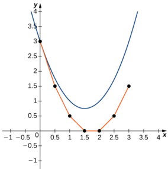
Figure 4.13 Euler's Method for the initial-value problem $y^{\prime }= 2x- 3$, $y( 0) = 3.$

The red graph consists of line segments that approximate the solution to the initial-value problem. The graph starts at the same initial value of (0,3) . Then the slope of the solution at any point is determined by the right-hand side of the differential equation, and the lenqth of the line seqment is determined by increasinq the $x$ value by 0.5each time (the step size). This approach is the basis of Euler's Method.

Before we state Euler's Method as a theorem,let's consider another initial-value problem

$$y'=x^{2}-y^{2},\quad y(-1)=2.$$

The idea behind direction fields can also be applied to this problem to study the behavior of its solution. For example, at the point (-1,2) , the slope of the solution is given by $y^{\prime}=(-1)^{2}-2^{2}=-3$ ,so the slope of the tangent line to the solution at that point is also equal to -3 . Now we define $x_{0}=-1$ and $y_{0}=2$ . Since the slope of the solution at this point is equal to -3 ,we can use the method of linear approximation to approximate $y$ near (-1,2)

$$L(x)=y_{0}+f^{\prime}\:(x_{0})\:(x-x_{0})\:.$$

Here $x_{0}=-1,y_{0}=2$ and $f^{\prime}\left(x_{0}\right)=-3$, so the linear approximation becomes

$$\begin{gathered}
L(x) =2-3\left(x-(-1)\right) \\
=2-3x-3 \\
=-3x-1. 
\end{gathered}$$

Now we choose a step size. The step size is a small value, typically 0.1 or less, that serves as an increment for $x$ it is represented by the variable $h$ . In our example, let $h=0.1$ . Incrementing $x_0$ by $h$ gives our next $x$ value

$$x_{1}=x_{0}+h=-1+0.1=-0.9.$$

We can substitute $x_{1}=-0.9$ into the linear approximation to calculate $y_1$

$$\begin{array}{rl}y_1&=L(x_1)\\&=-3(-0.9)-1\\&=1.7.\end{array}$$

Therefore the approximate $y$ value for the solution when $x=-0.9$ is $y=1.7.$ We can then repeat the process, using $x_{1}=-0.9$ and $y_{1}=1.7$ to calculate $x_2$ and $y_{2}$ . The new slope is given by $y^{\prime}=(-0.9)^{2}-(1.7)^{2}=-2.08$ First $x_{2}=x_{1}+h=-0.9+0.1=-0.8$ Using linear approximation gives

$$\begin{aligned}
&\text{11}   \\
&L(x) =y_{1}+f^{\prime}\left(x_{1}\right)(x-x_{1})  \\
&=1.7-2.08\left(x-(-0.9)\right) \\
&=1.7-2.08x-1.872 \\
&=-2.08x-0.172.
\end{aligned}$$

Finally, we substitute $x_{2}=-0.8$ into the linear approximation to calculate $y_{2}$

$$\begin{aligned}
\text{y2}& =L(x_2) \\
&-2.08x_{2}-0.172 \\
&=-2.08\left(-0.8\right)-0.172 \\
&=1.492.
\end{aligned}$$

Therefore the approximate value of the solution to the differential equation is $y=1.492$ when $x=-0.8$

What we have just shown is the idea behind Euler's Method. Repeating these steps gives a list of values for the solution. These values are shown in Table 4.2, rounded off to four decimal places

<table>
	<tbody>
		<tr>
			<th>$n$</th>
			<th>0</th>
			<th>1</th>
			<th>2</th>
			<th>3</th>
			<th>4</th>
			<th>5</th>
		</tr>
		<tr>
			<td>$x_n$</td>
			<td>-1</td>
			<td>-0.9</td>
			<td>-0.8</td>
			<td>-0.7</td>
			<td>-0.6</td>
			<td>-0.5</td>
		</tr>
		<tr>
			<td>$y_n$</td>
			<td>2</td>
			<td>1.7</td>
			<td>1.492</td>
			<td>1.3334</td>
			<td>1.2046</td>
			<td>1.0955</td>
		</tr>
		<tr>
			<td>$n$</td>
			<td>6</td>
			<td>7</td>
			<td>8</td>
			<td>9</td>
			<td>10</td>
			<td> </td>
		</tr>
		<tr>
			<td>$x_n$</td>
			<td>-0.4</td>
			<td>-0.3</td>
			<td>-0.2</td>
			<td>-0.1</td>
			<td>0</td>
			<td> </td>
		</tr>
		<tr>
			<td>$y_n$</td>
			<td>1.0004</td>
			<td>1.9164</td>
			<td>1.8414</td>
			<td>1.7746</td>
			<td>1.7156</td>
			<td> </td>
		</tr>
	</tbody>
</table>

Table 4.2 Using Euler's Method to Approximate Solutions to a Differential Equation

### Theorem 4.1

### Euler's Method

Consider the initial-value problem

$$y'=f\left(x,y\right),\quad y\left(x_{0}\right)=y_{0}.$$

To approximate a solution to this problem using Euler'smethod,define

$$\begin{aligned}&x_{n}=x_{0}+nh\\&y_{n}=y_{n-1}+hf(x_{n-1},y_{n-1}).\end{aligned}$$

Here $h>0$ represents the step size and $n$ is an integer, starting with 1. The number of steps taken is counted by the variable n.

Typically $h$ is a small value, say 0.1 or 0.05. The smaller the value of $h$ , the more calculations are needed. The higher the value of $h$ , the fewer calculations are needed. However, the tradeoffresults in a lower degree of accuracy for larger step size, as illustrated in Figure 4.14

Figure 4.14 Euler's method for the initial-value problem $y^{\prime}=2x-3,y(0)=3$ with (a) astep size of $h=0.5$ and b) a

step size of $h=0.25$

EXAMPLE 4.9

### Using Euler's Method

Consider the initial-value problem

$$y'=3x^{2}-y^{2}+1,\quad y(0)=2.$$

Use Euler's method with a step size of 0.1 to generate a table of values for the solution for values of $x$ between 0 and 1.

### $(O)$ Solution

We are given $h=0.1$ and $f\left(x,y\right)=3x^{2}-y^{2}+1$ Furthermore, the initial condition. $y(0)=2$ gives $x_{0}=0$ and $y_{0}=2$ Using Equation 4.2withe $n=0$ , we can generate Table 4.3.e

<table>
	<tbody>
		<tr>
			<th>$n$</th>
			<th>$x_n$</th>
			<th>$y_{n}=y_{n-1}+hf(x_{n-1},y_{n-1})$</th>
		</tr>
		<tr>
			<td>0</td>
			<td>0</td>
			<td>2</td>
		</tr>
		<tr>
			<td>1</td>
			<td>0.1</td>
			<td>$y_{1}=y_{0}+hf(x_{0},y_{0})=1.7$</td>
		</tr>
		<tr>
			<td>2</td>
			<td>0.2</td>
			<td>$y=y_{1}+hf\left(x_{1},y_{1}\right)=1.514$</td>
		</tr>
		<tr>
			<td>3</td>
			<td>0.3</td>
			<td>$y_{3}=y_{2}+hf\left(x_{2},y_{2}\right)=1.3968$</td>
		</tr>
		<tr>
			<td>4</td>
			<td>0.4</td>
			<td>$y_{4}=y_{3}+hf\left(x_{3},y_{3}\right)=1.3287$</td>
		</tr>
		<tr>
			<td>5</td>
			<td>0.5</td>
			<td>$y_{5}=y_{4}+hf(x_{4},y_{4})=1.3001$</td>
		</tr>
		<tr>
			<td>6</td>
			<td>0.6</td>
			<td>$y_{6}=y_{5}+hf\left(x_{5},y_{5}\right)=1.3061$</td>
		</tr>
		<tr>
			<td>7</td>
			<td>0.7</td>
			<td>$\nu_{\boldsymbol{c}}+hf(x)$ $\epsilon)=1.3435$</td>
		</tr>
	</tbody>
</table>

Table 4.3Using Euler's Method to Approximate Solutions to a Differential Equation

<table>
	<tbody>
		<tr>
			<th>8</th>
			<th>0.8</th>
			<th>$y_{8}=y_{7}+hf(x_{7},y_{7})=1.4100$</th>
		</tr>
		<tr>
			<td>9</td>
			<td>0.9</td>
			<td>$y_{9}=y_{8}+hf\left(x_{8},y_{8}\right)=1.5032$</td>
		</tr>
		<tr>
			<td>10</td>
			<td>1.0</td>
			<td>$\nu_{10}=\nu_{0}+hf\left(x_{0},\nu_{0}\right)=1.6202$ </td>
		</tr>
	</tbody>
</table>

Table 4.3Using Euler'sMethod to Approximate Solutions to a Differential Equation

With ten calculations, we are able to approximate the values of the solution to the initial-value problem for values of $x$ between 0 and 1.

### MEDIA

For more information on Euler's method (http://www.openstax.org/l/20 EulersMethod) use this applet.

4.9 Consider the initial-value problem

$$y'=x^3+y^2,\quad y(1)=-2.$$

Using a step size of 0.1, generate a table with approximate values for the solution to the initial-value problem for values of x between 1 and 2

### MEDIA

Visit this website (http://www.openstax.org/l/20 EulerMethod2) for a practical application of the material in this section.

### SECTION 4.2 EXERCISES

For the following problems, use the direction field below from the differential equation $y^{\prime}=-2y$ .Sketch thegraphof the solution for the given initial conditions

66. $y(0)=1$ 67. $y(0)=0$

68. $y(0)=-1$

69. Are there any equilibria? What are their stabilities?

For the following problems, use the direction field below from the differential equation $y^{\prime}=y^{2}-2y$ Sketch the graph o the solution for the given initial conditions

70.y0) = 371. $y(0)=1$ 73. Are there any equilibria? 72. $y(0)=-1$ What are their stabilities?

Draw the direction field for the following differential equations, then solve the differential eguation.

74. $y^{\prime}=t^3$ 75. $y^{\prime}=e^{I}$ 76. $\frac{dy}{dx}=x^2\cos x$ 77. $\frac{dy}{dt}=te^{I}$ 78. = cosh (t)

Draw the directional field for the following differential eguations. What can you say about the behavior of the solution. Are there equilibria? What stability do these equilibria have?

79. $y^{\prime}=y^{2}-1$
$$81.\:y^{\prime}=1-y^{2}-x^{2}$$
80.y=y-x 82. $y^{\prime}=t^{2}\sin y$ 83.y'= 3y+ xy

Match the direction field with the given differential equations. Explain your selections

$\begin{aligned}
&&4.2·DirectionFieldsandNumericalMethods329 \\
&\begin{aligned}&\text{y}\\&2\boxed{\begin{array}{ccccccccccccccccccccccccccccccccccccccccccccccccccccccccccccccccc \\
&\begin{aligned}&2\boxed{\begin{array}{cccccccccccccccccccccccccccccccccccccccccccccccccc
\end{aligned}$

84. $y^{\prime}=-3y$

85. $y^{\prime}=-3t$ 86. $y^{\prime}=e^{I}$
$$87.\:y^{\prime}={\frac{1}{2}}y+t$$

8. $y^{\prime}=-ty$

Match the direction field with the given differential equations.Explain vour selections

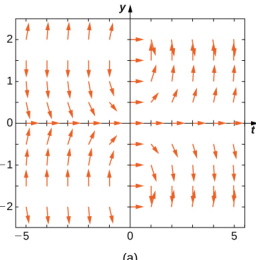

$\chemfig{[:30]*6((-[5])-(-[5])-(-[5])-(=[2])-(=[2])-(=[2])-(=[2])-)}+\chemfig{[:30]*6((-[5])-(-[5])-(=[2])-(=[2])-(=[2])-(=[2])-(=[2])-)}+\chemfig{[:30]*6((-[5])-(-[5])-(=[2])-(=[2])-(=[2])-(=[2])-)}+\chemfig{[:30]**6((-[5])-(-[5])-(=[2])-(=[2])-(=[2])-(=[2])-)}+\chemfig{[:30]**6((-[5])-(-[5])-(-[5])-(=[2])-(=[2])-(=[2])-)}+\chemfig{[:30]**6((-[5])-(-[5])-(=[2])-(=[2])-(=[2])-)}+$

89. $y^{\prime}=t\sin y$

$$92.\quad y^{\prime}=\sin^{2}y$$
90. $y^{\prime}=-t\cos y$ 91. $y^{\prime}=t\tan y$

93. $y^{\prime}=y^{2}t^{3}$

Estimate the following solutions using Euler's method with $n=5$ steps over the interval $t=[0,1]$ If you are abletosolve the initial-value problem exactly,compare your solution with the exact solution.If you are unable to solve the initial. value problem, the exact solution will be provided for you to compare with Euler's method. How accurate is Euler's method?

96. $y^{\prime}=3t-y,y(0)=1$ Exact solution is
$$y=3t+4e^{-t}-3$$
99. $[\Pi]y^{\prime}=e^{(x+y)},y(0)=-1.$ Exact solution is
$$y=-\ln(e+1-e^{x})$$
102. $y^{\prime}=y,y(0)=-1$ Exact solution is $y=-e^{x}$

$$y^{\prime}=-3y,\quad y(0)=1\quad95.\quad y^{\prime}=t^{2}$$
97. $y^{\prime}=y+t^{2},y(0)=3$ .Exact98. $y^{\prime}=2t,y(0)=0$ solution is
$$y=5e^t-2-t^2-2t$$
100. $y^{\prime}=y^{2}\ln(x+1),y(0)=1$ 101. $y^{\prime}=2^{x},y(0)=0$ ,Exact Exact solution is solution is $y=\frac{2^x-1}{\ln(2)}$
$$y=-\frac{1}{(x+1)(\ln(x+1)-1)}$$
103. $y^{\prime}=-5t,y(0)=-2$ Exact solution is
$$y=-\frac{5}{2}t^{2}-2$$

Differential equations can be used to model disease epidemics.In the next set of problems,we examine the change of size of two sub-populations of people living in a citv:individuals who are infected and individuals who are susceptible tc infection. $S$ represents the size of the susceptible population, and I represents the size of the infected population.We. assume that if a susceptible person interacts with an infected person, there is a probability c that the susceptible person will become infected. Each infected person recovers from the infection at a rate r and becomes susceptible again. We. consider the case ofinfluenza,where we assume thatno one dies from the disease,so we assume thatthe total population size of the two sub-populations is a constant number, $N$ .The differential equations that model these population sizes are

$$\begin{array}{ll}S'=rI-cSI&\text{and}\\I'=cSI-rI.\end{array}$$

Here c represents the contact rate and r is the recovery rate

105.Assuming the parameters are $c=0.5$ $N=5$ , and $r=0.5$ ,draw the resulting directional field.

104.Show that,by our assumption that the total population size is constant $(S+I=N)$ you can reduce the system to a single differential equation in

106.[T] Use computational software or a calculator tc compute an approximate solution to the initial-value problem $y^{\prime }= ty$, $y( 0) = 2$ using Euler's Method with a given step size h.Find the solution at $t=1$ in terms of $h$ Hint: Here is "pseudo-code" for how to write a compute program to perform Euler's Method for $y^{\prime}=f(t,y),y(0)=y_{0}$ Create function $f(t,y)$ Define parameters $y( 0) = y_{0}$, $t( 0) = 0$ ,step size $h$ and total number of steps, $N$ .Write a forloop for $k=0$ to $N$
$$\begin{aligned}
&\mathrm{fn}=\mathrm{f}\left(\mathrm{t}\left(\mathrm{k}\right),\mathrm{y}\left(\mathrm{k}\right)\right) \\
&\mathrm{y\left(k+1\right)=y\left(k\right)+h^{*}fn} \\
&\mathrm{t(k+1)=t(k)+h}
\end{aligned}$$

109. Compute using $h=1$

Refer toyour answer for Exercise 4.106 to solve the following exercises

108. Draw the directional field

107. Solve the initial-value problem for the exact solution.

110.Compute using [T] $h=\dot{0}.1$

111. Compute using [T] h=0.001

113.[T] Eyaluate the exact solution at $t=1.$ Makea table of errors for the relative error between the Euler's method solution and the exact solution. How much does the error change? Can you explain

Consider the initial-value problem y = -2y,y(0) = 2

114. Show that $y=2e^{-2x}$ solves this initial-value problem

115.Draw the directional field of this differential equation

112. Compute using [T] $h=0.0001$

116. [T] By hand or by calculator or computer approximate the solution using Euler's Method at $t=10$ using $h=5$

117.[T] By calculator or computer, approximate the solution using Euler's Method at $t=10$ using $h=100$

118.[T] Plot exact answer and each Euler approximation (for $h=5$ and $h=100$ )at each $h$ on the directional field. What do you notice?

# 4.3 Separable Equations

# Learning Objectives

4.3.1 Use separation of variables to solve a differential equation. 4.3.2 Solve applications using separation of variables.

We now examine a solution technique for finding exact solutions to a class of differential equations known as separable differential equations. These equations are common in a wide variety of disciplines, including physics, chemistry, and engineering.We illustrate a few applications at the end of the section.

## Separation of Variables

We start with a definition and some examples

### Definition

A separable differential equation is any equation that can be written in the form

$$y'=f\left(x\right)g(y).$$

The term‘separable'refers to the fact that the riqht-hand side of the equation can be separated into a function of $x$ times a function of $y$ . Examples of separable differential equations include

$$\begin{aligned}
&\text{y} =\left(x^{2}-4\right)(3y+2) \\
&\text{y} =6x^{2}+4x \\
&\text{y} =\sec y+\tan y \\
&\text{y} =xy+3x-2y-6. 
\end{aligned}$$

The second equation is separable with $f\left(x\right)=6x^{2}+4x$ and $g(y)=1$ ,the third equation is separable with $f\left(x\right)=1$ and $g(y)=\sec y+\tan y$ ,and the right-hand side of the fourth equation can be factored as $(x-2)(y+3)$ , so it is separable as well.The third equation isalso called an autonomous differential equationbecause theriqht-hand side of the equation is a function of $y$ alone. If a differential equation is separable, then it is possible to solve the equation using the method of separation of variables

## Problem-Solving Strategy

### Separation of Variables

1.Check for any values of y that make $g(y)=0$ . These correspond to constant solutions.. 2. Rewrite thedifferenia equationin the form $\frac{dy}{g(y)}=f(x)dx$ 3. Inteqrate both sides of the equation 4.Solve the resulting equation for $y$ if possible 5.If an initial condition exists,substitute the appropriate values for $x$ and yinto theequation andsolvefor the constant.

Note that Step 4. states Solve the resulting equation for $y$ if possible." It is not always possible to obtain y as an explicit function of $x.$ Quite often we have to be satisfied with finding $y$ as an implicit function of $x$

## EXAMPLE 4.10

### Using Separation of Variables

Find a general solution to the differential equation $y^{\prime}=\left(x^{2}-4\right)(3y+2)$ using the method of separation of variables.

## $②$ Solution

1.In this example, $f(x)=x^{2}-4$ and $g\left(y\right)=3y+2$ . Setting $g(y)=0$ gives $y=-\frac{2}{3}$ as a constant solution 2.Rewrite the differential equation in the form
$$\frac{dy}{3y+2}=(x^2-4)dx.$$

3.Integrate both sides of the equation:

$$\int\frac{dy}{3y+2}=\int\left(x^2-4\right)\:dx.$$

Let $u=3y+2$ Then du =3dx,so the equation become
$$\begin{aligned}
CCquacioribccoinco \\
{\frac{1}{3}}\int{\frac{1}{u}}du& =\quad\frac{1}{3}x^{3}-4x+C \\
{\frac{1}{3}}\ln|u|& =\quad\frac{1}{3}x^{3}-4x+C \\
\frac{1}{3}\ln|3y+2|& =\:\frac{1}{3}x^{3}-4x+C. 
\end{aligned}$$

4.To solve this equation for $y$ ,first multiply both sides of the equation by 3.
$$\ln|3y+2|=x^{3}-12x+3C$$

Now we use some logic in dealing with the constant $C$ .Since $C$ represents an arbitrary constant, $3C$ also represents an arbitrary constant. If we call the second arbitrary constant $C_{\mathrm{l}}$ , the equation becomes
$$\ln|3y+2|=x^{3}-12x+C_{1}.$$

Now exponentiate both sides of the equation (i.e., make each side of the equation the exponent for the base e)
$$\begin{array}{rcl}{{\mathrm{III.e.,~IIIake~eaCII~sIUE~UI~UIE}}}\\{{e^{\ln\left|3y+2\right|}}}&{=}&{{e^{x^{3}-12x+C_{1}}}}\\{{\left|3y+2\right|}}&{=}&{{e^{C_{1}}\:e^{x^{3}-12x}}}\end{array}$$

Again define a new constant $C_{2}=e^{\mathrm{c}}1$ (note that $C_{2}>0)$ |3y + 2| = C2ex3-12x

This corresponds to two separate equations: $3y+2=C_{2}e^{x^{3}-12x}$ and $3y+ 2= - C_{2}e^{x^{3}- 12x}$ . The slutio t ithe equatin can be wrte inthe formn $y={\frac{-2\pm C_{2}e^{x^{3}-12x}}{3}}$

Since $C_{2}>0$ , it does not matter whether we use plus or minus, so the constant can actually have either sign Furthermore, the subscript on the constant $C$ is entirely arbitrary,and can be dropped.Therefore the solution car be written as
$$y=\frac{-2+Ce^{x^3-12x}}{3}.$$

5.No initial condition is imposed, so we are finished

4.10 Use the method of separation of variables to find a qeneral solution to the differential equation y' = 2xy + 3y - 4x - 6.

## EXAMPLE 4.11

### Solving an Initial-Value Problem

Using the method of separation of variables, solve the initial-value problem

$$y'=(2x+3)(y^{2}-4),\quad y(0)=-1.$$

## $②$ Solution

Follow the five-step method of separation of variables.

1.In this example, $f(x)=2x+3$ and $g(y)=y^{2}-4$ Setting $g(y)=0$ gives $y=\pm2$ as constant solutions 2.Divide both sides of the equation by $y^{2}-4$ and multiply by $dx$ .This gives the equation
$$\frac{dy}{y^{2}-4}=(2x+3)\:dx.$$

3.Next inteqrate both sides

$$\int\frac{1}{y^2-4}\:dy=\int(2x+3)\:dx.$$

To evaluate the left-hand side, use the method of partial fraction decomposition. This leads to the identity
$$\frac{1}{y^{2}-4}=\frac{1}{4}\left(\frac{1}{y-2}-\frac{1}{y+2}\right).$$

ThenEquation 4.4 becomes

$$\begin{array}{rcl}\frac{1}{4}\int\left(\frac{1}{y-2}-\frac{1}{y+2}\right)dy&=&\int(2x+3)\:dx\\\frac{1}{4}(\ln|y-2|-\ln|y+2|)&=&x^2+3x+C.\end{array}$$

 Multiplying both sides of this equation by 4 and replacing $4C$ with $C_{1}$ gives
$$\begin{array}{rcl}{{\mathrm{tion~by}+\mathrm{and~icpiacing}+\mathrm{C~wial~C_{1}~giwes}}}\\{{\ln|y-2|-\ln|y+2|}}&{=}&{{4x^{2}+12x+C_{1}}}\\{{\ln\left|\frac{y-2}{y+2}\right|}}&{=}&{{4x^{2}+12x+C_{1}.}}\end{array}$$

4.It is possible to solve this equation for y. First exponentiate both sides of the equation and define $C_{2}=e^{C_{1}}$
$$\left|\frac{y-2}{y+2}\right|=C_2e^{4x^2+12x}.$$

Next we can remove the absolute value and let $C_{2}$ be either positive or negative. Then multiply both sides by $y+2$

$$\begin{aligned}&y-2=C_{2}\left(y+2\right)e^{4x^{2}+12x}\\&y-2=C_{2}ye^{4x^{2}+12x}+2C_{2}e^{4x^{2}+12x}.\end{aligned}$$

Now collect all terms involving y on one side of the equation, and solve for y:
$$\begin{array}{rcl}\text{onle sioe ol the equation, and solve lor y.}\\y-C_{2}ye^{4x^{2}+12x}&=&2+2C_{2}e^{4x^{2}+12x}\\y(1-C_{2}e^{4x^{2}+12x})&=&2+2C_{2}e^{4x^{2}+12x}\\y&=&\frac{2+2C_{2}e^{4x^{2}+12x}}{1-C_{2}e^{4x^{2}+12x}}.\end{array}$$

5.To determine the value of $C_2$ , substitute $x=0$ and $y=-1$ into the general solution.Alternatively,we can put the same values into an earlier equation,namely the equation $\frac {y- 2}{y+ 2}= C_{2}e^{4x^{2}+ 12}$ . This is much easier to solve for $C_{2}$

$$\begin{aligned}\frac{y-2}{y+2}&=\quad C_{2}e^{4x^{2}+12x}\\\frac{-1-2}{-1+2}&=\quad C_{2}e^{4(0)^{2}+12(0)}\\C_{2}&=\quad-3.\end{aligned}$$

Therefore the solution to the initial-value problem is

$$y=\frac{2-6e^{4x^{2}+12x}}{1+3e^{4x^{2}+12x}}.$$

A graph of this solution appears in Eigure 4.15

Figure 4.15 Graph of the solution to the initial-value problem $y^{\prime }= \left ( 2x+ 3\right ) \left ( y^{2}- 4\right )$, $y\left ( 0\right ) = - 1.$

Find the solution to the initial-value problem 4.11
$$6y'=(2x+1)\left(y^2-2y-8\right),\quad y(0)=-3$$
using the method of separation of variables.

# Applications of Separation of Variables

Many interesting problems can be described by separable equations. We illustrate two types of problems: solution concentrations and Newton's law of cooling

### Solution concentrations

Consider a tank being filled with a salt solution. We would like to determine the amount of salt present in the tank as a function of time. We can apply the process of separation of variables to solve this problem and similar problems involving solution concentrations.

## EXAMPLE 4.12

### Determining Salt Concentration over Time

A tank containing $100L$ of a brine solution initially has $4kg$ of salt dissolved in the solution.At time $t=0$ , another brine solution flows into the tank at a rate of $2L/$min This brine solution contains a concentration of 0.5 kg/L of salt. At the same time, a stopcock is opened at the bottom of the tank, allowing the combined solution to flow out at a rate of $2L/min$ , so that the level of liquid in the tank remains constant (Eigure 4.16). Find the amount of salt in the tank as a function of time (measured in minutes), and find the limiting amount of salt in the tank, assuming that the solution in the tank is well mixed at all times.

Figure 4.16 A brine tank with an initial amount of salt solution accepts an input flow and delivers an output flow.How does the amount of salt change with time?

## $②$ Solution

First we define a function $u(t)$ that represents the amount of salt in kilograms in the tank as a function of time. Then $\frac{du}{dt}$ represents the rate at which the amount of salt in the tank changes as a function of time. Also, $u\left(0\right)$ represents the amount of salt in the tank at time $t=0$ ,which is 4 kilograms

The general setup for the differential equation we will solve is of the form

$$\frac{du}{dt}=\mathrm{INFLOW~RATE-OUTFLOW~RATE.}$$

INFLOw RATE represents the rate at which salt enters the tank, and OUTFLOw RATE represents the rate at which salt leaves the tank.Because solution enters the tank at a rate of 2L/min,and eachliter of solution contains 0.5kiloqram of salt, every minute $2\left(0.5\right)=1$ kilogram of salt enters the tank. Therefore INFLOw RATE =1

To calculate the rate at which salt leaves the tank, we need the concentration of salt in the tank at any point in time Since the actualamount of salt yaries over time.so does the concentration of salt. However the yolume of the solutior remains fixed at 10o liters. The number of kilograms of salt in the tank at time t is equal to $u\left(t\right).$ Thus, the concentratior of salt is $\frac{u(t)}{100}$ kg/L , and the solution leaves the tank at a rate of 2 L/min. Therefore salt leaves the tank at a rate off $\frac{u(t)}{100}\cdot2=\frac{u(t)}{50}$ kg/min and OUTFLOW RATE is equal to $\frac{u(t)}{50}$ . Therefore the differential equation becomes $\frac{du}{dt}=1-\frac{u}{50}$ and the initial condition is $u(0)=4$ . The initial-value problem to be solved is

$$\frac{du}{dt}=1-\frac{u}{50},\quad u\:(0)=4.$$

The differential equation is a separable equation, so we can apply the five-step strategy for solution

Step 1. Setting $1-\frac{u}{50}=0$ gives $u=50$ as a constant solution. Since the initial amount of salt in the tank is 4 kilograms this solution does not apply

Step 2.Rewrite the equation as

$$\frac{du}{dt}=\frac{50-u}{50}.$$

Then multiply both sides by dt and divide both sides by $50-u$

$$\frac{du}{50-u}=\frac{dt}{50}.$$

Step 3.Inteqrate both sides

$$\begin{array}{rcl}\int\frac{du}{50-u}&=&\int\frac{dt}{50}\\-\ln|50-u|&=&\frac{t}{50}+C.\end{array}$$

Step 4. Solve for $u(t)$

$$\begin{array}{rcl}\ln|50-u|&=&-\frac{t}{50}-C\\e^{\ln|50-u|}&=&e^{-(t/50)-C}\\|50-u|&=&C_{1}\:e^{-t/50}.\end{array}$$

Eliminate the absolute value by allowing the constant to be either positive or negative

$$50-u=C_{1}e^{-t/50}.$$

Finally, solve for $u\left(t\right)$

$$u\left(t\right)=50-C_{1}e^{-t/50}.$$

Step 5. Solve for $C_1$

$$\begin{array}{rcl}u\left(0\right)&=&50-C_1\:e^{-0/50}\\4&=&50-C_1\\C_1&=&46.\end{array}$$

The solution to the initial value problem is $u\left(t\right)=50-46e^{-t/50}$ To find the limiting amount of salt in the tank,take the limit as I approaches infinity

$$\begin{aligned}
\operatorname*{lim}_{l\rightarrow\infty}u\left(t\right)& =50-46e^{-t/50} \\
&=50-46\left(0\right) \\
&=50.
\end{aligned}$$

Note that this was the constant solution to the differential equation. If the initial amount of salt in the tank is 50 kilograms, then it remains constant. If it starts at less than 50 kilograms, then it approaches 50 kilograms over time.

A tank contains 3 kilograms of salt dissolved in 75 liters of water. A salt solution of 0.4 kg salt/L is pumpec 4.12 into the tank at a rate of 6 L/min and is drained at the same rate. Solve for the salt concentration at time f Assume the tank is well mixed at all times.

### Newton's law of cooling

Newton's law of cooling states that the rate of chanqe of an object's temperature is proportional to the difference between its own temperature and the ambient temperature (i.e., the temperature of its surroundings).If we let $T(t)$ represent the temperature of an object as a function of time, then $\frac{dT}{dt}$ represents the rate at which that temperature changes.The temperature of the object's surroundings can be represented by $T_{s}$ . Then Newton's law of cooling can be written in the form

$$\frac{dT}{dt}=k\left(T(t)-T_{s}\right)$$

or simply

$$\frac{dT}{dt}=k\left(T-T_{s}\right).$$

The temperature of the object at the beginning of any experiment is the initial value for the initial-value problem. We cal this temperature $T_{0}.$ Therefore the initial-value problem that needs tobe solved takes the form

$$\frac{dT}{dt}=k\left(T-T_{s}\right),\quad T\left(0\right)=T_{0},$$

where $k$ is a constant that needs to be either given or determined in the context of the problem.We use these equations in Example 4.13

# EXAMPLE 4.13

### Waiting for a Pizza to Cool

A pizza is removed from the oven after baking thoroughly, and the temperature of the pizza when it comes out of the

oven is $200^{\circ}$F .The temperature of the kitchen is $75^\circ F$ ,and after 1 minute the temperature of the pizza is $190^\circ$F We would like to wait until the temperature of the pizza reaches $150^{\circ}$F before cutting and serving it (Eigure 4.17). How much longer will we have to wait?.

Figure 4.17 From Newton's law of cooling, if the pizza cools. $10^\circ$F in 1 minute,how long before it cools to $150^\circ$F?

# $②$ Solution

The ambient temperature (surrounding temperature) is. $75^{\circ}F$ ,SO $T_s=75$ The temperature of the pizza when it comes out of the oven is $200^\circ$F , which is the initial temperature (i.e., initial value), so $T_{0}=200$ .Therefore Equation 4.4 becomes

$$\frac{dT}{dt}=k\left(T-75\right),\quad T\left(0\right)=200.$$

To solve the differential eauation, we use the five-step techniaue for solving separable eauations

1.Setting the right-hand side equal to zero gives $T=75$ as a constant solution. Since the pizza starts at $200^\circ$F , this is not the solution we are seeking 2.Rewrite the differential equation by multiplying both sides by dt and dividing both sides by $T-75$
$$\frac{dT}{T-75}=kdt.$$

3.Inteqrate both sides

$$\begin{array}{rcl}\int\frac{dT}{T-75}&=&\int kdt\\\ln|T-75|&=&kt+C.\end{array}$$

4.Solve for $T$ by first exponentiating both sides:

$$\begin{aligned}
e^{\ln\left|T-75\right|}& =\:e^{kt+C} \\
|T-75|& =\:C_{1}\:e^{kt} \\
T-75& =\:C_{1}\:e^{kt} \\
T(t)& =\:75+C_{1}\:e^{kt}\:. 
\end{aligned}$$

5.Solve for $C_{\mathrm{l}}$ by using the initial condition $T(0)=200$

$$\begin{array}{rcl}{0)\equiv200!}\\{T(t)}&{=}&{{75+C_{1}\:e^{kt}}}\\{T(0)}&{=}&{{75+C_{1}\:e^{k(0)}}}\\{200}&{=}&{{75+C_{1}}}\\{C_{1}}&{=}&{{125.}}\end{array}$$

Therefore the solution to the initial-value problem is

$$T(t)=75+125e^{kt}.$$

To determine the value of $k$ ,we need to use the fact that after 1minute the temperature of thepizza is $190^\circ$F Therefore $T(1)=190$ . Substituting this information into the solution to the initial-value problem, we have

139. $\frac{dx}{dt}=\ln(t)\sqrt{1-x^{2}},x(1)=0$ 140. $y^{\prime}=3x^{2}(y^{2}+4),y(0)=0$ 141.y=e5x,y0=ln(ln5142. $y^{\prime}=-2x\tan(y),y(0)=\frac{\pi}{2}$

For the following problems, use a software program or your calculator to generate the directional fields.Solve explicitl. and draw solution curves for several initial.conditions.Are there some critical initial conditions that change the behavio of the solution

145.T]y=ye

143. $[ T]$ $y^{\prime }= 1- 2y$ 146.[T] $y^{\prime}=e^{y}$

144.]y=yx3147.]y=ylnx

148.Most druqs in the bloodstream decay according to the equation $y^{\prime}=cy$ ,where $y$ is the concentration of the drug in the bloodstream.If the half-life of a drug is 2 hours.what fraction of the initial dose remains after 6 hours?

150.[T] How often should a drug be taken if its dose is $3mg.$ it is cleared at a rate $c=0.1$ mg/h , and 1 mg is required to be in the bloodstream at all times?

151. A tank contains kiloqram of salt dissolved in 100 liters of water. A salt solution of $0.1kg$ salt/L is pumped into the tank at a rate of 2 L/min and is drained at the same rate. Solve for the salt concentration at time f. Assume the tank is wel mixed

149. A drug is administered intravenously to a patient at a rate $r$ mg/h and is cleared from the body at a rate proportional to the amount of drug stil present in the body, d Set up and solve the differential equation, assuming there is no drug initially present in the body.

153. [T] For the preceding problem, find how much salt is in the tank 1 hour after the process begins.

152. A tank containing 10 kilograms of salt dissolved in 1000 liters of water has two salt solutions pumped in. The first solution of $0.2kg$ salt/L is pumped in at a rate of 20 L/min and the second solution of 0.05 kg salt/L is pumped in at a rate of 5 L/min. The tank drains at 25 L/min. Assume the tank is well mixed. Solve for the salt concentration at time t.

154.Torricelli's law states that for a water tank with a hole in the bottom that has a cross-sectional area of $A_{T}$ and with a height of water h above the bottom of the tank, the rate of change of volume of water flowing from the tank is proportional to the square root of the height of water, according to $\frac{dV}{dt}=-A_{T}\sqrt{2gh}$ where 8 is the acceleration due to gravity. Note that $\frac{dV}{dt}=A\frac{dh}{dt}$ ,where $AT$ is the cross-sectional area of the tank.Solve the resulting initial-value problem for the height of water, assuming a tankof radius $24\sqrt{2}$ with a circular hole of radius 2 ft

155. For the preceding problem, determine how long it takes the tank to drain.

For the following problems, use Newton's law of cooling

158. [T] You are organizing an ice cream social.The outside temperature is $80^{\circ}$F and the ice cream is at $10^{\circ}$F. After 10 minutes, the ice cream temperature has risen by $10^{\circ}$F . How much longer can you wait before the ice cream melts at $40^\circ$F?

156. The liquid base of an ice cream has an initial temperature of $200^\circ$F before it is placed in a freezer with a constant temperature of $0^{\circ}$F After 1 hour, the temperature of the ice-cream base has decreased to $140^\circ$F Formulate and solye the initial-value problem to determine the temperature of the ice cream.

157. [T] The liquid base of an ice cream has an initial temperature of $210^\circ$F before it is placed in a freezerwith a constant temperature of $20^{\circ}F$ After 2 hours,the temperature of the icecream base has decreased to $170^{\circ}$F At what time will the ice cream be ready to eat? (Assume $30^\circ$F is the optimal eating temperature.)

For Exercises 159—162, assume a cooling constant of $k=-0.125$ and assume timet is in minutes

160. [T] You have a cup of coffee at temperature $70^\circ\mathbb{C}$ that you put outside, where the ambient temperature is $0^{\circ}\mathbf{C}.$ After 5 minutes, how much colder is the coffee?

161. You have a cup of coffee at temperature $70^{\circ}$C and you immediately pour in 1 part milk to 5 parts coffee. The milk is initially at temperature $1^{\circ}\mathbf{C}.$ Write and solve the differential equation that governs the temperature of this coffee

159. You have a cup of coffee at temperature $70^\circ\mathbf{C}$ and the ambient temperature in the room is $20^{\circ}\mathbf{C}$ Assuming a cooling rate $k$ of 0.125, write and solve the differential equation to describe the temperature of the coffee with respect to time.

163.Solve the generic problem $y^{\prime}=ay+b$ with initial condition $y(0)=c$

164. Prove the basic continual compounded interest equation. Assuming an initial deposit of $P_0$ and an interest rate of $r$ ,set up and solve an equation for continually compounded interest

162. You have a cup of coffee at temperature $70^{\circ}$C which you let cool 10 minutes before you pour in the same amount of milk at $1^{\circ}\mathbb{C}$ as in the preceding problem. How does the temperature compare to the previous cup after 10 minutes?

165. Assume an initial nutrient amount of $I$ kilograms in a tank with $L$ liters. Assume a concentration of c kg/L being pumped in at a rate of r L/min. The tank is well mixed and is drained at a rate of r L/ min.Find the equation describing the amount of nutrientin the tank.

167. Leaves accumulate on the forest floor at a rate of 4 $g/cm^2/yr.$ These leaves decompose at a rate of $10\%$ per year Write a differential equation governing the number of grams of leaf litter per square centimeter of forest floor. Does this amount approach a steady value? What is that value？

166.Leaves accumulate on the forest floor at a rate of 2 g/cm²/yr and also decompose at a rate of $90\%$ per year. Write a differential equation governing thenumber of grams of leaf litter per square centimeter of forest floor, assuming at time O there is no leaf litter on the ground.Does this amount approach a steady value? What is that value?

# 4.4 The Logistic Equation.

## Learning Objectives

4.4.1Describe the concept of environmental carrying capacity in the logistic model of population growth 4.4.2 Draw a direction field for a logistic equation and interpret the solution curves 4.4.3Solve a logistic equation and interpret the results

Differential equations can be used to represent the size of a population as it varies over time. We saw this in an earlier chapter in the section on exponential growth and decay, which is the simplest model. A more realistic model includes other factors that affect the growth of the population. In this section, we study the logistic differential equation and see how it applies to the study of population dynamics in the context of biology

# Population Growth and Carrying Capacity

To model population growth using a differential equation, we first need to introduce some variables and relevant terms The variable t.will represent time. The units of time can be hours, days, weeks, months, or even years. Any given problem must specify the units used in that particular problem. The variable $P$ will represent population. Since the. population varies over time, it is understood to be a function of time. Therefore we use the notation $P(t)$ forthe population as a function of time.If $P(t)$ is adifferentiable function, then the first derivative $\frac{dP}{dt}$ represents the instantaneousrate of change of the population as a function of time.

In Exponential Growth_and Decay, we studied the exponential growth and decay of populations and radioactive substances. An example of an exponential growth function is $P(t)=P_{0}e^{rt}.$ In this function, $P(t)$ represents the population at timef, $P_{0}$ represents the initial population (population at time $t=0$ ),and the constant $r>0$ is called the growth rate.Figure 4.18shows a graph of $P(t)=100e^{0.03t}$ .Here $P_{0}=100$ and $r=0.03$

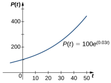
Figure 4.18An exponential growth model of population.

We can verify that the function. $P(t)=P_{0}e^{rt}$ satisfies the initial-value problem

$$\frac{dP}{dt}=rP,\quad P(0)=P_{0}.$$

This differential equation has an interesting interpretation.The left-hand side represents the rate at which the population increases (or decreases). The right-hand side is equal to a positive constant multiplied by the current population. Therefore the differential equation states that the rate at which the population increases is proportional t the population at that point in time.Furthermore,it states that the constant of proportionality never changes

One problem with this function is its prediction that as time goes on, the population grows without bound. This is unrealistic in a real-world setting. Various factors limit the rate of growth of a particular population, including birth rate death rate, food supply, predators, and so on. The growth constant r usually takes into consideration the birth and death rates but none of the other factors, and it can be interpreted as a net (birth minus death) percent growth rate per unit time. A natural question to ask is whether the population growth rate stays constant, or whether it changes over time Biologists have found that in many biological systems, the population grows until a certain steady-state population is reached. This possibility is not taken into account with exponential growth. However, the concept of carrying capacity allows for the possibility that in a given area, only a certain number of a given organism or animal can thrive without running into resource issues

### Definition

The carrying capacity of an organism in a given environment isdefined to be the maximum population of that organism that the environment can sustain indefinitely

We use the variable $K$ to denote the carrying capacity.The growth rate is represented by the variable r.Using these variables, we can define the logistic differential equation.

### Definition

Let $K$ represent the carrying capacity for a particular organism in a given environment, and let r be a real number that represents the growth rate.The function $P\left(t\right)$ represents the population of this organism as a function of time t, and the constant $P_0$ represents the initial population (population of the organism at time $t=0$ ). Then the logistic differential equation is

$$\frac{dP}{dt}=rP\left(1-\frac{P}{K}\right)$$

### MEDIA

See this website (http://www.openstax.orq/l/20 loqisticEq) for more information on the loqistic equation

The logistic equation was first published by Pierre Verhulst in 1845. This differential equation can be coupled with the initial condition $P(0)=P_{0}$ to form an initial-value problem for $P(t)$

Suppose that the initial population is small relative to the carrying capacity. Then $\frac{P}{K}$ is small, possibly close to zero. Thus, the quantity in parentheses on the right-hand side of Equation 4.8 is close to 1, and the right-hand side of this equation is close to $rP$ If $r>0$ , then the population grows rapidly, resembling exponential growth.

However, as the population grows, the ratio $\frac{P}{K}$ also grows, because $K$ is constant. If the population remains below the carrying capacity, then $\frac{P}{K}$ is less than 1, so $1-\frac{P}{K}>0$ . Therefore the right-hand side of Equation 4.8 is still positive, but the quantity in parentheses gets smaller, and the growth rate decreases as a result. If $P=K$ then the right-hand side is equal to zero, and the population does not change

Now suppose that the population starts at a value higher than the carrying capacity. Then $\frac{p}{K}>1$ , and $1-\frac{p}{K}<0$ . Then the right-hand side of Equation 4.8 is negative, and the population decreases. As long as $P>K$ , the population decreases. It never actually reaches $K$ because $\frac{dP}{dt}$ will get smaller and smalle,but the population approaches the carrying capacity as t approaches infinity. This analysis can be represented visually by way of a phase line. A phase line describes the general behavior of a solution to an autonomous differential equation, depending on the initial condition For the case of a carrying capacity in the logistic equation, the phase line is as shown in Figure 4.19

Figure 4.19 A phase line for the differential equation $\frac{dP}{dt}=rP\left(1-\frac{P}{K}\right)$

This phase line shows that when $P$ is less than zero or greater than $K$ , the population decreases over time. When $P$ is between 0 and $K$ the population increases over time.

### EXAMPLE 4.14

Chapter Opener: Examining the Carrying Capacity of a Deer Population

Figure 4.20 (credit: modification of work by Rachel Kramer, Flickr)

Let's consider the population of white-tailed deer (Odocoileus virginianus) in the state of Kentucky. The Kentucky Department of Fish and Wildlife Resources (KDFWR) sets guidelines for hunting and fishing in the state. Before the hunting season of 2004, it estimated a population of 900,000 deer. Johnson notes: *A deer population that has plenty to eat and is not hunted by humans or other predators will double every three years."(George Johnson,“The Problem of Exploding Deer Populations Has No Attractive Solutions," January 12, 2001, accessed April 9, 2015 http://www.txtwriter.com/onscience/Articles/deerpops.html.) This observation corresponds to a rate of increase $r={\frac{\ln(2)}{3}}=0.2311$ , so the approximate growth rate is $23.11\%$ per year. (This assumes that the population grows exponentially, which is reasonable--at least in the short term--with plentiful food supply and no predators.) The KDFWR also reports deer population densities for 32 counties in Kentucky, the average of which is approximately 27 deer per square mile. Suppose this is the deer density for the whole state (39,732 square miles). The carrying capacity $K$ is 39,732 square miles times 27 deer per square mile, or 1,072,764 deer

a.For this application, we have $P_{0}=900,000$ $K=1,072,764$ ,and $r=0.2311$ . Substitute these values into Equation 4.8 and form the initial-value problem. b.Solve the initial-valueproblem from part a. C.According to this model, what will be the population in 3 years? Recall that the doubling time predicted by Johnsor for the deer population was 3 years. How do these values compare? d.Suppose the population managed to reach 1,200,000 deer What does the logistic equation predict will happen to the population in this scenario?

## $②$ Solution

a.The initial value problem is

$$\frac{dP}{dt}=0.2311P\left(1-\frac{P}{1,072,764}\right),\quad P(0)=900{,}000.$$

b.The logistic equation is an autonomous differential equation, so we can use the method of separation of variables Step 1: Setting the right-hand side equal to zero gives $P=0$ and $P=1,072,764$ This means that if the population starts at zero it will never change, and if it starts at the carrying capacity, it will never change. Step 2: Rewrite the differential equation and multiply both sides by:
$$\begin{aligned}&\text{n and muluply botn slues by.}\\&\frac{dP}{dt}\:=\:0.2311P\left(\frac{1,072,764-P}{1,072,764}\right)\\&dP\:=\:0.2311P\left(\frac{1,072,764-P}{1,072,764}\right)\:dt.\end{aligned}$$

Divide both sides by $P\left(1,072,764-P\right)$

$$\frac{dP}{P(1,072,764-P)}=\frac{0.2311}{1,072,764}dt.$$

$$\text{s ol the equaton using paruan acuon decomposuon.}\\\int\frac{dP}{P(1,072,764-P)}\:=\:\int\frac{0.2311}{1,072,764}dt\\\frac{1}{1,072,764}\int\left(\frac{1}{P}+\frac{1}{1,072,764-P}\right)dP\:=\:\frac{0.2311t}{1,072,764}+C\\\frac{1}{1,072,764}\left(\ln|P|-\ln|1,072,764-P|\right)\:=\:\frac{0.2311t}{1,072,764}+C.$$

Step 4: Multiply both sides by 1,072,764 and use the quotient rule for logarithms
$$\ln\left|\frac{P}{1,072,764-P}\right|=0.2311t+C_{1}\:.$$

Here $C_{1}=1,072,764C$ .Next exponentiate both sides and eliminate the absolute value
$$\begin{array}{rcl}{{\text{te botri sides and emminate trie ab}}}\\{{e^{\ln\left|\frac{P}{1,072,764-P}\right|}}}&{=}&{{e^{0.2311t+C_{1}}}}\\{{\left|\frac{P}{1,072,764-P}\right|}}&{=}&{{C_{2}e^{0.2311t}}}\\{{\frac{P}{1,072,764-P}}}&{=}&{{C_{2}e^{0.2311t}.}}\end{array}$$

Here $C_{2}=e^{C_{1}}$ but after eliminating the absolute value, it can be negative as well. Now solve for:
$$\begin{aligned}
\begin{matrix}{P}&{=}\\\end{matrix}& C_{2}e^{0.2311\prime}\:(1,072,764-P)\:. \\
P=& :\:1,072,764C_{2}e^{0.2311t}-C_{2}Pe^{0.2311t} \\
P+C_{2}Pe^{0.2311t}& =\:1,072,764C_{2}e^{0.2311t} \\
P\left(1+C_{2}e^{0.2311t}\right)& =\:1,072,764C_{2}e^{0.2311t} \\
P(t)& =\:\frac{1,072,764C_{2}e^{0.2311t}}{1+C_{2}e^{0.2311t}}. 
\end{aligned}$$

Step 5: To determine the value of $C_{2}$ , it is actually easier to go back a couple of steps to where $C_{2}$ was defined. Ir particular, use the equation
$$\frac P{1,072,764-P}=C_{2}e^{0.2311t}.$$

The initial condition is $P(0)=900,000$ .Replace $P$ with 900,000 and t with zero

$$\begin{aligned}
\frac{P}{1,072,764-P}& =\:C_{2}e^{0.2311t} \\
\frac{900,000}{1,072,764-900,000}& =\:C_{2}e^{0.2311(0)} \\
\frac{900,000}{172,764}& =\:c_{2} & \\
C_{2}& =\:\frac{25,000}{4,799}\approx5.209. 
\end{aligned}$$

Therefore

$$\begin{aligned}
P(t)& =\frac{1,072,764\left(\frac{25000}{4799}\right)e^{0.2311t}}{1+\left(\frac{25000}{4799}\right)e^{0.2311t}} \\
&=\frac{1,072,764(25000)e^{0.2311t}}{4799+25000e^{0.2311t}}.
\end{aligned}$$

Dividing the numerator and denominator by 25,000 gives

$$P\left(t\right)=\frac{1,072,764e^{0.2311t}}{0.19196+e^{0.2311t}}.$$

Fiqure 4.21 is a graph of this equation

Fiqure 4.21 Loqistic curve for the deer population with an initial population of 900.000 deer

c.Using this model we can predict the population in 3 years
$$\text{c populatoin mis yeais.}\\P(3)=\frac{1,072,764e^{0.2311(3)}}{0.19196+e^{0.2311(3)}}\approx978,830\:\mathrm{deer}$$

This is far short of twice the initial population of 900,000. Remember that the doubling time is based on the assumption that the growth rate never changes, but the logistic model takes this possibility into account. d.If the population reached 1,200,000 deer, then the new initial-value problem would be
$$\frac{dP}{dt}=0.2311P\left(1-\frac{P}{1,072,764}\right),\quad P(0)=1,200,000.$$

The general solution to the differential equation would remain the same
$$\text{ation woula reman the saine.}\\P(t)=\frac{1,072,764C_{2}e^{0.2311t}}{1+C_{2}e^{0.2311t}}$$

To determine the value of the constant, return to the equation
$$\frac{P}{1,072,764-P}=C_{2}e^{0.2311t}.$$

Substituting the values $t=0$ and $P=1,200,000$ youget
$$\begin{aligned}&\text{1,200,000,you get}\\&C_{2}e^{0.2311(0)}\:=\:\frac{1,200,000}{1,072,764-1,200,000}\\&C_{2}\:=\:-\frac{100,000}{10,603}\approx-9.431.\end{aligned}$$

Therefore

$$\begin{aligned}
P(t)& =\frac{1,072,764C_{2}e^{0.2311t}}{1+C_{2}e^{0.2311t}} \\
&=\frac{1,072,764\biggl(-\frac{100,000}{10,603}\biggr)e^{0.2311t}}{1+\biggl(-\frac{100,000}{10,603}\biggr)e^{0.2311t}} \\
&=-\frac{107,276,400,000e^{0.2311t}}{100,000e^{0.2311t}-10,603} \\
&\approx\frac{10,117,551e^{0.2311t}}{9.43129e^{0.2311t}-1}.
\end{aligned}$$

This equation is graphed in Figure 4.22

Figure 4.22 Logistic curve for the deer population with an initial population of 1,200,000 deer

## Solving the Logistic Differential Equation

The logistic differential equation is an autonomous differential equation, so we can use separation of variables to find the general solution, as we just did in Example 4.14

Step 1: Setting the right-hand side equal to zero leads to $P=0$ and $P=K$ as constant solutions. The first solution. indicates that when there are no orqanisms present,the population will never qrow.The second solution indicates that when the population starts at the carrying capacity, it will never change

Step 2: Rewrite the differential equation in the form

$$\frac{dP}{dt}=\frac{rP(K-P)}{K}.$$

Then multiply both sides by dt and divide both sides by $P( K- P)$ . This leads to

$$\frac{dP}{P(K-P)}=\frac{r}{K}dt.$$

Multiply both sides of the equation by $K$ and integrate

$$\int\frac{K}{P(K-P)}dP=\int rdt.$$

The left-hand side of this equation can be integrated using partial fraction decomposition. We leave it to you to verify

that

$$\frac{K}{P(K-P)}=\frac{1}{P}+\frac{1}{K-P}.$$

Then the equation becomes

$$\begin{array}{rcl}\int\frac{1}{P}+\frac{1}{K-P}dP&=&\int rdt\\\ln|P|-\ln|K-P|&=&rt+C\\\ln\left|\frac{P}{K-P}\right|&=&rt+C.\end{array}$$

Now exponentiate both sides of the equation to eliminate the natural logarithm

$$\begin{array}{rcl}e^{\ln\left|\frac{P}{K-P}\right|}&=&e^{rt+C}\\\left|\frac{P}{K-P}\right|&=&e^{C}e^{rt}.\end{array}$$

We define $C_{\mathrm{l}}=e^{\mathrm{c}}$ and,noting that $K$ $P>0$ and $P<K$ so that> O we can drop the absolute value sign, so that the equation becomes

$$\frac{P}{K-P}=C_{1}\:e^{rt}.$$

To solve this equation for $P(t)$ , first multiply both sides by $K-P$ and collect the terms containing $P$ on theleft-hand side of the equation

$$\begin{array}{rcl}P&=&C_1\:e^{rt}\:(K-P)\\P&=&C_1\:Ke^{rt}-C_1\:Pe^{rt}\\P+C_1\:Pe^{rt}&=&C_1\:Ke^{rt}.\end{array}$$

Next, factor $P$ from the left-hand side and divide both sides by the other factor

$$\begin{array}{rcl}P\left(1+C_1e^{rt}\right)&=&C_1\:Ke^{rt}\\\\P\left(t\right)&=&\frac{C_1\:Ke^{rt}}{1+C_1\:e^{rt}}.\end{array}$$

The last step is to determine the value of $C_{1}.$ The easiest way to do this is to substitute $t=0$ and $P_{0}$ in place of $P$ ir Equation 4.9 and solve for $C_{1}$

$$\begin{aligned}
&\frac{P}{K-P} =\:C_{1}\:e^{rt}  \\
&\frac{P_{0}}{K-P_{0}}\:=\:C_{1}\:e^{r(0)} \\
c_{1}& =\:\frac{P_{0}}{K-P_{0}}. 
\end{aligned}$$

Finally, substitute the expression for $C_{1}$ into Equation 4.10

$$P(t)=\frac{C_{1}\:Ke^{rt}}{1+C_{1}\:e^{rt}}=\frac{\frac{P_{0}}{K-P_{0}}Ke^{rt}}{1+\frac{P_{0}}{K-P_{0}}e^{rt}}$$

Now multiply the numerator and denominator of the right-hand side by $(K-P_{0})$ and simplify

$$\begin{aligned}
P(t)& =\frac{\frac{P_{0}}{K-P_{0}}Ke^{rt}}{1+\frac{P_{0}}{K-P_{0}}e^{rt}}  \\
&=\frac{\frac{P_{0}}{K-P_{0}}Ke^{rt}}{1+\frac{P_{0}}{K-P_{0}}e^{rt}}\cdot\frac{K-P_{0}}{K-P_{0}} \\
&=\frac{P_{0}Ke^{rt}}{(K-P_{0})+P_{0}e^{rt}}.
\end{aligned}$$

We state this result as a theorem

### Theorem 4.2

### Solution of the Logistic Differential Equation

Consider the logistic differential equation subject to an initial population of $P_{0}$ with carrying capacity $K$ and growth rate r. The solution to the corresponding initial-value problem is given by

$$P(t)=\frac{P_0Ke^{rt}}{(K-P_0)+P_0e^{rt}}.$$

Now that we have the solution to the initial-value problem, we can choose values for Pn,r, and $K$ and study the solution curve. For example, in Example 4.14 we used the values $r=0.2311$ $K=1,072,764$ , and an initial population of 900.000 deer This leads to the solution

$$\begin{aligned}
P(t)& =\frac{P_{0}Ke^{rt}}{(K-P_{0})+P_{0}e^{rt}} \\
&=\frac{900,000(1,072,764)e^{0.2311t}}{(1,072,764-900,000)+900,000e^{0.2311t}} \\
&=\frac{900,000(1,072,764)e^{0.2311t}}{172,764+900,000e^{0.2311t}}.
\end{aligned}$$

Dividing top and bottom by 900,000 gives

$$P(t)=\frac{1,072,764e^{0.2311t}}{0.19196+e^{0.2311t}}.$$

This is the same as the original solution. The graph of this solution is shown again in blue in Figure 4.23, superimposed over the graph of the exponential growth model with initial population 900.000 and growth rate 0.2311 (appearing in green). The red dashed line represents the carrying capacity, and is a horizontal asymptote for the solution to the logistic equation.

Figure 4.23 A comparison of exponential versus logistic growth for the same initial population of 900,000 organisms and growth rate of $23.11\%$

Working under the assumption that the population grows according to the logistic differential equation, this graph predicts that approximately 20 years earlier (1984), the growth of the population was very close to exponential. The net growth rate at that time would have been around $23.1\%$ per year. As time goes on, the two graphs separate. This. happens because the population increases, and the logistic differential equation states that the growth rate decreases as the population increases. At the time the population was measured (2004), it was close to carrying capacity, and the population was starting to level off.

The solution to the loqistic differential equation has a point of inflection.To find this point,set the second derivative equal to zero:

$$\begin{aligned}
&P(t) =\:\frac{P_{0}Ke^{rt}}{(K-P_{0})+P_{0}e^{rt}} \\
&P^{\prime}\left(t\right) =\:\frac{rP_{0}K(K-P_{0})e^{rt}}{\left((K-P_{0})+P_{0}e^{rt}\right)^{2}} \\
&P^{\sigma}\left(t\right) =\:\frac{r^{2}P_{0}K(K-P_{0})^{2}e^{rt}-r^{2}P_{0}{}^{2}K(K-P_{0})e^{2rt}}{\left(\left(K-P_{0}\right)+P_{0}e^{rt}\right)^{3}} \\
&=\:\frac{r^{2}P_{0}K(K-P_{0})e^{rt}((K-P_{0})-P_{0}e^{rt})}{((K-P_{0})+P_{0}e^{rt})^{3}}.
\end{aligned}$$

Setting the numerator equal to zero,

$$r^{2}P_{0}K\left(K-P_{0}\right)e^{rt}\left((K-P_{0})-P_{0}e^{rt}\right)=0.$$

As long as $P_{0}\neq K$ , the entire quantity before and including $e^{rt}$ is nonzero, so we can divide it out:

$$(K-P_0)-P_0e^{rt}=0.$$

Solving fort,

$$\begin{aligned}
P_{0}e^{rt}& =\:K-P_{0} \\
e^{rt}& =\:\frac{K-P_{0}}{P_{0}} \\
\ln e^{rt}& =\:\ln\frac{K-P_{0}}{P_{0}} \\
\text{rt}& =\:\ln\frac{K-P_{0}}{P_{0}} \\
&\begin{array}{cc}{t}&{=}\end{array}& \frac1r\ln\frac{K-P_0}{P_0}. 
\end{aligned}$$

Notice that if $P_0>K$ , then this quantity is undefined, and the graph does not have a point of inflection. In the logistic graph, the point of inflection can be seen as the point where the graph changes from concave up to concave down. This is where the “leveling off" starts to occur, because the net growth rate becomes slower as the population starts to approach the carrying capacity

4.14 A population of rabbits in a meadow is observed to be 200 rabbits at time 1=0. After a month, the rabbit population is observed to have increased by 4%. Using an initial population of 200 and a growth rate of 0.04, with a carrying capacity of 750 rabbits,

a.Write the logistic differential equation and initial condlition for this model. b.Draw a slope field for this loqistic differential equation, and sketch the solution corresponding to an initial population of 200 rabbits. C.Solve the initial-value problem for $P\left(t\right)$ d.Use the solution to predict the population after 1 year

### STUDENT PROJECT

Student Project: Logistic Equation with a Threshold Population

An improvement to the logistic model includes a threshold population.The threshold population is defined to be the minimum population that is necessary for the species to survive. We use the variable $T$ torepresent the threshold population. A differential equation that incorporates both the threshold population $T$ and carrying capacity $K$ is

$$\frac{dP}{dt}=-rP\left(1-\frac{P}{K}\right)\left(1-\frac{P}{T}\right)$$

where r represents the growth rate, as before

1.The threshold population is useful to biologists and can be utilized to determine whether a given species should be placed on the endangered list. A qroup of Australian researchers say they have determined the thresholc

population for any species to survive: 5000 adults. (Catherine Clabby, “A Magic Number," American Scientist 98(1) 24, doi:10.1511/2010.82.24. accessed April 9, 2015, http://www.americanscientist.org/issues/pub/a-magic number). Therefore we use $T=5000$ as the threshold population in this project. Suppose that the environmental carrying capacity in Montana for elk is 25,000. Set up Equation 4.12 using the carrying capacity of 25,000 and threshold population of 5000.Assume an annual net growth rate of $18\%$ 2.Draw the direction field for the differential equation from step 1, along with several solutions for different initial populations. What are the constant solutions of the differential equation? What do these solutions correspond to in the original population model (i.e., in a biological context)? 3.What is the limiting population for each initial population you chose in step 2?(Hint: use the slope field to see what happens for various initial populations, i.e., look for the horizontal asymptotes of your solutions.) 4.This equation can be solved using the method of separation of variables. However, it is very difficult to get the solution as an explicit function of t. Using an initial population of 18,000 elk, solve the initial-value problem and express the solution as an implicit function of t, or solve the general initial-value problem, finding a solution in terms of r,K,T,and $P_0$

### SECTION 4.4 EXERCISES

 For the following problems, consider the logistic equation in the form $P^{\prime}=CP-P^2$ Draw the directional field and finc the stability of the equilibria

169. $C=0$

170. $C=-3$

168. $C=3$

172.Solve the logistic equation for $C=-10$ and an initial condition of $P(0)=2$

171.Solve the logistic equation for $C=10$ and an initial condition of $P(0)=2$

173.Apopulation of deer inside a park has a carrying capacity of 200 and a growth rate of $2\%$ If the initial population is 50 deer, what is the population of deer at any given time?

176. [T] Rabbits in a park have an initial population of 10 and grow at a rate of $4\%$ per year.If the carrying capacity is 500, at what time does the populatior reach 100 rabbits?

175. [T] Bacteria grow at a rate of $20\%$ per hour in a petri dish. If there is initially one bacterium and a carrying capacity of 1 million cells, how long does it take to reach 500,000 cells?

174.Apopulation of frogs ina pond has a growth rate of $5\%$ . If the initial population is 1000 frogs and the carrying capacity is 6000, what is the population of frogs at any given time?

178.[T] Abutterfly sanctuary is built that can hold 2000 butterflies, and 400 butterflies are initially moved in.If after 2 months there are now 800 butterflies, when does the population get to 1500 butterflies?

177. [T] Two monkeys are placed on an island. After 5 years, there are 8 monkeys, and the estimated carrying capacity is 25 monkeys When does the population of monkeys reach 16 monkeys

Lwith an added term for depletion. either through death o. emigration

180.In the preceding problem what are the stabilities of the equilibria
$$0<P_{1}<P_{2}?$$

181.[T] For the preceding problem, use software to generate a directional field for the value $f=400$ .What are the stabilities of the equilibria?

179. [T] The population of trout in a pond is given by $P^{\prime}=0.4\bar{P}\left(1-\frac{P}{10000}\right)-400$ where 400 trout are caught per year. Use your calculator or computer software to draw a directional field and draw a few sample solutions. What do you expect for the behavior?

182.[T] For the preceding problems, use software to generate a directional field for the value $f=600$ .What are the stabilities of the equilibria?

183.[T] For the preceding problems, consider the case where a certain number of fish are added to the pond, or $f=-200$ What are the nonnegative equilibria and their stabilities?

It is more likely that the amount of fishing is governed by the current number of fish present, so instead of a constan number of fish being caught, the rate is proportional to the current number of fish present, with proportionality constan k,as

$$P'=0.4P\left(1-\frac{P}{10000}\right)-kP.$$

186. [T] Use software or a calculator to draw directional fields for $k=0.6$ What are the equilibria and their stabilities?

185. [T] Use software or a calculator to draw directional fields for $k=0.4$ What are the nonnegative equilibria and their stabilities?

184.[T] For the previous fishing problem, draw a directional field assuming $k=0.1$ .Draw some solutions that exhibit this behavior. What are the eauilibria and what are their stabilities

188. Solve this equation assuming a value of $k=0.05$ and an initial condition of5000 fish

187. Solve this equation assuming a value of $k=0.05$ and an initial condition of 2000 fish

The following problems add in a minimal threshold value for the species to survive, T, which changes the differentia equation to $P^{\prime}\left(t\right)=rP\left(1-\frac{P}{K}\right)\left(1-\frac{T}{P}\right).$

190. For the preceding problem, solve the logistic threshold equation,. assuming the initial condition $P\left(0\right)=P_{0}$

189.Draw the directional field of the threshold loqistic equation, assuming $K=10,r=0.1,T=2.$ When does the population survive? When does it go extinct?

191. Bengal tigers in a conservation park have a carrying capacity of 100 and need a minimum of 10 to survive.If they grow in population at a rate of $1\%$ per year, with an initial population of 15 tigers solve for the number of tigers present.

192.A forest containing ring tailed lemurs in Madagascar has the potential to support 5000 individuals, and the lemur population grows at a rate of $5\%$ per year. A minimum of 500 individuals is needed for the lemurs to survive Given an initial population of 600 lemurs, solve for the population of lemurs.

193. The population of mountain lions in Northern Arizona has an estimated carrying capacity of 250 and grows at a rate of $0.25\%$ per year and there must be 25 for the population to survive. With an initial population of 30 mountain lions, how many years will it take to get the mountain lions off the endangered species list (at least 100)？

The following questions consider the Gompertz equation, a modification for logistic growth, which is often used fo. modeling cancer growth, specifically the number of tumor cells.

196.Solve the Gompertz equation for generic $\alpha$ and $K$ and $P\left(0\right)=P_{0}$

194.The Gompertz equation is given by
$$\begin{array}{l}{\mathrm{given~oy}}\\{P(t)^{\prime}=\alpha\ln\left({\frac{K}{P(t)}}\right)P(t)\:.}\end{array}$$
Draw the directional fields for this equation assuming all parameters are positive, and given that $K=1$

195. Assume that for a population,e $K=1000$ and $\alpha=0.05$ .Draw the directional field associated with this differential equation and draw a few solutions What is the behavior of the population?

197.[T] The Gompertz equation has been used to model tumor growth in the human body. Starting from one tumor cell on day 1 and assuming $\alpha=0.1$ and a carrying capacity of 10 million cells, how long does it take to reach “detection” stage at 5 million cells?

198.[T] It isestimated that the world human population reached 3 billion people in 1959 and 6 billion in 1999. Assuming a carrying capacity of 16 billion humans, write and solve the differential equation for logistic growth, and determine what year the population reached 7 billion.

199. [T] It is estimated that the world human population reached 3 billion people in 1959 and 6 billion in 1999. Assuming a carrying capacity of 16 billion humans, write and solve the differential equation for Gompertz growth, and determine what year the population reached 7 billion.Was logistic growth or Gompertz growth more accurate, considering world population reached 7 billion on October 31, 2011?

202. When does populatior increase the fastest for the Gompertz eauation
$$P\left(t\right)^{\prime}=\alpha\ln\left(\frac{K}{P\left(t\right)}\right)P\left(t\right)?$$

201. When does population increase the fastest in the threshold loqistic equation $P^{\prime}\left(t\right)=rP\left(1-\frac{P}{K}\right)^{\prime}\left(1-\frac{T}{P}\right)?$

200.Show that the populatior grows fastest when it reaches half the carrying capacity for the logistic equation
$$\begin{array}{l}{\mathrm{equation}}\\{P^{\prime}=rP\left(1-\frac{P}{K}\right).}\\\end{array}$$

Below is a table of the populations of whooping cranes in the wild from 1940 to 2000. The population rebounded from near extinction after conservation efforts began. The following problems consider applying population models to fit the data.Assume a carrying capacity of10.000 cranes.Fit the data assuming years since 1940 (so your initial population at time 0would be22cranes)

<table>
	<tbody>
		<tr>
			<th>Year (years since conservation began)</th>
			<th>Whooping Crane Population</th>
		</tr>
		<tr>
			<td>$1940\left(0\right)$</td>
			<td>22</td>
		</tr>
		<tr>
			<td>1950(10)</td>
			<td>31</td>
		</tr>
		<tr>
			<td>1960(20)</td>
			<td>36</td>
		</tr>
		<tr>
			<td>$1970\left(30\right)$</td>
			<td>57</td>
		</tr>
		<tr>
			<td>$1980\left(40\right)$</td>
			<td>91</td>
		</tr>
		<tr>
			<td>1990 (50)</td>
			<td>159</td>
		</tr>
		<tr>
			<td>2000(60)</td>
			<td>256</td>
		</tr>
	</tbody>
</table>

Source: https://www.savingcranes.org/images/stories/site_images/ conservation/whooping_crane/pdfs/historic_wc_numbers.pdf

205. Find the equation and parameter α that best fit the data for the Gompertz equation.

203. Find the equation and parameter r that best fit the data for the logistic equation.

204. Find the equation and parameters r and $T$ that best fit the data for the threshold logistic equation.

206. Graph all three solutions and the data on the same graph. Which model appears to be most accurate?

207. Using the three equations found in the previous problems, estimate the population in 2010 (year 70 after conservation) The real population measured at that time was 437. Which model is most accurate?

# 4.5 First-order Linear Equations

## Learning Objectives

4.5.1Write a first-order linear differential equation in standard form

4.5.2 Find an integrating factor and use it to solve a first-order linear differential equation 4.5.3 Solve applied problems involving first-order linear differential equations

Earlier, we studied an application of a first-order differential equation that involved solving for the velocity of an object In particular, if a ballis thrown upward with an initial velocity of $\upsilon_{0}$ ft/s,then an initial-value problem that describes the velocity of theball afterf seconds is given by

$$\frac{dv}{dt}=-32,\quad v(0)=v_0.$$

This model assumes that the only force acting on the ballis gravity. Now we add to the problem by allowing for the possibility of air resistance acting on the ball

Air resistance always acts in the direction opposite to motion. Therefore if an object is rising, air resistance acts in a downward direction. If the object is falling, air resistance acts in an upward direction (Eigure 4.24). There is no exact relationship between the velocity of an object and the air resistance acting on it.For very small objects, air resistance is

proportional to velocity; that is, the force due to air resistance is numerically equal to some constant $k$ times $\upsilon$ .For larger (e.g., baseball-sized) objects, depending on the shape, air resistance can be approximately proportional to the square of the velocity.In fact, air resistance may be proportional to $v^{1.5}$, or $\upsilon^{0,9}$ or some other power of $\upsilon$

Fiqure 4.24 Forces actinq on a movinq baseball: qravity acts in a downward direction and air resistance acts in a directior opposite to the direction of motion.

We will work with the linear approximation for air resistance. If we assume $k>0$ ,then the expression for the force $F_{A}$ due to air resistance is given by $F_{A}=-kv.$ Therefore the sum of the forces acting on the object is equal to the sum of the gravitational force and the force due to air resistance. This, in turn, is equal to the mass of the object multiplied by its acceleration at time f (Newton's second law).This gives us the differential equatior

$$m\frac{dv}{dt}=-kv-mg.$$

Finally, we impose an initial condition $v\left(0\right)=v_{0}$ ,where $U0$ is the initial velocity measured in meters per second. This makes $g= 9. 8$ $\mathrm{m/ s}^{2}$ . The initial-value problem becomes

$$m\frac{dv}{dt}=-kv-mg,\quad v(0)=v_{0}.$$

The differential eguation in this initial-value problem is an example of a first-order linear differential eguation, (Recall that a differential equation is first-order if the highest-order derivative that appears in the equation is 1.) In this section, we study first-order linear equations and examine a method for finding a qeneral solution to these types of equations,as well as solving initial-value problems involving them.

### Definition

A first-order differential equation is linear if it can be written in the form

$$a\left(x\right)y^{\prime}+b\left(x\right)y=c\left(x\right),$$

where $a\left(x\right),b\left(x\right)$ and $c\left(x\right)$ are arbitrary functions of X

Remember that the unknown function $y$ depends on the variable $x$ that is, $X$ is the independent variable and $y$ is the dependent variable. Some examples of first-order linear differential equations are

$$\begin{aligned}
\left(3x^{2}-4\right)y^{\prime}+\left(x-3\right)y& =\:\sin x  \\
(\sin x)\:y^{\prime}-(\cos x)\:y& =\cot x  \\
4xy^{\prime}+(3\ln x)\:y& =\:x^{3}-4x. 
\end{aligned}$$

Examples of first-order nonlinear differential equations include

$$\begin{aligned}
&& \text{|}  \\
&&(y^{\prime})^{4}-(y^{\prime})^{3}& =\:\left(3x-2\right)\left(y+4\right)  \\
&&4y'+3y^{3}& =\:4x-5  \\
&&(y^{\prime})^{2}& =\:\sin y+\cos x. 
\end{aligned}$$

These equations are nonlinear because of termslike $(y^{\prime})^4,y^3$, etc. Due to these terms, it is impossible to put these equations into the same form as Equation 4.14.

### Standard Form

Consider the differential equation

$$\begin{pmatrix}3x^2-4\end{pmatrix}y'+\begin{pmatrix}x-3\end{pmatrix}y=\sin x.$$

Our main goal in this section is to derive a solution method for equations of this form. It is useful to have the coefficient of $y^{\prime}$ be equal to 1. To make this happen, we divide both sides by $3x^{2}-4$

$$y'+\left(\frac{x-3}{3x^2-4}\right)y=\frac{\sin x}{3x^2-4}$$

This is called the standard form of the differential equation.We will use it later when finding the solution to a general first-order linear differential equation. Returning to Equation 4.14, we can divide both sides of the equation by $a\left(x\right)$ This leads to the equation

$$y'+\frac{b\left(x\right)}{a\left(x\right)}y=\frac{c\left(x\right)}{a\left(x\right)}.$$

Now define $p\left(x\right)=\frac{b\left(x\right)}{a\left(x\right)}$ and $q(x)=\frac{c(x)}{a(x)}.$ Then Equation 4.14 becomes

$$y'+p(x)y=q(x).$$

We can write any first-order linear differentialeauationin this form.and this is referred to as the standard form for first-order linear differential equation.

## EXAMPLE 4.15

## Writing First-Order Linear Equations in Standard Form

Put each of the following first-order linear differential equations into standard form. Identify $p\left(x\right)$ and $q(x)$ for each equation.

a. $y^{\prime}=3x-4y$ b. $\frac{3xy^{\prime}}{4y-3}=2$ (here $x\neq0$ C. $y=3y^{\prime}-4x^{2}+5$

## $①$ Solution

a.Add $4y$ to both sides:

$$y^{\prime}+4y=3x.$$

In this equation, $p\left(x\right)=4$ and $q(x)=3x$

b.Multiply both sides by $4y-3$ , then subtract $8y$ from each side:
$$\begin{aligned}
\text{oy ilun eau}& ISIUC \\
&{\frac{3xy^{\prime}}{4y-3}}\:=\:2 \\
3xy^{\prime}& =\:2\:(4y-3) \\
3xy^{\prime}& =\:8y-6 \\
3xy^{\prime}-8y& =-6. 
\end{aligned}$$

Finally, divide both sides by $3x$ to make the coefficient of $y^{\prime}$ equal to 1:
$$y^{\prime}-\frac{8}{3x}y=-\frac{2}{x}.$$

This is allowable because in the original statement of this problem we assumed that $x\neq0$ (If $x=0$ then the original equation becomes 0=2 ,which is clearly a false statement.) In this equation, $p\left(x\right)=-\frac{8}{3x}$ and $q\left(x\right)=-\frac{2}{x}$

c.Subtract $y$ from each side and add $4x^{2}-5$

$$3y'-y=4x^{2}-5.$$

Next divide both sides by 3:

$$y'-\frac13y=\frac43x^2-\frac53.$$

In this equation, $p\left(x\right)=-\frac{1}{3}$ and $q\left(x\right)=\frac{4}{3}x^{2}-\frac{5}{3}.$

Put the equation ,(x+3)y = 5 into standard form and identify $p\left(x\right)$ and q(x)

# Integrating Factors

We now develop a solution technique for any first-order linear differential equation. We start with the standard form of a first-order linear differential equation:

$$y'+p\left(x\right)y=q(x).$$

The first term on the left-hand side of Equation 4.15 is the derivative of the unknown function, and the second term is the product of a known function with the unknown function. This is somewhat reminiscent of the product rule from the Differentiation Rules (http://openstax.org/books/calculus-volume-1/pages/3-3-differentiation-rules) section. If we multiply Equation 4.16 by a yet-to-be-determined function $\mu(x)$ ,then the equation becomer

$$\mu\left(x\right)y'+\mu\left(x\right)p\left(x\right)y=\mu\left(x\right)q\left(x\right).$$

The left-hand side Eauation 4.18 can be matched perfectly to the product rule:

$$\frac{d}{dx}[f\left(x\right)g\left(x\right)]=f'\left(x\right)g\left(x\right)+f\left(x\right)g'\left(x\right).$$

Matching term by term gives $y=f\left(x\right),g\left(x\right)=\mu\left(x\right)$ , and $g^{\prime}\left(x\right)=\mu\left(x\right)p\left(x\right).$ Taking the derivative of $g\left(x\right)=\mu\left(x\right)$ and setting it equal to the right-hand side of $g^{\prime}\left(x\right)=\mu\left(x\right)p\left(x\right)$ leads to

$$\mu^{\prime}\left(x\right)=\mu\left(x\right)p\left(x\right).$$

This is a first-order, separable differential equation for $\mu\left(x\right).$ We know $p(x)$ because it appears in the differential equation we are solving. Separating variables and integrating yields

$$\begin{aligned}
\frac{\mu^{\prime}(x)}{\mu(x)}& =\:p(x) \\
\int\frac{\mu^{\prime}\left(x\right)}{\mu\left(x\right)}dx& =\:\int p(x)\:dx \\
\ln|\mu(x)|& =\:\int p\left(x\right)dx+C \\
e^{\ln|\mu(x)|}& =\:e^{\int p(x)\:dx+C} \\
|\mu(x)|& =\:C_{1}\:e^{\int p(x)\:dx} \\
\mu(x)& =\:C_{2}e^{\int p(x)\:dx}. 
\end{aligned}$$

Here $C_{2}$ can be an arbitrary (positive or negative) constant. This leads to a general method for solving a first-order linear differential equation. We first multiply both sides of Equation 4.16 by the integrating factor $\mu(x)$ .This gives

$$\mu\left(x\right)y'+\mu\left(x\right)p\left(x\right)y=\mu\left(x\right)q\left(x\right).$$

The left-hand side of Equation 4.20 can be rewritten as $\frac d{dx}( \mu ( x)$ $y)$

$$\frac d{dx}(\mu\left(x\right)y)=\mu\left(x\right)q\left(x\right).$$

Next inteqrate both sides of Equation 4.21 with respect to $X$

$$\begin{array}{rcl}\int\frac{d}{dx}(\mu\left(x\right)y)\:dx&=&\int\mu\left(x\right)q\left(x\right)dx\\\mu\left(x\right)y&=&\int\mu\left(x\right)q\left(x\right)dx.\end{array}$$

Divide both sides of Equation 4.22 by $\mu(x)$

$$y=\frac{1}{\mu\left(x\right)}\left[\int\mu\left(x\right)q\left(x\right)dx+C\right].$$

Since $\mu(x)$ was previously calculated, we are now finished. An important note about the integrating constant $\mathbf{C}$ : It may seem that we are inconsistent in the usage of the integrating constant. However, the integral involving $p\left(x\right)$ is necessary in order to find an integrating factor for Equation 4.15. Only one integrating factor is needed in order to solve the equation; therefore,it is safe to assign a value for $C$ for this integral.We chose $C=0$ .When calculating the integral inside the brackets in Equation 4.21, it is necessary to keep our options open for the value of the integrating constant because our goal is to find a general family of solutions to Equation 4.15. This integrating factor guarantees just that.

### Problem-Solving Strategy

### Solving a First-order Linear Differential Equation

1.Put the equation into standard form and identify $p\left(x\right)$ and $q(x)$

2. Calculateth integratin fator $\mu(x)=e^{\int p(x)\:dx}$ 3.Multiply both sides of the differential equation by $\mu(x)$ 4. Integrate both sides of the equation obtained in step 3, and divide both sides by $\mu(x)$ 5.If there is an initial condition,determine thevalue of $C$

# EXAMPLE 4.16

### Solving a First-order Linear Equation Find a general solution for the differential equation $xy^{\prime}+3y=4x^{2}-3x.$ Assume $x>0$

1.To put this differential equation into standard form,divide both sides by $x$
$$y^{\prime}+\frac{3}{x}y=4x-3.$$

Therefore $p\left(x\right)=\frac{3}{x}$ and $q(x)=4x-3$ 2. The inegratin factoris $\mu\left(x\right)=e^{\int\left(3/x\right)dx}=e^{3\ln x}=x^{3}$

3.Multiplying both sides of the differential equation by $\mu(x)$ gives us

$$\begin{array}{rcl}{{\text{lequauon by }\mu(x)\:\mathrm{gives~us}}}\\{{x^{3}y^{\prime}+x^{3}\left({\frac{3}{x}}\right)y}}&{=}&{{x^{3}\left(4x-3\right)}}\\{{x^{3}y^{\prime}+3x^{2}y}}&{=}&{{4x^{4}-3x^{3}}}\\{{\frac{d}{dx}\left(x^{3}y\right)}}&{=}&{{4x^{4}-3x^{3}.}}\end{array}$$

4.Integrate both sides of the equation

$$\begin{aligned}\int\frac{d}{dx}\left(x^{3}y\right)dx&=\quad\int4x^{4}-3x^{3}dx\\x^{3}y&=\quad\frac{4x^{5}}{5}-\frac{3x^{4}}{4}+C\\y&=\quad\frac{4x^{2}}{5}-\frac{3x}{4}+Cx^{-3}.\end{aligned}$$

5.There is no initial value, so the problem is complete.

### ® Analysis

You may have noticed the condition that was imposed on the differential equation; namely, $x>0$ For any nonzero value of $C$ , the general solution is not defined at $x=0$ . Furthermore, when $x<0$ , the integrating factor changes. The

integrating factor is given by Equation 4.19 as $f(x)=e^{\int p(x)dx}$ .For this $p\left(x\right)$ weger

$$e^{\int p(x)\:dx=}e^{\int(3/x)dx}=e^{3\ln|x|}=|x|^{3},$$

since $x<0$ .The behavior of the general solution changes at $x=0$ largely due to the fact that $p\left(x\right)$ is not defined there

4.16 Find the general solution to the differential equation $(x-2)y^{\prime}+y=3x^2+2x.$ Assume x > 2

Now we use the same strateay to find the solution to an initial-value problem

### EXAMPLE 4.17

### A First-order Linear Initial-Value Problem

Solve the initial-value problem

$$y'+3y=2x-1,\quad y(0)=3.$$

### Solution

1.This differential equation is already in standard form with $p\left(x\right)=3$ and $q\left(x\right)=2x-1$ 2. The integraing fatoris $\mu(x)=e^{\int3dx}=e^{3x}$ 3.Multiplying both sides of the differential equation by $\mu(x)$ gives
$$\begin{array}{rcl}{\text{cquauon oy }\mu\left(x\right)\text{gres}}\\{e^{3x}y^{\prime}+3e^{3x}y}&{=}&{\left(2x-1\right)e^{3x}}\\{{\frac{d}{dx}\left[ye^{3x}\right]}}&{=}&{\left(2x-1\right)e^{3x}.}\end{array}$$

Integrate both sides of the equation

$$\begin{aligned}
&\text{-}& \text{tion:} \\
&&\int{\frac{d}{dx}}\big[ye^{3x}\big]\:dx&&& =\:\int\left(2x-1\right)e^{3x}dx \\
&&ye^{3x}&&& =\:\frac{e^{3x}}{3}(2x-1)-\int\frac{2}{3}e^{3x}\:dx \\
&&ye^{3x}&&& =\:\frac{e^{3x}(2x-1)}{3}-\frac{2e^{3x}}{9}+C \\
&&&{\textbf{y}}=&&& \frac{2x-1}{3}-\frac{2}{9}+Ce^{-3x} \\
&&&{y}=&&& \frac{2x}{3}-\frac{5}{9}+Ce^{-3x}. 
\end{aligned}$$

4.Now substitute $x=0$ and $y=3$ into the general solution and solve for $C$
$$\begin{aligned}&\text{meralsolution and solve lot C}\\&y\:=\:\frac{2}{3}x-\frac{5}{9}+Ce^{-3x}\\&3\:=\:\frac{2}{3}(0)-\frac{5}{9}+Ce^{-3(0)}\\&3\:=\:-\frac{5}{9}+C\\&C\:=\:\frac{32}{9}.\end{aligned}$$

Therefore the solution to the initial-value problem is

$$y=\frac{2}{3}x-\frac{5}{9}+\frac{32}{9}e^{-3x}.$$

Solve the initial-value problem $y^{\prime }- 2y= 4x+ 3$ $y( 0) = - 2.$

## Applications of First-order Linear Differential Equations

We look at two different applications of first-order linear differential equations. The first involves air resistance as it relates to objects that are rising or falling; the second involves an electrical circuit. Other applications are numerous, but most are solved in a similar fashion

## Free fall with air resistance

We discussed air resistance at the beginning of this section. The next example shows how to apply this concept for a ball in vertical motion. Other factors can affect the force of air resistance, such as the size and shape of the object, but we iqnore themhere

## EXAMPLE 4.18

### A Ball with Air Resistance

A racquetballis hit straight upward with an initial velocity of $2m/s$ The mass of a racquetballis approximately 0.0427 kg Air resistance acts on the ball with a force numerically equal to $0.5v$, where $\upsilon$ represents the velocity of the ball at time 1.

a.Find thevelocity of theball asa function of time b.How long does it take for the ball to reach its maximum height c.If the ball is hit from an initial height of 1 meter, how high will it reach?

## $②$ Solution

a.The mass $m=0.0427$ kg$,k=0.5$ , and $g= 9. 8$ $\mathrm{m/ s}^{2}.$ The initial velocity is $v_{0}=2$ m/s. Therefore the initial-value problem is
$$0.0427\frac{dv}{dt}=-0.5v-0.0427\left(9.8\right),\quad v_{0}=2.$$

Dividing the differential equation by 0.0427 gives

$$\frac{dv}{dt}=-11.7096v-9.8,\quad v_{0}=2.$$

The differential equation is linear. Using the problem-solving strategy for linear differential equations

Step 1. Rewrite the differential equation as $\frac{dv}{dt}+11.7096v=-9.8$ This gives $p\left(t\right)=11.7096$ and $q\left(t\right)=-9.8$

Step 2. Theintegrating factor is $\mu\left(t\right)=e^{\int11.7096dt}=e^{11.7096t}$

Step 3. Multiply the differential equation by $\mu(t)$
$$\begin{array}{rcl}{\text{equation uy }\mu(t)\:.}\\{e^{11.7096t}\:\frac{dv}{dt}+11.7096ve^{11.7096t}}&{=}&{-9.8e^{11.7096t}}\\{\frac{d}{dt}\left[ve^{11.7096t}\right]}&{=}&{-9.8e^{11.7096t}.}\end{array}$$

Step 4. Inteqrate both sides

$$\begin{aligned}
\int{\frac{d}{dt}}\left[ve^{11.7096t}\right]\:dt& =\:\int-9.8e^{11.7096t}dt \\
ve^{11.7096t}& =\:\frac{-9.8}{11.7096}e^{11.7096t}+C \\
v\left(t\right)& =\:-0.8369+Ce^{-11.7096t}. 
\end{aligned}$$

Step 5. Solve for $C$ using the initial condition uo =v(O) = 2:
$$\begin{array}{rcl}{{\mathrm{dition}\:v_{0}=v\left(0\right)=2:}}\\{v\left(t\right)}&{=}&{-0.8369+Ce^{-11.7096t}}\\{v\left(0\right)}&{=}&{-0.8369+Ce^{-11.7096\left(0\right)}}\\{2}&{=}&{-0.8369+C}\\{C}&{=}&{2.8369.}\end{array}$$

Therefore the solutionto the initial-value problem is $v\left(t\right)=2.8369e^{-11.7096t}-0.8369$ b.The ball reaches its maximum height when the velocity is equal to zero. The reason is that when the velocity is

positive, it is rising, and when it is negative, it is falling. Therefore when it is zero, it is neither rising nor falling, anc. is at its maximum height:

where $R$ is a constant of proportionality called the resistance, and $i$ is the current 2.The voltage drop across an inductor is given by
$$E_{L}=Li^{\prime},$$

where $L$ is a constant of proportionality called the inductance, and $i$ again denotes the current 3.The voltage drop across a capacitor is given by
$$E_{C}=\frac{1}{C}q,$$

where $C$ is a constant of proportionality called the capacitance, and $q$ is theinstantaneous charge on the capacitor.The relationship between i and $q$ is $i=q^{\prime}$

We use units of volts (V) to measure voltage $E$ , amperes (A) to measure current i, coulombs (C) to measure charge $q$ ohms $(\Omega)$ to measure resistance $R$ ,henrys (H) to measure inductance $L.$ and farads (F) to measure capacitance $C$ Consider the circuit in Fiqure 4.25

Figure 4.25 A typical electric circuit, containing a voltage generator $(V_S)$ , capacitor $(C)$ , inductor $(L)$ ,and resistor $(R)$

Applying Kirchhoff's Loop Rule to this circuit, we let $E$ denote the electromotive force supplied by the voltage generator Then

$$E_L+E_R+E_C=E.$$

Substituting the expressions for $E_L,E_R$ , and $E_{C}$ into this equation, we obtain

$$Li'+Ri+\frac{1}{C}q=E.$$

If there is no capacitor in the circuit, then the equation becomes

$$Li'+Ri=E.$$

This is a first-order differential equation in i. The circuit is referred to as an $LR$ circuit.

Next, suppose there is no inductor in the circuit, but there is a capacitor and a resistor, so $L=0$ $R\neq0$ , and $C\neq0$ .Then Fquation 4.23 can be rewritten as.

$$Rq'+\frac{1}{C}q=E,$$

which is a first-orderlinear differential equation.This isreferred to as an $RC$ circuit.In either case,we can set up and solve an initial-value problem

## EXAMPLE 4.19

## Finding Current in an RL Electric Circuit

A circuit has in series an electromotive force given by $E=50\sin20t$ V a resistor of 5Ω, and an inductor of $0.4H.$ If the initial current is O,find the current at time $t>0$

# $②$ Solution

We have a resistor and an inductor in the circuit, so we use Equation 4.24. The voltage drop across the resistor is given by $E_{R}=Ri=5i$ The voltage drop across the inductor is given by $E_{L}=Li^{\prime}=0.4i^{\prime}$ . The electromotive force becomes the riqht-hand side of Equation 4.24. Therefore Equation 4.24 becomes

$$0.4i'+5i=50\sin20t.$$

Dividinq both sides by 0.4 qives the equation.

$$i'+12.5i=125\sin20t.$$

Since the initial current is O, this result gives an initial condition of $i\left(0\right)=0.$ We can solve this initial-value problem using the five-step strategy for solving first-order differential equations.

Step 1.Rewrite the differential equation as $i^{\prime}+12.5i=125\sin20t$ This gives $p\left(t\right)=12.5$ and $q(t)=125\sin20t$

Step 2 Th integratingfactoris $\mu(t)=e^{\int12.5dt}=e^{12.5t}$

Step 3. Multiply the differential equation by $\mu(t)$

$$\begin{aligned}e^{12.5t}i^{\prime}+12.5e^{12.5t}i&=\quad125e^{12.5t}\sin20t\\\frac{d}{dt}\left[ie^{12.5t}\right]&=\quad125e^{12.5t}\sin20t.\end{aligned}$$

Step 4.Integrate both sides:

$$\begin{aligned}
\int{\frac{d}{dt}}\left[ie^{12.5t}\right]\:dt& =\:\int125e^{12.5t}\sin20t\:dt \\
ie^{12.5t}& =\:\left(\frac{250\sin20t-400\cos20t}{89}\right)\:e^{12.5t}+C \\
i\left(t\right)& =\:\frac{250\sin20t-400\cos20t}{89}+Ce^{-12.5t}. 
\end{aligned}$$

Step 5. Solve for $C$ using the initial condition $v\left(0\right)=2$
$$\begin{aligned}i\left(t\right)&=\quad\frac{250\sin20t-400\cos20t}{89}+Ce^{-12.5t}\\i\left(0\right)&=\quad\frac{250\sin20(0)-400\cos20(0)}{89}+Ce^{-12.5(0)}\\0&=\quad-\frac{400}{89}+C\\C&=\quad\frac{400}{89}.\end{aligned}$$

Therefore the solution to the initial-value problem is
$$i(t)=\frac{250\sin20t-400\cos20t+400e^{-12.5t}}{89}=\frac{250\sin20t-400\cos20t}{89}+\frac{400e^{-12.5t}}{89}.$$

The first term can be rewritten as a single cosine function. First, multiply and divide by $\sqrt{250^{2}+400^{2}}=50\sqrt{89}$

$$\begin{aligned}
\frac{250\sin20t-400\cos20t}{89}& =\frac{50\sqrt{89}}{89}\left(\frac{250\sin20t-400\cos20t}{50\sqrt{89}}\right) \\
&=-\frac{50\sqrt{89}}{89}\left(\frac{8\cos20t}{\sqrt{89}}-\frac{5\sin20t}{\sqrt{89}}\right).
\end{aligned}$$

Next, define $\varphi$ to be an acute angle such that cosp = . Then sin = an

$$\begin{aligned}
-\frac{50\sqrt{89}}{89}\left(\frac{8\cos20t}{\sqrt{89}}-\frac{5\sin20t}{\sqrt{89}}\right)& =-\frac{50\sqrt{89}}{89}(\cos\varphi\cos20t-\sin\varphi\sin20t) \\
&=-\frac{50\sqrt{89}}{89}\cos\left(20t+\varphi\right).
\end{aligned}$$

Therefore the solution can be written as

$$i\left(t\right)=-\frac{50\sqrt{89}}{89}\cos\left(20t+\varphi\right)+\frac{400e^{-12.5t}}{89}.$$

The second term is called the attenuation term, because it disappears rapidly as t grows larger. The phase shift is given by $\varphi$ and the amplitude of the steady-statecurrent isgiven by $\frac{50\sqrt{89}}{89}$ . The graph of this solution appears in Fiqure 4.26

4.19 A circuit has in series an electromotive force given by $E=20$ sin 5t V, a capacitor with capacitance 0.02 F and a resistor of 8 Q. If the initial charge is 4 C, find the charge at time 1>0

### SECTION 4.5 EXERCISES

Are the following differential eguations linear? Explain your reasoning.

208. $\frac{dy}{dx}=x^{2}y+\sin x$ 209.=ty
$$210.\:{\frac{dy}{dt}}+y^{2}=x$$
211. $y^{\prime}=x^{3}+e^{x}$ 212. y' = y + eJ

Write the following first-order differential equations in standard form..

213. $y^{\prime}=x^{3}y+\sin x$ 214. $y^{\prime}+3y-\ln x=0$ 215. $-xy^{\prime}=\left(3x+2\right)y+xe^{x}$ 216. $\frac{dy}{dt}=4y+ty+\tan t$ 217. $\frac{dy}{dt}=yx\left(x+1\right)$

What are the integrating factors for the following differential equations.

218. $y^{\prime}=xy+3$ 220.y=xlnxy+3x 219. $y^{\prime}+e^{x}y=\sin x$ 221. $\frac{dy}{dx}=\tanh\left(x\right)y+1$ 222. $\frac{dy}{dt}+3ty=e^{t}y$

Solve the following differential equations by using integrating factors

225. $xy^{\prime}=3y-6x^{2}$ 224. $y^{\prime}=2y-x^{2}$ 223. $y^{\prime}=3y+2$ 227. $y^{\prime}=3x+xy$ 226. $(x+2)y^{\prime}=3x+y$ 228. $xy^{\prime}=x+y$ 231. $xy^{\prime}=3y+x^{2}$ 229. $\sin(x)y^{\prime}=y+2x$ 230. $y^{\prime}=y+e^{x}$ 232. $y^{\prime}+\ln x=\frac{y}{x}$

Solve the following differential equations. Use vour calculator to draw a family of solutions.Are there certain initia conditions that change the behavior of the solution
$$\begin{aligned}&\text{13.}[\:\Pi\:(x+2)y^{\prime}=2y-1234.\:[\:\Pi\:y^{\prime}=3e^{t/3}-2y\:235.\:[\:\Pi\:xy^{\prime}+\frac{y}{2}=\sin(3t)\\&\text{13.}[\:\Pi\:xy^{\prime}=2\frac{\cos x}{x}-3y\:237.\:[\:\Pi\:238.\:[\:\Pi\:]\\&(x+1)y^{\prime}=3y+x^{2}+2x+1\\&\text{19.}[\:\Pi\:]\:\sqrt{x^{2}+1}\:y^{\prime}=y+2240.\:[\:\Pi\:x^{3}\:y^{\prime}+2x^{2}\:y=x+1\end{aligned}$$

Solve the following initial-value problems by using integrating factors

242. $y^{\prime}=y+2x^{2},y(0)=0$

243. $xy^{\prime}=y-3x^{3},y(1)=0$

241. $y^{\prime}+y=x,y(0)=3$

244. $x^{2}y^{\prime}=xy-\ln x,y(1)=1$ 245. $\left(1+x^{2}\right)y^{\prime}=y-1,y(0)=0$

246. $xy^{\prime}=y+2x\ln x,y(1)=5$

247. $(2+x)y^{\prime}=y+2+x,y(0)=0$ 248. $y^{\prime}=xy+2xe^{x},y(0)=2$

249. $\sqrt{x}y^{\prime}=y+2x,y(0)=1$

250. $y^{\prime}=2y+xe^{x},y(0)=-1$

252. Using your expression from the preceding problem, what is the terminal velocity? (Hint: Examine the limiting behavior; does the velocity approach a value?)

251. A falling object of mass $m$ can reach terminal velocity when the drag force is proportional to its velocity, with proportionality constant k.Set up the differential equation and solve for the velocity given an initial velocity of 0.

255. Using your expression from the preceding problem, what is the terminal velocity? (Hint: Examine the limiting behavior: Does the velocity approach a value?)

254. A more accurate way to describe terminal velocity is that the drag force is proportional to the square of velocity, with a proportionality constant k.Set up the differential equation and solve for the velocity.

253.[T] Using your equation for terminal velocity, solve for the distance fallen How long does it take to fall 5000 meters if the mass is 100 kilograms, the acceleration due to gravity is $9.8m/s^2$ and the proportionality constant is 4?

256.[T] Using your equation for terminal velocity, solve for the distance fallen How long does it take to fall 5000 meters if the mass is 100 kilograms, the acceleration due to gravity is $9.8m/s^2$ and the proportionality constant is 4? Does it take more or less time than your initial estimate?

### For the following problems, determine how parameter a affects the solution.

257. Solve the generic equation $y^{\prime}=ax+y$ How does varying a change the behavior?

259. Solve the generic equation $y^{\prime}=ax+xy$ How does varying a change the behavior?

258. Solve the generic equation $y^{\prime}=ay+x$ How does varying a change the behavior?

260.Solve the generic equation $y^{\prime}=x+axy.$ How does varying a change the behavior?

261. Solve $y^{\prime}-y=e^{kt}$ with the initial condition $y(0)=0$ .As $k$ approaches 1, what happens to your formula?

# Chapter Review Key Terms

asymptotically semi-stable solution $y=k$ if it is neither asymptotically stable nor asymptotically unstable asymptotically stable solution $y=k$ if there exists $\varepsilon>0$ such that for any value $c\in(k-\varepsilon,k+\varepsilon)$ the solution to the

initial-value problem y′= f(x,y) $y^{\prime}=f(x,y)$ $y^{\prime }= f( x, y)$, $y( x_{0}) = c$ y(xo)= c $y(x_{0})=c$ approaches $k$ as $X$ approaches infinity asymptotically unstable solution $y=k$ if there exists $\varepsilon>0$ such that for any value $c\in(k-\varepsilon,k+\varepsilon)$ the solution to

the initial-value problem $y^{\prime }= f( x, y)$, $y( x_{0}) = c$ y(xo）=c $y(x_{0})=0$ never approaches $k$ as X approaches infinity autonomous differential equationan equation in which the right-hand side is a function of $y$ alone

carrying capacitythe maximum population of an organism that the environment can sustain indefinitely

differential equation an equation involving a function. $y=y(x)$ and one or more of its derivatives

direction field (slope field) a mathematical object used to graphically represent solutions to a first-order differential equation; at each point in a direction field, a line segment appears whose slope is equal to the slope of a solution to the differential equation passing through that point

equilibrium solutionany solution to the differential equation of the form $y=c$ ,where $C$ is a constant Euler's Methoda numerical technique used to approximate solutions to an initial-value problem

general solution(or family of solutions)the entire set of solutions to agiven differential equation

growth rate the constant $r>0$ in the exponential growth function $P(t)=P_{0}e^{Pr}$

initial population the population at time $t=0$ initial value(s)a value or set of values that a solution of a differential equation satisfies for a fixed value of the

independent variable

initial velocitythe velocity at time $t=0$

initial-value problem a differential equation together with an initial value or values

integrating factor any function $f(x)$ that is multiplied on both sides of a differential equation to make the side

involving the unknown function equal to the derivative of a product of two functions

lineardescription of a first-order differential equation that can be written in the form $a\left(x\right)y^{\prime}+b\left(x\right)y=c\left(x\right)$

logistic differential equation a differential equation that incorporates the carrying capacity $K$ and growthrate $r$ intoa population model

order of a differential equationthe highest order of any derivative of the unknown function that appears in the equation

particular solutionmember of a family of solutions to a differential equation that satisfies a particularinitial condition phase linea visual representation of the behavior of solutions to an autonomous differential equation subject to various initial conditions

separable differential equation any equation that can be written in the form. $y^{\prime}=f\left(x\right)g\left(y\right)$

separation of variables a method used to solve a separable differential equation

solution curvea curve graphed in a direction field that corresponds to the solution to the initial-value problem passing through a given point in the direction field.

solution to a differential equation a function $y=f(x)$ that satisfies a given differential equation

standard formthe form of a first-order linear differential equation obtained by writing the differential equation in the form $y^{\prime}+p\left(x\right)y=q\left(x\right)$ step size theincrement $h$ that is added to the $x$ value at each step in Euler's Methoc

threshold population the minimum population that is necessary for a species to survive

# Key Equations

Eule's Methoed $x_{n} =x_{0}+nh$ $y_{n} =y_{n-1}+hf(x_{n-1},y_{n-1})$ yn =yn-1+hf(x-1,yn-1),where his the step size

Separable differential equation $y^{\prime}=f(x)g(y)$ d = INFLOW RATE - OUTFLOW RATE Solution concentration Newton'slaw of cooling
$$\frac{dT}{dt}=k\left(T-T_s\right)$$

Logistic differential equation and initial-value problem
$$\frac{dP}{dt}=rP\left(1-\frac{P}{K}\right),\quad P(0)=P_0$$
Solution to the logistic differential equation/initial-value problem
$$P\left(t\right)=\frac{P_0Ke^{rt}}{\left(K-P_0\right)+P_0e^{rt}}$$

$$\frac{dP}{dt}=-rP\left(1-\frac{P}{K}\right)\left(1-\frac{P}{T}\right)$$
Threshold population model standard form
$$y'+p\left(x\right)y=q\left(x\right)$$

$$\mu\left(x\right)=e^{\int p\left(x\right)dx}$$
integrating factor

# Key Concepts

## 4.1 Basics of Differential Equations

·A differential equation is an equation involving a function $y=f(x)$ and one or more of its derivatives. A solution is & function $y=f(x)$ that satisfies the differential equation when $f$ and its derivatives are substituted into the equation. ·The order of a differential equation is the highest order of any derivative of the unknown function that appears in

the equation. •A differential equation coupled with an initial value is called an initial-value problem. To solve an initial-value

problem, first find the general solution to the differential equation, then determine the value of the constant. Initial value problems have many applications in science and engineering.

## 4.2 Direction Fields and Numerical Methods

·A direction field is amathematical object used to qraphically represent solutions to a first-order differential equation. Euler's Method is a numerical technique that can be used to approximate solutions to a differential equation

## 4.3 Separable Equations

·A separable differential equation is any equation that can be written in the form $y^{\prime}=f\left(x\right)g\left(y\right)$ ·The method of separation of variables is used to find the general solution to a separable differential equation

## 4.4 The Logistic Equation.

 When studying population functions, different assumptions-such as exponential growth, logistic growth, or threshold population—lead to different rates of growth. ·The logistic differential equation incorporates the concept of a carrying capacity. This value is a limiting value on the

population for any given environment ·The logistic differential equation can be solved for any positive growth rate, initial population, and carrying capacity

# 4.5 First-order Linear Equations

·Any first-order linear differential equation can be written in the form $y^{\prime}+p\left(x\right)y=q\left(x\right)$ ·We can use a five-step problem-solving strategy for solving a first-order linear differential equation that may or may

not include an initial value ·Applications of first-order linear differential equations include determining motion of a rising or falling object with

air resistance and finding current in an electrical circuit.

## Review Exercises

True or False? Justify your answer with a proof or a counterexample

263. The differential equation $y^{\prime}=x-y$ is separable.

262. The differential equation $y^{\prime}=3x^{2}y-\cos(x)y^{\sigma}$ is linear.

264. You can explicitly solve al first-order differentia equations by separation or by the method of

integrating factors.

265.You can determine the behavior of all first-orde differential equations using directional fields or Euler's method

For the following problems, find the general solution to the differential equations

266. $y^{\prime}=x^{2}+3e^{x}-2x$ 267. $y^{\prime}=2^{x}+\cos^{-1}x$ 268.y=yx2+1269. $y^{\prime}=e^{-y}\sin x$ 270.y=3x-2y 271.y=yln

For the following problems,find the solution to the initial value problem

272. $y^{\prime}=8x-\ln x-3x^{4},y(1)=5$ 273. $y^{\prime}=3x-\cos x+2,y(0)=4$ 274. $xy^{\prime}=y(x-2),y(1)=3$

275. $y^{\prime}=3y^{2}\left(x+\cos x\right),y(0)=-2$ 276. $(x-1)y^{\prime}=y-2,y(0)=0$ 277. $y^{\prime}=3y-x+6x^{2},y(0)=-1$

For the following problems, draw the directional field associated with the differential equation, then solve the differentia equation.Draw a sample solutionon the directional field

278. $y^{\prime}=2y-y^{2}$
$$\begin{matrix}{279.}&{y^{\prime}=\frac{1}{x}+\ln x-y,}\\&{x>0}\\\end{matrix}$$

For the following problems, use Euler's Method with $n=5$ steps over the interval $t=[0,1]$ .Then solve the initial-value problem exactly.How close is your Euler's Method estimate?

280. $y^{\prime}=-4yx,y(0)=1$ 281.y=3x2yy0=0

For the following problems, set up and solve the differential equations

284. You drop a ball with a mass of 5 kiloqrams out an airplane window at a height of $5000m$ .How long does it take for the ball to reach the ground?

283.You throw a ball of mass 2 kiloqrams into the air with an upward velocity of 8 m/s Find exactly the time the ball will remain in the air, assuming that gravity is given by $g= 9. 8$ $\mathrm{m/ s}^{2}$

282. A car drives along a freeway, accelerating according to $a=5\sin(\pi t)$ where t represents time in minutes. Find the velocity at any time t, assuming the car starts with an initial speed of 60 mph.

287.A 1000-liter tank contains pure water and a solution of $0.2kg$ salt/L is pumped into the tank at a rate of 1 L/min and is drained at the same rate.Solve for total amount ofsaltin the tank at time t.

286.A drug is administered to a patient every 24 hours and is cleared at a rate proportional to the amount of drug left in the body, with proportionality constant 0.2.If the patient needs a baseline level of 5 mg to be in the bloodstream at all times. how large should the dose be?

285.You drop the same ball of mass 5 kilograms out of the same airplane window at the same height, except this time you assume a drag force proportional to the ball's velocity, using a proportionality constant of3 and the ballreaches terminal velocity. Solve for the distance fallen as a function of time.How long does it take the ball to reach the ground?

290. Repeat the previous problem but use Gompertz growth model Which is more accurate?

288. You boil water to make. tea. When you pour the waterinto your teapot, the temperature is $100^{\circ}\mathbf{C}.$ After 5 minutes in your $15^{\circ}C$ room, the temperature of the tea is $85^{\circ}C$ Solve the equation to determine the temperatures of the tea at time t. How long must you wait until the tea is at a drinkable temperature $(72^\circ\mathbf{C}$ )？

289. The human population (in thousands) of Nevada in 1950 was roughly 160. If the carrying capacity is estimated at 10 million individuals, and assuming. a growth rate of $2\%$ per year, develop a logistic growth model and solve for the population in Nevada at any time (use 1950 as time =0 ).What population does your model predict for 2000? How close is your prediction to the true value of 1,998,257?

Figure 5.1 The Koch snowflake is constructed by using an iterative process. Starting with an equilateral triangle, at each

step of the process the middle third of each line segment is removed and replaced with an equilateral triangle pointing outward

### Chapter Outline

5.1 Sequences 5.2 Infinite Series 5.3 The Divergence and Integral Tests 5.4 Comparison Tests 5.5 Alternating Series 5.6 Ratio and Root Tests

## Introduction

The Koch snowflake is constructed from an infinite number of nonoverlapping equilateral triangles. Consequently, we can express its area as a sum of infinitely many terms. How do we add an infinite number of terms? Can a sum of an infinite number of terms be finite? To answer these questions, we need to introduce the concept of an infinite series, a sum with infinitely many terms. Having defined the necessary tools, we will be able to calculate the area of the Koch snowflake (see Example 5.8)

The topic of infinite series may seem unrelated to differential and integral calculus. In fact, an infinite series whose terms involve powers of a variable is a powerful tool that we can use to express functions as *infinite polynomials." We can use infinite series to evaluate complicated functions, approximate definite integrals, and create new functions. In addition, infinite series are used to solve differential equations that model physical behavior, from tiny electronic circuits to Earth orbiting satellites.

# 5.1 Sequences

# Learning Objectives

5.1.1Find the formula for the general term of a sequence. 5.1.2 Calculate the limit of a sequence if it exists.

5.1.3 Determine the convergence or divergence of a given sequence

In this section,we introduce sequences and define what it means for a sequence to converqe or diverqe.We show how to find limits of sequences that converge, often by using the properties of limits for functions discussed earlier. We close this section with the Monotone Convergence Theorem, a tool we can use to prove that certain types of sequences converge

# Terminology of Sequences

To work with this new topic, we need some new terms and definitions. First, an infinite sequence is an ordered list of numbers of the form

$$a_1,a_2,a_3,...,a_n,...\:.$$

Each of the numbersin thesequence is called a term.Thesymbol $n$ is called the index variable for the sequence. We use the notation

$$\{\begin{matrix}a_n\end{matrix}\}_{n=1}^{\infty},\:\text{or}\:\text{simply}\left\{\begin{matrix}\\a_n\end{matrix}\right\},$$

to denote this sequence.A similar notation is used for sets, but a sequence is an ordered list, whereas a set is not ordered. Because a particular number $a_n$ exists for each positive integer $n$ , we can also define a sequence as a function whose domain is the set of positive integers.

Let's consider the infinite, ordered list.

2,4,8,16,32.

This is a sequence in which the first, second, and third terms are given by $a_{1}=2,a_{2}=4$ ,and $a_{3}=8$ You can probably see that the terms in this sequence have the following pattern

$$a_{1}=2^{1},\:a_{2}=2^{2},\:a_{3}=2^{3},\:a_{4}=2^{4},\:\mathrm{and}\:a_{5}=2^{5}.$$

Assuming this pattern continues, we can write the nth term in the sequence by the explicit formula $a_{n}=2^{n}.$ Using this notation, we can write this sequence as

$$\left\{2^n\right\}_{n=1}^\infty\mathrm{or}\left\{2^n\right\}.$$

Alternatively, we can describe this sequence in a different way. Since each term is twice the previous term, this sequence can be defined recursively by expressing the nth term $a_n$ in terms of the previous term $a_{n-1}$ . In particular, we can define this sequence as the sequence $\{a_n\}$ where $a_{1}=2$ and for all $n\geq2$ ,each term $a_{n}$ is defined by the recurrence relation $a_{n}=2a_{n-1}$

## Definition

An infinite sequence $\{a_n\}$ is an ordered list of numbers of the form

$$a_1,a_2,...,a_n,....$$

The subscript n is called the index variable of the sequence.Each number $a_{n}$ is a term of the sequence. Sometimes sequences are defined by explicit formulas, in which case $a_{n}=f(n)$ for some function $f(n)$ defined over the positive integers. In other cases, sequences are defined by using a recurrence relation. In a recurrence relation, one term (or more) of the sequence is given explicitly, and subsequent terms are defined in terms of earlier terms in the sequence.

Note that the index does not have to start at $n=1$ but could start with other integers. For example, a sequence given by the explicit formula $a_{n}=f(n)$ could start at $n=0$ , in which case the sequence would be

$$a_0,a_1,a_2,\ldots.$$

Similarly, for a sequence defined by a recurrence relation, the term $a_0$ may be given explicitly, and the terms $a_n$ for $n\geq1$

may be defined in terms of $a_{n-1}$ . Since a sequence $\{a_n\}$ has exactly one value for each positive integer $n$ it can be described as a function whose domain is the set of positive integers. As a result, it makes sense to discuss the graph of a sequence. The graph of a sequence $\{a_n\}$ consists of all points $(n,a_n)$ for all positive integers n. Figure 5.2 shows the graph of $\{2^n\}$

Figure 5.2 The plotted points are a graph of the sequence $\{2^n\}$

Two types of sequences occur often and are given special names: arithmetic sequences and geometric sequences. In an arithmetic sequence,the difference between every pair of consecutive terms is the same.For example,consider the sequence

3,7, 11, 15, 19,.

You can see that the difference between every consecutive pair of terms is 4. Assuming that this pattern continues, this sequence is an arithmetic sequence. It can be described by using the recurrence relation

$$\left\{\begin{array}{l}a_1=3\\a_n=a_{n-1}+4\:\mathrm{for}\:n\geq2.\end{array}\right.$$

Note that

$$\begin{aligned}
&\text{a2} =3+4 \\
&a_{3} =3+4+4=3+2\cdot4 \\
&\text{a4} =3+4+4+4=3+3\cdot4. 
\end{aligned}$$

Thus the sequence can also be described using the explicit formula

$$\begin{aligned}a_{n}&=3+4\left(n-1\right)\\&=4n-1.\end{aligned}$$

In general, an arithmetic sequence is any sequence of the form $a_{n}=cn+b$

In a geometric sequence, the ratio of every pair of consecutive terms is the same.For example,consider the sequence

$$2,-\frac{2}{3},\frac{2}{9},-\frac{2}{27},\frac{2}{81},\ldots.$$

We see that the ratio of any term to the preceding term is $-\frac{1}{3}.$ Assuming this pattern continues, this sequence is a geometric sequence.It can be defined recursively as

$$\begin{aligned}&a_{1}=2\\&a_{n}=-\frac{1}{3}\cdot a_{n-1}\:\mathrm{for}\:n\geq2.\end{aligned}$$

Alternatively, since

$$\begin{aligned}
&\text{a2} =-\frac{1}{3}\cdot2 \\
&a_{3} =\left(-\frac{1}{3}\right)\left(-\frac{1}{3}\right)(2)=\left(-\frac{1}{3}\right)^{2}\cdot2 \\
&\text{a4} =\left(-\frac{1}{3}\right)\left(-\frac{1}{3}\right)\left(-\frac{1}{3}\right)(2)=\left(-\frac{1}{3}\right)^{3}\cdot2, 
\end{aligned}$$

we see that the sequence can be described by usinq the explicit formula

$$a_n=2\biggl(-\frac{1}{3}\biggr)^{n-1}.$$

The sequence $\{2^n\}$ that we discussed earlier is a geometric sequence, where the ratio of any term to the previous term is 2. In general, a geometric sequence is any sequence of the form $a_{n}=cr^{n}$

# EXAMPLE 5.1

### Finding Explicit Formulas

Foreach of the following sequences,find an explicit formula for the nth term of the sequence

a.-13-4- b. $\frac{3}{4},\frac{9}{7},\frac{27}{10}.$ $\frac{243}{16},\ldots$

## $②$ Solution

a.First, note that the sequence is alternating from negative to positive. The odd terms in the sequence are negative and the even terms are positive. Therefore, the nth term includes a factor of $(-1)^n$ . Next, consider the sequence of numerators $\{1,2,3,...\}$ and the sequence of denominators {2, 3, 4,...). We can see that both of these sequences are arithmetic sequences.The nth term in the sequence of numerators is $n$ ,and the nth term in the sequence of denominators is $n+1$ Therefore, the sequence can be described by the explicit formula
$$a_{n}=\frac{(-1)^{n}n}{n+1}.$$

b.The sequence of numerators 3, 9,27,81,243... is a geometric sequence.The numerator of the nth term is $3^n$ The sequence of denominators 4, 7, 10,13,16,... is an arithmetic sequence.The denominator of the nth term is $4+3\left(n-1\right)=3n+1.$ Therefore, we can describe the sequence by the explicit formula a, =3

5.1 Find an explit formula for the nth term of the sequence $\left\{\frac{1}{5},-\frac{1}{7},\frac{1}{9},-\frac{1}{11},\ldots\right\}$,

# EXAMPLE 5.2

### Defined by Recurrence Relations

For each of the following recursively defined sequences,find an explicit formula for the sequence

a. $a_{1}=2$ $a_{n}=-3a_{n-1}$ for $n\geq2$ b. $a_{1}=\frac{1}{2},a_{n}=a_{n-1}+\left(\frac{1}{2}\right)^{n}$ for $n\geq2$

## $②$ Solution

a.Writing out the first few terms, we have

$$\begin{aligned}&a_{1}=2\\&a_{2}=-3a_{1}=-3\:(2)\\&a_{3}=-3a_{2}=(-3)^{2}2\\&a_{4}=-3a_{3}=(-3)^{3}2.\end{aligned}$$

In general,

$$a_{n}=2(-3)^{n-1}.$$

b.Write out the first few terms

$$\begin{aligned}
&\text{a} =\frac{1}{2} \\
&a_{2} =a_{1}+\left(\frac{1}{2}\right)^{2}=\frac{1}{2}+\frac{1}{4}=\frac{3}{4} \\
&a_{3} =a_{2}+\left(\frac12\right)^{3}=\frac34+\frac18=\frac78 \\
&\text{1} \\
&a_{4} =a_{3}+\left(\frac{1}{2}\right)^{4}=\frac{7}{8}+\frac{1}{16}=\frac{15}{16}. 
\end{aligned}$$

From this pattern, we derive the explicit formula

$$a_{n}=\frac{2^{n}-1}{2^{n}}=1-\frac{1}{2^{n}}.$$

5.2 Find an explicit formula for the sequence defined recursively such that $a_1=-4$ and $a_{n}=a_{n-1}+6.$

## Limit of a Sequence

A fundamental question that arises regarding infinite sequences is the behavior of the terms as $n$ gets larger. Since sequence is a function defined on the positive integers, it makes sense to discuss the limit of the terms as $n\to\cos(-1)$ . Fo example,consider the following four sequences and their different behaviors as $n\to00$ (see Fiqure 5.3)

a. $\{1+3n\}=\{4,7,10,13,\ldots\}.$ The terms $1+3n$ become arbitrarily large as $n\to\infty$ In this case, we say that $1+3n\to\infty$ as $n\to\infty$
$$\left\{1-\left(\frac{1}{2}\right)^{n}\right\}=\left\{\frac{1}{2},\frac{3}{4},\frac{7}{8},\frac{15}{16},...\right\}.\text{The terms}1-\left(\frac{1}{2}\right)^{n}\to1\text{as}n\to\infty.$$
C. $\{(-1)^n\}=\{-1,1,-1,1,...\}$ The terms alternate but do not approach one single value as $n\to\infty$ d. $\left\{\:\frac{(-1)^n}{n}\right\}=\left\{-1,\frac{1}{2},-\frac{1}{3},\frac{1}{4},\ldots\right\}.$ The terms alternate for this sequence as well but $\frac{(-1)^n}n\to0$ as $n\to\infty$

Figure 5.3 (a) The terms in the sequence become arbitrarily large as $n\to\infty$ - (b) The terms in the sequence approach 1 as

$n\to\infty$ (c) The terms in the sequence alternate between 1 and -1 as $n\to\infty.$ (d) The terms in the sequence alternate between positive and negative values but approach 0 as $n\to\infty$

From these examples, we see several possibilities for the behavior of the terms of a sequence as $n\to\infty$ In two of the sequences, the terms approach a finite number as $n\to\infty$ . In the other two sequences, the terms do not. If the terms of a sequence approach a finite number $L$ as $n\to\infty$ ,we say that the sequence is a convergent sequence and the real number $L$ is the limit of the sequence. We can give an informal definition here.

### Definition

Given a sequence $\{a_n\}$, if the terms $a_{n}$ become arbitrarily close to a finite number $L$ as n becomes sufficiently large we say $\{a_n\}$ is a convergent sequence and $L$ is the limit of the sequence. In this case, we write

$$\lim_{n\to\infty}a_{n}=L.$$

If a sequence $\{a_n\}$ is not convergent, we say it is a divergent sequence

From Eigure 5.3, we see that the terms in the sequence $\left\{1-\left(\frac{1}{2}\right)^{n}\right\}$ are becoming arbitrarily close to 1 as $n$ becomes very large. We conclude that $\left\{1-\left(\frac{1}{2}\right)^{n}\right\}$ is a convergent sequence and its limit is 1. In contrast, from Figure 5.3, we see that the terms in the sequence $1+3n$ are not approaching a finite number as. $n$ becomes larger. We say that $\{1+3n\}$ is a divergent sequence.

In the informal definition for the limit of a sequence, we used the terms “arbitrarily close” and “sufficiently large."

Although these phrases help illustrate the meaning of a converging sequence, they are somewhat vague. To be more precise, we now present the more formal definition of limit for a sequence and show these ideas graphically in Eiqure 5.4.

## Definition

A sequence $\{a_n\}$ converges to a real number $L$ if for all $\varepsilon>0$ there exists an integer $N$ such that $|a_n-L|<\varepsilon$ if $n\geq N.$ The number $L$ is the limit of the sequence and we write

$$\lim_{n\to\infty}a_n=L\:or\:a_n\to L.$$

 In this case, we say the sequence $\{a_n\}$ is a convergent sequence. If a sequence does not converge, it is a divergent sequence, and we say the limit does not exist.

We remark that the convergence or divergence of a sequence $\{a_n\}$ depends only on what happens to the terms $a_n$ as $n\to\infty$ .Therefore,if a finite number of terms $b_{1},b_{2},\ldots,b_{N}$ are placed before $a_1$ to create a new sequence

$$b_1,b_2,...,b_N,a_1,a_2,...,$$

this new sequence will converge if $\{a_n\}$ converges and diverge if $\{a_n\}$ diverges. Further, if the sequence $\{a_n\}$ converges to $L$ , this new sequence will also converge to $L$

Figure 5.4 As n increases, the terms $a_n$ become closer to L. For values of $n\geq N.$ the distance between each point $(n,a_n)$

and the line $y=L$ is less than $\varepsilon$

As defined above, if a sequence does not converge, it is said to be a divergent sequence. For example, the sequences $\{1+3n\}$ and $\{(-1)^n\}$ shown in Figure 5.4 diverge. However, different sequences can diverge in different ways. The sequence $\{(-1)^n\}$ diverges because the terms alternate between I and -1 ,but do not approach one value as $n\to\infty$ On the other hand, the sequence $\{1+3n\}$ diverges because the terms $1+3n\to\infty$ as $n\to\infty$ .We say the sequence $\{1+3n\}$ diverges to infinity and write $\lim\left(1+3n\right)=\infty$ It is important to recognize that this notation does not imply /1→ 00

the limit of the sequence $\{1+3n\}$ exists. The sequence is, in fact, divergent. Writing that the limit is infinity is intended only to provide more information about why the sequence is divergent. A sequence can also diverge to negative infinity For example, the sequence $\{-5n+2\}$ diverges to negative infinity because $-5n+2\to-\infty$ as $n\to\infty$ . We write this as
$$\lim_{n\to\infty}(-5n+2)=\to-\infty\:.$$

Because a sequence is a function whose domain is the set of positive integers, we can use properties of limits of

functions to determine whether a sequence converges. For example, consider a sequence $\{a_n\}$ and arelated function $f$ defined on all positivereal numbers such that $f(n)=a_{n}$ for all integers $n\geq1.$ Since the domain of the sequence is a subset of the domain of $f$ , if lim $f(x)$ exists, then the sequence converges and has the same limit. For example. X→00

consider the sequence $\left\{\frac{1}{n}\right\}$ and the related function $f(x)=\frac{1}{x}-$ Since the function $f$ defined on all real numbers $x>0$ satisfies $f(x)=\frac{1}{x}\to0$ as $x\to\infty$ ,the sequence $\left\{\frac{1}{n}\right\}$ must satisfy $\frac{1}{n}\to0$ as $n\to\infty$

## Theorem 5.1

Limit of a Sequence Defined by a Function

Consider a sequence $\{a_n\}$ such that $a_{n}=f(n)$ for all $n\geq1$ If there exists a real number $L$ such that

$$\lim_{x\to\infty}f\left(x\right)=L,$$

then $\{a_n\}$ converges and

$$\lim_{n\to\infty}a_{n}=L.$$

We can use this theorem to evaluate $\lim r^{n}$ for $0\leq r\leq1$ .For example, consider the sequence $(1/2)^n$ }and the related FI→ 00 exponential function $f( x) = ( 1/ 2) ^{x}$ . Since $\lim{(1/2)^x}=0$ , we conclude that the sequence $\{(1/2)^n$ }converges and its X→0 limit is 0. Similarly, for any real number r such that $0\leq r<1$ ,lim $r^{X}=0$ ,and therefore the sequence $\{r^n\}$ converges $0\leq r<1,\operatorname*{lim}_{\mathrm{r}\to\infty}r^{x}=0$ On the otherhand, if $r=1$ .then $\lim r^x=1$ , and thefoe the limit o the sequene $\{1^n\}$ is 1. f $r>1$ r>1 $r>1,\operatorname*{lim}_{x\to\infty}r^{x}=\infty$ h,and therefore we cannot apply this theorem. However, in this case, just as the function $r^x$ grows without bound as $n\to\infty$ the terms $r^{H}$ in the sequence become arbitrarily large as $n\to\infty$ , and we conclude that the sequence $\{r^n\}$ diverges to infinity if $r>1$

We summarize these results regarding the geometric sequence $\{r^n\}$ :

$$\begin{array}{l}r^n\to0\:if\:0<r<1\\r^n\to1\:if\:r=1\\r^n\to\infty\:if\:r>1.\end{array}$$

Later in this section we consider the case when $r<0$

We now consider slightly more complicated sequences.For example, consider the sequence $\{(2/3)^n+(1/4)^n\}$ .The terms in this sequence are more complicated than other sequences we have discussed, but luckily the limit of this sequence is determined by the limits of the two sequences $\{(2/3)^n\}$ and $\{(1/4)^n\}.$ As we describe in the following algebraic limit laws, since $\{(2/3)^n\}$ and $\{1/4)^n$ both converge to O, the sequence $\{(2/3)^n+(1/4)^n\}$ converges to 0+0=0 . Just as we were able to evaluate a limit involving an algebraic combination of functions $f$ and $g$ by looking at the limits of $f$ and $g$ (see Introduction to Limits (http://openstax.org/books/calculus-volume-1/pages/2-introduction), we are able to evaluate the limit of a sequence whose terms are algebraic combinations of $a_n$ and $b_{n}$ by evaluating the limits of $\{a_n\}$ and $\{b_n\}$

## Theorem 5.2

### Algebraic Limit Laws

Given sequences $\{a_n\}$ and $\{b_n\}$ and any real number c, if there exist constants $A$ and $B$ such that $\lim a_n=A$ and →00

lin $1b_n=B$ ,then

→ 00

$$\begin{aligned}
& \begin{array}{rl}{\mathrm{i.}}&{\operatorname*{lim}c=c}\\{n\to\infty}\end{array} \\
&i \mathrm{i.}\quad\operatorname*{lim}_{n\to\infty}ca_{n}=c\operatorname*{lim}_{n\to\infty}a_{n}=cA \\
&\text{iii} \lim_{n\to\infty}(a_n\pm b_n)=\lim_{n\to\infty}a_n\pm\lim_{n\to\infty}b_n=A\pm B \\
&\mathrm{iv.}\quad\operatorname*{lim}_{n\to\infty}\:(a_{n}\cdot b_{n})=\begin{pmatrix}\\\\\operatorname*{lim}_{n\to\infty}a_{n}\\\\n\to\infty\end{pmatrix}\cdot\begin{pmatrix}\\\operatorname*{lim}_{n\to\infty}b_{n}\\\\n\to\infty\end{pmatrix}=A\cdot B \\
&\mathrm{v.}\quad\operatorname*{lim}_{n\to\infty}\left(\frac{a_{n}}{b_{n}}\right)=\frac{n\to\infty}{\operatorname*{lim}_{n\to\infty}b_{n}}=\frac{A}{B},\:\mathrm{provided}\:B\neq0\:\mathrm{ar}
\end{aligned}$$

### Proof

We prove part i.

Let $\epsilon>0.$ Since lim $a_n=A$ ,there exists a constant positive integer $N_{1}$ such that $\left|a_{n}-A\right|<\frac{\varepsilon}{2}$ for all $n\geq N_1$ .Since 月→00

$\lim b_n=B$ ,there exists a constant $N_{2}$ such that $|b_{n}-B|<\epsilon/2$ for all $n\geq N_{2}.$ Let $N$ be the larger of $N_{1}$ and $N_{2}$ $n\to\infty$

Therefore, for all $n\geq N$

$$|(a_n+b_n)-(A+B)|\leq|a_n-A|+|b_n-B|<\frac{\varepsilon}{2}+\frac{\varepsilon}{2}=\varepsilon.$$

The algebraic ii aws allw us to evaluate imts for many sequece. For example, onsider the sequence $\left\{\frac{1}{n^{2}}\right\}.$ A shown earlier, lim $1/n=0$ . Similarly, for any positive integer. $k$ we can conclude that 日

$$\lim_{n\to\infty}\frac{1}{n^k}=0.$$

In the next example, we make use of this fact along with the limit laws to evaluate limits for other sequences.

### EXAMPLE 5.3

### Determining Convergence and Finding Limits

For each of the following sequences, determine whether or not the sequence converges. If it converges,find its limit

. $\left\{\frac{2^n}{n^2}\right\}$ $\left\{5-\frac{3}{n^{2}}\right\}$ $\left\{\frac{3n^4-7n^2+5}{6-4n^4}\right\}$ d. $\left\{\left(1+\frac{4}{n}\right)^{n}\right\}$

### $②$ Solution

a.We know that $1/n\to0$ .Using this fact, we conclude that
$$\begin{aligned}&\text{,we conciude tilat}\\&\lim_{n\to\infty}\frac{1}{n^{2}}=\lim_{n\to\infty}\left(\frac{1}{n}\right).\lim_{n\to\infty}\left(\frac{1}{n}\right)=0.\end{aligned}$$

Therefore,

$$\lim_{n\to\infty}\left(5-\frac{3}{n^2}\right)=\lim_{n\to\infty}5-3\lim_{n\to\infty}\frac{1}{n^2}=5-3\cdot0=5.$$

The sequence converges and its limit is 5.

$$\begin{aligned}
\text{erator and denomir}& \text{nator and using the limit laws above} \\
\operatorname*{lim}_{n\to\infty}\frac{3n^{4}-7n^{2}+5}{6-4n^{4}}& =\lim_{n\to\infty}\frac{3-\frac{7}{n^{2}}+\frac{5}{n^{4}}}{\frac{6}{n^{4}}-4} \\
&=\frac{\lim\limits_{n\to\infty}\left(3-\frac{7}{n^{2}}+\frac{5}{n^{4}}\right)}{\lim\limits_{n\to\infty}\left(\frac{6}{n^{4}}-4\right)} \\
&=\frac{\left(\lim_{n\to\infty}\left(3\right)-\lim_{n\to\infty}\frac{7}{n^{2}}+\lim_{n\to\infty}\frac{5}{n^{4}}\right)}{\left(\lim_{n\to\infty}\frac{6}{n^{4}}-\lim_{n\to\infty}\left(4\right)\right)} \\
&=\frac{\begin{pmatrix}\\\\\lim\limits_{n\to\infty}(3)-7\cdot\lim\limits_{n\to\infty}\frac{1}{n^{2}}+5\cdot\lim\limits_{n\to\infty}\frac{1}{n^{4}}\\\\6\cdot\lim\limits_{n\to\infty}\frac{1}{n^{4}}-\lim\limits_{n\to\infty}(4)\\\end{pmatrix}}{\left(6\cdot\lim\limits_{n\to\infty}\frac{1}{n^{4}}-\lim\limits_{n\to\infty}(4)\right)} \\
&=\frac{3-7\cdot0+5\cdot0}{6\cdot0-4}=-\frac34.
\end{aligned}$$

The sequence converges and its limit is -3/4

c.Consider the related function $f(x)=2^{x}/x^{2}$ defined on all real numbers $x>0$ .Since $2^x\to\infty$ and $x^2\to\infty$ a $x\to\infty$ , apply L'Hopital's rule and write

Take the derivatives of the numerator and denominator im2= im2n2 im 2(n Take he dervaives gin =∞0.

We conclude that the sequence diverges.

d.Consider the function $f\left(x\right)=\left(1+\frac{4}{x}\right)^{x}$ defined on all real numbers $x>0$ . This function has the indeterminate form $1^{\infty}$ as $x\to\infty$ . Let
$$y=\lim\limits_{x\to\infty}\left(1+\frac{4}{x}\right)^{x}.$$

Now taking the natural logarithm of both sides of the equation, we obtain

$$\ln\left(y\right)=\ln\Biggl[\lim_{x\to\infty}\Biggl(1+\frac{4}{x}\Biggr)^{x}\Biggr].$$

Since the function $f(x)=\ln x$ is continuous on its domain, we can interchange the limit and the natural logarithm Therefore,
$$\ln\left(y\right)=\lim\limits_{x\to\infty}\left[\ln\left(1+\frac{4}{x}\right)^{x}\right].$$

Using properties of loaarithms. we write

$$\lim_{x\to\infty}\left[\ln\left(1+\frac{4}{x}\right)^{x}\right]=\lim_{x\to\infty}x\ln\left(1+\frac{4}{x}\right).$$

Since the right-hand side of this equation has the indeterminate form $00\cdot0$ ,rewrite it as a fraction to apply L'Hopital's rule. Write
$$\lim\limits_{x\to\infty}x\ln\left(1+\frac{4}{x}\right)=\lim\limits_{x\to\infty}\frac{\ln\left(1+4/x\right)}{1/x}.$$

Since the right-hand side is now in the indeterminate form O/0, we are able to apply LHopital's rule. We conclude that
$$\lim_{x\to\infty}\frac{\ln{(1+4/x)}}{1/x}=\lim_{x\to\infty}\frac{4}{1+4/x}=4.$$

Therefore, In $(y)=4$ and $y=e^{4}.$ Therefore, since lim $\left(1+\frac{4}{x}\right)^{x}=e^{4}$ we can conclude that the sequence

$\{\left(1+\frac{4}{n}\right)^{n}\}$ converges to $e^4$

$\boxed{\sqrt{2}}$ 5.3 Consider the sequence $\left\{\left(5n^{2}+1\right)/e^{n}\right\}$, Determine whether or not the sequence converges. If it converges, find its limit.

Recall that if $f$ is a continuous function at a value $L$ ,then $f(x)\to f(L)$ as $x\to L.$ This idea applies to sequences as well Suppose a sequence $a_{n}\to L$ ,and a function $f$ is continuous at $L.$ Then $f(a_{n})\to f(L)$ .This property often enables us to find limits for complicated sequences. For example, consider the sequence $\sqrt{5-\frac{3}{n^{2}}}.$ From Example 5.3a. we know the sequence 5-3→5. Since $\sqrt{x}$ is a continuous function at $x=5$

$$\lim\limits_{n\to\infty}\sqrt{5-\frac{3}{n^2}}=\sqrt{\lim\limits_{n\to\infty}\left(5-\frac{3}{n^2}\right)}=\sqrt{5}.$$

### Theorem 5.3

Continuous Functions Defined on Convergent Sequences Consider a sequence $\{a_n\}$ and suppose there exists a real number $L$ such that the sequence $\{a_n\}$ converges to $L$

Suppose $f$ is a continuous function at $L.$ Then there exists an integer $N$ such that $f$ is defined at all values $a_n$ for $n\geq N$ , and the sequence $\{f\left(a_n\right)\}$ converges to $f(L)$ (Figure 5.5)

### Proof

Let $\epsilon>0.$ Since $f$ is continuous at $L$ ,there exists $\delta>0$ such that $|f(x)-f(L)|<\varepsilon$ if $|x-L|<\delta$ .Since the sequence $\{a_n\}$ converges to $L$ there exists $N$ such that $|a_{n}-L|<\delta$ for all $n\geq N.$ Therefore, for all $n\geq N,|a_{n}-L|<\delta$ which implies $|f(a_{n})-f(L)|<\varepsilon.$ We conclude that the sequence $\{f(a_n)\}$ converges to $f(L)$

口

Figure 5.5 Because $f$ is a continuous function as the inputs $a_1,a_2,a_3,\ldots$ approach L, the outputs $f\left(a_1\right),f\left(a_2\right),f\left(a_3\right),\ldots$ approach $f\left(L\right)$

### EXAMPLE 5.4

### Limits Involving Continuous Functions Defined on Convergent Sequences Determine whether the sequence $\{\cos\left(3/n^2\right)\}$ converges. If it converges, find its limit.

### Solution

Since the sequence $\{3/n^2\}$ converges to O and $\cos x$ is continuous at $x=0$ I, we can conclude that the sequence $\{\cos\left(3/n^2\right)\}$ converges and

$$\lim\limits_{n\to\infty}\cos\left(\frac{3}{n^2}\right)=\cos\left(0\right)=1.$$

Determine i the seqguence $\left\{\sqrt{\frac{2n+1}{3n+5}}\right\}$ converges.Iit converes, fin its imit

Another theorem involving limits of sequences is an extension of the Squeeze Theorem for limits discussed in Introduction to Limits (http://openstax.org/books/calculus-volume-1/pages/2-introduction)

Theorem 5.4

Squeeze Theorem for Sequences Consider sequencese $\{a_n\},\{b_n\}$, $\{b_n\}$ [bn} and $\{c_n\}.$ Suppose there exists an integer $N$ such that

$$a_n\leq b_n\leq c_n\text{for all}n\geq N.$$

If there exists areal number $L$ such that

$$\lim_{n\to\infty}a_n=L=\lim_{n\to\infty}c_n,$$

then $\{b_n\}$ converges and lim $b_{a}=L$ (Fiqure 5.6) →00

### Proof

Let $\varepsilon>0.$ Since the sequence $\{a_n\}$ converges to $L$ ,there exists an integer $N_{1}$ such that $|a_{n}-L|<\varepsilon$ for all $n\geq N_{1}$ Similarly, since. $\{c_n\}$ converges to $L$ , there exists an integer $N_{2}$ such that $|c_{n}-L|<\varepsilon$ for all $n\geq N_{2}$ .By assumption, there exists an integer $N$ such that $a_{n}\leq b_{n}\leq c_{n}$ for all $n\geq N.$ Let $M$ be the largest of $N_{1},N_{2}$ , and $N.$ We must show

that $|b_n-L|<\varepsilon$ for all $n\geq M$ , For all $n\geq M$

$$-\varepsilon<-\left|a_n-L\right|\leq a_n-L\leq b_n-L\leq c_n-L\leq\left|c_n-L\right|<\varepsilon.$$

Therefore, $-\varepsilon<b_{\eta}-L<\varepsilon$ and we conclude that $|b_n-L|<\varepsilon$ for all $n\geq M$ ,and we conclude that the sequence $\{b_n$ converges to $L$

口

Figure 5.6 Each term $b_n$ satisfies $a_n\leq b_n\leq c_n$ and the sequences $\{a_n\}$ and $\{c_n\}$ converge to the same limit, so the sequence $\{b_n\}$ must converge to the same limit as well.

### EXAMPLE 5.5

### Using the Squeeze Theorem

Use the Squeeze Theorem to find the limit of each of the following sequences.

# $\left\{\frac{\cos n}{n^2}\right\}$ $\left\{\left(-\frac{1}{2}\right)^{n}\right\}$

### $②$ Solution

a.Since $-1\leq\cos n\leq1$ for all integers n, we have

$$-\frac{1}{n^{2}}\leq\frac{\cos n}{n^{2}}\leq\frac{1}{n^{2}}.$$

Since $-1/n^2\to0$ and $1/n^2\to0$ ,we conclude that $\cos n/n^2\to0$ as well b.Since

$$-\frac{1}{2^n}\leq\left(-\frac{1}{2}\right)^n\leq\frac{1}{2^n}$$

for all positive integersn $,-1/2^{n}\to0$ and $1/2^n\to0$ ,we can conclude that $(-1/2)^{\prime}\to0$

 5.5 Find lim 2msin → 00

Using the idea from Example 5.5b. we conclude that $r^n\to0$ for anyreal number $r$ such that $-1<r<0$ If $r<-1$ ,the sequence $\{r^n\}$ diverges because the terms oscillate and become arbitrarily large in magnitude. If $r=-1$ , the sequence $\{r^n\}=\{(-1)^n\}$ diverges, as discussed earlier. Here is a summary of the properties for geometric sequences.

$$\begin{aligned}
\text{1} \\
r^{n}\to0\:\mathrm{if}\:|r|<1 \\
r^{n}\to1\:\mathrm{if}\:r=1 \\
r^{n}\to\infty\:\mathrm{if}\:r>1 \\
\left\{r^{n}\right\}\mathrm{diverges~if}r\leq-1
\end{aligned}$$

## Bounded Sequences

We now turn our attention to one of themost important theorems involving sequences: the Monotone Convergence Theorem.Before stating the theorem,we need to introduce some terminoloqy and motivation.We beqin by defininc what it means for a seauence to be bounded

### Definition

A sequence $\{a_n\}$ is bounded above if there exists a real number $M$ such that

$$a_{n}\leq M$$

for all positive integers n.

A sequence $\{a_n\}$ is bounded below if there exists a real number $M$ such that

$$M\leq a_{n}$$

for all positive integers n.

A sequence $\{a_n\}$ is a bounded sequence if it is bounded above and bounded below

If a sequence is not bounded, it is an unbounded sequence

For example, the sequence $\{1/n\}$ is bounded above because $1/n\leq1$ for all positive integers n. It is also bounded below because $1/n\geq0$ for all positive integers n.Therefore, $\{1/n\}$ is a boundedsequence.On the other hand,consider the sequence $\{2^n\}.$ Because $2^{n}\geq2$ for all $n\geq1$ ,the sequence is bounded below.However, the sequence is not boundec above. Therefore, $\{2^n\}$ is an unbounded sequence.

We now discuss the relationship between boundedness and convergence. Suppose a sequence $\{a_n\}$ is unbounded. Then it is not bounded above, or not bounded below, or both. In either case, there are terms $a_n$ that are arbitrarily large in magnitude as n gets larger. As a result, the sequence $\{a_n\}$ cannot converge. Therefore, being bounded is a necessary. condition for a sequence to converge.

### Theorem 5.5

## Convergent Sequences Are Bounded If a sequence $\{a_n\}$ converges, then it is bounded

Note that a sequence being bounded is not a sufficient condition for a sequence to converge. For example, the sequence $\{(-1)^n\}$ is bounded, but the sequence diverges because the sequence oscillates between 1 and -1 and never approaches a finite number. We now discuss a sufficient (but not necessary) condition for a bounded sequence to converge.

Consider a bounded sequence $\{a_n\}$ . Suppose the sequence $\{a_n\}$ is increasing. That is, $a_{1}\leq a_{2}\leq a_{3}\ldots$ Since the sequence is increasing, the terms are not oscillating.Therefore, there are two possibilities.The sequence could diverge to infinity, or it could converge. However, since the sequence is bounded, it is bounded above and the sequence cannot diverge to infinity. We conclude that $\{a_n\}$ converges. For example, consider the sequence

$$\left\{\frac{1}{2},\frac{2}{3},\frac{3}{4},\frac{4}{5},...\right\}.$$

Since this sequence is increasing and bounded above,it converqes. Next, consider the sequence

$$\left\{\begin{matrix}2,0,3,0,4,0,1,-\frac{1}{2},-\frac{1}{3},-\frac{1}{4},\dots\\\end{matrix}\right\}.$$

Even though the sequence isnot increasing for all values of $n$ ,we see that $-1/2<-1/3<-1/4<\cdots.$ Therefore, starting with the eighth term, $a_{8}=-1/2$ , the sequence is increasing. In this case, we say the sequence is eventuallyincreasing Since the sequence is bounded above, it converges. It is also true that if a sequence is decreasing (or eventually decreasing) and bounded below, it also converges.

### Definition

A sequence $\{a_n\}$ is increasing for all $n\geq n_0$ if

$$a_n\leq a_{n+1}\text{ for all }n\geq n_0.$$

A sequence $\{a_n\}$ is decreasing for all $n\geq n_{0}$ if

$$a_n\geq a_{n+1}\text{for all}n\geq n_0.$$

A sequence $\{a_n\}$ is amonotone sequence for all $n\geq n_{0}$ if it is increasing for all $n\geq n_0$ or decreasing for all $n\geq n_0$

We now have the necessary definitions to state the Monotone ConverqenceTheorem,which qives a sufficient condition for convergence of asequence.

### Theorem 5.6

## Monotone Convergence Theorem

If $\{a_n\}$ is a bounded sequence and there exists a positive integer $n_0$ such that $\{a_n\}$ is monotone for all $n\geq n_0$, then $\{a_n\}$ converges.

The proof of this theorem is beyond the scope of this text.Instead,we provide a qraph to show intuitively why this theorem makes sense (Eigure 5.7))

Figure 5.7 Since the sequence $\{a_n\}$ is increasing and bounded above, it must converge

In the following example, we show how the Monotone Convergence Theorem can be used to prove convergence of a sequence.

## EXAMPLE 5.6

### Using the Monotone Convergence Theorem For each of the following sequences, use the Monotone Convergence Theorem to show the sequence converges and find

its limit.

a. $\left\{\:\frac{4^n}{n!}\right\}$ b. $\{a_n\}$ defined recursively such that

$$a_1=2\:\mathrm{and}\:a_{n+1}=\frac{a_n}{2}+\frac{1}{2a_n}\:\mathrm{for}\:\mathrm{all}\:n\geq2.$$

## $①$ Solution

a.Writing out the first few terms, we see that

$$\left\{\frac{4^{n}}{n!}\right\}=\left\{4,8,\frac{32}{3},\frac{32}{3},\frac{128}{15},\ldots\right\}.$$

At first, the terms increase. However, after the third term, the terms decrease. In fact, the terms decrease for all $n\geq3$ We can show this as follows.

$$a_{n+1}=\frac{4^{n+1}}{(n+1)\:!}=\frac{4}{n+1}\cdot\frac{4^{n}}{n!}=\frac{4}{n+1}\cdot a_{n}\leq a_{n}\:if\:n\geq3.$$

Therefore, the sequence is decreasing for al $n\geq3$ .Further, the sequence is bounded below by O because $4^n/n!\geq0$ for all positive integers $n$ . Therefore, by the Monotone Convergence Theorem, the sequence converges To find the limit, we use the fact that the sequence converges and let $L=\lim a_{n}$ . Now note this important →O

observation. Consider $\lim a_{n+1}$ Since

是一

$$\{a_{n+1}\}=\begin{Bmatrix}a_{2,}a_{3},a_{4},...\end{Bmatrix},$$

the only difference between the sequences $\{a_{n+1}\}$ and $\{a_n\}$ is that $\{a_{n+1}\}$ omits the first term. Since a finite number of terms does not affect the convergence of a sequence,
$$\lim_{n\to\infty}a_{n+1}=\lim_{n\to\infty}a_{n}=L.$$

Combining this fact with the equation

$$a_{n+1}=\frac{4}{n+1}a_n$$

and taking the limit of both sides of the equation

$$\lim_{n\to\infty}a_{n+1}=\lim_{n\to\infty}\frac{4}{n+1}a_{n},$$

we can conclude that

$$L=0\cdot L=0.$$

b.Writing out the first several terms,

$$\left\{2,\frac{5}{4},\frac{41}{40},\frac{3281}{3280},\ldots\right\}.$$

we can conjecture that the sequence is decreasing and bounded below by 1. To show that the sequence is bounded below by 1, we can show that
$$\frac{a_n}{2}+\frac{1}{2a_n}\geq1.$$

To show this, first rewrite

$$\frac{a_n}{2}+\frac{1}{2a_n}=\frac{a_n^2+1}{2a_n}.$$

Since $a_{\mathrm{l}}>0$ and $a_2$ is defined as a sum of positive terms, $a_2>0$ Similarly, all terms $a_n>0.$ Therefore
$$\frac{a_n^2+1}{2a_n}\geq1$$

if and only if

$$a_n^2+1\geq2a_n.$$

Rewriting the inequality $a_{n}^{2}+1\geq2a_{n}$ as $a_{n}^{2}-2a_{n}+1\geq0$ , and using the fact that $a_{n}^{2}-2a_{n}+1=(a_{n}-1)^{\bar{2}}\geq0$

because the square of any real number is nonnegative, we can conclude that

$$\frac{a_n}{2}+\frac{1}{2a_n}\geq1.$$

To show that the sequence is decreasing, we must show that $a_{n+1}\leq a_{n}$ for all $n\geq1.$ Since $1\leq a_n^2$ ,it follows that $a_{n}^{2}+1\leq2a_{n}^{2}$

Dividing both sides by $2a_n$ , we obtain

$$\frac{a_n}{2}+\frac{1}{2a_n}\leq a_n.$$

Using the definition of $a_{n+1}$ , we conclude that

$$a_{n+1}=\frac{a_{n}}{2}+\frac{1}{2a_{n}}\leq a_{n}.$$

Since $\{a_n\}$ is bounded below and decreasing, by the Monotone Convergence Theorem, it converges. To find the limit, let $L=\lim a_{n}$ .Then using therecurrencerelation and the fact that $\operatorname*{lim}a_{n}=\operatorname*{lim}a_{n+1}$ ,we have → $n\to\infty$

$$\lim\limits_{n\to\infty}a_{n+1}=\lim\limits_{n\to\infty}\left(\frac{a_{n}}{2}+\frac{1}{2a_{n}}\right),$$

and therefore

$$L=\frac{L}{2}+\frac{1}{2L}.$$

Multiplying both sides of this equation by $2L$ , we arrive at the equation $2L^{2}=L^{2}+1$

Solving this equation for $L$ we conclude that $L^{2}=1$ , which implies $L=\pm1.$ Since all the terms are positive, the limit $L=1$

5.6 Consider the sequence $\{a_n\}$ defined recursively such that $a_1=1,a_n=a_{n-1}/2.$ Use the Monotone Convergence Theorem to show that this sequence converges and find its limit.

### STUDENTPROJECT

### Fibonacci Numbers

The Fibonacci numbers are defined recursively by the sequence $\{F_n\}$ where $F_{0}=0,F_{\mathrm{l}}=1$ and for $n\geq2$
$$F_n=F_{n-1}+F_{n-2}.$$

Here we look at properties of the Fibonacci numbers.

1.Write out the first twenty Fibonacci numbers 2.Find a closed formula for the Fibonacci sequence byusing the following steps a.Consider the recursively defined sequence $\{x_n\}$ where $x_{\theta}=c$ and $x_{n+1}=ax_n$ Show that this sequence can be described by the closed formula $x_n=ca^n$ for all $n\geq0$ b.Using the result from part a.as motivation,look for a solution of the equation $F_{n}=F_{n-1}+F_{n-2}$

of the form $F_{n}=c\lambda^{n}$ . Determine what two values for will allow $F_{n}$ to satisfy this equation c.Consider the two solutions from part b.: $\lambda_1$ and $\lambda_2$ , Let $F_{n}= c_{1}$ $\lambda _{1}\:^{n}+ c_{2}$ $\lambda _{2}\:^{n}.$ Use the initial conditions $F_0$

and $F_1$ to determine the values for the constants $c_1$ and $c_2$ and write the closed formula $F_{n}$

3.Use the answerin 2c.to show that

$$\lim_{n\to\infty}\frac{F_{n+1}}{F_{n}}=\frac{1+\sqrt{5}}{2}.$$

The number $\phi=\left(1+\sqrt{5}\right)/2$ is known as the golden ratio(Eigure 5. and Eigure 5.9)

Figure 5.8 The seeds in a sunflower exhibit spiral patterns curving to the left and to the right. The number of spirals in each direction is always a Fibonacci number-always. (credit: modification of work by Esdras Calderan Wikimedia Commons)

Figure 5.9 The proportion of the golden ratio appears in many famous examples of art and architecture. The

ancient Greek temple known as the Parthenon appears to have these proportions, and the ratio appears again in many of the smaller details. (credit: modification of work by TravelingOtter, Flickr)

## SECTION 5.1EXERCISES

Find the first six terms of each of the following sequences, starting with $n=1.$

1. $a_{n}=1+(-1)^{n}$ for $n\geq1$ 2. $a_{n}=n^{2}-1$ for $n\geq1$ 3. $a_{1}=1$ and $a_{n}=a_{n-1}+n$ for $n\geq2$

4. $a_{1}=1,a_{2}=1$ and $a_{n+2}=a_{n}+a_{n+1}$ for $n\geq1$

5.Find an explicit formula for $a_n$ where $a_{1}=1$ and $a_{n}=a_{n-1}+n$ for $n\geq2$

6.Find a formula $a_n$ for the nth term of the arithmetic sequence whose first term is $a_{1}=1$ such that $a_{n+1}-a_{n}=17$ for $n\geq1$

7. Find a formula $a_{n}$ for the nth term of the arithmetic sequence whose first term is $a_{1}=-3$ such that $a_{n+1}-a_{n}=4$ for $n\geq1$

9. Find a formula $a_{n}$ for the nth term of the geometric sequence whose first term is $a_{1}=3$ such that $\frac{a_{n+1}}{a_{n}}=1/10$ for $n\geq1$

8.Find a formula $a_n$ for the nth term of the geometric $a_1=1$ sewhst $\frac{a_{n+1}}{a_{n}}=10$ for $n\geq1$

10. Find an explicit formula for the nth term of the sequence whose first several terms are {0.3.8.15.24.35.48.63.80.99....} (Hint: First add one to each term.)

11.Find an explicit formula for the nth term of the sequence satisfying $a_{1}=0$ and $a_{n}=2a_{n-1}+1$ for $n\geq2$

Find a formula for the general term $a_n$ of each of the following sequences

13.(1,-1/3, 1/5, 1/7... 12. $\{1,0,-1,0,1,0,-1,0,\ldots\}$ (Hint: Find where sin.x takes these values)

Find a function $f\left(n\right)$ that identifies the nth term $a_{n}$ of the following recursively defined sequences, as $a_{n}=f\left(n\right)$

15. $a_{1}=2$ and $a_{n+1}=2a_n$ for $n\geq1$

14. $a_{1}=1$ and $a_{n+1}=-a_{n}$ for $n\geq1$

16. $a_{\mathrm{l}}=1$ and $a_{n+1}=\left(n+1\right)a_{n}$ for $n\geq1$

18. $a_{1}=1$ and $a_{n+1}=a_{n}/2^{n}$ for $n\geq1$

17. $a_1=2$ and $a_{n+ 1}= ( n+ 1)$ $a_{n}/ 2$ for n ≥ 1

Plot the first N terms of each sequence.State whether the graphical evidence suggests that the sequence converges or diverges

$$\begin{aligned}&[\mathbf{T}]\:a_{1}=1,a_{2}=2,a_{3}=3\:\mathrm{and}\quad21.\:[\mathbf{T}]\:a_{1}=1,a_{2}=2,\mathrm{and~for}\\&\mathrm{for}\:n\geq4,&&n\geq3,a_{n}=\sqrt{a_{n-1}a_{n-2}};\\&a_{n}=\frac{1}{3}\left(a_{n-1}+a_{n-2}+a_{n-3}\right),&&N=30\\&N=30\end{aligned}$$

19.[T] $a_{1}=1,a_{2}=2$ ,and for $n\geq2$ an =(an-1 + an-2）; N =30

22.[ $\daleth a_{1}=1,a_{2}=2,a_{3}=3$ $a_{3}=3$ $a_{3}=3$ and for $n\geq4$ $\begin{array}{l}{a_{n}=\sqrt{a_{n-1}a_{n-2}a_{n-3}}}\\{N=30}\end{array}$

$$Supposethat\lim_{n\to\infty}a_n=1,\lim_{n\to\infty}b_n=-1,and0<-b_n<a_nforalln.Evaluateeachofthefollowinglimits$$
the limit does not exist. or state that there is not enough information to determine whether the limit exists

$$3.\quad\lim_{n\to\infty}(3a_{n}-4b_{n})\quad24.\quad\lim_{n\to\infty}(\frac{1}{2}b_{n}-\frac{1}{2}a_{n})\quad25.\quad\lim_{n\to\infty}\frac{a_{n}+b_{n}}{a_{n}-b_{n}}$$

26. lim mn-bgn

Find the limit of each of the following seguences,using L'Hopital's rule when appropriate

27. $\frac{n^2}{2^n}$ 28. $\frac{(n-1)^2}{(n+1)^2}$ 29. $\frac{\sqrt n}{\sqrt{n+1}}$

30. $n^{1/ n}$ $( Hint: n^{1/ n}= e^{\frac 1n\ln n})$

For each of the following sequences, whose nth terms are indicated, state whether the sequence is bounded ano whether it is eventually monotone, increasing, or decreasing

37.tann

31. $n/2^n,n\geq2$ 33.sinn 32. $\ln\left(1+\frac{1}{n}\right)$ 34. $\cos\left(n^2\right)$ 35. $n^{1/n},n\geq3$ 36. $n^{-1/n},n\geq3$ 39.Determine whether the 38.Determine whether the sequence defined as sequence defined as follows has a limit. If it follows has a limit. If it does, find the limit. $a_1=3$ $a_{n}=\sqrt{2a_{n-1}}$ $n=2,3,\ldots$
$$\begin{aligned}
&\text{aoes,tinathelimit.} \\
&a_{1}=\sqrt{2},a_{2}=\sqrt{2\sqrt{2}}, \\
&a_{3}={\sqrt{2{\sqrt{2{\sqrt{2}}}}}}\:\mathrm{etc.}
\end{aligned}$$

Use the Squeeze Theorem to find the limit of each of the following seguences

40.nsin1/n 41. $\frac{\cos(1/n)-1}{1/n}$
$$a_n=\frac{n!}{n^n}$$

43. $a_{n}=\sin n\sin(1/n)$

For the following sequences, plot the first 25 terms of the sequence and state whether the graphical evidence suggests that the sequence converges or diverges.

44.[T] $a_n=\sin n$
$$45.\:[T]\:a_{n}=\cos n$$

Determine the limit of the seguence or show that the seguence diverges.If it converges, find its limit
$$\begin{aligned}
\text{-}& 47.\:a_{n} =(2n)^{1/n}-n^{1/n} && 48.\:a_{n} && =\frac{\ln(n^{2})}{\ln(2n)} \\
&50.\:a_{n} =\ln\left(\frac{n+2}{n^{2}-3}\right) && 51.\:a_{n} && =\frac{2^{n}+3^{n}}{4^{n}} \\
&53.\:a_{n} =\frac{(n!)^{2}}{(2n)!} 
\end{aligned}$$

46. $a_{n}=\tan^{-1}(n^{2})$ 49. $a_{n}=\left(1-\frac{2}{n}\right)^{n}$ 52. $a_{n}=\frac{(1000)^{n}}{n!}$

Newton's method seeks to approximate a solution $f\left(x\right)=0$ that starts with an initial approximation $x_0$ and successively defines a sequence $x_{n+1}=x_{n}-\frac{f(x_{n})}{f^{\prime}(x_{n})}.$ For the given choice of f and $x_0$ , write out the formula for $x_{n+1}$ .If the sequence appears to converge, give an exact formula for the solution x, then identify the limit x accurate to four decimal places and the smallest n such that $x_{n}$ agrees with $x$ up to four decimal places..

$$.\:[\Pi]\:f\left(x\right)=x^{2}-2,\:x_{0}=1\quad\textbf{55.}\:[\Pi]\:f\left(x\right)=(x-1)^{2}-2,\quad\textbf{56.}\:[\Pi]\:f\left(x\right)=e^{x}-2,\:x_{0}=1$$

57.[T] $f(x)=\ln x-1,x_{0}=2$

58. [T] Suppose you start with one liter of vinegar and repeatedly remove $0.1L$ replace with water, mix, and repeat a.Find a formula for the concentration after $n$ steps b.After how many steps does the mixture contain less than $10\%$ vinegar?

59. [T] A lake initially contains 2000 fish. Suppose that in the absence of predators or other causes of removal the fish population increases by $6\%$ each month. However, factoring in all causes, 150 fish are lost each month a.Explain why the fish population after n months is modeled by $P_{n}=1.06P_{n-1}-150$ with $P_{0}=2000$ b.How many fish will be in the pond after one year?

62.[T] Consider a series combining geometric growth and arithmetic decrease. Let $a_{\mathrm{l}}=1$ . Fix $a>1$ and $0<b<a$ .Set $a_{n+1}=a.a_{n}-b$ . Find a formula for $a_{n+1}$ in terms of $a^n$ , α, and $b$ and a relationship between a and $b$ such that $a_n$ converges

61. [T] A student takes out a college loan of $\$10,000$ at an annual percentage rate of $6\%$ ,compounded monthly a.If the student makes payments of $\$100$ per month, how much does the student owe after 12 months? b.After how many months will theloan be paid off?

60.[T] A bank account earns $5\%$ interest compounded monthly Suppose that $s1000$ is initially deposited into the account,but that $\$10$ is withdrawn each month. a.Show that the amountin the account after n months is $A_n= ( 1+ . 05/ 12)$ $A_{n- 1}- 10$ $A_{0}=1000$ b.Howmuch money will be in the account after 1 year? c.Is the amount increasing or decreasing? d.Suppose that instead of $\$10$ a fixed amount $d$ dollars is withdrawn each month. Find a value of $d$ such that the amountin the account after each month remains $\$1000$ e.What happens if $d$ is greater than this amount?

64.[T] To find an approximation for $\pi$ ,set $a_{0}=\sqrt{2+1}$ $a_{1}=\sqrt{2+a_{0}}$ , and, in general, $a_{n+1}=\sqrt{2+a_{n}}$ Finally, set $p_{n}=3.2^{n+1}\sqrt{2-a_{n}}$ Find the first ten terms of $Pn$ and compare the values to 元

63.[T] The binary representation $x=0.b_{1}b_{2}b_{3}\ldots$ of a number $x$ between 0 and can be defined as follows. Let $b_{1}=0$ if $x<1/2$ and $b_{1}=1$ if $1/2\leq x<1$ .Let $x_{1}=2x-b_{1}$ . Let $b_{2}=0$ if $x_{1}<1/2$ and $b_{2}=1$ if $1/2\leq x<1.$ Let $x_{2}=2x_{1}-b_{2}$ and in general, $x_{n}=2x_{n-1}-b_{n}$ and $b_{n-1}=0$ if $x_{n}<1/2$ and $b_{n-1}=1$ if $1/2\leq x_{n}<1.$ Find the binary expansion of 1/3

For the following two exercises, assume that you have access to a computer program or Internet source that can generate a list of zeros and ones of any desired length.Pseudorandom number generators (PRNGs) play an important role in simulating random noise in physical systems by creating sequences of zeros and ones that appear like the result of flipping a coin repeatedly. One of the simplest types of PRNGs recursively defines a random-looking sequence of N integers $a_1,a_2,\ldots,a_N$ by fixing two special integers $K$ and $M$ and letting $a_{n+1}$ be the remainder after dividing K.an into $M$ ,then creates a bit sequence of zeros and ones whose nth term $b_{n}$ is equal to one $ifa_n$ is odd and equal to zero if $a_{n}$ is even.If the bits $b_{n}$ are pseudorandom, then the behavior of their average $(b_1+b_2+\cdots+b_N)/N$ should be similar to behavior of averages of truly randomly generated bits.

65.[T] Starting with $K=16,807$ and M = 2,147,483,647, using ten different starting values of $a_{1}$ ,compute sequences of bits $b_n$ up to $n=1000$ ,and compare their averages to ten such sequences generated by a random bit generator

66.[T] Find the first 1000 digits of $\pi$ using either a computer program or Internet resource. Create a bit sequence $b_{n}$ by letting $b_n=1$ if the nth digit of T is odd and $b_n=0$ if the nth digit of $\pi$ is even.Compute the average value of $b_n$ and the average value of $d_{n}=|b_{n+1}-b_{n}|$ $n=1,...,999$ Does the sequence $b_{n}$ appear random?Do the differences between successive elements of $b_{n}$ appear random?

# 5.2 Infinite Series

## Learning Objectives

5.2.1 Explain the meaning of the sum of an infinite series 5.2.2Calculate the sum of a geometricseries. 5.2.3 Evaluate a telescoping series.

We have seen that a sequence is an ordered set of terms. If you add these terms together, you get a series. In this section we define an infinite series and show how series are related to sequences. We also define what it means for a series to converge or diverge. We introduce one of the most important types of series: the geometric series. We will use geometric series in the next chapter to write certain functions as polynomials with an infinite number of terms. This process is important because it allows us to evaluate, differentiate, and integrate complicated functions by using polynomials that are easier to handle. We also discuss the harmonic series, arguably the most interesting divergent series because it just fails to converge

## Sums andSeries

An infinite series is a sum of infinitely many terms and is written in the form

$$\sum_{n=1}^{\infty}a_n=a_1+a_2+a_3+\cdots.$$

But what does this mean? We cannot add an infinite number of terms in the same way we can add a finite number of terms. Instead, the value of an infinite series is defined in terms of the limit of partial sums. A partial sum of an infinite series is a finite sum of the form

$$\sum_{n=1}^ka_n=a_1+a_2+a_3+\cdots+a_k.$$

To see how we use partial sums to evaluate infinite series, consider the following example. Suppose oil is seeping into a lake such that 1000 gallons enters the lake the first week. During the second week, an additional 500 gallons of oil enters the lake. The third week, 250 more gallons enters the lake. Assume this pattern continues such that each week half as much oil enters the lake as did the previous week.If this continues forever, what can we say about the amount of

oil in the lake?willthe amount of oil continue to get arbitrarily large,or is it possible that it approaches some finite amount? To answer this question, we look at the amount of oil in the lake after $k$ weeks. Letting $S_k$ denote the amount of oil in the lake (measured in thousands of qallons) after $k$ weeks,we see tha

$$\begin{aligned}
&S_{1} =1 \\
&S_{2} =1+0.5=1+\frac{1}{2} \\
&S_{3} =1+0.5+0.25=1+\frac12+\frac14 \\
&S_{4} =1+0.5+0.25+0.125=1+\frac{1}{2}+\frac{1}{4}+\frac{1}{8} \\
&S_{5} =1+0.5+0.25+0.125+0.0625=1+\frac12+\frac14+\frac18+\frac1{16}. 
\end{aligned}$$

Looking at this pattern, we see that the amount of oil in the lake (in thousands of gallons) after $k$ weeks is

$$S_k=1+\frac{1}{2}+\frac{1}{4}+\frac{1}{8}+\frac{1}{16}+\cdots+\frac{1}{2^{k-1}}=\sum_{n=1}^{k}\left(\frac{1}{2}\right)^{n-1}.$$

We are interested in what happens as $k\to\infty$ . Symbolically, the amount of oil in the lake as $k\to\infty$ is given by the infinite series

$$\sum_{n=1}^{\infty}\left(\frac{1}{2}\right)^{n-1}=1+\frac{1}{2}+\frac{1}{4}+\frac{1}{8}+\frac{1}{16}+\cdots.$$

At the same time, as $k\to\infty$ , the amount of oil in the lake can be calculated by evaluating $\lim S_k$ $S_k$ $S_k$ . Therefore, th k→00

behavior of the infinite series can be determined by looking at the behavior of the sequence of partial sums $\{S_k\}$ If the sequence of partial sums $\{S_k\}$ converges, we say that the infinite series converges, and its sum is given by lim $S_{k}$ .If k→00

the sequence $\{S_k\}$ diverges, we say the infinite series diverges. We now turn our attention to determining the limit of this sequence $\{S_k\}$

First, simplifying some of these partial sums, we see that

$$\begin{aligned}
&S_{1} =1 \\
&S_{2} =1+\frac12=\frac32 \\
&S_{3} =1+\frac{1}{2}+\frac{1}{4}=\frac{7}{4} \\
&S_{4} =1+\frac12+\frac14+\frac18=\frac{15}{8} \\
&S_{5} =1+\frac{1}{2}+\frac{1}{4}+\frac{1}{8}+\frac{1}{16}=\frac{31}{16}. 
\end{aligned}$$

Plotting some of these values in Figure 5.10, it appears that the sequence $\{S_{k}\}$ could be approaching 2

Figure 5.10 The graph shows the sequence of partial sums $\{S_k\}.$ It appears that the sequence is approaching the value 2.

Let's look for more convincing evidence. In the following table, we list the values of $S_{k}$ for several values of $k$

<table>
	<tbody>
		<tr>
			<th>$k$</th>
			<th>5</th>
			<th>10</th>
			<th>15</th>
			<th>20</th>
		</tr>
		<tr>
			<td>S $Lr$</td>
			<td>1.9375</td>
			<td>1.998</td>
			<td>1.999939</td>
			<td>1.999998</td>
		</tr>
	</tbody>
</table>

These data supply more evidence suggesting that the sequence $\{S_k\}$ converges to 2. Later we will provide an analytic argument that can be used to prove that lim $S_{k}=2$ . For now, we rely on the numerical and graphical data to convince k→00

ourselves that the sequence of partial sums does actually converge to 2. Since this sequence of partial sums converges to 2, we say the infinite series converges to 2 and write

$$\sum\limits_{n=1}^{\infty}\left(\frac{1}{2}\right)^{n-1}=2.$$

Returning to the guestion about the oilin the lake.since this infiniteseries converges to 2.we conclude that the amounf of oil in the lake will get arbitrarily close to 2000 gallons as the amount of time gets sufficiently large.

This series is an example of a aeometric series. We discuss geometric series in more detail later in this section. First, we summarize what it means for an infinite series to converge.

## Definition

An infinite series is an expression of the form

$$\sum_{n=1}^\infty a_n=a_1+a_2+a_3+\cdots.$$

For each positive integer k,the sum

$$S_k=\sum_{n=1}^ka_n=a_1+a_2+a_3+\cdots+a_k$$

is called the kth partial sum of the infinite series.The partial sums form a sequence $\{S_k\}.$ If the sequence of partial sums converges to a real number $S$ , the infinite series converges. If we can describe the convergence of a series to $S$ we call $S$ the sum of the series, and we write

If the sequence of partial sums diverges, we have the divergence of a series.

Note that the index for a series need not begin with $n=1$ but can begin with any value.For example, the series

$$\sum\limits_{n=1}^{\infty}\left(\frac{1}{2}\right)^{n-1}$$

can also be written as

$$\sum\limits_{n=0}^{\infty}\left(\frac{1}{2}\right)^{n}\mathrm{or}\sum\limits_{n=5}^{\infty}\left(\frac{1}{2}\right)^{n-5}.$$

Often it is convenient for the index to begin at 1, so if for some reason it begins at a different value, we can reindex by

making a change of variables. For example, consider the series

$$\sum_{n=2}^{\infty}\frac1{n^{2}}.$$

By introducing the variable $m=n-1$ ,So that $n=m+1$ ,we can rewrite the series as

$$\sum_{m=1}^{\infty}\frac{1}{\left(m+1\right)^{2}}.$$

### EXAMPLE 5.7

### Evaluating Limits of Sequences of Partial Sums

For each of the following series, use the sequence of partial sums to determine whether the series converges or diverges.

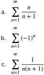

### $②$ Solution

a.The sequence of partial sums $\{S_k\}$ satisfies

$$\begin{aligned}
&S_{1} =\frac{1}{2} \\
&S_{2} =\frac12+\frac23 \\
&S_{3} =\frac{1}{2}+\frac{2}{3}+\frac{3}{4} \\
&S_{4} =\frac12+\frac23+\frac34+\frac45. 
\end{aligned}$$

Notice that each term added is greater than 1/2. As a result,we see that
$$\begin{aligned}
&\text{910} \text{cater tilail 1/2,As a resuit, we see tiat} \\
&S_{1} =\frac{1}{2} \\
&S_{2} =\frac{1}{2}+\frac{2}{3}>\frac{1}{2}+\frac{1}{2}=2\left(\frac{1}{2}\right) \\
&S_{3} =\frac{1}{2}+\frac{2}{3}+\frac{3}{4}>\frac{1}{2}+\frac{1}{2}+\frac{1}{2}=3\left(\frac{1}{2}\right) \\
&S_{4} =\frac{1}{2}+\frac{2}{3}+\frac{3}{4}+\frac{4}{5}>\frac{1}{2}+\frac{1}{2}+\frac{1}{2}+\frac{1}{2}=4\left(\frac{1}{2}\right). 
\end{aligned}$$

From this pattern we can see that $S_{k}>k\left(\frac{1}{2}\right)$ for every integer $k$ . Therefore, $\{S_{k}\}$ is unbounded and consequently, diverges. Therefore, te infinit series $\sum_{n=1}^{\infty}n/(n+1)$ diverges b.The sequence of partial sums $\{S_k\}$ satisfies

$$\begin{aligned}
&S_{1} =-1  \\
&S_{2} =-1+1=0  \\
&S_{3} =-1+1-1=-1  \\
&S_{4} =-1+1-1+1=0. 
\end{aligned}$$

From this pattern we can see the sequence of partial sums is
$$\{S_{k}\}=\{-1,0,-1,0,\ldots\}\:.$$

$$\frac13+\frac14>\frac14+\frac14.$$

Therefore, we condlude that

$$S_4>1+\frac{1}{2}+\left(\frac{1}{4}+\frac{1}{4}\right)=1+\frac{1}{2}+\frac{1}{2}=1+2\left(\frac{1}{2}\right).$$

Using the same idea for $S_{8}$ , we see that

$$\begin{aligned}S_{8}&=1+\frac{1}{2}+\frac{1}{3}+\frac{1}{4}+\frac{1}{5}+\frac{1}{6}+\frac{1}{7}+\frac{1}{8}>1+\frac{1}{2}+\left(\frac{1}{4}+\frac{1}{4}\right)+\left(\frac{1}{8}+\frac{1}{8}+\frac{1}{8}+\frac{1}{8}\right)\\&=1+\frac{1}{2}+\frac{1}{2}+\frac{1}{2}=1+3\left(\frac{1}{2}\right).\end{aligned}$$

From this pattern, we see that $S_{1}=1,S_{2}=1+1/2$ $S_{4}>1+2\left(1/2\right)$ , and $S_{8}>1+3\left(1/2\right).$ More generally, it can be shown that $S_{2j}>1+j(1/2)$ for all $j>1.$ Since $1+j(1/2)\to\infty$ ,we conclude that the sequence $\{S_k\}$ is unbounded and therefore diverges. In the previous section, we stated that convergent sequences are bounded. Consequently, since $\{S_{k}\}$ is unbounded, it diverges. Thus, the harmonic series diverges

### Algebraic Properties of Convergent Series

Since the sum of a convergent infinite series is defined as a limit of a sequence, the algebraic properties for series listed below follow directly from the algebraic properties for sequences.

### Theorem 5.7

### Algebraic Properties of Convergent Series

Let $\sum_{n=1}^\infty a_n$ and $\sum_{n=1}^\infty b_n$ be tneie o

I. Thesres $\sum_{n=1}\left(a_n+b_n\right)$ convere an $\sum_{n=1}^{\infty}\left(a_{n}+b_{n}\right)=\sum_{n=1}^{\infty}a_{n}+\sum_{n=1}^{\infty}b_{n}.$(Sum Ru (e)

1. $\sum_{n=1}\left(a_n-b_n\right)$ conege $\sum_{n=1}^{\infty}\left(a_{n}-b_{n}\right)=\sum_{n=1}^{\infty}a_{n}-\sum_{n=1}^{\infty}b_{n}.$ Doene I or ry e enbe ere $\sum_{n=1}^\infty ca_n$ coveges $\sum_{n=1}^{\infty}ca_{n}=c\sum_{n=1}^{\infty}a_{n}.$ (Coasa ee

### EXAMPLE 5.8

### Using Algebraic Properties of Convergent Series Evaluate

$$\displaystyle\sum_{n=1}^{\infty}\left[\frac{3}{n\left(n+1\right)}+\left(\frac{1}{2}\right)^{n-2}\right].$$

### $②$ Solution

We showed earlier that

$$\sum_{n=1}^{\infty}\frac{1}{n\left(n+1\right)}=1$$

and

$$\sum\limits_{n=1}^{\infty}\left(\frac{1}{2}\right)^{n-1}=2.$$

Since both of those series converge, we can apply the properties of Algebraic Properties of Convergent Series to evaluate

$$\sum_{n=1}^{\infty}\left[\frac{3}{n\left(n+1\right)}+\left(\frac{1}{2}\right)^{n-2}\right].$$

Usinq the sum rule, write

$$\sum_{n=1}^{\infty}\left[\frac{3}{n\left(n+1\right)}+\left(\frac{1}{2}\right)^{n-2}\right]=\sum_{n=1}^{\infty}\frac{3}{n\left(n+1\right)}+\sum_{n=1}^{\infty}\left(\frac{1}{2}\right)^{n-2}.$$

Then,using the constant multiple rule and the sums above,we can conclude that

$$\begin{aligned}
\sum_{n=1}^{\infty}{\frac{3}{n(n+1)}}+\sum_{n=1}^{\infty}{({\frac{1}{2}})}^{n-2}& =3\sum_{n=1}^{\infty}\frac{1}{n(n+1)}+\left(\frac{1}{2}\right)^{-1}\sum_{n=1}^{\infty}\left(\frac{1}{2}\right)^{n-1} \\
&=3\left(1\right)+\left(\frac12\right)^{-1}\left(2\right)=3+2\left(2\right)=7.
\end{aligned}$$

 Ealat 

### Geometric Series

Ageometricseriesis anyseries that we can write in theform

$$a+ar+ar^2+ar^3+\cdots=\sum_{n=1}^\infty ar^{n-1}.$$

Because theratio of each term in thisseries to the previous term is $r$, the number ris called theratio.Werefer to a as the initial term because it is the first term in the series.For example, the series

$$\displaystyle\sum_{n=1}^{\infty}\left(\frac{1}{2}\right)^{n-1}=1+\frac{1}{2}+\frac{1}{4}+\frac{1}{8}+\cdots $$

is a geometricserieswith initial term $a=1$ and ratio $r=1/2$

In qeneral, when does a qeometric series converge? Consider the qeometric series

$$\sum_{n=1}^\infty ar^{n-1}$$

when $a>0.$ Its sequence of partial sums $\{S_k\}$ is given by

$$S_{k}=\sum_{n=1}^{k}ar^{n-1}=a+ar+ar^{2}+\cdots+ar^{k-1}.$$

Consider the case when $r=1.$ In that case

$$S_{k}=a+a\left(1\right)+a(1)^{2}+\cdots+a(1)^{k-1}=ak.$$

Since $a>0$ , we know $ak\rightarrow\infty$ as $k\to\infty$ .Therefore, the sequence of partial sums is unbounded and thus diverges

Consequently, the infinite series diverges for $r=1.$ For $r\neq1$ , to find the limit of $\{S_k\}$, multiply Equation 5.6 by $1-r$ Doing so, we see that

$$\begin{aligned}
(1-r)\:S_{k}& =a\left(1-r\right)\left(1+r+r^{2}+r^{3}+\cdots+r^{k-1}\right) \\
&=a[(1+r+r^{2}+r^{3}+\cdots+r^{k-1})-(r+r^{2}+r^{3}+\cdots+r^{k})] \\
&=a\left(1-r^{k}\right).
\end{aligned}$$

Allthe other terms cancel out

Therefore,

$$S_{k}=\frac{a\left(1-r^{k}\right)}{1-r}\:\mathrm{for}\:r\neq1.$$

From our discussion in the previous section,we know that the geometric sequence pk→ 0 $r^k\to0$ $r^k\to0$ if $|r|<1$ $|r|<1$ $|r|<1$ and that $r^k$ diverges if $|r|>1$ or $r=\pm1.$ Therefore, for $|r|<1,S_{k}\to a/(1-r)$ and we have

$$\sum_{n=1}^{\infty}ar^{n-1}=\frac{a}{1-r}\:\mathrm{if}\:|r|<1.$$

If $|r|\geq1,S_k$ diverges, and therefore

$$\sum_{n=1}^{\infty}ar^{n-1}\text{diverges if}\:|r|\geq1.$$

### Definition

A qeometric series is a series of the form

$$\sum_{n=1}^\infty ar^{n-1}=a+ar+ar^2+ar^3+\cdots.$$

If $|r|<1$ ,the series converges, and

$$\sum_{n=1}^{\infty}ar^{n-1}=\frac{a}{1-r}\:\mathrm{for}\:|r|<1.$$

If $|r|\geq1$ ,the series diverges

Geometric series sometimes appear in slightly different forms. For example, sometimes the index beqins at a value other than $n=1$ or the exponent involves a linear expression for $n$ other than $n-1.$ As long as we can rewrite the series in the form given by Equation 5.5, it is a geometric series. For example, consider the series

$$\sum\limits_{n=0}^{\infty}\left(\frac{2}{3}\right)^{n+2}.$$

To see that this is a geometric series. we write out the first several terms

$$\begin{aligned}
\sum_{n=0}^{\infty}\left({\frac{2}{3}}\right)^{n+2}& =\left(\frac{2}{3}\right)^{2}+\left(\frac{2}{3}\right)^{3}+\left(\frac{2}{3}\right)^{4}+\cdots   \\
&=\frac{4}{9}+\frac{4}{9}\cdot\left(\frac{2}{3}\right)+\frac{4}{9}\cdot\left(\frac{2}{3}\right)^{2}+\cdots.
\end{aligned}$$

We see that the initial term is $a=4/9$ and the ratio is $r=2/3$ .Therefore, the series can be written as

$$\sum_{n=1}^{\infty}\frac{4}{9}\cdot\left(\frac{2}{3}\right)^{n-1}.$$

Since $r=2/3<1$ , this series converges, and its sum is given by

$$\sum_{n=1}^{\infty}\frac{4}{9}\cdot\left(\frac{2}{3}\right)^{n-1}=\frac{4/9}{1-2/3}=\frac{4}{3}.$$

### EXAMPLE 5.9

Determining Convergence or Divergence of a Geometric Series

Determine whether each of the following geometric series converges or diverges, and if it converges, find its sum

a。$\sum_{n=1}^\infty\frac{(-3)^{n+1}}{4^{n-1}}$ b. $\sum_{n=1}^\infty e^{2n}$

### $②$ Solution

a.Writing out the first several terms in the series, we have
$$\begin{aligned}
\sum_{n=1}^{\infty}{\frac{(-3)^{n+1}}{4^{n-1}}}& =\frac{(-3)^{2}}{4^{0}}+\frac{(-3)^{3}}{4}+\frac{(-3)^{4}}{4^{2}}+\cdots \\
&=(-3)^{2}+(-3)^{2}\cdot\left(\frac{-3}{4}\right)+(-3)^{2}\cdot\left(\frac{-3}{4}\right)^{2}+\cdots \\
&=9+9\cdot\left(\frac{-3}{4}\right)+9\cdot\left(\frac{-3}{4}\right)^{2}+\cdots.
\end{aligned}$$

The initial term $a=9$ and theratio $r=-3/4$ Since $|r|=3/4<1$ , the series converges to

b.Writing this series as

$$e^2\sum_{n=1}^\infty\left(e^2\right)^{n-1}$$

we can see that this is a geometric series where $r=e^{2}>1$ . Therefore, the series diverges.

We now turn our attention to a nice application of geometric series. We show how they can be used to write repeating decimals as fractions of integers.

### EXAMPLE 5.10

Use a geometric series to write $3.\overline{26}$ as a fraction of integers

Solution Since $3.\overline{26}=3.262626\ldots$ first we write

$$\begin{aligned}
3.262626...& =3+\frac{26}{100}+\frac{26}{10,000}+\frac{26}{1,000,000}+\cdots \\
&=3+\frac{26}{10^{2}}+\frac{26}{10^{4}}+\frac{26}{10^{6}}+\cdots.
\end{aligned}$$

Ignoring the term 3,the rest of this expresson is a geometric series with initial term $a=26/10^{2}$ and ratio $r=1/10^{2}$ Therefore, the sum of this series is

$$\frac{26/10^2}{1-(1/10^2)}=\frac{26/10^2}{99/10^2}=\frac{26}{99}.$$

Thus,

$$3.262626...=3+\frac{26}{99}=\frac{323}{99}.$$

5.10Write 5.27 as a fraction of integers

## EXAMPLE 5.11

### Chapter Opener: Finding the Area of the Koch Snowflake

Define a sequence of figures $\{F_n\}$ recursively as follows (Figure 5.11). Let $F_0$ be an equilateral triangle with sides of length 1. For $n\geq1$ ,let $F_n$ be the curve created by removing the middle third of each side of $F_{n-1}$ and replacing it with an equilateral triangle pointing outward. The limiting figure as $n\to\infty$ is known as Koch's snowflake.

Figure 5.11 The first four figures, $F_0,F_1,F_2$ and $F_3.$ in the construction of the Koch snowflake

a.Find the length $L_n$ of the perimeter of $F_{n}$ . Evaluate lim $L_{n}$ to find the length of the perimeter of Koch's snowflake. →00

b.Find the area $A_n$ of figure $F_{n}$ . Evaluate lim $A_{n}$ to find the area of Koch's snowflake → 00

## $①$ Solution a. Let $N_n$ denote the number of sides of figure $F_n$ . Since $F_{0}$ is a triangle, $N_{0}=3$ . Let $l_n$ denote thelength of each

side of $F_{n}$ . Since $F_{0}$ is an equilateral triangle with sides of length $l_{0}=1$ , we now need to determine $N_{1}$ and $l_1$ Since $F_{1}$ is created by removing the middle third of each side and replacing that line segment with two line segments,for each side of $F_{0}$ , we get four sides in $F_{1}$ .Therefore, the number of sides for $F_{\mathrm{l}}$ is $N_{1}=4\cdot3$

Since the length of each of these new line segments is 1/3 the length of the line segments in $F_{0}$ ,the length of the line segments for $F_{\mathrm{l}}$ is given by
$$l_1=\frac13\cdot1=\frac13.$$

Similarly, for $F_{2}$ , since the middle third of each side of $F_{\mathrm{l}}$ is removed and replaced with two line segments,the number of sides in $F_{2}$ is given by
$$N_2=4N_1=4(4\cdot3)=4^2\cdot3.$$

Since the length of each of these sides is 1/3 the length of the sides of $F_{1}$ ,the length of each side of figure $F_{2}$ is given by
$$l_2=\frac{1}{3}\cdot l_1=\frac{1}{3}\cdot\frac{1}{3}=\left(\frac{1}{3}\right)^2.$$

More generally, since $F_{n}$ is created by removing the middle third of each side of $F_{n-1}$ and replacing that line gment with two line segments of length $\frac{1}{3}l_{n-1}$ in the shape of an equilateral triangle, we know that $N_{n}=4N_{n-1}$ and $l_{n}=\frac{l_{n-1}}{3}.$ Therefore, the number of sides of figure $F_{n}$ is
$$N_{n}=4^{n}\cdot3$$

and the length of each side is

$$l_n=\left(\frac{1}{3}\right)^n.$$

Therefore, to calculate the perimeter of $F_{n}$, we multiply the number of sides $N_{n}$ and the length of each side $l_n.$ We conclude that the perimeter of $F_{n}$ is given by
$$L_{n}=N_{n}\cdot l_{n}=3\cdot\left(\frac{4}{3}\right)^{n}.$$

Therefore, the length of the perimeter of Koch's snowflake is

$$L=\lim_{n\to\infty}L_{n}=\infty.$$

b.Let $T_{n}$ denote the area of each new triangle created when forming $F_n$ . For $n=0$ $T_{0}$ is the area of the origina equilateral triangle. Therefore, $T_{0}=A_{0}=\sqrt{3}/4$ For $n\geq1$ , since the lengths of the sides of the new triangle are 1/3 the length of the sides of $F_{n-1}$ ,we have
$$T_n=\left(\frac{1}{3}\right)^2T_{n-1}=\frac{1}{9}\cdot T_{n-1}.$$

Therefore, $T_{n}=\left(\frac{1}{9}\right)^{n}\cdot\frac{\sqrt{3}}{4}.$ Since a new triangle is formed on each side of $F_{n-1}$
$$\begin{aligned}
&\text{1}&& \text{1}  \\
&\text{A,}&& =A_{n-1}+N_{n-1}\cdot T_{n}  \\
&&&=A_{n-1}+\left(3\cdot4^{n-1}\right)\cdot\left(\frac19\right)^{n}\cdot\frac{\sqrt{3}}{4} \\
&&&=A_{n-1}+\frac{3}{4}\cdot\left(\frac{4}{9}\right)^{n}\cdot\frac{\sqrt3}{4}.
\end{aligned}$$

Writing out the first few terms $A_{0},A_{1},A_{2}$, we see that

$$\begin{aligned}
&A_{0} =\frac{\sqrt{3}}{4}  \\
&A_{1} =A_{0}+\frac{3}{4}\cdot\left(\frac{4}{9}\right)\cdot\frac{\sqrt{3}}{4}=\frac{\sqrt{3}}{4}+\frac{3}{4}\cdot\left(\frac{4}{9}\right)\cdot\frac{\sqrt{3}}{4}=\frac{\sqrt{3}}{4}\left[1+\frac{3}{4}\cdot\left(\frac{4}{9}\right)\right]  \\
&A_{2} =A_{1}+\frac{3}{4}\cdot\left(\frac{4}{9}\right)^{2}\cdot\frac{\sqrt{3}}{4}=\frac{\sqrt{3}}{4}\left[1+\frac{3}{4}\cdot\left(\frac{4}{9}\right)\right]+\frac{3}{4}\cdot\left(\frac{4}{9}\right)^{2}\cdot\frac{\sqrt{3}}{4}=\frac{\sqrt{3}}{4}\left[1+\frac{3}{4}\cdot\left(\frac{4}{9}\right)+\frac{3}{4}\cdot\left(\frac{4}{9}\right)^{2}\right]. 
\end{aligned}$$

More generally

$$A_n=\frac{\sqrt{3}}{4}\left[1+\frac{3}{4}\left(\frac{4}{9}+\left(\frac{4}{9}\right)^2+\cdots+\left(\frac{4}{9}\right)^n\right)\right].$$

Factoring 4/9 out of each term inside the inner parentheses. we rewrite our expression as
$$A_{n}=\frac{\sqrt{3}}{4}\left[1+\frac{1}{3}\left(1+\frac{4}{9}+\left(\frac{4}{9}\right)^{2}+\cdots+\left(\frac{4}{9}\right)^{n-1}\right)\right].$$

The expression $1+\left(\frac{4}{9}\right)+\left(\frac{4}{9}\right)^{2}+\cdots+\left(\frac{4}{9}\right)^{n-1}$ is a geometricsum.As shown earlie, this sum satisies
$$1+\frac{4}{9}+\left(\frac{4}{9}\right)^2+\cdots+\left(\frac{4}{9}\right)^{n-1}=\frac{1-(4/9)^n}{1-(4/9)}.$$

Substituting this expression into the expression above and simplifving.we conclude tha
$$\begin{aligned}\text{esslon above and simpinying, we}\\A_{n}&=\frac{\sqrt{3}}{4}\left[1+\frac{1}{3}\left(\frac{1-(4/9)^{n}}{1-(4/9)}\right)\right]\\&=\frac{\sqrt{3}}{4}\left[\frac{8}{5}-\frac{3}{5}\left(\frac{4}{9}\right)^{n}\right].\end{aligned}$$

Therefore, the area of Koch's snowflake is

$$A=\lim_{n\to\infty}A_{n}=\frac{2\sqrt{3}}{5}.$$

### ® Analysis

The Koch snowflake is interesting because it has finite area, yet infinite perimeter. Although at first this may seem impossible, recall that you have seen similar examples earlier in the text. For example, consider the region bounded by the curve $y=1/x^{2}$ and the $x$ -axis on the interval $[1,\infty)$ . Since the improper integral

$$\int_1^\infty\frac{1}{x^2}dx$$

converges, the area of this region is finite, even though the perimeter is infinite.

## Telescoping Series

Considerth ses $\sum_{n=1}^{\infty}\frac{1}{n(n+1)}$ W dsused h eie n epe wtn a he ete ee e out the first several partial sums $S_{1},S_{2},...,S_{6}$ and noticing that they are all of the form $S_k=\frac{k}{k+1}$ Here we use different technique to show that this series converges.By using partial fractions, we can write

$$\frac{1}{n(n+1)}=\frac{1}{n}-\frac{1}{n+1}.$$

Therefore, the series can be written as

$$\sum\limits_{n=1}^{\infty}\left[\frac{1}{n}-\frac{1}{n+1}\right]=\left(1-\frac{1}{2}\right)+\left(\frac{1}{2}-\frac{1}{3}\right)+\left(\frac{1}{3}-\frac{1}{4}\right)+\cdots.$$

Writing out the first several terms in the sequence of partial sums $\{S_k\}$, we see that

$$\begin{aligned}
&S_{1} =1-\frac12 \\
&S_{2} =\left(1-\frac12\right)+\left(\frac12-\frac13\right)=1-\frac13 \\
&S_{3} =\left(1-\frac12\right)+\left(\frac12-\frac13\right)+\left(\frac13-\frac14\right)=1-\frac14. 
\end{aligned}$$

In general,

$$S_k=\left(1-\frac{1}{2}\right)+\left(\frac{1}{2}-\frac{1}{3}\right)+\left(\frac{1}{3}-\frac{1}{4}\right)+\cdots+\left(\frac{1}{k}-\frac{1}{k+1}\right)=1-\frac{1}{k+1}.$$

Wenotice that the middle terms canceleach other out.leavina only thefirst andlast terms.In a sense.the serie collapses like aspyglasswith tubes that disappear into each other to shorten the telescope.For thisreason,we call series that has this property a telescoping series. For this series, since $S_{k}=1-1/(k+1)$ and $1/(k+1)\to0$ as $k\to\infty$ the sequence of partial sums converges to 1, and therefore the series converges to 1

## Definition

A telescoping series is a series in which most of the terms cancel in each of the partial sums, leaving only some of the first terms and some of the last terms

For example,any series of the form

$$\displaystyle\sum_{n=1}^{\infty}\left[b_n-b_{n+1}\right]=(b_1-b_2)+(b_2-b_3)+(b_3-b_4)+\cdots $$

is a telescoping series. We can see this by writing out some of the partial sums. In particular, we see that

$$\begin{aligned}
&S_{1} =b_{1}-b_{2} \\
&S_{2} =(b_{1}-b_{2})+(b_{2}-b_{3})=b_{1}-b_{3} \\
&\text{S3} =(b_{1}-b_{2})+(b_{2}-b_{3})+(b_{3}-b_{4})=b_{1}-b_{4}. 
\end{aligned}$$

In general, the kth partial sum of this series is

$$S_{k}=b_{1}-b_{k+1}.$$

Since the kth partial sum can be simplified to the difference of these two terms, the sequence of partial sums $\{S_k\}$ will converge if and only if the sequence $\{b_{k+1}\}$ converges. Moreover, if the sequence. $b_{k+1}$ converges to some finite number B,then the sequence of partial sums converges to $b_{1}-B$ and therefore

$$\sum_{n=1}^{\infty}[b_n-b_{n+1}]=b_1-B.$$

In the next example, we show how to use these ideas to analyze a telescoping series of this form

## EXAMPLE 5.12

## Evaluating a Telescoping Series

Determine whether the telescoping series

$$\sum_{n=1}^{\infty}\left[\cos\left(\frac{1}{n}\right)-\cos\left(\frac{1}{n+1}\right)\right]$$

converges or diverges. If it converges, find its sum.

## $②$ Solution

By writing out terms in the sequence of partial sums, we can see that

$$\begin{aligned}&S_{1}=\quad\cos\left(1\right)-\cos\left(\frac{1}{2}\right)\\&S_{2}=\quad\left(\cos\left(1\right)-\cos\left(\frac{1}{2}\right)\right)+\left(\cos\left(\frac{1}{2}\right)-\cos\left(\frac{1}{3}\right)\right)=\cos\left(1\right)-\cos\left(\frac{1}{3}\right)\\&S_{3}=\quad\left(\cos\left(1\right)-\cos\left(\frac{1}{2}\right)\right)+\left(\cos\left(\frac{1}{2}\right)-\cos\left(\frac{1}{3}\right)\right)+\left(\cos\left(\frac{1}{3}\right)-\cos\left(\frac{1}{4}\right)\right)\\&=\quad\cos\left(1\right)-\cos\left(\frac{1}{4}\right).\end{aligned}$$

In general,

$$S_{k}=\cos{(1)}-\cos{\left(\frac{1}{k+1}\right)}.$$

Since $1/(k+1)\to0$ as $k\to\infty$ and cos $x$ is a continuous function, $\cos(1/(k+1))\to\cos(0)=1.$ Therefore, we conclude that $S_{k}\to\cos\left(1\right)-1.$ The telescoping series converges and the sum is given by

$$\displaystyle\sum_{n=1}^{\infty}\left[\cos\left(\frac{1}{n}\right)-\cos\left(\frac{1}{n+1}\right)\right]=\cos\left(1\right)-1.$$

 1l etermine whther $\sum_{n=1}^\infty\left[e^{1/n}-e^{1/(n+1)}\right]$ converge r diverges fitcoanverges fi tsumns

### STUDENT PROJECT

### Euler's Constant

Wehave show ththe hrmoniesries $\sum_{n=1}^\infty\frac1n$ diverge. er we investiatethe behaior of te partia suim $S_k$ as $k\to\infty$ . In particular, we show that they behave like the natural logarithm function by showing that there exists a constant y such that

$$\sum_{n=1}^k\frac{1}{n}-\ln k\to\gamma\text{as}k\to\infty.$$

This constanty is known as Euler's constant.

1. Let $T_k=\sum_{n=1}^k\frac1n-\ln k$ Evalate $T_{k}$ fr variou aleso h.

2.For $T_k$ as defined in part 1. show that the sequence $\{T_k\}$ converges byusing the following steps. a.Show that the sequence $\{T_k\}$ is monotone decreasing. (Hint: Show that $\ln\left(1+1/k>1/(k+1)\right)$

b.Show that the sequence $\{T_k\}$ is bounded below by zero. (Hint: Express In k as a definite integral.) C.Use the Monotone Convergence Theorem to conclude that the sequence $\{T_k\}$ converges. The limit y is Euler's constant.

3.Now estimate how far $T_{k}$ is from $\gamma$ for a given integer k. Prove that for $k\geq1,0<T_{k}-\gamma\leq1/k$ by using the following steps.

a.Show that In $(k+1)-\ln k<1/k.$ b.Use the result from part a.to show that for any inteaer k
$$T_{k}-T_{k+1}<\frac{1}{k}-\frac{1}{k+1}.$$

C.For any integers $k$ and $j$ such that $j>k$ ,express $T_{k}-T_{j}$ as a telescoping sum by writing
$$T_k-T_j=\begin{pmatrix}T_k-T_{k+1}\end{pmatrix}+\begin{pmatrix}T_{k+1}-T_{k+2}\end{pmatrix}+\begin{pmatrix}T_{k+2}-T_{k+3}\end{pmatrix}+\cdots+\begin{pmatrix}T_{j-1}-T_{j}\end{pmatrix}.$$

Use the result from part b.combined with this telescoping sum to conclude that
$$T_{k}-T_{j}<\frac{1}{k}-\frac{1}{j}.$$

d.Apply the limit to both sides of theinequality in part c.to conclude that
$$T_{k}-\gamma\leq\frac{1}{k}.$$

e.Estimatey to an accuracy of within 0.001

### SECTION 5.2EXERCISES

Using sigma notation, write the following expressions asinfinite series

68. $1-1+1-1+\cdots$ 67. $1+\frac{1}{2}+\frac{1}{3}+\frac{1}{4}+\cdots$ 69.1-+-1+..

70. $\sin1+\sin1/2+\sin1/3+\sin1/4+\cdots$

Compute the first four partial sums $S_1,\ldots,S_4$ for the series having nth term an starting with $n=1$ as follows.

72. $a_n=1/n$ 73.an= sinn/271. $a_n=n$

74. $a_{n}=(-1)^{n}$

In the following exercises, compute the general term $a_n$ of the series with the given partial sum Sn.If the sequence of partial sums converges, find its limit S.

$$-\:\frac{1}{n},n\geq2\quad76.\quad S_{n}=\frac{n(n+1)}{2},n\geq1\quad77.\quad S_{n}=\sqrt{n},n\geq2$$
78. $S_{n}=2-(n+2)/2^{n},n\geq1$

Foreach of the following series,use the sequence ofpartial sums to determine whether the series converges or diverges.

79. $\sum_{n=1}\frac{n}{n+2}$
$$80.\:\sum_{n=1}^{\infty}\left(1-(-1)^n)\right)$$
81+11+2 (Hit Use a partial fraction decomposition like that for
$$\sum_{n=1}^{\infty}\frac{1}{n\left(n+1\right)}.)$$

$$\begin{aligned}&:\:\sum_{n=1}^{\infty}\frac{1}{2n+1}\:(\:Hint:\:\mathrm{Follow}\\&\text{the reasoning for}\sum_{n=1}^{\infty}\frac{1}{n}.)\end{aligned}$$

$$Supposethat\sum_{n=1}^{\infty}a_{n}=1,that\sum_{n=1}^{\infty}b_{n}=-1,thata_{1}=2,andb_{1}=-3.Findthesumoftheindicate$$

$$\sum\limits_{n=1}^{\infty}\left(a_{n}+b_{n}\right)\quad\textbf{84.}\sum\limits_{n=1}^{\infty}\left(a_{n}-2b_{n}\right)\quad\textbf{85.}\sum\limits_{n=2}^{\infty}\left(a_{n}-b_{n}\right)$$

$$\sum_{n=1}^{\infty}(3a_{n+1}-4b_{n+1})$$

State whether the given series converges and explain why

8. ≥ +10 (Hint Rewrte 89. 1 +1 + 1O 

using a change of index.)

87 $\sum_{n=1}\frac{1}{n+1000}\left(Hint:\right.$ Rewrite using a change of index.)

91. 1+ + + + \$+92. 1-+- +

90. $1+\frac{e}{\pi}+\frac{e^{2}}{\pi^{2}}+\frac{e^{3}}{\pi^{3}}+\cdots$

Fora. a oow, ie he sa a eeri erles e o $\sum_{n=1}ar^n.$ Stat hether he seres coverges andi it does, find the value of an

95. $a_{\mathrm{l}}=10$ and $a_{n}/a_{n+1}=10$ for $n\geq1$

93. $a_{\mathrm{l}}=-1$ and $a_{n}/a_{n+1}=-5$ 94. $a_{1}=2$ and $a_{n}/a_{n+1}=1/2$ for $n\geq1$

for $n\geq1$

96. $a_{1}=1/10$ and $a_n/a_{n+1}=-10$ for $n\geq1$

Use theidenty $\frac1{1-y}=\sum_{n=0}y^n$ t expr t to a eri eres ticaed 

98. $\frac{\sqrt{x}}{1-x^{3/2}}$ in $\sqrt{x}$

97. $\frac{x}{1+x}$ in $x$

99.+i- in sinx

100. $\sec^2x$ in $\sin x$

Evaluate the following telescoping series or state whether the series diverges

10 (-T)

10. 2-11

10M-

104. (cin-s01

Express the following series as a telescoping sum and evaluate its nth partial sum

107. m(+

$$\sum\limits_{n=1}^{\infty}\ln\left(\frac{n}{n+1}\right)$$

10. 3 2*+1) Hit Factor denominator and use partial fractions.)

108. $\sum_{n=1}^{\infty}\frac{(n+2)}{n\left(n+1\right)2^{n+1}}\left(Hint:\right.$ Look at 1/(n2).)

Ageneral telescoping series is one in which all but the first few terms cancelout after summing a qiven number oi successive terms

109.Let

110. $a_{n}=f\left(n\right)-f\left(n+1\right)-f\left(n+2\right)+f\left(n+3\right)$,

inwhich $f\left(n\right)\to0$ as $n\to\infty$ ind $\sum_{n=1}a_n$

$a_{n}=f\left(n\right)-2f\left(n+1\right)+f\left(n+2\right)$ in which $f\left(n\right)\to0$ as $n\to\infty$ .Find
$$\sum_{n=1}^\infty a_n.$$

111. Suppose that
$$a_n=c_0f\left(n\right)+c_1f\left(n+1\right)+c_2f\left(n+2\right)+c_3f\left(n+3\right)+c_4f\left(n+4\right),$$
where $f(n)\to0$ as $n\to\infty$ .Find a condition on the coefficients $c_0,\ldots,c_4$ that make this a general telescoping series.

$$\begin{aligned}&2.\quad\mathrm{Evaluate}\sum_{n=1}^{\infty}\frac{1}{n\left(n+1\right)\left(n+2\right)}\quad113.\quad\mathrm{Evaluate}\sum_{n=2}^{\infty}\frac{2}{n^{3}-n}.\\&(Hint:\\&\frac{1}{n(n+1)(n+2)}=\frac{1}{2n}-\frac{1}{n+1}+\frac{1}{2(n+2)}\Big)\end{aligned}$$

114.Find a formula for $\sum_{n=1}\frac{1}{n\left(n+N\right)}$ Fre $N$ 8

115. [T] Define a sequence
$$t_{k}=\sum_{n=1}^{k-1}(1/k)-\ln k.$$
the graph of $1/x$ to verify that $t_k$ is increasing. Plot $t_k$ for $k=1\ldots100$ and state whether it appears that the sequence converges.

116. [T] Suppose that $N$ equal uniform rectanqular blocks are stacked one on top of the other, allowing for some overhang. Archimedes'law of the lever implies that the stack of $N$ blocks is stable as long as the center of mass of the top $(N-1)$ blocks lies at the edge of the bottom block.Let $X$ denote the position of the edge of the bottom block,and think of its position as relative to the center of the next-to-bottom block. This implies that $(N-1)x=\left(\frac{1}{2}-x\right)$ or $x=1/(2N)$ Use this expression to compute the maximum overhang (the position of the edge of the top block over the edge of the bottom block.) See the following figure.

Each of the following infinite series converges to the given multiple of or 1/

In each case, find the minimum value of N such that the Nth partial sum of the series accurately approximates the left hand side to the given number of decimal places, and give the desired approximate value.Up to 15 decimals place =3.141592653589793..

117.m $\pi=-3+\sum_{n=1}^{\infty}\frac{n2^{n}n!^{2}}{(2n)!}$ 18.m

error 0.0001

$$\begin{aligned}&\frac{\pi}{2}=\sum_{k=0}^{\infty}\frac{k!}{(2k+1)!!}=\sum_{k=0}^{\infty}\frac{2^{k}k!^{2}}{(2k+1)!},\\&\text{error}<10^{-4}\end{aligned}$$

119.[T]
$$\begin{aligned}&\frac{9801}{2\pi}=\frac{4}{9801}\sum_{k=0}^{\infty}\frac{(4k)!(1103+26390k)}{(k!)^{4}396^{4k}},&&\frac{1}{12\pi}=\sum_{k=0}^{\infty}\frac{(-1)^{k}\:(6k)!\:(13591409+545140134k)}{(3k)\:!(k!)^{3}\:640320^{3k+3/2}},\\&\mathrm{error}<10^{-12}\end{aligned}$$

## 120.[T]

122. [T] Find the probability that a fair coin is flipped a multiple of three times before coming up heads.

123.[T] Find the probability that a fair coin will come up heads for the second time after an even number of flips.

121. [T] A fair coin is one that has probability 1/2 of coming up heads when flipped. a.What is the probability that a fair coin will come up tails $n$ times in arow? b.Find the probability that a coin comes up heads for the first time on the last of an even number of coin flips.

124.rT1Find a series that expresses the probability that a fair coin will come up heads for the second time on a multiple of three flips.

125.[T] The expected number of times that a fair coin will come up heads is defined as the sum over $n=1,2,\ldots$ of n times the probability that the coin will come up heads exactly n times in a row or $n/2^{n+1}.$ Compute the expected number of consecutive times that a fair coin will come up heads.

126.[T] A person deposits \$10 at the beginning of each quarter into a bank account that earns $4\%$ annual interest compounded quarterly (four times a year). a.Show that the interest accumulated after n quarters is $\dot{\$}10\left(\frac{1.01^{n+1}-1}{0.01}-n\right)$ b.Find the first eight terms of the sequence. C.How much interest has accumulated after 2 years?

129. Suppose that $a_n\geq0$ isa sequence of numbers Explain why the sequence of partial sums of $a_{r}$ is increasing.

127. [T] Suppose that the amount of a drug in a patient's system diminishes by a multiplicative factor $r<1$ each hour. Suppose that a new dose is administered every $N$ hours. Find an expression that gives the amount A (n) in the patient's system after n hours for each n in terms of the dosage d and the ratio r. (Hint: Write $n=mN+k$ where $0\leq k<N$ ,and sum over values from the different doses administered.)

128. [T] A certain drug is effective for an average patient only if there is at least 1 mg per kg in the patient's system, while it is safe only if there is at most 2 mg per kg in an average patient's system. Suppose that the amount in a patient's system diminishes by a multiplicative factor of 0.9 each hour after a dose is administered. Find the maximum interval $N$ of hours between doses, and corresponding dose range d (in mg/kg) for this $N$ that will enable use of the drug to be both safe and effective in the long term. 131. [T] Suppose that

$a_{\mathrm{l}}=S_{\mathrm{l}}=1$ and that, for given numbers $S>1$ and $0<k<1$ ,one defines $a_{n+1}=k(S-S_{n})$ and $S_{n+1}=a_{n+1}+S_{n}$ Does $S_n$ converge? If so, to what? (Hint: First argue that $S_n<S$ for all $n$ and $S_n$ is increasing.)

130. [T] Suppose that $a_n$ is a sequence of positive numbers and the sequence $S_n$ of partial sums of $a_n$ is bounded above. Expain why $\sum_{n=1}a_n$ converges. Does the conclusion remain true if we remove the hypothesis $a_n\geq0?$

132.[T] A version of von Bertalanffy growth can be used to estimate the age of an individual in a homogeneous species from its length if the annual increase in year $n+1$ satisfies $a_{n+1}=k(S-S_{n})$ ,with $S_{n}$ as the length at year n, $S$ as a limiting length and $k$ as a relative growth constant. If $S_{\mathrm{l}}=3$ $S=9$ ,and $k=1/2$ numerically estimate the smallest value of n such that $S_{n}\geq8$ Note that $S_{n+1}=S_{n}+a_{n+1}$ . Find the corresponding n when $k=1/4$

134.[T]Find thelenqth of the dashed ziqi35.[T]Find the totallenqthof the dashed zag path in the following figure

 path in the following figure

136. [T] The Sierpinski triangle is obtainet37. [T] The Sierpinski gasket is obtained by dividing the unit square into nine equal sub-squares, removing the middle square,then doing the same at each stage to the remaining sub squares. The figure shows the remaining set after four iterations Compute the total area removed after $N$ stages,and compute the lenqth the totalperimeter of the remaining set after $N$ stages

from a triangle by deleting the middle fourth as indicated in the first step, by deleting the middle fourths of the remaining three congruent. triangles in the second step, and in general deleting the middle fourths of the remaining triangles in each successive step. Assuming that the oriqinal triangle is shown in the figure, find the areas of the remaining parts of the original triangle after $N$ steps and find the total lengthof all of the boundary triangles after $N$ steps.

# 5.3 The Divergence and Integral Tests.

### Learning Objectives

5.3.1 Use the divergence test to determine whether a series converges or diverges. 5.3.2 Use the integral test to determine the convergence of a series. 5.3.3 Estimate the value of a series by finding bounds on its remainder term.

In the previous section, we determined the convergence or divergence of several series by explicitly calculating the limit of the sequence of partial sums $\{S_k\}$ In practice, explicitly calculating this limit can be difficult or impossible. Luckily several tests exist that allow us to determine convergence or divergence for many types of series. In this section, we discuss two of these tests: the divergence test and the integral test. We will examine several other tests in the rest of this chapter and then summarize how and when to use them

## Divergence Test

A series $\sum_{n=1}^\infty a_n$ being convergen i guialen t th ovenene o the euence f atia sumn $(S_k$ )as $k\to\infty$

To verify this, notice that from the algebraic properties,

$$\lim_{k\to\infty}a_{k}=\lim_{k\to\infty}(S_{k}-S_{k-1})=\lim_{k\to\infty}S_{k}-\lim_{k\to\infty}S_{k-1}=S-S=0.$$

Therefore ifrt $\sum_{n=1}a_n$ converes thenth ter m $a_{n}\to0$ as $n\to\infty$ . An impotan osequence f tis actisthe folowinn statement:

$$\mathrm{If}\:a_n\to0\:\mathrm{as}\:n\to\infty,\sum_{n=1}^{\infty}a_n\:\mathrm{diverges}.$$

This test is known as the divergence test because it provides a way of proving that a series diverges.

### Theorem 5.8

### Divergence Test

If $\lim a_n=c\neq0$ or $\lim a_n$ doesnt exsthen theseries a dvrges H→00 →00

It is important to note that the converse of this theorem is not true. That is, if $\lim a_n=0$ , we cannot make any

月→00

concsinabuth overgene $\sum_{n=1}a_n$ For edaple $\lim\left(1/n\right)=0$ bu th hamoni ere $\sum_{n=1}^\infty1/n$ dieres

In this section and the remaining sections of this chapter, we show many more examples of such series. Consequently although we can use the divergence test to show that a series diverges, we cannot use it to prove that a series converges. Specifically, if $a_n\to0$ ,the divergence test is inconclusive.

## EXAMPLE 5.13

### Using the divergence test

For each of the following series, apply the divergence test. If the divergence test proves that the series diverges, state so Otherwise, indicate that the divergence test is inconclusive.

### $②$ Solution

a.Since $n/\left(3n-1\right)\to1/3\neq0$ , by the divergence test, we can conclude that

diverges. b.Since $1/n^3\to0$ , the divergence test is inconclusive.

C.Since $e^{1/n^2}\to1\neq0$ , by the divergence test, the series

$$\sum_{n=1}^\infty e^{1/n^2}$$

diverges.

 1 hatdes h dierenc te tel u aboutheseles cos/lirs

### Inteqral Test

In the previous section, we proved that the harmonic series diverges by looking at the sequence of partial sums $\{S_k\}$ and showing that. $S_{2k}>1+k/2$ for all positive integers $k$ . In this section we use a different technique to prove the divergence of the harmonic series. This technique is important because it is used to prove the divergence or convergence of many other series. This test, called the integral test, compares an infinite sum to an improper integral It is important to note that this test can only be applied when we are considering a series whose terms are all positive.

To illustrate how the integral test works, use the harmonic series as an example. In Figure 5.12, we depict the harmonic series by sketching a sequence of rectangles with areas 1, 1/2, 1/3, 1/4,... along with the function $f(x)=1/x.$ Fromthe graph, we see that

$$\begin{aligned}\sum_{n=1}^{k}\frac{1}{n}&=1+\frac{1}{2}+\frac{1}{3}+\cdots+\frac{1}{k}>\int_{1}^{k+1}\frac{1}{x}dx.\end{aligned}$$

Therefore, for each $k$ , the kth partial sum $S_{k}$ satisfiesd

$$S_k=\sum_{n=1}^k\frac{1}{n}>\left.\int_1^{k+1}\frac{1}{x}dx=\ln x\right|_1^{k+1}=\ln(k+1)-\ln(1)=\ln(k+1).$$

Since $\lim\ln(k+1)=\infty$ ,we see that the sequence of partial sums $\{S_{k}\}$ is unbounded. Therefore,. $\{S_k\}$ diverges, and k→00

Consqgueny t eree $\sum_{n=1}^\infty\frac1n$ alo vere

Figure 5.12 The sum of the areas of the rectangles is greater than the area between the curve $f(x)=1/x$ and the $x$ -axis for $x\geq1.$ Since the area bounded by the curve is infinite (as calculated by an improper integral), the sum of the areas of the rectangles is also infinite

No consier teseres $\sum_{n=1}1/n^2$ Wesho hoa nitegralcan euse to rovetha thisere converges n igure 5.13,we sketch a sequence of rectangles with areas $1,1/2^2,1/3^2,\ldots$ along with the function $f(x)=1/x^{2}$ .From the graph we see that

$$\sum_{n=1}^{k}\frac{1}{n^{2}}=1+\frac{1}{2^{2}}+\frac{1}{3^{2}}+\cdots+\frac{1}{k^{2}}<1+\int_{1}^{k}\frac{1}{x^{2}}dx.$$

Therefore, for each $k$ the kth partial sum $S_{k}$ satisfies

$$S_k=\sum_{n=1}^k\frac{1}{n^2}<1+\int_1^k\frac{1}{x^2}dx=\left.1-\frac{1}{x}\right|_1^k=1-\frac{1}{k}+1=2-\frac{1}{k}<2.$$

We conclude that the sequence of partial sums $\{S_{k}\}$ is bounded. We also see that $\left|S_k\right\}$ is an increasing sequence

$$S_{k}=S_{k-1}+\frac{1}{k^{2}}\:\mathrm{for}\:k\geq2.$$

Since $\{S_k\}$ is increasing and bounded, by the Monotone Convergence Theorem, it converges. Therefore, the series Sione

Figure 5.13 The sum of the areas of the rectangles is less than the sum of the area of the first rectangle and the area between the curve $f(x)=1/x^2$ and the $x$ axis for $x\geq1.$ Since the area bounded by the curve is finite, the sum of the areas of the rectangles is also finite

We can extend thisidea toprove conergence ordivergence formany iferet series supose $\sum_{n=1}^\infty a_n$ is a series with positive terms $a_{n}$ such that there exists a continuous, positive, decreasing function $f$ where $f\left(n\right)=a_{n}$ for al positive integers. Then, as in Figure 5.14(a), for any integer $k$ , the kth partial sum $S_k$ satisfies

$$S_k=a_1+a_2+a_3+\cdots+a_k<a_1+\int_1^kf(x)dx<a_1+\int_1^\infty f(x)dx.$$

Threfore f $\int _{1}^{\infty }f( x)$ $dx$ converges, the the eqce prtia s $\{S_k\}$ is bounded Since $\{S_k\}$ is an increasing sequence, if it is also a bounded sequence, then by the Monotone Convergence Theorem, it converges. We conclude that if $\int_{1}^{\infty}f\left(x\right)dx$ convergs, hen theseres $\sum_{n=1}^\infty a_n$ asea integer $k$ , the kth partial sum $S_k$ satisfies
$$S_k=a_1+a_2+a_3+\cdots+a_k>\int_1^{k+1}f(x)dx.$$

$\operatorname*{If}_{k\to\infty}\int_{1}^{k+1}f(x)dx=\infty$ then $\{S_k\}$ sas $\sum_{n=1}a_{n}$

alo vere e oneue ha $\int_{1}^{\infty}f(x)dx$ diverges hen $\sum_{n=1}a_n$ dierges

Figure 5.14 (a) If we can inscribe rectangles inside a region bounded by a curve $y=f(x)$ and the $x$ axis,and the area bounded by those curves for $x\geq1$ is finite, then the sum of the areas of the rectangles is also finite. (b) If a set of rectangles circumscribes the region bounded by $y=f\left(x\right)$ andthe $x$ axis for $x\geq1$ and the region has infinite area, then the sum of the areas of the rectangles is also infinite

### Theorem 5.9

### Integral Test Supos S nis aseresithpotveterms $a_n$ Suppose her eis uncti $f$ and a psi integer $N$ such hr

the following three conditions are satisfied:.

i. $f$ is continuous ii. $f$ is decreasing, and ill。$f(n)=a_n$ for all integers $n\geq N$ Then

$$\sum_{n=1}^{\infty}a_{n}\mathrm{and}\int_{N}^{\infty}f\left(x\right)dx$$

both converge or both diverge (see Fiqure 5.14)

Athough onverene o $\int _{N}^{\infty }f( x)$ $dx$ imples onvergeceotheate eie $\sum_{n=1}a_n$ .tde etatesale of the integral and the series are the same. They may be different, and often are. For example

$$\sum\limits_{n=1}^{\infty}\left(\frac{1}{e}\right)^n=\frac{1}{e}+\left(\frac{1}{e}\right)^2+\left(\frac{1}{e}\right)^3+\cdots $$

is a geometricseries with initial term $a=1/e$ and ratio $r=1/e$ , which converges to

$$\frac{1/e}{1-(1/e)}=\frac{1/e}{(e-1)/e}=\frac{1}{e-1}.$$

 However the eated integral $\int_{1}^{\infty}(1/e)^xdx$ satsfes

$$\int_{1}^{\infty}\left(\frac{1}{e}\right)^{x}dx=\int_{1}^{\infty}e^{-x}dx=\lim_{b\to\infty}\int_{1}^{b}e^{-x}dx=\left.\lim_{b\to\infty}-e^{-x}\right|_{1}^{b}=\lim_{b\to\infty}\left[-e^{-b}+e^{-1}\right]=\frac{1}{e}.$$

### EXAMPLE 5.14

### Usinq the Inteqral Test

For each of the following series, use the integral test to determine whether the series converges or diverges. Assume that all conditions for the integral test are met.

a $\sum_{n=1}1/n^3$ b. $\sum_{n=1}^\infty1/\sqrt{2n-1}$

### $②$ Solution

a. Compare

$$\sum_{n=1}^{\infty}\frac{1}{n^{3}}\:\mathrm{and}\:\int_{1}^{\infty}\frac{1}{x^{3}}dx.$$

We have

$$\int_{1}^{\infty}\frac{1}{x^{3}}dx=\lim\limits_{b\to\infty}\int_{1}^{b}\frac{1}{x^{3}}dx=\lim\limits_{b\to\infty}\left[-\frac{1}{2x^{2}}\Big|_{1}^{b}\right]=\lim\limits_{b\to\infty}\left[-\frac{1}{2b^{2}}+\frac{1}{2}\right]=\frac{1}{2}.$$

Thus the in gra $\int_{1}^{\infty}1/x^3dx$ convere, an thereorese de th e e

$$\sum_{n=1}^{\infty}\frac1{n^3}.$$

b. Compare

$$\sum_{n=1}^{\infty}\frac{1}{\sqrt{2n-1}}\:\mathrm{and}\:\int_{1}^{\infty}\frac{1}{\sqrt{2x-1}}dx.$$

Since

$$\begin{gathered}
\int_{1}^{\infty}{\frac{1}{\sqrt{2x-1}}}dx =\lim_{b\to\infty}\int_{1}^{b}\frac{1}{\sqrt{2x-1}}dx=\lim_{b\to\infty}\sqrt{2x-1}\Bigg|_{1}^{b} \\
=\lim_{b\to\infty}\left[\sqrt{2b-1}-1\right]=\infty, 
\end{gathered}$$

th integral $\int _{1}^{\infty }1/ \sqrt {2x- 1}$ $dx$ diverges an therefore

$$\sum_{n=1}^\infty\frac1{\sqrt{2n-1}}$$

 diverges.

### The p-Series

Th harmoni eres $\sum_{n=1}^\infty$ I/n an theseres $\sum_{n=1}^\infty1/n^2$ ae oth erampleso e o ere aled $p$ seres

### Definition

For any real number p,the series

$$\sum_{n=1}^\infty\frac1{n^p}$$

is called a p-series.

We know the $\rho$ series converges if. $p=2$ and diverges if $p=1.$ What about other values of. $p?$ In general, it is difficult,if not impossible, to compute the exact value of most $P$ -series. However, we can use the tests presented thus far to prove whether a $p$ series converges or diverges..

$p<0$ ,then $1/n^p\to\infty$ , and if $p=0$ ,then $1/n^p\to1.$ Therefore, by the divergence test

$$\sum_{n=1}^{\infty}1/n^p\text{diverges if}p\leq0.$$

If $p>0$ ,then $f(x)=1/x^{p}$ is a positive, continuous, decreasing function. Therefore, for $p>0$ , we use the integral test comparing

$$\sum_{n=1}^{\infty}\frac{1}{n^{p}}\:\mathrm{and}\:\int_{1}^{\infty}\frac{1}{x^{p}}dx.$$

We have already considered the case when $p=1.$ Here we consider the case when $p>0,p\neq1.$ For this case,
$$\int_{1}^{\infty}\frac{1}{x^{p}}dx=\lim_{b\to\infty}\int_{1}^{b}\frac{1}{x^{p}}dx=\lim_{b\to\infty}\left.\frac{1}{1-p}x^{1-p}\right|_{1}^{b}=\lim_{b\to\infty}\frac{1}{1-p}\left[b^{1-p}-1\right].$$

Because

$$b^{1-p}\to0\:\mathrm{if}\:p>1\:\mathrm{and}\:b^{1-p}\to\infty\:\mathrm{if}\:p<1,$$

we conclude that

$$\int_{1}^{\infty}\frac{1}{x^{p}}dx=\left\{\begin{array}{l}{\frac{1}{p-1}\:\mathrm{if}\:p>1}\\{\infty\:\mathrm{if}\:p\leq1}\end{array}\right..$$

Therefore, $\sum_{n=1}^\infty1/n^p$ converges i $p>1$ and divergesift $0<p<1$ In summary,

$$\sum\limits_{n=1}^{\infty}\frac{1}{n^p}\left\{\begin{array}{l}\text{converges if}p>1\\\text{diverges if}p\leq1\end{array}\right..$$

### EXAMPLE 5.15

### Testing for Convergence of p-series

For each of the following series, determine whether it converges or diverges.

a. $\sum_{n=1}^\infty\frac1{n^4}$ b. $\sum_{n=1}^\infty\frac{1}{n^{2/3}}$

Solution

a. This is a $\rho$ series with $p=4>1$ , so the series converges b.Since $p=2/3<1$ , the series diverges..

 5.14Doeste eres $\sum_{n=1}^\infty\frac1{n^{5/4}}$ converg o vergee

### Estimating the Value of a Series.

Sup $\sum_{n=1}a_n$ Conge e e e e e approximate tht sum usin any init sui $\sum_{n=1}^Na_n$ where $N$ i any posiveintger he uestio e adre herei, i convergen eres $\sum_{n=1}^\infty a_n$ ho oodi t apreinati $\sum_{n=1}^Na_n?$ More pecical,i e e

$$R_N=\sum_{n=1}^{\infty}a_n-\sum_{n=1}^{N}a_n$$

be the remainder when the sum of an infinite series is approximated by the Nth partial sum, how large is $R_{N}?$ For some types of series, we are able to use the ideas from the integral test to estimate $R_{N}$

### Theorem 5.10

### Remainder Estimate from the Inteqral Test

Suppose $\sum_{n=1}^\infty a_n$ i a ce ere th ive e te x futio $f$ Satisying the following three conditions

i. $f$ is continuous, ii。$f$ is decreasing, and ili. $f(n)=a_n$ for all integers $n\geq1$

Let $S_N$ bethe Nh partial sum of $\sum_{n=1}^\infty a_n$ . For all ositie integers $N$

$$S_N+\int_{N+1}^{\infty}f\left(x\right)dx<\sum_{n=1}^{\infty}a_{n}<S_{N}+\int_{N}^{\infty}f\left(x\right)dx.$$

In thr ords theremaindee $R_{N}=\sum_{n=1}^{\infty}a_{n}-S_{N}=\sum_{n=N+1}^{\infty}a_{n}$ Satisie th felosin estiaaea

$$\int_{N+1}^{\infty}f(x)dx<R_{N}<\int_{N}^{\infty}f(x)dx.$$

This is known as the remainder estimate

We illustrate Remainder Estimate from the Integral Test in Fiqure 5.15. In particular, by representing the remainde $R_{N}=a_{N+1}+a_{N+2}+a_{N+3}+\cdots$ as the sum of areas of rectangles,we see that the area of those rectangles is

boundedabove by $\int_{N}^{\infty}f\left(x\right)dx$ and bounded below by $\int_{N+1}^{\infty}f\left(x\right)dx$ In ther words

$$R_{N}=a_{N+1}+a_{N+2}+a_{N+3}+\cdots>\int_{N+1}^{\infty}f(x)\:dx$$

and

$$R_{N}=a_{N+1}+a_{N+2}+a_{N+3}+\cdots<\int_{N}^{\infty}f(x)\:dx.$$

We conclude that

$$\int_{N+1}^{\infty}f\left(x\right)dx<R_{N}<\int_{N}^{\infty}f\left(x\right)dx.$$

Since

$$\sum_{n=1}^\infty a_n=S_N+R_N,$$

where $S_{N}$ is the Nth partial sum, we conclude that

Figure 5.15 Given a continuous, positive, decreasing function $f$ and a sequence of positive terms $a_{n}$ such that $a_{n}=f(n)$

foral postie iteere, e tearea $a_{N+1}+a_{N+2}+a_{N+3}+\cdots<\int_{N}^{\infty}f\left(x\right)dx$, or b) th ara

aN+1 + aN+2 + aN+3 + >+ (x) dx. Therefore, the integal is ether an overestimate or an underestimate of the error.

### EXAMPLE 5.16

### Estimating the Value of a Series

Consider the eries $\sum_{n=1}^\infty1/n^3$ a. Calulate $S_{10}=\sum_{n=1}^{10}1/n^{3}$ and estimate the eror

b. Determine the least value of. $N$ necessary such that $S_{N}$ will estimate . 1/n3 to within 0.001

a.Using a calculating utility, we have

$$S_{10}=1+\frac{1}{2^{3}}+\frac{1}{3^{3}}+\frac{1}{4^{3}}+\cdots+\frac{1}{10^{3}}\approx1.19753.$$

By the remainder estimate, we know

$$R_N<\int_N^\infty\frac{1}{x^3}dx.$$

We have

$$\int_{10}^{\infty}\frac{1}{x^{3}}dx=\lim\limits_{b\to\infty}\int_{10}^{b}\frac{1}{x^{3}}dx=\lim\limits_{b\to\infty}\left[-\frac{1}{2x^{2}}\right]_{N}^{b}=\lim\limits_{b\to\infty}\left[-\frac{1}{2b^{2}}+\frac{1}{2N^{2}}\right]=\frac{1}{2N^{2}}.$$

Therefore, the error is $R_{10}<1/2(10)^{2}=0.005$ b.Find $N$ such that $R_{N}<0.001$ . In part a. we showed that $R_{N}<1/(2N^{2})$ . Therefore, the remainder $R_{N}<0.001$ as

long as $1/(2N^{2})<0.001$ . That is, we need $2N^{2}>1000$ .Solving this inequality for $N$ ,we see that we need $N>22.36$ To ensure that the remainder is within the desired amount, we need to round up to the nearest integer. Therefore, the minimum necessary value is $N=23$

For $\sum_{n=1}^\infty\frac1{n^4}$, Calclate s andestimate the eror R

### SECTION 5.3 EXERCISES

For each of the following series,if the divergence test applies, either state that lim an does not exist or find lim an.I

the divergence test does not apply, state why

138. $a_n=\frac{n}{n+2}$ 139. $a_n=\frac{n}{5n^2-3}$ 140. $a_{n}=\frac{n}{\sqrt{3n^{2}+2n+1}}$

143. $a_n=\frac{2^n}{3^{n/2}}$ 141. $a_{n}=\frac{(2n+1)(n-1)}{(n+1)^{2}}$ 142. $a_{n}=\frac{(2n+1)^{2n}}{\left(3n^{2}+1\right)^{n}}$

145. $a_{n}=e^{-2/n}$ 144. $a_n=\frac{2^n+3^n}{10^{n/2}}$ 146. $a_{n}=\cos n$

149. $a_{n}=\left(1-\frac{1}{n}\right)^{2n}$ 148. $a_n=\frac{1-\cos^2(1/n)}{\sin^2(2/n)}$ 147. $a_n=\tan n$ 151. $a_n=\frac{(\ln n)^2}{\sqrt{n}}$

150. $a_n=\frac{\ln n}n$

### State whether the given p-series converges

1. 16.

19.2

155. $\sum_{n=1}\frac{1}{\sqrt[3]{n^4}}$

Use the integral test to determine whether thefollowing sums converge

160.

158. $\sum_{n=1}\frac{1}{\sqrt{n+5}}$

12 2

161. $\sum_{n=1}\frac{n}{1+n^{2}}$

8

14. $\sum_{n=2}^{\infty}\frac{1}{n\ln^{2}n}$

Express the following sums asp-series and determine whether each converges

160. 22-

166. 3-ln (Hint: n = /nn3))

165. 2-ln (Hint: 2-ln= 1/ln2)

1683-2m

$$\begin{aligned}mate\:R_{N}&\leq\int_{N}^{\infty}f(t)dt\:to\:find\:a\:bound\:for\:the\:remainder\:R_{N}\:=\:\sum_{n=1}^{\infty}a_{n}-\sum_{n=1}^{N}a_{n}\:where\:a_{n}\:=\:f(n).\\&170.\sum_{n=1}^{1000}\frac{1}{n^{3}}171.\sum_{n=1}^{1000}\frac{1}{1+n^{2}}\end{aligned}$$

$$.\sum_{n=1}^{1000}\frac{1}{n^{2}}$$

12 $\sum_{n=1}^{100}n/2^n$

[m Find themimum valu FN such tha theremainderestimate JI+ RN J guarates that a.

s e

175. $a_n=\frac{1}{n^{1.01}}$ ,error $<10^{-4}$

173. $a_{n}=\frac{1}{n^{2}}$ ,error $<10^{-4}$ 176. $a_n=\frac{1}{n\ln^2n}$ ,error $<10^{-3}$

174. $a_n=\frac{1}{n^{1.1}}$ ,error $<10^{-4}$ 177. $a_n=\frac{1}{1+n^2}$ ,error $<10^{-3}$

In the following exercises, find a value of N such that $R_N$ is smaller than the desired error. Compute the corresponding sum$\sum_{n=1}^Na_n$ aer 

186.[T] Complete sampling with replacement, sometimes called the coupon collector's problem, is phrased as follows: Suppose you have $N$ unique items in a bin. At each step, an item is chosen at random, identified, and put back in the bin. The problem asks what is the expected number of steps $E\left(N\right)$ that it takes to draw each unique item at least once. It turns out that $E\left(N\right)=N$ $H_{N}=N\left(1+\frac{1}{2}+\frac{1}{3}+\cdots+\frac{1}{N}\right)$ Find $E\left(N\right)$ for $N=10,20$ ,and 50

185.In certain applications of probability, such as the so called Watterson estimator for predicting mutation rates in population qenetics, it is important to have an accurate estimate of the number $H_{k}=\left(1+\frac{1}{2}+\frac{1}{3}+\cdots+\frac{1}{k}\right)$ Recall that $T_{k}=H_{k}-\ln k$ is decreasing. Compute $T=\lim T_k$ to four decima →00 places. (Hint:
$$\frac{1}{k+1}<\int_{k}^{k+1}\frac{1}{x}dx.)$$

187. [T] The simplest way to shuffle cards is to take the top card and insert it at a random place in the deck called top random insertion, and then repeat. We will consider a deck to be randomly shuffled once enough top random insertions have been made that the card originally at the bottom has reached the top and then been randomly inserted.If the deck has r cards, then the probability that the insertion will be below the card initially at the bottom (call this card B) is 1/n. Thus the expected number of top random insertions before $B$ is no longer at the bottom is n.Once one card is below $B$ ,there are two places below $B$ and the probability that a randomly inserted card will fall below $B$ is $2/n$ The expected number of top random insertions before this happens is $n/2$ . The two cards below $B$ are now in random order. Continuing this way, find a formula for the expected number of top random insertions needed to consider the deck to be randomly shuffled 190. [T] Use the remainder

estimate and integration by parts to approximate

00 $\sum_{n=1}n/e^n$ wthi anerorn smaller than 0.0001

189.Show that for the remainder estimate to apply on $[N,\infty)$ it is sufficient that $f\left(x\right)$ be decreasing on $[N,\infty)$ ,but $f$ need not be decreasing on $[1,\infty)$

188. Suppose a scooter can travel $100km$ on a full tank of fuel. Assuming that fuel can be transferred from one scooter to another but can only be carried in the tank,present a procedure that will enable one of the scooters to travel $100H_N$ km, where $H_{N}=1+1/2+\cdots+1/N$

192.[T] Suppose a computer 193.[T] A fast computer can 191. Does $\sum_{n=2}\frac{1}{n(\ln n)^p}$ can sum one million sum one million terms converge if $p$ is large terms per second of the per second of the enough? If so, for which divergent series. diveren eri $\sum_{n=1}^{N}\frac{1}{n}.$ $p?$ $\sum_{n=2}^{N}\frac{1}{n\ln n}.$ Usethe Use the integral test to integral test to approximate how many seconds it will take to add approximate how many up enough terms for the seconds it will take to add up enough terms for the partial sum to exceed 100 partial sum to exceed 100

# 5.4 Comparison Tests

Learning Objectives

5.4.1 Use the comparison test to test a series for convergence 5.4.2 Use the limit comparison test to determine convergence of a series.

We have seen that the integral test allows us to determine the convergence or divergence of a series by comparing it to a related improper integral. In this section, we show how to use comparison tests to determine the convergence or divergence of a series by comparing it to a series whose convergence or divergence is known. Typically these tests are used to determine convergence of series that are similar to geometric series or $p$ -series

## Comparison Test

In the preceding two sections, we discussed two large classes of series: geometric series and $p$ series.We know exactl when these series converge and when they diverge. Here we show how to use the convergence or divergence of these series to prove convergence or divergence for other series, using a method called the comparison test

For example, consider the series

$$\sum_{n=1}^\infty\frac1{n^2+1}.$$

This series looks similar to the convergent series

$$\sum_{n=1}^{\infty}\frac1{n^{2}}.$$

Since the terms in each of the series are positive, the sequence of partial sums for each series is monotone increasing Furthermore, since

$$0<\frac{1}{n^2+1}<\frac{1}{n^2}$$

for all positive integers $n$ ,the kth partial sum $S_k$ ofsatisfie

$$S_k=\sum_{n=1}^k\frac{1}{n^2+1}<\sum_{n=1}^k\frac{1}{n^2}<\sum_{n=1}^\infty\frac{1}{n^2}.$$

(See Figure 5.16(a) and Table 5.1.) Since the series on the right converges, the sequence $\{S_k\}$ is bounded above. We conclude that $\{S_k\}$ is a monotone increasing sequence that is bounded above.Therefore, by the Monotone Convergence Theorem, $\{S_k\}$ converges, and thus

$$\sum_{n=1}^{\infty}\frac{1}{n^2+1}$$

converges.

Similarly, consider the series

$$\sum_{n=1}^{\infty}\frac1{n-1/2}.$$

This series looks similar to the divergent series

$$\sum_{n=1}^{\infty}\frac1n.$$

The sequence of partial sums for each series is monotone increasing and

$$\frac{1}{n-1/2}>\frac{1}{n}>0$$

for every positive integer $n$ Therefore, the kth partial sum $S_{k}$ of satisfie

$$S_k=\sum_{n=1}^k\frac{1}{n-1/2}>\sum_{n=1}^k\frac{1}{n}.$$

(Se Figure 5.16(b) and Table 5.2. Since the series $\sum_{n=1}^\infty1/n$ divergesto ininty,the sequence of partial sums Z"= 1/n is unbounded. Consequently. $\{S_k\}$ is an unbounded sequence, and therefore diverges.We conclude that

$$\sum_{n=1}^{\infty}\frac{1}{n-1/2}$$

diverges.

Figure 5.16 (a) Each of the partial sums for the given series is less than the corresponding partial sum for the converging $p-$ series. (b) Each of the partial sums for the given series is greater than the corresponding partial sum for the diverging harmonic series.

<table>
	<tbody>
		<tr>
			<th>$k$</th>
			<th>1</th>
			<th>2</th>
			<th>3</th>
			<th>4</th>
			<th>5</th>
			<th>6</th>
			<th>7</th>
			<th>8</th>
		</tr>
		<tr>
			<td>$\sum_{n=1}^k$ 1 - $\overline{n^2}.$ $\vdots+1$ - $r=1$</td>
			<td>0.5</td>
			<td>0.7</td>
			<td>0.8</td>
			<td>0.8588</td>
			<td>0.8973</td>
			<td>0.9243</td>
			<td>0.9443</td>
			<td>0.9597</td>
		</tr>
		<tr>
			<td>$\underline{k}$ 1 $\sum_{i=1}^{\infty}$</td>
			<td>1</td>
			<td>1.25</td>
			<td>1.3611</td>
			<td>1.4236</td>
			<td>1.4636</td>
			<td>1.4914</td>
			<td>1.5118</td>
			<td>1.5274</td>
		</tr>
	</tbody>
</table>

Table 5.1 Comparing a series with a $p$ series $(p=2)$

<table>
	<tbody>
		<tr>
			<th>$k$</th>
			<th>1</th>
			<th>2</th>
			<th>3</th>
			<th>4</th>
			<th>5</th>
			<th>6</th>
			<th>7</th>
			<th>8</th>
		</tr>
		<tr>
			<td>$k$ 1 $\sum$ $n-1/2$ $n=1$</td>
			<td>2</td>
			<td>2.6667</td>
			<td>3.0667</td>
			<td>3.3524</td>
			<td>3.5746</td>
			<td>3.7564</td>
			<td>3.9103</td>
			<td>$4.043\epsilon$</td>
		</tr>
		<tr>
			<td>$k$ $\underline{1}$ $\sum$</td>
			<td>1</td>
			<td>1.5</td>
			<td>1.8333</td>
			<td>2.0933</td>
			<td>2.2833</td>
			<td>2.45</td>
			<td>2.5929</td>
			<td>2.7179</td>
		</tr>
	</tbody>
</table>

Table 5.2 Comparing a series with the harmonic series

### Theorem 5.11

### Comparison Test

i. Suppose there exists an integer $N$ such that $0\leq a_{n}\leq b_{n}$ for all $n\geq N.$ If $\sum_{n=1}^\infty b_n$ converges, then $\sum_{n=1}^\infty a_n$ converges

lil. Suppose there exists an integer $N$ such that $a_n\geq b_n\geq0$ for all $n\geq N.$ If $\sum_{n=1}^\infty b_n$ diverges, then $\sum_{n=1}^\infty a_n$ diverges.

### Proof

We prove part i. The proof of part i. is the contrapositive of part i. Let $S_k\}$ be the sequence of partial sums associated with $\sum_{n=1}^\infty a_n$ , and let $L=\sum_{n=1}^{\infty}b_{n}$ . Since the terms $a_n\geq0$
$$S_{k}=a_{1}+a_{2}+\cdots+a_{k}\leq a_{1}+a_{2}+\cdots+a_{k}+a_{k+1}=S_{k+1}\:.$$

Therefore, the sequence of partial sums is increasing.Further, since $a_n\leq b_n$ for all $n\geq N$ ,then

$$\sum_{n=N}^ka_n\leq\sum_{n=N}^kb_n\leq\sum_{n=1}^\infty b_n=L.$$

Therefore, for all $k\geq1$

$$S_k=\begin{pmatrix}a_1+a_2+\cdots+a_{N-1}\end{pmatrix}+\sum_{n=N}^ka_n\leq\begin{pmatrix}a_1+a_2+\cdots+a_{N-1}\end{pmatrix}+L.$$

Since $a_{1}+a_{2}+\cdots+a_{N-1}$ is a finite number, we conclude that the sequence $\{S_{k}\}$ is bounded above. Therefore, $\{S_k\}$ is an increasing sequence that is bounded above.By the Monotone Convergence Theorem, we conclude that $[S_{k}]$

converes nd tereoe te ele $\sum_{n=1}a_n$ converge.

o use te cpritmnte e aeri $\sum_{n=1}a_n$ Iitis eesroto n suitable series with which to compare it. Since we know the convergence properties of geometric series and $\rho$ series, these series are often used. If there exists an integer $N$ such that for all $n\geq N$ .each term $a_n$ is less than each

correspondng term of aknown conerent serie, then $\sum_{n=1}a_n$ converges Simlary fthexis n ineer $N$ such hat for al $n\geq N.$ each term $a_n$ is gretertaeac orepong te of w vere ere the $\sum_{n=1}a_n$ diverges

### EXAMPLE 5.17

### Using the Comparison Test

For each of the following series, use the comparison test to determine whether the series converges or diverges.

a. $\sum_{n=1}^{\infty}\frac{1}{n^3+3n+1}$ b. $\sum_{n=1}^\infty\frac{1}{2^n+1}$ C. $\sum_{n=2}^\infty\frac1{\ln(n)}$

### $②$ Solution

a. comareto $\sum_{n=1}^\infty\frac1{n^3}$ Sine $\sum_{n=1}^\infty\frac{1}{n^3}$ isa $p$ Series ith $p=3$ .t orere uter
$$\frac{1}{n^3+3n+1}<\frac{1}{n^3}$$

for every positive integer $n$ Therefore, we can conclude that $\sum_{n=1}^\infty\frac{1}{n^3+3n+1}$ converges

b. Compaeto $\sum_{n=1}^{\infty}\left(\frac{1}{2}\right)^{n}.$ Since $\sum_{n=1}^{\infty}\left(\frac{1}{2}\right)^{r}$ Is gsomteses os $r=1/2$ andl |1/2|<1 Itcowes
$$\frac{1}{2^n+1}<\frac{1}{2^n}$$

for every positiv integer $n$ .Therefore, wese that $\sum_{n=1}^\infty\frac{1}{2^n+1}$ converges

c. Compare to $\sum_{n=2}^\infty\frac1n$ Since

$$\frac1{\ln{(n)}}>\frac1n$$

for every integer $n\geq2$ and $\sum_{n=2}^\infty$ I/n diverges, we have that $\sum_{n=2}^\infty\frac1{\ln(n)}$ diverges

 .16 se the comparison tet to dermineif the series $\sum_{n=1}^\infty\frac n{n^3+n+1}$ converges o diverges

### Limit Comparison Test

The comparison test works nicely if we can find a comparable series satisfying the hypothesis of the test. However

sometimes finding an appropriate series can be difficult. Consider the series

$$\sum_{n=2}^{\infty}\frac{1}{n^{2}-1}.$$

It is natural to compare this series with the convergent series

$$\sum_{n=2}^{\infty}\frac1{n^{2}}.$$

However, this series does not satisfy the hypothesis necessary to use the comparison test because

$$\frac{1}{n^2-1}>\frac{1}{n^2}$$

eadw forall integers $n\geq2$ .Although we could look for a different series with which to show how we can use the limit comparison test to compare

$$\sum_{n=2}^{\infty}\frac{1}{n^{2}-1}\:\mathrm{and}\:\sum_{n=2}^{\infty}\frac{1}{n^{2}}.$$

Let us examine the idea behind the limit comparison test Consider two series $\sum_{n=1}^\infty a_n$ and $\sum_{n=1}^\infty b_n$ . with positive terms $a_n$ and $b_{n}$ and evaluate

$$\lim_{n\to\infty}\frac{a_{n}}{b_{n}}.$$

If

$$\lim_{n\to\infty}\frac{a_{n}}{b_{n}}=L\neq0,$$

then, for n sufficiently large, $a_n\approx Lb_n$ .Therefore,either both series converge or both series diverge.For the serie $\sum_{n=2}^{\infty}1/(n^{2}-1)$ and $\sum_{n=2}^\infty1/n^2$ ,we see that

$$\lim\limits_{n\to\infty}\frac{1/(n^2-1)}{1/n^2}=\lim\limits_{n\to\infty}\frac{n^2}{n^2-1}=1.$$

Since $\sum_{n=2}^\infty1/n^2$ converges, we conclude that

$$\sum_{n=2}^{\infty}\frac{1}{n^2-1}$$

### converges.

The limit comparison test can be used in two other cases. Suppose

$$\lim_{n\to\infty}\frac{a_{n}}{b_{n}}=0.$$

In this case, $\{a_n/b_n\}$ is a bounded sequence. As a result, there exists a constant $M$ such that $a_{n}\leq Mb_{n}$ . Therefore, if $\sum_{n=1}^\infty b_n$ converges, then $\sum_{n=1}^\infty a_n$ converges. On the other hand, suppose

$$\lim_{n\to\infty}\frac{a_{n}}{b_{n}}=\infty\:.$$

In this case, $\{a_n/b_n\}$ is an unbounded sequence.Therefore, for every constant $M$ there exists an integer $N$ such that

$a_{n}\geq Mb_{n}$ for all $n\geq N$ Therefore, if $\sum_{n=1}^\infty b_n$ diverges, then $\sum_{n=1}^\infty a_n$ diverges as well.

### Theorem 5.12

### Limit Comparison Test

Let $a_n$ $b_{n}\geq0$ for all $n\geq1$

i. If lim a/bhn = L ≠ 0.,then $\sum_{n=1}^\infty a_n$ and $\sum_{n=1}^\infty b_n$ both converge or both diverge $\operatorname*{If}_{n\to\infty}a_{n}/b_{n}=L\neq0$

il. If lim a/bn = 0 and $\sum_{n=1}^\infty b_n$ converges, then $\sum_{n=1}^\infty a_n$ converges. $\lim_{n\to\infty}a_n/b_n=0$

il. If lim a/bhn = o and $\sum_{n=1}^\infty b_n$ diverges, then $\sum_{n=1}^\infty a_n$ diverges $\lim_{n\to\infty}a_n/b_n=\infty$

Note that if $a_n/b_n\to0$ and $\sum_{n=1}^\infty b_n$ diverges, the limit comparison test gives no information. Similarly, if $a_n/b_n\to\infty$ and $\sum_{n=1}^\infty b_n$ converge, te tst as rosides n inormaton or rmple coside the e erieee $\sum_{n=1}1/\sqrt{n}$ anc

$\sum_{n=1}1/n^2.$ Trere $\rho$ S $p=1/2$ mno $p=2$ Tree $p=1/2<1$ Ci $\sum_{n=1}1/\sqrt{n}$ diverges. On the other hand, since $p=2>1$ , the series $\sum_{n=1}1/n^2$ converges. However suppose we ttempted to apply the lit comarsntes usig he conerent $p-$series$\sum_n=11/n^3$ 1h $\sum_{n=1}1/n^3$ as our copasn seres is wesethat
$$\frac{1/\sqrt{n}}{1/n^3}=\frac{n^3}{\sqrt{n}}=n^{5/2}\to\infty\:\mathrm{as}\:n\to\infty.$$

Similarly, we see that

$$\frac{1/n^2}{1/n^3}=n\to\infty\:\mathrm{as}\:n\to\infty.$$

Therefoe, f $a_n/b_n\to\infty$ when $\sum_{n=1}b_n$ converges, we do not gainany informationonthe convrgence ordivrgence of
$$\sum_{n=1}^{\infty}a_n.$$

### EXAMPLE 5.18

### Using the Limit Comparison Test

For each of the following series,use thelimit comparison test to determine whether the series converges or diverges.If the test does not apply, say so.

a. $\sum_{n=1}^\infty\frac{1}{\sqrt{n}+1}$

b. $\sum_{n=1}^{\infty}\frac{2^n+1}{3^n}$ C. $\sum_{n=1}^\infty\frac{\ln(n)}{n^2}$

### $②$ Solution

a. Compare this seriesto $\sum_{n=1}^\infty\frac{1}{\sqrt{n}}$ . Calculate

$$\lim_{n\to\infty}\frac{1/(\sqrt{n}+1)}{1/\sqrt{n}}=\lim_{n\to\infty}\:\frac{\sqrt{n}}{\sqrt{n}+1}\:=\lim_{n\to\infty}\:\frac{1}{1+1/\sqrt{n}}=1.$$

By te limi tomparison test since $\sum_{n=1}^\infty\frac{1}{\sqrt{n}}$ diverges, then $\sum_{n=1}^\infty\frac{1}{\sqrt{n}+1}$ diverges

b. Compare this series to $\sum_{n=1}^\infty\left(\frac23\right)^n.$ We see that
$$\begin{array}{l}{\text{carto}\sum_{n=1}^{n=1}(\frac{3}{3})}\\{\lim_{n\to\infty}\frac{(2^{n}+1)/3^{n}}{2^{n}/3^{n}}=\lim_{n\to\infty}\frac{2^{n}+1}{3^{n}}\cdot\frac{3^{n}}{2^{n}}=\lim_{n\to\infty}\frac{2^{n}+1}{2^{n}}=\lim_{n\to\infty}\left[1+\left(\frac{1}{2}\right)^{n}\right]=1.}\end{array}$$

Therefore,

$$\lim_{n\to\infty}\frac{(2^n+1)/3^n}{2^n/3^n}=1.$$

Since $\sum_{n=1}^\infty\left(\frac23\right)^n$ converges, we conclude that $\sum_{n=1}^\infty\frac{2^n+1}{3^n}$ converges

C. Since Inn $<n$ , compare with $\sum_{n=1}^\infty\frac1n$ .We see that
$$\lim_{n\to\infty}\frac{\ln n/n^{2}}{1/n}=\lim_{n\to\infty}\frac{\ln n}{n^{2}}\cdot\frac{n}{1}=\lim_{n\to\infty}\frac{\ln n}{n}.$$

In order to evaluate lim Inn/n, evaluate the limit as $x\to\infty$ of the real-valued function $\ln(x)/x$ These two limits are 月→00 equal, and making this change allows us to use L'Hopital's rule. We obtain

$$\lim_{x\to\infty}\frac{\ln x}{x}=\lim_{x\to\infty}\frac{1}{x}=0.$$

Therefore, $\lim\ln n/n=0$ ,and, consequently, →00

$$\lim_{n\to\infty}\frac{\ln n/n^2}{1/n}=0.$$

Since the limit is 0 but $\sum_{n=1}^\infty\frac1n$ diverges,the limit comparison test does not provide any information

Compare with $\sum_{n=1}^\infty\frac1{n^2}$ instead In this case

$$\lim\limits_{n\to\infty}\frac{\ln n/n^2}{1/n^2}=\lim\limits_{n\to\infty}\frac{\ln n}{n^2}\cdot\frac{n^2}{1}=\lim\limits_{n\to\infty}\ln n=\infty.$$

Since the limit is $\infty$ but $\sum_{n=1}^\infty\frac{1}{n^2}$ converges, the test still does not provide any information

So now we try a seresbetween the two we alreadytred. Choosing the series $\sum_{n=1}^\infty\frac{1}{n^{3/2}}$ ,we seethat
$$\lim_{n\to\infty}\frac{\ln n/n^{2}}{1/n^{3/2}}=\lim_{n\to\infty}\frac{\ln n}{n^{2}}\cdot\frac{n^{3/2}}{1}=\lim_{n\to\infty}\frac{\ln n}{\sqrt{n}}.$$

As above, in rderto evaluate $\lim_{n\to\infty}\ln n/\sqrt{n}.$ evluatethe limit as $x\to\infty$ of the relvalued function $\ln x/\sqrt{x}.$ Using

L'Hopital's rule,

$$\lim_{x\to\infty}\frac{\ln x}{\sqrt{x}}=\lim_{x\to\infty}\frac{2\sqrt{x}}{x}=\lim_{x\to\infty}\frac{2}{\sqrt{x}}=0.$$

Since the limit is andl $\sum_{n=1}^\infty\frac1{n^{3/2}}$ converges, we can conclude that $\sum_{n=1}^\infty\frac{\ln n}{n^2}$ converges

5.17Use the limit comparisontest to determine whetherthe series $\sum_{n=1}^\infty\frac{5^{n}}{3^{n+2}}$ converges or diverges

### SECTION 5.4 EXERCISES

Use the comparison test to determinewhether the following series converge

196. $\sum_{n=1}^\infty\frac{1}{2(n+1)}$

195. $\sum_{n=1}^\infty a_n$ where ${\overline{a_{n}}}={\frac{1}{n(n+1/2)}}$

194. $\sum_{n=1}^\infty a_n$ where ${\overline{a_{n}}}={\frac{2}{n(n+1)}}$

197. $\sum_{n=2}^{\infty}\frac{1}{2(n-1)}$

199. $\sum_{n=1}^\infty\frac{n!}{(n+2)!}$

198. $\sum_{n=2}^\infty\frac{1}{(n\ln n)^2}$

200. $\sum_{n=1}^\infty\frac{1}{n!}$

201.
$$.\:\sum_{n=1}^{\infty}\frac{\sin{(1/n)}}{n^{2}}$$

202. $\sum_{n=1}^{\infty}\frac{\sin^2n}{n^2}$

205. $\sum_{n=1}^{\infty}\frac{\sqrt{n+1}-\sqrt{n}}{n}$

204. $\sum_{n=1}^\infty\frac{n^{1.2}-1}{n^{2.3}+1}$

203. $\sum_{n=1}^{\infty}\frac{\sin(1/n)}{\left(\sqrt{n}\right)^3}$

206. $\sum_{n=1}^\infty\frac{\sqrt[4]{n}}{\sqrt[3]{n^4+n^2}}$

Use the limit comparison test to determine whether each of the following series converges or diverges

209. $\sum_{n=1}^\infty\frac{\ln\left(1+\frac1n\right)}n$

208. $\sum_{n=1}^\infty\left(\frac{\ln n}{n^{0.6}}\right)^2$

207. $\sum_{n=1}^{\infty}\left(\frac{\ln n}{n}\right)^2$

211. $\sum_{n=1}^\infty\frac1{4^n-3^n}$

210. $\sum_{n=1}^{\infty}\ln\left(1+\frac{1}{n^{2}}\right)$

212. $\sum_{n=1}^{\infty}\frac{1}{n^{2}-n\sin n}$

213. $\sum_{n=1}^{\infty}\frac{1}{e^{(1.1)n}-3^{n}}$

214. $\sum_{n=1}^{\infty}\frac{1}{e^{(1.01)n}-3^{n}}$

215. $\sum_{n=1}^\infty\frac{1}{n^{1+1/n}}$

217. $\sum_{n=1}^{\infty}\left(\frac{1}{n}-\sin\left(\frac{1}{n}\right)\right)$

218. $\sum_{n=1}^{\infty}\left(1-\cos\left(\frac{1}{n}\right)\right)$

216. $\sum_{n=1}^\infty\frac{1}{2^{1+1/n}n^{1+1/n}}$

219. $\sum_{n=1}^\infty\frac1n\left(\frac\pi2-\tan^{-1}n\right)$ 220. $\sum_{n=1}^{\infty}\left(1-\frac{1}{n}\right)^{n.n}$

22. Does $\sum_{n=2}^\infty\frac1{(\ln n)^p}$ converge if $p$ is large enough? If so, for which $p?$

225. For which $p>0$ does the series $\sum_{n=1}^\infty\frac{n^p}{2^n}$ converge?

228. Find all values of $p$ and $q$ Such that $\sum_{n=1}^\infty\frac{n^p}{(n!)^q}$ converges.

$(\overline{Hi}nt{:}(1-\frac{1}{n})^{n}\to1/e.)$

223 Does $\sum_{n=1}^\infty\left(\frac{(\ln n)}n\right)^p$ converge if $p$ is large enough? If so, for which $p?$

226. For which $r>0$ does the series $\sum_{n=1}^\infty\frac{r^{n^2}}{2^n}$ converge?

229. Does $\sum_{n=1}^{\infty}\frac{\sin^{2}(nr/2)}{n}$ converge or diverge? Explain.

221. $\sum_{n=1}^{\infty}\left(1-e^{-1/n}\right)$ $(Hint:1/e\approx(1-1/n)^{\prime\prime}$ So $1-e^{-1/n}\approx1/n.$

224. For which $p$ does the series $\sum_{n=1}^\infty2^{pn}/3^n$ converge?

227. For which $r>0$ does the series $\sum_{n=1}^\infty\frac{2^n}{r^n^2}$ converge?

230. Explain why,for each $n$ ,at least one of {|sinn] (n + 1) $(n+1)|$ $,\left|\sin\left(n+1\right)\right|,...,\left|\sin n+6\right|\}$ is larger than 1/2 . Use this relation
$$\begin{aligned}
&tutestcunvergenceu \\
&\sum_{n=1}^{\infty}{\frac{|\sin n|}{\sqrt{n}}}. \\
&233& \mathrm{Does}\sum_{n=1}(\ln n)^{-\ln n} \\
&&\text{.}
\end{aligned}$$

231 supesthat $a_n\geq0$ and $b_{n}\geq0$ 232. Does 2 minn converge? (Hint: Write $2^{\ln\ln n}$ as a power of lnn.)

$n=e^{\ln(n)}$ to compare to a p - series.)

and ht $\sum_{n=1}a^{2}n$ and6² Soe $\sum_{n=1}a_{n}b_{n}$
$$\begin{aligned}&\text{converges anu}\\&\sum_{n=1}^{\infty}a_{n}\:b_{n}\leq\frac{1}{2}\Bigg(\sum_{n=1}^{\infty}a_{n}^{2}+\sum_{n=1}^{\infty}b_{n}^{2}\Bigg).\end{aligned}$$

234. Does $\sum_{n=2}(\ln n)^{-\ln\ln n}$ converge? (Hint: Compare $a_n$ to $1/n.$

$$\begin{aligned}
&\mathrm{Show~that~if~}a_{n}\geq0\mathrm{~and} \\
&\sum_{n=1}a_{n}\mathrm{~converges,~then} \\
&\text{00} \\
&\sum_{n=1}a^{2}{}_{n}\cos{\mathrm{verges.~If}} \\
&\text{00} \\
&\sum_{n=1}a^{2}{}_{n}\:\mathrm{converges,~does} \\
&\text{00} \\
&\sum_{n=1}a_{n}\:\mathrm{necessarily} \\
&\text{converge?}
\end{aligned}$$

236. Suppose that $a_n>0$ for sin a $\sum_{n=1}a_n$ $b_n$ is an arbitrary sequence of zeros and Con $\sum_{n=1}a_nb_n$

237. Suppose that $a_{n}>0$ for a $n$ anthate $\sum_{n=1}a_{n}$ diverges. Suppose that $b_n$ is an arbitrary sequence of zeros and ones with infinitely many terms equal to one. Does $\sum_{n=1}a_nb_n$ necri diverge?

240. Suppose that $a_n/b_n\to0$ in the comparison test, where $a_n\geq0$ and $b_{n}\geq0$ Prove thatif $\sum_{b_n}$ bn $b_{n}$ converges, then an converges.

238. Complete the details of the following argument: If omngs finite sum s.then $\frac{1}{2}s=\frac{1}{2}+\frac{1}{4}+\frac{1}{6}+\cdots$ and
$$s-\frac{1}{2}s=1+\frac{1}{3}+\frac{1}{5}+\cdots.$$
Why does this lead to a contradiction?

241.Let $b_n$ be an infinite sequence of zeros and ones. What is the largest possible value of
$$x=\sum_{n=1}^{\infty}b_n/2^n?$$

242. Let $d_n$ be an infinite sequence of digits, meaning $d_{n}$ takes values in {0, 1....,9}. What is the largest possible value
$${\mathrm{of}}\:x=\sum_{n=1}^{\infty}d_{n}/10^{n}\:{\mathrm{that}}$$
converges?

243. Explain why,if $x>1/2$ then $x$ cannot be written
$$x=\sum_{n=2}^{\infty}\frac{b_{n}}{2^{n}}(b_{n}=0\:\mathrm{or}\:1,\:b_{1}=0)\:.$$

244. [T] Evelyn has a perfect balancing scale, an unlimited number of $1-kg$ weights, and one each of 1/2 -kg, 1/4 -kg, 1/8 -kg, and so on weights. She wishes to weigh a meteorite of unspecified origin to arbitrary precision. Assuming the scale is big enough, can she do it? What does this have to do with infinite series?

245. [T] Robert wants to know his body mass to arbitrary precision. He has a big balancing scale that works perfectly, an unlimited collection of 1 -kg weights, and nine each of $0.1-kg$ 0.01 -kg, 0.001 -kg, and so on weights. Assuming the scale is big enough, can he do this? What does this have to do with infinite series?

24. Theses $\sum_{n=1}^{\infty}\frac{1}{2n}$ Sshairt the harmonic series and hence diverges. It is obtained from the harmonic series by deleting all terms in which n is odd. Let $m>1$ be fixed. Show, more generally, that deleting all terms 1/n where $n=mk$ for some integer $k$ also results in a divergent series.

247. In view of the previous exercise, it may be surprising that a subseries of the harmonic series in which about one in every five terms is deleted might converge. A depleted harmonic series is a series obtained from $\sum_{n=1}^\infty\frac1n$ by renoving any term $1/n$ if a given digit, say 9, appears in the decimal expansion of $n$ Argue that this depleted harmonic series converges by answering the following questions. a.How many whole numbers n have $d$ digits? b.How many $d$ -digit whole numbers h (d) do not contain 9 as one or more of their digits? C.What is the smallest $d$ -digit number $m\left(d\right)?$ d.Explain why the deleted harmonic series is bounded by
$$\begin{aligned}&\sum_{d=1}^{\infty}\frac{h\left(d\right)}{m\left(d\right)}.\\&\mathrm{e.}\quad\mathrm{Show~that}\sum_{d=1}^{\infty}\frac{h\left(d\right)}{m\left(d\right)}\end{aligned}$$
249.Suppose that a sequence of numbers $a_n>0$ has the

property that $a_1=1$ and $a_{n+1}=\frac{1}{(n+1)^{2}}S_{n}$ ,where
$$S_n=a_1+\cdots+a_n.\text{Can you determine whether}\sum_{n=1}^{\infty}a_n$$

$$S_{2}=a_{2}+a_{1}=a_{2}+S_{1}=a_{2}+1=1+1/4=(1+1/4)\:S\\S_{3}=\frac{1}{3^{2}}S_{2}+S_{2}=(1+1/9)\:S_{2}=(1+1/9)\:(1+1/4)\:S_{1},$$
etc. Look at $\ln\left(S_{n}\right)$ , and use $\ln\left(1+t\right)\leq t,t>0.$ ）

248.Suppose that a sequence of numbers $a_{n}>0$ has the property that $a_{\mathrm{l}}=1$ and $a_{n+1}=\frac{1}{n+1}S_{n}$ where $S_{n}=a_{\mathrm{l}}+\cdots+a_{n}$ Can you determine Mh $\sum_{n=1}a_n$ $S_n$ monotone.)

# 5.5 Alternating Series

## Learning Objectives

5.5.1Use the alternatinq series test to test an alternating series for converqence 5.5.2 Estimate the sum of an alternating series 5.5.3 Explain the meaning of absolute convergence and conditional convergence.

So far in this chapter, we have primarily discussed series with positive terms. In this section we introduce alternating series—those series whose terms alternate in sign. We will show in a later chapter that these series often arise when studying power series. After defining alternating series, we introduce the alternating series test to determine whether such a series converges.

### The Alternating Series Test.

A series whose terms alternate between positive and negative values is an alternating series.For example,the series

$$\sum_{n=1}^{\infty}\left(-\frac{1}{2}\right)^{n}=-\frac{1}{2}+\frac{1}{4}-\frac{1}{8}+\frac{1}{16}-\cdots $$

and

$$\sum_{n=1}^{\infty}\frac{(-1)^{n+1}}{n}=1-\frac{1}{2}+\frac{1}{3}-\frac{1}{4}+\cdots $$

are both alternating series

### Definition

Any series whose terms alternate between positive and negative values is called an alternating series. An alternating series can be written in the form

$$\sum_{n=1}^{\infty}\left(-1\right)^{n+1}b_{n}=b_{1}-b_{2}+b_{3}-b_{4}+\cdots $$

or

$$\sum_{n=1}^{\infty}(-1)^{n}b_{n}=-b_{1}+b_{2}-b_{3}+b_{4}-\cdots $$

Where $b_n>0$ for all positive integers n

Series (1), shown in Equation.5.11, is a geometric series.Since $|r|=|-1/2|<1$ , the series converges. Series (2), shown in Equation.5.12, is called the alternating harmonic series. We will show that whereas the harmonic series diverges, the alternating harmonic series converges.

To prove this,we look at the sequence of partial sums $\{S_k\}$ (Figure 5.17)

## Proof

Consider the odd terms $S_{2k+1}$ for $k\geq0$ .Since $1/(2k+1)<1/2k$

$$S_{2k+1}=S_{2k-1}-\frac{1}{2k}+\frac{1}{2k+1}<S_{2k-1}\:.$$

Therefore, $\{S_{2k+1}\}$ is a decreasing sequence. Also,

$$S_{2k+1}=\left(1-\frac{1}{2}\right)+\left(\frac{1}{3}-\frac{1}{4}\right)+\cdots+\left(\frac{1}{2k-1}-\frac{1}{2k}\right)+\frac{1}{2k+1}>0.$$

Therefore, $S_{2k+1}\}$ is bounded below. Since $\{S_{2k+1}\}$ is a decreasing sequence that is bounded below, by the Monotone Convergence Theorem, { $S_{2k+1}\}$ converges. Similarly, the even terms $\{S_{2k}\}$ form an increasing sequence that is

bounded above because

$$S_{2k}=S_{2k-2}+\frac{1}{2k-1}-\frac{1}{2k}>S_{2k-2}$$

and

$$S_{2k}=1+\left(-\frac{1}{2}+\frac{1}{3}\right)+\cdots+\left(-\frac{1}{2k-2}+\frac{1}{2k-1}\right)-\frac{1}{2k}<1.$$

Therefore, by the Monotone Convergence Theorem, the sequence $\{S_{2k}\}$ also converges. Since

$$S_{2k+1}=S_{2k}+\frac{1}{2k+1},$$

we know that

$$\lim\limits_{k\to\infty}S_{2k+1}=\lim\limits_{k\to\infty}S_{2k}+\lim\limits_{k\to\infty}\frac{1}{2k+1}.$$

Letting $S=\operatorname*{lim}S_{2k+1}$ and using the fact that $1/(2k+1)\to0$ ,we conclude that lim $S_{2k}=S$ .Since the odd terms and k→00 k→@

the even terms in the sequence of partial sums converge to the same limit $S$ it can be shown that the sequence of partial sums converges to $S$ , and therefore the alternating harmonic series converges to $S$

It can also be shown that $S=\ln2$ ,and we can write

Figure 5.17 For the alternating harmonic series, the odd terms $S_{2k+1}$ in the sequence of partial sums are decreasing and bounded below. The even terms $S_{2k}$ are increasing and bounded above.

口More generally, any alternating series of form (3) (Equation 5.13) or (4) (Equation 5.14) converges as long as $b_{1}\geq b_{2}\geq b_{3}\geq\cdots$ and $b_n\to0$ (Figure 5.18). The proof is similar to the proof for the alternating harmonic series.

Figure 5.18 For an alternating series $b_1-b_2+b_3-\cdots$ in which $b_1>b_2>b_3>\cdots$ the odd terms $S_{2k+1}$ in the sequence of partial sums are decreasing and bounded below. The even terms $S_{2k}$ are increasing and bounded above

### Theorem 5.13

### Alternating Series Test

An alternating series of the form

$$\sum_{n=1}^{\infty}\left(-1\right)^{n+1}b_{n}\:\mathrm{or}\:\sum_{n=1}^{\infty}\left(-1\right)^{n}b_{n}$$

converges if

. $0<b_{n+1}\leq$ $\lim_{n\to\infty}b_n=0.$ $\lim b_n=0$ $0<b_{n+1}\leq b_{n}$ foral $n\geq1$ andl

This is known as the alternating series test.

We remark that this theorem is true more generally as long as there exists some integer $N$ such that $0<b_{n+1}\leq b_{n}$ for all $n\geq N$

## EXAMPLE 5.19

### Convergence of Alternating Series

For each of the following alternating series, determine whether the series converges or diverges.

a. $\sum_{n=1}^{\infty}(-1)^{n+1}/n^{2}$ b. $\sum_{n=1}^{\infty}(-1)^{n+1}n/(n+1)$

### $①$ Solution a.Since

$$\frac{1}{(n+1)^{2}}<\frac{1}{n^{2}}\quad\mathrm{and}\quad\frac{1}{n^{2}}\to0,$$
the series converges.

b.Since $n/(n+1)\nrightarrow0$ as $n\to\infty$ ,we cannot apply the alternating series test. Instead, we use the nth term test for

divergence. Since
$$\lim_{n\to\infty}\frac{(-1)^{n+1}n}{n+1}\neq0,$$

the series diverges.

 5.18Determine whether the series $\sum_{n=1}^\infty(-1)^{n+1}n/2^n$ converges or diverges

### Remainder of an Alternating Series

It is difficult to explicitly calculate the sum of most alternating series, so typically the sum is approximated by using a partial sum.When doing so, we are interested in the amount of error in our approximation.Consider an alternating series

$$\sum_{n=1}^{\infty}\left(-1\right)^{n+1}b_{n}$$

satisfying the hypotheses of the alternating series test. Let $S$ denote the sum of this series and $\{S_{k}\}$ bethe corresponding sequence of partial sums. From Figure 5.18, we see that for any integer $N\geq1$ , the remainder $R_{N}$ satisfies

$$|R_{N}|=|S-S_{N}|\leq|S_{N+1}-S_{N}|=b_{n+1}\:.$$

### Theorem 5.14

### Remainders in Alternating Series

Consider an alternating series of theform

$$\sum_{n=1}^{\infty}(-1)^{n+1}b_{n}\mathrm{or}\sum_{n=1}^{\infty}(-1)^{n}b_{n}$$

that satisfies the hypotheses of the alternating series test. Let S denote the sum of the series and $S_N$ denote theNth partial sum. For any integer $N\geq1$ the remainder $R_{N}=S-S_{N}$ satisfies

$$|R_{N}|\leq b_{N+1}\:.$$

In other words,if the conditions of the alternating series test apply, then the error in approximating the infinite series by the Nth partial sum $S_{N}$ is inmagnitude atmost the size of the next term $b_{N+1}$

### EXAMPLE 5.20

### Estimating the Remainder of an Alternating Series Consider the alternating series

$$\sum_{n=1}^{\infty}\frac{(-1)^{n+1}}{n^{2}}.$$

Use the remainder estimate to determine a bound on the error $R_{10}$ if we approximate the sum of the series by the partial sum $S_{10}$

### $②$ Solution

From the theorem stated above,

$$|R_{10}|\leq b_{11}=\frac{1}{11^{2}}\approx0.008265.$$

Find a bound for $R_{20}$ when approximating $\sum_{n=1}^\infty(-1)^{n+1}/n$ by $S_20.$ $\boxed{\sqrt{2}}$ 5.19

### Absolute and Conditional Convergence

Considera seres $\sum_{n=1}a_n$ and therlete seres $\sum_{n=1}|a_n|$ He e cus osipite o thereationshi eteenth

coe h er. pe, e h ain ere $\sum_{n=1}(-1)^{n+1}/n.$ The seies whose termsare te a soute ele o hetemsite hameni eies e $\sum_{n=1}|(-1)^{n+1}/n|=\sum_{n=1}1/n$ . Sinete atentinaing harmonic series converges, but the harmonic series diverges, we say the alternating harmonic series exhibits conditional convergence.

By omparton onie e $\sum_{n=1}^{\infty}(-1)^{n+1}/n^{2}.$ The ses e es e ea ot hese e e

Seresthsers $\sum_{n=1}1/n^{2}.$ Sice t e e oe ey er $\sum_{n=1}^{\infty}(-1)^{n+1}/n^{2}$ echibs bso convergence.

### Definition

A series $\sum_{n=1}^\infty a_n$ exhibits absolute convergence if $\sum_{n=1}^\infty|a_n|$ converges. A series $\sum_{n=1}^\infty a_n$ exhibits conditional convergence if $\sum_{n=1}^\infty a_n$ converges but $\sum_{n=1}^\infty|a_n|$ diverges

As shownby the alternating harmonic series a series $\sum_{n=1}^\infty a_n$ may converge, but $\sum_{n=1}^\infty|a_n|$ may diverge. In the following theorem, however, we show that if $\sum_{n=1}^\infty|a_n|$ converges, then $\sum_{n=1}^\infty a_n$ converges.

### Theorem 5.15

 Absolute Convergence Implies Convergence If $\sum_{n=1}^\infty|a_n|$ converges, then $\sum_{n=1}^\infty a_n$ converges.

### Proof

Suppose thatlanl converges.We show this by using thefact that $a_n=|a_n|$ or $a_{n}=-|a_{n}|$ and therefore $|a_n|+a_n=2\left|a_n\right|$ or $|a_{\eta}|+a_{\eta}=0.$ Therefore, $0\leq|a_{n}|+a_{n}\leq2\left|a_{n}\right|.$ Consequently, by the comparison test, sinc $2\sum_{n=1}^\infty|a_n|$ converges, the series

$$\sum_{n=1}^{\infty}(|a_n|+a_n)$$

converges. By using the algebraic properties for convergent series, we conclude that

$$\sum_{n=1}^{\infty}a_{n}=\sum_{n=1}^{\infty}(|a_{n}|+a_{n})-\sum_{n=1}^{\infty}|a_{n}|$$

converges.

口

## EXAMPLE 5.21

### Absolute versus Conditional Convergence For each of the following series, determine whether the series converges absolutely, converges conditionally, or

diverges.

a. $\sum_{n=1}^{\infty}(-1)^{n+1}/(3n+1)$ b. $\sum_{n=1}^{\infty}\cos\left(n\right)/n^{2}$ の Solution

### a.We can see that

$$\sum_{n=1}^{\infty}\left|\frac{(-1)^{n+1}}{3n+1}\right|=\sum_{n=1}^{\infty}\frac{1}{3n+1}$$

diverges by using the limit comparison test with the harmonic series
$$\lim_{n\to\infty}\frac{1/(3n+1)}{1/n}=\frac{1}{3}$$

Thus, applying Theorem 5.13, the series cannot converge absolutely. Moreover, because of the alternating series test, we can see that the series converges.
$$\frac{1}{3\left(n+1\right)+1}<\frac{1}{3n+1}\:\mathrm{and}\:\frac{1}{3n+1}\to0,$$

We can conclude that $\sum_{n=1}^{\infty}(-1)^{n+1}/(3n+1)$ converges conditionally b.Noting that |cosn] $\leq1$ ,to determine whether the series converges absolutely, compare

$$\sum_{n=1}^{\infty}\left|\frac{\cos n}{n^2}\right|$$

with the series $\sum_{n=1}^\infty1/n^2$ Since $\sum_{n=1}^\infty1/n^2$ converges, by the comparison test, $\sum_{n=1}^{\infty}|\cos n/n^{2}|$ converges, and therefore $\sum_{n=1}^{\infty}\cos n/n^{2}$ converges absolutely

$\boxed{\sqrt{2}}$ 5.20 Determine whether the series $\sum_{n=1}^\infty(-1)^{n+1}n/(2n^3+1)$ converges absolutely, converges conditionally or diverges.

To see the difference between absolute and conditional convergence,look at what happens when we rearrange the

terms of the alternating harmonic series $\sum_{n=1}^{\infty}(-1)^{n+1}/n.$ We show that we can rearrange the terms so that the new series diverges. Certainly if we rearrange the terms of a finite sum, the sum does not change. When we work with ar infinite sum, however, interesting things can happen

Begin by adding enough of the positive terms to produce a sum that is larger than some real number $M>0$ .For example, let $M=10$ , and find an integer $k$ such that

$$1+\frac{1}{3}+\frac{1}{5}+\cdots+\frac{1}{2k-1}>10.$$

(We can do this because the series $\sum_{n=1}^{\infty}1/(2n-1)$ diverges to infinity.) Then subtract 1/2.Then ad more positiv terms until the sum reaches 1oo. That is, find another integer $j>k$ such that

$$1+\frac13+\cdots+\frac1{2k-1}-\frac12+\frac1{2k+1}+\cdots+\frac1{2j+1}>100.$$

Then subtract 1/4.Continuing in this way,we have found a way of rearranqing the terms in the alternatingharmoni series so that the sequence of partial sums for the rearranged series is unbounded and therefore diverges

The terms in the alternating harmonic series can also be rearranged so that the new series converges to a different value. In Example 5.22, we show how to rearrange the terms to create a new series that converges to $3\ln(2)/2$ Wepoint out that the alternating harmonic series can be rearranged to create a series that converges to any real number $r$ however, the proof of that fact is beyond the scope of this text.

In general, any series $\sum_{n=1}^\infty a_n$ that converges conditionallycan be rearranged so that the new serie diverges or converges to a different real number. A series that converges absolutely does not have this property. For any series $\sum_{n=1}^\infty a_n$ that converges absolutel, the value of $\sum_{n=1}^\infty a_n$ isthe same for any rearrangement of the terms.This resultis known as the Riemann Rearrangement Theorem,which is beyond the scope of thisbook.

## EXAMPLE 5.22

### Rearranging Series

Use the fact that

$$1-\frac{1}{2}+\frac{1}{3}-\frac{1}{4}+\frac{1}{5}-\cdots=\ln2$$

to rearrange the terms in the alternating harmonic series so the sum of the rearranged series is $3\ln(2)/2$

Let

$$\sum_{n=1}^{\infty}a_{n}=1-\frac12+\frac13-\frac14+\frac15-\frac16+\frac17-\frac18+\cdots.$$

Sine $\sum_{n=1}a_{n}=\ln(2)$ yth aerai perie o overen er

$$\sum_{n=1}^{\infty}\frac{1}{2}a_{n}=\frac{1}{2}-\frac{1}{4}+\frac{1}{6}-\frac{1}{8}+\cdots=\frac{1}{2}\sum_{n=1}^{\infty}a_{n}=\frac{\ln2}{2}.$$

Now introduce te eries $\sum_{n=1}b_n$ such tht foral $n\geq1,b_{2n-1}=0$ and $b_{2n}=a_{n}/2$ Ther

$$\sum_{n=1}^{\infty}b_{n}=0+\frac{1}{2}+0-\frac{1}{4}+0+\frac{1}{6}+0-\frac{1}{8}+\cdots=\frac{\ln2}{2}.$$

 e a poee e $\sum_{n=1}a_n$ and $\sum_{n=1}b_n$ converg heseres $\sum_{n=1}\left(a_n+b_n\right)$ converges and

$$\sum_{n=1}^{\infty}\left(a_{n}+b_{n}\right)=\sum_{n=1}^{\infty}a_{n}+\sum_{n=1}^{\infty}b_{n}=\ln2+\frac{\ln2}{2}=\frac{3\ln2}{2}.$$

Now adding the corresponding terms, $a_{n}$ and $b_n$ ,we see that

$$\begin{aligned}
\text{oo} \\
\sum_{n=1}\left(a_{n}+b_{n}\right)& =(1+0)+\left(-\frac{1}{2}+\frac{1}{2}\right)+\left(\frac{1}{3}+0\right)+\left(-\frac{1}{4}-\frac{1}{4}\right)+\left(\frac{1}{5}+0\right)+\left(-\frac{1}{6}+\frac{1}{6}\right)  \\
&+\begin{pmatrix}\frac{1}{7}+0\end{pmatrix}+\begin{pmatrix}\frac{1}{8}-\frac{1}{8}\end{pmatrix}+\cdots  \\
&=1+\frac13-\frac12+\frac15+\frac17-\frac14+\cdots. \\
\text{1}&  
\end{aligned}$$

We notice that the series on the right side of the equal sign is a rearrangement of the alternating harmonic series. Since

an+ bn)=31n(2)/2, we conclude that

$$1+\frac{1}{3}-\frac{1}{2}+\frac{1}{5}+\frac{1}{7}-\frac{1}{4}+\cdots=\frac{3\ln(2)}{2}.$$

Therefore,we have found a rearranqement of the alternating harmonic series having the desired property

### SECTION 5.5 EXERCISES

State whether each of the following series converges absolutely, conditionally, or not at al

In each of the following problems, use the estimate $|R_N|\leq b_{N+1}$ to find a value of N that guarantees that the sum ot

the frst N terms of the alternating series $\sum_{n=1}^\infty(-1)^{n+1}b_n$ differsfrom the infinite sum by atmosthe given erron Calculate the partial sum $S_N$ for this N

$$\begin{aligned}&280.\:[\Pi]\:b_{n}=1/n,\:\mathrm{error}<10^{-5}\quad281.\:[\Pi]\:b_{n}=1/\ln\left(n\right),\:n\geq2,\quad282.\:[\Pi]\:b_{n}=1/\sqrt{n},\:\mathrm{error}\\&283.\:[\Pi]\:b_{n}=1/2^{n},\:\mathrm{error}\quad284.\:[\Pi]\:b_{n}=\ln\left(1+\frac{1}{n}\right),\:\mathrm{error}\quad285.\:[\Pi]\:b_{n}=1/n^{2},\:\mathrm{error}\\&<10^{-6}<10^{-3}\end{aligned}$$

For the following exercises, indicate whether each of the following statements is true or false. If the statement is false provide an example in which it is false

287.If $b_n\geq0$ is decreasing
$$\text{then}\sum_{n=1}\left(b_{2n-1}-b_{2n}\right)$$
converges absolutely,

288.If $b_n\geq0$ and lim bn = 07}→00 then
$$\sum_{n=1}^{\infty}(\frac{1}{2}(\:b_{3n-2}+b_{3n-1})-b_{3n})$$
converges.

286.If $b_n\geq0$ is decreasing and lim $b_{n}=0$ ,then 1→00
$$\sum_{n=1}^{\infty}\left(b_{2n-1}-b_{2n}\right)$$
converges absolutely.

290.If $b_{n}\geq0$ is decreasing
$$\text{and}\sum_{n=1}^{\infty}\left(-1\right)^{n-1}b_{n}$$
converges conditionally but not absolutely, then $b_n$ does not tend to zero.

289.If $b_{n}\geq0$ is decreasing and
$$\begin{aligned}
&\text{00} \\
&\sum_{n=1}{(b_{3n-2}+b_{3n-1}-b_{3n})} \\
&\mathrm{converges~then}\sum_{n=1}b_{3n-2} \\
&ranunranr
\end{aligned}$$

291. Let $a_{n}^{+}=a_{n}$ if $a_{n}\geq0$ and $a_{n}^{-}=-a_{n}$ if $a_n<0$ (AISo $a_{n}^{+}=0$ if $a_n<0$ and $a_{n}^{-}=0$ if $a_n\geq0.$ )If 00 Zan covrges conditionally but not absolutely, then neither 0 Zat or converge.

293.Suppose that $a_n$ is a sequence such that $\sum_{n=1}a_{n}b_{n}$ corege oe every possible sequence $b_n$ of zeros and ones Does $\sum_{n=1}a_n$ converge absolutely?

292.Suppose that $a_n$ is a sequence of positive real
$$\mathrm{t}\sum_{n=1}^{\infty}a_{n}$$
numbers and that converges. Suppose that $b_n$ is an arbitrary sequence of ones and minus ones. Does $\sum_{n=1}a_nb_n$ necsare converge?

The following series do not satisfy the hypotheses of the alternating series test as stated

In each case.state which hypothesis is not satisfied.State whether the series converges absolutely.

295. (-1+4 

294. $\sum_{n=1}^{\infty}(-1)^{n+1}\frac{\sin^{2}n}{n}$

296.1 +-- + +--+

297. $1+\frac{1}{2}-\frac{1}{3}+\frac{1}{4}+\frac{1}{5}-\frac{1}{6}+\frac{1}{7}+\frac{1}{8}-\frac{1}{9}+\cdots$

298.Show that the alternating series $1-\frac{1}{2}+\frac{1}{2}-\frac{1}{4}+\frac{1}{3}-\frac{1}{6}+\frac{1}{4}-\frac{1}{8}+\cdots$ does not converge. What hypothesis of the alternating series test is not met?

299. Suppose that $\sum a_n$ converges absolutely Show that the series consisting of the positive terms $a_n$ also converges.

300.Show that the alternating series $\frac{2}{3}-\frac{3}{5}+\frac{4}{7}-\frac{5}{9}+\cdots$ does not converge. What hypothesis of the alternating series test is not met?

301. The formula $\cos\theta=1-\frac{\theta^{2}}{2!}+\frac{\theta^{4}}{4!}-\frac{\theta^{6}}{6!}+\cdots$ will be derived in the next chapter. Use the remainder $|R_N|\leq b_{N+1}$ to find a bound for the error in estimating cos $\theta$ by the fifth partial sum $1-\theta^{2}/2!+\theta^{4}/4!-\theta^{6}/6!+\theta^{8}/8!$ for $\theta=1,\theta=\pi/6$ , and $\theta=\pi$

302.The formula $\sin\theta=\theta-\frac{\theta^{3}}{3!}+\frac{\theta^{5}}{5!}-\frac{\theta^{7}}{7!}+\cdots$ will be derived in the next chapter Use the remainder $|R_N|\leq b_{N+1}$ to find a bound for the error in estimating sinθ by the fifth partial sum $\theta-\theta^{3}/3!+\theta^{5}/5!-\theta^{7}/7!+\theta^{9}/9!$ for $\theta=1,\theta=\pi/6$ ,and $\theta=\pi$

304. How many terms in $\sin\theta=\theta-\frac{\theta^{3}}{3!}+\frac{\theta^{5}}{5!}-\frac{\theta^{7}}{7!}+\cdots$ are needed to approximate sin1 accurate to an error of at most 0.00001?

303. How many terms in are needed to approximate cos 1 accurate to an error of at most 0.00001?

305. Sometimes the alternating
$$s\sum_{n=1}^{\infty}\left(-1\right)^{n-1}b_{n}$$

converges to a certain fraction of an absolutely convergen eles $\sum_{n=1}b_n$ ata faster rate.Given that $\sum_{n=1}\frac{1}{n^{2}}=\frac{\pi^{2}}{6}$ .find 12= 1-2+ - ++ Vhat ts $6\sum_{n=1}^{\infty}\frac{1}{n^{2}}$ and $s\sum_{n=1}^{\infty}\frac{(-1)^{n-1}}{n^2}$ givesa better estimation of $\pi^{2}$ using 1000 terms?

The following alternating series converge to given multinles of a. Find the value of N oredicted by the remainde. estimate such that the Nth partial sum of the series accurately approximates the left-hand side to within the given error Find the minimum $N$ for which the error bound holds, and give the desired approximate value in each case. Up to 1 decimalsplaces, = 3.141592653589793...

308.[T] The series 2a+bp important role in signal processing. Show that
$$\sum_{n=0}^{\infty}\frac{\sin{(x+\pi n)}}{x+\pi n}$$
converqes whenever $0<x<\pi$ (Hint:Use the formula for the sine of a sum of angles.)

$$\begin{aligned}\text{309.[T]If}&\sum_{n=1}^{N}\left(-1\right)^{n-1}\frac{1}{n}\to\ln2,\text{what is}\\&1+\frac{1}{3}+\frac{1}{5}-\frac{1}{2}-\frac{1}{4}-\frac{1}{6}+\frac{1}{7}+\frac{1}{9}+\frac{1}{11}-\frac{1}{8}-\frac{1}{10}-\frac{1}{12}+\cdots?\end{aligned}$$

310. [T] Plot the series $\sum_{n=1}^{100}\frac{\cos\left(2\pi nx\right)}{n}$ for $0\leq x<1.$ Explain why $\sum_{n=1}^{100}\frac{\cos\left(2\pi nx\right)}{n}$ dierges when $x=0,1$ . How does the series behave for other $x?$

311.[T]Plot the series 1 sn(2am) r $0\leq x<1$ and comment on its behavior

312. [T] Plot the series $\sum_{n=1}^{100}\frac{\cos(2\pi nx)}{n^2}$ for $0\leq x<1$ and describe its graph.

313. [T] The alternating harmonic series converges because of cancellation among its terms. Its sum is known because the cancellatior can be described explicitly. A randor harmonic series is one of tefom $\sum_{n=1}^\infty\frac{S_n}n$ whe $s_n$ is a randomly generated sequence of $\pm1$ 's in which the values $\pm1$ are equally likely to occur. Use a random number generator to produce 1000 random $\pm1s$ and plot the partial sums $S_{N}=\sum_{n=1}^{N}\frac{s_{n}}{n}$ of your random harmonic sequence for $N=1$ to 1000. Compare to a plot of the first 1000 partial sums of the harmonic series.

314 T Estmates f $\sum_{n=1}^{\infty}\frac{1}{n^2}$ can be accelerated by writing its partial sums
$$\sum_{n=1}^{N}\frac{1}{n^{2}}=\sum_{n=1}^{N}\frac{1}{n(n+1)}+\sum_{n=1}^{N}\frac{1}{n^{2}(n+1)}$$
$\sum_{n=1}^{N}\frac{1}{n(n+1)}=1-\frac{1}{N+1}$ converes to one as $N\to\infty$ .Compare the estimate $\pi^2/6$ $\sum_{n=1}^{1000}\frac{1}{n^2}$ $1+\sum_{n=1}^{1000}\frac{1}{n^{2}(n+1)}$

315.[T]The Euler transform rewrites
$$\begin{aligned}
&S=\sum_{n=0}(-1)^{n}b_{n}\:\mathrm{as} \\
&\left.S=\sum_{n=0}\left(-1\right)^{n}2^{-n-1}\sum_{m=0}^{n}\left(\begin{array}{c}{n}\\{m}\end{array}\right.\right)b_{n-m}. \\
&\text{Cor the alternatina harmonir cariac}
\end{aligned}$$

it takes the form
$$\ln(2)=\sum_{n=1}^\infty\frac{(-1)^{n-1}}{n}=\sum_{n=1}^\infty\frac{1}{n2^n}.$$
Compute artalsui of $\sum_{n=1}\frac{1}{n2^n}$ until they approximate $\ln(2)$ accurate to within 0.0001. How many terms are needed? Compare this answer to the number of terms of the alternating harmonic series are needed to estimate $\ln(2)$

316.[T] In the text it was statec that a conditionally convergent series can be rearranged to converge to any number. Here is a slightly simpler, but similar fact. If $a_n\geq0$ is such that $a_n\to0$ as $n\to\infty$ but $\sum_{n=1}a_n$ dhiege tesee any number $A$ there is a sequence $s_n$ of 土1 's such that $\sum_{n=1}a_{n}s_{n}\to A.$ Show this for $A>0$ as follows. a. Recursively define $s_n$ by $s_n=1$ if
$$S_{n-1}=\sum_{k=1}^{n-1}a_{k}s_{k}<A$$
and $s_n=-1$ otherwise b.Explain why eventually $S_n\geq A$ , and for any $mr$ larger than this $n$ $A-a_{m}\leq S_{m}\leq A+a_{m}$ C.Explain why this implies that $S_n\to A$ as $n\to\infty$

## 5.6 Ratio and Root Tests

Learning Objectives

5.6.1Use the ratio test to determine absolute convergenceof a series. 5.6.2 Use theroot test to determine absolute convergence of a series. 5.6.3 Describe a strategy for testing the convergence of a given series.

In this section, we prove the last two series convergence tests: the ratio test and the root test. These tests are particularly nice because they do not require us to find a comparable series. The ratio test will be especially useful in the discussion of power seriesin the next chapter

Throughout this chapter, we have seen that no single convergence test works for all series. Therefore, at the end of this section we discuss a strateqy for choosinq which converqence test to use for a qiven series

### Ratio Test Cesie $\sum_{n=1}a_{n}.$ Pop $\lim a_n=0$ 1eoeae

for the series to converge.Not only do we need $a_n\to0$ ,but we need $a_n\to0$ quickly enough. For example, consider the serle $\sum_{n=1}\sum_{n=1}$ In n eaes $\sum_{n=1}1/n^2.$ Wekete $1/n\to0$ dnde $1/n^2\to0$ Hoesee $\sum_{n=1}1/n^2$ Cenes The series $\sum_{n=1}\sum_{n=1}$ In diere caseth term n te euene $\{1/n\}$ do not aprah eo ast enea a $n\to\infty$ Here we introduce the ratio test, which provides a way of measuring how fast the terms of a series approach zero.

### Solution

a.From the ratio test,we can see that

$$\rho=\lim_{n\to\infty}\frac{2^{n+1}/(n+1)!}{2^{n}/n!}=\lim_{n\to\infty}\frac{2^{n+1}}{(n+1)!}\cdot\frac{n!}{2^{n}}.$$

Since $(n+1)!=(n+1)\cdot n!$

$$\rho=\lim_{n\to\infty}\frac{2}{n+1}=0.$$

Since $\rho<1$ , the series converges. b.We can see that

$$\begin{aligned}
&=\lim_{n\to\infty}\frac{(n+1)^{n+1}/(n+1)!}{n^{n}/n!} \\
&=\lim_{n\to\infty}\frac{(n+1)^{n+1}}{(n+1)!}\cdot\frac{n!}{n^{n}} \\
&=\lim_{n\to\infty}\left(\frac{n+1}{n}\right)^{n}=\lim_{n\to\infty}\left(1+\frac{1}{n}\right)^{n}=e.
\end{aligned}$$

Since $\rho>1$ ,the series diverges. C.Since

$$\begin{aligned}
\left|{\frac{(-1)^{n+1}((n+1)!)^{2}/(2(n+1))!}{(-1)^{n}(n!)^{2}/(2n)!}}\right|& =\frac{(n+1)!(n+1)!}{(2n+2)!}\cdot\frac{(2n)!}{n!n!} \\
&=\frac{(n+1)(n+1)}{(2n+2)(2n+1)}
\end{aligned}$$

we see that

$$\rho=\lim\limits_{n\to\infty}\frac{(n+1)(n+1)}{(2n+2)(2n+1)}=\frac{1}{4}.$$

Since $\rho<1$ , the series converges.

5.21 Use the ratio est to determine whether the series $\sum_{n=1}^\infty\frac{n^3}{3^n}$ converges or diverges

### Root Test

The aprach orthe ro tes similartotha o the rato test onsidera series $\sum_{n=1}^\infty a_n$ such hat $\lim_{n\to\infty}\sqrt[n]{|a_n|}=\rho$ Vlanl =p $\sqrt[n]{|a_n|}=\rho$ fon

some eal umber $\rho$ Then for $N$ ufient erge $\left|a_{N}\right|\approx\rho^{N}.$ Thrfoe we ca aproximate $\sum_{n=N}|a_n|$ by writing

$$\begin{vmatrix}a_N\end{vmatrix}+\begin{vmatrix}a_{N+1}\end{vmatrix}+\begin{vmatrix}a_{N+2}\end{vmatrix}+\cdots\approx\rho^N+\rho^{N+1}+\rho^{N+2}+\cdots.$$

The exresson onth right-hand side is a geometric series.As in theratiotest,the series $\sum_{n=1}^\infty a_n$ converges absolutely if $0\leq\rho<1$ and the series diverges if $\rho\geq1.$ If $\rho=1$ ,the test does not provide any information.For example for any seres $\sum_{n=1}1/n^p$ we se hat

$$\rho=\lim_{n\to\infty}\sqrt[n]{\left|\frac{1}{n^{p}}\right|}=\lim_{n\to\infty}\frac{1}{n^{p/n}}.$$

To evaluate this limit, we use the natural logarithm function.Doing so. we see that
$$\ln\rho=\ln\left(\lim\limits_{n\to\infty}\frac{1}{n^{p/n}}\right)=\lim\limits_{n\to\infty}\ln\left(\frac{1}{n}\right)^{p/n}=\lim\limits_{n\to\infty}\frac{p}{n}\cdot\ln\left(\frac{1}{n}\right)=\lim\limits_{n\to\infty}\frac{p\ln(1/n)}{n}.$$

Using L'Hopital's rule, it follows that $\ln\rho=0$ , and therefore $\rho=1$ for all $p$ . However, we know that the $P$ -series only converges if $p>1$ and diverges if $p<1$

### Theorem 5.17

### Root Test

Consider the series $\sum_{n=1}^\infty a_n$ . Let

$$\rho=\lim_{n\to\infty}\sqrt[n]{|a_n|}.$$

i。If $0\leq\rho<1$, .then $\sum_{n=1}^\infty a_n$ converges absolutely il。If $\rho>1$ or $\rho=\infty$ , then $\sum_{n=1}^\infty a_n$ diverges i.If $\rho=1$ ,the test does not provide any information.

The root test is useful for series whose terms involve exponentials. In particular, for a series whose terms $a_n$ satisfy $|a_n|=b_n^n$ ,then $\sqrt[n]{|a_n|}=b_n$ and we need only evaluate $\lim b_n$ $b_n$ bn → 00

### EXAMPLE 5.24

### Using the Root Test

For each of the following series, use the root test to determine whether the series converges or diverges

a. $\sum_{n=1}^{\infty}\frac{\left(n^{2}+3n\right)^{n}}{\left(4n^{2}+5\right)^{n}}$ b. $\sum_{n=2}^{\infty}\frac{n^n}{(\ln(n))^n}$

### $①$ Solution

a.To apply the root test, we compute

$$\text{mpate}\\\rho=\lim_{n\to\infty}\sqrt[n]{\left(n^2+3n\right)^n/\left(4n^2+5\right)^n}=\lim_{n\to\infty}\frac{n^2+3n}{4n^2+5}=\frac{1}{4}.$$

Since $\rho<1$ , the series converges absolutely

b.We have

$$\rho=\lim\limits_{n\to\infty}\sqrt[n]{n^n/\left(\ln n\right)^n}=\lim\limits_{n\to\infty}\frac{n}{\ln n}=\infty\text{by L'Hôpital's rule}.$$

Since $\rho=\infty$ , the series diverges.

### Choosing a Convergence Test

At this point. we have a long list of convergence tests. However not all tests can be used for all series. when given . series,we must determine which test is the best to use. Here is a strategy for finding the best test to apply

### Problem-Solving Strategy

## Choosing a Convergence Test for a Series

Considea sere $\sum_{n=1}a_n.$ e ee e e e eee

001. Is $\sum_{n=1}a_n$ afamlarseres or saple th har moniesere whichdiverges rth atematng haronie series (which converges)? Is it a $p-$ series or geometric series? If so, check the power $p$ or theratio $r$ tc determine if the series converges. 2.Is it an alternating series?Arewe interested in absolute convergence or just convergence?If we are just interested in whether the series converges, apply the alternating series test. If we are interested in absolute.

eee se ern t ee te a $\sum_{n=1}|a_n|.$

3.Is the series similar to a p - series or geometric series? If so, try the comparison test or limit comparison test 4.Do the terms in the series contain a factorial or power? If the terms are powers such that $a_n=b_n^n$ try theroot test first.Otherwise, try the ratio test first 5.Use the divergence test. If this test does not provide any information, try the integral test.

### MEDIA

Visit this website (http://www.openstax.org/l/20_series2) for more information on testing series for convergence,. plus general information on sequences and series.

### EXAMPLE 5.25

### Usinq Convergence Tests

For each of the following series, determine which convergence test is the best to use and explain why. Then determine if the series converges or diverges. If the series is an alternating series, determine whether it converges absolutely converges conditionally, or diverges.

Solution

a.Step 1. The series is not a $p-$ series or geometric series. Step 2. The series is not alternating Step 3. For large values of $n$ , we approximate the series by the expression

$$\frac{n^2+2n}{n^3+3n^2+1}\approx\frac{n^2}{n^3}=\frac{1}{n}.$$

Thee $\sum_{n=1}\sum_{n=1}$ I/nusig the limit comparison test, we see that
$$\lim_{n\to\infty}\frac{(n^{2}+2n)/(n^{3}+3n^{2}+1)}{1/n}=\lim_{n\to\infty}\frac{n^{3}+2n^{2}}{n^{3}+3n^{2}+1}=1.$$

Sincethe seres $\sum_{n=1}\sum_{n=1}$ I/n diverges thiseriesdiverges as wel

b.Step 1.The series is not a familiar series. Step 2. The series is alternating. Since we are interested in absolute convergence, consider the series

$$\sum_{n=1}^{\infty}\frac{3n}{(n+1)!}.$$

Step 3. The series is not similar to a $p$ -series or geometric series

Step 4. Since each term contains a factorial, apply the ratio test.We see that
$$\lim_{n\to\infty}\frac{(3\left(n+1\right))/\left(n+1\right)!}{\left(3n+1\right)/n!}=\lim_{n\to\infty}\frac{3n+3}{\left(n+1\right)!}\cdot\frac{n!}{3n+1}=\lim_{n\to\infty}\frac{3n+3}{\left(n+1\right)\left(3n+1\right)}=0.$$

Therefore, this series converges, and we conclude that the original series converges absolutely,and thus converges c.Step 1. The series is not a familiar series. Step 2.It is not an alternating series.

Step 3. There is no obvious series with which to compare this series Step 4.There is no factorial. There is a power, but it is not an ideal situation for the root test Step 5. To apply the divergence test, we calculate that
$$\lim_{n\to\infty}\frac{e^{n}}{n^{3}}=\infty\:.$$

Therefore, by the divergence test, the series diverges. d.Step 1. This series is not a familiar series.

Step 2. It is not an alternating series. Step 3. There is no obvious series with which to compare this series Step 4.Since each term is a power of $n$ , we can apply the root test. Since
$$\text{, we can apply une root test. Jince}\\\lim_{n\to\infty}\sqrt[n]{\left(\frac{3}{n+1}\right)^{n}}=\lim_{n\to\infty}\frac{3}{n+1}=0,$$

by the root test, we conclude that the series converges.

523For the series $\sum_{n=1}^\infty\frac{2^n}{3^n+n}$, determine which convergence test isthe best to use and explain why

In Iable 5.3, we summarize the convergence tests and when each can be applied. Note that while the comparison test

limi comarion est an itega tes euireth eie $\sum_{n=1}a_n$ to have noneaie ems is $\sum_{n=1}a_n$ ha negatvetermns these tescan b aple to $\sum_{n=1}|a_n|$ to est or absolut convergence

<table>
	<tbody>
		<tr>
			<th>Series or Test</th>
			<th>Conclusions</th>
			<th>Comments</th>
		</tr>
		<tr>
			<td rowspan="2">Divergence Test $\sum_{n=1}^\infty$ 00 For any series $a_n$,evaluate $\lim a_n.$ $n\to0$</td>
			<td>If lim $a_n=0$,the test is 7=00 inconclusive.</td>
			<td>This test cannot prove convergence of a series.</td>
		</tr>
		<tr>
			<td>If $\lim a_n\neq0$,the series $n\to\infty$ diverges.</td>
			<td> </td>
		</tr>
		<tr>
			<td rowspan="2">Geometric Series $\sum$ $\therefore\angle F=1$ $-n=1$</td>
			<td>If$|r|<1$,the series converges to $a/\left(1-r\right).$</td>
			<td rowspan="2">Any geometric series can be reindexed to be written in the form $a+ar+ar^2+$ where $a$ is the initial term and $r$ is the ratio.</td>
		</tr>
		<tr>
			<td>If $|r|\geq1$,the series diverges.</td>
		</tr>
		<tr>
			<td rowspan="2">p-Series $\sum_{r}^{c}$ $u_{n=1}$</td>
			<td>If $p>1$,the series converges.</td>
			<td rowspan="2">For $p=1$,we have the harmonic series $\sum_{n=1}^\infty$ Y 1/n.</td>
		</tr>
		<tr>
			<td>If $p\leq1$,the series diverges.</td>
		</tr>
		<tr>
			<td rowspan="2">Comparison Test $\sum_{n=1}^\infty$ 00 For $a_n$ with nonnegative terms, compare with a known series $\sum_{n=1}^\infty$ $b_n$</td>
			<td>If $a_n\leq b_n$ for all $n\geq N$ and $\sum$ $an$ $b_n$ converges, then $Jn=1$ $\sum$ 00 $an=1$  $a_n$ converges.</td>
			<td>Typically used for a series similar to a geometric or $p$-series. It can sometimes be difficult to find an appropriate series.</td>
		</tr>
		<tr>
			<td>If $a_n\geq b_n$ for all $n\geq N$ and $\sum$ $dx$ $b_n$ diverges, then $u=1$ $\sum$ m $a_n$ diverges. $-1n=1$</td>
			<td> </td>
		</tr>
		<tr>
			<td>Limit Comparison Test 00 For $\sum_{n=1}^\infty$ 00 compare with a series $b_nby$ evaluating $a_{n}$</td>
			<td>If $L$ is a real number and $\sum$ $0x$ $L\neq0$,then $a_n$ and $-1n=1$ $\sum$ $dx$ $b_n$ both converge or $un=1$ both diverge.</td>
			<td rowspan="2">Typically used for a series similar to a geometric or p-series. Often easier to apply than the comparison test.</td>
		</tr>
		<tr>
			<td>$n-00$</td>
			<td>If $L=0$ and $\sum$ $1n=1$ $\sum$ 00 converges, then $a_{r}$ $in=1$ converaes</td>
		</tr>
	</tbody>
</table>
Table 5.3 Summary of Convergence Tests

<table>
	<tbody>
		<tr>
			<th>Series or Test</th>
			<th>Conclusions</th>
			<th>Comments</th>
		</tr>
		<tr>
			<td> </td>
			<td>$\sum$ 00 If $L=\infty$ and $b_n$ $n=1$ 00 diverges, then $\sum$ $a_n$ $\angle n=1$ diverges.</td>
			<td> </td>
		</tr>
		<tr>
			<td>Integral Test If there exists a positive, continuous, decreasing function $f$ such that $a_{n}=f(n)$ for all $n\geq N$,evaluate $\cdot00$ $f\left(x\right)dx.$ $N$</td>
			<td>00 $\sum_{n=1}^\infty$ $f\left(x\right)dx$ and $d_n$ $N$ both converge or both diverge.</td>
			<td>Limited to those series for which the corresponding function $f$ can be easily integrated.</td>
		</tr>
		<tr>
			<td>Alternating Series $QO$ $QO$ $\sum$ $(-1)^{n+1}b_n$ or $\sum$ $(-1)^nb_n$ $\angle D=1$ $-n=1$</td>
			<td>If $b_{n+1}\leq b_n$ for all $n\geq1$ and $b_n\to0$,then the series converges.</td>
			<td>Only applies to alternating series.</td>
		</tr>
		<tr>
			<td>Ratio Test 00 For anv series T nonzero</td>
			<td>If$0\leq\rho<1$,the series converges absolutely</td>
			<td rowspan="3">Often used for series involving factorial or exponentials.</td>
		</tr>
		<tr>
			<td rowspan="2">$\sum_{n=1}^\infty.$ 20 For any series $a_n$ with nonzero terms, let $\underline{a_{n+1}}$ $\rho=$ $an$ $n\to00$</td>
			<td>If $\rho>1$ or $\rho=\infty$,the series diverges.</td>
		</tr>
		<tr>
			<td>If $\rho=1$,the test is inconclusive.</td>
		</tr>
		<tr>
			<td>Root Test 00 For any series $\nabla$ $\angle AC=\angle AC=\angle AC$</td>
			<td>If$0\leq\rho<1$,the series converges absolutely.</td>
			<td>Often used for series where $|a_n|=b_n^n.$</td>
		</tr>
		<tr>
			<td rowspan="2">JITY- $\because\angle n=\mid a$, $\rho=$ $\lim\sqrt[n]{|a_n|}.$ $n\to0$</td>
			<td>If $\rho>$l or $\rho=\infty$,the series diverges.</td>
			<td rowspan="2">Often used for series where $|a_n|=b_n^n.$</td>
		</tr>
		<tr>
			<td>If $\rho=1$,the test is inconclusive.</td>
		</tr>
	</tbody>
</table>
Table 5.3 Summary of Convergence Tests

### STUDENT PROJECT

## Series Converging toe $\pi$ and $1/\pi$

Dozens of series exist that converge to. $\pi$ or an algebraic expression containing. $\pi$ .Here we look at several examples and compare their rates of convergence. By rate of convergence, we mean the number of terms necessary for a partial sum to be within a certain amount of the actual value. The series representations of $\pi$ in the first two examples can be explained using Maclaurin series, which are discussed in the next chapter. The third example relies on material beyond the scope of this text.

1.The series

$$\pi=4\sum_{n=1}^{\infty}\frac{(-1)^{n+1}}{2n-1}=4-\frac{4}{3}+\frac{4}{5}-\frac{4}{7}+\frac{4}{9}-\cdots $$

was discovered by Gregory and Leibnizin the late 1600s.This result follows from the Maclaurin series for $f\left(x\right)=\tan^{-1}x$ .We will discuss this series in the next chapter

a.Prove that this series converges b.Evaluate the partial sums $S_{n}$ for n = 10,20,50,100 C.Use theremainder estimate for alternating series to get a bound on the error $R_{n}$ d.What is the smallest value of $N$ that guarantees $|\tilde{R}_{N}|<0.01?$ Evaluate $S_{N}$

2.The series

$$\begin{aligned}&=6\sum_{n=0}^{\infty}\frac{(2n)!}{2^{4n+1}(n!)^{2}(2n+1)}\\&=6\left(\frac{1}{2}+\frac{1}{2\cdot3}\left(\frac{1}{2}\right)^{3}+\frac{1\cdot3}{2\cdot4\cdot5}\cdot\left(\frac{1}{2}\right)^{5}+\frac{1\cdot3\cdot5}{2\cdot4\cdot6\cdot7}\left(\frac{1}{2}\right)^{7}+\cdots\right)\end{aligned}$$

has been attributed to Newton in the late 1600s. The proof of this result uses the Maclaurin series for $f\left(x\right)=\sin^{-1}x$

a.Prove that the series converges. b.Evaluate the partial sums $S_n$ for $n=5,10,20$ c.Compare $S_n$ to $\pi$ for $n=5,10,20$ and discuss the number of correct decimal places

3.The series

$$\frac{1}{\pi}=\frac{\sqrt{8}}{9801}\sum_{n=0}^{\infty}\frac{(4n)\:!(1103+26390n)}{(n!)^4396^{4n}}$$

was discovered by Ramanujan in the early 1900s. William Gosper, Jr., used this series to calculate $\pi$ to an accuracy of more than 17 million digits in the mid-1980s.At the time.thatwas a world record.Since that time.this series and others by Ramanujan have led mathematicians to find many other series representations for $\pi$ and $1/\pi$

a.Prove that this series converges b.Evaluate the first term in thisseries.Compare thisnumber with thevalue of $\pi$ from a calculating utility.Tc how many decimal places do these two numbers agree? What if we add the first two terms in the series? C.Investiqate the life of Srinivasa Ramanujan(1887-1920)and write a brief summary.Ramanujan is one of the most fascinating stories in the history of mathematics. He was basically self-taught, with no formal training in mathematics, yet he contributed in highly original ways to many advanced areas of mathematics

### SECTION 5.6 EXERCISES

Usethe ratio testo determine whether $\sum_{n=1}^\infty$ Qan converges, where a is given in the fllowingproblems. State i the ratio test is inconclusive

319. $a_{n}=n^{2}/2^{n}$ 317. $a_n=1/n$ 318. $a_n=10^n/n!$ 320. $a_n=n^{10}/2^n$
$$322.\:\sum_{n=1}^{\infty}\frac{2^{3n}(n!)^{3}}{(3n)!}$$
31. $\sum_{n=1}^\infty\frac{(n!)^3}{(3n)!}$ 期$\sum_{n=1}^\infty\frac{n!}{(n/e)^n}$ 3 $\sum_{n=1}^\infty\frac{(2n)!}{n^{2n}}$ 34 $\sum_{n=1}^\infty\frac{(2n)!}{(2n)^n}$ 36. $\sum_{n=1}^{\infty}\frac{(2n)!}{(n/e)^{2n}}$ 327. $\sum_{n=1}^\infty\frac{(2^nn!)^2}{(2n)^{2n}}$

Use the root test to determine whether $\sum_{n=1}^\infty a_n$ converges, where $a_{n}$ is as follows
$$\begin{aligned}&\sum_{n=1}^{n}\\&329.\:a_{k}=\left(\frac{2k^{2}-1}{k^{2}+3}\right)^{k}&&330.\:a_{n}=\frac{(\ln n)^{2n}}{n^{n}}\\&332.\:a_{n}=n/e^{n}&&333.\:a_{k}=\frac{k^{e}}{e^{k}}\\&335.\:a_{n}=\left(\frac{1}{e}+\frac{1}{n}\right)^{n}&&336.\:a_{k}=\frac{1}{(1+\ln k)^{k}}\end{aligned}$$

328. $a_{k}=\left(\frac{k-1}{2k+3}\right)^{k}$

331. $a_n=n/2^n$

334. $a_k=\frac{\pi^k}{k^\pi}$

For this exercise,let n startat 2

337. $a_{n}=\frac{(\ln(1+\ln n))^{n}}{(\ln n)^{n}}$

in te ittt t e eie with given terms ax converges, or state if the test is inconclusive.
$$340.\:a_{k}=\frac{1\cdot4\cdot7\cdots(3k-2)}{3^{k}k!}$$

338. $a_{k}=\frac{k!}{1\cdot3\cdot5\cdots(2k-1)}$ 341. $a_{n}=\left(1-\frac{1}{n}\right)^{n^{2}}$

343. $a_{k}=\left(\frac{1}{k+1}+\frac{1}{k+2}+\cdots+\frac{1}{3k}\right)^{k}$

339. $a_{k}=\frac{2\cdot4\cdot6\cdots2k}{(2k)!}$ 342. $a_{k}=\left(\frac{1}{k+1}+\frac{1}{k+2}+\cdots+\frac{1}{2k}\right)^{k}$ (Hint: Compare $a_k^{1/k}$ to
$$\int_k^{2k}\frac{dt}{t}.)$$

344. $a_{n}=\left(n^{1/n}-1\right)^{n}$

Ueaea egse 

3# $\sum_{n=1}^{\infty}\frac{3^{n^2}}{2^{n^3}}$

Use te rot and limit comparison tests to determine whether an converges

347. $a_{n}=1/x_{n}^{n}$ where $x_{n+1}=\frac{1}{2}x_{n}+\frac{1}{x_{n}}$ $x_1=1$ (Hint:Find limit of $\{x_n\}.)$

In the following exercises, use an appropriate test to determine whether the series converges

$$350.\:\sum_{n=1}^{\infty}\frac{(n+1)^{2}}{n^{3}+(1.1)^{n}}$$

$$349.\:\sum_{n=1}^{\infty}\frac{(-1)^{n+1}\:(n+1)}{n^3+3n^2+3n+1}$$

348—十+

353. $a_{k}=1/2^{\sin^{2}k}$

331. $\sum_{n=1}^\infty\frac{(n-1)^n}{(n+1)^n}$

(— $a_{n}=\left(1+\frac{1}{n^{2}}\right)^{n}$ $\left(1+\frac{1}{n^{2}}\right)^{n^{2}}\approx e.$

354. $a_{k}=2^{-\sin(1/k)}$

356. $a_k=1/\begin{pmatrix}2k\\k\end{pmatrix}$

355. $a_n=1/\binom{n+2}n$ Wwhere
$$\left(\begin{array}{c}n\\k\end{array}\right)=\frac{n!}{k!(n-k)!}$$

397. $a_k=2^k/\binom{3k}k$

$$\begin{aligned}&a_{k}=\left(\frac{k}{k+\ln k}\right)^{k}\:(Hint;\quad359.\:a_{k}=\left(\frac{k}{k+\ln k}\right)^{2k}\:(Hint:\\&a_{k}=\left(1+\frac{\ln k}{k}\right)^{-(k/\ln k)\ln k}\approx e^{-\ln k}.)\quad a_{k}=\left(1+\frac{\ln k}{k}\right)^{-(k/\ln k)\ln k^{2}}.)\end{aligned}$$

$$\text{nie ionowing series converge by tine rauo test. ose sunimauoul by p}\\\sum_{k=1}^{n}a_{k}\:(b_{k+1}-b_{k})=\begin{bmatrix}a_{n+1}b_{n+1}-a_{1}b_{1}\end{bmatrix}-\sum_{k=1}^{n}b_{k+1}\:(a_{k+1}-a_{k})\:,$$

.

3 0 E (intTke $a_k=k$ 361. $\sum_{k=1}^{\infty}\frac{k}{c^{k}}$ (wheec> and $b_{k}=2^{|-k}$

(Hint: Take $a_{k}=k$ and $b_{k}=c^{1-k}/(c-1).$

$$\sum_{n=1}^{\infty}\frac{(n+1)^2}{2^n}$$

The kth term of each of the following series has a factorxk.Find the range of x for which the ratio test implies that the series converges.

364. $\sum_{k=1}^\infty\frac{x^k}{k^2}$

$$\sum_{k=1}^{\infty}\frac{x^{2k}}{3^{k}}$$

365
$$\sum_{k=1}^{\infty}\frac{x^{2k}}{k^{2}}$$

7. $\sum_{k=1}^\infty\frac{x^k}{k!}$

369.Let $0<r<1$ For which real numbers $p$ does
$$\sum_{n=1}^{\infty}n^{p}r^{n}\text{converge?}$$

368.Does there exist a number $p$ such that
$$\sum_{n=1}^{\infty}\frac{2^{n}}{n^{p}}\text{converges?}$$

370.Suppose that $\lim_{n\to\infty}\left|\frac{a_{n+1}}{a_{n}}\right|=p$ Frs iee Valesos mustes $\sum_{n=1}2^na_n$ converge?

371. Suppose that $\lim_{n\to\infty}\left|\frac{a_{n+1}}{a_{n}}\right|=p$ Forheh values of $r>0$ $\sum_{n=1}r^na_n$ guaranteed to converge?

372. Suppose that $\left|\frac{a_{n+1}}{a_{n}}\right|\leq(n+1)^{p}$ for all $n=1,2,\ldots$ where $p$ is a fixed real number. For which values of $p$ $\sum _{n= 1}n!$ $a_n$ guaranted to converge?

375. Let $a_{n}=2^{-[n/2]}$ where $[x]$ is the greatest integer less than or equal to $x$ Determine whether

374. Suppose that $\left|\frac{a_{n+2}}{a_{n}}\right|\leq r<1$ for all $n$ Can you conclude that O

$\sum_{n=1}a_n$ conesns justify your answer.

373. For which values of $r>0$
$$\text{if any, does}\sum_{n=1}^{\infty}r^{\sqrt{n}}$$

$$\sum_{n=1}^{\infty}a_{n}=\sum_{k=1}^{\infty}\sum_{n=k^{2}}^{(k+1)^{2}-1}a_{n.})$$

The following advanced exercises use a generalized ratio test to.determine convergence.of some series thatarise ir particular applications when tests in this chapter, including the ratio and root test, are not powerful enough to determin their onvergence. T he test states that if li m$\frac{a_{2n}}{a_{n}}<1/2$ .then $\sum a_n$ converges, while if $\operatorname*{lim}_{n\to\infty}\frac{a_{2n+1}}{a_{n}}>1/2$ ,thenan 月→0月→

### diverges

376. Let Explain why the ratio test cannot determin convergence of $\sum_{n=1}a_{n}.$ Use the fact that $1-1/(4k)$ is increasing $k$ to estimate lim 2 $\lim_{n\to\infty}\frac{a_{2n}}{a_n}$ n

377.Let Show that $a_{2n}/a_{n}\leq e^{-x/2}/2$ For which $x>0$ does the generalized ratio test imply converene of $\sum_{n=1}a_n?$ (Hit Wrte $2a_{2n}/a_{n}$ as a product of $n$ factors each smaller than $1/ ( 1+ x/ ( 2n) )$ . ）

378. Let $a_{n}=\frac{n^{\ln n}}{(\ln n)^{n}}$ Show that $\frac{a_{2n}}{a_{n}}\to0$ as $n\to\infty$

# Chapter Review

# Key Terms

absolute convergence if the series $\sum_{n=1}^\infty|a_n|$ converges, the series $\sum_{n=1}^\infty a_n$ is saidto converge absolutel

alternating series a series of the form "=1(-1)+1 b or"=1 (-1)²bn,where $b_n\geq0$ ,is called an alternating series

alternating series testfor an alternating series of either form,if $b_{n+1}\leq b_{n}$ for all integers $n\geq1$ and $b_n\to0$ then an alternating series converges

arithmetic sequencea sequence in which the difference between every pair of consecutive terms is the same is callec an arithmetic sequence

bounded abovea sequence $\{a_n\}$ is bounded above if there exists a constant $M$ such that $a_{n}\leq M$ for allpositive integers n

bounded belowa sequence $\{a_n\}$ is bounded below if there exists a constant $M$ such that $M\leq a_{n}$ for all positive integers n

bounded sequence a sequence $\{a_n\}$ is bounded if there exists a constant $M$ such that $|a_n|\leq M$ for all positive integers n

comparison test if $0\leq a_{n}\leq b_{n}$ for all $n\geq N$ and $\sum_{n=1}^\infty b_n$ converges, then $\sum_{n=1}^\infty a_n$ converges; if $a_{n}\geq b_{n}\geq0$ for al $n\geq N$ and $\sum_{n=1}^\infty b_n$ diverges, then $\sum_{n=1}^\infty a_n$ diverges conditional onvergence if the series $\sum_{n=1}^\infty a_n$ converges, but the series $\sum_{n=1}^\infty|a_n|$ diverges, the eries $\sum_{n=1}^\infty a_n$ is

said to converge conditionally convergence of a seriesa seriesconvergesif the sequence of partial sumsfor that seriesconverges

convergent sequencea convergent sequence is a sequence $\{a_n\}$ for which there exists a real number $L$ such that $a_n$

is arbitrarily close to $L$ as long as $n$ is sufficiently large

divergence of a seriesa series diverges if thesequence of partial sumsfor that series diverges

divergencest it $\lim a_n\neq0$ then heseres $\sum_{n=1}^\infty a_n$ dierges

divergent sequencea sequence that isnot convergent is divergent

explicit formulaa sequence may be defined by an explicit formula such that $a_{n}=f\left(n\right)$

geometric sequence a sequence $\{a_n\}$ in which the ratio $a_{n+1}/a_{n}$ is the same for all positive integers $n$ is called a geometric sequence

geometric seriesa geometricseries is a series that can be written in the form

$$\sum_{n=1}^{\infty}ar^{n-1}=a+ar+ar^{2}+ar^{3}+\cdots $$

harmonic series the harmonic series takes the form

$$\sum_{n=1}^{\infty}\frac1n=1+\frac12+\frac13+\cdots $$

index variablethe subscript used to define the terms in a sequence is called theindex

infinite seriesan infinite series is an expression of the form

$$a_1+a_2+a_3+\cdots=\sum_{n=1}^\infty a_n$$

integre $f\left(n\right)=a_{n}$ aserles $\sum_{n=1}^\infty a_n$ wis $n$ postie tem $a_n$ e inea en $f$ such

$$\sum_{n=1}^{\infty}a_{n}\mathrm{and}\int_{1}^{\infty}f\left(x\right)dx$$

either both converge or both diverge

limit comparison test suppose $a_{n}$ $b_{n}\geq0$ for al $n\geq1.$ If $\operatorname*{lim}_{n\to\infty}a_{n}/b_{n}\to L\neq0$ then $\sum_{n=1}^\infty a_n$ and $\sum_{n=1}^\infty b_n$ both

converg or both diverge if $\lim_{n\to\infty}a_n/b_n\to0$ land $\sum_{n=1}^\infty b_n$ converges then $\sum_{n=1}^\infty a_n$ converges. f $\lim a_n/b_n\to\infty$ lim a/bh 0 $\lim_{n\to\infty}a_n/b_n\to\infty$,

and $\sum_{n=1}^\infty b_n$ diverges, then $\sum_{n=1}^\infty a_n$ diverges limit of a sequence the real number $L$ to which a sequence converges is called the limit of the sequence

monotone sequence an increasing or decreasing sequence.

pseries a serie o the formn $\sum_{n=1}^\infty1/n^p$

partial sum the th partal su o th infinit series $\sum_{n=1}^\infty a_n$ is the fite suim
$$S_k=\sum_{n=1}^ka_n=a_1+a_2+a_3+\cdots+a_k$$

ratio test fora series $\sum_{n=1}^\infty a_n$ with nonzero terms, let $\rho=\lim|a_{n+1}/a_{n}|$ if $0\leq\rho<1$, the series converges

absolutely; if $\rho>1$ ,the series diverges;if $\rho=1$ ,the test is inconclusive recurrence relationa recurrence relation isa relationship in which a term $a_{n}$ in a sequence is defined in terms of

earlier terms in the sequence

remainderestimate fr a seres $\sum_{n=1}^\infty a_n$ with postie tr ms $a_n$ and cotinuous derasin function $f$ such that $f\left(n\right)=a_{n}$ for llpositie integers $n$ ,the remainder $R_{N}=\sum_{n=1}^{\infty}a_{n}-\sum_{n=1}^{N}a_{n}$ satisfies the fllowing estimate
$$\int_{N+1}^{\infty}f\left(x\right)dx<R_{N}<\int_{N}^{\infty}f\left(x\right)dx$$

root test for a series =1 a, let p =lima|;if $0\leq\rho<1$ , the series converges absolutely; if $\rho>1$ ,the series

diverges; if $\rho=1$ , the test is inconclusive

sequence an ordered list of numbers of the form $a_1,a_2,a_3,\ldots$ is a sequence

telescoping seriesa telescoping series is one in which most of the terms cancel in each of the partial sums term the number $a_n$ in the sequence $\{a_n\}$ is called the nth term of the sequence

unbounded sequence a sequence that is not bounded is called unbounded

### Key Equations

Harmonic series

$$\sum_{n=1}^{\infty}\frac{1}{n}=1+\frac{1}{2}+\frac{1}{3}+\frac{1}{4}+\cdots $$

Sum of ageometric series
$$\sum\limits_{n=1}^{\infty}ar^{n-1}=\frac{a}{1-r}\text{for}\:|r|<1$$

### Divergence test

$$\text{If}a_n\nrightarrow0\text{as}n\to\infty,\sum_{n=1}^\infty a_n\text{diverges}.$$

p-series

$$\displaystyle\sum_{n=1}^{\infty}\frac{1}{n^p}\left\{\begin{array}{l}\text{converges if}\:p>1\\\text{diverges if}\:p\leq1\end{array}\right.$$

 Remainder estimate from the integral test
$$\int_{N+1}^{\infty}f(x)dx<R_{N}<\int_{N}^{\infty}f(x)dx$$

$$\begin{aligned}&\sum_{n=1}^{\infty}\left(-1\right)^{n+1}b_{n}=b_{1}-b_{2}+b_{3}-b_{4}+\cdots\mathrm{or}\\&\sum_{n=1}^{\infty}\left(-1\right)^{n}b_{n}=-b_{1}+b_{2}-b_{3}+b_{4}-\cdots\end{aligned}$$

Alternating series

## Key Concepts

### 5.1 Sequences

·To determine the convergence of a sequence given by an explicit formula $a_{n}=f(n)$ ,we use the properties of limits for functions. ·If $\{a_n\}$ and $\{b_n\}$ are convergent sequences that converge to $A$ and $B$ respectively, and $c$ is any real number, ther the sequence $\{ca_n\}$ converges to $c\cdot A$ ,the sequences $\{a_n\pm b_n\}$ converge to $A\pm B$ ,the sequence $\{a_n\cdot b_n\}$ converges to $A\cdot B$ ,and the sequence $\{a_n/b_n:$ converges to $A/B$ , provided $B\neq0$ If a sequence is bounded and monotone, then it converges,but not all convergent sequences are monotone. If a sequence is unbounded,it diverges,but not all divergent sequences are unbounded. The geometric sequence $\{r^n\}$ converges if and only if $|r|<1$ or $r=1$

### 5.2 Infinite Series

·Given the infinite series

$$\sum_{n=1}^{\infty}a_n=a_1+a_2+a_3+\cdots $$

and the corresponding sequence of partial sums $\{S_k\}$ where
$$S_k=\sum_{n=1}^{k}a_n=a_1+a_2+a_3+\cdots+a_k,$$

the series converges if and only if the sequence $\{S_k$ } converges.

.The geometric series, a-I converges if $|r|<1$ and diverges if $|r|\geq1.$ For $|r|<1$

$$\sum_{n=1}ar^{n-1}=\frac{a}{1-r}.$$

The harmonic series

$$\sum_{n=1}^{\infty}\frac1n=1+\frac12+\frac13+\cdots $$

diverges.

A series of the form
$$\cap\sum_{n=1}[b_{n}-b_{n+1}]=[b_{1}-b_{2}]+[b_{2}-b_{3}]+[b_{3}-b_{4}]+\cdots+[b_{n}-b_{n+1}]+\cdots $$

is a telescoping series. The kth partial sum of this series is given by $S_{k}=b_{1}-b_{k+1}$ .The series will converge if and only if $\lim b_{k+1}$ exists.In that case, K→→00

$$\sum_{n=1}^{\infty}\left[b_{n}-b_{n+1}\right]=b_{1}-\lim_{k\to\infty}\left(b_{k+1}\right).$$

### 5.3 The Divergence and Integral Tests

· f $\lim a_n\neq0$ thn the series $\sum_{n=1}^\infty a_n$ diverges →00

·f $\lim a_n=0$ th serles $\sum_{n=1}^\infty a_n$ may cnverg rdiyerge

$\sum_{n=1}^\infty a_n$ Ssa $n$ eres othostet $a_n$ and $f$ is neea, en e e $f\left(n\right)=a_{n}$ for al

$$\sum_{n=1}^{\infty}a_{n}\mathrm{and}\int_{1}^{\infty}f\left(x\right)dx$$

either oth r e te, $\sum_{n=1}^\infty a_n$ converges thenthe Nh prtialsum

approximation $S_{N}$ is acurate up to an error $R_{N}$ where f(x)dx<RN<f(x)dx .The p-series $\sum_{n=1}^\infty1/n^p$ converges if $p>1$ and diverges if $p\leq1$

### 5.4 Comparison Tests

·The comparison tests are used to determine convergence or divergence of series with positive terms. When using the comparison tests, a series $\sum_{n=1}^\infty a_n$ is often compared to a geometric or $p$ -series

### 5.5 Alternating Series

For an alternating series=1)+1bnif $b_{k+1}\leq b_{k}$ for all $k$ and $b_k\to0$ as $k\to\infty$ ,the alternating series converges.

·If $\sum_{n=1}^\infty|a_n|$ converges, then $\sum_{n=1}^\infty a_n$ converges

### 5.6 Ratio and Root Tests

For the ratio test, we consider

$$\rho=\lim_{n\to\infty}\left|\frac{a_{n+1}}{a_{n}}\right|.$$

$\rho<1$ the serie an converges absolutely. $\rho>1$ ,theseries diverges f $\rho=1$ ,the est doesnt provide any information. This test is useful for series whose terms involve factorials. For the root test,we consider

$$\rho=\lim_{n\to\infty}\sqrt[n]{|a_{n}|}.$$

$\rho<1$ theserie $\sum_{n=1}a_n$ covergsasoue e $\rho>1$ tesersiere e $\rho=1$ the s e ea information. The root test is useful for series whose terms involve powers For a series that is similar to a geometric series or $p-$ series,consider one of the comparison tests.

### Review Exercises

True or False? Justify your answer with a proof or a counterexample.

3791 $\lim a_n=0$ the $\sum_{n=1}a_n$ 00.1 $\lim a_n\neq0$ t $\sum_{n=1}a_n$ a Eilones diverges.

converges.

om.

$$\begin{aligned}&\mathrm{If}\sum_{n=1}^{\infty}2^{n}a_{n}\:\mathrm{converges},\\&\mathrm{then}\sum_{n=1}^{\infty}{(-2)^{n}a_{n}}\\&\text{converaes.}\end{aligned}$$

Is the sequence bounded, monotone, and convergent or divergent? Ifit is convergent, find the limit

383. $a_n=\frac{3+n^2}{1-n}$

$$\begin{array}{cc}384.&a_n=\ln\left(\frac{1}{n}\right)\\\\387.&a_n=\frac{\ln(\cos n)}{n}\end{array}$$

$$.\quad a_{n}=\frac{\ln(n+1)}{\sqrt{n+1}}$$

386. $a_n=\frac{2^{n+1}}{5^n}$

Is the series convergent or divergent?

()

38. 2+-544+

391. 2

3. 

Is the series convergent or divergent? If convergent, is it absolutely convergent?

$$4.\:\sum_{n=1}^{\infty}\frac{(-1)^{n}n!}{3^{n}}$$

 

39. $\sum_{n=1}^{\infty}\frac{(-1)^n}{\sqrt{n}}$

$$97.\:\sum_{n=1}^{\infty}\cos\left(\pi n\right)e^{-n}$$

Evaluate

398
$$\sum_{n=1}^{\infty}\frac{2^{n+4}}{7^n}$$

39 $\sum_{n=1}^{\infty}\frac{1}{(n+1)(n+2)}$

400.Aleqend from India tells that a mathematician invented chess for a king The king enjoyed the game somuch he allowed the mathematician to demand any payment. The mathematician asked for one grain of rice for the first square on the chessboard, two grains of rice for the second square on the chessboard, four grains of rice for the third square on the chessboard, and so on. Find an exact expressior for the total payment (in grains of rice) requested by the mathematician. Assuming there are 30,000 grains of rice in 1 pound, and 2000 pounds in 1 ton, how many tons of rice did the mathematician attempt to receive?

The following problems consider a simple population model of the housefly. which can be exhibited by the recursive formula $x_{n+1}=bx_n$ ,where $x_n$ is the population of houseflies at generation n, and $b$ is the average number of offspring per housefly who survive to the next generation. Assume a starting population $x_0$

403. If $b=\frac{3}{4}$ and $x_0=100$ find $S_{10}$ and lim Sn n→00

401. Find $\lim x_n$ Xn $x_n$ if $b>1$ →00 $b<1$ , and $b=1$

402. Find an expression for $S_{n}=\sum_{i=0}^{n}x_{i}$ in termsof $b$ and $x_0$ . What does it physically represent?

404. For what values of $b$ will the series converge and diverge? What does the series converge to?

Figure 6.1 If you win a lottery, do you get more money by taking a lump-sum payment or by accepting fixed payments over time? (credit: modification of work by Robert Huffstutter, Flickr)

## Chapter Outline

6.1 Power Series and Functions 6.2 Properties of Power Series 6.3 Taylor and Maclaurin Series 6.4 Working with Taylor Series

## Introduction

When winning a lottery, sometimes an individual has an option of receiving winnings in one lump-sum payment or receiving smaller payments over fixed time intervals. For example, you might have the option of receiving 20 million dollars today or receiving 1.5 million dollars each year for the next 20 years. Which is the better deal? Certainly 1.5 million dollars over 20 years is equivalent to 30 million dollars. However, receiving the 20 million dollars today would allow you to invest the money.

Alternatively, what if you were guaranteed to receive 1 million dollars every year indefinitely (extending to your heirs) or receive 20 million dollars today. Which would be the better deal? To answer these questions, you need to know how to use infinite series to calculate the value of periodic payments over time in terms of today's dollars (see Example 6.7).

An nnl eieo e om $\sum_{n=0}c_{n}x^{n}$ I a e e ea e e e e can be used to define functions. They can be used to represent given functions, but they are also important because they

allow us to write functions that cannot be expressed any other way than as “infinite polynomials." In addition, power series can be easily differentiated and integrated, thus being useful in solving differential equations and integrating complicated functions. An infinite series can also be truncated, resulting in a finite polynomial that we can use to

approximate functional values. Power series have applications in a variety of fields, including physics, chemistry, biology and economics. As we will see in this chapter, representing functions using power series allows us to solve mathematica problems that cannot be solved with other techniques

# 6.1 Power Series and Functions.

### Learning Objectives

6.1.1Identify a power series and provide examples of them. 6.1.2 Determine the radius of convergence and interval of convergence of a power series. 6.1.3 Use a power series to represent a function.

A power series is a type of series with terms involving a variable. More specifically, if the variable is $x_{\mu}$ then all the terms of the series involve powers of x. As a result, a power series can be thought of as an infinite polynomial. Power series are used to represent common functions and also to define new functions. In this section we define power series and show how to determine when a power series converges and when it diverges.We also show how to represent certain functions using power series.

## Form of a Power Series

A series of the form

$$\sum_{n=0}^{\infty}c_{n}x^{n}=c_{0}+c_{1}x+c_{2}x^{2}+\cdots,$$

where $x$ is a variable and the coefficients $c_{n}$ are constants,is known as a power series.The series

$$1+x+x^2+\cdots=\sum_{n=0}^{\infty}x^n$$

is an example of a power series. Since this series is a geometric series with ratio $r=x.$ we know that it converges if $|x|<1$ and diverges if $|x|\geq1$

### Definition

A series of the form

$$\sum_{n=0}^{\infty}c_nx^n=c_0+c_1x+c_2x^2+\cdots $$

is a power series centered at $x=0.$ A series of the form

$$\sum_{n=0}^{\infty}c_{n}(x-a)^{n}=c_{0}+c_{1}\:(x-a)+c_{2}(x-a)^{2}+\cdots $$

is a power series centered at $X=u$

To make this definition precise, we stipulate that $x^0=1$ and $(x-a)^{0}=1$ even when $x=0$ and $x=a$ , respectively The series

$$\sum_{n=0}^{\infty}\frac{x^{n}}{n!}=1+x+\frac{x^{2}}{2!}+\frac{x^{3}}{3!}+\cdots $$

and

$$\sum_{n=0}^{\infty}n!x^n=1+x+2!x^2+3!x^3+\cdots $$

are both power series centered at $x=0$ . The series

$$\sum_{n=0}^{\infty}\frac{(x-2)^{n}}{(n+1)\:3^{n}}=1+\frac{x-2}{2\cdot3}+\frac{(x-2)^{2}}{3\cdot3^{2}}+\frac{(x-2)^{3}}{4\cdot3^{3}}+\cdots $$

is a power series centered at $x=2$

### Convergence of a Power Series

Since the terms in a power series involve a variable $x$, the series may converge for certain values of $x$ and diverge for other values of $x.$ For a power series centered at $x=a$ , the value of the series at $x=a$ is given by $c_0$ . Therefore, a power series always converges at its center. Some power series converge only at that value of $x.$ Most power series, however, converge for more than one value of $x.$ In that case, the power series either converges for all real numbers $x$ or

converges forall in a inie inteval. For example,the geometric series ≥ x" converges for al $x$ in the interval (-1, 1) but diverges for all $x$ outside that interval. We now summarize these three possibilities for a general power series

### Theorem 6.1

### Convergence of a Power Series

Considr the pwer series $\sum_{n=0}c_{n}(x-a)^{n}.$ The series stses eaty ene o the folowing properties

i.The series converges at $x=a$ and diverges for all $x\neq a$ ii.The series converges for all real numbers $x.$ ili.There exists a real number $R>0$ such that the series converges if $|x-a|<R$ and diverges if $|x-a|>R.$ At the values xwhere $|x-a|=R$ ,the series may converge or diverge.

### Proof

Suppose that the power series is centered at $a=0$ .(For a series centered at a value of a other than zero, the resul

folows ylting $y=x-a$ and considerin the eries $\sum_{n=1}c_{n}y^{n}.$ Wemust frst rove hefolowin acce

Iftherexsts ral ber $d\neq0$ such that $\sum_{n=0}c_nd^n$ converges, hen theseres $\sum_{n=0}c_nx^n$ converges absoutel fo al $x$ such that $|x|<|d|$

Since $\sum_{n=0}c_{n}d^{n}$ converges, te thterm $c_nd^n\to0$ as $n\to\infty$ .Terefore there eists n nteger such that $|c_nd^n|\leq1$ for all $n\geq N.$ Writing

$$|c_nx^n|=|c_nd^n|\left|\frac{x}{d}\right|^n,$$

we conclude that, for all $n\geq N$

$$|c_nx^n|\leq\left|\frac{x}{d}\right|^n.$$

The series

$$\sum_{n=N}^\infty\left|\frac{x}{d}\right|^n$$

is a geometric eres that converges if $\left|\frac{x}{d}\right|<1.$ Therefore, by te comparisontest, we cnclude that Cn x" alsc converges for $| x| < | d|$ . Since we can add a finite number of terms to a convergent series, we conclude that cnx? $\sum_{n=0}c_nx^n$ converges for $|x|<|d|$

With this result. we can now prove the theorem. Consider the series

$$\sum_{n=0}^{\infty}a_nx^n$$

and let S be the set of real numbers for which the series converges. Suppose that the set $S=\{0\}$ Then the series falls under case i. Suppose that the set 5 is the set of all real numbers. Then the series falls under case i. Suppose that $S\neq\{0\}$ and Sis not the set of real numbers. Then there exists a real number $x^k\neq0$ such that the series does not converge. Thus, the series cannot converge for any x such that $|x|>|x^{*}|.$ Therefore, the set S must be a bounded set which means that it must have a smallest upper bound.(This fact follows from the Least Upper Bound Property for the real numbers, which is beyond the scope of this text and is covered in real analysis courses.) Call that smallest upper bound R. Since $S\neq\{0\}$ ,the number $R>0$ . Therefore, the series converges for all x such that. $|x|<R$ ,and the series falls into case iii

口If a series $\sum_{n=0}c_{n}(x-a)^{n}$ fallsinto as i of oanvergence f a owerseriesthen the serie oanverge o al suchthare $|x-a|<R$ for some $R>0$ , and diverges for all x such that $|x-a|>R$ The series may converge or diverge at the 00 values xwhere $|x-a|=R$ . The set of values $x$ for which the series, cn(x - a)” converges is known as the interval of $\sum_{n=0}c_{n}(x-a)^{n}$ convergence. Since the series diverges for all values x where $|x-a|>R$ ,thelength of the interval is 2R, and therefore the radu th interal R h vale s ale he aus overe or sampe sicetheseres $\sum_{n=0}x^n$ converges for all values $x$ in the interval (-1,1) and diverges for all values $x$ such that $|x|\geq1$ ,the interval of convergence of this series is (-1,1). Since the length of the interval is 2, the radius of convergence is 1.

### Definition

Considete er ere $\sum_{n=0}c_{n}(x-a)^{n}.$ e ee e convergence. If there exists a real number $R>0$ such that the series converges for $|x-a|<R$ and diverges for $|x-a|>R$ then Ris the radius of convergence.If the series converges only at $x=a$, we say the radius of convergence is $R=0.$ If the series converges for all real numbers x, we say the radius of convergence is $R=\alpha$ (Figure 6.2)

Figure6. For series $\sum_{n=0}c_{n}(x-a)^{n}$ grap a) ho a adus f onverence at $R=0$ graph (b)shws a radius os s convergence at $R=\infty$ , and graph (c) shows a radius of convergence at R. For graph (c) we note that the series may or may not converge at the endpoints $x=a+R$ and $x=a-R$

To determine the interval of convergence for a power series, we typically apply the ratio test. In Example 6.1, we show the three different possibilities illustrated in Figure 6.2

### EXAMPLE 6.1

### Finding the Interval and Radius of Convergence

For each of the following series, find the interval and radius of convergence.

### Solution

a.To check for convergence,apply the ratio test.We have

$$\begin{aligned}
\rho & =\lim_{n\to\infty}\left|\frac{\frac{x^{n+1}}{(n+1)!}}{\frac{x^{n}}{n!}}\right| \\
&=\lim_{n\to\infty}\left|\frac{x^{n+1}}{(n+1)!}\cdot\frac{n!}{x^{n}}\right| \\
&=\lim_{n\to\infty}\left|\frac{x^{n+1}}{(n+1)\cdot n!}\cdot\frac{n!}{x^{n}}\right| \\
&=\lim_{n\to\infty}\left|\frac{x}{n+1}\right| \\
&=|x|\lim_{n\to\infty}\frac{1}{n+1} \\
&=0<1
\end{aligned}$$

for all valuesof $x.$ Therefore, the series converges for all real numbers x.The interval of convergence is (-oo o and the radius of convergence is $R=\infty$

b.Apply the ratio test.For $x\neq0$ ,we see that

$$\begin{aligned}
\rho & =\lim_{n\to\infty}\left|\frac{(n+1)!x^{n+1}}{n!x^{n}}\right| \\
&=\lim_{n\to\infty}|(n+1)\:x| \\
&=|x|\lim_{n\to\infty}(n+1) \\
&=\infty.
\end{aligned}$$

Therefore, the series diverges for all $x\neq0$ . Since the series is centered at $x=0$ ,it must converge there, so the series converges only for $x=0$ . The interval of convergence is the single value $x=0$ and theradius of convergence is $R=0$

C.In order to apply the ratio test, consider

$$\begin{aligned}
\text{p}& =\lim_{n\to\infty}\left|\frac{\frac{(x-2)^{n+1}}{(n+2)3^{n+1}}}{\frac{(x-2)^{n}}{(n+1)3^{n}}}\right| \\
&=\lim_{n\to\infty}\left|\frac{(x-2)^{n+1}}{(n+2)3^{n+1}}\cdot\frac{(n+1)3^{n}}{(x-2)^{n}}\right| \\
&=\lim_{n\to\infty}\left|\frac{(x-2)(n+1)}{3(n+2)}\right| \\
&=\frac{|x-2|}{3}.
\end{aligned}$$

The ratio $\rho<1$ if $|x-2|<3.$ Since $|x-2|<3$ implies that $-3<x-2<3$ ,the series converges absolutely if $-1<x<5$ The ratio $\rho>1$ if $|x-2|>3.$ Therefore, the series diverges if $x<-1$ or $x>5$ The ratio test is inconclusive if $\rho=1.$ The ratio $\rho=1$ if and only if $x=-1$ or $x=5.$ We need to test these values of $x$ separately.For $x=-1$ , the series is given by

$$\sum_{n=0}^{\infty}\frac{(-1)^{n}}{n+1}=1-\frac{1}{2}+\frac{1}{3}-\frac{1}{4}+\cdots.$$

Since this is the alternating harmonic series, it converges. Thus, the series converges at $x=-1$ . For $x=5$ ,the series is given by

$$\sum_{n=0}^{\infty}\frac{1}{n+1}=1+\frac{1}{2}+\frac{1}{3}+\frac{1}{4}+\cdots.$$

This is the harmonic series, which is divergent. Therefore, the power series diverges at $x=5$ Weconclude that the interval of convergence is[-1,5) and the radius of convergence is $R=3$

6 Fn heitealanraou o cene orte e

### Representing Functions as Power Series

Being able to represent a function by an “infinite polynomial" is a powerful tool. Polynomial functions are the easiest functions to analyze, since they only involve the basic arithmetic operations of addition, subtraction, multiplication, and division. If we can represent a complicated function by an infinite polynomial, we can use the polynomial representation to differentiate orintegrate it. In addition,we can use a truncated version of the polynomial expression to approximate values of the function. So, the question is, when can we represent a function by a power series?

Consider aqain the qeometric series

$$1+x+x^2+x^3+\cdots=\sum_{n=0}^{\infty}x^n.$$

Recall that the qeometric series

$$a+ar+ar^2+ar^3+\cdots $$

converges if and only if $\left|r\right|<1$ In that case,it converges to $\frac{a}{1-r}$ .Therefore, if $|x|<1$ ,the series in Example 6.3 converges to $\frac{1}{1-x}$ and we write

$$1+x+x^2+x^3+\cdots=\frac{1}{1-x}\:\mathrm{for}\:|x|<1.$$

As a result, we are able to represent the function $f\left(x\right)=\frac{1}{1-x}$ by the power series

$$1+x+x^2+x^3+\cdots\mathrm{when}\:|x|<1.$$

We now show graphicalyhow thisseries provides a representation for the function $f(x)=\frac{1}{1-x}$ by comparing the graph of fwith the graphs of several of the partial sums of this infinite series.

# EXAMPLE 6.2

### Graphing a Function and Partial Sums of its Power Series Sketch rap h $f\left(x\right)={\frac{1}{1-x}}$ and grph t h en aas $S_{N}\left(x\right)=\sum_{n=0}^{N}x^{n}$ for $N=2,4,6$ onthe

interval (-1,1). Comment on the approximation $S_{N}$ as $N$ increases

### $②$ Solution From the graph in Figure 6.3 you see that as N increases, $S_{N}$ becomes a better approximation for $f(x)=\frac{1}{1-x}$ for $x$ ir

the interval (-1,1)

Figure 6.3 The graph shows a function and three approximations of it by partial sums of a power series

 6 Skechagraphof $f\left(x\right)=\frac1{1-x^2}$ and th cores onin aeia sans $S_{N}\left(x\right)=\sum_{n=0}^{N}x^{2n}$ for N= 2,4.6orn the interval (1, 1)

Next we consider functions involving an expression similar to the sum of a geometric series and show how to represent these functions using power series.

## EXAMPLE 6.3

### Representing a Function with a Power Series

Use a power series to represent each of the following functions $f$ Find the interval of convergence.

a. $f\left(x\right)=\frac{1}{1+x^{3}}$ b. $f\left(x\right)=\frac{x^{2}}{4-x^{2}}$

### $②$ Solution

a.You should recoqnize this function $f$ as the sum of a qeometric series, because
$$\frac{1}{1+x^3}=\frac{1}{1-\left(-x^3\right)}.$$

Using the fact that, for $|r|<1,\frac{a}{1-r}$ is the sum of the geometric series

$$\sum_{n=0}^{\infty}ar^{n}=a+ar+ar^{2}+\cdots,$$

we see that, for $\left|-x^3\right|<1$

$$\begin{aligned}
\frac1{1+x^{3}}& =\frac{1}{1-(-x^{3})}  \\
&\text{00} \\
&=\sum_{n=0}\left(-x^{3}\right)^{n} \\
&=1-x^{3}+x^{6}-x^{9}+\cdots.
\end{aligned}$$

Since this series converges if and only if $\left|-x^{3}\right|<1$ ,the interval of convergence is (-1,1) , and we have

$\frac{1}{1+x^{3}}=1-x^{3}+x^{6}-x^{9}+\cdots$ for $|x|<1$

b.This function is not in the exact form of a sum of a geometric series. However, with a little algebraic manipulation, we canrelate fto a geometric series.By factoring 4 out of the two terms in the denominator, we obtain
$$\begin{aligned}\text{oring4outofthetwoterm}\\\frac{x^{2}}{4-x^{2}}&=\frac{x^{2}}{4\left(1-\frac{x^{2}}{4}\right)}\\&=\frac{x^{2}}{4\left(1-\left(\frac{x}{2}\right)^{2}\right)}.\end{aligned}$$

Therefore, we have

$$\begin{aligned}
\frac{x^{2}}{4-x^{2}}& =\frac{x^{2}}{4\left(1-\left(\frac{x}{2}\right)^{2}\right)} \\
&=\frac{\frac{x^{2}}4}{1-\left(\frac{x}{2}\right)^{2}} \\
&=\sum_{n=0}^{\infty}\frac{x^{2}}{4}\Big(\frac{x}{2}\Big)^{2n}
\end{aligned}$$

The series converges as long as $\left|(\frac{x}{2})^{2}\right|<1$ (notethat when $\left|(\frac{x}{2})^{2}\right|=1$ the series does not converge).Solving this inequality, we conclude that the interval of convergence is (-2,2) ano

$$\begin{aligned}
&\text{V} \\
\frac{x^{2}}{4-x^{2}}& =\sum_{n=0}^{\infty}\frac{x^{2n+2}}{4^{n+1}} \\
&=\frac{x^{2}}{4}+\frac{x^{4}}{4^{2}}+\frac{x^{6}}{4^{3}}+\cdots 
\end{aligned}$$

for $|x|<2$

 6.3 Represent the function $f\left(x\right)=\frac{x^3}{2-x}$ using a power serie and fin the interval o convergence

In the remaining sections of this chapter, we will show ways of deriving power series representations for many other functions, and how we can make use of these representations to evaluate, differentiate, and integrate various functions.

### SECTION 6.1EXERCISES

In the following exercises, state whether each statement is true, or give an example to show that it is false

1. f $\sum_{n=1}a_nx^n$ covegesten . $\sum_{n=1}a_nx^n$ Conere at $x=0$ 3 Gienaysue $a_n$ $R>0$ for any real numbers $a_n$ $a_nx^n\to0$ as $n\to\infty$ $(-R,R)$ $\sum_{n=1}a_nx^n$

4. 1 $\sum_{n=1}a_nx^n$ has sausor convergence $R>0$ and if $|b_n|\leq|a_n|$ for all $n$, then the radius of convergence of $\sum_{n=1}b_nx^n$ $R$ Ser

s supsethat $\sum_{n=0}^\infty a_n(x-3)^n$ 6 spcstete $\sum_{n=0}^{\infty}a_{n}(x+1)^{n}$ converges at $x=-2$ .At which of the following points must the series also converge?Use the fact that $\sum a_{n}(x-c)^{n}$ converges $x_r$ then it converges at any point closer to $c$ than $x.$ a. $x=2$ b. $x=-1$ C. $x=-3$ d. $x=0$ e. $x=0.99$ f. $x=0.000001$

converges at $x=6$ .At which of the following points might the series diverge? Use the fact that if $\sum a_{n}(x-c)^{n}$ converges at $x_r$ then it converges at any point closer to $c$ than $x.$ a. $x=1$ b. $x=2$ C. $x=3$ d. $x=0$ e. $x=5.99$ f. $x=0.000001$

In the following exercises, suppose that $\because\left|\frac{a_{n+1}}{a_n}\right|\to1$ asn → ∞.Find the radius ofconvergence foreach series

# 10. $\sum_{n=0}^{\infty}\frac{a_{n}(-1)^{n}x^{n}}{10^{n}}$

12. 0(-4)2

1. 2Ga(-1y,2

In the following exercises,find the radius of convergence R and interval of convergence for $a_nx^{\prime t}$ with the giver coefficients $a_{yz}$

13 $\sum_{n=1}^\infty\frac{(2x)^n}n$

14.(

1

16. $\sum_{n=1}^{w}\frac{nx^{n}}{e^{n}}$

#

20

19. $\sum_{k=1}^{\infty}\frac{\pi^{k}x^{k}}{k^{\pi}}$

2 $\sum_{n=1}(-1)^{n}\frac{x^{n}}{\ln(2n)}$

In the following exercises, find the radius of convergence of each series

$$24.\:\sum_{n=1}^{\infty}\frac{(2n)\:!x^n}{n^{2n}}$$

$$\sum_{k=1}^{\infty}\frac{(k!)^{2}x^{k}}{(2k)!}$$

$$25.\sum_{k=1}^{\infty}\frac{k!}{1\cdot3\cdot5\cdots(2k-1)}x^{k}$$

26 $\sum_{k=1}^{\infty}\frac{2\cdot4\cdot6\cdots2k}{(2k)!}x^{k}$

#

(*)-

In the following exercises, use the ratio test to determine the radius of convergence of each series.

29. $\sum_{n=1}^\infty\frac{(n!)^3}{(3n)!}x^n$

$$30.\:\sum_{n=1}^{\infty}\frac{2^{3n}(n!)^{3}}{(3n)!}x^{n}$$

2 $\sum_{n=1}^\infty\frac{(2n)!}{n^{2n}}x^n$

In th folowing ersesgioentat $\frac{1}{1-x}=\sum_{n=0}x^n$ wthoeh with the given center a, and identify its interval of convergence.

34. $f\left(x\right)=\frac{1}{1-x^{2}};a=0$

35. f(x)=2;a=0

33. $f\left(x\right)=\frac{1}{\mathrm{r}};a=1$ (Hint: $\frac{1}{x}=\frac{1}{1-(1-x)}$

38.f(x)=2x；a= 1

37. $f\left(x\right)=\frac{x^{2}}{1+x^{2}};a=0$

36. $f\left(x\right)=\frac{1}{1+x^{2}};a=0$

41. f(x)=2;a=0

39. $f\left(x\right)=\frac{1}{1-2x};a=0$

40. $f\left(x\right)=\frac{1}{1-4x^{2}};a=0$

42. $f(x)=\frac{x^{2}}{5-4x+x^{2}};a=2$

Use the next exercise to find the radius of convergence of the aiven series in the subseauent exercises

$$\mathbf{s}.\:\sum_{k=1}^{\infty}\left({\frac{k-1}{2k+3}}\right)^{k}x^{k}$$

$$44.\sum_{n=1}^{\infty}\frac{x^{n}}{n^{n}}$$

43. Explain why, if $|a_n|^{1/n}\to r>0$ ,then $| a_nx^n| ^{1/ n}\to | x|$ $r< |$ whenever $|x|<\frac{1}{r}$ and, therefore, the radius of conegence.o $\sum_{n=1}a_{n}x^{n}$
$$R=\frac1r.$$

$$\mathbf{17.}\:\sum_{n=1}^{\infty}a_{n}=\left(n^{1/n}-1\right)^{n}x^{n}$$

48.Suppose that

$$.\:\sum_{k=1}^{\infty}\left(\frac{2k^{2}-1}{k^{2}+3}\right)^{k}x^{k}$$

$p\left(x\right)=\sum_{n=0}a_{n}x^{n}$ such tht $a_{n}=0$ $n$ is even. Explain why $p\left(x\right)=-p\left(-x\right)$

51.Suppose that

50. Suppose that

49.Suppose that

$p\left(x\right)=\sum_{n=0}a_{n}x^{n}$ converes on (-1,1] . Find the interval of convergence of. $p\left(2x-1\right)$

$$p\left(x\right)=\sum_{n=0}a_{n}x^{n}\text{such that}$$
$a_n=0$ if $n$ is odd. Explain why $p\left(x\right)=p\left(-x\right)$

00
$$p\left(x\right)=\sum_{n=0}a_{n}x^{n}\text{converges}$$
on (1, 1]. Find the interval of convergence of $p(Ax)$

In the foowin xecies ue (x = satie i =1 wh $a_n\geq0$ for each n tate whether each series converges on the full interval (-1,1) ,or if there is not enough information to draw a conclusion. Use the comparison test when appropriate

$$54.\:\sum_{n=0}^{\infty}a_{2n}x^{n}\:\left(Hint\colon x=\pm\sqrt{x^{2}}\right)$$

$$53.\sum_{n=0}^{\infty}a_{2n}x^{2n}$$
8 $b_k=a_k$ $\sum_{n=0}a_{n^2}x^{n^2}$ $k=n^{2}$ $p\left(x\right)$

5. $\sum_{n=0}a_nx^{2n}$

$n_{r}$ otherwise $b_{k}=0.$

Find the radius and interya of convergence of
$$\sum_{n=1}^\infty p\left(n\right)x^n.$$

57.[T] Plot the graphs of $\frac{1}{1-x}$ and of the partial sums
$$S_N=\sum_{n=0}^Nx^n\:\mathrm{f}$$
$n=10,20,30$ on the interval [0.99, 0.99] Comment on the approximation of $\frac{1}{1-x}$ by $S_{N}$ near $x=-1$ and near $x=1$ as $N$ increases,

59.rT1Plot the graphs of the parta suns $S_{n}=\sum_{n=1}^{N}\frac{x^{n}}{n^{2}}$ for $n=10,50$ ,100 on the interval [0.99, 0.99] Comment on thebehavior of the sums near $x=-1$ and near $x=1$ as $N$ increases

58.rm1 Plot the araphs of -ln $(1-x)$ and of the paria sam $S_{N}=\sum_{n=1}^{N}\frac{x^{n}}{n}$ for $n=10$ 50,100 on the interval [—0.99, 0.99] Comment on the behavior of the sums near $x=-1$ and near $x=1$ as $N$ increases.

60.[T] Plot the graphs of the partial sums
$$S_N=\sum_{n=1}^N\sin nx^n$$
$n=10$ ,50,100 on the interval [0.99, 0.99] Comment on the behavior of the sums near $x=-1$ and near $x=1$ as $N$ increases.

62.[T] Plot the graphs of the
$$S_{N}=\sum_{n=0}^{N}(-1)^{n}\frac{x^{2n}}{(2n)!}$$
$n=3,5,10$ on the interval $[-2\pi,2\pi]$ . Comment on how these plots approximate cosx as $N$ increases.

61.[T] Plot the qraphs of the
$$\text{paruar sunis}\\S_{N}=\sum_{n=0}^{N}\left(-1\right)^{n}\frac{x^{2n+1}}{\left(2n+1\right)!}$$
for $n=3,5,10$ onthe interval $[-2\pi,2\pi]$ Comment on how these plots approximate $\sin x$ as N increases.

# 6.2 Properties of Power Series.

## Learning Objectives

6.2.1Combine power series by addition or subtraction. 6.2.2 Create a new power series by multiplication by a power of the variable or a constant, or by substitution

6.2.3Multiply two power series together 6.2.4 Differentiate and integrate power series term-by-term

In the preceding section on power series and functions we showed how to represent certain functions using power series. In this section we discuss how power series can be combined, differentiated, or integrated to create new power series. This capability is particularly useful for a couple of reasons. First, it allows us to find power series representations for certain elementary functions, by writing those functions in terms of functions with known power series. For example given the power series representation for $f(x)={\frac{1}{1-x}}$ , we can find a power series representation fore $f^{\prime}\left(x\right)=\frac{1}{(1-x)^{2}}$ Second, being able to create power series allows us to define new functions that cannot be written in terms of elementary functions. This capability is particularly useful for solving differential equations for which there is no solution in terms of elementary functions.

## Combining Power Series

If we have two power series with the same interval of convergence, we can add or subtract the two series to create a new power series, also with the same interval of convergence. Similarly, we can multiply a power series by a power of $X$ or evaluate apower series at $x^{m}$ for a positive integer m to create a new power series. Being able to do this allows us to find power series representations for certain functions by using power series representations of other functions. For example, since we know the power series representation for $f(x)={\frac{1}{1-x}}$ ,we can find power series representations for related functions, such as.

$$y=\frac{3x}{1-x^{2}}\:\mathrm{and}\:y=\frac{1}{(x-1)\:(x-3)}.$$

In Combining_Power Series we state results regarding addition or subtraction of power series, composition of a powe series,and multiplication of a power series by a power of the variable.For simplicity,we state the theorem for power series centered at $x=0.$ Similar results hold for power series centered at $x=a$

### Theorem 6.2

### Combining Power Series

Supose tha th wo owe eiese $\sum_{n=0}c_nx^n$ and $\sum_{n=0}d_nx^n$ converge o te untion and respetiey aun common interval I.

i. The power series $\sum_{n=0}\left(c_{n}x^{n}\pm d_{n}x^{n}\right)$ converges to $f\pm g$ on I

il. For an integer $m\geq0$ and any el numbe t,the powe serles S sow en" covergesto $bx^{m}f(x)$ on

il. For any integer $m\geq0$ and any real number $b_{e}$ the series ≥cn(bxm)” converges to $f\left(bx^m\right)$ for all $x$ such tha $bx^{m}$ is in I.

## Proof

We prove i i th cae of h eiee $\sum_{n=0}\left(c_{n}x^{n}+d_{n}x^{n}\right).$ Suppose that $\sum_{n=0}c_nx^n$ and $\sum_{n=0}d_{n}x^{n}$ converge t thefuntonsf and $g_r$ respectively, on the interval I. Let $x$ be a point in Iand let $S_{N}\left(x\right)$ and $T_{N}\left(x\right)$ denote the Nth partial sums of the

seres $\sum_{n=0}c_nx^n$ and $\sum_{n=0}d_{n}x^{n}.$ resetvel The theseuence $S_{N}\left(x\right)\}$ convere to $f\left(x\right)$ and theseguence $\{T_{N}(x)\}$

converest $(x)$ Futhemore,th h aralsum of $\sum_{n=0}^{\infty}\left(c_{n}x^{n}+d_{n}x^{n}\right)$i

$$\begin{aligned}
\sum_{n=0}^{N}\left(c_{n}x^{n}+d_{n}x^{n}\right)& =\sum_{n=0}^{N}c_{n}x^{n}+\sum_{n=0}^{N}d_{n}x^{n} \\
&=S_{N}\left(x\right)+T_{N}\left(x\right).
\end{aligned}$$

Because

$$\begin{aligned}
\operatorname*{lim}_{N\to\infty}\left(S_{N}\left(x\right)+T_{N}\left(x\right)\right)& =\operatorname*{lim}_{N\to\infty}S_{N}\left(x\right)+\operatorname*{lim}_{N\to\infty}T_{N}\left(x\right) \\
&=f\left(x\right)+g\left(x\right),
\end{aligned}$$

we conclude that the seres $\sum_{n=0}\left(c_{n}x^{n}+d_{n}x^{n}\right)$ converges to $f(x)+g(x)$

口We examine products of power series in a later theorem.First,we show several applications of Combining_PowerSerie and how to find the interval of convergence of a power series given the interval of convergence of a related power series.

# EXAMPLE 6.4

### Combining Power Series

Suppose that≥anx" is a power series whose interval of convergence is (-1,1) , and suppose that bn x" is a powe! $\sum_{n=0}a_{n}x^{n}$ series whose interval of convergence is (-2,2)

$$\begin{aligned}&\mathrm{es}\sum_{n=0}^{\infty}\left(a_{n}x^{n}+b_{n}x^{n}\right).\\&\mathrm{es}\sum_{n=0}^{\infty}a_{n}3^{n}x^{n}.\end{aligned}$$

b.Find the interval of convergence of the series

### $①$ Solution

a.Snce te neial (-1,1) is comninevalo onegene h seie $\sum_{n=0}a_nx^n$ and $\sum_{n=0}b_nx^n$ th intenalo
$$s\sum_{n=0}^{\infty}\left(a_{n}x^{n}+b_{n}x^{n}\right){\mathrm{is}}\left(-1,1\right).$$
convergence of the series.

b.Since anx is a power series centered at zero with radius of convergence 1, it converges for all $x$ in the interva $\sum_{n=0}a_{n}x^{n}$ (1, 1). By Combining Power Series, the series
$$\sum_{n=0}^{\infty}a_n3^nx^n=\sum_{n=0}^{\infty}a_n(3x)^n$$

6.4Suppose that ax" has an interval of convergence of(-1, 1).Find the intervalof convergence f

#

In the next example, we show how to use Combining Power Series and the power series for a function fto construct power series for functions related to $f.$ Specifically, we consider functions related to the function $f(x)={\frac{1}{1-x}}$ and we use the fact that

$$\frac{1}{1-x}=\sum_{n=0}^{\infty}x^n=1+x+x^2+x^3+\cdots $$

for $|x|<1.$

### EXAMPLE 6.5

### Constructing Power Series from Known Power Series Use the power series representation for $f(x)=\frac{1}{1-x}$ combined with Combining Power Series to construct a power series

for each of the following functions.Find theinterval of convergence of thepowerseries

a. $f\left(x\right)=\frac{3x}{1+x^{2}}$ b. $f\left(x\right)=\frac{1}{\left(x-1\right)\left(x-3\right)}$

### $①$ Solution

a.First write $f\left(x\right)$ as

$$f\left(x\right)=3x\left(\frac{1}{1-\left(-x^{2}\right)}\right).$$

Using the power series representation for $f(x)=\frac{1}{1-x}$ and parts i. and ii.of Combining Power Series, we find that apower seriesrepresentation for fis given by

$$\sum_{n=0}^{\infty}3x\left(-x^{2}\right)^{n}=\sum_{n=0}^{\infty}3(-1)^{n}x^{2n+1}.$$

Since the interval of convergence of the series for $\frac{1}{1-x}$ is (-1,1) ,the interval of convergence for this new series is the set of real numbers x such that $\left|x^{2}\right|<1$ Therefore, the interval of convergence is (-1,1) b. To find the pwer series representatio, use patil fractions to write $f(x)=\frac{1}{(x-1)(x-3)}$ as thesum of two fratons

We have
$$\begin{aligned}
\frac{1}{(x-1)(x-3)}& =\frac{-1/2}{x-1}+\frac{1/2}{x-3}  \\
&=\frac{1/2}{1-x}-\frac{1/2}{3-x} \\
&=\frac{1/2}{1-x}-\frac{1/6}{1-\frac{x}{3}}.
\end{aligned}$$

First. using part ii. of Combining Power Series,we obtair

$$\frac{1/2}{1-x}=\sum_{n=0}^{\infty}\frac{1}{2}x^{n}\:\mathrm{for}\:|x|<1.$$

Then, using parts ii. and ii. of Combining Power Series, we have

$$\frac{1/6}{1-x/3}=\sum_{n=0}^{\infty}\frac{1}{6}\Big(\frac{x}{3}\Big)^{n}\:\mathrm{for}\:|x|<3.$$

Since we are combining these two power series, the interval of convergence of the difference must be the smaller of these two intervals.Using this fact and part i.of Combining Power Series,we have

$$\frac{1}{\left(x-1\right)\left(x-3\right)}=\sum_{n=0}^{\infty}\left(\frac{1}{2}-\frac{1}{6\cdot3^{n}}\right)x^{n}$$

where the interval of convergence is (-1,1)

6.5 Use the series for $f\left(x\right)=\frac{1}{1-x}$ on $|x|<1$ to construct a series for $\frac 1{( 1- x) ( x- 2) }$ . Determine the interval oft convergence.

In Example 6.5, we showed how to find power series for certain functions. In Example 6.6 we show how to do the opposite: given a power series, determine which function it represents.

### EXAMPLE 6.6

### Finding the Function Represented by a Given Power Series

Considrthe power series $\sum_{n=0}2^nx^n.$ Fin the functin reresented by tis eres. etemine te inteval f convergencg of the series.

Writing the given series as

$$\sum_{n=0}^{\infty}2^{n}x^{n}=\sum_{n=0}^{\infty}(2x)^{n},$$

we can recognize this series as the power series for

$$f\left(x\right)=\frac{1}{1-2x}.$$

Since this is a geometric series, the series converges if and only if $|2x|<1.$ Therefore, the interval of convergence is $(-\frac{1}{2},\frac{1}{2})$

6 in thefncterepesne h poerseres $\sum_{n=0}\frac1{3^n}x^n.$ Detemneis ntealo overen

Recallthe questions posed in the chapter opener about which is the better way of receiving payouts from lottery winnings. We now revisit those questions and show how to use series to compare values of payments over time with a lump sum payment today. We will compute how much future payments are worth in terms of today's dollars, assuming

we have the ability to invest winninqs and earn interest.The value of future payments in terms of today's dollars is known as the present value of those payments.

### EXAMPLE 6.7

Chapter Opener:Present Value of Future Winnings

Figure 6.4 (credit: modification of work by Robert Huffstutter, Flickr)

Suppose you win the lottery and are given the following three options: (1) Receive 20 million dollars today; (2) receive 1.5 million dollars per year over the next 20 years; or (3) receive 1 million dollars per year indefinitely (being passed on to your heirs). Which is the best deal, assuming that the annual interest rate is 5967 We answer this by working through the following sequence of questions.

a.How much is the 1.5 million dollars received annually over the course of 20 years worth in terms of today's dollars, assuming an annual interest rate of 5967 b.Use the answer to part a.to find a general formula for the present value of payments of $C$ dollars received each yea over the next n years, assuming an average annual interest rate r C.Find a formula for the present value if annual payments of C dollars continue indefinitely, assuming an average annual interest rate r. d.Use the answer to part c. to determine the present value of 1 million dollars paid annually indefinitely e.Use your answers to parts a. and d. to determine which of the three options is best

## $②$ Solution

a.Consider the payment of 1.5 million dollars made at the end of the first year. If you were able to receive that payment today instead of one year from now, you could invest that money and earn 596 interest. Therefore, the present value of that money $P_1$ satisfies P $i(1+0.05)=1.5$ million dollars. We conclude that

$P_{1}=\frac{1.5}{1.05}=\$1.429$ milon dolars

Similarly, consider the payment of 1.5 million dollars made at the end of the second year If you were able to receive that payment today, you could invest that money for two years, earning 596 interest, compounded annually Therefore, the present value of that money $P_2$ satisfies $P_{2}(1+0.05)^{2}=1.5$ million dollars. We conclude that

$P_{2}=\frac{1.5}{(1.05)^{2}}=\$1.361$ milion dolars

The value of the future payments today is the sum of the present values $P_{1},P_{2},...,P_{20}$ of each of those annual payments. The present value $P_k$ satisfies

$$P_{k}=\frac{1.5}{\left(1.05\right)^{k}}.$$

Therefore,

$$P=\frac{1.5}{1.05}+\frac{1.5}{(1.05)^{2}}+\cdots+\frac{1.5}{(1.05)^{20}}\\=\mathrm{S18.693~million~dollars.}$$

b.Using the result from part a. we see that the present value $P$ of $C$ dollars paid annually over the course of n years assuming an annual interest rate $r$, is given by
$$P=\frac{C}{1+r}+\frac{C}{(1+r)^{2}}+\cdots+\frac{C}{(1+r)^{n}}\:\mathrm{dollars}.$$

c. Using the result from part b. we see that the present value of an annuity that continues indefinitely is given by the infinite series

$$P=\sum_{n=0}^{\infty}\frac{C}{(1+r)^{n+1}}.$$

We can view the present value as a power series in $r.$ which converges as long as< 1. Since $r>0$ ,this serie converges. Rewriting the series as.

$$P=\frac{C}{(1+r)}\sum_{n=0}^{\infty}\left(\frac{1}{1+r}\right)^{n},$$

we recognize this series as the power series for
$$f\left(r\right)=\frac{1}{1-\left(\frac{1}{1+r}\right)}=\frac{1}{\left(\frac{r}{1+r}\right)}=\frac{1+r}{r}.$$

We conclude that the present value of this annuity is

$$P=\frac{C}{1+r}\cdot\frac{1+r}{r}=\frac{C}{r}.$$

d.From the result to part c. we conclude that the present value $P$ of $C=1$ million dollars paid out every year indefinitely, assuming an annual interest rate $r=0.05$ , is given by
$$P=\frac{1}{0.05}=20\:\mathrm{million~dollars}.$$

e.From part a.we see that receiving $\$1.5$ million dollars over the course of 20 years is worth \$18.693 million dollars in today's dollars. From part d. we see that receiving 年1 million dollars per year indefinitely is worth $\$20$ million dollars in today's dollars. Therefore, either receiving a lump-sum payment of $s20$ million dollars today or receiving $\$1$ million dollars indefinitely have the same present value.

## Multiplication of Power Series

We can also create newpower series by multiplying power series.Being able to multiply twopower series provides another way of finding power series representations for functions

The way we multiply them is similar to how we multiply polynomials. For example, suppose we want to multiply

$$\sum_{n=0}^{\infty}c_{n}x^{n}=c_{0}+c_{1}x+c_{2}x^{2}+\cdots $$

and

$$\sum_{n=0}^{\infty}d_{n}x^{n}=d_{0}+d_{1}x+d_{2}x^{2}+\cdots.$$

It appears that the product should satisfy
$$\begin{aligned}
\left(\sum_{n=0}^{\infty}c_{n}x^{n}\right)\left(\sum_{n=-0}^{\infty}d_{n}x^{n}\right)& =\left(c_{0}+c_{1}x+c_{2}x^{2}+\cdots\right)\cdot\left(d_{0}+d_{1}x+d_{2}x^{2}+\cdots\right) \\
&=c_{0}d_{0}+(c_{1}d_{0}+c_{0}d_{1})\:x+(c_{2}d_{0}+c_{1}d_{1}+c_{0}d_{2})\:x^{2}+\cdots.
\end{aligned}$$

IMu $\sum_{n=0}c_{n}x^{n}$ and $\sum_{n=0}d_{n}x^{n}$ ceneoae $I_{r}$ teeee

converges on the interval I.

### Theorem 6.3

### Multiplying Power Series

 Supose tha te powe eies $\sum_{n=0}c_nx^n$ and $\sum_{n=0}d_nx^n$ converg t and $g$, respetvel n como iteraol lete
$$\begin{aligned}e_{n}&=c_{0}d_{n}+c_{1}d_{n-1}+c_{2}d_{n-2}+\cdots+c_{n-1}d_{1}+c_{n}d_{0}\\&=\sum_{k=0}^{n}c_{k}\:d_{n-k}\:.\end{aligned}$$

Then

$$\left(\sum_{n=0}^{\infty}c_{n}x^{n}\right)\left(\sum_{n=0}^{\infty}d_{n}x^{n}\right)=\sum_{n=0}^{\infty}e_{n}x^{n}$$

and

$$\sum_{n=0}^{\infty}e_{n}x^{n}\text{converges to}f\left(x\right)\cdot g\left(x\right)\text{on}I.$$

The ere $\sum_{n=0}e_nx^n$ is nown a t ush redit h e e $\sum_{n=0}c_nx^n$ andd

We omit the proof of this theorem, as it is beyond the level of this text and is typically covered in a more advancec course. We now provide an example of this theorem by finding the power series representation for

$$f\left(x\right)=\frac{1}{\left(1-x\right)\left(1-x^{2}\right)}$$

using the power series representations for

$$y=\frac{1}{1-x}\:\mathrm{and}\:y=\frac{1}{1-x^{2}}.$$

# EXAMPLE 6.8

### Multiplying Power Series

Multiply the power series representation

$$\begin{aligned}\frac{1}{1-x}&=\sum_{n=0}^{\infty}x^{n}\\&=1+x+x^{2}+x^{3}+\cdots\end{aligned}$$

for $|x|<1$ with the power series representation

$$\begin{aligned}
&\text{00} \\
\frac1{1-x^{2}}& =\sum_{n=0}\left(x^{2}\right)^{n} \\
&=1+x^{2}+x^{4}+x^{6}+\cdots 
\end{aligned}$$

for $|x|<1$ to construct a power seriesfor $f(x)=\frac{1}{(1-x)\left(1-x^{2}\right)}$ on the inteval (-1,1)

### Solution

We need to multiply

$$\begin{pmatrix}1+x+x^2+x^3+\cdots\end{pmatrix}\begin{pmatrix}1+x^2+x^4+x^6+\cdots\end{pmatrix}.$$

Writing out the first several terms, we see that the product is given by
$$\begin{aligned}
&\text{1} \\
&\left(1+x^{2}+x^{4}+x^{6}+\cdots\right)+\left(x+x^{3}+x^{5}+x^{7}+\cdots\right)+\left(x^{2}+x^{4}+x^{6}+x^{8}+\cdots\right)+\left(x^{3}+x^{5}+x^{7}+x^{9}+\cdots\right) \\
&=1+x+(1+1)\:x^{2}+(1+1)\:x^{3}+(1+1+1)\:x^{4}+(1+1+1)\:x^{5}+\cdots \\
&=1+x+2x^{2}+2x^{3}+3x^{4}+3x^{5}+\cdots.
\end{aligned}$$

Since the series for y = and y = both converge on the interval (-1,1) , the series for the product alsc converges on the interval (-1,1)

### Differentiating and Integrating Power Series

Conside a owe eles $\sum_{n=0}c_{n}x^{n}=c_{0}+c_{1}x+c_{2}x^{2}+\cdots$ tat convergeson someineie $I.$ andlet $f$ bete funciorn defined by this series. Here we address two questions about $f$

·Is $f$ differentiable, and if so, how do we determine the derivative $f^{\prime}?$ How do we ealuate th indefinite integral! $\int f\left(x\right)dx?$

We know that, for a polynomial with a finite number of terms, we can evaluate the derivative by differentiating each term separately. Similarly, we can evaluate the indefinite integral by integrating each term separately. Here we show that we can do the same thing for convergent power series. That is, if

$$f\left(x\right)=\sum_{n=1}^{\infty}c_{n}x^{n}=c_{0}+c_{1}x+c_{2}x^{2}+\cdots $$

converges on some interval $I_r$ then

$$f'\left(x\right)=c_{1}+2c_{2}x+3c_{3}x^{2}+\cdots $$

and

$$\int f(x)\:dx=C+c_0x+c_1\frac{x^2}{2}+c_2\frac{x^3}{3}+\cdots $$

converges on I. As noted below, behavior at the endpoints of the interval must be investigated individually

Evaluating the derivative and indefinite integral in this way iscalled term-by-term differentiation of a power series and term-by-term integration of a power series, respectively. The ability to differentiate and integrate power series term-by-term also allows us to use known power series representations to find power series representations for other functions.For example, given the power series for $f(x)={\frac{1}{1-x}}$ , we can differentiate term-by-term to find the power series for $f^{\prime}\left(x\right)=\frac{1}{\left(1-x\right)^{2}}$ Similarly, using the power series for $g\left(x\right)=\frac{1}{1+x}$ we can integrate term-by-term to find the power series for $G(x)=\ln\left(1+x\right)$, an antiderivative of $g$ We show how to do this in Example 6.9 and Example 6.10 First, we state Term-by-Term Differentiation and Integration for Power Series, which provides the main result regarding differentiation and integration of power series.

### Theorem 6.4

### Term-by-Term Differentiation and Integration for Power Series

Suppose that the power series≥ cn(x - a)" converges on the interval $(a-R,a+R)$ for some $R>0.$ Let fbe the $\sum_{n=0}c_{n}(x-a)^{n}$ function defined by the series

$$\begin{aligned}f\left(x\right)&=\sum_{n=0}^{\infty}c_{n}(x-a)^{n}\\&=c_{0}+c_{1}\:(x-a)+c_{2}(x-a)^{2}+c_{3}(x-a)^{3}+\cdots\end{aligned}$$

for $|x-a|<R.$ Then fis differentiable on the interval $(a-R,a+R)$ and we can find $f^{\prime}$ by differentiating the series term-by-term:

$$\begin{aligned}f^{\prime}\left(x\right)&=\sum_{n=1}^{\infty}nc_{n}(x-a)^{n-1}\\&=c_{1}+2c_{2}\left(x-a\right)+3c_{3}(x-a)^{2}+\cdots\end{aligned}$$

for $|x-a|<R$ Also, to find $\int f( x)$ $dx$ . we can integrate the series term-by-term. The resulting series converges on $\left(a-R,a+R\right)$, and we have

$$\begin{aligned}
\int f(x)\:dx& =C+\sum_{n=0}c_{n}\frac{(x-a)^{n+1}}{n+1} \\
&=C+c_{0}\left(x-a\right)+c_{1}\frac{(x-a)^{2}}{2}+c_{2}\frac{(x-a)^{3}}{3}+\cdots 
\end{aligned}$$

for $|x-a|<R$

The proof of this result is beyond the scope of the text and is omitted. Note that although Term-by-Term Differentiation and Inteqration forPower Series guarantees the same radius of convergence when a power series is differentiated or inteqrated term-by-term,it says nothing about what happens at the endpoints.It is possible that the differentiated and integrated power series have different behavior at the endpoints than does the original series.We see this behavior in the next examples.

## EXAMPLE 6.9

### Differentiating Power Series a.Use the power series representation

$$\begin{aligned}
f\left(x\right)& =\frac{1}{1-x} \\
&\text{00} \\
&=\sum_{n=0}x^{n} \\
&=1+x+x^{2}+x^{3}+\cdots 
\end{aligned}$$

for $|x|<1$ to find a power series representation for

$$g\left(x\right)=\frac{1}{\left(1-x\right)^{2}}$$

on the interval (-1,1). Determine whether the resulting series converges at the endpoints

$$s\sum_{n=0}^{\infty}{\frac{n+1}{4^{n}}}.$$
b.Use the result of part a. to evaluate the sum of the series

### $②$ Solution a. Since $g\left(x\right)={\frac{1}{(1-x)^{2}}}$ is the derivative of $f(x)={\frac{1}{1-x}}$ , we can find a power series representation for $g$ by

differentiating the power series for fterm-by-term. The result is

$$\begin{aligned}
\text{LCITIPDY}& tcinii.micicsuitis \\
g\left(x\right)& =\frac{1}{(1-x)^{2}} \\
&=\frac{d}{dx}\left(\frac{1}{1-x}\right) \\
&=\sum_{n=0}^{\infty}\frac{d}{dx}(x^{n}) \\
&=\frac{d}{dx}\bigl(1+x+x^{2}+x^{3}+\cdots\bigr) \\
&=0+1+2x+3x^{2}+4x^{3}+\cdots \\
&\text{00} \\
&=\sum_{n=0}\left(n+1\right)x^{n}
\end{aligned}$$

for $|x|<1$, Ierm-by-Term Differentiation and Integration for Power Series does not guarantee anything about the behavior of this series at the endpoints. Testing the endpoints by using the divergence test, we find that the series diverges at both endpoints $x=\pm1.$ Note that this is the same result found in Example 6.8

b.From part a. we know that

$$\sum_{n=0}^{\infty}\left(n+1\right)x^{n}=\frac{1}{\left(1-x\right)^{2}}.$$

Therefore,

$$\begin{aligned}
&\text{00} \\
\sum_{n=0}\frac{n+1}{4^{n}}& =\sum_{n=0}\left(n+1\right)\left(\frac{1}{4}\right)^{n} \\
&=\frac{1}{\left(1-\frac{1}{4}\right)^{2}} \\
&=\frac{1}{\left(\frac{3}{4}\right)^{2}} \\
&=\frac{16}{9}.
\end{aligned}$$

 Dfente heseres $\frac{1}{(1-x)^2}=\sum_{n=0}\left(n+1\right)x^n$ tem-bytem in o elere sera n a $\frac2{(1-x)^3}$ on the iterval (-1 1).

## EXAMPLE 6.10

### Integrating Power Series

For each of the following functions $f_{i}$ find a power seriesrepresentation for fbyintegrating the power series for $f^{\prime}$ and find its interval of convergence

a. $f\left(x\right)=\ln\left(1+x\right)$ b. $f\left(x\right)=\tan^{-1}x$

### $②$ Solution

a.For $f(x)=\ln\left(1+x\right)$, the derivative is $f^{\prime}\left(x\right)=\frac{1}{1+x}-$ We know tha
$$\begin{aligned}
\frac{1}{1+x}& =\frac{1}{1-(-x)} \\
&\text{00} \\
&=\sum_{n=0}(-x)^{n} \\
&=1-x+x^{2}-x^{3}+\cdots 
\end{aligned}$$

for $|x|<1.$ To find a power series for $f\left(x\right)=\ln\left(1+x\right).$ we integrate the series term-by-term
$$\begin{aligned}
\text{oror j }(A)-\mathrm{in}\left(1\mid A\right),\mathrm{ne~micogruic~tiic~sciics~tci} \\
\int f^{\prime}\left(x\right)dx\:=\int\left(1-x+x^{2}-x^{3}+\cdots\right)\:dx \\
=C+x-\frac{x^{2}}{2}+\frac{x^{3}}{3}-\frac{x^{4}}{4}+\cdots 
\end{aligned}$$

Since $f\left(x\right)=\ln\left(1+x\right)$ is an antiderivative of $\frac{1}{1+x}$ , it remains to solve for the constant $C.$ Since In (1+0)=0 ,we have $C=0.$ Therefore, a power series representation for $f\left(x\right)=\ln\left(1+x\right)$ is
$$\begin{aligned}\text{s lepresentation lor }&y(x)=\ln{(1+x)}\:\mathrm{s}\\\ln{(1+x)}&=x-\frac{x^{2}}{2}+\frac{x^{3}}{3}-\frac{x^{4}}{4}+\cdots\\&=\sum_{n=1}^{\infty}{(-1)^{n+1}}\:\frac{x^{n}}{n}\end{aligned}$$

for $|x|<1$ Term-by-Term Differentiation and Integration for Power Series does not guarantee anything about the behavior of this power series at the endpoints. However, checking the endpoints, we find that at $x=1$ the series is the alternating harmonic series, which converges. Also, at $x=-1$ , the series is the harmonic series, which diverges. It is important to note that,even though this series converges at $x=1$ , Term-by-Term Differentiation ande Integration for Power Series does not guarantee that the series actually converges to In (2). In fact, the series does

converge to In (2), but showing this fact requires more advanced techniques. (Abel's theorem, covered in more advanced texts, deals with this more technical point.) The interval of converqence is (-1,11 b. The derivative of $f(x)=\tan^{-1}x$ is $f^{\prime}\left(x\right)=\frac{1}{1+x^{2}}$ .We know that

$$\begin{aligned}
\frac{1+x^{2}}{1+x^{2}}& =\frac{1}{1-(-x^{2})} \\
&\text{00} \\
&=\sum_{n=0}\left(-x^{2}\right)^{n} \\
&=1-x^{2}+x^{4}-x^{6}+\cdots 
\end{aligned}$$

for $|x|<1$, To find a power series for $f(x)=\tan^{-1}x$, we integrate this series term-by-term
$$\begin{gathered}
sionf(x)=ianx,weniteyiatetinsseriesterin^{n} \\
\int f^{\prime}\left(x\right)dx\:=\int\left(1-x^{2}+x^{4}-x^{6}+\cdots\right)\:dx \\
=C+x-\frac{x^{3}}{3}+\frac{x^{5}}{5}-\frac{x^{7}}{7}+\cdots 
\end{gathered}$$

Since $\tan^{-1}(0)=0$ ,wehave $C=0$ . Therefore, a power series representation for $f(x)=\tan^{-1}x$ is
$$\begin{aligned}\text{ereiore,a power series representation}\\\tan^{-1}x&=x-\frac{x^{3}}{3}+\frac{x^{5}}{5}-\frac{x^{7}}{7}+\cdots\\&=\sum_{n=0}^{\infty}\left(-1\right)^{n}\frac{x^{2n+1}}{2n+1}\end{aligned}$$

for $|x|<1$ . Again, Term-by-Term Differentiation and Integration for Power Series does not guarantee anything about the convergence of this series at the endpoints. However, checking the endpoints and using the alternating series test,wefind that the seriesconverges at $x=1$ and $x=-1$ .As discussed in part a.,using Abel's theorem,it canbe shown that the series actually convergesto $\tan^{-1}$ (1) and $\tan^{-1}$ (-1) at $x=1$ and $x=-1$ , respectively. Thus, the interval of convergenceis [-1,1]

6.9
$$\text{Integrate the power series ln}\left(1+x\right)=\sum_{n=1}^{\infty}\left(-1\right)^{n+1}\frac{x^{n}}{n}\text{term-by-term to evaluate}\int\ln\left(1+x\right)dx.$$

Up to this point, we have shown several techniques for finding power series representations for functions. However, how do we know that these power series are unique? That is, qiven a function fand a power series for fat a, is it possible that there is a different power series for $f$ ata thatwe could have found if wehad used a different technique?The answer to this questionis no.Thisfact shouldnot seem surprising if we think of power series as polynomials with an infinite number of terms. Intuitively,if

$$c_{0}+c_{1}x+c_{2}x^{2}+\cdots=d_{0}+d_{1}x+d_{2}x^{2}+\cdots $$

for all values $x$ in some open interval Iabout zero, then the coefficients $c_n$ should equal $d_n$ for $n\geq0.$ Wenowstate this result formally in Uniqueness of Power Series.

### Theorem 6.5

### Uniqueness of Power Series

Le on(x al and $\sum_{n=0}d_n(x-a)^n$ be wo coverget wersele uet hht