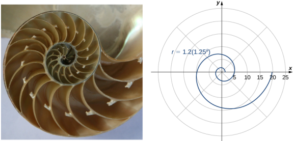
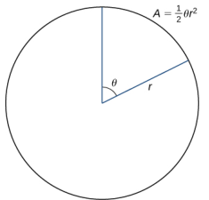
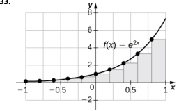
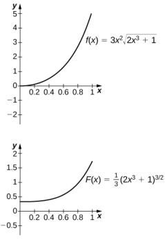
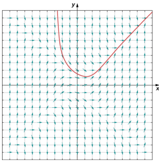
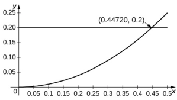
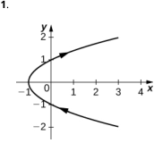
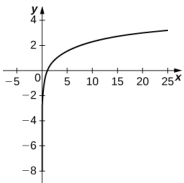

$$\sum_{n=0}c_n(x-a)^n=\sum_{n=0}d_n(x-a)^n$$

for all x in an open interval containing a. Then $c_n=d_n$ for all $n\geq0$

### Proof

Let

$$\begin{aligned}
f(x)& =c_{0}+c_{1}\:(x-a)+c_{2}(x-a)^{2}+c_{3}(x-a)^{3}+\cdots \\
&=d_{0}+d_{1}\:(x-a)+d_{2}(x-a)^{2}+d_{3}(x-a)^{3}+\cdots.
\end{aligned}$$

Then $f\left(a\right)=c_{0}=d_{0}$ . By Term-by-Term Differentiation and Integration for Power Series, we can differentiate both series term-by-term. Therefore,

$$\begin{aligned}
f^{\prime}\left(x\right)& =c_{1}+2c_{2}\left(x-a\right)+3c_{3}(x-a)^{2}+\cdots \\
&=d_{1}+2d_{2}\left(x-a\right)+3d_{3}(x-a)^{2}+\cdots,
\end{aligned}$$

and thus, $f^{\prime}$ $f^{\prime}$ $f^{\prime}\left(a\right)=c_{1}=d_{1}$ . Similarly

$$\begin{aligned}
f^{\prime\prime}\left(x\right)& =2c_{2}+3\cdot2c_{3}\:(x-a)+\cdots \\
&=2d_{2}+3\cdot2d_{3}\:(x-a)+\cdots 
\end{aligned}$$

implies that $f^{\prime\prime}(a)=2c_{2}=2d_{2}$ ,and therefore, $c_{2}=d_{2}$ . More generally, for any integer $n\geq0,f^{(n)}\left(a\right)=n!c_{n}=n!d_{n}$ and consequently, $c_{n}=d_{n}$ for all $n\geq0$

口

In this section we have shown how to find power series representations for certain functions using various algebraic operations, differentiation, or integration.At this point,however, we are stillimited as to the functions for which we can find power series representations. Next, we show how to find power series representations for many more functions by introducing Taylor series

### SECTION 6.2 EXERCISES

6. 1 $C\left(x\right)=\sum_{n=0}^{\infty}\frac{x^{2n}}{\left(2n\right)!}$ and
$$S\left(x\right)=\sum_{n=0}^{\infty}\frac{x^{2n+1}}{\left(2n+1\right)!},\text{f}$$
the power series of $C\left(x\right)+S\left(x\right)$ and of $C\left(x\right)-S\left(x\right)$

63.1 $f\left(x\right)=\sum_{n=0}^{\infty}\frac{x^{n}}{n!}$ and $g\left(x\right)=\sum_{n=0}^{\infty}\left(-1\right)^{n}\frac{x^{n}}{n!}$,fi ndl the power series of $\frac{1}{2}(f\left(x\right)+g\left(x\right))$ and of $\frac{1}{2}(f\left(x\right)-g\left(x\right))$

In the following exercises, use partial fractions to find the power series of each function..

66. $\frac{3}{(x+2)(x-1)}$ 65. $\frac{4}{(x-3)(x+1)}$ 67. $\frac{5}{\left(x^2+4\right)\left(x^2-1\right)}$

68. $\frac{30}{\left(x^{2}+1\right)\left(x^{2}-9\right)}$

In the following exercises,express each series as a rational function

$\sum_{n=1}^{w}\frac{1}{x^{n}}$
$$71.\:\sum_{n=1}^{\infty}\frac{1}{(x-3)^{2n-1}}$$

$$\sum_{n=1}^{\infty}\left(\frac{1}{(x-3)^{2n-1}}-\frac{1}{(x-2)^{2n-1}}\right)$$

The following exercises explore applications of annuities

74. Calculate the present values Pof annuities in which \$9.000 is to be paid out annually perpetually assuminq interest rates of $r=0.03,r=0.05$ and $r=0.07$

73.Calculate the present values $P$ of an annuity in which $\$10,000$ is to be paid out annually for a period of 20 years, assuming interest rates of $r=0.03,r=0.05$ and $r=0.07$

75. Calculate the annual payouts Cto be given for 20 years on annuities having present value $\$100,000$ assuming respective interest rates of $r=0.03,r=0.05$ ,and $r=0.07$

78. Suppose that an annuity has a present value $P=10$ million dollars What interest rate rwould allow for perpetual annual payouts of \$100,000?

77. Suppose that an annuity has a present value $P=1$ million dollars. What interest rate rwould allow for perpetual annual payouts of \$50,000?

76. Calculate the annual payouts $C$ to be given perpetually on annuities having present value $\$100,000$ assuming respective interest rates of $r=0.03,r=0.05$ and $r=0.07$

In the following exercises, express the sum of each power series in terms of geometric series,and then express the sum as a rational function

80. $x+x^{2}-x^{3}-x^{4}+x^{5}+x^{6}-x^{7}-x^{8}+\cdots$ (Hint:Group powers x4k $x^{4k-1}$ ,etc.

79. $x+x^{2}-x^{3}+x^{4}+x^{5}-x^{6}+\cdots$ (Hint: Group powers $x^{3k}$, $x^{3k- 1}$ and $x^{3k-2}$ ）

81. $x-x^{2}-x^{3}+x^{4}-x^{5}-x^{6}+x^{7}-\cdots$ (Hint: Group powers $x^{3k}$ $x^{3k-1}$ ,and $x^{3k-2}$ )

82. $\frac{x}{2}+\frac{x^{2}}{4}-\frac{x^{3}}{8}+\frac{x^{4}}{16}+\frac{x^{5}}{32}-\frac{x^{6}}{64}+\cdots$ (Hint: Group powers $\left(\frac{x}{2}\right)^{3k},\left(\frac{x}{2}\right)^{3k-1}$ , and $(\frac{x}{2})^{3k-2}$ .

In the following exercises,find the power series of $f\left(x\right)g\left(x\right)$ given f and g as defined

86. $f\left(x\right)=g\left(x\right)=\sum_{n=1}^{\infty}nx^{n}$

In the following exercises,differentiate the given series expansion off term-by-term to obtain the corresponding serie expansion for the derivative off

$$f\left(x\right)=\frac{1}{1+x}=\sum_{n=0}^{\infty}\left(-1\right)^{n}x^{n}\quad\textbf{88.}f\left(x\right)=\frac{1}{1-x^{2}}=\sum_{n=0}^{\infty}x^{2n}$$

In the following exercises, integrate the given series expansion of f term-by-term from zero to x to obtain the corresponding series expansion for the indefinite integral of f

$$f\left(x\right)=\frac{2x}{\left(1+x^{2}\right)^{2}}=\sum_{n=1}^{\infty}\left(-1\right)^{n}\left(2n\right)x^{2n-1}\quad\textbf{90.}f\left(x\right)=\frac{2x}{1+x^{2}}=2\sum_{n=0}^{\infty}\left(-1\right)^{n}x^{2n+1}$$

In the following exercises, evaluate each infinite series by identifying it as the value of a derivative or integral of geometric series

$$\begin{aligned}&\text{ivaluate}\sum_{n=1}^{\infty}\frac{n}{2^{n}}\mathrm{~as~}f^{\prime}\left(\frac{1}{2}\right)&&\text{92. Evaluate}\sum_{n=1}^{\infty}\frac{n}{3^{n}}\mathrm{~as~}f^{\prime}\left(\frac{1}{3}\right)&&\text{93. Evaluate}\sum_{n=2}^{\infty}\frac{n\left(n-1\right)}{2^{n}}\mathrm{~as}\\&\text{vhere }f\left(x\right)=\sum_{n=0}^{\infty}x^{n}.&&\text{where }f\left(x\right)=\sum_{n=0}^{\infty}x^{n}.&&f\left(x\right)=\sum_{n=0}^{\infty}x^{n}.\end{aligned}$$

$$\begin{aligned}
&\text{Evaluate}\sum_{n=0}\frac{(-1)^{n}}{2n+1}\text{as} \\
&\int_{0}^{1}f\left(t\right)dt\mathrm{~where} \\
&f\left(x\right)=\sum_{n=0}\left(-1\right)^{n}x^{2n}={\frac{1}{1+x^{2}}}.
\end{aligned}$$

In th folo ing xersegive that $\frac{1}{1-x}=\sum_{n=0}x^n$ . us erm byten d eniaton o it etent nd e e ei for each function centered at the given point

97.1n $\begin{pmatrix}1-x^{2}\end{pmatrix}$ at $x=0$

96.ln $(1-x)$ at $x=0$

95. $f(x)=\ln x$ centered at $x=1$ (Hint: $x=1-(1-x)$

98. $f\left(x\right)=\frac{2x}{\left(1-x^{2}\right)^{2}}$ at $x=0$

99. $f\left(x\right)=\tan^{-1}\left(x^{2}\right)$ at x=0

100. $f\left(x\right)=\ln\left(1+x^{2}\right)$ at x = 0

102. [T] Evaluate the power series expansior

101. $f\left(x\right)=\int_{0}^{x}$ Intdr where
$$\ln\left(x\right)=\sum_{n=1}^{\infty}\left(-1\right)^{n-1}\frac{(x-1)^{n}}{n}$$

$$\ln{(1+x)}=\sum_{n=1}^{\infty}{(-1)^{n-1}\frac{x^{n}}{n}}$$
at $x=1$ to show that In (2)

103.T1 Subtract the infinite series of In $(1-x)$ from In $(1+x)$ to getapower series for In $\left(\frac{1+x}{1-x}\right)$ Evaluate at $x=\frac{1}{3}$ . What is the smallest N such that the Nth partial sum of this series approximates In (2) with an error less than 0.001?

is the sum of the alternating harmonic series. Use the alternating series test to determine how many terms of the sum are needed to estimate In (2) accurate to within 0.001,and find such an approximation.

In the following exercises.using a substitution if indicated.express each series in terms of elementary functions and finc### the radius of convergence of the sum

$$\sum_{k=0}^{\infty}\left(x^{k}-x^{2k+1}\right)$$

$$105.\sum_{k=1}^{\infty}\frac{x^{3k}}{6k}$$

$$.\:\sum_{k=1}^{\infty}\left(1+x^{2}\right)^{-k}\:\mathrm{using}\\y=\frac{1}{1+x^{2}}$$

107. $\sum_{k=1}2^{-kx}$ usigs $y=2^{-x}$

108.Show that, up to powers
$$x^3\:\mathrm{and}\:y^3,\:E\left(x\right)=\sum_{n=0}^{\infty}\frac{x^n}{n!}$$

109. Differentiate the series

$$E\left(x\right)=\sum_{n=0}^{\infty}\frac{x^{n}}{n!}\text{ter}$$
term to show that $E(x)$ is equal to its derivative.

satisfies
$$E\left(x+y\right)=E\left(x\right)E\left(y\right).$$

110.Show thatif
$$f\left(x\right)=\sum_{n=0}^{\infty}a_{n}x^{n}\text{is a sum}$$

of even powers, that is $a_n=0$ if nis odd,then $F=\int_{0}^{x}f(t)$ d is sum of odd powers, while if $f$ is a sum of odd powers, then $F$ is a sum of even powers.

111. [T] Suppose that the coefficients $a_n$ of the
$$\text{es}\sum_{n=0}^{\infty}a_{n}x^{n}\:\mathrm{are}$$
series defined by the recurrence relation $a_{n}=\frac{a_{n-1}}{n}+\frac{a_{n-2}}{n(n-1)}.$ For $a_{0}=0$ and $a_{1}=1$
$$\begin{aligned}
&computeanapiotthe \\
&\mathrm{sums}\:S_{N}=\sum_{n=0}^{N}a_{n}x^{n}\:\mathrm{for} \\
&N=2,3,4,5\:\mathrm{on}\:[-1,1]\:.
\end{aligned}$$

112. [T] Suppose that the 114. [T] Given the power series expansion
$$\tan^{-1}\left(x\right)=\sum_{k=0}^{\infty}\left(-1\right)^{k}\frac{x^{2k+1}}{2k+1},$$
use the alternating series test to determine how many terms $N$ of the sum evaluated at $x=1$ are needed to approximate $\tan^{-1}(1)=\frac{\pi}{4}$ accurate to within 1/1000 Evaluate the corresponding partial sum
$$1\sum_{k=0}^{N}\left(-1\right)^{k}\frac{x^{2k+1}}{2k+1}.$$

113.[T] Given the power series expansion

coefficients $a_n$ of the seres $\sum_{n=0}a_nx^n$ are defined by the recurrence
$$a_{n}=\frac{a_{n-1}}{\sqrt{n}}-\frac{a_{n-2}}{\sqrt{n(n-1)}}.$$
For $a_0=1$ and $a_{1}=0$ compute and plot the sums $S_{N}=\sum_{n=0}^{N}a_{n}x^{n}$ for N=2.3,4,5 on [1,1] 115. [T] Recall that
$$\tan^{-1}\left(\frac1{\sqrt{3}}\right)=\frac\pi6.$$
Assuming an exact value of $\left(\frac{1}{\sqrt{3}}\right)$ , estimate $\frac{\pi}{6}$ by evaluating partial sums $S_{N}\left(\frac{1}{\sqrt{3}}\right)$ of th power series expansion
$$\tan^{-1}\left(x\right)=\sum_{k=0}^{\infty}\left(-1\right)^{k}\frac{x^{2k+1}}{2k+1}$$
at $x=\frac{1}{\sqrt{3}}$ .What isthe smallest number $N$ such that $6S_{N}\left(\frac{1}{\sqrt{3}}\right)$ approximates TT accurately to within 0.001？ How many terms are needed for accuracy to within 0.00001?

$$\ln{(1+x)}=\sum_{n=1}^{\infty}{(-1)^{n-1}}\frac{x^{n}}{n},$$

determine how many terms $N$ of the sum evaluated at $x=-1/2$ areneeded to approximate In (2) accurate to within 1/1000. Evaluate the corresponding partial
$$\mathrm{sum}\sum_{n=1}^{N}\left(-1\right)^{n-1}\frac{x^{n}}{n}.$$

# 6.3 Taylor and Maclaurin Series

# Learning Objectives 6.3.1Describe the procedure for finding a Taylor polynomial of a given order for a function

6.3.2 Explain the meaning and significance of Taylor's theorem with remainder 6.3.3Estimate the remainder for a Taylor series approximation of a given function.

In the previous two sections we discussed how to find power series representations for certain types of functions--specifically, functions related to geometric series. Here we discuss power series representations for other types of functions. In particular, we address the following questions: Which functions can be represented by power series and how do we find such representations? If we can find a power series representation for a particular function $f$ and the series converges on some interval, how do we prove that the series actually converges to $f?$

# Overview of Taylor/Maclaurin Series

Consider a function $f$ that has a power series representation at $x=a$ ,Then the series has the form

$$\sum_{n=0}^{\infty}c_{n}(x-a)^{n}=c_{0}+c_{1}(x-a)+c_{2}(x-a)^{2}+\cdots.$$

What should the coefficients be?For now, we ignore issues of convergence,but instead focus on what the series should be, if one exists. We return to discuss convergence later in this section. If the series Equation 6.4 is a representation for $f$ at $x=a$ , we certainly want the series to equal $f(a)$ at $X=4$ Evaluating the series at $x=a$ , we see that

$$\begin{aligned}
\sum_{n=0}c_{n}(x-a)^{n}& =c_{0}+c_{1}\:(a-a)+c_{2}(a-a)^{2}+\cdots \\
&=c_{0}.
\end{aligned}$$

Thus, the series equals $f(a)$ if the coefficient $c_{0}= f( a)$ . In addition, we would like the first derivative of the powe series to equal $f^{\prime}$ (a) at $x=a$ . Differentiating Equation 6.4 term-by-term, we see that

$$\frac{d}{dx}\Bigg(\sum\limits_{n=0}^{\infty}c_{n}(x-a)^{n}\Bigg)=c_{1}+2c_{2}\left(x-a\right)+3c_{3}(x-a)^{2}+\cdots.$$

Therefore, at $x=a$ the derivative is

$$\begin{aligned}
\frac{d}{dx}\Bigg(\sum_{n=0}^{\infty}c_{n}(x-a)^{n}\Bigg)& =c_{1}+2c_{2}\left(a-a\right)+3c_{3}(a-a)^{2}+\cdots \\
&=c_{1}.
\end{aligned}$$

Therefore, the derivative of the series equals $f^{\prime}$ (a) if the coefficient $c_{1}=f^{\prime}$ (a).Continuing in this way,we look for coefficients $c_n$ such that all the derivatives of the power series Equation 6.4 will agree with all the corresponding derivatives of $f$ at $x=a$ . The second and third derivatives of Equation 6.4 are given by

$$\frac{d^2}{dx^2}\Bigg(\sum_{n=0}^\infty c_n(x-a)^n\Bigg)=2c_2+3\cdot2c_3\:(x-a)+4\cdot3c_4(x-a)^2+\cdots $$

and

$$\frac{d^3}{dx^3}\Bigg(\sum_{n=0}^\infty c_n(x-a)^n\Bigg)=3\cdot2c_3+4\cdot3\cdot2c_4\:(x-a)+5\cdot4\cdot3c_5(x-a)^2+\cdots.$$

Therefore, at $x=a$ the second and third derivatives

$$\begin{aligned}
\frac{d^{2}}{dx^{2}}\left(\sum_{n=0}^{\infty}c_{n}(x-a)^{n}\right)& =2c_{2}+3\cdot2c_{3}\left(a-a\right)+4\cdot3c_{4}(a-a)^{2}+\cdots \\
&=2c_{2}
\end{aligned}$$

and

$$\begin{aligned}
\frac{d^{3}}{dx^{3}}\left(\sum_{n=0}^{\infty}c_{n}(x-a)^{n}\right)& =3\cdot2c_{3}+4\cdot3\cdot2c_{4}\left(a-a\right)+5\cdot4\cdot3c_{5}(a-a)^{2}+\cdots \\
&=3\cdot2c_{3}
\end{aligned}$$

equal $f^{\prime\prime}(a)$ and $f^{\alpha_{N}}\left(a\right).$ respectively, if $c_{2}=\frac{f^{\prime}(a)}{2}$ and $c_{3}=\frac{f^{\alpha}(a)}{3\cdot2}.$ More generally, we see that if $f$ has a power series representation at $X=a$ ,then thecefients should be given by $c_{n}=\frac{f^{(n)}(a)}{n!}$ .That is the series should be

$$\sum_{n=0}^{\infty}\frac{f^{(n)}\left(a\right)}{n!}(x-a)^{n}=f\left(a\right)+f^{\prime}\left(a\right)\left(x-a\right)+\frac{f^{\prime\prime}\left(a\right)}{2!}(x-a)^{2}+\frac{f^{\prime\prime\prime}\left(a\right)}{3!}(x-a)^{3}+\cdots.$$

This power series for $f$ is known as the Taylor series for $f$ at α. If $a=0$ , then this series is known as the Maclaurin serie for $f$

# Definition

If $f$ has derivatives of all orders at $x=a$ then the Taylor series for the function $f$ at ais

$$\sum_{n=0}^{\infty}\frac{f^{(n)}\left(a\right)}{n!}(x-a)^{n}=f\left(a\right)+f^{\prime}\left(a\right)\left(x-a\right)+\frac{f^{\prime\prime}\left(a\right)}{2!}(x-a)^{2}+\cdots+\frac{f^{(n)}\left(a\right)}{n!}(x-a)^{n}+\cdots.$$

The Taylor series for $f$ at O is known as the Maclaurin series for $f$

Later in this section, we will show examples of findina Taylor series and discuss conditions under which the Tavlor series for a function will converge to that function. Here, we state an important result. Recall from Uniqueness of Power Series that power series representations are unique. Therefore, if a function $f$ has a power series at a, then it must be the Taylor series for $f$ at $a$

### Theorem 6.6

### Uniqueness of Taylor Series

If a function $f$ has a power series at a that converges to $f$ on some open interval containing a, then that power series is the Taylor series for $f$ at a.

The proof follows directly from Unigueness of Power Series

To determine if a Taylor series converqes, we need to look at its sequence of partial sums. These partial sums are finite polynomials, known as Taylor polynomials.

## MEDIA

Visit the MacTutor History of Mathematics archive to read brief bioqraphies of Brook Taylor (http://www.openstax.org/l/20 BTaylor) and Colin Maclaurin (http://www.openstax.orq/l/20 CMaclaurin) and how they developed the concepts named after them.

# Taylor Polynomials

The nth partial sum of the Taylor series for a function $f$ at a is known as the nth Taylor polynomial.For example, the Oth, 1st, 2nd, and 3rd partial sums of the Taylor series are given by

$$\begin{aligned}
&p_{0}\left(x\right) =f\left(a\right), \\
&p_{1}\left(x\right) =f\left(a\right)+f^{\prime}\left(a\right)\left(x-a\right), \\
&p_{2}\left(x\right) =f\left(a\right)+f^{\prime}\left(a\right)\left(x-a\right)+\frac{f^{\prime}\left(a\right)}{2!}(x-a)^{2}, \\
&p_{3}\left(x\right) =f\left(a\right)+f^{\prime}\left(a\right)\left(x-a\right)+\frac{f^{\prime}\left(a\right)}{2!}(x-a)^{2}+\frac{f^{\prime\prime}\left(a\right)}{3!}(x-a)^{3}, 
\end{aligned}$$

respectively. These partial sums are known as the Oth, 1st, 2nd, and 3rd Taylor polynomials of $f$ at α,respectively. If $a=0$ ,then these polynomials are known as Maclaurin polynomials for $f.$ We now provide a formal definition of Taylor and Maclaurin polynomials for a function $f$

### Definition

If $f$ has $n$ derivatives at $x=a$ ,then the nth Taylor polynomial for $f$ atais

$$p_{n}\left(x\right)=f\left(a\right)+f'\left(a\right)\left(x-a\right)+\frac{f''\left(a\right)}{2!}(x-a)^{2}+\frac{f''\left(a\right)}{3!}(x-a)^{3}+\cdots+\frac{f^{\left(n\right)}\left(a\right)}{n!}(x-a)^{n}.$$

The nth Taylor polynomial for $f$ at 0 is known as the nth Maclaurin polynomial for $f.$

We now show how to use this definition to find several Taylor polynomials for $f(x)=\ln x$ at $x=1$

# EXAMPLE 6.11

### Finding Taylor Polynomials Find the Taylor polynomials $p_{0},p_{1},p_{2}$ and $p_{3}$ for $f(x)=\ln x$ at $x=1$ Use a graphing utility to compare the graph off $f$

with the graphs of $p_{0},p_{1},p_{2}$ and $p_{3}$

## $②$ Solution

To find these Taylor polynomials, we need to evaluate $f$ and its first three derivatives at $x=1$

$$\begin{aligned}
&\text{1} \\
&f(x) =\:\ln x && f(1) && \begin{array}{cc}=&0\end{array}  \\
&f^{\prime}\left(x\right) =\frac{1}{x} && f^{\prime}\left(1\right) && =1  \\
&f^{\sigma}\left(x\right) =\quad-\frac{1}{x^{2}} && f^{\prime\prime}(1) && =-1  \\
&f^{\omega}\left(x\right) =\quad\frac{2}{x^{3}} && f^{w}\left(1\right) && =2 
\end{aligned}$$

Therefore,

$$\begin{aligned}
&p_{0}\left(x\right)&& =\:f(1)=0,  \\
&p_{1}\left(x\right)&& =\:f\left(1\right)+f^{\prime}\left(1\right)\left(x-1\right)=x-1,  \\
&p_{2}\left(x\right)&& =\:f\left(1\right)+f^{\prime}\left(1\right)\left(x-1\right)+\frac{f^{\prime\prime}\left(1\right)}{2}(x-1)^{2}=(x-1)-\frac{1}{2}(x-1)^{2},  \\
&p_{3}\left(x\right)&& =\:f\left(1\right)+f^{\prime}\left(1\right)\left(x-1\right)+\frac{f^{\prime\prime}\left(1\right)}{2}\left(x-1\right)^{2}+\frac{f^{\prime\prime}\left(1\right)}{3!}\left(x-1\right)^{3}  \\
&&&=\:(x-1)-\frac{1}{2}(x-1)^{2}+\frac{1}{3}(x-1)^{3}.
\end{aligned}$$

The graphs of $y=f(x)$ and the first three Taylor polynomials are shown in Eigure 6.5

Figure 6.5 The function $y=\ln x$ and the Taylor polynomials $p_0,p_1,p_2$ and $p_3$ at $x=1$ are plotted on this graph

 6.10 Fin the Taylor polynomials po. P1,P2 and p3 for $f(x)=\frac1{x^2}$ at x= 1

Taylor polynomials centered at zero.

### EXAMPLE 6.12

### Finding Maclaurin Polynomials

For each of the following functions, find formulas for the Maclaurin polynomials $p_0,p_1,p_2$ and $p_{3}$ . Find a formula for the nth Maclaurin polynomial and write it using sigma notation. Use a graphing utilty to compare the graphs of $p_{0},p_{1},p_{2}$ and $p_3$ with $f$

$f\left(x\right)=e^{x}$ 8 $f(x)=\sin x$ $f\left(x\right)=e^{x}\\f\left(x\right)=\sin x\\f\left(x\right)=\cos x$ $f(x)=\cos x$

### $①$ Solution

a.Since $f\left(x\right)=e^{x}$ ,we know that $f(x)=f^{\prime}\left(x\right)=f^{\prime\prime}\left(x\right)=\cdots=f^{(n)}\left(x\right)=e^{x}$ for all positive integers n.Therefore $f\left(0\right)=f^{\prime}\left(0\right)=f^{\sigma}\left(0\right)=\cdots=f^{\left(n\right)}\left(0\right)=1$

for all positive integers n. Therefore, we have
$$\begin{aligned}
&1.\:\mathrm{inererore},& wenave  \\
&p_{0}\left(x\right)&& =\:f\left(0\right)=1,  \\
&p_{1}\left(x\right)\:=&& =\:f\left(0\right)+f^{\prime}\left(0\right)x=1+x,  \\
&p_{2}\left(x\right)&& =\:f\left(0\right)+f^{\prime}\left(0\right)x+\frac{f^{\prime\prime}\left(0\right)}{2!}x^{2}=1+x+\frac{1}{2}x^{2},  \\
&p_{3}\left(x\right)&& =\:f\left(0\right)+f^{\prime}\left(0\right)x+\frac{f^{\prime}\left(0\right)}{2}x^{2}+\frac{f^{\prime\prime}\left(0\right)}{3!}x^{3}  \\
&&&=\:1+x+\frac{1}{2}x^{2}+\frac{1}{3!}x^{3}, \\
&p_{n}\left(x\right)&& =\:f\left(0\right)+f^{\prime}\left(0\right)x+\frac{f^{\prime\prime}\left(0\right)}{2}x^{2}+\frac{f^{\prime\prime}\left(0\right)}{3!}x^{3}+\cdots+\frac{f^{(n)}\left(0\right)}{n!}x^{n}  \\
&&&=\quad1+x+\frac{x^{2}}{2!}+\frac{x^{3}}{3!}+\cdots+\frac{x^{n}}{n!} \\
&&&=\:\sum_{k=0}^{n}{\frac{x^{k}}{k!}}.
\end{aligned}$$

The function and the first three Maclaurin polynomials are shown in Fiaure 6.6

Figure 6.6 The graph shows the function $y=e^x$ and the Maclaurin polynomials $p_0,p_1,p_2$ and $p_3$

b.For $f(x)=\sin x$ , the values of the function and its first four derivatives at $x=0$ are given as followss

Since the fourth derivative is $\sin x$ ,the pattern repeats.That is, $f^{(2m)}\left(0\right)=0$ and $f^{(2m+1)}(0)=(-1)^{m}$ for $m\geq0$ Thus, we have
$$\begin{aligned}
&p_{0}\left(x\right) =0,  \\
&p_{1}\left(x\right) =0+x=x,  \\
&p_{2}\left(x\right) =0+x+0=x,  \\
&p_{3}\left(x\right) =0+x+0-\frac{1}{3!}x^{3}=x-\frac{x^{3}}{3!},  \\
&p_{4}\left(x\right) =0+x+0-\frac{1}{3!}x^{3}+0=x-\frac{x^{3}}{3!},  \\
&p_{5}\left(x\right) =0+x+0-\frac{1}{3!}x^{3}+0+\frac{1}{5!}x^{5}=x-\frac{x^{3}}{3!}+\frac{x^{5}}{5!}, 
\end{aligned}$$

and for $m\geq0$

$$\begin{aligned}
p_{2m+1}\left(x\right)& =p_{2m+2}\left(x\right)  \\
&=x-\frac{x^{3}}{3!}+\frac{x^{5}}{5!}-\cdots+(-1)^{m}\frac{x^{2m+1}}{(2m+1)!} \\
&=\sum_{k=0}^{m}\left(-1\right)^{k}\frac{x^{2k+1}}{\left(2k+1\right)!}.
\end{aligned}$$

Graphs of the function and its Maclaurin polynomials are shown in Figure 6.7

Room temperature is 75 degrees

Pizza temperature is 200 degrees

Figure 6.7 The graph shows the function $y=\sin x$ and the Maclaurin polynomials $p_1,p_3$ and $p_{5}$

c.For $f(x)=\cos x$, the values of the function and its first four derivatives at $x=0$ are given as follows:

Since the fourth derivative is $\cos x$ , the pattern repeats. In other words, $f^{(2m)}\left(0\right)=(-1)^{m}$ and $f^{(2m+1)}=0$ for $m\geq0$ . Therefore,
$$\begin{aligned}
&p_{0}\left(x\right) =1,  \\
&p_{1}\left(x\right) =1+0=1,  \\
&p_{2}\left(x\right) =1+0-\frac{1}{2!}x^{2}=1-\frac{x^{2}}{2!},  \\
&p_{3}\left(x\right) =1+0-\frac{1}{2!}x^{2}+0=1-\frac{x^{2}}{2!},  \\
&p_{4}\left(x\right) =1+0-\frac{1}{2!}x^{2}+0+\frac{1}{4!}x^{4}=1-\frac{x^{2}}{2!}+\frac{x^{4}}{4!},  \\
&p_{5}\left(x\right) =1+0-\frac{1}{2!}x^{2}+0+\frac{1}{4!}x^{4}+0=1-\frac{x^{2}}{2!}+\frac{x^{4}}{4!}, 
\end{aligned}$$

and for $n\geq0$

$$\begin{aligned}
p_{2m}(x)& =p_{2m+1}\left(x\right)  \\
&=1-\frac{x^{2}}{2!}+\frac{x^{4}}{4!}-\cdots+(-1)^{m}\frac{x^{2m}}{(2m)!} \\
&=\sum_{k=0}^{m}(-1)^{k}\frac{x^{2k}}{(2k)!}.
\end{aligned}$$

Graphs of the function and the Maclaurin polynomials appear in Figure 6.8

Figure 6.8 The function y= $y=$ $y=\cos x$ and the Maclaurin polynomials $p_0,p_2$ and $p_4$ are plotted on this graph

6.11 Find formulas for the Maclaurin polynomials $p_0,p_1,p_2$ and $p_3$ for $f\left(x\right)=\frac{1}{1+X}.$ Find a formula for the nth Maclaurin polynomial. Write your answer using sigma notation.

# Taylor's Theorem with Remainder

Recall that the nth Taylor polynomial for a function $f$ at a is the nth partial sum of the Taylor series for $f$ at a.Therefore to determine if the Taylor series converges, we need to determine whether the sequence of Taylor polynomials $\{p_n\}$ converges. However, not only do we want to know if the sequence of Taylor polynomials converges, we want to know if it converges to $f.$ To answer this question, we define the remainder $R_{n}\left(x\right)$ as

$$R_n\left(x\right)=f\left(x\right)-p_n\left(x\right).$$

For the sequence of Taylor polynomials to converge to $f$ , we need the remainder $R_{n}$ to converge to zero. To determine if. $R_{n}$ converges to zero, we introduce Taylor's theorem with remainder. Not only is this theorem useful in proving that a Taylor series converges to its related function, but it will also allow us to quantify how well the nth Taylor polynomia approximates the function

Here we look for a bound on $|R_n|$ . Consider the simplest case: $n=0$ . Let $P0$ be the Oth Taylor polynomial at a for a function $f.$ The remainder $R_0$ satisfies

$$\begin{array}{rl}R_{0}\left(x\right)&=f\left(x\right)-p_{0}\left(x\right)\\&=f\left(x\right)-f\left(a\right).\end{array}$$

If $f$ is differentiable on an interval I containing a and $X.$ then by the Mean Value Theorem there exists a real number between a and $x$ such that $f\left(x\right)-f\left(a\right)=f^{\prime}\left(c\right)\left(x-a\right)$ Therefore,

$$R_{0}\left(x\right)=f'\left(c\right)\left(x-a\right).$$

Using the Mean Value Theorem in a similar argument, we can show that if $f$ is $n$ times differentiable on an interval containing a and $x$ then the nth remainder. $R_{n}$ satisfies

$$R_{n}\left(x\right)=\frac{f^{\left(n+1\right)}\left(c\right)}{\left(n+1\right)!}(x-a)^{n+1}$$

for some real number cbetween a and $X.$ It is important to note that the value L in the numerator above is not the center a, but rather an unknown value $C$ betweena and $X.$ This formula allows us to get a bound on the remainder $R_{n}$ If we happen to know that $\left|f^{(n+1)}\left(x\right)\right|$ is bounded by some real number M on this interval $I_r$ then

$$|R_{n}\left(x\right)|\leq\frac{M}{\left(n+1\right)!}|x-a|^{n+1}$$

for all $X$ in the interval I.

We now state Taylor's theorem, which provides the formal relationship between a function $f$ and its nth degree Taylor polynomial $p_n\left(x\right).$ This theorem allows us to bound the error when using a Taylor polynomial to approximate a function value, and will be important in proving that a Taylor series for $f$ converges to $f.$

### Theorem 6.7

### Taylor's Theorem with Remainde

Let $f$ be a function that can be differentiated $n+1$ times on an interval I containing the real number a. Let $p_n$ be the nth Taylor polynomial of $f$ at a and let

$$R_n\left(x\right)=f\left(x\right)-p_n\left(x\right)$$

be the nth remainder. Then for each x in the interval I, there exists a real number c between a and $x$ such that

$$R_n\left(x\right)=\frac{f^{\left(n+1\right)}\left(c\right)}{\left(n+1\right)!}\left(x-a\right)^{n+1}.$$

If there exists a real number M such that $\left|f^{(n+1)}\left(x\right)\right|\leq M$ for all $x\in I$, then

$$|R_{n}\left(x\right)|\leq\frac{M}{\left(n+1\right)!}|x-a|^{n+1}$$

for all x in I

## Proof

Fix a point $x\in I$ and introduce the function $g$ such that

$$g\left(t\right)=f\left(x\right)-f\left(t\right)-f'\left(t\right)\left(x-t\right)-\frac{f''\left(t\right)}{2!}\left(x-t\right)^{2}-\cdots-\frac{f^{\left(n\right)}\left(t\right)}{n!}\left(x-t\right)^{n}-R_{n}\left(x\right)\frac{\left(x-t\right)^{n+1}}{\left(x-a\right)^{n+1}}.$$

We claim that $g$ satisfies the criteria of Rolle's theorem. Since. $g$ is a polynomial function (in $t).$ it is a differentiable function. Also, $g$ is zero at $t=a$ and $t=x$ because

$$\begin{aligned}
&g\left(a\right)\:=&& :\:f\left(x\right)-f\left(a\right)-f^{\prime}\left(a\right)\left(x-a\right)-\frac{f^{\prime}\left(a\right)}{2!}(x-a)^{2}+\cdots+\frac{f^{\left(n\right)}\left(a\right)}{n!}(x-a)^{n}-R_{n}\left(x\right) \\
&&&\text{-} =\:f\left(x\right)-p_{n}\left(x\right)-R_{n}\left(x\right) \\
&&&= \\
&g\left(x\right)&& =\:f\left(x\right)-f\left(x\right)-0-\cdots-0 \\
&&&\begin{array}{cc}=&0.\end{array}
\end{aligned}$$

Therefore, $g$ satisfies Rolle's theorem, and consequently, there exists $c$ between a and $x$ such that $g^{\prime}\left(c\right)=0$ We now calculate $g^{\prime}$ . Using the product rule, we note that

$$\frac{d}{dt}\left[\frac{f^{(n)}\left(t\right)}{n!}(x-t)^{n}\right]=\frac{-f^{(n)}\left(t\right)}{(n-1)!}(x-t)^{n-1}+\frac{f^{(n+1)}\left(t\right)}{n!}(x-t)^{n}.$$

Consequently,

$$\begin{gathered}
g^{\prime}\left(t\right) =-f^{\prime}\left(t\right)+\left[f^{\prime}\left(t\right)-f^{\prime\prime}\left(t\right)\left(x-t\right)\right]+\left[f^{\prime\prime}\left(t\right)\left(x-t\right)-\frac{f^{\prime\prime}\left(t\right)}{2!}\left(x-t\right)^{2}\right]+\cdots  \\
+\left[\frac{f^{(n)}(t)}{(n-1)!}(x-t)^{n-1}-\frac{f^{(n+1)}(t)}{n!}(x-t)^{n}\right]+(n+1)\:R_{n}\left(x\right)\frac{(x-t)^{n}}{(x-a)^{n+1}}. 
\end{gathered}$$

Notice that there is a telescoping effect.Therefore,

$$g'\left(t\right)=-\frac{f^{\left(n+1\right)}\left(t\right)}{n!}\left(x-t\right)^{n}+\left(n+1\right)R_{n}\left(x\right)\frac{\left(x-t\right)^{n}}{\left(x-a\right)^{n+1}}.$$

By Rolle's theorem,we conclude that there exists a number $C$ between a and $X$ such that $g^{\prime}\left(c\right)=0.$ Since

$$g'\left(c\right)=-\frac{f^{\left(n+1\right)}\left(c\right)}{n!}\left(x-c\right)^{n}+\left(n+1\right)R_{n}\left(x\right)\frac{\left(x-c\right)^{n}}{\left(x-a\right)^{n+1}}$$

we conclude that

$$-\frac{f^{(n+1)}\left(c\right)}{n!}(x-c)^{n}+(n+1)\:R_{n}\left(x\right)\frac{(x-c)^{n}}{(x-a)^{n+1}}=0.$$

Adding the first term on the left-hand side to both sides of the equation and dividing both sides of the equation by $\frac{(n+1)(x-c)^n}{(x-a)^{n+1}}$ we coclude that

$$R_{n}\left(x\right)=\frac{f^{\left(n+1\right)}\left(c\right)}{\left(n+1\right)!}(x-a)^{n+1}$$

as desired. From this fact,it follows that if there exists M such that $\left|f^{(n+1)}\left(x\right)\right|\leq M$ for all x in I, then

$$|R_{n}\left(x\right)|\leq\frac{M}{\left(n+1\right)!}|x-a|^{n+1}.$$

Not only does Taylor's theorem allow us to prove that a Taylor series converges to a function, but it also allows us to estimate the accuracy of Taylor polynomials in approximating function values. We begin by looking at linear and quadratic approximations of $f(x)=\sqrt[3]{x}$ at $x=8$ and determine how accurate these approximations are at estimating /.

# EXAMPLE 6.13

### Using Linear and Quadratic Approximations to Estimate Function Values Consider the function $f(x)=\sqrt[3]{x}$

a.Find the first and second Taylor polynomials for $f$ at $x=8$ . Use a graphing utility to compare these polynomials with $f$ near $x=8$ b. Use these two polynomials to estimate $\sqrt[3]{11}$ C.Use Taylor's theorem to bound the error.

## $①$ Solution

a.For $f(x)=\sqrt[3]{x}$, the values of the function and its first two derivatives at $x=8$ are as followss
$$\begin{aligned}&f\left(x\right)\:=\:\sqrt[3]{x}\quad f\left(8\right)\:=\:2\\&f^{\prime}\left(x\right)\:=\:\frac{1}{3x^{2/3}}\quad f^{\prime}\left(8\right)\:=\:\frac{1}{12}\\&f^{\prime\prime}\left(x\right)\:=\:\frac{-2}{9x^{5/3}}\quad f^{\prime\prime}\left(8\right)\:=\:-\frac{1}{144}.\end{aligned}$$

Thus, the first and second Taylor polynomials at $x=8$ are givenby
$$\begin{aligned}
&\text{polynon} \mathrm{idis~at~}x=0\:\mathrm{are~giveri~by}  \\
&p_{1}\left(x\right) =\:f\left(8\right)+f^{\prime}\left(8\right)\left(x-8\right)  \\
&=\:2+\frac{1}{12}(x-8) \\
&p_{2}\left(x\right) =\:f\left(8\right)+f^{\prime}\left(8\right)\left(x-8\right)+\frac{f^{\prime}\left(8\right)}{2!}\left(x-8\right)^{2}  \\
&=\:2+\frac{1}{12}(x-8)-\frac{1}{288}(x-8)^{2}.
\end{aligned}$$

The function and the Taylor polvnomials are shown in Figure 6.9

Figure 6.9 The graphs of $f\left(x\right)=\sqrt[3]{x}$ and the linear and quadratic approximations $p_1\left(x\right)$ and $p_2\left(x\right)$

b.Using the first Taylor polynomial at $x=8$ , we can estimate
$$\sqrt[3]{11}\approx p_{1}\:(11)=2+\frac{1}{12}(11-8)=2.25.$$

Using the second Taylor polynomial at $x=8$ , we obtain
$$\sqrt[3]{11}\approx p_{2}\left(11\right)=2+\frac{1}{12}(11-8)-\frac{1}{288}(11-8)^{2}=2.21875.$$

C.By Taylor's Theorem with Remainder, there exists a $C$ in the interval (8, 11) such that the remainder when approximating $\sqrt[3]{11}$ by the first Taylor polynomial satisfies
$$R_{1}\:(11)=\frac{f^{\prime\prime}(c)}{2!}(11-8)^{2}.$$

We do not know the exact value of c, so we find an upper bound on $R_{1}$ (11) by determining the maximum value of $f^{\prime\prime}$ on the interal 8, 11) Since $f^{\prime\prime}\left(x\right)=-\frac{2}{9x^{5/3}}$ , the largest value for $|f^{\prime}(x)|$ on that interal ocurs at $x=8$ Using the fact that $f^{\prime\prime}\left(8\right)=-\frac{1}{144}$ , we obtain
$$|R_1\:(11)|\leq\frac{1}{144\cdot2!}(11-8)^2=0.03125.$$

Similarly, to estimate $R_{2}\left(11\right)$ , we use the fact that

$$R_{2}\left(11\right)=\frac{f^{\prime\prime}\left(c\right)}{3!}\left(11-8\right)^{3}.$$

Since $f^{\prime\prime}\left(x\right)=\frac{10}{27x^{8/3}}$ , the maximum value of $f^{nv}$ on the interval (8, 11) is $f^{\sigma}\left(8\right)\approx0.0014468$ Therefore, we have
$$|R_{2}\left(11\right)|\leq\frac{0.0011468}{3!}(11-8)^{3}\approx0.0065104.$$

6.12 Find the first and second Taylor polynomials for $f\left(x\right)=\sqrt{x}$ at $x=4.$ Use these polynomials to estimate 6. Use Taylor's theorem to bound the error

### EXAMPLE 6.14

Approximating sin x Using Maclaurin Polynomials From Example 6.12b., the Maclaurin polynomials for sin x are given by

$$\begin{aligned}
p_{2m+1}\left(x\right)& =p_{2m+2}\left(x\right) \\
&=x-\frac{x^{3}}{3!}+\frac{x^{5}}{5!}-\frac{x^{7}}{7!}+\cdots+(-1)^{m}\frac{x^{2m+1}}{(2m+1)!}
\end{aligned}$$

for $m=0,1,2,\ldots$

a.Use the fifth Maclaurin polynomial for sin x to approximate sin $(\frac{\pi}{18})$ and bound the error. b.For what values of $x$ does the fifth Maclaurin polynomial approximate $\sin x$ to within 0.0001?

## $①$ Solution

a.The fifth Maclaurin polynomial is

$$p_{5}\left(x\right)=x-\frac{x^{3}}{3!}+\frac{x^{5}}{5!}.$$

Using this polynomial, we can estimate as follows
$$\begin{aligned}
ateasrollow \\
\sin\left({\frac{\pi}{18}}\right)& \approx p_{5}\left(\frac{\pi}{18}\right) \\
&=\frac{\pi}{18}-\frac{1}{3!}\Big(\frac{\pi}{18}\Big)^{3}+\frac{1}{5!}\Big(\frac{\pi}{18}\Big)^{5} \\
&\approx0.173648.
\end{aligned}$$

To estimate the error, use the fact that the sixth Maclaurin polynomial is $p_{6}\left(x\right)=p_{5}\left(x\right)$ and calculate a bound on $R_{6}\left(\frac{\pi}{18}\right).$ By Uniqueness of Taylor Series, the remainder is
$$R_6\left(\frac{\pi}{18}\right)=\frac{f^{(7)}\left(c\right)}{7!}\Big(\frac{\pi}{18}\Big)^7$$

for some C between O and $\frac{\pi}{18}.$ Using the fact that $\left|f^{(7)}\left(x\right)\right|\leq1$ for all $x_{r}$ we find that the magnitude of the eror is at most
$$\frac{1}{7!}\cdot\left(\frac{\pi}{18}\right)^7\leq9.8\:\times\:10^{-10}.$$

b.We need to find the values of $x$ such that

$$\frac{1}{7!}|x|^7\leq0.0001.$$

Solving this inequality for $x$, we have that the fifth Maclaurin polynomial gives an estimate to within 0.oo01 as long as $|x|<0.907$

6.13 Use the fourth Maclaurin polynomial for cosx to approximate cos $\left(\frac{\pi}{12}\right)$

Now that we are able to bound the remainder $R_n\left(x\right)$ we can use this bound to prove that a Taylor series for $f$ at converges to $f.$

# Representing Functions with Taylor and Maclaurin Series

We now discuss issues of convergence for Taylor series. We begin by showing how to find a Taylor series for a function and how to find its interval of convergence.

# EXAMPLE 6.15

### Finding a Taylor Series Find the Taylor series for $f(x)=\frac{1}{x}$ at $x=1$ .Determine the interval of convergence.

## $②$ Solution

For $f\left(x\right)=\frac{1}{x}$ ,the values of the function and its first four derivatives at $x=1$ are

$$\lim_{n\to\infty}R_{n}\left(x\right)=0.$$

We now state this theorem formally

### Theorem 6.8

### Convergence of Taylor Series

Suppose that $f$ has derivatives of all orders on an interval I containing a. Then the Taylor series

$$\sum_{n=0}^{\infty}\frac{f^{(n)}\left(a\right)}{n!}(x-a)^n$$

converges to $f\left(x\right)$ for all xin Iif and only if

$$\lim_{n\to\infty}R_{n}\left(x\right)=0$$

for all xin I

With this theorem, we can prove that a Taylor series for $f$ at a converges to $f$ if we can prove that the remainder $R_{n}\left(x\right)\to0.$ To prove that $R_{n}\left(x\right)\to0$ ,we typically use the bound

$$|R_{n}\left(x\right)|\leq\frac{M}{\left(n+1\right)!}|x-a|^{n+1}$$

from Taylor's theorem with remainder

In the next example, we find the Maclaurin series for $e^x$ and sinx and show that these series converqe to the corresponding functions for all real numbers by proving that the remainders $R_{n}\left(x\right)\to0$ for all real numbers x.

# EXAMPLE 6.16

### Finding Maclaurin Series

For each of the following functions, find the Maclaurin series and its interval of convergence. Use Taylor's Theorem with Remainder to prove that the Maclaurin series for $f$ converges to $f$ on that interval.

a. $e^x$ b.sinx

# $②$ Solution a.Using the nth Maclaurin polynomial for $e^x$ found in Example 6.12a.,wefind that theMaclaurin series for $e^x$ is given

by

$$\sum_{n=0}^{\infty}\frac{x^n}{n!}.$$

To determine the interval of convergence, we use the ratio test. Since
$$\frac{|a_{n+1}|}{|a_{n}|}=\frac{|x|^{n+1}}{(n+1)!}\cdot\frac{n!}{|x|^{n}}=\frac{|x|}{n+1},$$

we have

$$\lim_{n\to\infty}\frac{|a_{n+1}|}{|a_{n}|}=\lim_{n\to\infty}\frac{|x|}{n+1}=0$$

for all $x.$ Therefore, the series converges absolutely for al $x_{\mu}$ and thus, the interval of convergence is , .T

show that the series converges to $e^x$ for all x, we use the fact that $f^{(n)}\left(x\right)=e^{X}$ for all $n\geq0$ and $e^x$ is an increasing function on(—∞o, ∞). Therefore, for any real number $b$ themaximum value of $e^x$ for all $|x|\leq b$ is $e^{b}.$ Thus

$$|R_{n}\left(x\right)|\leq\frac{e^{b}}{\left(n+1\right)!}|x|^{n+1}.$$

Since we just showed that

$$\sum_{n=0}^{\infty}\frac{|x|^n}{n!}$$

converges for all $x$, by the divergence test, we know that

$$\lim_{n\to\infty}\frac{|x|^{n+1}}{(n+1)\:!}=0$$

for any real number $x.$ By combining this fact with the squeeze theorem, the result is $\lim R_{n}\left(x\right)=0$

$\lim_{n\to\infty}R_n\left(x\right)=0.$

b.Usinq the nth Maclaurin polynomial for sinx found in Example 6.12b.,we find that the Maclaurin series for sin $x$ is given by

$$\sum_{n=0}^{\infty}(-1)^{n}\frac{x^{2n+1}}{(2n+1)\:!}.$$

In order to apply the ratio test, consider
$$\frac{|a_{n+1}|}{|a_{n}|}=\frac{|x|^{2n+3}}{(2n+3)!}\cdot\frac{(2n+1)!}{|x|^{2n+1}}=\frac{|x|^{2}}{(2n+3)(2n+2)}.$$

Since

$$\lim\limits_{n\to\infty}\frac{|x|^2}{(2n+3)\:(2n+2)}=0$$

for all $X.$ we obtain the interval of convergence as(-oo,o. To show that the Maclaurin series converges to sin x look at $R_n\left(x\right)$ For each $x$ there exists a real number $c$ between 0 and $x$ such that
$$R_{n}\left(x\right)=\frac{f^{\left(n+1\right)}\left(c\right)}{\left(n+1\right)!}x^{n+1}.$$

Since $\left|f^{(n+1)}\left(c\right)\right|\leq1$ for all integers $n$ and all real numbers $C_{r}$ we have
$$|R_{n}\left(x\right)|\leq\frac{|x|^{n+1}}{\left(n+1\right)!}$$

for all real numbers x. Using the same idea as in part a., the result is lim $R_{n}\left(x\right)=0$ for all $x$, and therefore, the →00

Maclaurin series for sin.x converges to sin x for all real x

### STUDENT PROJECT

Proving that e is Irrational In this project, we use the Maclaurin polynomials for $e^x$ to prove that e is irrational. The proof relies on supposing that e is rational and arriving at a contradiction. Therefore, in the following steps, we suppose $e=r/s$ for some integers rand swhere $s\neq0$ 1.Write the Maclaurin polynomials $p_{0}\left(x\right),p_{1}\left(x\right),p_{2}\left(x\right),p_{3}\left(x\right),p_{4}\left(x\right)$ for e*.Evaluate $p_{0}\left(1\right),p_{1}\left(1\right),p_{2}\left(1\right),p_{3}\left(1\right),p_{4}\left(1\right)$ to estimate e 2.Let $R_n\left(x\right)$ denote the remainder when using $p_n\left(x\right)$ to estimate $e^{x}.$ .Therefore, $R_n\left(x\right)=e^{X}-p_n\left(x\right)$, and $R_{\eta}\left(1\right)=e-p_{\eta}\left(1\right).$ Assuming that $e=\frac{r}{s}$ for integers r and $S_r$ evaluate $R_{0}\left(1\right),R_{1}\left(1\right),R_{2}\left(1\right),R_{3}\left(1\right),R_{4}\left(1\right).$ 3.Using the results from part 2, show that for each remainder $R_{0}\left(1\right),R_{1}\left(1\right),R_{2}\left(1\right),R_{3}\left(1\right),R_{4}\left(1\right)$, we can find an integer k such that $kR_{n}\left(1\right)$ is an integer for $n=0,1,2,3,4$ 4.Write down the formula for the nth Maclaurin polynomial $p_n\left(x\right)$ for $e^x$ and the corresponding remainder $R_{n}\left(x\right).$ Show that $sn!R_n(1)$ is an integer 5.Use Taylor's theorem to write down an explicit formula for $R_n\left(1\right)$ .Conclude that $R_n\left(1\right)\neq0$ ,and therefore $sn!R_n\left(1\right)\neq0$ 6.Use Taylor's theorem to find an estimate on $R_n\left(1\right).$ Use this estimate combined with the result from part 5 to show that $|sn!R_{n}\left(1\right)|<\frac{se}{n+1}.$ Conclude that if n is large enough, then $|sn!R_n(1)|<1.$ Therefore,e $sn!R_n$ (1) is an integer with magnitude less than 1. Thus, $sn!R_n\left(1\right)=0$ .But from part 5, we know that $sn!R_{\eta}\left(1\right)\neq0.$ Wehave arrived at a contradiction, and consequently, the original supposition that e is rational must be false.

### SECTION 6.3 EXERCISES

In the following exercises, find the Taylor polynomials of degree two approximating the given function centered at th given point

116. $f\left(x\right)=1+x+x^{2}$ at 117. $f(x)=1+x+x^{2}$ at 118. $f\left(x\right)=\cos\left(2x\right)$ at $a=\pi$ $a=1$ α =-1

121. $f(x)=\ln x$ at $a=1$ 119. $f(x)=\sin\left(2x\right)$ at $a=\frac{\pi}{2}$ 120. $f(x)=\sqrt{x}$ at $a=4$

123. $f\left(x\right)=e^{x}$ at $a=1$ 122. $f\left(x\right)=\frac{1}{x}$ at $a=1$

In the following exercises, verify that the given choice of n in the remainder estimate $|R_{n}|\leq\frac{M}{(n+1)!}(x-a)^{n+1}$ whereM is the maximum value of|r(n+1) (z)|on the interval between a and the indicated point, yields $|R_n|\leq\frac1{1000}$ Findthe value of the Taylor polynomial $\rho_n$ of f at the indicated point.If|Rr|is not less than 1/1000, determine what it is

$$\begin{aligned}&[\mathbf{T}]\:\sqrt{10};a=9,n=3\quad\mathbf{125}.\:[\mathbf{T}]\:(28)^{1/3};a=27,n=1\quad\mathbf{126}.\:[\mathbf{T}]\sin\left(6\right);a=2\pi,n=5\\&.\:[\mathbf{T}]\:\mathrm{e}^{2};\:a=0,n=9\quad\mathbf{128}.\:[\mathbf{T}]\cos\left(\frac{\pi}{5}\right);a=0,n=4\quad\mathbf{129}.\:[\mathbf{T}]\ln\left(2\right);a=1,n=1000\end{aligned}$$

131. Integrate the approximation evaluated at-x² to apprx mate $\int_{0}^{1}e^{-x^2}dx$

130.Integrate the approximation $\sin t\approx t-\frac{t^{3}}{6}+\frac{r^{5}}{120}-\frac{t^{7}}{5040}$ evaluated at rπt to aproximate $\int_0^1\frac{\sin\pi t}{\pi t}dt$

In the following exercises,find the smallest value of n such that the remainder estimate $|R_{n}|\leq\frac{M}{(n+1)!}(x-a)^{n+1}$ where M is the maximum value $of\left|f^{(n+1)}(z)\right|$ on the interval betweena and the indicated point,yields $|R_n|\leq\frac1{1000}$ on the indicated interval.

134. $f(x)=e^{-2x}$ on 132. $f(x)=\sin x$ on 133. $f(x)=\cos x$ on $\left[-\pi,\pi\right],a=0$ $\left[-\frac{\pi}{2},\frac{\pi}{2}\right],a=0$ α =0 $a=0$ $[-1,1],a=0$

135. $f(x)=e^{-x}$ on $[-3,3],a=0$ α = 0 $a=0$

In the following exercises, the maximum of the right-hand side of the remainder estimate |R|maxl f(c)l R² or $[a-R,a+R]$ occurs at a or $a\pm R$ Estimate themaximum value of R such that $\frac{\max|f^{\circ}(z)|}2R^2\leq0.1$ on [a - R,a+ R] by plotting this maximum as a function of R

136.[T] $e^x$ approximated by $1+x,a=0$

138.[T] lnx approximated by

137. [T] sinx approximated by $x_{r}$ $a= 0$

139.[T] cOS $x$ approximated by $1,a=0$

In the following exercises, find the Taylor series of the given function centered at the indicated point

140. $x^{4}$ at $a=-1$

142.sinx atα=π

141. $1+x+x^{2}+x^{3}$ at $a=-1$

143. cosx at $a=2\pi$

144. sinx at $x=\frac{\pi}{2}$

145. cosx at x=

147. $e^x$ at $a=1$

146. $e^x$ at $a=-1$

148. $\frac{1}{(x-1)^{2}}$ at $a=0$ (Hint) Differentiate $\frac{1}{1-x}$ )

149. $\frac{1}{(x-1)^3}$ at $a=0$

$$F\left(x\right)=\int_{0}^{x}\cos\left(\sqrt{t}\right)\:dt;f\left(t\right)=\sum_{n=0}^{\infty}\left(-1\right)^{n}\frac{t^{n}}{\left(2n\right)!}$$
at $a=0$ (Note: $f$ is the Taylor series of $\cos\left(\sqrt{t}\right).$

In the following exercises, compute the Taylor series of each function around $x=1$

153.fx=x-2

151. $f(x)=2-x$

152. $f(x)=x^3$

155. $f(x)=\frac{1}{x}$

154. $f(x)=\ln x$

156. f(x)= 2x-x2

159.f(x) = e2x

158. f(x) = e-x

157. $f\left(x\right)=\frac{x}{4x-2x^{2}-1}$

IT In th folowing erises denti the vale f such thathegie series $\sum_{n=0}a_n$ is he value o he Maclaurin erie of(x) atx.Approximatethe alueof f (x) sing Ss1o = an

160 $\sum_{n=0}^{\infty}\frac{1}{n!}$

$$\sum_{n=0}^{\infty}\frac{(-1)^{n}(2\pi)^{2n}}{(2n)!}$$

16. $\sum_{n=0}^{\infty}\frac{(-1)^n(2\pi)^{2n+1}}{(2n+1)!}$

The following exercises make use of the functions $S_{5}\left(x\right)=x-\frac{x^{3}}{6}+$ and C4 (x) = 1 - + on [-π,π

166.[T] Plot on $[-\pi,\pi]$

164. [T] Plot $\sin^{2}x-(S_{5}\left(x\right))^{2}$ on $[-\pi,\pi]$ .Compare the maximum difference with the square of the Taylor remainder estimate for sin x.

165. [T] Plot $\cos^{2}x-(C_{4}\left(x\right))^{2}$ on $[-\pi,\pi]$ . Compare the maximum difference with the square of the Taylor remainder estimate for COS x.

168.[T] Plot $e^{x}-e_{4}(x)$ where on [0,2].Compare the maximum error with theTaylor remainder estimate

167. [T compare $\frac{S_5(x)}{C_4(x)}$ on [1,1] to tanx.Compare this with the Taylor remainder estimate for the approximation of tan x by $x+\frac{x^{3}}{3}+\frac{2x^{5}}{15}$

169.(Taylor approximations and root finding.) Recal that Newton's method $x_{n+1}=x_{n}-\frac{f(x_{n})}{f^{\prime}(x_{n})}$ approximates solutions of $f(x)=0$ near the input $x_0$ a.If $f$ and $g$ are inverse functions, explain why a solution of $g(x)=a$ is the value $f(a)$ of $\int\int$ b.Let $p_N\left(x\right)$ be the $N$ th degree Maclaurin polynomial of $e^x$ . Use Newton's method tc approximate solutions of $p_{N}\left(x\right)-2=0$ for $N=4,5,6$ C.Explain why the approximate roots of $p_{N}\left(x\right)-2=0$ are approximate values of In (2).

In thefolo ing erses us te atatt $if$ $q$ $( x) = \sum _{n= 1}a_{n}( x- c) ^{\prime \prime }$ converesinan nteva onainge $\lim_{x\to c}q\left(x\right)=a_0$ to evaluate each limit using Taylor series

$$171.\lim_{x\to0}\frac{\ln\left(1-x^2\right)}{x^2}$$

172.

170. $\lim_{x\to0}\frac{\cos x-1}{x^2}$

173. $\lim_{x\to0^+}\frac{\cos(\sqrt{x})-1}{2x}$

## 6.4 Working with Taylor Series.

### Learning Objectives

6.4.1 Write the terms of the binomial series. 6.4.2 Recognize the Taylor series expansions of common functions

6.4.3 Recognize and apply techniques to find the Taylor series for a function 6.4.4 Use Taylor series to solve differential equations 6.4.5 Use Taylor series to evaluate nonelementary integrals.

In the preceding section, we defined Taylor series and showed how to find the Taylor series for several common functions by explicitly calculating the coefficients of the Taylor polynomials.In this section we show how touse those Taylor series to derive Taylor series for other functions. We then present two common applications of power series. First we show how power series can be used to solve differential equations. Second, we show how power series can be used to evaluate integrals when the antiderivative of the integrand cannot be expressed in terms of elementary functions. In

one example wecosider $\int e^{-x^2}dx$ an integra tha rises requeniyin robabit th or

# The Binomial Series

Our first goal in this section is to determine the Maclaurin series for the function $f(x)=(1+x)^{\prime}$ for all real numbers r The Maclaurin series for this function is known as the binomial series.We begin by considering the simplest case: $r$ is a nonnegative integer. We recall that, for $r=0,1,2,3,4,f(x)=(1+x)^{\prime}$ can be written as

$$\begin{aligned}
&f\left(x\right)&& =(1+x)^{0}=1, \\
&f(x)&& =(1+x)^{1}=1+x, \\
&f(x)&& =(1+x)^{2}=1+2x+x^{2} \\
&f(x)&&&& =1+3x+3x^{2}+x^{3} \\
&f\left(x\right)=(1+x)^{4}&&&& =1+4x+6x^{2}+4x^{3}+x^{4}. 
\end{aligned}$$

The expressions on the riaht-hand side are known as binomial expansions and the coefficients are known as binomia coefficients. More generally,for any nonnegative integer r, the binomial coefficient of $x^{\prime r}$ in the binomial expansion of $(1+x)^{\prime}$ is given by

$$\binom{r}{n}=\frac{r!}{n!\left(r-n\right)!}$$

and

$$\begin{aligned}
f(x)& =(1+x)^{r} \\
&\left.=\left(\begin{matrix}{r}\\{0}\\\end{matrix}\right.\right)1+\left(\begin{matrix}{r}\\{1}\\\end{matrix}\right)x+\left(\begin{matrix}{r}\\{2}\\\end{matrix}\right)x^{2}+\left(\begin{matrix}{r}\\{3}\\\end{matrix}\right)x^{3}+\cdots+\left(\begin{matrix}{r}\\{r-1}\\\end{matrix}\right)x^{r-1}+\left(\begin{matrix}{r}\\{r}\\\end{matrix}\right)x^{r} \\
&=\sum_{n=0}^{r}\left(\begin{matrix}{r}\\{n}\\\end{matrix}\right)x^{n}.
\end{aligned}$$

For example, using this formula for $r=5$ ,we see that
$$\begin{aligned}
f(x)& =(1+x)^{5} \\
&\left.=\left(\begin{array}{c}{5}\\{0}\end{array}\right.\right)1+\left(\begin{array}{c}{5}\\{1}\end{array}\right)x+\left(\begin{array}{c}{5}\\{2}\end{array}\right)x^{2}+\left(\begin{array}{c}{5}\\{3}\end{array}\right)x^{3}+\left(\begin{array}{c}{5}\\{4}\end{array}\right)x^{4}+\left(\begin{array}{c}{5}\\{5}\end{array}\right)x^{5} \\
&=\frac{5!}{0!5!}1+\frac{5!}{1!4!}x+\frac{5!}{2!3!}x^{2}+\frac{5!}{3!2!}x^{3}+\frac{5!}{4!1!}x^{4}+\frac{5!}{5!0!}x^{5} \\
&=1+5x+10x^{2}+10x^{3}+5x^{4}+x^{5}.
\end{aligned}$$

We now consider the case when the exponent $r$ is any real number, not necessarily a nonnegative integer. If $r$ is not a nonnegative integer, then $f(x)=(1+x)^{r}$ cannot be written as a finite polynomial. However, we can find a power series for $f$ . Specifically, we look for the Maclaurin series for $f$ . To do this, we find the derivatives of $f$ and evaluate them at $x=0$

$$\begin{aligned}
&f\left(x\right)=&& (1+x)^{r} &&&& f(0) &&&&&& =1 \\
&f^{\prime}\left(x\right)&& r(1+x)^{r-1} &&&& f^{\prime}(0) &&&&&& =r \\
&f^{\prime\prime}\left(x\right)&& = && r\left(r-1\right)\left(1+x\right)^{r-2} &&&& f^{\sigma}\left(0\right) &&&&&& =\:r\left(r-1\right) \\
&f^{w}(x)&& r\left(r-1\right)\left(r-2\right)\left(1+x\right)^{r-3} &&&& f^{\sigma}\left(0\right) &&&&&& =\:r\left(r-1\right)\left(r-2\right) \\
&f^{(n)}(x)&& =\:r\left(r-1\right)\left(r-2\right)\cdots\left(r-n+1\right)\left(1+x\right)^{r-n} &&&& f^{(n)}\left(0\right) &&&&&& =\:r\left(r-1\right)\left(r-2\right)\cdots\left(r-n+1\right) 
\end{aligned}$$

We conclude that the coefficients in the binomial series are given by

$$\frac{f^{(n)}\left(0\right)}{n!}=\frac{r\left(r-1\right)\left(r-2\right)\cdots\left(r-n+1\right)}{n!}.$$

We note that if $r$ is a nonnegative integer, then the $(r+1)$ st derivative $f^{(r+1)}$ is the zero function, and the series terminates. In addition, if $r$ is a nonnegative integer then Equation 6.8 for the coefficients agrees with Equation 6.6 for the coefficients, and the formula for the binomial series agrees with Equation 6.7 for the finite binomial expansion. More generally, to denote the binomial coefficients for any real number r, we define

$$\begin{pmatrix}r\\n\end{pmatrix}=\frac{r\left(r-1\right)\left(r-2\right)\cdots\left(r-n+1\right)}{n!}.$$

With this notation, we can write the binomial series for $(1+x)^{r}$ as

$$\sum\limits_{n=0}^{\infty}\begin{pmatrix}r\\n\end{pmatrix}x^{n}=1+rx+\frac{r\left(r-1\right)}{2!}x^{2}+\cdots+\frac{r\left(r-1\right)\cdots\left(r-n+1\right)}{n!}x^{n}+\cdots.$$

We now need to determine the interval of convergence for the binomial series Equation 6.9. We apply the ratio test Consequently, we consider

$$\begin{aligned}
\frac{\left|a_{n+1}\right|}{\left|a_{n}\right|}& =\frac{|r(r-1)(r-2)\cdots(r-n)|x||^{n+1}}{(n+1)!}\cdot\frac{n!}{|r(r-1)(r-2)\cdots(r-n+1)||x|^{n}} \\
&=\frac{|r-n||x|}{|n+1|}.
\end{aligned}$$

Since

$$\lim_{n\to\infty}\frac{|a_{n+1}|}{|a_{n}|}=|x|<1$$

if and only if $|x|<1$ , we conclude that the interval of convergence for the binomial series is (-1,1). The behavior at the endpoints depends onr.It can be shown that for $r\geq0$ the series converges at both endpoints; for $-1<r<0$ ,the series converges at $x=1$ and diverges at $x=-1$ ; and for $r<-1$ , the series diverges at both endpoints. The binomia series does converge to $(1+x)^{r}$ in (-1,1) for all real numbers $F$ , but proving this fact by showing that the remainder $R_{\eta}\left(x\right)\to0$ is difficult

### Definition

For any real number r, the Maclaurin series for $f(x)=(1+x)^{\prime}$ is the binomial series.It converges to $f$ for $|x|<1$ and we write

$$\begin{aligned}
(1+x)^{r}& =\sum_{n=0}^{\infty}\left(\begin{array}{c}{r}\\{n}\\\end{array}\right)x^{n} \\
&=1+rx+\frac{r(r-1)}{2!}x^{2}+\cdots+\frac{r(r-1)\cdots(r-n+1)}{n!}x^{n}+\cdots 
\end{aligned}$$

for $|x|<1$

We can use this definition to find the binomial series for $f\left(x\right)={\sqrt{1+x^{2}}}$ and use the series to approximate $\sqrt{1.5}$

# EXAMPLE 6.17

### Finding Binomial Series

a.Find the binomial series for $f\left(x\right)=\sqrt{1+x}$ b. Use the third-order Maclaurin polynomial $p_3\left(x\right)$ to estimate $\sqrt{1.5}$ .Use Taylor's theorem to bound the error. Use a

graphing utility to compare the graphs of $f$ and $p_3$

## O Solution

a.Here $r=\frac{1}{2}$ . Using the definition for the binomial series, we obtain
$$\begin{aligned}
&9 \text{trie demiluon lior the billoillial serles, we oblalli}  \\
&\sqrt{1+x}&& =1+\frac{1}{2}x+\frac{(1/2)(-1/2)}{2!}x^{2}+\frac{(1/2)(-1/2)(-3/2)}{3!}x^{3}+\cdots   \\
&&&=1+\frac{1}{2}x-\frac{1}{2!}\:\frac{1}{2^{2}}x^{2}+\frac{1}{3!}\:\frac{1\cdot3}{2^{3}}x^{3}-\cdots+\frac{(-1)^{n+1}}{n!}\:\frac{1\cdot3\cdot5\cdots(2n-3)}{2^{n}}x^{n}+\cdots  \\
&&&=1+\sum_{n=1}^{\infty}\frac{(-1)^{n+1}}{n!}\:\frac{1\cdot3\cdot5\cdots(2n-3)}{2^{n}}x^{n}.
\end{aligned}$$

b.From the result in part a. the third-order Maclaurin polynomialis
$$p_{3}\left(x\right)=1+\frac{1}{2}x-\frac{1}{8}x^{2}+\frac{1}{16}x^{3}.$$

Therefore,

$$\begin{aligned}
\sqrt{1.5}& =\sqrt{1+0.5} \\
&\approx1+\frac12(0.5)-\frac18(0.5)^{2}+\frac1{16}(0.5)^{3} \\
&\approx1.2266.
\end{aligned}$$

From Taylor's theorem, the error satisfies

$$R_{3}\:(0.5)=\frac{f^{(4)}\:(c)}{4!}(0.5)^{4}$$

for some c between 0 and 0.5. Since $f^{(4)}\left(x\right)=-\frac{15}{2^{4}\left(1+x\right)^{7/2}}$ , and the maximum value of $\left|f^{(4)}\left(x\right)\right|$ on the interva (0, 0.5) occurs at $x=0$ , we have
$$|R_3\:(0.5)|\leq\frac{15}{4!2^4}(0.5)^4\approx0.00244.$$

The function and the Maclaurin polynomial $p_3$ are graphed in Figure 6.10

Figure 6.10 The third-order Maclaurin polynomiale $p_3\left(x\right)$ provides a good approximation for $f\left(x\right)=\sqrt{1+x}$ forx near zero.

6.16 Find the bnomial series for $f(x)=\frac{1}{(1+x)^2}$

## Common Functions Expressed as Taylor Series.

At this point, we have derived Maclaurin series for exponential, trigonometric, and logarithmic functions, as well as functions of the form $f(x)=(1+x)^{\prime}$ . In Table 6.1, we summarize the results of these series. We remark that the convergence of the Maclaurin seriesfor $f(x)=\ln\left(1+x\right)$ at the endpoint $x=1$ and the Maclaurin series for $f\left(x\right)=\tan^{-1}x$ at the endpoints $x=1$ and $x=-1$ relies on a more advanced theorem than we present here.(Refer to Abel's theorem for a discussion of this more technical point.)

Table 6.1 Maclaurin Series for Common Functions

<table>
	<tbody>
		<tr>
			<th>Function</th>
			<th>Maclaurin Series</th>
			<th>Interval of Convergence</th>
		</tr>
		<tr>
			<td>$f(x)=\sin x$</td>
			<td>$x2n+1$ $\sum$ $(-1)^n$ $(2n+1)!$ $n=0$</td>
			<td>$-\infty<x<\infty$</td>
		</tr>
		<tr>
			<td>$f(x)=\cos x$</td>
			<td>MAN $\sum$ $(-1)^n$ $\overline{(2n)!}$ $n=0$</td>
			<td>$-\infty<x<\infty$</td>
		</tr>
		<tr>
			<td>$f(x)=\ln{(1+x)}$</td>
			<td>$\sum$ $Y^{\prime\prime}$ $(-1)^{n+1}$ $n$ $n=1$</td>
			<td>$-1<x\leq1$</td>
		</tr>
		<tr>
			<td>$f\left(x\right)=\tan^{-1}x$</td>
			<td>$v2n+1$ $\sum$ $(-1)^n$ $2n+1$ $n=0$</td>
			<td>$-1\leq x\leq1$</td>
		</tr>
		<tr>
			<td>$f\left(x\right)=\left(1+x\right)^{r}$</td>
			<td>Y</td>
			<td>$-1<x<1$</td>
		</tr>
	</tbody>
</table>
Table 6.1 Maclaurin Series for Common Functions

Earlier in the chapter, we showed how you could combine power series to create new power series. Here we use these properties, combined with the Maclaurin series in Table 6.1, to create Maclaurin series for other functions

### EXAMPLE 6.18

### Deriving Maclaurin Series from Known Series

Find the Maclaurin series of each of the following functions by using one of the series listed in Table 6.1

a. $f\left(x\right)=\cos{\sqrt{x}}$ b. $f\left(x\right)=\sinh x$

## $①$ Solution

a.Using the Maclaurin series for $\cos x$ we find that the Maclaurin series for $\cos{\sqrt{x}}$ is given by
$$\begin{aligned}
\sum_{n=0}^{\infty}{\frac{(-1)^{n}\left({\sqrt{x}}\right)^{2n}}{(2n)!}}& =\sum_{n=0}\frac{(-1)^{n}x^{n}}{(2n)!} \\
&=1-\frac{x}{2!}+\frac{x^{2}}{4!}-\frac{x^{3}}{6!}+\frac{x^{4}}{8!}-\cdots.
\end{aligned}$$

This series converges to $\cos{\sqrt{x}}$ for all X in thedomain of cos $\sqrt{x}$ that is,for all $x\geq0$

b.To find the Maclaurin series for sinh.x, we use the fact that
$$\sinh x=\frac{e^{x}-e^{-x}}{2}.$$

Using the Maclaurin series for $e^{X}$ , we see that the nth term in the Maclaurin series for $\sinh x$ is given by $\frac{x^n}{n!}-\frac{(-x)^n}{n!}$

For n even,this term is zero. For n odd, this term is $\frac{2x^n}{n!}$ .Therefore, the Maclaurin series for sinh x has only odd

order terms and is given by

$$\sum_{n=0}^{\infty}\frac{x^{2n+1}}{(2n+1)\:!}=x+\frac{x^{3}}{3!}+\frac{x^{5}}{5!}+\cdots.$$

6.17 Find the Maclaurin series for $\sin\left(x^2\right)$

We also showed previously in this chapter how power series can be differentiated term by term to create a new power series. In Example 6.19, we differentiate the binomial series for $\sqrt{1+x}$ term by term to find the binomial series for $\frac{1}{\sqrt{1+x}}$ Note that we could construt the binomial seriesfor $\frac{1}{\sqrt{1+x}}$ directly from the definition, but differentiating the binomial series for $\sqrt{1+x}$ is an easier calculation

### EXAMPLE 6.19

### Differentiating a Series to Find a New Series Use the binomial seies for $\sqrt{1+x}$ to find the binomial series for $\frac{1}{\sqrt{1+x}}$

### The two functions are related by

$$\frac{d}{dx}\sqrt{1+x}=\frac{1}{2\sqrt{1+x}},$$

so the binomial series for $\frac{1}{\sqrt{1+x}}$ is given by

$$\begin{aligned}
\frac{1}{\sqrt{1+x}}& =2\frac{d}{dx}\sqrt{1+x} \\
&=1+\sum_{n=1}^{\infty}\frac{(-1)^{n}}{n!}\:\frac{1\cdot3\cdot5\cdots(2n-1)}{2^{n}}x^{n}.
\end{aligned}$$

6.18 Fin the binomial series for $f\left(x\right)=\frac{1}{(1+x)^{3/2}}$

In this example, we differentiated a known Taylor series to construct a Taylor series for another function. The ability to differentiate power series term by term makes them a powerful tool for solving differential equations. We now show how this is accomplished.

### Solving Differential Equations with Power Series

Consider the differential equation

$$y^{\prime}(x)=y.$$

Recall that this is a first-order separable equation and its solution is $y=Ce^{x}$ . This equation is easily solved using techniques discussed earlierin the text.For most differential equations,however, we do not yet have analytical tools to solve them. Power series are an extremely useful tool for solving many types of differential equations. In this technique, we lo fora soutiono the formn $y=\sum_{n=0}c_{n}x^{n}$ and dtermine whathecefients would ne to e Inthe nert example, we consider an initial-value problem involving $y^{\prime}=y$ to illustrate the technique.

# EXAMPLE 6.20

### Power Series Solution of a Differential Equation

Use power series to solve the initial-value problem

$$y^{\prime}=y,\:y(0)=3.$$

## $②$ Solution

Suppose that there exists a power series solution

$$y(x)=\sum_{n=0}^{\infty}c_{n}x^{n}=c_{0}+c_{1}x+c_{2}x^{2}+c_{3}x^{3}+c_{4}x^{4}+\cdots.$$

Differentiating this series term by term,we obtain

$$y'=c_{1}+2c_{2}x+3c_{3}x^{2}+4c_{4}x^{3}+\cdots.$$

If ysatisfies the differential equation, ther.

$$c_0+c_1x+c_2x^2+c_3x^3+\cdots=c_1+2c_2x+3c_3x^2+4c_3x^3+\cdots.$$

Using Uniqueness of Power Series on the uniqueness of power series representations, we know that these series can only be equal if their coefficients are equal. Therefore,

$$\begin{aligned}
&\text{co}&& =c_{1},  \\
&c_{1}&& =2c_{2},  \\
&\text{c2}&& =3c_{3},  \\
&c_{3}=4c_{4}, \\
&&&\text{:}
\end{aligned}$$

Using the initial condition $y(0)=3$ combined with the power series representation

$$y(x)=c_0+c_1x+c_2x^2+c_3x^3+\cdots,$$

we find that $c_0=3$ We are nowready to solve for the rest of the coefficients.Using the fact that $c_{0}=3$ , we have

$$\begin{aligned}
&\text{c} =c_{0}=3=\frac{3}{1!},  \\
&\text{c2} =\frac{c_{1}}{2}=\frac{3}{2}=\frac{3}{2!},  \\
&\text{c3} =\frac{c_{2}}{3}=\frac{3}{3\cdot2}=\frac{3}{3!},  \\
&\text{c4} =\frac{c_{3}}{4}=\frac{3}{4\cdot3\cdot2}=\frac{3}{4!}. 
\end{aligned}$$

$$\begin{aligned}\text{y}&=3\left[1+\frac{1}{1!}x+\frac{1}{2!}x^{2}+\frac{1}{3!}x^{3}\frac{1}{4!}x^{4}+\cdots\right]\\&=3\sum_{n=0}^{\infty}\frac{x^{n}}{n!}.\end{aligned}$$

Therefore,

You might recognize

$$\sum_{n=0}^{\infty}\frac{x^n}{n!}$$

as the Taylor series for $e^{X}$ . Therefore, the solution is $y=3e^{x}$

We now consider an example involving a differential equation that we cannot solve using previously discussed methods. This differential equation

$$y'-xy=0$$

is known as Airy's equation. It has many applications in mathematical physics, such as modeling the diffraction of light Here we show how to solve it using power series.

# EXAMPLE 6.21

Power Series Solution of Airy's Equation

Use power series to solve

$$y^{\prime\prime}-xy=0$$

with the initial conditions $y(0)=a$ and $y^{\prime}\left(0\right)=b$

We look for a solution of the form

$$y=\sum_{n=0}^{\infty}c_{n}x^{n}=c_{0}+c_{1}x+c_{2}x^{2}+c_{3}x^{3}+c_{4}x^{4}+\cdots.$$

Differentiating this function term by term, we obtain

$$\begin{array}{rcl}y'&=&c_1+2c_2x+3c_3x^2+4c_4x^3+\cdots,\\y''&=&2\cdot1c_2+3\cdot2c_3x+4\cdot3c_4x^2+\cdots.\end{array}$$

If y satisfies the equation $y^{\prime\prime}=xy$ then

$$2\cdot1c_{2}+3\cdot2c_{3}x+4\cdot3c_{4}x^{2}+\cdots=x\left(c_{0}+c_{1}x+c_{2}x^{2}+c_{3}x^{3}+\cdots\right).$$

Using Uniqueness of Power Series on the uniqueness of power series representations, we know that coefficients of the same deqree must be equal. Therefore

$$\begin{gathered}
2\cdot1c_{2} =0, \\
3\cdot2c_{3} =c_{0}, \\
4\cdot3c_{4}=c_{1}\:, \\
5\cdot4c_{5}=c_{2}, \\
\text{:} 
\end{gathered}$$

More generally, for $n\geq3$ , we have $n\cdot(n-1)c_{n}=c_{n-3}$ In fact, all coefficients can be written in terms of $c_0$ and $c_1$ .To see this, first note that $c_{2}=0$ . Then

$$c_{3}=\frac{c_{0}}{3\cdot2},\\c_{4}=\frac{c_{1}}{4\cdot3}.$$

For $c_{5},c_{6},c_{7}$ , we see that

$$\begin{aligned}&c_{5}=\frac{c_{2}}{5\cdot4}=0,\\&c_{6}=\frac{c_{3}}{6\cdot5}=\frac{c_{0}}{6\cdot5\cdot3\cdot2},\\&c_{7}=\frac{c_{4}}{7\cdot6}=\frac{c_{1}}{7\cdot6\cdot4\cdot3}.\end{aligned}$$

Therefore, the series solution of the differential equation is given by

$$y=c_{0}+c_{1}x+0\cdot x^{2}+\frac{c_{0}}{3\cdot2}x^{3}+\frac{c_{1}}{4\cdot3}x^{4}+0\cdot x^{5}+\frac{c_{0}}{6\cdot5\cdot3\cdot2}x^{6}+\frac{c_{1}}{7\cdot6\cdot4\cdot3}x^{7}+\cdots.$$

The initial condition $y(0)=a$ implies $c_0=a$ . Differentiating this series term by term and using the fact that $y^{\prime}\left(0\right)=b$ we conclude that $c_{\mathrm{l}}=b$ . Therefore, the solution of this initial-value problem is

$$y=a\left(1+\frac{x^3}{3\cdot2}+\frac{x^6}{6\cdot5\cdot3\cdot2}+\cdots\right)+b\left(x+\frac{x^4}{4\cdot3}+\frac{x^7}{7\cdot6\cdot4\cdot3}+\cdots\right).$$

6.20 Use power series to solve $y^{\prime\prime}+x^{2}y=0$ with the initial condition $y(0)=a$ and $y^{\prime }$ $( 0) = b.$

### Evaluating Nonelementary Integrals

Solving differential equations is one common application of power series. We now turn to a second application. We show how power series can be used to evaluate integrals involving functions whose antiderivatives cannot be expressed using elementary functions

One integral tat rises iten n apiationsin robabiy t eor ir $\int e^{-x^2}dx.$ Unfotntly th antideriativ of tht integrand $e^{-x^2}$ is not an elementary function.By elementary function, we mean a function that can be writen using a finite number of algebraic combinations or compositions of exponential, logarithmic, trigonometric, or power functions. We remark that the term“elementary function" is not synonymous with noncomplicated function.For example, the function $f\left(x\right)=\sqrt{x^{2}-3x}+e^{x^{3}}-\sin\left(5x+4\right)$ is an elementary function, although not a particularly simple-looking function. An integrl of the form $\int f\left(x\right)dx$ where the antiderivative of $f$ cannot be writen as an elementary function is considered a nonelementary integral

Nonelementary integrals cannot be evaluated using the basic integration techniques discussed earlier. One way to evaluate such integrals is by expressing the integrand as a power series and integrating term by term. We demonstrate this tecnique by cnsidering $\int e^{-x^2}dx$

# EXAMPLE 6.22

### Using Taylor Series to Evaluate a Definite Integral

a. Expres $\int e^{-x^2}dx$ as n infint series b. Ealate $\int_{0}^{1}e^{-x^{2}}dx$ to wthnaneror f.

## $②$ Solution a. The Maclaurin series for $e^{-x^2}$ is given by

$$\begin{aligned}
e^{-x^{2}}& =\sum_{n=0}^{\infty}\frac{\left(-x^{2}\right)^{n}}{n!}  \\
&=1-x^{2}+\frac{x^{4}}{2!}-\frac{x^{6}}{3!}+\cdots+(-1)^{n}\frac{x^{2n}}{n!}+\cdots  \\
&=\sum_{n=0}\left(-1\right)^{n}\frac{x^{2n}}{n!}.
\end{aligned}$$

Therefore,

$$\begin{aligned}
\int e^{-x^{2}}dx& =\int\left(1-x^{2}+\frac{x^{4}}{2!}-\frac{x^{6}}{3!}+\cdots+(-1)^{n}\frac{x^{2n}}{n!}+\cdots\right)\:dx  \\
&=C+x-\frac{x^{3}}{3}+\frac{x^{5}}{5\cdot2!}-\frac{x^{7}}{7\cdot3!}+\cdots+(-1)^{n}\frac{x^{2n+1}}{(2n+1)n!}+\cdots.
\end{aligned}$$

b.Using the result from part a.we have

$$\int_0^1e^{-x^2}dx=1-\frac{1}{3}+\frac{1}{10}-\frac{1}{42}+\frac{1}{216}-\cdots.$$

The sum of the first four terms is approximately 0.74. By the alternating series test, this estimate is accurate tc within an error of less than $\frac{1}{216}\approx0.0046296<0.01$

Expres cos d s nininie eries saluaae $\int_0^1\cos\sqrt{x}dx$ to within nerorofo.o

As mentioned above, th integral $\int e^{-x^2}dx$ ari naiy t y i i in at sets that are normally distributed, meaning the data values lie under a bell-shaped curve. For example, if a set of data values is normally distributed with mean $\mu$ and standard deviation $\sigma$ , then the probability that a randomly chosen value lies between $x=a$ and $x=b$ is given by

$$\frac{1}{\sigma\sqrt{2\pi}}\int_{a}^{b}e^{-(x-\mu)^{2}/\left(2\sigma^{2}\right)}dx.$$

### (See Fiqure 6.11.)

Figure 6.11 If data values are normally distributed with mean $\mu$ and standard deviation $\sigma$ theprobability that a randomly eleced dat valeis eavee $a$ and $b$ is th araunderthecurve $y=\frac{1}{\sigma\sqrt{2\pi}}e^{-(x-\mu)^{2}/\left(2\sigma^{2}\right)}$ between $x=a$ and $x=b$

To simplify this integral, we typically let $z=\frac{x-\mu}\sigma.$ This quantity $Z$ is known as the $z$ score of a data value. With this simplification,inteqral Equation 6.10becomes

$$\frac{1}{\sqrt{2\pi}}\int_{(a-\mu)/\sigma}^{(b-\mu)/\sigma}e^{-z^{2}/2}dz.$$

In Example 6.23, we show how we can use this inteqral in calculatinq probabilities

## EXAMPLE 6.23

### Using Maclaurin Series to Approximate a Probability

Suppose a set of standardized test scores are normally distributed with mean $\mu=100$ and standard deviation $\sigma=50$ Use Equation 6.11 and the first six terms in the Maclaurin series for $e^{-x^2/2}$ to approximate the probability that a randomly selected test score is between $x=100$ and $x=200$ . Use the alternating series test to determine how accurate your approximation is.

### Solution

Since $\mu=100$ $\sigma=50$ ,and we are trying to determine the area under the curve from $a=100$ to $b=200$ , integra Equation 6.11 becomes

$$\frac{1}{\sqrt{2\pi}}\int_{0}^{2}e^{-z^{2}/2}dz.$$

The Maclaurin series for $e^{-x^2/2}$ is given by

$$\begin{aligned}
e^{-x^{2}/2}& =\sum_{n=0}^{\infty}\frac{\left(-\frac{x^{2}}{2}\right)^{n}}{n!} \\
&=1-\frac{x^{2}}{2^{1}\cdot1!}+\frac{x^{4}}{2^{2}\cdot2!}-\frac{x^{6}}{2^{3}\cdot3!}+\cdots+(-1)^{n}\frac{x^{2n}}{2^{n}\cdot n!}+\cdots \\
&=\sum_{n=0}\left(-1\right)^{n}\frac{x^{2n}}{2^{n}\cdot n!}.
\end{aligned}$$

Therefore,

$$\begin{aligned}
&\frac{1}{\sqrt{2\pi}}\int e^{-z^{2}/2}dz =\:\frac{1}{\sqrt{2\pi}}\int\left(1-\frac{z^{2}}{2^{1}\cdot1!}+\frac{z^{4}}{2^{2}\cdot2!}-\frac{z^{6}}{2^{3}\cdot3!}+\cdots+(-1)^{n}\frac{z^{2n}}{2^{n}\cdot n!}+\cdots\right)dz \\
&=\quad\frac{1}{\sqrt{2\pi}}\left(C+z-\frac{z^{3}}{3\cdot2^{1}\cdot1!}+\frac{z^{5}}{5\cdot2^{2}\cdot2!}-\frac{z^{7}}{7\cdot2^{3}\cdot3!}+\cdots+(-1)^{n}\frac{z^{2n+1}}{(2n+1)2^{n}\cdot n!}+\cdots\right) \\
&\frac{1}{\sqrt{2\pi}}\int_{0}^{2}e^{-z^{2}/2}dz =\:\frac{1}{\sqrt{2\pi}}\biggl(2-\frac{8}{6}+\frac{32}{40}-\frac{128}{336}+\frac{512}{3456}-\frac{2^{11}}{11\cdot2^{5}\cdot5!}+\cdots\biggr). 
\end{aligned}$$

Using the first five terms, we estimate that the probability is approximately 0.4922.By the alternating series test, we see that this estimate is accurate to within

$$\frac{1}{\sqrt{2\pi}}\:\frac{2^{13}}{13\cdot2^{6}\cdot6!}\approx0.00546.$$

### ® Analysis

If you are familiar with probability theory, you may know that the probability that a data value is within two standard deviations of the mean is approximately $95\%$ . Here we calculated the probability that a data value is between the mean and two standard deviations above the mean, so the estimate should be around $47.5\%$ .The estimate,combined with the bound on the accuracy, falls within this range.

Use the first five terms of the Maclaurin series for $e^{-x^2/2}$ to estimate the probability that a randomly 6.22 selected test score is between 100 and 150. Use the alternating series test to determine the accuracy of this estimate.

Another application in which a nonelementary integral arises involves the period of a pendulum. The integral is

$$\int_0^{\pi/2}\frac{d\theta}{\sqrt{1-k^2\sin^2\theta}}.$$

An inteqral of this form is known as an elliptic inteqral of the first kind. Elliptic inteqrals oriqinally arose when trying to calculate the arc length of an ellipse. We now show how to use power series to approximate this integral

### EXAMPLE 6.24

### Period of a Pendulum

The period of a pendulum is the time it takes for a pendulum to make one complete back-and-forth swing. For a pendulum with length $L$ that makes a maximum angle $\theta_\mathrm{max}$ with the vertical, its period $T$ is given by

$$T=4\sqrt{\frac{L}{g}}\int_0^{\pi/2}\frac{d\theta}{\sqrt{1-k^2\sin^2\theta}}$$

where $g$ is the acceleration due to gravity and $k=\sin\left({\frac{\theta_{\mathrm{max}}}{2}}\right)$ (see Figure 6.12). (We note that this formula for the period arises from a non-linearized model of a pendulum. In some cases, for simplification, a linearized model is used and $\sin\theta$ is approximated by $\theta.$ ) Use the binomial series

$$\frac{1}{\sqrt{1+x}}=1+\sum_{n=1}^{\infty}\frac{(-1)^{n}}{n!}\:\frac{1\cdot3\cdot5\cdots(2n-1)}{2^{n}}x^{n}$$

to estimate the period of this pendulum. Specifically, approximate the period of the pendulum if

a.you use only the first term in the binomial series, and b.you use the first two terms in the binomial series.

position

Figure 6.12 This pendulum has length $L$ and makes a maximum angle $\theta_\mathrm{max}$ with the vertical.

### $②$ Solution We use the binomial series, replacing $x$ with $-k^2\sin^2\theta.$ Then we can write the period as

$$T=4\sqrt{\frac{L}{g}}\int_{0}^{\pi/2}\left(1+\frac{1}{2}k^{2}\sin^{2}\theta+\frac{1\cdot3}{2!2^{2}}k^{4}\sin^{4}\theta+\cdots\right)d\theta.$$

a.Using just the first term in the integrand, the first-order estimate is
$$T\approx4\sqrt{\frac{L}{g}}\int_{0}^{\pi/2}d\theta=2\pi\sqrt{\frac{L}{g}}.$$

If $\theta_{\mathrm{max}}$ is small,then k = sin (max is small. We claim that when $k$ is small, this is a good estimate. To justify this claim, consider
$$\int_0^{\pi/2}\left(1+\frac{1}{2}k^2\sin^2\theta+\frac{1\cdot3}{2!2^2}k^4\sin^4\theta+\cdots\right)d\theta.$$

Since $|\sin x|\leq1$ , this integral is bounded by
$$\int_{0}^{\pi/2}\left(\frac{1}{2}k^{2}+\frac{1.3}{2!2^{2}}k^{4}+\cdots\right)d\theta<\frac{\pi}{2}\left(\frac{1}{2}k^{2}+\frac{1\cdot3}{2!2^{2}}k^{4}+\cdots\right).$$

Furthermore, it can be shown that each coefficient on the right-hand side is less than 1 and, therefore, that this expression is bounded by

$$\frac{\pi k^2}{2}\Big(1+k^2+k^4+\cdots\Big)=\frac{\pi k^2}{2}\cdot\frac{1}{1-k^2},$$

which is small for $k$ small. b.For larger values of $\theta_\mathrm{max}$ ,we can approximate T by using more terms in the integrand. By using the first two terms

in the inteqral,we arrive at the estimate
$$\begin{aligned}
ate \\
\text{T}& \approx4\sqrt{\frac{L}{g}}\int_{0}^{\pi/2}\left(1+\frac{1}{2}k^{2}\sin^{2}\theta\right)d\theta \\
&=2\pi\sqrt{\frac{L}{g}}\left(1+\frac{k^{2}}{4}\right).
\end{aligned}$$

The applications of Taylor series in this section are intended to highlight their importance. In general, Taylor series are useful because they allow us to represent known functions using polynomials, thus providing us a tool for approximating function values and estimating complicated integrals. In addition, they allow us to define new functions as power series, thus providing us with a powerful tool for solving differential equations.

### SECTION 6.4 EXERCISES

In the following exercises, use appropriate substitutions to write down the Maclaurin series for the given binomial.

176. (1 - x)1.01174. $(1-x)^{1/3}$ 175. $\left(1+x^{2}\right)^{-1/3}$

177. $(1-2x)^{2/3}$

In the following exercises, use the substitution $(b+x)^{\prime}=(b+a)^{\prime}\left(1+\frac{x-a}{b+a}\right)^{\prime}$ in thebinomial expansion to find the Taylor series of each function with the given center

180.x+2ata=J

179. $\sqrt{x^2+2}$ at $a=0$

178. $\sqrt{x+2}$ at $a=0$

183. $\sqrt{x}$ at a = 4

182. $(x-8)^{1/3}$ at $a=9$

181. $\sqrt{2x-x^2}$ at $a=1$ (Hint: $2x-x^{2}=1-(x-1)^{2})$

184. $x^{1/3}$ at $a=27$ 185.xat x=9

In the following exercises,use the binomial theorem to estimate each number.computing enough terms to obtain ar estimate accurate to an error of at most 1/1000

186. $[T](15)^{1/4}$ using 187.[T] (1001)]/3 using $(16-x)^{1/4}$ $(1000+x)^{1/3}$

In the following exercises, use the binomial approximation 1- x 1 - - - 5x- 7for |x| 1 t approximate each number. Compare this value to the value given by a scientific calculator

188. [T] using $x=\frac{1}{2}$ in (1 -x)1/2

189. m√5=5 ×using x= in(1-x)/2

190. []3 = using x = in(1 -x)1/2

191.[T] $\sqrt{6}$ using $x=\frac{5}{6}$ in $(1-x)^{1/2}$

192. Integrate the binomial approximation of $\sqrt{1-x}$ to find an approximation of $\int_{0}^{x}\sqrt{1-t}dt$

193. [T] Recall that the graph of $\sqrt{1-x^2}$ is an upper semicircle of radius 1. Integrate the binomial approximation of $\sqrt{1-x^2}$ up to order 8 from $x=-1$ to $x=1$ to estimate $\frac{\pi}2$

In the following exercises,use the expansion $(1+x)^{1/3}=1+\frac{1}{3}x-\frac{1}{9}x^{2}+\frac{5}{81}x^{3}-\frac{10}{243}x^{4}+\cdots$ to write the fist fiv terms (not necessarily a quartic polynomial) of each expressior

194. $(1+4x)^{1/3};a=0$

196.3 + 2x)1/3a = 

195. $(1+4x)^{4/3};a=0$

197. $\left(x^{2}+6x+10\right)^{1/3};a=-3$ 198.Use

$$(1+x)^{1/3}=1+\frac{1}{3}x-\frac{1}{9}x^{2}+\frac{5}{81}x^{3}-\frac{10}{243}x^{4}+\cdots $$

with $x=1$ to approximate $2^{1/3}$

199.Use the approximation

200.Find the 25th derivative of $f\left(x\right)=\left(1+x^{2}\right)^{13}$ at x = 0.

for $|x|<1$ to approximate $2^{1/3}=2.2^{-2/3}$

201.Find the 99 th derivative at $x=0$ of
$$f(x)=\left(1+x^{4}\right)^{25}.$$

In the following exercises, find the Maclaurin series of each function.
$$f\left(x\right)=xe^{2x}203.\:f\left(x\right)=2^{x}204.\:f\left(x\right)=\frac{\sin x}{x}\\f\left(x\right)=\frac{\sin\left(\sqrt{x}\right)}{\sqrt{x}},\:\left(x>0\right),\quad206.\:f\left(x\right)=\sin\left(x^{2}\right)207.\:f\left(x\right)=e^{x^{3}}$$

208. $f\left(x\right)=\cos^{2}x$ using the
$$\begin{array}{ll}{\text{iuentity}}\\{\cos^{2}x=\frac{1}{2}+\frac{1}{2}\cos\:(2x)}&{\sin^{2}x=\frac{1}{2}-\frac{1}{2}\cos\:(2x)}\\\end{array}$$

209. $f(x)=\sin^{2}x$ using the

In he folowing erises in the Malaurinseriesoft $F(x)=\int_0^xf(t)$ dt by negating the Macauri eris of tet by term.If fis not strictly defined atzero,you may substitute thevalueof theMaclaurin series atzero

$$F\left(x\right)=\int_{0}^{x}e^{-t^{2}}dt;f\left(t\right)=e^{-t^{2}}=\sum_{n=0}^{\infty}\left(-1\right)^{n}\frac{t^{2n}}{n!}\quad211.\:F\left(x\right)=\tan^{-1}x;\:f\left(t\right)=\frac{1}{1+t^{2}}=\sum_{n=0}^{\infty}\left(-1\right)^{n}t^{2n}$$

$$\left.F\left(x\right)=\tanh^{-1}x;\:f\left(t\right)=\frac{1}{1-t^{2}}=\sum_{n=0}^{\infty}t^{2n}\quad213.\quad F\left(x\right)=\sin^{-1}x;\:f\left(t\right)=\frac{1}{\sqrt{1-t^{2}}}=\sum_{k=0}^{\infty}\left(\frac{1}{2}\right)\frac{t^{2k}}{k!}\right)$$

214. $F( x) = \int _{0}^{x}\frac {\sin t}tdt;$ $f( t) = \frac {\sin t}t= \sum _{n= 0}^{\infty }( - 1) ^{n}\frac {t^{2n}}{( 2n+ 1) ! }$

215. $F( x) = \int _{0}^{x}\cos \left ( \sqrt {t}\right ) dt;$ $f( t) = \sum _{n= 0}^{\infty }\left ( - 1\right ) ^{n}\frac {x^{n}}{\left ( 2n\right ) ! }$

$$F\left(x\right)=\int_{0}^{x}\frac{1-\cos t}{t^{2}}dt;\:f\left(t\right)=\frac{1-\cos t}{t^{2}}=\sum_{n=0}^{\infty}\left(-1\right)^{n}\frac{t^{2n}}{\left(2n+2\right)!}$$

217. $F\left ( x\right ) = \int _{0}^{x}\frac {\ln \left ( 1+ t\right ) }tdt;$ $f\left ( t\right ) = \sum _{n= 0}^{\infty }\left ( - 1\right ) ^{n}\frac {t^{n}}{n+ 1}$

In the following exercises, compute at least the first three nonzero terms (not necessarily a quadratic polynomial) of the Maclaurin series of f.

$$f\left(x\right)=\sin\left(x+\frac{\pi}{4}\right)=\sin x\cos\left(\frac{\pi}{4}\right)+\cos x\sin\left(\frac{\pi}{4}\right)\quad219.\quad f\left(x\right)=\tan x$$

221. $f(x)=e^{x}\cos x$

222. $f(x)=e^{\sin x}$

220. $f\left(x\right)=\ln\left(\cos x\right)$

224. $f(x)=\tanh x$

223. $f\left(x\right)=\sec^{2}x$

225. $f\left(x\right)=\frac{\tan\sqrt{x}}{\sqrt{x}}$ (see expansion for tan x

In the following exercises, find the radius of convergence of the Maclaurin series of each function

228.tanx

226.ln $(1+x)$

227. $\frac{1}{1+x^2}$

229. In $(1+x^2)$

231.Find the Maclaurin series of $\cosh x=\frac{e^{x}+e^{-x}}2$

230.Find the Maclaurin series of $\sinh x=\frac{e^{X}-e^{-x}}2$

232. Differentiate term by term the Maclaurin series of $\sinh x$ and compare the result with the Maclaurin series of coshx

234.Use the identity 2sin x cos $x=\sin\left(2x\right)$ to find the power series expansion of $\sin^2x$ at $x=0$ .Hint: Integrate the Maclaurin series of sin $(2x)$ term by term.

233.[T] Let
$$S_{n}\left(x\right)=\sum_{k=0}^{n}\left(-1\right)^{k}\frac{x^{2k+1}}{\left(2k+1\right)!}$$

$$C_{n}\left(x\right)=\sum_{n=0}^{n}\left(-1\right)^{k}\frac{x^{2k}}{\left(2k\right)!}$$
denote the respective Maclaurin polynomials of degree $2n+1$ of sin x and degree $2n$ of cosx.Plot the errors $\frac{S_n(x)}{C_n(x)}-\tan x$ for $n=1,...,5$ and compare them to
$$x+\frac{x^{3}}{3}+\frac{2x^{5}}{15}+\frac{17x^{7}}{315}-\tan x$$
on $\left(-\frac{\pi}{4},\frac{\pi}{4}\right)$

235. f $y=\sum_{n=0}a_{n}x^{n}$ fn the power series expansions of $xy^{\prime}$ and $x^2y^{\sigma}$

236.[T] Suppose that y=ax x* satisies $y^{\prime}=-2xy$ and $y(0)=0$ Show that $a_{2k+1}=0$ for all $k$ and that $a_{2k+2}=\frac{-a_{2k}}{k+1}.$ Plot the partial sum $S_{20}$ of $y$ on the interval [—4, 4]

237.[T] Suppose that a setof standardized test scores is normally distributed with mean $\mu=100$ and standard deviation $\sigma=10$ .Set up an integral that represents the. probability that a test score will be between 90 and 110 and use the integral of the degree 10 $\frac{1}{\sqrt{2\pi}}e^{-x^2/2}$ olynomale this probability

240. T Suposethat $\sum_{n=0}a_{n}x^{n}$ converges to a function $f(x)$ such that $f\left ( 0\right ) = 0$, $f^{\prime }\left ( 0\right ) = 1$ and $f^{\sigma}\left(x\right)=-f\left(x\right)$ Find a formula for $a_n$ and plot the partial sum $S_{N}$ for $N=10$ on[5,5]

239. m Supsthat $\sum_{n=0}a_nx^n$ converges to a function $f(x)$ such that $f\left(0\right)=1,f^{\prime}\left(0\right)=0$ and $f^{\sigma}\left(x\right)=-f\left(x\right)$ Find a formula for $a_n$ and plot the partial sum $S_{N}$ for $N=20$ on [5, 5]

238. [T] Suppose that a set of standardized test scores is normally distributed with mean $\mu=100$ and standard deviation $\sigma=10$ . Set up an integral that represents the probability that a test score will be between 70 and 130 and use the integral of the degree 50 Maclaurin polynomial of $\frac{1}{\sqrt{2\pi}}e^{-x^{2}/2}$ to estimate this probability

$$\operatorname{t}\sum_{n=0}^{\infty}a_{n}x^{n}$$
241. Suppose that converges to a function y such that $y^{\prime}-y^{\prime}+y=0$ where $y(0)=1$ and $y^{\prime}\left(0\right)=0$ Find a formula that relates $a_{n+2},a_{n+1}$ and $a_n$ and compute $a_0,...,a_5$

242. spesehae $\sum_{n=0}a_nx^n$ converges to a function $y$ such that $y^{\prime}-y^{\prime}+y=0$ where $y(0)=0$ and $y^{\prime}\left(0\right)=1$ .Find a formula that relates $a_{n+2},a_{n+1}$ and $a_n$ and compute $a_1,...,a_5$

The ero in aprcimatindtheintagaeee $\int_a^bf(t)$ dr bythatofaTayloraproximaton f Pa(o isat most Rn (t) dt. In the fllowing exercises, he Taylor remainder estimate $R_{n}$ $\leq$ $\frac M{( n+ 1) ! }$ | $x- a| ^{n+ 1}$ guarantes that the integral of the Taylor polynomial of the given order approximates the integral of f with an error less than 10.

a.Evaluate the integral of the appropriate Taylor polynomial and verify that it approximates the CASvalue with an error less than $\frac{1}{100}$

b. Compare the accuracy of the polynomial integral estimate with the remainder estimate

244.
$$\prod_{\int_{0}^{2}e^{-x^{2}}\:dx;p_{11}=1-x^{2}+\frac{x^{4}}{2}-\frac{x^{6}}{3!}+\cdots-\frac{x^{22}}{11!}}$$
(You may assume that the absolute value of the 23rd derivative of $e^{-x^2}$ is less than $2\times10^{14}.$

$$\int_{0}^{\pi}\frac{\sin t}{t}dt;P_{s}=1-\frac{x^{2}}{3!}+\frac{x^{4}}{5!}-\frac{x^{6}}{7!}+\frac{x^{8}}{9!}$$
of the ninth derivative of $\frac{\sin t}t$ is bounded by 0.1. )

247. Estimate $\int _{0}^{1/ 4}\sqrt {x- x^2}dx$ t y approximating $\sqrt{1-x}$ using the binomial approximatior
$$1-\frac{x}{2}-\frac{x^{2}}{8}-\frac{x^{3}}{16}-\frac{5x^{4}}{2128}-\frac{7x^{5}}{256}.$$

246.[T] The Fresnel integrals are used in design applications for roadways and railways and other applications because of the curvature properties of the curve with coordinates $\left(C\left(t\right),S\left(t\right)\right)$ Plot the curve $(C_{50},S_{50})$ for $0\leq t\leq2\pi$ ,the coordinates of which were computed in the previous exercise.

245. The Fresnelintegrals are defined by
$$C(x)=\int_{0}^{x}\cos\left(t^{2}\right)dt$$
and
$$S\left(x\right)=\int_{0}^{x}\sin\left(t^{2}\right)\:dt.$$
Compute the power series of $C(x)$ and $S\left(x\right)$ and plot the sums $C_{N}\left(x\right)$ and $S_{N}$ (x) of the first $N=50$ nonzero termson $[0,2\pi]$

249.Use the approximatior $T\approx2\pi\sqrt{\frac{L}{g}}\left(1+\frac{k^{2}}{4}\right)$to approximate the period of a pendulum having length 10 meters and maximum angle $\theta_{\mathrm{max}}=\frac{\pi}{6}$ where
$$k=\sin\left(\frac{\theta_{\max}}{2}\right).$$
Compare this with the small angle estimate
$$T\approx2\pi\sqrt{\frac{L}{g}}.$$

248.[T] Use Newton's approximation of the binomial $\sqrt{1-x^2}$ to approximate $\pi$ as follows. The circle centered at $(\frac{1}{2},0)$ with radius $\frac{1}{2}$ has upper semicircle $y=\sqrt{x}\sqrt{1-x}$ .The sector of this circle bounded by the $x$ -axis between $x=0$ and $x={\frac{1}{2}}$ andby telin jig $\left(\frac{1}{4},\frac{\sqrt{3}}{4}\right)$ corresponds to $\frac{1}{6}$ of the circle and has area $\frac{\pi}{24}$ . This sector is the union of aright trangle with height $\frac{\sqrt{3}}{4}$ and base $\frac{1}{4}$ and the region below the graph between $x=0$ and $x=\frac{1}{4}$ .To find the area of this region you can write
$$\text{anc anca or ans region you can wance}\\y=\sqrt{x}\sqrt{1-x}=\sqrt{x}\times\left(\text{binomial expansion of}\sqrt{1-x}\right)$$
and integrate term by term. Use this approach with the binomial approximation from the previous exercise to estimate $\pi$

$$\begin{aligned}
&\text{Evaluate }\int_{0}^{\pi/2}\sin^{4}\theta d\theta\text{ in the approximation} \\
&T=4\sqrt{\frac{L}{g}}\int_0^{\pi/2}\left(1+\frac{1}{2}k^2\sin^2\theta+\frac{3}{8}k^4\sin^4\theta+\cdots\right)d\theta \\
&\text{to obtain an imnround ortimato for T}
\end{aligned}$$

250.Suppose that a pendulum is to have a period of 2 seconds and a maximum angle of $\theta_{\mathrm{max}}=\frac{\pi}{6}$ Use $T\approx2\pi\sqrt{\frac{L}{g}}\left(1+\frac{k^{2}}{4}\right)$ to approximate the desired length of the pendulum. What length ispredicted by the small angle estimate $T\approx2\pi\sqrt{\frac{L}{g}}?$

252. [T] An equivalent formula for the period of a pendulum with amplitude $\theta_{\mathrm{max}}$ is
$$T\left(\theta_{\max}\right)=2\sqrt{2}\sqrt{\frac{L}{g}}\int_{0}^{\theta_{\max}}\frac{d\theta}{\sqrt{\cos\theta}-\cos\left(\theta_{\max}\right)}$$

where $L$ is the pendulum lenqth and $g$ is the gravitational acceleration constant. When $\theta_{\mathrm{max}}=\frac{\pi}{3}$ we get
$$\frac{1}{\sqrt{\cos t-1/2}}\approx\sqrt{2}\left(1+\frac{t^{2}}{2}+\frac{t^{4}}{3}+\frac{181t^{6}}{720}\right).$$
Integrate this approximation to estimate $T\left(\frac{\pi}{3}\right)$ in terms of $L$ and g. Assuming $g=9.806$ meters per second squared, find an approximate length. $L$ such that $T\left({\frac{\pi}{3}}\right)=2$ seconds

Chapter Review

## Key Terms

binomial seriesthe Maclaurin series for $f(x)=(1+x)^{\prime}$ ; it is given by
$$(1+x)^r=\sum_{n=0}^{\infty}\begin{pmatrix}r\\n\end{pmatrix}x^n=1+rx+\frac{r(r-1)}{2!}x^2+\cdots+\frac{r(r-1)\cdots(r-n+1)}{n!}x^n+\cdots\text{for}|x|<1$$

interval of convergence the set of real numbers x for which a power series converges Maclaurin polynomial a Taylor polynomial centered at 0 the nth Taylor polynomial for $f$ at 0 is the nth Maclaurin

polynomial for $f$

Maclaurin series a Taylor series for a function $f$ at $x=0$ is known as a Maclaurin series for $f$

nonelementary integralan integral for which the antiderivative of the integrand cannot be expressed as an elementary function

powerseres es e $\sum_{n=0}c_nx^n$ is poerseseneae $x=0$ a seleso $\sum_{n=0}c_{n}(x-a)^{n}$ 15a power series centered at $x=a$

radius of convergence if there exists a real number $R>0$ such that a power series centered at $x=a$ converges for $\left|x-a\right|<R$ and diverges for $|x-a|>R$ ,then $R$ is the radius of convergence; if the power series only converges at $X=a$ ,the radius of convergence is $R=0$ ；; if the power series converges for all real numbers $x_{\mu}$ the radius of convergence is $R=\infty$

Taylor polynomialsthe nth Taylor polynomial for $f$ at $x=a$ is
$$p_{n}\left(x\right)=f\left(a\right)+f^{\prime}\left(a\right)\left(x-a\right)+\frac{f^{\prime}\left(a\right)}{2!}\left(x-a\right)^{2}+\cdots+\frac{f^{\left(n\right)}\left(a\right)}{n!}\left(x-a\right)^{n}$$

Taylor series a power series at a that converges to a function $f$ on some open interval containing

Ta $R_{n}\left(x\right)=f\left(x\right)-p_{n}\left(x\right)$ saisdes $R_{n}\left(x\right)=\frac{f^{(n+1)}(c)}{(n+1)!}(x-a)^{\prime{+1}}$ $f$ Tayo poymona ooro $f$ at $x=a$ theremainder

for some c between x and a; if there exists an interval I containing a and a real number M such that $\left|f^{(n+1)}\left(x\right)\right|\leq M$ for allx in I,then $|R_{n}\left(x\right)|\leq\frac{M}{\left(n+1\right)!}|x-a|^{n+1}$

term-by-term differentiation of a power seriesa technique for evaluating the derivative of a power series

$\sum_{n=0}c_{n}(x-a)^{n}$ by evaluatngthe dervativ ofeach ter sepatel to reatethe new powerseres 7 mcao - ay

t-.t noaeeersqeforitineee $\sum_{n=0}c_{n}(x-a)^{n}$ by integtin each e e re e e e e e $C+\sum_{n=0}^{\infty}c_{n}\frac{(x-a)^{n+1}}{n+1}$

### Key Equations

Powe serie ceted tt $x=0$ om= 0+qx+2x+ + 

Powe serie cetered t $x=a$ cn(x -a)=c0+ c (x -a) +c2(x -a) + 

Taylor series for the function $f$ at the point
$$\sum_{n=0}^{\infty}\frac{f^{(n)}\left(a\right)}{n!}(x-a)^{n}=f\left(a\right)+f^{\prime}\left(a\right)\left(x-a\right)+\frac{f^{\prime}\left(a\right)}{2!}(x-a)^{2}+\cdots+\frac{f^{(n)}\left(a\right)}{n!}(x-a)^{n}+\cdots $$
$x=a$

## Key Concepts

### 6.1 Power Series and Functions

·For a power series centered at $x=a$ ,one of the following three properties hold: i.The power series converges only at $x=a$ In this case, we say that the radius of convergence is $R=0$ i.The power series converges for all real numbers $x.$ In this case, we say that the radius of convergence is $R=\infty$ ilii.There is a real number $R$ such that the series convergesfor $|x-a|<R$ and diverges for $|x-a|>R$ .In this case, the radius of convergence is $R.$ ·If a power series converges on a finite interval, the series may or may not converge at the endpoints :The ratio test may often be used to determine the radius of convergence · The geometric series x" = for $|x|<1$ allows us to represent certain functions using geometri series.

### 6.2 Properties of Power Series

. Given twopower seres $\sum_{n=0}c_{n}x^{n}$ and $\sum_{n=0}d_{n}x^{n}$ that coverge tofunctions fand $g$ on a common ineral $I_{_{t}}$ thesum and difference of the two series converge to $f\pm g$ , respectively, on $I.$ In addition, for any real number b and integer $m\geq0$ the series $\sum_{n=0}bx^{m}c_{n}x^{n}$ converges to $bx^{\prime\prime}f(x)$ and hesres $\sum_{n=0}c_{n}\left(bx^{m}\right)^{n}$ converges to $f\left(bx^m\right)$ whever 月=0月=0 $bx^m$ is in the interval I. Given two power series that converge on an interval $(-R,R)$ , the Cauchy product of the two power series converges on the interval $(-R,R)$ ·Given a power series that converges to a function fon an interval $(-R,R)$ , the series can be differentiated term-by term and the resulting series converges to $f^{\prime}$ on $(-R,R)$ . The series can also be integrated term-by-term and the resutig series converge to $\int f( x)$ $dx$ on$\left(-R,R\right)$

### 6.3 Taylor and Maclaurin Series

·Taylor polynomials are used to approximate functions near a value $x=a$ . Maclaurin polynomials are Taylo polynomials at $x=0$ ·The nth degree Taylor polynomials for a function $f$ are the partial sums of the Taylor series for $f$ ·If a function $f$ has a power seriesrepresentation at $x=a$ ,then it is given by its Taylor series at $x=a$ ·A Taylor series for $f$ converges to $f$ if and only if lim $R_{n}\left(x\right)=0$ where $R_{n}\left(x\right)=f\left(x\right)-p_{n}\left(x\right)$ →00 The Taylor series for $e^{x}$ sinx, and $\cos x$ converge to therespective functions for all realx

### 6.4 Working with Taylor Series

The binomial series is the Maclaurin series for $f(x)=(1+x)^{r}$ .It converges for $|x|<1$ ·Taylor series for functions can often be derived by algebraic operations with a known Taylor series or by differentiating or integrating a known Taylor series Power series can be used to solve differential equations ·Taylor series can be used to help approximate integrals that cannot be evaluated by other means.

### Review Exercises

True or False? In the following exercises, justify your answer with a proof or a counterexample

253. If the radius of 254. Power series can be used255.For smallvalues of convergence for a power to show that the x, sin x ≈ x. derivative of $e^x$ is $e^{X}$ (Hint: Recall that series $\sum_{n=0}a_nx^n$ is s,then the radius of convergence
$$e^x=\sum_{n=0}^{\infty}\frac{1}{n!}x^n.)$$
Forte ereses $\sum_{n=1}na_nx^{n-1}$ is also 5. 256. The radius of

convergence for the Maclaurin series of $f\left(x\right)=3^{x}$ is 3.

In the following exercises, find the radius of convergence and the interval of convergence for the given series

2.1
$$259.\:\sum_{n=0}^{\infty}\frac{3nx^{n}}{12^{n}}$$

260. e

In the following exercises, find the power series representation for the given function.Determine the radius o. convergence and the interval of convergence for that series.

261. $f\left(x\right)=\frac{x^{2}}{x+3}$
$$262.\:f\left(x\right)=\frac{8x+2}{2x^{2}-3x+1}$$

In the following exercises,find the power series for the given function using term-by-term differentiation or intearatior

263. $f(x)=\tan^{-1}\left(2x\right)$
$$264.\:f\left(x\right)=\frac{x}{\left(2+x^{2}\right)^{2}}$$

In the following exercises, evaluate the Taylor series expansion of degree four for the given function at the specifiec. point. What is the error in the approximation.

$$f\left(x\right)=x^{3}-2x^{2}+4,a=-3\quad266.\quad f\left(x\right)=e^{1/\left(4x\right)},a=4$$

In the following exercises, find the Maclaurin series for the given function..

$$268.\:f\left(x\right)=\ln\left(x+1\right)$$
267. $f\left(x\right)=\cos\left(3x\right)$

In the following exercises, find the Taylor series at the given value..

270. f(x)= ,a= 1269. $f\left(x\right)=\sin x,a=\frac{\pi}{2}$

In the following exercises,find the Maclaurin series for the given function

271. $f\left(x\right)=e^{-x^{2}}-1$ 272.fx=cos x-xsin x

Inthefloig exeris in the aurinsere for $F\left(x\right)=\int_{0}^{x}f\left(t\right)dt$ byitegratng he acauinserie of ) term by term.

274. $f\left(x\right)=1-e^{x}$

273. $f(x)=\frac{\sin x}{x}$

275.Use power series to prove Euler's formula: $e^{ix}=\cos x+i\sin x$

The following exercises consider problems of annuity payments

277.Alottery winner has an annuity that has a present value of $\$10$ million. What interest rate would they need to live on perpetual annual payments of \$250,000?

278. Calculate the necessary present value of an annuity in order to support annual payouts of S15,000 given over 25 years assuming interest rates of 1%, $5\%$ ,and $10\%$

276.For annuities with a present value of Sl million, calculate the annual payouts given over 25 years assuming interest rates of $1\%,5\%$ 5% $5\%$ , and $10\%$

7

# PARAMETRIC EQUATIONS AND POLAR COORDINATES

Figure 7.1 The chambered nautilus is a marine animal that lives in the tropical Pacific Ocean. Scientists think they have existed mostly unchanged for about 5o0 million years.(credit:modification of work by Jitze Couperus, Flickr)

## Chapter Outline

7.1 Parametric Equations 7.2 Calculus of Parametric Curves

7.3 Polar Coordinates 7.4 Area and Arc Length in Polar Coordinates. 7.5Conic Sections

## Introduction

The chambered nautilus is a fascinating creature. This animal feeds on hermit crabs, fish, and other crustaceans. It has a hard outer shell with many chambers connected in a spiral fashion, and it can retract into its shell to avoid predators When part of the shell is cut away, a perfect spiral is revealed, with chambers inside that are somewhat similar to growth

## rings in a tree.

The mathematical function that describes a spiral can be expressed using rectangular (or Cartesian) coordinates However, if we change our coordinate system to something that works a bit better with circular patterns, the function becomes much simpler to describe. The polar coordinate system is well suited for describing curves of this type. How can we use this coordinate system to describe spirals and other radial figures? (See Example Z.14.)

In this chapter we also study parametric equations, which give us a convenient way to describe curves, or to study the position of a particle or object in two dimensions as a function of time. We will use parametric equations and polar coordinates for describing many topics later in this text

# 7.1 Parametric Equations

### Learning Objectives

7.1.1 Plot a curve described by parametric equations 7.1.2 Convert the parametric equations of a curve into the form $y=f(x)$ 7.1.3 Recognize the parametric equations of basic curves, such as a line and a circle. 7.1.4 Recognize the parametric equations of a cycloid

In this section we examine parametric equations and their graphs. In the two-dimensional coordinate system parametric equations are useful for describing curves that are not necessarily functions. The parameter is an independent variable that both x and y depend on, and as the parameter increases, the values of $x$ and ytrace out a path along a plane curve. For example, if the parameter is t(a common choice), then t might represent time. Then x and y are defined as functions of time, and $\left(x\left(t\right),y\left(t\right)\right)$ can describe the position in the plane of a given object as it moves along a curved path.

# Parametric Equations and Their Graphs

Consider the orbit of Earth around the Sun. Our year lasts approximately 365.25 days, but for this discussion we will use 365 days. On January 1 of each year, the physical location of Earth with respect to the Sun is nearly the same, except for leap years, when the lag introduced by the extra $\frac{1}{4}$ day of orbiting time is built into the calendar. We call January 1 "day 1" of the year. Then, for example, day 31 is January 31, day 59 is February 28, and so on.

The number of the day in a year can be considered a variable that determines Earth's position in its orbit. As Earth revolves around the Sun, its physical location changes relative to the Sun. After one full year, we are back where we started, and a new year begins. According to Kepler's laws of planetary motion, the shape of the orbit is elliptical, with the Sun at one focus of the ellipse. We study this idea in more detail in Conic Sections

Figure 7.2 Earth's orbit around the Sun in one year

Figure 7.2 depicts Earth's orbit around the Sun during one year. The point labeled $F_{2}$ is one of the foci of the ellipse; the other focus is occupied by the Sun. If we superimpose coordinate axes over this graph, then we can assign ordered pairs to each point on the ellipse (Figure 7.3). Then each xvalue on the graph is a value of position as a function of time, and each yvalue is also a value of position as a function of time.Therefore, each point on the graph corresponds to a value of Earth's position as a function of time.

Figure 7.3 Coordinate axes superimposed on the orbit of Earth.

We can determine the functions for $x\left(t\right)$ and $y(t)$ ,thereby parameterizing the orbit of Earth around the Sun.The variable $t$ is called an independent parameter and, in this context, represents time relative to the beginning of each year

A curve in the $(x,y)$ plane can be represented parametrically. The equations that are used to define the curve are called parametric equations

### Definition

If x and y are continuous functions of ton an interval $I_{\mu}$ then the equations

$$x=x\left(t\right)\:\mathrm{and}\:y=y\left(t\right)$$

are called parametric equations and tis called the parameter. The set of points $(x,y)$ obtained as t varies over the interval Iis called the graph of the parametric equations. The graph of parametric equations is called a parametric curve or plane curve, and is denoted by $C.$

Notice in this definition that $x$ and y are used in two ways. The first is as functions of the independent variable t. As varies over the interval $I$, the functions $x\left(t\right)$ and $y(t)$ generate a set of ordered pairs $(x,y)$ . This set of ordered pairs generates the graph of the parametric equations. In this second usage, to designate the ordered pairs, x and yare variables. It is important to distinguish the variables x and y from the functions $x\left(t\right)$ and $y(t)$

## EXAMPLE 7.1

### Graphing a Parametrically Defined Curve

Sketch the curves described by the following parametric equations:

8 $x\left(t\right)=t^{2}-3$ $\begin{array}{lll}{x\left(t\right)=t-1,}&{y\left(t\right)=2t+4,}&{{-3\leq t\leq2}}\\{x\left(t\right)=t^{2}-3,}&{{y\left(t\right)=2t+1,}}&{{-2\leq t\leq3}}\\{{x\left(t\right)=4\cos t,}}&{{y\left(t\right)=4\sin t,}}&{{0\leq t\leq2\pi}}\end{array}$

## のSolution

a.To create a graph of this curve, first set up a table of values. Since the independent variable in both $x\left(t\right)$ and $y(t)$ is t, let t appear in the first column. Then $x\left(t\right)$ and $y(t)$ will appear in the second and third columns of the table

<table>
	<tbody>
		<tr>
			<th>t</th>
			<th>$x(t)$</th>
			<th>$y(t)$</th>
		</tr>
		<tr>
			<td>-3 1</td>
			<td>-4</td>
			<td>-2</td>
		</tr>
		<tr>
			<td>-2</td>
			<td>-3</td>
			<td>0</td>
		</tr>
		<tr>
			<td>1</td>
			<td>-2</td>
			<td>2</td>
		</tr>
		<tr>
			<td>0</td>
			<td>-1</td>
			<td>4</td>
		</tr>
		<tr>
			<td>1</td>
			<td>0</td>
			<td>6</td>
		</tr>
		<tr>
			<td>2</td>
			<td> </td>
			<td>8</td>
		</tr>
	</tbody>
</table>

The second and third columns in this table provide a set of points to be plotted. The graph of these points appears in Eigure Z.4.The arrows on the graph indicate the orientation of the graph, that is, the direction that a point moves on the graph as t varies from -3 to 2.

Figure 7.4 Graph of the plane curve described by the parametric equations in part a

b.To create a qraph of this curve,aqain setup a table ofvalues

<table>
	<tbody>
		<tr>
			<th>$t$</th>
			<th>$x(t)$</th>
			<th>$y(t)$</th>
		</tr>
		<tr>
			<td>2</td>
			<td>1</td>
			<td>5</td>
		</tr>
		<tr>
			<td>3</td>
			<td>6</td>
			<td>-</td>
		</tr>
	</tbody>
</table>

The second and third columns in this table give a set of points to be plotted (Figure 7.5). The first point on the graph (corresponding to $t=-2$ ) has coordinates (1,-3) ,and the last point (corresponding to $t=3$ ) has coordinates (6,7) . As t progresses from -2 to 3, the point on the curve travels along a parabola. The direction the point moves is again called the orientation and is indicated on the graph.

Figure 7.5 Graph of the plane curve described by the parametric equations in part b.

c.In this case,use multiples of $\pi/6$ for t and create another table of values

<table>
	<tbody>
		<tr>
			<th>$t$</th>
			<th>$x(t)$</th>
			<th>$y(t)$</th>
			<th>$t$</th>
			<th>$x(t)$</th>
			<th>$y(t)$</th>
		</tr>
		<tr>
			<td>0</td>
			<td>4</td>
			<td>0</td>
			<td>$\frac{7\pi}6$ 1 1</td>
			<td>$-2\sqrt{3}\approx-3.5$</td>
			<td>2</td>
		</tr>
		<tr>
			<td>$\frac{\pi}{6}$</td>
			<td>$2\sqrt{3}\approx3.5$</td>
			<td>2</td>
			<td>$\frac{4\pi}3$</td>
			<td>-2</td>
			<td>$-2\sqrt{3}\approx-3.5$</td>
		</tr>
		<tr>
			<td>$\frac{\pi}3$</td>
			<td>2</td>
			<td>$2\sqrt{3}\approx3.5$</td>
			<td>$\frac{3\pi}2$</td>
			<td>0</td>
			<td>-4</td>
		</tr>
		<tr>
			<td>$\frac{\pi}2$</td>
			<td>0</td>
			<td>4</td>
			<td>$\frac{5\pi}3$</td>
			<td>2</td>
			<td>$-2\sqrt{3}\approx-3.5$</td>
		</tr>
		<tr>
			<td>$\frac{2\pi}3$</td>
			<td>-2</td>
			<td>$2\sqrt{3}\approx3.5$</td>
			<td>$\underline{11\pi}$ $c_{1}=c_{2}$ -</td>
			<td>$2\sqrt{3}\approx3.5$</td>
			<td>2</td>
		</tr>
		<tr>
			<td>$\underline{5\pi}$ $\overline{6}$</td>
			<td>$-2\sqrt{3}$ $\approx-3.5$ $\frac{1}{2}$</td>
			<td>2</td>
			<td>$2\pi$</td>
			<td>4</td>
			<td>0</td>
		</tr>
		<tr>
			<td>$\pi$</td>
			<td>-4</td>
			<td>0</td>
			<td> </td>
			<td> </td>
			<td> </td>
		</tr>
	</tbody>
</table>

The graph of this plane curve appears in the following graph

Figure 7.6 Graph of the plane curve described by the parametric equations in part c

This is the graph of a circle with radius 4 centered at the origin, with a counterclockwise orientation. The starting point and ending points of the curve both have coordinates (4,0)

7.1 Sketch the curve described by the parametric equations
$$x\left(t\right)=3t+2,\quad y\left(t\right)=t^{2}-1,\quad-3\leq t\leq2.$$

### Eliminating the Parameter

Tobetterunderstand the graph of a curve representedparametrically,it isuseful torewrite the two equations as a single equation relating the variables $x$ and $y.$ Then we can apply any previous knowledge of equations of curves in the plane to identify the curve. For example, the equations describing the plane curve in Example 7.1b. are

$$x\left(t\right)=t^{2}-3,\quad y\left(t\right)=2t+1,\quad-2\leq t\leq3.$$

Solving the second equation for $t$ gives

$$t=\frac{y-1}{2}.$$

This can be substituted into the first equation

$$x=\left(\frac{y-1}{2}\right)^2-3=\frac{y^2-2y+1}{4}-3=\frac{y^2-2y-11}{4}.$$

This equation describes $x$ as a function of $y.$ These steps give an example of eliminating the parameter. The graph of this function is a parabola opening to the right. Recall that the plane curve started at (1,-3) and ended at (6,7) .These terminations were due to the restriction on the parameter t.

### EXAMPLE 7.2

## Eliminating the Parameter

Eliminate the parameter for each of the plane curves described by the following parametric equations and describe the resulting graph.

a. X(=2+4 $x\left(t\right)=\sqrt{2t+4}$ $\begin{array}{l}{x\left(t\right)=\sqrt{2t+4},\: y\left(t\right)=2t+1,\:-2\leq t\leq6}\\{x\left(t\right)=4\cos t,\: y\left(t\right)=3\sin t,\:0\leq t\leq2\pi}\end{array}$

### $②$ Solution

To eliminate the parameter, we can solve either of the equations for t. For example, solving the first equation for t gives
$$\begin{aligned}
\text{x}& =\:\sqrt{2t+4} \\
x^{2}& =\:2t+4 \\
x^{2}-4& =2t \\
\text{T}& =\quad\frac{x^{2}-4}{2}. 
\end{aligned}$$

Note that when we square both sides it is important to observe that $x\geq0.$ Substituting t =²=4 this into $y(t)$ yields

$$\begin{array}{rcl}y\left(t\right)&=&2t+1\\y&=&2\left(\frac{x^{2}-4}{2}\right)+1\\y&=&x^{2}-4+1\\y&=&x^{2}-3.\end{array}$$

This is the equation of a parabola opening upward. There is, however, a domain restriction because of the limits on the parameter t. When $t=-2$ $x=\sqrt{2(-2)+4}=0$ , and when $t=6$ $x=\sqrt{2\left(6\right)+4}=4$ The graphof thisplane curve follows.

Figure 7.7 Graph of the plane curve described by theparametric equations in part a

b.Sometimes it is necessary to be a bit creative in eliminating the parameter. The parametric equations for this example are
$$x\left(t\right)=4\cos t\mathrm{~and~}y\left(t\right)=3\sin t.$$

Solving either equation for t directly is not advisable because sine and cosine are not one-to-one functions. However, dividing the first equation by 4 and the second equation by 3 (and suppressing the $t)$ gives us cos $t=\frac{x}{4}$ and sint =y

Now use the Pythagorean identity $\cos^{2}t+\sin^{2}t=1$ and replace the expressions for sint and cos t with the equivalent expressions in terms of $x$ and y.This qives
$$\begin{array}{rcl}{{\text{is gives}}}&{{\left({\frac{x}{4}}\right)^{2}+\left({\frac{y}{3}}\right)^{2}}}&{=}&{1}\\{{\frac{x^{2}}{16}+{\frac{y^{2}}{9}}}}&{=}&{1.}\end{array}$$

This is the equation of a horizontal ellipse centered at the origin, with semimajor axis 4 and semiminor axis 3 as shown in the following graph.

Figure 7.8 Graph of the plane curve described by the parametric equations in part b.

As t progresses from O to $2\pi$ a point on the curve traverses the ellipse once,in a counterclockwise direction.Recal from the section opener that the orbit of Earth around the Sun is also elliptical. This is a perfect example of using parameterized curves to model a real-world phenomenon.

7.2 Eliminate the parameter for the plane curve defined by the following parametric equations and describe the resulting graph.

$$x\left(t\right)=2+\frac{3}{t},\quad y\left(t\right)=t-1,\quad2\leq t\leq6$$

So far we have seen the method ofeliminating the parameter assuminq weknow a set of parametric equations that describe a plane curve. What if we would like to start with the equation of a curve and determine a pair of parametric equations for that curve? This is certainly possible, and in fact it is possible to do so in many different ways for a given curve. The process is known as parameterization of a curve

## EXAMPLE 7.3

### Parameterizing a Curve

Find two different pairs of parametric equations to represent the graph of $y=2x^{2}-3$

### Solution

First, it is always possible to parameterize a curve by defining $x\left(t\right)=t$ ,then replacing xwith tin the equation for $y(t)$ This gives the parameterization

$$x\left(t\right)=t,\quad y\left(t\right)=2t^{2}-3.$$

Since there is no restriction on the domain in the original graph, there is no restriction on the values of t

We have complete freedom in the choice for the second parameterization. For example, we can choose $x\left(t\right)=3t-2$ The only thing we need to check is that there are no restrictions imposed on $X$, that is, the range of $x\left(t\right)$ is all real numbers. This is the case for $x\left(t\right)=3t-2$ . Now since $y=2x^{2}-3$ ,we can substitute $x\left(t\right)=3t-2$ for $x.$ This gives

$$\begin{aligned}
y(t)& =2(3t-2)^{2}-3 \\
&=2\left(9t^{2}-12t+4\right)-3 \\
&=18t^{2}-24t+8-3 \\
&=18t^{2}-24t+5.
\end{aligned}$$

Therefore,a second parameterization of the curve can be written as

$$x\left(t\right)=3t-2\mathrm{~and~}y\left(t\right)=18t^{2}-24t+5.$$

7.3 Find two different sets of parametric equations to represent the graph of $y=x^2+2x.$

# Cycloids and Other Parametric Curves

Imagine going on a bicycle ride through the country. The tires stay in contact with the road and rotate in a predictable pattern. Now suppose a very determined ant is tired after a long day and wants to get home. So he hangs onto the side of the tire and gets a free ride. The path that this ant travels down a straight road is called a cycloid (Figure 7.9). A cycloid generated by a circle (or bicycle wheel) of radius a is given by the parametric equations

$$x\left(t\right)=a\left(t-\sin t\right),\quad y\left(t\right)=a\left(1-\cos t\right).$$

To see why this is true, consider the path that the center of the wheel takes. The center moves along the x-axis at a constant height equal to the radius of the wheel. If the radius is a, then the coordinates of the center can be given by the equations

$$x\left(t\right)=at,\quad y\left(t\right)=a$$

for any value of t. Next, consider the ant, which rotates around the center along a circular path. If the bicycle is moving from left to right then the wheels are rotating in a clockwise direction. A possible parameterization of the circular motion of the ant (relative to the center of the wheel) is given by

$$x\left(t\right)=-a\sin t,\quad y\left(t\right)=-a\cos t.$$

(The negative sign is needed to reverse the orientation of the curve. If the negative sign were not there, we would have to imagine the wheel rotating counterclockwise.) Adding these equations together gives the equations for the cycloid

$$x\left(t\right)=a\left(t-\sin t\right),\quad y\left(t\right)=a\left(1-\cos t\right).$$

Figure 7.9 A wheel traveling along a road without slipping; the point on the edge of the wheel traces out a cycloid

Now suppose that the bicycle wheel doesn't travel along a straight road but instead moves along the inside of a larger wheel, as in Eigure 7.10. In this graph, the green circle is traveling around the blue circle in a counterclockwise direction A point on the edge of the green circle traces out the red graph, which is called a hypocycloid.

Figure 7.10 Graph of the hypocycloid described by the parametric equations shown.

The general parametric equations for a hypocycloid are.

$$x\left(t\right)=\left(a-b\right)\cos t+b\cos\left(\frac{a-b}{b}\right)\:t\\y\left(t\right)=\left(a-b\right)\sin t-b\sin\left(\frac{a-b}{b}\right)\:t.$$

These equations are a bit more complicated, but the derivation is somewhat similar to the equations for the cycloid. In this case we assume the radius of the larqer circle is a and the radius of the smaller circle is b. Then the center of the wheel travels along a circleof radius $a-b$ .This fact explains the first term in each equation above.The period of the second trigonometric function in both $x\left(t\right)$ and $y(t)$ is equal to $\frac{2\pi b}{a-b}$

The ratio $\frac{a}{b}$ is related to the number of cusps on the graph (cusps are the corners or pointed ends of the graph), as illustrated in Figure 7.11. This ratio can lead to some very interesting graphs, depending on whether or not the ratio is rational. Figure 7.10 corresponds to $a=4$ and $b=1$ .The result is a hypocycloid with four cusps.Fiqure 7.11 shows some other possibilities. The last two hypocycloids have irrational values for $\frac{a}b$ . In these cases the hypocycloids have an infinite number of cusps, so they never return to their starting point. These are examples of what are known as space-filling curves.

Figure 7.11 Graph of varioushypocycloids corresponding to different values of a/b

### STUDENT PROJECT

## The Witch of Agnesi

 Many plane curves in mathematics are named after the people who first investigated them, like the folium of Descartes or the spiral of Archimedes. However, perhaps the strangest name for a curve is the witch of Agnesi. Why a witch?

 Maria Gaetana Agnesi (1718-1799) was one of the few recognized women mathematicians of eighteenth-centur Italy. She wrote a popular book on analytic geometry, published in 1748, which included an interesting curve that had been studied by Fermat in 1630. The mathematician Guido Grandi showed in 1703 how to construct this curve, which he later called the “versoria,” a Latin term for a rope used in sailing. Agnesi used the Italian term for this rope, "versiera, but in Latin, this same word means a “female goblin. When Agnesi's book was translated into English in 1801, the translator used the term "witch" for the curve, instead of rope. The name“witch of Agnesi” has stuck ever since.

The witch of Agnesi is a curve defined as follows: Start with a circle of radius a so that the points (0,0) and $(0,2a)$ are points on the circle (Figure 7.12). Let O denote the origin. Choose any other point A on the circle, and draw the secant line OA. Let B denote the point at which the line OA intersects the horizontal line through $(0,2a)$ . The vertical line through Bintersects the horizontal line through A at the point P. As the point A varies, the path that the point P travels is the witch of Agnesi curve for the given circle.

Witch of Agnesi curves have applications in physics, including modeling water waves and distributions of spectral lines. In probability theory, the curve describes the probability density function of the Cauchy distribution.In this project you will parameterize these curves

Figure 7.12 As the point A moves around the circle, the point $P$ tracesout the witch of Agnesi curvefor thegiver circle.

1. On the fiqure, label the following points, lenqths, and angle a. $C$ is the point on the x-axis with the same x-coordinate as A b.x is the x-coordinate of P, and yis the y-coordinate of P. C. $E$ is thepoint $(0,a)$ d. $F$ is the point on the line segment OA such that the line segment EFis perpendicular to the line segment OA e.b is the distance from O to F. f.cis the distance from Fto A. g.d is the distance from Oto B h. $\theta$ is themeasure of angleCOA

The goal of this project is to parameterize the witch using $\theta$ as a parameter. To do this, write equations for x anc y in terms of only θ. 2.Show that $d=\frac{2a}{\sin\theta}$

3.Note that $x=d$ cos 0.Show that $x=2a\cot\theta$ .When you do this,you will have parameterized the x-coordinate of the curve with respect to $\theta$ . If you can get a similar equation for y, you will have parameterized the curve 4.In terms of $\theta$ ,what is the angle $\angle EOA^{\circ}$ 5. Show that $b+c=2a\cos\left(\frac{\pi}{2}-\theta\right)$ 6. Show that $y=2a\cos\left(\frac{\pi}{2}-\theta\right)$ (-0) $\left(\frac{\pi}{2}-\theta\right)$ sin 0. 7.Show that $y=2a\sin^{2}\theta$ . You have now parameterized the y-coordinate of the curve with respect to $\theta$ 8.Conclude that aparameterization of the given witch curve is
$$x=2a\cot\theta,y=2a\sin^{2}\theta,-\infty<\theta<\infty.$$

9. Use your prameteization to show tht thegiven witch crve s the gaph of the funtion $f(x)=\frac{8a^3}{x^2+4a^2}$

### STUDENTPROJECT

## Travels with My Ant: The Curtate and Prolate Cycloids

Earlier in this section, we looked at the parametric equations for a cycloid, which is the path a point on the edge of a wheel traces as the wheel rolls along a straight path. In this project we look at two different variations of the cycloid, called the curtate and prolate cycloids.

First, let's revisit the derivation of the parametric equations for a cycloid. Recall that we considered a tenacious ant trying to get home by hanging onto the edge of a bicycle tire. We have assumed the ant climbed onto the tire at the very edge, where the tire touches the ground. As the wheel rolls, the ant moves with the edge of the tire (Figure 7.13)

As we have discussed, we have a lot of flexibility when parameterizing a curve. In this case we let our parameter t represent the angle the tire has rotated through. Looking at Figure 7.13, we see that after the tire has rotated through an angle of t, the position of the center of the wheel, $C=(x_{C},y_{C})$ , is given by

$$x_C=at\mathrm{~and~}y_C=a.$$

Furthermore, letting $A=(x_A,y_A)$ denote the position of the ant, we note that.

$$x_C-x_A=a\sin t\:\mathrm{and}\:y_C-y_A=a\cos t.$$

Then

$$x_{A}=x_{C}-a\sin t=at-a\sin t=a(t-\sin t)\\y_{A}=y_{C}-a\cos t=a-a\cos t=a(1-\cos t).$$

Fiqure 7.13(a)The antclings to the edqe of thebicycle tire as the tirerolls along the qround.(b) Using qeometry tc determine the position of the ant after the tire has rotated through an angle of t

Note that these are the same parametric representations we had before, but we have now assigned a physical meaning to the parametric variable t.

After a while the ant is getting dizzy from going round and round on the edge of the tire. So he climbs up one of the spokes toward the center of the wheel. By climbing toward the center of the wheel, the ant has changed his path of motion. The new path has less up-and-down motion and is called a curtate cycloid (Eigure Z.14). As shown in the figure, we let b denote the distance along the spoke from the center of the wheel to the ant. As before, we let t represent the angle the tire has rotated through. Additionally, we let $C=(x_{C},y_{C})$ represent the position of the center of the wheel and $A=(x_{A},y_{A})$ represent the position of the ant.

Figure 7.14 (a) The ant climbs up one of the spokes toward the center of the wheel. (b) The ant's path of motion after

he climbs closer to the center of the wheel. This is called a curtate cycloid. (c) The new setup, now that the ant has moved closer to the center of the wheel

1.What is the position of the center of the wheel after the tire has rotated through an angle of $t7$

2.Use geometry to find expressions for $x_C-x_A$ and for $y_C-y_A$ 3. On the basis of your answers to parts 1 and 2, what are the parametric equations representing the curtate

cycloid?

Once the ant's head clears, he realizes that the bicyclist has made a turn, and is now traveling away from his home. So he drops off the bicycle tire and looks around. Fortunately, there is a set of train tracks nearby, headed back in the right direction. So the ant heads over to the train tracks to wait. After a while, a train goes by, heading in the right direction, and he manages to jump up and just catch the edge of the train wheel (without getting squished!)

The ant is still worried about getting dizzy, but the train wheel is slippery and has no spokes to climb, so he decides to just hang on to the edge of the wheel and hope for the best. Now, train wheels have a flange to keep the wheel running on the tracks. So, in this case, since the ant is hanging on to the very edge of the flange, the distance from the center of the wheel to the ant is actually greater than the radius of the wheel (Eigure Z.15) The setup here is essentially the same as when the ant climbed up the spoke on the bicycle wheel. We let b denote the distance from the center of the wheel to the ant, and we let trepresent the angle the tire has rotated through. Additionally, we let $C=(x_{C},y_{C})$ represent the positionof thecenter of the wheel and $A=(x_A,y_A)$ represent the position of the ant (Figure 7.15)

When the distance from the center of the wheel to the ant is greater than the radius of the wheel, his path of motion is called a prolate cycloid. A graph of a prolate cycloid is shown in the figure.

(C

Figure 7.15 (a) The ant is hanging onto the flange of the train wheel. (b) The new setup, now that the ant has jumped onto the train wheel. (c) The ant travels along a prolate cycloid.

4.Using the same approach you used in parts 1- 3, find the parametric equations for the path of motion of the ant. 5.What do you notice about your answer to part 3 and your answer to part 4?

Notice that the ant is actually traveling backward at times (the “loops" in the graph), even though the train continues to move forward. He is probably going to be really dizzy by the time he gets home!

x=2cosh 48.

49. Showthat $x=h+r\cos\theta$ represents the equation of a circle.

50. Use the equations in the preceding problem to find a set of parametric equations for a circle whose radius is 5 and whose center is (—2, 3)

For the following exercises, use a graphing utility to graph the curve represented by the parametric equations anc identify the curve from its equation.

51.
$$\textbf{52.[T]}\begin{array}{l}{x=2t-2\sin t}\\{y=2-2\cos t}\\\end{array}\quad\textbf{53.[T]}\begin{array}{l}{x=t-0.5\sin t}\\{y=1-1.5\cos t}\\\end{array}$$

$$[\mathbf{T}]\begin{array}{c}x=\theta+\sin\theta\\y=1-\cos\theta\end{array}$$

55. The trajectory of a bullet is given by
$$x=v_{0}\left(\cos\alpha\right)t,y=v_{0}\left(\sin\alpha\right)t-\frac{1}{2}gt^{2}$$
where $v_{0}=500$m/s $g=9.8=9.8$m/s$^2$ , and $\alpha=30$ degrees. When will the bullet hit the qround?How far from the qun will the bullet hit the ground?

54. An airplane traveling horizontally at $100m/s$ over flat ground at an elevation of 4000 meters must drop an emergency package on a tarqet on the qround.The trajectory of the packageis given by $x=100t,y=-4.9t^{2}+4000,t\geq0$ where the origin is the point on the ground directly beneath the plane at the moment of release. How many horizontal meters before the targetshould the package be released in order to hit the target?

57. [T] Use technoloqy to sketch $x=2$ tan(t), $y=3$ sect-n1

56.[T] Use technoloqy to sketch the curve represented by
$$x=\sin(4t),y=\sin(3t),0\leq t\leq2\pi.$$

59. [T] Use technoloqy to sketch the spiral curve given by $x=t\cos(t),y=t\sin(t)$ from $-2\pi\leq t\leq2\pi$

58.Sketch the curveknown as an epitrochoid, which gives the path of a point on a circle of radius $b$ as it rolls on the outside of a circle of
$$\begin{aligned}
&\text{laulus d. lile equations ale} \\
&x=(a+b)\cos t-c\cdot\cos\left[{\frac{(a+b)t}{b}}\right] \\
&y=(a+b)\mathrm{sin}t-c\cdot\sin\left[\frac{(a+b)t}{b}\right]. \\
&\operatorname{Let}a=1,b=2,c=1.
\end{aligned}$$

60.[T] Use technology to graph the curve given by the parametric equations x=2 $x=2$ $x=2\cot(t),y=1-\cos(2t),-\pi/2\leq t\leq\pi/2$ 2 1/2 $-\pi/2\leq t\leq\pi/2$ This curve is known as the witch of Agnesi

61.[T] Sketch the curve given by parametric equations where

# 7.2 Calculus of Parametric Curves.

Learning Objectives

7.2.1 Determine derivatives and equations of tangents for parametric curves 7.2.2 Find the area under a parametric curve 7.2.3 Use the equation for arclength of a parametric curve 7.2.4Apply the formula for surface area to a volume generated by a parametric curve.

Now that we have introduced the concept of a parameterized curve, our next step is to learn how to work with this concept in the context of calculus.For example, if we know a parameterization of a given curve, is it possible to calculate the slope of a tangent line to the curve? How about the arc length of the curve? Or the area under the curve?

Another scenario: Suppose we would like to represent the location of a baseball after the ball leaves a pitcher's hand. If the position of the baseball is represented by the plane curve $\left(x\left(t\right),y\left(t\right)\right)$ , then we should be able to use calculus to find the speed of the ball at any given time.Furthermore, we should be able to calculate just how far that ballhas traveled as a function of time.

# Derivatives of Parametric Equations.

We start by asking how to calculate the slope of a line tangent to a parametric curve at a point. Consider the plane curve defined by the parametric equations

$$x\left(t\right)=2t+3,\quad y\left(t\right)=3t-4,\quad-2\leq t\leq3.$$

The graph of this curve appears in Figure 7.16. It is a line segment starting at (-1,-10) and ending at (9,5)

Figure7.16Graph of the line segment described by the given parametric equations.

We can eliminate the parameter by first solving the equation. $x(t)=2t+3$ for t.

$$\begin{array}{rcl}x\left(t\right)&=&2t+3\\x-3&=&2t\\t&=&\frac{x-3}{2}.\end{array}$$

Substituting this into $y(t)$ ,we obtain

$$\begin{array}{rcl}y(t)&=&3t-4\\y&=&3\left(\frac{x-3}{2}\right)-4\\y&=&\frac{3x}{2}-\frac{9}{2}-4\\y&=&\frac{3x}{2}-\frac{17}{2}.\end{array}$$

The slope of this line is given by $\frac{dy}{dx}=\frac{3}{2}$ . Next we calculate $x^{\prime}$ x $x^{\prime}\left(t\right)$ and y $y^{\prime}$ $y^{\prime}\left(t\right).$ This gives $x^{\prime}\left(t\right)=2$ and $y^{\prime}\left(t\right)=3.$ Notice that $\frac{dy}{dx}=\frac{dy/dt}{dx/dt}=\frac{3}{2}$ This is no coincidence as outlined in the following theorem.

### Theorem 7.1

Derivative of Parametric Equations

Consider the plane curve defined by the parametric equations $x=x\left(t\right)$ and $y= y( t)$ . Suppose that $x^{\prime}\left(t\right)$ and y' (t) exist, and assume that $x^{\prime}\left(t\right)\neq0$ Then the derivativeis given by

$$\frac{dy}{dx}=\frac{dy/dt}{dx/dt}=\frac{y'\left(t\right)}{x'\left(t\right)}.$$

## Proof

This theorem can be proven using the Chain Rule. In particular, assume that the parameter t can be eliminated, yielding a differentiable function $y=F(x)$ . Then $y(t)=F\left(x\left(t\right)\right).$ Differentiating both sides of this equation using the Chain Rule yields

$$y'\left(t\right)=F'\left(x\left(t\right)\right)x'\left(t\right),$$

S0

$$F'\left(x\left(t\right)\right)=\frac{y'\left(t\right)}{x'\left(t\right)}.$$

But $F^{\prime}\left(x\left(t\right)\right)=\frac{dy}{dx}$ , which proves the theorem.

口

Equation 7.1 can be used to calculate derivatives of plane curves, as well as critical points. Recall that a critical point of a differentiable functione $y=f(x)$ is any point $x=x_0$ such that either $f^{\prime}\left(x_{0}\right)=0$ or $f^{\prime}\left(x_0\right)$ does not exist. Equation 7.1 gives a formula for the slope of a tangent line to a curve defined parametrically regardless of whether the curve can be described by a function $y=f(x)$ or not.

# EXAMPLE 7.4

### Finding the Derivative of a Parametric Curve

Calculate the derivativee $\frac{dy}{dx}$ for each of the following parametrically defined plane curves, and locate any critical points on their respective graphs.

$$\begin{aligned}&x\left(t\right)=t^{2}-3,\quad y\left(t\right)=2t-1,\quad-3\leq t\leq4\\&x\left(t\right)=2t+1,\quad y\left(t\right)=t^{3}-3t+4,\quad-2\leq t\leq5\\&x\left(t\right)=5\cos t,\quad y\left(t\right)=5\sin t,\quad0\leq t\leq2\pi\end{aligned}$$

## $②$ Solution

a.To apply Equation 7.1, first calculate $x^{\prime}$ (t) and $y^{\prime}(t)$

$$\begin{array}{c}{=}\\{x^{\prime}\left(t\right)=2t}\\{y^{\prime}\left(t\right)=2.}\end{array}$$

Next substitute these into the equation:

$$\begin{aligned}
&\frac{dy}{dx} =\frac{dy/dt}{dx/dt} \\
&\frac{dy}{dx} =\frac{2}{2t} \\
&\frac{dy}{dx} =\frac{1}{t}. 
\end{aligned}$$

This derivative is undefined when $t=0$ . Calculating $x\left(0\right)$ and $y(0)$ gives $x\left(0\right)=\left(0\right)^{2}-3=-3$ and $y(0)=2\left(0\right)-1=-1$ , which corresponds to the point (-3,-1) on the graph.The graph of this curve is a parabola

opening to the right, and the point (-3,-1) is its vertex as shown.

Figure 7.17 Graph of the parabola described by parametric equations in part a.

b.To apply Equation 7.1, first calculate $x^{\prime}$ (t) and y(t)
$$\begin{array}{c}{{v^{\prime}\left(t\right):}}\\{{x^{\prime}\left(t\right)=2}}\\{{y^{\prime}\left(t\right)=3t^{2}-3.}}\end{array}$$

Next substitute these into the equation

$$\frac{dy}{dx}=\frac{dy/dt}{dx/dt}\\\frac{dy}{dx}=\frac{3t^{2}-3}{2}.$$

This derivative is zero when $t=\pm1.$ When $t=-1$ we have $x\left(-1\right)=2\left(-1\right)+1=-1$ and $y(-1)=(-1)^{3}-3\left(-1\right)+4=-1+3+4=6$,

which corresponds to the point (-1,6) on the graph. When $t=1$ we have $x\left(1\right)=2\left(1\right)+1=3$ and $y(1)=(1)^{3}-3\left(1\right)+4=1-3+4=2$,

which corresponds to the point (3,2) on the graph. The point (3,2) is a relative minimum and the point (-1,6) is a relative maximum, as seen in the following graph.

Figure 7.18 Graph of the curve described by parametric equations in part b.

C.To apply Equation Z.1,first calculate $x^{\prime}$ (t) and y'(t):
$$\begin{array}{rl}{{y^{\prime}(t){:}}}\\{{x^{\prime}\left(t\right)=-5\sin t}}\\{{y^{\prime}\left(t\right)=5\cos t.}}\end{array}$$

Next substitute these into the equation:

$$\begin{aligned}
&\frac{dy}{dx} =\frac{dy/dt}{dx/dt} \\
&\frac{dy}{dx} =\frac{5\cos t}{-5\sin t} \\
&\frac{dy}{dx} =-\cot t. 
\end{aligned}$$

This derivative is zero when cos $t=0$ and is undefined when sin $t=0$ This gives t=0,，π,3，and $2\pi$ as critica points for $t.$ Substituting each of these into $x\left(t\right)$ and $y(t)$ ,we obtain

<table>
	<tbody>
		<tr>
			<th>$I$</th>
			<th>$x(t)$</th>
			<th>$y(t)$</th>
		</tr>
		<tr>
			<td>0</td>
			<td>5</td>
			<td>0</td>
		</tr>
		<tr>
			<td>$\frac{\pi}2$</td>
			<td>0</td>
			<td>5</td>
		</tr>
		<tr>
			<td>$\pi$</td>
			<td>-5 </td>
			<td>0</td>
		</tr>
		<tr>
			<td>$\frac{3\pi}2$ 1 14 1 1</td>
			<td>0</td>
			<td>.5</td>
		</tr>
		<tr>
			<td>7</td>
			<td>5</td>
			<td>T 1</td>
		</tr>
	</tbody>
</table>

These points correspond to the sides, top, and bottom of the circle that is represented by the parametric equations (Fiqure7.19).On the left and riqht edges of the circle,the derivative is undefined,and on the top and bottom,the derivative equals zero

Figure 7.19 Graph of the curve describedby parametric equations inpart c.

Calculate the derivative dy/dx for the plane curve defined by the equations

$$x\left(t\right)=t^{2}-4t,\quad y\left(t\right)=2t^{3}-6t,\quad-2\leq t\leq3$$
and locate any critical points on its graph.

# EXAMPLE 7.5

### Finding a TangentLine

Find the equation of the tangent line to the curve defined by the equations

$$x\left(t\right)=t^{2}-3,\quad y\left(t\right)=2t-1,\quad-3\leq t\leq4\:\mathrm{when}\:t=2.$$

## $②$ Solution First find the slope of the tangent line using Equation 7.1, which means calculating $x^{\prime}$ $x^{\prime}$ $x^{\prime}\left(t\right)$ and $y^{\prime}(t)$

$$\begin{array}{c}x'\left(t\right)=2t\\y'\left(t\right)=2.\end{array}$$

Nextsubstitute these into the equation

$$\begin{aligned}
&\frac{dy}{dx} =\frac{dy/dt}{dx/dt} \\
&\frac{dy}{dx} =\frac{2}{2t} \\
&\frac{dy}{dx} =\frac{1}{t}. 
\end{aligned}$$

When $l=2$ ,=, so this is the slope of the tangent line. Calculating $x\left(2\right)$ and $y(2)$ gives

$$x\left(2\right)=\left(2\right)^{2}-3=1\mathrm{~and~}y\left(2\right)=2\left(2\right)-1=3,$$

which corresponds to the point (1,3) on the graph (Figure 7.20). Now use the point-slope form of the equation of a line to find the equation of the tangent line:

Figure 7.20 Tangent line to the parabola described by the given parametric equations when $t=2$

 7.5 Find the equation of the tangent line to the curve defined by the equations
$$x\left(t\right)=t^{2}-4t,\quad y\left(t\right)=2t^{3}-6t,\quad-2\leq t\leq10\:\mathrm{when}\:t=5.$$

### Second-Order Derivatives

Our next goal is to see how to take the second derivative of a function defined parametrically. The second derivative of a function $y=f(x)$ is defined to be the derivative of the first derivative; that is,

$$\frac{d^2y}{dx^2}=\frac{d}{dx}\left[\frac{dy}{dx}\right].$$

Since $\frac{dy}{dx}=\frac{dy/dt}{dx/dt}$ ,we can replacethe $y$ on both sideso thiseqution with $\frac{dy}{dx}$ This givesus

$$\frac{d^2y}{dx^2}=\frac{d}{dx}\biggl(\frac{dy}{dx}\biggr)=\frac{(d/dt)\:(dy/dx)}{dx/dt}.$$

If we know dy/dx as a function of $t$, then this formula is straightforward to apply

# EXAMPLE 7.6

### Finding a Second Derivative Calculate the second derivative $d^2y/dx^2$ for the plane curve defined by the parametric equations

$x\left(t\right)=t^{2}-3,y\left(t\right)=2t-1,-3\leq t\leq4$

### $②$ Solution

From Example 7.4 we know that $\frac{dy}{dx}=\frac{2}{2t}=\frac{1}{t}.$ Using Equation 7.2, we obtain

$$\frac{d^{2}y}{dx^{2}}=\frac{(d/dt)(dy/dx)}{dx/dt}=\frac{(d/dt)(1/t)}{2t}=\frac{-t^{-2}}{2t}=-\frac{1}{2t^{3}}.$$

7.6 Calculate the second derivative $d^2y/dx^2$ for the plane curve defined by the equations

$$x\left(t\right)=t^{2}-4t,\quad y\left(t\right)=2t^{3}-6t,\quad-2\leq t\leq3$$

 and locate any critical points on its graph

## Integrals Involving Parametric Equations

Now that we have seen how to calculate the derivative of a plane curve, the next question is this: How do we find the area under a curve defined parametrically? Recall the cycloid defined by the equations $x\left ( t\right ) = t- \sin t$, $y\left ( t\right ) = 1- \cos t.$ Suppose we want to find the area of the shaded region in the following graph

Figure 7.21 Graph of a cycloid with the arch over $[0,2\pi]$ highlighted

To derive a formula for the area under the curve defined by the functions

$$x=x\left(t\right),\quad y=y\left(t\right),\quad a\leq t\leq b,$$

we assume that $x(t)$ is increasing on the interval $t\in$ $t\in$ $t\in [ a$, $b]$ and $x\left(t\right)$ is differentiable and start with an equal partition of the interval $a\leq t\leq b.$ Suppose $t_{0}=a<t_{1}<t_{2}<\cdots<t_{n}=b$ and consider the following graph.

Figure 7.22 Approximating the area under a parametrically defined curve.

We use rectangles to approximate the area under the curve. The height of the ith rectangle is $y(t_{i-1}$ ), so an approximation to the area is

$$\begin{aligned}
&\sum_{i=1}^{n}y(t_{i-1})(x(t_{i})-x(t_{i-1})) \\
=& \sum_{i=1}^{n}y\biggl(t_{i-1}\biggr)\frac{\bigl(x\bigl(t_{i}\bigr)-x\bigl(t_{i-1}\bigr)\bigr)}{\bigl(t_{i}-t_{i-1}\bigr)}\biggl(t_{i}-t_{i-1}\biggr) \\
&\to\int_{a}^{b}y\biggl(t\biggr)x^{\prime}\biggl(t\biggr)dt\mathrm{~as~max}\biggl\{\biggl(t_{i}-t_{i-1}\biggr)\biggr\}\to0
\end{aligned}$$

This folow rom resut btaine in clulus forthe untion $y\left(t_{i-1}\right)\frac{\left(x\left(t_{i}\right)-x\left(t_{i-1}\right)\right)}{\left(t_{i}-t_{i-1}\right)}.$

Then a Riemann sum for the area is

$$A_{n}=\sum_{i=1}^{n}y\left(\overline{t_{i}}\right)\:\left(x\left(t_{i}\right)-x\left(t_{i-1}\right)\right).$$

Multiplying and dividing each area by $t_{i}-t_{i-1}$ gives

$$A_{n}=\sum\limits_{i=1}^{n}y\left(x\left(\overline{t}_{i}\right)\right)\left(\frac{x\left(t_{i}\right)-x\left(t_{i-1}\right)}{t_{i}-t_{i-1}}\right)\left(t_{i}-t_{i-1}\right)=\sum\limits_{i=1}^{n}y\left(x\left(\overline{t}_{i}\right)\right)\left(\frac{x\left(t_{i}\right)-x\left(t_{i-1}\right)}{\Delta t}\right)\Delta t.$$

Taking the limit as 72 approaches infinity gives

$$A=\lim\limits_{n\to\infty}A_{n}=\int_{a}^{b}y(t)\:x'\:(t)\:dt.$$

If $X$ is a decreasing function for $a\leq t\leq b$ a similar derivation will show that the area is given by $- \int _{a}^{b}y\left ( t\right ) x^{\prime }\left ( t\right ) dt$ $= \int _{a}^{b}y\left ( t\right ) x^{\prime }\left ( t\right ) dt$

This leads to the following theorem.

### Theorem 7.2

### Area under a Parametric Curve

Consider the non-self-intersecting plane curve defined by the parametric equations

$$x=x\left(t\right),\quad y=y\left(t\right),\quad a\leq t\leq b$$

and assume that $x\left(t\right)$ is differentiable. The area under this curve is given by

$$A=\int_{a}^{b}y\left(t\right)x'\left(t\right)dt.$$

# EXAMPLE 7.7

### Finding the Area under a Parametric Curve

Find the area under the curve of the cycloid defined by the equations

$$x\left(t\right)=t-\sin t,\quad y\left(t\right)=1-\cos t,\quad0\leq t\leq2\pi.$$

### Solution

Using Equation Z.3, we have

$$\begin{aligned}
\text{A}& =\int_{a}^{b}y\left(t\right)x^{\prime}\left(t\right)dt \\
&=\int_{0}^{2\pi}\left(1-\cos t\right)\left(1-\cos t\right)\:dt \\
&=\int_{0}^{2\pi}(1-2\cos t+\cos^{2}t)dt \\
&=\int_{0}^{2\pi}\left(1-2\cos t+\frac{1+\cos2t}{2}\right)\:dt \\
&=\int_{0}^{2\pi}\left(\frac{3}{2}-2\cos t+\frac{\cos2t}{2}\right)\:dt \\
&=\frac{3t}{2}-2\sin t+\frac{\sin2t}{4}\Big|_{0}^{2\pi} \\
&=3\pi.
\end{aligned}$$

7.7 Find the area under the curve of the hypocycloid defined by the equations
$$x\left(t\right)=3\cos t+\cos3t,\quad y\left(t\right)=3\sin t-\sin3t,\quad0\leq t\leq\pi.$$

# Arc Length of a Parametric Curve

In addition to finding the area under a parametric curve, we sometimes need to find the arc length of a parametric curve. In the case of a line segment, arc length is the same as the distance between the endpoints. If a particle travels from point A to point B along a curve, then the distance that particle travels is the arc length. To develop a formula for arc length, we start with an approximation by line segments as shown in the following graph.

Figure 7.23Approximation of a curve by linesegments

Given a plane curve defined by the functions $x=x\left(t\right),y=y\left(t\right),a\leq t\leq b$ $a\leq t\leq b$ $a\leq t\leq b$ we start by partitioning the interval $[a,b]$ into n equal subintervals: $t_{0}=a<t_{1}<t_{2}<\cdots<t_{n}=b$ The width of each subinterval is given by $\Delta t=(b-a)/n$ We can calculate thelength of eachline segment

$$d_{1}=\sqrt{\left(x\left(t_{1}\right)-x\left(t_{0}\right)\right)^{2}+\left(y\left(t_{1}\right)-y\left(t_{0}\right)\right)^{2}}\\d_{2}=\sqrt{\left(x\left(t_{2}\right)-x\left(t_{1}\right)\right)^{2}+\left(y\left(t_{2}\right)-y\left(t_{1}\right)\right)^{2}}\:\mathrm{etc.}$$

Then add these up. We let 5 denote the exact arc length and $s_{n}$ denote the approximation by $n$ line segments

$$s\approx\sum\limits_{k=1}^{n}s_{k}=\sum\limits_{k=1}^{n}\sqrt{\left(x\left(t_{k}\right)-x\left(t_{k-1}\right)\right)^{2}+\left(y\left(t_{k}\right)-y\left(t_{k-1}\right)\right)^{2}}.$$

If we assume that $x\left(t\right)$ and $y(t)$ are differentiable functions of $t_r$ then the Mean Value Theorem (Introduction to the Applications of Derivatives (http://openstax.org/books/calculus-volume-1/pages/4-introduction)) applies.so in eact subinterval $[t_{k-1},t_k]$ there exist $\hat{t}_k$ and $7_{k}$ such that

$$x\left(t_{k}\right)-x\left(t_{k-1}\right)=x^{\prime}\left(\hat{t}_{k}\right)\left(t_{k}-t_{k-1}\right)=x^{\prime}\left(\hat{t}_{k}\right)\Delta t\\y(t_{k})-y\left(t_{k-1}\right)=y^{\prime}\left(\tilde{t}_{k}\right)\left(t_{k}-t_{k-1}\right)=y^{\prime}\left(\tilde{t}_{k}\right)\Delta t.$$

Therefore Equation 7.4 becomes

This is a Riemann sum that approximates the arc length over apartition of the interval $[a,b]$ .If we further assume that the derivatives are continuous and let the number of points in the partition increase without bound, the approximatior approaches the exact arc length. This gives

When taking the limit, the values of $\hat{i}_k$ and $\tilde{I}_k$ are both contained within the same ever-shrinking interval of width f, so they must converge to the same value.

We can summarize this method in the following theorem

## Theorem 7.3

Arc Length of a Parametric Curve

Consider the plane curve defined by the parametric equations

$$x=x\left(t\right),\quad y=y\left(t\right),\quad t_{1}\leq t\leq t_{2}$$

and assume that $x\left(t\right)$ and $y(t)$ are differentiable functions of t.Then the arc lengthof this curve is givenby

$$s=\int_{t_1}^{t_2}\sqrt{\left(\frac{dx}{dt}\right)^2+\left(\frac{dy}{dt}\right)^2}dt.$$

At this point a side derivation leads to a previous formula for arc length. In particular, suppose the parameter can be eliminated, leading to a function $y= F( x)$ . Then $y(t)=F(x(t))$ and the Chain Rule gives $y^{\prime}\left(t\right)=F^{\prime}\left(x\left(t\right)\right)x^{\prime}\left(t\right)$ Substituting this into Equation 7.5 gives

$$\begin{aligned}
\text{s}& =\int_{t_{1}}^{t_{2}}\sqrt{\left(\frac{dx}{dt}\right)^{2}+\left(\frac{dy}{dt}\right)^{2}}dt \\
&=\int_{t_{1}}^{t_{2}}\sqrt{\left(\frac{dx}{dt}\right)^{2}+\left(F^{\prime}\left(x\right)\frac{dx}{dt}\right)^{2}}dt \\
&=\int_{t_{1}}^{t_{2}}\sqrt{\left(\frac{dx}{dt}\right)^{2}\left(1+\left(F^{\prime}\left(x\right)\right)^{2}\right)}dt \\
&=\int_{t_{1}}^{t_{2}}x^{\prime}\left(t\right)\sqrt{1+\left(\frac{dy}{dx}\right)^{2}}dt.
\end{aligned}$$

Here we have assumed that $x^{\prime}\left(t\right)>0$ , which is a reasonable assumption. The Chain Rule gives $dx=x^{\prime}\left(t\right)$ dt, anc letting $a=x\left(t_{\mathrm{l}}\right)$ and $b=x\left(t_{2}\right)$ we obtain the formula

$$s=\int_a^b\sqrt{1+\left(\frac{dy}{dx}\right)^2}dx,$$

which is the formula for arc length obtained in the Introduction to the Applications of Integration

EXAMPLE 7.8

### Finding the Arc Length of a Parametric Curve Find the arc lenqth of the semicircle defined by the equations

$$x\left(t\right)=3\cos t,\quad y\left(t\right)=3\sin t,\quad0\leq t\leq\pi.$$

## $①$ Solution

The values $t=0$ to $t=\pi$ trace out the red curve in Figure 7.23. To determine its length, use Equation 7.5

$$\begin{aligned}
\text{S}& =\int_{t_{1}}^{t_{2}}\sqrt{\left(\frac{dx}{dt}\right)^{2}+\left(\frac{dy}{dt}\right)^{2}}dt \\
&=\int_{0}^{\pi}\sqrt{\left(-3\sin t\right)^{2}+\left(3\cos t\right)^{2}}dt \\
&=\int_{0}^{\pi}\sqrt{9\sin^{2}t+9\cos^{2}t}\:dt \\
&=\int_{0}^{\pi}\sqrt{9\left(\sin^{2}t+\cos^{2}t\right)}dt \\
&=\int_{0}^{\pi}3dt=3t|_{0}^{\pi}=3\pi.
\end{aligned}$$

Note that the formula for the arc length of a semicircle is $\pi r$ and the radius of this circle is 3. This is a great example of using calculus to derive a known formula of a geometric quantity

Figure 7.24 The arc length of the semicircle is equal to its radius times π

7.8 Find the arc length of the curve defined by the equations

$$x\left(t\right)=3t^{2},\quad y\left(t\right)=2t^{3},\quad1\leq t\leq3.$$

We nowreturn to the problemposed at thebeginning of thesection about a baseball leaving a pitcher's hand.Ignoring the effect of air resistance (unless it is a curve ball!),theball travels a parabolic path.Assuming the pitcher'shand is at the origin and the ball travels left to right in the direction of the positive $x.$ axis, the parametric equations for this curve can be written as

$$x\left(t\right)=140t,\quad y\left(t\right)=-16t^{2}+2t$$

where trepresents time. We first calculate the distance the ball travels as a function of time. This distance is represented by the arc length. We can modify the arc length formula slightly. First rewrite the functions $x\left(t\right)$ and y $(t)$ using v as an independent variable, so as to eliminate any confusion with the parameter t:

$$x\:(v)=140v,\quad y\:(v)=-16v^{2}+2v.$$

Then we write the arc length formula as follows

$$\begin{aligned}
s\left(t\right)& =\int_{0}^{t}\sqrt{\left(\frac{dx}{dv}\right)^{2}+\left(\frac{dy}{dv}\right)^{2}}dv \\
&=\int_{0}^{t}\sqrt{140^{2}+\left(-32v+2\right)^{2}}dv.
\end{aligned}$$

The variable vacts as a dummy variable that disappears afterintegration,leaving the arc length as a function of time t To integrate this expression we can use a formula from AppendixA

$$\int\sqrt{a^2+u^2}du=\frac{u}{2}\sqrt{a^2+u^2}+\frac{a^2}{2}\ln\left|u+\sqrt{a^2+u^2}\right|+C.$$

We set $a=140$ and $u=-32v+2$ . This gives $du=-32dv$ ,So $dv=-\frac{1}{32}du.$ Therefor

$$\begin{aligned}
\int\sqrt{140^{2}+\left(-32v+2\right)^{2}}dv& =-\frac{1}{32}\int\sqrt{a^{2}+u^{2}}du  \\
&=-\frac{1}{32}\left[\begin{array}{l}{{\frac{(-32v+2)}{2}\sqrt{140^{2}+(-32v+2)^{2}}}}\\{{+\frac{140^{2}}{2}\ln\left|(-32v+2)+\sqrt{140^{2}+(-32v+2)^{2}}\right|}}\\\end{array}\right]+C
\end{aligned}$$

and

$$\begin{aligned}
s\left(t\right)& =-\frac{1}{32}\left[\frac{(-32t+2)}{2}\sqrt{140^{2}+(-32t+2)^{2}}+\frac{140^{2}}{2}\ln\left|(-32t+2)+\sqrt{140^{2}+(-32t+2)^{2}}\right|\right] \\
&+\frac{1}{32}\left[\sqrt{140^{2}+2^{2}}+\frac{140^{2}}{2}\ln\left|2+\sqrt{140^{2}+2^{2}}\right|\right] \\
&=\left({\frac{t}{2}}-{\frac{1}{32}}\right)\sqrt{1024t^{2}-128t+19604}-{\frac{1225}{4}}\ln\left|(-32t+2)+\sqrt{1024t^{2}-128t+19604}\right| \\
&+\frac{\sqrt{19604}}{32}+\frac{1225}{4}\ln\left(2+\sqrt{19604}\right).
\end{aligned}$$

This function represents the distance traveled by the ball as a function of time. To calculate the speed, take the derivative of this function with respect to t. while this may seem like a daunting task, it is possible to obtain the answer directly from the Fundamental Theorem of Calculus:

$$\frac{d}{dx}\int_{a}^{x}f\left(u\right)\:du=f\left(x\right).$$

Therefore

$$\begin{aligned}
s^{\prime}\left(t\right)& =\frac{d}{dt}[s\left(t\right)] \\
&=\frac{d}{dt}\left[\int_{0}^{t}\sqrt{140^{2}+\left(-32v+2\right)^{2}}dv\right] \\
&=\sqrt{140^{2}+(-32t+2)^{2}} \\
&=\sqrt{1024t^{2}-128t+19604} \\
&=2\sqrt{256t^{2}-32t+4901}.
\end{aligned}$$

One third of a second after the ball leaves the pitcher's hand, the distance it travels is eaual tc
$$\begin{aligned}
s\left({\frac{1}{3}}\right)& =\left(\frac{1/3}{2}-\frac{1}{32}\right)\sqrt{1024\left(\frac{1}{3}\right)^{2}-128\left(\frac{1}{3}\right)+19604} \\
&-\frac{1225}{4}\ln\left|\left(-32\left(\frac{1}{3}\right)+2\right)+\sqrt{1024\left(\frac{1}{3}\right)^{2}-128\left(\frac{1}{3}\right)+19604}\right| \\
&+\frac{\sqrt{19604}}{32}+\frac{1225}{4}\ln\left(2+\sqrt{19604}\right) \\
&\approx46.69\:\mathrm{feet}.
\end{aligned}$$

This value is just over three quarters of the way to home plate. The speed of the ball is

$$s'\left(\frac{1}{3}\right)=2\sqrt{256\biggl(\frac{1}{3}\biggr)^2-16\biggl(\frac{1}{3}\biggr)+4901}\approx140.34\:\mathrm{ft/s}.$$

This speed translates to approximately 95 mph-a major-league fastball

## Surface Area Generated by a Parametric Curve

Recall the problem of finding the surface area of a volume of revolution. In Curve Length and Surface Area, we derived a formula for finding the surface area of a yolume generated by a fur the x-axis:

$$S=2\pi\int_{a}^{b}f\left(x\right)\sqrt{1+\left(f^{\prime}\left(x\right)\right)^{2}}dx.$$

We now consider a volume of revolution generated by revolving a parametrically defined curve $x=x\left(t\right),y=y\left(t\right),a\leq t\leq b$ around the X-axis as shown in the following figure.

Figure 7.25 A surface of revolution generated by a parametrically defined curve.

The analogous formula for a parametrically defined curve is

$$S=2\pi\int_{a}^{b}y\left(t\right)\sqrt{\left(x^{\prime}\left(t\right)\right)^{2}+\left(y^{\prime}\left(t\right)\right)^{2}}dt$$

provided that $y(t)$ is not negative on $[a,b]$

### EXAMPLE 7.9

### Finding Surface Area

Find the surface area of a sphere of radius $r$ centered at the origin

### $②$ Solution

Westartwith the curve definedby the equations

$$x\left(t\right)=r\cos t,\quad y\left(t\right)=r\sin t,\quad0\leq t\leq\pi.$$

This generates an upper semicircle of radius $r$ centered at the origin as shown in the following graph.

Figure 7.26 A semicircle generated by parametric equations.

When this curve is revolved around the x-axis, it generates a sphere of radius $r.$ To calculate the surface areaof the sphere, we use Equation 7.6

$$\begin{aligned}
\text{S}& =2\pi\int_{a}^{b}y\left(t\right)\sqrt{\left(x^{\prime}\left(t\right)\right)^{2}+\left(y^{\prime}\left(t\right)\right)^{2}}dt \\
&=2\pi\int_{0}^{\pi}r\sin t\sqrt{\left(-r\sin t\right)^{2}+\left(r\cos t\right)^{2}}dt \\
&=2\pi\int_{0}^{\pi}r\sin t\sqrt{r^{2}\sin^{2}t+r^{2}\cos^{2}t}\:dt \\
&=2\pi\int_{0}^{\pi}r\sin t\sqrt{r^{2}\left(\sin^{2}t+\cos^{2}t\right)}dt \\
&=2\pi\int_{0}^{\pi}r^{2}\sin t\:dt \\
&=2\pi r^{2}(-\cos t|_{0}^{\pi}) \\
&=2\pi r^{2}\left(-\cos\pi+\cos0\right) \\
&=4\pi r^{2}.
\end{aligned}$$

This is, in fact, the formula for the surface area of a sphere.

7.9 Find the surface area generated when the plane curve defined by the equations

$$x\left(t\right)=t^{3},\quad y\left(t\right)=t^{2},\quad0\leq t\leq1$$

is revolved around the x-axis

### SECTION 7.2 EXERCISES

For the following exercises, each set of parametric eguations represents a line. Without eliminating the parameter fing the slope of each line

$$x=3+t,y=1-t63.x=8+2t,y=164.x=4-3t,y=-2+6t$$

65. $x= - 5t+ 7$, $y= 3t- 1$

For the following exercises,determine the slope of the tangent line,thenfind the equation of the tangent line at the given value of the parameter
$$\begin{aligned}&x=3\sin t,\quad y=3\cos t,\quad t=\frac{\pi}{4}\quad67.\quad x=\cos t,\quad y=8\sin t,t=\frac{\pi}{2}\quad68.\quad x=2t,\quad y=t^{3},\quad t=-\\&x=t+\frac{1}{t},\quad y=t-\frac{1}{t},\quad t=1\quad70.\quad x=\sqrt{t},\quad y=2t,\quad t=4\end{aligned}$$

For the following exercises.find allpoints on the curve thathave the given slope

72.x = 2cos t,y = 8 sin f, slope = -171.x = 4 cos f, $y=4\sin t$ slope =0.5

$$x=t+\frac{1}{t},\:y=t-\frac{1}{t},\:\mathrm{slope}=1\quad74.\:x=2+\sqrt{t},\:y=2-4t,\:\mathrm{slope}=0$$

For the following exercises, write the equation of the tangent line in Cartesian coordinates for the given parameter t.

$$x=e^{\sqrt{t}},\quad y=1-\ln t^{2},\quad t=1\quad76.\quad x=t\ln t,\quad y=\sin^{2}t,t=\frac{\pi}{4}\quad77.\quad x=e^{t},\quad y=(t-1)^{2},\quad a$$

80.Find all points on the curve that have the slope of 0.5

79.For $x= \sin ( 2t) , y= 2$ $\sin ( 2t)$ y=2 $y=2$ int where $0\leq1<2\pi$ . Find all values of t at which a. vertical tangent line exists.

78.For $x=\sin(2t),y=2\sin t$ y = 2 $y=2$ where $0\leq1<2\pi$ Find all yalues of t at which a horizontal tangent line exists.

81. Find $\frac{dy}{dx}$ for

83.For the curve $x=4t$ $x=4t$ $x=4t,y=3t-2$ ,find the slope and concavity of the curve at $t=3$

82.Find the equation of the tangent line tc $x=\sin(t),y=\cos(t)$ at $t=\frac{\pi}{4}$

86.Find allpointson the curye $x=t+4,y=t^{3}-3t$ at which there are yertical and horizontal tangents

85. Find the slope and concavity forthe curve whose equation is $x=2+\sec\theta,y=1+2\tan\theta$ $\theta,y=1+2$ $\theta,y=1+2$ at $\theta=\frac{\pi}{6}$

84. For the parametric curve whose equation is $x=4$ cos θ, $y=4$ sin 0, find the slope and concavity of the curve at $\theta=\frac{\pi}{4}$

87. Find all points on the curve $x=\sec\theta,y=\tan\theta$ at which horizontal and vertical tangents exist.

For the following exercises, find $d^2y/dx^2$

$$x=t^{4}-1,\quad y=t-t^{2}\quad89.\quad x=\sin\left(\pi t\right),\quad y=\cos\left(\pi t\right)\quad90.\quad x=e^{-t},\quad y=t\:e^{2t}$$

For the following exercises,find points on the curve at which tangent lineis horizontal or vertical

$$x=t(t^2-3),\quad y=3(t^2-3)\quad92.\quad x=\frac{3t}{1+t^3},\quad y=\frac{3t^2}{1+t^3}$$

For the following exercises, find dy/dx at the value of the parameter
$$\begin{aligned}&.\quad x=\cos t,\quad y=\sin t,\quad t=\frac{3\pi}{4}\quad94.\quad x=\sqrt{t},\quad y=2t+4,\quad t=9\\&.\quad x=4\cos\left(2\pi s\right),\quad y=3\sin\left(2\pi s\right),\quad s=-\frac{1}{4}\end{aligned}$$

For the following exercises, find $d^2y/dx^2$ at the given point without eliminating the parameter.

the curve $x=3t^{2},y=t^{3}-t$ is concave up as well as concave down

99.Determine the concavity o1 the curve
$$x=2t+\ln t,y=2t-\ln t.\quad x=r\left(\theta-\sin\theta\right),y=r\left(1-\cos\theta\right).$$

100.Sketch and find the area unde one arch of the cycloid

$$x=\frac{1}{2}t^{2},\quad y=\frac{1}{3}t^{3},\quad t=2\quad97.\quad x=\sqrt{t},\quad y=2t+4,\quad t=1$$
101.Find the area bounded by the curve $x=\cos t,y=e^{t},0\leq t\leq\frac{\pi}{2}$ and the lines $y=1$ and $x=0$ 102. Find the area enclosed by the 103.Find the area of the reqion ellipse bounded by
$$x=a\cos\theta,y=b\sin\theta,0\leq\theta<2\pi.\quad x=2\sin^2\theta,y=2\sin^2\theta\tan\theta,$$
for $0\leq\theta\leq{\frac{\pi}{2}}$

For the following exercises, find the area of the regions bounded by the parametric curves and the indicated values o the parameter

$$x=2\cot\theta,y=2\sin^{2}\theta,0\leq\theta\leq\pi\quad105.\:[\Pi]\\x=2a\cos t-a\cos(2t),y=2a\sin t-a\sin(2t),0\leq t<2\pi $$

106.[T]

107.[T] x= 2a cos ta sin2ty =b sin t0 t 2 (the "teardrop)

X = α $x=a$ $x=a\sin(2t),y=b\sin(t),0\leq t<2\pi$ (the "hourglass)

For the following exercises, find the arc length of the curve on the indicated interval of the paramete.

$$x=4t+3,\quad y=3t-2,\quad0\leq t\leq2\quad109.\quad x=\frac{1}{3}t^{3},\quad y=\frac{1}{2}t^{2},\quad0\leq t\leq1$$

110. $x= \cos ( 2t)$, $y= \sin ( 2t)$, $0\leq t\leq \frac \pi 2$
$$x=1+t^{2},\:y=(1+t)^{3},\:0\leq t\leq1$$

113. $x=a\cos^{3}\theta,y=a\sin^{3}\theta$ on the interval $[0,2\pi)$ (the hypocycloid

112. $x= e^{t}\cos t$, $y= e^{t}\sin t$, $0\leq t\leq \frac \pi 2$ (Use a CAS for this and express the answer as a decimal rounded to three places.)

114. Find the length of one arch of the cycloid
$$x=4\left(t-\sin t\right),y=4\left(1-\cos t\right).$$

115. Find the distance traveled by a particle with position $(x,y)$ ast varies in the given time interval
$$x=\sin^{2}t,\:y=\cos^{2}t,\:0\leq t\leq3\pi\:.$$

118.Find thelength of the curve $x=e^{t}-t,y=4e^{t/2},-8\leq t\leq3.$

116.Find the lenath of one arch of the cycloid $x=\theta-\sin\theta,y=1-\cos\theta.$

117.Show that the total length of the ellipse $x=4$ sin θ, y = 3 cos θ is L = 16 * √1 - e²sin²0 d0 where $e=\frac{c}{a}$ and c=a2-b2

For the following exercises,find the area of the surface obtained by rotating the given curve about the x-axis

119. $x= t^{3}$, $y= t^{2}$, $0\leq t\leq 1$

$$x=a\cos^3\theta,\quad y=a\sin^3\theta,\quad0\leq\theta\leq\frac\pi2$$

122. Find the surface area obtained by rotating
$$x=3t^{2},y=2t^{3},0\leq t\leq5$$
about the y-axis

123.Find the area of the surface generated by revolving about the x-axis

121.[T] Use a CAS to find the area of the surface generated by rotating $x=t+t^{3},y=t-\frac{1}{t^{2}},1\leq t\leq2$ about the x-axis. (Answer to three decimal places.)

124. Find the surface area generated by revolving $\bar{x}=t^{2},y=\dot{2}t^{2},0\leq t\leq1$ about the y-axis.

# 7.3 Polar Coordinates

## Learning Objectives

7.3.1 Locate points in a plane by using polar coordinates 7.3.2Convert points between rectangular and polar coordinates.. 7.3.3 Sketch polar curves from given equations. 7.3.4 Convert equations between rectangular and polar coordinates 7.3.5 Identify symmetry in polar curves and equations.

The rectangular coordinate system (or Cartesian plane) provides a means of mapping points to ordered pairs and ordered pairs to points. This is called a one-to-one mapping from points in the plane to ordered pairs. The polar coordinate system provides an alternative method of mapping points to ordered pairs. In this section we see that in some circumstances, polar coordinates can be more useful than rectangular coordinates.

## Defining Polar Coordinates

To find the coordinates of a point in the polar coordinate system, consider Figure 7.27. The point $P$ has Cartesian coordinates $(x,y)$ . The line segment connecting the origin to the point $P$ measures the distance from the origin to $P$ and has length r. The angle between the positive X -axis and the line segment has measure $\theta.$ This observation suggests a natural correspondence between the coordinate paire $(x,y)$ and the values r and $\theta$ .This correspondence is the basis of the polar coordinate system. Note that every point in the Cartesian plane has two values (hence the term ordered pair) associated with it.In the polar coordinate system,each point also has two values associated with it: $r$ and 6

Figure 7.27An arbitrary point in the Cartesian plane

Using right-triangle trigonometry, the following equations are true for the point $P$

$$\cos\theta={\frac{x}{r}}\:\sin x=r\cos\theta\\\sin\theta={\frac{y}{r}}\:\sin y=r\sin\theta.$$

Furthermore,

$$r^{2}=x^{2}+y^{2}\:\mathrm{and}\tan\theta=\frac{y}{x}.$$

Each point $(x,y)$ in the Cartesian coordinate system can therefore be represented as an ordered pair $(r,\theta)$ in the polar coordinate system.The first coordinate is called the radial coordinate and the second coordinate is called the angular coordinate.Every point in the plane can be represented in this form.

Note that the equation tan $\theta=y/x$ has an infinite number of solutions for any ordered pair $(x,y)$ . However, if we restrict the solutions to values between O and $2\pi$ then we can assign a unique solution to the quadrant in which the origina point $(x,y)$ is located.Then the corresponding value of r is positive, so $r^{2}=x^{2}+y^{2}$

### Theorem 7.4

### Converting Points between Coordinate Systems Given a point $P$ in the plane with Cartesian coordinates $(x,y)$ and polar coordinates $( r, \theta )$ , the following conversion

formulas hold true

$$x=r\cos\theta\:\mathrm{and}\:y=r\sin\theta,$$

$$r^2=x^2+y^2\text{and}\tan\theta=\frac{y}{x}.$$

These formulas can be used to convert from rectangular to polar or from polar to rectangular coordinates.

### EXAMPLE 7.10

Converting between Rectangular and Polar Coordinates Convert each of the following points into polar coordinates.

a.(1,1) b. (-3,4) C. (0,3) d. $(5\sqrt{3}$, 5)

Convert each of the following points into rectangular coordinates.

e. $(3,\pi/3)$ f. $(2,3\pi/2)$

9. $(6,-5\pi/6)$

### $①$ Solution

a.Use $x=1$ and $y=1$ in Equation Z.8

$$\begin{array}{rcl}{r^{2}}&{=}&{{x^{2}+y^{2}}}\\&{=}&{{1^{2}+1^{2}}}\\{r}&{=}&{{\sqrt{2}}}\end{array}\quad\mathrm{and}\quad\begin{array}{rcl}{\tan\theta}&{=}&{{\frac{y}{x}}}\\&{=}&{{\frac{1}{1}=1}}\\{\theta}&{=}&{{\frac{\pi}{4}.}}\end{array}$$

Therefore this point can be represented as $\begin{pmatrix}{\sqrt{2}},{\frac{\pi}{4}}\end{pmatrix}$ in polar coordinates

b.Use $x=-3$ and $y=4$ in Equation 7.8
$$\begin{aligned}
quation/.8: \\
&&&tan\theta ={\frac{y}{x}} \\
&=\quad x^{2}+y^{2} \\
&=\:(-3)^{2}+(4)^{2}& \text{and} & -\frac43 \\
\text{r}& \text{5} && \theta && =\quad-\arctan(\frac{4}{3}) \\
&&&\approx2.21.
\end{aligned}$$

Therefore this point can be represented as (5,2.21) in polar coordinates C.Use $x=0$ and $y=3$ in Equation 7.8

$$\begin{aligned}
17.8: \\
r^{2}& =\:x^{2}+y^{2} \\
&=\:(3)^{2}+(0)^{2}& \text{and} && tan\theta & ={\frac{y}{x}} \\
&= 9+0 && =\:\frac{3}{0}. \\
\text{r}& =3 
\end{aligned}$$

Direct application of the second equation leads to division by zero. Graphing the point (0,3) on the rectangular coordinate system reveals that the point is located on the positive y-axis.The angle between the positive x-axis and the positive y-axis is $\frac{\pi}2$ Therefore this point can be represented as $\left(3,{\frac{\pi}{2}}\right)$ in polar coordinates

d.Use $x=5\sqrt{3}$ and $y=-5$ in Equation 7.8
$$\begin{array}{rcl}{-5\lim\text{Equalon/...}}\\{r^{2}}&{=\:x^{2}+y^{2}}\\{=\:\left(5\sqrt{3}\right)^{2}+(-5)^{2}}\\{=\:75+25}\\{r}&{=\:10}\end{array}\quad\mathrm{and}\quad\begin{array}{rcl}{{\tan\theta}}&{=\:{\frac{y}{x}}}\\{=\:{\frac{-5}{5\sqrt{3}}}=-{\frac{\sqrt{3}}{3}}}\\{\theta}&{=\:-{\frac{\pi}{6}}.}\end{array}$$

Therefore this point can be represented as $\begin{pmatrix}10,-\frac{\pi}{6}\end{pmatrix}$ in polar coordinates.

e. Use $r=3$ and $\theta=\frac{\pi}{3}$ in Equation Z.7
$$\begin{array}{rclclclclclc}\text{lattoll T.L.}&&&&y&=&r\sin\theta\\x&=&r\cos\theta&&&&=&3\sin\left(\frac{\pi}{3}\right)\\&=&3\cos\left(\frac{\pi}{3}\right)&&&\mathrm{and}&&&\\&=&3\left(\frac{1}{2}\right)=\frac{3}{2}&&&&=&3\left(\frac{\sqrt{3}}{2}\right)=\frac{3\sqrt{3}}{2}.\end{array}$$

Therefore tis oin an be epreented as $\left(\frac{3}{2},\:\frac{3\sqrt{3}}{2}\right)$ in ectangulr cordinate f.Use $r=2$ and $\theta=\frac{3\pi}{2}$ in Equation Z.7

$$\begin{aligned}
\text{ILLLLLL} \\
&\begin{array}{rcl}{=}&{r\cos\theta}\end{array}\quad y\:=\:r\sin\theta  \\
& =\:2\cos\left(\frac{3\pi}{2}\right)\quad\mathrm{and}\quad=\:2\sin\left(\frac{3\pi}{2}\right)  \\
&=\:2\left(0\right)=0&& =\:2\:(-1)=-2. 
\end{aligned}$$

Therefore this point can be represented as (0,-2) in rectangular coordinates

g.Use $r=6$ and $\theta=-\frac{5\pi}{6}$ in Equation Z.7

$$\begin{aligned}
\text{一} \\
&=\:r\cos\theta \\
&&&=\:r\sin\theta \\
&=\:6\cos\left(-\frac{5\pi}{6}\right)&& =\:6\sin\left(-\frac{5\pi}{6}\right) \\
&=\:6\left(-\frac{\sqrt{3}}{2}\right)& \text{and} & =\:6\:(-\frac{1}{2}) \\
&=-3\sqrt{3}&& =-3. 
\end{aligned}$$

Therefoe tis point can be represented as $\left(-3\sqrt{3},-3\right)$ in rectang ular cordinates.

7.10 Convert (8, 8) into polar coordinates and $(4,\frac{2\pi}3)$ into rectangular coordinates

The polarrepresentation of a point is not unique.For example, the polarcoordinates $(2,\frac{\pi}{3})$ and $(2,\frac{7\pi}{3})$ both represent the point $\left(1,\sqrt{3}\right)$ inthe rectangular system.Also, the value of $r$ can be negative. Therefore, the point with polar coordinates $(-2,\frac{4\pi}{3})$ also represents the point $\left(1,{\sqrt{3}}\right)$ in the rectangular system, as we can see by using Equation 7.8

Every point in the plane has an infinite number of representations in polar coordinates. However, each point in the plane has only one representation in the rectangular coordinate system.

Note that the polar representation of a point in the plane also has a visual interpretation.In particular, $r$ is the directed distance that the point lies from the origin, and $\theta$ measures the angle that the line segment from the origin to the point makes with the positive. $x$ axis. Positive angles are measured in a counterclockwise direction and negative angles are measured in a clockwise direction. The polar coordinate system appears in the following figure

Figure 7.28 The polar coordinate system.

The line segment starting from the center of the graph going to the right (called the positive x-axis in the Cartesian system) is the polar axis.The center point is the pole, or origin, of the coordinate system, and corresponds to $r=0$ .The

innermost circle shown in Figure 7.28 contains all points a distance of 1 unit from the pole, and is represented by the equation $r=1$ .Then $r=2$ is the set of points 2 units from the pole, and so on. The line segments emanating from the pole correspond to fixed angles. To plot a point in the polar coordinate system, start with the angle. If the angle is positive, then measure the angle from the polar axis in a counterclockwise direction. If it is negative, then measure it clockwise. If the value of $r$ is positive, move that distance along the terminal ray of the angle. If it is negative, move along the ray that is opposite the terminal ray of the given angle.

## EXAMPLE 7.11

### Plotting Points in the Polar Plane Plot each of the following points on the polar plane.

a. $(2,\frac{\pi}{4})$ b. $(-3,\frac{2\pi}{3})$ C. $\left(4,\frac{5\pi}{4}\right)$

The three points are plotted in the following figure.

### Solution

Figure 7.29 Three points plotted in the polar coordinate system

7.11 Plot (4, ) and $(-3,-\frac{7\pi}2)$ on the polar plane.

## Polar Curves

Now that we know how to plot points in the polar coordinate system, we can discuss how to plot curves. In the rectangular coordinate system, we can graph a function $y=f(x)$ and create a curve in the Cartesian plane. In a similar fashion, we can graph a curve that is generated by a function $r=f\left(\theta\right)$

The general idea behind graphing a function in polar coordinates is the same as graphing a function in rectangular coordinates. Start with a list of values for the independent variable ( 6 in this case) and calculate the corresponding values of the dependent variable r. This process generates a list of ordered pairs, which can be plotted in the polar coordinate system.Finally, connect the points, and take advantage of any patterns that may appear. The function may be periodic, for example, which indicates that only a limited number of values for the independent variable are needed.

## Problem-Solving Strategy

### Plotting a Curve in Polar Coordinates

1.Create a table with two columns. The first column is for θ, and the second column is for r.

2.Create a list of values for $\theta$ 3.Calculate the corresponding r values for each θ. 4.Plot each ordered pair $(r,\theta)$ on the coordinate axes. 5.Connect the points and look for a pattern

### MEDIA

Watch this video (http://www.openstax.org/l/20 polarcurves) for more information on sketching polar curves.

### EXAMPLE 7.12

# Graphing a Function in Polar Coordinates Graph the curve defined by the function $r=4\sin\theta$ Identify the curve and rewrite the equation in rectangular

coordinates

### Solution

Because the function is a multiple of a sine function, it is periodic with period $2\pi$ , so use values for $\theta$ between 0 and $2\pi$ The result of steps 1-3 appear in the following table. Figure 7.30 shows the graph based on this table

<table>
	<tbody>
		<tr>
			<th>$\theta$</th>
			<th>$r=4\sin\theta$</th>
			<th>$\theta$</th>
			<th>$r=4\sin\theta$</th>
		</tr>
		<tr>
			<td>0</td>
			<td>0</td>
			<td>$\pi$</td>
			<td>0</td>
		</tr>
		<tr>
			<td>$\frac{\pi}{6}$</td>
			<td>2</td>
			<td>$\underline{7\pi}$ $\overline{6}$</td>
			<td>-2</td>
		</tr>
		<tr>
			<td>$\frac{\pi}{4}$</td>
			<td>$2\sqrt{2}\approx2.8$</td>
			<td>$\frac{5\pi}4$</td>
			<td>$-2\sqrt{2}\approx$ $\approx-2.8$</td>
		</tr>
		<tr>
			<td>$\frac{\pi}{3}$</td>
			<td>$2\sqrt{3}\approx3.4$</td>
			<td>$\frac{4\pi}{2}$ $\overline{3}$</td>
			<td>$-2\sqrt{3}$ $\approx-3.4$ 3</td>
		</tr>
		<tr>
			<td>$\frac{\pi}{2}$</td>
			<td>4</td>
			<td>$\frac{3\pi}2$ 1</td>
			<td>-4</td>
		</tr>
		<tr>
			<td>$2\pi$ 3</td>
			<td>$2\sqrt{3}\approx3.4$</td>
			<td>$\frac{5\pi}3$</td>
			<td>$-2\sqrt{3}$ $\approx-3.4$  T</td>
		</tr>
		<tr>
			<td>$\frac{3\pi}{4}$ $\frac{9A}{4}$</td>
			<td>$2\sqrt{2}\approx2.8$</td>
			<td>$\underline{7\pi}$ $\frac{14}{4}$</td>
			<td>$-2\sqrt{2}$ $\vdots\approx-2.8$ 7.</td>
		</tr>
		<tr>
			<td rowspan="2">$\frac{5\pi}6$</td>
			<td>2</td>
			<td>$11\pi$ $\overline{6}$</td>
			<td>-2</td>
		</tr>
		<tr>
			<td> </td>
			<td>$2\pi$</td>
			<td>0</td>
		</tr>
	</tbody>
</table>

Figure 7.30 The graph of the function $r=4$ sin θ is a circle.

This is the graph of a circle. The equation $r=4$ sin $\theta$ can be converted into rectangular coordinates by first multiplying both sides by $P.$ This gives the equation $r^2=4r\sin\theta$ Next use the facts that $r^2=x^2+y^2$ and $y=r\sin\theta$ . This gives $x^{2}+y^{2}=4y$ To put this equation into standard form, subtract 4y from both sides of the equation and complete the square:

$$\begin{aligned}
x^{2}+y^{2}-4y& \begin{array}{cc}=&0\end{array} & \\
x^{2}+(y^{2}-4y)& \begin{array}{cc}=&0\end{array} \\
x^{2}+\left(y^{2}-4y+4\right)& =\:0+4 \\
x^{2}+(y-2)^{2}& \begin{array}{cc}=&4.\end{array} 
\end{aligned}$$

This is the equation of a circle with radius 2 and center (0,2) in the rectangular coordinate system.

7.12 Create a graph of the curve defined by the function $r=4+4\cos\theta$

The graph in Example 7.12 was that of a circle. The equation of the circle can be transformed into rectangular coordinates using the coordinate transformation formulas in Equation 7.8. Example 7.14 gives some more examples of functions for transforming from polar to rectangular coordinates.

## EXAMPLE 7.13

### Transforming Polar Equations to Rectangular Coordinates

Rewrite each of the following equations in rectangular coordinates and identify the graph.

a. $\theta=\frac{\pi}{3}$ b. $r=3$ C.r =6 cos θ-8 sinθ

## $(\circ)$ Solution

a.Take the tangent of both sides.This gives tan $\theta=\tan(\pi/3)=\sqrt{3}.$ Since tan $\theta=y/x$ we can replace the left-hand side of this equation by $y/x$ . This gives $y/x=\sqrt{3}$ , which can be rewritten as $y=x\sqrt{3}$ This is the equation of a straight line passing through the origin with slope $\sqrt{3}.$ In general, any polar equation of the form $\theta=K$ represents a straight line through the pole with slope equal to tan $K$ b.First,square both sides of the equation.This gives $r^{2}=9$ . Next replace $r^2$ with $x^{2}+y^{2}.$ This gives the equation $x^{2}+y^{2}=9$ ,which is the equation of a circle centered at the origin with radius 3.In general, any polar equation of the form $r=k$ where $k$ is a positive constant represents a circle of radius $k$ centered at the origin. (Note: when squaring both sides of an equation it is possible to introduce new points unintentionally. This should always be

taken into consideration.However, in this case we do not introduce new points.For example, $(-3,\frac{\pi}{3})$ is thesame point as $\left(3,\frac{4\pi}{3}\right).$

c.Multiply both sides of the equation by $r$ This leads to $r^{2}=6r\cos\theta-8r\sin\theta$ Next use the formulas $r^{2}= x^{2}+ y^{2}$, $x= r\cos \theta$, $y= r\sin \theta .$

This gives

$$\begin{array}{rcl}r^2&=&6\left(r\cos\theta\right)-8\left(r\sin\theta\right)\\x^2+y^2&=&6x-8y.\end{array}$$

To put this equation into standard form,first move the variablesfrom theright-hand sideof the equation to theleft hand side, then complete the square.
$$\begin{aligned}
&dle. \\
&&x^{2}+y^{2}& =\:6x-8y \\
&&x^{2}-6x+y^{2}+8y& \begin{array}{cc}=&0\end{array} \\
&&(x^{2}-6x)+(y^{2}+8y)& =\:0 \\
&&(x^{2}-6x+9)+(y^{2}+8y+16)& =\:9+16 \\
&&(x-3)^{2}+(y+4)^{2}& =25. & 
\end{aligned}$$

This is the equation of a circle with center at (3,-4) and radius5.Notice that the circle passes through the origin since the center is 5 units away.

We have now seen several examples of drawing graphs of curves defined by polar equations. A summary of some common curves is given in the tables below. In each equation, a and b are arbitrary constants

<table>
	<tbody>
		<tr>
			<th>Name</th>
			<th>Equation</th>
			<th>Example</th>
		</tr>
		<tr>
			<td>Line passing through the pole with slope tan K</td>
			<td>$\theta=K$</td>
			<td>$\theta$ T $\frac{1}{2}=\frac{1}{2}$ 3 1 2 3 4</td>
		</tr>
		<tr>
			<td>Circle</td>
			<td>$r=acos\theta+bsin\theta$</td>
			<td>2cost 十 1 2 3 A</td>
		</tr>
		<tr>
			<td>Spiral</td>
			<td>$r=a+b\theta$</td>
			<td>$\theta$ r 3 $p$ 3 5</td>
		</tr>
	</tbody>
</table>

A cardioid is a special case of a limacon (pronounced “lee-mah-son"), in which $a=b$ or $a=-b$ . The rose is a very interesting curve. Notice that the graph of $r=3$ sin $2\theta$ has four petals. However, the graph of $r=3$ sin $3\theta$ has three petals as shown.

Figure7.33 Graph of $r=3\sin3\theta$

If the coefficient of $\theta$ is even, the graph has twice as many petals as the coefficient. If the coefficient of $\theta$ is odd, then the number of petals equals the coefficient. You are encouraged to explore why this happens. Even more interesting graphs emerge when the coefficient of $\theta$ is not an integer. For example, if it is rational, then the curve is closed; that is, it eventually ends where it started (Figure 7.34(a)). However, if the coefficient is irrational, then the curve never closes (Figure 7.34(b)). Although it may appear that the curve is closed, a closer examination reveals that the petals just above the positive $x$ axis are slightly thicker. This is because the petal does not quite match up with the starting point

Figure 7.34 Polar rose graphs of functions with (a) rational coefficient and (b) irrational coefficient. Note that the rose in

part (b) does not fill the disk of radius 3 centered at the origin, even though it appears to. To see this, just note that for any fixed ray from the origin, there are only a countable number of values of theta for which we get a point on the graph along that ray. What we can say, though, is that for any point in the disk, there are points as close as you please to that point on the given graph.

### EXAMPLE 7.14

### Chapter Opener: Describing a Spiral

Recall the chambered nautilus introduced in the chapter opener This creature displays a spiral when half the outer shell is cut away. It is possible to describe a spiral using rectangular coordinates. Fiqure 7.35 shows a spiral in rectangular coordinates. How can we describe this curve mathematically?

Figure 7.36 A logarithmic spiral is similar to the shape of the chambered nautilus shell. (credit: modification of work by Jitze Couperus, Flickr)

Suppose a curve is described in the polar coordinate system via the function $r=f\left(\theta\right).$ Since we have conversion formulas from polar to rectangular coordinates given by

$$\begin{array}{c}x=r\cos\theta\\y=r\sin\theta,\end{array}$$

it is possible to rewrite these formulas using the function

$$\begin{array}{l}x=f\left(\theta\right)\cos\theta\\y=f\left(\theta\right)\sin\theta.\end{array}$$

This step gives a parameterization of the curve in rectangular coordinates using $\theta$ as the parameter. For example, the spiral formula $r=a+b\theta$ fromFigure 7.31 becomes

$$\begin{array}{c}x=(a+b\theta)\:\cos\theta\\y=(a+b\theta)\:\sin\theta.\end{array}$$

Letting $\theta$ range from $-\infty$ to $\infty$ generates the entire spiral

# Symmetry in Polar Coordinates.

When studying symmetry of functions in rectangular coordinates (i.e., in the form $y=f(x))$ ,we talk about symmetry with respect to the y-axis and symmetry with respect to the origin. In particular, if $f(-x)=f(x)$ for all $X$ in the domain of $f.$ then $f$ is an even function and its graph is symmetric with respect to the y-axis. If $f(-x)=-f(x)$ for all $X$ in the domain of $f$ ,then $f$ is an odd function and its graph is symmetric with respect to the origin. By determining which types of symmetry a graph exhibits, we can learn more about the shape and appearance of the graph. Symmetry can also reveal other properties of the function that generates the graph. Symmetry in polar curves works in a similar fashion

### Theorem 7.5

### Symmetry in Polar Curves and Equations

Consider a curve generated by the function $r=f(\theta)$ in polar coordinates

i.The curve is symmetric about the polar axis if for every point $(r,\theta)$ on the graph, the point $(r,-\theta)$ is also on the graph. Similarly, the equation. $r=f\left(\theta\right)$ is unchanged by replacing $\theta$ with $-\theta$ il.The curve is symmetric about the pole if for every point $(r,\theta)$ on the graph, the point $(r,\pi+\theta)$ is also on the graph. Similarly, the equation. $r=f(\theta)$ is unchanged when replacing r with $-r$, or $\theta$ with $\pi+\theta$ ili.The curve is symmetric about the vertical line $\theta=\frac{\pi}{2}$ if for every point $(r,\theta)$ on the graph, the point $(r,\pi-\theta)$ is

also on the graph. Similarly, the equation. $r=f\left(\theta\right)$ is unchanged when $\theta$ is replaced by $\pi-\theta$

The following table shows examples of each type of symmetry

EXAMPLE 7.15

## $②$ Solution

Suppose the point $(r,\theta)$ is on the graph of $r=3$ r = 3 $r=3\sin\left(2\theta\right)$

i.To test for symmetry about the polar axis, first try replacing $\theta$ with $-\theta$ This gives r =3 $r=3$ $r=3\sin\left(2\left(-\theta\right)\right)=-3\sin\left(2\theta\right)$ Since this changes the original equation, this test is not satisfied.However returning to the original equation anc replacing r with $-r$ and $\theta$ with $\pi-\theta$ yields

$$\begin{aligned}
&\text{-r} =3\sin\left(2\left(\pi-\theta\right)\right) \\
&\text{-r} =3\sin{(2\pi-2\theta)} \\
&\text{-r} =3\sin{(-2\theta)} \\
&\text{-r} =-3\sin2\theta. 
\end{aligned}$$

Multiplying both sides of this equation by -1 gives $r=3$ sin 20, which is the original equation. This demonstrates that the graph is symmetric with respect to the polar axis

ii.To test for symmetry with respect to the pole, first replace $r$ with $-r$ ,which yields $-r=3$ sin (2).Multiplying bott sides by -1 gives $r=-3$ sin (20) , which does not agree with the original equation. Therefore the equation does not pass the test for this symmetry. However, returning to the original equation and replacing $\theta$ with $\theta+\pi$ gives
$$\begin{aligned}
\text{vel,}& \text{etulining to trie oniginai equation al} \\
\text{r}& =3\sin\left(2\left(\theta+\pi\right)\right) \\
&=3\sin{(2\theta+2\pi)} \\
&=3\left(\sin2\theta\cos2\pi+\cos2\theta\sin2\pi\right) \\
&=3\sin2\theta.
\end{aligned}$$

Since this agrees with the original equation,the graph is symmetric about the pole.

ii.To test for symmetry with respect to the vertical line θ =,first replaceboth r with $-r$ and $\theta$ with $-\theta$

$$\begin{aligned}&-r=3\sin\left(2\left(-\theta\right)\right)\\&-r=3\sin\left(-2\theta\right)\\&-r=-3\sin2\theta.\end{aligned}$$

Multiplying both sides of this equation by -1 gives $r=3$ sin 20,which is the original equation.Therefore the graph is symmetric about the vertical line $\theta={\frac{\pi}{2}}$

This graph has symmetry with respect to the polar axis, the origin, and the vertical line going through the pole. To graph the function, tabulate values of $\theta$ between 0 and $\pi/2$ and then reflect the resulting graph

This gives one petal of the rose, as shown in the following graph

Figure 7.37 The graph of the equation between $\theta=0$ and $\theta=\pi/2$

Reflecting this image into the other three quadrants gives the entire graph as shown

Figure 7.38 The entire graph of the equation is called a four-petaled rose.

7.14 Determine the symmetry of the graph determined by the equation $r=2$ cos (30) and create a graph

### SECTION 7.3EXERCISES

In the following exercises, plot the point whose polar coordinates are given by first constructing the angle 0 and then marking off the distancer along the ray

126. (-2.) 127. $\left(0,{\frac{7\pi}{6}}\right)$ 125. $\left(3,\frac{\pi}{6}\right)$ 130. (2.)

129. (1,) 128. (4.3) 131. $\left(1,{\frac{\pi}{2}}\right)$

For the following exercises, consider the polar graph below. Give two sets of polar coordinates for each point

132. Coordinates of pointA

133.Coordinates of point B 135.Coordinates of point D 134.Coordinates of point C

For the following exercises, the rectangular coordinates of a point are given. Find two sets of polar coordinates for the point in $(0,2\pi]$ .Round to three decimal places

136.2,2137.(3, 4) 138.8.15139. (6, 8) 140.4,3141. $\left(3,-\sqrt{3}\right)$

For the following exercises, find rectangular coordinates for the given point in polar coordinates.

142. (2,) 143. $(-2,\frac{\pi}{6})$ 144. $(5,\frac{\pi}{3})$ 146.-3, 147. (0,) 145. $\left(1,\frac{7\pi}{6}\right)$ 148.4.56.5

For the following exercises, determine whether the graphs of the polar equation are symmetric with respect to the x-axis,the v-axis.or the oriqin

150.r²=9 cos θ 149. $r=3$ sin(20)
$$151.\:r=\cos\left(\frac{\theta}{5}\right)$$

152. $r=2$ sec θ 153. $r=1+\cos\theta$

For the following exercises,describe the graph of eachpolar equation.Confirm each description by converting into a rectangular equation

154. $r=3$
$$156.r=\sec\theta $$

$$155.\:\theta=\frac\pi4$$

157. $r=\csc\theta$

For the following exercises,convert therectangular equation to polar form and sketch its graph

159. $x^{2}-y^{2}=16$ 158. $x^{2}+y^{2}=16$ 160.x=8

For the following exercises, convert the rectangular equation to polar form and sketch its graph

$$y^{2}=4x$$
161. $3x-y=2$

For the following exercises, convert the polar eguation to rectangular form and sketch its graph

165. $r=\theta$

164. $r=6\cos\theta$

163. $r=4\sin\theta$ 166. $r=\cot\theta\csc\theta$

For the following exercises, sketch a graph of the polar equation and identify any symmetry

167. $r=1+\sin\theta$

169. $r=2-2\sin\theta$ 172. $r=3\sin\left(2\theta\right)$ 175. $r^{2}=4\cos\left(2\theta\right)$

168. $r=3-2\cos\theta$ 171.r=3 cos20174. $r=3\cos\left(\frac{\theta}{2}\right)$

170. $r=5-4\sin\theta$ 173.r=2cos (30) 176. $r^2=4\sin\theta$

177. $r=2\theta$

178.[T] The graph of r=2 $r=2$ $r=2\cos(2\theta)$sec$(\theta)$ is called a strophoid. Use a graphing utility to sketch the graph, and, from the graph, determine the asymptote.

180. [T] Use a graphing utility to graph $r=\frac{1}{1-\cos\theta}$

181. [T] Use technology to graph
$$r=e^{\sin(\theta)}-2\cos\left(4\theta\right).$$

179. [T] Use a graphing utility and sketch the qraph of
$$r=\frac{6}{2\sin\theta-3\cos\theta}.$$

184.[T] Use a graphing utility to plot $r=\theta\sin\theta$ for $-\pi\leq\theta\leq\pi$

183. Without using technology sketch the polar curve $\theta=\frac{2\pi}{3}$

182.[T] Use technology to plot $r=\sin\left(\frac{3\theta}{7}\right)$ (use the interval $0\leq\theta\leq14\pi$

185.[T] Use technology toplot $r=e^{-0.1\theta}$ for $-10\leq\theta\leq10$

186.[T] There is a curve knowr as the“Black Hole."Use technology to plot $r=e^{-0.0\vec{1}\vec{\theta}}$ for
$$-100\leq\theta\leq100.$$

187. [T] Use the results of the preceding two problems to explore the graphs of $r=e^{-0.001\theta}$ and $r=e^{-0.0001\theta}$ for $|\theta|>100$

# 7.4 Area and Arc Length in Polar Coordinates

Learning Objectives

7.4.1Apply the formula for area of a region in polar coordinates. 7.4.2 Determine the arc length of a polar curve.

In the rectangular coordinate system, the definite integral provides a way to calculate the area under a curve. In particular, if we have a function $y=f(x)$ defined from $x=a$ to $x=b$ where $f\left(x\right)>0$ on this interval, the area between thecuvean the aisgie by $A=\int_{a}^{b}f\left(x\right)dx$ . Tis act lon wit th o ula or vauatinghisintgat summarized in the Fundamental Theorem of Calculus. Similarly, the arc length of this curve is given by $L=\int_{a}^{b}\sqrt{1+\left(f^{\prime}\left(x\right)\right)^{2}}dx.$ In tis section we sud nlogos formuls or are n ar length n the olar condinat system.

## Areas of Regions Bounded by Polar Curves

We have studied the formulas for area under a curve defined in rectangular coordinates and parametrically defined curves. Now we turn our attention to deriving a formula for the area of a region bounded by a polar curve. Recall that the proof of the Fundamental Theorem of Calculus used the concept of a Riemann sum to approximate the area under a curve by using rectangles. For polar curves we use the Riemann sum again, but the rectangles are replaced by sectors of a circle.

Consider a curve defined by the function $r=f\left(\theta\right)$ ,where $\alpha\leq\theta\leq\bar{\beta}$ . Our first step is to partition the interval $[\alpha,\beta]$ into n equal-width subintervals. The width of each subinterval is given by the formula $\Delta\theta=(\beta-\alpha)/n$ ,and the ith partitior point $\theta_{i}$ is given by the formula $\theta_{i}=\alpha+i\Delta\theta$ .Each partition point $\theta=\theta_{i}$ defines a line with slope $\tan\theta_i$ passing through the pole as shown in the following graph.

Figure 7.39 A partition of a typical curve in polar coordinates.

The line segments are connected by arcs of constant radius. This defines sectors whose areas can be calculated by using a geometric formula. The area of each sector is then used to approximate the area between successive line segments. We then sum the areas of the sectors to approximate the total area.This approach gives a Riemann sum approximation for the total area.The formula for the area of a sector of a circle is illustrated in the following figure.

Figure 7.40 The area of a sector of a circe is given by $A=\frac{1}{2}\theta r^{2}$

Recallthat the area of a circle is $A=\pi r^{2}$ . When measuring angles in radians, 360 degrees is equal to $2\pi$ radians Therefore a fraction of a circle can be measured by the central angle $\theta$ The fraction of the circle is given by $\frac{\theta}{2\pi}$ ,sothe areaof thesector is this fraction multiplied by the totalarea

$$A=\left(\frac{\theta}{2\pi}\right)\pi r^{2}=\frac{1}{2}\theta r^{2}.$$

Since the radius of a typical sector in Figure 7.39 is given by $r_{i}=f\left(\theta_{i}\right)$ , the area of the ith sector is given by

$$A_{i}=\frac{1}{2}(\Delta\theta)\:(f\:(\theta_{i}))^{2}.$$

Therefore aRiemann sum that approximates the area isgivenby

$$A_{n}=\sum_{i=1}^{n}A_{i}\approx\sum_{i=1}^{n}\frac{1}{2}(\Delta\theta)\left(f\left(\theta_{i}\right)\right)^{2}.$$

We take the limit as $n\to\infty$ to get the exact area:

$$A=\lim_{n\to\infty}A_{n}=\frac{1}{2}\int_{\alpha}^{\beta}\left(f\left(\theta\right)\right)^{2}d\theta.$$

This gives the following theorem.

### Theorem 7.6

### Area of aRegionBounded byaPolar Curve

Suppose $f$ is continuous and nonnegative on the interval $\alpha\leq\theta\leq\beta$ with $0<\beta-\alpha\leq2\pi$ The area of the regior bounded by the graph of $r=f\left(\theta\right)$ between the radial lines $\theta=\alpha$ and $\theta=\beta$ is

$$A=\frac{1}{2}\int_{\alpha}^{\beta}[f\left(\theta\right)]^{2}d\theta=\frac{1}{2}\int_{\alpha}^{\beta}r^{2}d\theta.$$

### EXAMPLE 7.16

## Finding an Areaof a Polar Region

Find the area of one petal of the rose defined by the equation $r=3$ sin (20).

The graph of $r=3$ sin (20) follows.

Figure 7.41 The graph of $r=3$ r = 3 $r=3\sin{(2\theta)}$

When $\theta=0$ we have $r=3$ sir 1(2(0))=0. The next value for which $r=0$ is $\theta=\pi/2$ This can be seen by solving the equation 3 sin$(2\theta)=0$ for $\theta$ Therefore the values $\theta=0$ to $\theta=\pi/2$ trace out the first petal of the rose. To find the area inside this petal, use Equation Z.9 with $f\left(\theta\right)=3$ sin (20), $\alpha=0$ ,and $\beta=\pi/2$

$$\begin{aligned}
\text{A}& =\frac{1}{2}\int_{\alpha}^{\beta}[f(\theta)]^{2}d\theta \\
&=\frac{1}{2}\int_{0}^{\pi/2}[3\sin{(2\theta)}]^{2}d\theta \\
&=\frac{1}{2}\int_{0}^{\pi/2}9\sin^{2}{(2\theta)}\:d\theta.
\end{aligned}$$

To evaluate this integral, use the formula sin²α = (1 cos(2α))/2 with $\alpha=2\theta$

$$\begin{aligned}
\text{A}& =\frac{1}{2}\int_{0}^{\pi/2}9\sin^{2}{(2\theta)}\:d\theta \\
&=\frac{9}{2}\int_{0}^{\pi/2}\frac{(1-\cos{(4\theta)})}{2}d\theta \\
&=\frac{9}{4}\biggl(\int_{0}^{\pi/2}1-\cos{(4\theta)}\:d\theta\biggr) \\
&=\frac{9}{4}\Big(\theta-\frac{\sin(4\theta)}{4}\Big)_{0}^{\pi/2} \\
&=\frac{9}{4}\Big(\frac{\pi}{2}-\frac{\sin2\pi}{4}\Big)-\frac{9}{4}\Big(0-\frac{\sin4(0)}{4}\Big) \\
&=\frac{9\pi}{8}.
\end{aligned}$$

7.15 Find the area inside the cardioid defined by the equation $r=1-\cos\theta$

Example Z.16 involved finding the area inside one curve. We can also use Area of a Reqion Bounded by a Polar Curve to find the area between two polar curves. However, we often need to find the points of intersection of the curves and determine which function defines the outer curve or the inner curve between these two points

### EXAMPLE 7.17

### Finding the Area between Two Polar Curves

Find the area outside the cardioid $r=2+2$ sin 0 and inside the circle $r=6\sin\theta$

First draw a graph containing both curves as shown

## Solution

Figure 7.42 The region between the curves. $r=2+2\sin\theta$ and $r=6\sin\theta$

To determine the limits of integration,first find the points of intersection by setting the two functions equal to each other and solving for $\theta$

$$\begin{array}{rcl}6\sin\theta&=&2+2\sin\theta\\4\sin\theta&=&2\\\sin\theta&=&\frac{1}{2}.\end{array}$$

This gives the solutions θ = and θ =, which are the limits of integration. The circle r =3 $r=3$ $r=3\sin\theta$ 0 $\theta$ is the red graph which is the outer function, and the cardioid $r=2+2\sin\theta$ is the blue graph, which is the inner function.To calculate the area between the curves, start with the area inside the circle between $\theta={\frac{\pi}{6}}$ and $\theta=\frac{5\pi}{6}$ ,then subtract the area inside the cardioid between $\theta={\frac{\pi}{6}}$ and $\theta=\frac{5\pi}{6}$

$$\begin{aligned}
\text{A}& =\mathrm{circle-cardioid} \\
&=\frac{1}{2}\int_{\pi/6}^{5\pi/6}[6\sin\theta]^{2}d\theta-\frac{1}{2}\int_{\pi/6}^{5\pi/6}[2+2\sin\theta]^{2}d\theta \\
&=\frac{1}{2}\int_{\pi/6}^{5\pi/6}36\sin^{2}\theta\:d\theta-\frac{1}{2}\int_{\pi/6}^{5\pi/6}\left[4+8\sin\theta+4\sin^{2}\theta\right]d\theta \\
&=18\int_{\pi/6}^{5\pi/6}\frac{1-\cos{(2\theta)}}{2}d\theta-2\int_{\pi/6}^{5\pi/6}\left[1+2\sin{\theta}+\frac{1-\cos{(2\theta)}}{2}\right]d\theta \\
&=9\biggl[\theta-\frac{\sin(2\theta)}{2}\biggr]_{\pi/6}^{5\pi/6}-2\biggl[\frac{3\theta}{2}-2\cos\theta-\frac{\sin(2\theta)}{4}\biggr]_{\pi/6}^{5\pi/6} \\
&=9\left(\frac{5\pi}{6}-\frac{\sin2(5\pi/6)}{2}\right)-9\left(\frac{\pi}{6}-\frac{\sin2(\pi/6)}{2}\right) \\
&-\left(3\left(\frac{5\pi}{6}\right)-4\cos\frac{5\pi}{6}-\frac{\sin2(5\pi/6)}{2}\right)+\left(3\left(\frac{\pi}{6}\right)-4\cos\frac{\pi}{6}-\frac{\sin2(\pi/6)}{2}\right) \\
&=4\pi.
\end{aligned}$$

Find the area inside the circle $r=4$ cos θ and outside the circle $r=2$

In Example Z.17we found the area inside the circle and outside the cardioid by first finding theirintersection points Notice that solving the equation directly for $\theta$ yielded two solutions: $\theta=\frac{\pi}{6}$ and $\theta=\frac{5\pi}{6}$ .However, in the graph there are three intersection points. The third intersection point is the origin. The reason why this point did not show up as a solution isbecause the origin is on bothgraphsbut for different values of $\theta$ .For example, for the cardioid we get

$$\begin{array}{rcl}2+2\sin\theta&=&0\\\sin\theta&=&-1,\end{array}$$

so the values for $\theta$ that solve this equation are $\theta=\frac{3\pi}{2}+2n\pi$ ,where $m$ is any integer. For the circle we get

$$6\sin\theta=0.$$

The solutions to this equation are of the form $\theta=n\pi$ for any integer value of $n$ These two solution sets have no points in common. Reqardless of this fact, the curves intersect at the oriqin. This case must always be taken into consideration

## Arc Lenqth in Polar Curves

Here we derive a formula for the arc length of a curve defined in polar coordinates.

In rectangular coordinates, the arc length of a parameterized curve $\left(x\left(t\right),y\left(t\right)\right)$ for $a\leq t\leq b$ is given b

$$L=\int_a^b\sqrt{\left(\frac{dx}{dt}\right)^2+\left(\frac{dy}{dt}\right)^2}dt.$$

Inpolar coordinateswe define the curve by the equation $r=f\left(\theta\right)$ ,where $\alpha\leq\theta\leq\beta$ In order to adapt the arc length formula for a polar curve, we use the equations

$$x=r\cos\theta=f\left(\theta\right)\cos\theta\mathrm{~and~}y=r\sin\theta=f\left(\theta\right)\sin\theta,$$

and we replace the parameter t by $\theta$ .Then

$$\begin{gathered}
\frac{dx}{d\theta} =f^{\prime}\left(\theta\right)\cos\theta-f\left(\theta\right)\sin\theta \\
\frac{dy}{d\theta} =f^{\prime}\left(\theta\right)\sin\theta+f\left(\theta\right)\cos\theta. 
\end{gathered}$$

We replace dt by $d\theta$ , and the lower and upper limits of integration are $\alpha$ and $\beta$ , respectively. Then the arc length formula becomes

$$\begin{aligned}
\text{L}& =\int_{a}^{b}\sqrt{\left(\frac{dx}{dt}\right)^{2}+\left(\frac{dy}{dt}\right)^{2}}dt \\
&=\int_{\alpha}^{\beta}\sqrt{\left(\frac{dx}{d\theta}\right)^{2}+\left(\frac{dy}{d\theta}\right)^{2}}d\theta \\
&=\int_{\alpha}^{\beta}\sqrt{\left(f^{\prime}\left(\theta\right)\cos\theta-f\left(\theta\right)\sin\theta\right)^{2}+\left(f^{\prime}\left(\theta\right)\sin\theta+f\left(\theta\right)\cos\theta\right)^{2}}d\theta \\
&=\int_{\alpha}^{\beta}\sqrt{\left(f^{\prime}\left(\theta\right)\right)^{2}\left(\cos^{2}\theta+\sin^{2}\theta\right)+\left(f\left(\theta\right)\right)^{2}\left(\cos^{2}\theta+\sin^{2}\theta\right)}d\theta \\
&=\int_{\alpha}^{\beta}\sqrt{\left(f^{\prime}\left(\theta\right)\right)^{2}+\left(f\left(\theta\right)\right)^{2}}d\theta \\
&=\int_{\alpha}^{\beta}\sqrt{r^{2}+\left(\frac{dr}{d\theta}\right)^{2}}d\theta.
\end{aligned}$$

This gives us the following theorem.

## Theorem 7.7

## Arc Length of a Curve Defined by aPolarFunction

Let $f$ be a function whose derivative is continuous on an interval $\alpha\leq\theta\leq\beta$ The length of the graph of $r=f\left(\theta\right)$ from $\theta=\alpha$ to $\theta=\beta$ is

$$L=\int_{\alpha}^{\beta}\sqrt{\left[f\left(\theta\right)\right]^{2}+\left[f'\left(\theta\right)\right]^{2}}d\theta=\int_{\alpha}^{\beta}\sqrt{r^{2}+\left(\frac{dr}{d\theta}\right)^{2}}d\theta.$$

EXAMPLE 7.18

### Finding the Arc Length of a Polar Curve

Find the arc length of the cardioid $r=2+2\cos\theta$

## $②$ Solution

When $\theta=0,r=2+2\cos0=4$ . Furthermore, as $\theta$ goes from0 to $2\pi$ the cardioid is traced out exactly once.Therefore these are the limits of integration. Using $f\left(\theta\right)=2+2\cos\theta$ $\alpha=0$ , and $\beta=2\pi$ Equation 7.10 becomes

$$\begin{aligned}
\text{L}& =\int_{\alpha}^{\beta}\sqrt{[f\left(\theta\right)]^{2}+\left[f^{\prime}\left(\theta\right)\right]^{2}}\:d\theta \\
&=\int_{0}^{2\pi}\sqrt{[2+2\cos\theta]^{2}+[-2\sin\theta]^{2}}\:d\theta \\
&=\int_{0}^{2\pi}\sqrt{4+8\cos\theta+4\cos^{2}\theta+4\sin^{2}\theta}\:d\theta \\
&=\int_{0}^{2\pi}\sqrt{4+8\cos\theta+4\left(\cos^{2}\theta+\sin^{2}\theta\right)}\:d\theta \\
&=\int_{0}^{2\pi}\sqrt{8+8\cos\theta}\:d\theta \\
&=2\int_{0}^{2\pi}\sqrt{2+2\cos\theta}\:d\theta.
\end{aligned}$$

Next, using the identity cos $(2\alpha)=2\cos^{2}\alpha-1$ ,add 1 to both sides and multiply by 2. This gives $2+2\cos{(2\alpha)}=4\cos^{2}\alpha$ Substituting $\alpha=\theta/2$ gives $2+2\cos\theta=4\cos^{2}(\theta/2)$ ,so the integral becomes

$$\begin{aligned}
\text{L}& =2\int_{0}^{2\pi}\sqrt{2+2\cos\theta}d\theta \\
&=2\int_{0}^{2\pi}\sqrt{4\cos^{2}\left(\frac{\theta}{2}\right)}d\theta \\
&=2\int_{0}^{2\pi}2\biggl|\cos\biggl(\frac{\theta}{2}\biggr)\biggr|d\theta.
\end{aligned}$$

The absolute value is necessary because the cosine is negative for some values in its domain. To resolve this issue change the limits from 0 to $\pi$ and double the answer. This strategy works because cosine is positive between O and Thus,

$$\begin{aligned}
\text{L}& =4\int_{0}^{2\pi}\left|\cos\left(\frac{\theta}{2}\right)\right|d\theta \\
&=8\int_{0}^{\pi}\cos\left(\frac{\theta}{2}\right)\:d\theta \\
&=8\bigl(2\sin\bigl(\frac{\theta}{2}\bigr)\bigr)_{0}^{\pi} \\
&=16.
\end{aligned}$$

7.17 Find the total arc length of $r=3\sin\theta$

### SECTION 7.4 EXERCISES

For the following exercises, determine a definite integral that represents the area

188. Region enclosed by $r=4$

189. Region enclosed by
$$r=3\sin\theta $$

190.Region in the first quadrant within the cardioid $r=1+\sin\theta$

191.Reqion enclosed by one petal of $r=8$ sin(20)

192.Reqion enclosed by one petal of $r=\cos(3\theta)$

193. Region below the polar axis and enclosed by
$$r=1-\sin\theta $$

194. Region in the first quadrant enclosed by r = 2 - cos θ

195.Region enclosed by the inner loop of r = 2 -3 sin θ

196.Region enclosed by the inner loop of r = 3 4 cos θ

198.Region common to 197. Region enclosed by 199.Region common to $r=2$ and $r=4$ cos θ $r=1-2\cos\theta$ and $r=3\sin\theta$ and $r=2-\sin\theta$ outside the inner loop 200. Region common to $r=3$ cOos $\theta$ and $r=3\sin\theta$

For the following exercises.find the area of the described region

201.Enclosed by $r=6\sin\theta$ 202. Above the polar axis 203. Below the polar axis and enclosed by $r=2+\sin\theta$ enclosed by $r=2-\cos\theta$ 205.Enclosed by one petal of 206. Enclosed by $r=1+\sin\theta$ 204.Enclosed by one petal of r=3 cos(20） r = 4 cos (30） 209.Common interior of 207. Enclosed by the inner 208. Enclosed by $r=2+4\cos\theta$ and loop of $r=3+6$ cos θ $r=4$ sin (20) and $r=2$ outside the inner loop 210.Common interior of 211.Common interior of 212. Inside $r=1+\cos\theta$ and $r=6$ sin 0 and $r=3$ $r=3-2\sin\theta$ and $r=-3+2\sin\theta$ outside $r=\cos\theta$ 213.Common interior of $r=2+2$ cos 0 and $r=2\sin\theta$

For the following exercises, find a definite integral that represents the arc length

215. $r=1+\sin\theta$ on the 214. $r=4$ cos $\theta$ on the interval $0\leq\theta\leq{\frac{\pi}{2}}$ interval $0\leq\theta\leq2\pi$ 217. $r=e^{\theta}$ on the interval $0\leq\theta\leq1$ 216. $r=2$ sec $\theta$ on the interval0≤θ≤

For the following exercises, find the length of the curve over the given interva.

218. $r=6$ on the interval 0 219. $r=e^{3\theta}$ on the interval $0\leq\theta\leq2$ 221. $r=8+8\cos\theta$ on the interval $0\leq\theta\leq\pi$ 220. $r=6\cos\theta$ on the interval $0\leq\theta\leq{\frac{\pi}{2}}$ 222. $r=1-\sin\theta$ on the interval $0\leq\theta\leq2\pi$

For the following exercises, use the integration capabilities of a calculator to approximate the length of the curve.

223.[T] 224.[T] $r=3\theta$ on the interval 0≤0≤ $r=\frac{2}{\theta}$ on the interval π ≤ 0≤ 2

226.[T] 225.[T] $r=2\theta^{2}$ on the interval $0\leq\theta\leq\pi$ $r=\sin^{2}\left(\frac{\theta}{2}\right)$ on the interval 0≤0≤π 227.[T] $r=\sin\left(3\cos\theta\right)$ on the interval $0\leq\theta\leq\pi$

For the following exercises,use the familiar formula from geometry to find the area of the region described and then confirm by using the definite integral.

228. $r=3\sin\theta$ on the interval $0\leq\theta\leq\pi$ 229. $r=\sin\theta+\cos\theta$ on the interval $0\leq\theta\leq\pi$ 230. $r=6\sin\theta+8\cos\theta$ on the interval $0\leq\theta\leq\pi$

For the following exercises,use the familiar formula from geometry to find the length.of the curve and then confirn using the definite integral.

231. $r=3$ sin 0 on the interval $0\leq\theta\leq\pi$ 232. $r=\sin\theta+\cos\theta$ on the interval $0\leq\theta\leq\pi$

233. $r=6\sin\theta+8\cos\theta$ on the interval $0\leq\theta\leq\pi$ 234.Verify that if

$$y=r\sin\theta=f(\theta)\sin\theta\:\mathrm{then}\\\frac{dy}{d\theta}=f^{\prime}(\theta)\mathrm{sin}\theta+f(\theta)\mathrm{cos}\theta.$$

For the following exercises, find the slope of a tangent line to a polar curve $r=f\left(\theta\right)$ . Let x = r cos θ = f(0)cos θ an $y=r\sin\theta=f(\theta)\sin\theta$ ,so the polar equation $r=f\left(\theta\right)$ is now written in parametric form

237.r = 4 cos 0; (2.

236. $r=1-\sin\theta;\left(\frac{1}{2},\frac{\pi}{6}\right)$

235.Use the definitionof the derivative $\frac{dy}{dx}=\frac{dy/d\theta}{dx/d\theta}$ and the product rule to derive the derivative of polar equation

240.r=6+3cos03

238. $r=8\sin\theta;\left(4,\frac{5\pi}{6}\right)$

239. $r=4+\sin\theta;(3,\frac{3\pi}{2})$

242. $r=2\sin\left(3\theta\right)$ ;tips of the

243. $r=2\theta;\left(\frac{\pi}{2},\frac{\pi}{4}\right)$

241. $r=4$ cos (20); tips of the leaves

leaves

245.For the cardioid $r=1+\sin\theta$ find the slope of the tanqent line when $\theta=\frac{\pi}{3}$

244. Find the points on the interval $-\pi\leq\theta\leq\pi$ at which the cardioid $r=1-\cos\theta$ has a vertical or horizontal tangent line.

For thefollowing exercises,find the slope of the tanqent line tothe qivenpolar curve at thepoint given by thevalue of θ

246. $r=3\cos\theta,\theta=\frac{\pi}{3}$

248.r=ln0.0= 247.r=00=

249.[T] Use technology $r=2+4\cos\theta$ at $\theta=\frac{\pi}{6}$

For the following exercises,find the points at which the followingpolar curves have a horizontal or vertical tangent line

250. $r=4\cos\theta$

251. $r^{2}=4\cos\left(2\theta\right)$

252.r=2sin20

253. The cardioid $r=1+\sin\theta$

254.Show that the curve $r=\sin\theta$ tan θ (called a cissoid of Diocles) has the line $x=1$ as a vertical asymptote

# 7.5 Conic Sections

## Learning Objectives

7.5.1Identify the equation of a parabola in standard form with given focus and directrix 7.5.2 Identify the equation of an ellipse in standard form with given foci 7.5.3Identify the equation of a hyperbola in standard form with given foci 7.5.4 Recognize a parabola, ellipse, or hyperbola from its eccentricity value. 7.5.5 Write the polar equation of a conic section with eccentricity e 7.5.6 Identify when a general equation of degree two is a parabola, ellipse, or hyperbola

Conic sections have been studied since the time of the ancient Greeks, and were considered to be an important mathematical concept. As early as 320 BCE, such Greek mathematicians as Menaechmus, Appollonius, and Archimedes were fascinated by these curves. Appollonius wrote an entire eight-volume treatise on conic sections in which he was, for example, able to derive a specific method for identifying a conic section through the use of geometry. Since then, important applications of conic sections have arisen (for example, in astronomy), and the properties of conic sections are used in radio telescopes, satellite dish receivers, and even architecture. In this section we discuss the three basic conic sections, some of their properties, and their equations.

Conic sections get their name because they can be generated by intersecting a plane with a cone. A cone has two identically shaped parts called nappes. One nappe is what most people mean by "cone,* having the shape of a party hat

Ariaht circular cone can be generated by revolving aline passing throuah the oriain around the yaxis as shown

Figure 7.43 A cone generated by revolving the line $y=3x$ around the y-axis

Conic sections are generated by the intersection of a plane with a cone (Eigure 7.44). If the plane intersects both nappes, then the conic section is a hyperbola.If the plane is parallel to the generating line, the conic section is a parabola.If the plane is perpendicular to the axis of revolution, the conic section is a circle.If the plane intersects one nappe at an angle to the axis (other than $90^\circ$ ), then the conic section is an ellipse..

Figure 7.44 The four conic sections. Each conic is determined by the angle the plane makes with the axis of the cone.

## Parabolas

Aparabola is generated when a plane intersects a cone parallel to the generating line.In this case, the plane intersects only one of the nappes.Aparabola can alsobe defined in terms of distances

### Definition

Aparabola is the set ofallpoints whosedistance from a fixedpoint,called the focus.is eaualtothe distance from fixed line, called the directrix. The point halfway between the focus and the directrix is called the vertex of the parabola

A qraph of a typical parabola appears in Fiqure 7.45. Using this diagram in conjunction with the distance formula,we can derive an equation for a parabola. Recall the distance formula: Given point $P$ with coordinates $(x_1,y_1)$ and point Q with coordinates $\begin{pmatrix}x_{2},\:y_{2}\end{pmatrix}$, the distance between them is given by the formula

$$d\left(P,Q\right)=\sqrt{\left(x_{2}-x_{1}\right)^{2}+\left(y_{2}-y_{1}\right)^{2}}.$$

Then from the definition of a parabola and Figure 7.45, we get

$$\begin{array}{rcl}d(F,P)&=&d(P,Q)\\\sqrt{(0-x)^2+(p-y)^2}&=&\sqrt{(x-x)^2+(-p-y)^2}.\end{array}$$

Squaring both sides and simplifying yields

Figure 7.45 A typical parabola in which the distance from the focus to the vertex is represented by the variable $p$

Now suppose we want to relocate the vertex. We use the variables $(h,k)$ to denote the coordinates of the vertex.Then if the focus is directly above the vertex, it has coordinates $(h,k+p)$ and the directrix has the equation $y=k-p$ .Going through the same derivation yields the formula $(x-h)^{2}=4p(y-k)$ . Solving this equation for y leads to the following theorem.

## Theorem 7.8

### Equations for Parabolas

Given a parabola opening upward withvertex located at $(h,k)$ and focus located at $(h,k+p)$ , where p is a constant, the equation for the parabola is given by

$$y=\frac{1}{4p}(x-h)^2+k.$$

This is the standard form of a parabola

We can also study the cases when the parabola opens down or to the left or the right.The equation for each of these cases can also be written in standard form as shown in the following graphs.

Figure 7.46 Four parabolas, opening in various directions, along with their equations in standard form.

In addition, the equation of a parabola can be written in the general form, though in this form the values of $h_{\mu}$ k,and $p$ are not immediately recognizable. The general form of a parabola is written as

$$ax^2+bx+cy+d=0\quad\mathrm{or}\quad ay^2+bx+cy+d=0.$$

The first equation represents a parabola thatopens either up or down.The second equationrepresents a parabola that opens either to the left or to the right. To put the equation into standard form, use the method of completing the square.

### EXAMPLE7.19

Converting the Equation of a Parabola from General into Standard Form

Put the equation $x^{2}-4x-8y+12=0$ into standard form and graph the resulting parabola

## $②$ Solution

Since yis not squared in this equation, we know that the parabola opens either upward or downward. Therefore we need to solve this equation for $y$, which will put the equation into standard form. To do that, first add $8y$ to both sides of the equation:

$$8y=x^{2}-4x+12.$$

The next step is to complete the square on the right-hand side. Start by grouping the first two terms on the right-hand side using parentheses:

$$8y=\begin{pmatrix}x^{2}-4x\end{pmatrix}+12.$$

Next determine the constant that, when added inside the parentheses, makes the quantity inside the parentheses a perfect square trinomial. To do this, take half the coefficient of $x$ and square it. This gives $\left(\frac{-4}{2}\right)^{2}=4.$ Add 4 inside the parentheses and subtract 4 outside the parentheses. so the yalue of the eauation is not changed

$$8y=\begin{pmatrix}x^2-4x+4\end{pmatrix}+12-4.$$

Nowcombine like terms and factor the quantity inside theparentheses

$$8y=(x-2)^{2}+8.$$

Finally, divide by 8:

$$y=\frac{1}{8}(x-2)^{2}+1.$$

This equation is now in standard form. Comparing this to Equation 7.11 gives $h=2$ $k=1$ , and $p=2$ . The parabola opens up, with vertex at (2,1) ,focus at (2,3) , and directrix $y=-1$ . The graph of this parabola appears as follows.

Figure 7.47 The parabola in Example 7.19

7.18 Put the equation $2y^{2}-x+12y+16=0$ into standard form and graph the resulting parabola

The axis of symmetry of a vertical (opening up or down) parabola is a vertical line passing through the vertex. The parabola has an interesting reflective property. Suppose we have a satellite dish with a parabolic cross section. If a beam of electromagnetic waves, such as light or radio waves, comes into the dish in a straight line from a satellite (parallel to the axis of symmetry), then the waves reflect off the dish and collect at the focus of the parabola as shown

Consider a parabolic dish designed to collect signals from a satellite in space. The dish is aimed directly at the satellite and a receiver is located at the focus of the parabola.Radio waves coming in from the satellite are reflected off the surface of the parabola to the receiver, which collects and decodes the digital signals.This allows a small receiver to gather signals from a wide angle of sky.Flashlights and headlights in a car work on the same principle,but in reverse the source of the light (that is, the light bulb) is located at the focus and the reflecting surface on the parabolic mirror focuses the beam straight ahead. This allows a small light bulb to illuminate a wide angle of space in front of the flashlight or car.

# Ellipses

An ellipse can also be defined in terms of distances. In the case of an ellipse, there are two foci (plural of focus), and two directrices(plural of directrix).We look at the directrices inmore detail later in thissection.

### Definition

An ellipse is the set of all points for which the sum of their distances from two fixed points (the foci) is constant.

Figure 7.48 A typical ellipse in which the sum of the distances from any point on the ellipse to the foci is constant.

A graph of a typical ellipse is shown in Eiqure Z.48. In this figure the foci are labeled as $F$ and $F^{\prime}$ .Both are the same fixed distance from the origin, and this distance is represented by the variable c. Therefore the coordinates of $F$ are $(c,0)$ and the coordinates of $F^{\prime}$ are $(-c,0).$ The points $P$ and $P^{\prime}$ are located at the ends of the major axis of the ellipse, and have coordinates $(a,0)$ and $(-a,0)$, respectively. The major axis is always the longest distance across the ellipse, and can be

horizontal or vertical. Thus, thelength of the major axis in this ellipse is 2a.Furthermore, $P$ and $P^{\prime}$ are called the vertices of the ellipse. The points $Q$ and $Q^{\prime}$ are located at the ends of the minor axis of the ellipse, and have coordinates $(0,b)$ and $(0,-b)$ , respectively. The minor axis is the shortest distance across the ellipse. The minor axis is perpendicular to the major axis.

According to the definition of the ellipse, we can choose any point on the ellipse and the sum of the distances from this point to the two foci is constant. Suppose we choose the point $P.$ Since the coordinates of point $P$ are $(a,0)$ , the sum of the distances is

$$d\left(P,F\right)+d\left(P,F'\right)=(a-c)+(a+c)=2a.$$

Therefore the sum of the distances from an arbitrary point A with coordinates $(x,y)$ is also equal to 2a. Using the distance formula, we get

$$\begin{array}{rcl}d\left(A,F\right)+d\left(A,F'\right)&=&2a\\\sqrt{\left(x-c\right)^{2}+y^{2}}+\sqrt{\left(x+c\right)^{2}+y^{2}}&=&2a.\end{array}$$

Subtract the second radical from both sides and square both sides
$$\begin{aligned}
\sqrt{(x-c)^{2}+y^{2}}& =\:2a-\sqrt{(x+c)^{2}+y^{2}} \\
(x-c)^{2}+y^{2}& =\:4a^{2}-4a\sqrt{(x+c)^{2}+y^{2}}+(x+c)^{2}+y^{2} \\
x^{2}-2cx+c^{2}+y^{2}& =\:4a^{2}-4a\sqrt{(x+c)^{2}+y^{2}}+x^{2}+2cx+c^{2}+y^{2} \\
-2cx& =\:4a^{2}-4a\sqrt{(x+c)^{2}+y^{2}}+2cx. 
\end{aligned}$$

Now isolate the radical on the right-hand side and square again:

$$\begin{aligned}
-2cx& =\:4a^{2}-4a\sqrt{(x+c)^{2}+y^{2}}+2cx \\
4a{\sqrt{(x+c)^{2}+y^{2}}}& =\:4a^{2}+4cx \\
\sqrt{(x+c)^{2}+y^{2}}& =\:a+\frac{cx}{a} \\
(x+c)^{2}+y^{2}& =\:a^{2}+2cx+\frac{c^{2}x^{2}}{a^{2}} \\
x^{2}+2cx+c^{2}+y^{2}& =\:a^{2}+2cx+\frac{c^{2}x^{2}}{a^{2}} \\
x^{2}+c^{2}+y^{2}& =\:a^{2}+\frac{c^{2}x^{2}}{a^{2}}. 
\end{aligned}$$

Isolate the variables on the left-hand side of the eauation and the constants on the riaht-hand side

$$\begin{array}{rcl}x^2-\frac{c^2x^2}{a^2}+y^2&=&a^2-c^2\\\\\frac{\left(a^2-c^2\right)x^2}{a^2}+y^2&=&a^2-c^2.\end{array}$$

Divide both sides by $a^{2}-c^{2}.$ This gives the equatior

$$\frac{x^2}{a^2}+\frac{y^2}{a^2-c^2}=1.$$

If we refer back to Figure 7.48, then the length of each of the two green line segments is equal to a. This is true because the sum of the distances from the point $Q$ to the foci $F$ and $F^{\prime}$ is equal to 2a, and the lengths of these two line segments are equal. This line segment forms a right triangle with hypotenuse length a and leg lengths b and c. From the Pythagorean theorem,e $a^{2}=b^{2}=c^{2}$ and $b^{2}+a^{2}-c^{2}$ Therefore the equation of the ellipse becomes

$$\frac{x^2}{a^2}+\frac{y^2}{b^2}=1.$$

Finally, if the center of the ellipse is moved from the origin to a point $(h,k)$ , we have the following standard form of an ellipse.

### Theorem 7.9

### Equation of anEllipse in StandardForm

Consider the ellipse with center $( h, k)$ , a horizontal major axiswith length2a,and a vertical minor axiswith length 2b Then the equation ofthisellipse instandard form is

$$\frac{(x-h)^2}{a^2}+\frac{(y-k)^2}{b^2}=1$$

and the foci are located at $(h\pm c,k)$ , where $c^{2}=a^{2}-b^{2}$ The equations of the directrices are x = h ± 

If the maior axis js vertical, then the eauation of the ellipse becomes

$$\frac{(x-h)^2}{b^2}+\frac{(y-k)^2}{a^2}=1$$

and the foci are located at $(h,k\pm c)$ , where $c^{2}=a^{2}-b^{2}.$ The equations of the directrices in this case are y =k±

If the major axis is horizontal, then the ellipse is called horizontal, and if the major axis is vertical, then the ellipse is called vertical. The equation of an ellipse is in general form if it is in the form $Ax^{2}+By^{2}+Cx+Dy+E=0$ whereA and B are either both positive or both neqative.To convert the equation from qeneralto standard form,use the methoc of completing the square

## EXAMPLE 7.20

### Finding the Standard Form of an Ellipse

 Put the equation $9x^{2}+4y^{2}-36x+24y+36=0$ into standard form and graph the resulting ellipse.

## $②$ Solution

First subtract 36 from both sides of the equation:

$$9x^{2}+4y^{2}-36x+24y=-36.$$

Next group the $x$ terms together and the yterms together, and factor out the common factor

$$\left(9x^{2}-36x\right)+\left(4y^{2}+24y\right)\:=\:-36\\9\left(x^{2}-4x\right)+4\left(y^{2}+6y\right)\:=\:-36.$$

We need to determine the constant that, when added inside each set of parentheses, results in a perfect square. In the first set of parentheses, take half the coefficient of x and square it. This gives $\left(\frac{-4}{2}\right)^{2}=4$ In the second set o parentheses, take half the coeffcient of y and square it.Thisgives $\left(\frac{6}{2}\right)^{2}=9$ Add these inside each pair of parentheses. Since the first set of parentheses has a 9 in front, we are actually adding 36 to the left-hand side. Similarly, we are adding 36 to the second set as well. Therefore the equation becomes

$$9\left(x^{2}-4x+4\right)+4\left(y^{2}+6y+9\right)=-36+36+36\\9\left(x^{2}-4x+4\right)+4\left(y^{2}+6y+9\right)=36.$$

Now factor both sets of parentheses and divide by 36

$$\begin{aligned}
9(x-2)^2+4(y+3)^2& =36 \\
\frac{9(x-2)^{2}}{36}+\frac{4(y+3)^{2}}{36}& =1 \\
{\frac{(x-2)^{2}}{4}}+{\frac{(y+3)^{2}}{9}}& =1. 
\end{aligned}$$

The equation is now in standard form.Comparing this toEquation 7.14 gives $h=2$ $k=-3$ $a=3$ ,and $b=2$ . This is a vertical ellipse with center at (2,-3) , major axis 6, and minor axis 4. The graph of this ellipse appears as follows.

7.19 Put the equation $9x^2+16y^2+18x-64y-71=0$ into standard form and graph the resulting ellipse.

According to Kepler's first law of planetary motion, the orbit of a planet around the Sun is an ellipse with the Sun at one of the foci as shown in Eigure Z.5Q(a). Because Earth's orbit is an ellipse, the distance from the Sun varies throughout the year. A commonly held misconception is that Earth is closer to the Sun in the summer. In fact, in summer for the northern hemisphere, Earth is farther from the Sun than during winter. The difference in season is caused by the tilt of Earth's axis in the orbital plane. Comets that orbit the Sun, such as Halley's Comet, also have elliptical orbits, as do moons orbiting the planets and satellites orbiting Earth.

Ellipses also have interesting reflective properties: A light ray emanating from one focus passes through the other focus after mirror reflection in the ellipse. The same thing occurs with a sound wave as well. The National Statuary Hall in the U.S. Capitol in Washington, DC, is a famous room in an elliptical shape as shown in Figure 7.50(b). This hall served as the meeting place for the U.S. House of Representatives for almost fifty years. The location of the two foci of this semielliptical room are clearly identified by marks on the floor, and even if the room is full of visitors, when two people stand on these spots and speak to each other, they can hear each other much more clearly than they can hear someone standing close by. Legend has it that John Quincy Adams had his desk located on one of the foci and was able to eavesdrop on everyone else in the House without ever needing to stand. Although this makes a good story, it is unlikely to be true, because the original ceiling produced so many echoes that the entire room had to be hung with carpets to dampen the noise. The ceiling was rebuilt in 1902 and only then did the now-famous whispering effect emerge. Another famous whispering gallery—the site of many marriage proposals—is in Grand Central Station in New York City

Figure 7.50 (a) Earth's orbit around the Sun is an ellipse with the Sun at one focus. (b) Statuary Hall in the U.S. Capitol is a whispering gallery with an elliptical cross section.

# Hyperbolas

A hyperbola can also be defined in terms of distances. In the case of a hyperbola, there are two foci and two directrices Hyperbolas also have two asymptotes.

### Definition

A hyperbola is the set of all points where the difference between their distances from two fixed points (the foci) is constant

A graph of a typical hyperbola appears as follows.

Figure 7.51 A typical hyperbola in which the difference of the distances from any point on the ellipse to the foci is

constant. The transverse axis is also called the major axis, and the conjugate axis is also called the minor axis.

The derivation of the equation of a hyperbola in standard form is virtually identical to that of an ellipse. One slight hitch lies in the definition: The difference between two numbers is always positive. Let $P$ be a point on the hyperbola with coordinates $(x,y)$ . Then the definition of the hyperbola gives |d $^{\prime}(P,F_{1})-d\left(P,F_{2}\right)|=$ constant. To simplify the derivation, assume that $P$ is on the right branch of the hyperbola,so the absolute value bars drop. If it is on the left branch, then the subtraction is reversed. The vertex of the right branch has coordinates $(a,0)$ ,SC

$$d\left(P,F_1\right)-d\left(P,F_2\right)=\left(c+a\right)-\left(c-a\right)=2a.$$

This equation is therefore true for any point on the hyperbola. Returning to the coordinates $(x,y)$ for P:

$$\begin{array}{rcl}d\left(P,F_{1}\right)-d\left(P,F_{2}\right)&=&2a\\\sqrt{\left(x+c\right)^{2}+y^{2}}-\sqrt{\left(x-c\right)^{2}+y^{2}}&=&2a.\end{array}$$

Add the second radical from both sides and square both sides:
$$\begin{aligned}
\sqrt{(x-c)^{2}+y^{2}}& =\:2a+\sqrt{(x+c)^{2}+y^{2}}  \\
(x-c)^{2}+y^{2}& =\:4a^{2}+4a\sqrt{(x+c)^{2}+y^{2}}+(x+c)^{2}+y^{2}  \\
x^{2}-2cx+c^{2}+y^{2}& =\:4a^{2}+4a\sqrt{(x+c)^{2}+y^{2}}+x^{2}+2cx+c^{2}+y^{2}  \\
-2cx& =\:4a^{2}+4a\sqrt{(x+c)^{2}+y^{2}}+2cx. 
\end{aligned}$$

Now isolate the radical on the right-hand side and square again:

$$\begin{aligned}
-2cx& =\:4a^{2}+4a\sqrt{(x+c)^{2}+y^{2}}+2cx  \\
4a{\sqrt{(x+c)^{2}+y^{2}}}& =\:-4a^{2}-4cx  \\
\sqrt{(x+c)^{2}+y^{2}}& =\:-a-\frac{cx}{a}  \\
(x+c)^{2}+y^{2}& =\:a^{2}+2cx+\frac{c^{2}x^{2}}{a^{2}}  \\
x^{2}+2cx+c^{2}+y^{2}& =\:a^{2}+2cx+\frac{c^{2}x^{2}}{a^{2}}  \\
x^{2}+c^{2}+y^{2}& =\:a^{2}+\frac{c^{2}x^{2}}{a^{2}}. 
\end{aligned}$$

Isolate the variables on the left-hand side of the equation and the constants on the right-hand side:

$$\begin{array}{rcl}x^2-\frac{c^2x^2}{a^2}+y^2&=&a^2-c^2\\\\\frac{\left(a^2-c^2\right)x^2}{a^2}+y^2&=&a^2-c^2.\end{array}$$

Finally, divide both sides by $a^{2}-c^{2}$ .This gives the equation

$$\frac{x^2}{a^2}+\frac{y^2}{a^2-c^2}=1.$$

We now definebso that $b^{2}=c^{2}-a^{2}$ . This is possible because. $c>a$ . Therefore the equation of the ellipse becomes.

$$\frac{x^2}{a^2}-\frac{y^2}{b^2}=1.$$

Finally, if the center of the hyperbola is moved from the origin to the point $(h,k)$ , we have the following standard form of a hyperbola.

## Theorem 7.10

## Equation of a Hyperbola in Standard Form

Consider the hyperbola with center $(h,k)$ , a horizontal major axis, and a vertical minor axis. Then the equation of this ellipse is

$$\frac{(x-h)^2}{a^2}-\frac{(y-k)^2}{b^2}=1$$

and the foci are located at $(h\pm c,k)$, where $c^{2}=a^{2}+b^{2}.$ The equations of the asymptotes are given by $y=k\pm\frac{b}{a}(x-h)$ The equations of the directrices are

$$x=h\pm\frac{a^2}{\sqrt{a^2+b^2}}=h\pm\frac{a^2}{c}.$$

 If the major axis is vertical, then the equation of the hyperbola becomes

$$\frac{(y-k)^2}{a^2}-\frac{(x-h)^2}{b^2}=1$$

and the foci are located at $(h,k\pm c)$ ,where $c^{2}=a^{2}+b^{2}.$ The equations of the asymptotes are given by $y=k\pm\frac{a}{b}(x-h)$ The equations of the directrices are

$$y=k\pm\frac{a^2}{\sqrt{a^2+b^2}}=k\pm\frac{a^2}{c}.$$

If the maior axis (transverse axis)is horizontal.then the hvnerbola is called horizontal.and if the maior axis is vertica then the hyperbola is called vertical. The equation of a hyperbola is in general form if it is in the form $Ax^{2}+By^{2}+Cx+Dy+E=0$ where Aand $B$ have opposite signs.In order to convert the equation from general to standard form,use the method of completing the square.

## EXAMPLE 7.21

## Finding the Standard Form of a Hyperbola Put the equation $9x^{2}-16y^{2}+36x+32y-124=0$ into standard form and graph the resulting hyperbola.What are

the equations of the asymptotes

## $(O)$ Solution

First add 124 to both sides of the equation

$$9x^2-16y^2+36x+32y=124.$$

Next group the $x$ terms together and the yterms together then factor out the common factors:

$$\begin{array}{rcl}\left(9x^2+36x\right)-\left(16y^2-32y\right)&=&124\\9\left(x^2+4x\right)-16\left(y^2-2y\right)&=&124.\end{array}$$

We need to determine the constant that,when added inside each set ofparentheses,results in a perfect square.In the first set of parentheses, take half the coefficient of $X$ and square it. This gives () = 4. In the second set of parentheses, take halfthe coefficient o y and square it.Thisgives $\left(\frac{-2}{2}\right)^{2}=1$ .Ad these inside each pair of parentheses. Since the first set of parentheses has a 9 in front, we are actually adding 36 to the left-hand side. Similarly we are subtracting 16 from the second set of parentheses. Therefore the equation becomes

$$9\left(x^{2}+4x+4\right)-16\left(y^{2}-2y+1\right)=124+36-16\\9\left(x^{2}+4x+4\right)-16\left(y^{2}-2y+1\right)=144.$$

Next factor both sets of parentheses and divide by 144

$$\begin{aligned}
9(x+2)^{2}-16(y-1)^{2}& =144 \\
\frac{9(x+2)^{2}}{144}-\frac{16(y-1)^{2}}{144}& =1 \\
\frac{(x+2)^{2}}{16}-\frac{(y-1)^{2}}{9}& =1. 
\end{aligned}$$

The equation is now in standard form. Comparing this to Equation 7.15 gives h =-2 $h=-2$ $h=-2,k=1,a=4$, k = 1 $k=1$ $a=4$ α = 4 and $b=3$ This is a horizontal hyperbola with center at (-2,1) and asymptotes given by the equations $y=1\pm\frac{3}{4}(x+2)$ . The graph of this hyperbola appears in the following figure

Figure 7.52 Graph of the hyperbola in Example 7.21.

Hyperbolas also have interesting reflective properties. A ray directed toward one focus of a hyperbola is reflected by a hyperbolic mirror toward the other focus. This concept is illustrated in the following figure.

Figure 7.53 A hyperbolic mirror used to collect light from distant stars.

This property of the hyperbola has important applications. It is used in radio direction finding (since the difference in signals from two towers is constant along hyperbolas), and in the construction of mirrors inside telescopes (to reflect light coming from the parabolic mirror to the eyepiece). Another interesting fact about hyperbolas is that for a comet entering the solar system, if the speed is great enough to escape the Sun's gravitational pull, then the path that the comet takes as it passes through the solar system is hyperbolic.

# Eccentricity and Directrix

An alternative way to describe a conic section involves the directrices, the foci, and a new property called eccentricity. We will see that the value of the eccentricity of a conic section can uniquely define that conic.

### Definition

The eccentricity e of a conic section is defined to be the distance from any point on the conic section to its focus divided by the perpendicular distance from that point to the nearest directrix. This value is constant for any conic section, and can define the conic section as well:

1.If $e=1$ ,the conic is a parabola. 2.If $e<1$ , it is an ellipse. 3.If $e>1$ ,it is a hyperbola

The eccentricity of a circle is zero. The directrix of a conic section is the line that, together with the point known as the focus, serves to define a conic section. Hyperbolas and noncircular ellipses have two foci and two associated directrices.Parabolas have one focus and one directrix.

The three conicsections with their directrices appearin the following figure

Figure 7.54 The three conic sections with their foci and directrices.

Recall from the definition of a parabola that the distance from any point on the parabola to the focus is equal to the distance from that same point to the directrix.Therefore, by definition, the eccentricity of a parabola must be 1. The equations of the directrices of a horizontal ellipse are $x=\pm\frac{a^{2}}{c}$ .The right vertex of the ellipse is located at $(a,0)$ and the right focus is $(c,0)$ Therefore the distance from the vertex to the focus is $a-c$ and the distance from the vertex to the right directrix is $\frac{a^{2}}{c}-a$ .This gives the eccentricityas

$$e=\frac{a-c}{\frac{a^{2}}{c}-a}=\frac{c\left(a-c\right)}{a^{2}-ac}=\frac{c\left(a-c\right)}{a\left(a-c\right)}=\frac{c}{a}.$$

Since $c<a$ , this step proves that the eccentricity of an ellipse is less than 1. The directrices of a horizontal hyperbola are also located at $x=\pm\frac{a^{2}}{c}$ , and a similar calculation shows that the eccentricity of a hyperbola is also $e=\frac{c}{a}.$ However ir this case we have $c>a$ ,so the eccentricity of a hyperbola is greater than 1

### EXAMPLE 7.22

### Determining Eccentricity of a Conic Section

Determine the eccentricity of the ellipse described by the equation

$$\frac{(x-3)^2}{16}+\frac{(y+2)^2}{25}=1.$$

### $②$ Solution

From the equation we see that $a=5$ and $b=4.$ The value of $c$ can be calculated using the equation $a^{2}=b^{2}+c^{2}$ for an ellipse.Substituting the values of a and $b$ and solving for $c$ qives $c=3$ Therefore the eccentricity of the ellipseis $e=\frac{c}{a}=\frac{3}{5}=0.6$

7.21 Determine theeccentricity of the hyperbola described by the equation

$$\frac{(y-3)^2}{49}-\frac{(x+2)^2}{25}=1.$$

### Polar Equations of Conic Sections

Sometimes it is useful to write or identify the equation of a conic section in polar form.To do this, we need the concept of the focal parameter. The focal parameter of a conic section $\beta$ is defined as the distance from a focus to the nearest directrix. The following table gives the focal parameters for the different types of conics, where a is the length of the semi-major axis (i.e., half the length of the major axis), c is the distance from the origin to the focus, and e is the

eccentricity.In the case of a parabola,a represents the distance from the vertex to the focus

<table>
	<tbody>
		<tr>
			<th>Conic</th>
			<th>e</th>
			<th> </th>
			<th>$p$</th>
		</tr>
		<tr>
			<td>Ellipse</td>
			<td>$0<e<$ 7</td>
			<td> $a^2-c^2$</td>
			<td>$1-e^{2}$</td>
		</tr>
		<tr>
			<td>Parabola</td>
			<td>1 $\rho=$ </td>
			<td>$2a$</td>
			<td> </td>
		</tr>
		<tr>
			<td>Hyperbola</td>
			<td>1 $e>$ 1 ,</td>
			<td>$\underline{c^2-a^2}$ $C$</td>
			<td>$a(e^2-1$ = $e$</td>
		</tr>
	</tbody>
</table>

Table 7.1 Eccentricities and Focal Parameters of the Conic Sections

Using the definitions of the focal parameter and eccentricity of the conic section, we can derive an equation for any conic section in polar coordinates. In particular, we assume that one of the foci of a given conic section lies at the pole. Then using the definition of the various conic sections in terms of distances, it is possible to prove the following theorem

### Theorem 7.11

### Polar Equation of Conic Sections

The polar equation of a conic section with focal parameter $p$ is given by

$$r=\frac{ep}{1\pm e\cos\theta}\:\mathrm{or}\:r=\frac{ep}{1\pm e\sin\theta}.$$

In the equation on the left, the major axis of the conic section is horizontal,and in the equation on the right, the major axis is vertical. To work with a conic section written in polar form, first make the constant term in the denominator equal to 1. This can be done by dividing both the numerator and the denominator of the fraction by the constant that appears in front of the plus or minus in the denominator. Then the coefficient of the sine or cosine in the denominator is the eccentricity. This value identifies the conic. If cosine appears in the denominator, then the conic is horizontal. If sine appears, then the conic is vertical. If both appear then the axes are rotated. The center of the conic is not necessarily at the origin. The center is at the origin only if the conic is a circle (i.e., $e=0$

# EXAMPLE 7.23

### Graphing a Conic Section in Polar Coordinates

Identify and create a graph of the conic section described by the equation

$$r=\frac{3}{1+2\cos\theta}.$$

## $①$ Solution

The constant term in the denominator is 1, so the eccentricity of the conic is 2. This is a hyperbola. The focal parameter $\rho$ can be calculated by using the equation $ep=3.$ Since $e=2$ , this gives $p=\frac{3}{2}$ .The cosine function appears in the denominator, so the hyperbola is horizontal. Pick a few values for $\theta$ and create a table of values. Then we can graph the hyperbola (Figure 7.55).

<table>
	<tbody>
		<tr>
			<th>$\theta$</th>
			<th> </th>
			<th>$r$</th>
			<th>$\theta$</th>
			<th> </th>
			<th></th>
		</tr>
		<tr>
			<td>0</td>
			<td> </td>
			<td>1</td>
			<td>$\pi$</td>
			<td> </td>
			<td>-3</td>
		</tr>
		<tr>
			<td>$\frac\pi4$</td>
			<td>3 $\frac{\sqrt{2}}{\sqrt{2}}$ 1+1 T</td>
			<td>1.2426</td>
			<td>$\underline{5\pi}$ $\frac{\frac{(1+1)^n}{4}}{4}$</td>
			<td>3 1-1</td>
			<td>3 -7.2426 N</td>
		</tr>
		<tr>
			<td> </td>
			<td>$1+\sqrt{2}$</td>
			<td>16616</td>
			<td>4</td>
			<td>1-1</td>
			<td>-1</td>
		</tr>
	</tbody>
</table>

<table>
	<tbody>
		<tr>
			<th>$\theta$</th>
			<th>T</th>
			<th> </th>
			<th>$r$</th>
		</tr>
		<tr>
			<td>$\frac{\pi}{2}$</td>
			<td>3</td>
			<td> </td>
			<td>3</td>
		</tr>
		<tr>
			<td>$3\pi$ -</td>
			<td> </td>
			<td>3</td>
			<td> </td>
		</tr>
		<tr>
			<td>4</td>
			<td>1.641. 1-1 $r^{2}$</td>
			<td>$\sqrt{2}$ 1+1</td>
			<td>114</td>
		</tr>
	</tbody>
</table>

Figure 7.55 Graph of the hyperbola described in Example 7.23

Identify and create a graph of the conic section described by the equation

$$r=\frac{4}{1-0.8\sin\theta}.$$

## General Equations of Degree Two

A general equation of degree two can be written in the form

$$Ax^{2}+Bxy+Cy^{2}+Dx+Ey+F=0.$$

The graph of an equation of this form is a conic section. If $B\neq0$ then the coordinate axes are rotated. To identify the conic section, we use the discriminant of the conic section $4AC-B^{2}$ . One of the following cases must be true:

1. $4AC-B^{2}>0$ If so, the graph is an ellipse. 2. $4AC-B^{2}=0$ If so, the graph is a parabola. 3. $4AC-B^{2}<0$ If so, the graph is a hyperbola

The simplest example of a second-degree equation involving a cross term is $xy=1$ This equation can be solved for yto obtain $y=\frac{1}{x}$ .The graph of this function is called a rectangular hyperbola as shown.

Figure 7.56 Graph of the equation $xy=1;$ The red lines indicate the rotated axes.

The asymptotes of this hyperbola are the $x$ and ycoordinate axes. To determine the angle. $\theta$ of rotation of the conic section, we use the formula cot $2\theta=\frac{A-C}{B}.$ In this case $A=C=0$ and $B=1$ ,So cot $2\theta=(0-0)/1=0$ and $\theta=45^{\circ}$ The method for graphing a conic section with rotated axes involves determining the coefficients of the conic in the rotated coordinate system. The new coefficients are labeled $A^{\prime},B^{\prime},C^{\prime},D^{\prime},E^{\prime}$ ,and $F^{\prime}$ ,and are given by the formulas

$$\begin{aligned}
&A^{\prime} =\:A\cos^{2}\theta+B\cos\theta\sin\theta+C\sin^{2}\theta \\
&B^{\prime} \begin{array}{cc}=&0\end{array} \\
&C^{\prime} =\:A\sin^{2}\theta-B\sin\theta\cos\theta+C\cos^{2}\theta \\
&D^{\prime} =\:D\cos\theta+E\sin\theta \\
&E^{\prime} =\:-D\sin\theta+E\cos\theta \\
&F^{\prime} \text{=F} 
\end{aligned}$$

The procedure for graphing a rotated conic is the following:

1.Identify the conic section using the discriminant $4AC-B^{2}$ 2.Determine $\theta$ using the formula cot $2\theta=\frac{A-C}B$ 3.Calculate $A^{\prime}$ A' $A^{\prime},B^{\prime},C^{\prime},D^{\prime},E^{\prime}$ , and $F^{\prime}$ 4.Rewrite the original equation using $A^{\prime},B^{\prime},C^{\prime},D^{\prime},E^{\prime}$ ,and $F^{\prime}$ 5.Draw a graph using the rotated equation.

### EXAMPLE 7.24

### Identifying a Rotated Conic

Identify the conic and calculate the angle of rotation of axes for the curve described by the equation

$$13x^2-6\sqrt{3}xy+7y^2-256=0.$$

### $②$ Solution

In this equation, $A=13$ $B=-6\sqrt{3},C=7,D=0,E=0$ $E=0$ E=0 , and $F=-256$ .The discriminant of this equation is $4AC-B^{2}=4\left(13\right)\left(7\right)-\left(-6\sqrt{3}\right)^{2}=364-108=256.$ Therefore thisconic isan elipse. T calculatethe angle of rotation of the axes,usecot $2\theta=\frac{A-C}B$ This gives

$$\begin{aligned}
cot2\theta & =\frac{A-C}{B}  \\
&=\frac{13-7}{-6\sqrt{3}} \\
&=-\frac{\sqrt{3}}{3}.
\end{aligned}$$

Therefore $2\theta=120^{0}$ and $\theta=60^{\mathrm{o}}$ ,which is the angle of the rotation of the axes.

To determine the rotated coefficients,use the formulas given above:

$$\begin{aligned}
&A^{\prime}&& =\:A\cos^{2}\theta+B\cos\theta\sin\theta+C\sin^{2}\theta  \\
&&&=\:13\mathrm{cos}^{2}60+\left(-6\sqrt{3}\right)\:\mathrm{cos}60\sin60+7\mathrm{sin}^{2}60 \\
&&&=\:13\left(\frac{1}{2}\right)^{2}-6\sqrt{3}\left(\frac{1}{2}\right)\left(\frac{\sqrt{3}}{2}\right)+7\left(\frac{\sqrt{3}}{2}\right)^{2} \\
&&&\begin{array}{cc}{=4,}\\\end{array} \\
&B^{\prime}&& \begin{matrix}{=}&{0,}\\\end{matrix} \\
&C^{\prime}&& =\:A\sin^{2}\theta-B\sin\theta\cos\theta+C\cos^{2}\theta  \\
&&&=\quad13\mathrm{sin}^{2}60+\left(-6\sqrt{3}\right)\:\mathrm{sin}60\cos60=7\mathrm{cos}^{2}60 \\
&&&=\:\left(\frac{\sqrt{3}}{2}\right)^{2}+6\sqrt{3}\left(\frac{\sqrt{3}}{2}\right)\left(\frac{1}{2}\right)+7\left(\frac{1}{2}\right)^{2} \\
&&&\begin{array}{cc}{=}&{16,}\\\end{array} \\
&\text{D} \begin{matrix}{\prime}&{=}\\\end{matrix} & D\cos\theta+E\sin\theta  \\
&&&=\:(0)\:\cos60+(0)\:\sin60 \\
&&&=\:0 \\
&\text{7} \Xi^{\prime} && =\:-D\sin\theta+E\cos\theta  \\
&&&=\:-(0)\:\sin60+(0)\:\cos60 \\
&&&\begin{matrix}{=}&{0,}\\\end{matrix} \\
&F^{\prime}&& =\:F \\
&&&=-256.
\end{aligned}$$

The equation of the conic in the rotated coordinate system becomes

$$\begin{array}{rcl}4\big(x'\big)^2+16\big(y'\big)^2&=&256\\\frac{\big(x'\big)^2}{64}+\frac{\big(y'\big)^2}{16}&=&1.\end{array}$$

A graph of this conic section appears as follows.

Figure 7.57 Graph of the ellipse described by the equation $13x^2-6\sqrt{3}xy+7y^2-256=0.$ The axes arerotated $60^\circ$ Thered dashedlines indicate the rotated axes

7.23 Identify the conic and calculate the angle of rotation of axes for the curve described by the equatior

$$3x^2+5xy-2y^2-125=0.$$

### SECTION75EXERCISES

For the following exercises, determine the equation of the parabola using the information given

256. FocuS (0,-3) and directrix $y=3$

257.Focus0.0.5and directrix $y=-0.5$

255. Focus (4.0) and directrix
$$x=-\hat{4}$$

259.Focus (0.2and directrix $y=4$

258.Focus2.3and directri>
$$x=-2$$

260.Focus-1.4and directrix $x=5$

261.Focus (3, 5) and directrix $y=1$

262. Focus $(\frac{5}{2},-4)$ anc directrix $x=\frac{7}{2}$

For the following exercises,determine the equation of the ellipse using the information given

264.Endpoints of major axis at (0,5),(0,-5) and foci located at (0,3),(0,-3)

265.Endpoints of minor axis at (0,2),(0,-2) and foci located at (3,0),(-3,0)

263.Endpoints of major axis at $\left(4,0\right),\left(-4,0\right)$ and foci located at $\left(2,0\right),\left(-2,0\right)$

266.Endpoints of major axis at (3,3),(7, 3) and foci located at (-2,3),(6,3)

268. Endpoints of major axis at (0,0),(0,4) and foci located at (5,2),(-5,2)

267.Endpoints of major axis at (-3,5),(-3,-3) and foci located at 3,3-3,-1

269. Foci located at (2,0) ， (-2,0) and eccentricity of $\frac{1}{2}$

270. Foci located at (0,-3) ， (0,3) and eccentricity of $\frac{3}{4}$

For the following exercises, determine the equation of the hyperbola using the information given.

272.Vertices located at (0,2),(0,-2) and foci located at (0,3),(0,-3)

271.Vertices located at (5,0),(-5,0) and foci located at $\left(6,0\right),\left(-6,0\right)$

273.Endpoints of the conjugate axis located at (0,3),(0,-3) and foci located $\left(4,0\right),\left(-4,0\right)$

274.Vertices located at (0, 1), (6, 1) and focus located at (8, 1)

275.Vertices located at (-2,0),(-2,-4) and focus located at (-2,-8)

276. Endpoints of the conjugate axis located at (3,2),(3,4) and focus located at (3,7)

278. (0,10),(0,-10) and eccentricity of 2.5

277..EFoci located at (-6,0),(6,0) and eccentricity of 3

For the following exercises.consider the following polar equations of conics.Determine the eccentricity and identify th conic.

279. $r=\frac{-1}{1+\cos\theta}$
$$\begin{aligned}&281.\:r=\frac{5}{2+\sin\theta}\\&284.\:r=\frac{3}{-4+3\sin\theta}\end{aligned}$$

$$280.\:r=\frac{8}{2-\sin\theta}\\283.\:r=\frac{3}{2-6\sin\theta}$$
282. $r=\frac{5}{-1+2\sin\theta}$

For thefollowing exercises,find a polar equation of the conicwithfocus at the origin and eccentricity and directrix as given.

287.Directrix:y =2;e =2

286.Directrix: $x=-4;e=5$ 285. Directrix: $x=4;e=\frac{1}{5}$

288. Directrix: $\mathbf{y}=-2;e=\frac{1}{2}$

For the following exercises, sketch the graph of each conic

290. $r=\frac{1}{\log\theta}$

289. $r=\frac{1}{1+\sin\theta}$

291. $r=\frac{4}{1+\cos\theta}$ 294. $r=\frac{32}{3+5\sin\theta}$

293. $r=\frac{15}{3-2\cos\theta}$

292. $r=\frac{10}{5+4\sin\theta}$

297. $r=\frac{3}{-4+2\sin\theta}$

296. $r=\frac{3}{2+6\sin\theta}$

295. $r(2+\sin\theta)=4$

$$\frac{x^2}{9}+\frac{y^2}{4}=1$$
298.

299. $\frac{x^2}4+\frac{y^2}{16}=1$

300. $4x^{2}+9y^{2}=36$

302. $\frac{x^2}{16}-\frac{y^2}9=1$

303. $x^2=12y$

301. $25x^{2}-4y^{2}=100$ 304. $y^{2}=20x$

305. $12x=5y^{2}$

For the following equations, determine which of the conic sections is described

307. $x^{2}+4xy-2y^{2}-6=0$

308. $x^{2}+2\sqrt{3}xy+3y^{2}-6=0$

306. $xy=4$

310. $34x^{2}-24xy+41y^{2}-25=0$

309. $x^{2}-xy+y^{2}-2=0$

311. $52x^{2}-72xy+73y^{2}+40x+30y-75=0$

312. The mirror in an automobile headlight has a parabolic cross section with the liqhtbulb at the focus.On a schematic, the equation of the parabola is given as $x^{2}=4y$ At what coordinates should you place the lightbulb?

314. Consider the satellite dish of the preceding problem If the dish is 8 feet across at the opening and 2 feet deep, where should we place the receiver?

315. A searchlight is shaped like a paraboloid of revolution. A light source is located 1 foot from the base along the axis of symmetry. If the opening of the searchlight is 3 feet across, find the depth.

313.A satellite dish is shaped like a paraboloid of revolution. The receiver is to be located at the focus. If the dish is 12 feet across at its opening and 4 feet deep at its center where should the receiver be placed?

317. A person is standing 8 feet from the nearest wall in a whispering gallery. If that person is at one focus and the other focus is 80 feet away, what is the length and theheight at the center of the gallery?

316. Whispering galleries are rooms designed with elliptical ceilings. A person standing at one focus can whisper and be heard by a person standing at theother focus because all the sound waves that reach the ceiling are reflected to the other person.If a whispering gallery has a length of 120 feet and the foci are located 30 feet from the center, find the height of the ceiling at the center.

For the following exercises,determine the polar equation form of the orbit given thelength of themajor axis and eccentricity for the orbits of the comets or planets. Distance is given in astronomical units (AU)

320.Mars: length of major axis = 3.049, eccentricity = 0.0934

319. Hale-Bopp Comet: length of major axis = 525.91, eccentricity = = =0.995

318. Halley's Comet: length of major axis = 35.88, eccentricity ： = =0.967

321. Jupiter:length of major axis = = =10.408 , eccentricity =0.0484

# Chapter Review

# Key Terms

angular coordinate $\theta$ the angle formed by a line segment connecting the origin to a point in the polar coordinate system with the positive radial $(x)$ axis, measured counterclockwise cardioida plane curve traced by a point on the perimeter of a circle that is rolling around a fixed circle of the same

radius; the equation of a cardioid is $r=a\left(1+\sin\theta\right)$ or $r=a\left(1+\cos\theta\right)$

conic sectiona conic section is any curve formed by the intersection of a plane with a cone of two nappes cuspa pointed end or part where two curves meet

cycloidthe curve traced by a point on the rim of a circular wheel as the wheel rolls along a straight line without slippage directrix a directrix (plural: directrices) is a line used to construct and define a conic section; a parabola has one

directrix; ellipses and hyperbolas have two discriminant the value $4AC-B^{2}$ ,which is used to identify a conic when the equation contains a term involving xy, is

called a discriminant

eccentricitythe eccentricity is defined as the distance from any point on the conicsection to its focus divided by the perpendicular distance from that point to the nearest directrix

focalparameterthe focal parameter is the distance from a focus of a conic section to the nearest directrix

focus a focus (plural: foci) is a point used to construct and define a conic section; a parabola has one focus; an ellipse and a hyperbola have two general forman equation of a conic section written as a general second-degree equation

limaconthe graph of the equation $r=a+b\sin\theta$ or $r=a+b\cos\theta$ If $a=b$ then the graph is a cardioid

major axis the major axis of a conic section passes through the vertex in the case of a parabola or through the twc vertices in the case of an ellipse or hyperbola; it is also an axis of symmetry of the conic; also called the transverse axis

minor axis the minor axis is perpendicular to the major axis and intersects the major axis at the center of the conic, or at the vertex in the case of the parabola; also called the conjugate axis nappea nappe is one half of a double cone

orientationthe direction that a point moves on a graph as the parameterincreases

parameter an independent variable that both $x$ and y depend on in a parametric curve; usually represented by the variable t

parameterization of a curverewriting the equation of a curve defined by a function $y=f(x)$ as parametric equations

parametric curve the graph of the parametric equations $x\left(t\right)$ and y $(t)$ over an interval $a\leq1\leq b$ combined with the equations

parametric equations the equations $x=x\left(t\right)$ and $y=y(t)$ that define a parametric curve polar axis the horizontal axis in the polar coordinate system corresponding to $r\geq0$

polar coordinate system a system for locating points in the plane. The coordinates are $r$ ,the radial coordinate, and $\theta$ the angular coordinate

polar equationan equation or function relating the radial coordinate to the angular coordinate in the polar coordinate system

polethe central point of the polar coordinate system, equivalent to the origin of a Cartesian system

radial coordinater the coordinate in the polar coordinate system that measures the distance from a point in the plane to the pole rose graph of the polar equation $r=a$ r =a $r=a\cos2\theta$ 20 $2\theta$ or $r=a$ sin $2\theta$ for a positive constant a

space-filling curvea curve that completely occupies a two-dimensional subset of the real plane

standard forman equation of a conic section showing its properties,such as location of the vertex or lengths of majo and minor axes

vertex a vertex is an extreme point on a conic section; a parabola has one vertex at its turning point. An ellipse has two vertices, one at each end of the major axis; a hyperbola has two vertices, one at the turning point of each branch

# Key Equations

$$\frac{dy}{dx}=\frac{dy/dt}{dx/dt}=\frac{y'(t)}{x'(t)}$$

Derivative of parametric equations

$$\frac{d^2y}{dx^2}=\frac{d}{dx}\left(\frac{dy}{dx}\right)=\frac{(d/dt)(dy/dx)}{dx/dt}$$
Second-order derivative of parametric equations

Area under a parametric curve
$$A=\int_{a}^{b}y\left(t\right)x'\left(t\right)dt$$

Arc length of a parametric curve
$$s=\int_{t_1}^{t_2}\sqrt{\left(\frac{dx}{dt}\right)^2+\left(\frac{dy}{dt}\right)^2}dt$$

Surface area generated by a parametric curve
$$S=2\pi\int_{a}^{b}y\left(t\right)\sqrt{\left(x'\left(t\right)\right)^{2}+\left(y'\left(t\right)\right)^{2}}dt$$

Areaof aregion bounded bya polar curve
$$A=\frac{1}{2}\int_{\alpha}^{\beta}\left[f\left(\theta\right)\right]^{2}d\theta=\frac{1}{2}\int_{\alpha}^{\beta}r^{2}d\theta $$

 Arc length of a polar curve
$$L=\int_\alpha^\beta\sqrt{\left[f\left(\theta\right)\right]^2+\left[f'\left(\theta\right)\right]^2}d\theta=\int_\alpha^\beta\sqrt{r^2+\left(\frac{dr}{d\theta}\right)^2}d\theta $$

## Key Concepts

### 7.1 Parametric Equations

·Parametric equations provide a convenient way to describe a curve.A parameter can represent time or some other meaningful quantity. ·It isoften possible toeliminate the parameterin a parameterized curve to obtain a function orrelation describind

that curve. There is always more than one way to parameterize a curve.

·Parametric equations can describe complicated curves that are difficult or perhaps impossible to describe using rectangular coordinates.

### 7.2 Calculus of Parametric Curves

·The derivative of the parametrically defined curve $x=x\left(t\right)$ and $y=y(t)$ can be calculated using the formula $\frac{dy}{dx}=\frac{y^{\prime}(t)}{x^{\prime}(t)}.$ Using the derivativ, we can find the equation of a tangent ine to a parametric curve ·The area between a parametric curve and the x-axis can be determined by using the formula

$$A=\int_{t_{1}}^{t_{2}}y(t)\:x^{\prime}\:(t)\:dt.$$

e a i a $s=\int_{t_{1}}^{t_{2}}\sqrt{\left(\frac{dx}{dt}\right)^{2}+\left(\frac{dy}{dt}\right)^{2}}dt.$ ·The surface area of a volume of revolution revolved around the x-axis is given by 2dt.If the curye is reyolved around theyaxis. then the formula is
$$\text{Ille sullace allea oll a volulle oll revolutoll}\\S=2\pi\int_{a}^{b}y\left(t\right)\sqrt{\left(x^{\prime}\left(t\right)\right)^{2}+\left(y^{\prime}\left(t\right)\right)^{2}}dt.\\S=2\pi\int_{a}^{b}x\left(t\right)\sqrt{\left(x^{\prime}\left(t\right)\right)^{2}+\left(y^{\prime}\left(t\right)\right)^{2}}dt.$$

### 7.3 Polar Coordinates

The polar coordinate system provides an alternative way to locate points in the plane. Convert points between rectangular and polar coordinates using the formulas

$x=r\cos\theta$ $\theta$ and $y=r\sin\theta$

and

$$r=\sqrt{x^{2}+y^{2}}\:\mathrm{and}\tan\theta=\frac{y}{x}.$$

·To sketch a polar curve from a given polar function, make a table of values and take advantage of periodic properties. ·Use the conversion formulas to convert equations between rectanqular and polar coordinates.

Identify symmetry in polar curves, which can occur throuqh the pole, the horizontal axis, or the vertical axis

### 7.4 Area and Arc Length in Polar Coordinates.

 The area of a region in polar coordinates defined by the equation $r=f(\theta)$ with $\alpha\leq\theta\leq\beta$ is given by the integra
$$A=\frac{1}{2}\int_{\alpha}^{\beta}[f\left(\theta\right)]^{2}d\theta.$$
•To find the area between two curves in the polar coordinate system, first find the points of intersection, then subtract the correspondinq areas ·The arc length of a polar curve defined by the equation $r=f(\theta)$ with $\alpha\leq\theta\leq\beta$ is given by the integra
$$L=\int_{\alpha}^{\beta}\sqrt{\left[f\left(\theta\right)\right]^{2}+\left[f^{\prime}\left(\theta\right)\right]^{2}}d\theta=\int_{\alpha}^{\beta}\sqrt{r^{2}+\left(\frac{dr}{d\theta}\right)^{2}}d\theta.$$

### 7.5 Conic Sections

·The equation of a vertical parabola in standard form with given focus and directrix is y =(x - h)² + k where $p$ is the distance from the vertex to the focus and $(h,k)$ are the coordinates of the vertex · The equation ofa hrizontlips in standard form is $\frac{(x-h)^{2}}{a^{2}}+\frac{(y-k)^{2}}{b^{2}}=1$ where he center as cordinate $(h,k)$ , the major axis has length 2a, the minor axis has length 2b, and the coordinates of the foci are $(h\pm c,k)$ where $c^{2}=a^{2}-b^{2}$ ·The equationofa horizontal hyperbola in standard form is $\frac{(x-h)^{2}}{a^{2}}-\frac{(y-k)^{2}}{b^{2}}=1$ where the center hs coordinates $(h,k)$ , the vertices are located at $(h\pm a,k)$ ,and the coordinates of the foci are $(h\pm c,k)$ , where $c^{2}=a^{2}+b^{2}$ The eccentricity of an ellipse is less than 1, the eccentricity of a parabola is equal to 1, and the eccentricity of a hyperbola is greater than 1. The eccentricity of a circle is 0. ·The polar equation of a conic section with eccentricity eis $r=\frac{ep}{1\pm e\cos\theta}$ or $r=\frac{ep}{1\pm e\sin\theta}$ ,where $p$ represents th focal parameter ·To identify a conic generated by the equation $Ax^{2}+Bxy+Cy^{2}+Dx+Ey+F=0$ first calculate the discriminant $D=4AC-B^{2}$ . If $D>0$ then the conic is an ellipse, if $D=0$ then the conic is a parabola, and if $D<0$ then the conic is a hyperbola

## Review Exercises

True or False? Justify your answer with a proof or a counterexample.

324. The arclength of the spiral given by $r=\frac{\theta}{2}$ for $0\leq\theta\leq3\pi$ is $\frac{9}{4}\pi^{3}$

322. The rectangular coordinates of the point $\left(4,\frac{5\pi}{6}\right)$are$\left(2\sqrt{3},-2\right).$

323. The equations $x=\cosh(3t)$ $y=2$ sinh(3t) represent a hyperbola.

325.Given $x=f(t)$ and $y=g(t)$ if $\frac{dx}{dy}=\frac{dy}{dx}$ ,then $f( t) = g( t) +$C where C is a constant

For the following exercises, sketch the parametric curve and eliminate the parameter to find the Cartesian equation ot. the curve.

$$\begin{array}{llll}{x=1+t,y=t^{2}-1,}&{327.}&{x=e^{t},y=1-e^{3t},}&{328.}&{x=\sin\theta,y=1-\csc\theta,}\\{-1\leq t\leq1}&{0\leq t\leq1}&{0\leq\theta\leq2\pi}\\\end{array}$$

329. $x=4\cos\phi$ y = 1 - sin Φ, $0\leq\phi\leq2\pi$

For the following exercises,sketch thepolarcurve and determine what type of symmetry exists,if any

331. r=5 cos(50) 330. $r=4\sin\left(\frac{\theta}{3}\right)$ （号） $(\frac{\theta}{3})$

For the following exercises, find the polar equation for the curve given as a Cartesian equation

333.y2= 4 + x2332. $x+y=5$

For the following exercises. find the equation of the tangent line to the given curve. Graph both the function and it tangent line

335.r=3+cos200=3

334. $x=\ln(t)$ $y=t^{2}-1$ $l=1$

336. Find ,,and $\frac{d^2x}{dy^2}$ 0 y= (2 + e), x = 1 - sin(t)

For the following exercises, find the area of the region

337. $x=t^{2},y=\ln(t)$, 338. $r=1-\sin\theta$ in the first $0\leq1\leq e$ quadrant

For the following exercises, find the arc length of the curve over the given interval

339. $x=3t+4,y=9t-2$ $0\leq t\leq3$

340. r = 6 cos θ, $0\leq\theta\leq2\pi$ Check your answer by geometry

For the following exercises, find the Cartesian eguation describing the given shapes

341.A parabola with focus (2,-5） and directrix $x=6$

342. An ellipse with a major axislength of 10 and foci at (7,2) and (1,2)

343.A hyperbola with vertices at (3,-2) and (-5,-2) and foci at (-2,-6) and (2,4)

For the following exercises, determine the eccentricity and identify the conic. Sketch the conic.

344. $r=\frac{6}{1+3\cos(\theta)}$

$$r=\frac{7}{5-5\cos\theta}$$

$$r=\frac{4}{3-2\cos\theta}$$

347.Determine the Cartesian equation describing the orbit of Pluto,the most eccentric orbit around the Sun. The length of the major axis is 39.26 AU and minor axis is 38.07 AU. What is the eccentricity?

348. The C/1980 E1 comet was observed in 1980. Given an eccentricity of 1.057 and a perihelion (point of closest approach to the Sun) of 3.364 AU, find the Cartesian equations describing the comet's trajectory. Are we guaranteed to see this comet again? (Hint: Consider the Sun at point (0,0). ）

### ATABLE OF INTEGRALS

$$\begin{aligned}
&Basicintegrals \\
&1.\int u^{n}\:du=\frac{u^{n+1}}{n+1}+C,n\neq-1 \\
&2.\int\frac{du}{u}=\ln|u|+C \\
&3.\int e^{u}\:du=e^{u}+C \\
&4.\int a^{u}\:du=\frac{a^{u}}{\ln a}+C \\
&5.\int\sin u\:du=-\cos u+C \\
&6.\int\cos u\:du=\sin u+C \\
&7.\int\sec^{2}u\:du=\tan u+C \\
&8.\int\csc^{2}u\:du=-\cot u+C \\
&9.\int\sec u\tan u\:du=\sec u+C \\
&10.\int\csc u\cot u\:du=-\csc u+C \\
&11.\int\tan u\:du=\ln|\sec u|+C \\
&12.\int\cot u\:du=\ln|\sin u|+C \\
&13.\int\sec u\:du=\ln|\sec u+\tan u|+ \\
&14.\int\csc u\:du=\ln|\csc u-\cot u|\:\cdot  \\
&15.\:\int\frac{du}{\sqrt{-}=\sin^{-1}\frac{u}{a}+C}
\end{aligned}$$

$$\cdot\int\frac{du}{\sqrt{a^{2}-u^{2}}}=\sin^{-1}\frac{u}{a}+C$$

$$.\int{\frac{du}{a^{2}+u^{2}}}={\frac{1}{a}}\tan^{-1}{\frac{u}{a}}+C$$

$$17.\int\frac{du}{u\sqrt{u^{2}-a^{2}}}=\frac{1}{a}\sec^{-1}\frac{u}{a}+C$$
Trigonometric Integrals.

$$\begin{aligned}
&\text{1190110111et11C 111teg1} \\
&B.\int\sin^{2}u\:du={\frac{1}{2}}u-{\frac{1}{4}}\sin2u+C \\
&9.\int\cos^{2}u\:du={\frac{1}{2}}u+{\frac{1}{4}}\sin2u+C \\
&0.\:\int\tan^{2}u\:du=\tan u-u+C \\
&1.\int\cot^{2}u\:du=-\cot u-u+C
\end{aligned}$$

$$\begin{aligned}
&22.\int\sin^{3}u\:du =-\frac{1}{3}\left(2+\sin^{2}u\right)\cos u+C  \\
&23.\int\cos^{3}u\:du =\frac{1}{3}\left(2+\cos^{2}u\right)\:\sin u+C  \\
&24.\int\tan^{3}u\:du =\frac{1}{2}\mathrm{tan}^{2}u+\ln|\cos u|+C  \\
&25.\int\cot^{3}u\:du =-\frac{1}{2}\mathrm{cot}^{2}u-\ln|\sin u|+C  \\
&26.\int\sec^{3}u\:du =\frac{1}{2}\sec u\tan u+\frac{1}{2}\ln|\sec u+\tan u|+C  \\
&27.\int\csc^{3}u\:du =-\frac{1}{2}\csc u\cot u+\frac{1}{2}\ln|\csc u-\cot u|+C  \\
&28.\int\sin^{n}u\:du =-\frac{1}{n}\sin^{n-1}u\cos u+\frac{n-1}{n}\int\sin^{n-2}u\:du  \\
&29.\int\cos^{n}u\:du =\frac{1}{n}\mathrm{cos}^{n-1}u\sin u+\frac{n-1}{n}\int\mathrm{cos}^{n-2}u\:du  \\
&30.\int\tan^{n}u\:du =\frac{1}{n-1}\mathrm{tan}^{n-1}u-\int\tan^{n-2}u\:du  \\
&31.\int\cot^{n}u\:du =\frac{-1}{n-1}\mathrm{cot}^{n-1}u-\int\cot^{n-2}u\:du  \\
&32.\int\sec^{n}u\:du =\frac{1}{n-1}\tan u\sec^{n-2}u+\frac{n-2}{n-1}\int\sec^{n-2}u\:du  \\
&\text{r}
\end{aligned}$$

$$\begin{aligned}
&31.\:\int\cot^{n}u\:du={\frac{-1}{n-1}}\cot^{n-1}u-\int\cot^{n-2}u\:du \\
&32.\int\sec^{n}u\:du={\frac{1}{n-1}}\tan u\sec^{n-2}u+{\frac{n-2}{n-1}}\int\sec^{n-2}u\:du \\
&33.\int\csc^{n}u\:du={\frac{-1}{n-1}}\cot u\csc^{n-2}u+{\frac{n-2}{n-1}}\int\csc^{n-2}u\:du \\
&34.\int\sin au\sin bu\:du=\frac{\sin\left(\left(a-b\right)u\right)}{2\left(a-b\right)}-\frac{\sin\left(\left(a+b\right)u\right)}{2\left(a+b\right)}+C \\
&35.\int\cos au\cos bu\:du={\frac{\sin\left(\left(a-b\right)u\right)}{2\left(a-b\right)}}+{\frac{\sin\left(\left(a+b\right)u\right)}{2\left(a+b\right)}}+C \\
&36.\int\sin au\cos bu\:du=-{\frac{\cos\left(\left(a-b\right)u\right)}{2\left(a-b\right)}}-{\frac{\cos\left(\left(a+b\right)u\right)}{2\left(a+b\right)}}+C \\
&37.\:\int u\sin u\:du=\sin u-u\cos u+C \\
&88.\int u\cos u\:du=\cos u+u\sin u+C \\
&39.\:\int u^{n}\sin u\:du=-u^{n}\cos u+n\int u^{n-1}\cos u\:du \\
\end{aligned}$$

$$\begin{aligned}
&fn-1n-1J \\
&34.\int\sin au\sin bu\:du=\frac{\sin\left(\left(a-b\right)u\right)}{2\left(a-b\right)}-\frac{\sin\left(\left(a+b\right)u\right)}{2\left(a+b\right)}+C \\
&35.\int\cos au\cos bu\:du={\frac{\sin\left(\left(a-b\right)u\right)}{2\left(a-b\right)}}+{\frac{\sin\left(\left(a+b\right)u\right)}{2\left(a+b\right)}}+C \\
&6.\int\sin au\cos bu\:du=-{\frac{\cos\left(\left(a-b\right)u\right)}{2\left(a-b\right)}}-{\frac{\cos\left(\left(a+b\right)u\right)}{2\left(a+b\right)}}+C \\
&37.\:\int u\sin u\:du=\sin u-u\cos u+C \\
&8.\:\int u\cos u\:du=\cos u+u\sin u+C \\
&9.\int u^{n}\sin u\:du=-u^{n}\cos u+n\int u^{n-1}\cos u\:du \\
&10.\:\int u^{n}\cos u\:du=u^{n}\sin u-n\:\int u^{n-1}\sin u\:du \\
&\int\sin^{n}u\cos^{m}u\:du\:=-\frac{\sin^{n-1}u\cos^{m+1}u}{n+m}+\frac{n-1}{n+m}\int\sin^{n-2}u\cos^{m}u\:du \\
&=\frac{\sin^{n+1}u\cos^{m-1}u}{n+m}+\frac{m-1}{n+m}\int\sin^{n}u\cos^{m-2}u\:du
\end{aligned}$$

$$\begin{aligned}&2.\:\int ue^{au}\:du=\frac{1}{a^{2}}(au-1)\:e^{au}+C\\&3.\:\int u^{n}e^{au}\:du=\frac{1}{a}u^{n}e^{au}-\frac{n}{a}\int u^{n-1}\:e^{au}\:du\end{aligned}$$

$$\begin{aligned}
&4.\int e^{au}\sin bu\:du=\frac{e^{au}}{a^{2}+b^{2}}(a\sin bu-b\cos bu)+C \\
&5.\:\int e^{au}\cos bu\:du=\frac{e^{au}}{a^{2}+b^{2}}(a\cos bu+b\sin bu)+C \\
&5.\:\int\ln u\:du=u\ln u-u+C \\
&7.\int u^{n}\mathrm{ln}u\:du={\frac{u^{n+1}}{(n+1)^{2}}}[(n+1)\ln u-1]+C \\
&3.\:\int{\frac{1}{u\ln u}}\:du=\ln|\ln u|+C
\end{aligned}$$

$$\begin{aligned}
& \text{ypeiponc integiais}  \\
&\int\sinh u\:du=\cosh u+C \\
&\int\cosh u\:du=\sinh u+C \\
&\int\tanh u\:du=\ln\cosh u+C \\
&\int\coth u\:du=\ln|\sinh u|+C \\
&\int\operatorname{sech}u\:du=\tan^{-1}|\sinh u|+C \\
&\int\operatorname{csch}u\:du=\ln\left|\operatorname{tanh}{\frac{1}{2}}u\right|+C \\
&\int\mathrm{sech}^{2}u\:du=\mathrm{tanh}u+C \\
&\int\mathrm{csch}^{2}u\:du=-\coth u+C \\
&\int\mathrm{sech}u\tanh u\:du=-\mathrm{sech}u+C \\
&\int\mathrm{csch}u\coth u\:du=-\mathrm{csch}u+C \\
\end{aligned}$$

$$\begin{aligned}
&.\int\sin^{-1}u\:du=u\sin^{-1}u+\sqrt{1-u^{2}}+C \\
&.\int\cos^{-1}u\:du=u\cos^{-1}u-\sqrt{1-u^{2}}+C \\
&.\int\tan^{-1}u\:du=u\tan^{-1}u-\frac{1}{2}\ln\left(1+u^{2}\right)+C \\
&.\int u\sin^{-1}u\:du=\frac{2u^{2}-1}{4}\sin^{-1}u+\frac{u\sqrt{1-u^{2}}}{4}+C \\
&.\int u\cos^{-1}u\:du=\frac{2u^{2}-1}{4}\cos^{-1}u-\frac{u\sqrt{1-u^{2}}}{4}+C \\
&.\int u\tan^{-1}u\:du=\frac{u^{2}+1}{2}\tan^{-1}u-\frac{u}{2}+C \\
&.\int u^{n}\sin^{-1}u\:du=\frac{1}{n+1}\left[u^{n+1}\sin^{-1}u-\int\frac{u^{n+1}\:du}{\sqrt{1-u^{2}}}\right],n\neq-1
\end{aligned}$$

$$\int u^{n}\cos^{-1}u\:du=\frac{1}{n+1}\left[u^{n+1}\cos^{-1}u+\int\frac{u^{n+1}\:du}{\sqrt{1-u^{2}}}\right],n\neq-1$$

$$\int u^{n}\tan^{-1}u\:du=\frac{1}{n+1}\left[u^{n+1}\tan^{-1}u-\int\frac{u^{n+1}\:du}{1+u^{2}}\right],n\neq-1$$

$$\begin{aligned}
&\text{Integrals Involving a}^2+u^2,a>0 \\
&68.\int{\sqrt{a^{2}+u^{2}}}\:du={\frac{u}{2}}{\sqrt{a^{2}+u^{2}}}+{\frac{a^{2}}{2}}\ln\left(u+{\sqrt{a^{2}+u^{2}}}\right)+C \\
&69.\int u^{2}\sqrt{a^{2}+u^{2}}\:du=\frac{u}{8}\left(a^{2}+2u^{2}\right)\sqrt{a^{2}+u^{2}}-\frac{a^{4}}{8}\ln\left(u+\sqrt{a^{2}+u^{2}}\right)+C \\
&70.\:\int{\frac{\sqrt{a^{2}+u^{2}}}{u}}\:du={\sqrt{a^{2}+u^{2}}}-a\ln\left|{\frac{a+{\sqrt{a^{2}+u^{2}}}}{u}}\right|+C \\
&71.\:\int\frac{\sqrt{a^{2}+u^{2}}}{u^{2}}\:du=-\frac{\sqrt{a^{2}+u^{2}}}{u}+\ln\left(u+\sqrt{a^{2}+u^{2}}\right)+C \\
&72.\int{\frac{du}{\sqrt{a^{2}+u^{2}}}}=\ln\left(u+{\sqrt{a^{2}+u^{2}}}\right)+C \\
&73.\int{\frac{u^{2}\:du}{\sqrt{a^{2}+u^{2}}}}={\frac{u}{2}}\left({\sqrt{a^{2}+u^{2}}}\right)-{\frac{a^{2}}{2}}\ln\left(u+{\sqrt{a^{2}+u^{2}}}\right)+C \\
&74.\int{\frac{du}{u\sqrt{a^{2}+u^{2}}}}=-{\frac{1}{a}}\ln\left|{\frac{\sqrt{a^{2}+u^{2}}+a}{u}}\right|+C \\
&75.\int{\frac{du}{u^{2}{\sqrt{a^{2}+u^{2}}}}}=-{\frac{{\sqrt{a^{2}+u^{2}}}}{a^{2}u}}+C \\
&76.\int\frac{du}{\left(a^{2}+u^{2}\right)^{3/2}}=\frac{u}{a^{2}\sqrt{a^{2}+u^{2}}}+C
\end{aligned}$$

$$\begin{aligned}
&\begin{array}{cccc}&&&&\\&&&&\end{array} \\
&ntegralsInvolvingu^2-a^2,a>0 \\
&7.\int{\sqrt{u^{2}-a^{2}}}\:du={\frac{u}{2}}{\sqrt{u^{2}-a^{2}}}-{\frac{a^{2}}{2}}\ln\left|u+{\sqrt{u^{2}-a^{2}}}\right|+C \\
&8.\:\int u^{2}\:\sqrt{u^{2}-a^{2}}\:du=\frac{u}{8}\left(2u^{2}-a^{2}\right)\:\sqrt{u^{2}-a^{2}}-\frac{a^{4}}{8}\ln\left|u+\sqrt{u^{2}-a^{2}}\right|+C \\
&9.\int{\frac{\sqrt{u^{2}-a^{2}}}{u}}\:du={\sqrt{u^{2}-a^{2}}}-a{\cos}^{-1}{\frac{a}{|u|}}+C \\
&0.\int{\frac{\sqrt{u^{2}-a^{2}}}{u^{2}}}\:du=-{\frac{\sqrt{u^{2}-a^{2}}}{u}}+\ln\left|u+{\sqrt{u^{2}-a^{2}}}\right|+C \\
&1.\int{\frac{du}{\sqrt{u^{2}-a^{2}}}}=\ln\left|u+{\sqrt{u^{2}-a^{2}}}\right|+C \\
&2.\int{\frac{u^{2}\:du}{\sqrt{u^{2}-a^{2}}}}={\frac{u}{2}}{\sqrt{u^{2}-a^{2}}}+{\frac{a^{2}}{2}}\ln\left|u+{\sqrt{u^{2}-a^{2}}}\right|+C \\
&3.\int{\frac{du}{u^{2}{\sqrt{u^{2}-a^{2}}}}}={\frac{{\sqrt{u^{2}-a^{2}}}}{a^{2}u}}+C \\
&4a.\int{\frac{du}{\left(u^{2}-a^{2}\right)^{3/2}}}=-{\frac{u}{a^{2}{\sqrt{u^{2}-a^{2}}}}}+C \\
&4\mathbf{b}.\int{\frac{du}{u^{2}-a^{2}}}={\frac{1}{2a}}\ln\left|{\frac{u-a}{u+a}}\right|+C
\end{aligned}$$

### Integrals Involving $a^2-u^2,a>0$
$$.\int\sqrt{a^{2}-u^{2}}\:du=\frac{u}{2}\sqrt{a^{2}-u^{2}}+\frac{a^{2}}{2}\sin^{-1}\frac{u}{a}+C$$

$$.\int u^{2}\sqrt{a^{2}-u^{2}}\:du=\frac{u}{8}\left(2u^{2}-a^{2}\right)\sqrt{a^{2}-u^{2}}+\frac{a^{4}}{8}\sin^{-1}\frac{u}{a}+C$$

$$.\int{\frac{\sqrt{a^{2}-u^{2}}}{u}}\:du=\sqrt{a^{2}-u^{2}}-a\mathrm{ln}\left|{\frac{a+\sqrt{a^{2}-u^{2}}}{u}}\right|+C$$

$$.\int\frac{\sqrt{a^{2}-u^{2}}}{u^{2}}\:du=-\frac{1}{u}\sqrt{a^{2}-u^{2}}-\sin^{-1}\frac{u}{a}+C$$

$$.\int\frac{u^{2}\:du}{\sqrt{a^{2}-u^{2}}}=-\frac{u}{2}\sqrt{a^{2}-u^{2}}+\frac{a^{2}}{2}\sin^{-1}\frac{u}{a}+C$$

$$.\int\frac{du}{u\sqrt{a^{2}-u^{2}}}=-\frac{1}{a}\ln\left|\frac{a+\sqrt{a^{2}-u^{2}}}{u}\right|+C$$

$$|.\int\frac{du}{u^{2}\sqrt{a^{2}-u^{2}}}=-\frac{1}{a^{2}u}\sqrt{a^{2}-u^{2}}+C$$

$$2.\:\int\left(a^{2}-u^{2}\right)^{3/2}du=-{\frac{u}{8}}\left(2u^{2}-5a^{2}\right)\sqrt{a^{2}-u^{2}}+{\frac{3a^{4}}{8}}\sin^{-1}{\frac{u}{a}}+C$$
93a
$$.\int\frac{du}{\left(a^{2}-u^{2}\right)^{3/2}}=\frac{u}{a^{2}\sqrt{a^{2}-u^{2}}}+C$$
93b. $\int\frac{du}{a^{2}-u^{2}}=\frac{1}{2a}\ln\left|\frac{u+a}{u-a}\right|+C$ Integrals Involving 2au - u², a > 0

$$4.\int\sqrt{2au-u^{2}}\:du=\frac{u-a}{2}\sqrt{2au-u^{2}}+\frac{a^{2}}{2}\cos^{-1}\left(\frac{a-u}{a}\right)+C$$

95. $\int\frac{du}{\sqrt{2au-u^{2}}}=\cos^{-1}\left(\frac{a-u}{a}\right)+C$
$$.\int u\sqrt{2au-u^{2}}\:du=\frac{2u^{2}-au-3a^{2}}{6}\sqrt{2au-u^{2}}+\frac{a^{3}}{2}\cos^{-1}\left(\frac{a-u}{a}\right)+C$$
97. $\int\frac{du}{u\sqrt{2au-u^{2}}}=-\frac{\sqrt{2au-u^{2}}}{au}+C$

### Integrals Involving a +bu, a ≠ 0
$$.\int\frac{u\:du}{a+bu}=\frac{1}{b^{2}}(a+bu-a\mathrm{ln}\:|a+bu|)+C$$

$$.\int\frac{u^{2}\:du}{a+bu}=\frac{1}{2b^{3}}\left[(a+bu)^{2}-4a\left(a+bu\right)+2a^{2}\ln\left|a+bu\right|\right]+C$$
100
$$.\int\frac{du}{u\left(a+bu\right)}=\frac{1}{a}\ln\left|\frac{u}{a+bu}\right|+C$$
101
$$1.\:\int\frac{du}{u^{2}\left(a+bu\right)}=-\frac{1}{au}+\frac{b}{a^{2}}\ln\left|\frac{a+bu}{u}\right|+C$$

$$\therefore\int\frac{u\:du}{(a+bu)^{2}}=\frac{a}{b^{2}(a+bu)}+\frac{1}{b^{2}}\ln|a+bu|+C$$

$$3.\:\int\frac{u\:du}{u\:(a+bu)^{2}}=\frac{1}{a(a+bu)}-\frac{1}{a^{2}}\ln\left|\frac{a+bu}{u}\right|+C$$

$$.\int\frac{u^{2}\:du}{(a+bu)^{2}}=\frac{1}{b^{3}}\Big(a+bu-\frac{a^{2}}{a+bu}-2a\mathrm{ln}\:|a+bu|\Big)+C$$

$$.\int u\sqrt{a+bu}\:du=\frac{2}{15b^{2}}(3bu-2a)\left(a+bu\right)^{3/2}+C$$
106
$$.\int\frac{u\:du}{\sqrt{a+bu}}=\frac{2}{3b^{2}}(bu-2a)\:\sqrt{a+bu}+C$$

$$.\int\frac{u^{2}\:du}{\sqrt{a+bu}}=\frac{2}{15b^{3}}\left(8a^{2}+3b^{2}u^{2}-4abu\right)\sqrt{a+bu}+C$$
108.
$$\begin{aligned}
\int\frac{du}{u\sqrt{a+bu}}& =\frac{1}{\sqrt{a}}\ln\left|\frac{\sqrt{a+bu}-\sqrt{a}}{\sqrt{a+bu}+\sqrt{a}}\right|+C,\quad\mathrm{if}\:a>0  \\
&=\frac{2}{\sqrt{-a}}\mathrm{tan}-1\sqrt{\frac{a+bu}{-a}}+C,\:\mathrm{if}\:a<0
\end{aligned}$$
109
$$.\int\frac{\sqrt{a+bu}}{u}\:du=2\sqrt{a+bu}+a\int\frac{du}{u\sqrt{a+bu}}$$

$$.\int{\frac{\sqrt{a+bu}}{u^{2}}}\:du=-{\frac{\sqrt{a+bu}}{u}}+{\frac{b}{2}}\int{\frac{du}{u\sqrt{a+bu}}}$$

$$1.\int u^{n}\sqrt{a+bu}\:du=\frac{2}{b(2n+3)}\left[u^{n}(a+bu)^{3/2}-na\int u^{n-1}\sqrt{a+bu}\:du\right]$$

$$.\int\frac{u^{n}\:du}{\sqrt{a+bu}}=\frac{2u^{n}\sqrt{a+bu}}{b(2n+1)}-\frac{2na}{b(2n+1)}\int\frac{u^{n-1}\:du}{\sqrt{a+bu}}$$

$$:\int\frac{du}{u^{n}\sqrt{a+bu}}=-\frac{\sqrt{a+bu}}{a(n-1)u^{n-1}}-\frac{b(2n-3)}{2a(n-1)}\int\frac{du}{u^{n-1}\sqrt{a+bu}}$$

### BTABLE OF DERIVATIVES

### General Formulas
$$\begin{aligned}
&1.\:{\frac{d}{dx}}(c)=0 \\
&2.\:\frac{d}{dx}(f\left(x\right)+g\left(x\right))=f^{\prime}\left(x\right)+g^{\prime}\left(x\right) \\
&3.\:\frac{d}{dx}(f\left(x\right)g\left(x\right))=f^{\prime}\left(x\right)g\left(x\right)+f\left(x\right)g^{\prime}\left(x\right)
\end{aligned}$$

4. $\frac{d}{dx}(x^{n})=nx^{n-1}$ , for real numbers n
$$\begin{aligned}
&\text{ua} \\
&5.\:\frac{d}{dx}(cf\left(x\right))=cf^{\prime}\left(x\right) \\
&6.\:\frac{d}{dx}(f\left(x\right)-g\left(x\right))=f^{\prime}\left(x\right)-g^{\prime}\left(x\right) \\
&7.\:{\frac{d}{dx}}\biggl({\frac{f(x)}{g(x)}}\biggr)={\frac{g(x)f^{\prime}(x)-f(x)g^{\prime}(x)}{(g(x))^{2}}} \\
&8.\:\frac{d}{dx}[f\left(g\left(x\right)\right)]=f^{\prime}\left(g\left(x\right)\right)\cdot g^{\prime}\left(x\right) \\
&m_{n+1}^{!}\cdots\cdots\cdots\cdots\cdots\cdots\cdots\cdots\cdots\cdots\cdots\cdots\cdots\cdots\cdots\cdots\cdots\cdots\cdots\cdots\cdots\cdots 
\end{aligned}$$

9. $\frac d{dx}( \sin x) = \cos x$ 10. $\frac{d}{dx}($tan$x)=\sec^2x$ 11. $\frac{d}{dx}(\sec x)=\sec x\tan x$ 12. $\frac{d}{dx}(\cos x)=-\sin x$ 13. $\frac{d}{dx}($cot$x)=-\csc^2x$ 14. $\frac{d}{dx}(\csc x)=-\csc x\cot x$

### Inverse Trigonometric Functions. 15. $\frac{d}{dx}\left(\sin^{-1}x\right)=\frac{1}{\sqrt{1-x^{2}}}$

16. $\frac{d}{dx}\left(\tan^{-1}x\right)=\frac{1}{1+x^{2}}$ 17. $\frac{d}{dx}\left(\sec^{-1}x\right)=\frac{1}{|x|\sqrt{x^{2}-1}}$ 18. $\frac{d}{dx}\left(\cos^{-1}x\right)=-\frac{1}{\sqrt{1-x^{2}}}$ 19. $\frac{d}{dx}\left(\cot^{-1}x\right)=-\frac{1}{1+x^{2}}$ 20. $\frac{d}{dx}\left(\csc^{-1}x\right)=-\frac{1}{|x|\sqrt{x^{2}-1}}$

### Exponential and Logarithmic Functions

21. $\frac{d}{dx}(e^{x})=e^{x}$ 22. $\frac{d}{dx}(\ln|x|)=\frac{1}{x}$ 23. $\frac{d}{dx}(b^{x})=b^{x}\ln b$ 24. $\frac{d}{dx}\left(\log_{b}x\right)=\frac{1}{x\ln b}$

### Hyperbolic Functions

25. $\frac{d}{dx}(\sinh x)=\cosh x$ 26. $\frac{d}{dx}(\tanh x)=\mathrm{sech}^{2}x$

27. $\frac d{dx}($sech$x) = -$sech$x\tanh x$ 28. $\frac{d}{dx}(\cosh x)=\sinh x$ 29. $\frac{d}{dx}(\coth x)=-\mathrm{csch}^{2}x$ 30. $\frac{d}{dx}($csch$x)=$ -csch.x cothx

### Inverse Hyperbolic Functions

31. $\frac{d}{dx}\left(\sinh^{-1}x\right)=\frac{1}{\sqrt{x^{2}+1}}$ 32. $\frac{d}{dx}\big(\tanh^{-1}x\big)=\frac{1}{1-x^{2}}(|x|<1)$
$$.\:{\frac{d}{dx}}\left(\operatorname{sech}^{-1}x\right)=-{\frac{1}{x{\sqrt{1-x^{2}}}}}\quad(0<x<1)$$
34. $\frac d{dx}\left ( \cosh ^{- 1}x\right ) = \frac 1{\sqrt {x^{2}- 1}}$ $( x> 1)$ 35. $\frac d{dx}\left ( \coth ^{- 1}x\right ) = \frac 1{1- x^{2}}$ $( | x| > 1)$
$$.\:{\frac{d}{dx}}\left(\operatorname{csch}^{-1}x\right)=-{\frac{1}{|x|{\sqrt{1+x^{2}}}}}\:(x\neq0)$$

## C REVIEW OF PRE-CALCULUS

### Formulas from Geometry

$A=$ area, $V=$ Volume, and $S=$ lateral surface area

### Formulas from Algebra. Laws of Exponents

### Special Factorizations
$$\begin{aligned}&x^{2}-y^{2}=\:(x+y)\:(x-y)\\&x^{3}+y^{3}=\:(x+y)\left(x^{2}-xy+y^{2}\right)\\&x^{3}-y^{3}=\:(x-y)\left(x^{2}+xy+y^{2}\right)\end{aligned}$$

### Quadratic Formula
$$\mathrm{If}\:ax^{2}+bx+c=0,\mathrm{then}\:x={\frac{-b\pm{\sqrt{b^{2}-4ca}}}{2a}}.$$

### Binomial Theorem
$$(a+b)^n=a^n+\begin{pmatrix}n\\1\end{pmatrix}a^{n-1}b+\begin{pmatrix}n\\2\end{pmatrix}a^{n-2}b^2+\cdots+\begin{pmatrix}n\\n-1\end{pmatrix}ab^{n-1}+b^n,$$

$${\textrm{e}}{\binom{n}{k}}={\frac{n(n-1)(n-2)\cdots(n-k+1)}{k(k-1)(k-2)\cdots3\cdot2\cdot1}}={\frac{n!}{k!(n-k)!}}$$

### Formulas from Trigonometry Riqht-Angle Trigonometry

$$\begin{aligned}&\sin\theta={\frac{\mathrm{opp}}{\mathrm{hyp}}}\quad\csc\theta={\frac{\mathrm{hyp}}{\mathrm{opp}}}\\&\cos\theta={\frac{\mathrm{adj}}{\mathrm{hyp}}}\quad\sec\theta={\frac{\mathrm{hyp}}{\mathrm{adj}}}\\&\tan\theta={\frac{\mathrm{opp}}{\mathrm{adj}}}\quad\cot\theta={\frac{\mathrm{adj}}{\mathrm{opp}}}\end{aligned}$$

### Trigonometric Functions of Important Angles

<table>
	<tbody>
		<tr>
			<td>$\theta$</td>
			<td>Radians</td>
			<td>$\sin\theta$</td>
			<td>$\cos\theta$</td>
			<td>$\tan\theta$</td>
		</tr>
		<tr>
			<td>$0^{\circ}$</td>
			<td>0</td>
			<td>0</td>
			<td>1</td>
			<td>0</td>
		</tr>
		<tr>
			<td>$30^\circ$</td>
			<td>$\pi/6$</td>
			<td>1/2</td>
			<td>/3/2 $V$</td>
			<td>/3/3 $V.$</td>
		</tr>
		<tr>
			<td>$45^0$</td>
			<td>$\pi/4$</td>
			<td>/2/2 $V$</td>
			<td>/2/2 $V$</td>
			<td>1</td>
		</tr>
		<tr>
			<td>$60^\circ$</td>
			<td>$\pi/3$</td>
			<td>$\sqrt{3}/2$</td>
			<td>1/2</td>
			<td>$\sqrt{3}$  </td>
		</tr>
		<tr>
			<td>$90^\circ$</td>
			<td>$\pi/2$</td>
			<td> </td>
			<td>0</td>
			<td> </td>
		</tr>
	</tbody>
</table>

### Fundamental Identities
$$\begin{aligned}
&ISSAASSUAASASASE \\
\sin^{2}\theta+\cos^{2}\theta & =1 & \sin\left(-\theta\right) & =-\sin\theta  \\
1+\tan^{2}\theta & =\:\sec^{2}\theta & \cos\left(-\theta\right) & =\:\cos\theta  \\
1+\cot^{2}\theta & =\:\csc^{2}\theta & \tan\left(-\theta\right) & =-\tan\theta  \\
\sin\left({\frac{\pi}{2}}-\theta\right)& =\:\cos\theta & \sin{(\theta+2\pi)} & =\sin\theta  \\
\cos\left({\frac{\pi}{2}}-\theta\right)& =\sin\theta & \cos{(\theta+2\pi)} & =\:\cos\theta  \\
\tan\left({\frac{\pi}{2}}-\theta\right)& =\:\cot\theta & \tan\left(\theta+\pi\right) & =\tan\theta  \\
\text{.}
\end{aligned}$$

### Law of Sines

$$\frac{\sin A}{a}=\frac{\sin B}{b}=\frac{\sin C}{c}$$

### Law of Cosines
$$a^{2}=\:b^{2}+c^{2}-2bc\cos A\\b^{2}=\:a^{2}+c^{2}-2ac\cos B\\c^{2}=\:a^{2}+b^{2}-2ab\cos C$$

### Addition and Subtraction Formulas
$$\begin{aligned}
&\sin\:(x+y) =\:\sin x\cos y+\cos x\sin y \\
&\sin{(x-y)} =\:\sin x\cos y-\cos x\sin y \\
&\cos{(x+y)} =\:\cos x\cos y-\sin x\sin y \\
&\cos{(x-y)} =\:\cos x\cos y+\sin x\sin y \\
&\tan{(x+y)} =\quad\frac{\tan x+\tan y}{1-\tan x\tan y} \\
&\tan\left(x-y\right) =\quad\frac{\tan x-\tan y}{1+\tan x\tan y} 
\end{aligned}$$

### Double-Angle Formulas
$$\begin{aligned}&\sin2x=2\sin x\cos x\\&\cos2x=\:\cos^{2}x-\sin^{2}x=2\cos^{2}x-1=1-2\sin^{2}x\\&\tan2x=\:\frac{2\tan x}{1-\tan^{2}x}\end{aligned}$$

### Half-Angle Formulas
$$\begin{array}{rcl}\sin^2x&=&\frac{1-\cos2x}{2}\\\cos^2x&=&\frac{1+\cos2x}{2}\end{array}$$

$\text{and a and and and and and and and and and and and and and and and and and and and and and and and and an and and and and and and and and and and and and and and and and and and and and and and and a and and and and and and and and and and and and and and and and and and and and and and and and and and and and and and and and and and and and and and and and and and and and and and and and and and and and and and and and and and and and and and and and and and and and and and and and and and and and and and and and and and and and and and and and and and and and and and and and and and and and and and and and and and and and and and and and and and and and and and and and and and and and and and and and and and and and and and and and and and and and and and and and and and and and and and and and and and and and and and and and and and and and and and and and and and and and and and and and and and and and and and and and and and and and and and and and and and and and and and and and and and and and and a}$

## Answer Key Chapter 1 Checkpoint

1.1
$$\sum_{i=3}^62^i=2^3+2^4+2^5+2^6=120$$
13 1501.4 The left-endpoint approximation is 0.7595. The right-endpoint approximation is 0.6345.

Right-Endpoint Approximation

Left-Endpoint Approximation

1.5 a.Upper sum=8.0313

b.

1.6A 1.1251.761.818 square units 1.961.1018
$$1\:6\int_{1}^{3}x^{3}dx-4\int_{1}^{3}x^{2}dx+2\int_{1}^{3}xdx-\int_{1}^{3}3dx$$
1.11.12 -71.1331.14 Average value $=1.5;c=3$ 1.15 $c={\bar{\sqrt{3}}}$ 1.16 $g^{\prime}(r)=\sqrt{r^{2}+4}$ 1.17 Fx=3x2cosx31.18 $F^{\prime}(x)=2x\cos x^{2}-\cos x$ 1.19 $\frac{7}{24}$

1.20 Kathy still wins, but by a much larger margin: James skates 24 ft in 3 sec, but Kathy skates 29.3634 ft in 3 sec 1.21 $-\frac{10}{3}$

1.22 Net displacement: $\frac {e^{2}- 9}2\approx - 0. 8055$ m ; totl distance traveled: $4\ln4-7.5+\frac{e^{2}}{2}\approx1.740$m

$\frac{64}{5}$ $\int3x^{2}\left(x^{3}-3\right)^{2}dx=\frac{1}{3}\left(x^{3}-3\right)^{3}+C$

1.26 $\frac{\left(x^{3}+5\right)^{10}}{30}+C$

1.27-s+ C 1.28 $-\frac{\cos^{4}t}{4}+C$

1.30 0.21221.31 $\int x^{2}e^{-2x^{3}}dx=-\frac{1}{6}e^{-2x^{3}}+C$

1.32 e*(3ex - 2)²dx = (3ex - 2)²

1.3 2xex+ dx=e4

1.34 $\frac{1}{2}\int_{0}^{4}e^{u}du=\frac{1}{2}\left(e^{4}-1\right)$

1.35 $Q(t)=\frac{2^{t}}{\ln2}+8.557.$ There are 20,099 bacteria in the dish after 3 hours 1.36 There are 116 flies.

1.37 $\int_{1}^{2}\frac{1}{x^{3}}e^{4x^{-2}}dx=\frac{1}{8}\left[e^{4}-e\right]$ 1.38 $\ln|x+2|+C$

1.39 $\frac{x}{\ln3}(\ln x-1)+C$ 1.40 $\frac{1}{4}\sin^{-1}\left(4x\right)+C$

1.41 $\sin^{-1}\left(\frac{x}{3}\right)+C$

$\frac{\pi}{8}$ $\frac{1}{4}\tan^{-1}\left(\frac{x}{4}\right)+C$ $\frac{1}{10}\tan^{-1}\left(\frac{2x}{5}\right)+C$ (

### Section 1.1 Exercises

1. a. They are equal; both represent the sum of the first 10 whole numbers. b. They are equal; both represent the sum of the first 10 whole numbers. c. They are equal by substituting $j=i-1$ d. They are equal; the first sum factors the terms of the second. 3. 385-30=355

5. 15-(-12)=27
$$\begin{aligned}
&:\:5\:(15)+4\:(-12)=27 \\
&.\:\sum_{j=1}^{50}j^{2}-2\sum_{j=1}^{50}j=\frac{(50)(51)(101)}{6}-\frac{2(50)(51)}{2}=40,\quad375 \\
&.\:4\sum_{k=1}^{25}k^{2}-100\sum_{k=1}^{25}k=\frac{4(25)(26)(51)}{6}-50\:(25)\:(26)=-10,\quad400 \\
&R_{4}=-0.25
\end{aligned}$$

15. $R_{6}=0.372$ 17. $L_{4}=2.20$ 19. $L_{8}=0.6875$

21. $L_{6}=9.000=R_{6}$ The graph of fis a triangle with area 923. $L_{6}=13.12899=R_{6}$ They are equal.

25. $L_{10}=\frac{4}{10}\sum_{i=1}^{10}\sqrt{4-\left(-2+4\frac{(i-1)}{10}\right)^{2}}$ 27. $R_{100}=\frac{e-1}{100}\sum_{i=1}^{100}\ln\left(1+(e-1)\:\frac{i}{100}\right)$

$R_{100}=0.33835$ $L_{100}=0.32835$ The plot shows that the left Riemann sum is an underestimate because the function is increasing. Similarly,the right Riemann sum is an overestimate.The area lies between the left and right Riemann sums.Ten rectangles are shown for visual clarity.This behavior persists for more rectangles.

$L_{100}=3.980$ $R_{100}=4.020$ $R_{100}>L_{100}$ The left endpoint sum is an underestimate because the function is increasing. Similarly, a right endpoint approximation is an overestimate. The area lies between the left and right endpoint estimates.

$L_{100}=3.555$ $R_{100}=3.670$ The plot shows that the left Riemann sum is an underestimate because the function is increasing. Ten rectangles are shown for visual clarity. This behavior persists for more rectangles. 35.The sum represents the cumulative rainfallin January 2009.

$$5\:7\times\sum_{i=1}^{25}\left(1+\frac{(i-1)}{10}\right)=7\times25+\frac{7}{10}\:\times\:12\:\times\:25=385\:\mathrm{mi.}$$

37.The total mileage is 7 X

39. Add the numbers to get 8.1-in. net increase. 41.309,389,957

43. $L_{8}=3+2+1+2+3+4+5+4=24$

45. $L_{8}=3+5+7+6+8+6+5+4=44$ 47. $L_{10}\approx1.7604$ $L_{30}\approx1.7625$ $L_{50}\approx1.76265$

49. $R_{1}=-1,L_{1}=1,R_{10}=-0.1,L_{10}=0.1,L_{100}=0.01$ $L_{100}=0.01$ $L_{100}=0.01$ , and $R_{100}=-0.1$ By symmetry of the graph,the exact area is zero. 51. $R_{1}=0,L_{1}=0$ $L_{10}=2.4499$ $L_{10}=2.4499$ $,R_{10}=2.4499,L_{10}=2.4499,R_{100}=2.1365,L_{100}=2.1365$ $R_{100}=2.1365$ $R_{100}=2.1365$ L100 = 2.1365 $L_{100}=2.1365$

53.If $[c,d]$ is a subinterval of $[a,b]$ under one of the left-endpoint sum rectangles, then the area of the rectangle contributing to the left-endpoint estimate is $f\left(c\right)\left(d-c\right)$ . But, $f\left(c\right)\leq f\left(x\right)$ for $c\leq x\leq d$ , so the area under the. graph of fbetween $c$ and dis $f\left(c\right)\left(d-c\right)$ plus the area below the graph of fbut above the horizontal line segment at height $f(c)$ , which is positive. As this is true for each left-endpoint sum interval, it follows that the left Riemann sum is less than or equal to the area below the graph of fon $[a,b]$
$$L_{N}=\frac{b-a}{N}\sum_{i=1}^{N}f\left(a+(b-a)\:\frac{i-1}{N}\right)=\frac{b-a}{N}\sum_{i=0}^{N-1}f\left(a+(b-a)\:\frac{i}{N}\right)\mathrm{and}\:R_{N}=\frac{b-a}{N}\sum_{i=1}^{N}f\left(a+(b-a)\:\frac{i}{N}\right)$$

The left sum has a term corresponding to $i=0$ and the right sum has a term corresponding to $i=N$ .In $R_{N}-L_{N}$ ,any term corresponding to $i=1,2,\ldots,N-1$ occurs once with a plus sign and once with a minus sign so each such term cancels and one is left with $R_{N}-L_{N}=\frac{b-a}{N}\Big(f\left(a+\left(b-a\right)\right)\frac{N}{N}\Big)-\Big(f\left(a\right)+\left(b-a\right)\frac{0}{N}\Big)=\frac{b-a}{N}\Big(f\left(b\right)-f\left(a\right)\Big)$

57.Graph 1: a. $L\left ( A\right ) = 0$, $B\left ( A\right ) = 20$ ; b. $U\left(A\right)=20$ Graph 2: a. $L\left(A\right)=9$ ; b. $B\left(A\right)=11,U\left(A\right)=20$ Graph 3: a $L\left(A\right)=11.0$ ; b. $B\left(A\right)=4.5,U\left(A\right)=15.5$ 59. Let A betheareao the unitcircle hecircencloses ncongruent rangles ach ofarea $\frac{\sin\left(\frac{2\pi}{\pi}\right)}{2}$ sc

$\frac{n}{2}\sin\left(\frac{2\pi}{n}\right)\leq A$ . Similarly, the circle is contained inside n congruent triangles each of area $\frac{BH}{2}=\frac{1}{2}\left(\cos\left(\frac{\pi}{n}\right)+\sin\left(\frac{\pi}{n}\right)\tan\left(\frac{\pi}{n}\right)\right)^{2}\sin\left(\frac{2\pi}{n}\right)$, o $A\leq\frac{n}{2}\sin\left(\frac{2\pi}{n}\right)\left(\cos\left(\frac{\pi}{n}\right)+\sin\left(\frac{\pi}{n}\right)\tan\left(\frac{\pi}{n}\right)\right)^{2}.$ As $n\to\infty,\frac{n}{2}\sin\left(\frac{2\pi}{n}\right)=\frac{\sin\left(\frac{2\pi}{n}\right)}{\left(\frac{2}{n}\right)}A\to\pi$ ,so ecoclde $\pi\leq A$ . Also as $n\to\infty,\cos\left(\frac{\pi}{n}\right)+\sin\left(\frac{\pi}{n}\right)\tan\left(\frac{\pi}{n}\right)\to1$ sco we also have $A\leq\pi$ . By the squeeze theorem for limits, we conclude that $A=\pi$

### Section 1.2 Exercises

61. $\int_{0}^{2}\left(5x^{2}-3x^{3}\right)dx$ 63. J。~ cosβ(2xxdx

# $\int_3^6xdx$

1-4+9=6 $\int_{1}^{2}x\log\left(x^{2}\right)dx$ $1+2\cdot2+3\cdot3=14$ $1-2\pi+9=10-2\pi$

The integral is the area of the triangle, $\frac{1}{2}$

79. The integral is the area of the triangle, 9. 81. The integral is the area $\frac{1}{2}\pi r^{2}=2\pi$

$$\begin{aligned}
&\text{me niteulan is tie aiea ui tie big tilanigie tess tile linssing tianigie,9-7-7} \\
&.\:L=2+0+10+5+4=21,\:R=0+10+10+2+0=22,\frac{L+R}{2}=21.5 \\
&.\:L=0+4+0+4+2=10,R=4+0+2+4+0=10,\frac{L+R}{2}=10 \\
&.\:\int_{2}^{4}f\left(x\right)dx+\int_{2}^{4}\:g\left(x\right)dx=8-3=5 \\
&.\:\int_{2}^{4}f\left(x\right)dx-\int_{2}^{4}g\left(x\right)dx=8+3=11 \\
&.\:4\int_{2}^{4}f\left(x\right)dx-3\int_{2}^{4}g\left(x\right)dx=32+9=41
\end{aligned}$$

89

91

93

95. The inteqrand is odd; the inteqral is zero

97.The inteqrand is antisymmetric with respect to $x=3$ The inteqral is zero 99. $1-\frac{1}{2}+\frac{1}{3}-\frac{1}{4}=\frac{7}{12}$

101.
$$\int_{0}^{^2}\left(1-6x+12x^2-8x^3\right)dx=\left(x-3x^2+4x^3-2x^4\right)=\left(1-3+4-2\right)\left(0-0+0-0\right)=0$$
103. $7-{\frac{5}{4}}={\frac{23}{4}}$

105. The integrand is negative over [-2,3] 107. $x\leq x^{2}$ over [1,2] , so $\sqrt{1+x}\leq\sqrt{1+x^{2}}$ over [1, 2] .

109. $\cos\left(t\right)\geq{\frac{\sqrt{2}}{2}}$ Multiply by the length of the iterval to get the inequality

111. $f_{\mathrm{ave}}=0;c=0$ 113. $\frac{3}{2}$ when $c=\pm\frac{3}{2}$ 115. $f_{\mathrm{ave}}=0;c=\frac{\pi}{2},\frac{3\pi}{2}$ 117. $L_{100}=1.294$ $R_{100}=1.301$ ; the exact average is between these values.

119. $L_{100}\times\left(\frac{1}{2}\right)=0.5178,R_{100}\times\left(\frac{1}{2}\right)=0.5294$

121. $L_{\mathrm{l}}=0,L_{\mathrm{l}0}\times\left(\frac{1}{2}\right)=8.743493,L_{100}\times\left(\frac{1}{2}\right)=12.861728$ .The exact answer $\approx26.799$ , SO $L_{100}$ is not accurate.

123. $L_{1}\times$ $( \frac 1\pi ) = 1. 352, L_{10}\times$ $( \frac 1\pi ) = - 0. 1837, L_{100}\times$ $( \frac 1\pi ) = - 0. 2956.$ The exact answer $\approx-0.303$ ,SO $L_{100}$ is not accurate to first decimal

125. Use $\tan^2\theta+1=\sec^2\theta$ Then, $B-A=\int_{-\pi/4}^{\pi/4}1dx=\frac{\pi}{2}.$

127. co²td = π, so divideby the length $2\pi$ of the interal. $\cos^2t$ has period $\pi_r$ so yes, itis truie.

129.The integralis maximized when one uses the largest interval on which $p$ is nonnegative. Thus, A = =b-√b2-4a and $B=\frac{-b+\sqrt{b^{2}-4ac}}{2a}$ 131.If $f(t_{0})>g(t_{0})$ for some $t_{0}\in [ a, b]$ , then since $f-g$ is continuous, there is an interval containing $t_0$ such that

$f\left(t\right)>g\left(t\right)$ over the interval [e,d] , and then $\int_{d}^{d}f\left(t\right)dt>\int_{c}^{d}g\left(t\right)dt$ It over this interval. 133. The integral of fover an interval is the same as the integral of the average of fover that interval. Thus

$$\begin{aligned}
&\text{me macquar or r over an micivar is the saine as the micquar the ave age or rover thatinterval. mas,} \\
&\int_{\alpha}^{b}f\left(t\right)dt=\int_{a_{0}}^{a_{1}}f\left(t\right)dt+\int_{a_{1}}^{a_{2}}f\left(t\right)dt+\cdots+\int_{a_{N+1}}^{a_{N}}f\left(t\right)dt=\int_{a_{0}}^{a_{1}}1dt+\int_{a_{1}}^{a_{2}}1dt+\cdots+\int_{a_{N+1}}^{a_{N}}1dt \\
&=(a_{1}-a_{0})+(a_{2}-a_{1})+\cdots+\left(a_{N}-a_{N-1}\right)=a_{N}-a_{0}=b-a \\
\end{aligned}$$

135. $\int_{0}^{N}f\left(t\right)dt=\sum_{i=1}^{N}\int_{i-1}^{i}f\left(t\right)dt=\sum_{i=1}^{N}i^{2}=\frac{N\left(N+1\right)\left(2N+1\right)}{6}$ 137. $L_{10}=1.815$ $R_{10}=1.515,\frac{L_{10}+R_{10}}{2}=1.665$ . the estimateis acurate t two decimal laces.

139. The average is 1/2 ,which is equal to the integral in this case.

141. a. The graph is antisymmetric with respect to $t=\frac{1}{2}$ over [0, 1] , so the average value is zero. b. For any value of a the graph between $[a,a+1]$ is a shift of the graph over [0,1] , so the net areas above and below the axis do not change and the average remains zero. 143. Yes, the integral over any interval of length 1 is the same

### Section 1.3 Exercises

145. Yes. It is implied by the Mean Value Theorem for Integrals.

147. $F^{\prime}(2)=-1$ ; average value of $F^{'}$ over [1,2] is -1/2 $e^{\cos x}$ $\frac{1}{\sqrt{16-x^{2}}}$ ${\sqrt{x}}{\frac{d}{dx}}{\sqrt{x}}={\frac{1}{2}}$ $-\sqrt{1-\cos^{2}x}\frac{d}{dx}\cos x=|\sin x|\sin x$

157. $2x\frac{|x|}{1+x^{2}}$

159. $\ln(e^{2x})\frac{d}{dx}e^{x}=2xe^{x}$

161. a. fis positive over (1,2) and (5,6) , negative over (0,1) and (3,4) , and zero over (2,3) and (4, 5). b. The maximum value is 2 and the minimum is -3. c. The average value is 0. 163.a. $\ell$ is positive over (0,1) and (3,6) ,and negative over (1,3) . b. It is increasing over (0,1) and (3,5) , and it is

constant over (1, 3) and (5, 6) . c.Its average value is $\frac{1}{3}$

165. $T_{10}=49.08,\int_{-4}^{3}\left(x^{3}+6x^{2}+x-5\right)dx=48$

167. $T_{10}=260.836,\int_{1}^{9}\left(\sqrt{x}+x^{2}\right)dx=260$ 169. $T_{10}=3.058,\int_{1}^{4}\frac{4}{x^{2}}dx=3$

171. $F(x)=\frac{x^{3}}{3}+\frac{3x^{2}}{2}-5x,F(3)-F(-2)=-\frac{35}{6}$

173. $F(x)=-\frac{r^{5}}{5}+\frac{13r^{3}}{3}-36t,F(3)-F(2)=\frac{62}{15}$ 175. $F\left(x\right)=\frac{x^{100}}{100},F\left(1\right)-F\left(0\right)=\frac{1}{100}$

177. $F(x)=\frac{x^{3}}{3}+\frac{1}{x},F(4)-F\left(\frac{1}{4}\right)=\frac{1125}{64}$ 179. $F(x)=\sqrt{x},F(4)-F(1)=1$

181. $F(x)=\frac{4}{3}t^{3/4},F(16)-F(1)=\frac{28}{3}$

183. $F(x)=-\cos x,F\left(\frac{\pi}{2}\right)-F(0)=1$ 185. $F(x)=\sec x,F\left(\frac{\pi}{4}\right)-F(0)=\sqrt{2}-1$

187. $F(x)=-\cot\left(x\right),F\left(\frac{\pi}{2}\right)-F\left(\frac{\pi}{4}\right)=1$

189. $F\left(x\right)=-\frac{1}{x}+\frac{1}{2x^{2}},F\left(-1\right)-F\left(-2\right)=\frac{7}{8}$

191. $F(x)=e^{x}-e$
$$\begin{aligned}
&F(x)=0 \\
&.\:\int_{-2}^{-1}\left(t^{2}-2t-3\right)dt-\int_{-1}^{3}\left(t^{2}-2t-3\right)dt+\int_{3}^{4}\left(t^{2}-2t-3\right)dt=\frac{46}{3} \\
&.\:-\int_{-\pi/2}^{0}\sin tdt+\int_{0}^{\pi/2}\sin tdt=2
\end{aligned}$$

195. 197.

199. a. The average is $11.21\times10^{9}$ since cos $\left(\frac{\pi t}{6}\right)$ has period 12 and integral 0 over any period. Consumption is equal to the average when $\cos\left(\frac{\pi t}{6}\right)=0$ , when $l=3$ , and when $t=9$ b.Total consumption is the averagerate times duration: $11.21\times12\times10^{9}=1.35\times10^{11}$ C
$$10^9\left(11.21-\frac16\int_3^9\cos\left(\frac{\pi t}6\right)dt\right)=10^9\left(11.21+\frac2\pi\right)=11.84x10^9$$
201. If fis not constant, then its average is strictly smaller than the maximum and larger than the minimum, which are

$$\begin{aligned}
&attainedover[a,b]bytheextremevaluetheorem. \\
&{\textsf{s. a.}}d^{2}\theta=(a\cos\theta+c)^{2}+b^{2}\sin^{2}\theta=a^{2}+c^{2}\cos^{2}\theta \\
&\bar{d}=\frac{1}{2\pi}\int_{0}^{2\pi}\left(a+2c\cos\theta\right)d\theta=a \\
&.\:\text{Mean gravitational force}=\frac{GmM}{2\pi}\int_{0}^{2\pi}\frac{1}{\left(a+2\sqrt{a^{2}-b^{2}}\cos\theta\right)^{2}}d\theta.
\end{aligned}$$

### Section 1.4 Exercises
$$\begin{aligned}
&\text{000000000000000000000000} \\
&.\:\int\left(\sqrt{x}-\frac{1}{\sqrt{x}}\right)dx=\int x^{1/2}dx-\int x^{-1/2}dx=\frac{2}{3}x^{3/2}+C_{1}-2x^{1/2}+C_{2}=\frac{2}{3}x^{3/2}-2x^{1/2}+C_{2} \\
&.\:\int{\frac{dx}{2x}}={\frac{1}{2}}\ln|x|+C \\
&.\:\int_{0}^{\pi}\sin xdx-\int_{0}^{\pi}\cos xdx=-\cos x|_{0}^{\pi}-(\sin x)|_{0}^{\pi}=(-(-1)+1)-(0-0)=2 \\
&.\:P(s)=4s,\:\mathrm{so}\:\frac{dP}{ds}=4\:\mathrm{and}\:\int_{2}^{4}4ds=8.
\end{aligned}$$

27211.

215. $\int_{1}^{2}Nds=N$

217.With $p$ as in the previous exercise,each of the 12 pentagons increases in area from $2p$ to $4p$ units so the net increase in the area of the dodecahedron is $36p$ units. 219. $18s^2=6\int_{s}^{2s}2xdx$

221. $12\pi R^{2}=8\pi\int_{R}^{2R}rdr$

223 $d\left(t\right)=\int_{0}^{t}v\left(s\right)ds=4t-t^{2}.$ The total distanceis $d(2)=4$m

225. $d\left(t\right)=\int_{0}^{t}v\left(s\right)ds$ Fort <3.d()= J(6-21) d = 6r -2.For t > 3, d(t) d3) / (2r - 6)ds = 9+ (2 - 6r) .The tota distanceis $d(6)=18$m

227.u (f) = 40 -9.8tm/sec;h (t) = 1.5 + 40t -4.9r² m/s 229. The net increase is 1 unit

231.At $l=5$ , the height of water is $x=\left({\frac{15}{\pi}}\right)^{1/3}$m ..The net change in height from $t=5$ to $t=10$

233.The total daily power consumption is estimated as the sum of the hourly power rates,or 911 gW-h 235. $17kj$

237. a. 54.396; b. $27.00\%$ C.Thecurve in the folowing plot is 2.35 $( t+ 3)$ $e^{- 0. 15( t+ 3) }$

239. In dry conditions, with initial velocity $v_{0}=30$m/s $D=64.3$ and, if $v_{0}=25,D=44.64$ . In wet conditions, i $v_{0}=30$ , and $D=180$ and if $v_{0}=25$ Uo = 25 $\upsilon_{0}=25,D=125$ 241. 225 cal

243. $E(150)=28$ $E(150)=28$ E (300) = 22 $E\left(300\right)=22$ $E\left(150\right)=28,E\left(300\right)=22,E\left(450\right)=16$ E(450) = 16 $E\left(450\right)=16$ 245.a.

b. Between 600 and 1000 the averaae decrease in vehicles per hour per lane is -0.0075. Between 1000 and 1500 it is -0.006 per vehicles per hour per lane, and between 1500 and 2100 it is -0.04 vehicles per hour per lane. c.

The graph is nonlinear, with minutes per mile increasing dramatically as vehicles per hour per lane reach 2000

247.
$$\begin{aligned}
&!\:{\frac{1}{37}}\int_{0}\:p\left(t\right)dt={\frac{\mathrm{oror}\left(\omega\right)}{4}}+{\frac{\mathrm{ara}\left(\omega\right)}{3}}-{\frac{\mathrm{ara}\left(\omega\right)}{2}}+521.23\approx2037 \\
&.\:\mathrm{Average~acceleration~is~}A=\frac{1}{5}\int_{0}^{5}a\left(t\right)dt=-\frac{0.7\left(5^{2}\right)}{3}+\frac{1.44(5)}{2}+10.44\approx8.2\:\mathrm{mph/s} \\
&.\:d=\int_{0}^{5}|v(t)dt|=\int_{0}^{5}\left(-\frac{7}{30}t^{3}+0.72t^{2}-10.44t\right)dt=124.042\left(\frac{5280}{3600}\right)=181.928\:\mathrm{ft}. \\
&:\:{\frac{1}{40}}\int_{0}^{40}(-0.068t+5.14)\:dt=-{\frac{0.068(40)}{2}}+5.14=3.78\mathrm{m/sec}
\end{aligned}$$

253.

### Section 1.5 Exercises

255. $u=h\left(x\right)$ 257. $f\left(u\right)=\frac{(u+1)^{2}}{\sqrt{u}}$

259. $du=8xdx;f\left(u\right)=\frac{1}{8\sqrt{u}}$

261.(x +1)+C 263. $-\frac{1}{12(2x-3)^{6}}+C$ 265. $\sqrt{x^{2}+1}+C$

267. $\frac{1}{8}\left(x^{2}-2x\right)^{4}+C$

269. $\sin\theta-\frac{\sin^{3}\theta}{3}+C$ 271. $\frac{(1-x)^{101}}{101}-\frac{(1-x)^{100}}{100}+C$

273. $\int(1\lg x-7)^{-2}$dx$=-\frac1{22(11x-7)^{2}}+C$

275. $-\frac{\cos^{4}\theta}{4}+C$ 277. $-\frac{\cos^{3}(\pi t)}{3\pi}+C$

279. $-\frac{1}{4}\cos^{2}\left(t^{2}\right)+C$

281. $-\frac{1}{3(x^{3}-3)}+C$ 283. $-\frac{2\left(y^{3}-2\right)}{3\sqrt{1-y^{3}}}$ 285. $\frac{1}{33}\left(1-\cos^{3}\theta\right)^{11}+C$

287. $\frac{1}{12}\left(\sin^{3}\theta-3\sin^{2}\theta\right)^{4}+C$

289. $L_{50}=-8.5779$ The exact area is =81

$$\begin{aligned}
&L_{30}=-0.000399\ldots\mathrm{~ine~exact~area~is~u.} \\
&.\:u=1+x^{2},du=2xdx,\frac{1}{2}\int_{1}^{2}u^{-1/2}du=\sqrt{2}-1 \\
&.\:u=1+t^{3},du=3t^{2}dt,\frac{1}{3}\int_{1}^{2}u^{-1/2}du=\frac{2}{3}\left(\sqrt{2}-1\right) \\
&.\:u=\cos\theta,du=-\sin\theta d\theta,\int_{1/\sqrt{2}}^{1}u^{-4}du=\frac{1}{3}\left(2\sqrt{2}-1\right)
\end{aligned}$$

295.

299.

The antiderivative is $y=\sin\left(\ln\left(2x\right)\right)$ Since the antiderivative is not continuous at $x=0$ ,one cannot find a value of $C$ that would make $y=\sin\left(\ln\left(2x\right)\right)-C$ work as a definite integral.

301.

The antiderivative is $y=\frac{1}{2}\sec^{2}x.$ You should take $C=-2$ so that $F\left(-\frac{\pi}{3}\right)=0$

### 303.

The antiderivative is $y=\frac{1}{3}\left(2x^{3}+1\right)^{3/2}.$ Oneshould take $C=-\frac{1}{3}$ 305. No, because the integrand is discontinuous at $x=1$

307. $u=\sin\left(t^{2}\right);$ the integral becomes udu

309. $u=\left(1+\left(t-\frac{1}{2}\right)^{2}\right)$ ;th inegral becomes -du 311. $u=1-t;$ the integral becomes

$$\begin{aligned}
&u=1-1,\mathrm{~the~mitegiai~becomes} \\
&\int_{1}^{-1}u\cos\left(\pi\left(1-u\right)\right)du \\
&=\int_{1}^{-1}u\left[\cos\pi\cos\pi u-\sin\pi\sin\pi u\right]du \\
&=-\int_{1}^{-1}u\cos\pi udu \\
&=\int_{-1}^{1}u\cos\pi udu=0 \\
&&\text{odd}
\end{aligned}$$

315
$$\begin{aligned}
&\text{since the integrana is odd.} \\
&\mathrm{Setting~}u=cx\mathrm{~and~}du=cdx\mathrm{~gets~you~}\frac{1}{\frac{b}{c}-\frac{a}{c}}\int_{a/c}^{b/c}f\left(cx\right)dx=\frac{c}{b-a}\int_{a=a}^{u=b}f\left(a\right)\frac{du}{c}=\frac{1}{b-a}\int_{a}^{b}f\left(u\right)du \\
&\int_{0}^{x}g\left(t\right)dt=\frac{1}{2}\int_{u=1-x^{2}}^{1}\frac{du}{u^{a}}=\frac{1}{2(1-a)}u^{1-a}\bigg|_{u=1-x^{2}}^{1}=\frac{1}{2(1-a)}\bigg(1-\left(1-x^{2}\right)^{1-a}\bigg).\:\mathrm{As}\:x\to1\:\mathrm{the}\:\mathrm{limit}\:\mathrm{is}\:\frac{1}{2(1-a)} \\
&a<1,\mathrm{and~the~limit~diverges~to}+\infty\mathrm{~if~}a\geq1. \\
&\int_{t=\pi}^{0}b\sqrt{1-\cos^{2}t}\times(-a\sin t)dt=\int_{t=0}^{\pi}ab\mathrm{sin}^{2}tdt \\
&f\left(t\right)=2\cos\left(3t\right)-\cos\left(2t\right);\int_{0}^{\pi}\left(2\cos\left(3t\right)-\cos\left(2t\right)\right)dt=0
\end{aligned}$$
317.

### Section 1.6 Exercises

321. $\frac{-1}{3}e^{-3x}+C$ 323. $-\frac{3^{-x}}{\ln3}+C$ 325. $2\ln|x|+C$or$\ln(x^{2})+$C 327. $2\sqrt{x}+C$

329. $-\frac{1}{\ln x}+C$ 331. $\ln\left(\ln\left(\ln x\right)\right)+C$ 333. $\ln\left(x\cos x\right)+C$

335. $-\frac{1}{2}(\ln\left(\cos\left(x\right)\right))^{2}+C$

337. $\frac{-e^{-x^3}}{3}+C$ 339. $e^{\tan x}+C$ 341.t+C

343. $\frac 29x^{3}$ $( \ln \left ( x^{3}\right ) - 1) + C$ 345. $2{\sqrt{x}}\left(\ln x-2\right)+C$

347. $\int_{0}^{\ln x}e^{t}dt=e^{t}\Big|_{0}^{\ln x}=e^{\ln x}-e^{0}=x-1$ 349. $-\frac{1}{3}\ln|\sin\left(3x\right)+\cos\left(3x\right)|+$C

351. $-\frac{1}{2}\ln\left|\mathrm{csc}\left(x^{2}\right)+\cot\left(x^{2}\right)\right|+C$ 353. $-\frac{1}{2}(\ln\left(\csc x\right))^{2}+C$

355. $\frac{1}{3}\ln\left(\frac{26}{7}\right)$ 357. $\ln\left(\sqrt{3}-1\right)$ 359. $\frac{1}{2}\ln\frac{3}{2}$

361. $y-2\ln|y+1|+C$

363. $\ln|\sin x-\cos x|+C$ 365. $-\frac{1}{3}\left(1-\left(\ln x\right)^{2}\right)^{3/2}+C$

367. Exact solution: - $\frac{e-1}e$ $\frac{e-1}{e},R_{50}=0.6258$ .Since $f$ is decreasing, the right endpoint estimate underestimates the area. 369. Exact slution: $\frac{2\ln(3)-\ln(6)}2$ $R_{50}=0.2033$ Since $f$ is increaing, the right endpoint estimt veestimates t

area.

371. Exact solution: $-\frac{1}{\ln(4)},R_{50}=-0.7164.$ Since fis increasing,the right endpoint estimate overestimates the area (the actual area is a larqer neqative number) 373. $\frac{11}{2}\ln2$ $\frac{1}{\ln(65,536)}$

(r $\int_{N}^{N+1}xe^{-x^{2}}dx=\frac{1}{2}\Big(e^{-N^{2}}-e^{-(N+1)^{2}}\Big).$ $\int_{a}^{b}\frac{dx}{x}=\ln\left(b\right)-\ln\left(a\right)=\ln\left(\frac{1}{a}\right)-\ln\left(\frac{1}{b}\right)=\int_{1/b}^{1/a}\frac{dx}{x}$ 1E $N=2$

383. We mayasumethat $x>1$,so$\frac{1}{x}<1.$ Then, $\int_{1}^{1/x}\frac{dt}{t}.$ Now mak thesbstution $u=\frac{1}{t}$ so0 $du=-\frac{dt}{t^{2}}$ and $\frac{du}{u}=-\frac{dt}{t}$ and chang endpoints: $\int_{1}^{1/x}\frac{dt}{t}=-\int_{1}^{x}\frac{du}{u}=-\ln x.$ 385. Answers will vary

387. $x=E\left(\ln\left(x\right)\right)$ .Then, $1=\frac{E(\ln x)}{x}$ or $x=E^{\prime}(\ln x)$ .Since any number tcan be written $t=\ln x$ for some $x_{\mu}$ and for

such t we have $x=E\left(t\right)$ , it follows that for any $t,E\left(t\right)=E\left(t\right)$ 389. $R_{10}=0.6811$ $R_{100}=0.6827$

### Section 1.7 Exercises

391. $\sin^{-1}x\Bigg|_0^{\sqrt{3}/2}=\frac{\pi}{3}$ 393. $\tan^{-1}x\Bigg|_{\sqrt{3}}^{1}=-\frac{\pi}{1!}$

395. $\sec^{-1}|_{\frac{2}{\sqrt{3}}}^{\sqrt{2}}=\frac{\pi}{4}-\frac{\pi}{6}=\frac{\pi}{12}$

397. $\sin^{-1}\left(\frac{x}{3}\right)+C$ 39 $\frac{1}{3}\tan^{-1}\left(\frac{x}{3}\right)+C$ $\frac{1}{3}\sec^{-1}\left(\frac{x}{3}\right)+C$

403. $\cos\left(\frac{\pi}{2}-\theta\right)=\sin\theta.$ So, $\sin^{-1}t=\frac{\pi}{2}-\cos^{-1}t$ They differ by a constant. 405. $\sqrt{1-t^{2}}$ is o deinedas area uember heaa $t>1$

 The antiderivative is $\sin^{-1}\left(\frac{x}{3}\right)+C$ Taking $C=\frac{\pi}{2}$ recovers the definite integral.

409.

The antiderivative is $\frac{1}{2}\tan^{-1}\left(\frac{\sin x}{2}\right)+C.$ Taking $C=\frac{1}{2}\tan^{-1}\left(\frac{\sin(6)}{2}\right)$ recovers the definite integral 411. $\frac{1}{2}\left(\sin^{-1}t\right)^{2}+C$

413. $\frac{1}{4}\left(\tan^{-1}\left(2t\right)\right)^{2}$ 415. $\frac{1}{4}\left(\sec^{-1}\left(\frac{t}{2}\right)^{2}\right)+C$ 417.

The antiderivative is $\frac{1}{2}\sec^{-1}\left(\frac{x}{2}\right)+C$ Taking $C=0$ recovers the definite integral over [2, 6]

419.

The general antiderivative is $\tan^{-1}$ $(x\sin x)+C$ Taking $C=-\tan^{-1}(6\sin(6))$ recovers the definite integral.

421.

The general antiderivative is $\tan^{-1}\left(\ln x\right)+C$ Taking $C=\frac{\pi}{2}=\tan^{-1}\infty$ recovers the definite integral

423. $\sin^{-1}\left(e^t\right)+C$ 425. $\sin^{-1}\left(\ln t\right)+C$ 427. $-\frac{1}{4}\left(\cos^{-1}\left(2t\right)\right)^{2}+C$ 429. $\frac{1}{2}\ln\left(\frac{4}{3}\right)$ 431. $1-\frac{2}{\sqrt{5}}$ 433. $2\mathrm{tan}^{-1}(A)\rightarrow\pi$ as $A\to\infty$

43. Uig thehint ne has $\int\frac{\csc^{2}x}{\csc^{2}x+\cot^{2}x}dx=\int\frac{\csc^{2}x}{1+2\cot^{2}x}dx.$ Set $u=\sqrt{2}\cot x$ Then, $du=-\sqrt{2}\csc^{2}x$ and the ntgalis $- \frac 1{\sqrt {2}}$ $\int$ $\frac {du}{1+ u^{2}}= - \frac 1{\sqrt {2}}\tan ^{- 1}u+ C= \frac 1{\sqrt {2}}\tan ^{- 1}\left ( \sqrt {2}\cot x\right ) + C$ If one ses te denit $\tan^{-1}s+\tan^{-1}\left(\frac{1}{s}\right)=\frac{\pi}{2}$ thentisca also e rten $\frac{1}{\sqrt{2}}\tan^{-1}\left(\frac{\tan x}{\sqrt{2}}\right)+C$ 437. $x\approx\pm1.7321$ .The left endpoint estimate with $N=100$ is 4.781 and these decimals persist for $N=500$

### Review Exercises

439.False 441. True

443. $L_{4}=5.25$ $R_{4}=3.25$ ,exact answer:4445. $L_{4}=5.364$ $R_{4}=5.364$ ,exact answer: 5.870447. $-\frac{4}{3}$

449.1

451. $-\frac{1}{2(x+4)^{2}}+C$

453. $\frac{4}{3}\sin^{-1}\left(x^{3}\right)+C$

455. $\frac{\sin t}{\sqrt{1+t^2}}$ 457. $4\frac{\ln x}{x}+1$ 459.\$6,328,113461.\$73.36463. $\frac{19117}{12}$ ft/sec, o 1593 ft/sec

### Chapter 2

### Checkpoint

$\frac{5}{3}$ $\frac{5}{3}$ $\frac{\pi}{2}$ $\frac{3}{10}$ $2+2\sqrt{2}$ " 2.10 $\frac{10\pi}3$ units? 241 $\frac{15\pi}2$ Gna 2.14 $12\pi$ units32.15 $\frac{11\pi}6$ units32.16 $\frac{\pi}{6}$ units3

2.17Use the metho o washers $V=\int_{-1}^{1}\pi\left[\left(2-x^{2}\right)^{2}-\left(x^{2}\right)^{2}\right]dx$ 2.18 $\frac{1}{6}\left(5\sqrt{5}-1\right)\approx1.697$

2.19 Arc Length $\approx3.8202$ 2.20 Arc Length =3.150182.21 $\frac{\pi}{6}\left(5\sqrt{5}-3\sqrt{3}\right)\approx3.133$ $24\pi$ 12 $12\pi$ 2.25 8 ft-lb 2.26Approximately 43,255.2 ft-Ib 2.27 156.800 N 2.28Approximately 7,164,520,000 lb or 3,582,2602.29 $M=24,\overline{x}=\frac{2}{5}$m 2.30 (1,1) m 2.31 The centroid of the region is (3/2,6/5) 2.32 The centroid of the region is (1, 13/5) 2.33 The centroid of the region is (0,2/5) 2.34 $6\pi^2$ units32.35
$$\begin{array}{rl}{0\pi}&{{\mathrm{unus}}}\\{{\mathrm{a.}}}&{{\frac{d}{dx}\mathrm{ln}\left(2x^{2}+x\right)={\frac{4x+1}{2x^{2}+x}}}}\\{{\mathrm{b.}}}&{{\frac{d}{dx}\left(\ln\left(x^{3}\right)\right)^{2}={\frac{6\ln\left(x^{3}\right)}{x}}}}\end{array}$$
2.36 $\int\frac{x^2}{x^3+6}dx=\frac13\ln\left|x^3+6\right|+C$ 2.37 41n 22.38 a. $\frac{d}{dx}\left(\frac{e^{x^{2}}}{e^{5x}}\right)=e^{x^{2}-5x}\left(2x-5\right)$

b. $\frac{d}{dt}\left(e^{2t}\right)^{3}=6e^{6t}$

2.39 $\int\frac{4}{e^{3x}}dx=-\frac{4}{3}e^{-3x}+C$ 2.40a. $\frac d{dt}4^{t^{4}}= 4^{t^{4}}$ $( \ln 4)$ $( 4t^{3})$

b. $\frac{d}{dx}\log_{3}\left(\sqrt{x^{2}+1}\right)=\frac{x}{(\ln3)\left(x^{2}+1\right)}$

2.41 $\int x^{2}2^{x^{3}}dx=\frac{1}{3\ln2}2^{x^{3}}+C$

2.42 There are 81,377,396 bacteria in the population after 4 hours.The population reaches 100 million bacteria after 244.12 minutes. 2.43At $5\%$ interest, she must invest \$223,130.16. At $6\%$ interest, she must invest $\$165,298.89$

2.44.38.90 months

2.45 The coffee is first cool enough to serve about 3.5 minutes after it is poured. The coffee is too cold to serve about 7minutes after it is poured. 2.46 A total of $94.13g$ of carbon remains. The artifact is approximately 13,300 years old

2.47a. $\frac{d}{dx}\left(\tanh\left(x^{2}+3x\right)\right)=\left(\mathrm{sech}^{2}\left(x^{2}+3x\right)\right)(2x+3)$ b. $\frac{d}{dx}\left(\frac{1}{(\sinh x)^{2}}\right)=\frac{d}{dx}(\sinh x)^{-2}=-2(\sinh x)^{-3}\cosh x$

2.48a. $\int \sinh ^{3}x\cosh x$ $dx= \frac {\sinh ^{4}x}4+ C$ b. $\int\mathrm{sech}^{2}\left(3x\right)dx=\frac{\mathrm{tanh}\left(3x\right)}{3}+C$

2.49a. $\frac{d}{dx}\left(\cosh^{-1}\left(3x\right)\right)=\frac{3}{\sqrt{9x^{2}-1}}$ b. $\frac{d}{dx}\left(\coth^{-1}x\right)^{3}=\frac{3\left(\coth^{-1}x\right)^{2}}{1-x^{2}}$

2.50 a. $\int\frac{1}{\sqrt{x^{2}-4}}dx=\cosh^{-1}\left(\frac{x}{2}\right)+C$ b. $\int\frac{1}{\sqrt{1-e^{2x}}}dx=-\mathrm{sech}^{-1}\left(e^{x}\right)+C$

2.51 52.95f

### Section 2.1 Exercises

243 square units

4

$\frac{2(e-1)^2}e$

$\frac{1}{3}$ 15.

琴

17.

19.

$\frac{1}{2}$

27.

e-2

2

$\frac{4}{3}-\ln(3)$

$\frac{1}{2}$

$\frac{343}{24}$ $4\sqrt{3}$ $\frac{3\pi-4}{12}$ $\pi-\frac{32}{25}$

###  Section 2.2 Exercises

保$\frac{32}{3\sqrt{2}}$ $\frac{7}{24}\pi r^{2}h$

units3

71.

2units3

75. $\frac\pi{240}$ untes

$\frac{4096\pi}5$ units3

 units3

79.

$\frac{\pi}2$ units3

81.

$207\pi$ units3

83.

 units3

85.

$\frac{16\pi}3$ units3

87.

$\pi$ units3

89.

$\frac{16\pi}3$ units3

$\frac{72\pi}5$ units3

$\frac{108\pi}5$ units3

7 uits3

97.

2√6π units3

99.

9π units3

101.

$\frac{\pi}{20}\left(75-4\ln^{5}\left(2\right)\right)$ units3103. $\frac{m^{2}\pi}{3}\left(b^{3}-a^{3}\right)$ units3

105. $\frac{4a^2b\pi}3$ units3107. $2\pi^{\bar{2}}$ units3109. $\frac{2ab^2\pi}3$ units3111. $V=\frac{2\pi}{3}\left(2r^{3}-3r^{2}h+h^{3}\right)$ units3113. $\frac{\pi}{3}(h+R)\left(h-2\:R\right)^{2}$ units

### Section 2.3 Exercises

$54\pi$ units3

$81\pi$ units3

512& units3

$\frac{4\pi}5$ $\frac{7\pi}6$ $\frac{2\pi}3$ $48\pi$ $\frac{64\pi}3$

147. $\pi \left ($ $\frac {6\cdot 2^{2/ 3}}5-$ $\frac {11}{10}\right ) =$ $\frac \pi {10}\left ( 12\cdot 2^{2/ 3}- 11\right ) \approx 2. 5286$ units3149.0.9876 units

151.

3√2 units3

153.

$\frac{496\pi}{15}$ units3

155.

398 units3

157.

15.9074 units3

159. $\frac{1}{3}\pi r^{2}h$ units 161. $\pi r^2h$ units3163. $\pi a^2$ units3

### Section 2.4 Exercises

板$2\sqrt{26}$ $2\sqrt{17}$ $\frac{\pi}{6}\left(17\sqrt{17}-5\sqrt{5}\right)$ 171. $\frac{13\sqrt{13}-8}{27}$ $\frac{4}{3}$ $\frac{20}3$ $\frac{123}{32}$ $\frac{49\pi}{3}$ $\frac{1}{675}\left(229\sqrt{229}-8\right)$ $\frac{1}{8}\left(4\sqrt{5}+\ln\left(9+4\sqrt{5}\right)\right)$ 193. $70\pi\sqrt{2}$ 195. $8\pi$ 197. $120\pi\sqrt{26}$ 199. $\frac{\pi}{6}\left(17\sqrt{17}-1\right)$ 201. $9\sqrt{2}\pi$ 203. $\frac{10\sqrt{10}\pi}{27}\Big(73\sqrt{73}-1\Big)$ 205.25.645207. $\pi(\pi+2)$ 209.10.5017211.23 ft 213.2215. Answers may vary 217. For more information, look up Gabriel's Horn Section 2.5 Exercises

1 $\frac{332\pi}{15}$ $20\pi\sqrt{15}$ 239.36J 241.18.750 ft-b 243. Weight $=\frac{32}{3}\times10^{9}$ Ib ${\mathrm{Work}}=\frac{4}{3}\times10^{12}$ ft-lb 245. $9.71\times10^{2}$ N m 247. a. 3,000,000 lb, b. 750,000 lbs

249. $23.25\pi$ million ft-Ib 253. $\frac{A\rho H^{2}}{2}$ Is ma we

### Section 2.6 Exercises

$\frac{5}{4}$ $\frac{3L.}{4}$ $\frac{2m\pi}3$ (0,3) $\frac{e^2+1}{e^2-1}$ $\frac{\pi^2-4}\pi$ $(0,{\frac{4}{\pi}})$ $(0,\frac{\pi}{8})$ $\frac{5}{4}\\(\frac{2}{3},\frac{2}{3})$ $(\frac{\bar{7}}{4},\frac{\bar{3}}{2})$ $\left(\frac{a}{3},\frac{b}{3}\right)$ $\left(\frac{1}{2},\frac{2}{5}\right)$ $\left(\frac{5}{8},\frac{1}{3}\right)$ $(\frac{4}{3\pi},\frac{4}{3\pi})$ $\frac{1}{4}(1+e^{2})$ 289. $\left(0,\frac{28}{9\pi}\right)$ 291. Center of mass: $\left(\frac{a}{6},\frac{4a^{2}}{5}\right)$ , volume: $\frac{2\pi a^4}9$

293. Volume: $2\pi^{2}a^{2}\left(b+a\right)$

### Section 2.7 Exercises

289元. $\frac{1}{x}$ $\overline{x}$ $-\frac{1}{x(\ln x)^{2}}$ 299. $\ln\left(x+1\right)+C$ 推$\frac{7}{x}$ $\ln\left(x\right)+1$ $-\frac{1}{x^{2}}$ $ex^{e-1}$ $2-\frac{1}{2}\ln$ $\frac{\bar{1}}{3}(\ln x)^{3}$ $\frac{1}{2}\ln\left(\frac{5}{3}\right)$ $\frac{1}{\ln(2)}-1$ $\frac{1}{x}\\e^5-6\text{units}^2$ $\frac{2x^3}{\sqrt{x^2+1}\sqrt{x^2-1}}$ $x^{-2-(1/x)}\left(\ln x-1\right)$ $x$

337.ln4-1 units 339.2.8656341.3.1502

### Section 2.8 Exercises

349.True 351. False; $k=\frac{\ln\left(2\right)}{t}$ 353. 20 hours 355. No.The relic is approximately 871years old 357. 71.92 years 359. 5 days 6 hours 27 minutes 361.12363.8.618% 365. S6766.76367. 9hours 13 minutes 369. 239,179 years 371. $P^{\prime}\left(t\right)=43e^{0.01604t}.$ The population is always increasing. 373. The population reaches 10 billion people in 2027375. $P^{\prime }\left ( t\right ) = 2. 259e^{0. 06407t}$ . The population is always increasing

### Section 2.9 Exercises

377. $e^x$ and $e^{-x}$ 379. Answers may vary 381. Answers may vary 383. Answers may vary 385. $3\sinh(3x+1)$ 387.-tanh $(x)$ sech $(x)$ 389.4 co （x） $(x)$ $\operatorname{sh}\left(x\right)\sinh\left(x\right)$ 391. $\frac{x\:\mathrm{sech}^{2}\left(\sqrt{x^{2}+1}\right)}{\sqrt{x^{2}+1}}$ 393.6sinhxcoshx 395. $\frac{1}{\gamma}\sinh\left(2x+1\right)+C$ 397. $\frac{\mathrm{I}}{2}\sinh^{2}\left(x^{2}\right)+C$ 399. ${\frac{1}{3}}\cosh^{3}\left(x\right)+C$ 401.ln $(1+\cosh(x))+C$ 403.cosh $(x)+\sinh(x)+C$ 405. $\frac{4}{1-16x^2}$ 407. $\frac{\sinh(x)}{\sqrt{\cosh^2(x)+1}}$ $\sqrt{x^{2}+1}+C$ $\cosh^{-1}(e^{x})+C$ $-\csc(x)$ $-\frac{1}{\left(x^{2}-1\right)\tanh^{-1}(x)}$ $\frac{1}{g}$tanh$^-1\left(\frac{x}{q}\right)+C$ 419.Answers may vary 421. 37.30423. $y=\frac{1}{c}\cosh(cx)$ 425.0.521095427.10

### Review Exercises

435. False 437. False

439. 163 units3441. $\frac{162\pi}5$ 443. a. 4, b. $\frac{128\pi}7$ ,C. $\frac{64\pi}{5}$ 445. a. 1.949, b. 21.952, c. 17.099447. a. $\frac{31}6$ ,b. $\frac{452\pi}{15}$ ,C. $\frac{31\pi}6$ 449.245.282451. Mass: $\frac{1}{2}$ ,center of mass: $\left(\frac{18}{35},\frac{9}{22}\right)$ 453. $\sqrt{17}+\frac{1}{8}\ln(33+8\sqrt{17})$ 455. Volume: $\frac{3\pi}{4}$ , surface area: x(√2 - sinh-1(1)+ sinh-(16)- V257457. 11:02 a.m. 459. $\pi(1+\sinh(1)\cosh(1))$

### Chapter 3 Checkpoint

$\frac{1}{5}\sin^{5}x+C$ $\sin x-\frac{1}{3}\sin^{3}x+C$ $\frac{1}{2}x+\frac{1}{4}\sin\left(2x\right)+C$ $\frac{1}{3}\sin^{3}x-\frac{1}{5}\sin^{5}x+C$ $-x^{2}\cos x+2x\sin x+2\cos x+C$ $\int$ $xe^{2x}dx= \frac 12xe^{2x}- \frac 14e^{2x}+ C$ 3.103.113.123.133.143.15
$$\begin{aligned}
&{\frac{1}{2}}x+{\frac{1}{12}}\sin{(6x)}+C \\
&\frac{1}{2}\sin x+\frac{1}{22}\sin\left(11x\right)+C \\
&\frac{1}{6}\tan^{6}x+C \\
&{\frac{1}{9}}\sec^{9}x-{\frac{1}{7}}\sec^{7}x+C \\
&\int\sec^{5}x\:dx={\frac{1}{4}}\sec^{3}x\tan x+{\frac{3}{4}}\int\sec^{3}x \\
&\int\:125\sin^{3}\theta d\theta \\
&\int\:32\tan^{3}\theta\sec^{3}\theta d\theta \\
&\ln\left|{\frac{x}{2}}+{\frac{{\sqrt{x^{2}-4}}}{2}}\right|+C \\
&x-5\ln|x+2|+C \\
&{\frac{2}{5}}\ln|x+3|+{\frac{3}{5}}\ln|x-2|+C \\
&\frac{x+2}{(x+3)^{3}(x-4)^{2}}=\frac{A}{x+3}+\frac{B}{(x+3)^{2}}+\frac{C}{(x+3)^{3}}+\frac{D}{(x-4)}+\frac{E}{(x-4)^{2}} \\
&\text{o} \frac{x^{2}+3x+1}{\left(x+2\right)\left(x-3\right)^{2}\left(x^{2}+4\right)^{2}}=\frac{A}{x+2}+\frac{B}{x-3}+\frac{C}{\left(x-3\right)^{2}}+\frac{Dx+E}{x^{2}+4}+\frac{Fx+G}{\left(x^{2}+4\right)^{2}} \\
&{\textsf{Possible solutions include sinh}}^{-1}\left({\frac{x}{2}}\right)+C{\textsf{and}}\ln\left|{\sqrt{x^{2}+4}}+x\right|+C. \\
&\frac{24}{35}\frac{17}{24} \\
&0.0074,1.196 \\
&\frac{1}{192}
\end{aligned}$$
3.163.173.18

3.193.203.213.27 e,converges

3.28 $+\infty$ , diverges

3.29 Since
$$e\int_{e}^{+\infty}\frac{1}{x}dx=+\infty,\int_{e}^{+\infty}\frac{\ln x}{x}dx\mathrm{~diverges}.$$

### Section 3.1 Exercises

1. $u=x^{3}$ 3. $u=y^{3}$

5. $u=\sin(2x)$

7. $-x+x\ln x+C$ 9. $x\tan^{-1}x-\frac{1}{2}\ln(1+x^{2})+C$

11. $-\frac{1}{2}x\cos\left(2x\right)+\frac{1}{4}\sin\left(2x\right)+C$

13. $e^{-x}\left(-1-x\right)+C$ 15. $2x\cos x+\left(-2+x^{2}\right)\sin x+C$

17. $\frac{1}{2}(1+2x)\left(-1+\ln(1+2x)\right)+C$ 19. $\frac{1}{2}e^{x}\left(-\cos x+\sin x\right)+C$

21. $-\frac{e^{-x^{2}}}{2}+C$

23. $-\frac{1}{2}x\cos\left[\ln(2x)\right]+\frac{1}{2}x\sin\left[\ln(2x)\right]+C$

25. $2x-2x\ln x+x(\ln x)^{2}+C$

27. $\left(-\frac{x^{3}}{9}+\frac{1}{3}x^{3}\ln x\right)+C$ 29. $-\frac{1}{2}\sqrt{1-4x^{2}}+x\cos^{-1}(2x)+C$

31. $-\left(-2+x^{2}\right)\cos x+2x\sin x+C$

33. $-x\left(-6+x^{2}\right)\cos x+3\left(-2+x^{2}\right)\sin x+C$

35. $\frac{1}{2}x\left(-\sqrt{1-\frac{1}{x^{2}}}+x\cdot\sec^{-1}x\right)+C$

$2\pi$ $-2+\pi$ $\frac{1}{4}-\frac{3}{4\mathrm{c}^{2}}$ Mr

47. $-\sin(x)+\ln\left[\sin(x)\right]\sin x+C$

49.Answers vary

51. a. $\frac{2}{5}(1+x)(-3+2x)^{3/2}+C$ b. $\frac{2}{5}(1+x)\left(-3+2x\right)^{3/2}+C$

53. Do not use integration by parts. Choose $u$ tobe $\ln x$ , and the integral isof the form $\int u^{2}du$

55. Do not use integration by parts.Let $u=x^{2}-3$ and te inegral can be put intothe form $\int e^{u}du$ 57. Do not use integration byprts.Choose $u$ to be $u=3x^{3}+2$ and the integral can b put into the form $\int\sin(u)du$

59. The area under graph is 0.39535.

61.2πe 63. 2.05

65. $12\pi$ 67. $8\pi^2$

### Section 3.2 Exercises

$\cos^2x$ $\frac{1-\cos(2x)}2$ $\frac{\sin^{4}x}{4}+C$ $\sec^{2}\left(\frac{x}{2}\right)+C$ $\frac{1}{12}\tan^{6}(2x)+C$ $-\cos x+\frac{1}{3}\cos^{3}x+C$

81. $-\frac{1}{2}\cos^{2}x+C$ or $\frac{1}{2}\sin^{2}x+C$ 83. $-\frac{1}{3}\cos^{3}x+\frac{2}{5}\cos^{5}x-\frac{1}{7}\cos^{7}x+C$ Schn+c $\frac{2}{3}(\sin x)^{\frac{3}{2}}+C$ $\frac{1}{2}\sec x\tan x-\frac{1}{2}\ln\left(\sec x+\tan x\right)+C$ 93. $\frac{2\tan x}{3}+\frac{1}{3}\sec(x)^{2}\tan x=\tan x+\frac{\tan^{3}x}{3}+C$ 95. $\frac{\sin^3(ax)}{3a}+C$ 105.0107.0109. Approximately 0.239111. ${\dot{\sqrt{2}}}$ 113. 1.0115.0117. $\frac{3\theta}{8}-\frac{1}{4\pi}\sin(2\pi\theta)+\frac{1}{32\pi}\sin(4\pi\theta)+C=f\left(x\right)$ 119. $\ln\left({\sqrt{3}}\right)$ 121. $\int_{-\pi}^{\pi}\sin(2x)\cos(3x)dx=0$ 123. $\sqrt{\tan(x)}x\left(\frac{8\tan x}{21}+\frac{2}{7}\sec x^{2}\tan x\right)+C=f(x)$ 125. The second integral is more difficult because the first integral is simply a u-substitution type

### Section 3.3 Exercises

127. $9\tan^2\theta$ 129. $a^{2}\mathrm{cosh}^{2}\theta$ 131. $4(x-\frac{1}{2})^{2}$ 133. $-(x+1)^{2}+5$ 135. $\ln\left|x+\sqrt{-a^{2}+x^{2}}\right|+C$ 137. $\frac{1}{3}\ln\left|\sqrt{9x^{2}+1}+3x\right|+C$ 139. $-\frac{\sqrt{1-x^{2}}}{x}+C$ 141. $9\left[\frac{x\sqrt{x^{2}+9}}{18}+\frac{1}{2}ln\left|\frac{\sqrt{x^{2}+9}}{3}+\frac{x}{3}\right|\right]+C$ 143. $-\frac{1}{3}\sqrt{9-\theta^{2}}\left(18+\theta^{2}\right)+C$ 145. ${\frac{\left(-1+x^{2}\right)\left(2+3x^{2}\right)\sqrt{x^{6}-x^{8}}}{15x^{3}}}+C$

155. $\ln x-\ln\left|1+\sqrt{1-x^{2}}\right|+C$ 157. $-\frac{\sqrt{-1+x^{2}}}{x}+\ln\left|x+\sqrt{-1+x^{2}}\right|+C$ 159. $-\frac{\sqrt{1+x^{2}}}{x}+$arcsinh$x+C$

161. $-\frac{1}{1+x}+C$

147. $-\frac{x}{9\sqrt{-9+x^{2}}}+C$ 149. $\frac{1}{2}\left(\ln\left|x+\sqrt{x^{2}-1}\right|+x\sqrt{x^{2}-1}\right)+C$ 151. $-\frac{\sqrt{1+x^{2}}}{x}+C$ 153. $\frac{1}{8}\left(x\left(5-2x^{2}\right)\sqrt{1-x^{2}}+3\arcsin x\right)+C$ 163. arcsin $\left(\frac{x-5}{5}\right)+C$ 165. $\frac{9\pi}2$ ; area of a semicircle with radius 3167. arcsin $(x)+C$ is the common answer 169. $\frac{1}{2}\ln\left(1+x^{2}\right)+C$ is the result using either method. 173. use trigonometric substitution. Le $x=\sec(\theta)$ 175. $\frac{\pi^{2}}{8}+\frac{\pi}{4}$ 177.y=1nx+8+3179.24.6 m3181.2

$$\begin{aligned}
&tion3.4Exercises \\
&-\frac{2}{x+1}+\frac{5}{2(x+2)}+\frac{1}{2x} \\
&\frac1{x^2}+\frac3x \\
&2x^{2}+4x+8+\frac{16}{x-2} \\
&-\frac{1}{x^{2}}-\frac{1}{x}+\frac{1}{x-1} \\
&-\frac{1}{2(x-2)}+\frac{1}{2(x-1)}-\frac{1}{6x}+\frac{1}{6(x-3)} \\
&\frac{1}{x-1}+\frac{2x+1}{x^{2}+x+1} \\
&\frac{2}{x+1}+\frac{x}{x^{2}+4}-\frac{1}{\left(x^{2}+4\right)^{2}} \\
&\ln|x-2|+2\ln|x+4|+C \\
&{\frac{1}{2}}\ln\left|4-x^{2}\right|+C \\
&2\left(x+{\frac{1}{3}}\arctan\left({\frac{1+x}{3}}\right)\right)+C \\
&2\ln|x|-3\ln|1+x|+C \\
&{\frac{1}{16}}\left(-{\frac{4}{-2+x}}-\ln|-2+x|+\ln|2+x|\right)+C \\
&\frac{1}{30}\left(-2\sqrt{5}\arctan\left\lfloor\frac{1+x}{\sqrt{5}}\right\rfloor+2\ln\left|-4+x\right|-\ln\left|6+2x+x^{2}\right|\right)+C \\
&-{\frac{3}{x}}+4\ln|x+2|+x+C \\
&-\ln|3-x|+{\frac{1}{2}}\ln|x^{2}+4|+C \\
&\ln|x-2|-{\frac{1}{2}}\ln\left|x^{2}+2x+2\right|+C \\
&-x+\ln|1-e^{x}|+C \\
&\frac{1}{5}\ln\left|\frac{\cos x+3}{\cos x-2}\right|+C \\
&\frac{1}{2-2e^{2t}}+C
\end{aligned}$$

183. 185.

189. 195. 207. 219. 223. $\ln\left|\frac{\sin x}{1-\sin x}\right|+C$ 225 $\frac{\sqrt{3}}{4}$ 227. $x-\ln(1+e^{x})+C$ 229. $6x^{1/6}-3x^{1/3}+2\sqrt{x}-6\ln\left(1+x^{1/6}\right)+C$

$$\begin{aligned}
&1.\:{\frac{4}{3}}\pi\operatorname{arctanh}\left[{\frac{1}{3}}\right]={\frac{1}{3}}\pi\ln4 \\
&.\:x=-\ln|t-3|+\ln|t-4|+\ln2 \\
&i.\:x=\ln|t-1|-\sqrt{2}\arctan\left(\sqrt{2}t\right)-\frac{1}{2}\ln\left(t^{2}+\frac{1}{2}\right)+\sqrt{2}\arctan\left(2\sqrt{2}\right)+\frac{1}{2}\ln4.5 \\
&\text{-} \\
&.\:\frac{\arctan\left[{\frac{-1+2x}{\sqrt{3}}}\right]}{\sqrt{3}}+\frac{1}{3}\ln|1+x|-\frac{1}{6}\ln\left|1-x+x^{2}\right|+C \\
&\text{A} \\
&\begin{array}{l}{1.\:2.0\:\mathrm{in.}^{2}}\\{3.\:3(-8+x)^{1/3}}\end{array} \\
&-2\sqrt{3}\arctan\left[\frac{-1+(-8+x)^{1/3}}{\sqrt{3}}\right] \\
&-2\ln\left[2+(-8+x)^{1/3}\right] \\
&+\ln\left[4-2(-8+x)^{1/3}+(-8+x)^{2/3}\right]+C
\end{aligned}$$

239.

### Section 3.5 Exercises

245. $\frac{1}{2}\ln\left|x^{2}+2x+2\right|+2\arctan\left(x+1\right)+C$ 247. $\cosh^{-1}\left(\frac{x+3}{3}\right)+C$

255. $9-6\sqrt{2}$ 257. $2-\frac{\pi}{2}$ 259. $\frac{1}{12}\tan^{4}\left(3x\right)-\frac{1}{6}\tan^{2}\left(3x\right)+\frac{1}{3}\ln\left|\sec(3x)\right|+C$

261. $2\cot\left(\frac{w}{2}\right)-2\csc\left(\frac{w}{2}\right)+w+C$ 263. $\frac{1}{5}\ln\left|\frac{2(5+4\sin t-3\cos t)}{4\cos t+3\sin t}\right|$ 265. $6x^{1/6}-3x^{1/3}+2\sqrt{x}-6\ln\left[1+x^{1/6}\right]+C$

267. $-x^{3}\cos x+3x^{2}\sin x+6x\cos x-6\sin x+C$

269. $\frac{1}{2}\left(x^{2}+\ln\left|1+e^{-x^{2}}\right|\right)+C$ 271. $2\arctan\left(\sqrt{x-1}\right)+C$ 273. $0.5=\frac{1}{2}$

249. $\frac{2^{x^2-1}}{\ln2}+C$ 251. arcsin $(\frac{y}{2})+C$ 253. $-\frac{1}{2}\csc\left(2w\right)+C$ 275. 8.0277. $\frac{1}{3}\arctan\left(\frac{1}{3}(x+2)\right)+C$ 279. $\frac{1}{3}\arctan\left(\frac{x+1}{3}\right)+C$ 281. $\ln\left(e^{x}+\sqrt{-4+e^{2x}}\right)+C$ 283. Inx- ln(x + 1)- aca(32) +C 285. In｜x + √16 + x2|+ C 287. $-\frac{1}{4}\cot(2x)+C$ 289. $\frac{1}{2}$ arctan 10291.1276.14293.7.21295. $\sqrt{5}-\sqrt{2}+\ln\left|\frac{2+2\sqrt{2}}{1+\sqrt{5}}\right|$ 297. $\frac{1}{3}$ $\frac{1}{3}\arctan\left(3\right)\approx0.416$ Section 3.6 Exercises

299.0.696301.9.484

303.0.5000305. $T_{4}=18.75$ 307. 0.500309. 1.129311. 0.6577313.0.0213315. 1.5629317. 1.9133319. $T(4)=0.1088$ 321. 1.0 $\frac{1}{7938}$ $\frac{81}{25,000}$ M 339. 3.41 ft 341. $T_{16}=100.125$ ;absolute error = =0.125343. about 89,250 m2345. parabola

### Section 3.7 Exercises

347. divergent $\frac{\frac\pi2}{\frac2e}$ P 365. 1.5367. divergese 369.diverges 381.0.0383. 0.0385.6.0387. $\frac{\pi}2$ 389.81n16-4391. 1.047393. $-1+\frac{2}{\sqrt{3}}$ 换$3\pi$ 中$\frac{5\pi}2$ 401. $\frac{1}{s},s>0$ 403. $\frac{s}{s^{2}+4},s>0$ 405. Answers will vary 407.0.8775

### Review Exercises

409. False

411. False 413. $-\frac{\sqrt{x^{2}+16}}{16x}+C$

415. $\frac{1}{10}(4\ln(2-x)+5\ln(x+1)-9\ln(x+3))+C$

417. $-\frac{\sqrt{4-\sin^{2}(x)}}{\sin(x)}-\frac{x}{2}+C$ 419. $\frac{1}{15}\left(x^{2}+2\right)^{3/2}\left(3x^{2}-4\right)+C$ 421. $\frac{1}{16}\ln\left(\frac{x^{2}+2x+2}{x^{2}-2x+2}\right)-\frac{1}{8}\tan^{-1}\left(1-x\right)+\frac{1}{8}\tan^{-1}\left(x+1\right)+C$ 423. $\mathbf{M}_{4}=3.312,\mathbf{T}_{4}=3.354,S_{4}=3.326$ 425. $\mathrm{M}_{4}=-0.982,\mathrm{T}_{4}=-0.917,S_{4}=-0.952$ 427. approximately 0.2194431. Answers may vary. Ex: 9.405 km

### Chapter 4

### Checkpoint

4.254.3 $y=2x^{2}+3x+2$ 4.5 $y=\frac{1}{3}x^{3}-2x^{2}+3x-6e^{x}+14$ 4.6 $v(t)=-9.8t$

4.8

The equilibrium solutions are $y=-2$ and $y=2$ For this equation, $y=-2$ is an unstable equilibrium solution, and $y=2$ is a semi-stable equilibrium solution.

4.9

4.10 $y=2+Ce^{x^{2}+3x}$ 4.11 $y=\frac{4+14e^{x^2+x}}{1-7e^{x^2+x}}$

$$\begin{aligned}
&\text{Illlldl Vdlue problem.} \\
&\frac{du}{dt}=2.4-\frac{2u}{25},\quad u\left(0\right)=3 \\
&\mathrm{Solution:}\:u\left(t\right)=30-27e^{-2t/25} \\
&\mathrm{Concentration:}30-27e^{\frac{-2t}{25}}
\end{aligned}$$

$$\frac{dT}{dt}=k\left(T-70\right),\quad T\left(0\right)=450$$
b. $T(t)=70+380e^{kt}$ c.Approximately 114 minutes.

4.14a. $\frac {dP}{dt}= 0. 04\left ( 1- \frac P{750}\right )$, $P( 0) = 200$ b.

C. $P(t)=\frac{3000\mathrm{e}^{.04t}}{11+4\mathrm{e}^{.04t}}$

d.After 12 months, the population will be $P(12)\approx278$ rabbits

4.15 $y^{\prime}+\frac{15}{x+3}y=\frac{10x-20}{x+3};p\left(x\right)=\frac{15}{x+3}$ and $q\left(x\right)=\frac{10x-20}{x+3}$ 4.16 $y=\frac{x^{3}+x^{2}+C}{x-2}$

4.17 $y=-2x-\frac{5}{2}+\frac{1}{2}e^{2x}$ ${\frac {dv}{dt}}$ = $- v- 9. 8$

4.18a. $v( 0)$ = 0 b. $v\left(t\right)=9.8\left(e^{-t}-1\right)$ c. lim v(r) = lim (9.8 (e 1)) = 9.8 m/s ≈ 21.922 mph t→a

4.19 Initial-value problem:
$$\begin{aligned}&\text{ninuarvaiue pioureni.}\\&8q^{\prime}+\frac{1}{0.02}q=20\sin5t,\quad q\left(0\right)=4\\&q\left(t\right)=\frac{10\sin5t-8\cos5t+172e^{-6.25t}}{41}\end{aligned}$$

### Section 4.1 Exercises

1. 35. 1

19. $y=4+\frac{3x^{4}}{4}$ 21. $y=\frac{1}{2}e^{x^{2}}$

23. $y=2e^{-1/x}$

25. $u=\sin^{-1}\left(e^{-1+t}\right)$

27. $y=-\frac{\sqrt{x+1}}{\sqrt{1-x}}-1$

29. $y=C-x+x\ln x-\ln(\cos x)$ 31. $y=C+{\frac{4^{X}}{\ln(4)}}$

33. $y=\frac{2}{3}\sqrt{t^{2}+16}\left(t^{2}+16\right)+C$

35. $x=\frac{2}{15}\sqrt{4+t}\left(3t^{2}+4t-32\right)+C$

37. $y=Cx$

39. $y=1-\frac{t^{2}}{2},y=-\frac{t^{2}}{2}-1$

41. $y=e^{-t},y=-e^{-t}$

43. $y=2\left(t^{2}+5\right),t=3\sqrt{5}$

45. $y=10e^{-2t},t=-\frac{1}{2}\ln\left(\frac{1}{10}\right)$ 47. $y=\frac{1}{4}\left(41-e^{-4t}\right)$ ,never

49. Solution changes from increasing to decreasing at $y(0)=0$ 51. Solution changes from increasing to decreasing at $y(0)=0$

53. $v(t)=-32t+a$

55. 0 ft/s

57. 52.354 meters

59. $x=50t-\frac{15}{\pi^{2}}\cos(\pi t)+\frac{3}{\pi^{2}}$ 2 hours 1 minute

61. $y=4e^{3t}$

63. $y=3-2t+t^{2}$ 65. $y=\frac{1}{k}\left(e^{kt}-1\right)$ and $y=x$

### Section 4.2 Exercises

67.

69. $y=0$ is table eguiruin

73. $y=0$ is a stable equilibrium and $y=2$ is unstable 75. General solution is $y=e^{t}+C$

77. General solution is $y=e^{t}\left(t-1\right)+C$

79.

81.

1 $\frac{1}{\ln(2)}$ 1.345, exact: (2) 103.-4,exact-1/2

107. $y^{\prime}=2e^{t^{2}/2}$

111.3.2756113. 2√e

<table>
	<tbody>
		<tr>
			<th>Step Size</th>
			<th>Relative Error</th>
		</tr>
		<tr>
			<td>$h=0.1$</td>
			<td>0.3935</td>
		</tr>
		<tr>
			<td>$h=($ 0.01</td>
			<td>0.06163</td>
		</tr>
		<tr>
			<td>$h=$ 0.001 1</td>
			<td>0.006612</td>
		</tr>
		<tr>
			<td>$h=$ 0.0001</td>
			<td>0.0006661</td>
		</tr>
	</tbody>
</table>

115.

117. 4.0741e-10

### Section 4.3 Exercises

119. $y=e^{I}-1$ 121. $y=1+Ce^{-t}$

123. $y=Cxe^{-1/x}$ 125. $y=\frac{1}{C-x^{2}}$ 127. $y=-\frac{2}{\mathrm{C+ln~x}}$ 129. $y=Ce^{x}\left(x+1\right)+1$ 131. $y=\sin\left(\ln t+C\right)$

133. $y=-\ln(e^{-x})$ 135. $y=\frac{1}{\sqrt{2-e^{x^{2}}}}$ 137. $y=\tanh^{-1}\left(\frac{x^{2}}{2}\right)$ 139. $x=\sin\left(1-t+t\ln t\right)$ 141. $y=\ln(\ln(5))-\ln(2-5^{x})$ 143. $y=Ce^{-2x}+\frac{1}{2}$

145. y= V2√c-

147. $y=Ce^{-x}x^{x}$

149. $y=\frac{r}{d}\left(1-e^{-dt}\right)$

151. $y(t)=10-9e^{-x/50}$ 153.134.3 kilograms 155. 720 seconds 157. 24 hours 57 minutes 159. $T(t)=20+50e^{-0.125t}$ 161. $T(t)=20+38.5e^{-0.125r}$ 163. $y=\left(c+\frac{b}{a}\right)e^{ax}-\frac{b}{a}$ 165. $y(t)=cL+(I-cL)e^{-rt/L}$ 167. $y=40\left(1-e^{-0.1t}\right),40$ g/cm$^2$

### Section 4.4 Exercises

169.

$P=0$ semi-stable 171. $P=\frac{10\mathrm{e}^{10x}}{e^{10x}+4}$ 173. $P\left(t\right)=\frac{10000e^{0.02t}}{150+50e^{0.02t}}$ 175. 69 hours 5 minutes

177. 8 years 11 months 179.

181.

$P_{\mathrm{l}}$ semi-stable 183.

$P_{2}>0$ stable

185.

$P_{1}=0$ is semi-stable 187. $y=\frac{-20}{4\times10^{-6}-0.002e^{0.01t}}$ 189.

191. $P(t)=\frac{850+500e^{0.009t}}{85+5e^{0.009t}}$ 193.13 years months 195.

Time

197.31.465 days 199.September 2008201. $\frac{K+T}2$ 203. $r=0.0405$ 205. $\alpha=0.0081$ 207. Logistic: 361, Threshold: 436, Gompertz: 309

### Section 4.5 Exercises

209.Yes

211.Yes 213. $y^{\prime}-x^{3}y=\sin x$ 215. $y^{\prime}+\frac{(3x+2)}{x}y=-e^{x}$ 217. $\frac{dy}{dt}-yx\left(x+1\right)=0$ 219. e 221.-lncoshx 223. $y=Ce^{3x}-\frac{2}{3}$ 225. $y=Cx^{3}+6x^{2}$ 227. $y=Ce^{x^{2}/2}-3$ 229. $y=C\tan\left(\frac{x}{2}\right)-2x+4\tan\left(\frac{x}{2}\right)\ln\left(\sin\left(\frac{x}{2}\right)\right)$ 231. $y=Cx^{3}-x^{2}$ 233. $y=C(x+2)^{2}+\frac{1}{2}$ 235. $y={\frac{C}{\sqrt{x}}}+2\sin(3t)$ 237. $y=C(x+1)^{3}-x^{2}-2x-1$ 239. $y=Ce^{\sinh^{-1}x}-2$ 241. $y=x+4e^{x}-1$ 243. $y=-\frac{3x}{2}\left(x^{2}-1\right)$ 245. $y=1-e^{\tan^{-1}x}$ 247. $y=(x+2)\ln\left(\frac{x+2}{2}\right)$ 249. $y=2e^{2\sqrt{x}}-2x-2\sqrt{x}-1$ 251. $v(t)=\frac{gm}{k}\left(1-e^{-kt/m}\right)$ 253. 40.451 seconds 255. $\sqrt{\frac{\mathrm{g}m}k}$ 257. $y=Ce^{x}-a(x+1)$ 259. $y=Ce^{x^{2}/2}-a$ 261. $y=\frac{e^{kt}-e^{t}}{k-1}$

### Review Exercises

263. F 265.T 267. $y(x)=\frac{2^{x}}{\ln(2)}+x\cos^{-1}x-\sqrt{1-x^{2}}+C$ 269. $y(x)=\ln\left(C-\cos x\right)$ 271. $y(x)=e^{e^{C+x}}$ 273. $y(x)=4+\frac{3}{2}x^{2}+2x-\sin x$ 275. $y(x)=-\frac{2}{1+3\left(x^{2}+2\sin x\right)}$ 277. $y(x)=-2x^{2}-2x-\frac{1}{3}-\frac{2}{3}e^{3x}$ 279.

$$y(x)=Ce^{-x}+\ln x$$
281. Euler 0.6939, exact olution: $y(x)=\frac{3^{x}-e^{-2x}}{2+\ln(3)}$

283. $\frac{40}{49}$ second

285. $x(t)=5000+\frac{245}{9}-\frac{49}{3}t-\frac{245}{9}e^{-5/3t},t=307.8$ seconds 287. $T(t)=200\left(1-e^{-t/1000}\right)$ 289. $P(t)=\frac{1600000\mathrm{e}^{0.02t}}{9840+160\mathrm{e}^{0.02t}}$

## Chapter 5

## Checkpoint

5.1 $a_n=\frac{(-1)^{n+1}}{3+2n}$ 5.2 $a_{n}=6n-10$ 5.3 The sequence converges, and its limit is 0. 5.4 The sequence converges, and its limit is $\sqrt{2/3}$ 5.525.6 0. 5.7 The series diverges because the kth partial sum $S_{k}>k$ 5.810. 5.95/75.10475/905.11e-15.12 The series diverges. 5.13 The series diverges. 5.14 The series converges 5.15 $S_{5}\approx1.09035$ $R_{5}<0.00267$ 5.16 The series converges. 5.17 The series diverges. 5.18 The series converges. 5.19 0.047625.20 The series converges absolutely. 5.21 The series converges 5.22 The series converges. 5.23 The comparison test because $2^n/(3^n+n)<2^n/3^n$ for all positive integers n. The limit comparison test could also

be used.

### Section 5.1 Exercises

1. $a_n=0$ if $n$ is odd and $a_{n}=2$ if $n$ is even 3. $\{a_{n}\}=\{1,3,6,10,15,21,\ldots\}$ 5. $a_{n}=\frac{n(n+1)}{2}$

7. $a_{n}=4n-7$ 9. $a_{n}=3.10^{1-n}=30.10^{-n}$ 11. $a_{n}=2^{n-1}-1$ 13. $a_{n}=\frac{(-1)^{n-1}}{2n-1}$ 15. $f\left(n\right)=2^{n}$ 17. $f(n)=n!/2^{n-2}$ 19. Terms oscillate above and below 5/3 and appear to converge to 5/3

21.Terms oscillate above and below $y\approx1.57...$ and appear to converge to a limit.

23.7

25.0

$n\geq2$ 37. not monotone, not bounded

39. $a_n$ is decreasing and bounded below by 2. The limit a must satisfy $a=\sqrt{2a}$ S0 $a=2$ , independent of the initia value. 41.0

43. $0:|\sin x|\leq|x|$ and $|\sin x|\leq1$ 50 $-\frac{1}{n}\leq a_{n}\leq\frac{1}{n}$ 45. Graph oscillates and suggests no limit.

47. $n^{1/n}\to1$ and $2^{1/n}\to1$ ,SO $a_n\to0$

49. Since $(1+1/n)^{n}\to e$ one has $(1-2/n)^{n}\approx(1+k)^{-2k}\to e^{-2}$ as $k\to\infty$ k→α $k\to\infty$

51. $2^{n}+3^{n}\leq2\cdot3^{\prime n}$ and $3^n/4^n\to0$ as $n\to\infty$ ,SO $a_n\to0$ as $n\to\infty$

53. $\frac{a_{n+1}}{a_{n}}=n!/(n+1)(n+2)\cdots(2n)=\frac{1\cdot2\cdot3\cdot\cdot\cdot n}{(n+1)(n+2)\cdot\cdot\cdot(2n)}<1/2^{n}.$ In particular, $a_{n+1}/a_{n}\leq1/2$ ,SO $a_n\to0$ as $n\to\infty$

55. $x_{n+1}=x_{n}-\left((x_{n}-1)^{2}-2\right)/2\left(x_{n}-1\right);x=1+\sqrt{2},x\approx2.4142,n=$

57. $x_{n+1}=x_{n}-x_{n}\left(\ln\left(x_{n}\right)-1\right);x=e,x\approx2.7183$, $n=5$

59.a. Without losses, the population would obey $P_{n}=1.06P_{n-1}$ . The subtraction of 150 accounts for fish losses. b. After 12 months, we have $P_{12}\approx1494$ 61. a. The student owes \$9383 after 12 months. b. The loan will be paid in full after 139 months or eleven and a half

years. 63. $b_{\mathrm{l}}=0$ $x_{1}=2/3$ $b_{2}=1$ b2 = 1 $b_{2}=1,x_{2}=4/3-1=1/3$ so the pattern repeats, and $1/3=0.010101\ldots$ 65. For the starting values α = 1 $a_1=1$ $a_{\mathrm{l}}=1,a_{2}=2,\ldots,a_{\mathrm{l}}=10$ ,the corresponding bit averages calculated by the method indicated are 0.5220, 0.5000, 0.4960, 0.4870, 0.4860, 0.4680, 0.5130,0.5210, 0.5040, and 0.4840. Here is an example of ten corresponding averages of strings of 1000 bits generated by a random number generator: 0.48800.4870, 0.5150,0.5490, 0.5130, 0.5180, 0.4860, 0.5030, 0.5050, 0.4980. There is no real pattern in either type of average. The random-number-generated averages range between 0.4860 and 0.5490, a range of 0.0630, whereas the calculatedPRNGbit averages range between 0.4680 and 0.5220,a range of0.0540

### Section 5.2Exercises

$$\begin{aligned}&.\:\sum_{n=1}^{\infty}\frac{1}{n}\\&.\:\sum_{n=1}^{\infty}\frac{(-1)^{n-1}}{n}\end{aligned}$$

71.1.3,6,1073.1,1,0,0

75. $a_{n}=S_{n}-S_{n-1}=\frac{1}{n-1}-\frac{1}{n}.$ Series converges to $S=1$

77. $a_{n}=S_{n}-S_{n-1}=\sqrt{n}-\sqrt{n-1}=\frac{1}{\sqrt{n-1}+\sqrt{n}}$ . Seies diverges because partial sums are unbounded

79. $S_{\mathrm{l}}=1/3,S_{2}=1/3+2/4>1/3+1/3=2/3$ $S_{3}=1/3+2/4+3/5>3\cdot(1/3)=1.$ In general $S_k>k/3$ Series diverges $S_{1}=1/(2.3)=1/6=2/3-1/2$ 81. $S_{2}=1/(2.3)+1/(3.4)=2/12+1/12=1/4=3/4-1/2$,

$S_{3}=1/(2.3)+1/(3.4)+1/(4.5)=10/60+5/60+3/60=3/10=4/5-1/2$ $S_{4}=1/(2.3)+1/(3.4)+1/(4.5)+1/(5.6)=10/60+5/60+3/60+2/60=1/3=5/6-1/2$ The pattern is $S_{k}=(k+1)/(k+2)-1/2$ and the series converges to 1/2

83.085. -3

$$\sum_{n=1001}^{\infty}\frac1n$$
87. diverges,

89. convergent geometric series, $r=1/10<1$ 91. convergent geometric series, $r=\pi/e^{2}<1$

0093. $\sum_{n=1}5\cdot(-1/5)^{n}$ . converges to -5/6

095. $\sum_{n=1}100\cdot(1/10)^n$ . converge to 100

97. $x\sum_{n=0}(-x)^{n}=\sum_{n=1}(-1)^{n-1}x^{n}$

99. $\sum_{n=0}^{\infty}\left(-1\right)^{n}\sin^{2n}\left(x\right)$

101. $S_{k}=2-2^{1/(k+1)}\to1$ a5 $k\to\infty$

103. $S_{k}=1-\sqrt{k+1}$ diverges

105.
$$\begin{aligned}&\sum_{n=1}\ln n-\ln\left(n+1\right),S_{k}=-\ln\left(k+1\right)\\&a_{n}=\frac{1}{\ln n}-\frac{1}{\ln(n+1)}\:\mathrm{and}\:S_{k}=\frac{1}{\ln(2)}-\frac{1}{\ln(k+1)}\:\to\:\frac{1}{\ln(2)}\end{aligned}$$

109. $\sum_{n=1}a_{n}=f\left(1\right)-f\left(2\right)$

111. $c_{0}+c_{1}+c_{2}+c_{3}+c_{4}=0$ 113. $\frac{2}{n^{3}-1}=\frac{1}{n-1}-\frac{2}{n}+\frac{1}{n+1},S_{n}=(1-1+1/3)+(1/2-2/3+1/4)$

115. $t_k$ converges to $0.57721...t_k$ is a sum of rectangles of height $1/k$ over the interval $[k,k+1]$ which lie above the graph of $1/x$

117. $N=22$ $S_{N}=6.1415$

119. $N=3$ $S_{N}=1.559877597243667..$

121.a. The probability of any given ordered sequence of outcomes for n coin flips is $1/2^n.$ b. The probability of coming up heads for the first time on the n th flip is the probability of the sequence $TT\ldots TH$ which is $1/2^n.$ The

proabitotmiagu hea totheirtime aneni s #12 $\sum_{n=1}1/2^{2n}$ $\sum_{n=1}^\infty1/2^{2n}$ or 1/3.

123.5/9

125. $E=\sum_{n=1}n/2^{n+1}=1$ as can beshownuigsumato by parts 127. The part of the first dose after $n$ hours is $dr^n$ ,the part of the second dose is $dr^{n-N}$ ,and, in general, the part

remaining of the mth dose is $dr^{n-mN}$ ,SO
$$A\left(n\right)=\sum_{l=0}^{m}dr^{n-lN}=\sum_{l=0}^{m}dr^{k+(m-l)N}=\sum_{q=0}^{m}dr^{k+qN}=dr^{k}\sum_{q=0}^{m}r^{Nq}=dr^{k}\:\frac{1-r^{(m+1)N}}{1-r^{N}},n=k+mN.$$

129. $S_{N+1}=a_{N+1}+S_{N}\geq S_{N}$ 131. Since $S>1$ $a_{2}>0$ ,and since $k<1$ $S_{2}=1+a_{2}<1+(S-1)=S.$ If $S_{n}>S$ for some $m$ then there is a smallest n. For this $m.$ $S>S_{n-1}$ , SO $S_{n}=S_{n-1}+k(S-S_{n-1})=kS+(1-k)S_{n-1}<S$ a contradiction. Thus $S_n<S$ and $a_{n+1}>0$ for all $n$ , So $S_n$ is increasing and bounded by S . Let $S_{s}=\lim S_{n}$ . If $S_{*}<S$ ,then $\delta=k(S-S_{*})>0$ , but we can find n such that $S_{*}-S_{n}<\delta/2$ ,which implies that $S_{n+1}=S_{n}+k(S-S_{n})$ $>S_{*}+\delta/2$ , contradicting that $S_n$ is increasing to $S_{*}$ . Thus $S_{n}\rightarrow S$

133. Let $S_{k}=\sum_{n=1}^{k}a_{n}$ and $S_{k}\to L$ Then $S_k$ eventually ecomes arbtraril ie ts coeo $L$ , which means that 00 $L-S_{N}=\sum_{n=N+1}a_{n}$ becomes arbitrarily small as $N\to\infty$ n=N+1

135. $L=\left(1+\frac{1}{2}\right)\sum_{n=1}1/2^{n}=\frac{3}{2}.$

137. At stage one a square of area 1/9 is removed, at stage 2 one removes 8 squares of area $1/9^2$ ,at stage three one removes $8^2$ squares of area $1/9^3$ , and so on. The total removed area after $N$ stages is
$$\begin{aligned}
&\text{icinoves 0 squuics oi uicu in, anu so oil. ine totur icinow} \\
&\sum_{n=0}^{N-1}8^{N}/9^{N+1}={\frac{1}{8}}\left(1-(8/9)^{N}\right)/(1-8/9)\to1 \\
&\mathrm{as~}N\to\infty.\mathrm{The~total~perimeter~is~}4+4\sum_{n=0}8^{N}/3^{N+1}\to\infty.
\end{aligned}$$

### Section 5.3 Exercises

139.lim $a_n=0$ .Divergence test does not apply $\lim_{n\to\infty}a_n=0.$

141. $\lim a_n=2.$ Series diverges →00

143. $\lim a_n=\infty$ (does not exist). Series diverges →00

145. $\lim a_n=1$ . Series diverges. →00

147. $\lim a_n$ does not exist. Series diverges. →00

149. $\lim a_n=1/e^2$ Series diverges. →00

151. $\lim a_n=0$ .Divergence test does not apply. →00

153. Series converges, $p>1$

155. Series converges, $p=4/3>1$

157. Series converges, $p=2e-\pi>1$

159. sere diveges bycomprsn th $\int_{1}^{\infty}\frac{dx}{(x+5)^{1/3}}$

161. eresdiverges y coparison ith $\int_{1}^{\infty}\frac{x}{1+x^{2}}dx$

163. Sere coveres y comparison itih $\int_{1}^{\infty}\frac{2x}{1+x^{4}}dx$ 165. $2^{-\ln n}=1/n^{\ln2}$ .Since $\ln2<1$ diverges by $p$ -series

167. $2^{-2\ln n}=1/n^{2\ln2}$ Since $2\ln2-1<1$ ,diverges by $p$ -series.

169. $R_{1000}\leq\int_{1000}^{\infty}\frac{dt}{t^{2}}=-\frac{1}{t}\Bigg|_{1000}^{\infty}=0.001$

$$R_{1000}\leq\int_{1000}^{\infty}\frac{dt}{1+t^{2}}=\tan^{-1}\infty-\tan^{-1}(1000)=\pi/2-\tan^{-1}(1000)\approx0.000999$$

173. $R_{N}<\int_{N}^{\infty}\frac{dx}{x^{2}}=1/N,N>10^{4}$

175. $R_{N}<\int_{N}^{\infty}\frac{dx}{x^{1.01}}=100N^{-0.01},N>10^{600}$

177. $R_{N}<\int_{N}^{\infty}\frac{dx}{1+x^{2}}=\pi/2-\tan^{-1}\left(N\right),N>\tan\left(\pi/2-10^{-3}\right)\approx1000$ 179. Nn -N, > In(10. kay $N=12;\sum_{n=1}^{12}e^{-n}=0.581973...$ Estinae ae h $1/(e-1)$ to

five decimal places.

181. $R_{N}< \int _{N}^{\infty }$ $dx/ x^{4}= 1/ 3N^{3}, N> \left ( 10^{4}/ 3\right ) ^{1/ 3}$, okay if N = 15; $\sum_{n=1}^{15}1/n^{4}=1.08226...$ Estaeages thesu t tredecimales

183.ln2185. $T=0.5772..$

187. The expected number of random insertions to get $B$ to the top is $n+n/2+n/3+\cdots+n/\left(n-1\right).$ Then onemore insertion puts $B$ back in at random. Thus, the expected number of shuffles to randomize the deck is $n\left(1+1/2+\cdots+1/n\right)$

189. Set $b_{n}=a_{n+N}$ and $g\left(t\right)=f\left(t+N\right)$ such that $f$ is decreasing on $[t,\infty)$

191. The series converges for $p>1$ by integral test using change of variable. 193. $N=e^{e^{100}}\approx e^{10^{43}}$ terms are needed.

### Section 5.4 Exercises

195. Converges by comparison with $1/n^2$ 197. The sum is one half times a harmonic series, which diverges. 199. $a_{n}=1/(n+1)(n+2)<1/n^{2}$ Converges by comparison with $P$ -series, $p=2$ 201.sin $(1/n)\leq1/n$ ,so convergesby comparison with $p$ series, $p=2$ 203.si ${\mathbf{n}}\left(1/n\right)\leq1$ , so converges by comparison with $P$ -series, $p=3/2$ 205. Since $\sqrt{n+1}-\sqrt{n}=1/\left(\sqrt{n+1/2}+\sqrt{n}\right)\leq2/\sqrt{n}$, series converges by comparison with $\rho$ series for $p=1.5$ 207. Converges by limit comparison with $P$ series for $p>1$ 209. Converges by limit comparison with $P$ series, $p=2$ 211. Converges by limit comparison with $4^{-n}$ 213. Converges by limit comparison with $1/e^{1.1n}$ 215. Diverges by limit comparison with harmonic series. 217.Converges by limit comparison with $p$ series, $p=3$ 219. Converges by limit comparison with $p$ series, $p=3$ 221. Diverges by limit comparison with 1/n. 223. Converges for $p>1$ by comparison with a $p$ series for slightly smaller. $P$ 225. Converges for all $p>0$ 227. Converges for alll $r>1.$ If $r>1$ then $r^{n}>4$ , say, once $n>\ln\left(2\right)/\ln\left(r\right)$ and then the series converges by limi comparison with a geometric series with ratio 1/2229. The numeratoris equalto 1 when 2 is od and 0 when $n$ is even, so the series can be rewritten $\sum_{n=1}^\infty\frac1{2n+1}$ which diverqes by limit comparison with the harmonic series 231. $(a-b)^{2}=a^{2}-2ab+b^{2}$ or $a^{2}+b^{2}\geq2ab$ , so convergence follows from comparison of $2a_nb_n$ with $a^{2}_{n}+b^{2}_{n}$ Since the partial sums on the left are bounded by those on the right, the inequality holds for the infinite series 233. $(\ln n)^{-\ln n}=e^{-\ln(n)\ln\ln(n)}$ If $n$ is sufficiently large, then $\ln\ln n>2$ >2 >2 so $(\ln n)^{-\ln n}<1/n^2$ and the series converges by comparison to a $p-$ series. 235. $a_n\to0$ so $a^{2}_{n}\leq|a_{n}|$ for large 71 . Convergence follows from limit comparison. $\sum1/n^2$ converges, but ∑ 1/n dos t he aethat $\sum_{n=1}a^{2}n$ converes de not mpl hat $\sum_{n=1}a_n$ converges 237. No. $\sum_{n=1}$ I/n diverges let $b_k=0$ unles $k=n^{2}$ for some $n$ Then $\sum_{k}b_{k}/k=\sum1/k^{2}$ converges

239. $|\sin t|\leq|t|$ ,so the result follows from the comparison test

241. y h coparo e $x=\sum_{n=1}b_{n}/2^{n}\leq\sum_{n=1}1/2^{n}=1.$

243. f $b_{1}=0$ then by cmparison, $x\leq\sum_{n=2}1/2^{n}=1/2.$

245.Yes. Keep adding 1 -kg weights until the balance tips to the side with the weights. If it balances perfectly, with Robert standing on the other side, stop. Otherwise,remove one of the $1-kg$ weights, and add 0.1 -kg weights one at a time. If it balances after adding some of these, stop. Otherwise if it tips to the weights, remove the last $0.1-kg$ weight. Start adding 0.01 -kg weights. If it balances, stop. If it tips to the side with the weights, remove the last 0.01 -kg weight that was added. Continue in this way for the 0.001 -kg weights, and so on. After a finite num beosteps neha fitesere o te oe $A+\sum_{n=1}^{N}s_{n}/10^{n}$ where $A$ is he s beofolg egtsane $d_{n}$ is the number of $1/10^n$ -kg weights that were added.If at some state this series is Robert's exact weight, the process will stop. Otherwise it represents the Nth partial sum of an infinite series that gives Robert's exact weight, and the error of this sum is at most $1/10^N$ 247.a. $1\bar{0}^{d}-10^{d-1}<10^{d}$ b. $i\left(d\right)<9^{d}$с $m\left(d\right)=10^{d-1}+1$ d.Group the terms in the deletedharmonic series

together by number of digits. $h\left(d\right)$ bounds the number of terms, and each term is at most $1/m\left(d\right)$

$\sum_{d=1}h\left(d\right)/m\left(d\right)\leq\sum_{d=1}9^{d}/\left(10\right)^{d-1}\leq90$ ean l e eri t te setha The actual value is smaller than 23

249. Continuing the hint gives $S_{N}=\left(1+1/N^{2}\right)\left(1+1/(N-1)^{2}\ldots(1+1/4)\right).$ Then $\ln\left(S_{N}\right)=\ln\left(1+1/N^{2}\right)+\ln\left(1+1/(N-1)^{2}\right)+\cdots+\ln\left(1+1/4\right).$ Since In $(1+t)$ is bounded by a constant tiest whenl $0<t<1$ one has $\ln\left(S_{N}\right)\leq C\sum_{n=1}^{N}\frac{1}{n^{2}}$ wich onvere by oparisont t h $p$ sere for $p=2$

## Section 5.5 Exercises

251. Does not converge by divergence test. Terms do not tend to zero 253. Converges conditionally by alternating series test, sincee $\sqrt{n+3}/n$ is decreasing.Does not converge absolutely by

comparison with $p$ series, $p=1/2$ 255.Converges absolutely by limit comparison to $3^n/4^n$ ,for example

257. Diverges by divergence tstsince $\lim_{n\to\infty}|a_n|=e$

259. Does not converge.Terms do not tend to zero. 261. $\lim\cos^2(1/n)=1$ Diverges by divergence test

→00

263. Converges by alternating series test 265. Converges conditionally by alternating series test. Does not converge absolutely by limit comparison with

p-series, $p=\pi-e$ 267.Diverges;terms do not tend to zero

269. Converges by alternating series test. Does not converge absolutely by limit comparison with harmonic series. 271. Converges absolutely by limit comparison with. $\rho$ series, $p=3/2$ after applying thehint

273. Converges by alternating series test since. $n(\tan^{-1}(n+1)-\tan^{-1}n)$ is decreasing to zero for large n. Does not

converge absolutely by limit comparison with harmonic series after applying hint 275. Converges absolutely, since $a_{n}=\frac{1}{n}-\frac{1}{n+1}$ are terms of a telescoping series.

277. Terms do not tend to zero. Series diverges by divergence test. 279.Converges by alternating series test.Does not converge absolutely by limit comparison with harmonic series

281.ln $(N+1)>10$ ， $N+1>e^{10}$ ， $N\geq22026$ $S_{22026}=-0.9743\ldots$

283. $2^{N+1}>10^{6}$ or $N+1>6\ln(10)/\ln(2)=19.93$ or $N\geq19$ $S_{19}=0.333333969\ldots$

285. $(N+1)^{2}>10^{6}$ or $N>999$ : $S_{1000}\approx0.822466$

287. True. $b_n$ need not tend to zero since if $c_{n}=b_{n}-\lim b_{n}$ , then $c_{2n-1}-c_{2n}=b_{2n-1}-b_{2n}.$ 289. True. $b_{3n-1}-b_{3n}\geq0$ , So convergence of $\sum b_{3n-2}$ follows from the comparison test.

291. True. If one converges, then so must the other, implying absolute convergence.

293. Yes. Take $b_n=1$ if $a_n\geq0$ and $b_n=0$ if $a_n<0$ Then an bn = an converges. Similarly, one can show n=1 $\sum_{n=1}a_{n}b_{n}=\sum_{n:a_{n}\geq0}a_{n}$ 三∑ $a_n$ converges. Since both series converge, the series must converge absolutely $\sum_{n:a_n<0}a_n$

295. Not decreasing. Does not converge absolutely

297 ocaleratg ca esas $\sum_{n=1}^{\infty}(\frac{1}{3n-2}+\frac{1}{3n-1}-\frac{1}{3n})$ whih derge eapar en 
$$\sum\frac1{3n-2}.$$
299.Let $a^{+}_{n}=a_{n}$ if $a_n\geq0$ and $a^{+}_n=0$ if $a_n<0.$ Then $a^{+}_{n}\leq|a_{n}|$ for all n so the sequence of partial sums of $a^{+}n$ is

ineaing nd eaed be y h e ene arasa $|a_n|$ .wich onvees ene $\sum_{n=1}a^+n$ converges. 301.For $N=5$ one has $\left|R_{N}\right|b_{6}=\theta^{10}/10!.$ When $\theta=1$ $R_{5}\leq1/10!\approx2.75\times10^{-7}.$ When $\theta=\pi/6$

$R_{5}\leq(\pi/6)^{10}/10!\approx4.26\times10^{-10}.$ When $\theta=\pi$ $R_{5}\leq\pi^{10}/10!=0.0258$

$$\begin{aligned}&\mathbf{3}.\:\mathrm{let}\:b_{n}=1/(2n-2)!.\:\mathrm{Then}\:R_{N}\leq1/(2N)!<0.00001\:\mathrm{when}\:(2N)!>10^{5}\:\mathrm{or}\:N=5\\&1-\frac{1}{2!}+\frac{1}{4!}-\frac{1}{6!}+\frac{1}{8!}=0.540325\ldots,whereas\cos1=0.5403023\ldots\\&\mathbf{5}.\:\mathrm{Let}\:T=\sum\frac{1}{n^{2}}.\:\mathrm{Then}\:T-S=\frac{1}{2}\:T,\:\mathrm{so}\:S=T/2.\:\sqrt{6\:\times\:\sum_{n=1}^{1000}1/n^{2}}=3.140638\ldots;\\&\sqrt{12\times\sum_{n=1}^{1000}{(-1)^{n-1}/n^{2}}}=3.141591\ldots;\\&\pi=3.141592...\text{The alternatino series is more accurate for }1000\text{ terms}\end{aligned}$$

307. $N=6$ $S_{N}=0.9068$

309.ln (2). The 3nth partial sum is the same as that for the alternating harmonic series.

311. The series jumps rapidly near the endpoints. For $x$ away from the endpoints, the graph looks like $\pi(1/2-x)$

313. Here is a typical result. The top curve consists of partial sums of the harmonic series. The bottom curve plots partial sums of a random harmonic series.

315. By the alternating series test, $|S_{n}-S|\leq b_{n+1}$ ,so one needs $10^4$ terms of the alternating harmonic series to

etimate $\ln(2)$ to within 0.001. The irst 10 partial surms of the series n1" are up o four decimals) 0.5000, 0.6250, 0.6667, 0.6823, 0.6885, 0.6911, 0.6923, 0.6928, 0.6930, 0.6931 and the tenth partial sum is within 0.0001 of $\ln(2)=0.6931\ldots$ ..

### Section 5.6 Exercises

317. $a_{n+1}/a_n\to0$ Converges.

319. $\frac{a_{n+1}}{a_{n}}=\frac{1}{2}\left(\frac{n+1}{n}\right)^{2}\to1/2<1.$ Converges. 321. $\frac{a_{n+1}}{a_{n}}\to1/27<1.$ Converges.

323. $\frac{a_{n+1}}{a_{n}}\to4/e^{2}<1$, Converges.

325. $\frac{a_{n+1}}{a_{n}}\to1.$ Ratio test is inconclusive.

327. $\frac{a_{n}}{a_{n+1}}\to1/e^{2}$ . Converges

329. $(a_{k})^{1/k}\to2>1.$ Diverges.

331. $(a_{n})^{1/n}\to1/2<1$ Converges.

333. $(a_{k})^{1/k}\to1/e<1.$ Converges.

335. $a_{n}^{1/n}=\frac{1}{e}+\frac{1}{n}\rightarrow\frac{1}{e}<1.$ Converges 337. $a_{n}^{1/n}=\frac{\mathrm{(ln(1+\ln n))}}{(\ln n)}\to0$ by Hopitals rue. onverges. 339 $\frac{a_{k+1}}{a_{k}}=\frac{1}{2k+1}\to0$ . Converges by rai test.

341. $(a_{n})^{1/n}\to1/e$ .Converges by root test.

343. $a_{k}^{1/k}\to\ln(3)>1$ Diverges by root test.

345. $\frac{a_{n+1}}{a_{n}}=\frac{3^{2n+1}}{2^{3n^{2}+3n+1}}\to0$ .Converge

347.Converges by root test and limit comparison test since $x_n\to\sqrt{2}$

349. Converges absolutely by limit comparison with $p-$ series, $p=2$ 351. $\lim a_{n}=1/e^{2}\neq0$ . Series diverges,

→ 00

353. Terms do not tend to zero: $a_{k}\geq1/2$ ,since $\sin^{2}x\leq1$ 355. $a_{n}=\frac{2}{(n+1)(n+2)}$ , which converges by comparison with $p-$ series for $p=2$

357. $a_{k}=\frac{2^{k}\:1\cdot2\cdots k}{(2k+1)(2k+2)\cdots3k}\leq(2/3)^{k}$ converges by comparison with geometric series

359. $a_{k}\approx e^{-\ln k^{2}}=1/k^{2}.$ Series converges by limit comparison with $p-$ series, $p=2$

361.If $b_{k}=c^{1-k}/(c-1)$ and $a_k=k$ ,then $b_{k+1}-b_{k}=-c^{-k}$ and
$$\forall\sum_{n=1}^{\infty}{\frac{k}{c^{k}}}=a_{1}b_{1}+{\frac{1}{c-1}}\sum_{k=1}^{\infty}c^{-k}={\frac{c}{(c-1)^{2}}}.$$
363. 6 + 4 + 1 = 11

365.x≤1367. $\left|x\right|<\infty$ 369. Allreal numbers $p$ by the ratio test 371. $r<1/p$

373. $0<r<1.$ Note that the ratio and root tests are inconclusive. Using the hint,there are $2k$ terms $r\sqrt{n}$ fo $k^{2}\leq n<(k+1)^{2}$, andfor $r<1$ Cach tem a e $r^k$ Thus, $\sum_{n=1}^{\infty}r^{\sqrt{n}}=\sum_{k=1}^{\infty}\sum_{n=k^{2}}^{(k+1)^{2}-1}r^{\sqrt{n}}\geq\sum_{k=1}^{\infty}2kr^{k}$, Whieh converges by the ratio test for $r<1$ For $r\geq1$ the series diverges by the divergence test. 375. One has $a_{1}=1,a_{2}=a_{3}=1/2,\ldots a_{2n}=a_{2n+1}=1/2^{n}$ The ratio test does not apply because $a_{n+1}/a_n=1$ if $n$ is

even. However, $a_{n+2}/a_{n}=1/2$ , so the series converges according to the previous exercise. Of course, the series i 377. $a_{2n}/ a_{n}= \frac 12\cdot \frac {n+ 1}{n+ 1+ x}$ $\frac {n+ 2}{n+ 2+ x}\cdots \frac {2n}{2n+ x}$ . Th ivere the t ete s $(n+k+x)/(n+k)>1+x/(2n)$ sothe

product is less than $(1+x/(2n))^{-n}\approx e^{-x/2}.$ Thus for $x>0$ ，e-x2The series converges for $x>0$

### Review Exercises

379. false 381. true 383. unbounded, not monotone, divergent 385. bounded, monotone,convergent,0387. unbounded, not monotone, divergent 389. diverges 391. converges 393. converges, but not absolutel 395. converges absolutely 397. converges absolutel 399. $\frac{1}{2}$

401. $\infty,0,x_0$

403. $S_{10}\approx383,\operatorname*{lim}_{n\to\infty}S_{n}=400$

### Chapter 6 Checkpoint

6.1 The interalof convergenceis [-1,1) The radius of covergenceis $R=1$

6.3 $\sum_{n=0}^\infty\frac{x^{n+3}}{2^{n+1}}$ with iteval o overgenc (-2,2)

6.4 Interval of convergence is (-2,2)

6.51+ x"he intevalf convere i (-1,1)

6.6 $f(x)=\frac{3}{3-x}$ .The interval of convergence is (-3,3)

6.7 $1+2x+3x^{2}+4x^{3}+\cdots$

$$\begin{aligned}
&\sum_{n=0}\left(n+2\right)\left(n+1\right)x^{n} \\
&\sum_{n=2}^{\infty}\frac{(-1)^{n}x^{n}}{n\left(n-1\right)} \\
&\text{D} p_{0}\left(x\right)=1;  \\
&p_{1}\left(x\right)=1-2\left(x-1\right); \\
&p_{2}\left(x\right)=1-2\left(x-1\right)+3(x-1)^{2}; \\
&p_{3}\left(x\right)=1-2\left(x-1\right)+3(x-1)^{2}-4(x-1)^{3} \\
&1 p_{0}\left(x\right)=1;  \\
&p_{1}\:(x)=1-x; \\
&p_{2}\left(x\right)=1-x+x^{2}; \\
&p_{3}\left(x\right)=1-x+x^{2}-x^{3}; \\
&p_{n}\left(x\right)=1-x+x^{2}-x^{3}+\cdots+(-1)^{n}x^{n}=\sum_{k=0}^{n}\left(-1\right)^{k}x^{k} \\
&\text{2} p_{1}\left(x\right)=2+\frac{1}{4}(x-4)\:;p_{2}\left(x\right)=2+\frac{1}{4}(x-4)-\frac{1}{64}(x-4)^{2}  \\
&p_{1}\:(6)=2.5;p_{2}\:(6)=2.4375; \\
&|R_{1}\:(6)|\leq0.0625;|R_{2}\:(6)|\leq0.015625 \\
&\text{-} \text{3096593} 
\end{aligned}$$

6.8

6.9

6.14 (2)he interal f convereei (0,4)

6.15 $\sum_{n=0}^{\infty}\frac{(-1)^nx^{2n}}{(2n)!}$ ythe raio test theinl of cnverenei $\left(-\infty,\infty\right)$ Since $|R_{n}\left(x\right)|\leq\frac{|x|^{n+1}}{(n+1)!}$ the series converges to cos for all real $x.$

6.16
$$\begin{aligned}
&{\textsf{s}}\sum_{n=0}(-1)^{n}\left(n+1\right)x^{n} \\
&7\:\sum_{n=0}^{\infty}{\frac{(-1)^{n}x^{4n+2}}{(2n+1)!}} \\
&\textbf{s}\sum_{n=1}^{\infty}{\frac{(-1)^{n}}{n!}}{\frac{1\cdot3\cdot5\cdots(2n-1)}{2^{n}}}x^{n} \\
&\textbf{)}y=5e^{2x} \\
&{\textsf{D}}\:y=a\left(1-{\frac{x^{4}}{3\cdot4}}+{\frac{x^{8}}{3\cdot4\cdot7\cdot8}}-\cdots\right)+b\left(x-{\frac{x^{5}}{4\cdot5}}+{\frac{x^{9}}{4\cdot5\cdot8\cdot9}}-\cdots\right)
\end{aligned}$$

6.17

6.18

6.21 $C+\sum_{n=1}(-1)^{n+1}\frac{x^{n}}{n\left(2n-2\right)!}$ he deli .inan.

6.22 The estimate is approximately 0.3414. This estimate is accurate to within 0.0000094.

### Section 6.1 Exercises

1. True. If a series converges then its terms tend to zero

3.False.It would imply that $a_nx^n\to0$ for $|x|<R$ . If $a_n=n^n$ ,then $a_{n}x^{\prime\prime}=(nx)^{\prime\prime}$ does not tend to zero for any $x\neq0$ 5.It must converge on (0,6] and hence at: a. $x=1;$ b. $x=2;$ C. $x=3;$ d. $x=0$ e. $x=5.99$ ; and f. $x=0.000001$

7. $\left|\frac{a_{n+1}2^{n+1}x^{n+1}}{a_{n}2^{n}x^{n}}\right|=2\left|x\right|\left|\frac{a_{n+1}}{a_{n}}\right|\to2\left|x\right|$so$R=\frac{1}{2}$ $R=\frac{1}{2}$ R=

9. $\left|\frac{a_{n+1}(\frac{\pi}{e})^{n+1}x^{n+1}}{a_{n}(\frac{\pi}{e})^{n}x^{n}}\right|=\frac{\pi|x|}{e}\left|\frac{a_{n+1}}{a_{n}}\right|\to\frac{\pi|x|}{e}$ so $R=\frac{e}{\pi}$ 11. $\left|\frac{a_{n+1}(-1)^{n+1}x^{2n+2}}{a_{n}(-1)^{n}x^{2n}}\right|=\left|x^{2}\right|\left|\frac{a_{n+1}}{a_{n}}\right|\to\left|x^{2}\right|$so$R=1$ 13. $a_{n}=\frac{2^{n}}{n}$ so $\frac{a_{n+1}x}{a_{n}}\to2x.$ So $R=\frac{1}{2}$ .When $x=\frac{1}{2}$ the series is harmonic and diverges. When $x=-\frac{1}{2}$ the series i

alternating harmonic and converges. The interval of convergence is $I=\left[-\frac{1}{2},\frac{1}{2}\right)$ 15. $a_n=\frac{n}{2^n}$ an= $a_{n}=\frac{n}{2^{n}}$ so $\frac{a_{n+1}x}{a_{n}}\to\frac{x}{2}$ So $R=2$ .When $x=\pm2$ the series diverges by the divergence test.The interval off

convergence is $I=(-2,2)$

17.an=so $R=2$ When $x=\pm2$ the series diverges by the divergence test.The interval of convergence is $I=(-2,2)$ 19. $a_{k}=\frac{\pi^{k}}{k^{\pi}}$ So $R=\frac{1}{\pi}.$ When $x=\pm\frac{1}{\pi}$ the seriesis an absolutely convergent p-series. The interval of convergence is

$I=\left[-\frac{1}{\pi},\frac{1}{\pi}\right]$ 21. $a_{n}=\frac{10^{n}}{n!},\frac{a_{n+1}x}{a_{n}}=\frac{10x}{n+1}\to0<1$ so the seresconverges for al $x$ by the atio tes and $I=\left(-\infty,\infty\right)$

23. $a_{k}=\frac{(k!)^{2}}{(2k)!}$ so $\frac{a_{k+1}}{a_{k}}=\frac{(k+1)^{2}}{(2k+2)(2k+1)}\to\frac{1}{4}$ so $R=4$

25. $a_{k}=\frac{k!}{1\cdot3\cdot5\cdots(2k-1)}$ 50 $\frac{a_{k+1}}{a_{k}}=\frac{k+1}{2k+1}\to\frac{1}{2}$ So $R=2$

27. $a_{n}=\frac{1}{\binom{2n}{n}}$ so $\frac {a_{n+ 1}}{a_{n}}= \frac {( ( n+ 1) ! ) ^{2}}{( 2n+ 2) ! }$ $\frac {2n! }{( n! ) ^{2}}= \frac {( n+ 1) ^{2}}{( 2n+ 2) ( 2n+ 1) }\rightarrow \frac 14$ so $R=4$

29. $\frac{a_{n+1}}{a_{n}}=\frac{(n+1)^{3}}{(3n+3)(3n+2)(3n+1)}\to\frac{1}{27}$ sO $R=27$ 31. a $n=\frac{n!}{n^{n}}$ so $\frac {a_{n+ 1}}{a_{n}}= \frac {( n+ 1) ! }{n! }$ $\frac {n^{n}}{( n+ 1) ^{n+ 1}}= \left ( \frac n{n+ 1}\right ) ^{n}\to \frac 1e$ so $R=e$ R=e $R=e$

33. $f\left(x\right)=\sum_{n=0}\left(1-x\right)^{n}$ on $I=(0,2)$

35. $\sum_{n=0}x^{2n+1}$ on $I=(-1,1)$

3. [(-1 ,242 n $I=(-1,1)$

039. $\sum_{n=0}2^nx^n$ on $(-\frac{1}{2},\frac{1}{2})$

41. 4” 2+2 0(一 )

43. $|a_nx^n|^{1/n}=|a_n|^{1/n}|x|\to|x|$ as $n\to\infty$ and $| x|$ $r< 1$ when $|x|<\frac{1}{r}.$ Therefore, anx converges when $|x|<\frac{1}{r}$ by the nth root test 45. $a_{k}=\left(\frac{k-1}{2k+3}\right)^{k}$so$\left(a_{k}\right)^{1/k}\to\frac{1}{2}<1$ so $R=2$

47. $a_{n}=\left(n^{1/n}-1\right)^{n}$ $a_{n}=\left(n^{1/n}-1\right)^{n}$ $a_{n}=\left(n^{1/n}-1\right)^{n}$so$\left(a_{n}\right)^{1/n}\to0$so$R=\infty$ $(a_n)^{1/n}\to0$ (an)1/n → 0 R=α $R=\infty$

49. We can rewrite p(x)= ≥a2n+1x2m+1 and $p\left(x\right)=p\left(-x\right)$ since only even powers of $x$ remain, $p(x)$ Iis an eve function, for which, by definition $p(x)=p(-x)$

51. If $x\in[0,1]$, then $y=2x-1\in[-1,1]$ so (2x - 1) = p(r) = any" onverges

53.Converges on (-1,1) by theratio test 55. Consider the series $\sum b_kx^k$ where $b_k=a_k$ if $k=n^2$ and $b_{k}=0$ otherwise. Then $b_k\leq a_k$ and so the series

converges on (-1,1) by the comparison test 57.

The approximation is more accurate near $x= - 1$ , The partial sums follow $\frac{1}{1-x}$ more closely as Nincreases but are never accurate near $x=1$ since the series diverges there

59.

The approximation appears to stabilize quickly near both $x=\pm1$ 61.

The polynomial curves have roots close to those of $\sin x$ up to their degree and then the polynomials diverge from sin x.

### Section 6.2 Exercises

63. $\frac{1}{2}(f\left(x\right)+g\left(x\right))=\sum_{n=0}^{\infty}\frac{x^{2n}}{\left(2n\right)!}$ and (-( +

$${\frac{4}{x-3)(x+1)}}={\frac{1}{x-3}}-{\frac{1}{x+1}}=-{\frac{1}{3\left(1-{\frac{x}{3}}\right)}}-{\frac{1}{1-(-x)}}=-{\frac{1}{3}}\sum_{n=0}^{\infty}\left({\frac{x}{3}}\right)^{n}-\sum_{n=0}^{\infty}\left(-1\right)^{n}x^{n}=\sum_{n=0}^{\infty}\left(\left(-1\right)^{n+1}-{\frac{1}{3^{n+1}}}\right)$$

$$\begin{aligned}
&\therefore\:\frac{5}{\left(x^{2}+4\right)\left(x^{2}-1\right)}=\frac{1}{x^{2}-1}-\frac{1}{4}\:\frac{1}{1+\left(\frac{x}{2}\right)^{2}}=-\sum_{n=0}^{\infty}x^{2n}-\frac{1}{4}\sum_{n=0}^{\infty}\left(-1\right)^{n}\left(\frac{x}{2}\right)^{2n}=\sum_{n=0}^{\infty}\left(-1+(-1)^{\cdot n+1}\:\frac{1}{2^{n+2}}\right)^{2n} \\
&.\:{\frac{1}{x}}\sum_{n=0}^{\infty}{\frac{1}{x^{n}}}={\frac{1}{x}}\:{\frac{1}{1-{\frac{1}{x}}}}={\frac{1}{x-1}} \\
&.\:\frac{1}{x-3}\:\frac{1}{1-\frac{1}{(x-3)^{2}}}=\frac{x-3}{(x-3)^{2}-1}
\end{aligned}$$

73. $P=P_{1}+\cdots+P_{20}$ where $P_{k}=10,000\frac{1}{(1+r)^{k}}$
$$\begin{aligned}&\text{en}P=10,000\sum_{k=1}^{20}\frac{1}{(1+r)^{k}}=10,000\frac{1-(1+r)^{-20}}{r}.\mathrm{~When}\\&\text{n}r=0.05,P\approx10,000\times12.4622=124,622.\mathrm{~When~}r=0.07,P\approx105,940.\end{aligned}$$

75. In general, $P={\frac{C\left(1-(1+r)^{-N}\right)}{r}}$ for Nyears o payouts or $C=\frac{Pr}{1-(1+r)^{-N}}$ For $N=20$ and $P=100,000$ onehas $C=6721.57$

when $r=0.03;C=8024.26$ when $r=0.05$ ; and $C\approx9439.29$ when $r=0.07$ 77. In general, $P=\frac{C}{r}.$ Thus, $r=\frac{C}{P}=5\times\frac{10^{4}}{10^{6}}=0.05$

79. $\left(x+x^{2}-x^{3}\right)\left(1+x^{3}+x^{6}+\cdots\right)=\frac{x+x^{2}-x^{3}}{1-r^{3}}$ 81. $\left(x-x^{2}-x^{3}\right)\left(1+x^{3}+x^{6}+\cdots\right)=\frac{x-x^{2}-x^{3}}{1-x^{3}}$

$$u_{n}=2,b_{n}=n\:\mathrm{so}\:c_{n}=\sum_{k=0}^{n}b_{k}a_{n-k}=2\sum_{k=0}^{n}k=\left(n\right)\left(n+1\right)\:\mathrm{and}\:f\left(x\right)g\left(x\right)=\sum_{n=1}^{\infty}n\left(n+1\right)x^{n}$$

85. $a_{n}=b_{n}=2^{-n}$
$$c_{n}=\sum_{k=1}^{n}b_{k}a_{n-k}=2^{-n}\sum_{k=1}^{n}1=\frac{n}{2^{n}}\:\mathrm{and}\:f\left(x\right)g\left(x\right)=\sum_{n=1}^{\infty}n\Big(\frac{x}{2}\Big)^{n}$$

87. The derivatve of $f$ $-\frac{1}{(1+x)^{2}}=-\sum_{n=0}\left(-1\right)^{n}\left(n+1\right)x^{n}$

89 Th inefinit integal of $f$ $-\frac{1}{1+x^{2}}=\sum_{n=0}(-1)^{n}x^{2n}$

$$.\:f(x)=\sum_{n=0}^{\infty}x^{n}=\frac{1}{1-x};f'\left(\frac{1}{2}\right)=\sum_{n=1}^{\infty}\frac{n}{2^{n-1}}=\frac{d}{dx}(1-x)^{-1}\Big|_{x=1/2}=\frac{1}{\left(1-x\right)^{2}}\Big|_{x=1/2}=4\:\mathrm{so}\:\sum_{n=1}^{\infty}\frac{n}{2^{n}}=2.$$

$$\begin{aligned}
&|.\:f(x)=\sum_{n=0}x^{n}={\frac{1}{1-x}};f^{\prime}\left({\frac{1}{2}}\right)=\sum_{n=1}{\frac{n}{2^{n-1}}}={\frac{d}{dx}}(1-x)^{-1}\Big|_{x=1/2}={\frac{1}{(1-x)^{2}}}\Big|_{x=1/2}=4\:\mathrm{so}\:\sum_{n=1}{\frac{n}{2^{n}}}=2. \\
&:\:f\left(x\right)=\sum_{n=0}^{\infty}x^{n}=\frac{1}{1-x};f^{n}\left(\frac{1}{2}\right)=\sum_{n=2}^{\infty}\frac{n\left(n-1\right)}{2^{n-2}}=\frac{d^{2}}{dx^{2}}\left(1-x\right)^{-1}\bigg|_{x=1/2}=\frac{2}{\left(1-x\right)^{3}}\bigg|_{x=1/2}=16\:\mathrm{so}\:\sum_{n=2}^{\infty}\frac{n\left(n-1\right)}{2^{n-2}}=\frac{d^{2}}{dx^{2}}\left(1-x\right)^{-1}\bigg|_{x=1/2}=\frac{2}{\left(1-x\right)^{3}}\bigg|_{x=1/2}=16\:\mathrm{so}\:\sum_{n=2}^{\infty}\frac{n\left(n-1\right)}{2^{n-2}} \\
&.\:\int\sum{(1-x)^{n}dx}=\int\sum{(-1)^{n}(x-1)^{n}dx}=\sum{\frac{(-1)^{n}(x-1)^{n+1}}{n+1}} \\
&!.\:-\int_{t=0}^{x^{2}}\frac{1}{1-t}dt=-\sum_{n=0}^{\infty}\int_{0}^{x^{2}}t^{n}dx-\sum_{n=0}^{\infty}\frac{x^{2(n+1)}}{n+1}=-\sum_{n=1}^{\infty}\frac{x^{2n}}{n} \\
&.\:\int_{0}^{x^{2}}{\frac{dt}{1+t^{2}}}=\sum_{n=0}^{\infty}\left(-1\right)^{n}\int_{0}^{x^{2}}t^{2n}dt=\sum_{n=0}^{\infty}\left(-1\right)^{n}{\frac{t^{2n+1}}{2n+1}}\bigg|_{t=0}=\sum_{n=0}^{\infty}\left(-1\right)^{n}{\frac{x^{4n+2}}{2n+1}} \\
&1.Term-by-termintegrationgives
\end{aligned}$$

$$\int_{0}^{x}\ln tdt=\sum_{n=1}^{\infty}\left(-1\right)^{n-1}\frac{\left(x-1\right)^{n+1}}{n\left(n+1\right)}=\sum_{n=1}^{\infty}\left(-1\right)^{n-1}\left(\frac{1}{n}-\frac{1}{n+1}\right)\left(x-1\right)^{n+1}=\left(x-1\right)\ln x+\sum_{n=2}^{\infty}\left(-1\right)^{n}\frac{\left(x-1\right)^{n+1}}{n+1}$$

$$\mathrm{n}\left(1-x\right)=-\sum_{n=1}^{\infty}\frac{x^{n}}{n}\mathrm{so}\ln\left(1+x\right)=\sum_{n=1}^{\infty}\left(-1\right)^{n-1}\frac{x^{n}}{n}.\mathrm{Thus},\ln\left(\frac{1+x}{1-x}\right)=\sum_{n=1}^{\infty}\left(1+\left(-1\right)^{n-1}\right)\frac{x^{n}}{n}=2\sum_{n=1}^{\infty}\frac{x^{2n}}{2n}$$
When $x=\frac{1}{3}$ weotin $\ln{(2)}=2\sum_{n=1}^{\infty}\frac{1}{3^{2n-1}\:(2n-1)}$ Wehave? $2\sum_{n=1}^{3}\frac{1}{3^{2n-1}(2n-1)}=0.69300...$,while $2\sum_{n=1}^{4}\frac{1}{3^{2n-1}\:(2n-1)}=0.69313...$ andhn (2)=0.69314... hetoe $N=4$ 105. $\sum_{k=1}^{\infty}\frac{x^{k}}{k}=-\ln\left(1-x\right)$so$\sum_k=1^{\infty}\frac{x^{3k}}{6k}=-\frac{1}{6}\ln\left(1-x^{3}\right).$ he ee

107. If $y=2^{-x}$ ,then $\sum_{k=1}y^{k}=\frac{y}{1-y}=\frac{2^{-x}}{1-2^{-x}}=\frac{1}{2^{x}-1}$ If $a_k=2^{-kx}$ ,then $\frac{a_{k+1}}{a_{k}}=2^{-x}<1$ when $x>0$ .So the sries converges for all $x>0$ 109. Answers will vary.

111.

The solid curve is $S5$ . The dashed curve is $S_2$ ,dotted is $S_3$ and dash-dotted is $S_4$

113. When $x=-\frac{1}{2}$ x= $x=-\frac{1}{2},-\ln{(2)}=\ln{(\frac{1}{2})}=-\sum_{n=1}^{\infty}\frac{1}{n2^{n}}.$ Since $\sum_{n=11}^\infty\frac{1}{n2^n}<\sum_{n=11}^\infty\frac{1}{2^n}=\frac{1}{2^{10}}$ onehas $\sum_{n=1}^{10}\frac{1}{n2^{n}}=0.69306...$ Wwhere Ir 1 $( 2) = 0. 69314\ldots$ therefore, $N=10$

115. $6S_{N}\left(\frac{1}{\sqrt{3}}\right)=2\sqrt{3}\sum_{n=0}^{N}\left(-1\right)^{n}\frac{1}{3^{n}\left(2n+1\right)}$ On has $\pi-6S_{4}\left(\frac{1}{\sqrt{3}}\right)=0.00101\ldots$ and $\pi-6S_{5}\left(\frac{1}{\sqrt{3}}\right)=0.00028\ldots$ s0 $N=5$ is the smallest partial sum with acuracy to within o.oo1 Alsoe $\pi-6S_{7}\left(\frac{1}{\sqrt{3}}\right)=0.00002...$ . hil $\pi-6S_{8}\left(\frac{1}{\sqrt{3}}\right)=-0.000007...$ So $N=8$ i the smalest t gie curac to itin o

### Section 6.3 Exercises

117. $f(-1)=1;f^{\prime}\left(-1\right)=-1;f^{\prime\prime}\left(-1\right)=2;f\left(x\right)=1-\left(x+1\right)+\left(x+1\right)^{2}$ 119.fx=2cos2xfx=-4sin2xp2x=-2x-

121. $f^{\prime}\left(x\right)=\frac{1}{x};f^{\sigma}\left(x\right)=-\frac{1}{x^{2}};p_{2}\left(x\right)=0+(x-1)-\frac{1}{2}(x-1)^{2}$ 123. $p_{2}\left(x\right)=e+e\left(x-1\right)+\frac{e}{2}(x-1)^{2}$

125. $\frac{d^{2}}{dx^{2}}x^{1/3}=-\frac{2}{9x^{5/3}}\geq-0.00092...$ when $x\geq28$ so the remainder estimate aplies to the linear approximatior $x^{1/ 3}\approx p_{1}$ $( 27) = 3+ \frac {x- 27}{27}$ which gives $(28)^{1/3}\approx3+\frac{1}{27}=3.\overline{037}$ while $(28)^{1/3}\approx3.03658$

127. Using the estimate $\frac{2^{10}}{10!}<0.000283$ we can use the Taylor expansion of order 9 to estimate $e^x$ at $x=2.$ as $e^{2}\approx p_{9}\left(2\right)=1+2+\frac{2^{2}}{2}+\frac{2^{3}}{6}+\cdots+\frac{2^{9}}{9!}=7.3887..$ whereas $e^{2}\approx7.3891$

129. Sise $\frac{d^{\eta}}{dx^{\eta}}(\ln x)=(-1)^{\eta-1}\frac{(\eta-1)!}{x^{\eta}},R_{1000}\approx\frac{1}{1001}.$ Onehas $p_{1000}\left(1\right)=\sum_{n=1}^{10000}\frac{(-1)^{n-1}}{n}\approx0.6936$ whea
$$\begin{aligned}&1.\:\int_{0}^{1}\left(1-x^{2}+\frac{x^{4}}{2}-\frac{x^{6}}{6}+\frac{x^{8}}{24}-\frac{x^{10}}{120}+\frac{x^{12}}{720}\right)dx\\&=1-\frac{1^{3}}{3}+\frac{1^{5}}{10}-\frac{1^{7}}{42}+\frac{1^{9}}{9-24}-\frac{1^{11}}{120-11}+\frac{1^{13}}{720-13}\approx0.74683\mathrm{~whereas~}\int_{0}^{1}e^{-x^{2}}dx\approx0.74682.\\&=1-\frac{1^{3}}{3}+\frac{1^{5}}{10}-\frac{1^{7}}{42}+\frac{1^{9}}{9-24}-\frac{1^{11}}{120-11}+\frac{1^{13}}{720-13}\approx0.74683\mathrm{~whereas~}\int_{0}^{1}e^{-x^{2}}dx\approx0.74682.\\\end{aligned}$$

131.

$\frac{\pi^{n+1}}{2^{n+1}(n+1)!}\leq0.001$ . The smallest such value is $n=7$ . The remainder estimate is $R_{7}\leq0.00092$ 135. Since $f^{(n+1)}\left(z\right)=\pm e^{-z}$ one has $M=e^{3}.$ Since $|x-0|\leq3$ , one seeks the smallest nsuch that $\frac{3^{n+1}e^{3}}{(n+1)!}\leq0.001$

The smallest such value is $n=14$ The remainder estimate is $R_{14}\leq0.000220$

137.

Since $\sin x$ is increasinq for small $x$ and since $\sin n^{\alpha}x=-\sin x$ the estimate applies whenever R2sin (R) 0.2 which applies up to $R=0.596$

139.

Since the second derivative of cos $x$ is -cos x and since cos $x$ is decreasing away from $x=0$ the estimate applies when $R^{2}\cos R\leq0.2$ or $R\leq0.447$ 141. $(x+1)^{3}-2(x+1)^{2}+2\left(x+1\right)$

143. Values of derivatives ar the same as for $x=0$ so cosx = ∑(-1) (x-2)?

$$\cos\left(\frac{\pi}{2}\right)=0,-\sin\left(\frac{\pi}{2}\right)=-1\:\text{so}\cos x=\sum_{n=0}^{\infty}\left(-1\right)^{n+1}\frac{\left(x-\frac{\pi}{2}\right)^{2n+1}}{\left(2n+1\right)!},$$
hich is also cos (x -

147. hedervate are $f^{(n)}\left(1\right)=e$ s0 $e^{x}=e\sum_{n=0}^{\infty}\frac{(x-1)^{n}}{n!}.$

149. $\frac 1{( x- 1) ^3}= - \left ( \frac 12\right ) \frac {d^2}{dx^2}$ $\frac 1{1- x}= - \sum _{n= 0}^{\infty }\left ( \frac {( n+ 2) \left ( n+ 1\right ) x^n}2\right )$ 151. $2-x=1-(x-1)$

153. $((x-1)-1)^{2}=(x-1)^{2}-2\left(x-1\right)+1$

155. $\frac{1}{1-(1-x)}=\sum_{n=0}(-1)^{n}(x-1)^{n}$

$$x\sum_{n=0}^{\infty}2^{n}(1-x)^{2n}=\sum_{n=0}^{\infty}2^{n}(x-1)^{2n+1}+\sum_{n=0}^{\infty}2^{n}(x-1)^{2n}$$

159. $e^{2x}=e^{2(x-1)+2}=e^{2}\sum_{n=0}^{\infty}\frac{2^{n}(x-1)^{n}}{n!}$ 161. $x=e^{2};S_{10}=\frac{34,913}{4725}\approx7.3889947$

163. $\sin{(2\pi)}=0;S_{10}=8.27\times10^{-5}$

165.

The difference is small on the interior of the interval but approaches 1 near the endpoints. The remainder estimate is $|R_{4}|=\frac{\pi^{5}}{120}\approx2.552$

167.

The difference is on the order of $10^{-4}$ on [-1,1] while theTaylor approximation error is around 0.1near $\pm1$ .The top curve s plot of $\tan^{2}x-\left(\frac{S_{5}(x)}{C_{4}(x)}\right)^{2}$ and the lower dashed plot shows $t^{2}-\left(\frac{S_{5}}{C_{4}}\right)^{2}$

169. a. Answers will vary. b. The following are the $x_n$ values after 10 iterations of Newton's method to approximation a root of $p_{N}\left(x\right)-2=0$ : for $N=4,x=0.6939...$, for $N=5,x=0.6932....$ for $N=6,x=0.69315...$, .(Note In (2)=0.69314... ) c. Answers will vary.

171. $\frac{\ln\left(1-x^{2}\right)}{x^{2}}\to-1$

173. $\frac{\cos(\sqrt{x})-1}{2x}\approx\frac{\left(1-\frac{x}{2}+\frac{x^{2}}{4!}-\cdots\right)-1}{2x}\to-\frac{1}{4}$

### Section 6.4 Exercises

175. $\left(1+x^{2}\right)^{-1/3}=\sum_{n=0}^{\infty}\binom{-\frac{1}{3}}{n}x^{2n}$

177. $(1-2x)^{2/3}=\sum_{n=0}^{\infty}(-1)^{n}2^{n}\left(\begin{array}{c}{\frac{2}{3}}\\{n}\end{array}\right)x^{n}$

179. $\sqrt{2+x^{2}}=\sum_{n=0}^{\infty}2^{(1/2)-n}\left(\begin{array}{c}{\frac{1}{2}}\\{n}\end{array}\right)x^{2n};\left(\left|x^{2}\right|<2\right)$

181.。$\sqrt{2x-x^{2}}=\sqrt{1-(x-1)^{2}}$ so $\sqrt2x-x^{2}=\sum_{n=0}^{\infty}(-1)^{n}\left(\begin{array}{c}{\frac{1}{2}}\\{n}\\\end{array}\right)(x-1)^{2n}$

183. $\sqrt{x}=2\sqrt{1+\frac{x-4}{4}}$ so $\sqrt x=\sum_n=0^{\infty}2^{1-2n}\left(\begin{array}{c}{\frac{1}{2}}\\{n}\end{array}\right)(x-4)^{n}$

185. $\sqrt{x}=\sum_{n=0}^{\infty}3^{1-3n}\left(\begin{array}{c}{\frac{1}{2}}\\{n}\end{array}\right)(x-9)^{n}$

187. 10(1+ 0)1 = 101-3)x". Using, for example, fourth-degreetimate at $x=1$ gives
$$\begin{gathered}
(1001)^{1/3} \left.\approx10\left(1+\left(\begin{array}{c}{{\frac{1}{3}}}\\{1}\\\end{array}\right.\right)10^{-3}+\left(\begin{array}{c}{{\frac{1}{3}}}\\{2}\\\end{array}\right.\right)10^{-6}+\left(\begin{array}{c}{{\frac{1}{3}}}\\{3}\\\end{array}\right)10^{-9}+\left(\begin{array}{c}{{\frac{1}{3}}}\\{4}\\\end{array}\right)10^{-12} \\
=10\left(1+\frac{1}{3.10^{3}}-\frac{1}{9.10^{6}}+\frac{5}{81.10^{9}}-\frac{10}{243.10^{12}}\right)=10.0033322... 
\end{gathered}$$

189. The approximation is 2.3152; the CAS value is 2.23....

191. The approximation is 2.583...; the CAS value is 2.449..
$$\begin{aligned}
&\sqrt{1-x^2}=1-\frac{x^2}{2}-\frac{x^4}{8}-\frac{x^6}{16}-\frac{5x^8}{128}+\cdots.\mathrm{Thus} \\
&\int_{-1}^{1}\sqrt{1-x^{2}}dx=x-\frac{x^{3}}{6}-\frac{x^{5}}{40}-\frac{x^{7}}{7\cdot16}-\frac{5x^{9}}{9\cdot128}+\cdots\Bigg|_{-1}^{1}\approx2-\frac{1}{3}-\frac{1}{20}-\frac{1}{56}-\frac{10}{9\cdot128}+\mathrm{error}=1.590... \\
&\tilde{(1+4x)}^{4/3}=\bigl(1+4x\bigr)(1+4x)^{1/3} \\
&\text{:} =\left(1+4x\right)\left(1+\frac{4x}{3}-\frac{16x^{3}}{9}+\frac{320x^{3}}{81}-\frac{2560x^{4}}{243}\right)  \\
&=1+\frac{16}{3}x+\frac{32}{9}x^{2}-\frac{256}{81}x^{3}+\frac{1280}{243}x^{4}-\frac{10240}{243}x^{5} \\
&:\:\left(1+(x+3)^{2}\right)^{1/3}=1+\frac{1}{3}(x+3)^{2}-\frac{1}{9}(x+3)^{4}+\frac{5}{81}(x+3)^{6}-\frac{10}{243}(x+3)^{8}+
\end{aligned}$$

201. $f^{(99)}\left(0\right)=0$

$$.\:\sum_{n=0}^{\infty}\frac{(\ln\left(2\right)x)^{n}}{n!}$$

$${\mathrm{or}}\:x>0,\sin\left({\sqrt{x}}\right)=\sum_{n=0}^{\infty}\left(-1\right)^{n}{\frac{x^{(2n+1)/2}}{{\sqrt{x}}\left(2n+1\right)!}}=\sum_{n=0}^{\infty}\left(-1\right)^{n}{\frac{x^{n}}{\left(2n+1\right)!}}.$$

$$.\:e^{x^{3}}=\sum_{n=0}^{\infty}\frac{x^{3n}}{n!}$$

$$.\:\sin^{2}x=-\sum_{k=1}^{\infty}\frac{(-1)^{k}2^{2k-1}x^{2k}}{(2k)\:!}$$

211. $\tan^{-1}x=\sum_{k=0}^{\infty}\frac{(-1)^kx^{2k+1}}{2k+1}$

213. $\sin^{-1}x=\sum_{n=0}^{\infty}\left(\begin{array}{c}{\frac{1}{2}}\\{n}\end{array}\right)\frac{x^{2n+1}}{\left(2n+1\right)n!}$

215. $F(x)=\sum_{n=0}\left(-1\right)^{n}\frac{x^{n+1}}{\left(n+1\right)\left(2n\right)!}$

217. $F(x)=\sum_{n=1}(-1)^{n+1}\frac{x^{n}}{n^{2}}$ 219. $x+\frac{x^{3}}{3}+\frac{2x^{5}}{15}+\cdots$

221. $1+x-\frac{x^{3}}{3}-\frac{x^{4}}{6}+\cdots$

223. $1+x^{2}+\frac{2x^{4}}{3}+\frac{17x^{6}}{45}+\cdots$

225. Using the expansion fortanx gives $1+\frac{x}{3}+\frac{2x^{2}}{15}$

227. $\frac{1}{1+x^{2}}=\sum_{n=0}(-1)^{n}x^{2n}$ so $R=$ R $R=1$ by the ratotests

229. 1 (1 +x2) =≥(1)x2 so $R=1$ bythe rtio test

231. Ad erie f $e^{x}$ and $e^{-x}$ term byterm. d terms cancelad oshx =≥ 2)! 233.

The ratio $\frac{S_n(x)}{C_n(x)}$ approximates tan $x$ better than does $p_{7}\left(x\right)=x+\frac{x^{3}}{3}+\frac{2x^{5}}{15}+\frac{17x^{7}}{315}$ for $N\geq3.$ The dashec curves are $\frac{S_{n}}{C_{n}}-$ tan for $n=1,2.$ The dotted curve correspondsto $n=3$ , and the dash-dotted curve correspond to $n=4$ . The solid curve is P7 $p7$ $p_7-\tan x$

hereas
$$\begin{aligned}
&5.\:\mathrm{By~the~term-by-term~differentiation~theorem,~}y^{\prime}=\sum_{n=1}^{\infty}na_{n}x^{n-1}\:\mathrm{so~}y^{\prime}=\sum_{n=1}^{\infty}na_{n}x^{n-1}\:xy^{\prime}=\sum_{n=1}^{\infty}na_{n}x^{n}, \\
&y'=\sum_{n=2}^{\infty}n\left(n-1\right)a_{n}x^{n-2}\:\mathrm{so}\:xy^{n}=\sum_{n=2}^{\infty}n\left(n-1\right)a_{n}x^{n}. \\
&\mathbf{7.}\quad\mathrm{The~probability~is~}p={\frac{1}{\sqrt{2\pi}}}\int_{(a-\mu)/\sigma}^{(b-\mu)/\sigma}e^{-x^{2}/2}dx\:\mathrm{where~}a=90\:\mathrm{and}\:b=100,\mathrm{that~is}, \\
&p=\frac{1}{\sqrt{2\pi}}\int_{-1}^{1}e^{-x^{2}/2}dx=\frac{1}{\sqrt{2\pi}}\int_{-1}^{1}\sum_{n=0}^{5}(-1)^{n}\frac{x^{2n}}{2^{n}n!}dx=\frac{2}{\sqrt{2\pi}}\sum_{n=0}^{5}(-1)^{n}\frac{1}{(2n+1)2^{n}n!}\approx0.6827.
\end{aligned}$$

239.

As in the previous problem one obtains $a_n=0$ if $n$ is odd and $a_{n}=-\left(n+2\right)\left(n+1\right)a_{n+2}$ if n is even, so $a_{0}=1$ leads to $a_{2n}=\frac{(-1)^n}{(2n)!}$

241. $y^{\prime\prime}=\sum_{n=0}\left(n+2\right)\left(n+1\right)a_{n+2}x^{n}$ and $y^{\prime}=\sum_{n=0}\left(n+1\right)a_{n+1}x^{n}$ so $y^{\prime\prime}-y^{\prime}+y=0$ implies tha $(n+2)\left(n+1\right)a_{n+2}-\left(n+1\right)a_{n+1}+a_{n}=0$ or a = for al $n\cdot y(0)=a_{0}=1$ and $y^{\prime}\left(0\right)=a_{\mathrm{l}}=0$ So $a_{2}=\frac{1}{2},a_{3}=\frac{1}{6},a_{4}=0$ a4 = 0 $a_{4}=0$ and $a_{5}=-\frac{1}{120}$ 243. a. (Proof) b. We have $R_{s}\leq\frac{0.1}{(9)!}\pi^{9}\approx0.0082<0.01$ We have

$\int_{0}^{\pi}\left(1-\frac{x^{2}}{3!}+\frac{x^{4}}{5!}-\frac{x^{6}}{7!}+\frac{x^{8}}{9!}\right)dx=\pi-\frac{\pi^{3}}{3\cdot3!}+\frac{\pi^{5}}{5\cdot5!}-\frac{\pi^{7}}{7\cdot7!}+\frac{\pi^{9}}{9\cdot9!}=1.852...$, whereas $\int_{0}^{\pi}\frac{\sin t}{t}dt=1.85194...$, So the actual ror s aproximatey .000245.

Since $\cos\left(t^{2}\right)=\sum_{n=0}^{\infty}\left(-1\right)^{n}\frac{t^{4n}}{\left(2n\right)!}$ andl $\sin\left(t^{2}\right)=\sum_{n=0}^{\infty}\left(-1\right)^{n}\frac{r^{4n+2}}{\left(2n+1\right)!}$, onehas $S\left(x\right)=\sum_{n=0}^{\infty}\left(-1\right)^{n}\frac{x^{4n+3}}{\left(4n+3\right)\left(2n+1\right)!}$ and $C\left(x\right)=\sum_{n=0}^{\infty}\left(-1\right)^{n}\frac{x^{4n+1}}{\left(4n+1\right)\left(2n\right)!}$ Thesus thet e

247.
$$\begin{aligned}
&\int_{0}^{1/4}\sqrt{x}\left(1-\frac{x}{2}-\frac{x^{2}}{8}-\frac{x^{3}}{16}-\frac{5x^{4}}{128}-\frac{7x^{5}}{256}\right)dx \\
&=\frac{2}{3}2^{-3}-\frac{1}{2}\:\frac{2}{5}2^{-5}-\frac{1}{8}\:\frac{2}{7}2^{-7}-\frac{1}{16}\:\frac{2}{9}2^{-9}-\frac{5}{128}\:\frac{2}{11}2^{-11}-\frac{7}{256}\:\frac{2}{13}2^{-13}=0.0767732... \\
&\text{9.} T\approx2\pi\sqrt{\frac{10}{9.8}}\left(1+\frac{\sin^{2}(\theta/12)}{4}\right)\approx6.453\:\mathrm{seconds.}\:\mathrm{The~small~angle~estimate~is~}T\approx2\pi\sqrt{\frac{10}{9.8}} \\
&\text{error is around 2 nerrent}
\end{aligned}$$

6.347. The relative 251. $\int_{0}^{\pi/2}\sin^{4}\theta d\theta=\frac{3\pi}{16}$ Hence $T\approx2\pi\sqrt{\frac{L}{g}}\left(1+\frac{k^{2}}{4}+\frac{9}{256}k^{4}\right).$

### Review Exercises

253.True 255. True

257.ROC:1IOC: (0,2) 259.ROC:12IOC: (-16,8)

261. $\sum_{n=0}^{\infty}\frac{(-1)^{n}}{3^{n+1}}x^{n+2}$ ROC: 3 10C: (3,3)

263. negato $\sum_{n=0}^{\infty}\frac{(-1)^{n}}{2n+1}(2x)^{2n+1}$

265. $p_{4}\left(x\right)=\left(x+3\right)^{3}-11\left(x+3\right)^{2}+39\left(x+3\right)-41;$ exact
$$\begin{aligned}
&r.\:\sum_{n=0}^{\infty}{\frac{(-1)^{n}(3x)^{2n}}{2n!}} \\
&\text{,} .\:\sum_{n=0}^{\infty}\frac{(-1)^{n}}{(2n)!}\left(x-\frac{\pi}{2}\right)^{2n} \\
&\text{1} \sum_{n=1}^{\infty}\frac{(-1)^{n}}{n!}x^{2n} \\
&\mathbf{3}.\:F\left(x\right)=\sum_{n=0}^{\infty}{\frac{(-1)^{n}}{\left(2n+1\right)\left(2n+1\right)!}}x^{2n+1} \\
&\text{s Answers mav varv}
\end{aligned}$$

267.

269. 271. 277. $2.5\%$

Chapter 7

Checkpoint

7.1

7.2 x = 2 +, or y = -1 + . This equation describes a portion of a rectangular hyperbola centered at (2,-1)

7.3 One possibility is $x\left ( t\right ) = t$, $y\left ( t\right ) = t^{2}+ 2t.$ Another possibility is $x\left(t\right)=2t-3$ (t) = 2t - 3 $: ( t) = 2t- 3$, $y( t) = ( 2t- 3) ^{2}+ 2\left ( 2t- 3\right ) = 4t^{2}- 8t+ 3$ There are, in fact, an infinite number of possibilities. 7.4 $x^{\prime}\left(t\right)=2t-4$ and $y^{\prime}\left(t\right)=6t^{2}-6$ so $\frac{dy}{dx}=\frac{6t^{2}-6}{2t-4}=\frac{3t^{2}-3}{t-2}$

This expression is undefined when $t=2$ and equal to zero when. $t=\pm1$

7.5The equation of the tangent line is $y=24x+100$

7.6 $\frac{d^{2}y}{dx^{2}}=\frac{3t^{2}-12t+3}{2(t-2)^{3}}.$ Criticl points $\left(5,4\right),\left(-3,-4\right)$ ,and (-4, 4).

7.7 $A=3\pi$ (Note that the integral formula actually yields a negative answer. This is due to the fact that $x\left(t\right)$ is a decreasing function over the interval $[0,2\pi]$ ; that is, the curve is traced from right to left.) 7.8 $s=2\left(10^{3/2}-2^{3/2}\right)\approx57.589$

7.9 $A=\frac{\pi\left(494\sqrt{13}+128\right)}{1215}$ 7.10 $\left(8\sqrt{2},\frac{5\pi}{4}\right)$and$\left(-2,2\sqrt{3}\right)$ 7.11

7.12

The name of this shape is a cardioid, which we will study further later in this section. 7.13 $y=x^{2}$ ,which is the equation of aparabola opening upward.

7.14 Symmetric with respect to the polar axis

7.15 $A=3\pi/2$

7.16 $A=\frac{4\pi}{3}+2\sqrt{3}$ 7.17 $s=3\pi$ 7.18 $x=2(y+3)^{2}-2$

7.20 $\frac{(y+2)^{2}}{9}-\frac{(x-1)^{2}}{4}=1$ This is a vertical hyperbola. Asymptotes $y=-2\pm\frac{3}{2}(x-1)$

7.21 $e=\frac{c}{a}=\frac{\sqrt{74}}{7}\approx1.229$

7.22 Here $e=0.8$ and $p=5$ This conic section is an ellipse.

7.23 The conic is a hyperbola and the angle of rotation of the axes is $\theta=22.5^{\circ}$

### Section 7.1 Exercises

orientation: bottom to top

3.

orientation: left to right 5. $y=\frac{x^2}4+1$

11.

13.

15.

Asymptotes are $y=x$ and $y=-x$

17.

19.

21. $y={\frac{\sqrt{x+1}}{2}};$ domain: $x\in\left[-1,\infty\right)$ 23. $\frac{x^2}{16}+\frac{y^2}9=1$ ; domain $x\in[-4,4]$ 25. $y=3x+2$ ; domain: all real numbers. 27. $(x-1)^{2}+(y-3)^{2}=1$ domain: $x\in[0,2]$ 29. $y={\sqrt{x^{2}-1}}$ ; domain: $x\in(-\infty,-1]$ 31. $y^{2}=\frac{|-x}{2}$ ; domain: $x\in[-1,1]$ 33. $y=\ln x$ ; domain: $x\in[1,\infty)$

35. $y=\ln x$ ; domain: $x\in(0,\infty)$ $x^{2}+y^{2}=4$ m $x\in[-2,2]$

53.

55. 22,092 meters a approximately 51 seconds

$$x=2\tan(t),y=3\sec(t)$$

59.

### Section 7.2 Exercises

63.065. $\frac{-3}{5}$ 67.Slo =0 =0 pe$= 0; y= 8$ y =8 $y=8$ 69.Slope is undefined $x=2$

71.tan $t$ = -2 ()() $\left(\frac{-4}{\sqrt{5}},\frac{8}{\sqrt{5}}\right)$

73. No points possible; undefined expression 75. $y=-\left(\frac{4}{e}\right)x+5$

7. $y=-2x+3$ 81. $\frac{dy}{dx}=-\tan(t)$

83. $\frac{dy}{dx}=\frac{3}{4}$ and $\frac{d^2y}{dx^2}=0$ , so the curve is neither concave up nor concave down at $t=3$ Therefore the graph islinear and has a constant slope but no concavity.

85. $\frac{dy}{dx}=4,\frac{d^{2}y}{dx^{2}}=-6\sqrt{3}$ the curveis concave downat $\theta=\frac{\pi}{6}$ 87. No horizontal tangents. Vertical tangents at (1,0),(-1,0)

89.-secxt

(0,-9) ” $t>0$ $(\pm2,-6)$

$\frac{3\pi}2$ $\frac{e^{\frac\pi2}-1}2$

描$\frac{1}{3}\left(2\sqrt{2}-1\right)$ 115. $6\sqrt{2}$ 119. $\frac{2\pi\left(247\sqrt{13}+64\right)}{1215}$ 121.59.101123. $\frac{8\pi}{3}\left(17\sqrt{17}-1\right)$

### Section 7.3 Exercises

125.

127.

129.

131.

133. B(3,) $B\left(3,\frac{-\pi}{3}\right)$ $\boldsymbol{B}\left ( 3, \frac {- \pi }3\right )$ $\boldsymbol{B}\left ( - 3, \frac {2\pi }3\right )$

135. $D\left(5,\frac{\ddot{7}\pi}{6}\right)D\left(-5,\frac{\pi}{6}\right)$ 137.55.35652.214139.102.214105.356

$\begin{pmatrix}0,&0\end{pmatrix}$ $( - {\sqrt {3}}$, -1 ) $\left(-{\frac{\sqrt{3}}{2}},\:{\frac{-1}{2}}\right)$ $\left(2\sqrt{3},-5.759\right)\left(-2\sqrt{3},2.618\right)$ M

153.Symmetry with respect to x-axis only.

155.Line $y=x$

157. $y=1$ 159. Hyperbola; polar form $r^{2}\cos(2\theta)=16$ $r^{2}=16\sec(2\theta).$

163. $x^{2}+y^{2}=4y$

165. $x\tan\sqrt{x^{2}+y^{2}}=y$

167.

y-axis symmetry 169.

y-axis symmetry 171.

$x-$ and y-axis symmetry and symmetry about the pole

173.

x-axis symmetry

175.

$x-$ and y-axis symmetry and symmetry about the pole

177.

no symmetry 179.

a line

181.

183.

185.

187. Answers vary. One possibility is the spiral lines become closer together and the total number of spirals increases.

### Section 7.4 Exercises
$$\begin{aligned}
&.\:{\frac{9}{2}}\int_{0}^{\pi}\sin^{2}\theta\:d\theta \\
&.\:32\int_{0}^{\pi/2}\sin^{2}(2\theta)d\theta \\
&.\:\frac{1}{2}\int_{\pi}^{2\pi}(1-\sin\theta)^{2}d\theta \\
&.\:\int_{\sin^{-1}(2/3)}^{\pi/2}(2-3\sin\theta)^{2}d\theta \\
&.\:\int_{\pi/3}^{\pi}\:(1-2\cos\theta)^{2}d\theta-\int_{0}^{\pi/3}\:(1-2\cos\theta)^{2}d\theta \\
&.\:4\int_{0}^{\pi/3}d\theta+16\int_{\pi/3}^{\pi/2}\left(\cos^{2}\theta\right)d\theta 
\end{aligned}$$

189.

195. 197. 199.

$\frac{9\pi}8$ 207. $\frac{18\pi-27\sqrt{3}}2$

209. $\frac{4}{3}\left(4\pi-3\sqrt{3}\right)$

211. $\frac{3}{2}\left(4\pi-3\sqrt{3}\right)$ 213.24

215. $\int_{0}^{2\pi}\sqrt{(1+\sin\theta)^{2}+\cos^{2}\theta}d\theta$

217. $\sqrt{2}\int_{0}^{1}e^{\theta}d\theta$ 219. $\frac{\sqrt{10}}{3}(e^6-1)$

221. 32

223. 6.238

225.2

227. 4.39

229. $A=\pi\left(\frac{\sqrt{2}}{2}\right)^{2}=\frac{\pi}{2}$ and $\frac{1}{2}\int_{0}^{\pi}\left(1+2\sin\theta\cos\theta\right)d\theta=\frac{\pi}{2}$ 扭C-2(6- $C=2\pi\left(5\right)=10\pi$ $C=2\pi\left(\frac{3}{2}\right)=3\pi$ $\int _{0}^{\pi }10$ $d\theta = 10\pi$ 235. $\frac{dy}{dx}=\frac{f^{\prime}(\theta)\mathrm{sin}\theta+f(\theta)\cos\theta}{f^{\prime}(\theta)\mathrm{cos}\theta-f(\theta)\mathrm{sin}\theta}$ 237. The sope is $\frac{1}{\sqrt{3}}$ 239. The slope is 0. 241. At (4,0) , the slope is undefined. At $(-4,\frac{\pi}{2})$ , the slope is 0243. The slope is undefined at $\theta=\frac{\pi}{4}$ 245. Slope =-1247. Slope is $\frac{-2}\pi$ 249.Calculator answer: -0.836251. Horizontal tangent at $\left(\pm{\sqrt{2}},{\frac{\pi}{6}}\right),\left(\pm{\sqrt{2}},-{\frac{\pi}{6}}\right)$ 253. Horizontal tangents at $\frac{\pi}{2},\frac{7\pi}{6},\frac{11\pi}{6}.$ Vertical tangents at $\frac{\pi}{6},\frac{5\pi}{6}$ and also at the pole (0,0)

### Section 7.5 Exercises

255. $y^{2}=16x$ 257. $x^2=2y$ 259. $x^{2}=-4\left(y-3\right)$ 261. $(x+3)^{2}=8(y-3)$ 263. $\frac{x^{2}}{16}+\frac{y^{2}}{12}=1$

265. $\frac{x^{2}}{13}+\frac{y^{2}}{4}=1$ 267. $\frac{(y-1)^{2}}{16}+\frac{(x+3)^{2}}{12}=1$ $\frac{x^2}{25}-\frac{y^2}{11}=1$ $\frac{x^{2}}{16}+\frac{y^{2}}{12}=1$ $\frac{x^{2}}{7}-\frac{y^{2}}{9}=1$ $\frac{(y+2)^{2}}{4}-\frac{(x+2)^{2}}{32}=1$ 277. $\frac{x^{2}}{4}-\frac{y^{2}}{32}=1$

279. $e=1$ , parabola 281. $e=\frac{1}{2}$ , ellipse 28. 3 $e=3$ $r=\frac{4}{5+\cos\theta}$ rbla 287. $r=\frac{4}{1+2\sin\theta}$ 289.

291.

293.

295.

297.

299.

301.

303.

305.

307. Hyperbola

309. Ellipse 311. Ellipse 313.At the point 2.25 feet above the vertex

315.0.5625 feet

317. Length is 96 feet and height is approximately 26.53 feet 319. $r=\frac{2.616}{1+0.995\cos\theta}$

321. $r=\frac{5.192}{1+0.0484\cos\theta}$

### Review Exercises

323.True 325. False. Imagine $y=t+1,x=-t+1$

327.

$$y=1-x^{3}$$

329.

$$\frac{x^2}{16}+(y-1)^2=1$$

331.

Symmetric about polar axis 33. $r^{\dot{2}}=\frac{4}{\sin^{2}\theta-\cos^{2}\theta}$

337. $\frac{e^{2}}2$ 339. $9\sqrt{10}$ 341. $(y+5)^{2}=-8x+32$ 343. $\frac{(y+1)^{2}}{16}-\frac{(x+2)^{2}}{9}=1$ 345. $e=\frac{2}{3}$ , ellipse

347. $\frac{y^{2}}{19.03^{2}}+\frac{x^{2}}{19.63^{2}}=1,e=0.2447$

# Index

# A

absolute convergence 441 absolute error 280 air resistance356 Airy's equation520 algebraic function233 alternating series 437 alternating series test 439 angular coordinate 567 annuities 494 annuity payments 534 aphelion 55. arclength 150 Archimedean spiral 577 Archimedes 6 area density 163 area under the curve16 arithmetic sequence 375 asymptotically semi-stable solution 321 asymptotically stable solution321 asymptotically unstable solution 321 autonomous differential equation 334 average value of the function35

## B

bald eagle70 binomial series 514 bounded above 386 bounded below 386 bounded sequence 386

## c

carbon dating 209 cardioid 575 carrying capacity 345 catenary 219 center of mass 178 centroid 181 chambered nautilus 535, 576 change of variables 75 cissoid ofDiocles 591 comparison test 426 compound interest 205 computer algebra systems (CAS) 272 conditional convergence 441 conic section 592 convergence of a series396 convergent sequence 378 coupon collector's problem425 cross-section 119 curtate cycloid 547 cusps 544

cycloid543

## D

deceleration 69 definite integral 24 density function 162 differential equation 308 direction field (slope field)319 directrix 592 discriminant 606 disease epidemics 332 disk method 125 displacement 29, 57 divergence of a series 396 divergence test 414 divergent sequence 378 doubling time 207 drugs in the bloodstream 342 dummy variable 6.24

## E

Earth's orbit 536 eccentricity603 elliptic integral 523 epitrochoid 550 equilibrium solution 321 Euler transform 448 Euler's constant 407 Euler's formula534 Euler's Method 325 evaluation theorem 46 even function 61 explicit formulas 374 exponential decay 207 exponential growth 204

## F

fave 35 federal income tax Z0 Fibonacci numbers 389 focal parameter 604 focus 592 Fresnel integrals 529 fruit flies 88 frustum 154 Fundamental Theorem of Calculus 41 Fundamental Theorem of Calculus Part143 Fundamental Theorem of Calculus Part246

## G

Gabriel's Horn 290 general form594 general solution 309

geometric sequence 375 geometric series 400 golden ratio390 Gompertz equation 355 growth of bacteria8Z growth rate 344

## H

half-life209 hanging cables 219 harmonic series 398 Hooke's law 166 Hoover Dam 173 hydrostatic pressure 170 hypocycloid 543

## 1

iceboat 60 improper integral 288 indefinite integrals237 index6 index variable374 infinite sequence 374 infinite series 396 initial population344 initial value 310 initial velocity 313 initial-value problem310 integrable function 24 integral test415 integrand 24 integrating factor 359 integration by parts232 integration by substitution74 integration tables 272 interval of convergence 472

## J joule 165

# K

Koch's snowflake 403

## L

lamina 181 Laplace transform 298, 301 left-endpoint approximation10 Leibniz 24 limacon 575 limit comparison test430 limit of the sequence 378 limits of integration 24 linear 357 logarithmic function233 Iogistic differential equation 345 lower sum 1Z

## M

Maclaurin polynomials 499 Maclaurin series 498 major axis 596 Mean Value Theorem for Integrals 41 method of cylindrical shells. 140 method of equating coefficients 264 method of exhaustion6 method of strategic substitutior 264 midpoint rule277 minor axis 597 moment 178 monotone sequence 387

## N

nappes 591 net change theorem 57 net signed area 28 Newton 41 Newton's law of cooling 208, 339 Newton's second law of motion 312 nonelementary integral 521 numerical integration 276

## 0

odd function61 order of a differential equation 309 orientation 538

## P

p-series419 parameter 537 parameterization of a curve 542 parametric curve 537 parametric equations 537 partial fraction decomposition 262 partial sum396 particular solution 310 partition 10 Pascal's principle 171 pascals 170 perihelion 55 phase line 345

polar axis569 polar coordinate system 566 polar equations 573 pole569 Population growth 204 power reduction formulas248 power series 470 power-reducing identities242 present value 485 price-demand function85 probability 291 probability density function 301 prolate cycloid 548

## R

radial coordinate 567 radial density 163 radius of convergence 472 Ramanujan 458 rate of change 5Z ratio test 449 rational functions 262 RCcircuit 364 recurrence relation374, 374 regular partition 10 relative error 280 remainder estimate 421 Riemann sum 16 Riemann sums 276 right-endpoint approximation 11 root test 452 rose 575

## S

 separable differential equation 334 separation of variables 334 Sierpinski triangle 413 sigma notation 6 simple interest 205 Simpson's rule 282 skydiver 50 slicing method 121 smooth 150 solid of revolution 122 solution concentrations337 solution curve 320 solution to a differential equation

### 308 space-filling curves544

spring constant 166 standard form 358,593 step size 324 summation notation.6 sums and powers of integers 8 Surface area 153 symmetry 578 symmetry principle 181

## T

Taylor polynomials 498 Taylor series 498 Taylor's theorem with remainder 503 telescoping series 406 term374 term-by-term differentiation of a power series 489 term-by-term integration of a power series 489 theorem of Pappus for volume 189 threshold population 352 total area30 Tour de France 67 traffic accidents291 trapezoidal rule 278 trigonometric integrals 241 trigonometric substitution250

# U

unbounded sequence 386 upper sum 17

# v

variable of integration24 velocity57 vertex 592 von Bertalanffy growth 412

## W

washer method 130 wingsuits 51 witch of Agnesi 545 work165