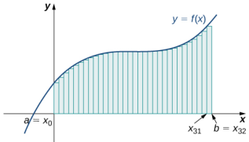
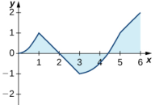
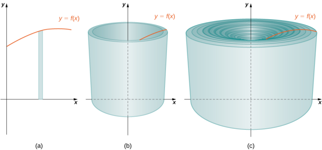
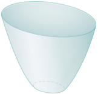
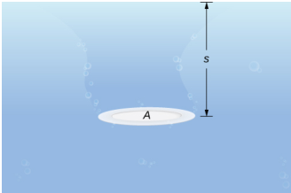
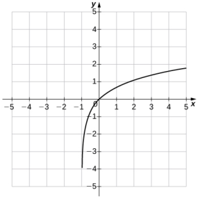

Therefore,

$$\int\tan x\cos x=\int\sin x=-\cos x+C.$$

4.51 Evaluate $\int(4x^{3}-5x^{2}+x-7)dx.$

## Initial-Value Problems

We look at techniques for integrating a large variety of functions involving products, quotients, and compositions later in the text. Here we turn to one common use for antiderivatives that arises often in many applications: solving differential equations.

A differential equation is an equation that relates an unknown function and one or more of its derivatives. The equatior

$$\frac{dy}{dx}=f(x)$$

is a simple example of a differential equation. Solving this equation means finding a function $y$ with a derivative $f$ Therefore, the solutions of Equation 4.9 are the antiderivatives of $f$ If $F$ is one antiderivative of $f$ ，every function of the form $y=F(x)+C$ is a solution of that differential equation. For example, the solutions o

$$\frac{dy}{dx}=6x^2$$

are given by

$$y=\int6x^2dx=2x^3+C.$$

Sometimes we are interested in determining whether a particular solution curve passes through a certain point $(x_0,y_0)$ —that is, $y(x_{0})=y_{0}$ .The problem of finding a function $y$ that satisfies a differential equation

$$\frac{dy}{dx}=f(x)$$

with the additional condition

$$y(x_0)=y_0$$

is an example of an initial-value problem. The condition $y(x_0)=y_0$ is known as an initial condition. For example, looking for a function $y$ that satisfies the differential equatior

$$\frac{dy}{dx}=6x^2$$

and the initial condition

$$y(1)=5$$

is an example of an initial-value problem. Since the solutions of the differential equation are $y=2x^{3}+C$ ，to find a function $y$ that also satisfies the initial condition, we need to find $C$ such that $y(1)=2(1)^{3}+C=5$ . From this equation we see that $C=3$ ，and we conclude that $y=2x^{3}+3$ is the solution of this initial-value problem as shown in the following graph..

Figure 4.a Some o th solution curve of th iferentia equaton $\frac{dy}{dx}=6x^{2}$

are displayed. The function $y=2x^{3}+3$ satisfies the differential equation and the initial condition $y(1)=5$

### Example 4.53

### Solving an Initial-Value Problem

Solve the initial-value problem

$$\frac{dy}{dx}=\sin x,\:y(0)=5.$$

### Solution

First we need to solve the differental equation. If. $\frac{dy}{dx}=\sin x$ ：ther

$$y=\int\sin(x)dx=-\cos x+C.$$

Next we need to look for a solution $y$ that satisfies the initial condition. The initial condition $y(0)=5$ means we need a constant $C$ such that $-\cos x+C=5$ .Therefore,

$$C=5+\cos(0)=6.$$

The solution of the initial-value problem is $y=-\cos x+6$

4.52 Solve the initial value problem $\frac{dy}{dx}=3x^{-2}$ $y(1)=2$

Initial-value problems arise in many applications. Next we consider a problem in which a driver applies the brakes in a car

We are interested in how long it takes for the car to stop. Recall that the velocity function $\nu(t)$ is the derivative of a position function $s(t)$ ，and the acceleration $a(t)$ is the derivative of the velocity function. In earlier examples in the text, we could calculate the velocity from the position and then compute the acceleration from the velocity. In the next example we work the other way around. Given an acceleration function, we calculate the velocity function.We then use the velocity function to determine the position function.

# Example 4.54

## Decelerating Car

A car is traveling at the rate of 88 ft/sec $60mph$ ) when the brakes are applied. The car begins decelerating at a constant rate of 15 ft/sec²

a.How many seconds elapse before the car stops? b.How far does the car travel during that time

### Solution

a.First we introduce variables for this problem. Let $t$ be the time (in seconds) after the brakes are first applied. Let $a(t)$ be the acceleration of the car (in feet per seconds squared) at time $t$ .Let $\nu(t)$ be the velocity of the car (in feet per second) at time $t$ .Let $s(t)$ be the car's position (in feet) beyond the poin where the brakes are applied at time $t$

The car is traveling at a rate of 88 ft/sec. Therefore, the initial velocity is $\nu(0)=88$ ft/sec. Since the car is decelerating, the acceleration is

$$a(t)=-15\:\mathrm{fu/s}^{2}.$$

The acceleration is the derivative of the velocity

$$\nu^{\prime}(t)=-15.$$

Therefore.we have an initial-yalue problem to solve:

$$v'(t)=-15,\:v(0)=88.$$

Integrating, we find that

$$\nu(t)=-15t+C.$$

Since $\nu(0)=88$ ， $C=88$ .Thus, the velocity function is

$$v(t)=-15t+88.$$

To find how long it takes for the car to stop, we need to find the time $t$ such that the velocity is zero Solving $-15t+88=0$ ，we obtain $t=\frac{88}{15}$ sec

b.To findhwfar thear tavels dring his tme, wened to findthe positon of the car af $\frac{88}{15}$ sec.We know the velocity $\nu(t)$ is the derivative of the position $s(t)$ .Consider the initial position to be $s(0)=0$ Therefore, we need to solve the initial-value problem

$$s'(t)=-15t+88,\:s(0)=0.$$

Integrating, we have

$$s(t)=-\frac{15}{2}t^{2}+88t+C.$$

Since $s(0)=0$ ，the constant is $C=0$ Therefore, the position function is

$$s(t)=-\frac{15}{2}t^{2}+88t.$$

After $t=\frac{88}{15}$ sec, the psition is $s\left(\frac{88}{15}\right)\approx258.133$ f

4.53 Suppose the car is traveling at the rate of 44 ft/sec. How long does it take for the car to stop? How far will thecar travel?

### 4.10 EXERCISES

For the following exercises, show that $F(x)$ are483. $f(x)=\sin^{2}(x)\cos(x)$ antiderivatives of $f(x)$

465.
$$F(x)=5x^3+2x^2+3x+1,\:f(x)=15x^2+4x+3$$

466. $F(x)=x^{2}+4x+1$ $f(x)=2x+4$ 467. $F(x)=x^{2}e^{x}$ $f(x)=e^{x}\Big(x^{2}+2x\Big)$ 468. $F(x)=\cos x$ $f(x)=-\sin x$ 469. F(x) = e $F(x)=e^{x}$ $F( x) = e^{x}$, $f( x) = e^{X}$ $f(x)=e^{X}$ f(x) = ex

For the following exercises, find the antiderivative of the function.

470. $f(x)=\frac{1}{x^{2}}+x$ 471. $f(x)=e^{x}-3x^{2}+\sin x$ 472. $f(x)=e^{x}+3x-x^{2}$ 473. $f(x)=x-1+4\sin(2x)$

For the following exercises, find the antiderivative $F(x)$ of each function $f(x)$

474. $f(x)=5x^{4}+4x^{5}$ 475. $f(x)=x+12x^{2}$ 476. $f(x)=\frac{1}{\sqrt{x}}$ 477. $f(x)=(\sqrt{x})^{3}$ 478. $f(x)=x^{1/3}+(2x)^{1/3}$ 479。$f(x)=\frac{x^{1/3}}{x^{2/3}}$

480. $f(x)=2\sin(x)+\sin(2x)$

481. $f(x)=\sec^{2}(x)+1$

482. $f(x)=\sin x\cos x$

484. $f(x)=0$ 485. $f(x)=\frac{1}{2}\csc^{2}(x)+\frac{1}{x^{2}}$ 486. $f(x)=\csc x\cot x+3x$ 487. $f(x)=4$ csc.xcotx - secxtan.x 488. $f(x)=8\sec x(\sec x-4\tan x)$ 489. $f(x)=\frac{1}{2}e^{-4x}+\sin x$

For the following exercises, evaluate the integral.

490. $\int(-1)dx$ 491. $\int\sin xdx$ 492. $\int(4x+\sqrt{x})dx$ 493 $\int\frac{3x^2+2}{x^2}dx$ 494. $\int(\sec x\tan x+4x)dx$ 495. $\int(4\sqrt{x}+\sqrt[4]{x})dx$ 496. $\int(x^{-1/3}-x^{2/3})dx$ 497 $\int\frac{14x^{3}+2x+1}{x^{3}}dx$ 498. $\int(e^{x}+e^{-x})dx$

For the following exercises, solve the initial value problem.

499. $f^{\prime}(x)=x^{-3},f(1)=1$ 500. $f^{\prime }( x) = \sqrt {x}+ x^{2}$, $f( 0) = 2$ 501. $f^{\prime }\left ( x\right ) = \cos x+ \sec ^{2}( x)$, $f\left ( \frac \pi 4\right ) = 2+ \frac {\sqrt {2}}2$ 502. $f^{\prime}(x)=x^{3}-8x^{2}+16x+1$ $f(0)=0$

$$f'(x)=\frac{2}{x^2}-\frac{x^2}{2},\:f(1)=0$$

For the following exercises, find two possible functions $f$ given the second- or third-order derivatives

504. $f^{\prime\prime}(x)=x^{2}+2$ 505. $f^{\prime\prime}(x)=e^{-X}$ 506. $f^{\prime\prime}(x)=1+x$ 507. $f^{\prime\prime}(x)=\cos x$ 508. $f^{\prime\prime\prime}(x)=8e^{-2x}-\sin x$

509.A car is being driven at a rate of 40 mph when the brakes are applied. The car decelerates at a constant rate of 10 ft/sec². How long before the car stops?

510. In the preceding problem, calculate how far the car travels in the time it takes to stop.

511. You are merging onto the freeway, accelerating at a constant rate of $1\bar{2}$ ft/sec$^2$ .How long does it take you to reach merging speed at 60 mph?

512. Based on the previous problem, how far does the car travel to reach merging speed?

513. A car company wants to ensure its newest model can stop in 8 sec when traveling at $75mph$ . If we assume constant deceleration, find the value of deceleration that accomplishes this.

514. A car company wants to ensure its newest model can stop in less than 450 ft when traveling at 60 mph . If we assume constant deceleration, find the value of deceleration that accomplishes this.

For the following exercises, find the antiderivative of the function, assuming $F(0)=0$

515. [T] $f(x)=x^{2}+2$ 516. [T] $f(x)=4x-\sqrt{x}$ 517. [T] $f(x)=\sin x+2x$ 518. [T] $f(x)=e^{.}$ 519. [T] $f(x)={\frac{1}{\left(x+1\right)^{2}}}$ 520.[T] $f(x)=e^{-2x}+3x^{2}$

For the following exercises, determine whether the statement is true or false. Either prove it is true or find a counterexample if it is false.

521.If $f(x)$ is the antiderivative of $\nu(x)$ ，then $2f(x)$ is the antiderivative of $2v(x)$

522.If $f(x)$ is the antiderivative of $\nu(x)$ ，then $f(2x)$ is the antiderivative of $\nu(2x)$

523.If $f(x)$ is the antiderivative of $\nu(x)$ ，then $f(x)+1$ is the antiderivative of $\nu(x)+1$

524.If $f(x)$ is the antiderivative of $\nu(x)$ ，then $(f(x))^2$ is the antiderivative of $(v(x))^2$

# CHAPTER 4 REVIEW

# KEY TERMS

absolute extremum if $f$ has an absolute maximum or absolute minimum at $C$ ，we say $f$ has an absolute extremun at $C$

absolute maximum if $f(c)\geq f(x)$ for all $X$ in the domain of $f$ ，we say $f$ has an absolute maximum at L

absolute minimum if $f(c)\leq f(x)$ for all $X$ in the domain of $f$ ，we say $f$ has an absolute minimum at $C$

antiderivative a function $F$ such that $F^{\prime}(x)=f(x)$ for all $JI$ in the domain of $f$ is an antiderivative of $f$

concave down if $f$ is differentiable over an interval $I$ and $f^{\prime\prime}$ is decreasing over $I$ ，then $f$ is concave down over 1

concave up if $f$ is differentiable over an interval $I$ and $f^{\prime}$ is increasing over $I$ ，then $f$ is concave up over $I$

concavity the upward or downward curve of the graph of a function

concavity test suppose $f$ is twice differentiable over an interval $I$ ：if $f^{\prime\prime}>0$ over $I$ ，then $f$ is concave up over $I$ if $f^{\prime\prime}<0$ over $I$ ，then $f$ is concave down over $I$

critical point if $f^{\prime}(c)=0$ or $f^{\prime}(c)$ is undefined, we say that $C$ is a critical point of $f$

differential the differential $dx$ is an independent variable that can be assigned any nonzero real number; the differential $dy$ is defined to be $dy=f^{\prime}(x)dx$

differential form given a differentiable function $y=f^{\prime}(x)$ ， the equation $dy=f^{\prime}(x)dx$ is the differential form of the derivative of $y$ with respect to X

end behavior the behavior of a function as $X\to\mathbb{CO}$ and $x\to-\infty$

extreme value theorem if $f$ is a continuous function over a finite, closed interval, then $f$ has an absolute maximum and an absolute minimum

Fermat's theorem if $f$ has a local extremum at $C$ ，then $C$ is a critical point of $f$

first derivative test let $f$ be a continuous function over an interval $I$ containing a critical point $C$ such that $f$ is differentiable over $I$ except possibly at $C$ if $f^{\prime}$ changes sign from positive to negative as $X$ increases through $\boldsymbol{C}$ then $f$ has a local maximum at $C$ ; if $f^{\prime}$ changes sign from negative to positive as $X$ increases through $C$ ，then $f$ has a local minimum at $C$ ；if $f^{\prime}$ does not change sign as $X$ increases through $C$ ，then $f$ does not have a loca extremum at $C$

horizontal asymptote if $\lim_{x\to\infty}f(x)=L$ or $\operatorname*{lim}_{x\to-\infty}f(x)=L$ ，then $y=L$ is a horizontal asymptote of $f$

indefinite integral the most general antiderivative of $f(x)$ is the indefinite integral of $f$ ；we use the notatior $\int f(x)dx$ to denote the indefinite integral of $f$

indeterminate forms when evaluating a limit, the forms . c0/oo, O-oo, co - oo, 0°. $\infty^{0}$ ，and $1^{\infty}$ are considered indeterminate because further analysis is required to determine whether the limit exists and, if so, what its value is

infinite limit at infinity a function that becomes arbitrarily large as $X$ becomes large

inflection point if $f$ is continuous at $C$ and $f$ changes concavity at $C$ ，the point (c, $f(c)\rangle$ is an inflection point of $f$

initial value problem a problem that requires finding a function $y$ that satisfies the differential equation = f(x together with the initial condition $y(x_{0})=y_{0}$

iterative process process in which a list of numbers $x_0$, $x_1$, $x_2$, $x_3\ldots$ is generated by starting with a number $X_{0}$ and defining $x_{n}=F(x_{n-1})$ for $n\geq1$

limit at infinity the limiting value, if it exists, of a function as $X\to00$ or $x\rightarrow-\infty$

linear approximation the linear function $L(x)=f(a)+f^{\prime}(a)(x-a)$ is the linear approximation of $f$ at $X=\boldsymbol{\omega}$

local extremum if $f$ has a local maximum or local minimum at $C$ ，we say $f$ has a local extremum at $C$

local maximum if there exists an interval $I$ such that $f(c)\geq f(x)$ for all $x\in I$ ，we say $f$ has a local maximum at C

local minimum if there exists an interval $I$ such that $f(c)\leq f(x)$ for all $x\in I$ ,we say $f$ has a local minimum at $C$

L'Hopital's rule if $f$ and $g$ are differentiable functions over an interval $a$ ，except possibly at $a$ ，and $\operatorname*{lim}_{x\to a}f(x)=0=\operatorname*{lim}_{x\to a}g(x)$ or $\lim_{x\to a}f(x)$ and $\lim_{x\to a}g(x)$ are infite, then $\lim_{x\to a}\frac{f(x)}{g(x)}=\lim_{x\to a}\frac{f^{\prime}\left(x\right)}{g^{\prime}\left(x\right)}$ assuming th limit on the right exists or is 00 or $-\infty$

mean value theorem if $f$ is continuous over $[a,b]$ and differentiable over $(a,b)$ ，then there exists $c\in(a,b)$ such that

$$f'\left(c\right)=\frac{f(b)-f(a)}{b-a}$$

Newton's method method for approximating roots of $f(x)=0$ ;using an initial guess $x_0$ : each subsequen approximatin is eined by he quation $x_{n}=x_{n-1}-\frac{f(x_{n-1})}{f^{\prime}(x_{n-1})}$

oblique asymptote the line $y=mx+b$ if $f(x)$ approaches it as $x\to\infty$ or $x\to-\infty$

optimization problems problems that are solved by finding the maximum or minimum value of a function

percentage error the relative error expressed as a percentage

propagated error the error that results in a calculated quantity $f(x)$ resulting from a measurement error dx

related rates are rates of change associated with two or more related quantities that are changing over time

relative erro given n absolut er $\Delta q$ for a pariculr uaniyity $\frac{\Delta q}q$ is thereltie erer

rolle's theorem if $f$ is continuous over $[a,b]$ and differentiable over $(a,b)$ ，and if $f(a)=f(b)$ ，then there exists $c\in(a,b)$ such that $f^{\prime}(c)=0$

second derivative test suppose $f^{\prime}(c)=0$ and $f^{\prime\prime}$ is continuous over an interval containing $C$ ;if $f^{\prime\prime}(c)>0$ ，then $f$ has a local minimum at $C$ ；if $f^{\prime\prime}(c)<0$ ，then $f$ has a local maximum at $c$ ；if $f^{\prime\prime}(c)=0$ then the test is inconclusive

tangent line approximation (linearization) since the linear approximation of $f$ at $x=a$ is defined using the equation of the tangent line, the linear approximation of $f$ at $x=a$ is also known as the tangent line approximatior to $f$ at $X=a$

# KEY EQUATIONS

### Linear approximation

$$L(x)=f(a)+f^{\prime}(a)(x-a)$$

·A differential

dy=fxdx

# KEY CONCEPTS

### 4.1 Related Rates

·To solve a related rates problem, first draw a picture that illustrates the relationship between the two or more related quantities that are changing with respect to time. •In terms of the quantities, state the information given and the rate to be found ·Find an equation relating the quantities. ·Use differentiation, applying the chain rule as necessary, to find an equation that relates the rates •Be sure not to substitute a variable quantity for one of the variables until after finding an equation relating the rates

4.2 Linear Approximations and Differentials

A differentiable function $y=f(x)$ can be approximated at $d$ by the linear functior

$$L(x)=f(a)+f'(a)(x-a).$$

·For a function $y=f(x)$ ，if $X$ changes from $d$ to $a+dx$ ，then

$$dy=f^{\prime}(x)dx$$

is an approximation for the change in $y$ The actual change in $y$ is
$$\Delta y=f(a+dx)-f(a).$$
A measurement error $dx$ can lead to an error in a calculated quantity $f(x)$ .The errorin the calculated quantityi known as the propagated error. The propagated error can be estimated by
$$dy\approx f^{\prime}(x)dx.$$
· To estimate the relative error o a particular quantity 4 ，we estimate $\frac{\Delta q}q$

### 4.3 Maxima and Minima

·A function may have both an absolute maximum and an absolute minimum, have just one absolute extremum, or have no absolute maximum or absolute minimum •If a function has a local extremum, the point at which it occurs must be a critical point. However, a function need not have a local extremum at a critical point ·A continuous function over a closed, bounded interval has an absolute maximum and an absolute minimum. Each extremum occurs at a critical point or an endpoint

### 4.4 The Mean Value Theorem

·If $f$ is continuous over $[a,b]$ and differentiable over $(a,b)$ and $f(a)=0=f(b)$ ，then there exists a point $c\in(a,b)$ such that $f^{\prime}(c)=0$ . This is Rolle's theorem.

·If $f$ is continuous over $[a,b]$ and differentiable over (a,b),then there exists a point $c\in(a,b)$ such that

$$f'(c)=\frac{f(b)-f(a)}{b-a}.$$

This is the Mean Value Theorem

·If $f^{\prime}(x)=0$ over an interval $I$ ，then $f$ is constant over $I$ If two differentiable functions $f$ and $g$ satisfy $f^{\prime}(x)=g^{\prime}(x)$ over $I$ ，then $f(x)=g(x)+C$ for some constant $C$ . ·If $f^{\prime}(x)>0$ over an interval $I$ ，then $f$ is increasing over $I$ .If $f^{\prime}(x)<0$ over $I$ ，then $f$ is decreasing over 1.

### 4.5 Derivatives and the Shape of a Graph

·If $L$ is a critical point of $f$ and $f^{\prime}\left(x\right)>0$ for $x<c$ and $f^{\prime}(x)<0$ for $x>c$ then $f$ has a local maximum at C. ·If $C$ is a critical point of $f$ and $f^{\prime}(x)<0$ for $x<c$ and $f^{\prime}(x)>0$ for $x>c$ ，then $f$ has a local minimum at C. ·If $f^{\prime\prime}(x)>0$ over an interval $I$ ，then $f$ is concave up over $I$ ·If $f^{\prime\prime}(x)<0$ over an interval $I$ ，then $f$ is concave down over $I$ ·If $f^{\prime}(c)=0$ and $f^{\prime\prime}(c)>0$ ，then $f$ has a local minimum at $C$ ·If $f^{\prime}(c)=0$ and $f^{\prime\prime}(c)<0$ ，then $f$ has a local maximum at $C$ ·If $f^{\prime}(c)=0$ and $f^{\prime\prime}(c)=0$ ，then evaluate $f^{\prime}\left(x\right)$ at a test point $X$ to the left of $C$ and a test point $X$ to the right of $C$ ，to determine whether $f$ has a local extremum at $C$

## 4.6 Limits at Infinity and Asymptotes.

•The limit of $f(x)$ is $L$ as $x\to\infty$ (or as $x\to-\infty$ ） if the values $f(x)$ become arbitrarily close to $L$ as $x$ becomes sufficiently large. ·The limit of $f(x)$ is $\infty0$ as $x\to\infty$ if $f(x)$ becomes arbitrarily large as $x$ becomes sufficiently large. The limit of $f(x)$ is $-\infty$ as $x\to\infty$ if $f(x)<0$ and $|f(x)|$ becomes arbitrarily large as $x$ becomes sufficiently large. We can define the limit of $f(x)$ as $X$ approaches $-\infty$ similarly
$$p(x)=a_{n}x^{n}+a_{n-1}x^{n-1}+...+a_{1}x+a_{0},\quad\mathrm{where}\:a_{n}\neq0,$$
determined by the leading term $a_nx^n$ . If $n\neq 0$, $p( x)$ approaches $\infty$ or $-\infty$ at each end. · For rational funton $f(x)=\frac{p(x)}{q(x)}$ .the end behavio is etermined by the elatinship beteen the dere of $P$ and the degree of $q$ If the degree of $P$ is less than the degree of $q$ ，the line $y=0$ is a horizontal asymptote for $f.$ If the degree of $P$ is equal to the degree of $q$ ,then the line y = is a horizontal asymptote, where $a_{n}$ and $b_{n}$ are the leading coefficients of $P$ and $q$ ,respectively.If the degree of $P$ is greater than the degree of $q$ ，then $f$ approaches 00 or $-\infty$ at each end

## 4.7 Applied Optimization Problems

•To solve an optimization problem, begin by drawing a picture and introducing variables ·Find an equation relating the variables. •Find a function of one variable to describe the quantity that is to be minimized or maximized.

Look for critical points to locate local extrema

### 4.8 L'Hopital's Rule

• L'Hopital's rule can be used to evaluate the limit of a quotient when the indeterminate form $\frac{0}{0}$ or $\infty/\infty$ arises •L'Hopital’s rule can also be applied to other indeterminate forms if they can be rewritten in terms of a limit involving a quotient that has the indeterminate form $\frac{0}{0}$ or $\infty/\infty$ The exponential function $e^{X}$ grows faster than any power function $x^{P}$, $p> 0$ The logarithmic function $\ln x$ grows more slowly than any power function $x^{P}$, $p> 0$

### 4.9 Newton's Method

•Newton’s method approximates roots of $f(x)=0$ by starting with an initial approximation $x_0$ ,then uses tangent lines to the graph of $f$ to create a sequence of approximations $x_{1}$, $x_{2}$, $x_{3}$, ... •Typically, Newton’s method is an efficient method for finding a particular root. In certain cases, Newton's metho fails to work because the list of numbers $x_0$, $x_1$, $x_2, .$ X2 $x_{2}$ . does not approach a finite value or it approaches a value other than the root sought. · Any process in which a list of numbers $x_0$, $x_1$, $x_2, \ldots$ is generated by defining an initial number $X_{0}$ and defining the subsequent numbers by the equation $x_{n}=F(x_{n-1})$ for some function $F$ is an iterative process. Newton's method is an example of a ierative process, where the function F(x) = x -f(<)| for a given function $f$

### 4.10 Antiderivatives

·If $F$ is an antiderivative of $f$ ,then every antiderivative of $f$ is of the form $F(x)+C$ for some constant $C$ Solving the initial-value problem

$$\frac{dy}{dx}=f(x),\:y(x_0)=y_0$$

requires us first to find the set of antiderivatives of $f$ and then to look for the particular antiderivative that also satisfies the initial condition..

### CHAPTER 4 REVIEWEXERCISES

528.There is a function such that there is both an inflection point and a critical point for some value $x=a$

True or False? Justify your answer with a proof or a counterexample. Assume that $f(x)$ is continuous and differentiable unless stated otherwise

525.If $f(-1)=-6$ and $f(1)=2$ ，then there exists at least one point $x\in [ - 1$, 1] such that $f^{\prime}\left(x\right)=4$

526.If $f^{\prime}(c)=0$ ,there is a maximum or minimum at $X=C$

527. There is a function such that $f(x)<0$ $f^{\prime}\left(x\right)>0$ and $f^{\prime\prime}(x)<0$ - (A graphical “proof" is acceptable for this answer.)

529.Given the graph of $f^{\prime}$ determine where $f$ is increasing or decreasing

530. The graph of $f$ is given below. Draw $f^{\prime}$

$y=x^{2}+\tan(\pi x)$ near $x=\frac{1}{4}$

532. Find the differential of $y=x^{2}-5x-6$ and evaluate for $x=2$ with $dx=0.1$

Find the critical points and the local and absolute extrema of the following functions on the given interval.

533. $f(x)=x+\sin^{2}(x)$ over [0,π]

534. $f(x)=3x^{4}-4x^{3}-12x^{2}+6$ over [3, 3]

Determine over which intervals the following functions are increasing, decreasing, concave up, and concave down

535. $x(t)=3t^{4}-8t^{3}-18t^{2}$

536. $y=x+\sin(\pi x)$

537. $g(x)=x-\sqrt{x}$

538. $f(\theta)=\sin(3\theta)$

Evaluate the following limits

539.。$\lim_{x\to\infty}\frac{3x\sqrt{x^2+1}}{\sqrt{x^4-1}}$

540. lim cos(x)

541. Iim sit(c)

542.lim (3x) /x

Use Newton's method to find the first two iterations, given the starting point.

543.y=x+1x=0.5

544. $\frac 1{x+ 1}= \frac 12$, $x_{0}= 0$

Find the antiderivatives $F(x)$ of the following functions

545. $g(x)=\sqrt{x}-\frac{1}{x^{2}}$

531.Find the linear approximation $L(x)$ to546. $f(x)=2x+6\cos x$ 文$F(\pi)=\pi^{2}+2$

Graph the following functions by hand. Make sure to label the inflection points, critical points, zeros, and asymptotes

547.
$$y=\frac{1}{x(x+1)^{2}}$$

548. $y=x-\sqrt{4-x^{2}}$

549. A car is being compacted into a rectangular solid The volume is decreasing at a rate of $2\mathrm{~m}^3/$sec . The length and width of the compactor are sauare.but the height is not the same length as the length and width. If the length and width walls move toward each other at a rate of 0.25m/ sec, find the rate at which the height is changing when the length and width are $2m$ and the height is $1.5m$

550. A rocket is launched into space; its kinetic energy is given by $K(t)=\left(\frac{1}{2}\right)m(t)v(t)^{2}$ ，where $K$ is the kinetic energy in joules, $m$ is the mass of the rocket in kilograms, and $\nu$ is the velocity of the rocket in meters/second Assume the velocity is increasing at a rate of $15~\mathrm{m/sec}^{2}$ and the mass is decreasing at a rate of 10 kg/sec because the fuel is being burned. At what rate is the rocket's kinetic energy changing when the mass is 2000 kg and the velocity is 5000 m/sec? Give your answer in mega-Joules (MJ), which is equivalent to $10^6$ J

551. The famous Regiomontanus’ problem for angle maximization was proposed during the $15th$ century. A painting hangs on a wall with the bottom of the painting a distance $a$ feet above eye level, and the top $b$ feet above eye level. What distance $x$ (in feet) from the wall should the viewer stand to maximize the angle subtended by the painting, $\theta$ ？

552.An airline sells tickets from Tokyo to Detroit for $\$1200$ . There are 500 seats available and a typical flight books 350 seats.For every $\$10$ decrease in price, the airline observes an additional five seats sold. What should the fare be to maximize profit? How many passengers would be onboard?

# 5 | INTEGRATION

Figure 5.1 Iceboating is a popular winter sport in parts of the northern United States and Europe. (credit: modification of work

by Carter Brown, Flickr)

## Chapter Outline

5.1 Approximating Areas

5.2 The Definite Integral

5.3 The Fundamental Theorem of Calculus

5.4 Integration Formulas and the Net Change Theorem 5.5 Substitution 5.6 Integrals Involving Exponential and Logarithmic Functions 5.7 Integrals Resulting in Inverse Trigonometric Functions

## Introduction

Iceboats are a common sight on the lakes of Wisconsin and Minnesota on winter weekends. Iceboats are similar to sailboats, but they are fitted with runners, or “skates,” and are designed to run over the ice, rather than on water. Iceboats can move very quickly, and many ice boating enthusiasts are drawn to the sport because of the speed. Top iceboat racers can attain

speeds up to five times the wind speed. If we know how fast an iceboat is moving, we can use integration to determine how far it travels. We revisit this question later in the chapter (see Example 5.27).

Determining distance from velocity is just one of many applications of integration. In fact, integrals are used in a wide variety of mechanical and physical applications. In this chapter, we first introduce the theory behind integration and use integrals to calculate areas. From there, we develop the Fundamental Theorem of Calculus, which relates differentiation and integration. We then study some basic integration techniques and briefly examine some applications.

# 5.1 | Approximating Areas

<table>
	<tbody>
		<tr>
			<td> </td>
			<td>Learning Objectives</td>
		</tr>
		<tr>
			<td>5.1.1</td>
			<td>of inteqers mwers t</td>
		</tr>
		<tr>
			<td>5.1.2</td>
			<td>ra clinve</td>
		</tr>
		<tr>
			<td>5.1.3</td>
			<td>nate area</td>
		</tr>
	</tbody>
</table>

Archimedes was fascinated with calculating the areas of various shapes—in other words, the amount of space enclosed by the shape. He used a process that has come to be known as the method of exhaustion, which used smaller and smaller shapes, the areas of which could be calculated exactly, to fill an irregular region and thereby obtain closer and closer approximations to the total area. In this proces, an area bounded by curves is filled with rectangles, triangles, and shapes with exact area formulas. These areas are then summed to approximate the area of the curved region

In this section, we develop techniques to approximate the area between a curve, defined by a function $f(x)$ ，andthe $x$ -axis on a closed interval [a, b]. Like Archimedes, we first approximate the area under the curve using shapes of known area (namely, rectangles). By using smaller and smaller rectangles, we get closer and closer approximations to the area. Taking a limit allows us to calculate the exact area under the curve.

Let's start by introducing some notation to make the calculations easier. We then consider the case when $f(x)$ is continuous and nonnegative. Later in the chapter, we relax some of these restrictions and develop techniques that apply in more general cases.

# Sigma (Summation) Notation

As mentioned, we will use shapes of known area to approximate the area of an irregular region bounded by curves. This process often requires adding up long strings of numbers. To make it easier to write down these lengthy sums, we look at some new notation here, called sigma notation (also known as summation notation). The Greek capital letter $\Sigma$ ，sigma,

is used to express long sums of values in a compact form. For example, if we want to add all the integers from 1 to 20 without sigma notation, we have to write

$$1+2+3+4+5+6+7+8+9+10+11+12+13+14+15+16+17+18+19+20.$$

We could probably skip writing a couple of terms and write

$$1+2+3+4+\cdots+19+20,$$

which is better, but still cumbersome. With sigma notation,we write this sum as

$$\sum_{i=1}^{20}i,$$

which is much more compact.

Typically, sigma notation is presented in the form

$$\sum_{i=1}^na_i$$

where $a_{i}$ describes the terms to be added, and the $i$ is called the index. Each term is evaluated, then we sum all the values

beginig it t ae iee $i=1$ and edin it h ale iee $i=n$ Fo esaple epeso e $\sum_{i=2}^7s_i$ is

interpreted as $s_{2}+s_{3}+s_{4}+s_{5}+s_{6}+s_{7}.$ Note that the index is used only to keep track of the terms to be added; it does not factor into the calculation of the sum itself. The index is therefore called a dummy variable. We can use any letter we like for the index. Typically, mathematicians use $i,j,k,m$ , and $n$ for indices.

Let's try a couple of examples of using sigma notation.

### Example 5.1

### Using Siqma Notation

a.Write in sigma notation and evaluate the sum of terms $3^i$ for $i=1$ 23,4,5.

b.Write the sum in sigma notation

$$1+\frac14+\frac19+\frac1{16}+\frac1{25}.$$

## Solution

a.Write

$$\begin{aligned}\sum_{i\:=\:1}^{5}3^{i}&=3+3^{2}+3^{3}+3^{4}+3^{5}\\&=363.\end{aligned}$$

b.The denominator of each term is a perfect square. Using sigma notation, this sum can be written as $\sum_{i=1}^5\frac1{i^2}.$

5.1Write in sigma notation and evaluate the sum of terms $2^i$ for $i=3$ .4.5.6

The properties associated with the summation process are given in the following rule.

### Rule: Properties of Siqma Notation

Let $a_1,a_2,...,a_n$ and $b_1,b_2,...,b_n$ represent two sequences of terms and let $C$ be a constant. The following properties hold for all positive integers $n$ and for integers $m$ ,with $1\leq m\leq n$

1.

$$\sum_{i=1}^{n}c=nc$$

2.

$$\sum_{i=1}^nca_i=c\sum_{i=1}^na_i$$

3.

$$\sum_{i=1}^{n}\left(a_{i}+b_{i}\right)=\sum_{i=1}^{n}a_{i}+\sum_{i=1}^{n}b_{i}$$

4.

$$\sum_{i=1}^{n}\left(a_{i}-b_{i}\right)=\sum_{i=1}^{n}a_{i}-\sum_{i=1}^{n}b_{i}$$

5.

$$\sum_{i=1}^{n}a_{i}=\sum_{i=1}^{m}a_{i}+\sum_{i=m+1}^{n}a_{i}$$

## Proof

We prove properties 2. and 3. here, and leave proof of the other properties to the Exercises.

2. We have

$$\begin{aligned}
\sum_{i\:=\:1}^{n}ca_{i}& =ca_{1}+ca_{2}+ca_{3}+\cdots+ca_{n} \\
&=c(a_{1}+a_{2}+a_{3}+\cdots+a_{n}) \\
&=c\sum_{i=1}^{n}a_{i}.
\end{aligned}$$

3. We have

$$\begin{aligned}
\sum_{i=1}^{n}\:(a_{i}+b_{i})& =(a_{1}+b_{1})+(a_{2}+b_{2})+(a_{3}+b_{3})+\cdots+(a_{n}+b_{n}) \\
&=(a_{1}+a_{2}+a_{3}+\cdots+a_{n})+(b_{1}+b_{2}+b_{3}+\cdots+b_{n}) \\
&=\sum_{i\:=\:1}^{n}a_{i}+\sum_{i\:=\:1}^{n}b_{i}.
\end{aligned}$$

口

A few more formulas for frequently found functions simplify the summation process further. These are shown in the next rule, for sums and powers of integers, and we use them in the next set of examples

### Rule:Sums and Powers of Integers

1. The sum of $n$ integers is given by

$$\sum_{i=1}^ni=1+2+\cdots+n=\frac{n(n+1)}{2}.$$

2.The sum of consecutive integers squared is given by

$$\sum_{i=1}^{n}i^{2}=1^{2}+2^{2}+\cdots+n^{2}=\frac{n(n+1)(2n+1)}{6}.$$

 3. The sum of consecutive integers cubed is given by

$$\sum_{i=1}^{n}i^{3}=1^{3}+2^{3}+\cdots+n^{3}=\frac{n^{2}\left(n+1\right)^{2}}{4}.$$

## Example 5.2

 Evaluation Using Sigma Notation

Write using sigma notation and evaluate

a.The sum of the terms $(i-3)^2$ for $i=1$ ,2,.., 200.

b. The sum of the terms $\left(i^{3}-i^{2}\right)$ for i = 1, 2, 3, 4, 5, 6.

### Solution

a. Multiplying out $(i-3)^2$ we can break the expression into three terms

$$\begin{aligned}
\sum_{i=1}^{200}\left(i-3\right)^{2}& =\sum_{i\:=\:1}^{200}\left(i^{2}-6i+9\right) \\
&=\sum_{i=1}^{200}i^{2}-\sum_{i=1}^{200}6i+\sum_{i=1}^{200}9 \\
&=\sum_{i=1}^{200}i^{2}-6\sum_{i=1}^{200}i+\sum_{i=1}^{200}9 \\
&=\frac{200(200+1)(400+1)}{6}-6\biggl[\frac{200(200+1)}{2}\biggr]+9(200) \\
&=2,686,700-120,600+1800 \\
&=2,567,900
\end{aligned}$$

b.Use sigma notation property iv. and the rules for the sum of squared terms and the sum of cubed terms.
$$\begin{aligned}
\sum_{i\:=\:1}^{6}\left(i^{3}-i^{2}\right)& =\sum_{i\:=\:1}^{6}i^{3}-\sum_{i\:=\:1}^{6}i^{2} \\
&=\frac{6^{2}(6+1)^{2}}{4}-\frac{6(6+1)(2(6)+1)}{6} \\
&=\frac{1764}{4}-\frac{546}{6} \\
&=350
\end{aligned}$$

5.2 Find the sum of the values of $4+3i$ for $i=1$ 2...100

## Example 5.3

Finding the Sum of the Function Values

Find the sum of the values of $f(x)=x^{3}$ over the integers 1, 2, 3..., 10

### Solution

Using the formula, we have

$$\begin{aligned}
\sum_{i=0}^{10}i^{3}& =\frac{(10)^{2}(10+1)^{2}}{4}  \\
&=\frac{100(121)}{4} \\
&=3025.
\end{aligned}$$

## Approximating Area

Now that we have the necessary notation, we return to the problem at hand: approximating the area under a curve. Let $f(x)$ be a continuous, nonnegative function defined on the closed interval $[a,b]$ We want to approximate the area A bounded by $f(x)$ above, the $x$ -axis below, the line $x=a$ on the left, and the line $x=b$ on theright (Figure 5.2)

Figure 5.2 An area (shaded region) bounded by the curve

$f(x)$ at top, the $x$ axis at bottom, the line $x=a$ to the left, and the line $x=b$ at right

How do we approximate the area under this curve? The approach is a geometric one. By dividing a region into many small shapes that have known area formulas, we can sum these areas and obtain a reasonable estimate of the true area. We begin by dividing the interval $[a,b]$ $b]$ b into Tr subintervals of equal width, $\frac{b-a}n$ We do this by selecting equally spaced points $x_0$, $x_1$, $x_2, \ldots , x_n$ with $x_{0}=a$ $x_{n}=b$ ，and

$$x_i-x_{i-1}=\frac{b-a}{n}$$

fori=12,3....n

We denote the width of each subinterval with the notation $\Delta x$ sox=b=aanc

$$x_i=x_0+i\Delta x$$

for $i=1$ , 2, 3.,..., n. This notion of dividing an interval $[a,b]$ $b]$ b into subintervals by selecting points from within the interval is used quite often in approximating the area under a curve, so let's define some relevant terminology

### Definition

A set of points $P=\{x_{i}\}$ for i=0 $i=0$ $i=0,1,2,...,n$ with $a=x_{0}<x_{1}<x_{2}<\cdots<x_{n}=b$, which divides the interval $[a,b]$ into subintervals of the form $[ x_0$, $x_1] , [ x_1$, $x_2] , \ldots , [ x_{n- 1}$, $x_n]$ is called a partition of $[a,b].$ If the subintervals all have the same width, the set of points forms a regular partition of the interval $[a,b]$

We can use this regular partition as the basis of a method for estimating the area under the curve. We next examine two methods: the left-endpoint approximation and the right-endpoint approximation.

### Rule: Left-Endpoint Approximation

On each subinterval $[x_{i-1},x_{i}]$ (for $i= 1$, 2, $3, \ldots , n$ ).construct a rectangle with width $\Delta x$ and height equal to $f(x_{i-1})$ , which is the function value at the left endpoint of the subinterval. Then the area of this rectangle is $f(x_{i-1})\Delta x$ .Adding the areas of all these rectangles, we get an approximate value for A (Figure 5.3). We use the notation $L_n$ to denote that this is a left-endpoint approximation of A using $n$ subintervals.e

Figure 5.3In the left-endpoint approximation of area under a

curve, the height of each rectangle is determined by the function yalue at the left of each subinterval

The second method for approximating area under a curve is the right-endpoint approximation. It is almost the same as the left-endpoint approximation, but now the heights of the rectangles are determined by the function values at the right of each subinterval.e

# Rule: Right-Endpoint Approximation

 Construct a rectangle on each subinterval $[x_{i-1},x_{i}]$ ,only this time the height of the rectangle is determined by the function value $f(x_i)$ at the right endpoint of the subinterval. Then, the area of each rectangle is $f(x_{i})\Delta x$ and the approximation fore $A$ is given by

$$\begin{aligned}
A\approx R_{n}& =f(x_{1})\Delta x+f(x_{2})\Delta x+\cdots+f(x_{n})\Delta x  \\
&=\sum_{i=1}^{n}f(x_{i})\Delta x.
\end{aligned}$$

The notation $R_n$ indicates this is a right-endpoint approximation for A (Figure 5.4)

Figure 5.4In the right-endpoint approximation of area under

a curve, the height of each rectangle is determined by the function value at the right of each subinterval. Note that the right-endpoint approximation differs from the left-endpoint approximation in Figure 5.3.

The graphs i Figure 5.5 represent the curve $f(x)=\frac{x^{2}}{2}$ . In graph (a) we divide the region represented by the interval [0, 3] into six subintervals, each of width 0.5. Thus, $\Delta x=0.5$ .We then form six rectangles by drawing vertical lines perpendicular to $x_{i-1}$ ,the left endpoint of each subinterval. We determine the height of each rectangle by calculating $f(x_{i-1})$ for $i=1$ , 2, 3, 4, 5, 6. The intervals are [0, 0.5], [0.5, 1], [1, 1.5], [1.5, 2], [2, 2.5], [2.5, 3]. We find the area of each rectangle by multiplying the height by the width. Then, the sum of the rectangular areas approximates the area between $f(x)$ and the $X$ -axis. When the left endpoints are used to calculate height, we have a left-endpoint approximation. Thus,

Fiqure 5.5 Methods of approximating the area under a curve by using (a) the left endpoint

and (b) the right endpoints

In Figure 5.5(b), we draw vertical lines perpendicular to $x_i$ such that $x_i$ is the right endpoint of each subinterval, and calculate $f(x_i)$ for $i=1$ , 2, 3, 4, 5, 6. We multiply each $f(x_i)$ by $\Delta x$ to find the rectangular areas, and then add them. This is a right-endpoint approximation of the area under $f(x)$ .Thus,

$$\begin{aligned}
A\approx R_{6}& =\sum_{i=1}^{b}f(x_{i})\Delta x=f(x_{1})\Delta x+f(x_{2})\Delta x+f(x_{3})\Delta x+f(x_{4})\Delta x+f(x_{5})\Delta x+f(x_{6})\Delta x \\
&=f(0.5)0.5+f(1)0.5+f(1.5)0.5+f(2)0.5+f(2.5)0.5+f(3)0.5 \\
&=0.0625+0.25+0.5625+1+1.5625+2.25 \\
&=5.6875.
\end{aligned}$$

# Example 5.4

Approximating the Area Under a Curve

Use both left-endpoint and right-endpoint approximations to approximate the area under the curve of $f(x)=x^{2}$ on the interval [0, 2]; use $n=4$

### Solution

First, divide the interval IO 2 into equl subintervals using $n=4$ $\Delta x=\frac{(2-0)}{4}=0.5$ This is the with of each rectangle. The intervals [0, 0.5] 0.5, 1], [1, 1.5] [1.5, 2]are shown in Figure 5.6. Using a left-endpoin approximation, the heights are $f(0)=0$ $f(0.5)=0.25$ $f(1)=1$ $f(1.5)=2.25$ . Then,

Figure 5.6 The graph shows the left-endpoint approximation

of the area under $f(x)=x^2$ from O to 2.

The right-endpoint approximation is shown in Figure 5.7. The intervals are the same, $\Delta x=0.5$ ，but now use the right endpoint to calculate the height of the rectangles.We have

$$\begin{aligned}
&\text{V} \\
R_{4}& =f(x_{1})\Delta x+f(x_{2})\Delta x+f(x_{3})\Delta x+f(x_{4})\Delta x  \\
&=0.25(0.5)+1(0.5)+2.25(0.5)+4(0.5) \\
&=3.75.
\end{aligned}$$

Figure 5.7 The graph shows the right-endpoint approximation

of the area under $f(x)=x^{2}$ from 0 to 2.

The left-endpoint approximation is 1.75; the right-endpoint approximation is 3.75.

5.4 Sketch left-endpoint and right-endpoint approximations for. $f(x)=\frac{1}{x}$ on[1,2]；: use $n=4$ Approximate the area using both methods.

Looking at Figure 5.5 and the graphs in Example 5.4, we can see that when we use a small number of intervals, neither the left-endpoint approximation nor the right-endpoint approximation is a particularly accurate estimate of the area under the curve. However, it seems logical that if we increase the number of points in our partition, our estimate of A will improve. We will have more rectangles, but each rectangle will be thinner, so we will be able to fit the rectangles to the curve more precisely.

We can demonstrate the improved approximation obtained through smaller intervals with an example. Let's explore the idea of increasing $n$ , first in a left-endpoint approximation with four rectangles, then eight rectangles, and finally 32 rectangles. Then, let's do the same thing in a right-endpoint approximation, using the same sets of intervals, of the same curved region Figure 5.8 shows the area of the region under the curve $f(x)=(x-1)^{3}+4$ on the interval [O, 2] using a left-endpoint approximation where $n=4$ .The width of each rectangle is

$$\Delta x=\frac{2-0}{4}=\frac12.$$

The area is approximated by the summed areas of the rectangles, or

Figure 5.8 With a left-endpoint approximation and dividing

the region from a to $b$ into four equal intervals, the area under the curve is approximately equal to the sum of the areas of the rectangles

Figure 5.9 shows the same curve divided into eight subintervals. Comparing the graph with four rectangles in Figure 5.8 with this graph with eight rectangles,we can see there appears to be less white space under the curve when $n=8$ .This white space is area under the curve we are unable to include using our approximation. The area of the rectangles is

$$\begin{aligned}L_{8}&=f(0)(0.25)+f(0.25)(0.25)+f(0.5)(0.25)+f(0.75)(0.25)\\&+f(1)(0.25)+f(1.25)(0.25)+f(1.5)(0.25)+f(1.75)(0.25)\\&=7.75.\end{aligned}$$

Figure 5.9 The region under the curve is divided into $n=8$

rectangular areas of equal width for a left-endpoint approximation

The graph in Figure 5.10 shows the same function with 32 rectangles inscribed under the curve. There appears to be little white space left. The area occupied by the rectangles is

$$L_{32}\:=f(0)(0.0625)+f(0.0625)(0.0625)+f(0.125)(0.0625)+\cdots+f(1.9375)(0.0625)$$
= 7.9375.

Figure 5.10 Here, 32 rectangles are inscribed under the curve for a left-endpoint approximation

We can carry out a similar process for the right-endpoint approximation method.A right-endpoint approximation of the same curve, using four rectangles (Figure 5.11), yields an area

$$\begin{aligned}\text{R4}&=f(0.5)(0.5)+f(1)(0.5)+f(1.5)(0.5)+f(2)(0.5)\\&=8.5.\end{aligned}$$

Figure 5.11Now we divide the area under the curve into four equal subintervals for a right-endpoint approximation.

Dividing the region over the interval [O, 2] into eight rectangles results in $\Delta x=\frac{2-0}{8}=0.25$ . The graph is shown in Fiqure 5.12.The area is

$$\begin{aligned}R_{8}&=f(0.25)(0.25)+f(0.5)(0.25)+f(0.75)(0.25)+f(1)(0.25)\\&+f(1.25)(0.25)+f(1.5)(0.25)+f(1.75)(0.25)+f(2)(0.25)\\&=8.25.\end{aligned}$$

Figure 5.12Here we use right-endpoint approximation for a

region divided into eight equal subintervals.

Last, the right-endpoint approximation with $n=32$ is close to the actual area (Figure 5.13). The area is approximately
$$R_{32}\:=f(0.0625)(0.0625)+f(0.125)(0.0625)+f(0.1875)(0.0625)+\cdots+f(2)(0.0625)$$
=8.0625

Figure 5.13The region is divided into 32 equal subintervals

for a right-endpoint approximation.

Based on these figures and calculations, it appears we are on the right track; the rectangles appear to approximate the area under the curve better as n gets larger. Furthermore, as $n$ increases, both the left-endpoint and right-endpoint approximations appear to approach an area of 8 square units. Table 5.1 shows a numerical comparison of the left- and right-endpoint

methods. The idea that the approximations of the area under the curve get better and better as n gets larger and larger is very important, and we now explore this idea in more detail.

<table>
	<tbody>
		<tr>
			<th>Values of n</th>
			<th>Approximate Area $L_n$</th>
			<th>Approximate Area $R_{n}$</th>
		</tr>
		<tr>
			<td>$n=4$</td>
			<td>7.5</td>
			<td>8.5</td>
		</tr>
		<tr>
			<td>$n=8$</td>
			<td>7.75</td>
			<td>8.25</td>
		</tr>
		<tr>
			<td>$n=32$</td>
			<td>7.94</td>
			<td>8.06</td>
		</tr>
	</tbody>
</table>

Table 5.1 Converging Values of Left- and Right-Endpoint Approximations as n Increases

## Forming Riemann Sums

So far we have been using rectangles to approximate the area under a curve. The heights of these rectangles have been determined by evaluating the function at either the right or left endpoints of the subinterval $[ x_{i- 1}$, $x_{i}]$ . In reality, there is no reason to restrict evaluation of the function to one of these two points only. We could evaluate the function at any point $x_i$ in the subinterval $[x_{i-1},x_{i}]$ ， and use $f(x_i^*)$ as the height of our rectangle. This gives us an estimate for the area of the form

$$A\approx\sum_{i=1}^{n}f(x_{i}^{*})\Delta x.$$

A sum of this form is called a Riemann sum, named for the 19th-century mathematician Bernhard Riemann, who developed the idea.

### Definition

Let $f(x)$ be defined on a closed interval $[a,b]$ and let $P$ be a regular partition of $[a,b].$ Let $\Delta x$ be the width of each subinterval $[x_{i-1},x_{i}]$ and for each i, let $x_i^{2k}$ be any point in $[x_{i-1},x_{i}]$ . A Riemann sum is defined for $f(x)$ as

$$\sum_{i=1}^{n}f(x_{i}^{*})\Delta x.$$

Recall that with the left- and right-endpoint approximations, the estimates seem to get better and better as $n$ get larger and larger. The same thing happens with Riemann sums. Riemann sums give better approximations for larger values of $n$ .We are now ready to define the area under a curve in terms of Riemann sums

# Definition

Let $f(x)$ b coainuous oneaiv funcio o an iterale $[a,b]$ andete $\sum _{i= 1}^nf( x_i^*$ $) \Delta x$ bea Rieman sum forn $f(x)$ . Then, the area under the curve $y=f(x)$ on $[a,b]$ is given by

$$A=\lim_{n\to\infty}\sum_{i=1}^{n}f(x_{i}^{*}\:)\Delta x.$$

O See a graphical demonstration (http://www.openstax.org//20_riemannsums) of the costruction of a

Some subtleties here are worth discussing. First, note that taking the limit of a sum is a little different from taking the limit of a function $f(x)$ as $X$ goes to infinity.Limits of sums are discussed in detail in the chapter on Sequences and Series (http://cnx.org/content/m53756/latest/) ; however, for now we can assume that the computational techniques we used to compute limits of functions can also be used to calculate limits of sums.

Second, we must consider what to do if the expression converges to diferen limis for different choices of $\left\{x_i^*\right\}$ Fortunately, this does not happen. Although the proof is beyond the scope of this text, it can be shown that if $f(x)$ is continos on hecloed ntrva a t, e $\lim _{n\to \infty }\sum _{i= 1}^{n}f( x_i^*$ $) \Delta x$ exis nd niaue i the oresi does o deene on the choiceof $\left\{x_i^*\right\})$

We look at some examples shortly. But, before we do, let's take a moment and talk about some specific choices for $\left\{x_i^*\right\}.$ Although any choice for $\left\{x_{i}^{*}\right\}$ gives us an estimate of the area under the curve, we don't necessarily know whether that estimate is too high (overestimate) or too low (underestimate). If it is important to know whether our estimate is high o low, we can select our value fr $\left\{x_{i}^{*}\right\}$ to guarantee one result or the other

If we want an overestimate, for example, we can choose $\left\{x_i^*\right\}$ such that for $i=1,2,3,...,n$ $f( x_{i}^{* }$ $) \geq f( x)$ for all $x\in[x_{i-1},x_{i}]$ . In other words, we choose $\left\{x_{i}^{*}\right\}$ so that for $i=1$ ,2, 3....,n, $f(x_i^*)$ is the maximum function value on the iteral $[x_{i-1},x_{i}]$ I we ete $\left\{x_{i}^{*}\right\}$ in thi ayg henthe lean su $\sum _{i= 1}^nf( x_i^*$ $) \Delta x$ is cald a upersum Similarly if we want anunderestimate, wecan chose $\left\{x_{i}^{*}\right\}$ so that for $i=1$ , 2., .., m,. $f(x_i^*$ ) is the minimum function value on the interval $[x_{i-1},x_{i}]$ . In this case, the associated Riemann sum is called a lower sum. Note that if $f(x)$ is either increasing or decreasing throughout the interval $[a,b]$, then the maximum and minimum values of the function occur at the endpoints of the subintervals, so the upper and lower sums are just the same as the left- and right-endpoint approximations.

## Example 5.5

Finding Lower and Upper Sums

Find a lower sum for $f(x)=10-x^{2}$ on [1, 2]; let $n=4$ subintervals

### Solution

With $n=4$ over the interval[1.2], $\Delta x=\frac{1}{4}$ We can list the intervals as [1, 1.25], [1.25, 1.5], [1.5, 1.75], [1.75, 2] Because the function is decreasing over the interval [1, 2], Figure 5.14 shows that a lower sum is obtained by using the right endpoints

Figure 5.14The graph of $f(x)=10-x^{2}$ is set up for a

right-endpoint approximation of the area bounded by the curve and the $x$ -axis on [1, 2], and it shows a lower sum.

### The Riemann sum is
$$\begin{aligned}
\sum_{k\:=\:1}^{4}\Big(10-x^{2}\Big)(0.25)& =0.25\Big[10-(1.25)^{2}+10-(1.5)^{2}+10-(1.75)^{2}+10-(2)^{2}\Big] \\
&=0.25[8.4375+7.75+6.9375+6] \\
&=7.28.
\end{aligned}$$

The area of 7.28 is a lower sum and an underestimate.

5.5 a. Find an upper sum for $f(x)=10-x^{2}$ on [1, 2]; let $n=4$ b.Sketch the approximation.

## Example 5.6

Finding Lower and Upper Sums for $f(x)=\sin x$

Find a lower sum for $f(x)=\sin x$ over the interval $[ a$, $b] = \left [ 0, \:\frac \pi 2\right ] ;$ let $n=6$

### Solution

Let's first look at the graph in Figure 5.15 to get a better idea of the area of interest

Figure 5.15 The graph of $y=\sin x$ is dividedinto six regions: $\Delta x=\frac{\pi/2}{6}=\frac{\pi}{12}.$

The intervals are $\left[0,\frac{\pi}{12}\right],\left[\frac{\pi}{12},\frac{\pi}{6}\right],\left[\frac{\pi}{6},\frac{\pi}{4}\right],\left[\frac{\pi}{4},\frac{\pi}{3}\right],\left[\frac{\pi}{3},\frac{5\pi}{12}\right]$, and[]Note that $f(x)=\sin x$ is increasing on the interval $\begin{bmatrix}0,\frac{\pi}{2}\end{bmatrix}.$ so a lft-endpoint approximation givesus the lower suma A lft-endpoint apoxiratoni te leansunm $\sum_{i=0}^{5}\sin x_{i}\left(\frac{\pi}{12}\right).$ Wehave

 5.6 USsing the function $f(x)=\sin x$ over the interval $\begin{bmatrix}0,\frac{\pi}{2}\end{bmatrix}$ find an upper sum,; Iet $n=6$

### 5.1 EXERCISES

1. State whether the given sums are equal or unequal

In the following exercises, use the rules for sums of powers of integers to compute the sums.

$$\begin{array}{cc}2.&\sum_{i=5}^{10}i\\\\3.&\sum_{i=5}^{10}i^2\end{array}$$

Supose that $\sum_{i=1}^{100}a_i=15$ and $\sum_{i=1}^{100}b_i=-12$ In the following exercises, compute the sums.

$$\begin{aligned}&4.\quad\sum_{i\:=\:1}^{100}\left(a_{i}+b_{i}\right)\\&5.\quad\sum_{i\:=\:1}^{100}\left(a_{i}-b_{i}\right)\\&6.\quad\sum_{i\:=\:1}^{100}\left(3a_{i}-4b_{i}\right)\\&7.\quad\sum_{i\:=\:1}^{100}\left(5a_{i}+4b_{i}\right)\end{aligned}$$

In the following exercises, use summation properties and formulas to rewrite and evaluate the sums.

$$\begin{aligned}&8.\quad\sum_{k\:=\:1}^{20}\:100\Big(k^{2}-5k+1\Big)\\&9.\quad\sum_{j\:=\:1}^{50}\left(j^{2}-2j\right)\end{aligned}$$

Let $L_n$ denote the left-endpoint sum using $In$ subinterval:s and let $R_n$ denote the corresponding right-endpoint sum In the following exercises, compute the indicated left and right sums for the given functions on the indicated interval.

12. $L_{4}$ for $f(x)=\frac{1}{x-1}$ on [2, 3] 13. $R_4$ for $g(x)=\cos(\pi x)$ on [0, 1] 14. $L_{6}$ for $f(x)=\frac{1}{x(x-1)}$ on [2. 515. $R_6$ for $f(x)=\frac{1}{x(x-1)}$ on [2, 516. $R_4$ for $\frac{1}{x^{2}+1}$ on [2. 2] 17. $L_{4}$ for $\frac{1}{x^{2}+1}$ on [-2. 2] 18. $R_4$ for $x^{2}-2x+1$ on [0, 2] 19. $L_{8}$ for $x^{2}-2x+1$ on [0,2]

20. Compute the left and right Riemann sums $-L_{4}$ and $R_{4}$ respectivelyfor $f(x)=(2-|x|)$ on[2, 2].Compute their average value and compare it with the area under the graph of $f.$

21. Compute the left and right Riemann sums $-L_6$ and $R_{6}$ respectivelyfor $f(x)=(3-|3-x|)$ on[0,6] Compute their average value and compare it with the area under the graph of $f$

22. Compute the left and right Riemann sums- $-L_{4}$ and $R_{4}.$ respectivelyfor $f(x)=\sqrt{4-x^{2}}$ on [2,2] and compare their values.

23. Compute the left and right Riemann sums $-L_{6}$ and $R_{6}.$ respectivelyfor $f(x)=\sqrt{9-\left(x-3\right)^{2}}$ on [0, 6] and compare their values.

Express the following endpoint sums in sigma notation but do not evaluate them

24. $L_{30}$ for $f(x)=x^{2}$ on [1, 2]

25. $L_{10}$ for $f(x)=\sqrt{4-x^{2}}$ on [2, 2]

26. $R_{20}$ for $f(x)=\sin x$ on[0,π]

27. $R_{100}$ for In.x on [1,e]

In the following exercises.graph the function then use a calculator or a computer program to evaluate the following left and right endpoint sums. Is the area under the curve on the given interval better approximated by the left Riemann sum or right Riemann sum? If the two agree, say "neither.

28.[T] $L_{100}$ and $R_{100}$ for $y=x^{2}-3x+1$ on the interval [1, 1]

29.[T] $L_{100}$ and $R_{100}$ for $y=x^{2}$ on the interval [0, 1] 30. [T] $L_{50}$ and $R_{50}$ for $y=\frac{x+1}{x^{2}-1}$ on the interval [2 431. $[T]L_{100}$ and $R_{100}$ for $y=x^{3}$ on the interval [1, 1] 32. [T] $L_{50}$ and $R_{50}$ for $y=\tan(x)$ on the interval0. 33.[T] $L_{100}$ and $R_{100}$ for $y=e^{2x}$ on the interval [1, 1]

34.Let $t_{j}$ denote the time that it took Tejay van Garteren 1e $\sum_{j=1}^{21}t_{j}$ 104

35. Let $r_{j}$ denote the total rainfall in Portland on the jth da o tesari ere $\sum_{j=1}^{31}r_{j}.$

36. Let $d_{j}$ denote the hours of daylight and $\delta_{j}$ denote the increase in the hours of daylight from day $j-1$ to day $j$ in Fargo, North Dakota, on the jth day of the year. Interpret
$$d_1+\sum_{j=2}^{365}\delta_j.$$

37. To help get in shape, Joe gets a new pair of running shoes. I Joe runs 1 mi ach da in week 1 and ads $\frac{1}{10}$ m to his daily routine each week, what is the total mileage on Joe's shoes after 25weeks?

38.The following table gives approximate values of the average annual atmospheric rate of increase in carbon dioxide $(\mathrm{CO}_{2})$ each decade since 1960, in parts per million (ppm). Estimate the total increase in atmospheric $\mathrm{CO}_{2}$ between 1964 and 2013

<table>
	<tbody>
		<tr>
			<th>Decade</th>
			<th>$Ppm/y$</th>
		</tr>
		<tr>
			<td>1964-1973</td>
			<td>1.07</td>
		</tr>
		<tr>
			<td>1974-1983</td>
			<td>1.34</td>
		</tr>
		<tr>
			<td>1984-1993</td>
			<td>1.40</td>
		</tr>
		<tr>
			<td>1994-2003</td>
			<td>1.87</td>
		</tr>
		<tr>
			<td>2004-2013</td>
			<td>2.07</td>
		</tr>
	</tbody>
</table>
Table 5.2 Average Annual

Atmospheric $CO_2$ Increase, 1964-2013 Source http:/www.esrl.noaa.gov gmd/ccgg/trends/

39. The following table gives the approximate increase in sea level in inches over 20 years starting in the given year. Estimate the net change in mean sea level from 1870 to 2010.

<table>
	<tbody>
		<tr>
			<th>Starting Year</th>
			<th>20-Year Change</th>
		</tr>
		<tr>
			<td>1870</td>
			<td>0.3</td>
		</tr>
		<tr>
			<td>1890</td>
			<td>1.5</td>
		</tr>
		<tr>
			<td>1910</td>
			<td>0.2</td>
		</tr>
		<tr>
			<td>1930</td>
			<td>2.8</td>
		</tr>
		<tr>
			<td>1950</td>
			<td>0.7</td>
		</tr>
		<tr>
			<td>1970</td>
			<td>1.1</td>
		</tr>
		<tr>
			<td>1990</td>
			<td>1.5</td>
		</tr>
	</tbody>
</table>
Table 5.3 Approximate 20-Year Sea

Level Increases, 1870-1990 Source: http:/link.springer.com/article 10.1007%2Fs10712-011-9119-1

40.The following table gives the approximate increase in dollars in the average price of a gallon of gas per decade since 1950. If the average price of a gallon of gas in 2010 was $\$2.60$ , what was the average price of a gallon of gas in 1950?

<table>
	<tbody>
		<tr>
			<th>Starting Year</th>
			<th>10-Year Change</th>
		</tr>
		<tr>
			<td>1950</td>
			<td>0.03</td>
		</tr>
		<tr>
			<td>1960</td>
			<td>0.05</td>
		</tr>
		<tr>
			<td>1970</td>
			<td>0.86</td>
		</tr>
		<tr>
			<td>1980</td>
			<td>-0.03</td>
		</tr>
		<tr>
			<td>1990</td>
			<td>0.29</td>
		</tr>
		<tr>
			<td>2000</td>
			<td>1.12</td>
		</tr>
	</tbody>
</table>
Table 5.4 Approximate 10-Year Gas

Price Increases,1950-2000 Source: http://epb.lbl.gov/homepages Rick_Diamond/docs/ Ibnl55011-trends.pdf.

41.The following table gives the percent growth of the U.S. population beginning in July of the year indicated. If the U.S.population was 281,421,906 in July 2000, estimate the U.S. population in July 2010

<table>
	<tbody>
		<tr>
			<th>Year</th>
			<th>$\%$ Change/Year</th>
		</tr>
		<tr>
			<td>2000</td>
			<td>1.12</td>
		</tr>
		<tr>
			<td>2001</td>
			<td>0.99</td>
		</tr>
		<tr>
			<td>2002</td>
			<td>0.93</td>
		</tr>
		<tr>
			<td>2003</td>
			<td>0.86</td>
		</tr>
		<tr>
			<td>2004</td>
			<td>0.93</td>
		</tr>
		<tr>
			<td>2005</td>
			<td>0.93</td>
		</tr>
		<tr>
			<td>2006</td>
			<td>0.97</td>
		</tr>
		<tr>
			<td>2007</td>
			<td>0.96</td>
		</tr>
		<tr>
			<td>2008</td>
			<td>0.95</td>
		</tr>
		<tr>
			<td>2009</td>
			<td>0.88</td>
		</tr>
	</tbody>
</table>
Table 5.5 Annual Percentage

Growth of U.S. Population, 2000-2009 Source http://www.census.gov/ popest/data.

(Hint: To obtain the population in July 2001, multiply the population in July 2000 by 1.0112 to get 284,573,831.)

In the following exercises,estimate the areas under the curves by computing the left Riemann sums, $L_{8}$

43.

45.

46. [T] Use a computer algebra system to compute the Riemann sum, $L_{N}$ ，for $N=10$ 30,50for $f(x)=\sqrt{1-x^{2}}$ on [1, 1].

47.[T]Use a computer algebra system to compute the Riemann sum, $L_{N}$, forN=10,30,50for $f(x)=\frac{1}{\sqrt{1+x^{2}}}$ 0on [-1, ].

48.[T]Use a computer algebra system to compute the Riemann sum, $L_{N}$, for $N=10$ , 30,50 for $f(x)=\sin^{2}x$ on $[0,2\pi]$ .Compare these estimates with πt

In the following exercises, use a calculator or a computer program to evaluate the endpoint sums $R_{N}$ and $L_{N}$ for $N=1,10,100$ .How do these estimates compare with the exact answers, which you can find via geometry?

49.[T] $y=\cos(\pi x)$ on the interval [0, 1]

50. [T] $y=3x+2$ on the interval [3, 5]

In the following exercises, use a calculator or a computer program to evaluate the endpoint sums $R_{N}$ and $L_{N}$ for $N=1,10,100$

51.[T] $y=x^{4}-5x^{2}+4$ on the interval [2, 2] which ha an exact area of $\frac{32}{15}$

52. [T] $y=\ln x$ on the interval [1, 2], which has an exact area of $2\ln(2)-1$

53. Explain why, if $f(a)\geq0$ and $f$ is increasing on $[a,b]$, that the left endpoint estimate is a lower bound for the area below the graph of $f$ on $[a,b]$

54. Explain why, if $f(b)\geq0$ and $f$ is decreasing on [α, b], that the left endpoint estimate is an upper bound fon the area below the graph of $f$ on [a, b]

55. Show in that, general,
$$R_N-L_N=(b-a)\times\frac{f(b)-f(a)}{N}.$$

56. Explain why, if $f$ is increasing on $[a,b]$ the error between either $L_{N}$ or $R_{N}$ and the area $A$ below the graph of $f$ is at most $(b-a){\frac{f(b)-f(a)}{N}}$

57. For each of the three graphs: a.Obtain a lower bound $L(A)$ for the area enclosed by the curve by adding the areas of the squares enclosed completely by the curve. b.Obtain an upper bound U(A) for the area by

adding to $L(A)$ the areas $B(A)$ of the squares enclosed partially by the curve.

Graph 1

Graph2

Graph3

58. In the previous exercise, explain why $L(A)$ gets no smaller while $U(A)$ gets no larger as the squares are subdivided into four boxes of equal area

59. A unit circle is made up of 17 wedges equivalent to the inner wedge in the figure. The base of the inner triangle is 1 unit and its height is $\sin(\frac{\pi}{n}).$ The base of the outer triangle is $B=\cos(\frac{\pi}{n})+\sin(\frac{\pi}{n})$tan$(\frac{\pi}{n})$ and the height is $H=B\sin\Bigl(\frac{2\pi}{n}\Bigr).$ Use this information t argue that the area of a unit circle is equal to $\pi$

# 5.2 | The Definite Integral.

# Learning Objectives.

5.2.1State the definition of the definite integral. 5.2.2 Explain the terms integrand, limits of integration, and variable of integration 5.2.3 Explain when a function is integrable 5.2.4 Describe the relationship between the definite integral and net area.. 5.2.5 Use geometry and the properties of definite integrals to evaluate them 5.2.6 Calculate the average value of a function.

In the preceding section we defined the area under a curve in terms of Riemann sums:

$$A=\lim_{n\to\infty}\sum_{i=1}^{n}f(x_{i}^{*}\:)\Delta x.$$

However, this definition came with restrictions. We required $f(x)$ to be continuous and nonnegative. Unfortunately, realworld problems don’t always meet these restrictions. In this section, we look at how to apply the concept of the area under the curve to a broader set of functions through the use of the definite integral.

## Definition and Notation

The definite integral generalizes the concept of the area under a curve. We lift the requirements that $f(x)$ be continuous and nonnegative, and define the definite integral as follows.

### Definition

If $f(x)$ is a function defined on an interval $[a,b]$, the definite integral of $f$ from a to $b$ is given by

$$\int_{a}^{b}f(x)dx=\lim_{n\to\infty}\sum_{i=1}^{n}f(x_{i}^{*}\:)\Delta x,$$

 provided the limit exists. If this limit exists, the function $f(x)$ is said to be integrable on $[a,b]$, or is an integrable functiond

The integral symbol in the previous definition should look familiar. We have seen similar notation in the chapter on Applications of Derivatives, where we used the indefinite integral symbol (without the a and $b$ above and below) to represent an antiderivative. Although the notation for indefinite integrals may look similar to the notation for a definite integral, they are not the same. A definite integral is a number. An indefinite integral is a family of functions. Later in this chapter we examine how these concepts are related. However, close attention should always be paid to notation so we know whether we're working with a definite integral or an indefinite integral.

Integral notation goes back to the late seventeenth century and is one of the contributions of Gottfried Wilhelm Leibniz, who is often considered to be the codiscoverer of calculus, along with Isaac Newton. The integration symbol ↑is an elongated S, suggesting sigma or summation. On a definite integral, above and below the summation symbol are the boundaries of the interval, [a, b]. The numbers α and $b$ are $x$ values and are called the limits of integration; specifically, a is the lower limit

and $b$ is the upper limit. To clarify, we are using the word limit in two different ways in the context of the definite integral. First, we talk about the limit of a sum as $II\to\mathbb{CO}$ .Second, the boundaries of the region are called the limits of integration.

We call the function $f(x)$ the integrand, and the $dx$ indicates that $f(x)$ is a function with respect to $X.$ called the variable

of integration. Note that, like the index in a sum, the variable of integration is a dummy variable, and has no impact on the computation of the integral. We could use any variable we like as the variable of integration:

$$\int_a^bf(x)dx=\int_a^bf(t)dt=\int_a^bf(u)du$$

Previously we disused the fat thae f $f(x)$ is contiuous o [αa b]l then he limit $\lim _{n\to \infty }\sum _{i= 1}^{n}f( x_i^*$ $) \Delta x$ exists an is unique. This leads to the following theorem, which we state without proof

### Theorem 5.1: Continuous Functions Are Integrable

If $f(x)$ is continuous on [a, b], then $f$ is integrable on [a, b]

Functions that are not continuous on $[a,b]$ may still be integrable, depending on the nature of the discontinuities. For example, functions with a finite number of jump discontinuities on a closed interval are integrable

It is also worth noting here that we have retained the use of a regular partition in the Riemann sums. This restriction is not strictly necessary. Any partition can be used to form a Riemann sum. However, if a nonregular partition is used to define the definite integral, it is not sufficient to take the limit as the number of subintervals goes to infinity. Instead, we must take the limit as the width of the largest subinterval goes to zero. This introduces a little more complex notation in our limits and makes the calculations more difficult without really gaining much additional insight, so we stick with regular partitions for the Riemann sums.

## Example 5.7

Evaluating an Integral Using the Definition

Uuse th defniton o te dei neat valate $\int_0^2x^2dx.$ Use aright endpin procimatin t eneee the Riemann sum.

## Solution

We first want to set up a Riemann sum. Based on the limits of integration, we have $a=0$ and $b=2$ .For $i=0$ 1,2..nlet $P=\{x_{i}\}$ be a regular partition of [0, 2]. Then

$$\Delta x=\frac{b-a}{n}=\frac{2}{n}.$$

Since we are using a right-endpoint approximation to generate Riemann sums, for each i, we need to calculate the function value at the right endpoint of the interval $[x_{i-1},x_{i}]$ . The right endpoint of the interval is $x_{i}$, and since $P$ is a regular partition,

$$x_i=x_0+i\Delta x=0+i\biggl[\frac{2}{n}\biggr]=\frac{2i}{n}.$$

Thus, the function value at the right endpoint of the interval is

$$f(x_i)=x_i^2=\left(\frac{2i}{n}\right)^2=\frac{4i^2}{n^2}.$$

Then the Riemann sum takes the form

$$\sum_{i\:=\:1}^{n}f(x_{i})\Delta x=\sum_{i\:=\:1}^{n}\left(\frac{4i^{2}}{n^{2}}\right)^{2}=\sum_{i\:=\:1}^{n}\frac{8i^{2}}{n^{3}}=\frac{8}{n^{3}}\sum_{i\:=\:1}^{n}i^{2}.$$

USing h umntio emla o $\sum_{i=1}^ni^2$ wehave

$$\begin{aligned}
\sum_{i\:=\:1}^{n}f(x_{i})\Delta x& =\frac{8}{n^{3}}\sum_{i=1}^{n}i^{2} \\
&=\frac{8}{n^{3}}\biggl[\frac{n(n+1)(2n+1)}{6}\biggr] \\
&=\frac{8}{n^{3}}\biggl[\frac{2n^{3}+3n^{2}+n}{6}\biggr] \\
&=\frac{16n^{3}+24n^{2}+8n}{6n^{3}} \\
&=\frac{8}{3}+\frac{4}{n}+\frac{8}{6n^{2}}.
\end{aligned}$$

Now, to calculate the definite integral, we need to take the limit as $n\to\infty$ .We ge

5.7 Uuse theito o the eit inegra to alae $\int_0^3(2x-1)dx.$ Use arght-endpoint proximation to generate the Riemann sum.

### Evaluating Definite Integrals

Evaluating definite integrals this way can be quite tedious because of the complexity of the calculations. Later in this chapter we develop techniques for evaluating definite integrals without taking limits of Riemann sums. However, for now, we can rely on the fact that definite integrals represent the area under the curve, and we can evaluate definite integrals by using geometric formulas to calculate that area. We do this to confirm that definite integrals do,inded, represent areas, so we can then discuss what to do in the case of a curve of a function dropping below the $x$ -axis.

## Example 5.8

 Using Geometric Formulas to Calculate Definite Integrals

Uuse the formulaforth area cicl t valate $\int_{3}^{6}\sqrt{9-(x-3)^{2}}dx.$

### Solution

The function describes a semicircle with radius 3. To find

$$\int_3^6\sqrt[6]{9-\left(x-3\right)^2}dx,$$

we want to find the area under the curve over the interval [3, 6]. The formula for the area of a circle is $A=\pi r^{2}$ The area of a semicircle i just one-half the area of circle, or $A=(\frac{1}{2})\pi r^{2}$ The shaded area in Figure 5.16 covers one-half of the semicircle, or $A=\left(\frac{1}{4}\right)\pi r^{2}$ .Thus,

Figure 5.16 The value of the integral of the function $f(x)$

over the interval [3, 6 is the area of the shaded region

5.8

Use the formula forth are of rapezoi to evaluae $\int_{2}^{4}(2x+3)dx$

## Area and the Definite Integral.

When we defined the definite integral, we lifted the requirement that $f(x)$ be nonnegative. But how do we interpret “the area under the curve” when $f(x)$ is negative?

### Net Signed Area

Let us return to the Riemann sum. Consider, for example, the function $f(x)=2-2x^{2}$ (shown in Figure 5.17) on the interval [0., 2]. Use $n=8$ and choose $\{x_i^*\}$ as the left endpoint of each interval. Construct a rectangle on each subinterval of height $f(x_i^*)$ and width $\Delta x$ . When $f(x_i^*)$ is positive, the product $f(x_{I}^{*})\Delta x$ represents the area of the rectangle, as before. When $f(x_i^*)$ is negative, however, the product $f(x_i^*)\Delta x$ represents the negative of the area of the rectangle. The Riemann sum then become.

$$\sum_{i\:=\:1}^{8}f(x_{i}^{*}\:)\Delta x=(\text{Area of rectangles above the x-axis})-(\text{Area of rectangles below the x-axis})$$

Figure 5.17 For a function that is partly negative, the

Riemann sum is the area of the rectangles above the $x$ -axis less the area of the rectangles below the $x$ -axis.

Taking the limit as $n\to\infty$ ，the Riemann sum approaches the area between the curve above the $x$ -axis and the $x$ -axis, less the area between the curve below the $X$ -axis and the $x$ axis,as shown in Figure 5.18. Then,

$$\begin{gathered}
\int_{0}^{2}f(x)dx =\lim_{n\to\infty}\sum_{i=1}^{n}f(c_{i})\Delta x \\
=A_{1}-A_{2}. 
\end{gathered}$$

The quantity $A_1-A_2$ is called the net signed area.

Figure 5.18 In the limit, the definite integral equals area $A_1$ less area $A_2$ , or the net signed area

Notice that net signed area can be positive, negative, or zero. If the area above the $x$ axis is larger, the net signed area is positive. If the area below the $x$ -axis is larger, the net signed area is negative. If the areas above and below the $x$ -axis are equal, the net signed area is zero.

# Example 5.9

### Finding the Net Signed Area

Find the net signed area between the curve of the function $f(x)=2x$ and the $X$ -axis over the interval [—3, 3]

### Solution

The function produces a straight line that forms two triangles: one from $x=-3$ to $x=0$ and the other from $x=0$ to $x=3$ (Figure 5.19). Using the geometric formula for the area of a triangle, $A=\frac{1}{2}bh$ ，the area o triangle $A_1$ , above the axis, is

$$A_1=\frac{1}{2}3(6)=9,$$

where 3 is the base and 2(3)=6 is the height. The area of triangle $A_{2}$ , below the axis, is

$$A_2=\frac{1}{2}(3)(6)=9,$$

where 3 is the base and 6 is the height. Thus, the net area is

Figure 5.19 The area above the curve and below the $x$ axis

equals the area below the curve and above the $x$ -axis.

## Analysis

If $A_1$ is the area above the $x$ axis and $A_2$ is the area below the $x$ -axis, then the net area is $A_1-A_2$ .Since the areas of the two triangles are equal, the net area is zero

5.9 Find the net signed area of $f(x)=x-2$ over the interval [O, 6], illustrated in the following image

### Total Area

One application of the definite integral is finding displacement when given a velocity function. If $\nu(t)$ represents the

velocity of an object as a function of time. then the area under the curve tells us how far the object is from its original position. This is a very important application of the definite integral, and we examine it in more detail later in the chapter For now, we're just going to look at some basics to get a feel for how this works by studying constant velocities.

When velocity is a constant, the area under the curve is just velocity times time. This idea is already very familiar. If a car travels away from its starting position in a straight line at a speed of 75 mph for 2 hours, then it is 150 mi away from its original position (Figure 5.20). Using integral notation, we have

is from its starting point at a given time.

In the context of displacement, net signed area allows us to take direction into account. If a car travels straight north at a speed of 60 mph for 2 hours, it is $120mi$ north of its starting position. If the car then turns around and travels south at a speed of 40 mph for 3 hours, it will be back at it starting position (Figure 5.21). Again, using integral notation, we have

$$\begin{array}{rl}\int_0^260dt+\int_2^5\!\!-40dt&=120-120\\[6pt]&=0.\end{array}$$

In this case the displacement is zero.

Figure 5.21 The area above the axis and the area below the axis

are equal, so the net signed area is zero.

Suppose we want to know how far the car travels overall, regardless of direction. In this case, we want to know the area between the curve and the $x$ -axis, regardless of whether that area is above or below the axis. This is called the total area

Graphically, it is easiest to think of calculating total area by adding the areas above the axis and the areas below the axis (rather than subtracting the areas below the axis, as we did with net signed area). To accomplish this mathematically, we use the absolute value function. Thus, the total distance traveled by the car is

$$\begin{aligned}
\int_{0}^{2}\lvert60\rvert dt+\int_{2}^{5}\lvert-40\rvert dt& =\int_{0}^{2}60dt+\int_{2}^{5}40dt \\
&=120+120 \\
&=240.
\end{aligned}$$

Bringing these ideas together formally, we state the following definitions

### Definition

Let $f(x)$ be an integrable function defined on an interval [a, $b]$ Let $A_1$ represent the area between $f(x)$ and the $x$ -axis that lies above the axis and let $A_2$ represent the area between $f(x)$ and the $x$ axis that lies below the axis. Then, the net signed area between $f(x)$ and the $X$ -axis is given by

$$\int_a^bf(x)dx=A_1-A_2.$$

The total area between $f(x)$ and the A -axis is given by

$$\int_a^b\lvert f(x)\rvert dx=A_1+A_2.$$

# Example 5.10

## Finding the Total Area.

Find the total area between $f(x)=x-2$ and the $x$ -axis over the interval [0, 6]

### Solution

Calculate the $x$ -intercept as (2.0) (set $y=0$ .solve for x). To find the total area, take the area below the $x$ -axis over the subinterval [O, 2] and add it to the area above the $x$ -axis on the subinterval 2, 6](Figure 5.22)

Figure 5.22 The total area between the line and the $x$ -axis over [0, 6] is $A_{2}$ plus $A_1$

We have

$$\int_0^6\lvert(x-2)\rvert dx=A_2+A_1.$$

Then, using the formula for the area of a triangle, we obtain

$$\begin{gathered}
A_{2}={\frac{1}{2}}bh={\frac{1}{2}}\cdot2\cdot2=2 \\
A_{1}=\frac{1}{2}bh=\frac{1}{2}\cdot4\cdot4=8. 
\end{gathered}$$

$$A_1+A_2=8+2=10.$$

The total area, then, is

5.10Find the total areabetween the function $f(x)=2x$ and the $X$ -axis over the interval [—3.3]

## Properties of the Definite Integral

The properties of indefinite integrals apply to definite integrals as well. Definite integrals also have properties that relate to the limits of integration. These properties, along with the rules of integration that we examine later in this chapter, help us manipulate expressions to evaluate definite integrals

## Rule: Properties of the Definite Integral

1.

$$\int_a^af(x)dx=0$$

2.

3.

4.

6.

If the limits of integration are the same, the integral is just a line and contains no area

$$\int_{b}^{a}f(x)dx=-\int_{a}^{b}f(x)dx$$

If the limits are reversed, then place a negative sign in front of the integral

$$\int_{a}^{b}[f(x)+g(x)]dx=\int_{a}^{b}f(x)dx+\int_{a}^{b}g(x)dx$$

The integral of a sum is the sum of the integrals

$$\int_a^b[f(x)-g(x)]dx=\int_a^bf(x)dx-\int_a^bg(x)dx$$

The integral of a difference is the difference of the integrals.

$$\int_a^bcf(x)dx=c\int_a^bf(x)$$

for constant c. The integral of the product of a constant and a function is equal to the constant multiplied by the integral of the function

$$\int_{a}^{b}f(x)dx=\int_{a}^{c}f(x)dx+\int_{c}^{b}f(x)dx$$

Although this formula normally applies when $C$ is between a and $b$ ,the formula holds for all values of a, $b$ ,and C, provided $f(x)$ is integrable on the largest interval

5.

## Example 5.11

### Using the Properties of the Definite Integral

Use the properties of the definite integral to express the definite integral of $f(x)=-3x^{3}+2x+2$ over the interval [2, 1] as the sum of three definite integrals.

### Solution

Uusig inegra otaton ehaie $\int_{-2}^{1}(-3x^{3}+2x+2)dx$ Weaply properies3 and stge

$$\begin{aligned}
\int_{-2}^{1}\Bigl(-3x^{3}+2x+2\Bigr)dx& =\int_{-2}^{1}-3x^{3}\:dx+\int_{-2}^{1}2xdx+\int_{-2}^{1}2dx \\
&=-3\int_{-2}^{1}x^{3}\:dx+2\int_{-2}^{1}xdx+\int_{-2}^{1}2dx.
\end{aligned}$$

5.11 Use the properties of the definite integral to express the definite integral of $f(x)=6x^{3}-4x^{2}+2x-3$ over the interval [1,3]as the sum of four definite integrals

## Example 5.12

Using the Properties of the Definite Integral.

Ifits nowntat $\int_0^8f(x)dx=10$ and $\int_{0}^{5}f(x)dx=5$ fin h vale ore $\int_5^8f(x)dx.$

### Solution

By property 6.,

$$\int_a^bf(x)dx=\int_a^cf(x)dx+\int_c^bf(x)dx.$$

Thus,

$$\begin{aligned}\int_{0}^{8}f(x)dx&=\:\int_{0}^{5}f(x)dx+\int_{5}^{8}f(x)dx\\10&=\:5+\int_{5}^{8}f(x)dx\\5&=\:\int_{5}^{8}f(x)dx.\end{aligned}$$

5.12 Ifis now tat $\int_{1}^{5}f(x)dx=-3$ and $\int_{2}^{5}f(x)dx=4$ . fin he ale ofr $\int_{1}^{2}f(x)dx$

### Comparison Properties of Integrals

A picture can sometimes tell us more about a function than the results of computations. Comparing functions by their graphs as well as by their algebraic expressions can often give new insight into the process of integration. Intuitively, we might say that if a function $f(x)$ is above another function $g(x)$ ,then the area between $f(x)$ and the $X$ axis is greater than the area between $g(x)$ and the $x$ -axis. This is true depending on the interval over which the comparison is made. The properties of definite integrals are valid whether $a<b$ a<b $a=b$ α=b $a< b, a= b$, or$a>b$ α>b $a>b$ .The following properties, however, concern only the case $a\leq b$ ,and are used when we want to compare the sizes of integrals

## Theorem 5.2: Comparison Theorem

i. If $f(x)\geq0$ for $a\leq x\leq b$ ，then

$$\int_a^bf(x)dx\geq0.$$

ii.If $f(x)\geq g(x)$ for $a\leq x\leq b$ then

$$\int_{a}^{b}f(x)dx\geq\int_{a}^{b}g(x)dx.$$

l.If $m$ and $M$ are constants such that $m\leq f(x)\leq M$ for $a\leq x\leq b$ ，then

$$\begin{aligned}m(b-a)&\leq\int_{a}^{b}f(x)dx\\&\leq M(b-a).\end{aligned}$$

## Example 5.13

Comparing Two Functions over a Given Interval

Compare $f(x)=\sqrt{1+x^{2}}$ and $g(x)=\sqrt{1+x}$ over the interval [0, 1]

### Solution

Graphing these functions is necessary to understand how they compare over the interval [O, 1]. Initially, when graphed on a graphing calculator, $f(x)$ appears to be above $g(x)$ everywhere. However, on the interval [0, 1] the graphs appear to be on top of each other. We need to zoom in to see that, on the interval [O, 1], $g(x)$ is above $f(x)$ .The two functions intersect at $x=0$ and $x=1$ (Figure 5.23)

Figure 5.23(a) The function $f(x)$ appears above the function $g(x)$

except over the interval[O,1](b)Viewing the same graph with a greater zoom shows this more clearly

We can see from the graph that over the interval [O, 1], $g(x)\geq f(x)$ . Comparing the integrals over the specifiec interal 0 l, we als se that $\int_{0}^{1}g(x)dx\geq\int_{0}^{1}f(x)dx$ (Figure 5.2) The thin,re-shaded ara shows uests how much difference there is between these two integrals over the interval [O, 1]

Figure 5.24 (a) The graph shows that over the interval

[0, 1], $g(x)\geq f(x)$ ,where equality holds only at the endpoints of the interval. (b) Viewing the same graph with a greater zoom shows this more clearly.

# Average Value of a Function

We often need to find the average of a set of numbers, such as an average test grade. Suppose you received the following test scores in your algebra class: 89, 90, 56, 78, 100, and 69. Your semester grade is your average of test scores and you want to know what grade to expect. We can find the average by adding all the scores and dividing by the number of scores. In this case, there are six test scores. Thus,

$$\frac{89+90+56+78+100+69}{6}=\frac{482}{6}\approx80.33.$$

Therefore, your average test grade is approximately 80.33, which translates to a Bat most schools

Suppose, however, that we have a function $\nu(t)$ that gives us the speed of an object at any time t, and we want to find the object's average speed. The function $\nu(t)$ takes on an infinite number of values, so we can’t use the process just described. Fortunately, we can use a definite integral to find the average value of a function such as this.

Let $f(x)$ be continuous over the interval $[a,b]$ and let $[a,b]$ be divided into 71 subintervals of width $\Delta x=(b-a)/n$ Choose a representative $x_i^*$ in each subinterval and calculate $f(x_i^*)$ for $i=1$ i = 1 $i= 1$, $2, \ldots , n$ .In other words, consider each $f(x_{i}^{*})$ as a sampling of the function over each subinterval. The average value of the function may then be approximated as

$$\frac{f(x_1^*)+f(x_2^*)+\cdots+f(x_n^*)}{n},$$

which is basically the same expression used to calculate the average of discrete values

But we know △x = ba $\Delta x=\frac{b-a}{n}$ $\Delta x=\frac{b-a}{n}$,so$n=\frac{b-a}{\Delta x}$ n=ba $n=\frac{b-a}{\Delta x}$ , and we gee

$$\frac{f\big(x_1^*\big)+f\big(x_2^*\big)+\cdots+f(x_n^*\big)}{n}=\frac{f\big(x_1^*\big)+f\big(x_2^*\big)+\cdots+f(x_n^*\big)}{\frac{(b-a)}{\Delta x}}.$$

Folosig roug teaegete te ue a su tae eeea ses $\sum_{i=1}^nf(x_i^*)$, and weaedidin y e fraction. To divide by a fraction, invert the denominator and multiply. Thus, an approximate value for the average value of the function is given by

$$\begin{aligned}
\sum_{i=1}^{n}f(x_{i}^{*})\\\frac{(b-a)}{\Delta x}& =\left(\frac{\Delta x}{b-a}\right)\sum_{i=1}^{n}f(x_{i}^{*}\:) \\
&=\left(\frac{1}{b-a}\right)\sum_{i=1}^{n}f(x_{i}^{*}\:)\Delta x.
\end{aligned}$$

This is a Riemann sum. Then, to get the exact average value, take the limit as $m$ goes to infinity. Thus, the average value of a function is given by

$$\frac{1}{b-a^{n}}\lim_{\to\infty}\sum_{i=1}^{n}f(x_{i})\Delta x=\frac{1}{b-a}\int_{a}^{b}f(x)dx.$$

### Definition

Let $f(x)$ be continuous over the interval $[a,b]$ Then, the average value of the function $f(x)$ (or $f_{\mathrm{ave}})$ on $[a,b]$ is given by

$$f_{\mathrm{ave}}=\frac{1}{b-a}\int_{a}^{b}f(x)dx.$$

## Example 5.14

 Finding the Average Value of a Linear Function

Find the average value of $f(x)=x+1$ over the interval [0, 5]

### Solution

First, graph the function on the stated interval, as shown in Figure 5.25

Figure 5.25 The graph shows the area under the function

$f(x)=x+1$ over [0, 5].

The region is a trapezoid lying on is side, so we can use the area formula for a trapezoid $A=\frac{1}{2}h(a+b)$ ，where h represents height, and $a$ and $b$ represent the two parallel sides. Then,

Thus the average value of the function is

$$\begin{aligned}
\int_{0}^{5}x+1dx& =\frac{1}{2}h(a+b)  \\
&=\frac{1}{2}\cdot5\cdot(1+6) \\
&=\frac{35}{2}.
\end{aligned}$$

$$\frac{1}{5-0}\int_0^5x+1dx=\frac{1}{5}\cdot\frac{35}{2}=\frac{7}{2}.$$

5.13 Find the average value of $f(x)=6-2x$ over the interval [0, 3].

### 5.2 EXERCISES

In the following exercises, express the limits as integrals

G0. $\lim_{n\to\infty}\sum_{i=1}^{n}(x_i^*)\Delta x$ ove 1 )161. $\operatorname*{lim}_{n\to\infty}\sum_{i=1}^{n}\left(5(x_{i}^{*}\:)^{2}-3(x_{i}^{*}\:)^{3}\right)\Delta x$ over 10.262. $\operatorname* { lim} _{n\to \infty }\sum _{i= 1}^{n}\sin ^{2}( 2\pi x_{i}^{* }$ $) \Delta x$over [0,1]
$$\lim_{n\to\infty}\sum_{i\:=\:1}^{n}\cos^{2}(2\pi x_{i}^{*}\:)\Delta x\:\mathrm{over}\:[0,\:1]$$

In the following exercises, given $L_n$ or $R_n$ as indicated, express their limits as $n\to\infty$ as definite integrals, identifying the correct intervals

$$\begin{aligned}
&4.\:L_{n} =\frac{1}{n}\sum_{i=1}^{n}\frac{i-1}{n} \\
&5.\quad R_{n} =\frac{1}{n}\sum_{i=1}^{n}\frac{i}{n} \\
&6.\quad L_{n} =\frac{2}{n}\sum_{i=1}^{n}\left(1+2\frac{i-1}{n}\right) \\
&7.\:R_{n} =\frac{3}{n}\sum_{i=1}^{n}\left(3+3\frac{i}{n}\right) \\
&8.\quad L_{n} =\frac{2\pi}{n}\sum_{i=1}^{n}2\pi\frac{i-1}{n}\mathrm{cos}\biggl(2\pi\frac{i-1}{n}\biggr) \\
&9.\quad R_{n} =\frac{1}{n}\sum_{i\:=\:1}^{n}\left(1+\frac{i}{n}\right)\mathrm{log}\left(\left(1+\frac{i}{n}\right)^{2}\right) 
\end{aligned}$$

In the following exercises, evaluate the integrals of the functions graphed using the formulas for areas of triangles and circles, and subtracting the areas below the $x$ axis.

In th folo ing erses valete h nera sng ar e $\int_0^4(f(x)+g(x))dx$

76. $\int_0^3(3-x)dx$

77。$\int_2^3(3-x)dx$

78. $\int_{-3}^{3}(3-|x|)dx$

79. $\int_{0}^{6}(3-|x-3|)dx$ 180. $\int_{-2}^2\sqrt{4-x^2}dx$ 81. $\int_{1}^{5}\sqrt{4-(x-3)^{2}}dx$ 82. $\int_{0}^{12}\sqrt{36-(x-6)^{2}}dx$

83. $\int_{-2}^3(3-|x|)dx$

In the following exercises, use averages of values at the left $(L)$ and right (R) endpoints to compute the integrals of the piecewise linear functions with graphs that pass through the given list of points over the indicated intervals.

84.{00214,35,0608,3}over [0.8]

85.{021,035556280}over [0.8]

86.{-4,-4-2.00-23.34,3}over [-4, 4]

{(4, 0), (2, 2), (0, 0), (1, 2), (3, 2), (4, 0)) over [4, 4]

Ssups that $\int_0^4f(x)dx=5$ and $\int_0^2f(x)dx=-3$ .and $\int_0^4g(x)dx=-1$ and $\int_0^2g(x)dx=2$ .In the folwig exercises, compute the integrals

89. $\int_{2}^{4}(f(x)+g(x))dx$ 90. $\int_0^2(f(x)-g(x))dx$ 91. $\int_{2}^{4}(f(x)-g(x))dx$ 92. $\int_{0}^{2}(3f(x)-4g(x))dx$ 93. $\int_{2}^{4}(4f(x)-3g(x))dx$

In the following exercises, use the identity $\int_{-A}^{A}f(x)dx=\int_{-A}^{0}f(x)dx+\int_{0}^{A}f(x)dx$ to compute the integrals.

$$.\quad\int_{-\pi}^{\pi}\frac{\sin t}{1+t^{2}}dt\quad(Hint\colon\sin(-t)=-\sin(t))$$

95. $\int_{-\sqrt{\pi}}^{\sqrt{\pi}}\frac{t}{1+\cos t}dt$

In the following exercises,find the net signed area between $f(x)$ and the x-axis.

96. $\int_{1}^{3}(2-x)dx$ (Hint: Look a the graphof $f.$ 97. $\int_{2}^{4}(x-3)^{3}dx$ (Hint: Look t the graph of $f.$

$$\begin{array}{rl}\text{m}\\\int_0^1xdx=\frac{1}{2},\:\int_0^1x^2dx=\frac{1}{3},\quad\mathrm{and}\quad\int_0^1x^3dx=\frac{1}{4},\end{array}$$

compute the integrals.

98. $\int_{0}^{1}(1+x+x^{2}+x^{3})dx$ 99. $\int_{0}^{1}\bigl(1-x+x^{2}-x^{3}\bigr)dx$ 100 $\int_{0}^{1}(1-x)^{2}dx$ 101. $\int _{0}^{1}( 1- 2x) ^{3}$ $dx$ 102。$\int_{0}^{1}\Bigl(6x-\frac{4}{3}x^{2}\Bigr)dx$ 103 $\int_0^1(7-5x^3)dx$

In the following exercises, use the comparison theorem.

104. Show that $\int_{0}^{3}(x^{2}-6x+9)dx\geq0.$ 105. Show that $\int_{-2}^{3}(x-3)(x+2)dx\leq0.$ 106. Show that $\int_{0}^{1}\sqrt{1+x^{3}}dx\leq\int_{0}^{1}\sqrt{1+x^{2}}dx.$ 107. Show that $\int_{1}^{2}\sqrt{1+x}dx\leq\int_{1}^{2}\sqrt{1+x^{2}}dx.$

108. Show that $\int_{0}^{\pi/2}\sin tdt\geq\frac{\pi}{4}.$ $(Hint:\sin t\geq\frac{2t}{\pi}$ over
$$\begin{bmatrix}0,\frac{\pi}{2}\end{bmatrix}$$
109. Show that $\int_{-\pi/4}^{\pi/4}\cos tdt\geq\pi\sqrt{2}/4$

In the following exercises, find the average value $f_{\mathrm{ave}}$ of $f$ between α and $b$ , and find a point $C$ where $f(c)=f_{\mathrm{ave}}$

110. $f(x)=x^2$ ,α=-1,b= 1111.f(x) = x, a = -1, b = 1112.f(x) = V4 -x², α = 0, b = 2113. $f(x)=(3-|x|)$ ，α =-3, b =3114. $f(x)=\sin x$ $f(x)=\sin x$ $f( x) = \sin x$, $a= 0$, $b= 2\pi$ b=2π $b=2\pi$ 115. $f(x)=\cos x$ f(x= cos.x $f( x) = \cos x$, $a= 0$, $b= 2\pi$ b=2π $b=2\pi$

In the following exercises, approximate the average value using Riemann sums $L_{100}$ and $R_{100}$ . How does your answer compare with the exact given answer?

116. [T] $y=\ln(x)$ over the interval [1, 4]; the exact solution is $\frac{\ln(256)}3-1$

117.[T] $y=e^{x/2}$ over the interval [0, 1]; the exact solution is $2(\sqrt{e}-1)$

118.[T] $y=\tan x$ over the interval o, the exact solution is $\frac{2\ln(2)}\pi.$ 119. [T] $y=\frac{x+1}{\sqrt{4-x^{2}}}$ over th interal -1, 1]; he exact solution is $\frac{\pi}{6}.$

In the following exercises, compute the average value using the left Riemann sums $L_{N}$ for $N=1$ ，10, 100. How does the accuracy compare with the given exact value?

120. [T] $y=x^{2}-4$ over the interval [0, 2]; the exact solution is $-\frac{8}{3}.$

123. [T] $y=x\sin(x^{2})$ over the interval $[-\pi,0]$ ；the exact soutinis $\frac{\cos(\pi^2)-1}{2\pi}.$

121. [T] $y=xe^{x^2}$ over the interval [0. 2]; the exact solution is $\frac{1}{4}\Big(e^{4}-1\Big).$ 122. [T] $y=\left(\frac{1}{2}\right)^x$ Over the intervl [0. 4];: the exact solution is $\frac{15}{64\ln(2)}$ 124.
$$\text{Suppose that A}=\int_{0}^{2\pi}\sin^{2}tdt$$
and $B=\int_0^{2\pi}\cos^2tdt$ Show that $A+B=2\pi$ and $A=B$
$$\begin{aligned}&125.\quad\mathrm{Suppose}\quad\mathrm{that}\quad A=\int_{-\pi/4}^{\pi/4}\sec^{2}tdt=\pi\quad\mathrm{and}\\&B=\int_{-\pi/4}^{\pi/4}\tan^{2}tdt.\:\mathrm{Show~that}\:A-B=\frac{\pi}{2}.\end{aligned}$$

126. Show that the average value of $\sin^2t$ over $[0,2\pi]$ is equal to 1/2 Without further calculation, determine whether the average value of $\sin^2t$ over [0, $\pi ]$ is also equal to 1/2.

127. Show that the average value of $\cos^2t$ over $[0,2\pi]$ is equal to 1/2. Without further calculation, determine whether the average value of $\cos^2(t)$ over [0, $\pi ]$ is also equal to 1/2.

128.Explain why the graphs of a quadratic function (parabola) $p(x)$ and a linear function $\ell(x)$ can intersect in at most two points. Suppose that $p(a)=\ell(a)$ and $p(b)=\ell(b)$ . and that $\int_{a}^{b}p(t)dt>\int_{a}^{b}\ell(t)dt$ Explin why $\int_{c}^{d}p(t)>\int_{c}^{d}\ell(t)dt$ whenever $a\leq c<d\leq b$ 129. Suppose that parabola $p(x)=ax^{2}+bx+c$ opens downward ( $a<0$ ) and has a vertex of $y=\frac{-b}{2a}>0$ .For whih interval $[A,B]$ is $\int_{A}^{B}(ax^{2}+bx+c)dx$ as ageas possible?

130. Suppose $[a,b]$ can be subdivided into subintervals $a=a_{0}<a_{1}<a_{2}<\cdots<a_{N}=b$ such that either $f\geq0$ over $[a_{i-1},a_{i}]$ or $f\leq0$ over $[a_{i-1},a_{i}]$ .Set
$$A_i=\int_{a_{i-1}}^{a_i}f(t)dt.$$
a. Explain why $\int_{a}^{b}f(t)dt=A_{1}+A_{2}+\cdots+A_{N}$ b Then, exli hy $\left|\int_{a}^{b}f(t)dt\right|\leq\int_{a}^{b}|f(t)|dt.$

131. Suppose $f$ and $g$ are continuous functions such that $\int_{c}^{d}f(t)dt\leq\int_{c}^{d}g(t)dt$ for every subinterval $[ c$, $d]$ of [a, b] Explain why $f(x)\leq g(x)$ for all values of $X$

132. Suppose the average value of $f$ over $[a,b]$ is 1 and the average value of $f$ over $[ b$, $c]$ is 1 where $a<c<b$ Show that the average value of $f$ over $[a,c]$ is also 1.

133. Suppose that $[a,b]$ can be partitioned. taking $a=a_{0}<a_{1}<\cdots<a_{N}=b$ such that the average value of $f$ over each subinterval $[a_{i-1}$ $[a_{i-1}$ $[ a_{i- 1}$, $a_{i}] = 1$ a;] = 1 $a_i]=1$ is equal to 1 for each $i=1,...,N$ .Explain why the average value of $f$ over $[a,b]$ $b]$ $b]$ is also equal to 1.

134. Suppose that for each i such that $1\leq i\leq N$ one has $\int_{i-1}^if(t)dt=i$ Show tht $\int_{0}^{N}f(t)dt=\frac{N(N+1)}{2}$

135. Suppose that for each $i$ such that $1\leq i\leq N$ one Show that
$$\begin{aligned}&\text{133. Jupposc unat ior cach i suc}\\&\text{has}\\&\int_{i-1}^{i}f(t)dt=i^{2}.\\&\int_{0}^{N}f(t)dt=\frac{N(N+1)(2N+1)}{6}.\end{aligned}$$

136. [T] Compute the left and right Riemann sums $L_{10}$ and $R_{10}$ and heir average $\frac{L_{10}+R_{10}}2$ for $f(t)=t^2$ over [0. 1. Gven that $\int_0^1t^2dt=0.\bar{3}3$ . to how many decimal place is $\frac{L_{10}+R_{10}}2$ accure?

137. [T] Compute the left and right Riemann sums, $L_{10}$ and $R_{10}$ and thir verage $\frac{L_{10}+R_{10}}2$ for $f(t)=\left(4-t^{2}\right)$ over [1,2. Gven that $\int_{1}^{2}(4-t^{2})dt=1.\bar{66}$ ：to how many decimal paces is $\frac{L_{10}+R_{10}}2$ accurate

$$\begin{aligned}&138.\quad\mathrm{If}\quad\int_{1}^{5}\sqrt{1+t^{4}}dt=41.7133...,\quad\mathrm{what}\\&\int_{1}^{5}\sqrt{1+u^{4}}du\:?\end{aligned}$$

139. Estimate $\int_0^1tdt$ using he fe and igh napoit sums, each with a single rectangle. How does the average of these left and right endpoint sums compare with the actual gale $\int_0^1tdt?$

140. Estmate $\int_0^1tdt$ by comprso wih th area e single rectangle with height equal to the value of $I$ at the midpoint $t=\frac{1}{2}.$ How does this midpoint estimate compare with he actal velue $\int _0^1tdt$ ?

141. From the graph of $\sin(2\pi x)$ shown:

a Expli why $\int_0^1\sin(2\pi t)dt=0$ b。Expli why,in eneral $\int_{a}^{a+1}\sin(2\pi t)dt=0$ for

142.If $f$ is 1-periodic $(f(t+1)=f(t))$ odd, anc integrable over [0,1],is it always true that
$$\int_0^1f(t)dt=0\:?$$

143. If $f$ is 1-periodi and $\int_0^1f(t)dt=A$ .isit neesrly ruetat $\int_a^{1+a}f(t)dt=A$ for al A?

# 5.3 | The Fundamental Theorem of Calculus.

# Learning Objectives

5.3.1 Describe the meaning of the Mean Value Theorem for Integrals 5.3.2 State the meaning of the Fundamental Theorem of Calculus, Part 1. 5.3.3 Use the Fundamental Theorem of Calculus, Part 1, to evaluate derivatives of integrals. 5.3.4 State the meaning of the Fundamental Theorem of Calculus, Part 25.3.5 Use the Fundamental Theorem of Calculus, Part 2, to evaluate definite integrals. 5.3.6 Explain the relationship between differentiation and integration

In the previous two sections, we looked at the definite integral and its relationship to the area under the curve of a function. Unfortunately, so far, the only tools we have available to calculate the value of a definite integral are geometric area formulas and limits of Riemann sums, and both approaches are extremely cumbersome. In this section we look at some more powerful and useful techniques for evaluating definite integrals.

These new techniques rely on the relationship between differentiation and integration. This relationship was discovered and explored by both Sir Isaac Newton and Gottfried Wilhelm Leibniz (among others) during the late 1600s and early 1700s, and it is codified in what we now call the Fundamental Theorem of Calculus, which has two parts that we examine in this section. Its very name indicates how central this theorem is to the entire development of calculus

Isaac Newton’s contributions to mathematics and physics changed the way we look at the world. The relationships he discovered, codified as Newton’s laws and the law of universal gravitation, are still taught as foundational material in physics today, and his calculus has spawned entire fields of mathematics. To learn more, read a brief biography (http://www.openstax.org//20_newtonbio) of Newton with multimedia clips.

Before we get to this crucial theorem, however, let’s examine another important theorem, the Mean Value Theorem for Integrals, which is needed to prove the Fundamental Theorem of Calculus.

# The Mean Value Theorem for Integrals

The Mean Value Theorem for Integrals states that a continuous function on a closed interval takes on its average value at some point in that interval. The theorem guarantees that if $f(x)$ is continuous,a point $c$ exists in an interval $[a,b]$ such that the value of the function at $C$ is equal to the average value of $f(x)$ Oover $[a,b].$ We state this theorem mathematically with the help of the formula for the average value of a function that we presented at the end of the preceding section.

# Theorem 5.3: The Mean Value Theorem for Integrals

If $f(x)$ is continuous over an interval [a, b], then there is at least one point $c\in[a,b]$ such that

$$f(c)=\frac{1}{b-a}\int_{a}^{b}f(x)dx.$$

This formula can also be stated as

$$\int_{a}^{b}f(x)dx=f(c)(b-a).$$

## Proof

Since $f(x)$ is continuous on $[a,b]$, by the extreme value theorem (see Maxima and Minima), it assumes minimum and maximum values $-m$ and $M$ ,respectively—on [a, b]. Then, for all $X$ in $[a$ ,b]we have $m\leq f(x)\leq M$ . Therefore, by the comparison theorem (see The Definite Integral),we have

$$m(b-a)\leq\int_{a}^{b}f(x)dx\leq M(b-a).$$

Dividing by $b-a$ gives us

$$m\leq\frac{1}{b-a}\int_{a}^{b}f(x)dx\leq M.$$

Since - f(x)dx is a number between $m$ and $M$ and since $f(x)$ is continuous and assumesthe values $m$ and $M$ over $[a,b]$, by the Intermediate Value Theorem (see Continuity), there is a number C over $[a,b]$ such that

$$f(c)=\frac{1}{b-a}\int_{a}^{b}f(x)dx,$$

and the proof is complete.

口

### Example 5.15

Finding the Average Value of a Function

Find the average value of the function $f(x)=8-2x$ over the interval [0, 4] and find $c$ such that $f(c)$ equals the average value of the function over [O, 4].

### Solution

The formula states the mean value of $f(x)$ is given by

$$\frac{1}{4-0}\int_{0}^{4}(8-2x)dx.$$

We can see in Figure 5.26 that the function represents a straight line and forms a right triangle bounded by the $x-$ and y-axes. The area of the trangle is $A=\frac{1}{2}($base)( height). We have

$$A=\frac{1}{2}(4)(8)=16.$$

The average value is found by multiplying the area by 1/(4-0) . Thus, the average value of the function is

$$\frac{1}{4}(16)=4.$$

Set the average value equal to $f(c)$ and solve for $C$

$$\begin{array}{rcl}8-2c&=&4\\c&=&2\end{array}$$

At $c=2$ $f(2)=4$

Figure5.26By the Mean Value Theorem, the continuous

function $f(x)$ takes on its average value at $C$ at least once over a closed interval.

5.14 Find the average value of the function $f(x)=\frac{x}{2}$ over the interval [0, 6] and find c such that $f(c)$ equals the average value of the function over [0, 6].

### Example 5.16

Finding the Point Where a Function Takes on Its Average Value

Given $\int_0^3x^2dx=9$ , fin such hat $f(c)$ equls h avrae value of $f(x)=x^{2}$ over [0. 3]

### Solution

We are looking for the value of $C$ such that

$$f(c)=\frac{1}{3-0}\int_{0}^{3}x^{2}\:dx=\frac{1}{3}(9)=3.$$

Replacing $f(c)$ with $c^{2}$ we have

$$\begin{array}{lll}c^2&=&3\\c&=&\pm\sqrt{3}.\end{array}$$

Since $-\sqrt{3}$ is outside the interval, take only the positive value. Thus, $c=\sqrt[3]{3}$ (Figure 5.27)

Figure 5.27 Over the interval [0, 3]. the function

$f(x)=x^2$ takes on its average value at $c=\sqrt{3}$

5.15 Given $\int_{0}^{3}(2x^{2}-1)dx=15$, find such that $f(c)$ equas the average vale of $f(x)=2x^{2}-1$ over [0, 3].

# Fundamental Theorem of Calculus Part 1: Integrals and. Antiderivatives

As mentioned earlier, the Fundamental Theorem of Calculus is an extremely powerful theorem that establishes the relationship between differentiation and integration, and gives us a way to evaluate definite integrals without using Riemann sums or calculating areas. The theorem is comprised of two parts, the first of which, the Fundamental Theorem of Calculus, Part 1, is stated here. Part 1 establishes the relationship between differentiation and integration

 Theorem 5.4: Fundamental Theorem of Calculus, Part 1

If $f(x)$ is continuous over an interval $[a,b]$ and the function $F(x)$ is defined by

$$F(x)=\int_{a}^{x}f(t)dt,$$

then $F^{\prime}(x)=f(x)$ over [a, b].

Before we delve into the proof, a couple of subtleties are worth mentioning here. First, a comment on the notation. Note that we have defined a function, $F(x)$ ,as the definite integral of another function, $f(t)$ ,from the point a to the point $x.$ At

first glance, this is confusing, because we have said several times that a definite integral is a number, and here it looks like it's a function. The key here is to notice that for any particular value of $x$ , the definite integral is a number. So the function $F(x)$ returns a number (the value of the definite integral) for each value of $X$

Second, it is worth commenting on some of the key implications of this theorem. There is a reason it is called the Fundamental Theorem of Calculus. Not only does it establish a relationship between integration and differentiation, but also it guarantees that any integrable function has an antiderivative. Specifically, it guarantees that any continuous function has an antiderivative

### Proof

Applying the definition of the derivative, we have

$$\begin{aligned}
F^{\prime}(x)& =\lim_{h\to0}\frac{F(x+h)-F(x)}{h} \\
&=\lim_{h\to0}\frac{1}{h}\biggl[\int_{a}^{x+h}f(t)dt-\int_{a}^{x}f(t)dt\biggr] \\
&=\lim_{h\to0}\frac{1}{h}\biggl[\int_{a}^{x+h}f(t)dt+\int_{x}^{a}f(t)dt\biggr] \\
&=\lim_{h\to0}\frac{1}{h}\int_{x}^{x+h}f(t)dt.
\end{aligned}$$

Looking carefully at this last expression, we see $\frac{1}{h}\int_{x}^{x+h}f(t)dt$ is just the average value of the function $f(x)$ over the interval $[ x$, $x+ h]$ Therefore, by The Mean Value Theorem for Integrals, there is some number C in $[ x$, $x+ h]$ such that

$$\frac{1}{h}\int_x^{x+h}f(x)dx=f(c).$$

In addition, since C is between $X$ and $x+h$ C approaches $X$ as $h$ approaches zero. Also, since $f(x)$ is continuous.we have $\operatorname*{lim}_{h\to0}f(c)=\operatorname*{lim}_{c\to x}f(c)=f(x)$ Putin althese pieestgether, we have

$$\begin{aligned}
F^{\prime}(x)& =\lim_{h\to0}\frac{1}{h}\int_{x}^{x+h}f(x)dx \\
&=\lim_{h\to0}f(c) \\
&=f(x),
\end{aligned}$$

and the proof is complete

口

## Example 5.17

Finding a Derivative with the Fundamental Theorem of Calculus

Use theFundamental Theorem of Calculus,Part 1 tofind the derivative of

$$g(x)=\int_{1}^{x}\:\frac{1}{t^{3}+1}dt.$$

### Solution

According to the Fundamental Theorem of Calculus, the derivative is given by

$$g'\left(x\right)=\frac{1}{x^{3}+1}.$$

.1 use theFfundamenta heorem of Calculus Par o fin he derivaive of $g(r)=\int_{0}^{r}\sqrt{x^{2}+4}dx$

### Example 5.18

Using the Fundamental Theorem and the Chain Rule to Calculate Derivatives

Let $F(x)=\int_{1}^{v}$ sintdt. Find $F^{\prime}\left(x\right)$

### Solution

Leting $u(x)=\sqrt{x}$ we have $F(x)=\int_{1}^{u(x)}$si Indt Thus by he undaemeta here oe aleusan thechaine rule,

$$\begin{aligned}
F^{\prime}\left(x\right)& =\sin(u(x))\frac{du}{dx} \\
&=\sin(u(x))\cdot\left(\frac{1}{2}x^{-1/2}\right) \\
&=\frac{\sin\sqrt{x}}{2\sqrt{x}}.
\end{aligned}$$

517L $F(x)=\int_{1}^{x}$ Gist se $F^{\prime}(x)$

### Example 5.19

Using the Fundamental Theorem of Calculus with Two Variable Limits of Integration

Let $F( x) = \int _{x}^{2x}t^3$ $dt.$ Find $F^{\prime}\left(x\right)$

### Solution

Wehave $F( x) = \int _{x}^{2x}t^3$ $dt$ Both its o ntegraton are ariable o e ned t spit his nto two interals e get

$$\begin{aligned}
F(x)& =\int_{x}^{2x}t^{3}dt  \\
&=\int_{x}^{0}t^{3}dt+\int_{0}^{2x}t^{3}dt \\
&=-\int_{0}^{x}t^{3}\:dt+\int_{0}^{2x}t^{3}\:dt.
\end{aligned}$$

Differentiating the first term, we obtain

$$\frac{d}{dx}\biggl[-\int_0^xt^3dt\biggr]=-x^3.$$

Differentiating the second term, we first let $u(x)=2x$ .Then,

$$\begin{aligned}
{\frac{d}{dx}}\biggl[\int_{0}^{2x}t^{3}dt\biggr]& =\frac{d}{dx}\biggl[\int_{0}^{u(x)}t^{3}\:dt\biggr] \\
&=(u(x))^{3}\frac{du}{dx} \\
&=(2x)^{3}\cdot2 \\
&=16x^{3}.
\end{aligned}$$

Thus,

$$\begin{aligned}
F^{\prime}(x)& =\frac{d}{dx}\biggl[-\int_{0}^{x}t^{3}\:dt\biggr]+\frac{d}{dx}\biggl[\int_{0}^{2x}t^{3}\:dt\biggr] \\
&=-x^{3}+16x^{3} \\
&=15x^{3}.
\end{aligned}$$

5.18 Let $F(x)=\int_{x}^{x}$ cosdt ind $F^{\prime}(x)$

# Fundamental Theorem of Calculus, Part 2: The Evaluation Theorem

The Fundamental Theorem of Calculus, Part 2, is perhaps the most important theorem in calculus. After tireless efforts by mathematicians for approximately 500 years, new techniques emerged that provided scientists with the necessary tools to explain many phenomena. Using calculus, astronomers could finally determine distances in space and map planetary orbits. Everyday financial problems such as calculating marginal costs or predicting total profit could now be handled with simplicity and accuracy. Engineers could calculate the bending strength of materials or the three-dimensional motion of objects. Our view of the world was forever changed with calculus

After finding approximate areas by adding the areas of $n$ rectangles, the application of this theorem is straightforward by comparison. It almost seems too simple that the area of an entire curved region can be calculated by just evaluating an antiderivative at the first and last endpoints of an interval.

## Theorem 5.5: The Fundamental Theorem of Calculus, Part 2.

If $f$ is continuous over the interval $[a,b]$ $b]$ b and $F(x)$ is any antiderivative of $f(x)$ ，then

$$\int_a^bf(x)dx=F(b)-F(a).$$

We often see the notation $F(x)|_a^b$ to denote the expression $F(b)-F(a)$ . We use this vertical bar and associated limits a and $b$ to indicate that we should evaluate the function $F(x)$ at the upper limit (in this case, b), and subtract the value of the function $F(x)$ evaluated at the lower limit (in this case, α).

The Fundamental Theorem of Calculus, Part 2 (also known as the evaluation theorem) states that if we can find an

antiderivative for the integrand, then we can evaluate the definite integral by evaluating the antiderivative at the endpoints of the interval and subtracting

## Proof

Let $P=\{x_{i}\}$ ， $i=0$ ， $1,...,n$ be a regular partition of $[a,b].$ $b].$ b Then, we can write

$$\begin{aligned}
F(b)-F(a)& F(x_{n})-F(x_{0}) \\
&=\left[F(x_{n})-F(x_{n-1})\right]+\left[F(x_{n-1})-F(x_{n-2})\right]+\ldots+\left[F(x_{1})-F(x_{0})\right] \\
&=\sum_{i\:=\:1}^{n}\bigl[F(x_{i})-F(x_{i\:-\:1})\bigr].
\end{aligned}$$

Now, we know $F$ is an antiderivative of $f$ over $[a,b]$, so by the Mean Value Theorem(see The Mean Value Theorem for $i=0$ ,1..... $Il$ we can find $\boldsymbol{C}_{i}$ in $[x_{i-1},x_{i}]$ such that

$$F(x_i)-F(x_{i-1})=F'(c_i)(x_i-x_{i-1})=f(c_i)\Delta x.$$

Then, substituting into the previous equation, we have

$$F(b)-F(a)=\sum_{i=1}^{n}f(c_{i})\Delta x.$$

Taking the limit of both sides as $n\to00$ ，we obtain

$$\begin{aligned}
F(b)-F(a)& =\lim_{n\to\infty}\sum_{i=1}^{n}f(c_{i})\Delta x \\
&=\int_{a}^{b}f(x)dx.
\end{aligned}$$

口

# Example 5.20

Evaluating an Integral with the Fundamental Theorem of Calculus

Use The Fundamental Theorem of Calculus, Part 2 to evaluate.

$$\int_{-2}^{2}\bigl(t^{2}-4\bigr)dt.$$

## Solution

Recall the power rule for Antiderivatives.

$$\text{If}y=x^n,\:\int x^ndx=\frac{x^{n+1}}{n+1}+C.$$

Use this rule to find the antiderivative of the function and then apply the theorem. We have

### Analysis

Notice that we did not include the $“+C”$ term when we wrote the antiderivative.The reason is that, according to the Fundamental Theorem of Calculus,Part 2, any antiderivative works. So, for convenience, we chose the antiderivative with $C=0$ . If we had chosen another antiderivative, the constant term would have canceled out. This always happens when evaluating a definite integral.

The region of the area we just calculated is depicted in Figure 5.28. Note that the region between the curve and the $X$ -axis is all below the $X$ -axis. Area is always positive, but a definite integral can still produce a negative number (a net signed area). For example, if this were a profit function, a negative number indicates the company is operating at a loss over the given interval.

Figure 5.28 The evaluation of a definite integral can produce a negative value, even though area is always positive.

## Example 5.21

Evaluating a Definite Integral Using the Fundamental Theorem of Calculus, Part 2

Evaluate the following integral using the Fundamental Theorem of Calculus, Part 2:

$$\int_1^9\frac{x-1}{\sqrt{x}}dx.$$

### Solution

First, eliminate the radical by rewriting the integral using rational exponents. Then, separate the numerator terms by writing each one over the denominator

$$\int_1^9\frac{x-1}{x^{1/2}}dx=\int_1^9\biggl(\frac{x}{x^{1/2}}-\frac{1}{x^{1/2}}\biggr)dx.$$

Use the properties of exponents to simplify:

$$\int_{1}^{9}\biggl(\frac{x}{x^{1/2}}-\frac{1}{x^{1/2}}\biggr)dx=\int_{1}^{9}\biggl(x^{1/2}-x^{-1/2}\biggr)dx.$$

Now, integrate using the power rule

$$\begin{aligned}
\int_{1}^{9}\Bigl(x^{1/2}-x^{-1/2}\Bigr)dx& =\left(\frac{x^{3/2}}{\frac{3}{2}}-\frac{x^{1/2}}{\frac{1}{2}}\right)\biggr|_{1}^{9} \\
&=\left[\frac{\left(9\right)^{3/2}}{\frac{3}{2}}-\frac{\left(9\right)^{1/2}}{\frac{1}{2}}\right]-\left[\frac{\left(1\right)^{3/2}}{\frac{3}{2}}-\frac{\left(1\right)^{1/2}}{\frac{1}{2}}\right] \\
&=\left[\frac{2}{3}(27)-2(3)\right]-\left[\frac{2}{3}(1)-2(1)\right] \\
&=\:18-6-\frac{2}{3}+2 \\
&=\frac{40}{3}.
\end{aligned}$$

### See Figure 5.29.

Figure 5.29 The area under the curve from $x=1$ to $x=9$ can be calculated by evaluating a definite integral.

5.19

Use heFundamenta Theorem of calulus Pat t ealete $\int_1^2x^{-4}dx$

## Example 5.22

### A Roller-Skating Race

James and Kathy are racing on roller skates. They race along a long, straight track, and whoever has gone the

farthest after 5 sec wins a prize. If James can skate at a velocity of $f(t)=5+2t$ ft/sec and Kathy can skate at a velocity of $g(t)=10+\cos\left(\frac{\pi}{2}t\right)$ ft'sec, who is going to win the race?

### Solution

We need to integrate both functions over the interval [O, 5] and see which value is bigger. For James, we want to calculate

$$\int_0^5(5+2t)dt.$$

Using the power rule, we have

$$\begin{aligned}
\int_{0}^{5}(5+2t)dt& =\left(5t+t^{2}\right)_{0}^{5} \\
&=(25+25)=50.
\end{aligned}$$

Thus, James has skated 50 ft after 5 sec. Turning now to Kathy, we want to calculate

$$\int_0^510+\cos\biggl(\frac{\pi}{2}t\biggr)dt.$$

We know sint is an antiderivative of cost, so i is reasonable to expet that an antiderivativeof $\cos\left(\frac{\pi}{2}t\right)$ woulc involve $\sin\left(\frac{\pi}{2}t\right).$ However, when we differentiate $\sin\Bigl(\frac{\pi}{2}t\Bigr).$ weget $\frac \pi 2$cos$\left ( \frac \pi 2t\right )$ as areult of thechainrule,so we have to account for this additional coefficient when we integrate.We obtain

$$\begin{aligned}
&\text{1} \\
\int_{0}^{5}10+\cos\left(\frac{\pi}{2}t\right)dt& =\left(10t+\frac{2}{\pi}\mathrm{sin}\biggl(\frac{\pi}{2}t\biggr)\right)_{0}^{5} \\
&=\left(50+\frac{2}{\pi}\right)-\left(0-\frac{2}{\pi}\mathrm{sin}0\right) \\
&\approx50.6.
\end{aligned}$$

Kathy has skated approximately 50.6 ft after 5 sec. Kathy wins, but not by much!

5.20 Suppose James and Kathy have a rematch, but this time the official stops the contest after only 3 sec. Does this change the outcome?

# Student PROJECI

A Parachutist in Free Fal

Figure 5.30Skydivers can adjust the velocity of their dive by changing the position of their body during the

free fall. (credit: Jeremy T. Lock)

Julie is an avid skydiver. She has more than 300 jumps under her belt and has mastered the art of making adjustments to her body position in the air to control how fast she falls. If she arches her back and points her belly toward the ground, she reaches a terminal velocity of approximately 120 mph (176 ft/sec). If, instead, she orients her body with her head straight down, she falls faster, reaching a terminal velocity of 150 mph (220 ft/sec)

Since Julie will be moving (falling) in a downward direction, we assume the downward direction is positive to simplify our calculations. Julie executes her jumps from an altitude of 12,500 ft. After she exits the aircraft, she immediately starts falling at a velocity given by $\nu(t)=32t$ She continues to accelerate according to this velocity functionuntil she reaches terminal velocity. After she reaches terminal velocity, her speed remains constant until she pulls her ripcord and slows down to land.

On her first jump of the day, Julie orients herself in the slower *belly down” position (terminal velocity is 176 ft/sec). Using this information, answer the following questions.

1.How long after she exits the aircraft does Julie reach terminal velocity? 2. Based on your answer to question 1, set up an expression involving one or more integrals that represents the distance Julie falls after 30 sec. 3. If Julie pulls her ripcord at an altitude of 3000 ft, how long does she spend in a free fall? 4.Julie pulls her ripcord at 3000 ft. It takes 5 sec for her parachute to open completely and for her to slow down during which time she falls another 400 ft. After her canopy is fully open, her speed is reduced to 16 ft/sec. Find the total time Julie spends in the air, from the time she leaves the airplane until the time her feet touch the ground.

On Julie's second jump of the day, she decides she wants to fall a little faster and orients herself in the “head down" position. Her terminal velocity in this position is 220 ft/sec. Answer these questions based on this velocity:

5.How long does it take Julie to reach terminal velocity in this case?

6.Before pulling her ripcord, Julie reorients her body in the “belly down” position so she is not moving quite as fast when her parachute opens. If she begins this maneuver at an altitude of 40oo ft, how long does she spend in a free fall before beginning the reorientation? Some jumpers wear “ wingsuits" (see Figure 5.31). These suits have fabric panels between the arms and legs and allow the wearer to glide around in a free fall, much like a flying squirrel. (Indeed, the suits are sometimes called “flying squirrel suits.") When wearing these suits, terminal velocity can be reduced to about 30 mph (44 ft/sec), allowing the wearers a much longer time in the air. Wingsuit flyers still use parachutes to land; although the vertical velocities are within the margin of safety, horizontal velocities can exceed 70 mph ,much too fast to land safely.

Figure 5.31The fabric panels on the arms and legs of a wingsuit work to reduce the vertical velocity of a

skydiver's fall. (credit: Richard Schneider)

Answer the following question based on the velocity in a wingsuit

7. If Julie dons a wingsuit before her third jump of the day, and she pulls her ripcord at an altitude of 3000 ft, how long does she get to spend gliding around in the air?

### 5.3 EXERCISES

$\nu_1(t)$ C0 $\nu_2(t)$ $\frac{d}{dx}\int_1^{x^2}\frac{\sqrt{t}}{1+t}dt$ be going the same speed at some point.

145.Two mountain climbers start their climb at base Ccamp, taking two different routes, one steeper than the

146. To get on a certain toll road a driver has to take a card that lists the mile entrance point. The card also has a timestamp. When going to pay the toll at the exit, the driver is surprised to receive a speeding ticket along with the toll Explain how this can happen.

147. Set $F(x)=\int_{1}^{x}(1-t)dt$ .Find $F^{\prime}\left(2\right)$ and the average value of $F^{\prime}$ over [1, 2]

In the following exercises, use the Fundamental Theorem of Calculus,Part 1, to find each derivative

148. $\frac{d}{dx}\int_1^xe^{-t^2}dt$

149. $\frac{d}{dx}\int_{1}^{x}e^{\cos t}dt$

150. $\frac{d}{dx}\int_3^x\sqrt{9-y^2}dy$ 151. $\frac{d}{dx}\int_{4}^{x}\frac{ds}{\sqrt{16-s^2}}$ 15. $\frac{d}{dx}\int_{x}^{2}$ Tidt 153. $\frac{d}{dx}\int_0^{\sqrt{x}}tdt$ 154. $\frac{d}{dx}\int_{0}^{\sin x}\sqrt{1-t^2}dt$ 155. $\frac{d}{dx}\int_{\cos x}^{1}\sqrt{1-t^2}dt$ 6 $\frac{d}{dx}\int_1^{\sqrt{x}}\frac{t^2}{1+t^4}dt$

158. $\frac{d}{dx}\int_0^{\ln x}e^tdt$ $\frac{d}{dx}\int_1^{e^x}\ln u^2du$

160. The graph of $y=\int_0^xf(t)dt$ where $f$ isa piecewise constant function. is shown here

a.Over which intervals is $f$ positive? Over which intervals is it negative? Over which intervals, if any, is it equal to zero? b.What are the maximum and minimum values of $f?$

C. What is the average value of $f?$

161. The grph of $y=\int_0^xf(t)dt$ where $f$ is piecewises constant function, is shown here.

a.Over which intervals is $f$ positive? Over which intervals is it negative? Over which intervals, if any, is it equal to zero?

b. What are the maximum and minimum values of $f?$ C.What is the average value of $f?$

162. The graph of $y=\int_0^x\ell(t)dt$ where $E$ isa piecewise 169 [T] $\int\frac{4}{x^2}dx$ over [1, 4]

linear function, is shown here

In the following exercises, evaluate each definite integral using the Fundamental Theorem of Calculus, Part 2

a. Ove wih imenale $\ell$ pesie ve wic 1 $\int_{-2}^3(t+2)(t-3)dt$

zero? b.Over which intervals is $E$ increasing? Over which is it decreasing? Over which, if any, is it constant? C.What is the average value of $\ell?$

173. $\int_2^3(t^2-9)(4-t^2)dt$

163. Tnegphoee $y=\int_0^x\ell(t)dt$ where $E$ isapecvise 174 $\int_1^2x^9dx$

linear function,is shown here.

170. $\int_{-1}^2(x^2-3x)dx$ 171. $\int_{-2}^{3}(x^{2}+3x-5)dx$ 175. $\int_0^1x^{99}dx$ 176. $\int_4^8(4t^{5/2}-3t^{3/2})dt$ 17. $\int_{1/4}^{4}\Bigg(x^2-\frac{1}{x^2}\Bigg)dx$ $E$ $\int_1^2\frac{2}{x^3}dx$ 179. $\int_1^4\frac{1}{2\sqrt{x}}dx$ 180. $\int_1^4\frac{2-\sqrt t}{t^2}dt$ 181. $\int_1^{16}\frac{dt}{t^{1/4}}$ 182. $\int_0^{2\pi}\cos\theta d\theta$ 183. $\int_0^{\pi/2}\sin\theta d\theta$

a.Over which intervals is $\ell$ positive? Over which constant? C.What is the average value of $E?$

In the following exercises, use a calculator to estimate the area under the curve by computing $T_{10}$ the averageof the left-and right-endpoint Riemann sums using $N=10$ rectangles. Then, using the Fundamental Theorem of Calculus, Part 2, determine the exact area.

164. [T] $y=x^{2}$ over [0, 4] 165. [T] $y=x^{3}+6x^{2}+x-5$ over [-4, 2] 166. [T] $y=\sqrt{x^3}$ over [0. 6] 167. [T] $y=\sqrt{x}+x^{2}$ over [1, 9] 168. [T] $\int(\cos x-\sin x)dx$ over [0, $\pi ]$

186. $\int_{\pi/3}^{\pi/4}\csc\theta\cot\theta d\theta$

184. $\int_0^{\pi/4}\sec^2\theta d\theta$ 185. $\int_0^{\pi/4}\sec\theta$tand$\theta$ 187. $\int_{\pi/4}^{\pi/2}\csc^2\theta d\theta$ 8- 10. 一）

In the following exercises, use the evaluation theorem to express the integral as a function $F(x)$

190. $\int_a^xt^2dt$ 191. $\int_1^xe^tdt$ 192. $\int_0^x\cos tdt$ 193. $\int_{-x}^x\sin tdt$

In the following exercises,identify the roots of the integrand to remove absolute values, then evaluate using the Fundamental Theorem of Calculus,Part 2.

194. $\int_{-2}^3|x|dx$ 195. $\int_{-2}^4|t^2-2t-2$ 196 $\int_{0}^{\pi}|\cos t|dt$ 197 $\int_{-\pi/2}^{\pi/2}|\sin t|dt$

198. Suppose that the number of hours of daylight on a given day in Seattle is modeled by the function $-3.75\cos\left(\frac{\pi t}{6}\right)+12.25$ , with t given in months and $t=0$ corresponding to the winter solstice

a.What is the average number of daylight hours in a year? b.At whichtimes $t_1$ and $t_2$ ，where $0\leq t_{1}<t_{2}<12$ ，do the number of daylight hours equal the average number? C.Write an integral that expresses the total number of daylight hours in Seatle between $t_1$ and $t_2$ d.Compute the mean hours of daylight in Seattle between $t_1$ and $t_2$ ，where $0\leq t_{1}<t_{2}<12$ and then between $t_2$ and $t_1$ ，and show that the average of the two is equal to the average day length.

199. Suppose the rate of gasoline consumption over the course of a year in the United States can be modeled by a sinusoidal funtion of the form $\left(11.21-\cos\left(\frac{\pi t}{6}\right)\right)\times10^{9}$

gal/mo

a.What is the average monthly consumption, and for which values of $t$ is the rate at time t equal to the average rate? b.What is the number of gallons of gasoline consumed in the United States in a year? C.Write an integral that expresses the average monthly U.S.gas consumption during the part of the year between the beginning of April $(t=3$ and the end of September $(t=9$

200. Explain why, if $f$ is continuous over $[a,b]$, there is at least one point $c\in[a,b]$ suchthat
$$f(c)=\frac{1}{b-a}\int_{a}^{b}f(t)dt.$$

201. Explain why, if $f$ is continuous over $[a,b]$ and is not equal to a constant, there is at least one point $M\in[a,b]$ such that $f(M)=\frac{1}{b-a}\int_{a}^{b}f(t)dt$ and at east one poin $m\in[a,b]$ such hat $f(m)<\frac{1}{b-a}\int_{a}^{b}f(t)dt$

202. Kepler's first law states that the planets move in elliptical orbits with the Sun at one focus. The closest point of a planetary orbit to the Sun is called the perihelion (for Earth, it currently occurs around January 3) and the farthest point is called the aphelion (for Earth, it currently occurs around July 4). Kepler's second law states that planets sweep out equal areas of their elliptical orbits in equal times. Thus, the two arcs indicated in the following figure are swept out in equal times. At what time of year is Earth moving fastest in its orbit? When is it moving slowest?

203. A point on an ellipse with major axis length 2a and minor axis length $2b$ has the coordinates $( a\cos \theta$, $b\sin \theta )$ ， $0\leq\theta\leq2\pi$

a.Show that the distance from this point to the focus where at $(-c,0)$ is $d(\theta)=a+c\cos\theta$
$$c=\sqrt{a^{2}-b^{2}}.$$
b. Use these coordinates to show that the average distance $\bar{d}$ from a point on the ellipse to the focus at $( - c$, 0) ，with respect to angle $\theta$ , is $a$

204. As implied earlier, according to Kepler's laws, Earth's orbit is an ellipse with the Sun at one focus. The perihelion for Earth's orbit around the Sun is 147,098,290 km and the aphelion is 152,098,232 km

a.By placing the major axis along the $x$ axis, find the average distance from Earth to the Sun. b.The classic definition of an astronomical unit (AU) is the distance from Earth to the Sun, and its value was computed as the average of the perihelion and aphelion distances. Is this definition justified?

205. The force of gravitational attraction between the Sun and plane is $F(\theta)=\frac{GmM}{r^{2}(\theta)}$ where m is the mas o the

planet, $M$ is the mass of the Sun, $G$ is a universal constant, and $r(\theta)$ is the distance between the Sun and the planet when the planet is at an angle $\theta$ with the major axis of its orbit. Assuming that $M$ ， m , and the ellipse parameters ① and $b$ (half-lengths of the major and minor axes) are given, set up—but do not evaluate—an integral that expresses in terms of $G$, $m$, $M$, $a$, $b$ b $b$ the average gravitational force between the Sun and the planet

206.The displacement from rest of a mass attached to a spring satisfies the simple harmonic motion equation $x(t)=A\cos(\omega t-\phi)$, where $\phi$ is a phase constant, $\omega$ is the angular frequency, and A is the amplitude.Find the average velocity, the average speed (magnitude of velocity) the average displacement, and the average distance from rest (magnitude of displacement) of the mass

# 5.4 | Integration Formulas and the Net Change Theorem

# Learning Objectives

5.4.1 Apply the basic integration formulas

5.4.2Explain the significance of the net change theorem.

5.4.3Use the net change theorem to solve applied problems. 5.4.4 Apply the integrals of odd and even functions.

In this section, we use some basic integration formulas studied previously to solve some key applied problems. It is important to note that these formulas are presented in terms of indefinite integrals. Although definite and indefinite integrals are closely related, there are some key differences to keep in mind. A definite integral is either a number (when the limits of integration are constants) or a single function (when one or both of the limits of integration are variables). An indefinite integral represents a family of functions, all of which differ by a constant. As you become more familiar with integration, you will get a feel for when to use definite integrals and when to use indefinite integrals. You will naturally select the correct approach for a given problem without thinking too much about it. However, until these concepts are cemented in your mind, think carefully about whether you need a definite integral or an indefinite integral and make sure you are using the proper notation based on your choice.

# Basic Integration Formulas

Recall theintegration formulas given in the table in Antiderivatives and the rule on properties of definite integrals.Let's look at a few examples of how to apply these rules.

# Example 5.23

### Integrating a Function Using the Power Rule

Uuse th poverulet inegrat te funtiore $\int_{1}^{4}\sqrt{t}(1+t)dt$

### Solution

The first step is to rewrite the function and simplify it so we can apply the power rule:

$$\begin{aligned}
\int_{1}^{4}\sqrt{t}(1+t)dt& =\int_{1}^{4}t^{1/2}(1+t)dt  \\
&=\int_{1}^{4}\Bigl(t^{1/2}+t^{3/2}\Bigr)dt.
\end{aligned}$$

Now apply the power rule:

$$\begin{aligned}
\int_{1}^{4}\bigl(t^{1/2}+t^{3/2}\bigr)dt& =\left(\frac{2}{3}t^{3/2}+\frac{2}{5}t^{5/2}\right)\Big|_{1}^{4}  \\
&=\left[\frac{2}{3}(4)^{3/2}+\frac{2}{5}(4)^{5/2}\right]-\left[\frac{2}{3}(1)^{3/2}+\frac{2}{5}(1)^{5/2}\right] \\
&=\frac{256}{15}.
\end{aligned}$$

5.21 Find the definite integral of $f(x)=x^{2}-3x$ over the interval [1, 3]

## The Net Change Theorem

The net change theorem considers the integral of a rate of change. It says that when a quantity changes, the new value equals the initial value plus the integral of the rate of change of that quantity. The formula can be expressed in two ways. The second is more familiar; it is simply the definite integral.

### Theorem 5.6: Net Change Theorem

The new value of a changing quantity equals the initial value plus the integral of the rate of change

$$F(b)=F(a)+\int_{a}^{b}F^{\prime}(x)dx$$

Or
$$\int_{a}^{b}F'(x)dx=F(b)-F(a).$$

Subtracting $F(a)$ from both sides of the first equation yields the second equation. Since they are equivalent formulas, which one we use depends on the application.

The significance of the net change theorem lies in the results. Net change can be applied to area, distance, and volume, to name only a few applications. Net change accounts for negative quantities automatically without having to write more than one integral. To illustrate, let's apply the net change theorem to a velocity function in which the result is displacement

We looked at a simple example of this in The Definite Integral. Suppose a car is moving due north (the positive direction) at 40 mph between $2p.m$ and $4p.m$ , then the car moves south at 30 mph between $4p.m$ . and $5p.m$ We can graph this motionas shown inFiqure 5.32

Figure 5.32Thegraph shows speed versus timefor the giver

motion of a car.

Just as we did before. we can use definite integrals to calculate the net displacement as well as the total distance traveled. The net displacement is given by

$$\begin{aligned}
\int_{2}^{5}\nu(t)dt& =\int_{2}^{4}40dt+\int_{4}^{5}-30dt  \\
&=80-30 \\
&=50.
\end{aligned}$$

Thus, at $5p.m$ the car is 50 mi north of its starting position. The total distance traveled is given by

$$\begin{gathered}
\int_{2}^{5}\lvert\nu(t)\rvert dt =\int_{2}^{4}40dt+\int_{4}^{5}30dt \\
=80+30 \\
=110. 
\end{gathered}$$

Therefore, between 2 p.m. and $5p.m$ ., the car traveled a total of 110 mi

To summarize, net displacement may include both positive and negative values. In other words,the velocity function accounts for both forward distance and backward distance. To find net displacement, integrate the velocity function over the interval. Total distance traveled, on the other hand, is always positive. To find the total distance traveled by an object, regardless of direction,we need to integrate the absolute value of the velocity function

### Example 5.24

### Finding Net Displacement

Given a velocity function $v(t)=3t-5$ (in meters per second) for a particle in motion from time $t=0$ to time $t=3$ ，find the net displacement of the particle

### Solution

Applying the net change theorem, we have

$$\begin{aligned}
\int_{0}^{3}(3t-5)dt& =\frac{3t^{2}}{2}-5t\biggr|_{0}^{3}  \\
&=\left[\frac{3(3)^{2}}{2}-5(3)\right]-0 \\
&=\frac{27}{2}-15 \\
&=\frac{27}{2}-\frac{30}{2} \\
&=-\frac{3}{2}.
\end{aligned}$$

The net displacement is $-\frac{3}{2}$ m (Figure 5.33)

Figure 5.33The graph shows velocity versus time for a

particle moving with a linear velocity function

## Example 5.25

### Finding the Total Distance Traveled

Use Example 5.24 to find the total distance traveled by a particle according to the velocity function $v(t)=3t-5$ m/sec over a time interval [O, 3].

### Solution

The total distance traveled includes both the positive and the negative values. Therefore, we must integrate the absolute value of the velocity function to find the total distance traveled.

To continue with the example, use two integrals to find the total distance. First, find the t-intercept of the function, since that is where the division of the interval occurs. Set the equation equal to zero and solve for t. Thus,

$$\begin{array}{rcl}3t-5&=&0\\3t&=&5\\t&=&\frac53.\end{array}$$

The two subintervals are $\begin{bmatrix}0,\frac{5}{3}\end{bmatrix}$ and $\left[\frac53,3\right]$ To find the total distance travele, integrate the asolute value of the function. Since the function is negative over the interval $\left[0,\frac{5}{3}\right]$, we have $|\nu(t)|=-\nu(t)$ over that interval Over -3] te funtionis psive so $|v(t)|=v(t)$ Tus we ave

$$\begin{aligned}
\int_{0}^{3}\lvert v(t)\rvert dt& =\int_{0}^{5/3}-\nu(t)dt+\int_{5/3}^{3}\nu(t)dt \\
&=\int_{0}^{5/3}5-3tdt+\int_{5/3}^{3}3t-5dt \\
&=\left(5t-\frac{3t^{2}}{2}\right)\Big|_{0}^{5/3}+\left(\frac{3t^{2}}{2}-5t\right)\Big|_{5/3}^{3} \\
&=\left[5\left(\frac{5}{3}\right)-\frac{3\left(5/3\right)^{2}}{2}\right]-0+\left[\frac{27}{2}-15\right]-\left[\frac{3\left(5/3\right)^{2}}{2}-\frac{25}{3}\right] \\
&=\frac{25}3-\frac{25}6+\frac{27}2-15-\frac{25}6+\frac{25}3 \\
&=\frac{41}{6}.
\end{aligned}$$

So, the totl distane raveledis $\frac{14}{6}$m

5.22 Find the net displacement and total distance traveled in meters given the velocity function $f(t)=\frac{1}{2}e^{t}-2$ over the interval [0, 2].

## Applying the Net Change Theorem

The net change theorem can be applied to the flow and consumption of fluids, as shown in Example 5.26

### Example 5.26

### How Many Gallons of Gasoline Are Consumed?

If the motor on a motorboat is started at $t=0$ and the boat consumes gasoline at $5-t^3$ gal/hr for the first hour, how much gasoline is used in the first hour?

### Solution

Express the problem as a definite integral, integrate, and evaluate using the Fundamental Theorem of Calculus. The limits of integration are the endpoints of the interval [O, 1]. We have

$$\begin{aligned}
\int_{0}^{1}\bigl(5-t^{3}\bigr)dt& =\left(5t-\frac{t^{4}}{4}\right)_{0}^{1}  \\
&=\left[5(1)-\frac{\left(1\right)^{4}}{4}\right]-0 \\
&=5-\frac{1}{4} \\
&=4.75.
\end{aligned}$$

Thus, the motorboat uses 4.75 gal of gas in 1 hour.

# Example 5.27

Chapter Opener: Iceboats

Figure 5.34(credit: modification of work by Carter Brown.

Flickr)

As we saw at the beginning of the chapter, top iceboat racers (Figure 5.1) can attain speeds of up to five times the wind speed. Andrew is an intermediate iceboater, though, so he attains speeds equal to only twice the wind speed Suppose Andrew takes his iceboat out one morning when a light 5-mph breeze has been blowing all morning. As Andrew gets his iceboat set up, though, the wind begins to pick up. During his first half hour of iceboating, the wind speed increases according to the function $\nu(t)=20t+5$ .For the second half hour of Andrew's outing, the

wind remains steady at 15 mph . In other words, the wind speed is given by

$$v(t)=\begin{cases}20t+5&\text{for}\:0\le t\le\frac{1}{2}\\[2ex]15&\text{for}\:\frac{1}{2}\le t\le1.\end{cases}$$

Recalling that Andrew's iceboat travels at twice the wind speed, and assuming he moves in a straight line away from his starting point, how far is Andrew from his starting point after 1 hour?

### Solution

To figure out how far Andrew has traveled, we need to integrate his velocity, which is twice the wind speed. Then

$$\begin{array}{rl}\text{Distance}&=\int_0^12v(t)dt.\end{array}$$

Substituting the expressions we were given for $\nu(t)$ ，weget

$$\begin{aligned}
\int_{0}^{1}2\nu(t)dt& =\int_{0}^{1/2}2\nu(t)dt+\int_{1/2}^{1}2\nu(t)dt \\
&=\int_{0}^{1/2}2(20t+5)dt+\int_{1/3}^{1}2(15)dt \\
&=\int_{0}^{1/2}(40t+10)dt+\int_{1/2}^{1}30dt \\
&=\left[20t^{2}+10t\right]_{0}^{1/2}+\left[30t\right]_{1/2}^{1} \\
&=\left(\frac{20}{4}+5\right)-0+(30-15) \\
&=25.
\end{aligned}$$

Andrew is 25 mi from his starting point after 1 hour

5.23 Suppose that, instead of remaining steady during the second half hour of Andrew's outing, the wind ? starts to die down according to the function $v(t)=-10t+15$ In other words, the wind speed is given by

$$v(t)=\begin{cases}20t+5\quad\mathrm{for}\:0\le t\le\frac{1}{2}\\[2ex]-10t+15\:\mathrm{for}\:\frac{1}{2}\le t\le1.\end{cases}$$

Under these conditions, how far from his starting point is Andrew after 1 hour?

# Integrating Even and Odd Functions

We saw in Functions and Graphs that an even function is a function in which $f(-x)=f(x)$ for all $x$ in the domain—that is, the graph of the curve is unchanged when $X$ is replaced with $-x.$ The graphs of even functions are symmetric about the y-axis. An odd function is one in which $f(-x)=-f(x)$ for all $x$ in the domain, and the graph of the function is symmetric about the origin.

Integrals of even functions, when the limits of integration are from $-a$ to $a$ ,involve two equal areas, because they are symmetric about the y-axis. Integrals of odd functions, when the limits of integration are similarly $[-a,a]$ ，evaluate to zero because the areas above and below the $X$ axis are equal.

##  Rule: Integrals of Even and Odd Functions

For continuous even functions such that $f(-x)=f(x)$

$$\int_{-a}^{a}f(x)dx=2\int_{0}^{a}f(x)dx.$$

For continuous odd functions such that $f(-x)=-f(x)$

$$\int_{-a}^{a}f(x)dx=0.$$

### Example 5.28

### Integrating an Even Function

Integrate h ven uncioon $\int_{-2}^2(3x^8-2)dx$ and vefy hath interaton formul foreve functons holes

### Solution

The symmetry appears in the graphs in Figure 5.35. Graph (a) shows the region below the curve and above the $x$ axis. We have to zoom in to this graph by a huge amount to see the region. Graph (b) shows the region above the curve and below the $X$ -axis. The signed area of this region is negative. Both views illustrate the symmetry about the y-axis of an even function.We have

To verify the integration formula for even functions, we can calculate the integral from O to 2 and double it, then check to make sure we get the same answer

$$\begin{aligned}
\int_{0}^{2}(3x^{8}-2)dx& =\left(\frac{x^{9}}{3}-2x\right)_{0}^{2} \\
&=\frac{512}{3}-4 \\
&=\frac{500}{3}
\end{aligned}$$

Since $2\cdot\frac{500}{3}=\frac{1000}{3}$ . we have vrfied the formula for even funtions in this particular example

Figure 5.35 Graph (a) shows the positive area between the curve and the $x$ -axis,whereas graph (b) shows the negative are between the curve and the $x$ axis.Both views show the symmetry about the y-axis

## Example 5.29

## Integrating an Odd Function

Evaluate the definite integral of the odd function $-5\sin x$ over the interval $[ - \pi$, $\pi ]$

### Solution

The graph is shown in Fiqure 5.36.We can see the symmetry about the origin by the positive area above the $x$ axis over $[-\pi,0]$ ,and the negative area below the $x$ -axis over [0, $\pi ]$ Wehave

Figure 5.36 The graph shows areas between a curve and the

$x$ axis for an odd function

# 5.4 EXERCISES

Use basic integration formulas to compute the following antiderivatives or definite integrals

207. $\int(\sqrt{x}-\frac1{\sqrt{x}})dx$ 208. $\int\left(e^{2x}-\frac{1}{2}e^{x/2}\right)dx$ 209. $\int\frac{dx}{2x}$ 210. $\int\frac{x-1}{x^2}dx$ 211. $\int_{0}^{\pi}(\sin x-\cos x)dx$ 212. $\int_{0}^{\pi/2}(x-\sin x)dx$

213. Write an integral that expresses the increase in the perimeter $P(s)$ of a square when its side length s increases from 2 units to 4 units and evaluate the integral.

214. Write an integral that quantifies the change in the area $A(s)=s^2$ of a square when the side length doubles from S units to 2S units and evaluate the integral.

215. A regular $N$ gon (an $N$ -sided polygon with sides that have equal length s, such as a pentagon or hexagon) has perimeter Ns. Write an integral that expresses the increase in perimeter of a regular N-gon when the length of each side increases from 1 unit to 2 units and evaluate the integral.

216. The area of a regular pentagon with side length $a>0$ is $pa^2$ with $p=\frac{1}{4}\sqrt{5+\sqrt{5+2\sqrt{5}}}$ . The Pentagon in

Washington, DC, has inner sides of length 360 ft and outer sides of length 920 ft. Write an integral to express the area of the roof of the Pentagon according to these dimensions and evaluate this area.

217. A dodecahedron is a Platonic solid with a surface that consists of 12 pentagons, each of equal area. By how much does the surface area of a dodecahedron increase as the side length of each pentagon doubles from 1 unit to 2 units?

218. An icosahedron is a Platonic solid with a surface that consists of 20 equilateral triangles. By how much does the surface area of an icosahedron increase as the side length of each triangle doubles from α unit to $2a$ units?

219. Write an integral that quantifies the change in the area of the surface of a cube when its side length doubles from s unit to $2s$ units and evaluate the integral.

220. Write an integral that quantifies the increase in the volume of a cube when the side length doubles from $S$ uni to $2s$ units and evaluate the integral.

221.Write an integral that quantifies the increase in the surface area of a sphere as its radius doubles from $R$ unit to $2R$ units and evaluate the integral.

222. Write an integral that quantifies the increase in the volume of a sphere as its radius doubles from $k$ unit to $2k$ units and evaluate the integral.

223. Suppose that a particle moves along a straight line with velocity $\nu(t)=4-2t$ ，where $0\leq t\leq2$ (in meters per second). Find the displacement at time $t$ and the total distance traveled up to $t=2$

224. Suppose that a particle moves along a straight line with velocity defined by $v(t)=t^{2}-3t-18$ ，where $0\leq t\leq6$ (in meters per second). Find the displacement at time t and the total distance traveled up to $t=6$

225. Suppose that a particle moves along a straight line with velocity defined by $\nu(t)=|2t-6|$ where $0\leq t\leq6$ (in meters per second). Find the displacement at time t and the total distance traveled up to $t=6$

226. Suppose that a particle moves along a straight line with acceleration defined by $a(t)=t-3$ ，where $0\leq t\leq6$ (in meters per second). Find the velocity and displacement at time t and the total distance traveled up to $t=6$ if $\nu(0)=3$ and $d(0)=0$

227. A ball is thrown upward from a height of $1.5m$ at an initial speed of 40 m/sec . Acceleration resulting from gravity is $-9.8\mathrm{~m/sec}^{2}$ . Neglecting air resistance, solve for the velocity $\nu(t)$ and the height $h(t)$ of the ball t seconds after it is thrown and before it returns to the ground.

228. A ball is thrown upward from a height of $3m$ at an initial speed of 60 m/sec . Acceleration resulting from gravity is $-9.8\mathrm{~m/sec}^{2}$ . Neglecting air resistance, solve for the velocity $\nu(t)$ and the height $h(t)$ of the ball t seconds after it is thrown and before it returns to the ground.

229. The area $A(t)$ of a circular shape is growing at a constant rate. If the area increases from $4\pi$ units to $9\pi$ units between times $t=2$ and $t=3$ ，find the net change in the radius during that time.

230.A spherical balloon is being inflated at a constant rate. If the volume of the balloon changes from 36rt in.? to 288 in.3 between time $t=30$ and $t=60$ seconds, find the net change in the radius of the balloon during that time.

231. Water flows into a conical tank with cross-sectional area $\pi x^{2}$ at height $X$ and volume $\frac{\pi x^3}3$ up to height $x.$ If water flows into the tank at a rate of 1 $m^3$/ min ,find the height of water in the tank after 5 min. Find the change in height between 5 min and 10 min

232. A horizontal cylindrical tank has cross-sectional area $A(x)=4{\Big(}6x-x^{2}{\Big)}m^{2}$ at height $X$ meters above the bottom when $x\leq3$

a.The volume $V$ between heights a and $b$ is $\int_a^bA(x)dx$ Find the volume a height etewen m and $3m$ b.Suppose that oil is being pumped into the tank at a rate of 50 L/min Using the chain rule, $\frac{dx}{dt}=\frac{dx}{dV}\frac{dV}{dt}$ . at how many metes pe minute is the height of oil in the tank changing, expressed in terms of $x$ , when the height is at $x$ meters? c.How long does it take to fill the tank to $3m$ starting from a fill level of $2m?$

233.The following table lists the electrical power in gigawatts—the rate at which energy is consumed—-used in a certain city for different hours of the day, in a typical 24-hour period,with hour 1 corresponding to midnight to 1 a.m.

<table>
	<tbody>
		<tr>
			<th>Hour</th>
			<th>Power</th>
			<th>Hour</th>
			<th>Power</th>
		</tr>
		<tr>
			<td>1</td>
			<td>28</td>
			<td>13</td>
			<td>48</td>
		</tr>
		<tr>
			<td>2</td>
			<td>25</td>
			<td>14</td>
			<td>49</td>
		</tr>
		<tr>
			<td>3</td>
			<td>24</td>
			<td>15</td>
			<td>49</td>
		</tr>
		<tr>
			<td>4</td>
			<td>23</td>
			<td>16</td>
			<td>50</td>
		</tr>
		<tr>
			<td>5</td>
			<td>24</td>
			<td>17</td>
			<td>50</td>
		</tr>
		<tr>
			<td>6</td>
			<td>27</td>
			<td>18</td>
			<td>50</td>
		</tr>
		<tr>
			<td>7</td>
			<td>29</td>
			<td>19</td>
			<td>46</td>
		</tr>
		<tr>
			<td>8</td>
			<td>32</td>
			<td>20</td>
			<td>43</td>
		</tr>
		<tr>
			<td>9</td>
			<td>34</td>
			<td>21</td>
			<td>42</td>
		</tr>
		<tr>
			<td>10</td>
			<td>39</td>
			<td>22</td>
			<td>40</td>
		</tr>
		<tr>
			<td>11</td>
			<td>42</td>
			<td>23</td>
			<td>37</td>
		</tr>
		<tr>
			<td>12</td>
			<td>46</td>
			<td>24</td>
			<td>34</td>
		</tr>
	</tbody>
</table>

Find the total amount of energy in gigawatt-hours (gW-h) consumed by the city in a typical 24-hour period

234. The average residential electrical power use (in hundreds of watts) per hour is given in the following table.

<table>
	<tbody>
		<tr>
			<th>Hour</th>
			<th>Power</th>
			<th>Hour</th>
			<th>Power</th>
		</tr>
		<tr>
			<td>1</td>
			<td>8</td>
			<td>13</td>
			<td>12</td>
		</tr>
		<tr>
			<td>2</td>
			<td>6</td>
			<td>14</td>
			<td>13</td>
		</tr>
		<tr>
			<td>3</td>
			<td>5</td>
			<td>15</td>
			<td>14</td>
		</tr>
		<tr>
			<td>4</td>
			<td>4</td>
			<td>16</td>
			<td>15</td>
		</tr>
		<tr>
			<td>5</td>
			<td>5</td>
			<td>17</td>
			<td>17</td>
		</tr>
		<tr>
			<td>6</td>
			<td>6</td>
			<td>18</td>
			<td>19</td>
		</tr>
		<tr>
			<td>7</td>
			<td>7</td>
			<td>19</td>
			<td>18</td>
		</tr>
		<tr>
			<td>8</td>
			<td>8</td>
			<td>20</td>
			<td>17</td>
		</tr>
		<tr>
			<td>9</td>
			<td>9</td>
			<td>21</td>
			<td>16</td>
		</tr>
		<tr>
			<td>10</td>
			<td>10</td>
			<td>22</td>
			<td>16</td>
		</tr>
		<tr>
			<td>111</td>
			<td>10</td>
			<td>23</td>
			<td>13</td>
		</tr>
		<tr>
			<td>12</td>
			<td>11</td>
			<td>24</td>
			<td>111</td>
		</tr>
	</tbody>
</table>

a.Compute the average total energy used in a day in kilowatt-hours (kWh) b.If a ton of coal generates 1842 kWh, how long does it take for an average residence to burn a ton of coal? c.Explain why the data might fit a plot of the form
$$p(t)=11.5-7.5\sin\biggl(\frac{\pi t}{12}\biggr).$$

235. The data in the following table are used to estimate the average power output produced by Peter Sagan for each of the last 18 sec of Stage 1 of the 2012 Tour de France.

<table>
	<tbody>
		<tr>
			<th>Second</th>
			<th>Watts</th>
			<th>Second</th>
			<th>Watts</th>
		</tr>
		<tr>
			<td>1</td>
			<td>600</td>
			<td>10</td>
			<td>1200</td>
		</tr>
		<tr>
			<td>2</td>
			<td>500</td>
			<td>111</td>
			<td>1170</td>
		</tr>
		<tr>
			<td>3</td>
			<td>575</td>
			<td>12</td>
			<td>1125</td>
		</tr>
		<tr>
			<td>5</td>
			<td>925</td>
			<td>14</td>
			<td>1075</td>
		</tr>
		<tr>
			<td>6</td>
			<td>950</td>
			<td>15</td>
			<td>1000</td>
		</tr>
		<tr>
			<td>7</td>
			<td>1050</td>
			<td>16</td>
			<td>950</td>
		</tr>
		<tr>
			<td>8</td>
			<td>950</td>
			<td>17</td>
			<td>900</td>
		</tr>
		<tr>
			<td>9</td>
			<td>1100</td>
			<td>18</td>
			<td>780</td>
		</tr>
	</tbody>
</table>
Table 5.6 Average Power Output Source:

sportsexercisengineering.com

Estimate the net energy used in kilojoules (kJ), noting that $1W=1$ J/s, and the average power output by Sagan during this time interval.

236. The data in the following table are used to estimate the average power output produced by Peter Sagan for each 15-min interval of Stage 1 of the 2012 Tour de France.

<table>
	<tbody>
		<tr>
			<th>Minutes</th>
			<th>Watts</th>
			<th>Minutes</th>
			<th>Watts</th>
		</tr>
		<tr>
			<td>15</td>
			<td>200</td>
			<td>165</td>
			<td>170</td>
		</tr>
		<tr>
			<td>30</td>
			<td>180</td>
			<td>180</td>
			<td>220</td>
		</tr>
		<tr>
			<td>45</td>
			<td>190</td>
			<td>195</td>
			<td>140</td>
		</tr>
		<tr>
			<td>60</td>
			<td>230</td>
			<td>210</td>
			<td>225</td>
		</tr>
		<tr>
			<td>75</td>
			<td>240</td>
			<td>225</td>
			<td>170</td>
		</tr>
		<tr>
			<td>90</td>
			<td>210</td>
			<td>240</td>
			<td>210</td>
		</tr>
		<tr>
			<td>105</td>
			<td>210</td>
			<td>255</td>
			<td>200</td>
		</tr>
		<tr>
			<td>120</td>
			<td>220</td>
			<td>270</td>
			<td>220</td>
		</tr>
		<tr>
			<td>135</td>
			<td>210</td>
			<td>285</td>
			<td>250</td>
		</tr>
		<tr>
			<td>150</td>
			<td>150</td>
			<td>300</td>
			<td>400</td>
		</tr>
	</tbody>
</table>
Table 5.7 Average Power Output Source:

sportsexercisengineering.com

Estimate the net energy used in kilojoules, noting that 1W =1 J/s.

237. The distribution of incomes as of 2012 in the United States in $\$5000$ increments is given in the following table The kth row denotes the percentage of households with incomes between $\$5000xk$ and $5000xk+4999$ .The row $k=40$ contains all households with income between $\$200,000$ and \$250.000 and $k=41$ accounts for all households with income exceeding \$250.000

<table>
	<tbody>
		<tr>
			<th>0</th>
			<th>3.5</th>
			<th>21</th>
			<th>1.5</th>
		</tr>
		<tr>
			<td>1</td>
			<td>4.1</td>
			<td>22</td>
			<td>1.4</td>
		</tr>
		<tr>
			<td>2</td>
			<td>5.9</td>
			<td>23</td>
			<td>1.3</td>
		</tr>
		<tr>
			<td>3</td>
			<td>5.7</td>
			<td>24</td>
			<td>1.3</td>
		</tr>
		<tr>
			<td>4</td>
			<td>5.9</td>
			<td>25</td>
			<td>1.1</td>
		</tr>
		<tr>
			<td>5</td>
			<td>5.4</td>
			<td>26</td>
			<td>1.0</td>
		</tr>
		<tr>
			<td>6</td>
			<td>5.5</td>
			<td>27</td>
			<td>0.75</td>
		</tr>
		<tr>
			<td>7</td>
			<td>5.1</td>
			<td>28</td>
			<td>0.8</td>
		</tr>
		<tr>
			<td>8</td>
			<td>4.8</td>
			<td>29</td>
			<td>1.0</td>
		</tr>
		<tr>
			<td>9</td>
			<td>4.1</td>
			<td>30</td>
			<td>0.6</td>
		</tr>
		<tr>
			<td>10</td>
			<td>4.3</td>
			<td>31</td>
			<td>0.6</td>
		</tr>
		<tr>
			<td>111</td>
			<td>3.5</td>
			<td>32</td>
			<td>0.5</td>
		</tr>
		<tr>
			<td>12</td>
			<td>3.7</td>
			<td>33</td>
			<td>0.5</td>
		</tr>
		<tr>
			<td>13</td>
			<td>3.2</td>
			<td>34</td>
			<td>0.4</td>
		</tr>
		<tr>
			<td>14</td>
			<td>3.0</td>
			<td>35</td>
			<td>0.3</td>
		</tr>
		<tr>
			<td>15</td>
			<td>2.8</td>
			<td>36</td>
			<td>0.3</td>
		</tr>
		<tr>
			<td>16</td>
			<td>2.5</td>
			<td>37</td>
			<td>0.3</td>
		</tr>
		<tr>
			<td>17</td>
			<td>2.2</td>
			<td>38</td>
			<td>0.2</td>
		</tr>
		<tr>
			<td>18</td>
			<td>2.2</td>
			<td>39</td>
			<td>1.8</td>
		</tr>
	</tbody>
</table>
Table 5.8 Income

Distributions Source: http://www.census.govl. prod/2013pubs/p60-245.pdf

<table>
	<tbody>
		<tr>
			<td>19</td>
			<td>1.8</td>
			<td>40</td>
			<td>2.3</td>
		</tr>
		<tr>
			<td> </td>
			<td>7 1</td>
			<td>11</td>
			<td> </td>
		</tr>
	</tbody>
</table>

Table 5.8Income Distributions Source: http://www.census.gov/ prod/2013pubs/p60-245.pdt

a.Estimate the percentage of U.S. households in 2012 with incomes less than \$55,000 b.What percentage of households had incomes exceeding $\$85,000?$ C.Plot the data and try to fit its shape to that of a graph of the form $a(x+c)e^{-b(x+e)}$ for suitable a,b,c.

238. Newton's law of gravity states that the gravitational force exerted by an object of mass $M$ and one of mass $m$ with centers that are separated by a distance $r$ is with $G$ an empirical constant $F=G\frac{mM}{r^{2}}$ $G=6.67x10^{-11}m^{3}/\left(kg\cdot s^{2}\right).$ The work done by a variable force over an interval $[a,b]$ is defined as $W=\int_{a}^{b}F(x)dx$ If Earth has mas $5.97219\times10^{24}$ and radius 6371 km , compute the amount of work to elevate a polar weather satellite of mass 1400 kg to its orbiting altitude of $850km$ above Earth

239. For a given motor vehicle, the maximum achievable deee $7m/\sec^2$ /se $2.5\mathrm{~m/sec}^{2}$ Given that 1 mph corresponds to 0.447 m/sec ,find the total distance that a car travels in meters on dry concrete after the brakes are applied until it comes to a complete stop if the initial velocity is 67 mph (30m/sec) or if the initial braking velocity is 56 mph ( 25 m/sec) .Find the corresponding distances if the surface is slippery wet asphalt

240. John is a 25-year old man who weighs 160 Ib. He burns $500-50t$ calories/hr while riding his bike for t hours. If an oatmeal cookie has 55 cal and John eats 4t cookies during the tth hour, how many net calories has he lost after 3 hours riding his bike?

241. Sandra is a 25-year old woman who weighs 120 Ib. She burns $300-50t$ cal/hr while walking on her treadmill. Her caloric intake from drinking Gatorade is 100t calories during the tth hour. What is her net decrease in calories after walking for 3 hours?

242.A motor vehicle has a maximum efficiency of 33 mpg at a cruising speed of 40 mph The efficiency drops at arate of 0.1 mpg/mph between 40 mph and 50 mph , and at a rate of 0.4 mpg/mph between 50 mph and 80 mph .What is the efficiency in miles per gallon if the car is cruising at 50 mph? What is the efficiency in miles per gallon if the car is cruising at 80 mph? If gasoline costs $\$3.50/$gal ,what is the cost of fuel to drive 50 mi at 40 mph ,at 50 mph , and at 80 mph?

243.Although some engines are more efficient at given a horsepower than others, on average, fuel efficiency decreases with horsepower at a rate of 1/25 mpg/ horsepower. If a typical 50-horsepower engine has an average fuel efficiency of 32 mpg ,what is the average fuel efficiency of an engine with the following horsepower:150, 300, 450?

244.[T] The following table lists the 2013 schedule of federal income tax versus taxable income.

<table>
	<tbody>
		<tr>
			<th>Taxable Income Range</th>
			<th>$\mathbf{The}$Tax Is</th>
			<th>Of the Amount $0ver$</th>
		</tr>
		<tr>
			<td>$\mathbf{SO-S8925}$</td>
			<td>$10\%$</td>
			<td>$S0$</td>
		</tr>
		<tr>
			<td>$\$8925–\$36,250$</td>
			<td>$\$892.50+$ $15\%$</td>
			<td>$S8925$</td>
		</tr>
		<tr>
			<td>$\mathbf{S}36,250-\mathbf{S}87,850$</td>
			<td>$\$4,991.25$ $i+$ $25\%$</td>
			<td>$\$36,250$</td>
		</tr>
		<tr>
			<td>$\mathbf{S87,850-\$183,250}$</td>
			<td>$\$17,891.25$ $28\%$ 十</td>
			<td>887,850</td>
		</tr>
		<tr>
			<td>$\mathbf{s}183,250-\mathbf{s}398,350$</td>
			<td>$\$44,603.25$ 十 $33\%$</td>
			<td>$\$183,250$</td>
		</tr>
		<tr>
			<td>$\mathbf{\$398,350-S400,000}$</td>
			<td>$\$115,586.25$ $+35\%$</td>
			<td>$\$398,350$</td>
		</tr>
		<tr>
			<td>$\$400,000$</td>
			<td>$\$116,163.75$ $+39.6\%$</td>
			<td>$\$400,000$</td>
		</tr>
	</tbody>
</table>
Table 5.9 Federal Income Tax Versus Taxable

Income Source: http://www.irs.gov/pub/irs-prior/ i1040tt--2013.pdf

Suppose that Steve just received a S10,000 raise. How much of this raise is left after federal taxes if Steve’s salary before receiving the raise was $\$40,000?$ If it was S90,000? If it was \$385.000?

245.[T] The following table provides hypothetical data regarding the level of service for a certain highway
<table>
	<tbody>
		<tr>
			<th>${\mathrm{Highway}}$ Speed Range (mph)</th>
			<th>Vehicles per Hour per Lane</th>
			<th>Density Range $(\mathbf{vehicles}/$ mi)</th>
		</tr>
		<tr>
			<td>>60</td>
			<td><600</td>
			<td><10</td>
		</tr>
		<tr>
			<td>60-57</td>
			<td>600-1000</td>
			<td>10-20</td>
		</tr>
		<tr>
			<td>57-54</td>
			<td>1000-1500</td>
			<td>$20–30$</td>
		</tr>
		<tr>
			<td>54-46</td>
			<td>1500-1900</td>
			<td>30-45</td>
		</tr>
		<tr>
			<td>$46–30$</td>
			<td>1900-2100</td>
			<td>45-70</td>
		</tr>
		<tr>
			<td><30</td>
			<td>Unstable</td>
			<td>70-200</td>
		</tr>
	</tbody>
</table>

Table 5.10

a.Plot vehicles per hour per lane on the $x$ -axis and highway speed on the y-axis. b.Compute the average decrease in speed (in miles per hour) per unit increase in congestion (vehicles per hour per lane) as the latter increases from 600 to 1000,from 1000 to 1500,and from 1500 to 2100 Does the decrease in miles per hour depend linearly on the increase in vehicles per hour per lane? C.Plot minutes per mile (60 times the reciprocal of miles per hour) as a function of vehicles per hour per lane. Is this function linear?

For the next two exercises use the data in the following table, which displays bald eagle populations from 1963 to 2000 in the continental United States

<table>
	<tbody>
		<tr>
			<th>Year</th>
			<th>Population of Breeding Pairs of Bald Eagles</th>
		</tr>
		<tr>
			<td>1963</td>
			<td>487</td>
		</tr>
		<tr>
			<td>1974</td>
			<td>791</td>
		</tr>
		<tr>
			<td>1981</td>
			<td>1188</td>
		</tr>
		<tr>
			<td>1986</td>
			<td>1875</td>
		</tr>
		<tr>
			<td>1992</td>
			<td>3749</td>
		</tr>
		<tr>
			<td>1996</td>
			<td>5094</td>
		</tr>
		<tr>
			<td>2000</td>
			<td>6471</td>
		</tr>
	</tbody>
</table>
Table 5.11 Population of Breeding Bald Eagle

Pairs Source: http://www.fws.gov/Midwest/eagle/ population/chtofprs.html.

246. [T] The graph below plots the quadratic $p( t) = 6. 48t^{2}- 80. 3$ $1t+ 585. 69$ against the data in preceding table, normalized so that $t=0$ corresponds to 1963. Estimate the average number of bald eagles per year present for the 37 years by computing the average value of $P$ over [0, 37].

247.[T] The graph below plots the cubic $p(t)=0.07t^{3}+2.42t^{2}-25.63t+521.23$ against the data in the preceding table, normalized so that $t=0$ corresponds to 1963. Estimate the average number of bald eagles per year present for the 37 years by computing the average value of $P$ over [0, 37].

248. [T] Suppose you go on a road trip and record your speed at every half hour, as compiled in the following table. The best quadratic fit to the data is $q(t)=5x^{2}-11x+49$ ：shown in the accompanying graph. Integrate $q$ to estimate the total distance driven over the 3 hours.

As a car accelerates, it does not accelerate at a constant rate; rather, the acceleration is variable. For the following exercises, use the following table, which contains the acceleration measured at every second as a driver merges onto a freeway

<table>
	<tbody>
		<tr>
			<th>Time (sec)</th>
			<th>Acceleration (mph/sec)</th>
		</tr>
		<tr>
			<td>1</td>
			<td>11.2</td>
		</tr>
		<tr>
			<td>2</td>
			<td>10.6</td>
		</tr>
		<tr>
			<td>3</td>
			<td>8.1</td>
		</tr>
		<tr>
			<td>4</td>
			<td>5.4</td>
		</tr>
		<tr>
			<td>5</td>
			<td>0</td>
		</tr>
	</tbody>
</table>

249. [T] The accompanying graph plots the best quadratic fit, $a(t)=-0.70t^{2}+1.44t+10.44$ to the data from the preceding table. Compute the average value of $a(t)$ to estimate the average acceleration between $t=0$ and $t=5$

250.[T] Using your acceleration equation from the previous exercise, find the corresponding velocity equation. Assuming the final velocity is 0 mph , find the velocity at time $t=0$

251.[T] Using your velocity equation from the previous exercise, find the corresponding distance equation, assuming your initial distance is 0 mi . How far did you travel while you accelerated your car? (Hint: You will need to convert time units.)

252. [T] The number of hamburgers sold at a restaurant throughout the day is given in the following table, with the accompanying graph plotting the best cubic fit to the data $b(t)=0.12t^{3}-2.13t^{3}+12.13t+3.91$ ，with $t=0$ corresponding to 9 a.m and $t=12$ corresponding to 9 p.m. Compute the average value of $b(t)$ to estimate the average number of hamburgers sold per hour.

<table>
	<tbody>
		<tr>
			<th>Hours Past Midnight</th>
			<th>No. of Burgers Sold</th>
		</tr>
		<tr>
			<td>9</td>
			<td>3</td>
		</tr>
		<tr>
			<td>12</td>
			<td>28</td>
		</tr>
		<tr>
			<td>15</td>
			<td>20</td>
		</tr>
		<tr>
			<td>18</td>
			<td>30</td>
		</tr>
		<tr>
			<td>21</td>
			<td>45</td>
		</tr>
	</tbody>
</table>

253. [T] An athlete runs by a motion detector, which records her speed, as displayed in the following table. The best linear fit to this data, $\ell(t)=-0.068t+5.14$ ，is

 shown in the accompanying graph. Use the average value of $\ell(t)$ between $t=0$ and $t=40$ to estimate the runner's average speed.

<table>
	<tbody>
		<tr>
			<th>Minutes</th>
			<th>${\mathbf{Speed}}({\mathbf{m}}/{\mathbf{sec}})$ 1</th>
		</tr>
		<tr>
			<td>0</td>
			<td>5</td>
		</tr>
		<tr>
			<td>10</td>
			<td>4.8</td>
		</tr>
		<tr>
			<td>20</td>
			<td>3.6</td>
		</tr>
		<tr>
			<td>30</td>
			<td>3.0</td>
		</tr>
		<tr>
			<td>40</td>
			<td>2.5</td>
		</tr>
	</tbody>
</table>

# 5.5 | Substitution

# Learning Objectives

5.5.1 Use substitution to evaluate indefinite integrals.

5.5.2 Use substitution to evaluate definite integrals.

The Fundamental Theorem of Calculus gave us a method to evaluate integrals without using Riemann sums. The drawback of this method, though, is that we must be able to find an antiderivative, and this is not always easy. In this section we examine a technique, called integration by substitution, to help us find antiderivatives. Specifically, this method helps us find antiderivatives when the integrand is the result of a chain-rule derivative.

At first, the approach to the substitution procedure may not appear very obvious. However, it is primarily a visual taskthat is, the integrand shows you what to do; it is a matter of recognizing the form of the function. So, what are we supposed to se? We arelokin foran inegran o th formn $f|g(x)|\mathbf{g}^{\prime}(x)dx$ For example i th integral $\int\left(x^{2}-3\right)^{3}2xdx$ we have f(x) =x², $g(x)=x^{2}-3$ ，and $g^{\prime}(x)=2x$ .Then,

$$f[g(x)]g^{\prime}\left(x\right)=\left(x^{2}-3\right)^{3}(2x),$$

and we see that our integrand is in the correct form.

The method is called substitution because we substitute part of the integrand with the variable $u$ and part of the integrand with du. It is also referred to as change of variables because we are changing variables to obtain an expression that is easier to work with for applying the integration rules

# Theorem 5.7: Substitution with Indefinite Integrals

Let $u=g(x)$ ，where $g^{\prime}\left(x\right)$ is continuous over an interval, let $f(x)$ be continuous over the corresponding range of $g$ ,and let $F(x)$ be an antiderivative of $f(x)$ . Then

$$\begin{aligned}
\int f[g(x)]g^{\prime}(x)dx& =\int f(u)du \\
&=F(u)+C \\
&=F|g(x)|+C.
\end{aligned}$$

## Proof

Let f, g, u, and $F$ be as specified in the theorem. Then

$$\begin{aligned}
\frac{d}{dx}F(g(x))& =F^{\prime}\:(g(x))g^{\prime}\:(x)  \\
&=f[g(x)]g^{\prime}(x).
\end{aligned}$$

Integrating both sides with respect to $X$ we see that

$$\int f[g(x)]g'(x)dx=F(g(x))+C.$$

If we now substitute $u=g(x)$ ，and $du=g^{\prime}(x)dx$ ，we get

$$\begin{aligned}
\int f[g(x)]g^{\prime}(x)dx& =\int f(u)du  \\
&=F(u)+C \\
&=F(g(x))+C.
\end{aligned}$$

口

Returning to the problem we looked at originally, we let $u=x^{2}-3$ and then $du=2xdx$ . Rewrite the integral in terms of U:

$$\int\underbrace{\left(x^2-3\right)^3}_{u}(2\underbrace{x}_{du}dx)=\int u^3du.$$

Using the power rule for integrals, we have

$$\int u^3\:du=\frac{u^4}{4}+C.$$

Substitute the original expression for $x$ back into the solution

$$\frac{u^4}{4}+C=\frac{\left(x^2-3\right)^4}{4}+C.$$

We can generalize the procedure in the following Problem-Solving Strategy

## Problem-Solving Strategy: Integration by Substitution

1.Look carefully at the integrand and select an expression $g(x)$ within the integrand to set equal to u. Let's select $g(x)$ . such that $g^{\prime}\left(x\right)$ is also part of the integrand. 2. Substitute $ll=g(x)$ and $du=g^{\prime}(x)dx$ . into the integral. 3.We should now be able to evaluate the integral withrespect to $u$ . If the integral can't be evaluated we need to go back and select a different expression to use as $U$ 4. Evaluate the integral in terms of $u$ 5. Write the result in terms of $X$ and the expression $g(x)$

# Example 5.30

## Using Substitution to Find an Antiderivative

Us sustutio tofin h antideriative $\int6x\Big(3x^{2}+4\Big)^{4}dx.$

### Solution

The first step is to choose an expression for $U$ .We choose $u=3x^{2}+4$ because then $du=6xdx$ andwe already have du in the integrand. Write the integral in terms of $LL$

$$\int6x\Big(3x^2+4\Big)^4dx=\int u^4du.$$

Remember that du is the derivative of the expression chosen for $U$ , regardless of what is inside the integrand. Now we can evaluate the integral with respect to u

$$\begin{aligned}\int u^{4}\:du&=\frac{u^{5}}{5}+C\\&=\frac{\left(3x^{2}+4\right)^{5}}{5}+C.\end{aligned}$$

### Analysis

We can check our answer by taking the derivative of the result of integration. We should obtain the integrand Picking a value for $C$ of 1, we let y = ↓{3.x2 + 4) + 1. We have

$$y=\frac{1}{5}\Big(3x^{2}+4\Big)^{5}+1,$$

S0

$$\begin{gathered}
\text{y} =\left(\frac{1}{5}\right)5\left(3x^{2}+4\right)^{4}6x \\
=6x\bigl(3x^{2}+4\bigr)^{4}. 
\end{gathered}$$

This is exactly the expression we started with inside the integrand.

5.25 Use sustituto to ind the anieriative $\int3x^2\left(x^3-3\right)^2dx$

Sometimes we need to adjust the constants in our integral if they don’t match up exactly with the expressions we are substituting

### Example 5.31

### Using Substitution with Alteratior

Use substition to find $\int z\sqrt{z^2-5}dz.$

### Solution

Rewrite the integral as z(2² - 5) dz. Let $u=z^{2}-5$ and $du= 2z$ $dz$ .Now we have a problem because $du=2zdz$ and the original expression has only zdz .We have to alter our expression for $du$ or the integral in uwillbe twice as large asi shouldbe If wemliply both sideof the duequationy $\frac{1}{2}.$ we can solve this problem. Thus,

$$\begin{aligned}
&\text{u}&& =z^{2}-5  \\
&\text{du}&& =2z\:dz  \\
&\frac{1}{2}du&& =\frac{1}{2}(2z)dz=z\:dz. 
\end{aligned}$$

Write the integral in terms of $U$ , but pullthe $\frac{1}{2}$ outside the integration symbol

$$\int z\Big(z^2-5\Big)^{1/2}dz=\frac{1}{2}\int u^{1/2}du.$$

Integrate the expression in $U$

$$\begin{aligned}
{\frac{1}{2}}{\int}u^{1/2}du& =\left(\frac{1}{2}\right)\frac{u^{3/2}}{\frac{3}{2}}+C \\
&=\Big(\frac{1}{2}\Big)\Big(\frac{2}{3}\Big)u^{3/2}+C \\
&=\frac{1}{3}u^{3/2}+C \\
&=\frac{1}{3}\Big(z^{2}-5\Big)^{3/2}+C.
\end{aligned}$$

 .2 Usesustituiont find $\int x^{2}\left(x^{3}+5\right)^{9}dx.$

### Example 5.32

Using Substitution with Integrals of Trigonometric Functions

Usustato ealate h nere $\int\frac{\sin t}{\cos^3t}dt.$

### Solution

We know the derivative of cost is -sint, so we set $u=\cos t$ Then $du=.$ -sintdt. Substituting into the integral, we have

$$\int\frac{\sin t}{\cos^3t}dt=-\int\frac{du}{u^3}.$$

Evaluating the integral, we get

$$\begin{aligned}
-\int\frac{du}{u^{3}}& =-\int u^{-3}\:du  \\
&=-\biggl(-\frac{1}{2}\biggr)u^{-2}+C.
\end{aligned}$$

Putting the answer back in terms of $t$ , we get

$$\begin{aligned}\int\frac{\sin t}{\cos^{3}t}dt&=\frac{1}{2u^{2}}+C\\&=\frac{1}{2\cos^{2}t}+C.\end{aligned}$$

5.27 Us substio to valte h itegra $\int\frac{\cos t}{\sin^2t}dt$

Sometimes we need to manipulate an integral in ways that are more complicated than just multiplying or dividing by a constant. We need to eliminate all the expressions within the integrand that are in terms of the original variable. When we are done, u should be the only variable in the integrand. In some cases, this means solving for the original variable in terms of $u$ This technique should become clear in the next example

### Example 5.33

Finding an Antiderivative Using $u$ -Substitution

Use ubstitution to ind the antiderivative $\int\frac{x}{\sqrt{x-1}}dx$

### Solution

If we let $u=x-1$ .then $du=dx$ .But this does not account for the $X$ in the numerator of the integrand.We need to express $x$ in terms of $u.$ If $u=x-1$ ，then $x=u+1$ . Now we can rewrite the integral in terms of u

$$\begin{aligned}
\int{\frac{x}{\sqrt{x-1}}}dx& =\int\frac{u+1}{\sqrt{u}}du \\
&=\int\sqrt{u}+\frac{1}{\sqrt{u}}du \\
&=\int\Bigl(u^{1/2}+u^{-1/2}\Bigr)du.
\end{aligned}$$

Then we integrate in the usual way, replace $u$ with the original expression, and factor and simplify the result Thus,

$$\begin{aligned}
\int\Bigl(u^{1/2}+u^{-1/2}\Bigr)du& =\frac{2}{3}u^{3/2}+2u^{1/2}+C \\
&=\frac{2}{3}(x-1)^{3/2}+2(x-1)^{1/2}+C \\
&=(x-1)^{1/2}\biggl[\frac{2}{3}(x-1)+2\biggr]+C \\
&=(x-1)^{1/2}\biggl(\frac{2}{3}x-\frac{2}{3}+\frac{6}{3}\biggr) \\
&=(x-1)^{1/2}\left(\frac{2}{3}x+\frac{4}{3}\right) \\
&=\frac23(x-1)^{1/2}(x+2)+C.
\end{aligned}$$

5.28 Use substitution to evaluate the indefinite integral $\int \cos ^{3}t\sin t$ $dt$

## Substitution for Definite Integrals

Substitution can be used with definite integrals, too. However, using substitution to evaluate a definite integral requires a change to the limits of integration. If we change variables in the integrand, the limits of integration change as well.

### Theorem 5.8: Substitution with Definite Integrals

Let $ll=g(x)$ and let $g^{\prime}$ be continuous over an interval $[a,b]$, and let $f$ be continuous over the range of $u=g(x)$ Then,

$$\int_{a}^{b}f(g(x))g'(x)dx=\int_{g(a)}^{g(b)}f(u)du.$$

Although we will not formally prove this theorem, we justify it with some calculations here. From the substitution rule for indefinite integrals, if $F(x)$ is an antiderivative of $f(x)$ wehave

$$\int f(g(x))g'(x)dx=F(g(x))+C.$$

Then

$$\begin{aligned}
\int_{a}^{b}f[g(x)]g^{\prime}(x)dx& =F|g(x)|_{x=a}^{x} \\
&=F(g(b))-F(g(a)) \\
&=F(u)|_{u=g(a)}^{u=g(b)} \\
&=\int_{g(a)}^{g(b)}f(u)du,
\end{aligned}$$

and we have the desired result

# Example 5.34

## Using Substitution to Evaluate a Definite Integral.

Use substitution to evaluate
$$\int_0^1x^2\Big(1+2x^3\Big)^5dx.$$

### Solution

Let $u=1+2x^{3}$ ，So $du=6x^{2}dx$ Since the original function includes one factor of $x^2$ and $du=6x^{2}dx$ multiply both sides of the du equation by 1/6. Then,

$$\begin{array}{lll}du&=&6x^2dx\\\frac{1}{6}du&=&x^2dx.\end{array}$$

To adjust the limits of integration, note that when $x=0$ ， $u=1+2(0)=1$ andwhen $x=1$ ， $u=1+2(1)=3$ Then

$$\int\limits_{0}^{1}x^2\left(1+2x^3\right)^5dx=\frac{1}{6}\int\limits_{1}^{3}u^5du.$$

Evaluating this expression, we get

$$\begin{aligned}
{\frac{1}{6}}\int_{1}^{3}u^{5}du& =\left(\frac{1}{6}\right)\left(\frac{u^{6}}{6}\right)\biggr|_{1}^{3} \\
&=\frac{1}{36}\Big[(3)^{6}-(1)^{6}\Big] \\
&=\frac{182}{9}.
\end{aligned}$$

5.29 Use substitution to evaluate the definite integr
$$\int_{-1}^{0}y\bigl(2y^{2}-3\bigr)^{5}dy.$$

### Example 5.35

Using Substitution with an Exponential Function

Usesustuto e alate $\int_0^1xe^{4x^2+3}dx$

### Solution

Let $u=4x^{3}+3$ .Then, $du=8xdx$ To adjust the limits of integration, we note that when $x=0$ x=0 $x= 0$, $u= 3$ $u=3$ =3 and when $x=1$ $u=7$ .So our substitution gives

$$\begin{aligned}
\int_{0}^{1}xe^{4x^{2}+3}dx& =\frac{1}{8}\int_{3}^{7}e^{u}\:du \\
&=\left.\frac{1}{8}e^{u}\right|_{3}^{7} \\
&=\frac{e^{7}-e^{3}}{8} \\
&\approx134.568.
\end{aligned}$$

5.30Us sustitutin t evaluaae $\int_0^1x^2\cos\left(\frac{\pi}{2}x^3\right)dx$

Substitution may be only one of the techniques needed to evaluate a definite integral. All of the properties and rules of integration apply independently, and trigonometric functions may need to be rewritten using a trigonometric identity before we can apply substitution. Also, we have the option of replacing the original expression for $u$ after we find the antiderivative, which means that we do not have to change the limits of integration. These two approaches are shown in Example 5.36.

### Example 5.36

### Using Substitution to Evaluate a Trigonometric Integral

USse sustiutin t evalale $\int _{0}^{\pi / 2}\cos ^2\theta$ $d\theta$

### Solution

Let us fistuse trigonometric identity to rewrite the integal The tri identy $\cos^{2}\theta=\frac{1+\cos2\theta}{2}$ allows u to rewrite the integral as

$$\int_0^{\pi/2}\cos^2\theta d\theta=\int_0^{\pi/2}\frac{1+\cos2\theta}{2}d\theta.$$

Then,

$$\begin{aligned}
\int_{0}^{\pi/2}\biggl(\frac{1+\cos2\theta}{2}\biggr)d\theta & =\int_{0}^{\pi/2}\biggl(\frac{1}{2}+\frac{1}{2}\mathrm{cos}2\theta\biggr)d\theta \\
&=\frac{1}{2}\:\int_{0}^{\pi/2}\:d\theta+\frac{1}{2}\:\int_{0}^{\pi/2}\:\cos2\theta d\theta.
\end{aligned}$$

We can evaluate the first integral as it is, but we need to make a substitution to evaluate the second integral. Le $u=2\theta$ Then, $du=2d\theta$ ，or $\frac{1}{2}du=d\theta$ .Also, when $\theta=0$ $u=0$ ，and when $\theta=\pi/2$ $ll=\pi$ . Expressing the second integral in terms of $U$ , we have

$$\begin{aligned}
\frac{1}{2}\int_{0}^{\pi/2}d\theta+\frac{1}{2}\int_{0}^{\pi/2}\cos2\theta d\theta & =\frac{1}{2}\int_{0}^{\pi/2}d\theta+\frac{1}{2}\biggl(\frac{1}{2}\biggr)\int_{0}^{\pi}\cos udu  \\
&=\frac{\theta}{2}\Big|_{\theta=0}^{\theta=\pi/2}+\frac{1}{4}\mathrm{sin}u\Big|_{u=0}^{u=\theta} \\
&=\left(\frac\pi4-0\right)+(0-0)=\frac\pi4.
\end{aligned}$$

### 5.5 EXERCISES

254.Why is $U$ -substitution referred to as change of variable?

255.2.If $f=g\circ h$ ，when reversing the chain rule, $\frac{d}{dx}(g\circ h)(x)=g^{\prime}\left(h(x)\right)h^{\prime}(x)$ ， should you take $u=g(x)$ or $u=h(x)^{2}$

In the following exercises, verify each identity using differentiation. Then, using the indicated. $u$ -substitution, identify such that the integral takes the form $\int f(u)du$

256.
$$\int x\sqrt{x+1}dx=\frac{2}{15}(x+1)^{3/2}(3x-2)+C;u=x+1$$
257. For
$$x>1:\int\frac{x^{2}}{\sqrt{x-1}}dx=\frac{2}{15}\sqrt{x-1}\Big(3x^{2}+4x+8\Big)+C;\:u=x-1$$

$$\begin{aligned}
&258. \\
&\int x\sqrt[4]{4x^{2}+9}dx=\frac{1}{12}\Big(4x^{2}+9\Big)^{3/2}+C;\:u=4x^{2}+9 \\
&259.\quad\int\:{\frac{x}{\sqrt{4x^{2}+9}}}dx={\frac{1}{4}}{\sqrt{4x^{2}+9}}+C;\:u=4x^{2}+9 \\
&\text{-} 260.\quad\int\:\frac{x}{\left(4x^{2}+9\right)^{2}}dx=-\frac{1}{8(4x^{2}+9)};\:u=4x^{2}+9 
\end{aligned}$$

In the following exercises, find the antiderivative using the indicated substitution

261. $\int ( x+ 1) ^{4}dx;$ $u= x+ 1$ 262. $\int ( x- 1) ^{5}dx;$ $u= x- 1$ 263. $\int(2x-3)^{-7}dx;u=2x-3$ 264. $\int(3x-2)^{-11}dx;u=3x-2$ 265.
$$\int\:\frac{x}{\sqrt{x^{2}+1}}dx;\:u=x^{2}+1\\\int\:\frac{x}{\sqrt{1-x^{2}}}dx;\:u=1-x^{2}$$
266.

267. $\int ( x- 1) \left ( x^{2}- 2x\right ) ^{3}dx;$ $u= x^{2}- 2x$ 268. $\int ( x^{2}- 2x) ( x^{3}- 3x^{2}) ^{2}dx;$ $u= x^{3}- 3x^{2}$ 269. $\int \cos ^{3}\theta d\theta ;$ $u= \sin \theta$ $( Hint: \cos ^{2}\theta = 1- \sin ^{2}\theta )$ 270. $\int \sin ^{3}\theta d\theta ; u= \cos \theta$ $( Hint: \sin ^{2}\theta = 1- \cos ^{2}\theta )$

In the following exercises, use a suitable change of variables to determine the indefinite integral

271. $\int x(1-x)^{99}dx$ 272. $\int t\Big(1-t^2\Big)^{10}dt$ 273. $\int(11x-7)^{-3}dx$ 274. $\int(7x-11)^{4}dx$ 275. $\int\cos^{3}\theta\sin\theta d\theta$ 276. $\int\sin^{7}\theta\cos\theta d\theta$ 277. $\int\cos^{2}(\pi t)\sin(\pi t)dt$ 278. $\int \sin ^{2}x\cos ^{3}xdx$ $( Hint: \sin ^{2}x+ \cos ^{2}x= 1)$ 279. $\int t\sin(t^{2})$cos$(t^{2})dt$ 280. $\int t^{2}\cos^{2}(t^{3})$sin$(t^{3})dt$ 20 $\int\frac{x^2}{\left(x^3-3\right)^2}dx$ 282 $\int\frac{x^3}{\sqrt{1-x^2}}dx$

邮$\int\frac{y^5}{\left(1-y^3\right)^{3/2}}dy$

284. $\int\cos\theta(1-\cos\theta)^{99}\sin\theta d\theta$

285. $\int\left(1-\cos^{3}\theta\right)^{10}\cos^{2}\theta\sin\theta d\theta$ 286.(co 0 - 1)(cos2 α - 2coso) sin0d0287. (sin2 - 2sin0(sn3 3sin ) co Gd0

In the following exercises, use a calculator to estimate the area under the curve using left Riemann sums with 50 terms, then use substitution to solve for the exact answer

288. [T] $y=3(1-x)^{2}$ over [0, 2] 289. [T] $y=x\left(1-x^2\right)^3$ over [-1,2] 290.[T] $y=\sin x(1-\cos x)^{2}$ over [0,π] $[ T]$ $y= \frac x{\left ( x^{2}+ 1\right ) ^{2}}$ over [-1 1

In the following exercises, use a change of variables to evaluate the definite integral.

292.
$$\begin{gathered}
\int_{0}^{1}x\sqrt{1-x^{2}}dx \\
\int_{0}^{1}\frac{x}{\sqrt{1+x^{2}}}dx 
\end{gathered}$$

293.

204. 206. $\int_0^1\frac{t^2}{\sqrt{1+t^3}}dt$

296. $\int_0^{\pi/4}\sec^2\theta\tan\theta d\theta$

297
$$\int_0^{\pi/4}\frac{\sin\theta}{\cos^4\theta}d\theta $$

In the following exercises, evaluate the indefinite integral $\int f(x)dx$ with constant $C=0$ using $U$ -substitution. Then, graph the function and the antiderivative over the indicated interval. If possible, estimate a value of ${\mathcal{L}}$ that would need to be added to the antiderivative to make it equal t hedefinie integral $F(x)=\int_{a}^{x}f(t)dt$ ，with a the left endpoint of the given interval.

299. [T] $\int\frac{\cos(\ln(2x))}xdx$ on [0, 2] 300. $[ \mathbf{T} ]$ $\int \frac {3x^{2}+ 2x+ 1}{\sqrt {x^{3}+ x^{2}+ x+ 4}}dx$ ove -1.21 301. [T] $\int\frac{\sin x}{\cos^3x}dx$ over[一引] $\int(x+2)e^{-x^{2}-4x+3}dx$ over [-5. 1]

304. If $h(a)=h(b)$ in $\int_a^bg’(h(x)\not h(x)dx$ what can you say about the value of the integral?

305.Is the substitution $u=1-x^{2}$ in the definite integral $\int_0^2\frac{x}{1-x^2}dx$ Doea soe tye

In the following exercises, use a change of variables to show that each definite integral is equal to zero.

306. $\int_{0}^{\pi}\cos^{2}(2\theta)\sin(2\theta)d\theta$

307. $\int_0^{\sqrt{\pi}}t\cos(t^2)$sin$(t^2)dt$

308 $\int_0^1(1-2t)dt$

313.Show that the average value of $f(x)$ over an interval [a, $b]$ is the same as the average value of $f(cx)$ over the interval $\left[\frac{a}{c},\frac{b}{c}\right]$ for $c>0$

314 lnd teara nde te sph e $f(t)=\frac{t}{\left(1+t^{2}\right)^{a}}$ between $t=0$ and $t=x$ where $a>0$ and $a\neq1$ is fixed, and evaluate the limit as $x\to\infty$ 315 Fin theae nete eph e $g(t)=\frac{t}{\left(1-t^{2}\right)^{a}}$ between $t=0$ and $t=x$ where $0<x<1$ and $a>0$ is fixed. Evaluate the limit as $x\to1$

316. The area of a semicircle of radius 1 can be expressed as $\int_{-1}^{1}\sqrt{1-x^2}dx$ . Use the substution $x=\cos t$ to express the area of a semicircle as the integral of a

trigonometric function.You do not need to compute the integral.

317.The area of the top half of an ellipse with a maion axis that is the $x$ axis from $x=a$ to a and with a minor axis that is the $y$ -axis from $y=-b$ to b can be written asb1-dx. Use the substitution $x=a\cos t$ to express this area in terms of an integral of a trigonometric function. You do not need to compute the integral.

318. [T] The following graph is of a function of the form $f(t)=a\sin(nt)+b\sin(mt)$ .Estimate the coefficients ① and $b$ ,and the frequency parameters $n$ and $m$ .Use these estimates o aproximate $\int_{0}^{\pi}f(t)dt$

319. [T] The following graph is of a function of the form $f(x)=a\cos(nt)+b\cos(mt)$ . Estimate the coefficients a and $b$ and the frequency parameters $n$ and $m$ .Use these estimates o aproxcimate $\int_{0}^{\pi}f(t)dt.$

# 5.6 | Integrals Involving Exponential and Logarithmic

Functions

# Learning Objectives

5.6.1 Integrate functions involving exponential functions.. 5.6.2 Integrate functions involving logarithmic functions..

Exponential and logarithmic functions are used to model population growth, cell growth, and financial growth, as well as depreciation, radioactive decay, and resource consumption, to name only a few applications. In this section, we explore integration involving exponential and logarithmic functions

## Integrals of Exponential Functions

The exponential function is perhaps the most efficient function in terms of the operations of calculus. The exponential function,d $y=e^{\lambda}$ , is its own derivative and its own integral.

# Rule: Integrals of Exponential Functions

 Exponential functions can be integrated using the following formulas.

$$\int e^{x}dx\:=\:e^{x}+C\\\int a^{x}dx\:=\:\frac{a^{x}}{\ln a}+C$$

# Example 5.37

### Finding an Antiderivative of an Exponential Function

Find the antiderivative of the exponential function $e^{-\lambda}$

### Solution

Use substitution, setting $u=-x$ and then $du=-1dx$ .Multiply the du equation by -1 , so you now have $-du=dx$ .Then,

$$\begin{aligned}
\int e^{-x}dx& =-\int e^{u}\:du \\
&=-e^{u}+C \\
&=-e^{-x}+C.
\end{aligned}$$

5.31 Find the antiderivative o the function using substitution: $x^2e^{-2x^3}$

A common mistake when dealing with exponential expressions is treating the exponent on $e$ the same way we treat exponents in polynomial expressions. We cannot use the power rule for the exponent on e. This can be especially confusing when we have both exponentials and polynomials in the same expression, as in the previous checkpoint. In these cases, we should always double-check to make sure we're using the right rules for the functions we're integrating

## Example 5.38

### Square Root of an Exponential Function

Find the antiderivative of the exponential function $e^{x}\sqrt[1]{1+e^{x}}$

### Solution

First rewrite the problem using a rational exponent:

$$\int e^x\sqrt{1+e^x}dx=\int e^x(1+e^x)^{1/2}dx.$$

Using substitution, choose $u=1+e^{x}.u=1+e^{x}$ Then, $du=e^{x}dx$ We have (Figure 5.37

$$\int e^x(1+e^x)^{1/2}dx=\int u^{1/2}du.$$

Then

Figure 5.37The graph shows an exponential function times the square root of an exponential function.

5.32 Find the antiderivative of $e^{x}(3e^{x}-2)^{2}$

## Example 5.39

### Using Substitution with an Exponential Function

Use substution to evaluate the indefite integral $\int3x^2e^{2x^3}dx.$

### Solution

Here we choose to let u equal the expression in the exponent on $e$ Let $u=2x^{3}$ and $du=6x^{2}dx$ ..Again, du is off by a constant multiplier; the original function contains a factor of $3x^2$ ,not $6x^2$ . Multiply both sides of the equation by $\frac{1}{2}$ So that the integrand in $U$ equals the integrand in $X$ Thus.

$$\int3x^2e^{2x^3}dx=\frac{1}{2}\int e^udu.$$

Integrate the expression in $U$ and then substitute the original expression in $X$ backinto the $LL$ integral

$$\frac{1}{2}\int e^{u}du=\frac{1}{2}e^{u}+C=\frac{1}{2}e^{2x^{3}}+C.$$

5.33 aluatethe ndefinie ntegral $\int2x^{3}e^{x^{4}}dx$

As mentioned at the beginning of this section, exponential functions are used in many real-life applications. The number e is often associated with compounded or accelerating growth, as we have seen in earlier sections about the derivative. Although the derivative represents a rate of change or a growth rate, the integral represents the total change or the total growth. Let's look at an example in which integration of an exponential function solves a common business application

A pricedemand function tells us the relationship between the quantity of a product demanded and the price of the product In general, price decreases as quantity demanded increases. The marginal pricedemand function is the derivative of the pricedemand function and it tells us how fast the price changes at a given level of production. These functions are used in business to determine the priceelasticity of demand, and to help companies determine whether changing production levels would be profitable.

## Example 5.40

## Finding a Price-Demand Equation

Find the pricedemand equation for a particular brand of toothpaste at a supermarket chain when the demand is 50 tubes per week at $\$2.35$ per tube, given that the marginal price—demand function, p'(x） $P^{\prime}\left(x\right)$ $p^{\prime }\left ( x\right )$, for $x$ X $X$ number of tubes per week, is given as

$$p'(x)=-0.015e^{-0.01x}.$$

If the supermarket chain sells 100 tubes per week, what price should it set?

### Solution

To find the pricedemand equation, integrate the marginal pricedemand function. First find the antiderivative, then look at the particulars. Thus.

$$\begin{aligned}
p(x)& =\int\:-0.015e^{-0.01x}\:dx \\
&=-0.015\int e^{-0.01x}dx.
\end{aligned}$$

Using substitution, let $u=-0.01x$ and $du=-0.0$l$dx$ Then, divide both sides of the du equation by -0.01 This gives

$$\begin{aligned}
\frac{-0.015}{-0.01}\int e^{u}\:du& =1.5\int e^{u}\:du \\
&=1.5e^{u}+C \\
&=1.5e^{-0.01x}+C.
\end{aligned}$$

The next step is to solve for $C$ We know that when the price is $\$2.35$ per tube, the demand is 50 tubes per week This means

$$\begin{array}{rl}p(50)&=1.5e^{-0.01(50)}+C\\&=2.35.\end{array}$$

Now, just solve for C:

$$\begin{aligned}
\text{C}& =2.35-1.5e^{-0.5} \\
&=2.35-0.91 \\
&=1.44.
\end{aligned}$$

Thus,

$$p(x)=1.5e^{-0.01x}+1.44.$$

If the supermarket sells 100 tubes of toothpaste per week, the price would be

$$p(100)=1.5e^{-0.01(100)}+1.44=1.5e^{-1}+1.44\approx1.99.$$

The supermarket should charge \$1.99 per tube if it is selling 100 tubes per week

### Example 5.41

### Evaluating a Definite Inteqral Involving an Exponential Function

Evlate hedenie nere $\int_1^2e^{1-x}dx.$

### Solution

Again, substitution is the method to use. Let $u=1-x$ ，so $du=-1dx$ or $-du=dx$ Then $\int e^{1-x}dx=-\int e^{u}du$ . Next, change the limits o integrtion Using the equation $u=1-x$ we have

$$\begin{array}{l}u=1-(1)=0\\u=1-(2)=-1.\end{array}$$

The integral then becomes

$$\begin{aligned}
\int_{1}^{2}e^{1-x}dx& =-\int_{0}^{-1}e^{u}\:du \\
&=\int_{-1}^{0}e^{u}du \\
&=e^u|_{-1}^0 \\
&=e^{0}-\left(e^{-1}\right) \\
&=-e^{-1}+1.
\end{aligned}$$

### See Figure 5.38

Figure 5.38 The indicated area can be calculated by evaluating a definite integral using substitution

## Example 5.42

### Growth of Bacteria in a Culture

Suppose the rate of growth of bacteria in a Petri dish is given by $q(t)=3^{n}$ ，where $t$ is given in hours and $q(t)$ is given in thousands of bacteria per hour. If a culture starts with 10,000 bacteria, find a function $Q(t)$ that gives the number of bacteria in the Petri dish at any time t. How many bacteria are in the dish after 2 hours?

### Solution

We have

$$Q(t)=\int3^t\:dt=\frac{3^t}{\ln3}+C.$$

Then, at $t=0$ we have $Q(0)=10=\frac{1}{\ln3}+C$ ，so $C\approx9.090$ and we get

$$Q(t)=\frac{3^{t}}{\ln3}+9.090.$$

At time $t=2$ ，we have

$$\begin{aligned}Q(2)&=\frac{3^{2}}{\ln3}+9.090\\&=17.282.\end{aligned}$$

After 2 hours, there are 17,282 bacteria in the dish.

5.35From Example 5.42, suppose the bacteria grow at a rate of $q(t)=2^n$ .Assume the culture still starts with 10,000 bacteria. Find $Q(t)$ .How many bacteria are in the dish after 3 hours?

# Example 5.43

### Fruit Fly Population Growth

 Suppose a population of fruit flies increases at a rate of $g(t)=2e^{0.02s}$ , in flies per day. If the initil population of fruit flies is 100 flies, how many flies are in the population after 10 days?

### Solution

Let $G(t)$ represent the number of flies in the population at time t. Applying the net change theorem, we have

$$\begin{aligned}
G(10)& =G(0)+\int_{0}^{10}2e^{0.02t}\:dt \\
&=100+\left[\frac{2}{0.02}e^{0.02t}\right]_{0}^{10} \\
&=100+\left[100e^{0.02t}\right]_{0}^{10} \\
&=100+100e^{0.2}-100 \\
&\approx122.
\end{aligned}$$

There are 122 flies in the population after 10 days.

5.36Suppose the rate of growth of the fly population is given by $g(t)=e^{0.01r}$ ，and the initial fly population is 100 flies. How many flies are in the population after 15 days?

### Example 5.44

### Evaluating a Definite Inteqral Using Substitution

Evaluate the definite integral using substitution
$$:\int_{1}^{2}\frac{e^{1/x}}{x^{2}}dx.$$

### Solution

This problem requires some rewriting to simplify applying the properties. First, rewrite the exponent on $E$ as a power of $x$, then bring the $x^{2}$ in the denominator up to the numerator using a negative exponent. We have

$$\int_1^2\frac{e^{1/x}}{x^2}dx=\int_1^2e^{x^{-1}}x^{-2}dx.$$

Let $u=x^{-1}$ ，the exponent on $e$ Then

$$\begin{array}{rl}du&=-x^{-2}dx\\-du&=x^{-2}dx.\end{array}$$

Bringing the negative sign outside the integral sign, the problem now reads

### Solution

First factor the 3 outside the integral symbol. Then use the $u^{-1}$ rule. Thus,
$$\begin{aligned}
\int{\frac{3}{x-10}}dx& =3\int\frac{1}{x-10}dx \\
&=3\int\frac{du}{u} \\
&=3\ln|u|+C \\
&=3\ln|x-10|+C,\:x\neq10.
\end{aligned}$$

See Figure 5.39

Figure 5.39 The domain of this function is $x\neq10$

5.38 Find the atiderivative of $\frac{1}{x+2}$

### Example 5.46

### Finding an Antiderivative of a Rational Function

Find h anideivaive f $\frac{2x^3+3x}{x^4+3x^2}.$

### Solution

This can be rewritten as (2x²+ 3x(x4+ 3x2) dx.Use substitution.Let $u=x^{4}+3x^{2}$ ，then $du=4x^{3}+6x$ .Alter du by factoring out the 2. Thus.

$$\begin{array}{rcl}du&=&\big(4x^3+6x\big)dx\\&=&2\big(2x^3+3x\big)dx\\\frac{1}{2}du&=&\big(2x^3+3x\big)dx.\end{array}$$

Rewrite the integrand in u:

Then we have

$$\int\:\left(2x^3+3x\right)\left(x^4+3x^2\right)^{-1}dx=\frac{1}{2}\:\int\:u^{-1}du.$$

$$\begin{aligned}
{\frac{1}{2}}\int u^{-1}\:du& =\frac{1}{2}\mathrm{ln}|u|+C \\
&=\frac{1}{2}\mathrm{ln}\Big|x^{4}+3x^{2}\Big|+C.
\end{aligned}$$

## Example 5.47

Finding an Antiderivative of a Logarithmic Function

Find the antiderivative of the log function $\log_2x$

### Solution

Follow the format in the formula listed in the rule on integration formulas involving logarithmic functions. Based on this format, we have

$$\int\log_2xdx=\frac{x}{\ln2}(\ln x-1)+C.$$

5.39 Find the antiderivative of $\log_3x$

Example 5.48 is a definite integral of a trigonometric function. With trigonometric functions, we often have to apply a trigonometric property or an identity before we can move forward. Finding the right form of the integrand is usually the key to a smooth integration.

## Example 5.48

Evaluating a Definite Integral

Fin hedeie neraloe $\int_0^{\pi/2}\frac{\sin x}{1+\cos x}dx.$

### Solution

We need substitution to evaluate this problem. Let $u=1+\cos x$ ，so du = sin.x dx. Rewrite the integral in terms of $u$ , changing the limits of integration as well. Thus
$$u=1+\cos(0)=2\\u=1+\cos\biggl(\frac{\pi}{2}\biggr)=1.$$

Then

### 5.6 EXERCISES

In the following exercises, compute each indefinite integral.

320. $\int e^{2x}dx$ 321. $\int e^{-3x}dx$ 322. $\int2^xdx$ 323. $\int3^{-x}dx$ 做$\int\frac{2}{x}dx$ $\int\frac{1}{2x}dx$ 326. $\int\frac{1}{x^2}dx$ 327. $\int\frac{1}{\sqrt{x}}dx$

In the following exercises, find each indefinite integral by using appropriate substitutions

328. $\int\frac{\ln x}{x}dx$ 329。$\int\frac{dx}{x(\ln x)^2}$ 330. $\int\frac{dx}{x\ln x}(x>1)$ 331. $\int\frac{dx}{x\ln x\ln(\ln x)}$ 332. $\int \tan \theta$ $d\theta$ 333. $\int\frac{\cos x-x\sin x}{x\cos x}dx$ 334 $\int\frac{\ln(\sin x)}{\tan x}dx$ 335. $\int\ln(\cos x)\tan xdx$ 336.。$\int xe^{-x^2}dx$

337. $\int x^2e^{-x^3}dx$ 338. $\int e^{\sin x}\cos xdx$ 339 $\int e^{\tan x}\sec^2xdx$ 340. $\int e^{\ln x}\frac{dx}x$ 341. $\int\frac{e^{\ln(1-t)}}{1-t}dt$

In the following exercises, verify by differentiation that $\int \ln x$ $dx= x( \ln x- 1) + C$ .then use appropriate changes of variables to compute the integral.

342. $\int \ln xdx$ $( Hint: \int \ln xdx= \frac 12\int x\ln ( x^{2}) dx)$ 343. $\int x^2\ln ^2x$ $dx$ 344. $\int\frac{\ln x}{x^2}dx$ $\int\frac{\ln x}{x^2}dx$ $\int \frac {\ln x}{x^{2}}dx$ $( Hint:$Set$u=\frac1x.)$ 345. $\int\frac{\ln x}{\sqrt{x}}dx$ (Hint: Set $u=\sqrt{x}.$

 346. Write an integral to express the area under the graph of $y=\frac{1}{t}$ from $t=1$ to $e^{x}$ and evaluate the integral.

347. Write an integral to express the area under the graph of $y=e^t$ between $t=0$ and $t=\ln x$ ，and evaluate the integral.

In the following exercises, use appropriate substitutions to express the trigonometric integrals in terms of compositions with logarithms.

$$\begin{aligned}&48.\quad\int\tan(2x)dx\\&49.\quad\int\frac{\sin(3x)-\cos(3x)}{\sin(3x)+\cos(3x)}dx\\&50.\quad\int\frac{x\sin\left(x^{2}\right)}{\cos\left(x^{2}\right)}dx\end{aligned}$$
351. $\int x\csc(x^{2})dx$

352. $\int \ln ( \cos x) \tan x$ $dx$ 353. $\int\ln(\csc x)\cot xdx$ 354. $\int\frac{e^x-e^{-x}}{e^x+e^{-x}}dx$

In the following exercises, evaluate the definite integral

355. 356.
$$\begin{aligned}
&\int_{1}^{2}\frac{1+2x+x^{2}}{3x+3x^{2}+x^{3}}dx \\
&\int_{0}^{\pi/4}\tan x\:dx \\
&\int_{0}^{\pi/3}{\frac{\sin x-\cos x}{\sin x+\cos x}}dx \\
&\int_{\pi/6}^{\pi/2}\csc xdx \\
&\int_{\pi/4}^{\pi/3}\cot xdx
\end{aligned}$$
357358. 359.

In the following exercises, integrate using the indicated substitution.

360. $\int \frac x{x- 100}dx;$ $u= x- 100$ 361. $\int \frac {y- 1}{y+ 1}dy;$ $u= y+ 1$ 362. $\int \frac {1- x^{2}}{3x- x^{3}}dx;$ $u= 3x- x^{3}$ 363. $\int\frac{\sin x+\cos x}{\sin x-\cos x}dx;u=\sin x-\cos x$ 364. $\int e^{2x\sqrt{1-e^{2x}}}dx;u=e^{2x}$ 365.
$$\int\ln(x)\frac{\sqrt{1-\left(\ln x\right)^2}}{x}dx;\:u=\ln x$$

In the following exercises, does the right-endpoin approximation overestimate or underestimate the exact area? Calculate the right endpoint estimate $R_{50}$ and solve for the exact area.

366. [T] $y=e^x$ over [0, 1]

367.[T] $y=e^{-x}$ over [0, 1]

368. [T] $y=\ln(x)$ over [1, 2] 369. [T] $y=\frac{x+1}{x^{2}+2x+6}$ over [0. 1] 370. [T] $y=2^x$ over [1, 0371. [T] $y=-2^{-x}$ over [0, 1]

In the following exercises, $f(x)\geq0$ for $a\leq x\leq b$ .Find the area under the graph of $f(x)$ between the given values α and $b$ by integrating

$$f(x)=\frac{\log_{10}(x)}{x};a=10,b=100$$
373. $f(x)={\frac{\log_{2}(x)}{x}}$ ; α = 32. b = 64374. $f(x)=2^{-x}$ $f(x)=2^{-x}$ $f( x) = 2^{- x}; a= 1$, $b= 2$ α =1 $a=1$ $b=2$ b=2375. $f(x)=2^{-x}$ $f(x)=2^{-x}$ $f( x) = 2^{- x};$ $a= 3$, $b= 4$ α=3 $a=3$ b = 4 $b=4$

376.Find the area under the graph of the functior fx =xexbetween $x=0$ and $x=5$

377. Compute the integral of $f(x)=xe^{-x^{2}}$ and find the smallest value of $N$ such that the area under the graph $f(x)=xe^{-x^{2}}$ between $x=N$ and $x=N+1$ is, at most, 0.01.

378. Find the limit, as $N$ tends to infinity, of the area under the graph of $f(x)=xe^{-x^{2}}$ between $x=0$ and $x=5$

$\int_{a}^{b}\frac{dt}{t}=\int_{1/b}^{1/a}\frac{dt}{t}$ when $0<a\leq b$

380. Suppose that $f(x)>0$ for all $X$ and that $f$ and $g$ are differentiable. Use the identity $f^{\mathcal{R}}=e^{\mathrm{g}\ln f}$ and the chair rule to find the derivative of $f^{\mathcal{R}}$

381. Use the previous exercise to find the antiderivative of

382. Show that if $c>0$ then the integral of $1/x$ from ac to bc $(0<a<b)$ )is the same as the integral of $1/x$ from a to $b$

The following exercises are intended to derive the fundamental properties of the natural log starting from the

definition $\ln(x)=\int_1^x\frac{dt}t$ . using prperiesof the definite integral and making no further assumptions

383. Use th identity $\ln(x)=\int_1^x\frac{dt}t$ to deriv theidertyg
$$\ln\biggl(\frac{1}{x}\biggr)=-\ln x.$$

38. Uusea chang o varali h inegrale $\int_{1}^{xy}\frac{1}{t}dt$ to show that $\ln xy=\ln x+\ln y$for $x$, $y> 0$ y > 0 $y>0$

385. Use the idenity In.x = J to show that $\ln(x)$ is an increasing function of $x$ on [0, $\infty )$ ，and use the previous exercises to show that the range of $\ln(x)$ is $( - \infty$, $\infty )$ .Without any further assumptions, conclude that $\ln(x)$ has an inverse function defined on $( - \infty$, $\infty )$

386. Pretend, for the moment, that we do not know that $e^{\lambda}$ is the inverse function of $\ln(x)$ ,but keep in mind that $\ln(x)$ has an inverse function defined on $( - \infty$, $\infty )$ Callit $E$ . Use the identity $\ln xy=\ln x+\ln y$ to deduce that $E(a+b)=E(a)E(b)$ for any real numbers a, b.

387. Pretend, for the moment, that we do not know that $e^{\lambda}$ is the inverse function of ln.x, but keep in mind that $\ln x$ has an inverse function defined on $(-\infty,\infty)$ .Call it E .Show that $E^{\prime}(t)=E(t)$

388 The sine integral defned as $S(x)=\int_{0}^{x}\frac{\sin t}{t}dt$ is an important quantity in engineering. Although it does not have a simple closed formula, it is possible to estimate itsbehavior forlarge $X.$ Showthatfor $k\geq1$ 21 $\geq1,|S(2\pi k)-S(2\pi(k+1)|\leq\frac{1}{k(2k+1)\pi}$
$$(Hint\colon\sin(t+\pi)=-\sin t)$$

389. [T] The normal distribution in probability is given by $p(x)=\frac{1}{\sigma\sqrt{2\pi}}e^{-(x-\mu)^{2}/2\sigma^{2}}$ .where $\sigma$ is he tadard deviation and $\mu$ is the average. The standard normal distributioninprobability, $P_{s}$, corresponds to $\mu=0$ and $\sigma=1$ .Compute the right endpoint estimates
$$\int_{-1}^{1}\frac{1}{\sqrt{2\pi}}e^{-x^{2/2}}dx.$$

390.[T] Compute the right endpoint estimates $R_{50}$ and $R_{100}$ 0f $\int_{-3}^{5}\frac{1}{2\sqrt{2\pi}}e^{-(x-1)^2/8}$

5.7 I Integrals Resulting in Inverse Trigonometric

## Functions

# Learning Objectives

5.7.1 Integrate functions resulting in inverse trigonometric functions

In this section we focus on integrals that result in inverse trigonometric functions. We have worked with these functions before.Recall from Functions and Graphs that trigonometric functions are not one-to-one unless the domains are restricted. When working with inverses of trigonometric functions, we always need to be careful to take these restrictions into account. Also in Derivatives, we developed formulas for derivatives of inverse trigonometric functions. The formulas developed there give rise directly to integration formulas involving inverse trigonometric functions.

## Integrals that Result in Inverse Sine Functions.

Let us begin this last section of the chapter with the three formulas. Along with these formulas, we use substitution to evaluate the integrals. We prove the formula for the inverse sine integral

# Rule: Integration Formulas Resulting in Inverse Trigonometric Functionse
<table>
	<tbody>
		<tr>
			<td>The following 1 integration</td>
			<td>ometric functions:</td>
		</tr>
		<tr>
			<td>1.</td>
			<td>(5.23) $+C$</td>
		</tr>
		<tr>
			<td>2.</td>
			<td>$\frac{1}{2}\tan^{-1}\frac{u}{a}+C$ (5.24) T</td>
		</tr>
		<tr>
			<td>3.</td>
			<td>15.25</td>
		</tr>
	</tbody>
</table>

### Proof

Let $y=\sin^{-1}\frac{x}{a}.$ Then $a\sin y=x$ Now let's use implicit differentiation. We obtair

$$\begin{aligned}
{\frac{d}{dx}}(a\sin y)& =\:\frac{d}{dx}(x) \\
a\cos y{\frac{dy}{dx}}& =1 \\
\frac{dy}{dx}& =\:\frac{1}{a\cos y}. 
\end{aligned}$$

For $-\frac{n}{2}\leq y\leq\frac{\pi}{2}$ ， $\cos y\geq0$ .Thus, applyingthe Pythagorean identity $\sin^{2}y+\cos^{2}y=1$ ，wehave $\cos y=\sqrt[1]{1-\sin^{2}y}$ .This gives

$$\begin{aligned}
\frac{1}{a\cos y}& =\frac{1}{a\sqrt{1-\sin^{2}y}} \\
&=\frac{1}{\sqrt{a^{2}-a^{2}\sin^{2}y}} \\
&=\frac{1}{\sqrt{a^{2}-x^{2}}}.
\end{aligned}$$

Then for $-a\leq x\leq a$ ,and generalizing to $U$ , we have

$$\int\frac{1}{\sqrt{a^2-u^2}}du=\sin^{-1}\bigl(\frac{u}{a}\bigr)+C.$$

口

### Example 5.49

Evaluating a Definite Inteqral Using Inverse Trigonometric Functions

Baes

### Solution

We can go directly to the formula for the antiderivative in the rule on integration formulas resulting in inverse trigonometric functions, and then evaluate the definite integral. We have

$$\begin{aligned}
\int_{0}^{\frac{1}{2}}\frac{dx}{\sqrt{1-x^{2}}}& =\sin^{-1}x\Big|_{0}^{\frac{1}{2}} \\
&=\sin^{-1}\frac{1}{2}-\sin^{-1}0 \\
&=\frac{\pi}{6}-0 \\
&=\frac\pi6.
\end{aligned}$$

5.40 FInd te andarvate e t $\int\frac{dx}{\sqrt{1-16x^2}}.$

### Example 5.50

 Finding an Antiderivative Involving an Inverse Trigonometric Function

Evalate h negree $\int\frac{dx}{\sqrt{4-9x^{2}}}.$

### Solution

Substitute $u=3x$ .Then $du=3dx$ and we have

Applying the formula with $a=2$ ，we obtain

$$\int\frac{dx}{\sqrt{4-9x^2}}=\frac{1}{3}\int\frac{du}{\sqrt{4-u^2}}.$$

$$\begin{aligned}
\int\frac{dx}{\sqrt{4-9x^{2}}}& =\frac{1}{3}\int\frac{du}{\sqrt{4-u^{2}}} \\
&=\frac{1}{3}\mathrm{sin}^{-1}\left(\frac{u}{2}\right)+C \\
&=\frac{1}{3}\mathrm{sin}^{-1}\left(\frac{3x}{2}\right)+C.
\end{aligned}$$

5.41

i n $\int\frac{dx}{\sqrt{9-x^{2}}}.$

### Example 5.51

### Evaluating a Definite Integral

Enohue e ne 

### Solution

The format of the problem matches the inverse sine formula. Thus

$$\begin{aligned}
\int_{0}^{\sqrt{3}/2}\frac{du}{\sqrt{1-u^{2}}}& =\sin^{-1}u\Big|_{0}^{\sqrt{3}/2} \\
&=\left[\sin^{-1}\left(\frac{\sqrt{3}}{2}\right)\right]-\left[\sin^{-1}\left(0\right)\right] \\
&=\frac\pi3.
\end{aligned}$$

### Integrals Resulting in Other Inverse Trigonometric Functions

There are six inverse trigonometric functions. However, only three integration formulas are noted in the rule on integration formulas resulting in inverse trigonometric functions because the remaining three are negative versions of the ones we use. The only difference is whether the integrand is positive or negative. Rather than memorizing three more formulas, if the integrand is negative, simply factor out -1 and evaluate the integral using one of the formulas already provided. To close this section, we examine one more formula: the integral resulting in the inverse tangent function

### Example 5.52

Finding an Antiderivative Involving the Inverse Tangent Function.

Find a antidervatie of $\int\frac{1}{1+4x^{2}}dx.$

### Solution

Comparing this problem with the formulas stated in the rule on integration formulas resulting in inverse trigonometric functions, the integrand looks similar to the formula for $\tan^{-1}u+C$ So we use substitution letting $u=2x$ ，then $du=2dx$ and $1/2du=dx$ Then, we have

$$\frac{1}{2}\int\frac{1}{1+u^{2}}du=\frac{1}{2}\tan^{-1}u+C=\frac{1}{2}\tan^{-1}(2x)+C.$$

5.42 Usesbstuiont fin h anideriaive $\int\frac{dx}{25+4x^{2}}.$

### Example 5.53

Applying the Integration Formulas

Find h atideriaive o $\int\frac{1}{9+x^{2}}dx$

### Solution

Apply the formula with $a=3$ Then

$$\int\frac{dx}{9+x^2}=\frac{1}{3}\tan^{-1}\left(\frac{x}{3}\right)+C.$$

5.43 Find he anideriativ f $\int\frac{dx}{16+x^2}.$

## Example 5.54

Evaluating a Definite Integral

Evleee $\int_{\sqrt{3}/3}^{\sqrt{3}}\frac{dx}{1+x^2}.$

### Solution

Use the formula for the inverse tangent. We have

$$\begin{aligned}
\int_{\sqrt{3}/3}^{\sqrt{3}}\frac{dx}{1+x^{2}}& =\tan^{-1}x\Big|_{\sqrt{3}/3}^{\sqrt{3}} \\
&=\left[\tan^{-1}\left(\sqrt{3}\right)\right]-\left[\tan^{-1}\left(\frac{\sqrt{3}}{3}\right)\right] \\
&=\frac\pi6.
\end{aligned}$$

5.44 Evalae l nit $\int_0^2\frac{dx}{4+x^2}.$

### 5.7 EXERCISES

In the following exercises, evaluate each integral in terms of an inverse trigonometric function.

302. 393 $\int_{\sqrt{3}}^1\frac{dx}{1-x^2}$ 34.-4

In the following exercises, find each indefinite integral, using appropriate substitutions

397. -2398. $\int\frac{dx}{\sqrt{1-16x^2}}$ 399. $\int\frac{dx}{9+x^2}$ 400. $\int\frac{dx}{25+16x^{2}}$ 401402 $\int\frac{dx}{|x|^{\sqrt[]{4x^2-16}}}$

Explain relationship $-\cos^{-1}t+C=\int\frac{dt}{\sqrt{1-t^{2}}}=\sin^{-1}t+C$ Isit rue i general, that $\cos ^{- 1}t= - \sin ^{- 1}t$ ?

404. Explain relationship $\sec^{-1}t+C=\int\frac{dt}{|t|\sqrt{t^{2}-1}}=-\csc^{-1}t+C$ Ist ue general, that $\sec ^{- 1}t= - \csc ^{- 1}t$ ?

405.Explain what is wrong with the following integral
$$\int_{1}^{2}\frac{dt}{\sqrt{1-t^{2}}}.$$

406. Explain what is wrong with the following integral:
$$\int_{-1}^{1}\frac{dt}{|t|\sqrt{t^{2}-1}}.$$

In the following exercises, solve for the antiderivative $\int f$

of $f$ with $C=0$ ,then use a calculator to graph $f$ and the antiderivative over the given interval $[a,b].$ Identify a value of $C$ such that adding $C$ to the antiderivative recovers the defie integral $F(x)=\int_{a}^{x}f(t)dt$

407. [1] $\int\frac{1}{\sqrt{9-x^2}}dx$ over -3 )1408. [T] $\int\frac{9}{9+x^{2}}dx$ over -6. ] 49. 11 $\int\frac{\cos x}{4+\sin^{2}x}dx$ ove -. 1 410. [T] $\int\frac{e^{x}}{1+e^{2x}}dx$ over -6 6)

In the following exercises, compute the antiderivative using appropriate substitutions.

$$\begin{array}{rl}{411.}&{{\int{\frac{\sin^{-1}tdt}{\sqrt{1-t^{2}}}}}}\\\\{{412.}}&{{\int{\frac{dt}{\sin^{-1}t\sqrt{1-t^{2}}}}}}\end{array}$$

413 $\int\frac{\tan^{-1}(2t)}{1+4t^{2}}dt$ 4. 41. 46 $\int\frac{t\sec^{-1}\left(t^2\right)}{t^2\sqrt{t^4-1}}dt$

In the following exercises,use a calculator to graph the antiderivative $\int f$ with $C=0$ over the given interval $[a,b].$ Approximate a value of $C$ if possible, such that adding $C$ to the antiderivative gives the same value as the defite integral $F(x)=\int_{a}^{x}f(t)dt$

417. $[T]\int\frac{1}{x\sqrt{x^2-4}}dx$ ove 2 1 418. $[ \mathbf{T} ]$ $\int \frac 1{( 2x+ 2) \sqrt {x}}dx$ over 10. 6] 419. IT] $\int\frac{(\sin x+x\cos x)}{1+x^2\sin^2x}dx$ over -6. 6] 420. $[ \mathbf{T} ]$ $[ \mathbf{T} ]$ $\int \frac {2e^{- 2x}}{\sqrt {1- e^{- 4x}}}dx$ over 0.21421. IT $1\int\frac{1}{x+x\ln^2x}$ ovr 0. 1422 I1] $\int\frac{\sin^{-1}x}{\sqrt{1-x^2}}$ over -1 )

 In the following exercises, compute each integral using appropriate substitutions.

423.、 ad 424. $\int\frac{e^t}{1+e^{2t}}dt$ 45. $\int\frac{dt}{t^{\sqrt{1-\ln^2t}}}$

426.
$$\begin{aligned}&6.\quad\int\frac{dt}{t\left(1+\ln^{2}t\right)}\\&7.\quad\int\frac{\cos^{-1}(2t)}{\sqrt{1-4t^{2}}}dt\\&8.\quad\int\frac{e^{t}\cos^{-1}\left(e^{t}\right)}{\sqrt{1-e^{2t}}}dt\end{aligned}$$

In the following exercises, compute each definite integral
$$\begin{gathered}
\int_{0}^{1/2}\frac{\tan\left(\sin^{-1}t\right)}{\sqrt{1-t^{2}}}dt \\
\int_{1/4}^{1/2}\frac{\tan\left(\cos^{-1}t\right)}{\sqrt{1-t^{2}}}dt \\
\int_{0}^{1/2}\frac{\sin\left(\tan^{-1}t\right)}{1+t^{2}}dt \\
\int_{0}^{1/2}\frac{\cos\left(\tan^{-1}t\right)}{1+t^{2}}dt 
\end{gathered}$$

429. 430.

433.For $A>0$ copue $I(A)=\int_{-A}^{A}\frac{dt}{1+t^2}$ and evlate $\lim_{a\to\infty}I(A)$ . th are nder he graph of $\frac{1}{1+t^{2}}$ on $[ - \infty$, $\infty ]$

434. For $1<B<\infty$ copue $I(B)=\int_{1}^{B}\frac{dt}{t^{\sqrt{t^2-1}}}$ and evaluate $\lim_{B\to\infty}I(B)$ ，the area under the graph of $\frac{1}{t\sqrt{t^2-1}}$ over I 0).

435. Use the substitution $u=\sqrt{2}\cot x$ and the identity $1+\cot^{2}x=\csc^{2}x$ to evalate $\int\frac{dx}{1+\cos^{2}x}.$ Hint Multiply the top and bottom of the integrand by $\csc^2x.$

436. [T] Approximate the points at which the graphs of $f(x)=2x^{2}-1$ and $g(x)=\left(1+4x^{2}\right)^{-3/2}$ intersect to four decimal places, and approximate the area between their graphs to three decimal places.

437. 47. [T] Approximate the points at which the graphs of $f(x)=x^{2}-1$ and $g(x)=\left(x^{2}+1\right)^{\frac{1}{2}}$ intersecto for decimal places, and approximate the area between their graphs to three decimal places.

438.Use the following graph to prove that
$$\int_{0}^{x}\sqrt{1-t^{2}}dt=\frac{1}{2}x\sqrt{1-x^{2}}+\frac{1}{2}\sin^{-1}x.$$

# CHAPTER 5 REVIEW

# KEY TERMS

average value of a function (or) $f_{\mathrm{ave}})$ the average value of a function on an interval can be found by calculating the definite integral of the function and dividing that value by the length of the interval

change of variables the substitution of a variable, such as $u$ , for an expression in the integrand

definite integral a primary operation of calculus; the area between the curve and the $x$ -axis over a given interval is a definite integral

fundamental theorem of calculus the theorem, central to the entire development of calculus,that establishes the relationship between differentiation and integration

fundamental theorem of calculus,part 1uses a definite integral to define an antiderivative of a function

fundamental theorem of calculus,part 2 (also,evaluation theorem) we can evaluate a definite integral by evaluating the antiderivative of the integrand at the endpoints of the interval and subtracting

integrable function a function is integrable if the limit defining the integral exists; in other words,if the limit of the Riemann sums as n goes to infinity exists

integrand the function to the right of the integration symbol; the integrand includes the function being integratec

integration by substitution a technique for integration that allows integration of functions that are the result of a chain-rule derivative

left-endpoint approximation an approximation of the area under a curve computed by using the left endpoint of each subinterval to calculate the height of the vertical sides of each rectangle

limits of integration these values appear near the top and bottom of the integral sign and define the interval over which the function should be integrated

lower sum a sum obtained by using the minimum value of $f(x)$ on each subinterval

mean value theorem forintegralsguarantees that a point L exists such that $f(c)$ is equal to the average value of the function

net change theorem if we know the rate of change of a quantity, the net change theorem says the future quantity is equal to the initial quantity plus the integral of the rate of change of the quantity

net signed area the area between a function and the $X$ -axis such that the area below the $X$ -axis is subtracted from the area above the $x$ -axis; the result is the same as the definite integral of the function

partition a set of points that divides an interval into subintervals

regular partition a partition in which the subintervals all have the same width

riemann sum an estimate of the area under the curve of the form A 
$$A\approx\sum_{i=1}^{n}f(x_{i}^{*}\:)\Delta x$$

right-endpoint approximation the right-endpoint approximation is an approximation of the area of the rectangles under a curve using the right endpoint of each subinterval to construct the vertical sides of each rectangle

sigma notation (also, summation notation) the Greek letter sigma (∑) indicates addition of the values; the values of the index above and below the sigma indicate where to begin the summation and where to end it

total area total area between a function and the $X$ -axis is calculated by adding the area above the $X$ -axis and the area below the $x$ axis; the result is the same as the definite integral of the absolute value of the function

upper sum a sum obtained by using the maximum value of $f(x)$ on each subinterval

variable of integration indicates which variable you are integrating with respect to; if it is $x$ , then the function in the integrand is followed by dx

### KEY EQUATIONS

Properties of Sigma Notation

$$\begin{aligned}
&\text{Sums and Powers or integers} \\
&\sum_{i=1}^{n}i=1+2+\cdots+n=\frac{n(n+1)}{2} \\
&\sum_{i=1}^{n}i^{2}=1^{2}+2^{2}+\cdots+n^{2}=\frac{n(n+1)(2n+1)}{6} \\
&\sum_{i=0}^{n}i^{3}=1^{3}+2^{3}+\cdots+n^{3}=\frac{n^{2}\left(n+1\right)^{2}}{4}
\end{aligned}$$

Left-Endpoint Approximation
$$A\approx L_{n}=f(x_{0})\Delta x+f(x_{1})\Delta x+\cdots+f(x_{n-1})\Delta x=\sum_{i=1}^{n}f(x_{i-1})\Delta x$$

Right-Endpoint Approximation
$$A\approx R_{n}=f(x_{1})\Delta x+f(x_{2})\Delta x+\cdots+f(x_{n})\Delta x=\sum_{i=1}^{n}f(x_{i})\Delta x$$

Definite Integral
$$\textbf{Denunte integi an}\\\int_{a}^{b}f(x)dx=\lim_{n\to\infty}\sum_{i=1}^{n}f(x_{i}^{*}\:)\Delta x$$

Properties of the Definite Integral
$$\begin{aligned}
&\text{110pu uu} \text{vi thic Dcinnic anich an}  \\
&\int_{a}^{a}f(x)dx=0 \\
&\int_{b}^{a}f(x)dx=-\int_{a}^{b}f(x)dx \\
&\int_{a}^{b}[f(x)+g(x)]dx=\int_{a}^{b}f(x)dx+\int_{a}^{b}g(x)dx \\
&\int_{a}^{b}[f(x)-g(x)]dx=\int_{a}^{b}f(x)dx-\int_{a}^{b}g(x)dx \\
&\text{1}
\end{aligned}$$

$\int_{a}^{b}cf(x)dx=c\int_{a}^{b}f(x)$ for costantc
$$\int_a^bf(x)dx=\int_a^cf(x)dx+\int_c^bf(x)dx$$

: Mean Value Theorem for Integrals

If $f(x)$ is continuous over an interval $[ a$, $b]$, then there is at least one point $c\in[a,b]$ such that
$$f(c)=\frac{1}{b-a}\int_{a}^{b}f(x)dx.$$

### Fundamental Theorem of Calculus Part 1

If $f(x)$ is continuous over an interval [a, b], and the function $F(x)$ is defined by F(x) = f(t)dt, the
$$F^{\prime}(x)=f(x).$$

Fundamental Theorem of Calculus Part 2

If $f$ is continuous over the interval [a, $b$ and $F(x)$ is any antiderivative of $f(x)$ ，then $\int_{a}^{b}f(x)dx=F(b)-F(a)$

Net Change Theorem
$$F(b)=F(a)+\int_{a}^{b}F'(x)dx\:\mathrm{or}\:\int_{a}^{b}F'(x)dx=F(b)-F(a)$$

Substitution with Indefinite Integrals
$$\int f[g(x)]g'(x)dx=\int f(u)du=F(u)+C=F(g(x))+C$$

Substitution with Definite Integrals
$$\int_{a}^{b}f(g(x))g'(x)dx=\int_{g(a)}^{g(b)}f(u)du$$

Integrals of Exponential Functions
$$\begin{gathered}
\text{antchans or LApon} \\
\int e^{x}\:dx=e^{x}+C \\
\int a^{x}dx={\frac{a^{x}}{\ln a}}+C 
\end{gathered}$$

Integration Formulas Involving Logarithmic Functions
$$\begin{aligned}
&\mathrm{integlauon~roi~inuias~anvoiving~Logai~itimin} \\
&\int x^{-1}\:dx=\ln\lvert x\rvert+C \\
&\int\ln x\:dx=x\ln x-x+C=x(\ln x-1)+C \\
&\int\log_{a}\:x\:dx={\frac{x}{\ln a}}(\ln x-1)+C
\end{aligned}$$

Integrals That Produce Inverse Trigonometric Functions
$$\begin{aligned}
&\text{integiais inat riouute inverse} \\
&\int\:\frac{du}{\sqrt{a^{2}-u^{2}}}=\sin^{-1}\left(\frac{u}{a}\right)+C \\
&\int\:\frac{du}{a^{2}+u^{2}}=\frac{1}{a}\tan^{-1}\left(\frac{u}{a}\right)+C \\
&\int\frac{du}{u\sqrt{u^{2}-a^{2}}}=\frac{1}{a}\sec^{-1}\left(\frac{u}{a}\right)+C
\end{aligned}$$

### KEY CONCEPTS

### 5.1 Approximating Areas

 The use o ima sumnaion oatio o h eoo $\sum_{i=1}^na_i$ is seu oreesin en stnso e ie n aae form.

•For a continuous function defined over an interval [a, b], the process of dividing the interval into $m$ equal parts, extending a rectangle to the graph of the function, calculating the areas of the series of rectangles, and then summing the areas yields an approximation of the area of that region ·The width of each rectangle is $\Delta x={\frac{b-a}{n}}$ Riem sm ae eresin of e o $\sum _{i= 1}^{n}f( x_{i}^{* }$ $) \Delta x.$ and a esetoesiae t ar uadertecue $y=f(x)$ . Lft- and right-endpoint aproximations ae specil kinds of Rieman sums where the values of $\left\{x_i^*\right\}$ are chosen to be the left or right endpoints of the subintervals, respectively · Riemann sums allow for much flexibility in choosing the set o points $\left\{x_i^*\right\}$ at which the functio is evaluated often with an eye to obtaining a lower sum or an upper sum

## 5.2 The Definite Integral

•The definite integral can be used to calculate net signed area, which is the area above the $X$ axis less the area below the $x$ -axis. Net signed area can be positive, negative, or zero. ·The component parts of the definite integral are the integrand, the variable of integration, and the limits of integration •Continuous functions on a closed interval are integrable. Functions that are not continuous may still be integrable, depending on the nature of the discontinuities ·The properties of definite integrals can be used to evaluate integrals ·The area under the curve of many functions can be calculated using geometric formulas •The average value of a function can be calculated using definite integrals

### 5.3 The Fundamental Theorem of Calculus

·The Mean Value Theorem for Integrals states that for a continuous function over a closed interval. there is a value such that $f(c)$ equals the average value of the function.See The Mean Value Theorem for Integrals ·The Fundamental Theorem of Calculus, Part 1 shows the relationship between the derivative and the integral. See Fundamental Theorem of Calculus, Part 1. ·The Fundamental Theorem of Calculus, Part 2 is a formula for evaluating a definite integral in terms of an antiderivative of its integrand.The total area under a curve can be found using this formula.See The Fundamental Theorem of Calculus, Part 2

## 5.4 Integration Formulas and the Net Change Theorem.

·The net change theorem states that when a quantity changes, the final value equals the initial value plus the integral of the rate of change. Net change can be a positive number, a negative number, or zero. •The area under an even function over a symmetric interval can be calculated by doubling the area over the positive $x$ axis. For an odd function, the integral over a symmetric interval equals zero, because half the area is negative

## 5.5 Substitution

•Substitution is a technique that simplifies the integration of functions that are the result of a chain-rule derivative The term ‘substitution′ refers to changing variables or substituting the variable u and du for appropriate expressions in the integrand. •When using substitution for a definite integral, we also have to change the limits of integration.

### 5.6 Integrals Involving Exponential and Logarithmic Functions

 Exponential and logarithmic functions arise in many real-world applications, especially those involving growth anc decay. Substitution is often used to evaluate integrals involving exponential functions or logarithms

### 5.7 Integrals Resulting in Inverse Trigonometric Functions

: Formulas for derivatives of inverse trigonometric functions developed in Derivatives of Exponential and Logarithmic Functions lead directly to integration formulas involving inverse trigonometric functions. ·Use the formulas listed in the rule on integration formulas resulting in inverse trigonometric functions to match up the correct format and make alterations as necessary to solve the problem. •Substitution is often required to put the integrand in the correct form

### CHAPTER 5 REVIEW EXERCISES

True or Fese nsty oal ees $f$ aPr $g$ ora 447. $\int_{-1}^{1}(x^{3}-2x^{2}+4x)dx$

continuous over their domains.

$f(x)>0$ $f^{\prime}\left(x\right)>0$ $X.$ $\int_a^bf(x)$ Cr $\int_0^4\frac{3t}{\sqrt{1+6t^2}}dt$

to justify your answer

449. $\int_{\pi/3}^{\pi/2}2\sec(2\theta)\tan(2\theta)d\theta$

440. $\int _{a}^{b}f( x) ^{2}$ $dx= \int _{a}^{b}f( x) dx\int _{a}^{b}f( x) dx$

41. If f(x)≤8(co for al xE[ab then 450. $\int_{0}^{\pi/4}e^{\cos^2x}\sin x\cos xdx$

$$\int_a^bf(x)\leq\int_a^bg(x).$$

Find the antiderivative

451. $\int\frac{dx}{\left(x+4\right)^3}$

442. All continuous functions have an antiderivative

452. $\int x\ln(x^2)dx$

Evaluate the Riemann sums $L_{4}$ and $R_{4}$ for the following functions over the specified interval. Compare your answer with the exact answer, when possible, or use a calculator to determine the answer

463 $\int\frac{4x^2}{\sqrt{1-x^6}}dx$

443. $y=3x^{2}-2x+1$ over [1, 1]

444. $y=\ln\left(x^{2}+1\right)$ over [0, e]

454. $\int\frac{e^{2x}}{1+e^{4x}}dx$

445. $y=x^{2}\sin x$ over [0, π]

Find the derivative.

446. $y=\sqrt{x}+\frac{1}{x}$ over [1, 4]

6 $\frac{d}{dt}\int_0^t\frac{\sin x}{\sqrt{1+x^2}}dx$

Evaluate the following integrals

463. What is the average velocity of the bullet for the first half-second?

456. $\frac{d}{dx}\int_{1}^{x^3}\sqrt{4-t^2}dt$

467. $\frac{d}{dx}\int_{1}^{\ln(x)}(4t+e^{t})dt$

468. $\frac{d}{dx}\int_{0}^{\cos x}e^{t^2}dt$

The following problems consider the historic average cost per gigabyte of RAM on a computer.

<table>
	<tbody>
		<tr>
			<th>Year</th>
			<th>5-Year Change (8)</th>
		</tr>
		<tr>
			<td>1980</td>
			<td>0</td>
		</tr>
		<tr>
			<td>1985</td>
			<td>-5,468,750</td>
		</tr>
		<tr>
			<td>1990</td>
			<td>-755,495</td>
		</tr>
		<tr>
			<td>1995</td>
			<td>-73,005</td>
		</tr>
		<tr>
			<td>2000</td>
			<td>-29,768</td>
		</tr>
		<tr>
			<td>2005</td>
			<td>-918</td>
		</tr>
		<tr>
			<td>2010</td>
			<td>-177</td>
		</tr>
	</tbody>
</table>

459. If the average cost per gigabyte of RAM in 2010 is $\$12$ , find the average cost per gigabyte of RAM in 1980.

460. The average cost per gigabyte of RAM can be the by function approximated $C(t)=8$ ,500, 000(0.65)′, where f is measured in years since 1980, and $C$ is cost in US\$. Find the average cost per gigabyte of RAM for 1980 to 2010.

461. Find the average cost of 1GB RAM for 2005 to 2010.

462.The velocity of a bullet from a rifle can be approximated by $\nu(t)=6400t^{2}-6505t+2686$ ，where $t$ is seconds after the shot and $\nu$ is the velocity measured in feet per second. This equation only models the velocity for the first half-second after the shot: $0\leq t\leq0.5$ .What is the total distance the bullet travels in 0.5 sec?

# 6| APPLICATIONS OF INTEGRATION

Figure 6.1 Hoover Dam is one of the United States’ iconic landmarks, and provides irrigation and hydroelectric power for

millions of people in the southwest United States. (credit: modification of work by Lynn Betts, Wikimedia)

## Chapter Outline

6.1 Areas between Curves 6.2 Determining Volumes by Slicinge 6.3 Volumes of Revolution: Cylindrical Shells 6.4ArcLength of a Curve and Surface Area 6.5 Physical Applications 6.6 Moments and Centers of Mass 6.7 Integrals, Exponential Functions, and Logarithms 6.8 Exponential Growth and Decay 6.9 Calculus of the Hyperbolic Functions

# Introduction

The Hoover Dam is an engineering marvel. When Lake Mead, the reservoir behind the dam, is full, the dam withstands a great deal of force. However, water levels in the lake vary considerably as a result of droughts and varying water demands. Later in this chapter, we use definite integrals to calculate the force exerted on the dam when the reservoir is full and we examine how changing water levels affect that force (seeExample 6.28).

Hydrostatic force is only one of the many applications of definite integrals we explore in this chapter. From geometric applications such as surface area and volume, to physical applications such as mass and work, to growth and decay models, definite integrals are a powerful tool to help us understand and model the world around us

# 6.1 | Areas between Curves

# Learning Objectives

6.1.1 Determine the area of a region between two curves by integrating with respect to the. independent variable 6.1.2 Find the area of a compound region 6.1.3 Determine the area of a region between two curves by integrating with respect to the dependent variable

In Introduction to Integration,we developed the concept of the definite integral to calculate the area below a curve on a given interval. In this section, we expand that idea to calculate the area of more complex regions. We start by finding the area between two curves that are functions of $x$ ,beginning with the simple case in which one function value is always greater than the other. We then look at cases when the graphs of the functions cross. Last, we consider how to calculate the area between two curves that are functions of $y$

# Area of a Region between Two Curves

Let $f(x)$ and $g(x)$ be continuous functions over an interval $[ a$, $b]$ such that $f(x)\geq g(x)$ on $[a,b].$ We want to find the area between the graphs of the functions, as shown in the following figure.

Figure 6.2 The area between the graphs of two functions

$f(x)$ and $g(x)$ ,on the interval [a, b].

As we did before, we are going to partition the interval on the $x$ -axis and approximate the area between the graphs of the functions with rectangles. So, for i = 0 $i=0$ $i=0,1,2,...,n$ let $P=\{x_{i}\}$ be a regular partition of $[a,b].$ Then, for $i=1$ , 2.... 71 ， choose a point $x_{i}^{* }$ $\in [ x_{i- 1}$, $x_{i}]$ , and on each interval $[x_{i-1},x_i]$ construct a rectangle that extends vertically from $g(x_i^*)$ to $f(x_i^*$ ). Figure 6.3(a) shows the rectangles when $x_i^*$ is selected to be the left endpoint of the interval and $n=10$ .Figure 6.3(b) shows a representative rectangle in detail.

Use this calculator (http://www.openstax.org/l/2o_CurveCalc) to learn more about the areas between two curves.

Figure 6.3 (a)We can approximate the area between the graphs of two functions, $f(x)$ and $g(x)$ ,with rectangles. (b) The area of a typical rectangle goes from one curve to the other.

The height of each individual rectangle is $f( x_{i}^{* }$ $) - g( x_{i}^{* }$ ) and the width of each rectangle is $\Delta x$ .Adding the areas of all the rectangles, we see that the area between the curves is approximated by

$$A\approx\sum_{i=1}^{n}\bigl[f(x_{i}^{*})-g(x_{i}^{*})\bigr]\Delta x.$$

This is a Riemann sum, so we take the limit as $n\rightarrow\infty$ and we get

$$A=\lim\limits_{n\to\infty}\sum\limits_{i=1}^{n}\bigl[f(x_{i}^{*}\:)-g(x_{i}^{*}\:)\bigr]\Delta x=\int\limits_{a}^{b}[f(x)-g(x)]dx.$$

These findings are summarized in the following theorem.

## Theorem 6.1: Finding the Area between Two Curves

Let $f(x)$ and $g(x)$ be continuous functions such that $f(x)\geq g(x)$ over an interval $[a,b]$ Let $R$ denote the region bounded above by the graph of $f(x)$ ,below by the graph of $g(x)$ ,and on the left and right by the lines $x=a$ and $x=b$ ,respectively. Then, the area of $R$ is given by

$$A=\int_{a}^{b}[f(x)-g(x)]dx.$$

We apply this theorem in the following example.

## Example 6.1

Finding the Area of a Region between Two Curves 1

If $R$ is the region bounded above by the graph of the function $f(x)=x+4$ and below by the graph of the function $g(x)=3-\frac{x}{2}$ over the interval [1, 4], find the area of region $R$

### Solution

The region is depicted in the following figure.

Figure 6.4 A region between two curves is shown where one

curve is always greater than the other

We have

$$\begin{aligned}
\text{A}& =\int_{a}^{b}[f(x)-g(x)]dx \\
&=\int_{1}^{4}\biggl[(x+4)-\biggl(3-\frac{x}{2}\biggr)\biggr]dx=\int_{1}^{4}\biggl[\frac{3x}{2}+1\biggr]dx \\
&=\left[\frac{3x^{2}}{4}+x\right]\biggr|_{1}^{4}=\left(16-\frac{7}{4}\right)=\frac{57}{4}.
\end{aligned}$$

The area of theregion is $\frac{57}{4}\mathrm{units}^{2}$

6.1If $R$ is the region bounded by the graphs of the functions $f(x)=\frac{x}{2}+5$ and $g(x)=x+\frac{1}{2}$ over the interval [1, 5], find the area of region $R$

In Example 6.1, we defined the interval of interest as part of the problem statement. Quite often, though, we want to define our interval of interest based on where the graphs of the two functions intersect. This is illustrated in the following example.

### Example 6.2

Finding the Area of a Region between Two Curves 2.

If $R$ is the region bounded above by the graph of the function $f(x)=9-(x/2)^{2}$ and below by the graph of the function $g(x)=6-x$ find the area of region $R$

### Solution

The region is depicted in the following figure

Figure 6.5 This graph shows the region below the graph of

$f(x)$ and above the graph of $g(x)$

We first need to compute where the graphs of the functions intersect. Setting $f(x)=g(x)$ ，we get

$$\begin{aligned}
f(x)& =\:g(x) \\
9-\left({\frac{x}{2}}\right)^{2}& =\:6-x \\
9-{\frac{x^{2}}{4}}& =\:6-x \\
36-x^{2}& =\:24-4x \\
x^{2}-4x-12& =0 \\
(x-6)(x+2)& \begin{array}{cc}=&0.\end{array} 
\end{aligned}$$

The graphs of the functions intersect when $x=6$ or $x=-2$ ，so we want to integrate from -2 to 6.Since $f(x)\geq g(x)$ for $-2\leq x\leq6$ we obtain

$$\begin{aligned}
\text{A}& =\int_{a}^{b}[f(x)-g(x)]dx \\
&=\int_{-2}^{6}\biggl[9-\biggl(\frac{x}{2}\biggr)^{2}-(6-x)\biggr]dx=\int_{-2}^{6}\biggl[3-\frac{x^{2}}{4}+x\biggr]dx \\
&=\left[3x-\frac{x^{3}}{12}+\frac{x^{2}}{2}\right]\biggr|_{-2}^{6}=\frac{64}{3}.
\end{aligned}$$

The area of the region is 64/3 units$^2$

6.2 If $R$ is the region bounded above by the graph of the function $f(x)=x$ and below by the graph of the function $g(x)=x^{4}$ ，find the area of region $R$

## Areas of Compound Regions

So far, we have required $f(x)\geq g(x)$ over the entire interval of interest, but what if we want to look at regions bounded by the graphs of functions that cross one another? In that case, we modify the process we just developed by using the absolute value function.

## Theorem 6.2: Finding the Area of a Region between Curves That Cross

Let $f(x)$ and $g(x)$ be continuous functions over an interval [a, $b].$ Let $R$ denote the region between the graphs of $f(x)$ and $g(x)$ ,and be bounded on the left and right by the lines $x=a$ and $x=b$ ,respectively. Then, the area of $R$ is given by

$$A=\int_{a}^{b}\lvert f(x)-g(x)\rvert dx.$$

In practice, applying this theorem requires us to break up the interval $[a,b]$ and evaluate several integrals, depending on which of the function values is greater over a given part of the interval. We study this process in the following example

# Example 6.3

Finding the Area of a Reqion Bounded by Functions That Cross

If $R$ is the region between the graphs of the functions $f(x)=\sin x$ and $g(x)=\cos x$ over the interval[O,π] find the area of region $R$

### Solution

The region is depicted in the following figure

Figure 6.6 The region between two curves can be broken into

two sub-regions.

The graphs of the functions intersect at $x=\pi/4$ .For $x\in [ 0, \pi / 4]$, $\cos x\geq \sin x$ ，SO

$$|f(x)-g(x)|=|\sin x-\cos x|=\cos x-\sin x.$$

On the other hand, for $x\in [ \pi / 4, \pi ]$, $\sin x\geq \cos x$ SO

$$|f(x)-g(x)|=|\sin x-\cos x|=\sin x-\cos x.$$

Then

$$\begin{aligned}
\text{A}& =\int_{a}^{b}\lvert f(x)-g(x)\rvert dx \\
&=\int_{0}^{\pi}\lvert\sin x-\cos x\rvert dx=\int_{0}^{\pi/4}(\cos x-\sin x)dx+\int_{\pi/4}^{\pi}(\sin x-\cos x)dx \\
&=[\sin x+\cos x]\mid_{0}^{\pi/4}+[-\cos x-\sin x]\mid_{\pi/4}^{\pi} \\
&=(\sqrt{2}-1)+(1+\sqrt{2})=2\sqrt{2}.
\end{aligned}$$

The area of the region is 2V2 units2

6.3If $R$ is the region between the graphs of the functions $f(x)=\sin x$ and $g(x)=\cos x$ over the interval $[\pi/2,2\pi]$ ,find the area of region $R$

# Example 6.4

Finding the Area of a Complex Region

Consider the region depicted in Figure 6.7. Find the area of $k$

Figure 6.7 Two integrals are required to calculate the area of

this region.

### Solution

As with Example 6.3, we need to divide the interval into two pieces. The graphs of the functions intersect at $x=1$ (set $f(x)=g(x)$ and solve for $x$ ), so we evaluate two separate integrals: one over the interval [O, 1] and one over the interval [1, 2]

Over the interval[0,1].the region is bounded above by $f(x)=x^{2}$ and below by the $X$ -axis. so we have

$$A_1=\int\limits_0^1x^2dx=\frac{x^3}{3}\Bigg|_0^1=\frac{1}{3}.$$

Over the interval [1, 2], the region is bounded above by $g(x)=2-x$ and below by the $X$ -axis, so we have

$$A_{2}=\int_{1}^{2}(2-x)dx=\left[2x-\frac{x^{2}}{2}\right]\biggr|_{1}^{2}=\frac{1}{2}.$$

Adding these areas together, we obtain

$$A=A_1+A_2=\frac{1}{3}+\frac{1}{2}=\frac{5}{6}.$$

The area of the region is 5/6 units$^{2}$

6.4Consider the region depicted in the following figure.Find the area of $R$

# Regions Defined with Respect to y

In Example 6.4, we had to evaluate two separate integrals to calculate the area of the region. However, there is another approach that requires only one integral. What if we treat the curves as functions of $y$ ,instead of as functions of $x^{\prime}2$

Review Figure 6.7. Note that the left graph, shown in red, is represented by the function $y=f(x)=x^{2}$ .We could just as easily solve this for $\lambda$ and represent the curve by the function $x=v(y)=\sqrt{y}$ (Note that $x=-\sqrt{y}$ is also a valid representation of the function $y=f(x)=x^{2}$ as a function of $J$ . However, based on the graph, it is clear we are interested in the positive square root.) Similarly, the right graph is represented by the function $y=g(x)=2-x$ but could just as easily be represented by the function $x=u(y)=2-y$ When the graphs are represented as functions of $y$ ，we see the region is bounded on the left by the graph of one function and on the right by the graph of the other function. Therefore, if we integrate with respect to $y$ we need to evaluate one integral only. Let's develop a formula for this type of integration

Let $u(y)$ and $v(y)$ be continuous functions over an interval $[ c$, $d]$ such that $u(y)\geq v(y)$ for all $y\in [ c$, $d]$ We want to find the area between the graphs of the functions, as shown in the following figure

Figure 6.8We can find the area between the graphs of two

functions, $u(y)$ and $\nu(y)$

This time, we are going to partition the interval on the $y$ -axis and use horizontal rectangles to approximate the area between the functions. So, for $i=0$ 1, 2..., $n$ ，let $Q=\{y_{i}\}$ be a regular partition of $[ c$, $d] .$ Then, for $i=1$ ,2..... $n$ choose a point y $\in[y_{i-1},y_{i}]$ , then over each interval $[y_{i-1},y_i]$ construct a rectangle that extends horizontally from $v(y_i^{\#}$ ) to $u(y_i^{*}$ ). Figure 6.9(a) shows the rectangles when $y_i^*$ is selected to be the lower endpoint of the interval and $n=10$ Fiqure 6.9(b) shows a representative rectangle in detail.

Figure 6.9 (a) Approximating the area between the graphs of

two functions, $u(y)$ and $\nu(y)$ ,with rectangles. (b) The area of a typical rectangle.

The height of each individual rectangle is $\Delta y$ and the width of each rectangle is $u(y_{i}^{\#})-v(y_{i}^{\#}$ ).Therefore, the area between the curves is approximately

$$A\approx\sum_{i\:=\:1}^{n}[u(y_{i}^{*})-v(y_{i}^{*})]\Delta y.$$

This is a Riemann sum, so we take the limit as $n\to\infty$ .obtaining

$$A=\lim_{n\to\infty}\sum_{i=1}^{n}\big[u(y_{i}^{*}\:)-v(y_{i}^{*}\:)\big]\Delta y=\int_{c}^{d}[u(y)-v(y)]dy.$$

These findings are summarized in the following theorem.

## Theorem 6.3: Finding the Area between Two Curves, Integrating along the y-axis

Let $u(y)$ and $\nu(y)$ be continuous functions such that $u(y)\geq v(y)$ for all $y\in[c,d].$ Let $R$ denote the region bounded on the right by the graph of $\iota\iota(y)$ ，on the left by the graph of $v(y$ ).and above and below by the lines $y=d$ and $y=c$ ,respectively. Then, the area of $R$ is given by

$$A=\int_{c}^{d}[u(y)-v(y)]dy.$$

## Example 6.5

Integrating with Respect to y

Let's revisit Example 6.4, only this time let's integrate with respect to $y$ Let $R$ be the region depicted in Figure 6.10. Find the area of $R$ by integrating with respect to $y$

Figure 6.10 The area of region $R$ can be calculated using

 one integral only when the curves are treated as functions of $y$

### Solution

We must first express the graphs as functions of $y$ As we saw at the beginning of this section, the curve on the left can be represented by the function $x=v(y)=\sqrt{y}$ and the curve on the right can be represented by the function $x=u(y)=2-y$

Nowwe have to determine the limits of integration.The region isbounded below by the $X$ axis, so the lower limit of integration is $y=0$ . The upper limit of integration is determined by the point where the two graphs intersect, which is the point (1, 1), so the upper limit of integration is $y=1$ .Thus, we have $[ c$, $d] = [ 0$, 1]

Calculating the area of the region, we ge

The area of the region is $5/6\mathrm{~units}^{2}$

V

6.5 Let's revisit the checkpoint associated with Example 6.4. only this time. let's integrate with respect tc $y.$ Let $R$ be the region depicted in the following figure. Find the area of $R$ by integrating with respect to $y$

## 6.1 EXERCISES

For the following exercises, determine the area of the region between the two curves in the given figure by integrating over the $x$ -axis.

1. $y=x^{2}-3$ and $y=1$

2. $y=x^2$ and $y=3x+4$

For the following exercises, split the region between the two curves into two smaller regions, then determine the area by integrating over the $x$ -axis. Note that you will have two integrals to solve.

3. $y=x^3$ and $y=x^{2}+x$

4. $y=\cos\theta$ and $y=0.5$ for00

For the following exercises,determine the area of the region between the two curves by integrating over the $y$ -axis.

5. $x=y^{2}$ and $x=9$

6. $y=x$ and $x=y^2$

For the following exercises, graph the equations and shade the area of the region between the curves. Determine its area by integrating over the $x$ -axis.

$$7.\quad y=x^{2}\:\mathrm{and}\:y=-x^{2}+18x\\8.\quad y=\frac{1}{x},\:y=\frac{1}{x^{2}},\:\mathrm{and}\:x=3$$
9. $y=\cos x$ and $y=\cos^{2}x$ on $x= [ - \pi$, $\pi ]$
$$y=e^{x},\:y=e^{2x-1},\:\mathrm{and}\:x=0$$
11. $y=e^{\lambda}$ $y=e^{-x}$ $x=-1$ and $x=1$

12. $y= e$, $y= e^{x}$, and y$=e^-x$

13. $y=|x|$ and $y=x^{2}$

For the following exercises, graph the equations and shade the area of the region between the curves. If necessary break the region into sub-regions to determine its entire area.

14. y = sin（πx $y=\sin(\pi x)$ $y= \sin ( \pi x)$, $y= 2x$, and$x>0$ $x>0$ $x>0$ 15. $y= 12- x$, $y= \sqrt {x}$, and y=116. $y=\sin x$ and $y=\cos x$ over $x= [ - \pi$, $\pi ]$ 17. $y=x^3$ and $y=x^{2}-2x$ over $x=[-1]$ ,1] 18. $y=x^{2}+9$ and $y=10+2x$ over $x=[-1$ ,3] 19. $y=x^{3}+3x$ and $y=4x$

For the following exercises, graph the equations and shade the area of the region between the curves. Determine its area by integrating over the $y$ -axis.

20. $x=y^{3}$ and x = 3y -221. $x=2y$ and $x=y^{3}-y$ 22. $x=-3+y^{2}$ and $x=y-y^{2}$ 23. $y^{2}=x$ y² = x $y^{2}=x$ and $x=y+2$ x=y+ 2 $x=y+2$ 24. x = lyl and $2x=-y^{2}+2$ 25. $x=\sin y$ ， $x=\cos(2y)$ $y=\pi/2$ , and $y=-\pi/2$

For the following exercises, graph the equations and shade the area of the region between the curves. Determine its area by integrating over the $x$ -axis or $y$ axis, whichever seems more convenient.

26. $x=y^{4}$ and $x=y^5$ 27. y = xe $y=xe^{x}$ $y= xe^{x}$, $y= e^{x}$, $x= 0$, and$x=1$ 28. $y=x^{6}$and y$=x^4$ 29. $x=y^{3}+2y^{2}+1$ and $x=-y^{2}+1$ 30. $y=|x|$ and y = x² - 1

31. $y=4-3x$ and $y=\frac{1}{x}$ 32. $y=\sin x$ $x=-\pi/6$ $x=\pi/6$ , and $y=\cos^{3}x$ 33. $y=x^{2}-3x+2$ and $y=x^{3}-2x^{2}-x+2$ 34. y = 2 cos² (3.x) $y=2\cos^{3}(3x)$ $y= 2\cos ^{3}( 3x)$, $y= - 1$, $x= \frac \pi 4$,and$x=-\frac{\pi}{4}$ $x=\frac{\pi}{4}$, $x=\frac{\pi}{4}$, 35. $y+y^{3}=x$ and $2y=x$ 36.y = √1 -x²and y = x² - 137. $y=\cos^{-1}x$ y = sin-x, $x=-1$ ，and x = 1

For the following exercises, find the exact area of the region bounded by the given equations if possible. If you are unable to determine the intersection points analytically, use a calculator to approximate the intersection points with three decimal places and determine the approximate area of the region.

38.[T] $x=e^y$ and $y=x-2$ 39. [T] $y=x^2$ and $y=\sqrt{1-x^{2}}$ 40.[T] $y=3x^{2}+8x+9$ and $3y=x+24$ 41.[T] x = 4-y²andy2 = 1 + x242. [T] $x^2=y^3$ and $x=3y$ 43. [T]
$$y=\sin^3x+2,\:y=\tan x,\:x=-1.5,\:\mathrm{and}\:x=1.5$$
44. [T] y =√1-x²andy² =x²45. [T] $y=\sqrt{1-x^{2}}$ and $y=x^{2}+2x+1$ 46.[T] $x=4-y^{2}$ and $x=1+3y+y^{2}$ 47. [T] $y=\cos x$ $y=e^{\lambda}$ $x=-\pi$ ,and $x=0$

48.The largest triangle with a base on the $x$ -axis that fits inside the upper half of the unit circle $y^{2}+x^{2}=1$ is given by $y=1+x$ and $y=1-x$ See the following figure. What is the area inside the semicircle but outside the triangle?

49. A factory selling cell phones has a marginal cost function $C(x)=0.01x^{2}-3x+229$ ，where $x$ represents the number of cell phones, and a marginal revenue function given by $R(x)=429-2x.$ Find the area between the graphs of these curves and $x=0$ .What does this area represent?

50. An amusement park has a marginal cost function $C(x)=1000e^{-x}+5$ ，where $x$ represents the number of tickets sold, and a marginal revenue function given by $R(x)=60-0.1x$ .Find the total profit generated when selling 550 tickets. Use a calculator to determine intersection points, if necessary, to two decimal places.

51. The tortoise versus the hare: The speed of the hare is given by the sinusoidal function $H(t)=1-\cos((\pi t)/2)$ the of the is whereas speed tortoise $T(t)=(1/2)\mathrm{tan}^{-1}\left(t/4\right)$ ，where $t$ is time measured in hours and the speed is measured in miles per hour. Find the area between the curves from time $t=0$ to the first time after one hour when the tortoise and hare are traveling at the same speed. What does it represent? Use a calculator to determine the intersection points, if necessary, accurate to three decimal places.

52. The tortoise versus the hare: The speed of the hare is by sinusoidal function the given $H(t)=(1/2)-(1/2)$cos$(2\pi t)$ whereas the speed of the tortoise is $T(t)=\sqrt{t}$ where $t$ is time measured in hours and speed is measured in kilometers per hour. If the race is over in 1 hour, who won the race and by how much? Use a calculator to determine the intersection points, if necessary, accurate to three decimal places.

For the following exercises, find the area between the curves by integrating with respect to $x$ and then with respect to $y$ . Is one method easier than the other? Do you

obtain the same answer

53. $y=x^{2}+2x+1$ and $y=-x^{2}-3x+4$

54. $y=x^{4}$ and $x=y^5$

55. $x=y^{2}-2$ and $x=2y$

For the following exercises, solve using calculus, then check your answer with geometry.

56.Determine the equations for the sides of the square that touches the unit circle on all four sides, as seen in the following figure. Find the area between the perimeter of this square and the unit circle. Is there another way to solve this without using calculus?

57. Find the area between the perimeter of the unit circle and the triangle created from $y=2x+1$ $y=1-2x$ and $y=-\frac{3}{5}.$ .as seen in the fllowin figure Is there a way to solve this without using calculus?

# 6.2 | Determining Volumes by Slicing

<table>
	<tbody>
		<tr>
			<td>6.2.1</td>
			<td>Determine the volume of a solid by intearatina a cross-section (the slicing method)</td>
		</tr>
		<tr>
			<td>6.2.2</td>
			<td>Find the volum the disk method.</td>
		</tr>
		<tr>
			<td>6.2.3</td>
			<td>-ind tho vasher methor</td>
		</tr>
	</tbody>
</table>

In the preceding section, we used definite integrals to find the area between two curves. In this section, we use definite integrals to find volumes of three-dimensional solids. We consider three approaches-slicing, disks, and washersfor finding these volumes, depending on the characteristics of the solid.

# Volume and the Slicing Method

Just as area is the numerical measure of a two-dimensional region, volume is the numerical measure of a three-dimensional solid. Most of us have computed volumes of solids by using basic geometric formulas. The volume of a rectangular solid, for example, can be computed by multiplying length, width, and height: $V=lwh$ .The formulas for the volume of a sphere $\left(V=\frac{4}{3}\pi r^{3}\right).$ a cone $\left(V=\frac{1}{3}\pi r^{2}h\right)$, and a pyramid $\left(V=\frac{1}{3}Ah\right)$ have also bee itroduced. Although some of these formulas were derived using geometry alone, all these formulas can be obtained by using integration.

We can also calculate the volume of a cylinder. Although most of us think of a cylinder as having a circular base, such as a soup can or a metal rod, in mathematics the word cylinder has a more general meaning. To discuss cylinders in this more general context, we first need to define some vocabulary.

We define the cross-section of a solid to be the intersection of a plane with the solid. A cylinder is defined as any solid that can be generated by translating a plane region along a line perpendicular to the region, called the axis of the cylinder Thus, all cross-sections perpendicular to the axis of a cylinder are identical. The solid shown in Figure 6.11 is an example of a cylinder with a noncircular base. To calculate the volume of a cylinder, then, we simply multiply the area of the cross section by the height of the cylinder: $V=A\cdot h$ . In the case of a right circular cylinder (soup can), this becomes $V=\pi r^{2}h$

Two-dimensional cross sectior Three-dimensional cylinder

Figure 6.11Each cross-section of a particular cylinder is identical to the others

If a solid does not have a constant cross-section (and it is not one of the other basic solids), we may not have a formula fon its volume. In this case, we can use a definite integral to calculate the volume of the solid. We do this by slicing the solid into pieces, estimating the volume of each slice, and then adding those estimated volumes together. The slices should all be parallel to one another, and when we put all the slices together, we should get the whole solid. Consider, for example, the solid $S$ shown in Figure 6.12, extending along the $x$ -axis.

Figure 6.12A solid with a varying cross-section

We want to divide $S$ into slices perpendicular to the $x$ -axis.Aswe see later in the chapter, there may be timeswhen we want to slice the solid in some other direction—say, with slices perpendicular to the $y$ -axis. The decision of which way to slice the solid is very important. If we make the wrong choice, the computations can get quite messy. Later in the chapter we examine some of these situations in detail and look at how to decide which way to slice the solid. For the purposes of this section, however, we use slices perpendicular to the $X$ -axis

Because the cross-sectional area is not constant, we let $A(x)$ represent the area of the cross-section at point $x$ Now let $P=\left\{x_{0}\right.$ ， $x_{1}$ .... $X_n\}$ be a regular partition of [a, $b$ and for $i=1$ , 2,.11, let $S_{i}$ represent the slice of $S$ stretching from $x_{i- 1}$ ${\mathrm{to~}}x_{i}$ The following figure shows the sliced solid with $n=3$

Figure 6.13The solid $S$ has been divided into three slice

perpendicular to the $x$ -axis

Finally, for i = 1 $i=1$ $i= 1$, $2, \ldots n$ ，let $x_i^*$ be an arbitrary point in $[x_{i-1},x_{i}]$ .Then the volume of slice $S_{i}$ can be estimated by $V( S_{i}) \approx A( x_{i}^{* }$ $) \Delta x$ Adding these approximations together, we see the volume of the entire solid $S$ can be approximated by

$$V(S)\approx\sum_{i=1}^{n}A(x_{i}^{*}\:)\Delta x.$$

By now, we can recognize this as a Riemann sum, and our next step is to take the limit as $n\to\infty$ . Then we have

$$V(S)=\lim\limits_{n\to\infty}\sum\limits_{i=1}^{n}A(x_{i}^{*})\Delta x=\int\limits_{a}^{b}A(x)dx.$$

The technique we have just described is called the slicing method. To apply it, we use the following strategy.

### Problem-Solving Strategy: Finding Volumes by the Slicing Method

1. Examine the solid and determine the shape of a cross-section of the solid. It is often helpful to draw a picture if one is not provided. 2.Determine a formula for the area of the cross-section. 3.Integrate the area formula over the appropriate interval to get the volume.

Recall that in this section, we assume the slices are perpendicular to the $x$ -axis. Therefore, the area formula is in terms of $x$ and the limits of integration lie on the $x$ -axis. However, the problem-solving strategy shown here is valid regardless of how we choose to slice the solid.

# Example 6.6

Deriving the Formula for the Volume of a Pyramid

We know from geomety that the formula for the volume of a pyramid is $V=\frac{1}{3}Ah$ . If the pyramid has a square base, this becomes $V=\frac{1}{3}a^{2}h$ , where a denotes the length of one side of the base. We are going to use the slicing method to derive this formula

### Solution

We want to apply the slicing method to a pyramid with a square base. To set up the integral, consider the pyramic shown in Figure 6.14,oriented along the $x$ -axis.

Figure 6.14 (a) A pyramid with a square base is oriented along the $x$ axis. (b) A two-dimensional view of the

pyramid is seen from the side

We first want to determine the shape of a cross-section of the pyramid. We know the base is a square, so the cross-sections are squares as well (step 1). Now we want to determine a formula for the area of one of these crosssectional squares. Looking at Figure 6.14(b), and using a proportion, since these are similar triangles, we have

$$\frac{s}{a}=\frac{x}{h}\:\mathrm{or}\:s=\frac{ax}{h}.$$

Therefore, the area of one of the cross-sectional squares is

$$A(x)=s^2=\left(\frac{ax}{h}\right)^2(\mathrm{step}\:2).$$

Then we find the volume of the pyramid by integrating from $0\tan h$ $h$ (step 3）

$$\begin{aligned}
\text{V}& =\int_{0}^{h}A(x)dx \\
&=\int_{0}^{h}\biggl(\frac{ax}{h}\biggr)^{2}dx=\frac{a^{2}}{h^{2}}\int_{0}^{h}x^{2}dx \\
&=\left[\frac{a^{2}}{h^{2}}\biggl(\frac{1}{3}x^{3}\biggr)\right]\biggr|_{0}^{h}=\frac{1}{3}a^{2}h.
\end{aligned}$$

This is the formula we were looking for

6.6Use the slicing method to derive the formula $V=\frac{1}{3}\pi r^{2}h$ for the volume of a circular cone

## Solids of Revolution

If a region in a plane is revolved around a line in that plane, the resulting solid is called a solid of revolution, as shown in the following figure.

Figure 6.15 (a) This is the region that is revolved around the x-axis. (b) As the region begins to revolve around the axis, it sweeps out a

solid of revolution. (c) This is the solid that results when the revolution is complete.

Solids of revolution are common in mechanical applications, such as machine parts produced by a lathe. We spend the rest of this section looking at solids of this type. The next example uses the slicing method to calculate the volume of a solid of revolution

Use an online integral calculator (http://www.openstax.org/l/2o_IntCalc2) to learn more

## Example 6.7

### Using the Slicing Method to find the Volume of a Solid of Revolution

Use the slicing method to find the volume of the solid of revolution bounded by the graphs of $f(x)=x^{2}-4x+5$ $x=1$ ， and $x=4$ ，and rotated about the $X$ -axis.

### Solution

Using the problem-solving strategy, we first sketch the graph of the quadratic function over the interval [1, 4] as shown in the following figure.

Figure 6.16A region used to produce a solid of revolution.

Next, revolve the region around the $x$ -axis, as shown in the following figure.

in Figure 6.16 about the $x$ -axis.

Since the solid was formed by revolving the region around the $X$ -axis, the cross-sections are circles (step 1). The area of the cross-section, then, is the area of a circle, and the radius of the circle is given by $f(x)$ .Use the formula for the area of the circle:

$$A(x)=\pi r^{2}=\pi[f(x)]^{2}=\pi\Big(x^{2}-4x+5\Big)^{2}\:(\mathrm{step}\:2).$$

The volume, then, is (step 3)

$$\begin{aligned}
V& =\int_{a}^{b}A(x)dx \\
&=\int_{1}^{4}\pi\Bigl(x^{2}-4x+5\Bigr)^{2}dx=\pi\int_{1}^{4}\Bigl(x^{4}-8x^{3}+26x^{2}-40x+25\Bigr)dx \\
&=\pi\biggl(\frac{x^{5}}{5}-2x^{4}+\frac{26x^{3}}{3}-20x^{2}+25x\biggr)\biggr|_{1}^{4}=\frac{78}{5}\pi.
\end{aligned}$$

The volume is $78\pi/5$

一

6.7Use the method of slicing to find the volume of the solid of revolution formed by revolving the region between the graph of the function $f(x)=1/x$ andthe $X$ -axis over the interval [1, 2] around the $A$ -axis. See the following figure

# The Disk Method

When we use the slicing method with solids of revolution, it is often called the disk method because, for solids of revolution, the slices used to over approximate the volume of the solid are disks. To see this, consider the solid of revolution generated by revolving the region between the graph of the function $f(x)=(x-1)^{2}+1$ and the $X$ -axis over the interval [1, 3] around the $x$ -axis. The graph of the function and a representative disk are shown in Figure 6.18(a) and (b). The region of revolution and the resulting solid are shown in Figure 6.18(c) and (d)

Figure 6.18 (a) A thin rectangle for approximating the area under a curve. (b) A representative disk formed by revolving the rectangle about the $x$ axis. (c) The region under the curve is revolved about the $x$ -axis, resulting in

(d) the solid of revolution.

We already used the formal Riemann sum development of the volume formula when we developed the slicing method. We know that

$$V=\int_{a}^{b}A(x)dx.$$

The only difference with the disk method is that we know the formula for the cross-sectional area ahead of time; it is the area of a circle. This gives the following rule

### Rule:The Disk Method

Let $f(x)$ be continuous and nonnegative. Define. $R$ as the region bounded above by the graph of $f(x)$ below by the

X axis, on the left by the line $X=a$ ,and on the right by the line $x=b$ . Then, the volume of the solid of revolution formed by revolving $R$ around the X -axis is given by

$$V=\int_{a}^{b}\pi[f(x)]^{2}dx.$$

The volume of the solid we have been studying (Figure 6.18) is given by
$$\begin{aligned}
\text{V}& =\int_{a}^{b}\pi[f(x)]^{2}\:dx \\
&=\int_{-1}^{3}\pi\Bigl[(x-1)^{2}+1\Bigr]^{2}dx=\pi\int_{-1}^{3}\Bigl[(x-1)^{4}+2(x-1)^{2}+1\Bigr]dx \\
&=\pi\biggl[\frac{1}{5}(x-1)^{5}+\frac{2}{3}(x-1)^{3}+x\biggr]\biggr|_{-1}^{3}=\pi\biggl[\biggl(\frac{32}{5}+\frac{16}{3}+3\biggr)-\biggl(-\frac{32}{5}-\frac{16}{3}-1\biggr)\biggr]=\frac{412\pi}{15}\:\mathrm{units}^{3}.
\end{aligned}$$

Let's look at some examples.

# Example 6.8

Using the Disk Method to Find the Volume of a Solid of Revolution 1

Use the disk method to find the volume of the solid of revolution generated by rotating the region between the graph of $f(x)=\sqrt{x}$ and the $X$ -axis over the interval [1, 4] around the $x$ -axis.

# Solution

The graphs of the function and the solid of revolution are shown in the following figure.

Figure 6.19 (a) The function $f(x)=\sqrt{x}$ over the interval [1, 4]. (b) The solid of revolution

obtained by revolving the region under the graph of $f(x)$ about the $x$ -axis.

## We have

$$\begin{aligned}
\text{V}& =\int_{a}^{b}\pi[f(x)]^{2}dx \\
&=\int_{1}^{4}\pi[\sqrt{x}]^{2}dx=\pi\int_{1}^{4}x\:dx \\
&=\frac{\pi}{2}x^{2}\Big|_{1}^{4}=\frac{15\pi}{2}.
\end{aligned}$$

The volume is $(15\pi)/2$ units3.

6.8Use the disk method to find the volume of the solid of revolution generated by rotating the region between the graph of $f(x)=\sqrt{4-x}$ andthe $X$ -axis overthe interval [0, 4] around the $X$ -axis.

So far, our examples have all concerned regions revolved around the $X$ -axis, but we can generate a solid of revolution by revolving a plane region around any horizontal or vertical line. In the next example, we look at a solid of revolution that has been generated by revolving a region around the $y$ -axis. The mechanics of the disk method are nearly the same as when the $x$ axis is the axis of revolution, but we express the function in terms of $y$ and we integrate with respect to $y$ as well. This is summarized in the following rule.

### Rule: The Disk Method for Solids of Revolution around the y-axis

Let $g(y)$ be continuous and nonnegative. Define $Q$ as the region bounded on the right by the graph of $g(y)$ ，on the left by the $y$ -axis,belowby the line $y=c$ ,and above by the line $y=d$ Then, the volume of the solid of revolutior formed by revolving $Q$ around the $y$ -axis is given by

$$V=\int_{c}^{d}\pi[g(y)]^{2}\:dy.$$

The next example shows how this rule works in practice.

# Example 6.9

Using the Disk Method to Find the Volume of a Solid of Revolution 2

Let $R$ be the region bounded by the graph of $g(y)=\sqrt{4-y}$ and the $y$ -axis over the y-axis interval [0, 4] Use the disk method to find the volume of the solid of revolution generated by rotating $R$ around the $y$ -axis

### Solution

Figure 6.20 shows the function and a representative disk that can be used to estimate the volume. Notice that since we are revolving the function around the $y$ -axis, the disks are horizontal, rather than vertical

Figure 6.20 (a) Shown is a thin rectangle between the curve of the function $g(y)=\sqrt{4-y}$

and the $y$ -axis. (b) The rectangle forms a representative disk after revolution around the $y$ -axis.

The region to be revolved and the full solid of revolution are depicted in the following figure

Figure 6.21 (a) The region to the left of the function $g(y)=\sqrt{4-y}$ over the $y$ -axis interval

[0, 4]. (b) The solid of revolution formed by revolving the region about the $y$ -axis.

To find the volume, we integrate with respect to $y$ .We obtain

$$\begin{aligned}
\text{V}& =\int_{c}^{d}\pi[g(y)]^{2}\:dy  \\
&=\int_{0}^{4}\pi[\sqrt{4-y}]^{2}\:dy=\pi\int_{0}^{4}(4-y)dy \\
&=\pi\biggl[\:4y-\frac{y^{2}}{2}\biggr]\biggr|_{0}^{4}=8\pi.
\end{aligned}$$

The volume is $8\pi$ units3

6.9Use the disk method to find the volume of the solid of revolution generated by rotating the region between the graph of $g(y)=y$ and the $y$ -axis over the interval [1, 4] around the $y$ -axis.

# The Washer Method

Some solids of revolution have cavities in the middle; they are not solid all the way to the axis of revolution. Sometimes this is just a result of the way the region of revolution is shaped with respect to the axis of revolution. In other cases, cavities arise when the region of revolution is defined as the region between the graphs of two functions. A third way this can happer is when an axis of revolution other than the $X$ -axis or $y$ -axis is selected

When the solid of revolution has a cavity in the middle, the slices used to approximate the volume are not disks, but washers (disks with holes in the center). For example, consider the region bounded above by the graph of the function $f(x)=\sqrt{x}$ and below by the graph of the function $g(x)=1$ over the interval [1, 4]. When this region is revolved around the $X$ -axis, the result is a solid with a cavity in the middle, and the slices are washers. The graph of the function and a representative washer are shown in Figure 6.22(a) and (b). The region of revolution and the resulting solid are shown in Figure 6.22(c) and (d).

Figure 6.22 (a) A thin rectangle in the region between two curves. (b) A

representative disk formed by revolving the rectangle about the $x$ -axis. (c) The region between the curves over the given interval. (d) The resulting solid of revolution.

The cross-sectional area, then, is the area of the outer circle less the area of the inner circle. In this case,

$$A(x)=\pi(\sqrt{x})^{2}-\pi(1)^{2}=\pi(x-1).$$

Then the volume of the solid is

$$\begin{aligned}V&=\int_{a}^{b}A(x)dx\\&=\int_{1}^{4}\pi(x-1)dx=\pi\biggl[\frac{x^{2}}{2}-x\biggr]\biggr|_{1}^{4}=\frac{9}{2}\pi\mathrm{~units}^{3}.\end{aligned}$$

Generalizing this process gives the washer method

## Rule: The Washer Method

Suppose $f(x)$ and $g(x)$ are continuous, nonnegative functions such that $f(x)\geq g(x)$ over $[a,b].$ Let $R$ denote the region bounded above by the graph of $f(x)$ ，below by the graph of $g(x)$ , on the left by the line $x=a$ , and on

the right by the line $x=b$ .Then, the volume of the solid of revolution formed by revolving $R$ around the $x$ -axis is given by

$$V=\int_{a}^{b}\pi\bigl[(f(x))^{2}-(g(x))^{2}\bigr]dx.$$

# Example 6.10

### Using the Washer Method

Find the volume of a solid of revolution formed by revolving the region bounded above by the graph of $f(x)=x$ and below by the graph of $g(x)=1/x$ over the interval [1, 4] around the $x$ -axis

### Solution

The graphs of the functions and the solid of revolution are shown in the following figure

$g(x)=1/x$ over the interval [1, 4]. (b) Revolving the region about the $x$ -axis generates a solid of revolution with a cavity in the middle

We have

$$\begin{aligned}
V& =\int_{a}^{b}\pi\Big[(f(x))^{2}-(g(x))^{2}\Big]dx \\
&=\pi\int_{1}^{4}\biggl[x^{2}-\biggl(\frac{1}{x}\biggr)^{2}\biggr]dx\:=\pi\biggl[\frac{x^{3}}{3}+\frac{1}{x}\biggr]\biggr|_{1}^{4}=\frac{81\pi}{4}\:\mathrm{units}^{3}.
\end{aligned}$$

6.10Find the volume of a solid of revolution formed by revolving the region bounded by the graphs of $f(x)=\sqrt{x}$ and $g(x)=1/x$ over the interval [1, 3] around the $X$ -axis.

As with the disk method, we can also apply the washer method to solids of revolution that result from revolving a region around the y-axis. In this case, the following rule applies.

# Rule:The Washer Method for Solids of Revolution around the y-axis

Suppose $\iota\iota(y)$ and $v(y)$ are continuous, nonnegative functions such that $v(y)\leq u(y)$ for $y\in [ c$, $d] .$ Let $Q$ denote the region bounded on the right by the graph of $lu(y)$ ， on the left by the graph of $v(y$ ).below by the line $y=c$ and above by the line $y=d$ Then, the volume of the solid of revolution formed by revolving $Q$ around the $y$ -axis is given by

$$V=\int_{c}^{d}\pi\bigl[(u(y))^{2}-(v(y))^{2}\bigr]dy.$$

Rather than looking at an example of the washer method with the $y$ -axis as the axis of revolution, we now consider an example in which the axis of revolution is a line other than one of the two coordinate axes. The same general method applies, but you may have to visualize just how to describe the cross-sectional area of the volume.

# Example 6.11

### The Washer Method with a Different Axis of Revolution

Find the volume of a solid of revolution formed by revolving the region bounded above by $f(x)=4-x$ and below by the $x$ axis over the interval [O,4]around the line $y=-2$

### Solution

The graph of the region and the solid of revolution are shown in the following figure

Figure 6.24 (a) The region between the graph of the function $f(x)=4-x$ and the $x$ -axis

over the interval [O, 4]. (b) Revolving the region about the line $y=-2$ generates a solid of revolution with a cylindrical hole through its middle.

We can’t apply the volume formula to this problem directly because the axis of revolution is not one of the

coordinate axes.However, we still know that the area of the cross-section is the area of the outer circle less the area of the inner circle. Looking at the graph of the function, we see the radius of the outer circle is given by $f(x)+2$ ,which simplifies to

$$f(x)+2=(4-x)+2=6-x.$$

The radius of the inner circle is $g(x)=2$ .Therefore, we have

$$\begin{aligned}
V& =\int_{0}^{4}\pi\Big[(6-x)^{2}-(2)^{2}\Big]dx \\
&=\pi\int_{0}^{4}\Bigl(x^{2}-12x+32\Bigr)dx\:=\pi\biggl[\frac{x^{3}}{3}-6x^{2}+32x\biggr]\biggr|_{0}^{4}=\frac{160\pi}{3}\:\mathrm{units}^{3}
\end{aligned}$$

Z

6.11Find the volume of a solid of revolution formed by revolving the region bounded above by the graph of $f(x)=x+2$ and below by the $X$ -axis over the interval [0, 3]around the line $y=-1$

## 6.2 EXERCISES

58. Derive the formula for the volume of a sphere using the slicing method

59.Use the slicing method to derive the formula for the volume of a cone.

60.Use the slicing method to derive the formula for the volume of a tetrahedron with side length a

61.Use the disk method to derive the formula for the volume of a trapezoidal cylinder

62.Explain when you would use the disk method versus the washer method. When are they interchangeable?

For the following exercises, draw a typical slice and find the volume using the slicing method for the given volume.

63.A pyramid with height 6 units and square base of side 2 units, as pictured here.

64. A pyramid with height 4 units and a rectangular base with length 2 units and width 3 units, as pictured here

65.A tetrahedron with a base side of 4 units.as seen here

66. A pyramid with height 5 units, and an isosceles triangular base with lengths of 6 units and 8 units, as seen here.

67. A cone of radius $r$ and height $h$ has a smaller cone of radius $r/2$ and height $h/2$ removed from the top, as seen here. The resulting solid is called a frustum.

For the following exercises, draw an outline of the solid and find the volume using the slicing method

68.The base is a circle of radius $a$ .The slices perpendicular to the base are squares.

69.The base is a triangle with vertices (O, O), (1, 0) and (O,1).Slices perpendicular to the $x$ axis are semicircles.

70. The base is the region under the parabola $y=1-x^{2}$ in the first quadrant. Slices perpendicular to the xy-plane are squares.

71. The base is the region under the parabola $y=1-x^{2}$

and above the $x$ -axis. Slices perpendicular to the $y$ -axis are squares.

72.The base is the region enclosed by $y=x^2$ and $y=9$ . Slices perpendicular to the $x$ axis are right isosceles triangles. The intersection of one of these slices and the base is the leg of the triangle.

73.The base is the area between $y=x$ and $y=x^2$ Slices perpendicular to the $x$ -axis are semicircles.

For the following exercises, draw the region bounded by the curves. Then, use the disk method to find the volume when the region is rotated around the $\lambda$ -axis.

$$x+y=8,\:x=0,\:\mathrm{and}\:y=0$$
75. $y=2x^{2}$ x=0,x=4,andy=076. $y=e^{x}+1$ , x = 0, x = 1, and y = 077. $y= x^{4}$, $x= 0$, and $y=1$ y = 1 $y=1$ 78. y =√x $y=\sqrt{x}$ $y= \sqrt {x}$, $x= 0$, $x= 4$, and y=079. $y=\sin x$ y = cos x, and $x=0$
$$y=\frac{1}{x},\:x=2,\:\mathrm{and}\:y=3$$
81. $x^{2}-y^{2}=9$ and $x+y=9$ $y=0$ and $x=0$

For the following exercises, draw the region bounded by the curves. Then, find the volume when the region is rotated around the y-axis.

$$y=4-\frac{1}{2}x,\:x=0,\:\mathrm{and}\:y=0$$
83. $y=2x^{3}$ , x = 0, x = 1,and y = 084. $y= 3x^{2}$, $x= 0$, and $y=3$ 85. $y= \sqrt {4- x^{2}}$, $y= 0$, and$x=0$
$$y=\frac{1}{\sqrt{x+1}},\:x=0,\:\mathrm{and}\:x=3$$
87. $x=\sec(y)$ and $y=\frac{\pi}{4}$ $y=0$ and $x=0$ 88. $y= \frac 1{x+ 1}$, $x= 0$, and$x=2$ 89. $y= 4- x$, $y= x$, and x = 0

For the following exercises, draw the region bounded by the curves. Then, find the volume when the region is

rotated around the $x$ -axis.

90. $y=x+2$ $y=x+6$ ， x= 0, and x = 591. $y=x^{2}$ and $y=x+2$ 92. $x^2=y^3$ and $x^3=y^2$ 93. $y=4-x^{2}$ and $y=2-x$ 94.[T] $y=\cos x$ $y=e^{-x}$ $x=0$ and x = 1.292795. $y=\sqrt{x}$ and $y=x^{2}$ 96. $y=\sin x,y=5$ s inx, $x=0$ and $x=\pi$
$$y=\sqrt{1+x^2}\:\mathrm{and}\:y=\sqrt{4-x^2}$$

For the following exercises, draw the region bounded by the curves. Then, use the washer method to find the volume when the region is revolved around the y-axis.

$$y=\sqrt{x},\:x=4,\:\mathrm{and}\:y=0$$
99. $y=x+2$ ，y = 2x-1,andx = 0100.y=xandy=x 101. $x=e^{2y}$ =e2y $c= e^{2y}$, $x= y^{2}$, $y= 0$, and $y=\ln(2)$ 102. $x=\sqrt{9-y^{2}}$ x= 9-y2 $x= \sqrt {9- y^{2}}$, $x= e^{- y}$, $y= 0$, and $y=3$

103.Yogurt containers can be shaped like frustums. Rotate the line $y=\frac{1}{m}x$ around the y-axis to find the volume between $y=a$ and $y=b$

104. Rotate the ellipse $\left(x^{2}/a^{2}\right)+\left(y^{2}/b^{2}\right)=1$ around the $x$ -axis to approximate the volume of a football, as seen here.

105. Rotate the ellipse $\left(x^{2}/a^{2}\right)+\left(y^{2}/b^{2}\right)=1$ around the $y$ -axis to approximate the volume of a football.

106.A better approximation of the volume of a football is given by the solid that comes from rotating $y=\sin x$ around the $x$ -axis from $x=0$ to $x=\pi$ What is the volume of this football approximation, as seen here?

107. What is the volume of the Bundt cake that comes from rotating $y=\sin x$ around the $y$ -axis from $x=0$ to $x=\pi^{\prime}:$

For the following exercises, find the volume of the solid

described.

108.The base is the region between $y=x$ and $y=x^2$ Slices perpendicular to the $x$ -axis are semicircles.

109. The base is the region enclosed by the generic ellipse $\left(x^{2}/a^{2}\right)+\left(y^{2}/b^{2}\right)=1$ .Slices perpendicular to the $x$ -axis are semicircles.

110. Bore a hole of radius $a$ down the axis of a right cone and through the base of radius $b$ ,as seen here

111. Find the volume common to two spheres of radius $r$ with centers that are $2h$ apart, as shown here.

112. Find the volume of a spherical cap of height $h$ and radius $r$ where $h<r$ as seen here.

113. Find the volume of a sphere of radius $R$ with a cap of height $h$ removed from the top, as seen here

# 6.3 | Volumes of Revolution: Cylindrical Shells

# Learning Objectives

6.3.1 Calculate the volume of a solid of revolution by using the method of cylindrical shells

6.3.2 Compare the different methods for calculating a volume of revolution.

In this section, we examine the method of cylindrical shells, the final method for finding the volume of a solid of revolution. We can use this method on the same kinds of solids as the disk method or the washer method: however. with the disk and washer methods, we integrate along the coordinate axis parallel to the axis of revolution. With the method of cylindrical shells, we integrate along the coordinate axis perpendicular to the axis of revolution. The ability to choose which variable of integration we want to use can be a significant advantage with more complicated functions. Also, the specific geometry of the solid sometimes makes the method of using cylindrical shells more appealing than using the washer method. In the last part of this section, we review all the methods for finding volume that we have studied and lay out some guidelines to help you determine which method to use in a given situation.

# The Method of Cylindrical Shells

Again, we are working with a solid of revolution. As before, we define a region $R$ ，bounded above by the graph of a function $y=f(x)$ ，below by the $x$ -axis, and on the left and right by the lines $x=a$ and $x=b$ respectively, as shown in Figure 6.25(a). We then revolve this region around the y-axis, as shown in Figure 6.25(b). Note that this is different from what we have done before. Previously, regions defined in terms of functions of $x$ were revolved around the $x$ -axis or a line parallel to it.

(a) A region bounded by the graph of a function of $x.$ (b) The solid of revolution formed when the

region is revolved around the $y$ -axis.

As we have done many times before, partition the interval $[ a$, $b]$ using a regular partition, $P= \{ x_0$, $x_1, \ldots$, $x_n\}$ and, for $i=1$ ,2..... 71 ，choose a point $x_{i}^{* }$ $\in [ x_{i- 1}$, $x_{i}]$ . Then, construct a rectangle over the interval $[x_{i-1},x_{i}]$ of height $f(x_i^*$ ）and width $\Delta x.$ A representative rectangle is shown in Figure 6.26(a). When that rectangle is revolved around the y-axis, instead of a disk or a washer, we get a cylindrical shell, as shown in the following figure

Fiqure 6.26 (a) A representative rectangle. (b) When this rectangle is revolved around the y-axis.the result is a cylindrica

shell. (c) When we put all the shells together, we get an approximation of the original solid.

To calculate the volume of this shell, consider Fiqure 6.27.

Fiqure 6.27 Calculating the volume of the shell

The shell is a cylinder, so its volume is the cross-sectional area multiplied by the height of the cylinder. The cross-sections are annuli (ringshaped regions sntiall, cires with hole in the enter), wth oute radius $x_i$ and inner radius $x_{i-1}$ . Thus, the cross-sectional area is $\pi x_{i}^{2}-\pi x_{i-1}^{2}$ .The height of the cylinder is $f(x_i^*$ ). Then the volume of the shell is

$$\begin{aligned}
V_{\mathrm{shell}}& =f(x_{i}^{*}\:)(\pi x_{i}^{2}-\pi x_{i-1}^{2})  \\
&=\pi f(x_{i}^{*}\:)\Big(x_{i}^{2}-x_{i-1}^{2}\Big) \\
&=\pi f(x_{i}^{*}\:)(x_{i}+x_{i-1})(x_{i}-x_{i-1}) \\
&=2\pi f(x_{i}^{*}\:)\biggl(\frac{x_{i}+x_{i-1}}{2}\biggr)(x_{i}-x_{i-1}).
\end{aligned}$$

Note that $x_{i}-x_{i-1}=\Delta x$ ，so we have

$$V_{\mathrm{shell}}=2\pi f(x_{i}^{*}\:)\biggl(\frac{x_{i}+x_{i-1}}{2}\biggr)\Delta x.$$

Furthermore, $\frac{x_i+x_{i-1}}2$ is both themidoint of the iteal $[x_{i-1},x_{i}]$ and the averae raius of the shel and we an approximate this by $x_i^*$ .We then have

$$V_{\mathrm{shell}}\approx2\pi f(x_{i}^{*}\:)x_{i}^{*}\:\Delta x.$$

Another way to think of this is to think of making a vertical cut in the shell and then opening it up to form a flat plate (Figure 6.28

Figure 6.28 (a) Make a vertical cut in a representative shell. (b) Open the shell up to form a flat plate

In reality, the outer radius of the shell is greater than the inner radius, and hence the back edge of the plate would be slightly longer than the front edge of the plate. However, we can approximate the flattened shell by a flat plate of height $f(x_{I}^{*}$ ) width $2\pi x_i^*$ ，and thickness $\Delta x$ (Figure 6.28). The volume of the shell, then, is approximately the volume of the flat plate. Multiplying the height, width, and depth of the plate, we get

$$V_{\mathrm{shell}}\approx f(x_{i}^{*})(2\pi x_{i}^{*})\Delta x,$$

which is the same formula we had hefore

To calculate the volume of the entire solid, we then add the volumes of all the shells and obtain

$$V\approx\sum_{i\:=\:1}^{n}(2\pi x_{i}^{*}\:f(x_{i}^{*}\:)\Delta x).$$

Here we have another Riemann sum, this time for the function $2\pi xf(x)$ .Taking the limit as $n\to\infty$ gives us

$$V=\lim_{n\to\infty}\sum_{i=1}^{n}\left(2\pi x_{i}^{*}\:f(x_{i}^{*}\:)\Delta x\right)=\int_{a}^{b}(2\pi xf(x))dx.$$

Thisleads to the followingrulefor the method of cylindrical shells.

# Rule:The Method of Cylindrical Shells

Let $f(x)$ be continuous and nonnegative. Define $R$ as the region bounded above by the graph of $f(x)$ ，below by the $X$ axis, on the left by the line $x=a$ ,and on the right by the line $x=b$ . Then the volume of the solid of revolution

formed by revolving $R$ around the y-axis is given by

$$V=\int_{a}^{b}(2\pi xf(x))dx.$$

Now let's consider an example.

## Example 6.12

The Method of Cylindrical Shells 1

Define $R$ as the region bounded above by the graph of $f(x)=1/x$ and below by the $x$ -axis over the interval [1, 3]. Find the volume of the solid of revolution formed by revolving $R$ around the $y$ -axis.

### Solution

First we must graph the region $R$ and the associated solid of revolution, as shown in the following figure.

Figure 6.29 (a) The region $R$ under the graph of $f(x)=1/x$ over the

interval [1, 3]. (b) The solid of revolution generated by revolving $R$ about the y-axis.

Then the volume of the solid is given by

$$\begin{aligned}
V& =\int_{a}^{b}(2\pi xf(x))dx \\
&=\int_{1}^{3}\Bigl(2\pi x\Bigl(\frac{1}{x}\Bigr)\Bigr)dx \\
&=\int_{1}^{3}2\pi\:dx=2\pi x|_{1}^{3}=4\pi\:\mathrm{units}^{3}\:.
\end{aligned}$$

?

6.12Define $R$ as the region bounded above by the graph of $f(x)=x^{2}$ and below by the $X$ -axis over the interval [1, 2]. Find the volume of the solid of revolution formed by revolving $R$ around the $y$ -axis.

# Example 6.13

### The Method of Cylindrical Shells 2

Define $R$ as the region bounded above by the graph of $f(x)=2x-x^{2}$ and below by the $x$ -axis over the interval [0, 2]. Find the volume of the solid of revolution formed by revolving $R$ around the $y$ -axis

### Solution

First graph the region $R$ and the associated solid of revolution, as shown in the following figure.

Figure 6.30 (a) The region $R$ under the graph of $f(x)=2x-x^{2}$ over

the interval [O, 2]. (b) The volume of revolution obtained by revolving $R$ about the $y$ -axis.

Then the volume of the solid is given by

$$\begin{aligned}
V& =\int_{a}^{b}(2\pi xf(x))dx \\
&=\int_{0}^{2}\Bigl(2\pi x\Bigl(2x-x^{2}\Bigr)\Bigr)dx=2\pi\int_{0}^{2}\Bigl(2x^{2}-x^{3}\Bigr)dx \\
&=2\pi\biggl[\frac{2x^{3}}{3}-\frac{x^{4}}{4}\biggr]\biggr|_{0}^{2}=\frac{8\pi}{3}\:\mathrm{units}^{3}\:.
\end{aligned}$$

6.13 Define $R$ as the region bounded above by the graph of $f(x)=3x-x^{2}$ and below by the $X$ -axis over the interval[O.2].Find thevolume of the solid of revolution formed by revolving $R$ around the $y$ -axis

As with the disk method and the washer method, we can use the method of cylindrical shells with solids of revolution, revolved around the $x$ -axis,when we want to integrate with respect to $y$ .The analogous rule for this type of solid is giver here.

### Rule: The Method of Cylindrical Shells for Solids of Revolution around the x-axis

Let $g(y)$ be continuous and nonnegative. Define $Q$ as the region bounded on the right by the graph of $g(y)$ on the left by the $y$ -axis, below by the line $y=c$ ，and above by the line $y=d$ .Then, the volume of the solid of

revolution formed by revolving $Q$ around the $X$ -axis is given by

$$V=\int_c^d(2\pi yg(y))dy.$$

### Example 6.14

## The Method of Cylindrical Shells for a Solid Revolved around the $X$ -axis

Define $Q$ as the region bounded on the right by the graph of $g(y)=2\sqrt{y}$ and on the left by the $y$ -axis for $y\in[0,4$ .Find the volume of the solid of revolution formed by revolving $Q$ around the $X$ -axis.

### Solution

First, we need to graph the region $Q$ and the associated solid of revolution, as shown in the following figure.

Figure 6.31 (a) The region $Q$ to the left of the function $g(y)$ over the interval [0, 4]. (b) The solid of revolution generated by revolving $Q$ around the $x$ -axis.

Label the shaded region $Q$ .Then the volume of the solid is given by

$$\begin{aligned}
\text{V}& =\int_{c}^{d}(2\pi yg(y))dy \\
&=\int_{0}^{4}(2\pi y(2\sqrt{y})dy=4\pi\int_{0}^{4}y^{3/2}dy \\
&=4\pi\biggl[\frac{2y^{5/2}}{5}\biggr]\biggr|_{0}^{4}=\frac{256\pi}{5}\:\mathrm{units}^{3}\:.
\end{aligned}$$

Z

6.14 Define $Q$ as the region bounded on the right by the graph of $g(y)=3/y$ and on the left by the $y$ -axis for y [1, 3]. Find the volume of the solid of revolution formed by revolving $Q$ aroundthe $\lambda$ -axis

For the next example, we look at a solid of revolution for which the graph of a function is revolved around a line other than one of the two coordinate axes. To set this up, we need to revisit the development of the method of cylindrical shells. Recall that we found the volume of one of the shells to be given by

$$\begin{aligned}
&\text{1} \\
V_{\mathrm{shell}}& =f(x_{i}^{*}\:)(\pi x_{i}^{2}-\pi x_{i-1}^{2}) \\
&=\pi f(x_{i}^{*}\:)\Big(x_{i}^{2}-x_{i-1}^{2}\Big) \\
&=\pi f(x_{i}^{*}\:)(x_{i}+x_{i-1})(x_{i}-x_{i-1}) \\
&=2\pi f(x_{i}^{*}\:)\biggl(\frac{x_{i}+x_{i-1}}{2}\biggr)(x_{i}-x_{i-1}).
\end{aligned}$$

This was based on a shell with an outer radius of $X_{i}$ and an inner radius of $x_{i-1}$ . If, however, we rotate the region around a line other than the $y$ -axis, we have a different outer and inner radius. Suppose, for example, that we rotate the region around the line $x=-k$ ，where $k$ is some positive constant. Then, the outer radius of the shell is $x_{i}+k$ and theinner radius of the shell is $x_{i-1}+k$ .Substituting these terms into the expression for volume, we see that when a plane region is rotated around the line $x=-k$ the volume of a shell is given by

$$\begin{aligned}
V_{\mathrm{shell}}& =2\pi f(x_{i}^{*}\:)\biggl(\frac{(x_{i}+k)+(x_{i-1}+k)}{2}\biggr)((x_{i}+k)-(x_{i-1}+k)) \\
&=2\pi f(x_{i}^{*}\:)\biggl(\biggl(\frac{x_{i}+x_{i-2}}{2}\biggr)+k\biggr)\Delta x.
\end{aligned}$$

As before, we ntice that $\frac{x_i+x_{i-1}}2$ is te midpint fthe interal $[x_{i-1},x_{i}]$ and can be approximatedby $x_{I}^{200}$ . Then, the approximate volume of the shell is

$$V_{\mathrm{shell}}\approx2\pi(x_{i}^{*}+k)f(x_{i}^{*})\Delta x.$$

The remainder of the development proceeds as before, and we see that

$$V=\int_{a}^{b}(2\pi(x+k)f(x))dx.$$

We could also rotate the region around other horizontal or vertical lines.such as a yertical line in the right half plane.In each case, the volume formula must be adjusted accordingly. Specifically, the X -term in the integral must be replaced with an expression representing the radius of a shell. To see how this works, consider the following example.

## Example 6.15

### A Region of Revolution Revolved around a Line

Define $R$ as the region bounded above by the graph of $f(x)=x$ and below by the $x$ axis over the interva [1.2].Find thevolume of the solid ofrevolution formed by revolving $R$ around the line $x=-1$

## Solution

First, graph the region $R$ and the associated solid of revolution,as shown in the following figure

Figure 6.32 (a)The region $R$ between the graph of $f(x)$ and the $x$ -axis over the interval [1, 2]. (b) The

solid of revolution generated by revolving $R$ around the line $x=-1$

Note that the radius of a shell is given by $x+1$ .Then the volume of the solid is given by

6.15Define $R$ as the region bounded above by the graph of $f(x)=x^2$ and below by the $X$ -axis over the interval[O, 1]. Find the volume of the solid of revolution formed by revolving $R$ around the line $x=-2$

For our final example in this section, let's look at the volume of a solid of revolution for which the region of revolution is bounded by the graphs of two functions.

# Example 6.16

A Region of Revolution Bounded by the Graphs of Two Functions

Define $R$ as the region bounded above by the graph of the function $f(x)=\sqrt{X}$ and below by the graph of the function $g(x)=1/x$ over the interval [1, 4]. Find the volume of the solid of revolution generated by revolving $R$ around the $y$ -axis.

## Solution

First, graph the region $R$ and the associated solid of revolution,as shown in the following figure

Figure 6.33 (a) The region $R$ between the graph of $f(x)$ and the graph of $g(x)$ over the interval [1, 4]. (b)

The solid of revolution generated by revolving $R$ around the $y$ -axis

Note that the axis of revolution is the $y$ -axis, so the radius of a shell is given simply by X We don't need to make any adjustments to the $\lambda$ -term of our integrand. The height of a shell, though, is given by $f(x)-g(x)$ ，SO in this case we need to adjust the $f(x)$ term of the integrand. Then the volume of the solid is given by

$$\begin{aligned}
V& =\int_{1}^{4}(2\pi x(f(x)-g(x)))dx \\
&=\int_{1}^{4}\Bigl(2\pi x\Bigl(\sqrt{x}-\frac{1}{x}\Bigr)\Bigr)dx=2\pi\int_{1}^{4}\Bigl(x^{3/2}-1\Bigr)dx \\
&=2\pi\biggl[\frac{2x^{5/2}}{5}-x\biggr]\biggr|_{1}^{4}=\frac{94\pi}{5}\:\mathrm{units}^{3}.
\end{aligned}$$

6.16 Define $R$ as the region bounded above by the graph of $f(x)=x$ and below by the graph of $g(x)=x^2$ over the interval [O, 1]. Find the volume of the solid of revolution formed by revolving $R$ around the $y$ -axis.

## Which Method Should We Use?

We have studied several methods for finding the yolume of a solid of reyolution. but how do we know which method to use? It often comes down to a choice of which integral is easiest to evaluate. Figure 6.34 describes the different approaches for solids of revolution around the $x$ -axis.It's up to you to develop the analogous table for solids of revolution around the y-axis.

Comparing the Methods for Finding the Volume of a Solid Revolution around the $X$ -axis

<table>
	<tbody>
		<tr>
			<th>Compare</th>
			<th>Disk Method</th>
			<th>Washer Method</th>
			<th>Shell Method</th>
		</tr>
		<tr>
			<td>Volume formula</td>
			<td>$\int_{-1}^{E}$ $V=$ $\pi [ f( x) ] ^2$ $dx$ 三</td>
			<td>$V=\int_a^b$ $\pi\left[(f(x))^2-(g(x))^2\right]dx$</td>
			<td>V $2\pi y$ $g( y)$ $dy$</td>
		</tr>
		<tr>
			<td>Solid</td>
			<td>No cavity in the center</td>
			<td>Cavity in the center</td>
			<td>With or without a cavity in the center</td>
		</tr>
		<tr>
			<td>Interval to partition</td>
			<td>$[a,b]$ on x-axis</td>
			<td>$[a,b]$ on x-axis</td>
			<td>$[c,d]$on y-axis</td>
		</tr>
		<tr>
			<td>Rectangles</td>
			<td>Vertical</td>
			<td>Vertical</td>
			<td>Horizontal</td>
		</tr>
		<tr>
			<td rowspan="1">Typical region</td>
			<td>$f(x)$</td>
			<td>$f(x)$ $g(x)$ 1</td>
			<td>$d$ $g(y)$ $C$</td>
		</tr>
		<tr>
			<td> </td>
			<td>$a$ $b$ $\bar{x}$</td>
			<td>$a$ $b$ $x$</td>
			<td> </td>
		</tr>
		<tr>
			<td rowspan="1">Typical element</td>
			<td>$f(x)$ $ab$ $x$</td>
			<td>$f(x)$ $g(x)$ 1 $ab$ $x$</td>
			<td>$g(y)$</td>
		</tr>
	</tbody>
</table>

Let's take a look at a couple of additional problems and decide on the best approach to take for solving them

## Example 6.17

## Selecting the Best Method

For each of the following problems, select the best method to find the volume of a solid of revolution generated by revolving the given region around the $x$ -axis,and set up the integral to find the volume (do not evaluate the integral)

a.The region bounded by the graphs of $y= x$, $y= 2- x$, and the $x$ -axis

b.The region bounded by the graphs of $y=4x-x^{2}$ and the $x$ -axis.

### Solution

a.First, sketch the region and the solid of revolution as shown

Figure 6.35(a) The region $R$ bounded by two lines and the $x$ -axis. (b) The solid of

revolution generated by revolving $R$ about the $x$ -axis

Looking at the region, if we want to integrate with respect to $X$ ,we would have to break the integral into two pieces, because we have different functions bounding the region over [0, 1] and [1, 2]. In thi case,using the disk method,we would have

$$V=\int_{0}^{1}\Bigl(\pi x^{2}\Bigr)dx+\int_{1}^{2}\Bigl(\pi(2-x)^{2}\Bigr)dx.$$

If we used the shell method instead, we would use functions of $y$ to represent the curves, producing

$$\begin{aligned}V&=\int_{0}^{1}(2\pi y[(2-y)-y])dy\\&=\int_{0}^{1}(2\pi y[2-2y])dy.\end{aligned}$$

Neither of these integrals is particularly onerous, but since the shell method requires only one integral, and the integrand requires less simplification, we should probably go with the shell method in this case.

b.First,sketch the region and the solid of revolution as shown

Figure 6.36(a) The region $R$ between the curve and the $x$ -axis. (b) The solid of

revolution generated by revolving $R$ about the $x$ -axis.

Looking at the region,it would be problematic to define a horizontal rectangle: the region is bounded on the left and right by the same function. Therefore, we can dismiss the method of shells. The solid has no cavity in the middle, so we can use the method of disks. Then

$$V=\int_0^4\pi\Big(4x-x^2\Big)^2dx.$$

6.17Select the best method to find the volume of a solid of revolution generated by revolving the given region around the $x$ -axis, and set up the integral to find the volume (do not evaluate the integral): the region bounded by the graphs of $y=2-x^{2}$ and $y=x^{2}$

### 6.3 EXERCISES

For the following exercise. find the yolume generated when the region between the two curves is rotated around the given axis. Use both the shell method and the washer method. Use technology to graph the functions and draw a typical slice by hand.

114. [T] Over the curve of $y= 3x$, $x= 0$, $x=0$ $x=0$ and $y=3$ rotated around the $y$ axis.

115. [T] Under the curve of $y= 3x$, $y= 0$ $y=0$ $y=0$ and $x=3$ rotated around the $y$ axis.

116. [T] Over the curve of $y= 3x$, $y= 0$ ，and $y=3$ rotated around the $X$ -axis.

117. [T] Under the curve of $y= 3x$, $y= 0$ and $x=3$ rotated around the $X$ -axis

118. [T] Under the curve of $y=2x^3$ $x=0$ ，and $x=2$ rotated around the $y$ axis.

119. [T] Under the curve of $y=2x^3$ $x=0$ ,and $x=2$ rotated around the $X$ -axis.

For the following exercises, use shells to find the volumes of the given solids. Note that the rotated regions lie between the curve and the $x$ -axis and are rotated around the $y$ axis.

$$y=1-x^2,\:x=0,\:\mathrm{and}\:x=1$$
121. $y= 5x^3$, $x= 0$,and$x=1$ 122. y=↓，x= 1, and x = 100123.y =√1-x²,x=0,and x= 1124. $y= \frac 1{1+ x^{2}}$, $x= 0$, and$x=3$ 125. $y= \sin x^{2}$, $x= 0$,and$x=\sqrt\pi$ 126. $y= \frac 1{\sqrt {1- x^{2}}}$, $x= 0$, and$x=\frac{1}{2}$ 127. $y= \sqrt {x}$, $x= 0$, and$x=1$
$$y=\begin{pmatrix}1+x^2\end{pmatrix}^3,\:x=0,\:\mathrm{and}\:x=1$$

129. $y=5x^{3}-2x^{4}$ x=0.and $x=2$

For the following exercises, use shells to find the volume generated by rotating the regions between the given curve and y = 0 around the $X$ -axis.

130. y =V1-x², $x= 0$, $x= 1$ and the x-axis 131. $y=x^{2}$ $y=x^{2}$ $y= x^{2}$, $x= 0$, $x= 2$ and the $X$ -axis
$$y=\frac{x^3}{2},\:x=0,\:x=2,\:\text{and the x-axis}$$
132. 133。$y= \frac 2{x^{2}}$, $x= 1$, $x= 2$, and the $x$-axis 134. $x= \frac 1{1+ y^{2}}$, $x= \frac 15$,and y=0 y=0 $y=0$
$$x=\frac{1+y^2}{y},\:y=1,\:y=4,\:\mathrm{and~the~y-axis}$$
135. 136. $x= \cos y$, $y= 0$, and $y=\pi$ 138. $x= \sqrt {y}+ 1$, $x= 1$, $x= 3$, and the x-axis 139.x=27yandx=3

For the following exercises,find the volume generated when the region between the curves is rotated around the given axis.

140. $y=3-x$ ，y =0, $x=0$ ,and $x=2$ rotated around the $y$ -axis. 141.y = x², x = 0, and $y=8$ rotated around the $y$ -axis.

143. $y= \sqrt {x}$, $y= 0$, and$x=1$ x = 1 $x=1$ rotated around the line $x=2$

144.y=, $x=1$ ，and $x=2$ rotated around the line $x=4$

145. $y=\sqrt{x}$ and $y=x^2$ rotated around the y-axis

146. $y=\sqrt{x}$ and $y=x^{2}$ rotated around the line $x=2$

147. $x=y^3$ $x=\frac{1}{y}$ $x=1$ ,and $x=2$ rotated around the $X$ -axis.

148. $x=y^{2}$ and $y=x$ rotated around the line $y=2$

149. [T] Left of $x=\sin(\pi y)$ ，right of $y=x$, around the $y$ -axis.

For the following exercises,use technology to graph the region.Determine which method you think would be easiest to use to calculate the volume generated when the function is rotated around the specified axis. Then, use your chosen method to find the yolume

150. [T] $y=x^{2}$ and $y=4x$ rotated around the $y$ -axis.

151. [T] $y=\cos(\pi x)$ , y = sin(πx), $x=\frac{1}{4}.$ andx=

rotated around the $y$ axis.

152. [T] $y=x^{2}-2x$ $x=2$ ,and $x=4$ rotated around the $y$ -axis.

153. [T] $y=x^{2}-2x$ $x=2$ ,，and $x=4$ rotated around the $x$ -axis.

154.[T] $y=3x^{3}-2$ $y=x$ and $x=2$ rotated around the $x$ -axis.

155.[T]y=3x-2, $y=x.$ and $x=2$ rotated around the $y$ -axis.

156. [T] $x=\sin(\pi y^2)$ and $x=\sqrt{2}y$ rotated around the X axis.

157.[T] $x=y^2$ ， $x=y^{2}-2y+1$ ,and $x=2$ rotated around the $y$ axis.

For the following exercises,use the method of shells to approximate the volumes of some common objects.which are pictured in accompanying figures

158.Use the method of shells to find the volume of a sphere of radius r.

159. Use the method of shells to find the volume of a cone with radius $r$ and height $h$

160. Use the method of shells to find the volume of an ellipse $\left(x^{2}/a^{2}\right)+\left(y^{2}/b^{2}\right)=1$ rotated around the $x$ -axis

161.Use the method of shells to find the volume of a cylinder with radius $r$ and height $h$

162.Use the method of shells to find the volume of the donut Created when the circle $x^{2}+y^{2}=4$ is rotated around the line $x=4$

163.Consider the region enclosed by the graphs of $y=f(x)$ $y=1+f(x)$ $x=0$ $y=0$ ，and $x=a>0$ What is the volume of the solid generated when this region is rotated around the $y$ -axis ? Assume that the function is defined over the interval [O, a]

164. Consider the function $y=f(x)$ . which decreases from $f(0)=b$ to $f(1)=0$ .Set up the integrals for determining the volume, using both the shell method and the disk method, of the solid generated when this region, with $x=0$ and $y=0$ .is rotated around the y-axis. Prove that both methods approximate the same volume Which method is easier to apply? (Hint: Since $f(x)$ is one to-one, there exists an inverse $f^{-1}(y)$ )

# 6.4 | Arc Length of a Curve and Surface Area

# Learning Objectives

6.4.1 Determine the length of a curve, $y=f(x)$ .between two points

6.4.2 Determine the length of a curve, $x=g(y)$ between two points.

6.4.3 Find the surface area of a solid of revolution.

In this section, we use definite integrals to find the arc length of a curve. We can think of arc length as the distance you would travel if you were walking along the path of the curve. Many real-world applications involve arc length. If a rocket is launched along a parabolic path, we might want to know how far the rocket travels. Or, if a curve on a map represents a road, we might want to know how far we have to drive to reach our destination.

We begin by calculating the arc length of curves defined as functions of $x$ ,then we examine the same process for curves defined as functions of $y$ . (The process is identical, with the roles of $X$ and $y$ reversed.) The techniques we use to find arc length can be extended to find the surface area of a surface of revolution, and we close the section with an examination of this concept.

# Arc Length of the Curve y = f(x)

In previous applications of integration, we required the function $f(x)$ to be integrable, or at most continuous. However, for calculating arc length we have a more stringent requirement for $f(x)$ .Here, we require $f(x)$ to be differentiable, and furthermore we require its derivative, $f^{\prime}(x)$ ,to be continuous. Functions like this, which have continuous derivatives, are called smooth. (This property comes up again in later chapters.)

Let $f(x)$ be a smooth function defined over $[a,b]$ .We want to calculate the length of the curve from the point (a, $f(a)]$ to the point $( b$, $f( b) )$ We start by using line segments to approximate the length of the curve. For $i=0$ ,1, 2..., n, let $P=\{x_{i}\}$ be a regular partition of $[a,b].$ Then, for i = 1 $i=1$ $i=1,2,...,n$ ,construct a line segment from the point (x; 1 $(x_{i-1}$ $( x_{i- 1}$, $f( x_{i- 1}) )$ to the point $(x_i,f(x_i)).$ Although it might seem logical to use either horizontal or vertical line segments, we want our line segments to approximate the curve as closely as possible. Figure 6.37 depicts this construct for $n=5$

Figure 6.37We can approximate the length of a curve by

adding line segments.

To help us find the length of each line segment, we look at the change in vertical distance as well as the change in horizonta distance over each interval. Because we have used a regular partition, the change in horizontal distance over each interval is given by $\Delta x$ The change in vertical distance varies from interval to interval, though, so we use $\Delta y_{i}=f(x_{i})-f(x_{i-1})$ to represent the change in vertical distance over the interval $[x_{i-1},x_{i}]$ ,as shown in Figure 6.38. Note that some (or all) $\Delta y_i$ may benegative.

Figure 6.38 A representative line segment approximates the

curve over the interval $[x_{i-1},x_{i}]$

By the Pythagorean theorem, the length of the line segment is $\sqrt{(\Delta x)^2+(\Delta y_i)^2}$ We can also write this as $\Delta x\sqrt{1+((\Delta y_{i})/(\Delta x))^{2}}$ .Now, by the Mean Value Theorem, there is a point $x_i^*\in[x_{i-1},x_i]$ such that $f^{\prime }( x_{i}^{* }$ $) = ( \Delta y_{i}) / ( \Delta x)$ . Then the length of the line segment is given by $\Delta x\sqrt{1+[f^{\prime}(x_{i}^{*}\:)]^{2}}$ Adding up the lengths of all the line segments, we get

$$\text{Arc Length}\approx\sum_{i=1}^{n}\sqrt{1+\left[f'(x_{i}^{*})\right]^{2}}\Delta x.$$

This is a Riemann sum. Taking the limit as $n\to\infty$ wehave

$$\text{Arc Length}=\lim\limits_{n\to\infty}\sum\limits_{i=1}^{n}\sqrt{1+\left[f^{\prime}(x_{i}^{*})\right]^{2}}\Delta x=\int\limits_{a}^{b}\sqrt{1+\left[f^{\prime}(x)\right]^{2}}\:dx.$$

We summarize these findings in the following theorem.

## Theorem 6.4: Arc Length for y = f(x)

Let $f(x)$ be a smooth function over the interval $[a,b].$ Then the arc length of the portion of the graph of $f(x)$ from the point $(a,f(a))$ to the point $( b$, $f( b) )$ is given by

$$\mathrm{Arc~Length}=\int_{a}^{b}\sqrt{1+\left[f^{\prime}(x)\right]^{2}}\:dx.$$

Note that we are integrating an expression involving $f^{\prime}(x)$ , so we need to be sure $f^{\prime}(x)$ is integrable. This is why we require $f(x)$ to be smooth. The following example shows how to apply the theorem.

## Example 6.18

## Calculating the Arc Length of a Function of x

Let $f(x)=2x^{3/2}$ .Calculate the arc length of the graph of $f(x)$ over the interval [0, 1]. Round the answer to three decimal places.

### Solution

Wehave $f^{\prime}(x)=3x^{1/2}$ ，So $[f^{\prime}(x)]^{2}=9x$ Then,the arc length is

$$\begin{aligned}
\mathrm{Arc~Length}& =\int_{a}^{b}\sqrt{1+\left[f^{\prime}(x)\right]^{2}}\:dx \\
&=\int_{0}^{1}\sqrt{1+9x}\:dx.
\end{aligned}$$

Substitute $u=1+9x$ Then, $du= 9$ $dx$ .When $x=0$ ，then $u=1$ ，and when $x=1$ ，then $u=10$ .Thus

$$\begin{aligned}
\mathrm{Arc~Length}& =\int_{0}^{1}\sqrt{1+9x}\:dx \\
&=\frac{1}{9}\int_{0}^{1}\sqrt{1+9x}9dx=\frac{1}{9}\int_{1}^{10}\sqrt{u}\:du \\
&=\frac{1}{9}\cdot\frac{2}{3}u^{3/2}\Big|_{1}^{10}=\frac{2}{27}\Big[10\sqrt{10}-1\Big]\approx2.268\:\mathrm{units}.
\end{aligned}$$

 6.18 Let $f(x)=(4/3)x^{3/2}$ Calculaethe arc lengtho the graphof $f(x)$ over the iterval 0, 11. Round the

answer to three decimal places

Although it is nice to have a formula for calculating arc length, this particular theorem can generate expressions that are difficult to integrate. We study some techniques for integration in Introduction to Techniques of Integration (http://cnx.org/content/m53654/latest/). In some cases, we may have to use a computer or calculator to approximate the value of the integral.

### Example 6.19

Using a Computer or Calculator to Determine the Arc Length of a Function of $x$

Let $f(x)=x^2$ . Calculate the arc length of the graph of $f(x)$ over the interval [1, 3]

### Solution

We have $f^{\prime}(x)=2x$ SO $[f^{\prime}(x)]^{2}=4x^{2}$ .Then the arc length is given by

$$\text{Arc Length}=\int_a^b\sqrt[b]{1+\left[f'(x)\right]^2}\:dx=\int_1^3\sqrt[3]{1+4x^2}\:dx.$$

Using a computer to approximate the value of this integral, we get

$$\int_1^3\sqrt[3]{1+4x^2}\:dx\approx8.26815.$$

M

6.19 Let $f(x)=\sin x$ Calculate the arc length of the graph of $f(x)$ over the interval [O, π]. Use a computer or calculator to approximate the value of the integral.

# Arc Length of the Curve. $x=g(y)$

We have just seen how to approximate the length of a curve with line segments. If we want to find the arc length of the graph of a function of $y$ ,we can repeat the same process, except we partition the $y$ -axis instead of the $x$ axis. Figure 6.39 shows a representative line segment.

Figure 6.39 A representative line segment over the interval

$[y_{i-1},y_i]$

Then the length of the line segment is $\sqrt{(\Delta y)^2+(\Delta x_i)^2}$ ,which can also be written as $\Delta y\sqrt{1+((\Delta x_{i})/(\Delta y))^{2}}$ If we now follow the same development we did earlier, we get a formula for arc length of a function $x=g(y)$

### Theorem 6.5: Arc Length for x = g(y)

Let $g(y)$ be a smooth function over an interval [c, d]. Then, the arc length of the graph of $g(y$ )from the point $( c$, $g( c) )$ to the point $( d$, $g( d) )$ is given by

$$\mathrm{Arc~Length}=\int_{c}^{d}\sqrt{1+[g^{\prime}(y)]^{2}}\:dy.$$

## Example 6.20

Calculating the Arc Length of a Function of y.

Let $g(y)=3y^{3}$ .Calculate the arc length of the graph of $g(y)$ over the interval [1, 2].

### Solution

We have $g^{\prime }( y) = 9y^{2}$, so$[g^{\prime}(y)]^{2}=81y^{4}$ Then the arc length is

$$\mathrm{Arc~Length}=\int_{c}^{d}\sqrt[]{1+\left[g'(y)\right]^{2}}\:dy=\int_{1}^{2}\sqrt[]{1+81y^{4}}\:dy.$$

Using a computer to approximate the value of this integral, we obtain

$$\int_1^2\sqrt[2]{1+81y^4}\:dy\approx21.0277.$$

6.20 Let $g(y)=1/y$ Calclate the arc lengthof the graph of $g(y)$ Over he iterval [1, 4]. Use a computer or calculator to approximate the value of the integral

## Area of a Surface of Revolution

The concepts we used to find the arc length of a curve can be extended to find the surface area of a surface of revolution. Surface area is the total area of the outer layer of an object. For objects such as cubes or bricks, the surface area of the object is the sum of the areas of all of its faces. For curved surfaces, the situation is a little more complex. Let $f(x)$ be a nonnegative smooth function over the interval $[a,b].$ $b].$ $b].$ We wish to find the surface area of the surface of revolution created by revolving the graph of $y=f(x)$ around the $x$ axis as shown in the following figure.

Figure 6.40 (a) A curve representing the function $f(x)$ - (b) The surface of revolution

formed by revolving the graph of $f(x)$ around the $x$ -axis.

As we have done many times before, we are going to partition the interval $[a,b]$ and approximate the surface area by calculating the surface area of simpler shapes. We start by using line segments to approximate the curve, as we did earlier in this section. For $i=0$ , 1., 2.... 72 ，let $P=\{x_{i}\}$ be a regular partition of $[a,b]$ Then, for $i=1$ , 2..., n, construct a line segment from the point (x;- 1 $(x_{i-1}$ $( x_{i- 1}$, $f( x_{i- 1}) )$ to the point $( x_{i}$, $f( x_{i}) ) .$ Now, revolve these line segments around the $X$ -axis to generate an approximation of the surface of revolution as shown in the following figure.

Figure 6.41 (a) Approximating $f(x)$ with line segments. (b) The surface of revolution

formed by revolving the line segments around the $x$ axis.

(think of an ice cream cone with the pointy end cut off). A piece of a cone like this is called a frustum of a cone

To find the surface area of the band, we need to find the lateral surface area, $S$ of the frustum (the area of just the slanted outside surface of the frustum, not including the areas of the top or bottom faces). Let $r_1$ and $r_2$ be the radi of the wide end and the narrow end of the frustum, respectively, and let $I$ be the slant height of the frustum as shown in the following figure.

Figure 6.42 A frustum of a cone can approximate a small part

of surface area.

We know the lateral surface area of a cone is given by

Lateral Surface Area $=\pi rs$

where $r$ is the radius of the base of the cone and $s$ is the slant height (see the following figure)

πrs.

Since a frustum can be thought of as a piece of a cone, the lateral surface area of the frustum is given by the lateral surface area of the whole cone less the lateral surface area of the smaller cone (the pointy tip) that was cut off (see the following figure).

Figure 6.44 Calculating the lateral surface area of a frustum

of a cone.

The cross-sections of the small cone and the large cone are similar triangles. so we see tha

$$\frac{r_{2}}{r_{1}}=\frac{s-l}{s}.$$

Solving for S ，we get

$$\begin{aligned}
\frac{r_{2}}{r_{1}}& =\:\frac{s-l}{s} \\
r_{2}s& =\:r_{1}\:(s-l) \\
r_{2}s& =\:r_{1}s-r_{1}\:l \\
r_{1}l& =\:r_{1}s-r_{2}s \\
r_{1}l& =\:(r_{1}-r_{2})s \\
\frac{r_{1}l}{r_{1}-r_{2}}& =s. 
\end{aligned}$$

Then the lateral surface area (SA) of the frustum is

$$\begin{aligned}
\text{S}& =\:(\mathrm{Lateral~SA~of~large~cone})-(\mathrm{Lateral~SA~of~small} \\
&=\pi r_{1}s-\pi r_{2}(s-l) \\
&=\pi r_{1}\left(\frac{r_{1}\:l}{r_{1}-r_{2}}\right)-\pi r_{2}\left(\frac{r_{1}\:l}{r_{1}-r_{2}}-l\right) \\
&=\frac{\pi r_{1}^{2}l}{r_{1}-r_{2}}-\frac{\pi r_{1}r_{2}l}{r_{1}-r_{2}}+\pi r_{2}l \\
&=\frac{\pi r_{1}^{2}l}{r_{1}-r_{2}}-\frac{\pi r_{1}r_{2}l}{r_{1}-r_{2}}+\frac{\pi r_{2}l(r_{1}-r_{2})}{r_{1}-r_{2}} \\
&=\frac{\pi r_{1}^{2}l}{r_{1}-r_{2}}-\frac{\pi r_{1}r_{2}l}{r_{1}-r_{2}}+\frac{\pi r_{1}r_{2}l}{r_{1}-r_{2}}-\frac{\pi r_{2}^{2}l}{r_{1}-r_{2}} \\
&=\frac{\pi\Big(r_{1}^{2}-r_{2}^{2}\Big)l}{r_{1}-r_{2}}=\frac{\pi(r_{1}-r_{2})(r_{1}+r_{2})l}{r_{1}-r_{2}}=\pi(r_{1}+r_{2})l.
\end{aligned}$$

Let's now use this formula to calculate the surface area of each of the bands formed by revolving the line segments around the $x$ axis. A representative band is shown in the following figure.

Figure 6.45A representative band used for determining

surface area.

Note that the slant height of this frustum is just the length of the line segment used to generate it. So, applying the surface area formula, we have

$$\begin{aligned}
\text{S}& =\pi(r_{1}+r_{2})l \\
&=\pi(f(x_{i-1})+f(x_{i}))\sqrt{\Delta x^{2}+\left(\Delta y_{i}\right)^{2}} \\
&=\pi(f(x_{i-1})+f(x_{i}))\Delta x\sqrt{1+\left(\frac{\Delta y_{i}}{\Delta x}\right)^{2}}.
\end{aligned}$$

 Now, as we did in the development of the arc length formula, we apply the Mean Value Theorem to select $x_{i}^{* }$ $\in [ x_{i- 1}$, $x_{i}]$ such that $f^{\prime }( x_{i}^{* }$ $) = ( \Delta y_{i}) / \Delta x$ .This gives us

$$S=\pi(f(x_{i-1})+f(x_{i}))\Delta x|\sqrt{1+(f^{\prime}(x_{i}^{*}))^{2}}.$$

Furthermore, since $f(x)$ is continuous, by the Intermediate Value Theorem, there is a point $x_{i}^{* * }\in [ x_{i- 1}$, $x_{i}]$ such that $f(x_{i}^{**})=(1/2)[f(x_{i-1})+f(x_{i})]$, so we get

$$S=2\pi f(x_{i}^{*}^{*})\Delta x|\sqrt{1+\left(f^{\prime}(x_{i}^{*})\right)^{2}}.$$

Then the approximate surface area of the whole surface of revolution is given by

$$\text{Surface Area}\approx\sum_{i\:=\:1}^{n}2\pi f(x_{i}^{*\:*})\Delta x\sqrt{1+(f^{\prime}(x_{i}^{*}\:))^{2}}.$$

This almost looks like a Riemann sum, except we have functions evaluated at two different points, $x_{I}^{24}$ and $x_{i}^{**}$ ，over the interval $[x_{i-1},x_{i}]$ . Although we do not examine the details here, it turns out that because $f(x)$ is smooth, if we let $n\to\infty$ ,the limit works the same as a Riemann sum even with the two different evaluation points. This makes sense intuitively. Both $x_{I}^{*}$ and $x_i^{***}$ are in the interval $[x_{i-1},x_{i}]$ ,so it makes sense that as $n\to\infty$ ，both $x_l^{*}$ and x; approach $X$ .Those of you who are interested in the details should consult an advanced calculus text Taking the limit as $n\to\infty$ ，we get

$$\text{Surface Area}=\lim\limits_{n\to\infty}\sum\limits_{i=1}^{n}2\pi f(x_{i}^{**})\Delta x\sqrt{1+(f^{\prime}(x_{i}^{*}))^{2}}=\int\limits_{a}^{b}\Bigl(2\pi f(x)\sqrt{1+(f^{\prime}(x))^{2}}\Bigr)dx.$$

As with arc length, we can conduct a similar development for functions of $y$ to get a formula for the surface area of surfaces of revolution about the $y$ -axis. These findings are summarized in the following theorem.

## Theorem 6.6: Surface Area of a Surface of Revolution

Let $f(x)$ be a nonnegative smooth function over the interval $[a,b]$ Then, the surface area of the surface of revolution formed by revolving the graph of $f(x)$ around the $X$ -axis is given by

$$\mathrm{Surface~Area}=\int_{a}^{b}\Bigl(2\pi f(x)\sqrt{1+(f^{\prime}(x))^{2}}\Bigr)dx.$$

Similarly, let $g(y)$ be a nonnegative smooth function over the interval $[c,d].$ Then, the surface area of the surface of revolution formed by revolving the graph of $g(y)$ around the $y$ -axis is given by

$$\mathrm{Surface~Area}=\int_{c}^{d}\Bigl(2\pi g(y)\sqrt[4]{1+\left(g^{\prime}(y)\right)^{2}}\Bigr)dy.$$

# Example 6.21

Calculating the Surface Area of a Surface of Revolution 1

Let $f(x)=\sqrt{x}$ over the interval [1, 4]. Find the surface area of the surface generated by revolving the graph of $f(x)$ around the $x$ -axis. Round the answer to three decimal places.

# Solution

The graph of $f(x)$ and the surface of rotation are shown in the following figure.

Figure 6.46 (a) The graph of $f(x)$ . (b) The surface of revolution.

We have $f(x)=\sqrt{x}$ Then, $f^{\prime}(x)=1/(2\sqrt{x})$ and $\left(f^{\prime}(x)\right)^{2}=1/(4x)$ .Then,

$$\begin{aligned}
\text{Surface Area}& =\int_{a}^{b}\Bigl(2\pi f(x)|\sqrt{1+\left(f^{\prime}(x)\right)^{2}}\Bigr)dx \\
&=\int_{1}^{4}\Bigl(2\pi\sqrt{x}\sqrt{1+\frac{1}{4x}}\Bigr)dx \\
&=\int_{1}^{4}\biggl(2\pi\biggr|x+\frac{1}{4}\biggr)dx.
\end{aligned}$$

Let $u=x+1/4$ .Then, $du=dx$ When $x= 1$, $u= 5/ 4$ ，and when $x= 4$, $u= 17/ 4$ This gives us

$$\begin{aligned}
\int_{1}^{4}\biggl(2\pi\sqrt{x+\frac{1}{4}}\biggr)dx& =\int_{5/4}^{17/4}2\pi\sqrt{u}\:du \\
&=2\pi\biggl[\frac{2}{3}u^{3/2}\biggr]\biggr|_{5/4}^{17/4}=\frac{\pi}{6}\biggl[17\sqrt{17}-5\sqrt{5}\biggr]\approx30.846.
\end{aligned}$$

6.21 Let $f(x)=\sqrt{1-x}$ over the interval [0, 1/2]. Find the surface area of the surface generated by revolving the graph of $f(x)$ around the X -axis. Round the answer to three decimal places.

## Example 6.22

### Calculating the Surface Area of a Surface of Revolution 2

Let $f(x)=y=\sqrt[3]{3x}$ Consider the portion of the curve where $0\leq y\leq2$ . Find the surface area of the surface generated by revolving the graph of $f(x)$ around the $y$ -axis.

### Solution

Notice that we are revolving the curve around the $y$ -axis, and the interval is in terms of $y$ ，so we want to rewrite the function as a function of y. We get $x=g(y)=(1/3)y^{3}$ . The graph of $g(y)$ and the surface of rotation are shown in the following figure.

Figure 6.47 (a) The graph of $g(y)$ . (b) The surface of revolution

We have g(y= 1/3)y $g(y)=(1/3)y^{3}$ $g(y)=(1/3)y^{3}$, so $g^\prime(y)=y^{2}$ $g^{\prime}(y)=y^{2}$ g(y = y2 and $(g^{\prime}(y))^{2}=y^{4}$ .Ther

$$\begin{aligned}
\text{Surface Area}& =\int_{c}^{d}\Bigl(2\pi g(y)|\sqrt{1+(g^{\prime}(y))^{2}}\Bigr)dy \\
&=\int_{0}^{2}\Bigl(2\pi\Bigl(\frac{1}{3}y^{3}\Bigr)\sqrt{1+y^{4}}\Bigr)dy \\
&=\frac{2\pi}{3}\int_{0}^{2}\Bigl(y^{3}\sqrt{1+y^{4}}\Bigr)dy.
\end{aligned}$$

Let $u=y^{4}+1$ . Then $du=4y^{3}dy$ .When $y= 0$, $u= 1$ ,and when $y= 2$, $u= 17$ . Then

6.22Let $g(y)=\sqrt{9-y^{2}}$ over the interval $y\in[0,2$I . Find the surface area of the surface generated by revolving the graph of $g(y)$ around the $y$ -axis.

### 6.4 EXERCISES

For the following exercises, find the length of the functions over the given interval.

165. $y=5x$ from x =0 to $x=2$

166.y = -x + 25 from $x=1$ to $x=4$

$$x=4y\:\mathrm{from}\:y=-1\:\mathrm{to}\:y=1$$

168. Pick an arbitrary linear function $x=g(y)$ over any interval of your choice $(y_1,y_2)$ . Determine the length of the function and then prove the length is correct by using geometry.

169.Find the surface area of the volume generated when the curve $y=\sqrt{x}$ revolves around the $x$ -axis from (1, 1) to (4, 2),as seen here.

170. Find the surface area of the volume generated when the curve $y=x^2$ revolves around the $y$ -axis from (1, 1) to (3, 9).

For the following exercises.find the lengths of the functions of $x$ over the given interval. If you cannot

evaluate the integral exactly,use technology to approximate it.

171. $y=x^{3/2}$ from (0, 0)to (1, 1) 172. $y=x^{2/3}$ from (1, 1)to (8. 4) 173. $y=\frac{1}{3}\Big(x^{2}+2\Big)^{3/2}$ from x=0tox= 1174. $y=\frac{1}{3}\Big(x^{2}-2\Big)^{3/2}$ from $x=2$ to $x=4$ 175. [T] $y=e^{x}$ on $x=0$ to $x=1$ 176. $y=\frac{x^3}{3}+\frac{1}{4x}$ from x= 1 to.x= 3177. $y=\frac{x^{4}}{4}+\frac{1}{8x^{2}}$ from x= 1 to $x=2$ 178. $y=\frac{2x^{3/2}}{3}-\frac{x^{1/2}}{2}$ from $x=1$ to $x=4$ 179. $y=\frac{1}{27}(9x^{2}+6)^{3/2}$ from x=0to x=2180. [T] $y=\sin x$ on x = 0to $x=\pi$

For the following exercises,find the lengths of the functions of $y$ over the given interval. If you cannot evaluate the integral exactly, use technology to approximate it.

181. $y=\frac{5-3x}{4}$ from y =0 to y= 4182. $x=\frac{1}{2}(e^{y}+e^{-y})$ from $y=-1$ to $y=1$ 183. $x=5y^{3/2}$ from y = 0 to $y=1$ 184. [T] $x=y^2$ from y = 0 to $y=1$ 185. $x=\sqrt{y}$ from y = 0 to y = 1186. $x=\frac{2}{3}(y^{2}+1)^{3/2}$ from $y=1$ to y=3187. [T] $x=\tan y$ from $y=0$ to $y=\frac{3}{4}$ 188. [T] $x=\cos^2y$ from $y=-\frac{\pi}{2}$ to $y=\frac{\pi}{2}$

189. [T] $x=4^y$ from $y=0$ to y = 2

190. [T] $x=\ln(y)$ on y=↓ to y=e

For the following exercises.find the surface area of the volume generated when the following curves revolve around the $X$ -axis.If you cannot evaluate the integral exactly,use your calculator to approximate it

191. $y=\sqrt{x}$ from x = 2 to x= 6192. $y=x^3$ from x = 0 to x = 1193. $y=7x$ from $x=-1$ to x = 1194. [T] $y=\frac{1}{x^{2}}$ from $x=1$ to $x=3$ 195. $y=\sqrt{4-x^{2}}$ from $x=0$ to $x=2$ 196. $y=\sqrt{4-x^2}$ from $x=-1$ tox= 197. $y=5x$ from $x=1$ to $x=5$ 198. [T] $y=\tan x$ from $x=-\frac{\pi}{4}$to$x=\frac{\pi}{4}$

For the following exercises.find the surface area of the volume generated when the following curves revolve around the $y$ -axis. If you cannot evaluate the integral exactly, use your calculator to approximate it

199. $y=x^2$ from x=0tox=2200. $y=\frac{1}{2}x^{2}+\frac{1}{2}$ from x=0to.x= 201. $y=x+1$ from x = 0 to $x=3$ 202. [T] $y=\frac{1}{x}$ from $x=\frac{1}{2}$ to $x=1$ 203. $y=\sqrt[3]{x}$ from $x=1$ to $x=27$ 204. [T] $y=3x^4$ from $x=0$ to $x=1$ $y=\frac{1}{\sqrt{x}}$ from $x=1$ to $x=3$ 206. [T] $y=\cos x$ from $x=0$ to $x=\frac{\pi}{2}$

207.The base of a lamp is constructed by revolving a quarter circle $y=\sqrt{2x-x^{2}}$ around the $y$ -axisfrom $x=1$ to $x=2$ ，as seen here. Create an integral for the surface area of this curve and compute it

208. A light bulb is a sphere with radius 1/2 in. with the bottom sliced off to fit exactly onto a cylinder of radius 1/4 in. and length 1/3 in., as seen here. The sphere is cut off at the bottom to fit exactly onto the cylinder, so the radius of the cut is 1/4 in. Find the surface area (not including the top or bottom of the cylinder)

209. [T] A lampshade is constructed by rotating $y=1/x$ around the $x$ -axis from $y=1$ to $y=2$ ，as seen here. Determine how much material you would need to construct this lampshade—that is, the surface areaaccurate to four decimal places.

210. [T] An anchor drags behind a boat according to the function $y=24e^{-x/2}-24$ ，where $y$ represents the depth beneath the boat and $x$ is the horizontal distance of the anchor from the back of the boat. If the anchor is 23 ft below the boat, howmuch rope do you have to pull to reach the anchor? Round your answer to three decimal places

211. [T] You are building a bridge that will span 10 ft. You intend to add decorative rope in the shape of $y=5|\sin((x\pi)/5)|$ ，where $X$ is the distance in feet from one end of the bridge. Find out how much rope you need to buy, rounded to the nearest foot

For the following exercises, find the exact arc length for the following problems over the given interval.

212. $y=\ln(\sin x)$ from $x=\pi/4$ to $x=(3\pi)/4$ (Hint: Recall trigonometric identities.

213. Draw graphs of $y= x^{2}$, $y= x^{6}$ ，and $y=x^{10}$ For $y=x^n$ ，as $n$ increases, formulate a prediction on the arc length from (0,0) to (1, 1). Now, compute the lengths of these three functions and determine whether your prediction is correct.

214. Compare the lengths of the parabola $x=y^{2}$ and the line $x=by$ from (0, 0) to$\left(b^{2},\:b\right)$ as $b$ increases. What do you notice?

215.Solve for the length of $x=y^{2}$ from (0, 0) to (1, 1). Show that $x=(1/2)y^{2}$ from (0,0) to (2, 2) is twice as long. Graph both functions and explain why this is so.

216.[T] Which is longer between (1, 1) and (2, 1/2): the hyperbola $y=1/x$ or the graph of $x+2y=3$ ？

217.Explain why the surface area is infinite when $y=1/x$ is rotated around the $x$ -axis for $1\leq x<\infty$ but the volume is finite.

# 6.5 | Physical Applications

# Learning Objectives

6.5.1Determine the mass of a one-dimensional object from its linear density function 6.5.2Determine the mass of a two-dimensional circular object from its radial densityfunction. 6.5.3 Calculate the work done by a variable force acting along a line. 6.5.4Calculate the work done in pumping a liquid from one height to another. 6.5.5 Find the hydrostatic force against a submerged vertical plate

In this section, we examine some physical applications of integration. Let's begin with a look at calculating mass from a density function. We then turn our attention to work, and close the section with a study of hydrostatic force

# Mass and Density

We can use integration to develop a formula for calculating mass based on a density function. First we consider a thin rod or wire. Orient the rod so it aligns with the $x$ -axis, with the left end of the rod at $x=a$ and the right end of the rod at $x=b$ (Figure 6.48). Note that although we depict the rod with some thickness in the figures, for mathematical purposes we assume the rod is thin enough to be treated as a one-dimensional object.

Figure 6.48We can calculate the massof a thin rod oriented

along the $x$ -axis by integrating its density function.

If the rod has constant density $\rho$ ,given in terms of mass per unit length, then the mass of the rod is just the product of the density and the length of the rod: $(b-a)\rho$ .If the density of the rod is not constant, however, the problem becomes a little more challenging. When the density of the rod varies from point to point, we use a linear density function, $\rho(x)$ ，to denote the density of the rod at any point, $x$ Let $\rho(x)$ be an integrable linear density function. Now, for $i=0$ , 1, 2..... $n$ let $P=\{x_{i}\}$ be a regular partition of the interval $[a,b]$, b $b]$, and for $i=1$ , 2.... $n$ choose an arbitrary point $x_i^*\in[x_{i-1},x_i]$ Fiqure 6.49 shows a representative segment of the rod

Figure 6.49 A representative segment of the rod

Themass $m_{i}$ of the segment of the rod from $x_{i-1}$ to $x_i$ is approximated by

$$m_{i}\approx\rho(x_{i}^{*})(x_{i}-x_{i-1})=\rho(x_{i}^{*})\Delta x.$$

Adding the masses of all the segments gives us an approximation for the mass of the entire rod

$$m=\sum_{i=1}^{n}m_{i}\approx\sum_{i=1}^{n}\rho(x_{i}^{*}\:)\Delta x.$$

This is a Riemann sum. Taking the limit as $n\to00$ ,we get an expression for the exact mass of the rod:

$$m=\lim_{n\to\infty}\sum_{i=1}^{n}\rho(x_{i}^{*})\Delta x=\int_{a}^{b}\rho(x)dx.$$

We state this result in the following theorem.

# Theorem 6.7: Mass-Density Formula of a One-Dimensional Object

Given a thin rod oriented along the $x$ -axis over the interval $[a,b]$, let $\rho(x)$ denote a linear density function giving the density of the rod at a point $x$ in the interval. Then the mass of the rod is given by

$$m=\int_{a}^{b}\rho(x)dx.$$

We apply this theorem in the next example.

# Example 6.23

Calculating Mass from Linear Density

Consider a thin rod oriented on the $x$ -axis over the interval $[\pi/2,\pi]$ .If the density of the rod is given by $\rho(x)=\sin x$ what is the mass of the rod?

### Solution

Applying Equation 6.10 directly, we have.

$$m=\int_{a}^{b}\rho(x)dx=\int_{\pi/2}^{\pi}\sin x\:dx=-\cos x|_{\pi/2}^{\pi}=1.$$

6.23 Consider a thin rod oriented on the $X$ -axis over the interval [1, 3]. If the density of the rod is given by $\rho(x)=2x^{2}+3$ ,what is the mass of the rod?

We now extend this concept to find the mass of a two-dimensional disk of radius $r$ .As with the rod we looked at in the one-dimensional case, here we assume the disk is thin enough that, for mathematical purposes, we can treat it as a two-dimensional object. We assume the density is given in terms of mass per unit area (called area density), and further assume the density varies only along the disk's radius (called radial density). We orient the disk in the $xy$ -plane, with the center at the origin. Then, the density of the disk can be treated as a function of $x$ denoted $\rho(x)$ .We assume $\rho(x)$ is integrable. Because density is a function of $x$ ,we partition the interval from [0, $r]$ along the $x$ -axis. For $i=0$ , 1, 2...., n,let $P=\{x_{i}\}$ be a regular partition of the interval [O, r], and for $i=1$ , 2.... $n$ ，choose an arbitrary point $x_{i}^{* }$ $\in [ x_{i- 1}$, $x_{i}]$ I. Now, use the partition to break up the disk into thin (two-dimensional) washers. A disk and a representative washer are depicted in the following figure

Figure 6.50 (a) A thin disk in the xy-plane. (b) A representative washer.

We now approximate the density and area of the washer to calculate an approximate mass, $m_{i}$ Note that the area of the washer is given by

$$\begin{aligned}
A_{i}& =\pi(x_{i})^{2}-\pi(x_{i-1})^{2} \\
&=\pi\Big[x_{i}^{2}-x_{i-1}^{2}\Big] \\
&=\pi(x_{i}+x_{i-1})(x_{i}-x_{i-1}) \\
&=\pi(x_{i}+x_{i-1})\Delta x.
\end{aligned}$$

You may recall that we had an expression similar to this when we were computing volumes by shells. As we did there, we use $x_{i}^{* }$ $\approx ( x_{i}+ x_{i- 1}) / 2$ to approximate the average radius of the washer. We obtain

$$A_{i}=\pi(x_{i}+x_{i-1})\Delta x\approx2\pi x_{i}^{*}\:\Delta x.$$

Using $\rho ( x_{i}^{* }$ ) to approximate the density of the washer, we approximate the mass of the washer by

$$m_{i}\approx2\pi x_{i}^{*}\:\rho(x_{i}^{*}\:)\Delta x.$$

Adding up the masses of the washers, we see the mass HIl of the entire disk is approximated by

$$m=\sum_{i=1}^{n}m_{i}\approx\sum_{i=1}^{n}2\pi x_{i}^{*}\:\rho(x_{i}^{*}\:)\Delta x.$$

We again recognize this as a Riemann sum, and take the limit as $n\to\infty$ .This gives us

$$m=\lim_{n\to\infty}\sum_{i=1}^{n}2\pi x_{i}^{*}\:\rho(x_{i}^{*}\:)\Delta x=\int_{0}^{r}2\pi x\rho(x)dx.$$

We summarize these findings in the following theorem.

## Theorem 6.8: Mass-DensityFormula of a Circular Object

Let $\rho(x)$ be an integrable function representing the radial density of a disk of radius $r$ . Then the mass of the disk is given by

$$m=\int_{0}^{r}2\pi x\rho(x)dx.$$

# Example 6.24

### Calculating Mass from Radial Density

Let $\rho(x)=\sqrt{x}$ represent the radial density of a disk. Calculate the mass of a disk of radius 4

### Solution

Applying the formula, we find

$$\begin{aligned}
\text{m}& =\int_{0}^{r}2\pi x\rho(x)dx \\
&=\int_{0}^{4}2\pi x\sqrt{x}dx=2\pi\int_{0}^{4}x^{3/2}dx \\
&=2\pi\frac{2}{5}x^{5/2}\Big|_{0}^{4}=\frac{4\pi}{5}[32]=\frac{128\pi}{5}.
\end{aligned}$$

6.24 Let $\rho(x)=3x+2$ represent the radial density of a disk. Calculate the mass of a disk of radius 2.

# Work Done by a Force.

We now consider work. In physics, work is related to force, which is often intuitively defined as a push or pull on an object When a force moves an object, we say the force does work on the object. In other words, work can be thought of as the amount of energy it takes to move an object. According to physics, when we have a constant force, work can be expressed as the product of force and distance.

In the English system, the unit of force is the pound and the unit of distance is the foot, so work is given in foot-pounds. In the metric system, kilograms and meters are used. One newton is the force needed to accelerate 1 kilogram of mass at the rate of 1 m/sec$^2$ . Thus, the most common unit of work is the newton-meter. This same unit is also called the joule. Both are defined as kilograms times meters squared over seconds squared $\left(\mathrm{kg}\cdot\mathrm{m}^{2}/\mathrm{s}^{2}\right)$

When we have a constant force, things are pretty easy. It is rare, however, for a force to be constant. The work done to compress (or elongate) a spring, for example, varies depending on how far the spring has already been compressed (or stretched). We look at springs in more detail later in this section.

Suppose we have a variable force $F(x)$ that moves an object in a positive direction along the $x$ axis from point $a$ to point $b$ .To calculate the work done, we partition the interval $[ a$, $b]$ and estimate the work done over each subinterval. So, fon $i=0$ ,1, 2.., n, let $P=\{x_{i}\}$ be a regular partition of the interval $[a,b]$, and for $i=1$ , 2..... $n$ ，choose an arbitrary point $x_{i}^{* }$ $\in [ x_{i- 1}$, $x_{i}]$ 1. To calculate the work done to move an object from point $x_{i-1}$ to point $x_{i}$, we assume the force is roughly constant over the interval, and use $F( x_{i}^{* }$ ) to approximate the force. The work done over the interval $[ x_{i- 1}$, $x_{i}]$ ，then, is given by

$$W_{i}\approx F(x_{i}^{*}\:)(x_{i}-x_{i-1})=F(x_{i}^{*}\:)\Delta x.$$

Therefore, the work done over the interval $[a,b]$ is approximately

$$W=\sum_{i\:=\:1}^{n}W_{i}\approx\sum_{i\:=\:1}^{n}F(x_{i}^{*}\:)\Delta x.$$

Taking the limit of this expression as $n\to\infty$ gives us the exact value for work

$$W=\lim_{n\to\infty}\sum_{i=1}^{n}F(x_{i}^{*})\Delta x=\int_{a}^{b}F(x)dx.$$

Thus, we can define work as follows.

### Definition

If a variable force $F(x)$ moves an object in a positive direction along the $x$ axis from point a to point $b$ , then the work done on the object is

$$W=\int_{a}^{b}F(x)dx.$$

Note that if F is constant, the integral evaluates to $F\cdot(b-a)=F\cdot d$ ,which is the formula we stated at the beginning of this section.

Now let's look at the specific example of the work done to compress or elongate a spring. Consider a block attached to a horizontal spring. The block moves back and forth as the spring stretches and compresses. Although in the real world we would have to account for the force of friction between the block and the surface on which it is resting,we ignore friction here and assume the block is resting on a frictionless surface. When the spring is at its natural length (at rest), the system is said to be at equilibrium. In this state, the spring is neither elongated nor compressed, and in this equilibrium position the block does not move until some force is introduced. We orient the system such that $x=0$ corresponds to the equilibrium position (see the following figure)

Figure 6.51 A block attached to a horizontal spring at

equilibrium, compressed, and elongated.

According to Hooke's law, the force required to compress or stretch a spring from an equilibrium position is given by $F(x)=kx$ ，for some constant $k$ .The value of $k$ depends on the physical characteristics of the spring. The constant $k$ is called the spring constant and is always positive. We can use this information to calculate the work done to compress or elongate a spring, as shown in the following example.

# Example 6.25

### The Work Required to Stretch or Compress a Spring

Suppose it takes a force of $10N$ (in the negative direction) to compress a spring $0.2m$ from the equilibriun position. How much work is done to stretch the spring $0.5m$ from the equilibrium position?

### Solution

First find the spring constant. $k$ .When $x=-0.2$ weknow $F(x)=-10$ .SC

$$\begin{array}{rcl}F(x)&=&kx\\-10&=&k(-0.2)\\k&=&50\end{array}$$

and $F(x)=50x$ Then, to calculate work, we integrate the force function, obtaining

$$W=\int_{a}^{b}F(x)dx=\int_{0}^{0.5}50x\:dx=25x^{2}\Big|_{0}^{0.5}=6.25.$$

The work done to stretch the spring is 6.25 J

6.25Suppose it takes a force of 8 lb to stretch a spring 6 in. from the equilibrium position.How much work is done to stretch the spring 1 ft from the equilibrium position

# Work Done in Pumping.

Consider the work done to pump water (or some other liquid) out of a tank. Pumping problems are a little more complicated than spring problems because many of the calculations depend on the shape and size of the tank. In addition, instead of being concerned about the work done to move a single mass, we are looking at the work done to move a volume of water, and it takes more work to move the water from the bottom of the tank than it does to move the water from the top of the tank.

We examine the process in the context of a cylindrical tank, then look at a couple of examples using tanks of different shapes. Assume a cylindrical tank of radius $4m$ and height $10m$ is filled to a depth of 8m .How much work does it take to pump all the water over the top edge of the tank?

The first thing we need to do is define a frame of reference. We let $x$ represent the vertical distance below the top of the tank. That is, we orient the $X$ -axis vertically, with the origin at the top of the tank and the downward direction being positive (see the following figure)

Figure 6.52How much work is needed to empty a tank

partially filled with water?

Using this coordinate system, the water extends from $x=2$ to $x=10$ .Therefore, we partition the interval [2, 10] and look at the work required to lift each individual “layer” of water. So, for i =0 $i=0$ $i= 0$, 1, $2, \ldots$, $n$, 指$n$ let $P=\{x_i\}$ be a regular partition of the interval [2, 10], and for $i=1$ i = 1 $i=1,2,...,n$ n $n$ ,，choose an arbitrary point $x_{i}^{* }$ $\in [ x_{i- 1}$, $x_{i}]$ .Figure 6.53 shows a representative layer.

Figure 6.53A representative layer of water

In pumping problems, the force required to lift the water to the top of the tank is the force required to overcome gravity, so it is equal to the weight of the water.Given that the weight-density of wateris 9800 N/ $m^{3}$ ,or 62.4 lb/ft$^3$ calculating the volume of each laver gives us the weight.In this case,we have

$$V=\pi(4)^{2}\:\Delta x=16\pi\Delta x.$$

Then, the force needed to lift each layer is

$$F=9800\cdot16\pi\Delta x=156,800\pi\Delta x.$$

Note that this step becomes a little more difficult if we have a noncylindrical tank. We look at a noncylindrical tank in the next example

We also need to know the distance the water must be lifted. Based on our choice of coordinate systems, we can use $x_i^*$ as

an approximation of the distance the layer must be lifted. Then the work to lift the ith layer of water $W_{i}$ is approximately

$$W_{i}\approx156,800\pi x_{i}^{*}\:\Delta x.$$

Adding the work for each layer, we see the approximate work to empty the tank is given by

$$W=\sum_{i=1}^{n}W_{i}\approx\sum_{i=1}^{n}156,800\pi x_{i}^{*}\:\Delta x.$$

This is a Riemann sum, so taking the limit as $n\to\infty$ ，we get

$$\begin{aligned}
\text{W}& =\lim_{n\to\infty}\sum_{i=1}^{n}156,800\pi x_{i}^{*}\:\Delta x \\
&=\:156{,}800\pi\int_{2}^{10}xdx \\
&=156{,}800\pi\biggl[\frac{x^{2}}{2}\biggr]\biggr|_{2}^{10}=7{,}526{,}400\pi\approx23{,}644{,}883.
\end{aligned}$$

The work required to empty the tank is approximately 23,650,000 J.

For pumping problems, the calculations vary depending on the shape of the tank or container. The following problemsolving strategy lays out a step-by-step process for solving pumping problems.

# Problem-Solving Strategy: Solving Pumping Problems

1. Sketch a picture of the tank and select an appropriate frame of reference. 2. Calculate the volume of a representative layer of water. 3.Multiply the volume by the weight-density of water to get the force. 4.Calculate the distance the layer of water must be lifted. 5. Multiply the force and distance to get an estimate of the work needed to lift the layer of water. 6.Sum the work required to lift all the layers. This expression is an estimate of the work required to pump out the desired amount of water, and it is in the form of a Riemann sum. 7.Take the limit as $n\to\infty$ and evaluate the resulting integral to get the exact work required to pump out the desired amount of water.

We now apply this problem-solving strategy in an example with a noncylindrical tank.

# Example 6.26

## A Pumping Problem with a Noncylindrical Tank

Assume a tank in the shape of an inverted cone, with height 12 ft and base radius 4 ft. The tank is full to start with, and water is pumped over the upper edge of the tank until the height of the water remaining in the tank is 4 ft. How much work is required to pump out that amount of water?

## Solution

The tank is depicted in Figure 6.54. As we did in the example with the cylindrical tank, we orient the $x$ -axis vertically, with the origin at the top of the tank and the downward direction being positive (step 1).

Figure 6.54 A water tank in the shape of an inverted cone.

The tank starts out full and ends with 4 ft of water left,so,based on our chosen frame of reference,we need to partition the interval [O, 8]. Then, for $i=0$ , 1, 2.... $n$ ，let $P=\{x_i\}$ be a regular partition of the interval [0,8], and for $i=1$ i = 1 $i= 1$, $2, \ldots$, $n$, choose an arbitrary point $x_{i}^{* }$ $\in [ x_{i- 1}$, $x_{i}]$ .We can approximate the volume of a layer by using a disk, then use similar triangles to find the radius of the disk (see the following figure)

Figure 6.55 Using similar triangles to express the radius of a disk of water

From properties of similar triangles, we have

$$\begin{aligned}
\frac{r_{i}}{12-x_{i}^{*}}& =\:\frac4{12}=\frac13 \\
3r_{i}& =\quad12-x_{i}^{*} \\
r_{i}& =\:\frac{12-x_{i}^{*}}{3} \\
&=\:4-\frac{x_{i}^{*}}{3}.
\end{aligned}$$

Then the volume of the disk is

$$V_{i}=\pi\biggl(4-\frac{x_{i}^{*}}{3}\biggr)^{2}\Delta x\:(\mathrm{step}\:2).$$

The weight-density of water is 62.4 Ib/ft$^3$ , so the force needed to lift each layer is approximately

$$F_{i}\approx62.4\pi\biggl(4-\frac{x_{i}^{*}}{3}\biggr)^{2}\Delta x\:(\mathrm{step}\:3).$$

Based on the diagram, the distance the water must be lifted is approximately $x_l^{*}$ feet (step 4), so the approximat work needed to lift the layer is

$$W_{i}\approx62.4\pi x_{i}^{*}\:\left(4-\frac{x_{i}^{*}}{3}\right)^{2}\Delta x\:(\mathrm{step}\:5).$$

Summing the work required to lift all the layers, we get an approximate value of the total work

$$W=\sum_{i=1}^{n}W_{i}\approx\sum_{i=1}^{n}62.4\pi x_{i}^{*}\:\left(4-\frac{x_{i}^{*}}{3}\right)^{2}\Delta x\:(\mathrm{step}\:6).$$

Taking the limit as $n\to\infty$ ，we obtain

$$\begin{aligned}
\text{W}& =\lim_{n\to\infty}\sum_{i=1}^{n}62.4\pi x_{i}^{*}\:\left(4-\frac{x_{i}^{*}}{3}\right)^{2}\Delta x \\
&=\int_{0}^{8}62.4\pi x\biggl(4-\frac{x}{3}\biggr)^{2}dx \\
&=62.4\pi\int_{0}^{8}x\biggl(16-\frac{8x}{3}+\frac{x^{2}}{9}\biggr)dx=62.4\pi\int_{0}^{8}\biggl(16x-\frac{8x^{2}}{3}+\frac{x^{3}}{9}\biggr)dx \\
&=62.4\pi\biggl[8x^{2}-\frac{8x^{3}}{9}+\frac{x^{4}}{36}\biggr]\biggr|_{0}^{8}=10{,}649.6\pi\approx33{,}456.7.
\end{aligned}$$

It takes approximately 33,450 ft-lb of work to empty the tank to the desired level

M

6.26 A tank is in the shape of an inverted cone.with height 10 ft and base radius 6 ft. The tank is filled to depth of 8 ft to start with, and water is pumped over the upper edge of the tank until 3 ft of water remain in the tank. How much work is required to pump out that amount of water?

# Hydrostatic Force and Pressure

In this last section, we look at the force and pressure exerted on an object submerged in a liquid. In the English system, force is measured in pounds. In the metric system, it is measured in newtons. Pressure is force per unit area, so in the English system we have pounds per square foot (or, perhaps more commonly, pounds per square inch, denoted psi). In the metric system we have newtons per square meter, also called pascals.

Let's begin with the simple case of a plate of area $A$ submerged horizontally in water at a depth s (Figure 6.56). Then, the force exerted on the plate is simply the weight of the water above it, which is given by $F=\rho As$ ，where $\rho$ is the weight density of water (weight per unit volume). To find the hydrostatic pressure—that is, the pressure exerted by water on a submerged object—we divide the force by the area. So the pressure is $p=F/A=\rho s$

Figure 6.56A plate submerged horizontally in water

By Pascal’s principle, the pressure at a given depth is the same in all directions, so it does not matter if the plate is submerged horizontally or vertically. So, as long as we know the depth, we know the pressure. We can apply Pascal’s principle to find the force exerted on surfaces, such as dams, that are oriented vertically. We cannot apply the formula $F=\rho As$ directly,

because the depth varies from point to point on a vertically oriented surface. So, as we have done many times before, we form a partition, a Riemann sum, and, ultimately, a definite integral to calculate the force.

Suppose a thin plate is submerged in water. We choose our frame of reference such that the $X$ axis is oriented vertically, with the downward direction being positive, and point $x=0$ corresponding to a logicalreference point. Let $s(x)$ denote the depth at point $X$ .Note we often let $x=0$ correspond to the surface of the water. In this case, depth at any point is simply given by $s(x)=x$ .However, in some cases we may want to select a different reference point for $X=0$ ，so we proceed with the development in the more general case. Last, let $w(x)$ denote the width of the plate at the point $\lambda$

Assume the top edge of the plate is at point $x=u$ and the bottom edge of the plate is at point $x=b$ .Then, for $i=0$ , 1, 2...., n,let $P=\{x_{i}\}$ be a regular partition of the interval $[a,b]$, and for $i=1$ , 2..... $Il$ ，choose an arbitrary point $x_{i}^{* }$ $\in [ x_{i- 1}$, $x_{i}]$ .The partition divides the plate into several thin, rectangular strips (see the following figure).

Figure 6.57A thin plate submerged vertically in water.

Let's now estimate the force on a representative strip. If the strip is thin enough, we can treat it as if it is at a constant depth. $s(x_i^*)$ .We then have

$$F_{i}=\rho As=\rho[w(x_{i}^{*}\:)\Delta x]s(x_{i}^{*}\:).$$

Adding the forces,we get an estimate for the force on the plate

$$F\approx\sum_{i=1}^{n}F_{i}=\sum_{i=1}^{n}\rho[w(x_{i}^{*}\:)\Delta x]s(x_{i}^{*}\:).$$

This is a Riemann sum, so taking the limit gives us the exact force. We obtain

$$F=\lim_{n\to\infty}\sum_{i=1}^{n}\rho\bigl[w(x_{i}^{*}\:)\Delta x\bigr]s(x_{i}^{*}\:)=\int_{a}^{b}\rho w(x)s(x)dx.$$

Evaluating this integral gives us the force on the plate. We summarize this in the following problem-solving strategy.

## Problem-Solving Strategy: Finding Hydrostatic Force

1. Sketch a picture and select an appropriate frame of reference. (Note that if we select a frame of reference other than the one used earlier, we may have to adjust Equation 6.13 accordingly.) 2.Determine the depth and width functions, $s(x)$ and $w(x)$ 3.Determine the weight-density of whatever liquid with which you are working. The weight-density of water is $62.41b/ft^{3}$ or $9800N/m^{3}$ 4.Use the equation to calculate the total force

# Example 6.27

## Finding Hydrostatic Force

A water trough 15 ft long has ends shaped like inverted isosceles triangles, with base 8 ft and height 3 ft. Find the force on one end of the trough if the trough is full of water.

#  Solution

Figure 6.58 shows the trough and a more detailed view of one end

Figure 6.58 (a) A water trough with a triangular cross-section. (b)

Dimensions of one end of the water trough.

Select a frame of reference with the $X$ -axis oriented vertically and the downward direction being positive. Select the top of the trough as the point corresponding to $x=0$ (step 1). The depth function, then, is $s(x)=x$ Using similar triangles, we see that $w(x)=8-(8/3)x$ (step 2). Now, the weight density of water is 62.4 lb/ft$^3$ (step 3), so applying Equation 6.13, we obtain

$$\begin{aligned}
\text{F}& =\int_{a}^{b}\rho w(x)s(x)dx \\
&=\int_{0}^{3}62.4\Big(8-\frac{8}{3}x\Big)x\:dx=62.4\int_{0}^{3}\Big(8x-\frac{8}{3}x^{2}\Big)dx \\
&=62.4\biggl[4x^{2}-\frac{8}{9}x^{3}\biggr]\biggr|_{0}^{3}=748.8.
\end{aligned}$$

The water exerts a force of 748.8 Ib on the end of the trough (step 4).

6.27 A water trough $12m$ long has ends shaped like inverted isosceles triangles, with base 6 m and height 4 m.Find the force on one end of the trough if the trough is full of water

# Example 6.28

## Chapter Opener: Finding Hydrostatic Force

We now return our attention to the Hoover Dam, mentioned at the beginning of this chapter. The actual dam is arched, rather than flat, but we are going to make some simplifying assumptions to help us with the calculations. Assume the face of the Hoover Dam is shaped like an isosceles trapezoid with lower base 750 ft, upper base 1250 ft, and height 750 ft (see the following figure).

When the reservoir is full, Lake Mead’s maximum depth is about 530 ft, and the surface of the lake is about 10 ft below the top of the dam (see the following figure).

assumed dimensions.

a.Find the force on the face of the dam when the reservoir is full

b.The southwest United States has been experiencing a drought, and the surface of Lake Mead is about 125 ft below where it would be if the reservoir were full.What is the force on the face of the dam under these circumstances?

### Solution

a.We begin by establishing a frame of reference. As usual, we choose to orient the $X$ -axis vertically, with the downward direction being positive.This time,however, we are going to let $x=0$ represent the top of the dam, rather than the surface of the water. When the reservoir is full, the surface of the water is 10 ft below the top of the dam, so $s(x)=x-10$ (see the following figure)

Figure 6.60We first choose a frame of reference

To find the width function, we again turn to similar triangles as shown in the figure below

for the width of the dam. (a) Assumed dimensions of the dam (b) highlighting the similar triangles.

From the figure, we see that $w(x)=750+2r$ .Using properties of similar triangles, we get $r=250-(1/3)x$ Thus,

$$w(x)=1250-\frac{2}{3}x\:(\mathrm{step}\:2).$$

Using a weight-density of 62.4 lb/ft$^3$ (step 3) and applying Equation 6.13,we get

$$\begin{aligned}
\text{F}& =\int_{a}^{b}\rho w(x)s(x)dx \\
&=\int_{10}^{540}62.4\Big(1250-\frac{2}{3}x\Big)(x-10)dx=62.4\int_{10}^{540}-\frac{2}{3}\Big[x^{2}-1885x+18750\Big]dx \\
&=-62.4\biggl(\frac{2}{3}\biggr)\biggl[\frac{x^{3}}{3}-\frac{1885x^{2}}{2}+18750x\biggr]\biggr|_{10}^{540}\approx8,832,245,000\:\mathrm{lb}=4,416,122.5\:\mathrm{t.} \\
\end{aligned}$$

Note the change from pounds to tons $(200001b=1$ ton) (step 4)

b.Notice that the drought changes our depth function, $s(x)$ ,and our limits of integration. We have $s(x)=x-135$ .The lower limit of integration is 135. The upper limit remains 540. Evaluating the integral, we get

6.28When the reservoir is at its average level, the surface of the water is about 50 ft below where it would be if the reservoir were full. What is the force on the face of the dam under these circumstances?

To learn more about Hoover Dam, see this article (http://www.openstax.org/l/20_HooverDam) publishec by the History Channel.

# 6.5 EXERCISES

For the following exercises, find the work done

218. Find the work done when a constant force $F=12$ Ib moves a chair from $x=0.9$ to $x=1.1$ ft

219. How much work is done when a person lifts a 50 Ib box of comics onto a truck that is 3 ft off the ground?

220. What is the work done lifting a 20 kg child from the floor to a height of 2 m? (Note that $1kg$ equates to 9.8 N)

221. Find the work done when you push a box along the floor $2m$ , when you apply a constant force of $F=100$N

222. Compute the work done for a force $F=12/x^{2}$ N from $x=1$ to $x=2$m

223. What is the work done moving a particle from $x=0$ to $x=1$m if the force acting on it is $F=3x^{2}$ N

For the following exercises, find the mass of the onedimensional object.

224. A wire that is 2 ft long (starting at $x=0$ ) and has a density function of $\rho(x)=x^{2}+2x$ Ib/ft

225. A car antenna that is 3 ft long (starting at $x=0$ and has a density function of $\rho(x)=3x+2$ lb/ft

226. A metal rod that is 8 in. long (starting at $x=0$ ）and has a density function of $\rho(x)=e^{1/2x}$ Ib/in

227. A pencil that is 4 in. long (starting at $x=2$ ）and has a density function of $\rho(x)=5/x$ oz/in

228. A ruler that is 12 in. long (starting at $x=5$ ）and has a density function of $\rho(x)=\ln(x)+(1/2)x^{2}$ oz/in

For the following exercises, find the mass of the two dimensional object that is centered at the origin

229. An oversized hockey puck of radius 2 in. with density functiond $\rho(x)=x^{3}-2x+5$

230. A frisbee of radius 6 in. with density function $\rho(x)=e^{-x}$

233. A disk of radius $5cm$ with density function
$$\rho(x)=\sqrt{3x}$$

234. A 12 -in. spring is stretched to 15 in. by a force of 75 Ib. What is the spring constant?

235. A spring has a natural length of $10cm$ .It takes 2 J to stretch the spring to $15cm$ ..How much work would it take to stretch the spring from $15cm$ to 20 cm?

236.A $1-m$ spring requires $10J$ to stretch the spring to $1.1m$ . How much work would it take to stretch the spring from 1 m to $1.2m?$

237. A spring requires 5 J to stretch the spring from 8 cm to $12cm$ , and an additional $4J$ to stretch the spring from $12cm$ to $14cm$ .What is the natural length of the spring?

231. A plate of radius 10 in. with density function $\rho(x)=1+\cos(\pi x)$ 232. A jar lid of radius 3 in. with density function $\rho(x)=\ln(x+1)$ 238. A shock absorber is compressed 1 in. by a weight of 1 t. What is the spring constant? 239. A force of $F=20x-x^{3}$ N stretches a nonlinear spring by $x$ meters. What work is required to stretch the spring from $x=0$ to $x=2$m? 240. Find the work done by winding up a hanging cable of length 100 ft and weight-density 5 lb/ft. 241. For the cable in the preceding exercise, how much work is done to lift the cable 50 ft? 242. For the cable in the preceding exercise, how much additional work is done by hanging a 200 lb weight at the end of the cable? 243.[T] A pyramid of height 500ft has a square base 800 ft by 800 ft. Find the area $A$ at height h. If the rock used to build the pyramid weighs approximately $w=1001b/ft^{3}$ ，how much work did it take to lift all the rock?

244.[T] For the pyramid in the preceding exercise, assume there were 1000 workers each working 10 hours a day, 5 days a week, 50 weeks a year. If the workers, on average, lifted 10 100 Ilb rocks 2 ft/hr, how long did it take to build the pyramid?

245. [T] The force of gravity on a mass $m$ is $F=-\left((GMm)/x^{2}\right)$ newtons. For a rocket of mass $m=1000$kg ,compute the work to lift the rocket from $x=6400$ to $x=6500$m .State your answers with three significant figures. (Note: $G=6.67\times10^{-17}$N$\mathrm{m}^2/\mathrm{kg}^2$ and $M=6\times10^{24}$kg.

246. [T] For the rocket in the preceding exercise, find the work to lift the rocket from $x=6400$ to $X=00$

247. [T] A rectangular dam is 40 ft high and 60 ft wide. Compute the total force $F$ on the dam when

a.the surface of the water is at the top of the dam and b.the surface of the water is halfway down the dam.

248. [T] Find the work required to pump all the water out of a cylinder that has a circular base of radius 5 ft and height 200 ft. Use the fact that the density of water is 62 Ib/f3.

249. [T] Find the work required to pump all the water out of the cylinder in the preceding exercise if the cylinder is only half full.

250. [T] How much work is required to pump out a swimming pool if the area of the base is 800ft$^2$ , the water is 4 ft deep, and the top is 1 ft above the water level? Assume that the density of water is 62 lb/ft$^{3}$

251. A cylinder of depth $H$ and cross-sectional area $A$ stands full of water at density $\rho$ .Compute the work to pump all the water to the top.

252. For the cylinder in the preceding exercise, compute the work to pump all the water to the top if the cylinder is only half full

253. A cone-shaped tank has a cross-sectional area that increases with its depth: $A=(\pi r^{2}h^{2})/H^{3}$ .Show that the work to empty it is half the work for a cylinder with the same height and base.

# 6.6 | Moments and Centers of Mass

# Learning Objectives

6.6.1Find the center of mass of objects distributed along a line.

6.6.2Locate the center of mass of a thin plate. 6.6.3 Use symmetry to help locate the centroid of a thin plate 6.6.4 Apply the theorem of Pappus for volume.

In this section, we consider centers of mass (also called centroids, under certain conditions) and moments. The basic idea of the center of mass is the notion of a balancing point. Many of us have seen performers who spin plates on the ends of sticks. The performers try to keep several of them spinning without allowing any of them to drop. If we look at a single plate (without spinning it), there is a sweet spot on the plate where it balances perfectly on the stick. If we put the stick anywhere other than that sweet spot, the plate does not balance and it falls to the ground. (That is why performers spin the plates; the spin helps keep the plates from falling even if the stick is not exactly in the right place.) Mathematically, that sweet spot is called the center of mass of the plate.

In this section, we first examine these concepts in a one-dimensional context, then expand our development to consider centers of mass of two-dimensional regions and symmetry. Last, we use centroids to find the volume of certain solids by applying the theorem of Pappus.

## Center of Mass and Moments

Let's begin by looking at the center of mass in a one-dimensional context. Consider a long, thin wire or rod of negligible mass resting on a fulcrum, as shown in Figure 6.62(a). Now suppose we place objects having masses $m_{1}$ and $m_2$ at distances $d_1$ and $d_2$ from the fulcrum, respectively, as shown in Figure 6.62(b)

Figure 6.62 (a) A thin rod rests on a fulcrum. (b) Masses are

placed on the rod

The most common real-life example of a system like this is a playground seesaw, or teeter-totter, with children of different weights sitting at different distances from the center. On a seesaw, if one child sits at each end, the heavier child sinks down and the lighter child is lifted into the air. If the heavier child slides in toward the center, though, the seesaw balances. Applying this concept to the masses on the rod, we note that the masses balance each other if and only if $m_{1}d_{1}=m_{2}d_{2}$

In the seesaw example, we balanced the system by moving the masses (children) with respect to the fulcrum. However, we are really interested in systems in which the masses are not allowed to move, and instead we balance the system by moving the fulcrum. Suppose we have two point masses, $m_1$ and $m_2$ ,located on a number line at points $\lambda_1$ and ${\mathcal{A}}_{2}$

respectively (Figure 6.63). The center of mass, $\overline{x}$ ，is the point where the fulcrum should be placed to make the system balance.

Figure 6.63 The center of mass $\overline{x}$ is the balance point o the system.

Thus, we have

$$\begin{aligned}
m_{1}|x_{1}-{\overline{x}}|& =\:m_{2}|x_{2}-\:\overline{x}\:| \\
m_{1}({\overline{x}}-x_{1})& =\:m_{2}(x_{2}-\:\overline{x}\:) \\
m_{1}\:\overline{x}\:-m_{1}\:x_{1}& =\:m_{2}x_{2}-m_{2}\:\overline{x} \\
{\overline{x}}\:(m_{1}+m_{2})& =\:m_{1}\:x_{1}+m_{2}\:x_{2} \\
\overline{x}& =\:\frac{m_{1}x_{1}+m_{2}x_{2}}{m_{1}+m_{2}}. 
\end{aligned}$$

The expression in the numerator, $m_{1}x_{1}+m_{2}x_{2}$ ,is called the first moment of the system with respect to the origin. If the context is clear, we often drop the word first and just refer to this expression as the moment of the system. The expression in the denominator, $m_{1}+m_{2}$ ,is the total mass of the system. Thus, the center of mass of the system is the point at which the total mass of the system could be concentrated without changing the moment.

This idea is not limited just to two point masses. In general, if Tr masses, $m_{1}$ m $m_{1},m_{2},...,m_{n}$ mn $m_n$ are placed on a number line at points $x_1$ X1 $x_1$, $x_2, . . .$, $x_n$ ,，respectively, then the center of mass of the system is given by

### Theorem 6.9: Center of Mass of Objects on a Line

Let m $m_{1}$ $m_1,m_2,\ldots,m_n$ be point masses placed on a number line at points $x_1,x_2,...,x_n$ respectively, and le $m=\sum_{i=1}^{n}m_{i}$ deniethtal aso eseahetl onetat ese it et erg nsgeee by

$$M=\sum_{i=1}^{n}m_{i}x_{i}$$

and the center of mass of the system is given by

$$\overline{x}=\frac{M}{m}.$$

We apply this theorem in the following example.

### Example 6.29

Finding the Center of Mass of Objects along a Line

Suppose four point masses are placed on a number line as follows:

$$m_{1}=30\:\mathrm{kg,\:placed\:at\:}x_{1}=-2\:\mathrm{m}\quad m_{2}=5\:\mathrm{kg,\:placed\:at\:}x_{2}=3\:\mathrm{m}\\m_{3}=10\:\mathrm{kg,\:placed\:at\:}x_{3}=6\:\mathrm{m}\quad m_{4}=15\:\mathrm{kg,\:placed\:at\:}x_{4}=-3\:\mathrm{m.}$$

Find the moment of the system with respect to the origin and find the center of mass of the system.

### Solution

First,we need to calculate the moment of the system:

$$\begin{aligned}
\text{M}& =\sum_{i=1}^{4}m_{i}x_{i} \\
&=-60+15+60-45=-30.
\end{aligned}$$

Now, to find the center of mass, we need the total mass of the system
$$\begin{aligned}m&=\sum_{i=1}^{4}m_{i}\\&=30+5+10+15=60\:\mathrm{kg}.\end{aligned}$$

Then we have

$$\overline{x}\:=\frac{M}{m}=\frac{-30}{60}=\:-\frac{1}{2}.$$

The center of mass is located $1/2m$ to the left of the origin

6.29Suppose four point masses are placed on a number line as follows
$$m_{1}=12\:\mathrm{kg,\:placed\:at\:}x_{1}=-4\:\mathrm{m}\quad m_{2}=12\:\mathrm{kg,\:placed\:at\:}x_{2}=4\:\mathrm{m}\\m_{3}=30\:\mathrm{kg,\:placed\:at\:}x_{3}=2\:\mathrm{m}\quad m_{4}=6\:\mathrm{kg,\:placed\:at\:}x_{4}=-6\:\mathrm{m.}$$

Find the moment of the system with respect to the origin and find the center of mass of the system.

We can generalize this concept to find the center of mass of a system of point masses in a plane. Let $m_1$ be a point mass located at point $(x_1,y_1)$ in the plane. Then the moment $M_{x}$ of the mass with respect to the $x$ -axis is given by $M_{x}=m_{1}y_{1}$ .Similarly, the moment $M_{y}$ with respect to the y-axis is given by $M_{y}=m_{1}x_{1}$ . Notice that the $x$ -coordinate of the point is used to calculate the moment with respect to the $y$ -axis, and vice versa. The reason is that the $x$ -coordinate gives the distance from the point mass to the $y$ axis, and the y-coordinate gives the distance to the $X$ -axis (see the following figure).

Figure 6.64 Point mass $m_1$ is located at point $(x_1,y_1)$ i

the plane.

If we have several point masses in the xy-plane, we can use the moments with respect to the $x-$ and y-axes to calculate the

$\chi-$ and y-coordinates of the center of mass of the system.

## Theorem 6.10: Center of Mass of Objects in a Plane

Let $m1$ $m_2$ ... $m_n$ be point masses located in the xy-plane at points $(x_{1},y_{1}),(x_{2},y_{2}),...,(x_{n},y_{n})$ , respectively, and let m => m; denote the totl maso the system. Then the moments $M_{x}$ and $My$ of the system with rspec to the $x-$ and y-axes, respectively, are given by

$$M_{x}=\sum_{i=1}^{n}m_{i}y_{i}\quad\mathrm{and}\quad M_{y}=\sum_{i=1}^{n}m_{i}x_{i}.$$

 Also, the coordinates of the center of mass $(\overline{x},\overline{y})$ of the system are

$$\overline{x}\:=\frac{M_{y}}{m}\quad\mathrm{and}\quad\overline{y}\:=\frac{M_{x}}{m}.$$

The next example demonstrates how to apply this theorem.

## Example 6.30

## Finding the Center of Mass of ObjectsinaPlane

Suppose three point masses are placed in the xy-plane as follows (assume coordinates are given in meters):

$m_{1}= 2$ kg placed at (1, 3) m = 6 kg, placed at (1, 1), m = 4 kg, placed at (2, 2).

Find the center of mass of the system.

### Solution

First we calculate the total mass of the system

$$m=\sum_{i=1}^{3}m_{i}=2+6+4=12\:\mathrm{kg}.$$

Next we find the moments with respect to the $\chi-$ and y-axes:
$$M_{y}=\sum_{i=1}^{3}m_{i}x_{i}=-2+6+8=12,\\M_{x}=\sum_{i=1}^{3}m_{i}y_{i}=6+6-8=4.$$

Then we have

$$\overline{x}\:=\frac{M_{y}}{m}=\frac{12}{12}=1\:\mathrm{and}\:\overline{y}\:=\frac{M_{x}}{m}=\frac{4}{12}=\frac{1}{3}.$$

The center of mass of the system is (1, 1/3), in meters.

6.30 Suppose three point masses are placed on a number line as follows (assume coordinates are given in 国meters):

$$\begin{aligned}
&m_{1} =5\:\mathrm{kg,\:placed\:at\:(-2,\:-3)}, \\
&m_{2} =3\:\mathrm{kg,\:placed\:at\:(2,\:3)}, \\
&m_{3} =2\:\mathrm{kg,\:placed\:at\:(-3,\:-2)}. 
\end{aligned}$$

Find thecenter of massof the svstem

## Center of Mass of Thin Plates

So far we have looked at systems of point masses on a line and in a plane. Now, instead of having the mass of a system concentrated at discrete points,we want to look at systems in which the mass of the system is distributed continuously across a thin sheet of material. For our purposes, we assume the sheet is thin enough that it can be treated as if it is twodimensional. Such a sheet is called a lamina. Next we develop techniques to find the center of mass of a lamina. In this section, we also assume the density of the lamina is constant.

Laminas are often represented by a two-dimensional region in a plane. The geometric center of such a region is called its centroid. Since we have assumed the density of the lamina is constant, the center of mass of the lamina depends only on the shape of the corresponding region in the plane; it does not depend on the density. In this case, the center of mass of the lamina corresponds to the centroid of the delineated region in the plane. As with systems of point masses, we need to find the total mass of the lamina, as well as the moments of the lamina with respect to the $\chi-$ and y-axes.

We first consider a lamina in the shape of a rectangle. Recall that the center of mass of a lamina is the point where the lamina balances. For a rectangle, that point is both the horizontal and vertical center of the rectangle. Based on this understanding. it is clear that the center of mass of a rectangular lamina is the point where the diagonals intersect, which is a result of the symmetry principle, and it is stated here without proof.

## Theorem 6.11: The Symmetry Principle

If a region $R$ is symmetric about a line I, then the centroid of. $R$ lies on I.

Let's turn to more general laminas. Suppose we have a lamina bounded above by the graph of a continuous function $f(x)$ belowby the $x$ axis.and on the left and right by the lines $x=a$ and $x=b$ respectively, as shown in the following figure

Figure 6.65A region in the plane representing a lamina

As with systems of point masses, to find the center of mass of the lamina, we need to find the total mass of the lamina, as well as the moments of the lamina with respect to the $\chi-$ and $y$ -axes. As we have done many times before, we approximate these quantities by partitioning the interval $[ a$, $b]$ and constructing rectangles

For $i=0$ , 1, 2..... $m$ ，let $P=\{x_i\}$ be a regular partition of $[a,b]$ .Recall that we can choose any point within the interval $[x_{i-1},x_{i}]$ as our $x_i^*$ . In this case, we want $x_i^{*}$ to bethe $x$ -Coordinate of the centroid of our rectangles. Thus, for $i=1$ , 2... 71 ,we select $x_{i}^{* }$ $\in [ x_{i- 1}$, $x_{i}]$ such that $x_i^{*}$ is the midpoint of the interval. That is, $x_{i}^{* }$ $= ( x_{i- 1}+ x_{i}) / 2$ Now, for $i=1$ ,2...., n,construct a rectangle of height f（x）on $[ x_{i- 1}$, $x_i]$ .The center of mass of this rectangle is

$\left(x_{i}^{*}\:,\:(f(x_{i}^{*}\:)/2\right).$ as shown in the fllowing figure.

Figure 6.66 A representative rectangle of the lamina.

Next, we need to find the total mass of the rectangle. Let $\rho$ represent the density of the lamina (note that $\rho$ is a constant) In this case, $\rho$ is expressed in terms of mass per unit area. Thus, to find the total mass of the rectangle, we multiply the area of the rectangle by $\rho$ .Then, the mass of the rectangle is given by $\rho f(x_{i}^{*})\Delta x$

To get the approximate mass of the lamina, we add the masses of all the rectangles to get

$$m\approx\sum_{i=1}^{n}\rho f(x_{i}^{*}\:)\Delta x.$$

This is a Riemann sum. Taking the limit as $n\to\infty$ gives the exact mass of the lamina:

$$m=\lim_{n\to\infty}\sum_{i=1}^{n}\rho f(x_{i}^{*})\Delta x=\rho\int_{a}^{b}f(x)dx.$$

Next, we calculate the moment of the lamina with respect to the $X$ -axis. Returning to the representative rectangle, recall its center of mass is $\left(x_{i}^{*}\:,\:(f(x_{i}^{*}\:)/2\right).$ Recall also that treating the rectangle as if it is a point mass located at the center of mass does not change the moment. Thus, the moment of the rectangle with respect to the $X$ -axis is given by the mass of the rectangle, $\rho f(x_{l}^{*})\Delta x$ ,multiplied by the distance from the center of mass to the $\lambda$ -axis: $(f(x_{I}^{\#})/2$ .Therefore, the moment with respect to the $X$ -axis of the rectangle is $\rho ( [ f( x_{i}^{* }$ $) ] ^{2}/ 2) \Delta x$ . Adding the moments of the rectangles and taking the limit of the resulting Riemann sum,we see that the moment of the lamina with respect to the $X$ -axis is

$$M_{x}=\lim_{n\to\infty}\sum_{i=1}^{n}\rho\frac{\left[f(x_{i}^{*})\right]^{2}}{2}\Delta x=\rho\int_{a}^{b}\frac{\left[f(x)\right]^{2}}{2}dx.$$

We derive the moment with respect to the .y-axis similarly, noting that the distance from the center of mass of the rectangle to the y-axis is $x_{I}^{\#}$ . Then the moment of the lamina with respect to the y-axis is given by

$$M_{y}=\lim_{n\to\infty}\sum_{i=1}^{n}\rho x_{i}^{*}\:f(x_{i}^{*}\:)\Delta x=\rho\int_{a}^{b}xf(x)dx.$$

Wefindthe coordinates of the center of mass bydividing the moments by the totalmass togive $\overline {x}$ $= M_{y}/ m$ and $\overline{y}=M_{x}/m$ . If we look closely at the expressions for $M_{x},M_{y}$, and $m$ ,we notice that the constant $\rho$ cancels out when $\overline{x}$ and $\overline{y}$ are calculated

We summarize these findings in the following theorem

### Theorem 6.12:Center of Mass of a Thin Plate in the xy-Plane

Let R denote aregionbounded aboveby the graph of a continuous function $f(x)$ ，below by the $x$ axis, and on the left

and right by the lines $x=a$ and $x=b$ ,respectively. Let $P$ denote the density of the associated lamina. Then we can make the following statements:

i.The mass of the lamina is

$$m=\rho\int_{a}^{b}f(x)dx.$$

ii.The moments $M_{x}$ and Mof the lamina with respect to the $X$ - and y-axes, respectively, are

$$M_{x}=\rho\int_{a}^{b}\frac{\left[f(x)\right]^{2}}{2}dx\operatorname{and}M_{y}=\rho\int_{a}^{b}xf(x)dx.$$

ii. The coordinates of the center of mass $( \overline {x}$ , $\overline {y}$ ) are

$$\overline{x}\:=\frac{M_{y}}{m}\:\mathrm{and}\:\overline{y}\:=\frac{M_{x}}{m}.$$

In the next example,we use this theorem to find the center of mass of a lamina

## Example 6.31

# Finding the Center of Mass of a Lamina

Let $R$ be the region bounded above by the graph of the function $f(x)=\sqrt{x}$ and below by the $x$ -axis over the interval [0, 4]. Find the centroid of the region

### Solution

The region is depicted in the following figure

Figure 6.67 Finding the center of mass of a lamina

Since we are only asked for the centroid of the region, rather than the mass or moments of the associated lamina, we know the density constant $\rho$ cancels out of the calculations eventually. Therefore, for the sake of convenience, let's assume $\rho=1$

First, we need to calculate the total mass:

$$\begin{aligned}
\text{n}& =\rho\int_{a}^{b}f(x)dx=\int_{0}^{4}\sqrt{x}\:dx  \\
&=\frac{2}{3}x^{3/2}\Big|_{0}^{4}=\frac{2}{3}[8-0]=\frac{16}{3}.
\end{aligned}$$

Next, we compute the moments:

$$\begin{aligned}
M_{x}& =\rho\int_{a}^{b_{\left[f(x)\right]^{2}}}dx \\
&=\int_{0}^{4}\frac{x}{2}dx=\frac{1}{4}x^{2}\Big|_{0}^{4}=4
\end{aligned}$$

and

$$\begin{aligned}
M_{y}& =\rho\int_{a}^{b}xf(x)dx \\
&=\int_{0}^{4}x\sqrt{x}dx=\int_{0}^{4}x^{3/2}dx \\
&=\frac{2}{5}x^{5/2}\Big|_{0}^{4}=\frac{2}{5}[32-0]=\frac{64}{5}.
\end{aligned}$$

Thus, we have

$$\overline{x}\:=\frac{M_{y}}{m}=\frac{64/5}{16/3}=\frac{64}{5}\cdot\frac{3}{16}=\frac{12}{5}\:\mathrm{and}\:\overline{y}\:=\frac{M_{x}}{y}=\frac{4}{16/3}=4\cdot\frac{3}{16}=\frac{3}{4}.$$

The centroid of the region is (12/5, 3/4),

6.31 Let $R$ be the region bounded above by the graph of the function $f(x)=x^{2}$ and below by the X -axis over the interval[O,2]. Find the centroid of the region

We can adapt this approach to find centroids of more complex regions as well. Suppose our region is bounded above by the graph of a continuous function $f(x)$ ,，as before, but now, instead of having the lower bound for the region be the $X$ -axis, suppose the region is bounded below by the graph of a second continuous function, $g(x)$ ，as shown in the following figure.

Figure 6.68 A region between two functions.

Again, we partition the interval $[a,b]$ and construct rectangles. A representative rectangle is shown in the following figure

 Figure 6.69 A representative rectangle of the region between

two functions.

Note that the centroid of this rectangle is $\left(x_{i}^{*}\:,\:(f(x_{i}^{*}\:)+g(x_{i}^{*}\:)/2\right).$ We won't go through allthe details of the Riemann sum development, but let's look at some of the key steps. In the development of the formulas for the mass of the lamina and the moment with respect to the $y$ -axis, the height of each rectangle is given by $f( x_{i}^{* }$ $) - g( x_{i}^{* }$ ), which leads to the expression $f(x)-g(x)$ in the integrands.

In the development of the formula for the moment with respect to the $X$ -axis, the moment of each rectangle is found by multiplying the area of the rectangle, $\rho [ f( x_{i}^{* }$ $) - g( x_{i}^{* }$ $) ] \Delta x$ ，by the distance of the centroid from the $x$ -axis, $( f( x_{i}^{* }$ $) + g( x_{i}^{* }$ ))/2 which gives $\rho ( 1/ 2) \left [ f( x_{i}^{* }$ $) \right ] ^{2}- \left [ g( x_{i}^{* }$ $) \right ] ^{2}\right \} \Delta x$ Summarizing these findings, we arrive at the following theorem,

# Theorem 6.13: Center of Mass of a Lamina Bounded by Two Functions

Let $R$ denote a region bounded above by the graph of a continuous function $f(x)$ ，below by the graph of the continuous function $g(x)$ ,and on the left and right by the lines $x=a$ and $x=b$ respectively. Let $\rho$ denote the density of the associated lamina. Then we can make the following statements:

i.The mass of the lamina is

$$m=\rho\int_{a}^{b}[f(x)-g(x)]dx.$$

i.The moments $M_{x}$ and M、 of the lamina with respect to the $X$ - and y-axes,respectively, are

$$M_{x}=\rho\int_{a}^{b}\frac{1}{2}\Big([f(x)]^{2}-[g(x)]^{2}\Big)dx\:\mathrm{and}\:M_{y}=\rho\int_{a}^{b}x[f(x)-g(x)]dx.$$

ii. The coordinates of the center of mass $(\overline{x},\overline{y})$ are

$$\overline{x}\:=\frac{M_{y}}{m}\:\mathrm{and}\:\overline{y}\:=\frac{M_{x}}{m}.$$

We illustrate this theorem in the following example

## Example 6.32

# Finding the Centroid of a Region Bounded by Two Functions

Let $R$ be the region bounded above by the graph of the function $f(x)=1-x^{2}$ and below by the graph of the function $g(x)=x-1$ .Find the centroid of the region.

### Solution

The region is depicted in the following figure

Fiqure 6.70Finding the centroid of a region between two

curves.

The graphs of the functions intersect at (-2,-3) and (1, 0), so we integrate from -2 to 1. Once again, for the sake of convenience, assume $\rho=1$

First, we need to calculate the total mass

$$\begin{aligned}
\text{n}& =\rho\int_{a}^{b}[f(x)-g(x)]dx  \\
&=\int_{-2}^{1}\Bigl[1-x^{2}-(x-1)\Bigr]dx=\int_{-2}^{1}(2-x^{2}-x)dx \\
&=\left[2x-\frac{1}{3}x^{3}-\frac{1}{2}x^{2}\right]\Big|_{-2}^{1}=\left[2-\frac{1}{3}-\frac{1}{2}\right]-\left[-4+\frac{8}{3}-2\right]=\frac{9}{2}
\end{aligned}$$

Next, we compute the moments

$$\begin{aligned}
M_{x}& =\rho\int_{a}^{b}\frac{1}{2}\Big(\left[f(x)\right]^{2}-\left[g(x)\right]^{2}\Big)dx  \\
&=\frac{1}{2}\int_{-2}^{1}\biggl(\biggl(1-x^{2}\biggr)^{2}-(x-1)^{2}\biggr)dx=\frac{1}{2}\int_{-2}^{1}\biggl(x^{4}-3x^{2}+2x\biggr)dx \\
&=\frac{1}{2}\biggl[\frac{x^{5}}{5}-x^{3}+x^{2}\biggr]\biggr|_{-2}^{1}=\:-\frac{27}{10}
\end{aligned}$$

and

$$\begin{aligned}
M_{y}& =\rho\int_{a}^{b}x[f(x)-g(x)]dx  \\
&=\int_{-2}^{1}x\Big[(1-x^{2})-(x-1)\Big]dx=\int_{-2}^{1}x\Big[2-x^{2}-x\Big]dx \\
=\int_{-2}^{1}\Bigl(2x-x^{4}-x^{2}\Bigr)dx \\
&=\left[x^{2}-\frac{x^{5}}{5}-\frac{x^{3}}{3}\right]\biggr|_{-2}^{1}=\:-\frac{9}{4}.
\end{aligned}$$

Therefore, we have

$$\bar{x}\:=\frac{M_{y}}{m}=\:-\frac{9}{4}\cdot\frac{2}{9}=\:-\frac{1}{2}\:\mathrm{and}\:\bar{y}\:=\frac{M_{x}}{m}=\:-\frac{27}{10}\cdot\frac{2}{9}=\:-\frac{3}{5}.$$

The centroid of the region is ((1/2),(3/5))

6.32 Let $R$ be theregion bounded above by the graph of the function $f(x)=6-x^{2}$ and below by the grapl of the function $g(x)=3-2x$ Find the centroid of the region.

# The Symmetry Principle

We stated the symmetry principle earlier, when we were looking at the centroid of a rectangle. The symmetry principle can be a great help when finding centroids of regions that are symmetric. Consider the following example

### Example 6.33

### Finding the Centroid of a Symmetric Region

Let $R$ be the region bounded above by the graph of the function $f(x)=4-x^{2}$ and below by the $x$ -axis. Find the centroid of the region.

### Solution

The region is depicted in the following figure.

Figure 6.71 We can use the symmetry principle to help find the centroid of a symmetric region

The region is symmetric with respect to the y-axis. Therefore, the $x$ -Coordinate of the centroid is zero. We neec only calculate $\overline {y}$ . Once again, for the sake of convenience, assume $\rho=1$

First, we calculate the total mass:

$$\begin{aligned}
\text{m}& =\rho\int_{a}^{b}f(x)dx \\
&=\int_{-2}^{2}\bigl(4-x^{2}\bigr)dx \\
&=\left[4x-\frac{x^{3}}{3}\right]\biggr|_{-2}^{2}=\frac{32}{3}.
\end{aligned}$$

Next, we calculate the moments. We only need $M_{x}$

$$\begin{aligned}
M_{x}& =\rho\int_{a}^{b_{\left[f(x)\right]^{2}}}dx \\
&=\frac{1}{2}{\int}_{-2}^{2}\Bigl[4-x^{2}\Bigr]^{2}dx=\frac{1}{2}{\int}_{-2}^{2}\Bigl(16-8x^{2}+x^{4}\Bigr)dx \\
&=\frac{1}{2}\biggl[\frac{x^{5}}{5}-\frac{8x^{3}}{3}+16x\biggr]\biggr|_{-2}^{2}=\frac{256}{15}.
\end{aligned}$$

Then we have

$$\overline{y}\:=\frac{M_{x}}{m}=\frac{256}{15}\cdot\frac{3}{32}=\frac{8}{5}.$$

The centroid of the region is (0, 8/5)

M

6.33Let $R$ be theregion bounded above by the graph of the function $f(x)=1-x^{2}$ and below by $x$ -axis Find the centroid of the region.

# Student PROJECI

## The Grand Canyon Skywalk

The Grand Canyon Skywalk opened to the public on March 28, 2007. This engineering marvel is a horseshoe-shaped observation platform suspended 4000 ft above the Colorado River on the West Rim of the Grand Canyon. Its crystal clear glass floor allows stunning views of the canyon below (see the following figure).

Figure 6.72 The Grand Canyon Skywalk offers magnificent views of the canyon. (credit: 10da_ralta, Wikimedia

Commons)

The Skywalk is a cantilever design, meaning that the observation platform extends over the rim of the canyon, with no visible means of support below it. Despite the lack of visible support posts or struts, cantilever structures are engineerec to be very stable and the Skywalk is no exception. The observation platform is attached firmly to support posts that extend 46 ft down into bedrock. The structure was built to withstand 100-mph winds and an 8.0-magnitude earthquake within $50mi$ , and is capable of supporting more than 70,000,000 Ib.

One factor affecting the stability of the Skywalk is the center of gravity of the structure. We are going to calculate the center of gravity of the Skywalk, and examine how the center of gravity changes when tourists walk out onto the observation platform.

The observation platform is U-shaped. The legs of the U are 10 ft wide and begin on land, under the visitors’ center, 48 ft from the edge of the canyon. The platform extends 70 ft over the edge of the canyon.

To calculate the center of mass of the structure, we treat it as a lamina and use a two-dimensional region in the xy-plane to represent the platform. We begin by dividing the region into three subregions so we can consider each subregion

separately. The first region, denoted $R_1$ , consists of the curved part of the U. We model $R_1$ as a semicircular annulus, with inner radius 25 ft and outer radius 35 ft, centered at the origin (see the following figure)

Figure 6.73We model the Skywalk with three sub-regions.

The legs of the platform, extending 35 ft between $R_1$ and the canyon wall, comprise the second sub-region, $R_2$ Last, the ends of the legs, which extend 48 ft under the visitor center, comprise the third sub-region, $R_{3}$ .Assume the density of the lamina is constant and assume the total weight of the platform is 1,200,000 lb (not including the weight of the visitor center; we will consider that later). Use $g=32$ ft/sec2

1. Compute the area of each of the three sub-regions. Note that the areas of regions $R_2$ and $R_{3}$ should include the areas of the legs only, not the open space between them. Round answers to the nearest square foot. 2.Determine the mass associated with each of the three sub-regions 3.Calculate the center of mass of each of the three sub-regions. 4. Now, treat each of the three sub-regions as a point mass located at the center of mass of the corresponding sub-region. Using this representation, calculate the center of mass of the entire platform. 5. Assume the visitor center weighs 2,200,000 Ib, with a center of mass corresponding to the center of mass of $R_{3}$ . Treating the visitor center as a point mass, recalculate the center of mass of the system. How does the center of mass change? 6.Although the Skywalk was built to limit the number of people on the observation platform to 120, the platform is capable of supporting up to 800 people weighing 200 Ib each. If all 800 people were allowed on the platform and all of them went to the farthest end of the platform, how would the center of gravity of the system be affected? (Include the visitor center in the calculations and represent the people by a point mass located at the farthest edge of the platform,70 ft from the canyon wall.)

# Theorem of Pappus

This section ends with a discussion of the theorem of Pappus for volume, which allows us to find the volume of particular

kinds of solids by using the centroid. (There is also a theorem of Pappus for surface area, but it is much less useful than the theorem for volume.)

### Theorem 6.14: Theorem of Pappus for Volume

Let $R$ be a region in the plane and let I be a line in the plane that does not intersect R. Then the volume of the solid of revolution formed by revolving $R$ around $I$ isequal to the areaof $R$ multiplied by the distance d traveled by the centroid of $R$

### Proof

We can prove the case when the region is bounded above by the graph of a function $f(x)$ and below by the graph of a function $g(x)$ over an interval $[a,b]$, b $b]$, and for which the axis of revolution is the y-axis. In this case,the area of the region is $A=\int_{a}^{b}[f(x)-g(x)]dx$ id only on the $X$ coordinate of the centroid, $\overline{x}$ which is

$$\overline{x}\:=\frac{M_{y}}{m},$$

where

$$m=\rho\int_{a}^{b}[f(x)-g(x)]dx\:\mathrm{and}M_{y}=\rho\int_{a}^{b}x[f(x)-g(x)]dx.$$

Then,

$$d=2\pi\frac{\rho\int_a^bx[f(x)-g(x)]dx}{\rho\int_a^b[f(x)-g(x)]dx}$$

and thus

$$d\cdot A=2\pi\int_{a}^{b}x[f(x)-g(x)]dx.$$

However,using the method of cylindrical shells,we have

$$V=2\pi\int_{a}^{b}x[f(x)-g(x)]dx.$$

So,

$$V=d\cdot A$$

and the proof is complete.

口

## Example 6.34

### Using the Theorem of Pappus for Volume

Let $R$ be a circle of radius 2 centered at (4, O). Use the theorem of Pappus for volume to find the volume of the torus generated by revolving $R$ around the y-axis.

### Solution

The region and torus are depicted in the following figure.

Figure 6.74Determining the volume of a torus by using the theorem of Pappus. (a) A

circular region $R$ in the plane; (b) the torus generated by revolving $R$ about the y-axis.

The region $R$ is a circle of radius 2, so the area of $R$ is $A=4\pi$ units². By the symmetry principle, the centroid of $R$ is the center of the circle. The centroid travels around the y-axis in a circular path of radius 4, so the centroid travels $d=8\pi$ units. Then, the volume of the torus is $A\cdot d=32\pi^{2}$ units3

6.34 Let $R$ be a circle of radius 1 centered at (3,O). Use the theorem of Pappus for volume to find the volume of the torus generated by revolving $R$ around the $y$ -axis

# 6.6 EXERCISES

For the following exercises, calculate the center of mass for the collection of masses given

256. $m=3$ at x=0,1,2,6

254. $m_1=2$ at $x_{1}=1$ and $m_{2}=4$ at $x_{2}=2$ 255. $m_1=1$ at $x_{1}=-1$ and $m_{2}=3$ at $x_{2}=2$ 257. Unit masses at $( x$, $y) = ( 1$, 0) (0,1), (1,1) 258. $m_1=1$ at (1,0) and $m_{2}=4$ at (0, 1) 259. $m_1=1$ at (1,0) and $m_{2}=3$ at (2.2)

For the following exercises, compute the center of mas $\overline{x}$ .

260. $\rho=1$ for x ∈ (1, 3)

261.p = x² for x ∈ (0, L) 262. $\rho=1$ for $x\in ( 0$, 1) and $\rho=2$ for $x\in(1,2)$ 263. $\rho=\sin x$ for x∈（0,π 264. p = cos x for x ∈ (0. ) 265. $\rho=e^{X}$ for x ∈ (0, 2) 266.p = x²+ xe for x E (0, 1) 267. $\rho=x\sin x$ for x ∈ (0, π) 268. $\rho=\sqrt{\mathcal{X}}$ for x ∈ (1, 4) 269.p=ln x for x E(1,e) For the following exercises, compute the center of mass

( $\overline {x}$ , $\overline {y}$ ) Use symmetry to help locate the center of mass whenever possible

271. $\rho=3$ in the triangle with vertices (O, O), (a, 0) and $(0,b)$

$$270.\quad\rho=7\text{ in the square }0\leq x\leq1,\quad0\leq y\leq1$$
272. $\rho=2$ for the region bounded by $y=\cos(x)$
$$y=-\cos(x),\quad x=-\frac{\pi}{2},\quad\mathrm{and}\:x=\frac{\pi}{2}$$

For the following exercises, use a calculator to draw the region, then compute the center of mass ( $\overline {x}$ , $\overline {y}$ ) Use symmetry to help locate the center of mass whenever possible.

273.[T] The region bounded by $y=\cos(2x)$ $x=-\frac{\pi}{4}$, and $x=\frac{\pi}{4}$

274. [T] The region between $y= 2x^{2}$, $y= 0$, $x= 0$ and $x=1$

275. [T] The region between $y=\frac{5}{4}x^{2}$ and $y=5$ 276. [T] Region between $y= \sqrt {x}$, $y= \ln ( x)$, $x= 1$ and $x=4$
$$277.[T]Theregionboundedbyy=0,\frac{x^{2}}{4}+\frac{y^{2}}{9}=1$$
278.[T] The region bounded by $y= 0$, $x= 0$ ，and
$$\frac{x^2}{4}+\frac{y^2}{9}=1$$

279.[T] The region bounded by $y=x^{2}$ and $y=x^{4}$ in the first quadrant

For the following exercises, use the theorem of Pappus to determine the volume of the shape.

280. Rotating $y=mx$ around the $X$ -axis between $x=0$ and $x=1$

281. Rotating $y=mx$ around the $y$ -axis between $x=0$ and $x=1$

282. A general cone created by rotating a triangle with vertices (0,0),(a, 0), and $(0,b)$ around the $y$ -axis. Does your answer agree with the volume of a cone?

283. A general cylinder created by rotating a rectangle with vertices 0OaOOband ab arounc the $y$ -axis. Does your answer agree with the volume of a cylinder?

284. A sphere created by rotating a semicircle with radius α around the $y$ -axis. Does your answer agree with the volume of a sphere?

For the following exercises, use a calculator to draw the region enclosed by the curve. Find the area $M$ and the

centroid ( $\overline {x}$ , $\overline {y}$ ) for the given shapes. Use symmetry to help locate the center of mass whenever possible.

285.[T] Quarter-circle: $y= \sqrt {1- x^2}$, $y= 0$, and $x=0$

286.[T] Triangle: $y= x$, $y= 2- x$, and $y=0$

287. [T] Lens: $y=x^{2}$ and $y=x$

288.[T] Ring: $y^{2}+x^{2}=1$ and $y^{2}+x^{2}=4$

289. [T] Half-ring: $y^{2}+ x^{2}= 1$, $y^{2}+ x^{2}= 4$ and $y=0$

290.Find the generalized center of mass in the sliver between $y=x^{a}$ and $y=x^{b}$ with $a>b$ .Then, use the Pappus theorem to find the volume of the solid generated when revolving around the y-axis

291.Find the generalized center of mass between $y= a^{2}- x^{2}$, $x= 0$ ,and $y=0$ .Then, use the Pappus theorem to find the volume of the solid generated when revolving around the y-axis.

292.Find the generalized center of mass between $y= b\sin ( ax)$, $x= 0$ $x=0$ x =0 and $x=\frac{\pi}{a}$ .Then, use the Pappus theorem to find the volume of the solid generated when revolving around the y-axis.

293. Use the theorem of Pappus to find the volume of a torus (pictured here). Assume that a disk of radius α is positioned with the left end of the circle at $x=b$ $b>0$ ,and is rotated around the y-axis.

294. Find the center of mass $( \overline {x}$ , $\overline {y}$ ) for a thin wire along the semicircle $y=\sqrt{1-x^{2}}$ with unit mass.(Hint: Use the theorem of Pappus.)

# 6.7 | Integrals, Exponential Functions, and Logarithms

# Learning Objectives

6.7.1 Write the definition of the natural logarithm as an integral 6.7.2 Recognize the derivative of the natural logarithm. 6.7.3 Integrate functions involving the natural logarithmic function. 6.7.4 Define the number $e$ through an integral. 6.7.5Recognize the derivative and integral of the exponential function 6.7.6 Prove properties of logarithms and exponential functions using integrals. 6.7.7 Express general logarithmic and exponential functions in terms of natural logarithms and exponentials.

We already examined exponential functions and logarithms in earlier chapters. However, we glossed over some key details in the previous discussions. For example, we did not study how to treat exponential functions with exponents that are irrational. The definition of the number $e$ is another area where the previous development was somewhat incomplete. We now have the tools to deal with these concepts in a more mathematically rigorous way, and we do so in this section.

For purposes of this section, assume we have not yet defined the natural logarithm, the number e, or any of the integration and differentiation formulas associated with these functions. By the end of the section, we will have studied these concepts in a mathematically rigorous way (and we will see they are consistent with the concepts we learned earlier)

We begin the section by defining the natural logarithm in terms of an integral. This definition forms the foundation for the section. From this definition, we derive differentiation formulas, define the number $e$ ，and expand these concepts to logarithms and exponential functions of any base.

# The Natural Logarithm as an Integral

Recall the power rule for integrals:

$$\int x^n\:dx=\frac{x^{n+1}}{n+1}+C,\:n\neq-1.$$

Clearly, this does not work when $n=-1$ ，as it would force us to divide by zero.So, what do we do with /dx ? Recall from the Ffundametl Theorem of Calculu that $\int_1^x\frac{1}{t}dt$ is an aniderivative of $1/x$ . Therefore we an make th folowing definition.

### Definition

For $x>0$ define the natural logarithm function by

$$\ln x=\int_{1}^{x}\frac{1}{t}dt.$$

For $x>1$ .thisis ust the aede the ue $y=1/t$ from 1 to $x.$ For $x<1$ we have $\int_{1}^{x}\frac{1}{t}dt=-\int_{x}^{1}\frac{1}{t}dt$ .soin this case it is the negative of the area under the curve from $x$ to 1 (see the following figure)

Figure 6.75 (a)When $x>1$ , the natural logarithm is the area under the

curve $y=1/t$ from 1 to $x$ (b) When $x<1$ ,the natural logarithm is the negative of the area under the curve from $x$ to 1.

Notice that $\ln1=0$ . Furthermore, the function $y=1/t>0$ for $x>0$ . Therefore, by the properties of integrals,it is clear that $\ln x$ is increasing for $x>0$

# Properties of the Natural Logarithm

Because of the way we defined the natural logarithm, the following differentiation formula falls out immediately as a result of to the Fundamental Theorem of Calculus.

# Theorem 6.15: Derivative of the Natural Logarithm

For $x>0$ , the derivative of the natural logarithm is given by

$$\frac{d}{dx}\mathrm{ln}x=\frac{1}{x}.$$

Theorem 6.16: Corollary to the Derivative of the Natural Logarithm

The function $\ln x$ is differentiable; therefore, it is continuous.

A graph of $\ln x$ is shown in Figure 6.76. Notice that it is continuous throughout its domain of (0, $\infty )$

Figure 6.76The graph of $f(x)=\ln x$ shows that it is a

continuous function.

## Example 6.35

### Calculating Derivatives of Natural Logarithms

Calculate the following derivatives:

a. $\frac{d}{dx}\ln(5x^{3}-2)$ b. $\frac{d}{dx}(\ln(3x))^2$

## Solution

We need to apply the chain rule in both cases.

a $\frac{d}{dx}\ln\left(5x^{3}-2\right)=\frac{15x^{2}}{5x^{3}-2}$ b. $\frac{d}{dx}(\ln(3x))^{2}=\frac{2(\ln(3x))\cdot3}{3x}=\frac{2(\ln(3x))}{x}$

6.35Calculate the following derivatives

M

$$\begin{array}{rl}\mathrm{a.}&\frac{d}{dx}\mathrm{ln}\Big(2x^{2}+x\Big)\\\\\mathrm{b.}&\frac{d}{dx}\Big(\mathrm{ln}\Big(x^{3}\Big)\Big)^{2}\end{array}$$

Note that if we use the absolute yalue function and create a new function In lx.we can extend the domain of the natural logarithm to include $x<0$ .Then $(d/(dx))\ln|x|=1/x.$ This gives rise to the familiar integration formula

### Theorem 6.17: Integral of (1lu) du

The natural logarithm is the antiderivative of the function $f(u)=1/u$

$$\int\frac1{u}du=\ln|u|+C.$$

### Example 6.36

Calculating Integrals Involving Natural Logarithms

Calculate he integral $\int\frac{x}{x^{2}+4}dx$

### Solution

Using $ll$ -substitution, let $u=x^{2}+4$ .Then $du= 2x$ $dx$ and we have

$$\int\frac{x}{x^{2}+4}dx=\frac{1}{2}\int\frac{1}{u}du=\frac{1}{2}\mathrm{ln}\left|u\right|+C=\frac{1}{2}\mathrm{ln}\left|x^{2}+4\right|+C=\frac{1}{2}\mathrm{ln}\left(x^{2}+4\right)+C.$$

6.36 alule th integral $\int\frac{x^2}{x^3+6}dx$

Although we have called our function a “logarithm,” we have not actually proved that any of the properties of logarithms hold for this function. We do so here.

### Theorem 6.18: Properties of the Natural Logarithm

If $a$ $b>0$ and $r$ is a rational number, then

$$\ln1=0$$
ii。$\ln(ab)=\ln a+\ln b$ m. $\ln\left(\frac{a}{b}\right)=\ln a-\ln b$ iv. $\ln(a^r)=r\ln a$

### Proof

$$.\:\ln1=\int_{1}^{1}\frac{1}{t}dt=0.$$

ii. We have

$$\begin{matrix}()\ln(ab)=\int_1^{ab}\frac{1}{t}dt=\int_1^a\frac{1}{t}dt+\int_a^{ab}\frac{1}{t}dt.\\\end{matrix}$$

Use $lt$ -substitution on the last integral in this expression.Let $u=t/a$ .Then $du=(1/a)dt$ .Furthermore, when t =a $t=a$ $t= a$, $u= 1$ u = 1 $u=1$ and when $t=ab$ $\iota=b$ .So we get

$$()\ln(ab)=\int_{1}^{a}\frac{1}{t}dt+\int_{a}^{ab}\frac{1}{t}dt=\int_{1}^{a}\frac{1}{t}dt+\int_{a}^{ab}\frac{a}{t}\cdot\frac{1}{a}dt=\int_{1}^{a}\frac{1}{t}dt+\int_{1}^{b}\frac{1}{u}du=\ln a+\ln b.$$

iv. Note that

$$()\:\frac{d}{dx}\mathrm{ln}(x^{r})=\frac{rx^{r-1}}{x^{r}}=\frac{r}{x}.$$

Furthermore,

$$()\frac d{dx}(r\ln x)=\frac rx.$$

Since the derivatives of these two functions are the same, by the Fundamental Theorem of Calculus, they must differ by a constant. So we have

$$()\ln(x^r)=r\ln x+C$$

for some constant $C$ Taking $x=1$ ，we get

$$\begin{array}{rcl}\ln(1^r)&=&r\ln(1)+C\\0&0&=&r(0)+C\\C&=&0.\end{array}$$

Thus $\ln(x^{\prime})=r\ln x$ and the proof is complete. Note that we can extend this property to irational values of $r$ later in this section.

Part i. follows from parts ii. and iv. and the proof is left to you.

口

# Example 6.37

Using Properties of Logarithms

Use properties of logarithms to simplify the following expression into a single logarithm

$$\ln9-2\ln3+\ln\biggl(\frac{1}{3}\biggr).$$

### Solution

We have

$$\ln9-2\ln3+\ln\biggl(\frac{1}{3}\biggr)=\ln\biggl(3^2\biggr)-2\ln3+\ln\biggl(3^{-1}\biggr)=2\ln3-2\ln3-\ln3=-\ln3.$$

6.37Use properties of logarithms to simplify the following expression into a single logarithm:

$$\ln8-\ln2-\ln\biggl(\frac{1}{4}\biggr).$$

# Defining the Number e

Now that we have the natural logarithm defined, we can use that function to define the number e.

### Definition

The number $e$ is defined tobe thereal number such that

$$\ln e=1.$$

To put it another way, the area under the curve $y=1/t$ between $t=1$ and $t=e$ is 1 (Figure 6.77).The proof that such a number exists and is unique is left to you. (Hint: Use the Intermediate Value Theorem to prove existence and the fact that $\ln x$ is increasing to prove uniqueness.)

Figure 6.77The area under the curve from 1 to $e$ is equa

to one.

The number $e$ can be shown to be irrational, although we won't do so here (see the Student Project in Taylor and Maclaurin Series (http://cnx.org/content/m53817/latest/) ). Its approximate value is given by

e 2.71828182846

# The Exponential Function

We now turn our attention to the function $e^{x}$ .Note that the natural logarithm is one-to-one and therefore has an inverse function. For now, we denote this inverse function by $\exp x.$ Then

$$\exp(\ln x)=x\mathrm{~for~}x>0\mathrm{~and}\ln(\exp x)=x\mathrm{~for~all~}x.$$

The following figure shows the graphs of $\exp x$ and $\ln x$

Figure 6.78The graphs of $\ln x$ and exp x

We hypothesize that $\exp x=e^{X}$ .For rational values of $x$ ，this is easy to show.If $x$ is rational, then we have $\ln(e^{x})=x\ln e=x$ Thus, when $x$ is rational, $e^{x}=\exp x.$ For irrational values of $x$ we simply define $e^{x}$ as the inverse function of $\ln x$

## Definition

For any real number $x$ define $y=e^{X}$ to be the number for which

$$\ln y=\ln(e^{x})=x.$$

Then wehave $e^{X}=\exp(x)$ for all $X$ andthus

$$e^{\ln x}=x\:\mathrm{for}\:x>0\:\mathrm{and}\ln(e^{x})=x$$

for all $JI$

## Properties of the Exponential Function.

Since the exponential function was defined in terms of an inverse function, and not in terms of a power of $e$ we must verify that the usual laws of exponents hold for the function $e^x$

### Theorem 6.19: Properties of the Exponential Function

If $p$ and $q$ are any real numbers and $r$ is a rational number, then

$$e^{p}\:e^{q}=e^{p+q}$$
lil. $\frac{e^p}{e^q}=e^{p-q}$ lil。$(e^{P})^{r}=e^{pr}$

### Proof

Note that if $p$ and $q$ are rational, the properties hold. However, if $p$ or $q$ are irrational, we must apply the inverse function definition of $e^{x}$ and verify the properties. Only the first property is verified here; the other two are left to you. We have

$$\ln(e^p\:e^q)=\ln(e^p)+\ln(e^q)=p+q=\ln\biggl(e^{p+q}\biggr).$$

Since $\ln x$ is one-to-one, then

$$e^{p}e^{q}=e^{p+q}.$$

口

As with part iv. of the logarithm properties, we can extend property ii. to irrational values of $T$ ,and we do so by the end of the section.

We also want to verify the differentiation formula for the function $y=e^{X}$ .To do this, we need to use implicit differentiation. Let $y=e^{X}$ Then

$$\begin{aligned}
&\text{lny}&& =x  \\
&{\frac{d}{dx}}\ln y&& =\:\frac{d}{dx}x  \\
&\frac{1}{y}\frac{dy}{dx}&& =1  \\
&\frac{dy}{dx}&& \begin{array}{rr}=&y.\end{array} 
\end{aligned}$$

Thus, we see

$$\frac{d}{dx}e^x=e^x$$

as desired. which leads immediately to the integration formula

$$\int e^x\:dx=e^x+C.$$

We apply these formulas in the following examples.

### Example 6.38

### Using Properties of Exponential Functions

Evaluate the following derivatives
$$\begin{array}{rl}\mathrm{a.}&\frac{d}{dt}e^{3t}e^{t^{2}}\\\\\mathrm{b.}&\frac{d}{dx}e^{3x^{2}}\end{array}$$

### Solution

We apply the chain rule as necessary

$$.\quad\frac{d}{dt}e^{3t}e^{t^{2}}=\frac{d}{dt}e^{3t+t^{2}}=e^{3t+t^{2}}(3+2t)$$
b. $\frac{d}{dx}e^{3x^{2}}=e^{3x^{2}}6x$

6.38Evaluate the following derivatives:

$$\begin{array}{cc}\mathrm{a.}&\frac{d}{dx}\biggl(\frac{e^{x^2}}{e^{5x}}\biggr)\\\\\mathrm{b.}&\frac{d}{dt}\biggl(e^{2t}\biggr)^3\end{array}$$

## Example 6.39

Using Properties of Exponential Functions

Evaluate the fllowin integral: $\int2xe^{-x^2}dx.$

###  Solution

Using $ll$ -substitution, let $u=-x^{2}$ . Then $du= - 2x$ $dx$ and we have

$$\int2xe^{-x^2}dx=-\int e^udu=-e^u+C=-e^{-x^2}+C.$$

## General Logarithmic and Exponential Functions

We close this section by looking at exponential functions and logarithms with bases other than $\ell$ . Exponential functions are functions of the form $f(x)=a^{x}$ Note that unless $a=e$ ，we still do not have a mathematically rigorous definition of these functions for irrational exponents. Let's rectify that here by defining the function $f(x)=a^{x}$ in terms of the exponential function $e^{X}$ .We then examine logarithms with bases other than $e$ as inverse functions of exponential functions.

### Definition

For any $a>0$ ,and for any real number $X$ define $y=a^{x}$ as follows

$$y=a^{x}=e^{x\ln a}.$$

Now $a^{x}$ is defined rigorously for all values of $X$ This definition also allows us to generalize property iv.of logarithms and propertyi of exponentia functions to apply to both rational and irrational values of 7 .It is sraightforward to show that properties of exponents hold for general exponential functions defined in this way.

Let's now apply this definition to calculate a differentiation formula for $a^{x}$ We have

$$\frac{d}{dx}a^{x}=\frac{d}{dx}e^{x\ln a}=e^{x\ln a}\ln a=a^{x}\ln a.$$

 The corresponding integration formula follows immediately.

## Theorem 6.20: Derivatives and Integrals Involving General Exponential Functions

Let $a>0$ .Then,

$$\frac{d}{dx}a^x=a^x\ln a$$

and

$$\int a^xdx=\frac{1}{\ln a}a^x+C.$$

If $a\neq1$ ，then the function $a^{x}$ is one-to-one and has a well-defined inverse. Its inverse is denoted by $\log_ax$ Then

$$y=\log_ax\text{if and only if }x=a^y.$$

Note that general logarithm functions can be written in terms of the natural logarithm. Let $y=\log_ax$ Then, $x=a^y$ Taking the natural logarithm of both sides of this second equation, we get

$$\begin{aligned}
\text{1}&  \\
\ln x& =\:\ln(a^{y}) \\
\text{lnx}& =\:y\ln a \\
\text{y}& =\:\frac{\ln x}{\ln a} \\
\log x& =\:\frac{\ln x}{\ln a}. 
\end{aligned}$$

Thus, we see that all logarithmic functions are constant multiples of one another. Next, we use this formula to find a differentiation formula for a logarithm with base $d$ .Again, let $y=\log_{a}x$ Then,

$$\begin{aligned}
\frac{dy}{dx}& =\frac{d}{dx}(\log_{a}x) \\
&=\frac{d}{dx}\Big(\frac{\ln x}{\ln a}\Big) \\
&=\left(\frac{1}{\ln a}\right)\frac{d}{dx}(\ln x) \\
&=\frac{1}{\ln a}\cdot\frac{1}{x} \\
&=\frac{1}{x\ln a}.
\end{aligned}$$

## Theorem 6.21: Derivatives of General Logarithm Functions

Let $a>0$ . Then,

$$\frac{d}{dx}\mathrm{log}_{a}x=\frac{1}{x\ln a}.$$

### Example 6.40

Calculating Derivatives of General Exponential and Logarithm Functions

Evaluate the following derivatives:
$$\begin{array}{rl}\mathrm{a.}&\frac{d}{dt}\biggl(4^t\cdot{2^t}^2\biggr)\\\\\mathrm{b.}&\frac{d}{dx}\mathrm{log}_{8}\bigl(7x^{2}+4\bigr)\end{array}$$

### Solution

We need to apply the chain rule as necessary.

a。$\frac{d}{dt}\biggl(4^{t}\cdot2^{t}^{2}\biggr)=\frac{d}{dt}\biggl(2^{2t}\cdot2^{t}\biggr)=\frac{d}{dt}\biggl(2^{2t+t}^{2}\biggr)=2^{2t+t^{2}}\ln(2)(2+2t)$ b. $\frac{d}{dx}\log_{8}\left(7x^{2}+4\right)=\frac{1}{\left(7x^{2}+4\right)\left(\ln8\right)}(14x)$

 6.40 Evaluate the following derivtives:

a. 444 b. $\frac{d}{dx}\log_{3}\left(\sqrt{x^{2}+1}\right)$

### Example 6.41

 Integrating General Exponential Functions

Evalate thefllowing integral.. $\int\frac{3}{2^{3x}}dx$

### Solution

Use $l\iota$ -substitution and let $u=-3x$ Then $du=-3dx$ and we have

$$\int\frac{3}{2^{3x}}dx=\int3\cdot2^{-3x}dx=-\int2^{u}du=-\frac{1}{\ln2}2^{u}+C=-\frac{1}{\ln2}2^{-3x}+C.$$

6.41Evaluat the follwing inegral: $\int x^{2}2^{x^{3}}dx.$

### 6.7 EXERCISES

For te fllowing exeris, fin the derivative $\frac{dy}{dx}$

295. $y=\ln(2x)$

296.y=ln2x+1297.
$$y=\frac{1}{\ln x}$$

For the following exercises. find the indefinite integral

298. $\int\frac{dt}{3t}$ 299. $\int\frac{dx}{1+x}$

For the following exercises,find the derivative dy/dx. (You can use a calculator to plot the function and the derivative to confirm that it is correct.

300. [T] y= lmx) 301.[T]y=x lnx 302.[T] y = log10303.[T] $y=\ln(\sin x)$ 304.[T] $y=\ln(\ln x)$ 305.[T] $y=7\ln(4x)$ 306.[T] $y=\ln\bigl((4x)^{7}\bigr)$ 307.[T]y =lntanx 308. [T] y = In(tan(3x)) 309.[T] y = ln(cos²x)

For the following exercises, find the definite or indefinite integral.

310. $\int_0^1\frac{dx}{3+x}$ 31. $\int_0^1\frac{dt}{3+2t}$

312. $\int_0^2\frac{x\:dx}{x^2+1}$ 313. $\int_{0}^{2}\frac{x^3\:dx}{x^2+1}$ 314 $\int_2^e\frac{dx}{x\ln x}$ 315. $\int_{2}^{e}\frac{dx}{x\left(\ln x\right)^{2}}$ 316 $\int\frac{\cos x\:dx}{\sin x}$ 317. $\int _0^{\pi / 4}\tan x$ $dx$ 318. $\int\cot(3x)dx$ 319. $\int\frac{(\ln x)^2dx}x$

For the following exercises,compute dy/dx by differentiating $\ln y$

320.y=√x²+ 1321. $y=\sqrt{x^{2}+1}\sqrt{x^{2}-1}$ 322. $y=e^{\sin x}$ 323. $y=x^{-1/x}$ 324. $y=e^{(ex)}$ 325. y=xe 326. $y=x^{(ex)}$ 327.y=xxx 328. y = x-1/n x 329. y = e-lmnx

331。$\int_{1}^{e^{\pi}}\frac{dx}{x}+\int_{-2}^{-1}\frac{dx}{x}$

330。$\int_{5}^{10}\frac{dt}t-\int_{5x}^{10x}.$ 华32 $\frac{d}{dx}\int_{x}^{1}\frac{dt}{t}$ 333 $\frac{d}{dx}\int_{x}^{x^2}\frac{dt}{t}$ 334. $\frac{d}{dx}\ln(\sec x+\tan x)$

For the following exercises, use the function $\ln x$ If you are unable to find intersection points analytically,use a calculator.

335. Find the area of the region enclosed by $x=1$ and $y=5$ above $y=\ln x$

336.[T] Find the arc length of $\ln x$ from $x=1$ to $x=2$ $x=1$ $x=2$ Pae ere $\ln x$ amndte $x$ ai om 34ss $\frac{d}{dx}$ln$\left(\frac{1+\sqrt{1-x^{2}}}{x}\right)=-\frac{1}{x\sqrt{1-x^{2}}}$

338.Find the volume of the shape created when rotating this curve from $x=1$ to $x=2$ around the $x$ -axis, as pictured here.

339. [T] Find the surface area of the shape created when rotating the curve in the previous exercise from $x=1$ ta $x=2$ around the $X$ -axis

If you are unable to find intersection points analytically in the following exercises, use a calculator.

340.Find the area of the hvperbolic quarter-circle enclosed by $x=2$ and $y=2$ above $y=1/x$

341.[T]Findthe arc length of $y=1/x$ from $x=1$ to $x=4$

342. Find the area under $y=1/x$ and above the $x$ -axis from $x=1$ to $x=4$

For the following exercises,verify the derivatives and antiderivatives

343. $\frac{d}{dx}$ln$\left(x+\sqrt{x^{2}+1}\right)=\frac{1}{\sqrt{1+x^{2}}}$ 344. $\frac{d}{dx}\ln\left(\frac{x-a}{x+a}\right)=\frac{2a}{\left(x^{2}-a^{2}\right)}$ 346. $\frac{d}{dx}$ln$\left(x+\sqrt{x^{2}-a^{2}}\right)=\frac1{\sqrt{x^{2}-a^{2}}}$ 347 $\int\frac{dx}{x\ln(x)\ln(\ln x)}=\ln(\ln(\ln x))+C$

# 6.8 | Exponential Growth and Decay.

# Learning Objectives

6.8.1 Use the exponential growth model in applications,including population growth and compound interest. 6.8.2Explain the concept of doubling time. 6.8.3 Use the exponential decay model in applications, including radioactive decay and Newton's law of cooling 6.8.4 Explain the concept of half-life.

One of the most prevalent applications of exponential functions involves growth and decay models. Exponential growth and decay show up in a host of natural applications. From population growth and continuously compounded interest to radioactive decay and Newton's law of cooling, exponential functions are ubiquitous in nature. In this section, we examine exponential growth and decay in the context of some of these applications.

# Exponential Growth Model

Many systems exhibit exponential growth. These systems follow a model of the form $y=y_{0}e^{kr}$ ，where $y_0$ represents the initial state of the system and $k$ is a positive constant, called the growth constant. Notice that in an exponential growth model, we have

$$y'=ky_{0}e^{kt}=ky.$$

That is, the rate of growth is proportional to the current function value. This is a key feature of exponential growth. Equation 6.27 involves derivatives and is called a differential equation. We learn more about differential equations in Introduction to Differential Equations (http:l/cnx.org/content/m53696/latest/)

## Rule: Exponential Growth Model

Systems that exhibit exponential growth increase according to the mathematical model.

$$y=y_{0}e^{kt},$$

where $y_0$ represents the initial state of the system and $k>0$ is a constant, called the growth constant.

Population growth is a common example of exponential growth. Consider a population of bacteria, for instance. It seems plausible that the rate of population growth would be proportional to the size of the population. After all, the more bacteria there are to reproduce, the faster the population grows. Figure 6.79 and Table 6.1 represent the growth of a population of bacteria with an initial population of 200 bacteria and a growth constant of 0.02. Notice that after only 2 hours (120 minutes),the population is 10 times its original size!

Figure 6.79An example of exponential growth for bacteria.

<table>
	<tbody>
		<tr>
			<th>Time $(min)$</th>
			<th>Population Size(no. of bacteria)</th>
		</tr>
		<tr>
			<td>10</td>
			<td>244</td>
		</tr>
		<tr>
			<td>20</td>
			<td>298</td>
		</tr>
		<tr>
			<td>30</td>
			<td>364</td>
		</tr>
		<tr>
			<td>40</td>
			<td>445</td>
		</tr>
		<tr>
			<td>50</td>
			<td>544</td>
		</tr>
		<tr>
			<td>60</td>
			<td>664</td>
		</tr>
		<tr>
			<td>70</td>
			<td>811</td>
		</tr>
		<tr>
			<td>80</td>
			<td>991</td>
		</tr>
		<tr>
			<td>90</td>
			<td>1210</td>
		</tr>
		<tr>
			<td>100</td>
			<td>1478</td>
		</tr>
		<tr>
			<td>110</td>
			<td>1805</td>
		</tr>
		<tr>
			<td>120</td>
			<td>2205</td>
		</tr>
	</tbody>
</table>
Table 6.1 Exponential Growth of a Bacterial Population

 Note that we are using a continuous function to model what is inherently discrete behavior. At any given time, the real-world population contains a whole number of bacteria,although the model takes on noninteger values.When using exponential

growth models, we must always be careful to interpret the function values in the context of the phenomenon we are modeling

# Example 6.42

## Population Growth

Consider the population of bacteria described earlier.This population grows according to the function $f(t)=200e^{0.02r}$ where $t$ is measured in minutes. How many bacteria are present in the population after 5 hours (300 minutes)? When does the population reach 100,000 bacteria?

# Solution

We have $f(t)=200e^{0.02t}$ . Then

$$f(300)=200e^{0.02(300)}\approx80,686.$$

There are 80,686 bacteria in the population after 5 hours

To find when the population reaches 10o,000 bacteria, we solve the equation

$$\begin{aligned}
100,000& =\:200e^{0.02t} \\
\text{500}& =\:e^{0.02t} \\
\ln500& =\:0.02t \\
\text{t}& =\:\frac{\ln500}{0.02}\approx310.73. 
\end{aligned}$$

The population reaches 100.000 bacteria after 310.73 minutes.

6.42Consider a population of bacteria that grows according to the function $f(t)=500e^{0.05t}$ where $t$ is measured in minutes. How many bacteria are present in the population after 4 hours? When does the population reach 100 million bacteria?

Let's now turn our attention to a financial application: compound interest.Interest that is not compounded is called simple interest. Simple interest is paid once, at the end of the specified time period (usually 1 year). So, if we put $\$1000$ in a savings account earning $2\%$ simple interest per year, then at the end of the year we have

$$1000(1+0.02)=51020.$$

Compound interest is paid multiple times per year, depending on the compounding period. Therefore, if the bank compounds the interest every 6 months, it credits half of the year's interest to the account after 6 months. During the second half of the year, the account earns interest not only on the initial $\$1000$ but also on the interest earned during the first half of the year. Mathematically speaking, at the end of the year, we have

$$1000\Big(1+\frac{0.02}{2}\Big)^{2}=\$1020.10.$$

Similarly, if the interest is compounded every 4 months, we have

$$1000\Big(1+\frac{0.02}{3}\Big)^3=\$1020.13,$$

and if the interest is compounded daily (365 times per year), we have S1020.20. If we extend this concept, so that the interest is compounded continuously, after $t$ years we have

$$1000_n\lim_{n\to\infty}\left(1+\frac{0.02}{n}\right)^{nt}.$$

Now let's manipulate this expression so that we have an exponential growth function. Recall that the number $e$ can be expressed as a limit

$$e=\lim_{m\to\infty}\Bigl(1+\frac{1}{m}\Bigr)^{m}.$$

Based on this, we want the expression inside the parentheses to have the form $(1+1/m)$ .Let $n=0.02m$ .Note that as $n\to \infty$, $m\to \infty$ as well. Then we get

$$1000\lim\limits_{n\to\infty}\Bigl(1+\frac{0.02}{n}\Bigr)^{nt}=1000\lim\limits_{m\to\infty}\Bigl(1+\frac{0.02}{0.02m}\Bigr)^{0.02mt}=1000\biggl[\lim\limits_{m\to\infty}\Bigl(1+\frac{1}{m}\Bigr)^{m}\biggr]^{0.02t}.$$

We recognize the limit inside the brackets as the number $e$ .So, the balance in our bank account after $t$ years is given by $1000e^{0.02r}$ . Generalizing this concept, we seetha if a bank acoun with an initial alance of $\$P$ earms interet at a rate of $r\%$ ，compounded continuously, then the balance of the account after $t$ years is

$$\mathrm{Balance}=Pe^{rt}.$$

# Example 6.43

## Compound Interest

A 25-year-old student is offered an opportunity to invest some money in a retirement account that pays $5\%$ annual interest compounded continuously. How much does the student need to invest today to have $\$1$ millior when she retires at age 65 ? What if she could earm $6\%$ annual interest compounded continuously instead?

### Solution

We have

$$\begin{array}{rcl}1,000,000&=&Pe^{0.05(40)}\\P&=&135,335.28.\end{array}$$

She must invest $\$135,335.28$ at $5\%$ interest

If, instead, she is able to eam $6\%$ ，then the equation becomes

$$\begin{array}{rcl}1,000,000&=&Pe^{0.06(40)}\\P&=&90,717.95.\end{array}$$

In this case, she needs to invest only \$90,717.95. This is roughly two-thirds the amount she needs to invest at $5\%$ .The fact that the interest is compounded continuously greatly magnifies the effect of the $1\%$ increase in interest rate.

6.43 Suppose instead of investing at age 25,the student waits until age 35.How much would she have to invest at $5\%$ ? At $6\%$ ？

If a quantity grows exponentially, the time it takes for the quantity to double remains constant. In other words, it takes the same amount of time for a population of bacteria to grow from 100 to 200 bacteria as it does to grow from 10.000 to 20.00O bacteria. This time is called the doubling time. To calculate the doubling time, we want to know when the quantity reaches twice its original size. So we have

$$\begin{array}{rcl}2y_0&=&y_0e^{kt}\\2&=&e^{kt}\\\ln2&=&kt\\t&=&\frac{\ln2}{k}.\end{array}$$

### Definition

If a quantity grows exponentially, the doubling time is the amount of time it takes the quantity to double. It is given by

$$\text{Doubling time }=\frac{\ln2}{k}.$$

## Example 6.44

### Using the Doubling Time

Assume a population of fish grows exponentially. A pond is stocked initially with 500 fish. After 6 months, there are 10o0 fish in the pond. The owner will allow his friends and neighbors to fish on his pond after the fish population reaches 10,000. When will the owner's friends be allowed to fish?

### Solution

We know it takes the population of fish 6 months to double in size. So,if $t$ represents time in months, by the doubling-time formula, we have $6=(\ln2)/k$ Then, $k=(\ln2)/6$ .Thus, the population is given by $y=500e^{((\ln2)/6]}$ To figure out when the population reaches 10.000 fish, we must solve the following equation:

$$\begin{aligned}10,000&=\quad500e^{(\ln2/6)t}\\20&=\quad e^{(\ln2/6)t}\\\ln20&=\quad\left(\ln2\right)t\\t&=\quad\frac{6(\ln20)}{\ln2}\approx25.93.\end{aligned}$$

The owner's friends have to wait 25.93 months (a little more than 2 years) to fish in the pond.

 6.4 Suppose it takes 9 months for the fsh population in Example 6.4 toreach 100 fish. Under these circumstances,how long do the owner's friends have to wait?

# Exponential Decay Model

Exponential functions can also be used to model populations that shrink (from disease, for example), or chemical compounds that break down over time.We say that suchsystems exhibit exponential decay,rather than exponential growth. The model is nearly the same, except there is a negative sign in the exponent. Thus, for some positive constant $k$ we have
$$y=y_{0}e^{-kt}.$$

As with exponential growth, there is a differential equation associated with exponential decay. We have

$$y'=-ky_{0}e^{-kt}=-ky.$$

## Rule: Exponential Decay Model

Systems that exhibit exponential decay behave according to the model

$$y=y_{0}e^{-kt},$$

where $y_0$ represents the initial state of the system and $k>0$ is a constant, called the decay constant.

The following figure shows a graph of a representative exponential decay function.

Figure 6.80An example of exponential decay.

Let's look at a physical application of exponential decay. Newton’s law of cooling says that an object cools at a rate proportional to the difference between the temperature of the object and the temperature of the surroundings. In other words, if $I$ represents the temperature of the object and $T_{a}$ represents the ambient temperature in a room, then

$$T^{\prime}=-k(T-T_{a}).$$

Note that this is not quite the right model for exponential decay. We want the derivative to be proportional to the function, and this expression has the additional $T_{a}$ term. Fortunately, we can make a change of variables that resolves this issue. Let

$y(t)=T(t)-T_{a}$ .Then $y^{\prime}(t)=T^{\prime}(t)-0=T^{\prime}(t)$ ,，and our equation becomes

$$y^{\prime}=-ky.$$

From our previous work, we know this relationship between y and its derivative leads to exponential decay. Thus,

$$y=y_0e^{-kt},$$

 and we see that

$$\begin{array}{rcl}T-T_a&=&(T_0-T_a)e^{-kt}\\T&=&(T_0-T_a)e^{-kt}+T_a\end{array}$$

where $T_{0}$ represents the initial temperature. Let's apply this formula in the following example.

## Example 6.45

## Newton's Law of Cooling

According to experienced baristas, the optimal temperature to serve coffee is between $155^{\mathrm{o}}$F and $175^{\circ}$F. Suppose coffee is poured at a temperature of $200^\circ$F and after 2 minutes in a $70^{\circ}$F room it has cooled to

$180^\circ$F When is the coffee first cool enough to serve? When is the coffee too cold to serve? Round answers to the nearest half minute

### Solution

We have

$$\begin{aligned}
\text{T}& =\:(T_{0}-T_{a})e^{-kt}+T_{a} \\
\text{180}& =\:(200-70)e^{-k(2)}+70 \\
\text{110}& =\:130e^{-2k} \\
&\begin{array}{rcl}{{\frac{11}{13}}}&{=}&{{e^{-2}}}\\{\ln{\frac{11}{13}}}&{=}&{-2k}\end{array}& \text{:} && \text{k} \\
\ln11-\ln13&& \text{-2k} \\
\text{k}& =\:\frac{\ln13-\ln11}{2}. 
\end{aligned}$$

Then,the model is

$$T=130e^{\left(\frac{\ln11-\ln13}{2}\right)t}+70.$$

The coffee reaches $175^{\circ}F$ when

$$\begin{aligned}
\text{175}& =\:130e^{\left(\frac{\ln11-\ln13}{2}\right)t}+70 \\
\text{105}& \begin{array}{rl}{=}&{130e^{\left(\frac{\ln11-\ln13}{2}\right)t}}\\\end{array} \\
\frac{21}{26}& =\:e^{\left(\frac{\ln11-\ln13}{2}\right)} \\
\ln{\frac{21}{26}}& =\:\frac{\ln11-\ln13}{2}t \\
\ln21-\ln26& =\:\frac{\ln11-\ln13}{2}t \\
\text{t}& =\:\frac{2(\ln21-\ln26)}{\ln11-\ln13}\approx2.56. 
\end{aligned}$$

The coffee can be served about 2.5 minutes after it is poured. The coffee reaches $155^{\circ}F$ at

$$\begin{aligned}155&=\quad130e^{\left(\frac{\ln11-\ln13}{2}\right)t}+70\\85&=\quad130e^{\left(\frac{\ln11-\ln13}{2}\right)t}\\\frac{17}{26}&=\quad e^{\left(\frac{\ln11-\ln13}{2}\right)t}\\\ln17-\ln26&=\quad\left(\frac{\ln11-\ln13}{2}\right)t\\t&=\quad\frac{2(\ln17-\ln26)}{\ln11-\ln13}\approx5.09.\end{aligned}$$

The coffee is too cold to be served about 5 minutes after it is poured

6.45Suppose the room is warmer $(75^{\circ}$F) and, after 2 minutes, the coffee has cooled only to $185^{\circ}F$ .Whent is the coffee first cool enough to serve? When is the coffee be too cold to serve? Round answers to the neares half minute.

Just as systems exhibiting exponential growth have a constant doubling time, systems exhibiting exponential decay have a constant half-life. To calculate the half-life, we want to know when the quantity reaches half its original size. Therefore, we have

$$\begin{aligned}
\frac{y_{0}}{2}& =\:y_{0}e^{-kt} \\
\frac{1}{2}& =\:e^{-kt} \\
\text{-ln2}& =-kt \\
\text{t}& =\:\frac{\ln2}{k}. 
\end{aligned}$$

Note: This is the same expression we came up with for doubling time.

### Definition

If a quantity decays exponentially, the half-life is the amount of time it takes the quantity to be reduced by half. It is givenby

$$\text{Half-life}=\frac{\ln2}{k}.$$

## Example 6.46

## Radiocarbon Dating

One of the most common applications of an exponential decay model is carbon dating. Carbon-14 decays (emits a radioactive particle) at a regular and consistent exponential rate. Therefore, if we know how much carbon was originally present in an object and how much carbon remains, we can determine the age of the object. The halflife of carbon-14 is approximately 5730 years—meaning, after that many years, half the material has converted from the original carbon-14 to the new nonradioactive nitrogen-14. If we have 100g carbon-14 today, how much is left in 50 years? If an artifact that originally contained $100g$ of carbon now contains 10g of carbon,

how old is it? Round the answer to the nearest hundred years.

### Solution

We have

$$\begin{array}{rcl}5730&=&\frac{\ln2}{k}\\k&=&\frac{\ln2}{5730}.\end{array}$$

So,the model says

$$y=100e^{-(\ln2/5730)t}.$$

In 50 years, we have

$$\begin{array}{rcl}y&=&100e^{-(\ln2/5730)(50)}\\&\approx&99.40.\end{array}$$

Therefore, in 50 years, 99.40 g of carbon-14 remains

To determine the age of the artifact, we must solve

$$\begin{array}{rcl}10&=&100e^{-(\ln2/5730)t}\\\frac1{10}&=&e^{-(\ln2/5730)t}\\t&\approx&19035.\end{array}$$

The artifact is about 19,000 years old.

6.46If we have $100g$ of carbon-14, how much is left after I years? If an artifact that originally contained $100g$ of carbon now contains $20g$ of carbon, how old is it? Round the answer to the nearest hundred years

# 6.8 EXERCISES

True or False? If true, prove it. If false, find the true answer

348. The doubling time for $y=e^{ct}$ is $(\ln{(2)}/(\ln{(c)})$

349. If you invest $\$500$ ，an annual rate of interest of $3\%$ yields more money in the first year than a $2.5\%$ continuous rate of interest.

350. If you leave a $100^{\circ}$C pot of tea at room temperature $(25^{\circ}\mathbf{C})$ and an identical pot in the refrigerator $(5^{\circ}\mathbf{C})$ with $k=0.02$ ，the tea in the refrigerator reaches a drinkable temperature $(70^{\circ}\mathbf{C})$ more than 5 minutes before the tea at room temperature.

351. If given a half-life of t years, the constant $k$ for $y=e^{kt}$ is calculated by $k=\ln{(1/2)/t}$

For the following exercises, use $y=y_0e^{kt}$

352. If a culture of bacteria doubles in 3 hours, how many hours does it take to multiply by 10 ?

353. If bacteria increase by a factor of 10 in 10 hours, how many hours does it take to increase by 100 ?

354.How old is a skull that contains one-fifth as much radiocarbon as a modern skull? Note that the half-life of radiocarbon is 5730 years.

355. If a relic contains $90\%$ as much radiocarbon as new material, can it have come from the time of Christ (approximately 2000 years ago)? Note that the half-life of radiocarbon is 5730 years.

356. The population of Cairo grew from 5 million to 10 million in 20 years. Use an exponential model to find when the population was 8 million.

357. The populations of New York and Los Angeles are growing at $1\%$ and $1.4\%$ a year, respectively. Starting from 8 million (New York) and 6 million (Los Angeles), when are the populations equal?

358. Suppose the value of $\$1$ in Japanese yen decreases at $2\%$ per year. Starting from $\$1=¥250$ ，when will $\$ 1= ¥ 1$ ?

359. The effect of advertising decays exponentially. If $40\%$ of the population remembers a new product after 3 days, how long will $20\%$ remember it?

360.If $y=1000$ at $t=3$ and $y=3000$ at $t=4$ what was $y_{0}$ at $t=0^{\prime}.$

361.If $y=100$ at $t=4$ and $y=10$ at $t=8$ ，when does $y=1$ ？

362.If a bank offers annual interest of $7.5\%$ or continuous interest of $7.25\%$ ，which has a better annual yield?

363. What continuous interest rate has the same yield as an annual rate of $9\%$ ？

364. If you deposit $\$5000$ at $8\%$ annual interest, how many years can you withdraw $\$500$ (Starting after the first year) without running out of money?

365. You are trying to save \$50,000 in 20 years for college tuition for your child. If interest is a continuous $10\%$ how much do you need to invest initially?

366. You are cooling a turkey that was taken out of the oven with an intemal temperature of $165^{\circ}F$ .After 10 minutes of resting the turkey in a $70^\circ$F apartment, the temperature has reached $155^{\circ}F$ What is the temperature of the turkey 20 minutes after taking it out of the oven?

367.You are trying to thaw some vegetables that are at a temperature of $1^{\diamond}F$ .To thaw vegetables safely, you must put them in the refrigerator, which has an ambient temperature of $44^{\circ}F$ You check on your vegetables2 hours after putting them in the refrigerator to find that they are now $12^{\circ}F$ .Plot the resulting temperature curve and use it to determine when the vegetables reach $33^{\circ}F$

368. You are an archaeologist and are given a bone that is claimed to be from a Tyrannosaurus Rex. You know these dinosaurs lived during the Cretaceous Era (146 million years to 65 million years ago), and you find by radiocarbon dating that there is $0.00001\%$ the amount of radiocarbon.Is this bone from the Cretaceous?

369.The spent fuel of a nuclear reactor contains plutonium-239, which has a half-life of 24,000 years. If 1 barrel containing $10kg$ of plutonium-239 is sealed, how many years must pass until only $10g$ of plutonium-239 is left?

For the next set of exercises, use the following table, which features the world population by decade

<table>
	<tbody>
		<tr>
			<th>Years since 1950</th>
			<th>Population (millions)</th>
		</tr>
		<tr>
			<td>0</td>
			<td>2,556</td>
		</tr>
		<tr>
			<td>10</td>
			<td>3,039</td>
		</tr>
		<tr>
			<td>20</td>
			<td>3,706</td>
		</tr>
		<tr>
			<td>30</td>
			<td>4,453</td>
		</tr>
		<tr>
			<td>40</td>
			<td>5,279</td>
		</tr>
		<tr>
			<td>50</td>
			<td>6,083</td>
		</tr>
		<tr>
			<td>60</td>
			<td>6,849</td>
		</tr>
	</tbody>
</table>
Source: http://www.factmonster.com/ipka/

A0762181.html.

370. [T] The best-fit exponential curve to the data of the form $P(t)=ae^{bt}$ is givenby $P(t)=2686e^{0.01604t}$ Use a graphing calculator to graph the data and the exponential curve together.

371. [T] Find and graph the derivative $y^{\prime}$ of your equation. Where is it increasing and what is the meaning of this increase?

372. [T] Find and graph the second derivative of your equation. Where is it increasing and what is the meaning of this increase?

373.[T] Find the predicted date when the population reaches i0 billion. Using your previous answers about the first and second derivatives, explain why exponential growth is unsuccessful in predicting the future.

For the next set of exercises.use the following table,which shows the population of San Francisco during the 19th century.

<table>
	<tbody>
		<tr>
			<th>Years since 1850</th>
			<th>Population (thousands)</th>
		</tr>
		<tr>
			<td>0</td>
			<td>21.00</td>
		</tr>
		<tr>
			<td>10</td>
			<td>56.80</td>
		</tr>
		<tr>
			<td>20</td>
			<td>149.5</td>
		</tr>
		<tr>
			<td>30</td>
			<td>234.0</td>
		</tr>
	</tbody>
</table>
Source: http://www.sfgenealogy.com/st/history/.

hgpop.htm.

374. [T] The best-fit exponential curve to the data of the form $P(t)=ae^{bt}$ is given by $P(t)=35.26e^{0.06407t}$ Use a graphing calculator to graph the data and the exponential curve together.

375.[T] Find and graph the derivative $y^{\prime}$ of your equation. Where is it increasing? What is the meaning of this increase? Is there a value where the increase is maximal?

376. [T] Find and graph the second derivative of your equation. Where is it increasing? What is the meaning of this increase?

# 6.9 | Calculus of the Hyperbolic Functions.

## Learning Objectives

6.9.1Apply the formulas for derivatives and integrals of the hyperbolic functions 6.9.2 Apply the formulas for the derivatives of the inverse hyperbolic functions and their associated integrals. 6.9.3 Describe the common applied conditions of a catenary curve.

We were introduced to hyperbolic functions in Introduction to Functions and Graphs, along with some of their basic properties. In this section, we look at differentiation and integration formulas for the hyperbolic functions and their inverses.

## Derivatives and Integrals of the Hyperbolic Functions.

Recall that the hyperbolic sine and hyperbolic cosine are defined as

$$\sinh x=\frac{e^{x}-e^{-x}}{2}\mathrm{and}\cosh x=\frac{e^{x}+e^{-x}}{2}.$$

The other hyperbolic functions are then defined in terms of $\sinh x$ and cosh $x$ The graphs of the hyperbolic functions are shown in the following figure.

It is easy to develop differentiation formulas for the hyperbolic functions.For example, looking at $\sinh x$ we have

$$\begin{aligned}
{\frac{d}{dx}}(\sinh x)& =\frac{d}{dx}\biggl(\frac{e^{x}-e^{-x}}{2}\biggr) \\
&=\frac{1}{2}\biggl[\frac{d}{dx}(e^{x})-\frac{d}{dx}(e^{-x})\biggr] \\
&=\frac{1}{2}[e^{x}+e^{-x}]=\cosh x.
\end{aligned}$$

Similarly, (d/dx)cosh $x=\sinh x$ We summarize the differentiation formulas for the hyperbolic functions in the following table.

<table>
	<tbody>
		<tr>
			<th>$f(x)$</th>
			<th>$\frac{d}{dx}f(x)$</th>
		</tr>
		<tr>
			<td>$\sinh x$</td>
			<td>$\cosh x$</td>
		</tr>
		<tr>
			<td>$\cosh x$</td>
			<td>$\sinh x$</td>
		</tr>
		<tr>
			<td>tanhx</td>
			<td>$sech^{2}$ $X$</td>
		</tr>
		<tr>
			<td>cothx</td>
			<td>1.2 $-csch$ $X$</td>
		</tr>
		<tr>
			<td>sechx</td>
			<td>-sech $x$ tanh $x$</td>
		</tr>
		<tr>
			<td>csch $X$</td>
			<td>$-cschxcothx$</td>
		</tr>
	</tbody>
</table>
Table 6.2Derivatives of the

Hyperbolic Functions

Let's take a moment to compare the derivatives of the hyperbolic functions with the derivatives of the standard trigonometric functions. There are a lot of similarities, but differences as well. For example, the derivatives of the sine functions match: $(d/dx)\sin x=\cos x$ x = cOS x $x=\cos x$ and (d/dx)sinh $x=\cosh x$ The derivatives of the cosine functions,however, differ in sign: $(d/dx)\cos x=-\sin x$, but $(d/dx)$cosh $x=\sinh x$ As we continue our examination of the hyperbolic functions, we must be mindful of their similarities and differences to the standard trigonometric functions

These differentiation formulas for the hyperbolic functions lead directly to the following integral formulas
$$\begin{aligned}&\int\sinh u\:du\:=\:\cosh u+C\quad\int\mathrm{csch}^{2}u\:du\:=\:-\coth u+C\\&\int\cosh u\:du\:=\:\sinh u+C\quad\int\mathrm{sech}u\tanh u\:du\:=\:-\mathrm{sech}u+C\\&\int\mathrm{sech}^{2}u\:du\:=\:\mathrm{tanh}u+C\quad\int\mathrm{csch}u\coth u\:du\:=\:-\mathrm{csch}u+C\end{aligned}$$

## Example 6.47

### Differentiating Hyperbolic Functions

Evaluate the following derivatives:

a. $\frac{d}{dx}(\sinh(x^2))$

$$\mathrm{b.}\quad\frac{d}{dx}(\cosh x)^{2}$$

### Solution

Using the formulas in Table 6.2 and the chain rule, we get

a。$\frac{d}{dx}\big(\sinh\big(x^{2}\big)\big)=\cosh\big(x^{2}\big)\cdot2x$ b. $\frac{d}{dx}(\cosh x)^{2}=2\cosh x\sinh x$

6.47. Evaluate the following derivatives

$$\begin{array}{rl}\mathrm{a.}&\frac{d}{dx}\big(\mathrm{tanh}\big(x^{2}+3x\big)\big)\\\\\mathrm{b.}&\frac{d}{dx}\bigg(\frac{1}{\left(\sinh x\right)^{2}}\bigg)\end{array}$$

## Example 6.48

### Integrals Involving Hyperbolic Functions

Evaluate the following integrals:
$$\begin{array}{cc}\text{a.}&\int x\cosh(x^2)dx\\\\\text{b.}&\int\tanh x\:dx\end{array}$$

### Solution

We can use $u$ -substitution in both cases.

a.Let $u=x^{2}$ .Then, $du= 2x$ $dx$ and
$$\int x\cosh\Bigl(x^{2}\Bigr)dx=\int\frac{1}{2}\mathrm{cosh}u\:du=\frac{1}{2}\mathrm{sinh}u+C=\frac{1}{2}\mathrm{sinh}\Bigl(x^{2}\Bigr)+C.$$

b.Let $u=\cosh x$ .Then, $du= \sinh x$ $dx$ and
$$\int\tanh x\:dx=\int\frac{\sinh x}{\cosh x}dx=\int\frac{1}{u}du=\ln\lvert u\rvert+C=\ln\lvert\cosh x\rvert+C.$$
Note that cosh $x>0$ for all $X$, so we can eliminate the absolute value signs and obtair
$$\int\tanh x\:dx=\ln(\cosh x)+C.$$

6.48Evaluate the following integrals

a. $\int\sinh^3x\cosh xdx$ b. $\int_{\mathrm{sech}}^{2}(3x)dx$

## Calculus of Inverse Hyperbolic Functions.

Looking at the graphs of the hyperbolic functions, we see that with appropriate range restrictions, they all have inverses Most of the necessary range restrictions can be discerned by close examination of the graphs. The domains and ranges of the inverse hyperbolic functions are summarized in the following table.

<table>
	<tbody>
		<tr>
			<th>Function</th>
			<th>Domain</th>
			<th>Range</th>
		</tr>
		<tr>
			<td>$\mathrm{sinh}^{-1}$ $X$</td>
			<td>$( - \infty$, $\infty )$</td>
			<td>$( - \infty$, $\infty )$</td>
		</tr>
		<tr>
			<td>$cosh^{-1}$ $X$</td>
			<td>$[1,\infty)$</td>
			<td>$[0,\infty)$</td>
		</tr>
		<tr>
			<td>$tanh^{-1}$ $x$</td>
			<td>(-1,1)</td>
			<td>$( - \infty$, $\infty )$</td>
		</tr>
		<tr>
			<td>$coth^{-1}$ $x$</td>
			<td>$(-\infty,-1)\cup(1,\infty)$</td>
			<td>$(-\infty,0)\cup(0,\infty$</td>
		</tr>
		<tr>
			<td>$sech^{-1}$ $x$</td>
			<td>(0,1]</td>
			<td>$[0,\infty)$</td>
		</tr>
		<tr>
			<td>$\mathrm{csch}^{-1}$ $X$</td>
			<td>$( - \infty$, $0) \cup ( 0$, $\infty )$</td>
			<td>$( - \infty$, $0) \cup ( 0$, $\infty$</td>
		</tr>
	</tbody>
</table>
Table 6.3 Domains and Ranges of the Inverse Hyperbolic

Functions

The graphs of the inverse hyperbolic functions are shown in the following figure.

Fiqure 6.82Graphs of the inverse hyperbolic functions

To find the derivatives of the inverse functions, we use implicit differentiation. We have

$$\begin{aligned}
\text{,}& =\quad\sinh^{-1}x \\
\sinh y& =x \\
{\frac{d}{dx}}\mathrm{sinh~y}& =\:\frac{d}{dx}x \\
\cosh y{\frac{dy}{dx}}& \text{=1.} 
\end{aligned}$$

Recall that $\cosh ^{2}y- \sinh ^{2}y= 1$, so$\cosh y=\sqrt1+\sinh^{2}y$ Then,

$$\frac{dy}{dx}=\frac{1}{\cosh y}=\frac{1}{\sqrt{1+\sinh^{2}y}}=\frac{1}{\sqrt{1+x^{2}}}.$$

We can derive differentiation formulas for the other inverse hvperbolic functions in a similar fashion.These differentiation formulas are summarized in the following table.

<table>
	<tbody>
		<tr>
			<th>$f(x)$</th>
			<th>$\frac{d}{dx}f(x)$</th>
		</tr>
		<tr>
			<td>$\mathrm{sinh}^{-1}$ $X$</td>
			<td>1 $\sqrt [ 1] {1}$ . $1+x^{2}$</td>
		</tr>
		<tr>
			<td> </td>
			<td>1</td>
		</tr>
		<tr>
			<td>cosh $X$ 1</td>
			<td>$\langle x^{2}-1\rangle$</td>
		</tr>
		<tr>
			<td>$\tan^{-1}$ $x$</td>
			<td>1 $\overline{2}$ $1-x$</td>
		</tr>
		<tr>
			<td> </td>
			<td>1</td>
		</tr>
		<tr>
			<td>$\mathrm{coth}^{-1}$ $X$</td>
			<td>$1-x^{2}$</td>
		</tr>
		<tr>
			<td>$sech^{-1}$ $x$</td>
			<td>-1 $xV1-x^{\prime}$ 2</td>
		</tr>
		<tr>
			<td>-1 csch</td>
			<td>-1 $x11$ $+x$ 1</td>
		</tr>
	</tbody>
</table>
Table 6.4 Derivatives of the

 Inverse Hyperbolic Functions

Note that the derivatives of $\tanh^{-1}x$ and $\coth^{-1}x$ $x$ x are the same. Thus, when we integrate $1/\Big(1-x^2\Big)$, we need to select the proper antiderivative based on the domain of the functions and the values of $x.$ Integration formulas involving the inverse hyperbolic functions are summarized as follows.

$$\begin{aligned}&\int\frac{1}{\sqrt{1+u^{2}}}du&&=\:\sinh^{-1}u+C&&\int\frac{1}{u\sqrt{1-u^{2}}}du&&=\:-\mathrm{sech}^{-1}|u|+C\\&\int\frac{1}{\sqrt{u^{2}-1}}du&&=\:\cosh^{-1}u+C&&\int\frac{1}{u\sqrt{1+u^{2}}}du&&=\:-\mathrm{csch}^{-1}|u|+C\\&\int\frac{1}{1-u^{2}}du&&=\:\begin{cases}\tanh^{-1}u+C\:\mathrm{if}\:|u|<1\\\coth^{-1}u+C\:\mathrm{if}\:|u|>1\end{cases}\end{aligned}$$

### Example 6.49

Differentiating Inverse Hyperbolic Functions

Evaluate the following derivatives:

a。$\frac{d}{dx}\Big(\sinh^{-1}\Big(\frac{x}{3}\Big)\Big)$ b. $\frac{d}{dx}(\tanh^{-1}x)^2$

### Solution

Using the formulas in Table 6.4 and the chain rule, we obtain the following results:

a $\frac{d}{dx}\Big(\sinh^{-1}\Big(\frac{x}{3}\Big)\Big)=\frac{1}{3\sqrt{1+\frac{x^{2}}{9}}}=\frac{1}{\sqrt{9+x^{2}}}$
$$\frac{d}{dx}\Big(\tanh^{-1}x\Big)^2=\frac{2\Big(\tanh^{-1}x\Big)}{1-x^2}$$

6.49Evaluate the following derivatives

a. $\frac{d}{dx}(\cosh^{-1}(3x))$ b. a(coth-x)?

### Example 6.50

### Integrals Involving Inverse Hyperbolic Functions

Evaluate the following integrals:

a。$\int\frac{1}{\sqrt{4x^2-1}}dx$ b. $\int\frac{1}{2x^{\sqrt{1-9x^{2}}}}dx$

### Solution

We can use $lt$ -substitution in both cases

a.Let $u=2x$ Then, $du=2dx$ and we have
$$\int\frac{1}{\sqrt{4x^{2}-1}}dx=\int\frac{1}{2\sqrt{u^{2}-1}}du=\frac{1}{2}\mathrm{cosh}^{-1}u+C=\frac{1}{2}\mathrm{cosh}^{-1}(2x)+C.$$
b.Let $\iota\iota=3x$ Then, $du=3dx$ and we obtain
$$\int\frac{1}{2x\sqrt{1-9x^{2}}}dx=\frac{1}{2}\int\frac{1}{u\sqrt{1-u^{2}}}du=-\frac{1}{2}\mathrm{sech}^{-1}|u|+C=-\frac{1}{2}\mathrm{sech}^{-1}|3x|+C.$$

V

6.50Evaluate the following integrals

d $\int \frac 1{\sqrt {x^{2}- 4}}dx$, $x> 2$ b. $\int\frac{1}{\sqrt{1-e^{2x}}}dx$

# Applications

One physical application of hyperbolic functions involves hanging cables. If a cable of uniform density is suspended between two supports without any load other than its own weight, the cable forms a curve called a catenary. High-voltage power lines, chains hanging between two posts, and strands of a spider's web all form catenaries. The following figure shows chains hanging from a row of posts.

Figure 6.83 Chains between these posts take the shape of a catenary. (credit: modification of work by OKFoundryCompany,

Flickr)

Hyperbolic functions can be used to model catenaries. Specifically, functions of the form $y=a\cosh(x/a)$ are catenaries. Figure 6.84 shows the graph of $y=2$ y =2 $y=2\cosh(x/2)$

Figure 6.84 A hyperbolic cosine function forms the shape of

a catenary.

## Example 6.51

Using a Catenary to Find the Length of a Cable

Assume a hanging cable has the shape $10\cosh(x/10)$ for $-15\leq x\leq15$ ，where $X$ is measured in feet. Determine the length of the cable (in feet)

### Solution

Recall from Section 2.4 that the formula for arc length is

$$\mathrm{Arc~Length}=\int_{a}^{b}\sqrt{1+\left[f^{\prime}(x)\right]^{2}}\:dx.$$

We have $f(x)=10\cosh(x/10)$ ，SO $f^{\prime}(x)=\sinh(x/10)$ . Then

$$\begin{aligned}
\mathrm{Arc~Length}& =\int_{a}^{b}\sqrt{1+\left[f^{\prime}(x)\right]^{2}}\:dx \\
&=\int_{-15}^{15}\sqrt{1+\sinh^{2}\left(\frac{x}{10}\right)}dx.
\end{aligned}$$

Now recall that $1+\sinh^{2}x=\cosh^{2}x$ so we have

$$\begin{aligned}
\mathrm{Arc~Length}& =\int_{-15}^{15}\sqrt{1+\sinh^{2}\left(\frac{x}{10}\right)}dx \\
&=\int_{-15}^{15}\cosh\biggl(\frac{x}{10}\biggr)dx \\
&=\:10\:\sinh\biggl(\frac{x}{10}\biggr)\biggr|_{-15}^{15}=\:10\biggl[\sinh\biggl(\frac{3}{2}\biggr)-\sinh\biggl(-\frac{3}{2}\biggr)\biggr]=\:20\:\sinh\biggl(\frac{3}{2}\biggr) \\
&\approx42.586\:\mathrm{ft.}
\end{aligned}$$

√

6.51 Assume a hanging cable has the shape $15\cosh(x/15)$ for $-20\leq x\leq20$ .Determine the length of the cable (in feet).

### 6.9 EXERCISES

377.[T] Find expressions for $\cosh x+\sinh x$ and CO $\sinh x-\sinh x$ Use a calculator to graph these functions and ensure your expression is correct.

378. From the definitions of cosh(x) and $\sinh(x)$ ，find their antiderivatives.

379.Show that cosh $(x)$ and $\sinh(x)$ satisfy $y^{\prime}=y$ 380.Use the quotient rule to verify that $\tanh(x)^{\prime}=\mathrm{sech}^{2}(x)$ 381. Derive $\cosh^{2}(x)+\sinh^{2}(x)=\cosh(2x)$ from the definition. 382. Take the derivative of the previous expression to find an expression for sinh(2x) 383. Prove
$$\sinh(x+y)=\sinh(x)\cosh(y)+\cosh(x)\sinh(y)$$
by changing the expression to exponentials 384. Take the derivative of the previous expression to find

an expression for $\cosh(x+y)$

For the following exercises,find the derivatives of the given functions and graph along with the function to ensure your answer is correct.

385.[T] cosh(3x + 1)

386. [T] sinh(x2)

387. ([T1 cohe)

388.[T] sinh(lnx

389.[T] cosh²(x) + sinh²(x)

390.T] cosh2x-sinhx 391. [T] tanhVx²+1392. $[ \mathbf{T} ]$ $\frac {1+ \tanh ( x) }{1- \tanh ( x) }$ 393.[T] sinhx 394.[T] lnsechx+ tanhx

For the following exercises, find the antiderivatives for the given functions.

395.cosh2x+1) 396.tanh3x+2397. x cosh(x2) 398. $3x^3\tanh\left(x^4\right)$ 399.cosh2xsinhx 400.tanhxsechx 401. $\frac{\sinh(x)}{1+\cosh(x)}$ 402.cothx 403.coshx+sinhx 404.coshx+sinhx)

For the following exercises,find the derivatives for the functions.

405.tanh-14x 406. sinh-(x) 407.sinh(cosh(x)) 408. cosh-(x3) 409.tanh-1cosx 410. esinh- (x) 411. $\ln\left(\tanh^{-1}\left(x\right)\right)$

For the following exercises, find the antiderivatives for the functions.

412. $\int\frac{dx}{4-x^2}$ 413 $\int\frac{dx}{a^{2}-x^{2}}$

415. $\int\frac{x\:dx}{\sqrt{x^2+1}}$

46. $\int-\frac{dx}{x\sqrt{1-x^2}}$

44. $\int\frac{dx}{\sqrt{x^2+1}}$ 417. $\int\frac{e^x}{\sqrt{e^{2x}-1}}$ 418. $\int-\frac{2x}{x^4-1}$

For the following exercises, use the fact that a falling body with friction equal to velocity squared obeys the equation $dv/dt=g-v^{2}$

419.Show that v(t) =vg $\nu(t)=\sqrt{g}$ $v(t)=\sqrt{g}$ tanh$((\sqrt g)t)$ satisfies this equation.

420.Derive the previous expression for $\nu(t)$ by inegrating $\frac{d\nu}{g-v^{2}}=dt$

421. [T] Estimate how far a body has fallen in 12 seconds by finding the area undermeath the curve of $\nu(t)$

For the following exercises, use this scenario: A cable hanging under its own weight has a slope $S=dy/dx$ that satisfies $dS/dx=c/1+S^{2}$ The constant $c$ is the ratio of cable density to tension

422. Show that $S=\sinh(cx)$ satisfies this equation

423. Integrate $dy/dx=\sinh(cx)$ to find the cable height $y(x)$ if $y(0)=1/c$

424. Sketch the cable and determine how far down it sags at $x=0$

For the following exercises, solve each problem

425. [T] A chain hangs from two posts $2m$ apart to form a catenary described by the equation $y=2\cosh(x/2)-1$ Find the slope of the catenary at the left fence post

426. [T] A chain hangs from two posts four meters apart to form a catenary described by the equation y = 4 $y=4$ $y=4\cosh(x/4)-3$ .Find the total length of the catenary (arc length).

427. [T] A high-voltage power line is a catenary described by $y=10\cosh(x/10)$ . Find the ratio of the area under the catenary to its arc length. What do you notice?

428.A telephone line is a catenary described by $y=a\cosh(x/a)$ .Find the ratio of the area under the catenary to its arc length. Does this confirm your answer for the previous question?

429.Prove the formula for the derivative of $y=\sinh^{-1}(x)$ by differentiating $x=\sinh(y)$ . (Hint: Use hyperbolic trigonometric identities.)

430. Prove the formula for the derivative of $y=\cosh^{-1}(x)$ by differentiating $x=\cosh(y)$ .(Hint: Use hyperbolic trigonometric identities.)

431.Prove the formula for the derivative of $y=\mathrm{sech}^{-1}(x)$ by differentiating $x=$ sech(y). (Hint: Use hyperbolic trigonometric identities.

432. that Prove
$$(\cosh(x)+\sinh(x))^{n}=\cosh(nx)+\sinh(nx).$$

433.Prove the expression for $\sinh^{-1}(x)$ .Multiply $x=\sinh(y)=(1/2)\Big(e^{y}-e^{-y}\Big)$ by $2e^{y}$ and solve for $y$ Does your expression match the textbook?

434.Prove the expression for $\cosh^{-1}(x)$ .Multiply $x=\cosh(y)=(1/2)\Big(e^{y}-e^{-y}\Big)$ by $2e^{y}$ and solve for $y$ Does your expression match the textbook?

# CHAPTER 6 REVIEW

## KEY TERMS

arc length the arc length of a curve can be thought of as the distance a person would travel along the path of the curve

catenary a curve in the shape of the function $y=a\cosh(x/a)$ is a catenary; a cable of uniform density suspended between two supports assumes the shape of a catenary

center of mass the point at which the total mass of the system could be concentrated without changing the moment

centroid the centroid of a region is the geometric center of the region; laminas are often represented by regions in the plane; if the lamina has a constant density, the center of mass of the lamina depends only on the shape of the corresponding planar region; in this case, the center of mass of the lamina corresponds to the centroid of the representative region

cross-section the intersection of a plane and a solid object

density function a density function describes how mass is distributed throughout an object; it can be a linear density expressed in terms of mass per unit length; an area density, expressed in terms of mass per unit area; or a volume density, expressed in terms of mass per unit volume; weight-density is also used to describe weight (rather than mass) per unit volume

disk method a special case of the slicing method used with solids of revolution when the slices are disks

doubling time if a quantity grows exponentially, the doubling time is the amount of time it takes the quantity to double, and is given by $(\ln2)/k$

exponential decay systems that exhibit exponential decay follow a model of the form y = yoe-kt

exponential growth systems that exhibit exponential growth follow a model of the form $y=y_{0}e^{kt}$

frustum a portion of a cone; a frustum is constructed by cutting the cone with a plane parallel to the base

half-life if a quantity decays exponentially, the half-life is the amount of time it takes the quantity to be reduced by half. It is given by $(\ln2)/k$

Hooke's law this law states that the force required to compress (or elongate) a spring is proportional to the distance the spring has been compressed (or stretched) from equilibrium; in other words, $F=kx$ where $k$ is a constant

hydrostatic pressure the pressure exerted by water on a submerged object

lamina a thin sheet of material; laminas are thin enough that, for mathematical purposes, they can be treated as if they are two-dimensional

method of cylindrical shells a method of calculating the volume of a solid of revolution by dividing the solid into nested cylindrical shells; this method is different from the methods of disks or washers in that we integrate with respect to the opposite variable

moment if $m$ masses are arranged on a number line, the moment of the system with respect to the origin is given by $M=\sum_{i=1}^{n}m_{i}x_{i};$ if istea we onside rege in he lane ouaded aoe y uneton $f(x)$ over an itelvaa $[a,b]$, then the momets o the region with respetothe $\chi-$ and $y$ -axe are given by $M_{x}=\rho\int_{a}^{b}\frac{[f(x)]^{2}}{2}dx$ and
$$M_{y}=\rho\int_{a}^{b}xf(x)dx,\:\mathrm{respectively}$$

slicing method a method of calculating the volume of a solid that involves cutting the solid into pieces, estimating the volume of each piece, then adding these estimates to arrive at an estimate of the total volume; as the number of slices goes to infinity,this estimate becomes an integral that gives the exact value of the volume

solid of revolution a solid generated by revolving a region in a plane around a line in that plane

surface area the surface area of a solid is the total areaof the oute layer of theobject; forobjects such as cubes or bricks, the surface area of the object is the sum of the areas of all of its faces

symmetry principle the symmetry principle states that if a region $R$ is symmetric about a line I, then the centroid of $R$ lies on I

theorem of Pappus for volume this theorem states that the volume of a solid of revolution formed by revolving a region around an external axis is equal to the area of the region multiplied by the distance traveled by the centroid of the region

washer method a special case of the slicing method used with solids of revolution when the slices are washers

work the amount of energy it takes to move an object; in physics, when a force is constant, work is expressed as the product of force and distance

## KEY EQUATIONS

Area between two curves, integrating on the $x$ -axis
$$A=\int\limits_{a}^{b}[f(x)-g(x)]dx$$

Area between two curves, integrating on the y-axis
$$A=\int_{c}^{d}[u(y)-v(y)]dy$$

·Disk Method along the $X$ -axis
$$V=\int_{a}^{b}\pi[f(x)]^{2}dx$$

·Disk Method along they-axis
$$V=\int_{c}^{d}\pi[g(y)]^{2}dy$$

:Washer Method
$$V=\int_{a}^{b}\pi\bigl[(f(x))^{2}-(g(x))^{2}\bigr]dx$$

·Method of Cylindrical Shells
$$V=\int_{a}^{b}(2\pi xf(x))dx$$

·Arc Length of a Function of $X$
$$\mathbf{h}=\int_{a}^{b}{\sqrt{1+\left[f^{\prime}(x)\right]^{2}}}\:dx$$
Arc Length

·Arc Length of a Function of y Are Length $= \int _{c}^{d}\sqrt {1+ \left [ g^{\prime }( y) \right ] ^{2}}$ $dy$

·Surface Area of a Function of $X$ Surfaee Aree $\mathbf{1}=\int_{a}^{b}\Big(2\pi f(x)|\sqrt{1+(f^{\prime}(x))^{2}}\Big)dx$

·Mass of a one-dimensional object
$$m=\int_{a}^{b}\rho(x)dx$$

·Mass of a circular object
$$m=\int_{0}^{r}2\pi x\rho(x)dx$$

·Work done on an object
$$W=\int_{a}^{b}F(x)dx$$

·Hydrostatic force on a plate
$$F=\int_{a}^{b}\rho w(x)s(x)dx$$

·Mass of a lamina
$$m=\rho\int_{a}^{b}f(x)dx$$

·Moments of a lamina
$$M_{x}=\rho\int_{a}^{b}\frac{[f(x)]^{2}}{2}dx\:\mathrm{and}\:M_{y}=\rho\int_{a}^{b}xf(x)dx$$

·Center of mass of alamina
$$\overline{x}\:=\frac{M_{y}}{m}\mathrm{and}\:\overline{y}\:=\frac{M_{x}}{m}$$

Natural logarithm functior
$$\ln x=\int_{1}^{x}\frac{1}{t}dt\:Z$$

: Exponential functiond $y=e^{X}$

·lny= In(e)= x Z

## KEY CONCEPTS

### 6.1 Areas between Curves

•Just as definite integrals can be used to find the area under a curve. they can also be used to find the area between two curves.

·To find the area between two curves defined by functions, integrate the difference of the functions

·If the graphs of the functions cross, or if the region is complex, use the absolute value of the difference of the functions. In this case, it may be necessary to evaluate two or more integrals and add the results to find the area of the region.

•Sometimes it can be easier to integrate with respect to y to find the area. The principles are the same regardless of which variable is used as the variable of integration

## 6.2 Determining Volumes by Slicing

•Definite integrals can be used to find the volumes of solids. Using the slicing method, we can find a volume by integrating the cross-sectional area

·For solids of revolution, the volume slices are often disks and the cross-sections are circles. The method of disks involves applying the method of slicing in the particular case in which the cross-sections are circles, and using the formula for the area of a circle

·If a solid of revolution has a cavity in the center, the volume slices are washers. With the method of washers, the area of the inner circle is subtracted from the area of the outer circle before integrating

## 6.3 Volumes of Revolution: Cylindrical Shells

·The method of cylindrical shells is another method for using a definite integral to calculate the volume of a solid of revolution. This method is sometimes preferable to either the method of disks or the method of washers because we integrate with respect to the other variable. In some cases, one integral is substantially more complicated than the

other.

·The geometry of the functions and the difficulty of the integration are the main factors in deciding which integratior method to use

### 6.4 Arc Length of a Curve and Surface Area

•The arc length of a curve can be calculated using a definite integral ·The arc length is first approximated using line segments, which generates a Riemann sum. Taking a limit then gives us the definite integral formula. The same process can be applied to functions of $y$ ·The concepts used to calculate the arc length can be generalized to find the surface area of a surface of revolution ·The integrals generated by both the arc length and surface area formulas are often difficult to evaluate. It may be necessary to use a computer or calculator to approximate the values of the integrals.

## 6.5 Physical Applications

•Several physical applications of the definite integral are common in engineering and physics. ·Definite integrals can be used to determine the mass of an object if its density function is known. ·Work can also be calculated from integrating a force function, or when counteracting the force of gravity, as in a pumping problem ·Definite integrals can also be used to calculate the force exerted on an object submerged in a liquid

## 6.6 Moments and Centers of Mass

·Mathematically, the center of mass of a system is the point at which the total mass of the system could be concentrated without changing the moment. Loosely speaking, the center of mass can be thought of as the balancing point of the system. ·For point masses distributed along a number line, the moment of the system with respect to the origin is $M=\sum_{i=1}^{n}m_{i}x_{i}.$ For point asdistibue in lane the mens f thesyse withrespecto the $\chi-$ anc yaes, esecisly are $M_{x}=\sum_{i=1}^{n}m_{i}y_{i}$ and $M_{y}=\sum_{i=1}^{n}m_{i}x_{i}$ resectively ·For a lamina bounded above by a function $f(x)$ ，the moments of the system with respect to the $\chi-$ and $y$ -axes, respetively are $M_{x}=\rho\int_{a}^{b}\frac{[f(x)]^{2}}{2}dx$ and $M_{y}=\rho\int_{a}^{b}xf(x)dx$ ·The $X-$ and y-coordinates of the center of mass can be found by dividing the moments around the y-axis and around the $X$ -axis, respectively, by the total mass. The symmetry principle says that if a region is symmetric with respect to a line, then the centroid of the region lies on the line ·The theorem of Pappus for volume says that if a region is revolved around an external axis, the volume of the resulting solid is equal to the area of the region multiplied by the distance traveled by the centroid of the region

## 6.7 Integrals, Exponential Functions, and Logarithms.

•The earlier treatment of logarithms and exponential functions did not define the functions precisely and formally This section develops the concepts in a mathematically rigorous way •The cornerstone of the development is the definition of the natural logarithm in terms of an integral ·The function $e^{\lambda}$ is then defined as the inverse of the natural logarithm ·General exponential functions are defined in terms of $e^{x}$ .and the corresponding inverse functions are general logarithms,

•Familiar properties of logarithms and exponents still hold in this more rigorous context

## 6.8 Exponential Growth and Decay

·Exponential growth and exponential decay are two of the most common applications of exponential functions ·Systems that exhibit exponential growth follow a model of the form $y=y_{0}e^{k\boldsymbol{ı}}$ ·In exponential growth, the rate of growth is proportional to the quantity present. In other words, $y^{\prime}=ky$ •Systems that exhibit exponential growth have a constant doubling time, which is given by $(\ln2)/k$ · Systems that exhibit exponential decay follow a model of the form $y=y_{0}e^{-k\boldsymbol{m}}$ •Systems that exhibit exponential decay have a constant half-life, which is given by $(\ln2)/k$

## 6.9 Calculus of the Hyperbolic Functions

•Hyperbolic functions are defined in terms of exponential functions Term-by-term differentiation yields differentiation formulas for the hyperbolic functions. These differentiation formulas give rise, in turn, to integration formulas With appropriate range restrictions, the hyperbolic functions all have inverses Implicit differentiation yields differentiation formulas for the inverse hyperbolic functions, which in turn give rise to integration formulas The most common physical applications of hyperbolic functions are calculations involving catenaries

# CHAPTER 6 REVIEW EXERCISES

True or False? Justify your answer with a proof or a counterexample.

441. $x=y^{2}$ and $x=3y$ rotated around the y-axis using the washer method

435. The amount of work to pump the water out of a halffull cylinder is half the amount of work to pump the water out of the full cylinder

442. $x=2y^{2}-y^{3}$ $x=0$ ,and $y=0$ rotated around the $x$ axis using cylindrical shells

436.If the force is constant, the amount of work to move an object from $X=a$ to $x=b$ is $F(b-a)$

For the following exercises, find

437. The disk method can be used in any situation in which the washer method is successful at finding the volume of a solid of revolution.

a.the area of the region, b.the volume of the solid when rotated around the $x$ -axis, and C.the volume of the solid when rotated around the y-axis. Use whichever method seems mos appropriate to you. 443. $y=x^3$ x=0, y=0,andx=2

438. If the half-life of seaborgium-266 is $360ms$ ,then $k=(\ln(2)/360$

444.y=x2-xandx=0445. [T] $y=\ln(x)+2$ and $y=x$ 446. $y=x^{2}$ and $y=\sqrt{x}$ 447. $y= 5+ x$, $y= x^{2}$, $x= 0$, and$x=1$

For the following exercises,use the requested method to determine the volume of the solid

439.The volume that has a base of the ellipse $x^{2}/4+y^{2}/9=1$ and cross-sections of an equilateral triangle perpendicular to the $y$ -axis. Use the method of slicing.

440. $y=x^{2}-x$ from x =1 to $x=4$ ，rotated around they-axis using the washer method

448.Below $x^{2}+y^{2}=1$ and above $y=1-x$

449. Find the mass of $\rho=e^{-x}$ on a disk centered at the origin with radius 4.

450.Find the center of mass for $\rho=\tan^2x$ on
$$x\in\begin{pmatrix}-\frac{\pi}{4},\frac{\pi}{4}\end{pmatrix}.$$

451. Find the mass and the center of mass of $\rho=1$ on the region bounded by $y=x^5$ and $y=\sqrt{x}$

For the following exercises, find the requested arc lengths.

452.The length of $X$ for y=coshxfrom $x=0$ to $x=2$

453. The length of $y$ for $x=3-\sqrt{y}$ from $y=0$ to $y=4$

For the following exercises,find the surface area and volume when the given curves are revolved around the specified axis.

454. The shape created by revolving the region between $y= 4+ x$, $y= 3- x$, $x= 0$, and $x=2$ rotated around the y-axis.

455. The loudspeaker created by revolving $y=1/x$ from $x=1$ to $x=4$ around the $x$ -axis.

For the following exercises, consider the Karun-3 dam in Iran. Its shape can be approximated as an isosceles triangle with height $205m$ and width $388m$ .Assume the current depth of the water is $180m$ .The density of water is 1000 $kg/m$ 3

456. Find the total force on the wall of the dam

457.You are a crime scene investigator attempting to determine the time of death of a victim. It is noon and $45^{\circ}$F outside and the temperature of the body is $78^\circ$F You know the cooling constant is $k=0.00824^{\circ}$F/min When did the victim die, assuming that a human's temperature is $98^\circ$F ？

For the following exercise, consider the stock market crash in 1929 in the United States. The table lists the Dow Jones industrial average per year leading up to the crash.

<table>
	<tbody>
		<tr>
			<th>Years after 1920</th>
			<th>Value $(\mathbf{s})$</th>
		</tr>
		<tr>
			<td>1</td>
			<td>63.90</td>
		</tr>
		<tr>
			<td>3</td>
			<td>100</td>
		</tr>
		<tr>
			<td>5</td>
			<td>110</td>
		</tr>
		<tr>
			<td>7</td>
			<td>160</td>
		</tr>
		<tr>
			<td>9</td>
			<td>381.17</td>
		</tr>
	</tbody>
</table>
Source:http://stockcharts.com

freecharts/historical djia19201940.html

458. [T] The best-fit exponential curve to these data is given by $y=40.71+1.224^{x}$ Why do you think the gains of the market were unsustainable? Use first and second derivatives to help justify your answer. What would this model predict the Dow Jones industrial average to be in 2014?

For the following exercises, consider the catenoid, the only solid of revolution that has a minimal surface, or zero mean curvature.A catenoid in nature can be found when stretching soap between two rings.

459. Find the volume of the catenoid $y=\cosh(x)$ from $x=-1$ to $x=1$ that is created by rotating this curve around the $x$ -axis,as shown here

460. Find surface area of the catenoid $y=\cosh(x)$ from $x=-1$ to $x=1$ that is created by rotating this curve around the $x$ -axis.

## APPENDIX AITABLE OF INTEGRALS

### Basic Integrals

$\int u^{n}$ $du= \frac {u^{n+ 1}}{n+ 1}+ C$ n≠-12. $\int\frac{du}{u}=\ln|u|+C$ 3. $\int e^{u}$ $du= e^{u}+ C$ 4. $\int a^{u}$ $du= \frac {a^{u}}{\ln a}+ C$ 5. $\int \sin u$ $du= - \cos u+ C$ 6. $\int \cos u$ $du= \sin u+ C$ 7. $\int \sec ^{2}u$ $du= \tan u+ C$ 8. $\int \csc ^{2}u$ $du= - \cot u+ C$ 9. $\int\sec u\tan udu=\sec u+C$ 10. $\int\sec u\cot udu=-\csc u+C$ 11. $\int \tan u$ $du= \ln | \sec u| + C$ 12. $\int \cot u$ $du= \ln | \sin u| + C$ 13. $\int\sec udu=\ln|\sec u+\tan u|+C$ 14. $\int$csc u $du=\ln|$csc $u-\cot u|+C$ 15. $\int\frac{du}{\sqrt{a^{2}-u^{2}}}=\sin^{-1}\frac{u}{a}+C$ 16. $\int\frac{du}{a^{2}+u^{2}}=\frac{1}{a}\tan^{-1}\frac{u}{a}+C$ 17. $\int\frac{du}{u\sqrt{u^{2}-a^{2}}}=\frac{1}{a}\sec^{-1}\frac{u}{a}+C$ Trigonometric Integrals

18. $\int \sin ^{2}u$ $du= \frac 12u- \frac 14\sin 2u+ C$

19. $\int \cos ^{2}u$ $du= \frac 12u+ \frac 14\sin 2u+ C$ 20. $\int \tan ^{2}u$ $du= \tan u- u+ C$ 21. $\int \cot ^{2}u$ $du= - \cot u- u+ C$ 22. $\int \sin ^{3}u$ $du= - \frac 13\left ( 2+ \sin ^{2}u\right ) \cos u+ C$ 23. $\int \cos ^{3}u$ $du= \frac 13\left ( 2+ \cos ^{2}u\right ) \sin u+ C$ 24. $\int \tan ^{3}u$ $du= \frac 12\tan ^{2}u+ \ln | \cos u| + C$ 25. $\int \cot ^{3}u$ $du= - \frac 12\cot ^{2}u- \ln | \sin u| + C$ 26. $\int \sec ^{3}u$ $du= \frac 12\sec u\tan u+ \frac 12\ln | \sec u+ \tan u| + C$ 27. $\int \csc ^{3}u$ $du= - \frac 12$csc $u\cot u+\frac12$ln$|\csc u-\cot u|+C$ 28. $\int \sin ^{n}u$ $du= - \frac 1n\sin ^{n- 1}u\cos u+ \frac {n- 1}n\int \sin ^{n- 2}u$ $du$ 29. $\int \cos ^{n}u$ $du= \frac 1n\cos ^{n- 1}u\sin u+ \frac {n- 1}n\int \cos ^{n- 2}u$ $du$ 30. $\int \tan ^{n}u$ $du= \frac 1{n- 1}\tan ^{n- 1}u- \int \tan ^{n- 2}u$ $du$ 31. $\int \cot ^{n}u$ $du= \frac {- 1}{n- 1}\cot ^{n- 1}u- \int \cot ^{n- 2}u$ $du$ 32. $\int \sec ^{n}u$ $du= \frac 1{n- 1}\tan u$ $\sec ^{n- 2}u+ \frac {n- 2}{n- 1}\int \sec ^{n- 2}u$ $du$ 33. $\int \csc ^{n}u$ $du= \frac {- 1}{n- 1}\cot u\csc ^{n- 2}u+ \frac {n- 2}{n- 1}\int \csc ^{n- 2}u$ $du$ 34. $\int \sin au\sin bu$ $du= \frac {\sin ( a- b) u}{2( a- b) }- \frac {\sin ( a+ b) u}{2( a+ b) }+ C$ 35. $\int \cos au\cos bu$ $du= \frac {\sin ( a- b) u}{2( a- b) }+ \frac {\sin ( a+ b) u}{2( a+ b) }+ C$ 36. $\int \sin au\cos bu$ $du= - \frac {\cos ( a- b) u}{2( a- b) }- \frac {\cos ( a+ b) u}{2( a+ b) }+ C$ 37. $\int u\sin u$ $du= \sin u- u\cos u+ C$ 38. $\int u\cos udu=\cos u+u\sin u+C$ 39. $\int u^{n}\sin u$ $du= - u^{n}\cos u+ n\int u^{n- 1}\cos u$ $du$ 40. $\int u^{n}\cos u$ $du= u^{n}\sin u- n\int u^{n- 1}\sin u$ $du$ 41.
$$\begin{aligned}
\int\sin^{n}u\cos^{m}u\:du& =\:-\frac{\sin^{n-1}u\cos^{m+1}u}{n+m}+\frac{n-1}{n+m}\int\sin^{n-2}u\cos^{m}u\:du  \\
&=\frac{\sin^{n+1}u\cos^{m-1}u}{n+m}+\frac{m-1}{n+m}\int\sin^{n}u\cos^{m-2}u\:du
\end{aligned}$$

### Exponential and Logarithmic Integrals

42. $\int ue^{au}$ $du= \frac 1{a^{2}}( au- 1) e^{au}+ C$ 43. $\int u^{n}e^{au}$ $du= \frac 1au^{n}$ $e^{au}- \frac na\int u^{n- 1}$ $e^{au}$ $du$ 44. $\int e^{au}\sin bu$ $du= \frac {e^{au}}{a^{2}+ b^{2}}( a\sin bu- b\cos bu) + C$ 45. $\int e^{au}\cos bu$ $du= \frac {e^{au}}{a^{2}+ b^{2}}( a\cos bu+ b\sin bu) + C$ 46. $\int \ln u$ $du= u\ln u- u+ C$ 47. $\int u^{n}\ln u$ $du= \frac {u^{n+ 1}}{\left ( n+ 1\right ) ^{2}}[ ( n+ 1) \ln u- 1] + C$ 48. $\int\frac{1}{u\ln u}du=\ln|\ln u|+C$

### Hyperbolic Integrals

49. $\int\sinh udu=\cosh u+C$ 50. $\int \cosh u$ $du= \sinh u+ C$ 51. $\int$tanh $u$ $du= \ln \cosh u+ C$ 52. $\int$coth $u$ $du= \ln |$sinh $u|+C$ 53. $\int$sech $u$ $du= \tan ^- 1| \sinh u| + C$ 54. $\int$csch $u$ $du= \ln \left | \tanh \frac 12u\right | + C$ 55. $\int \mathrm{sech}^{2}u$ $du=$tanh$u+C$ 56. $\int \mathrm{csch}^{2}u$ $du= - \coth u+ C$ 57. $\int$sech $u\tanh udu=-$sech $u+C$ 58. $\int$csch $u\coth udu=-$csch $u+C$

### Inverse Trigonometric Integrals

59. $\int \sin ^{- 1}u$ $du= u$ $\sin ^{- 1}u+ \sqrt {1- u^{2}}+ C$ 60. $\int \cos ^{- 1}u$ $du= u\cos ^{- 1}u- \sqrt {1- u^{2}}+ C$ 61. $\int \tan ^{- 1}u$ $du= u\tan ^{- 1}u- \frac 12\ln \left ( 1+ u^{2}\right ) + C$ 62. $\int u\sin ^{- 1}u$ $du= \frac {2u^{2}- 1}4\sin ^{- 1}u+ \frac {u^{\sqrt {1- u^{2}}}}4+ C$

63. $\int u\cos ^{- 1}u$ $du= \frac {2u^{2}- 1}4\cos ^{- 1}u- \frac {u^{\sqrt {1- u^{2}}}}4+ C$ 64. $\int u\tan ^{- 1}u$ $du= \frac {u^{2}+ 1}2\tan ^{- 1}u- \frac u2+ C$ 65. $\int u^{n}\sin ^{- 1}u$ $du= \frac 1{n+ 1}\left [ u^{n+ 1}\sin ^{- 1}u- \int \frac {u^{n+ 1}\:du}{\sqrt {1- u^{2}}}\right ] .$ $n\neq - 1$ 66. $\int u^{n}\cos ^{- 1}u$ $du= \frac 1{n+ 1}\left [ u^{n+ 1}\cos ^{- 1}u+ \int \frac {u^{n+ 1}\:du}{\sqrt {1- u^{2}}}\right ]$ $n\neq - 1$ 67. $\int u^{n}\tan ^{- 1}u$ $du= \frac 1{n+ 1}\left [ u^{n+ 1}\tan ^{- 1}u- \int \frac {u^{n+ 1}\:du}{1+ u^{2}}\right ]$, $n\neq - .$

### Integrals Involving $a^2+u^2,a>0$

68. $\int \sqrt {a^{2}+ u^{2}}$ $du= \frac u2\sqrt {a^{2}+ u^{2}}+ \frac {a^{2}}2\ln \left ( u+ \sqrt {a^{2}+ u^{2}}\right ) + C$
$$.\:\int u^{2}\sqrt{a^{2}+u^{2}}\:du=\frac{u}{8}\Big(a^{2}+2u^{2}\Big)\sqrt{a^{2}+u^{2}}-\frac{a^{4}}{8}\mathrm{ln}\Big(u+\sqrt{a^{2}+u^{2}}\Big)+C$$
70. $\int \frac {\sqrt {a^{2}+ u^{2}}}u$ $du= \sqrt {a^{2}+ u^{2}}- a\ln \left | \frac {a+ \sqrt {a^{2}+ u^{2}}}u\right | + C$ 71. $\int \frac {\sqrt {a^{2}+ u^{2}}}{u^{2}}$ $du=$ $- \frac {\sqrt {a^{2}+ u^{2}}}u+ \ln \left ( u+ \sqrt {a^{2}+ u^{2}}\right ) + C$ 72. $\int\frac{du}{\sqrt{a^{2}+u^{2}}}=\ln\left(u+\sqrt{a^{2}+u^{2}}\right)+C$ 73. $\int\frac{u^{2}\:du}{\sqrt{a^{2}+u^{2}}}=\frac{u}{2}{\Big(}\sqrt{a^{2}+u^{2}}\Big)-\frac{a^{2}}{2}$ln$\Big(u+\sqrt{a^{2}+u^{2}}\Big)+C$ 74. $\int\frac{du}{u\sqrt{a^{2}+u^{2}}}=-\frac{1}{a}\ln\left|\frac{\sqrt{a^{2}+u^{2}}+a}{u}\right|+C$ 75. $\int\frac{du}{u^{2}\sqrt{a^{2}+u^{2}}}=-\frac{\sqrt{a^{2}+u^{2}}}{a^{2}u}+C$ 76. $\int\frac{du}{\left(a^{2}+u^{2}\right)^{3/2}}=\frac{u}{a^{2}\sqrt{a^{2}+u^{2}}}+C$

### Integrals Involving $u^2-a^2,a>0$

77 $\int \sqrt {u^{2}- a^{2}}$ $du= \frac u2\sqrt {u^{2}- a^{2}}- \frac {a^{2}}2\ln \left | u+ \sqrt {u^{2}- a^{2}}\right | + C$ 78. $\int u^{2\sqrt{u^{2}-a^{2}}}du=\frac{u}{8}(2u^{2}-a^{2})|\sqrt{u^{2}-a^{2}}-\frac{a^{4}}{8}$ln$\left|u+\sqrt{u^{2}-a^{2}}\right|+C$ 79. $\int \frac {\sqrt {u^{2}- a^{2}}}u$ $du= \sqrt {u^{2}- a^{2}}- a\cos ^{- 1}\frac a{| u| }+ C$ 80. $\int\frac{\sqrt{u^{2}-a^{2}}}{u^{2}}du=-\frac{\sqrt{u^{2}-a^{2}}}{u}+\ln\left|u+\sqrt{u^{2}-a^{2}}\right|+C$

81. $\int\frac{du}{\sqrt{u^{2}-a^{2}}}=\ln\left|u+\sqrt{u^{2}-a^{2}}\right|+C$ 82. $\int\frac{u^{2}\:du}{\sqrt{u^{2}-a^{2}}}=\frac{u}{2}\sqrt{u^{2}-a^{2}}+\frac{a^{2}}{2}\ln\left|u+\sqrt{u^{2}-a^{2}}\right|+C$ 83. $\int\frac{du}{u^{2}\sqrt{u^{2}-a^{2}}}=\frac{\sqrt{u^{2}-a^{2}}}{a^{2}u}+C$ 84. $\int\frac{du}{\left(u^{2}-a^{2}\right)^{3/2}}=-\frac{u}{a^{2}\sqrt{u^{2}-a^{2}}}+C$

### Integrals Involving $a^2-u^2,a>0$

85. $\int \sqrt {a^{2}- u^{2}}$ $du= \frac u2\sqrt {a^{2}- u^{2}}+ \frac {a^{2}}2\sin ^{- 1}\frac ua+ C$ 86. $\int u^{2}\sqrt {a^{2}- u^{2}}$ $du= \frac u8\left ( 2u^{2}- a^{2}\right ) | \overline {a^{2}- u^{2}}+ \frac {a^{4}}8\sin ^{- 1}\frac ua+ C$ 87. $\int \frac {\sqrt {a^{2}- u^{2}}}u$ $du= \sqrt {a^{2}- u^{2}}- a\ln \left | \frac {a+ \sqrt {a^{2}- u^{2}}}u\right | + C$ 88. $\int\frac{\sqrt{a^{2}-u^{2}}}{u^{2}}du=-\frac{1}{u}\sqrt{a^{2}-u^{2}}-\sin^{-1}\frac{u}{a}+C$ 89. $\int \frac {u^{2}\:du}{\sqrt {a^{2}- u^{2}}}=$ $- \frac uu\sqrt {a^{2}- u^{2}}+ \frac {a^{2}}2\sin ^{- 1}\frac ua+ C$ 90. $\int \frac {du}{u\sqrt {a^{2}- u^{2}}}=$ $- \frac 1a\ln \left | \frac {a+ \sqrt {a^{2}- u^{2}}}u\right | + C$ 91. $\int\frac{du}{u^{2}\sqrt{a^{2}-u^{2}}}=-\frac{1}{a^{2}u}\sqrt{a^{2}-u^{2}}+C$ 92. $\int \left ( a^{2}- u^{2}\right ) ^{3/ 2}$ $du=$ $- \frac u8\left ( 2u^{2}- 5a^{2}\right ) \sqrt {a^{2}- u^{2}}+ \frac {3a^{4}}8\sin ^{- 1}\frac ua+ C$ 93. $\int\frac{du}{\left(a^{2}-u^{2}\right)^{3/2}}=-\frac{u}{a^{2}\sqrt{a^{2}-u^{2}}}+C$

### Integrals Involving 2au - u², a > 0

$$.\:\int\sqrt{2au-u^{2}}\:du=\frac{u-a}{2}\sqrt{2au-u^{2}}+\frac{a^{2}}{2}\mathrm{cos}^{-1}\left(\frac{a-u}{a}\right)+C$$

95. $\int\frac{du}{\sqrt{2au-u^{2}}}=\cos^{-1}\left(\frac{a-u}{a}\right)+C$ 96. $\int u\sqrt {2au- u^{2}}$ $du= \frac {2u^{2}- au- 3a^{2}}6\sqrt {2au- u^{2}}+ \frac {a^{3}}2\cos ^{- 1}\left ( \frac {a- u}a\right ) + C$ 97 $\int\frac{du}{u^{\sqrt{2au-u^{2}}}}=-\frac{\sqrt{2au-u^{2}}}{au}+C$

### Integrals Involving a + bu, a 0

98. $\int\frac{u\:du}{a+bu}=\frac{1}{b^{2}}(a+bu-a\ln|a+bu|)+C$

99. $\int\frac{u^{2}\:du}{a+bu}=\frac{1}{2b^{3}}\Big[(a+bu)^{2}-4a(a+bu)+2a^{2}\ln|a+bu|\Big]+C$

100. $\int\frac{du}{u(a+bu)}=\frac{1}{a}\ln\left|\frac{u}{a+bu}\right|+C$

101. $\int\frac{du}{u^{2}(a+bu)}=-\frac{1}{au}+\frac{b}{a^{2}}\ln\left|\frac{a+bu}{u}\right|+C$

102. $\int\frac{u\:du}{\left(a+bu\right)^{2}}=\frac{a}{b^{2}\left(a+bu\right)}+\frac{1}{b^{2}}\ln|a+bu|+C$

103. $\int\frac{u\:du}{u\:(a+bu)^{2}}=\frac{1}{a(a+bu)}-\frac{1}{a^{2}}\ln\left|\frac{a+bu}{u}\right|+C$

104. $\int\frac{u^{2}\:du}{\left(a+bu\right)^{2}}=\frac{1}{b^{3}}\biggl(a+bu-\frac{a^{2}}{a+bu}-2a\ln|a+bu|\biggr)+C$

105. $\int u\sqrt {a+ bu}$ $du= \frac 2{15b^{2}}( 3bu- 2a) ( a+ bu) ^{3/ 2}+ C$

106. $\int\frac{u\:du}{\sqrt{a+bu}}=\frac{2}{3b^{2}}(bu-2a)\sqrt{a+bu}+C$ 107. $\int\frac{u^{2}\:du}{\sqrt{a+bu}}=\frac{2}{15b^{3}}\Big(8a^{2}+3b^{2}u^{2}-4abu\Big)\sqrt{a+bu}+C$ 108.
$$\begin{aligned}
\int\frac{du}{u\sqrt{a+bu}}& =\frac{1}{\sqrt{a}}\mathrm{ln}\left|\frac{\sqrt{a+bu}-\sqrt{a}}{\sqrt{a+bu}+\sqrt{a}}\right|+C,\quad\mathrm{if}\:a>0 \\
&=\frac{2}{\sqrt{-a}}\mathrm{tan}-1\sqrt{\frac{a+bu}{-a}}+C,\:\mathrm{if}\:a<0
\end{aligned}$$
109. $\int {\frac {\sqrt {a+ bu}}u}$ $du= 2\sqrt {a+ bu}+ a\int {\frac {du}{u\sqrt {a+ bu}}}$ 110. $\int {\frac {\sqrt {a+ bu}}{u^{2}}}$ $du= - {\frac {\sqrt {a+ bu}}u}+ {\frac b2}\int {\frac {du}{u\sqrt {a+ bu}}}$ 11. $\int u^{n}\sqrt {a+ bu}$ $du= \frac 2{b( 2n+ 3) }\left [ u^{n}( a+ bu) ^{3/ 2}- na\int u^{n- 1}\sqrt {a+ bu}$ $du\right ]$ 112. $\int\frac{u^{n}\:du}{\sqrt{a+bu}}=\frac{2u^{n}\sqrt{a+bu}}{b(2n+1)}-\frac{2na}{b(2n+1)}\int\frac{u^{n-1}\:du}{\sqrt{a+bu}}$ 113. $\int\frac{du}{u^{n}\sqrt{a+bu}}=-\frac{\sqrt{a+bu}}{a(n-1)u^{n-1}}-\frac{b(2n-3)}{2a(n-1)}\int\frac{du}{u^{n-1}\sqrt{a+bu}}$

## APPENDIX B|TABLE OF DERIVATIVES

### General Formulas

1. $\frac{d}{dx}(c)=0$ 2. $\frac{d}{dx}(f(x)+g(x))=f^{\prime}(x)+g^{\prime}(x)$ $\frac{d}{dx}(f(x)g(x))=f^{\prime}\left(x\right)g(x)+f(x)g^{\prime}\left(x\right)$ 4. $\frac{d}{dx}(x^{n})=nx^{n-1}$ , for real numbers TI 5. $\frac{d}{dx}(cf(x))=cf^{\prime}(x)$ 6. $\frac{d}{dx}(f(x)-g(x))=f^{\prime}(x)-g^{\prime}(x)$
$$7.\:\frac{d}{dx}\biggl(\frac{f(x)}{g(x)}\biggr)=\frac{g(x)f^{\prime}\left(x\right)-f(x)g^{\prime}\left(x\right)}{\left(g(x)\right)^{2}}$$
8. $\frac{d}{dx}[f(g(x))]=f^{\prime}(g(x))\cdot g^{\prime}(x)$

### Trigonometric Functions

9. $\frac{d}{dx}(\sin x)=\cos x$ 10. $\frac{d}{dx}($tan$x)=\sec^2x$ 11. $\frac{d}{dx}(\sec x)=\sec x\tan x$ 12. $\frac{d}{dx}(\cos x)=-\sin x$ 13. $\frac{d}{dx}($cot$x)=-\csc^2x$ 14. $\frac{d}{dx}(\csc x)=-\csc x\cot x$

### Inverse Trigonometric Functions

15. $\frac{d}{dx}(\sin^{-1}x)=\frac{1}{\sqrt{1-x^{2}}}$ 16. $\frac{d}{dx}(\tan^{-1}x)=\frac{1}{1+x^{2}}$ 17. $\frac{d}{dx}(\sec^{-1}x)=\frac{1}{|x|\sqrt{x^{2}-1}}$

18. $\frac{d}{dx}\Big(\cos^{-1}x\Big)=-\frac{1}{\sqrt{1-x^{2}}}$ 19. $\frac{d}{dx}(\cot^{-1}x)=-\frac{1}{1+x^{2}}$ 20. $\frac{d}{dx}\Big(\csc^{-1}x\Big)=-\frac{1}{|x|\sqrt{x^{2}-1}}$

### Exponential and Logarithmic Functions

21. $\frac{d}{dx}(e^{x})=e^{x}$ 22. $\frac{d}{dx}(\ln|x|)=\frac{1}{x}$ 23. $\frac{d}{dx}(b^{x})=b^{x}\ln b$ 24. $\frac{d}{dx}(\log_{b}x)=\frac{1}{x\ln b}$

### Hyperbolic Functions

25. $\frac{d}{dx}(\sinh x)=\cosh x$ 26. $\frac{d}{dx}(\tanh x)=\mathrm{sech}^{2}x$ 27. $\frac{d}{dx}($sech$x)=-$sech$x\tanh x$ 28. $\frac{d}{dx}(\cosh x)=\sinh x$ 29. $\frac{d}{dx}(\coth x)=-\mathrm{csch}^{2}x$ 30. $\frac{d}{dx}($csch$x)=$ -csch cothx

### Inverse Hyperbolic Functions

31. $\frac{d}{dx}(\sinh^{-1}x)=\frac{1}{\sqrt{x^{2}+1}}$ 32. $\frac{d}{dx}(\tanh^{-1}x)=\frac{1}{1-x^{2}}(|x|<1)$ 33. $\frac d{dx}\left ( \mathrm{sech}^{- 1}$ $x\right ) = - \frac 1{x\sqrt {1- x^{2}}}$ $( 0< x< 1)$ 34. $\frac{d}{dx}\Big(\cosh^{-1}x\Big)=\frac{1}{\sqrt{x^{2}-1}}~(x>1)$ 35. $\frac d{dx}( \coth ^{- 1}x) = \frac 1{1- x^{2}}$ $( | x| > 1)$ 36. $\frac d{dx}\left ( \mathrm{csch}^{- 1}$ $x\right ) = - \frac 1{| x| \sqrt {1+ x^{2}}}( x\neq 0)$

# APPENDIX C| REVIEW OF PRE-CALCULUS

Formulas from Geometry

A = area, $V=$ Volume, and $S=$ lateral surface area

Formulas from Algebra

### Laws of Exponents

### Special Factorizations
$$\begin{aligned}&x^{2}-y^{2}\:=\:(x+y)(x-y)\\&x^{3}+y^{3}\:=\:(x+y)\Big(x^{2}-xy+y^{2}\Big)\\&x^{3}-y^{3}\:=\:(x-y)\Big(x^{2}+xy+y^{2}\Big)\end{aligned}$$

### Quadratic Formula

$$\mathrm{If}\:ax^{2}+bx+c=0,\:\mathrm{then}\:x=\frac{-b\pm\sqrt[]{b^{2}-4ca}}{2a}.$$

### Binomial Theorem

$$(a+b)^n=a^n+\binom{n}{1}a^{n-1}b+\binom{n}{2}a^{n-2}b^2+\:\cdots\:+\binom{n}{n-1}ab^{n-1}+b^n,$$
where $\binom nk=\frac{n(n-1)(n-2)\cdots(n-k+1)}{k(k-1)(k-2)\cdots3\cdot2\cdot1}=\frac{n!}{k!(n-k)!}$

### Formulas from Trigonometry Right-Angle Trigonometry

$$\sin\theta={\frac{\mathrm{opp}}{\mathrm{hyp}}}\quad\csc\theta={\frac{\mathrm{hyp}}{\mathrm{opp}}}\\\cos\theta={\frac{\mathrm{adj}}{\mathrm{hyp}}}\quad\sec\theta={\frac{\mathrm{hyp}}{\mathrm{adj}}}\\\tan\theta={\frac{\mathrm{opp}}{\mathrm{adj}}}\quad\cot\theta={\frac{\mathrm{adj}}{\mathrm{opp}}}$$

Trigonometric Functions of Important Angles

<table>
	<tbody>
		<tr>
			<th>$\theta$</th>
			<th>Radians</th>
			<th>$\sin\theta$</th>
			<th>$\cos\theta$</th>
			<th>$\tan\theta$</th>
		</tr>
		<tr>
			<td>$0^{\circ}$</td>
			<td>0</td>
			<td>0</td>
			<td>1</td>
			<td>0</td>
		</tr>
		<tr>
			<td>$30^{\circ}$</td>
			<td>$\pi/6$</td>
			<td>1/2</td>
			<td>$\sqrt{3}/2$</td>
			<td>$\sqrt{3}/3$</td>
		</tr>
		<tr>
			<td>$45^{\circ}$</td>
			<td>$\pi/4$</td>
			<td>$\sqrt{2}/2$</td>
			<td>$\sqrt{2}/2$</td>
			<td>1</td>
		</tr>
		<tr>
			<td>$60^{\circ}$</td>
			<td>$\pi/3$</td>
			<td>$\sqrt{3}/2$</td>
			<td>1/2</td>
			<td>$\sqrt{3}$</td>
		</tr>
		<tr>
			<td>$90^{\circ}$</td>
			<td>$\pi/2$</td>
			<td>1</td>
			<td>0</td>
			<td> </td>
		</tr>
	</tbody>
</table>

### Fundamental Identities
$$\begin{gathered}
\sin^{2}\theta+\cos^{2}\theta =1 \sin(-\theta) =\:-\sin\theta \\
1+\tan^{2}\theta =\:\sec^{2}\theta \cos(-\theta) =\:\cos\theta \\
1+\cot^{2}\theta =\:\csc^{2}\theta \tan(-\theta) =-\tan\theta \\
\sin\:\left({\frac{\pi}{2}}-\theta\right) =\:\cos\theta \sin(\theta+2\pi) =\sin\theta \\
\cos\:\left({\frac{\pi}{2}}-\theta\right) =\:\sin\theta \cos(\theta+2\pi) =\:\cos\theta \\
\tan\:\left({\frac{\pi}{2}}-\theta\right) =\cot\theta \tan(\theta+\pi) =\:\tan\theta 
\end{gathered}$$

### Law of Sines

$$\frac{\sin A}{a}=\frac{\sin B}{b}=\frac{\sin C}{c}$$

### Law of Cosines
$$\begin{array}{rcl}a^2&=&b^2+c^2-2bc\cos A\\b^2&=&a^2+c^2-2ac\cos B\\c^2&=&a^2+b^2-2ab\cos C\end{array}$$

### Addition and Subtraction Formulas
$$\begin{aligned}
&\sin{(x+y)} =\:\sin x\cos y+\cos x\sin y \\
&\sin(x-y) =\:\sin x\cos y-\cos x\sin y \\
&\cos(x+y) =\:\cos x\cos y-\sin x\sin y \\
&\cos(x-y) =\:\cos x\cos y+\sin x\sin y \\
&\tan(x+y) =\:\frac{\tan x+\tan y}{1-\tan x\tan y} \\
&\tan(x-y) =\:\frac{\tan x-\tan y}{1+\tan x\tan y} 
\end{aligned}$$

### Double-Angle Formulas
$$\begin{aligned}&\sin2x=\quad2\sin x\cos x\\&\cos2x=\quad\cos^{2}x-\sin^{2}x=2\cos^{2}x-1=1-2\sin^{2}x\\&\tan2x=\quad\frac{2\tan x}{1-\tan^{2}x}\end{aligned}$$

### Half-Angle Formulas

$$\begin{array}{rcl}\sin^2x&=&\frac{1-\cos2x}{2}\\\cos^2x&=&\frac{1+\cos2x}{2}\end{array}$$

### ANSWER KEY

## Chapter 1

### Checkpoint

1.1. $f(1)=3$ and $f(a+h)=a^{2}+2ah+h^{2}-3a-3h+5$

1.2. Domain $=\{x|x\leq2\}$,range$=\{y|y\geq5|$

1.3. $x=0$ ，2,3

1.4. $\left(\frac{f}{g}\right)(x)=\frac{x^{2}+3}{2x-5}.$ The domain is $\begin{Bmatrix}x|x\neq\frac{5}{2}\end{Bmatrix}.$

1.5. $(f\circ g)(x)=2-5\sqrt{x}.$ 1.6. $(g\circ f)(x)=0.63x$ 1.7. $f(x)$ is odd. 1.8. D omain$= ( - \infty , \infty )$, range$=\{y|y\geq-4\}.$

1.9. $m=1/2$ . The point-slope form is y - 4 = (x 1). The slope-intercept form is y = x + 

1.10. The zeros are $x=1\pm\sqrt{3}/3$ .The parabola opens upward

1.11. The domain is the set of real numbers $X$ such that $x\neq1/2$ . The range is the set $|y|y\neq5/2|$

1.12. The domain of $f$ is $(-\infty,\infty)$ . The domain of $g$ is $\{x|x\geq1/5\}$

1.13. Algebraic 1.14.

1.15. C0. $C(x)=\left\{70,\:1<x\leq2\right.$ $C(x)=\begin{cases}49,\:0<x\leq1\\70,\:1<x\leq2\\91,\:2<x\leq3\end{cases}$

1.16. Shift the graph $y=x^2$ to the left unit, reflect about the $X$ -axis, then shift down 4 units

1.17. $7\pi/6$ $330^{\circ}$

1.18. $\cos(3\pi/4)=-\sqrt{2}/2$ : $\sin(-\pi/6)=-1/2$

1.19. 10 ft

$$\theta=\frac{3\pi}{2}+2n\pi,\:\frac{\pi}{6}+2n\pi,\:\frac{5\pi}{6}+2n\pi\:\mathrm{for}\:n=0,\:\pm\:1,\:\pm\:2,\ldots $$

1.22. To graph $f(x)=3\sin(4x)-5$ ，the graph of $y=\sin(x)$ needs to be compressed horizontally by a factor of 4, then stretched vertically by a factor of 3, then shifted down 5 units. The function $f$ will have a period of $\pi/2$ and an amplitude of 3. 1.23. No.

1.24.f-1 (x) =2x.The domain of $f^{-1}$ is $\{x|x\neq3\}$ .The range of $f^{-1}$ is $|y|y\neq2|$

1.25.

1.26. The domain of $f^{-1}$ is (0, $\infty )$ .The range of $f^{-1}$ is $(-\infty,0)$ .The inverse function is given by the formula $f^{-1}(x)=-1/\sqrt{x}.$

1.27. $f(4)=900$ $f(10)=24$ 300

1.28. $x/(2y^3)$

1.29. $A(t)=750e^{0.04t}$ .After 30 years, there will be approximately \$2, 490.09.

1.30. $x=\frac{\ln3}2$

1.31. $x=\frac{1}{e}$

1.32. 1.29248

1.33. The magnitude 8.4 earthquake is roughly 10 times as severe as the magnitude 7.4 earthquake

1.34. $(x^{2}+x^{-2})/2$ 1.35. $\frac{1}{2}$ln$(3)\approx0.5493$

Section Exercises

1. a. Domair $=\{-3$ $=\{-3$ $1= \{ - 3, - 2, - 1, 0, 1, 2, 3\}$, range$=\{0,1,4,9\}$ b. Yes, a function 3. a. Domain = = $= \{ 0$, 1, 2, $3\}$ ， range$= \{ - 3, - 2, - 1, 0, 1, 2, 3\}$ b. No, not a function 5. a. Domain = {3,5, 8,10, 15, 21, 33}, $\textbf{range}= \{ 0, 1, 2, 3\}$ b. Yes, a function 7. a. -2 b. 3 c. 13 d. $-5x-2$ e. 5a -2 f. $5a+5h-2$ 9. a. Undefined b.2 c. $\frac{2}{3}$ d.## 11. a. $\sqrt{5}$ b. V11 c. V23 d. $\sqrt{-6x+5}$ e. $\sqrt{6a+5}$ f $\sqrt{6a+6h+5}$ 13. a. 9 b. 9 c. 9 d. 9 e. 9 f. 915. $x\geq\frac{1}{8};y\geq0$ $x=\frac{1}{8}:$ no y-intercep 17. x≥-2 $x\geq-2$ y≥-1 $y\geq-1$ $x\geq - 2;$ $y\geq - 1;$ $x= - 1;$ $y= - 1+ \sqrt {2}$ $x=-1$ $x=-1$ y = -1 + V2 $y=-1+\sqrt{2}$ 19. $x\neq4;y\neq0$ ；no x-intercept; y = - 21. $x>5;y>0$ : no intercepts 23.

25.

27.

29. Function; a. Domain: all real numbers, range: $y\geq0$ b. $x=\pm1$ C. $y=1$ d. $-1<x<0$ and $1<x<\infty$ e. $-\infty<x<-1$ and $0<x<1$ f. Not constant g. y-axis h. Even

31. Function; a. Domain: all real numbers, range: $-1.5\leq y\leq1.5$ b. $x=0$ C. $y=0$ d. all real numbers e. None f. Not constant g. Origin h. Odd 33. Function; a. Domain: $-\infty<x<\infty$ ，range: $-2\leq y\leq2$ b. $x=0$ c. $y=0$ d. $-2<x<2$ e. Not decreasing f

$-\infty<x<-2$ and $2<x<\infty$ g. Origin h. Odd

35. Function; a. Domain: $-4\leq x\leq4$ ，range: $-4\leq y\leq4$ b. $x=1.2$ C. $y=4$ d. Not increasing e. $0<x<4$ f $-4<x<0$ g. No Symmetry h. Neither

37.a. $5x^{2}+x-8$ ; l eal u mbers h $-5x^{2}+x-8$ ; l eal umber e $5x^{3}-40x^{2}$ ; l ea o mbers d. $\frac{x-8}{5x^2}$ 53 $\frac {x- 8}{5x^2};$ $x\neq 0$ $x\neq0$ x≠0

39.a. $-2x+6$ ; all real numbers b. $-2x^{2}+2x+12$ ; all real numbers c. $-x^{4}+2x^{3}+12x^{2}-18x-27$ ;all real number d. $-\frac{x+3}{x+1}$ ； $x\neq-1$ ，3

$6+\frac{2}{x}$ : $x\neq0$
$$;\:x\neq0\:\mathrm{c.}\:\frac{6}{x}+\frac{1}{x^{2}};\:x\neq0\:\mathrm{d.}\:6x+1;\:x\neq0$$

43.a. $4x+3$ ; all real numbers b. $4x+15$ ; all real numbers

45. a. $x^{4}-6x^{2}+16$ ; all real numbers b. $x^{4}+14x^{2}+46$ :; all real numbers

47. a. x≠0 $\frac{3x}{4+x};x\neq0$ -4 b $-4b$ $\frac{3x}{4+x};x\neq0,-4$b.$\frac4x+23;x\neq-\frac12$

49. a. Yes, because there is only one winner for each year. b. No, because there are three teams that won more than once during the years 2001 to 201251. a. $V(s)=s^3$ b. $V(11.8)\approx1643$ :; a cube of side length 11.8 each has a volume of approximately 1643 cubic units.

53.a. $N(x)=15x$ b. i. $N(20)=15(20)=300$ ; therefore, the vehicle can travel $300mi$ on a full tank of gas. Ii. $N(15)=225$ ; therefore, the vehicle can travel 25 mi on 3/4 of a tank of gas. c. Domain: $0\leq x\leq20$ ; range: [0, 300] d. The driver had to stop at least once, given that it takes approximately 39 gal of gas to drive a total of $578mi$

55.a. $A(t)=A(r(t))=\pi\cdot\left(6-\frac{5}{t^{2}+1}\right)^{2}$ b Exact: $\frac{121\pi}4$ aproximaely cm $C(t)=C(r(t))=2\pi\biggl(6-\frac{5}{t^{2}+1}\biggr)$d Exact 1lz; appoximately $35cm$

57.a. $S(x)=8.5x+750$ b. \$962.50, \$1090, \$1217.50 c. 77 skateboards 59.a. $-1b$ Decreasing

61. a. 3/4 b. Increasing 63. a. 4/3 b. Increasing 65.a. 0 b. Horizontal 67. $y=-6x+9$

69. $y=\frac{1}{3}x+4$

71. $y=\frac{1}{2}x$

73. $y=\frac{3}{5}x-3$

75.a. $(m=2$ $b=-3$ )b.

77. a. $(m=-6$ $b=0$ )b.

79.a. $(m=0$ $b=-6$ b.

81. a. $\left(m=-\frac{2}{3},b=2\right)$t .

8.a.2b. $\frac{5}{2}.$ $\frac{5}{2},-1$ B -se ohend ise eitere 85.a.2 b. $\pm\sqrt{2}$ C. -1 d. Both ends rise e Even

$\pm\sqrt{3}$ Co

91.

93.

95.a 13 -3 5 b.

97.a. $\frac{-3}2$, ,4h.

99.True $n=3$ 101. False; $f(x)=x^b$ ，where $b$ is a real-valued constant, is a power function

103. a. $V(t)=-2733t+20500$ .(0, 20, 500) means that the initial purchase price of the equipment is $\$20,500$ ; (7.5, 0) means that in 7.5 years the computer equipment has no value. c. \$6835 d. In approximately 6.4 years 105.a. $C=0.75x+125$ b. $\$245c$ 167 cupcakes

107.a. $V(t)=-1500t+26,000$ b. In 4 years, the value of the car is $\$20,000$

109. \$30,337.50111. $96\%$ of the total capacity

113. $\frac{4\pi}3$ rad

115. $\frac{-\pi}3$

117. $\frac{11\pi}6$rad

119. $210^\circ$

121. $-540^{\circ}$ 123.0.5

125. $-\frac{\sqrt{2}}{2}$

127. $\frac{\sqrt{3}-1}{2\sqrt{2}}$

$$\mathrm{b.}\:\sin A=\frac{4}{7},\:\cos A=\frac{5.7}{7},\:\tan A=\frac{4}{5.7},\:\csc A=\frac{7}{4},\:\sec A=\frac{7}{5.7},\:\cot A=\frac{5.7}{4}$$

131. a. $c=151.7$ b. $\sin A=0.5623$ $\cos A=0.8273$ , tanA = 0.6797, csc A = 1.778, sec A = 1.209, cotA = 1.471
$$.\:c=85\:\mathrm{b.}\:\sin A=\frac{84}{85},\:\cos A=\frac{13}{85},\:\tan A=\frac{84}{13},\:\csc A=\frac{85}{84},\:\sec A=\frac{85}{13},\:\cot A=\frac{13}{84}$$

$${\frac{4}{5}}{\textrm{b.}}\sin\theta={\frac{24}{25}},\:\cos\theta={\frac{7}{25}},\:\tan\theta={\frac{24}{7}},\:\csc\theta={\frac{25}{24}},\:\sec\theta={\frac{25}{7}},\:\cot\theta={\frac{7}{24}}$$
135. a. $y=\frac{24}{25}$ 137. a. $x=\frac{-\sqrt{2}}{3}$ b. $\sin\theta=\frac{\sqrt{7}}{3}$ $\cos\theta=\frac{-\sqrt{2}}{3}$ $\tan \theta = \frac {- \sqrt {14}}2$ cso $:\theta=\frac{3\sqrt{7}}{7}$ sec 0= =32. co1θ= =

139. $\sec^2x$

141. $\sin^2x$

143. $\sec^2\theta$ 145. $\frac{1}{\sin t}=\csc t$

155 倍 等157. 159. $\begin{cases}\frac{2\pi}{3},\end{cases}$ 161. $\begin{cases}0,\:\pi,\:\frac{\pi}{3},\end{cases}$ 等

163. $y=4\sin\left(\frac{\pi}{4}x\right)$

165. $y=\cos(2\pi x)$

167. a 1 b. $2\pi$c.$\frac{\pi}{4}$ unitsto the right

169. a. $\frac{1}{2}$ b. 8π c. No phase hift

171. a 3 b. 2 c. $\frac{2}{\pi}$ units to the left

173. Approximately 42 in. 175. a. 0.550 rad/sec b. 0.236 rad/sec c. 0.698 rad/min d. 1.697 rad/min

177. $\approx30.9\mathrm{~in}^{2}$

179. a. m/184; the voltage repeats every m/184 sec b. Approximately 59 periods 181. a. Amplitude =10 : period =24 b. $47.4^{\circ}F$ C. 14 hours later, or 2 p.m. d.

183. Not one-to-one

185. Not one-to-one 187.One-to-one

189.a. $f^{-1}(x)=\sqrt{x+4}$ b. Domain $:x\geq-4$ , range: $y\geq0$

191. a. $f^{-1}(x)=\sqrt[3]{x-1}$ b. Domain: all real numbers, range: all real numbers 193. a. $f^{-1}(x)=x^{2}+1$ ，b. Domain: $x\geq0$ ，range: y ≥ 195.

199. These are inverses. 201. These are not inverses. 203. These are inverses. 205. These are inverses. 租$\frac{\pi}6$ $\frac{\pi}{4}$ $\frac{\pi}{6}$

213. $\frac{\sqrt{2}}{2}$ 215. $-\frac{\pi}{6}$

217. a. $x=f^{-1}\left(V\right)=\sqrt{0.04-\frac{V}{500}}$ b.Theinnes ista ftftharteyt wh blood is flowing with velocity $V.$ c. 0.1 cm; 0.14 cm; 0.17 cm 219 a 31,20, 66,6, 507,143 b. $\left(p=\frac{85C}{C+75}\right)$c.34 ppb

221. a. $-92^{\circ}$ b. $-42^{\circ}$ C. $-27^{\circ}$

223. $x\approx6.69$ , 8.51; so, the temperature occurs on June 21 and August 15

225.~1.5 sec

227. $\tan^{-1}\left(\tan(2.1)\right)\approx-1.0416$ ; the expression does not equal 2.1 since $2.1>1.57=\frac{\pi}{2}$ -—in other words it is not in th restricted domain of tan. $x.\cos^{-1}(\cos(2.1))=2.1$ , since 2.1 is in the restricted domain of cos.x.

229. a. 125 b. 2.24 c. 9.74231. a. 0.01 b. 10,000 c. 46.42233.d 235.b

237.e 239. Domain: all real numbers, range: (2, $\infty )$ $y=2$

241. Domain: all real numbers, range: (0, $\infty )$ $y=0$

243. Domain: all real numbers, range: $(-\infty,1$ ）， $y=1$

245. Domain: llral nmbers, rnge: 1, ). $y=-1$

247. $8^{1/3}=2$ 249. $5^{2}=25$ 251. $e^{-3}=\frac{1}{e^{3}}$ 253. $e^0=1$ C 255. $\log_{4}\left(\frac{1}{16}\right)=-2$ 257. $\log_91=0$ 259. $\log_{64}4=\frac{1}{3}$ 261. $\log_9150=y$ 263. $\log_{4}0.125=-\frac{3}{2}$ 26, omain (L. $\infty$ ). ramge. $( - \infty$, $\infty )$ $x=1$

267. Domain: (0. oo),range: $( - \infty$, $\infty )$ $x=0$

269. Domain: (-1, co),，range: $( - \infty$, $\infty )$ $x=-1$

271. $2+3\log_{3}a-\log_{3}b$ 273. $\frac{3}{2}+\frac{1}{2}\log_{5}x+\frac{3}{2}\log_{5}y$ 275. $-\frac{3}{2}+\ln6$ 277. $\frac{\ln15}3$ 279. $\frac{3}{2}$ 281 log7.21 $x=4$ $x=3$ $x=\frac{1}{25}$ $\frac{2}{3}+\frac{\log11}{3\log7}$ 照热$1+\sqrt{5}$ $\left(\frac{\log82}{\log7}\approx2.2646\right)$

295. $\left(\frac{\log211}{\log0.5}\approx-7.7211\right)$

297. $\left(\frac{\log0.452}{\log0.2}\approx0.4934\right)$

299.~17,491

301. Approximately S131,653 is accumulated in 5 years 303.i. a. $pH=8$ b. Base i a. $pH=3$ b. Acid ii a. $pH=4$ b. Acid

305.a. -333 million b. 94 years from 2013, or in 2107

307.a. $k\approx0.0578$ b . $\approx92$ hours

309. The San Francisco earthquake had $10^{3.4}$ or -2512 times more energy than the Japan earthquake.

### Review Exercises

311. False 313.False

315. Domain: $x>5$ ,range: all real numbers

317. Domain: $x>2$ and $x<-4$ range: all real numbers

$$\cdot\:\cos^{2}x-\sin^{2}x=\cos2x\:\mathrm{or}\:=\frac{1-2\sin^{2}x}{2}\:\mathrm{or}\:=\frac{2\cos^{2}x-1}{2}$$

323.0, $\pm2\pi$

319. Degree of 3, $y$ -intercept: 0, zeros: 0, $\sqrt{3}-1,-1-\sqrt{3}$ 325.4327. Onet-ne yes, th fuction has an invre invere: $f^{-1}(x)=\frac{1}{y}$
$$x\geq\:-\frac{3}{2},\:f^{-1}(x)=\:-\frac{3}{2}+\frac{1}{2}\sqrt{4y-7}$$
331.a. $C(x)=300+7x$ b. 100 shirts

333. The population is less than 20,000 from December 8 through January 23 and more than 140,000 from May 29 through August 2335. $78.51\%$

Chapter 2

### Checkpoint

2.1. 2.252.2.12.0060012.3.16 unit²

2.4. $\lim_{x\to1}\frac{\frac{1}{x}-1}{x-1}=-1$

2.5. $\lim_{x\to2}h(x)=-1$

26. $\lim_{x\to2}\frac{\left|x^{2}-4\right|}{x-2}$ does o est

2.7.a.
$$\cdot\operatorname*{lim}_{x\to2^{-}}\frac{\left|x^{2}-4\right|}{x-2}=-4;\:\mathrm{b.}\:\operatorname*{lim}_{x\to2^{+}}\frac{\left|x^{2}-4\right|}{x-2}=4$$

$$\lim_{x\to0^{-}}\frac{1}{x^{2}}=+\infty;\:\lim_{x\to0^{+}}\frac{1}{x^{2}}=+\infty;\:\lim_{x\to0}\frac{1}{x^{2}}=+\infty $$
2.9. a. $\lim_{x\to2^{-}}\frac{1}{\left(x-2\right)^{3}}=-\infty$ b. $\operatorname*{lim}_{x\to2^{+}}\frac{1}{\left(x-2\right)^{3}}=+\infty$ c. $\lim_{x\to2}\frac{1}{\left(x-2\right)^{3}}$ DNE. The line $x=2$ is the verticl asymptote of $f(x)=1/(x-2)^{3}$ 2.10.Does not exist.

2.11. 11/10

2.12.13

-1 $\frac{1}{3}$ $\frac{1}{4}$ $\frac{1}{4}$ 2.17.

$$\lim_{x\to-1^-}f(x)=-1$$

2.18. $+\infty0$ 2.19.02.20.0

2.21. $f$ is not continuous at 1 because $f(1)=2\neq3=\operatorname*{lim}_{x\to1}f(x)$

2.22. $f(x)$ is continuous at every real number 2.23. Discontinuous at 1; removable 2.24. $[-3,+\infty]$ +∞ $+\infty$ 2.25.02.26. $f(0)=1>0$ $f(1)=-2<0;f(x)$ f(x) $f(x)$ is continuous over [O, 1]. It must have a zero on this interval.

2.27.
$$7.\quad\mathrm{Let}\quad\varepsilon>0;\quad\mathrm{choose}\quad\delta=\frac{\varepsilon}{3};\quad\mathrm{assume}\quad0<|x-2|<\delta.$$
Thus,

$|(3x-2)-4|=|3x-6|=|3|\cdot|x-2|<3\cdot\delta=3\cdot(\varepsilon/3)=\varepsilon$ .Therefore, $\lim_{x\to2}3x-2=4$

2.28. Choose $\delta = \min \{ 9- ( 3- \varepsilon ) ^{2}$, $( 3+ \varepsilon ) ^{2}- 9\} .$

2.29. $\left|x^{2}-1\right|=|x-1|\cdot|x+1|<\varepsilon/3\cdot3=\varepsilon$ 2.30. $\delta=\varepsilon^{2}$ Section Exercises

1. a. 2.2100000; b. 2.0201000; c. 2.0020010; d. 2.0002000; e. (1.1000000, 2.2100000); f (1.0100000, 2.0201000); g- (1.0010000) 2.0020010); h. (1.0001000, 2.0002000); i. 2.1000000; j. 2.0100000; k. 2.0010000; 1. 2.00010003. $y=2x$

5.37.a.2.0248457;b.2.0024984;c.2.0002500;d.2.0000250;e.(4.1000000,2.0248457);f.(4.0100000,2.0024984)g (4.0010000,2.0002500); h. (4.00010000,2.0000250); i. 0.24845673; j. 0.24984395; k. 0.24998438; 1. 0.249998440

9. $y=\frac{x}{4}+1$

11.T 13.a.-0.95238095b.-0.99009901c.-0.99502488d.-0.99900100e.-1.0500000-0.95238095)f

(1;.0100000,0;.9909901); g (-1;.0050000,-0;99502488); h. (1.0010000,0;.99900100); i. -0.95238095; j. -0.99009901; k 0.99502488; 1. 0.99900100

15. $y=-x-2$

17. 49 m/sec (velocity of the ball is 49 m/sec downward) 19. 5.2 m/sec

21. 9.8 m/sec

23.6 m/sec

25. Under, unit'; over: 4 uir7. The exact aeao the two riangle is $\frac{1}{2}(1)(1)+\frac{1}{2}(2)(2)=2.5\mathrm{~units}^{2}$

27. Under,0.96 unit'; ver,. 1.92 unit$^2$ The exact area of the semicicle with radius I is $\frac{\pi(1)^2}2=\frac\pi2$ unit

29. Approximately 1.3333333 unit231. $\lim_{x\to1}f(x)$ does not exist because $\operatorname*{lim}_{x\to1^{-}}f(x)=-2\neq\operatorname*{lim}_{x\to1^{+}}f(x)=2.$

33. $\lim_{x\to0}(1+x)^{1/x}=2.7183$

35. a. 1.98669331; b. 1.99986667; c. 1.99999867; d. 1.99999999; e. 1.98669331; f. 1.99986667; g. 1.99999867; h. 1.99999999;
$$\lim_{x\to0}\frac{\sin2x}{x}=2$$

37. $\operatorname*{lim}_{x\to0}\frac{\sin ax}{x}=a$

39. a.-0.80000000; b.-0.98000000; c.-0.99800000; d.-0.99980000; e.-1.2000000; f.-1.0200000; g-1.0020000; h -1.000200; $\lim_{x\to1}(1-2x)=-1$

41. a. 37.931934; b.3377.9264; c. 333,777.93; d.33,337,778; e. 29.032258; f. 3289.0365; g332,889.04; h.33,328,889
$$\lim_{x\to0}\frac{z-1}{z^{2}(z+3)}=-\infty $$

43. a. 0.13495277; b. 0.12594300; c. 0.12509381; d. 0.12500938; e. 0.11614402; f. 0.12406794; g. 0.12490631; h. 0.12499063;
$$\therefore\lim_{x\to2}\frac{1-\frac{2}{x}}{x^{2}-4}=0.1250=\frac{1}{8}$$

45. a 10000 b-000 c -00 d -10,00Gue $\operatorname*{lim}_{\alpha\rightarrow0^{+}}\frac{1}{\alpha}\cos\left(\frac{\pi}{\alpha}\right)=\infty$ : actal: DNE

47. False; $\operatorname*{lim}_{x\to-2^{+}}f(x)=+\infty$

49. False; $\lim_{x\to6}f(x)$ DNE since $\lim_{x\to6^{-}}f(x)=2$ and $\operatorname*{lim}_{x\to6^{+}}f(x)=5$ 51.2

53.155.157.DNE 59.061.DNE 63.265.3

67. DNE 69.071. 273.DNE 75.077. Answers may vary

79. Answers may vary

81.a. $\rho_2$ b. $\rho_1$ C. DNE unless $\rho_{1}=\rho_{2}$ -As you approach $x_{\mathrm{SF}}$ from the right, you are in the high-density area of the shock. When you approach from the left, you have not experienced the “shock" yet and are at a lower density.
$$\lim_{x\to0}\Bigl(4x^{2}-2x+3\Bigr)=4\lim_{x\to0}x^{2}-2\lim_{x\to0}x+\lim_{x\to0}3=3$$

83. Use constant multiple law and difference law:

85. Use ro law: $\operatorname*{lim}_{x\to-2}\sqrt{x^{2}-6x+3}=\sqrt{\lim_{x\to-2}\left(x^{2}-6x+3\right)}=\sqrt{19}$ 87.4989.191. $-\frac{5}{7}$ 93. $\operatorname*{lim}_{x\to4}\frac{x^{2}-16}{x-4}=\frac{16-16}{4-4}=\frac{0}{0}$ then, $\operatorname*{lim}_{x\to4}\frac{x^{2}-16}{x-4}=\operatorname*{lim}_{x\to4}\frac{(x+4)(x-4)}{x-4}=8$

95. $\operatorname*{lim}_{x\to6}\frac{3x-18}{2x-12}=\frac{18-18}{12-12}=\frac{0}{0}$ then, $\operatorname*{lim}_{x\to6}\frac{3x-18}{2x-12}=\operatorname*{lim}_{x\to6}\frac{3(x-6)}{2(x-6)}=\frac{3}{2}$

97. $\operatorname*{lim}_{x\to9}\frac{t-9}{\sqrt{t}-3}=\frac{9-9}{3-3}=\frac{0}{0};$ then, $\operatorname*{lim}_{t\to9}\frac{t-9}{\sqrt{t}-3}=\operatorname*{lim}_{t\to9}\frac{t-9\:\sqrt{t}+3}{\sqrt{t}-3\:\sqrt{t}+3}=\operatorname*{lim}_{t\to9}(\sqrt{t}+3)=6$

99. $\operatorname*{lim}_{\theta\to\pi}\frac{\sin\theta}{\tan\theta}=\frac{\sin\pi}{\tan\pi}=\frac{0}{0}$ then, $\operatorname*{lim}_{\theta\to\pi}\frac{\sin\theta}{\tan\theta}=\operatorname*{lim}_{\theta\to\pi}\frac{\sin\theta}{\sin\theta}=\operatorname*{lim}_{\theta\to\pi}\cos\theta=-1$

101. $\operatorname*{lim}_{x\to1/2}\frac{2x^{2}+3x-2}{2x-1}=\frac{\frac{1}{2}+\frac{3}{2}-2}{1-1}=\frac{0}{0}$ chen, $\operatorname*{lim}_{x\to1/2}\frac{2x^{2}+3x-2}{2x-1}=\operatorname*{lim}_{x\to1/2}\frac{(2x-1)(x+2)}{2x-1}=\frac{5}{2}$ 103. 00

105.00

107. $\operatorname*{lim}_{x\to6}2f(x)g(x)=2\lim_{x\to6}f(x)\lim_{x\to6}g(x)=72$

109
$$\lim\limits_{x\to6}\Bigl(f(x)+\frac{1}{3}g(x)\Bigr)=\lim\limits_{x\to6}f(x)+\frac{1}{3}\lim\limits_{x\to6}g(x)=7$$

$$\lim\limits_{x\to6}\sqrt{g(x)-f(x)}=\sqrt{\lim\limits_{x\to6}g(x)-\lim\limits_{x\to6}f(x)}=\sqrt{5}$$

113
$$\lim\limits_{x\to6}[(x+1)f(x)]=\Big(\lim\limits_{x\to6}(x+1)\Big)\Big(\lim\limits_{x\to6}f(x)\Big)=28$$
115.

a. 9; b. 7117.

a. 1; b. 1

$$\lim_{x\to-3^{-}}(f(x)-3g(x))=\lim_{x\to-3^{-}}f(x)-3\lim_{x\to-3^{-}}g(x)=0+6=6$$

121.
$$\cdot\:\lim_{x\to-5}\frac{2+g(x)}{f(x)}=\frac{2+\left(\lim_{x\to-5}g(x)\right)}{\lim_{x\to-5}f(x)}=\frac{2+0}{2}=1$$

123.
$$\lim\limits_{x\to1}\sqrt[3]{f(x)-g(x)}=\sqrt[3]{\lim\limits_{x\to1}f(x)-\lim\limits_{x\to1}g(x)}=\sqrt[3]{2+5}=\sqrt[3]{7}$$

125.
$$\lim_{x\to-9}(xf(x)+2g(x))=\left(\lim_{x\to-9}x\right)\left(\lim_{x\to-9}f(x)\right)+2\lim_{x\to-9}(g(x))=(-9)(6)+2(4)=-46$$

127. The limit is zero.

129.a.

b. $\infty$ The magnitude of the electric field as you approach the particle q becomes infinite. It does not make physical sense to evaluate negative distance. 131. The function is defined for al $x$ in the interval (0, $\infty )$ .

133. Removable discontinuity at $x=0$ : infinite discontinuity at $x=1$ 135. Infinite discontinuity at $x=\ln2$

137. Infinie discontinuites t $x=\frac{(2k+1)\pi}{4}$ , for k= 0, ±1, ±2. ±3..

139. No. It is a removable discontinuity. 141. Yes. It is continuous. 143. Yes. It is continuous. 145. $k=-5$ 147. $k=-1$ 149. $k=\frac{16}{3}$

151. Since both $s$ and $y=t$ are continuous everywhere, then $h(t)=s(t)-t$ is continuous everywhere and, in particular, it is continuous over the closed interval [2, 5]. Also, $h(2)=3>0$ and $h(5)=-3<0$ . Therefore, by the IVT, there is a value $X=C$ such that $h(c)=0$

153. The function $f(x)=2^{x}-x^{3}$ is continuous over the interval [1.25, 1.375] and has opposite signs at the endpoints.

155. a.

b. It is not possible to redefine $f(1)$ since the discontinuity is a jump discontinuity

157. Answers may vary; see the following example:

159. Answers may vary; see the following example

161. False. It is continuous over $(-\infty,0)\cup(0,\infty)$

163 False Consier $f(x)=\begin{cases}x\:\mathrm{if~}x\neq0\\4\:\mathrm{if~}x=0\end{cases}$

165. False. IVT only says that there is at least one solution; it does not guarantee that there is exactly one. Consider $f(x)=\cos(x)$ on $[-\pi,2\pi]$

167. False. The IVT does not work in reverse! Consider $(x-1)^2$ over the interval [—2, 2].

169. $R=0.0001519$m

171. $D=345,826$ km

173. For all values of $a$, $f( a)$ is defined, $\lim_{\theta\to a}f(\theta)$ exists, and $\operatorname*{lim}_{\theta\to a}f(\theta)=f(a)$ Therefore, $f(\theta)$ is continuous everywhere. 175.Nowhere

$$\begin{aligned}
&AIV.ITUWIILIL \\
&177.\:\mathrm{For~every}\:\varepsilon>0,\:\mathrm{there~exists~a}\:\delta>0,\:\mathrm{so~that~if}\:0<|t-b|<\delta,\:\mathrm{then}\:|g(t)-M|<\varepsilon \\
&179.\:\mathrm{For~every}\:\varepsilon>0,\:\mathrm{there~exists~a}\:\delta>0,\:\mathrm{so~that~if}\:0<|x-a|<\delta,\:\mathrm{then}\:|\varphi(x)-A|<\varepsilon 
\end{aligned}$$

181. $\delta\leq0.25$

183. $\delta\leq2$

185. $\delta\leq1$ 187. $\delta<0.3900$

189.Let $\delta=\varepsilon$ .If $0<|x-3|<\varepsilon$ ，then $|x+3-6|=|x-3|<\varepsilon$

191. Let $\delta=\sqrt[4]{\varepsilon}.$ If 0<｜xl<e，then $\left|x^{4}\right|=x^{4}<\varepsilon$

193. Let $\delta=\varepsilon^{2}$ .If $5-\varepsilon^{2}<x<5$ ，then $\left|\sqrt{5-x}\right|=\sqrt{5-x}<\varepsilon$

195. Let $\delta=\varepsilon/5$ . If $1-\varepsilon/5<x<1$ ，then $|f(x)-3|=5x-5<\varepsilon$

197. Let $\delta=\sqrt{\frac{3}{M}}.$ If $0<|x+1|<\sqrt{\frac{3}{M}}$, then $f(x)=\frac{3}{\left(x+1\right)^{2}}>M$

199.0.328 cm, $\varepsilon=8$ ， $\delta=0.33$ $a=12$ $L=144$ 201. Answers may vary.

203.0

205. $f(x)-g(x)=f(x)+(-1)g(x)$

207. Answers may vary.

Review Exercises

209. False

211. False. A removable discontinuity is possible.

213.5215.8/7217. DNE 219.2/3221.-4;

223. Since $-1\leq\cos(2\pi x)\leq1$ ，then $-x^{2}\leq x^{2}\cos(2\pi x)\leq x^{2}$ .Since $\lim_{x\to0}x^{2}=0=\lim_{x\to0}-x^{2}$ ，it follows thal
$$\lim_{x\to0}x^2\cos{(2\pi x)}=0.$$

225.[2c] 227. $c=-1$ 229. $\delta=\sqrt[3]{\varepsilon}$ 231.0 m/sec Chapter 3

### Checkpoint

3.1. $\frac{1}{4}$ 3.2.63.3. $f^{\prime}(1)=5$ 3.4. -32 ft/s 3.5. $P^{\prime}\left(3.25\right)=20>0$ ；; raise prices 3.6. $f^{\prime}\left(x\right)=2x$ 3.7. $(0,+\infty)$ 3.8. $a=6$ and $b=-9$ 3.9. $f^{\prime\prime}(x)=2$ 3.10. $a(t)=6t$ 3.11.03.12. $4x^3$ 3.13. $f^{\prime}\left(x\right)=7x^{6}$ 3.14. $f^{\prime}\left(x\right)=6x^{2}-12x$ 3.15. $y=12x-23$ 3.16. $j^{\prime}(x)=10x^{4}\Big(4x^{2}+x\Big)+(8x+1\Big)\Big(2x^{5}\Big)=56x^{6}+12x^{5}.$ 3.17. $k^{\prime}\left(x\right)=-\frac{13}{\left(4x-3\right)^{2}}$ 3.18. $g^{\prime}\left(x\right)=-7x^{-8}$ 3.19. $3f^{\prime}\left(x\right)-2g^{\prime}\left(x\right)$ 3.20. $\frac{5}{8}$ 3.21. 4.43.22. left to right 3.23.3,3003.24.\$23.25. $f^{\prime}\left(x\right)=\cos^{2}x-\sin^{2}x$ 3.26. $\frac{\cos x+x\sin x}{\cos^2x}$ 3.27. $t= \frac \pi 3$, $t= \frac {2\pi }3$ 3.28. $f^{\prime}\left(x\right)=-\csc^{2}x$

3.29. $f^{\prime}\left(x\right)=2\sec^{2}x+3\csc^{2}x$

3.30 $\frac{4}{3}$

3.31.cOs.x

3.32.COSx

3.33. $\nu\Big(\frac{5\pi}{6}\Big)=-\sqrt{3}<0$ and $a\biggl(\frac{5\pi}{6}\biggr)=-1<0$ The blockispeeding up

$$\cdot\:h^{\prime}\left(x\right)=4\Big(2x^{3}+2x-1\Big)^{3}\Big(6x^{2}+2\Big)=8\Big(3x^{2}+1\Big)\Big(2x^{3}+2x-1\Big)^{3}$$

3.35. $y=-48x-88$

3.36. $h^{\prime}\left(x\right)=7\cos\left(7x+2\right)$ 3.37. $h^{\prime}\left(x\right)=\frac{3-4x}{\left(2x+3\right)^{4}}$

3.38. $h^{\prime}\left(x\right)=18x^{2}\sin^{5}\left(x^{3}\right)\cos\left(x^{3}\right)$

3.39. $a(t)=-16\sin(4t)$

3.40. 28

3.41. $\frac{dy}{dx}=-3x^{2}\sin\left(x^{3}\right)$

3.42. $g^{\prime}\left(x\right)=-\frac{1}{\left(x+2\right)^{2}}$

3.43. $g(x)=\frac{1}{5}x^{-4/5}$

3.44. $s^{\prime}(t)=(2t+1)^{-1/2}$

3.45. $g^{\prime}\left(x\right)=\frac{1}{1+x^{2}}$

3.46. $h^{\prime}\left(x\right)=\frac{-3}{\sqrt{6x-9x^{2}}}$

3.47. $y=x$

3.48. $\frac{dy}{dx}=\frac{5-20x^4}{\sec^2y-2y}$

3.49. $y=\frac{5}{3}x-\frac{16}{3}$

3.50. $h^{\prime}\left(x\right)=e^{2x}+2xe^{2x}$

3.51.9963.52. $f^{\prime}(x)=\frac{15}{3x+2}$

3.53. 91n(3)

3.54. $\frac{dy}{dx}=x^{x}(1+\ln x)$

3.55. $y^{\prime}=\pi(\tan x)^{\pi-1}\sec^{2}x$

Section Exercises

1. 43. 8.5

5. $-\frac{3}{4}$ 7. 0.29.0.25

11. a. 4 b. $y=3-4x$ 13. a. 3 b. $y=3x-1$

15. a. $\frac{-7}{9}$ b. $y=\frac{-7}{9}x+\frac{14}{3}$

17. a. 12 b. $y=12x+14$ 19.a. -2 b. $y=-2x-10$

21.523.13

25. $\frac{1}{4}$

27. $-\frac{1}{4}$ 29. -3

(ii) 5.010000, (iii) 5.001000, (iv) 5.000100 (v) 5.000010, (vi) 5.000001, 31.a.i5.100000 vii4.900000,viii4.990000(ix4.999000x4.999900xi4.999990,x4.999999 b. $m_{\mathrm{tan}}=5$ o $y=5x+3$

33.a.(i4.8771ii4.9875ii4.9988iv4.9999v4.9999vi4.9999 b. $m_{\tan}=5$ $y=5x+10$

35. a. $\frac{1}{3}$ b. (i) $0.\bar{3}$m/s (i $0.\bar{3}$m/s (ii)0.3 m/s, (iv)0.3 m/s; c. $0.\bar{3}=\frac{1}{3}$ m/s

37.a. $2\Big(h^{2}+6h+12\Big)$ b.(i) 25.22 m/s (i) 24.12m/s (ii) 24.01 m/s (iv24 m/s; c. $24m/s$

39.a.1.25b.0.5

41. $\operatorname*{lim}_{x\to0^{-}}\frac{x^{1/3}-0}{x-0}=\operatorname*{lim}_{x\to0^{-}}\frac{1}{x^{2/3}}=\infty$

43. $\operatorname*{lim}_{x\to1^{-}}\frac{1-1}{x-1}=0\neq1=\operatorname*{lim}_{x\to1^{+}}\frac{x-1}{x-1}$

45. a. (i) 61.7244 ft/s, (i) 61.0725 ft/s (i) 61.0072 ft/s (iv) 61.0007 ft/s b. At 4 seconds the race car is traveling at a rate/velocity of 61 ft/s.

47. a. The vehicle represented by $f(t)$ ，because it has traveled 2 feet, whereas $g(t)$ has traveled 1 foot. b. The velocity of $f(t)$ is constant at 1 ft/s, while the velocity of $g(t)$ is approximately 2 ft/s. c. The vehicle represented by $g(t)$ with a velocity of approximately 4 ft/s. d. Both have traveled 4 feet in 4 seconds

b. $a\approx-1.361$ ，2.694

51. a. $N(x)=\frac{x}{30}$ b. $\sim3.3$ gallons. When the vehicle travels 100 miles, it has used 3.3 gallons of gas. c. 3- The rate 0 gas consumption in gallons per mile that the vehicle is achieving after having traveled 100 miles 53.a.

b. 0.028, 0.16, 0.16, 0.028

55. -36. 3 $\frac{-9}{x^2}$ $\frac{1}{\sqrt{2x}}$ 63. $\frac{-1}{2x^{3/2}}$

69. $f(x)=3x^{2}+2$ $a=2$ 71. $f(x)=x^{4}$ $a=2$ 73. $f(x)=e^{X}$ $a=0$

75. a.

77. a.

79. a. $x=1$ ，b. $x=2$

81.0

83. $\frac{2}{x^3}$

85. $f^{\prime}\left(x\right)=6x+2$

89. $f^{\prime}\left(x\right)=3x^{2}$

91. a. Average rate at which customers spent on concessions in thousands per customer. b. Rate (in thousands per customer) at which $X$ customers spent money on concessions in thousands per customer.

93. a. Average grade received on the test with an average study time between two values. b. Rate (in percentage points per hour) at which the grade on the test increased or decreased for a given average study time of $X$ hours

95. a. Average change of atmospheric pressure between two different altitudes. b. Rate (torr per foot) at which atmospheric pressure is increasing or decreasing at $x$ feet. 97. a. The rate (in degrees per foot) at which temperature is increasing or decreasing for a given height x. b. The rate of change

of temperature as altitude changes at 1000 feet is -0.1 degrees per foot. 99. a. The rate at which the number of people who have come down with the flu is changing $t$ weeks after the initial outbreak. b. The rate is increasing sharply up to the third week, at which point it slows down and then becomes constant. 101.

<table>
	<tbody>
		<tr>
			<th>${\mathrm{Time}}({\mathrm{seconds}})$ 1</th>
			<th>$h^{\prime}\left(t\right)(\mathbf{m}/\mathbf{s})$</th>
		</tr>
		<tr>
			<td>0</td>
			<td>2</td>
		</tr>
		<tr>
			<td>1</td>
			<td>2</td>
		</tr>
		<tr>
			<td>2</td>
			<td>5.5</td>
		</tr>
		<tr>
			<td>3</td>
			<td>10.5</td>
		</tr>
		<tr>
			<td>4</td>
			<td>9.5</td>
		</tr>
		<tr>
			<td>5</td>
			<td>7</td>
		</tr>
	</tbody>
</table>

103. $G^{\prime}\left(t\right)=2.858t+0.0857$

105. $H^{\prime\prime}(t)=0$ $G^{\prime\prime}(t)=2.858$ and $f^{\prime\prime}(t)=1.222t+5.912$ represent the acceleration of the rocket, with units of meters per second squared $\begin{pmatrix}\mathrm{m/s}^{2}\end{pmatrix}$

107. $f^{\prime}(x)=15x^{2}-1$ 109. $f^{\prime}(x)=32x^{3}+18x$ 11. $f^{\prime}(x)=270x^{4}+\frac{39}{\left(x+1\right)^{2}}$

113. $f^{\prime}(x)=\frac{-5}{x^2}$

115. $f^{\prime}(x)=\frac{4x^{4}+2x^{2}-2x}{x^{4}}$ 117. $f^{\prime}(x)=\frac{-x^{2}-18x+64}{\left(x^{2}-7x+1\right)^{2}}$ 119.

$$T(x)=\frac{1}{2}x+3$$

121.

$$T(x)=4x-5$$

123. $h^{\prime}\left(x\right)=3x^{2}f(x)+x^{3}f^{\prime}\left(x\right)$ 125. $h^{\prime}\left(x\right)=\frac{3f^{\prime}\left(x\right)\left(g(x\right)+2)-3f(x)g^{\prime}\left(x\right)}{\left(g(x)+2\right)^{2}}$

127. $\frac{16}{9}$

131. a. 2, b. does not exist, c. 2.5

129. Undefined 133. a. 23, b. $y=23x-28$

135. a. 3,b. $y=3x+2$

137. $y=-7x-3$

139. $y=-5x+7$

141. $y=-\frac{3}{2}x+\frac{15}{2}$ 143. $y=-3x^{2}+9x-1$

145. $\frac{12}{121}$ or 0.0992 f/s 147.a. $\frac{-2t^4-2t^3+200t+50}{\left(t^3+50\right)^2}$ ba.0239 t-0134 -56 oe-057e rate at which the concentration of drug in the bloodstream decreases is slowing to O as time increases 149. a. $F^{\prime}(d)=\frac{-2Gm_{1}m_{2}}{d^{3}}$ b. $-1.33\times10^{-7}$N/m

151. a. $v(t)=6t^{2}-30t+36$ $a(t)=12t-30$ : b. speeds up (2, 2.5) U (3, o), slows down (0, 2) U (2.5, 3)

153.a. 464 $\mathrm{ft/ s}^2$ b. —32 ft/s2

155. a. 5 ft/s b. 9 ft/s

157. a. 84 ft/s, -84 ft's bh. 84 ft/s c. $\frac{25}{8}$s d -32 ft${\mathrm{s} }^{2}$ in both cases e. $\frac{1}{8}(25+\sqrt{965})$s f. $-4\sqrt{965}$ ft/s

159. a.Velocity is positive on (0.1.5) U (6. 7),negative on (1.5.2) U (5. 6).and zero on (2, 5).b

C.Acceleration is positive on (5, 7), negative on (0, 2), and zero on (2, 5). d. The object is speeding up on (6, 7) $U$ (1.5, 2) and slowing down on (0, 1.5) u (5, 6).

161. a. $R(x)=10x-0.001x^{2}$ b. $R^{\prime}\left(x\right)=10-0.002x$ C. $6 per item, $0 per item

163. a. $C^{\prime}(x)=65$ b. $R(x)=143x-0.03x^{2}$ $R^{\prime}\left(x\right)=143-0.06x$ c.83, -97 .At a production level of 1000 cordless drills, revenue is increasing at a rate of $83 per drill; at a production level of 4000 cordless drills, revenue is decreasing at a rate of $97 per drill. d. $P(x)=-0.03x^{2}+78x-75000$ $P^{\prime}\left(x\right)=-0.06x+78$ e. 18, -162 .At a production level of 1000 cordless drills, profit is increasing at a rate of S18 per drill; at a production level of 4000 cordless drills, profit is decreasing at a rate of $\$162$ per drill.

10. $N^{\prime}\left(t\right)=3000\left(\frac{-4t^{2}+400}{\left(t^{2}+100\right)^{2}}\right)$ b: 30-4 eto ease on e afterwards, the bacteria population decreases. d. 0, 6, 0.384, 0.432. The rate at which the bacteria is increasing is decreasing during the first 10 hours. Afterwards, the bacteria population is decreasing at a decreasing rate

167. a. $P(t)=0.03983+0.4280$ 0. $P^{\prime}\left(t\right)=0.03983$ .The population is increasing. c. $P^{\prime\prime}(t)=0$ .The rate at which the population is increasing is constant. 169. a. $p(t)=-0.6071x^{2}+0.4357x-0.3571$ b. $p^{\prime}\left(t\right)=-1.214x+0.4357$ .This is the velocity of the sensor. C.

$p^{\prime\prime}(t)=-1.214$ This is the acceleration of the sensor; it is a constant acceleration downward.

171. a.

b. $f^{\prime}\left(x\right)=a$ .The more increase in prey, the more growth for predators. C. $f^{\prime\prime}(x)=0$ .As the amount of prey increases, the rate at which the predator population growth increases is constant. d. This equation assumes that if there is more prey, the predator is able to increase consumption linearly. This assumption is unphysical because we would expect there to be some saturation point at which there is too much prey for the predator to consume adequately 173. a.

b. $f^{\prime }( x) = \frac {2axn^{2}}{\left ( n^{2}+ x^{2}\right ) ^{2}}.$ Whe eanoueo e icase heaorgorthnceses $f^{\prime\prime}(x)=\frac{2an^{2}\left(n^{2}-3x^{2}\right)}{\left(n^{2}+x^{2}\right)^{3}}.$ Wher

the amount of prey is extremely small,the rate at which predator growth is increasing is increasing, but when the amount of prey reaches above a certain threshold, the rate at which predator growth is increasing begins to decrease. d. At lower levels of prey the prey is more easily able to avoid detection by the predator, so fewer prey individuals are consumed, resulting in less predaton growth.

175. $\frac{dy}{dx}=2x-\sec x\tan x$

177. $\frac{dy}{dx}=2x\cot x-x^{2}\csc^{2}x$

179. $\frac{dy}{dx}=\frac{x\sec x\tan x-\sec x}{x^{2}}$

181. $\frac{dy}{dx}=(1-\sin x)(1-\sin x)-\cos x(x+\cos x)$

183. $\frac{dy}{dx}=\frac{2\csc^{2}x}{\left(1+\cot x\right)^{2}}$

185. $y=-x$

187. $y=x+{\frac{2-3\pi}{2}}$

189. $y=-x$

191.3cos x xsin.x

193. $\frac{1}{2}\sin x$

195. $2\csc x\big(\csc^{2}x+\cot^{2}x\big)$

197. $\frac{(2n+1)\pi}4$ where $n$ is an intege

199. $\left(\frac{\pi}{4},\:1\right),\left(\frac{3\pi}{4},-1\right)$

201. $a= 0$, $b= 3$

203. $y^{\prime}=5\cos(x)$ ， increasing on $\left(0,\:\frac{\pi}{2}\right),\left(\frac{3\pi}{2},\:\frac{5\pi}{2}\right)$, and $\left(\frac{7\pi}{2},\right.$ 12

209.3sin x

211. 5cos.x

213. $720x^{7}-5\tan(x)\sec^{3}(x)-\tan^{3}(x)\sec(x)$

215. $18u^{2}\cdot7=18(7x-4)^{2}\cdot7$

217. $-\sin u\cdot\frac{-1}{8}=-\sin\left(\frac{-x}{8}\right)\cdot\frac{-1}{8}$

219. $\frac{8x-24}{2\sqrt{4u+3}}=\frac{4x-12}{\sqrt{4x^{2}-24x+3}}$

221. a $u=3x^{2}+1$ :b. $18x\left(3x^{2}+1\right)^{2}$

223.a. $f(u)=u^{T}$ $u=\frac{x}{7}+\frac{7}{x}$ b. $7\left(\frac{x}{7}+\frac{7}{x}\right)^{6}\cdot\left(\frac{1}{7}-\frac{7}{x^{2}}\right)$

225.a. $f(u)=\csc u$ $u=\pi x+1$ ；b. $-\pi\csc(\pi x+1)\cdot\cot(\pi x+1)$

227. a. $f(u)=-6u^{-3}$ $f(u)=-6u^{-3}$ u = sinx $u=\sin x$ $f( u) = - 6u^{- 3}, u= \sin x$, b.18$\sin^-4x\cdot\cos x$ $18\sin^{-4}x\cdot\cos x$ $18\sin^{-4}x\cdot\cos x$

229. $\frac{4}{\left(5-2x\right)^3}$

231. $6\Big(2x^{3}-x^{2}+6x+1\Big)^{2}\Big(3x^{2}-x+3\Big)$

233. $-3(\tan x+\sin x)^{-4}\cdot\left(\sec^{2}x+\cos x\right)$

235. $-7\cos(\cos7x)\cdot\sin7x$

237. $-12\cot^{2}(4x+1)\cdot\csc^{2}(4x+1)$

239. $10\frac{3}{4}$

241. $y=\frac{-1}{2}x$

243. $x=\pm\sqrt{6}$

245.10

247. $-\frac{1}{8}$

249.-4

251.-12

253.a. $-\frac{200}{343}$ -343 $-\frac{200}{343}$m/s,b.$\frac600{2401}$m/s$^2$, 24001 $\frac{600}{2401}$ hsiiaie

255.a $C^{\prime}\left(x\right)=0.0003x^{2}-0.04x+3$ b. $\frac{dC}{dt}=100\cdot\left(0.0003x^{2}-0.04x+3\right)\circ$ Approximately S90,30 per weelk

257.a. $\frac{dS}{dt}=-\frac{8\pi r^2}{\left(t+1\right)^3}$ b.The volumeis dereasing ataatf $-\frac{\pi}{36}$ -36 $-\frac{\pi}{36}$ ft$^3/$min

259. -2.3 ft/hr 261. a.

b. $\left(f^{-1}\right)^{\prime}(1){-2}$ 263.a.

b. $\left(f^{-1}\right)^{\prime}(1){\sim}-1/\sqrt{3}$

265. a.6, b. $x=f^{-1}(y)=\left(\frac{y+3}{2}\right)^{1/3}$ .c. $\frac{1}{6}$

267.a. 1, b. $x=f^{-1}(y)=\sin^{-1}y$ c. 1269. $\frac{1}{5}$

271. $\frac{1}{3}$

273.1

275.a. 4,b. $y=4x$

277. a. $-\frac{1}{96}.$ b. $y=-\frac{1}{13}x+\frac{18}{13}$

$\frac{-1}{\sqrt{1-x^2}}$ $\frac{2x}{\sqrt{1-x^4}}$

283. $\frac{3\left(1+\tan^{-1}x\right)^2}{1+x^2}$

286. ${\overline{\left(1+x^{2}\right)\left(\tan^{-1}x\right)^{2}}}$

287. $\frac{x}{\left(5-x^2\right)^{\sqrt{4-x^2}}}$

289.-1291. $\frac{1}{2}$

293. $\frac{1}{10}$

295. a. $\nu(t)=\frac{1}{1+t^2}$ b. $a(t)=\frac{-2t}{\left(1+t^{2}\right)^{2}}$ c 02 06. 03 6 0 16 -028 -08 0. h hocky pc decelerating/slowing down at 2, 4, and 6 seconds. 297.-0.0168 radians per foot

299. a. $\frac{d\theta}{dx}=\frac{10}{100+x^{2}}-\frac{40}{1600+x^{2}}$ b. $\frac{18}{325},\frac{9}{340},\frac{42}{4745},0$ C. As a person movesfarther away from the scren the viewing angle is increasing, which implies that as he or she moves farther away, his or her screen vision is widening. d. $- \frac {54}{12905}$, $- \frac 3{500}$, $- \frac {198}{29945}$, $- \frac 9{1360}$ $-\frac{9}{1360}$ -1360 e. As the eson moves beyond 2o fe from the scren,the viewing angleis dereasing The optimal distance the person should stand for maximizing the viewing angle is 20 feet 301. $\frac{dy}{dx}=\frac{-2x}{y}$

303. $\frac{dy}{dx}=\frac{x}{3y}-\frac{y}{2x}$

305. $\frac{dy}{dx}=\frac{y-\frac{y}{2\sqrt{x+4}}}{\sqrt{x+4-x}}$

307. $\frac{dy}{dx}=\frac{y^{2}\cos\left(xy\right)}{2y-\sin\left(xy\right)-xy\cos xy}$

309. $\frac{dy}{dx}=\frac{-3x^2y-y^3}{x^3+3xy^2}$

311.

$$y=\frac{-1}{2}x+2$$

313.

$$y=\frac{1}{\pi+12}x-\frac{3\pi+38}{\pi+12}$$

315.

$y=0$

317. a. $y=-x+2$ b. (3, -1)

319.a. $(\pm\sqrt{7},0)$ b. $-2c$ They are parallel since the slope is the same at both intercepts.

321. $y=-x+1$

323. a.-0.5926 b.When $\$81$ is spent on labor and $\$16$ is spent on capital, the amount spent on capital is decreasing by \$0.5926

per \$1 spent on labor 325. -8

327.2.67329. $y^{\prime}=-\frac{1}{\sqrt{1-x^{2}}}$

331. $2xe^{x}+x^{2}e^{x}$

33 $e^{x^{3}\ln x}\left(3x^{2}\ln x+x^{2}\right)$

335. $\frac{4}{\left(e^{x}+e^{-x}\right)^{2}}$

337. $2^{4x+2}\cdot\ln2+8x$

339. $\pi x^{\pi-1}\cdot\pi^{x}+x^{\pi}\cdot\pi^{x}\ln\pi$

341. $\frac{5}{2(5x-7)}$

343. $\frac{\tan x}{\ln10}$

345. $2^{x}\cdot\ln2\cdot\log_{3}7^{x^{2}-4}+2^{x}\cdot\frac{2x\ln7}{\ln3}$

$$\begin{aligned}
&.\:(\sin2x)^{4x}[4\cdot\ln(\sin2x)+8x\cdot\cot2x] \\
&.\:x^{\log_{2}x}\cdot{\frac{2\ln x}{x\ln2}} \\
&.\:x^{\cot x}\cdot\left[-\csc^{2}x\cdot\ln x+\frac{\cot x}{x}\right] \\
&.\:x^{-1/2}\Big(x^{2}+3\Big)^{2/3}(3x-4)^{4}\cdot\left[\frac{-1}{2x}+\frac{4x}{3\Big(x^{2}+3\Big)}+\frac{12}{3x-4}\right]
\end{aligned}$$

35

353

355.

$$y=\frac{-1}{5+5\ln5}x+\left(5+\frac1{5+5\ln5}\right)$$
357.a. $x=e\sim2.718$ b.(e, $\infty$ ),(0,e)

359.a. $P=500,000(1.05)^{n}$ individuals b. $P^{\prime}\left(t\right)=24395\cdot(1.05)^{t}$ individuals per year c. 39,737 individuals per year

361. a. At the beginning of 1960 there were 5.3 thousand cases of the disease in New York City. At the beginning of 1963 there were approximately 723 cases of the disease in the United States. b. At the beginning of 1960 the number of cases of the disease was decreasing at rate of -4.611 thousand per year; at the beginning of 1963, the number of cases of the disease was decreasing at a rate of -0.2808 thousand per year

363. $p=35741(1.045)^{\mathrm{f}}$

365.

<table>
	<tbody>
		<tr>
			<th>Years since 1790</th>
			<th>$P^{\prime\prime}$</th>
		</tr>
		<tr>
			<td>0</td>
			<td>69.25</td>
		</tr>
		<tr>
			<td>10</td>
			<td>107.5</td>
		</tr>
		<tr>
			<td>20</td>
			<td>167.0</td>
		</tr>
		<tr>
			<td>30</td>
			<td>259.4</td>
		</tr>
		<tr>
			<td>40</td>
			<td>402.8</td>
		</tr>
		<tr>
			<td>50</td>
			<td>625.5</td>
		</tr>
		<tr>
			<td>60</td>
			<td>971.4</td>
		</tr>
		<tr>
			<td>70</td>
			<td>1508.5</td>
		</tr>
	</tbody>
</table>

### Review Exercises

367.False 369.False

371. $\frac{1}{2\sqrt{x+4}}$

373. $9x^{2}+\frac{8}{x^{3}}$

375. $e^{\sin x}\cos x$ 377. $x\sec^{2}(x)+2x\cos(x)+\tan(x)-x^{2}\sin(x)$

379. $\frac{1}{4}\Bigg(\frac{x}{\sqrt{1-x^{2}}}+\sin^{-1}(x)\Bigg)$

381. $\cos x\cdot(\ln x+1)-x\ln(x)\sin x$

383. $4^{x}(\ln4)^{2}+2\sin x+4x\cos x-x^{2}\sin x$

385. $T=(2+e)x-2$

387.

389. $w^{\prime}\left(3\right)=-\frac{2.9\pi}{6}.$ At 3 a.m. thetide is decreasing a arateof 1514 f/hr

391. -7.5 . The wind speed is decreasing at a rate of 7.5 mph/h

Chapter 4

### Checkpoint

4.1. $\frac{1}{72\pi}$cm/sec or approximately 0.044 cm/sec

4.2.500 ft/sec

4.3. 10 $\frac{1}{10}$ $\frac{1}{10}$rad/sec 4.4. -0.61 ft/sec

4.5. $L(x)=2+\frac{1}{12}(x-8)$ : 2.00833

4.6. $L(x)=-x+\frac{\pi}{2}$

4.7. $L(x)=1+4x$

4.8. $dy=2xe^{x^{2}}dx$

4.9. $dy= 1. 6$, $\Delta y= 1. 64$

4.10. The volume measurement is accurate to within $21.6\mathrm{~cm}^{3}$

4.11. $7.6\%$ 4.12. $x= - \frac 23$, $x= 1$

4.13. The absolute maximum is 3 and it occurs at $x=4$ .The absolute minimum is -1 and it occurs at $x=2$

4.14. $c=2$ 4.15. $\frac{5}{2\sqrt{2}}$ sec

4.16. $f$ has a local minimum at -2 and a local maximum at 3.

4.17. $f$ has no local extrema because $f^{\prime}$ does not change sign at $x=1$

4.18. $f$ is concave up over the interval $\left(-\infty,\frac{1}{2}\right)$ and conave down over the interval $\left(\frac{1}{2},\:\infty\right)$

4.19. $f$ has a local maximum at -2 and a local minimum at 3

4.20. Both limits are 3. The line $y=3$ is a horizontal asymptote.
$$\mathrm{Let}\quad\varepsilon>0.\quad\mathrm{Let}\quad N=\frac{1}{\sqrt{\varepsilon}}.\quad\mathrm{Therefore},\quad\mathrm{for}\quad\mathrm{all}\quad x>N,\quad\mathrm{we}\quad\mathrm{have}\quad\left|3-\frac{1}{x^{2}}-3\right|=\frac{1}{x^{2}}<\frac{1}{N^{2}}=\varepsilon $$

$$\lim_{x\to\infty}\Bigl(3-1/x^{2}\Bigr)=3.$$

$$1\:x>N,\:\mathrm{we~have}\:3x^{2}>3N^{2}=3\left(\left|\frac{M}{3}\right|^{2}2=\frac{3M}{3}=M\right.$$
4.22. Let $M>0$

4.23. $-\infty$ 4.24. $\frac{3}{5}$

4.25. $\pm\sqrt{3}$

4.26. $\operatorname* { lim} _{x\to \infty }f( x) = \frac 35$, $\operatorname* { lim} _{x\to - \infty }f( x) = - 2$

4.27.

4.28.

4.29. $y=\frac{3}{2}x$

4.30. The function $f$ has a cusp at (0, 5) $\operatorname* { lim} _{x\to 0^{- }}f^{\prime }\left ( x\right ) = \infty$, $\operatorname* { lim} _{x\to 0^{+ }}f^{\prime }\left ( x\right ) = - \infty$ ·For end behavior $\lim_{x\to\pm\infty}f(x)=-\infty$

4.31. The maximum area is $5000\mathrm{~ft}^{2}$

4.32. $V(x)=x(20-2x)(30-2x)$ .The domain is [0, 10]

4.3. $T(x)=\frac{x}{6}+\frac{\sqrt{(15-x)^{2}+1}}{2.5}$

4.34. The company should charge S75 per car per day

4.35. $A(x)=4x\sqrt{1-x^{2}}$ The domain of consideration is [0, 1]

4.36. $c(x)=\frac{259.2}{x}+0.2x^{2}$ dollars

4.37. 1

4.38.0

4.39. $\operatorname*{lim}_{x\to0^{+}}\cos x=1$ Therefor, we canot aply L'Hopita'srule Th limito the gotient is o

4.40.14.41.04.42.e 4.43.1

4.44. The function $2^x$ grows faster than $x^{100}$

4.45. $x_1\approx0.3333333$ $x_{2}\approx0.347222222$

4.46. $x_{1}=2$ $x_{2}=1.75$

4.47. $x_{1}\approx-1.842105263$ $x_{2}\approx-1.772826920$

4.48. $x_{1}=6$ $x_{2}=8$ $x_{3}=\frac{26}{3}$ $x_{4}=\frac{80}{9}$ $x_{5}= \frac {242}{27};$ $x^{* }= 9$

4.49. $-\cos x+C$ 4.50. $\frac{d}{dx}(x\sin x+\cos x+C)=\sin x+x\cos x-\sin x=x\cos x$ 4.51. $x^{4}-\frac{5}{3}x^{3}+\frac{1}{2}x^{2}-7x+C$ 4.52. $y=-\frac{3}{x}+5$

4.53.2.93 sec,64.5 f

### Section Exercises

1. 8

3. #

5.2v3 ft/sec

7. The distance is decreasing at 390 mi/h

9. The distancebweethmshrinks at arate f $\frac{1320}{13}\approx101.5$mph

11. $\frac{9}{2}$ ft/sec

13. It grows at a rate $\frac{4}{9}$ ft/sec

15. Thedistances acrasi t $\frac{(135\sqrt{26})}{26}$ fusece

17. $-\frac{5}{6}$ m/sec

19. $240\pi$ $m^{2}$/ sec

21. $\frac{1}{2\sqrt{\pi}}$ cm

2. Th area s nerasin at rate $\frac{\left(3\sqrt{3}\right)}8$ ftlscos

25. The depth of the water decreases at $\frac{128}{125\pi}$ f/min

27.Thevolume isderasin a ae f $\frac {( 25\pi ) }{16}\mathrm{ft}^{3}/$min

29. The wate flows ou at ate $\frac{(2\pi)}5$m /min

31. $\frac{3}{2}$ m/sec

33. $\frac{25}{19\pi}$ ft/min

35. $\frac{2}{45\pi}$ f/min

37. The ange deceases t $\frac{400}{1681}$ 4001 $\frac{400}{1681}$rad/sec

39.100xmi/min

41. The angle is changing at a rate of $\frac{11}{25}$ $\frac{11}{25}$ $\frac{11}{25}$rad/sec

43. The distance is increasing at a rate of 62.50 ft/sec

45. The distance is decreasing at a rate of 11.99 ft/sec

47. $f^{\prime}(a)=0$

49. The linear approximation exact when $y=f(x)$ is linear orconstant

51. $L(x)=\frac{1}{2}-\frac{1}{4}(x-2)$

53. $L(x)=1$

55. $L(x)=0$

57. 0.02

59.1.9996875

61.0.001593

63.1error~0.00005

65.0.97error,~0.0006

67. $3-\frac{1}{600}$ error, $-4.632\times10^{-7}$

69. $dy=(\cos x-x\sin x)dx$

71. $dy=\left(\frac{x^{2}-2x-2}{\left(x-1\right)^{2}}\right)dx$

73. $dy= - \frac 1{\left ( x+ 1\right ) ^{2}}dx$, $- \frac 1{16}$

75. $dy=\frac{9x^{2}+12x-2}{2(x+1)^{3/2}}dx$, 0.1

77. $dy=\left(3x^{2}+2-\frac{1}{x^{2}}\right)dx$, 0.2

79.12xdx

81. $4\pi r^2dr$

83. $-1.2\pi\mathrm{~cm}^{3}$

85.100 ft

91. Answers may vary 93. Answers will vary

95. No; answers will vary

97. Since the absolute maximum is the function (output) value rather than the x value, the answer is no; answers will vary 99.When $a=0$

101. Absolute minimum at 3; Absolute maximum at 2.2; local minima at 2, 1; local maxima at 1, 2103. Absolute minima at -2,2 ; absolute maxima at 2.5, 2.5; local minimum at 0; local maxima at 1, 1

105. Answers may vary.

107. Answers may vary 109. $x=1$

111. None 113. $x=0$ 115. None 117. $x=-1$ ,1

119. Absolute maximum: $x= 4$, $y= \frac {33}2$ : absolute minimum: $x= 1$, $y= 3$

121. Absolute minimum: $x= \frac 12$, $y= 4$

123. Absolute maximum: $x= 2\pi$, $y= 2\pi$ ; absolute minimum: $x= 0$, $y= 0$

125. Absolute maximum: $x=-3$ ; absolute minimum: $- 1\leq x\leq 1$, $y= 2$

127. Absolute maximum: $x= \frac \pi 4$, $y= \sqrt {2}$ y=√2 $y=\sqrt{2}$ ; absolute minimum: $x= \frac {5\pi }4$, $y= - \sqrt {2}$

129. Absolute minimum: x=-2 $x=-2$ $x= - 2$, $y= 1$ y = 1 $y=1$

131. Absolute minimum: $x= - 3$, $y= - 135$ ; local maximum: $x= 0$, $y= 0$ ; local minimum: $x= 1$, $y= - 7$

133. Local maximum: $x= 1- 2\sqrt {2}$, $y= 3- 4\sqrt {2}$ local minimum: $x= 1+ 2\sqrt {2}$, $y= 3+ 4\sqrt {2}$

135. Absolute maximum: $x= {\frac {\sqrt {2}}2}$, $y= {\frac 32}$ abslute mnimum: $x= - \frac {\sqrt {2}}2$, $y= - \frac 32$

137. Local maximum: $x= - 2$, $y= 59$ : local minimum: $x= 1$, $y= - 130$

139. Absolute maximum: $x= 0$, $y= 1$ ; absolute minimum: $x= - 2$, 2, $y= 0$

141. $h=\frac{9245}{49}$m$,t=\frac{300}{49}$s

143. The global minimum was in 1848, when no gold was produced. 145. Absolute minima: $x= 0$, $x= 2$, $y= 1$ ; local maximum at $x= 1$, $y= 2$

147. No maxima/minima if $a$ is odd, minimum at $x=1$ if $a$ is even

149. One example is $f( x) = | x| + 3$, $- 2\leq x\leq 2$

151. Yes, but the Mean Value Theorem still does not apply

153.-000c

155. $(-\infty,-2)$ (2,0o）

157.2 points

159. 5 points

161. $c=\frac{2\sqrt{3}}{3}$

163. $c= \frac 12$, $1, \frac 32$

165. $c=1$

167. Not differentiable

169. Not differentiable 171. Yes

173. The MeanVale herem ds nt apply ince thefctionisdiscontis at $x={\frac{1}{4}},{\frac{3}{4}},{\frac{5}{4}},{\frac{7}{4}}$ 175.Yes 177. The Mean Value Theorem does not apply; discontinuous at $x=0$ 179. Yes 181. The Mean Value Theorem does not apply; not differentiable at $x=0$ 183. $b=\pm2\sqrt{c}$ 185. $c= \pm {\frac 1\pi }\mathrm{cos}^{- 1}\left ( {\frac {\sqrt {\pi }}2}\right )$, $c= \pm 0. 1533$ 1897. $\frac{1}{2\sqrt{c+1}}-\frac{2}{c^{3}}=\frac{521}{2880}$ d33191. Yes 193. It is constant. 195. It is not a local maximum/minimum because $f^{\prime}$ does not change sigr 197. No 199.False; for example, $y=\sqrt{x}$ 201. Increasing for $-2<x<-1$ and $x>2$ : decreasing for $x<-2$ and $-1<x<2$ 203. Decreasing for $x<1$ ，increasing for $x>1$ 205. Decreasing for $-2<x<-1$ and $1<x<2$ ;increasing for $-1<x<1$ and $x<-2$ and $x>2$ 207. a. Increasing over $-2<x<-1$ $0<x<1$ $x>2$ decreasing over $x< - 2$, $- 1< x< 0$, $1< x< 2$ $1<x<2$ 1<x<2 b. maxima at $x=-1$ and $x=1$ ，minima at $x=-2$ and $x=0$ and $x=2$ 209. a. Increasing over $x>0$ decreasing over $x<0$ ; b. Minimum at $x=0$ 211. Concave up on all $x$ ,no inflection points 213. Concave up on all $x$ no inflection points 215. Concave up for $x<0$ and $x>1$ ,concave down for $0<x<1$ ，inflection points at $x=0$ and $x=1$ 217. Answers will vary 219. Answers will vary 221. a. Increasing over $-\frac{\pi}{2}<x<\frac{\pi}{2}$ decreasing over $x< - \frac \pi 2$, $x> \frac \pi 2$ b. Local maximum at $x=\frac{\pi}{2}$ : local minimum a
$$x=-\frac\pi2$$
223. a. Concave up for $x>\frac{4}{3}.$ concave down for $x<\frac{4}{3}$ b. Inflection point at $x=\frac{4}{3}$ 225. a. Increasing over $x<0$ and $x>4$ decreasing over $0<x<4$ b. Maximum at $x=0$ ，minimum at $x=4$ c. Concave up for $x>2$ ，concave down for $x<2$ d. Infection point at $x=2$ 227. a. Increasing over $x<0$ and $x>\frac{60}{11}.$ decreasing over $0<x<\frac{60}{11}$ b. Minimum at $x=\frac{60}{11}$ C. Concave down fon $x<\frac{54}{11}$, concave up for $x>\frac{54}{11}$ d. Inflection poin at $x=\frac{54}{11}$ 229 a Increasing over $x>-\frac{1}{2}.$ decreasing over $x<-\frac{1}{2}$ b. Minimum at $x=-\frac{1}{2}$ c. Concave up for al $X$ d. No inflection points

231. a. Increases over $-\frac{1}{4}<x<\frac{3}{4}$, decreases over $x>\frac{3}{4}$ and $x<-\frac{1}{4}$ b. Minimum at $x=-\frac{1}{4}$ .maximum at $x=\frac{3}{4}$ c.Concave up for $-\frac{3}{4}<x<\frac{1}{4}$, concave down for $x<-\frac{3}{4}$ and $x>\frac{1}{4}$ d. Inflection pints at $x= - \frac 34$, $x= \frac 14$

233. a. Increasing for all $X$ b. No local minimum or maximum c. Concave up for $x>0$ concave down for $x<0$ d. Inflection point at $x=0$

235. a. Increasing for all $X$ where defined b. No local minima or maxima c. Concave up for $x<1$ ; concave down for $x>1$ d. No inflection points in domain

237. a Increasing over $-\frac{\pi}{4}<x<\frac{3\pi}{4}$ . decreasing over $x>\frac{3\pi}{4}$ $x<-\frac{\pi}{4}$ b. Minimum at $x=-\frac{\pi}{4}$, maximum at x = 3 c. Concave up for $-\frac{\pi}{2}<x<\frac{\pi}{2}$ concave down for $x<-\frac{\pi}{2}$ $x>\frac{\pi}{2}$ d. Infection points at $x=\pm\frac{\pi}{2}$

239. a. Increasing over $x>4$ decreasing over $0<x<4$ b. Minimum at $x=4$ c.Concave up for 0<x<82.concave down for $x>8\sqrt[3]{2}$ d. Inflection point at $x=8\sqrt[3]{2}$

241. $f>0$ $f^{\prime}>0$ $f^{\prime\prime}<0$ 243. f>0 $f>0$ $f^{\prime}<0$ f<0 $f> 0$, $f^{\prime }< 0$, $f^{\prime \prime }< 0$ f"<0 $f^{\prime\prime}<0$ 245. f > 0 $f>0$ f'>0 $f^{\prime}>0$ $f> 0, f^{\prime }> 0$, $f^{\prime \prime }> 0$ $f^{\prime\prime}>0$ f" > 0

247. True, by the Mean Value Theorem 249. True, examine derivative

251. $x=1$

253. $x=-1$ $x=2$

255. $x=0$

257. Yes, there is a vertical asymptote

259. Yes, there is vertical asymptote

261.0

263.00

265. $-\frac{1}{7}$

267.-2

269.-4

271. Horizontal: none, vertical: $x=0$

273. Horizontal: none, vertical: $x=\pm2$

275. Horizontal: none, vertical: none

277. Horizontal: $y=0$ vertical: $x=\pm1$

279. Horizontal: $y=0$ vertical: $x=0$ and $x=-1$

281. Horizontal: $y=1$ vertical: $x=1$

283. Horizontal: none, vertical: none

285. Answes wil vary, fo example: $y=\frac{2x}{x-1}$

287. Answers wil vary, fo example: $y=\frac{4x}{x+1}$

289. $y=0$

291.00293. $y=3$

295.

297.

299.

301.

303.

305.

307. The degree of $Q(x)$ must be greater than the degree of $P(x)$
$$1\operatorname*{lim}_{x\to1^{-}}g(x)=\infty $$

311. The critical points can be the minima, maxima, or neither 313. False; $y=-x^{2}$ has a minimum only

315. $h=\frac{62}{3}$ in.

317.1319. 100 ft by 100ft 321. 40 ft by 40 ft 323.19.73 ft 325.84 bpm 327. $T(\theta)=\frac{40\theta}{3\nu}+\frac{40\cos\theta}{\nu}$ 329. $\nu=\sqrt{\frac{b}{a}}$

331. aproximately 34.02 mph 333.4335.0337. Maximal: $x=5$ $y=5$ ;minimal: $x=0$ $y=10$ and $y=0$ $x=10$ 339. Maximal: $x=1$ $y=9$ minimal: none 341. $\frac{4\pi}{3\sqrt{3}}$ 343.6345. $r=2$ $h=4$ 347.2,1349. (0.8351, 0.6974) 351. $A=20r-2r^{2}-\frac{1}{2}\pi r^{2}$ 353. $C(x)=5x^{2}+\frac{32}{x}$ Differentiating setting the derivative qual to zero and solving, we obtain $x=\sqrt[3]{\frac{2}{5}}$ and $h=\sqrt[3]{\frac{25}{4}}$

355. $P(x)=(50-x)(800+25x-50)$

357. $\infty$ 359. $\frac{1}{2a}$ 361. $\frac{1}{na^{n-1}}$

363. Cannot apply directly; use logarithms

 365. Cannot apply directly rewrite as $\lim_{x\to0}x^3$

367.6369.-2371. -1373.n 375. $-\frac{1}{2}$ 377. $\frac{1}{2}$ 379.1381. $\frac{1}{6}$ 383.1385.0387.0389.-1391. $\infty$ 393.0395. $\frac{1}{e}$ 397.0399.1401.0403. tan(1) 405.2407. $F(x_{n})=x_{n}-\frac{x_{n}\:^{3}+2x_{n}+1}{3x_{n}\:^{2}+2}$

409. $F(x_n)=x_n-\frac{e^{x_n}}{e^{x_n}}$

413. $c=\frac{1}{f^{\prime}(x_{n})}$

411. $|c|>0.5$ fails, $|c|\leq0.5$ works 415. a. x1 =2, x2 =32; b. $x_1=-4$ $x_{2}=-40$ 417.a. $x_{1}=1.291$ $x_{2}=0.8801$ ;b. $x_{1}=0.7071$ $x_{2}=1.189$ 419.a.x=-26x=-1224b. $x_1=4$ $x_{2}=18$ 421.a.x=x=b. $x_1=2$ $x_{2}=2$ 423. 3.1623 or -3.1623425. 0, -1 or 1427.0429. 0.5188 or - 1.2906431. 0433.4.493

477. $F(x)=\frac{2}{5}(\sqrt{x})^{5}+C$

435. 0.159, 3.146437. We need $f$ to be twice continuously differentiable 439. $x=0$ 441. $x=-1$ 443. $x=5.619$ 445. $x=-1.326$ 447. There is no solution to the equation 449. It enters a cycle. 451.0453.0.3513455. Newton: 11 iterations, secant: 16 iterations 457. Newton: three iterations, secant: six iterations 459. Newton: five iterations, secant: eight iterations 461. $E=4.071$ 463. $4.394\%$ 465. $F^{\prime}\left(x\right)=15x^{2}+4x+3$ 467. $F^{\prime}\left(x\right)=2xe^{x}+x^{2}e^{x}$ 469. $F^{\prime}\left(x\right)=e^{x}$ 471. $F(x)=e^{x}-x^{3}-\cos(x)+C$ 473. $F(x)=\frac{x^{2}}{2}-x-2\cos(2x)+C$ 475. $F(x)=\frac{1}{2}x^{2}+4x^{3}+C$ 479. $F(x)=\frac{3}{2}x^{2/3}+C$ 481. $F(x)=x+\tan(x)+C$ 483. $F(x)=\frac{1}{3}\sin^{3}(x)+C$ 485. $F(x)=-\frac{1}{2}\cot(x)-\frac{1}{x}+C$ 487. $F(x)=-\sec x-4\csc x+C$ 489. $F(x)=-\frac{1}{8}e^{-4x}-\cos x+C$ 491. $-\cos x+C$ 493. $3x-\frac{2}{x}+C$ 495. $\frac{8}{3}x^{3/2}+\frac{4}{5}x^{5/4}+C$ 497. $14x-\frac{2}{x}-\frac{1}{2x^{2}}+C$ 499. $f(x)=-\frac{1}{2x^{2}}+\frac{3}{2}$ 501. $f(x)=\sin x+\tan x+1$ 503. $f(x)=-\frac{1}{6}x^{3}-\frac{2}{x}+\frac{13}{6}$ 505. Answers may vary; one possible answer is $f(x)=e^{-x}$ 507. Answers may vary; one possible answer is $f(x)=-\sin x$ 509.5.867 sec 511. 7.333 sec 513. 13.75 ft/sec2

515. $F(x)=\frac{1}{3}x^{3}+2x$

517. $F(x)=x^{2}-\cos x+1$

519. $F(x)=-\frac{1}{(x+1)}+1$

521. True 523.False

Review Exercises

525.True, by Mean Value Theorem 527. True

529. Increasing:e (-2, $0) \cup ( 4$, $\infty )$ ,decreasing: $(-\infty,-2)\cup(0,4)$

531. $L(x)=\frac{17}{16}+\frac{1}{2}(1+4\pi)\biggl(x-\frac{1}{4}\biggr)$

533. Critical point: x = ,absolute minimum: $x=0$ ,absolute maximum: $x=\pi$

535.Increasing (1, 0) u (3,∞o), (∞∞, -1) u (0, 3), decreasing concave up: $\left(-\infty,\:\frac{1}{3}(2-\sqrt{13})\right)\cup\left(\frac{1}{3}(2+\sqrt{13}),\:\infty\right)$, concave down: $\left(\frac{1}{3}(2-\sqrt{13}),\frac{1}{3}(2+\sqrt{13})\right)$

537. Increasing: $\left(\frac{1}{4},\:\infty\right).$ decreasing: $\left(0,\frac{1}{4}\right).$ concave up: (0, $\infty )$ concave down: nowhere

539.3541. $-\frac{1}{\pi}$

543. $x_{1}= - 1$, $x_{2}= - 1$

545. $F(x)=\frac{2x^{3/2}}{3}+\frac{1}{x}+C$

547.

Inflection points none; cricl points: $x=-\frac{1}{3};$ zeros: none, vertical asymptotes: $x= - 1$, $x= 0$ ; horizontal asymptotes
$$y=0$$

549. The height is decreasing at a rate of 0.125m/sec

551. $x=\sqrt[]{ab}$ feet

Chapter 5

### Checkpoint

5.1
$$\sum_{i=3}^62^i=2^3+2^4+2^5+2^6=120$$

5.2.15,5505.3.440

5.4. The left-endpoint approximation is 0.7595. The right-endpoint approximation is 0.6345. See the below image

Right-Endpoint Approximation

Left-Endpoint Approximation

5.5. a.Upper $sum=8.0313$

5.6. $A\approx1.125$ 5.7.65.8.18 square units 5.9.65.10.18
$$.\:6\int_{1}^{3}x^{3}\:dx-4\int_{1}^{3}x^{2}\:dx+2\int_{1}^{3}xdx-\int_{1}^{3}3dx$$
5.15.12. 75.13.35.14. Average value =1.5 $c=3$ 5.15. $c=\sqrt{3}$ 5.16. $g^{\prime}\left(r\right)=\sqrt{r^{2}+4}$ 5.17. $F^{\prime}\left(x\right)=3x^{2}\cos x^{3}$ 5.18. $F^{\prime}\left(x\right)=2x\cos x^{2}-\cos x$ 5.19. $\frac{7}{24}$ 5.20. Kathy still wins, but by a much larger margin: James skates 24 ft in 3 sec, but Kathy skates 29.3634 ft in 3 sec. 5.21. $-\frac{10}{3}$

5.22 Ne dislacement $\frac{e^{2}-9}{2}\approx-0.8055$m : total dstac raveled $4\ln4-7.5+\frac{e^{2}}{2}\approx1.740$m

5.23.17.5 mi 5.24. $\frac{64}5$

5.25. $\int3x^{2}\left(x^{3}-3\right)^{2}dx=\frac{1}{3}\Big(x^{3}-3\Big)^{3}+C$

6.26. $\frac{\left(x^3+5\right)^{10}}{30}+C$ 5.27. $-\frac{1}{\sin t}+C$

5.28. $-\frac{\cos^4t}4+C$ 5.29. $\frac{91}{3}$

5.30. $\frac{2}{3\pi}\approx0.2122$

5.31. $\int x^{2}e^{-2x^{3}}dx=-\frac{1}{6}e^{-2x^{3}}+C$

5.32. $\int e^{x}(3e^{x}-2)^{2}dx=\frac{1}{9}(3e^{x}-2)^{3}$

5.33. $\int2x^{3}e^{x^{4}}dx=\frac{1}{2}e^{x^{4}}$

5.34. $\frac{1}{2}\int_{0}^{4}e^{u}du=\frac{1}{2}(e^{4}-1)$

5.35. $Q(t)=\frac{2^{t}}{\ln2}+8.557$ . There are 20,09 acteia i the dish ater hours

5.36. There are 116 flies.
$$.\:\int_{1}^{2}\frac{1}{x^{3}}e^{4x^{-2}}dx=\frac{1}{8}\Big[e^{4}-e\Big]$$

5.37.

5.38. $\ln|x+2|+C$

5.39. $\frac{x}{\ln3}(\ln x-1)+C$

5.40. $\frac{1}{4}\sin^{-1}\left(4x\right)+C$

5.41. $\sin^{-1}\left(\frac{x}{3}\right)+C$

5.42. $\frac{1}{10}\tan^{-1}\left(\frac{2x}{5}\right)+C$

5.43. $\frac{1}{4}\tan^{-1}\left(\frac{x}{4}\right)+C$

5.44. $\frac{\pi}{8}$

### Section Exercises

1. a. They are equal; both represent the sum of the first 10 whole numbers. b. They are equal; both represent the sum of the first 10 whole numbers. c. They are equal by substituting $j=i-1$ - d. They are equal; the first sum factors the terms of the second.

3. 385-30=355

5. 15-(-12)=277. 5(15)+4(-12)=27

$${\textsf{a.}}\sum_{j=1}^{50}j^{2}-2\sum_{j=1}^{50}j={\frac{(50)(51)(101)}{6}}-{\frac{2(50)(51)}{2}}=40,\:375$$

$$4\sum_{k\:=\:1}^{25}k^{2}-100\sum_{k\:=\:1}^{25}k=\frac{4(25)(26)(51)}{6}-50(25)(26)=-10,\:400$$
13. $R_{4}=-0.25$

15. $R_{6}=0.372$ 17. $L_{4}=2.20$ 19. $L_{8}=0.6875$

21. $L_{6}=9.000=R_{6}$, The graph of $f$ is a triangle with area 9.

23. $L_{6}=13.12899=R_{6}$ . They are equal.
$$\therefore L_{10}=\frac{4}{10}\sum_{i=1}^{10}\sqrt{4-\left(-2+4\frac{(i-1)}{10}\right)}\\:\:R_{100}=\frac{e-1}{100}\sum_{i=1}^{100}\ln\biggl(1+(e-1)\frac{i}{100}\biggr)$$

29. $R_{100}=0.33835$ $L_{100}=0.32835$ The plot shows that the left Riemann sum is an underestimate because the function is increasing. Similarly, the right Riemann sum is an overestimate. The area lies between the left and right Riemann sums. Ten rectangles are shown for visual clarity. This behavior persists for more rectangles.

31. $L_{100}=-0.02$ $R_{100}=0.02$ . The left endpoint sum is an underestimate because the function is increasing. Similarly, a right endpoint approximation is an overestimate. The area lies between the left and right endpoint estimates.

33. $L_{100}=3.555$ $R_{100}=3.670$ .The plot shows that the left Riemann sum is an underestimate because the function is increasing Ten rectangles are shown for visual clarity. This behavior persists for more rectangles 35. The sum represents the cumulative rainfall in January 2009.

$$i\:7\times\sum_{i\:=\:1}^{25}\left(1+{\frac{(i-1)}{10}}\right)=7\times25+{\frac{7}{10}}\times12\times25=385\:\mathrm{mi.}$$

37. The total mileage is 7 X

39. Add the numbers to get 8.1-in. net increase. 41. 309.389.957

43. $L_{8}=3+2+1+2+3+4+5+4=24$

45. $L_{8}=3+5+7+6+8+6+5+4=44$ 47. $L_{10}\approx1.7604$ $L_{30}\approx1.7625$ $L_{50}\approx1.76265$

49. $R_{1}=-1$ $L_{1}=1$ $R_{10}=-0.1$ $L_{10}=0.1$ $L_{100}=0.01$ ，and $R_{100}=-0.1$ By symmetry of the graph, the exact area is zero. 51. $R_{1}=0$ $L_{1}=0$ $R_{10}=2.4499$ $L_{10}=2.4499$ $R_{100}=2.1365$ L100 = 2.1365

53. If $[c,d]$ is a subinterval of $[a,b]$ under one of the left-endpoint sum rectangles, then the area of the rectangle contributing to the left-endpoint estimate is $f(c)(d-c)$ .But, $f(c)\leq f(x)$ for $c\leq x\leq d$ ,so the area under the graph of $f$ between C and $d$ is $f(c)(d-c)$ plus the area below the graph of $f$ but above the horizontal line segment at height $f(c)$ , which is positive. As this is true for each left-endpoint sum interval, it follows that the left Riemann sum is less than or equal to the area below the graph of $f$ on $[a,b]$
$$.\:L_{N}=\frac{b=a}{N}\sum_{i=1}^{N}f\Big(a+(b-a)\frac{i=1}{N}\Big)=\frac{b=a}{N}\sum_{i=0}^{N-1}f\Big(a+(b-a)\frac{i}{N}\Big)\mathrm{~and~}R_{N}=\frac{b=a}{N}\sum_{i=1}^{N}f\Big(a+(b-a)\frac{i}{N}\Big)$$

sum has a term corresponding to $i=0$ and the right sum has a term corresponding to $i=N$ .In $R_{N}-L_{N}$ ，any term corresponding to. $i=1$ .2,..., N - 1 occurs once with a plus sign and once with a minus sign, so each such term cancels and on
$$R_{N}-L_{N}=\frac{b-a}{N}\Big(f(a+(b-a))\frac{N}{N}\Big)-\Big(f(a)+(b-a)\frac{0}{N}\Big)=\frac{b-a}{N}(f(b)-f(a)).$$

57. Graph 1: a. $L(A)=0$ $B(A)=20$ ；b. $U(A)=20$ .Graph 2: a. $L(A)=9$ ：b. $B(A)=11$ ， $U(A)=20$ .Graph 3: a $L(A)=11.0$ ；b. $B(A)=4.5$ ， $U(A)=15.5$

59. Let A be the area of the unit circle. The circle encloses $n$ congruent triangles each of area sin()so sin(2）≤A Similaly, the circleis contained inside $n$ congruent triangles each of area $\frac{BH}{2}=\frac{1}{2}(\cos(\frac{\pi}{n})+\sin(\frac{\pi}{n})$tan$(\frac{\pi}{n}))$sin$\left(\frac{2\pi}{n}\right)$, s
$$A\leq\frac{n}{2}\mathrm{sin}\biggl(\frac{2\pi}{n}\biggr)\biggl(\mathrm{cos}(\frac{\pi}{n})\biggr)+\mathrm{sin}(\frac{\pi}{n})\mathrm{tanh}(\frac{\pi}{n}).\quad\mathrm{As}\quad n\to\infty,\:\frac{n}{2}\mathrm{sin}\biggl(\frac{2\pi}{n}\biggr)=\frac{\pi\mathrm{sin}\biggl(\frac{2\pi}{n}\biggr)}{\biggl(\frac{2\pi}{n}\biggr)}\to\pi,\quad\mathrm{so}\quad\mathrm{conclude}$$
$n\to\infty,\cos(\frac{\pi}{n})+\sin(\frac{\pi}{n})$tan$(\frac{\pi}{n})\to1$, so we also have $A\leq\pi$ By the squeeze theorem for limits, we conclude that $A=\pi$

61. $\int_0^2(5x^2-3x^3)dx$

63. $\int_0^1\cos^2(2\pi x)dx$

65. $\int_0^1xdx$ 67. $\int_3^6xdx$

69. $\int_1^2x\log(x^2)dx$

71. $1+2\cdot2+3\cdot3=14$ 73. 1-4+9=675. $1-2\pi+9=10-2\pi$

77. The integral is the area of the riangle, $\frac{1}{2}$

79. The integral is the area of the triangle, 9.

81. The integral is the area $\frac{1}{2}\pi r^{2}=2\pi$

83. The integral is the area of the "big riangle les the "missing" triangle, $9-\frac{1}{2}$

85. $L=2+0+10+5+4=21$ L = 2+ 0+ 10+ 5+ 4 = 21 $L= 2+ 0+ 10+ 5+ 4= 21$, $R= 0+ 10+ 10+ 2+ 0= 22, \frac {L+ R}2= 21. 5$

87. $L=0+4+0+4+2=10$ $R=4+0+2+4+0=10,{\frac{L+R}{2}}=10$

89. $\int_{2}^{4}f(x)dx+\int_{2}^{4}g(x)dx=8-3=5$

91. $\int_{2}^{4}f(x)dx-\int_{2}^{4}g(x)dx=8+3=11$

93. $4\int_{2}^{4}f(x)dx-3\int_{2}^{4}g(x)dx=32+9=41$

95. The integrand is odd; the integral is zero.

97. The integrand is antisymmetric with respect to $x=3$ .The integral is zero

99. $1-\frac{1}{2}+\frac{1}{3}-\frac{1}{4}=\frac{7}{12}$

$$.\:\int_{0}^{1}\Bigl(1-6x+12x^{2}-8x^{3}\Bigr)dx=\biggl(x-3x^{2}+4x^{3}-2x^{4}\biggr)=\biggl(1-3+4-2\biggr)\biggl(0-0+0-0\biggr)=0$$

103. $7-\frac{5}{4}=\frac{23}{4}$

105. The integrand is negative over [2, 3]

107. $x\leq x^{2}$ over [1, 2], so $\sqrt{1+x}\leq\sqrt[1]{1+x^2}$ over [1, 2]

109. $\cos(t)\geq\frac{\sqrt{2}}{2}$ . Multiply by the lengthof the interval to get the inequaity

111. $f_{\mathrm{ave}}=0$ $c=0$ 113. $\frac{3}{2}$ when $c=\pm\frac{3}{2}$ 115. fave =0 $f_{\mathrm{ave}}=0$ $f_{\mathrm{ave}}= 0;$ $c= \frac \pi 2$, $\frac {3\pi }2$ c= $c=\frac{\pi}{2}.$

117. $L_{100}=1.294$ $R_{100}=1.301$ : the exact average is between these values.

119. $L_{100}\times \left ( \frac 12\right ) = 0. 5178$, $R_{100}\times \left ( \frac 12\right ) = 0. 5294$

121. $L_{1}=0$ L10 ×)= 8.743493, L100 ×)= 12.861728. The exact answer $\approx26.799$ ，so $L_{100}$ is not accurate

123. $L_{1}\times\left(\frac{1}{\pi}\right)=1.352$ L=1.352 $L_{10}\times\left(\frac{1}{\pi}\right)=-0.1837$ L10=0.1837 $L_{1}\times \left ( \frac 1\pi \right ) = 1. 352$, $L_{10}\times \left ( \frac 1\pi \right ) = - 0. 1837$, $L_{100}\times \left ( \frac 1\pi \right ) = - 0. 2956$ L100 = 0.2956 $L_{100}\times\left(\frac{1}{\pi}\right)=-0.2956$ .The exact answer $\approx-0.303$ ，S0 $L_{100}$ is not accurate to first decimal

125. Use $\tan^{2}\theta+1=\sec^{2}\theta$ Then, B-A= J1dx=

127. ."cos tdt = n, so divide by the length $2\pi$ of the interal. $\cos^2t$ has period t, so yes, t is tue

129. The integal is maximized when one uses the largst iteral on which $P$ is nonnegaive. Thus, $A=\frac{-b-\sqrt{b^{2}-4ac}}{2a}$ and
$$B=\frac{-b+\sqrt{b^{2}-4ac}}{2a}.$$

131. If $f(t_0)>g(t_0)$ for some $t_0\in[a,b]$ ，then since $f-g$ is continuous, there is an interval containing $t_0$ such that $f(t)>g(t)$ over the interval [c, d], and then (t)dr > J g()dt over tis interval

133. The integral of $f$ over an interval is the same as the integral of the average of $f$ over that interval. Thus, $\int_{a}^{b}f(t)dt=\int_{a_{0}}^{a_{1}}f(t)dt+\int_{a_{1}}^{a_{2}}f(t)dt+\cdots+\int_{a_{N+1}}^{a_{N}}f(t)dt=\int_{a_{0}}^{a_{1}}1dt+\int_{a_{1}}^{a_{2}}1dt+\cdots+\int_{a_{N+1}}^{a_{N}}1dt$ Diding trouehe $=(a_{1}-a_{0})+(a_{2}-a_{1})+\cdots+(a_{N}-a_{N-1})=a_{N}-a_{0}=b-a$

by $b-a$ gives the desired identity
$$.\:\int_{0}^{N}f(t)dt=\sum_{i=1}^{N}\int_{i-1}^{i}f(t)dt=\sum_{i=1}^{N}i^{2}=\frac{N(N+1)(2N+1)}{6}$$

135

137. $L_{10}=1.815$ $R_{10}=1.515,\frac{L_{10}+R_{10}}{2}=1.665$ ,so th estiat ecerate o two decima less

139. The average is 1/2 ,which is equal to the integral in this case

141. a. The graph is antisymmetric with respect to $t={\frac{1}{2}}$ ver [O, 1]. so the average value is zero.b.For any value of a, th graph between [a, $a+1]$ is a shift of the graph over [O, 1], so the net areas above and below the axis do not change and the average remains zero 143. Yes, the integral over any interval of length 1 is the same.

145. Yes. It is implied by the Mean Value Theorem for Integrals.

147. $F^{\prime}\left(2\right)=-1$ ; average value of $F^{'}$ over [1, 2] is -1/2

149. $e^{\cos r}$

151. $\frac{1}{\sqrt{16-x^{2}}}$

153. $\sqrt{x}\frac{d}{dx}\sqrt{x}=\frac{1}{2}$

155. $-\sqrt{1-\cos^{2}x}\frac{d}{dx}\cos x=|\sin x|\sin x$

157. $2x\frac{|x|}{1+x^{2}}$

159. $\ln(e^{2x})\frac{d}{dx}e^{x}=2xe^{x}$

161. a. $f$ is positive over [1, 2] and [5, 6], negative over [0, 1] and [3, 4], and zero over [2, 3] and [4, 5]. b. The maximum value is 2 and the minimum is -3 . C. The average value is 0163.a. $E$ is positive over [0, 1] and [3, 6], and negative over [1, 3]. b. It is increasing over [0, 1] and [3, 5], and it is

constant over [1, 3] and [5. 6]. c. Its average value is $\frac{1}{3}$

$$.\:T_{10}=49.08,\:\int_{-2}^{3}x^{3}+6x^{2}+x-5dx=48$$

167. T10 260.836, $\int_{1}^{9}(\sqrt{x}+x^{2})dx=260$

169. $T_{10}= 3. 058$, $\int _{1}^{4}\frac 4{x^{2}}dx= 3$

171. $F( x) = \frac {x^{3}}3+ \frac {3x^{2}}2- 5x$, $F( 3) - F( - 2) = - \frac {35}6$ F(3)- F(-2)= -35 $F(3)-F(-2)=-\frac{35}{6}$

173. $F( x) = - \frac {t^{5}}5+ \frac {13t^{3}}3- 36t$, $F( 3) - F( 2) = \frac {62}{15}$

175. F(x) = 4100 $F(x)=\frac{x^{100}}{100}$ $F( x) = \frac {x^{100}}{100}$, $F( 1) - F( 0) = \frac 1{100}$

177. $F( x) = \frac {x^{3}}3+ \frac 1x$, $F( 4) - F\left ( \frac 14\right ) = \frac {1125}{64}$

179. $F(x)=\sqrt{x}$ $F(4)-F(1)=1$

181. $F(x)=\frac{4}{3}t^{3/4}$ $F(16)-F(1)=\frac{28}{3}$

183. $F( x) = - \cos x$, $F\left ( \frac \pi 2\right ) - F( 0) = 1$

185. $F( x) = \sec x$, $F\left ( \frac \pi 4\right ) - F( 0) = \sqrt {2}- 1$

187. $F( x) = - \cot ( x)$, $F\left ( \frac \pi 2\right ) - F\left ( \frac \pi 4\right ) = 1$

189. $F( x) = - \frac 1x+ \frac 1{2x^{2}}$, $F( - 1) - F( - 2) = \frac 78$ F(-1)- F(-2)= $F(-1)-F(-2)=\frac{7}{8}$

191. $F(x)=e^{x}-e$

193. $F(x)=0$
$$\begin{aligned}
&.\:\int_{-2}^{-1}\Bigl(t^{2}-2t-3\Bigr)dt-\int_{-1}^{3}\Bigl(t^{2}-2t-3\Bigr)dt+\int_{3}^{4}\Bigl(t^{2}-2t-3\Bigr)dt=\frac{46}{3} \\
&:-\int_{-\pi/2}^{0}\sin tdt+\int_{0}^{\pi/2}\sin tdt=2
\end{aligned}$$

195

197

199. a. The average is $11.21\times10^{9}$ since $\cos\left(\frac{\pi t}6\right)$ has period 12 and integral 0 over any period. Consumption is equal t the average when $\cos\left(\frac{\pi t}{6}\right)=0$ when $t=3$ ：and when $t=9$ . b. Total consumption is the average rate times duration:
$$11.21\times12\times10^9=1.35\times10^{11}\:\mathrm{c.}\:10^9\biggl(11.21-\frac{1}{6}\biggr]_3^9\cos\biggl(\frac{\pi t}{6}\biggr)dt\biggr)=10^9\biggl(11.21+\frac{2}{\pi}\biggr)=11.84x10^9$$

than the maximum and larger im. which are attainec 201. If $f$ is not constant, then its average is strictly
$$\begin{aligned}&\text{over }[a,b]\text{ by the extreme value theorem.}\\&203.\quad\mathrm{a.}\quad d^{2}\:\theta=(a\cos\theta+c)^{2}+b^{2}\sin^{2}\theta=a^{2}+c^{2}\cos^{2}\theta+2ac\cos\theta=(a+c\cos\theta)^{2};\\&\overline{d}=\frac{1}{2\pi}\int_{0}^{2\pi}(a+2c\cos\theta)d\theta=a\\&\text{205. Mean gravitational force}=\frac{GmM}{2}\int_{0}^{2\pi}\frac{1}{\left(a+2\sqrt{a^{2}-b^{2}}\cos\theta\right)^{2}}d\theta.\\&\text{205. Mean gravitational force}=\frac{GmM}{2}\int_{0}^{2\pi}\frac{1}{\left(a+2\sqrt{a^{2}-b^{2}}\cos\theta\right)^{2}}d\theta.\end{aligned}$$

$$\int\Bigl(\sqrt{x}-\frac{1}{\sqrt{x}}\Bigr)dx=\int x^{1/2}dx-\int x^{-1/2}dx=\frac{2}{3}x^{3/2}+C_{1}-2x^{1/2}+C_{2}=\frac{2}{3}x^{3/2}-2x^{1/2}+C$$

209. $\int\frac{dx}{2x}=\frac{1}{2}\ln|x|+C$
$$.\:\int_{0}^{\pi}\sin xdx-\int_{0}^{\pi}\cos xdx=-\cos x|_{0}^{\pi}-(\sin x)|_{0}^{\pi}=(-(-1)+1)-(0-0)=2$$

213. $P(s)=4s$ ：s0 $\frac{dP}{ds}=4$ and J 4ds = 8

215. $\int_1^2Nds=N$

217. With $p$ as in the previous exercise, each of the 12 pentagons increases in area from $2p$ to $4p$ units so the net increase in the area of the dodecahedron is $36p$ units.

219. $18s^2=6\int_s^{2s}2xdx$

221. $12\pi R^{2}=8\pi\int_{R}^{2R}rdr$

223. $d(t)=\int_{0}^{t}\nu(s)ds=4t-t^{2}$ . The totl distance s $d(2)=4$m
$$\begin{aligned}&225.\quad d(t)=\int_{0}^{t}\nu(s)ds.\quad\mathrm{For}\quad t<3,\:d(t)=\int_{0}^{t}(6-2t)dt=6t-t^{2}.\\&t>3,\:d(t)=d(3)+\int_{3}^{t}(2t-6)dt=9+(t^{2}-6t)\bigg|_{3}^{6}.\:\mathrm{The~total~distance~is~}d(6)=18\:\mathrm{m}.\\&227.\:v(t)=40-9.8t\mathrm{m/sec;}\:h(t)=1.5+40t-4.9t^{2}\:\mathrm{m/s}\\&228.\:\mathrm{The~cort~ince~ince~is~in~ints}\end{aligned}$$

231. At $t=5$ , the height o water is $x=\left(\frac{15}{\pi}\right)^{1/3}$m . he et change in heigh rom $t=5$ to $t=10$ is $\left(\frac{30}{\pi}\right)^{1/3}-\left(\frac{15}{\pi}\right)^{1/3}$

233. The total daily power consumption is estimated as the sum of the hourly power rates, or 911 gW-h. 235. $17kJ$

237.a. $54.3\%$ ;b. $27.00\%$ ; c. The curve in the following plot is $2.35(t+3)e^{-0.15(t+3)}$

239. In dry conditions, with initial velocity $v_{0}= 30$ m/s,$D=64.3$ D = 64.3 $D=64.3$ and, if $\nu_{0}=25$ $D=44.64$ -.In wet conditions, if $\nu_0=30$ and $D=180$ and if $\nu_{0}=25$ $D=125$

241. 225 cal

243. $E(150)=28$ $E(300)=22$ $E(450)=16$

245. a.

b. Between 600 and 1000 the average decrease in vehicles per hour per lane is -0.0075 . Between 1000 and 1500 it is -0.006 per vehicles per hour per lane, and between 1500 and 2100 it is -0.04 vehicles per hour per lane. C.

The graph is nonlinear, with minutes per mile increasing dramatically as vehicles per hour per lane reach 2000
$$.\:\frac{1}{37}\:\int_{0}^{37}p(t)dt=\frac{0.07(37)^{3}}{4}+\frac{2.42(37)^{2}}{3}-\frac{25.63(37)}{2}+521.23\approx2037$$

247

249 Aveag acleratonse $A=\frac{1}{5}\int_{0}^{5}a(t)dt=-\frac{0.7(5^{2})}{3}+\frac{1.44(5)}{2}+10.44\approx8.2$mph/s

251.
$$d(t)=\int_{0}^{1}|v(t)|dt=\int_{0}^{t}\biggl(\frac{7}{30}t^{3}-0.72t^{2}-10.44t+41.033\biggr)dt=\frac{7}{120}t^{4}-0.24t^{3}-5.22t^{3}+41.033t.$$
Then, $d(5)\approx81.12$ mph $\times\sec\approx119$ feet.

253.
$$.\:\frac{1}{40}\:\int_{0}^{40}(-0.068t+5.14)dt=\:-\:\frac{0.068(40)}{2}+5.14=3.78\mathrm{m/sec}$$

255. $u=h(x)$

257. $f(u)=\frac{(u+1)^2}{\sqrt{u}}$

259. du = 8xdx, $f(u)=\frac{1}{8\sqrt{u}}$

261. $\frac{1}{5}(x+1)^{5}+C$

263. $-\frac{1}{12(3-2x)^{6}}+C$

265. $\sqrt{x^2+1}+C$

267. $\frac{1}{8}(x^{2}-2x)^{4}+C$

269. $\sin\theta-\frac{\sin^3\theta}3+C$

271. $\frac{(1-x)^{101}}{101}-\frac{(1-x)^{100}}{100}+C$

273. $\int(11x-7)^{-2}$dx$=-\frac1{22(11x-7)^{2}}+C$

275. $-\frac{\cos^{4}\theta}{4}+C$

277. $-\frac{\cos^3(\pi t)}{3\pi}+C$

279. $-\frac{1}{4}\cos^{2}(t^{2})+C$

281. $-\frac{1}{3(x^{3}-3)}+C$

283. $-\frac{2\left(y^3-2\right)}{3\sqrt{1-y^3}}$

285. $\frac{1}{33}\Big(1-\cos^{3}\theta\Big)^{11}+C$

287. $\frac{1}{12}\Big(\sin^{3}\theta-3\sin^{2}\theta\Big)^{4}+C$

289. $L_{50}=-8.5779$ . The exact area is $\frac{-81}8$

291. $L_{50}=-0.006399$ ... The exact area is 0

293. =1 + x2, $du=2xdx,\frac{1}{2}\int_{1}^{2}u^{-1/2}du=\sqrt{2}-1$

$$.\:u=1+t^{3},\:du=3t^{2}dt,\:\frac{1}{3}\int_{1}^{2}u^{-1/2}du=\frac{2}{3}(\sqrt{2}-1)$$

297. $u=\cos\theta$ . du=-sindo, $\int _{1/ \sqrt {2}}^{1}u^{- 4}$ $du= \frac 13( 2\sqrt {2}- 1)$

299.

one cannot find a value of $C$ that

would make $y=\sin(\ln(2x))-C$ work as a definite integral.

301.

The antiderivative is $y=\frac{1}{2}\sec^{2}x.$ You should take $C=-2$ so that $F\left(-\frac{\pi}{3}\right)=0$

303.

The antiderivativ is $y=\frac{1}{3}\Big(2x^{3}+1\Big)^{3/2}$ . One should take $C=-\frac{1}{3}.$

305. No, because the integrand is discontinuous at $x=1$

307. $u=\sin(t^2);$ the inealecomes $\frac{1}{2}\int_{0}^{0}udu$

309. $u=\left(1+\left(t-\frac{1}{2}\right)^{2}\right);$ the negra becemles $-\int_{5/4}^{5/4}\frac{1}{u}du$

311. $u=1-t$ ；the integral becomes
$$\begin{aligned}
&\mathbf{J}\mathbf{1}\mathbf{1}\mathbf{1}\mathbf{1}\mathbf{1}\mathbf{1}\mathbf{1}\mathbf{1}\mathbf{1}\mathbf{1}\mathbf{1}\mathbf{1}\mathbf{1}\mathbf{1}\mathbf{1}\mathbf{1}\mathbf{1}\mathbf{1}\mathbf{1}\mathbf{1}\mathbf{1}\mathbf{1}\mathbf{1}\mathbf{1}\mathbf{1}\mathbf{1}\mathbf{1}\mathbf{1}\mathbf{1}\mathbf{1}\mathbf{1}\mathbf{1}\mathbf{2}\mathbf{1}\mathbf{1}\mathbf{1}\mathbf{1}\mathbf{1}\mathbf{1}\mathbf{1}\mathbf{1}\mathbf{1}\mathbf{1}\mathbf{1}\mathbf{1}\mathbf{1}\mathbf{1}\mathbf{1}\mathbf{1}\mathbf{1}\mathbf{1}\mathbf{1}\mathbf{1}\mathbf{1}\mathbf{1}\mathbf{1}\mathbf{1}\mathbf{1}\mathbf{1}\mathbf{1}\mathbf{1}\mathbf{1}\mathbf{1}\mathbf{1}\mathbf{0}\mathbf{1}\mathbf{1}\mathbf{1}\mathbf{1}\mathbf{1}\mathbf{1}\mathbf{1}\mathbf{1}\mathbf{1}\mathbf{1}\mathbf{1}\mathbf{1}\mathbf{1}\mathbf{1}\mathbf{1}\mathbf{1}\mathbf{1}\mathbf{1}\mathbf{1}\mathbf{1}\mathbf{1}\mathbf{1}\mathbf{1}\mathbf{1}\mathbf{1}\mathbf{1}\mathbf{1}\mathbf{1}\mathbf{1}\mathbf{1}\mathbf{1}\mathbf{1}\mathbf{1}\mathbf{1}\mathbf{1}\mathbf{1}\mathbf{1}\mathbf{1}\mathbf{1}\mathbf{1}\mathbf{1}\mathbf{1}\mathbf{1}\mathbf{1}\mathbf{1}\mathbf{1}\mathbf{1}\mathbf{1}\mathbf{1}\mathbf{1}\mathbf{1}\mathbf{1}\mathbf{1}\mathbf{1}\mathbf{1}\mathbf{1}\mathbf{1}\mathbf{1}\mathbf{1}\mathbf{1}\mathbf{1}\mathbf{1}\mathbf{1}\mathbf{1}\mathbf{1}\mathbf{1}\mathbf{1}\mathbf{1}\mathbf{1}\mathbf{1}\mathbf{1}\mathbf{1}\mathbf{1}\mathbf{1}\mathbf{1}\mathbf{1}\mathbf{1}\mathbf{1}\mathbf{1}\mathbf{1}\mathbf{1}\mathbf{1}\mathbf{1}\mathbf{1}\mathbf{1}\mathbf{1}\mathbf{1}\mathbf{1}\mathbf{1}\mathbf{1}\mathbf{1}\mathbf{1}\mathbf{1}\mathbf{1}\mathbf{1}\mathbf{1}\mathbf{1}\mathbf{1}\mathbf{1}\mathbf{1}\mathbf{1}\mathbf{1}\mathbf{1}\mathbf{1}\mathbf{1}\mathbf{1}\mathbf{1}\mathbf{1}\mathbf{1}\mathbf{1}\mathbf{1}\mathbf{1}\mathbf{1}\mathbf{1}\mathbf{1}\mathbf{1}\mathbf{1}\mathbf{1}\mathbf{1}\mathbf{1}\mathbf{1}\mathbf{1}\mathbf{1}\mathbf{1}\mathbf{1}\mathbf{1}\mathbf{1}\mathbf{1}\mathbf{1}\mathbf{1}\mathbf{1}\mathbf{1}\mathbf{1}\mathbf{1}\mathbf{1}\mathbf{1}\mathbf{1}\mathbf{1}\mathbf{1}\mathbf{1}\mathbf{1}\mathbf{1}\mathbf{1}\mathbf{1}\mathbf{1}\mathbf{1}\mathbf{1}\mathbf{1}\mathbf{1}\mathbf{1}\mathbf{1}\mathbf{1}\mathbf{1}\mathbf{1}\mathbf{1}\mathbf{1}\mathbf{1}\mathbf{1}\mathbf{1}\mathbf{1}\mathbf{1}\mathbf{1}\mathbf{1}\mathbf{1}\mathbf{1}\mathbf{1}\mathbf{1}\mathbf{1}\mathbf{1}\mathbf{1}\mathbf{1}\mathbf{1}\mathbf{1}\mathbf{1}\mathbf{1}\mathbf{1}\mathbf{1}\mathbf{1}\mathbf{1}\mathbf{1}\mathbf{1}\mathbf{1}\mathbf{1}\mathbf{1}\mathbf{1}\mathbf{1}\mathbf{1}\mathbf{1}\mathbf{1}\mathbf{1}\mathbf{1}\mathbf{1}\mathbf{1}\mathbf{1}\mathbf{1}\mathbf{1}\mathbf{1}\mathbf{1}\mathbf{1}\mathbf{1}\mathbf{1}\mathbf{1}\mathbf{1}\mathbf{1}\mathbf{1}\mathbf{1}\mathbf{1}\mathbf{1}\mathbf{1}\mathbf{1}\mathbf{1}\mathbf{1}\mathbf{1}\mathbf{1}\mathbf{1}\mathbf{1}\mathbf{1}\mathbf{1}\mathbf{1}\mathbf{1}\mathbf{1}\mathbf{1}\mathbf{1}\mathbf{1}\mathbf{1}\mathbf{1}\mathbf{1}\mathbf{1}\mathbf{1}\mathbf{1}\mathbf{1}\mathbf{1}\mathbf{1}\mathbf{1}\mathbf{1}\mathbf{1}\mathbf{1}\mathbf{1}\mathbf{1}\mathbf{1}\mathbf{1}\mathbf{1}\mathbf{1}\mathbf{1}\mathbf{1}\mathbf{1}\mathbf{1}\mathbf{1}\mathbf{1}\mathbf{1}\mathbf{1}\mathbf{1}\mathbf{1}\mathbf{1}\mathbf{1}\mathbf{1}\mathbf{1}\mathbf{1}\mathbf{1}\mathbf{1}\mathbf{1}\mathbf{1}\mathbf{1}\mathbf{1}\mathbf{1}\mathbf{1}\mathbf{1}\mathbf{1}\mathbf{1}\mathbf{1}\mathbf{1}\mathbf{1}\mathbf{1}\mathbf{1}\mathbf{ \\
&\begin{array}{l}{{\int_{1}^{-1}u\cos(\pi(1-u))du}}\\{{=\int_{1}^{-1}u[\cos\pi\cos\pi u-\sin\pi\sin\pi u]du}}\end{array} \\
&=-\int_{1}^{-1}u\cos\pi udu \\
&=\int_{-1}^{1}u\cos\pi udu=0
\end{aligned}$$

since the integrand is odd.

313.Setting $u=cx$ and $du=cdx$
$$1\:\frac{1}{\frac{b}{c}-\frac{a}{c}}\:\int_{a/c}^{b/c}f(cx)dx=\frac{c}{b-a}\int_{u=a}^{u=b}f(u)\frac{du}{c}=\frac{1}{b-a}\:\int_{a}^{b}f(u)du.$$

315 $x\to1$ the limit is
$$\int_{0}^{x}g(t)dt=\frac{1}{2}\int_{u=1-x^{2}u^{a}}^{1}\frac{du}{u^{a}}=\frac{1}{2(1-a)}u^{1-a}\Bigg|_{u=1-x^{2}}^{1}=\frac{1}{2(1-a)}\Bigg(1-\left(1-x^{2}\right)^{1-a}\Bigg).$$
$\frac{1}{2(1-a)}$ if $a<1$ , and th lit diverges to +00 if $a>1$
$$.\:\int_{t\:=\:\pi}^{0}b\sqrt{1-\cos^{2}t}\times(-a\sin t)dt=\int_{t\:=\:0}^{\pi}ab\sin^{2}tdt$$

319. $f(t)=2\cos(3t)-\cos(2t);\int_{0}^{\pi/2}(2\cos(3t)-\cos(2t))=-\frac{2}{3}$

321. $\frac{-1}{3}e^{-3x}+C$

323. $-\frac{3^{-x}}{\ln3}+C$

325. $\ln\left(x^2\right)+C$

327. $2\sqrt{x}+C$

329. $-\frac{1}{\ln x}+C$

331. $\ln(\ln x))+C$

333. $\ln(x\cos x)+C$

335. $-\frac{1}{2}(\ln(\cos(x)))^{2}+C$

337. $\frac{-e^{-x^3}}3+C$

339. $e^{\tan x}+C$

341. $t+C$

343. $\frac{1}{9}x^{3}\left(\ln\left(x^{3}\right)-1\right)+C$

345. $2\sqrt{x}(\ln x-2)+C$
$$.\:\int_{0}^{\ln x}e^{t}\:dt=e^{t}\Big|_{0}^{\ln x}=e^{\ln x}-e^{0}=x-1$$

347

349. $-\frac{1}{3}$ln$(\sin(3x)+\cos(3x))$

351. $-\frac{1}{2}$ln$\left|\mathrm{csc}(x^{2}\right)+\cot\left(x^{2}\right)\left\|+C\right.$

353. $- \frac 12($ln$( \csc x) ) ^{2}+ C$

355. $\frac{1}{3}\ln\left(\frac{26}{7}\right)$

357. $\ln(\sqrt{3}-1)$

359. $\frac{1}{2}\ln\frac{3}{2}$

361. $y-2\ln|y+1|+C$

363.lnsinxcosx+C

365. $-\frac{1}{3}\big(1-\big(\ln x^{2}\big)\big)^{3/2}+C$

367. Exact solution: $\frac{e-1}e$ $R_{50}=0.6258$ . Since $f$ is decreasing, the right endpoint estimate underestimates the area

369. Exact solution: $\frac{2\ln(3)-\ln(6)}2$ $R_{50}=0.2033$ .Since $f$ is increasing, the right endpoint etimate overestimates the area

371. Exact solution: -In(4)* $R_{50}=-0.7164$ Since $f$ is increasing, the right endpoint estimate overestimates the area (the actual area is a larger negative number)

373. $\frac{11}{2}\ln2$

375. $\frac{1}{\ln(65,536)}$

377. xex = e--e(+ 1The qantit is esthan 0.o1 when $N=2$

379. $\int_{a}^{b}\frac{dx}{x}=\ln(b)-\ln(a)=\ln\left(\frac{1}{a}\right)-\ln\left(\frac{1}{b}\right)=\int_{1/b}^{1/a}\frac{dx}{x}$

381. 23

383. We may assume that x>1 $x>1$ $x> 1$, ${\mathrm{so}}\frac 1x< 1$ .Then, $\int_{1}^{1/x}\frac{dt}t.$ Now make the substitution $u=\frac{1}{t}$, so $du=-\frac{dt}{t^2}$ ane $\frac{du}{u}=-\frac{dt}{t}$ and cange enpoints $\int_{1}^{1/x}\frac{dt}t=-\int_{1}^{x}\frac{du}u=-\ln x.$

387. $x=E(\ln(x))$ Then, $1=\frac{E^{\prime}(\ln x)}{x}$or$x=E^\prime(\ln x)$ Sinceany number canbe writen $t=\ln x$ for some $x$ and fr such we have $x=E(t)$ , it follows that for any $t$ $E^{\prime}(t)=E(t)$ 389. $R_{10}=0.6811$ $R_{100}=0.6827$

$$.\:\sin^{-1}x\bigg|_{0}^{\sqrt{3}/2}=\frac{\pi}{3}$$

$$.\:\tan^{-1}x\Big|_{\sqrt{3}}^{1}=\:-\frac{\pi}{12}$$

395. $\sec^{-1}x\Bigg\vert_{1}^{\sqrt{2}}=\frac{\pi}{4}$

397. $\sin^{-1}\left(\frac{x}{3}\right)+C$

399. $\frac{1}{3}\tan^{-1}\left(\frac{x}{3}\right)+C$

401. $\frac{1}{3}\sec^{-1}\left(\frac{x}{3}\right)+C$

403. $\cos\left(\frac{\pi}{2}-\theta\right)=\sin\theta$ So, $\sin^{-1}t=\frac{\pi}{2}-\cos^{-1}t.$ They dife by a constant

405. $\sqrt{1-t^2}$ is not defined as a real number when $t>1$ 407.

The antiderivative is $\sin^{-1}\left(\frac{x}{3}\right)+C$ Taking $C=\frac{\pi}{2}$ recovers the definite integral

409.

Th ntideivativ is $\frac{1}{2}\mathrm{tan}^{-1}\left(\frac{\mathrm{sin}x}{2}\right)+C$ Taking $C=\frac{1}{2}\tan^{-1}\left(\frac{\sin(6)}{2}\right)$ recovers the efinte ineral

411. $\frac{1}{2}\Big(\sin^{-1}t\Big)^{2}+C$

413. $\frac{1}{4}\left(\tan^{-1}\left(2t\right)\right)^{2}$

415. $\frac{1}{4}\Bigg(\sec^{-1}\left(\frac{t}{2}\right)^{2}\Bigg)+C$ 417.

The antiderivative is sec -1(+ C. Taking $C=0$ recovers the definite integral over [2, 6].

419.

The general antiderivative is $\tan^{-1}(x\sin x)+C$ Taking $C=-\tan^{-1}(6\sin(6))$ recovers the definite integral.

421.

The general antiderivative is $\tan^{-1}(\ln x)+C$ .Taking $C=\frac{\pi}{2}=\tan^{-1}\infty$ recovers the definite integral

423. $\sin^{-1}(e^t)+C$

425. $\sin^{-1}(\ln t)+C$

427. $-\frac{1}{2}\Big(\cos^{-1}\left(2t\right)\Big)^{2}+C$

429. $\frac{1}{2}\ln\left(\frac{4}{3}\right)$ 431. $1-\frac{2}{\sqrt{5}}$

433. $2\tan^{-1}(A)\to\pi$ as $A\to\infty$

435. Using he hit, one has $\int\frac{\csc^{2}x}{\csc^{2}x+\cot^{2}x}dx=\int\frac{\csc^{2}x}{1+2\cot^{2}x}dx$ Set $u=\sqrt{2}\cot x$ Then, $du=-\sqrt{2}\csc^{2}x$ and the integral is -= -tanu+C =tan-(2cotx)+ C. If one uses the identy $\tan^{-1}s+\tan^{-1}\left(\frac{1}{s}\right)=\frac{\pi}{2}$ then this ca also e rten $\frac{1}{\sqrt{2}}\tan^{-1}\left(\frac{\tan x}{\sqrt{2}}\right)+C$ 437. $x\approx\pm1.7321$ . The left endpoint estimate with $N=100$ is 4.781 and these decimals persist for $N=500$

Review Exercises

439. False 441. True

443. $L_{4}=5.25$ $R_{4}=3.25$ :exact answer: 4

445. $L_{4}=5.364$ $R_{4}=5.364$ ,exact answer: 5.870

447. $-\frac{4}{3}$

449.1

451. $-\frac{1}{2(x+4)^{2}}+C$

453. $\frac{4}{3}\sin^{-1}\left(x^{3}\right)+C$

45. $\frac{\sin t}{\sqrt{1+t^2}}$ 457. $4\frac{\ln x}{x}+1$

459. \$6,328,113461. \$73.36

463. $\frac{19117}{12}$ft/sec . 0r 159 f/sec

Chapter 6

### Checkpoint

6.1. 12 units26.2. $\frac{3}{10}$ unit? 6.3. $2+2\sqrt{2}$ units26.4. $\frac{5}{3}$ unts?

6.5. $\frac{5}{3}$ units?

6.7. $\frac{\pi}2$ 6.8. $8\pi$ units3

6.9. $21\pi$ units3

6.10. $\frac{10\pi}3$ units3

6.11. $60\pi$ units3

6.12. $\frac{15\pi}2$ units?36.13. $8\pi$ units3

6.14. $12\pi$ units?

6.15. $\frac{11\pi}6$ units36.16. $\frac{\pi}6$ units3

6.17 Use th ethod f washess $V=\int_{-1}^{1}\pi\biggl[\left(2-x^{2}\right)^{2}-\left(x^{2}\right)^{2}\biggr]dx$

6.18. $\frac{1}{6}(5\sqrt{5}-1)\approx1.697$

6.19.Arc Length $\approx3.8202$

6.20. Arc Length = = =3.15018

6.21. $\frac{\pi}{6}(5\sqrt{5}-3\sqrt{3})\approx3.133$

6.22. $12\pi$ 6.23. 70/3

6.24. $24\pi$

6.25. 8 ft-lb

6.26. Approximately 43,255.2 ft-lb

6.27. 156,800 N

6.28. Approximately 7,164,520,000 lb or 3,582,260 t

6.29. $M= 24$, $\overline {x}$ $= \frac 25$m

6.30. (1,-1) m

6.31. The centroid of the region is (3/2, 6/5)

6.32. The centroid of the region is (1, 13/5).

6.33. The centroid of the region is (0, 2/5)

6.34. $6\pi^2$ units3

6.35.
$${\mathrm{a.}}\quad{\frac{d}{dx}}\mathrm{ln}\Big(2x^{2}+x\Big)={\frac{4x+1}{2x^{2}+x}}$$

$$\mathrm{b.}\quad\frac{d}{dx}\Big(\ln\Big(x^3\Big)\Big)^2=\frac{6\ln\Big(x^3\Big)}{x}$$

6.36. $\int\frac{x^{2}}{x^{3}+6}dx=\frac{1}{3}\ln\left|x^{3}+6\right|+C$

6.37.41n 2

6.38. a $\frac{d}{dx}\Bigg(\frac{e^{x^2}}{e^{5x}}\Bigg)=e^{x^2-5x}(2x-5)$ b. $\frac{d}{dt}\Big(e^{2t}\Big)^3=6e^{6t}$

6.39. $\int\frac{4}{e^{3x}}dx=-\frac{4}{3}e^{-3x}+C$

6.40. a $\frac{d}{dt}4^{t^{4}}=4^{t^{4}}(\ln4)\left(4t^{3}\right)$ b. $\frac{d}{dx}\log_{3}\left(\sqrt{x^{2}+1}\right)=\frac{x}{(\ln3)\left(x^{2}+1\right)}$

6.41. $\int x^{2}2^{x^{3}}dx=\frac{1}{3\ln2}2^{x^{3}}+C$

6.42. There are 81,377,396 bacteria in the population after 4 hours. The population reaches 100 million bacteria after

244.12 minutes.

6.43. At $5\%$ interest, she must invest $\$223,130.16$ At $6\%$ interest, she must invest \$165,298.89.

6.44.38.90 months

6.45. The coffee is first cool enough to serve about 3.5 minutes after it is poured. The coffe is too cold to serve about 7 minutes after it is poured. 6.46. A total of 94.13 g of carbon remains. The artifact is approximately 13,300 years old.

6.47.

a. $\frac d{dx}\left ($tanh$\left ( x^{2}+ 3x\right ) \right ) = \left ( \mathrm{sech}^{2}\left ( x^{2}+ 3x\right ) \right ) ( 2x+ 3\right )$
$$\frac{d}{dx}\biggl(\frac{1}{\left(\sinh x\right)^{2}}\biggr)=\frac{d}{dx}(\sinh x)^{-2}=-2(\sinh x)^{-3}\cosh x$$

6.48.

a $\int \sinh ^{3}x\cosh x$ $dx= \frac {\sinh ^{4}x}4+ C$ b. $\int\mathrm{sech}^{2}(3x)dx=\frac{\mathrm{tanh}(3x)}{3}+C$

6.49. a $\frac{d}{dx}\Big(\cosh^{-1}\left(3x\right)\Big)=\frac{3}{\sqrt{9x^{2}-1}}$

b. $\frac{d}{dx}(\coth^{-1}x)^{3}=\frac{3\left(\coth^{-1}x\right)^{2}}{1-x^{2}}$

6.50.

a $\int\frac{1}{\sqrt{x^{2}-4}}dx=\cosh^{-1}\left(\frac{x}{2}\right)+C$ b. $\int\frac{1}{\sqrt{1-e^{2x}}}dx=-\mathrm{sech}^{-1}(e^{x})+C$

6.51. 52.95 ft

Section Exercises

5.36

243 square units 9.

1.

$$\frac{2(e-1)^2}{e}$$

15

(3

35.

13

$-2(\sqrt{2}-\pi)$

39.1.06741. 0.85243.7.52345. $\frac{3\pi-4}{12}$ 47. 1.429

49. \$33,333.33 total profit for 200 cell phones sold

51. 3.263 mi represents how far ahead the hare is from the tortoise 53. $\frac{343}{24}$

55. 4/357. $\pi-\frac{32}{25}$ 63.8 units365. $\frac{32}{3\sqrt{2}}$ unis367. $\frac{7\pi}{12}hr^2$ unis 69.

units3

$\frac{\pi}{240}$ me

$\frac{4096\pi}5$ units3

$\frac{\pi}2$ Lime

$207\pi$ units3

83.

m

$\frac{16\pi}3$ unis

πunits389.

$\frac{16\pi}3$ unis

$\frac{108\pi}5$ e

$2\sqrt{6}\pi$ units3

99.

$9\pi$ units3101.

$\frac{\pi}{20}(75-4\ln^{5}(2))\mathrm{~units}^{3}$

103. $\frac{m^2\pi}3\left(b^3-a^3\right)$ units

105. $\frac{4a^2b\pi}3$ unisa

107. $2\pi^{2}$ units3

109. $\frac{2ab^2\pi}3$ Uunis 111. $\frac{\pi}{12}(r+h)^{2}(6r-h)$ units311. $\frac{\pi}{3}(h+R)(h-2R)^{2}$ nis

$54\pi$ units3

117.

$81\pi$ units3119.

# $\frac{512\pi}7$ $2\pi$ $2\pi$ $\frac{2\pi}3$ $\frac{4\pi}5$

4unis 129. $\frac{64\pi}3$ unts? $\frac{7\pi}6$ $48\pi$ $\frac{32\pi}5$ $\frac{97\pi}5$ $\frac{512\pi}7$ 141. $\frac{64\pi}5$ units* 143. $\frac{28\pi}{15}$ units* 145. $\frac{3\pi}{10}$ units 147. $\frac{52\pi}5$ unis? 149. 0.9876 units3151.

 3/2 units3

$\frac{496\pi}{15}$ me

15.9074 units3159. $\frac{1}{3}\pi r^{2}h$ units3161. $\pi r^2h$ units3163. $\pi a^2$ units3165. 2/26167. 2/17169. $\frac{\pi}{6}(17\sqrt{17}-5\sqrt{5})$ 171. $\frac{13\sqrt{13}-8}{27}$ 173. $\frac{4}{3}$ 175. 2.0035

181. $\frac{20}{3}$ 183. $\frac{1}{675}(229\sqrt{229}-8)$ 185. $\frac{1}{8}(4\sqrt{5}+\ln(9+4\sqrt{5}))$ 187. 1.201189. 15.2341191. $\frac{49\pi}3$ 193.702195.8π 197.120/26199. $\frac{\pi}{6}(17\sqrt{17}-1)$ 201.9/2元203. $\frac{10\sqrt{10}\pi}{27}(73\sqrt{73}-1)$ 205. 25.645207.2π 209.10.5017211.23 ft 213.2215. Answers may vary 217. For more information, look up Gabriel’s Horn. 219. 150 ft-lb 221.200J 223.1J 225. $\frac{39}2$ 227.ln243229. $\frac{332\pi}{15}$ 231. $100\pi$ 233.2015235.6J 237. 5 cm 239.36J 241. 18,750 ft-lb 243. $\frac{32}{3}\times10^{9}$ f-1b 245. $9.71\times10^{2}$Nm 247. a. 3.000,000 Ib, b. 749.000 Ib 249. $23.25\pi$ million ft-lb 251. $\frac{A\rho H^2}2$ 253. Answers may vary 255 $\frac{5}{4}$

257. $\left(\frac{2}{3},\frac{2}{3}\right)$ 259. $\left(\frac{7}{4},\frac{3}{2}\right)$ 261. $\frac{3L}{4}$

263. $\frac{\pi}2$ $\frac{e^2+1}{e^2-1}$ $\frac{\pi^2-4}\pi$

269. $\frac{1}{4}\Big(1+e^{2}\Big)$

271. $\left(\frac{a}{3},\frac{b}{3}\right)$ 273. $\left(0,\frac{\pi}{8}\right)$

275. (0.3)

277. $\begin{pmatrix}0,\frac{4}{\pi}\end{pmatrix}$

279. $\left(\frac{5}{8},\frac{1}{3}\right)$

281. $\frac{m\pi}3$

283. $\pi a^2b$ 285. $\left(\frac{4}{3\pi},\frac{4}{3\pi}\right)$

287. $\left(\frac{1}{2},\frac{2}{5}\right)$

289. $\left(0,\:\frac{28}{9\pi}\right)$

291. Cente o mas $\left(\frac{a}{6},\frac{4a^{2}}{5}\right).$ vlume: $\frac{2\pi a^4}9$

293. Volume: $2\pi^{2}a^{2}(b+a)$

295. $\frac{1}{x}$

297. $-\frac{1}{x(\ln x)^2}$

299. $\ln(x+1)+C$ 301. $\ln(x)+1$ 303.cotx

305. $\frac{7}{x}$

307. csc(x)sec x 309. $-2\tan x$

311. $\frac{1}{2}\ln\left(\frac{5}{3}\right)$

313. $2-\frac{1}{2}$ln(5)

315. $\frac{1}{\ln(2)}-1$ 317. $\frac{1}{2}\ln(2)$

319. $\frac{1}{3}(\ln x)^{3}$ 32 $\frac{2x^3}{\sqrt{x^2+1}\sqrt{x^2-1}}$

323. $x^{-2-(1/x)}(\ln x-1)$

325. $ex^{e-1}$ 327.1

329. $-\frac{1}{x^{2}}$

353. 20 hours 355. No. The relic is approximately 871 years old

369. 239,179 years

331. $\pi-\ln(2)$ 333. $\frac{1}{x}$ 335.e5-6units 337.In(4) -1 units2339.2.8656341.3.1502349. True 351. False; $k=\frac{\ln\left(2\right)}{t}$ 357. 71.92 years 359.5 days 6 hours 27 minutes 361.12363.8.618% 365. \$6766.76367. 9 hours 13 minutes 371. $P^{\prime}(t)=43e^{0.01604r}$ The population is always increasing 373. The population reaches 10 billion people in 2027. 375. $P^{\prime}(t)=2.259e^{0.06407t}$ . The population is always increasing 377. $e^{x}$ and $e^{-x}$ 379.Answers may vary 381. Answers may vary 383.Answers may vary 385. 3 sinh$(3x+1)$ 387.-tanhxsechx) 389.4coshx)sinhx) 391 $\frac{x\:\mathrm{sech}^2\left(\sqrt{x^2+1}\right)}{\sqrt{x^2+1}}$ 393. $6\sinh^{5}(x)\cosh(x)$ 395. $\frac{1}{2}\sinh(2x+1)+C$ 397. $\frac{1}{2}\sinh^{2}(x^{2})+C$ 399. $\frac{1}{3}\cosh^{3}(x)+C$ 401. $\ln(1+\cosh(x))+C$ 403. $\cosh(x)+\sinh(x)+C$

405. $\frac{4}{1-16x^2}$ 407. $\frac{\sinh(x)}{\sqrt{\cosh^2(x)+1}}$

409.-cscx

411. $-\frac{1}{\left(x^{2}-1\right)\mathrm{tanh}^{-1}\left(x\right)}$

413. $\frac{1}{a}\mathrm{tanh}^{-1}\left(\frac{x}{a}\right)+C$ 415. $\sqrt{x^2+1}+C$

417. $\cosh^{-1}(e^x)+C$

419. Answers may vary 421. 37.30

423. $y=\frac{1}{C}$cosh$(cx)$

425.0.521095427.10

### Review Exercises

435.False 437.False 439.323441. $\frac{162\pi}5$

443. a 4, b. $\frac{128\pi}7$ c. $\frac{64\pi}5$

447. a. $\frac{31}6$ b. $\frac{452\pi}{15}.$ C. $\frac{31\pi}6$

449.245.282

445.a.1.949b.21.952,c.17.09451. Mass: $\frac{1}{2}.$ center of mas:() 453. $\sqrt{17}+\frac{1}{8}\ln(33+8\sqrt{17})$ 455. Volume! $\frac{3\pi}4$ , surface area: $\pi\biggl(\sqrt{2}-\sinh^{-1}(1)+\sinh^{-1}(16)-\frac{\sqrt{257}}{16}\biggr)$ 457. 11:02 a.m 459. $\pi(1+\sinh(1)\cosh(1))$

# INDEX

## A

absolute extremum, 366, 499 absolute maximum,366,499 absolute minimum, 366, 499 absolute value function, 27, 117 acceleration, 225, 266, 334 algebraic function, 47, 117 amount of change, 266, 334 antiderivative, 485, 499 aphelion, 565 arc length, 671, 756 Archimedes, 175, 508 area density,686 Area Problem, 129 area under the curve,519 average rate of change, 266334 average value of a function, 616 average value of the function, 542 average velocity,128,208,222 B

bald eagle,580 base, 96, 117

## C

carbon dating, 741 catenary,752, 756 center of mass, 704, 756 centroid, 707, 756 chain rule,287,334 change of variables, 584, 616 chaos,481 common logarithm, 105 composite function, 22, 117 compound interest, 736 compounding interest, 99 concave down, 395, 499 concave up, 395, 499 concavity, 395, 499 concavity test, 396, 499 conditional statement, 194 constant function,40 Constant multiple law for limits, 161 constant multiple law for limits 208 Constant Multiple Rule, 251 constant multiple rule, 334 constant rule, 247, 334 continuity at a point,208 continuity from the left, 208 continuity from the right,208 continuity over an interval, 186,

### 208

continuous at a point, 180 continuous from the left,186 continuous from the right,186 critical point, 369, 499 cross-section.636,756 cubic function, 40,117

## D

deceleration,579 decreasing on the interval I 20,117 definite integral, 529, 616 degree, 40, 117 density function, 685, 756 dependent variable, 8, 117 derivative,220,334 derivative function,232,334 Difference law for limits, 161 difference law for limits, 208 difference quotient, 215, 334 Difference Rule, 250 difference rule, 334 differentiable at a, 334 differentiable at ,232 differentiable function. 232, 334 differentiable on S,334 differentiable on S,232 differential,499 Differential calculus, 126 differential calculus, 208 differential form,359,499 differentials,358 differentiation, 220, 334 discontinuity at a point,208 discontinuous at a point,180 disk method, 642, 756 displacement, 534,567 domain, 8, 117 doubling time, 738, 756 dummy variable, 509, 529 E

earthquake,106 end behavior, 41, 415, 499 endpoints, 10 epsilon-delta definition of the limit, 194, 208 evaluation theorem, 555 even function, 26,117,572 existential quantifier, 194 exponent, 96, 117 exponential decay, 739, 756 exponential growth,734,756

Extreme Value Theorem, 367 extreme value theorem,499

## F

$f_{\mathrm{ave}}$ ，542 federal income tax,580 Fermats theorem, 369,499 first derivative test, 391,499 folium of Descartes,314 fruit flies.600 frustum,676,756 function, 8, 117 Fundamental Theorem of Calculus,549 fundamental theorem of calculus, 616 Fundamental Theorem of Calculus, Part 1,552 fundamental theorem of calculus, part 1, 616 Fundamental Theorem of Calculus, Part 2, 555 fundamental theorem of calculus, part 2, 616

## G

graph of a function,9,117 growth of bacteria, 599

## H

half-life, 741, 756 hanging cables, 752 higher-order derivative, 334 higher-order derivatives, 241 Holling type I equation, 275 Hookes law, 689,756 Hoover Dam, 698 horizontal asymptote,408,499 horizontal line test, 79, 117 hydrostatic pressure,695,756 hyperbolic functions, 107, 117

### 1

iceboat, 571 implicit differentiation, 310, 334 increasing on the interval1,19117 indefinite integral, 487, 499 independent variable, 8, 117 indeterminate forms, 454, 499 index, 508 infinite discontinuity, 184, 208 infinite limit, 208 infinite limit at infinity, 414, 499 infinite limits, 146

inflection point, 397, 499 initial value problem, 500 initial-value problem,493 input,8 instantaneous rate of change, 224,334 instantaneous velocity, 128, 208,222 integrable function, 529, 616 Integral calculus, 129 integral calculus, 208 integrand, 529. 616 integration by substitution, 584, 616 interior points, 246 Intermediate Value Theorem 188,208 interval notation, 10 intuitive definition of the limit, 136,208 inverse function, 78, 117 inverse hyperbolic functions 111,117 inverse trigonometric functions 86.117 iterative process, 476, 500 J

 joule, 688 jump discontinuity, 184, 208

## L

lamina, 707, 756 leading coefficient,40 left-endpoint approximation, 513,616 Leibniz, 214, 529 limit, 128, 208 limit at infinity, 408, 413, 500 limit laws, 160, 209 limits of integration, 529, 616 linear approximation, 355, 500 linear function, 36, 117 linearization, 355 local extremum, 368, 500 local maximum, 368, 500 local minimum, 368, 500 logarithmic differentiation, 328, 334 logarithmic function, 50, 117 lower sum,520, 616 L'Hopital's rule, 454, 500

## M

Mandelbrot set, 481 marginal cost, 271, 334 marginal profit, 271, 334

marginal revenue, 334 mathematical model, 117 mathematical models, 44 maximizing revenue, 445 Mean Value Theorem, 379 mean value theorem,500 Mean Value Theorem for Integrals, 549 mean value theorem for integrals, 616 method of cylindrical shells, 756 method of cylindrical shells. 658 method of exhaustion,508 moment, 704, 756 multivariable calculus, 131, 209

## N

natural exponential function 100, 117, 320 natural logarithm, 102, 118 natural logarithmic function,320 net change theorem, 567, 616 net signed area,533,616 Newton,214,549 Newton's law of cooling.739 Newton's method, 472, 500 number e, 118 number e,100

## o

oblique asymptote,421,500 odd function, 26, 118, 572 one-sided limit, 143, 209 one-to-one function, 79,118 optimization problems, 439, 500 output, 8

## P

 partition, 512, 616 pascals, 695 Pascal's principle, 695 percentage error, 362, 500 perihelion, 565 periodic function, 118 periodic functions., 70 piecewise-defined function, 50, 118 piecewise-defined functions, 11 point-slope equation, 38, 118 polynomial function, 40, 118 population growth, 96 Population growth, 734 population growth rate, 335 population growth rates, 266 power function, 40, 118 Power law for limits,161

power law for limits,209 power rule, 249, 335 price-demand function, 597 Product law for limits,161 product law for limits, 209 product rule, 253, 335 propagated error, 361, 500 Pythagorean theorem, 344

# Q

 quadratic function, 40, 118 Quotient law for limits, 161 quotient law for limits, 209 quotient rule, 255, 335

## R

radial density,686 radians,62,118 range, 8,118 rate of change，124,567 rational function, 47, 118 Regiomontanus' problem, 505 regular partition, 512, 616 related rates, 342, 500 relative error, 362, 500 removable discontinuity, 184,. 209 restricted domain,84,118 Richter scale,106 Riemann sum,519 riemann sum,616 right-endpoint approximation 513,616 Rolle's theorem, 379 rolles theorem, 500 root function, 47, 118 Root law for limits,161 root law for limits,209 S

secant, 125, 209 secant method, 484 second derivative test, 399, 500 sigma notation, 508, 616 simple interest, 736 skydiver, 560 slicing method, 638, 756 slope, 36, 118 slope-intercept form, 37, 118 smooth, 671 solid of revolution,639, 756 speed, 267, 335 spring constant, 689 squeeze theorem, 170, 209 standard form of a line, 38 Sum law for limits,161 sum law for limits,209

Sum Rule,250 sum rule,335 summation notation, 508 sums andpowers of integers 510 Surface area, 675 surface area, 757 symmetry about the origin,25118 symmetry about the y-axis,25118 symmetry principle, 707, 757

## T

table of values,13,118 tangent, 126, 209 tangent line approximation, 355 tangent line approximation (linearization),500 Tangent Problem, 126 theorem of Pappus for volume 716,757 total area,536,616 Tour de France, 577 transcendental function, 118 transcendental functions, 50 transformation of a function, 53, 118 triangle inequality, 201, 209 trigonometric functions, 64, 118 trigonometric identity, 68, 118

U

universal quantifier, 194 upper sum, 520, 616

V

variable of integration, 529, 616 velocity, 567 vertical asymptote, 149, 209 vertical line test, 16, 118

W washer method, 648, 757 wingsuits, 561 work, 689, 757

Z zeroes of functions,472 zeros of a function,16,118